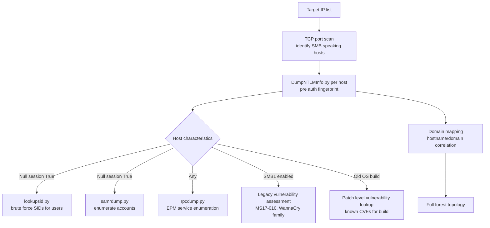
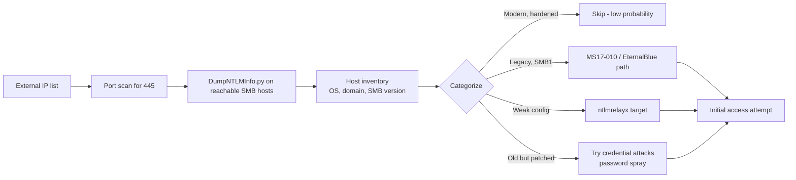

title: "DumpNTLMInfo.py"
script: "examples/DumpNTLMInfo.py"
category: "Recon and Enumeration"
status: "Published"
protocols:
  - SMB
  - NTLM
  - MS-SMB2
  - MS-RPCE
ms_specs:
  - MS-SMB2
  - MS-RPCE
  - MS-NLMP
mitre_techniques:
  - T1590.005
  - T1592.002
  - T1082
  - T1018
auth_types:
  - None (pre auth)
tags:
  - impacket
  - impacket/examples
  - category/recon_and_enumeration
  - status/published
  - protocol/smb
  - protocol/ntlm
  - protocol/ms-smb2
  - protocol/ms-rpce
  - ms-spec/ms-smb2
  - ms-spec/ms-rpce
  - ms-spec/ms-nlmp
  - technique/pre_auth_recon
  - technique/ntlm_negotiation_disclosure
  - technique/av_pairs_parsing
  - technique/no_credentials_required
  - mitre/T1590.005
  - mitre/T1592.002
  - mitre/T1082
  - mitre/T1018
aliases:
  - DumpNTLMInfo
  - dumpntlm
  - ntlm-info-dump
  - pre-auth-host-fingerprint
  - smb-negotiate-recon


# DumpNTLMInfo.py

> **One line summary:** Pre authentication reconnaissance primitive that extracts rich host identity information from a target SMB server by initiating the NTLM authentication handshake (sending NEGOTIATE then SESSION_SETUP with an NTLM Type 1 negotiate message) and parsing the **NTLM Type 2 challenge response** for its embedded AV_PAIRS target information fields and Version structure, all without supplying credentials and without completing authentication; from the single command `python DumpNTLMInfo.py 192.168.1.63`, the tool prints the SMB dialect (SMB 1.0 / 2.0.2 / 2.1 / 3.0 / 3.0.2 / 3.1.1), security flag state (SIGNING_ENABLED, SIGNING_REQUIRED - raw flag presentation intentionally distinct from CrackMapExec's True/False parsing), maximum read and write sizes, server current time and boot time (via FileTime conversion), NetBIOS hostname (NTLMSSP_AV_HOSTNAME), NetBIOS domain (NTLMSSP_AV_DOMAINNAME), forest DNS tree name (NTLMSSP_AV_DNS_TREENAME), Active Directory DNS domain name (NTLMSSP_AV_DNS_DOMAINNAME), DNS hostname (NTLMSSP_AV_DNS_HOSTNAME), and a decoded OS version string of form "Windows NT X.Y Build Z" extracted from the 8-byte version field of the NTLM challenge; authored by **Alex Romero (`@NtAlexio2`, Packet Phantom)** who also authored net.py (PR #1382) and eventlog.py; the tool originated as `dumpntlm.py` in PR #1523 against Impacket and was **renamed during PR review to `DumpNTLMInfo.py` to prevent confusion with hash dumping tools** (the tool does NOT dump NTLM hashes, only NTLM negotiation information); shipped in Impacket 0.11.0 (August 2023) alongside the nmapAnswerMachine.py deprecation; works against SMB 1, 2, and 3 dialects including legacy SMB1 and modern SMB3.1.1; the source ToDo lists MSSQL support and "find new protocols using NTLM for authentication in network" as planned extensions (not yet implemented); **continues Recon and Enumeration at 12 of 17 articles (71%), with five stubs remaining (`getArch.py`, `Get-GPPPassword.py`, `GetLAPSPassword.py`, `machine_role.py`, and one more to confirm) before the category closes as the 13th and final complete category for the wiki at 100% completion**.

| Field | Value |
|:---|:---|
| Script | `examples/DumpNTLMInfo.py` |
| Category | Recon and Enumeration |
| Status | Published |
| Author | Alex Romero (`@NtAlexio2`, "Packet Phantom"); also authored net.py (PR #1382) and eventlog.py |
| Original name | `dumpntlm.py` - renamed during PR review to avoid confusion with hash dumping tools |
| First appearance in Impacket | **0.11.0** (August 2023) via PR #1523 |
| Primary protocol | SMB (1, 2, or 3) with NTLM authentication negotiation |
| Primary Microsoft specifications | `[MS-SMB2]` SMB 2 and 3 Protocol; `[MS-RPCE]` referenced in source header; `[MS-NLMP]` NT LAN Manager Authentication Protocol (the AV_PAIRS structure) |
| MITRE ATT&CK techniques | T1590.005 Gather Victim Network Information: IP Addresses; T1592.002 Gather Victim Host Information: Software; T1082 System Information Discovery; T1018 Remote System Discovery |
| Authentication required | **None** - pre auth tool, extracts information from the negotiation phase before credential submission |
| Invocation | `python DumpNTLMInfo.py <target_ip_or_hostname>` - single positional argument |
| Null Session detection | Yes - reports "True" or "False" based on whether anonymous authentication succeeds |


## Prerequisites

This article assumes familiarity with:

- **SMB protocol dialects**: SMB 1.0 (deprecated but still supported by many hosts), SMB 2.0.2, SMB 2.1, SMB 3.0, SMB 3.0.2, SMB 3.1.1 (current). Each dialect has its own negotiate response structure.
- **NTLM authentication flow**: the three message handshake (Type 1 NEGOTIATE, Type 2 CHALLENGE, Type 3 AUTHENTICATE). DumpNTLMInfo.py completes only the first two steps, never submitting the Type 3 authentication response.
- **NTLM AV_PAIRS structure**: the target information field in Type 2 messages, consisting of ID length value records identified by AV IDs like NTLMSSP_AV_HOSTNAME, NTLMSSP_AV_DOMAINNAME, NTLMSSP_AV_DNS_*, etc.
- **Version encoding in NTLM**: an 8-byte structure embedded in Type 2 messages (when `NEGOTIATE_VERSION` flag is set in Type 1) containing ProductMajorVersion (1 byte), ProductMinorVersion (1 byte), ProductBuild (2 bytes little endian), and a reserved/NTLMRevisionCurrent block.
- [`smbclient.py`](../05_smb_tools/smbclient.md) for SMB connection basics.
- [`lookupsid.py`](lookupsid.md) and [`rpcdump.py`](rpcdump.md) for other pre authentication enumeration primitives. DumpNTLMInfo is the newest member of this family.


## What it does

`DumpNTLMInfo.py` performs a minimal SMB handshake designed specifically to extract everything the server reveals about itself during NTLM negotiation, then walks away cleanly without ever submitting credentials.

### The default invocation

```text
$ python DumpNTLMInfo.py 192.168.1.63
Impacket v0.11.0 - Copyright Fortra, LLC and its affiliated companies
[+] Dialect         : SMB 3.0
[+] Security        : SIGNING_ENABLED
[+] Max Read Size   : 8.0 MB (8388608 bytes)
[+] Max Write Size  : 8.0 MB (8388608 bytes)
[+] Current Time    : 2026-04-22 15:42:27.121853+00:00
[+] Boot Time       : 2026-04-20 08:14:52.345621+00:00
[+] Name            : DESKTOP-4VNEBGO
[+] Domain          : CORP
[+] DNS Tree Name   : corp.local
[+] DNS Domain Name : corp.local
[+] DNS Host Name   : DESKTOP-4VNEBGO.corp.local
[+] OS              : Windows NT 10.0 Build 22000
[+] Null Session    : False
```

Each line represents information the target SMB server volunteered during the negotiate and session setup exchange. No credentials were submitted; the tool connected, completed the dialect negotiation, initiated NTLM Type 1, received NTLM Type 2, parsed the AV_PAIRS and version structure, and disconnected.

### What each field tells you

- **Dialect**: the highest SMB dialect the server supports. SMB 3.1.1 means modern Windows 10+/Server 2016+. SMB 2.0.2 means Windows Server 2008+ era. SMB 1.0 means legacy, deprecated, often an audit finding in itself.
- **Security**: the security mode flags presented by the server. The article documents (honestly, per the PR review discussion) that these are shown as raw flags: `SIGNING_ENABLED` means signing is available but the server may not require it. `SIGNING_REQUIRED` means signing is mandatory. The distinction matters: a CrackMapExec style True/False summary collapses these into "signing: True" when the actual situation is more nuanced.
- **Max Read/Write Size**: buffer sizes the server advertises. 8 MB is typical for modern SMB 3.x; 64 KB is common for older SMB 1.
- **Current Time** and **Boot Time**: decoded from the server's `SystemTime` and `ServerStartTime` FileTime values in the negotiate response. Useful for: time synchronization verification (Kerberos requires ~5 min clock skew or less), uptime analysis (high uptime on a DC may indicate missed patches), timezone identification.
- **Name**: the NetBIOS computer name.
- **Domain**: the NetBIOS domain name. For workgroup machines this is the local machine name; for domain members this is the short (older than Windows 2000) domain name.
- **DNS Tree Name**, **DNS Domain Name**: Active Directory forest root domain and the machine's domain. For many environments these are identical (single domain forest); for multi domain forests they differ.
- **DNS Host Name**: fully qualified DNS name (NetBIOS hostname + DNS domain).
- **OS**: parsed from the 8-byte version field. Maps to Windows versions via the major.minor.build triple. Build 22000 = Windows 11 22H2 or Server 2022; Build 14393 = Server 2016; Build 9600 = Server 2012 R2; etc.
- **Null Session**: whether the server accepted an anonymous (null) authentication. `True` means SMB null sessions are enabled (typically a finding on modern hardened systems where this should be disabled); `False` means anonymous access is rejected.

### The pre authentication aspect

The remarkable thing about this output is that it was produced without any credentials:

```bash
# No username, no password, no hash, no ticket, nothing
python DumpNTLMInfo.py 192.168.1.63
```

The tool only needs TCP reachability to SMB port 445 (or SMB1's NetBIOS ports). Every piece of information shown is volunteered by the server before the caller is required to prove identity. This makes DumpNTLMInfo.py the most information rich pre authentication reconnaissance primitive in the Impacket toolkit.

### Renamed during PR review

The tool was originally submitted as `dumpntlm.py` in PR #1523. During review, a maintainer noted:

> Might be worth renaming it to something like DumpNTLMInfo.py - It could possibly mislead people to believe this is dumping NTLM hashes somehow.

The author agreed and renamed the file. This matters operationally: the tool does NOT dump NTLM hashes, does NOT crack credentials, does NOT extract stored passwords. It dumps NTLM **negotiation information** - the metadata the server reveals during the handshake.

This distinction separates DumpNTLMInfo.py from tools like secretsdump.py (which DOES dump NTLM hashes but requires admin credentials). Beginners sometimes conflate the two based on name similarity; the renaming was explicitly to prevent this confusion.


## Why it exists

### The information gap in pre authentication reconnaissance

Before DumpNTLMInfo.py, the available pre authentication information gathering tools each provided partial pieces:

- [`lookupsid.py`](lookupsid.md): SID brute force to enumerate user and group names when the target allows unauthenticated SAMR access. Rich user/group data; nothing about the host itself.
- [`rpcdump.py`](rpcdump.md): Endpoint Mapper enumeration. Rich RPC service data; limited host identity data.
- [`samrdump.py`](samrdump.md): SAM enumeration. Rich account data when accessible; again nothing about the host.
- **Nmap `smb-os-discovery` NSE script**: host OS inference from SMB negotiate responses. Similar data to DumpNTLMInfo.py but part of a larger toolchain, not a dedicated tool.

The gap: there was no Impacket-native tool dedicated to the rich host identity information that SMB servers volunteer during negotiation. DumpNTLMInfo.py fills that gap.

### What the negotiation volunteer

The SMB and NTLM design deliberately includes identity information in the negotiation phase because:

- **Client dialect selection** needs to know the server's capabilities (Max Read/Write Sizes, supported dialects).
- **Time synchronization** for Kerberos requires server time awareness.
- **AV_PAIRS target information** allows the client to verify it's talking to the expected server (via Target Name checks).
- **Version disclosure** historically aided client compatibility decisions.

The information is there by design, not by accident. DumpNTLMInfo.py's contribution is packaging the extraction into a single command tool with clean output.

### Why ship it in Impacket

DumpNTLMInfo.py exists in Impacket because:

- Impacket already has the SMB and NTLM protocol implementations (`impacket.smb`, `impacket.nmb`, `impacket.ntlm`).
- The AV_PAIRS parsing class (`impacket.ntlm.AV_PAIRS`) already exists.
- A working example demonstrating pre authentication enumeration via these primitives is pedagogically valuable.
- For operators running Linux-based penetration tests or assessments, Impacket is the standard toolkit; having the tool in Impacket means no additional dependencies.

NtAlexio2 contributed the tool upstream (PR #1523) rather than keeping it as a personal script because the pattern (SMB negotiate, parse NTLM challenge, extract AV_PAIRS) is broadly applicable and reusable.

### The operational use cases

Practical scenarios where DumpNTLMInfo.py is the right tool:

- **Initial enumeration phase of a penetration test**: quickly fingerprint every SMB speaking host on a target network without credentials, producing a hostname and domain inventory.
- **Baseline check on a discovered host**: confirm what OS and domain membership a newly discovered host has before committing to exploit attempts.
- **External reconnaissance (with caveats)**: SMB often isn't exposed externally, but when it is (historically, Windows servers with public SMB ports), this tool provides rich identification.
- **Null session detection**: finding targets where SMB null sessions are still allowed (increasingly rare on modern hardened systems but common in legacy environments).
- **Domain mapping from limited access**: even from an unauthenticated perspective, DumpNTLMInfo.py reveals the target's domain membership, which is useful for building domain topology maps.
- **Host patch level assessment**: OS build number tells you the patch family. Build 19045 is a specific Windows 10 22H2 build with known patch level.

The tool is particularly useful in the initial reconnaissance phase where you have a list of IPs but don't yet know which are Windows, which are domain joined, which run obsolete versions.


## Protocol theory

### SMB negotiate exchange

SMB connections begin with a negotiate exchange where the client and server agree on a dialect. The client sends a list of supported dialects; the server picks the highest it supports and responds with its capabilities.

For SMB 2/3:

```text
Client → Server: SMB2 NEGOTIATE Request
  - Dialects list: [0x0202, 0x0210, 0x0300, 0x0302, 0x0311]
  - Capabilities, ClientGuid, SecurityMode flags

Server → Client: SMB2 NEGOTIATE Response
  - DialectRevision: 0x0311 (selected, e.g. SMB 3.1.1)
  - SecurityMode: signing flags
  - MaxTransactSize, MaxReadSize, MaxWriteSize
  - SystemTime (FileTime)
  - ServerStartTime (FileTime)
  - SecurityBuffer containing SPNEGO token
```

The SecurityBuffer typically contains an SPNEGO token offering NTLM (or Kerberos or both). DumpNTLMInfo.py uses this to move to the NTLM phase.

For SMB 1:

```text
Client → Server: SMB_COM_NEGOTIATE (with NTLM dialect string)
Server → Client: SMB_COM_NEGOTIATE_RESPONSE
  - ServerTime
  - Various capability flags
```

SMB 1 negotiate is similar but uses the older protocol structures. DumpNTLMInfo.py handles both paths.

### NTLM session setup and Type 1/2 messages

After dialect selection, the client initiates session setup with an NTLM Type 1 (NEGOTIATE) message:

```text
Client → Server: SESSION_SETUP with NTLM Type 1
  - NegotiateFlags (including NEGOTIATE_VERSION to request version info)
  - DomainName (empty, we don't claim a domain)
  - Workstation (empty)

Server → Client: SESSION_SETUP Response with NTLM Type 2
  - NegotiateFlags (server's supported flags)
  - ServerChallenge (8 bytes, random)
  - TargetName (server's domain or computer name)
  - TargetInfo (AV_PAIRS structure - the rich identity data)
  - Version (8 bytes - OS version if NEGOTIATE_VERSION was negotiated)
```

The Type 2 message is where the target information lives. The client would normally respond with Type 3 (AUTHENTICATE) containing the computed NTLM response, but DumpNTLMInfo.py stops here - it extracts the data and disconnects.

### AV_PAIRS structure

The `TargetInfo` field in NTLM Type 2 messages contains an AV_PAIRS structure: a sequence of `{AvId (2 bytes), AvLen (2 bytes), Value (AvLen bytes)}` records terminated by an `MsvAvEOL` (AvId = 0) record.

The AV IDs relevant to DumpNTLMInfo.py:

| AV ID | Numeric | Content |
|:---|:---||
| `MsvAvEOL` | 0 | End marker |
| `MsvAvNbComputerName` = `NTLMSSP_AV_HOSTNAME` | 1 | NetBIOS server name (UTF-16LE) |
| `MsvAvNbDomainName` = `NTLMSSP_AV_DOMAINNAME` | 2 | NetBIOS domain name (UTF-16LE) |
| `MsvAvDnsComputerName` = `NTLMSSP_AV_DNS_HOSTNAME` | 3 | DNS FQDN of the server (UTF-16LE) |
| `MsvAvDnsDomainName` = `NTLMSSP_AV_DNS_DOMAINNAME` | 4 | DNS domain name (UTF-16LE) |
| `MsvAvDnsTreeName` = `NTLMSSP_AV_DNS_TREENAME` | 5 | DNS forest tree name (UTF-16LE) |
| `MsvAvFlags` | 6 | Flags (various) |
| `MsvAvTimestamp` | 7 | Server time (FileTime) |
| `MsvAvSingleHost` | 8 | SingleHost structure (for channel binding) |
| `MsvAvTargetName` | 9 | SPN of the server |
| `MsvChannelBindings` | 10 | Channel binding hash |

DumpNTLMInfo.py parses each of these (where present) and prints the decoded string. The `impacket.ntlm.AV_PAIRS` class handles the ID length value parsing; the tool iterates known IDs and decodes UTF-16LE strings.

### Version structure

When the client sets `NEGOTIATE_VERSION` in its Type 1 NegotiateFlags, the server responds with its `Version` field populated (8 bytes):

```text
Offset 0: ProductMajorVersion (1 byte)  - e.g. 10
Offset 1: ProductMinorVersion (1 byte)  - e.g. 0
Offset 2: ProductBuild (2 bytes LE)     - e.g. 22000 (0x55F0 LE)
Offset 4: Reserved (3 bytes)            - zero
Offset 7: NTLMRevisionCurrent (1 byte)  - 15 for NTLMv2
```

DumpNTLMInfo.py formats this as "Windows NT X.Y Build Z":

```python
print("[+] OS : {}".format(
    "Windows NT %d.%d Build %d" % (
        indexbytes(version, 0),
        indexbytes(version, 1),
        struct.unpack('<H', version[2:4])[0]
    )
))
```

The Windows version mapping:

| NT Version | Client | Server |
|:---|:---||
| 5.1 | Windows XP | - |
| 5.2 | - | Server 2003 / R2 |
| 6.0 | Vista | Server 2008 |
| 6.1 | 7 | Server 2008 R2 |
| 6.2 | 8 | Server 2012 |
| 6.3 | 8.1 | Server 2012 R2 |
| 10.0 Build 10240-19045 | Windows 10 (various feature updates) | - |
| 10.0 Build 14393 | - | Server 2016 |
| 10.0 Build 17763 | - | Server 2019 |
| 10.0 Build 20348 | - | Server 2022 |
| 10.0 Build 22000+ | Windows 11 | Server 2022 (recent) |

For each build, there's a corresponding patch level that determines vulnerability exposure.

### FileTime conversion

Windows `FILETIME` is a 64-bit value representing 100-nanosecond intervals since January 1, 1601 UTC. DumpNTLMInfo.py converts this to a Python `datetime`:

```python
def __filetime_to_dt(self, ft):
    # FileTime -> datetime conversion
    us = (ft - 116444736000000000) // 10  # shift epoch to 1970
    return datetime(1970, 1, 1) + timedelta(microseconds=us)
```

The `116444736000000000` is the number of 100-ns intervals between 1601 and 1970 epochs. Converting to microseconds and adding to Unix epoch gives Python datetime. Final `astimezone(timezone.utc)` normalizes to UTC for display.

### Null session handling

The tool separately tests null session capability by attempting SESSION_SETUP with empty credentials:

```text
Client → Server: SESSION_SETUP with empty username, empty password
Server → Client: STATUS_SUCCESS (null session allowed) OR
                  STATUS_LOGON_FAILURE (null session denied)
```

Modern Windows rejects null sessions by default. Legacy Windows (Server 2003 and earlier) often allowed them. The `Null Session: True/False` line in the output reflects this test.

### Why no credentials are needed

The NTLM Type 1 → Type 2 exchange is inherently a "server volunteers info, client hasn't committed to anything yet" phase. The protocol design assumes the client will complete the authentication with a valid Type 3 response, but there's no technical requirement forcing the client to continue. A client that sends Type 1, receives Type 2, extracts the information, and disconnects leaves the server with a half completed session that eventually times out.

This is why DumpNTLMInfo.py works without credentials: it exploits the information disclosure that occurs before authentication is required. The design is not a vulnerability in the usual sense - it's how the protocol works. Hardening typically focuses on reducing what's in the AV_PAIRS (e.g., not advertising the DNS forest name) rather than requiring pre authentication.


## How the tool works internally

### Imports and structure

```python
import os, sys, argparse, logging, struct, socket
import math, string, random
from six import indexbytes
from datetime import datetime, timedelta, timezone

from impacket import version, nmb, ntlm
from impacket.examples import logger
from impacket.smb import SMB, NewSMBPacket, SMBCommand, ...
from impacket.smb3 import SMB3
from impacket.smbconnection import SMBConnection
```

Key imports:
- `impacket.nmb` - NetBIOS name service for SMB1 path.
- `impacket.ntlm` - the `AV_PAIRS` parser and NTLM constants.
- `impacket.smb` and `impacket.smb3` - SMB1 and SMB2/3 implementations.
- `impacket.smbconnection.SMBConnection` - the unified SMB connection wrapper that handles dialect selection.

### Main flow

Pseudocode of the core logic:

```python
def dump(target):
    # Step 1: Establish SMB connection with dialect negotiation
    smbConn = SMBConnection(target, target)
    
    # Step 2: Print dialect
    dialect = smbConn.getDialect()
    print("[+] Dialect : %s" % format_dialect(dialect))
    
    # Step 3: Parse negotiate response for capabilities
    negotiateResponse = smbConn.getSMBServer()._Connection['NegotiateResponse']
    print("[+] Security : %s" % format_security_flags(negotiateResponse))
    print("[+] Max Read Size : %s" % format_size(negotiateResponse['MaxReadSize']))
    print("[+] Max Write Size : %s" % format_size(negotiateResponse['MaxWriteSize']))
    print("[+] Current Time : %s" % filetime_to_dt(negotiateResponse['SystemTime']))
    print("[+] Boot Time : %s" % filetime_to_dt(negotiateResponse['ServerStartTime']))
    
    # Step 4: Initiate NTLM Type 1 to get Type 2 response
    challenge = smbConn.sendNegotiate()
    
    # Step 5: Parse AV_PAIRS from challenge target info
    av_pairs = ntlm.AV_PAIRS(challenge['TargetInfoFields'][:challenge['TargetInfoFields_len']])
    
    # Step 6: Print each relevant AV_PAIR
    if av_pairs[ntlm.NTLMSSP_AV_HOSTNAME] is not None:
        print("[+] Name : %s" % av_pairs[ntlm.NTLMSSP_AV_HOSTNAME][1].decode('utf-16le'))
    if av_pairs[ntlm.NTLMSSP_AV_DOMAINNAME] is not None:
        print("[+] Domain : %s" % av_pairs[ntlm.NTLMSSP_AV_DOMAINNAME][1].decode('utf-16le'))
    if av_pairs[ntlm.NTLMSSP_AV_DNS_TREENAME] is not None:
        print("[+] DNS Tree Name : %s" % av_pairs[ntlm.NTLMSSP_AV_DNS_TREENAME][1].decode('utf-16le'))
    if av_pairs[ntlm.NTLMSSP_AV_DNS_DOMAINNAME] is not None:
        print("[+] DNS Domain Name : %s" % av_pairs[ntlm.NTLMSSP_AV_DNS_DOMAINNAME][1].decode('utf-16le'))
    if av_pairs[ntlm.NTLMSSP_AV_DNS_HOSTNAME] is not None:
        print("[+] DNS Host Name : %s" % av_pairs[ntlm.NTLMSSP_AV_DNS_HOSTNAME][1].decode('utf-16le'))
    
    # Step 7: Parse version field
    version_bytes = challenge['Version']
    os_string = "Windows NT %d.%d Build %d" % (
        indexbytes(version_bytes, 0),
        indexbytes(version_bytes, 1),
        struct.unpack('<H', version_bytes[2:4])[0]
    )
    print("[+] OS : %s" % os_string)
    
    # Step 8: Test null session capability
    try:
        smbConn.login('', '')
        print("[+] Null Session : True")
    except:
        print("[+] Null Session : False")
    
    # Step 9: Disconnect cleanly
    smbConn.logoff()
    smbConn.close()
```

Real implementation has additional error handling and edge cases (e.g., servers that don't set NEGOTIATE_VERSION or don't include all AV_PAIRS), but the architecture is exactly that.

### SMB1 special handling

SMB1 uses a different negotiate structure. The tool detects SMB1 and follows the older code path:

```python
if dialect == SMB_DIALECT:
    # SMB1 path
    smb1Conn = SMB(target, target)
    # Use SMBSessionSetupAndX_Extended messages
    # ...
else:
    # SMB2/3 path (above)
```

The SMB1 path is kept for legacy target coverage. Modern networks rarely have SMB1 hosts, but vulnerability assessments sometimes encounter them.

### The flag presentation design decision

The PR review discussion around this tool is notable for a design debate:

> @Sanmopre: "For somebody who's coming from cme, it is actually a bit of confusing to see SIGNING_ENABLED when it is possible to establish a unsigned connection."
> @NtAlexio2: "DumpNTLMInfo.py shows all the flags as they are, for security options and don't parse them as True/False (like crackmapexec). This means SIGNING_ENABLED doesn't mean signing is required. because there is another SIGNING_REQUIRED flag."

This is a deliberate design choice. CrackMapExec (and its successor NetExec) parse security flags into booleans like `Signing: True/False` which sometimes obscures the distinction. DumpNTLMInfo.py shows the raw flags (SIGNING_ENABLED, SIGNING_REQUIRED, etc.) which is more accurate but requires the operator to understand the flag meanings.

For blue team readers coming from NetExec output, the DumpNTLMInfo.py output can seem misleading if they assume "SIGNING_ENABLED = signing is required." The article includes this nuance explicitly to prevent misinterpretation.

### What the tool does NOT do

- Does NOT dump NTLM hashes. The name is historically "DumpNTLMInfo" specifically because the original `dumpntlm.py` name caused confusion about this. Use secretsdump.py for actual hash dumping.
- Does NOT complete authentication. Type 3 is never sent.
- Does NOT support MSSQL, HTTP, LDAP, or other NTLM-using protocols yet. Source ToDo lists MSSQL and "find new protocols using NTLM for authentication in network" as planned extensions.
- Does NOT attempt credential based enumeration if null session fails. This is strictly pre auth.
- Does NOT parse all AV_PAIRS fields. Timestamps (MsvAvTimestamp), channel binding (MsvChannelBindings), and single host (MsvAvSingleHost) are skipped.
- Does NOT handle IPv6 as first class. Target argument can be IPv6 but some code paths assume IPv4.
- Does NOT scan multiple hosts. Single target per invocation; use shell loop for multi host.
- Does NOT output machine readable formats (JSON/CSV) natively. Readable by humans stdout only.
- Does NOT integrate with BloodHound or other graph tools.
- Does NOT test specific SMB dialects individually. Lets the server select the highest common dialect. To test specific older dialects, modify the source or use nmap's `smb-os-discovery` with `--script-args smb.max-dialect=0x210`.
- Does NOT detect or report SMB signing misconfigurations beyond showing the flags. Interpretation is the operator's responsibility.
- Does NOT support authenticated version (providing credentials to get more info). Pre auth only.


## Practical usage

### Basic host fingerprinting

```bash
python DumpNTLMInfo.py 192.168.1.63
```

One target, full output, ~1-2 seconds to complete.

### Bulk reconnaissance across a network

Shell loop pattern for scanning a subnet:

```bash
# Scan a /24 for SMB speaking hosts and fingerprint each
for ip in 192.168.1.{1..254}; do
    if timeout 2 bash -c "echo > /dev/tcp/$ip/445" 2>/dev/null; then
        echo "=== $ip ==="
        python DumpNTLMInfo.py $ip 2>&1 | grep -E "^\[\+\]"
    fi
done | tee netfingerprint.txt
```

This produces a concatenated fingerprint of every SMB host on the subnet. Useful for initial phase reconnaissance.

### Parsing output for specific fields

```bash
# Extract just the domain names to identify domain membership
for ip in $(cat targets.txt); do
    domain=$(python DumpNTLMInfo.py $ip 2>/dev/null | grep "DNS Domain Name" | awk -F': ' '{print $2}')
    echo "$ip -> $domain"
done
```

Output format lends itself to simple grep/awk parsing.

### Finding legacy SMB1 hosts

```bash
# Fingerprint all hosts, flag ones running SMB 1
for ip in $(cat targets.txt); do
    dialect=$(python DumpNTLMInfo.py $ip 2>/dev/null | grep "Dialect" | awk '{print $NF}')
    if [[ "$dialect" == "1.0" || "$dialect" == "SMB" ]]; then
        echo "LEGACY SMB1: $ip"
    fi
done
```

SMB 1 on a modern network is typically an audit finding (WannaCry class vulnerability risk, among others).

### Combining with null session discovery

```bash
# Find hosts allowing null sessions (increasingly rare on modern networks)
for ip in $(cat targets.txt); do
    null_sess=$(python DumpNTLMInfo.py $ip 2>/dev/null | grep "Null Session" | awk '{print $NF}')
    if [[ "$null_sess" == "True" ]]; then
        echo "NULL SESSION ALLOWED: $ip"
    fi
done
```

Hosts allowing null sessions are candidates for lookupsid.py and samrdump.py anonymous enumeration.

### Domain topology mapping

```bash
# Build a map of hostname -> domain from fingerprints
python DumpNTLMInfo.py 192.168.1.63 | awk '
    /^\[\+\] Name/ {hostname=$NF}
    /^\[\+\] DNS Domain Name/ {domain=$NF; print hostname " in " domain}
'
```

Aggregating across many hosts reveals forest structure: machines in `finance.corp.local` vs `engineering.corp.local` suggest a multi domain forest.

### Patch level triage

```bash
# Extract OS build numbers for patch level analysis
for ip in $(cat targets.txt); do
    os=$(python DumpNTLMInfo.py $ip 2>/dev/null | grep "^\[\+\] OS")
    echo "$ip : $os"
done | sort | uniq -c | sort -rn
```

Groups hosts by OS build. Old builds (Windows 10 1809 = Build 17763 if running 10 Client) may have well known unpatched vulnerabilities.

### Integration in pentesting workflow

```bash
# Phase 1: DumpNTLMInfo fingerprinting
python DumpNTLMInfo.py 192.168.1.50 > host_info.txt

# Phase 2: Extract domain from fingerprint
DOMAIN=$(grep "DNS Domain Name" host_info.txt | awk -F': ' '{print $2}')

# Phase 3: Domain aware follow up enumeration
lookupsid.py "$DOMAIN/guest:@192.168.1.50"    # if null session works
rpcdump.py 192.168.1.50                        # endpoint mapper
samrdump.py "$DOMAIN/guest:@192.168.1.50"      # SAMR enumeration
```

DumpNTLMInfo.py's output feeds directly into parameter values for subsequent tools. This is its operational role: the first contact fingerprint that informs what enumeration paths are worth pursuing.

### Key flags

| Flag | Meaning |
|:---|:---|
| `target` (positional) | Target IP address or hostname. Required. No port specifier - defaults to SMB port 445 for SMB2/3, falls back to 139 for SMB1. |
| `-debug` | Verbose debug output for protocol level investigation. |
| `-ts` | Timestamp log lines. |

That's essentially the full interface. DumpNTLMInfo.py has an intentionally minimal CLI because the entire point is "give it one target and get the full story."


## What it looks like on the wire

### SMB2/3 path - typical modern target

```text
TCP handshake → target:445

[1] NEGOTIATE
Client → Server: SMB2 NEGOTIATE Request
    Dialects: [0x0202, 0x0210, 0x0300, 0x0302, 0x0311]
    NEGOTIATE_VERSION flag set
Server → Client: SMB2 NEGOTIATE Response
    DialectRevision: 0x0311 (SMB 3.1.1)
    SystemTime: FileTime
    ServerStartTime: FileTime
    MaxReadSize: 0x00800000
    MaxWriteSize: 0x00800000
    SecurityBuffer: SPNEGO token with NTLM

[2] SESSION_SETUP (NTLM Type 1)
Client → Server: SMB2 SESSION_SETUP Request
    SecurityBuffer: NTLMSSP Type 1 (NEGOTIATE) with NEGOTIATE_VERSION
Server → Client: SMB2 SESSION_SETUP Response (STATUS_MORE_PROCESSING_REQUIRED)
    SecurityBuffer: NTLMSSP Type 2 (CHALLENGE)
        TargetName: server domain
        TargetInfo: AV_PAIRS structure with all fields
        Version: 8 bytes (Windows NT X.Y Build Z)

[3] DISCONNECT
Client → Server: SMB2 TREE_DISCONNECT / LOGOFF / CLOSE
    (alternatively, TCP FIN without formal logoff)
```

The key packet is the SESSION_SETUP Response with the Type 2 CHALLENGE - that's where everything is extracted from.

### SMB1 path - legacy target

```text
TCP handshake → target:445 (or :139 for NetBIOS)

[1] NEGOTIATE
Client → Server: SMB_COM_NEGOTIATE
    Dialects: [NT LM 0.12]
Server → Client: SMB_COM_NEGOTIATE_RESPONSE
    ServerTime: SMBTime
    Capabilities, SecurityMode flags

[2] SESSION_SETUP_ANDX
Client → Server: SMB_COM_SESSION_SETUP_ANDX (Extended)
    SecurityBlob: NTLMSSP Type 1
Server → Client: SMB_COM_SESSION_SETUP_ANDX Response (STATUS_MORE_PROCESSING_REQUIRED)
    SecurityBlob: NTLMSSP Type 2

[3] DISCONNECT
```

Similar structure, older message format.

### Wireshark filtering

```text
smb2.cmd == 0 or smb2.cmd == 1
# smb2.cmd 0 = NEGOTIATE, 1 = SESSION_SETUP
```

Or focusing on the interesting bit:

```text
ntlmssp.messagetype == 2
# Type 2 CHALLENGE messages - the ones containing all the useful info
```

Wireshark automatically decodes the AV_PAIRS in its NTLMSSP dissector, making analysis of the captured traffic as informative as DumpNTLMInfo.py's output.

### Traffic volume

Per target: approximately 6-10 packets total (3-way TCP handshake, SMB NEGOTIATE request/response, SESSION_SETUP request/response, possibly LOGOFF request/response, TCP teardown). Total bytes typically 2-4 KB. Very low footprint - distinct from scans that do full port scanning.

### Stealth profile

DumpNTLMInfo.py is one of the stealthier reconnaissance tools in Impacket because:

- Single TCP connection to each target.
- No credentials submitted (no authentication events).
- No file shares accessed (no IPC$ mounting).
- No named pipes opened.
- Duration of a few seconds per target.

That said, "stealthy" doesn't mean "invisible" - see the logging section below. Modern EDR may still flag the NTLM negotiation pattern, especially if run across many hosts rapidly.


## What it looks like in logs

### Target Windows Security log

- **Event 4624** (logon): NOT generated for incomplete authentication. DumpNTLMInfo.py stops before sending Type 3, so no logon success event.
- **Event 4625** (logon failure): typically NOT generated since there's no credential submission that could fail. Some configurations may log session setup timeouts as auth related events.
- **Event 5140** (file share access): NOT generated - no share access occurs.
- **Event 5145** (detailed file share access): NOT generated.

This absence is significant: DumpNTLMInfo.py avoids leaving typical authentication audit trails because it never completes authentication. It still generates network connection events but not identity events.

### Windows Firewall/WFP logs

- **Event 5156** (WFP allow): if WFP auditing is enabled, the inbound SMB connection is logged.
- **Event 5157** (WFP block): if firewall blocks the connection, this event fires.

These are network layer events that fire regardless of application layer behavior.

### Sysmon logs

If Sysmon is deployed:

- **Event 3** (network connection): the inbound TCP connection from the scanning host is logged with source IP, process (if Sysmon configured to log all network connections), etc.

Sysmon's network event can correlate the source IP with process level activity on the source host (if Sysmon is also on the source), giving defenders attack chain visibility.

### EDR behavioral detection

Modern EDR products may flag:

- Pattern of incomplete NTLM handshakes from one source to many targets in a short window.
- Specific tooling signatures (some EDR vendors identify Impacket by network characteristics).
- Anomalous authentication abandonment rates (many Type 1 → Type 2 → disconnect patterns without Type 3).

Coverage varies significantly by vendor. Some EDR products focus on authentication success/failure events and miss pre auth reconnaissance entirely; others specifically monitor NTLM negotiation patterns.

### Network side detection

IDS/NDR products can detect:

- High volume of SMB connections from one source to many destinations without subsequent file activity.
- NTLMSSP Type 1 messages without corresponding Type 3 responses (authentication abandonment).
- Pattern matching known tool signatures.

Network side detection is often more effective than host side for this tool because the activity is lightweight on any single host but distinctive when viewed across many hosts.

### Sigma rule example

```yaml
title: SMB Pre-Authentication Enumeration Pattern
logsource:
  product: windows
  category: network_connection
detection:
  smb_connection:
    DestinationPort: 445
    Direction: inbound
  threshold_many_targets:
    DistinctDestinationIp: '> 10'
    SourceIp: single
    timeframe: 30s
  condition: smb_connection and threshold_many_targets
level: low
```

Low severity because legitimate enumeration tools (network scanners, vulnerability scanners, SCCM discovery) can produce similar patterns. Context matters for distinguishing malicious vs benign.


## Detection and defense

### Detection approach

- **Network volume monitoring**: many short SMB connections from one source to many targets is the signature. Single target enumeration is easily lost in background noise; bulk enumeration is detectable.
- **NTLM handshake abandonment detection**: Type 1 → Type 2 → no Type 3 pattern is distinctive. Some NDR products specifically track this ratio.
- **EDR behavioral analysis**: tool specific signatures where available.
- **Honeypot SMB servers**: decoy SMB services logging all connection attempts; DumpNTLMInfo.py activity shows up as benign looking SMB connections from unusual sources.

### Preventive controls

The information DumpNTLMInfo.py extracts is **disclosed by design** in the SMB and NTLM protocols. Complete prevention requires protocol changes; partial mitigation is possible:

- **Disable SMB 1**: legacy protocol with worse security properties. `Disable-WindowsOptionalFeature -Online -FeatureName SMB1Protocol` on Windows 10/Server 2016+.
- **Enforce SMB signing**: reduces relay attack surface but doesn't prevent pre auth info disclosure. Group Policy `Microsoft network server: Digitally sign communications (always)`.
- **Restrict SMB to network segments**: workstations shouldn't typically need SMB inbound. Firewall rules block TCP 445 from workstation subnets to other workstation subnets.
- **Disable NetBIOS over TCP/IP**: reduces SMB 1 attack surface on modern Windows.
- **`LmCompatibilityLevel` registry setting**: set to 5 (send NTLMv2 responses only, refuse LM and NTLM) to harden NTLM authentication itself.
- **Hide unnecessary information**: some NTLM AV_PAIRS fields can be suppressed via advanced configuration, but broad visibility into hostname and domain is difficult to eliminate without breaking functionality.
- **SMB over QUIC** (Windows Server 2022+): uses TLS 1.3, hiding some metadata. Limited deployment currently.

### Accepting the risk

For most environments, the full elimination of DumpNTLMInfo.py-class information disclosure isn't practical. Instead, defenders accept:

- Attackers can fingerprint Windows hosts pre authentication.
- Operational value comes from hardening post fingerprinting steps: strong authentication, least privilege, network segmentation, EDR coverage for actual credential abuse rather than just reconnaissance.

This "reconnaissance is easy, exploitation is hard" stance is broadly the modern defensive posture for protocols that leak metadata by design.

### What DumpNTLMInfo.py does NOT enable

- Does NOT achieve initial access.
- Does NOT bypass authentication.
- Does NOT compromise credentials.
- Does NOT install persistence.
- Does NOT exfiltrate files or data beyond what the server volunteers in the negotiate phase.
- Does NOT dump NTLM hashes despite misconceptions from the original `dumpntlm.py` name.

### What DumpNTLMInfo.py CAN enable

- **Reconnaissance for downstream attacks**: hostname, domain, and OS version inform follow up targeting.
- **Attack surface mapping**: SMB1 hosts, null session allowed hosts, old OS builds.
- **Domain topology inference**: from many hosts, infer forest structure.
- **Patch level assessment**: OS build numbers correlate to known vulnerable patch levels.

The tool is a reconnaissance primitive, not an exploit. Its output enables better targeted subsequent activity but doesn't directly compromise anything.


## Related tools and attack chains

DumpNTLMInfo.py **continues Recon and Enumeration at 12 of 17 articles (71%)**. Five stubs remain (`getArch.py`, `Get-GPPPassword.py`, `GetLAPSPassword.py`, `machine_role.py`, and one more) before the category closes as the 13th and final complete category.

### Related Impacket tools

- [`lookupsid.py`](lookupsid.md) - SID brute force for user enumeration. Also pre auth capable when null session works. DumpNTLMInfo.py identifies whether null session is available; lookupsid.py exploits it.
- [`rpcdump.py`](rpcdump.md) - Endpoint Mapper enumeration. Another pre auth primitive targeting different information (RPC services vs NTLM info).
- [`rpcmap.py`](rpcmap.md) - RPC interface characterization. Requires authentication in most modern configurations; DumpNTLMInfo.py is the unauthenticated sibling.
- [`samrdump.py`](samrdump.md) - SAMR enumeration. Works with null session or authenticated; DumpNTLMInfo.py's Null Session output tells you which mode to try.
- [`smbclient.py`](../05_smb_tools/smbclient.md) - authenticated SMB client. Complementary: DumpNTLMInfo fingerprints pre auth; smbclient interacts post auth.
- [`ntlmrelayx.py`](../06_relay_attacks/ntlmrelayx.md) - NTLM relay. The same NTLM protocol DumpNTLMInfo.py passively queries is what ntlmrelayx actively relays.

### External alternatives

- **Nmap `smb-os-discovery` NSE script**: similar information from the same protocol primitive. Nmap integrates it into broader scanning workflows. `nmap -p445 --script smb-os-discovery <target>`.
- **Nmap `smb2-security-mode` NSE script**: focuses specifically on SMB2 security mode (signing flags). More limited than DumpNTLMInfo.py but useful for mass scans.
- **NetExec / CrackMapExec `--gen-relay-list`** and similar modes: produce signing-related output across many hosts. Simpler output format (True/False) vs DumpNTLMInfo.py's raw flags.
- **Metasploit `auxiliary/scanner/smb/smb_version`** module: similar information gathering, integrated into Metasploit workflow.
- **responder style tools**: some passive collection tools extract similar info from observed NTLM traffic without initiating connections. Different operational model.
- **Custom Scapy/Impacket scripts**: operators can write custom NTLM negotiation tools using `impacket.ntlm` directly. DumpNTLMInfo.py is one ready made example.

For **single target deep fingerprinting**, DumpNTLMInfo.py is the cleanest tool. For **mass reconnaissance across many targets**, nmap with NSE scripts is often operationally preferred due to better threading and progress reporting. For **integrated workflow**, NetExec combines fingerprinting with authentication testing.

### The pre authentication reconnaissance cluster



DumpNTLMInfo.py sits at the top of the pre auth recon funnel. Its output drives decisions about which subsequent tools to apply.

### Initial access preparation workflow



Pre auth reconnaissance drives initial access decisions. DumpNTLMInfo.py's output feeds categorization that determines which attack paths to pursue.

### The information disclosure by design theme

DumpNTLMInfo.py illustrates a broader theme in protocol security: **protocols that reveal metadata during the pre authentication phase by design**. Similar patterns:

- **HTTP Server header** discloses web server and version.
- **SSH banner** discloses SSH implementation and version.
- **SMTP EHLO response** discloses MTA and extensions.
- **RDP pre auth banners** disclose Windows version.
- **Kerberos AS-REQ responses** disclose user existence and encryption types.
- **LDAP anonymous binds** disclose directory structure.

The common pattern: clients need information to proceed with authentication, so protocols volunteer it. Attackers exploit the same disclosure for reconnaissance. DumpNTLMInfo.py is the SMB and NTLM instance of this protocol design tradeoff.


## Further reading

- **Impacket DumpNTLMInfo.py source** at `https://github.com/fortra/impacket/blob/master/examples/DumpNTLMInfo.py`. Canonical implementation with author attribution and ToDo list.
- **Impacket ntlm module** at `https://github.com/fortra/impacket/blob/master/impacket/ntlm.py`. The `AV_PAIRS` class and NTLM constants DumpNTLMInfo uses.
- **Impacket smb module** at `https://github.com/fortra/impacket/blob/master/impacket/smb.py` and smb3 at `https://github.com/fortra/impacket/blob/master/impacket/smb3.py`. The SMB protocol implementations.
- **PR #1523** at `https://github.com/fortra/impacket/pull/1523`. The original pull request including the rename discussion and Sanmopre's observation about the flag presentation being confusing for NetExec users.
- **Impacket 0.11.0 release notes** at `https://www.coresecurity.com/core-labs/articles/impacket-v0110-now-available`. Official announcement of DumpNTLMInfo.py inclusion.
- **NtAlexio2's GitHub profile** at `https://github.com/NtAlexio2`. The author's broader Impacket contributions including net.py and eventlog.py.
- **`[MS-SMB2]` Server Message Block 2 Protocol specification** at `https://learn.microsoft.com/en-us/openspecs/windows_protocols/ms-smb2/`. The SMB2/3 protocol.
- **`[MS-NLMP]` NT LAN Manager (NTLM) Authentication Protocol specification** at `https://learn.microsoft.com/en-us/openspecs/windows_protocols/ms-nlmp/`. Authoritative reference for NTLM including AV_PAIRS structure, NTLM messages (Type 1/2/3), Version field.
- **MS-NLMP AV_PAIRS definition** at `https://learn.microsoft.com/en-us/openspecs/windows_protocols/ms-nlmp/83f5e789-660d-4781-8491-5f8c6641f75e`. The specific structure DumpNTLMInfo.py parses.
- **Nmap `smb-os-discovery` NSE script documentation** at `https://nmap.org/nsedoc/scripts/smb-os-discovery.html`. The nmap equivalent for comparison.
- **NetExec documentation** at `https://www.netexec.wiki/`. The tool whose flag parsing convention differs from DumpNTLMInfo.py.
- **MITRE ATT&CK T1590.005 Gather Victim Network Information: IP Addresses** at `https://attack.mitre.org/techniques/T1590/005/`.
- **MITRE ATT&CK T1592.002 Gather Victim Host Information: Software** at `https://attack.mitre.org/techniques/T1592/002/`.
- **MITRE ATT&CK T1082 System Information Discovery** at `https://attack.mitre.org/techniques/T1082/`.
- **MITRE ATT&CK T1018 Remote System Discovery** at `https://attack.mitre.org/techniques/T1018/`.
- **Microsoft guidance on SMB hardening** at `https://learn.microsoft.com/en-us/windows-server/storage/file-server/smb-security`. Defensive context for the information DumpNTLMInfo.py extracts.

If you want to internalize DumpNTLMInfo.py, the productive exercise has three parts. First, in a lab environment with at least one Windows domain member and one Linux Samba host, run `python DumpNTLMInfo.py <IP>` against each and observe the different output fields; note what Windows reveals (OS build, domain membership, NetBIOS plus DNS names) vs what Samba reveals (often different Version field encoding, potentially fewer AV_PAIRS). Second, capture the traffic in Wireshark during a run, find the NTLMSSP Type 2 response, and manually verify each field Wireshark decodes against the DumpNTLMInfo.py output - this confirms that the tool is faithfully extracting what the protocol exposes. Third, examine the `impacket/ntlm.py` source to understand the `AV_PAIRS` class: it's a short piece of code (under 100 lines) that handles the TLV style parsing, and reading it clarifies how DumpNTLMInfo.py's parser actually works. After this exercise, pre authentication reconnaissance as a general category becomes concrete: you've seen exactly how much information a protocol can volunteer before authentication, you've watched it cross the wire, and you've read the code that extracts it. The broader principle - that many protocols leak substantial information during pre authentication phases by design - becomes easy to recognize in other protocols once you've internalized the pattern through SMB/NTLM specifically.
