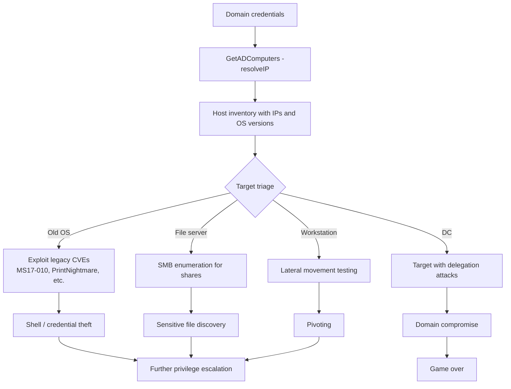

title: "GetADComputers.py"
script: "examples/GetADComputers.py"
category: "Recon and Enumeration"
status: "Published"
protocols:
  - LDAP
  - LDAPS
  - DNS
ms_specs:
  - MS-ADTS
  - MS-ADA1
  - MS-ADA2
  - MS-ADA3
mitre_techniques:
  - T1018
  - T1069.002
  - T1082
auth_types:
  - password
  - ntlm
  - kerberos
  - aes
tags:
  - impacket
  - impacket/examples
  - category/recon
  - status/published
  - protocol/ldap
  - protocol/ldaps
  - protocol/dns
  - ms-spec/ms-adts
  - technique/ldap_enumeration
  - technique/computer_enumeration
  - technique/host_discovery
  - technique/os_fingerprint
  - auth/ntlm
  - auth/kerberos
  - mitre/T1018
  - mitre/T1069.002
  - mitre/T1082
aliases:
  - getadcomputers
  - impacket-getadcomputers


# GetADComputers.py

> **One line summary:** Authenticated LDAP enumeration of Active Directory computer accounts returning each computer's sAMAccountName, dNSHostName, operatingSystem, and operatingSystemVersion via an LDAP SearchRequest filtered on computer objects, with an optional DNS resolution mode that queries the DC as the DNS server to obtain each host's IPv4 address in the same command; serves as the natural sibling to [`GetADUsers.py`](GetADUsers.md) (which enumerates user accounts with the same LDAP machinery but a user-focused filter) and completes a matched pair: one tool for "who is in this domain" and another tool for "what hosts are in this domain"; added to Impacket in the 0.13.0 release (October 2025), it represents the most recent entrant in the `Get*` LDAP enumeration tool family (GetADUsers, GetUserSPNs, GetNPUsers, findDelegation) that share internal LDAP search machinery; continues the Recon and Enumeration category at 9 of 17 articles.

| Field | Value |
|:---|:---|
| Script | `examples/GetADComputers.py` |
| Category | Recon and Enumeration |
| Status | Published |
| Primary protocol | LDAP (TCP 389) or LDAPS (TCP 636); DNS (UDP 53) for optional resolution |
| Primary Microsoft specifications | `[MS-ADTS]` Active Directory Technical Specification, `[MS-ADA1]` / `[MS-ADA2]` / `[MS-ADA3]` Attribute definitions |
| MITRE ATT&CK techniques | T1018 Remote System Discovery, T1069.002 Permission Groups Discovery: Domain Groups (related), T1082 System Information Discovery (via OS attributes) |
| Authentication types supported | NTLM password, NTLM hash, Kerberos ticket, Kerberos AES key |
| First appearance in Impacket | 0.13.0 (October 2025) |
| Typical output | sAMAccountName, dNSHostName, operatingSystem, operatingSystemVersion, optionally IPv4 address |


## Prerequisites

This article builds directly on:

- [`GetADUsers.py`](GetADUsers.md) for the full LDAP theory: RFC 4511 search operation, filter syntax, AD directory tree, authentication binding, paged search, the bitwise extensible matching rule OIDs, and FILETIME conversion. That article establishes everything about the Impacket LDAP layer; this one adds the computer-specific pieces. Reading GetADUsers first is strongly recommended; this article assumes that foundation.
- [`addcomputer.py`](../07_ad_modification/addcomputer.md) for the creation side of the computer-account story. GetADComputers reads; addcomputer writes. The two together define Impacket's computer-account lifecycle tools.
- [`samrdump.py`](samrdump.md) for the SAMR counterpart of the enumeration pattern. SAMR does enumerate computers but less cleanly than LDAP (no rich attributes, awkward filtering).
- [`00_Introduction_and_Architecture.md`](Introduction_and_Architecture.md) for the overall Impacket architecture.

Familiarity with LDAP basics and AD directory conventions is assumed. See GetADUsers for the primer.


## What it does

`GetADComputers.py` authenticates to an AD domain controller over LDAP, issues a SearchRequest targeting computer objects, and returns a table:

```text
$ GetADComputers.py -dc-ip 10.10.10.5 ACME.LOCAL/alice:Passw0rd!
Impacket v0.14.0.dev0 - Copyright Fortra, LLC and its affiliated companies
[*] Querying 10.10.10.5 for information about domain.
Name                 DNSHostName                    OSVersion                      OperatingSystem
--   
DC01$                dc01.acme.local                10.0 (17763)                   Windows Server 2019 Datacenter
WEB01$               web01.acme.local               10.0 (22000)                   Windows Server 2022 Standard
WS042$               ws042.acme.local               10.0 (19045)                   Windows 10 Pro
FILE01$              file01.acme.local              10.0 (20348)                   Windows Server 2022 Standard
LEGACY01$            legacy01.acme.local            6.1 (7601)                     Windows Server 2008 R2 Standard
...
```

Columns:

- **Name**: sAMAccountName, always ending in `$` for computer accounts.
- **DNSHostName**: FQDN as registered by the computer in AD.
- **OSVersion**: operatingSystemVersion, major.minor (build) format.
- **OperatingSystem**: operatingSystem string, the readable OS name for humans.

### The DNS resolution mode

The tool's distinctive feature beyond basic LDAP enumeration is the optional `-resolveIP` flag which queries the DC as a DNS nameserver to resolve each computer's dNSHostName to its IPv4 address:

```text
$ GetADComputers.py -resolveIP -dc-ip 10.10.10.5 ACME.LOCAL/alice:Passw0rd!
Name           DNSHostName           IP              OSVersion       OperatingSystem
--    -
DC01$          dc01.acme.local       10.10.10.5      10.0 (17763)    Windows Server 2019
WEB01$         web01.acme.local      10.10.10.10     10.0 (22000)    Windows Server 2022
WS042$         ws042.acme.local      10.10.20.42     10.0 (19045)    Windows 10 Pro
...
```

This is significant because AD-integrated DNS is the authoritative DNS for the domain, and querying the DC directly bypasses any internal network view differences that might exist between the attacker's DNS resolver and the DC's. The dns.resolver library is configured to use the DC IP as nameserver, skipping `/etc/resolv.conf` entirely.

### Filter options

**Default mode** returns all computer accounts:

```text
(&(sAMAccountName=*)(objectCategory=computer))
```

**`-user <name>` mode** queries a specific computer (the tool reuses the `-user` argument name from GetADUsers but applies it to computer accounts; supply the name with or without trailing `$`):

```text
(&(sAMAccountName=<name>))
```

The default is almost always the right choice. Filtering a domain's entire computer inventory is often what the operator wants: a starting map of the environment's hosts, their hostnames, and their OS fingerprints.


## Why it exists

Computer account enumeration is critical for reconnaissance because hosts are lateral movement targets. Where user enumeration answers "who can I attack", computer enumeration answers "where can I go" and "what do they run". Specific reasons:

- **Lateral movement planning.** Which hosts are reachable? Which run which OS versions (old versions being vulnerable to specific attacks)? Which are domain controllers vs servers vs workstations?
- **Vulnerability targeting.** Old OS versions (Server 2008, Server 2012, Windows 7, XP) often have exploitable CVEs. The OS version column directly identifies candidates.
- **Attack surface mapping.** Server 2016+ vs Server 2022 makes a difference for Kerberos armoring, credential guard availability, SMB signing defaults, and other questions about security posture.
- **Targeting domain controllers specifically.** DC computer accounts can be identified by their OU (Domain Controllers) or by the `TRUSTED_FOR_DELEGATION` and `SERVER_TRUST_ACCOUNT` UAC bits. Enumeration plus filter is the starting point for DC-focused attacks.
- **Building a scan target list.** Combined with `-resolveIP`, the output feeds directly into subsequent SMB enumeration (`NetExec`, `crackmapexec`, `smbclient`), RDP scanning, or WinRM probing.

Impacket added GetADComputers.py in the 0.13.0 release to complete the user/computer pair. Prior to 0.13.0, operators often used `ldapdomaindump` or custom LDAP queries to enumerate computers; having a dedicated example script brings computer enumeration into the standard Impacket toolkit with the consistent UX and authentication support shared across the other `Get*` tools.

Adding the tool also implicitly acknowledges how common computer enumeration is in modern AD engagements. Most attack paths (SMB relay target selection, RDP bruteforce target lists, exploit targeting, vulnerability reporting) begin with "give me the list of hosts" and GetADComputers answers that in one authenticated LDAP query.


## Active Directory computer object theory

This section covers the pieces specific to computer objects. For LDAP protocol basics, see [`GetADUsers.py`](GetADUsers.md).

### Computer accounts as AD objects

Every computer joined to the domain has an account in AD with:

- **sAMAccountName** ending in `$` (e.g. `WS001$`, `DC01$`). The `$` suffix distinguishes computer accounts from user accounts at the sAMAccountName layer. This is a NetBIOS-era convention preserved for backward compatibility.
- **userPrincipalName** in the form `HOST/dns.name` or `host$@DOMAIN.FQDN` (varies by configuration).
- **dNSHostName** holding the FQDN as registered by the computer.
- **servicePrincipalName** (SPNs) including `HOST/<shortname>`, `HOST/<fqdn>`, `RestrictedKrbHost/<shortname>`, `RestrictedKrbHost/<fqdn>`, and service-specific SPNs like `TERMSRV/<fqdn>`, `ldap/<fqdn>` (DCs), `http/<fqdn>`, etc.
- **userAccountControl** with `WORKSTATION_TRUST_ACCOUNT` (0x1000) for member computers or `SERVER_TRUST_ACCOUNT` (0x2000) for domain controllers.
- **operatingSystem** free-text string like "Windows Server 2022 Standard".
- **operatingSystemVersion** in format "major.minor (build)" like "10.0 (22000)".
- **operatingSystemServicePack** in older versions; largely deprecated now.
- **lastLogonTimestamp** last replicated logon.
- **pwdLastSet** FILETIME of last machine account password change (rotates every 30 days by default).
- **objectCategory** = `computer` (or more precisely, the DN of the computer class definition).
- **objectClass** including `top`, `person`, `organizationalPerson`, `user`, `computer`.

Note that AD's class hierarchy treats computers as a subtype of user (both inherit from the user class), which is why `(objectCategory=user)` would match computers too. Using `(objectCategory=computer)` specifically narrows to computer objects.

### Why computer accounts are users underneath

The "computer is a user" inheritance is a classic AD design that has both elegance and awkwardness:

- **Elegant:** computers authenticate just like users do, with credentials (the machine account password), Kerberos tickets, and access tokens. This uniformity simplifies AD's internals substantially.
- **Awkward:** tooling often has to explicitly distinguish users from computers via objectCategory or the `$` suffix to avoid mixing them up. This is why GetADUsers.py explicitly filters out entries whose sAMAccountName ends in `$` in its default output.

Computer accounts can be used for many operations normally associated with user accounts:

- Kerberos authentication (via the machine account password).
- SMB/LDAP/RDP/WinRM bind.
- S4U2Self and S4U2Proxy for delegation (computer accounts commonly have SPNs, which is a prerequisite).
- AD object creation (via the `addcomputer.py` MachineAccountQuota path).
- DCSync (if the account has extended replication rights; SYSTEM privileges on a DC grant this).

### operatingSystemVersion values

The operatingSystemVersion field follows a pattern that correlates with Windows build numbers. Common values:

| OS | operatingSystemVersion |
|:---|:---|
| Windows XP / Server 2003 | `5.1 (2600)`, `5.2 (3790)` |
| Windows Vista / Server 2008 | `6.0 (6002)` |
| Windows 7 / Server 2008 R2 | `6.1 (7601)` |
| Windows 8 / Server 2012 | `6.2 (9200)` |
| Windows 8.1 / Server 2012 R2 | `6.3 (9600)` |
| Windows 10 / Server 2016 | `10.0 (14393)` |
| Windows 10 1809 / Server 2019 | `10.0 (17763)` |
| Windows 10 21H2 | `10.0 (19044)` |
| Windows 11 21H2 / Server 2022 | `10.0 (22000)`, `10.0 (20348)` |
| Windows 11 22H2 | `10.0 (22621)` |
| Windows 11 23H2 / Server 2025 | `10.0 (22631)`, `10.0 (26100)` |

A build number in the output maps directly to a patch level range and vulnerability surface. The string value correlates with marketing names but the build number is the more actionable field.

### dNSHostName vs sAMAccountName vs CN

A computer in AD typically has three related name values:

- **sAMAccountName**: the NetBIOS-style name with `$`, used for most authentication purposes.
- **CN**: common name of the object in AD, typically the NetBIOS name without `$`.
- **dNSHostName**: the FQDN, which includes the domain suffix.

These can diverge if the computer is renamed, if the DNS zone is split, or due to configuration mistakes. For operational reconnaissance, dNSHostName is usually the most useful because it is what tools at the networking layer (SMB clients, SSH, web, etc.) will accept as an address.

### AD-integrated DNS

In most AD environments, the DCs run DNS services that are authoritative for the AD-integrated zone. The dNSHostName of each computer is registered automatically via dynamic DNS (DDNS) when the computer starts up.

Querying the DC as DNS server gives direct access to the AD-integrated view. The `-resolveIP` mode does exactly this: configures dns.resolver to use the DC IP as nameserver, bypassing the attacker's host DNS configuration entirely.

This matters for:

- **Scenarios where the attacker is on a network without routing DNS queries to the AD DNS** (segmented lab environments, bastion hops, etc.). The attacker can reach the DC's LDAP port but not its DNS port through their normal resolver; querying directly works around this.
- **Avoiding local DNS caches** that may hold stale records.
- **Discovering hosts only registered in internal AD DNS** without external DNS views.


## How the tool works internally

The tool closely parallels GetADUsers.py:

1. **Argument parsing.** Same identity positional plus `-user`, `-resolveIP`, `-dc-ip`, `-dc-host`, `-hashes`, `-aesKey`, `-k`, `-no-pass`.

2. **Determine target and bind.** Same `ldap_login()` utility covering NTLM and Kerberos authentication.

3. **Build BaseDN.** From the domain name.

4. **Construct filter.** `(&(sAMAccountName=*)(objectCategory=computer))` by default.

5. **Issue SearchRequest.** Attributes list: `['sAMAccountName', 'dNSHostName', 'operatingSystem', 'operatingSystemVersion']`. With `SimplePagedResultsControl` for paging.

6. **processRecord callback.** Invoked per entry. Extracts the four attributes. Handles missing values (some computers may not have dNSHostName populated, particularly stale accounts or ones imaged from a template).

7. **Optional DNS resolution.** If `-resolveIP` is set:
   - Configure `dns.resolver.default_resolver = dns.resolver.Resolver(configure=False)`. The `configure=False` prevents reading `/etc/resolv.conf`.
   - Set `dns.resolver.default_resolver.nameservers = [self.__kdcIP]`. The DC IP becomes the sole nameserver.
   - For each computer, call `dns.resolver.resolve(dNSHostName, 'A')` to obtain the A record.
   - Add the IP to the output row.

8. **Print table.** Fixed format with column widths.

The script is small: under 200 lines. The DNS resolution addition is the only structural difference from GetADUsers. Everything else is boilerplate shared with the rest of the `Get*` family.

### Handling errors

- **LDAP errors:** handled the same as GetADUsers (size limit exceptions are caught and processed gracefully).
- **DNS resolution errors:** if resolving a specific host fails (NXDOMAIN, NoAnswer, timeout), that row's IP column shows "N/A" or empty. The enumeration continues.
- **Python dns library dependency:** `-resolveIP` requires `dnspython`. The tool imports conditionally; if dnspython is not installed, `-resolveIP` raises a clear error.


## Authentication options

Same as GetADUsers.py:

- NTLM password: `GetADComputers.py DOMAIN/user:password`
- NTLM hash: `GetADComputers.py -hashes LMHASH:NTHASH DOMAIN/user`
- Kerberos with password: `GetADComputers.py -k DOMAIN/user:password`
- Kerberos from ccache: `KRB5CCNAME=alice.ccache GetADComputers.py -k -no-pass DOMAIN/user`
- Kerberos with AES key: `GetADComputers.py -k -aesKey <256-bit hex> DOMAIN/user`

Any authenticated domain user can query computer attributes via LDAP. The "Authenticated Users" default read ACE on the domain covers computer objects the same as user objects.

Some computer attributes have tighter ACLs (LAPS local administrator password, for example, is restricted to specific principals). GetADComputers.py requests only four non-sensitive attributes, so the default ACLs are sufficient.


## Practical usage

### Basic enumeration

```bash
GetADComputers.py -dc-ip 10.10.10.5 ACME.LOCAL/alice:Passw0rd!
```

Returns all domain computers with their hostnames and OS info.

### Enumeration with DNS resolution

```bash
GetADComputers.py -resolveIP -dc-ip 10.10.10.5 ACME.LOCAL/alice:Passw0rd!
```

Adds IPv4 addresses. The output can feed directly into subsequent scan tools.

### Query a single computer

```bash
GetADComputers.py -user DC01 -dc-ip 10.10.10.5 ACME.LOCAL/alice:Passw0rd!
```

Checks existence of a specific computer account. Useful for verifying hostnames discovered elsewhere.

### Extract IP addresses for SMB enumeration

```bash
GetADComputers.py -resolveIP -dc-ip 10.10.10.5 ACME.LOCAL/alice:Passw0rd! | \
  awk 'NR>4 {print $3}' | \
  grep -E '^[0-9]+\.' > hosts.txt
netexec smb hosts.txt -u alice -p 'Passw0rd!' -d ACME.LOCAL
```

Feeds GetADComputers output into NetExec (CrackMapExec successor) for SMB enumeration across every domain host.

### Identify vulnerable OS versions

```bash
GetADComputers.py -dc-ip 10.10.10.5 ACME.LOCAL/alice:Passw0rd! | \
  grep -E '6\.1|6\.0|5\.'
```

Filters for Windows 7, Server 2008/R2, and older. These OS versions have exploitable CVEs (EternalBlue MS17-010, PrintNightmare, various Kerberos and SMB bugs). The filter immediately surfaces legacy systems that are still joined to the domain.

### Identify domain controllers

DCs have the `SERVER_TRUST_ACCOUNT` UAC bit set. The default filter does not include this bit check, but a quick modification or a followup query catches them. Alternatively, observe that DCs typically sit in an OU named "Domain Controllers" and have distinctive SPNs (ldap/, GC/, etc.) that show in dedicated LDAP queries.

### Build a complete environment map

```bash
GetADUsers.py -all -dc-ip 10.10.10.5 ACME.LOCAL/alice:Passw0rd! > users.txt
GetADComputers.py -resolveIP -dc-ip 10.10.10.5 ACME.LOCAL/alice:Passw0rd! > computers.txt
```

Two commands: complete user and host inventory. Combined with findDelegation, GetUserSPNs, and GetNPUsers, this is the standard reconnaissance stack.

### Key flags

| Flag | Meaning |
|:---|:---|
| `identity` (positional) | `[domain/]username[:password]` |
| `-user <name>` | Query a specific computer (may be with or without trailing `$`). |
| `-resolveIP` | Additionally resolve dNSHostName to IPv4 address by querying the DC as DNS nameserver. |
| `-dc-ip <ip>` | DC IP. Required if the script host cannot resolve the domain. |
| `-dc-host <n>` | DC hostname (used for Kerberos SPN resolution). |
| `-hashes LM:NT` | NTLM hash auth. |
| `-aesKey <hex>` | Kerberos AES key auth. |
| `-k` | Kerberos authentication. |
| `-no-pass` | Do not prompt for password. |
| `-debug`, `-ts` | Verbose/timestamp logging. |


## What it looks like on the wire

### LDAP exchange

Identical structure to GetADUsers except:

- Filter is `(&(sAMAccountName=*)(objectCategory=computer))`.
- Requested attributes: `['sAMAccountName', 'dNSHostName', 'operatingSystem', 'operatingSystemVersion']`.

Traffic is one LDAP bind + one search request that paginates as needed. On a domain with 1000 computers, a single request exchange completes; on a domain with 10000+ computers, paged continuation requests follow.

### DNS traffic with -resolveIP

When `-resolveIP` is active, the tool issues one DNS A-record query per enumerated computer to the DC IP on UDP 53. In a domain with 500 computers, this is 500 DNS queries. The traffic is:

- UDP from tool host to DC:53, query type A, query name = dNSHostName.
- UDP response from DC:53 with A record value.

This pattern is visible in DNS logs if the DC logs DNS queries (enabled via `Configure Analytical and Debug Logs` in DNS Manager, or Microsoft's "DNS debug logging"). Most environments do NOT enable DNS logging by default because the volume is enormous.

### Wireshark filters

```text
ldap.filter contains "objectCategory=computer"    # computer enumeration LDAP
ldap.baseObject contains "DC="                    # LDAP against domain root
dns and dns.qry.name contains "acme.local"        # DNS resolution to the AD zone
ip.dst == 10.10.10.5 and udp.port == 53           # DNS to DC specifically
```


## What it looks like in logs

### Event 4662 (same as GetADUsers)

Every LDAP object read generates a 4662 if object auditing is enabled. For computer enumeration, this means one 4662 per computer object read (plus the domain root accesses). In domains with thousands of computers, this produces large volumes of 4662 events in a short window. The pattern of reading in bulk is the distinguishing signal.

### Event 4624 (LDAP bind)

Same Logon Type 3 event as any authenticated LDAP bind.

### Event 4768/4769 (if Kerberos)

TGT and TGS for ldap/<dc> events fire at auth time.

### DNS query logs (if enabled)

With `-resolveIP`, a burst of A-record queries to the DC for every enumerated hostname is characteristic. If DNS Analytical Logging is enabled, this pattern is visible; most environments do not enable this logging.

### Starter Sigma rules

```yaml
title: Bulk Computer Object Read from Domain Controller
logsource:
  product: windows
  service: security
detection:
  selection:
    EventID: 4662
    ObjectType|contains: 'bf967a86-0de6-11d0-a285-00aa003049e2'  # Computer class GUID
  filter_normal:
    SubjectUserName|endswith:
      - '$'
      - 'authorized_service_account'
  condition: selection and not filter_normal
  timeframe: 5m
  aggregation: count() by SubjectUserName > 50
level: high
```

Detects bulk computer object reads. Threshold depends on domain size; 50 is a starting point for small/medium environments. Requires auditing at the object level configured for the Computers container.

```yaml
title: Bulk DNS Queries for Internal Zone from Single Source
logsource:
  product: windows
  service: dns-server
detection:
  selection:
    query_type: A
    zone: '*acme.local*'
  timeframe: 1m
  aggregation: count() by source_ip > 20
level: medium
```

Detects the bulk A-record query pattern characteristic of `-resolveIP` usage. Requires DNS query logging. False positive surface includes legitimate network management tools.

```yaml
title: LDAP Query Filtering on objectCategory=computer
logsource:
  category: network
detection:
  selection:
    protocol: ldap
    operation: searchRequest
    filter|contains: 'objectCategory=computer'
  filter_expected:
    src_ip: 'known_admin_hosts'
  condition: selection and not filter_expected
level: low
```

Captures the distinctive filter string. Requires LDAP visibility at the network layer (Zeek or similar). False positive surface is moderate; many legitimate tools use this filter.


## Detection and defense

### Detection opportunities

Same framework as GetADUsers: the defining telemetry is **Event 4662** against computer objects when object-level auditing is configured. The pattern (one account reading many computer objects in a short window) is distinctive but generates enough volume in normal operation that tuning is essential.

The DNS resolution mode adds a second signal: burst A-record queries to the AD DNS zone from a single source. Organizations that log DNS queries can detect this specifically.

LDAP visibility at the network layer via Zeek logs, or monitoring in the style of MDI that is specific to AD, catches the pattern at multiple layers.

### Preventive controls

- **LDAP signing and channel binding** as baseline AD hardening. Same recommendation as for GetADUsers.
- **LDAPS** for all LDAP operations to encrypt the enumeration in transit.
- **Object-level auditing** (SACLs) on the Computers container and on sensitive OUs (Domain Controllers, Tier 0 servers).
- **Disable unnecessary DNS records** in the AD-integrated zone, particularly for hosts that do not need to be discoverable.
- **Network segmentation** limiting LDAP access to DCs from workstations.
- **Least privilege**: same Authenticated Users default read applies; preventing the prerequisite (valid credentials) is the core defense.

### What GetADComputers.py does NOT do

- Does not enumerate computer group memberships. Use a subsequent LDAP query or PowerView/BloodHound for that.
- Does not dump LAPS passwords. That requires separate rights (`ms-Mcs-AdmPwd` attribute read) and ntlmrelayx's `--dump-laps` or similar.
- Does not identify domain controllers specifically. Requires additional filtering on UAC bits or SPNs.
- Does not identify vulnerable hosts directly. The OS version column is input to vulnerability mapping; actual vulnerability assessment is a separate step.
- Does not authenticate to each computer; purely LDAP query from the DC.
- Does not resolve IPv6. The DNS query is explicitly `A` record type (IPv4 only). For domains running both protocols, additional AAAA queries would be needed.


## Related tools and attack chains

`GetADComputers.py` continues Recon and Enumeration at **9 of 17 articles**.

### Related Impacket tools

- [`GetADUsers.py`](GetADUsers.md) is the direct sibling. Users vs computers, same machinery, same authentication support. Run both for a complete AD principal inventory.
- [`addcomputer.py`](../07_ad_modification/addcomputer.md) is the creation tool. GetADComputers reads; addcomputer writes. Used together in the standard "add a computer account to meet a delegation prerequisite, then enumerate to verify" workflow.
- [`GetUserSPNs.py`](GetUserSPNs.md), [`GetNPUsers.py`](GetNPUsers.md), and [`findDelegation.py`](findDelegation.md) share the LDAP machinery. GetADComputers is the newest addition to this family.
- [`samrdump.py`](samrdump.md) can enumerate computers via SAMR but less comprehensively; LDAP is preferred when available.
- [`netview.py`](netview.md) is the session enumeration tool (not yet documented in this wiki). Sometimes paired with GetADComputers to identify which hosts have active sessions from which users, supporting lateral movement target selection.

### External alternatives

- **`windapsearch -C`** at `https://github.com/ropnop/windapsearch`. Enumerates computers via LDAP with queries built in.
- **`ldapdomaindump`** at `https://github.com/dirkjanm/ldapdomaindump`. Structured HTML/JSON/CSV dump including computers.
- **`PowerView`'s `Get-DomainComputer`.** Classic Windows-side enumeration with rich filtering.
- **`BloodHound`'s `SharpHound` collector.** Gathers computers along with everything else into the graph.
- **`NetExec` / `crackmapexec` --computers flag** for quick enumeration during SMB/LDAP/etc. probing.

For a single command producing a computer inventory in an engagement built on Python, GetADComputers is now the tool of choice in the Impacket ecosystem. For analysis structured as a graph, BloodHound remains superior.

### Attack chain from enumeration through compromise



GetADComputers enables the triage step. Everything downstream selects tools based on what computers exist and what they run.

### User + computer combined workflow

The two articles pair on a single reconnaissance session:

```bash
# 1. User enumeration for spray/roast target list
GetADUsers.py -all -dc-ip 10.10.10.5 ACME.LOCAL/alice:Passw0rd! > users.txt

# 2. Computer enumeration for lateral movement target list
GetADComputers.py -resolveIP -dc-ip 10.10.10.5 ACME.LOCAL/alice:Passw0rd! > computers.txt

# 3. Extract actionable lists
awk 'NR>4 {print $1}' users.txt | grep -v '^$' > usernames.txt
awk 'NR>4 {print $3}' computers.txt | grep -E '^[0-9]+\.' > ips.txt

# 4. Kerberoast
GetUserSPNs.py -dc-ip 10.10.10.5 -request ACME.LOCAL/alice:Passw0rd! -outputfile kerberoast.hashes

# 5. AS-REP roast
GetNPUsers.py -dc-ip 10.10.10.5 ACME.LOCAL/ -usersfile usernames.txt -format john -outputfile asrep.hashes

# 6. Pivoting opportunities based on delegation
findDelegation.py -dc-ip 10.10.10.5 ACME.LOCAL/alice:Passw0rd!

# 7. Map of hosts with sessions for lateral movement planning
# (requires netview.py or manual SMB/WMI queries per host)
```

This six-step sequence is the canonical Impacket AD reconnaissance kickoff. GetADComputers slots in at step 2 as the natural complement to step 1's GetADUsers.


## Further reading

- **`[MS-ADTS]`: Active Directory Technical Specification** at `https://learn.microsoft.com/en-us/openspecs/windows_protocols/ms-adts/`. The canonical AD protocol spec.
- **`[MS-ADA1]`, `[MS-ADA2]`, `[MS-ADA3]`: Active Directory Schema Attributes.** For the operatingSystem, operatingSystemVersion, and dNSHostName attribute definitions.
- **Microsoft documentation on AD-integrated DNS** at `https://learn.microsoft.com/en-us/windows-server/networking/dns/dns-top`. Background on how dNSHostName registration works.
- **Impacket 0.13.0 release notes** at `https://github.com/fortra/impacket/releases/tag/impacket_0_13_0`. Lists GetADComputers as a new example.
- **dnspython documentation** at `https://dnspython.readthedocs.io/`. The library underlying `-resolveIP`.
- **Windows operatingSystemVersion reference** at `https://learn.microsoft.com/en-us/windows/win32/sysinfo/operating-system-version`. Maps version strings to releases.
- **Impacket GetADComputers.py source** at `https://github.com/fortra/impacket/blob/master/examples/GetADComputers.py`. Short, readable. Pair with GetADUsers.py to see what differs.
- **MITRE ATT&CK T1018** at `https://attack.mitre.org/techniques/T1018/`. Remote System Discovery.
- **MITRE ATT&CK T1082** at `https://attack.mitre.org/techniques/T1082/`. System Information Discovery, which the OS version enumeration falls under.

If you want to internalize the tool and its role in the recon stack, the best exercise is to run both GetADUsers and GetADComputers in sequence against the same lab domain with Wireshark capturing port 389. Observe how the LDAP SearchRequest for users vs computers differs in exactly one dimension: the objectCategory filter value. Same bind, same BaseDN, same paging, different filter. Then add `-resolveIP` and observe the DNS traffic that appears. Finally, modify GetADComputers to request additional attributes (servicePrincipalName to identify DCs by their ldap/ and GC/ SPNs; userAccountControl to filter on SERVER_TRUST_ACCOUNT; msDS-SupportedEncryptionTypes to see Kerberos encryption capabilities). Each extra attribute is a few lines of code. After this exercise, the `Get*` family pattern is fully internalized and you can write new LDAP enumeration tools targeting any AD object class (groups, OUs, GPOs, trusts, service connection points) in a few dozen lines using the same machinery. The LDAP layer of Impacket rewards the time invested in understanding it once; the same code structure handles every AD query you might ever want to automate.
