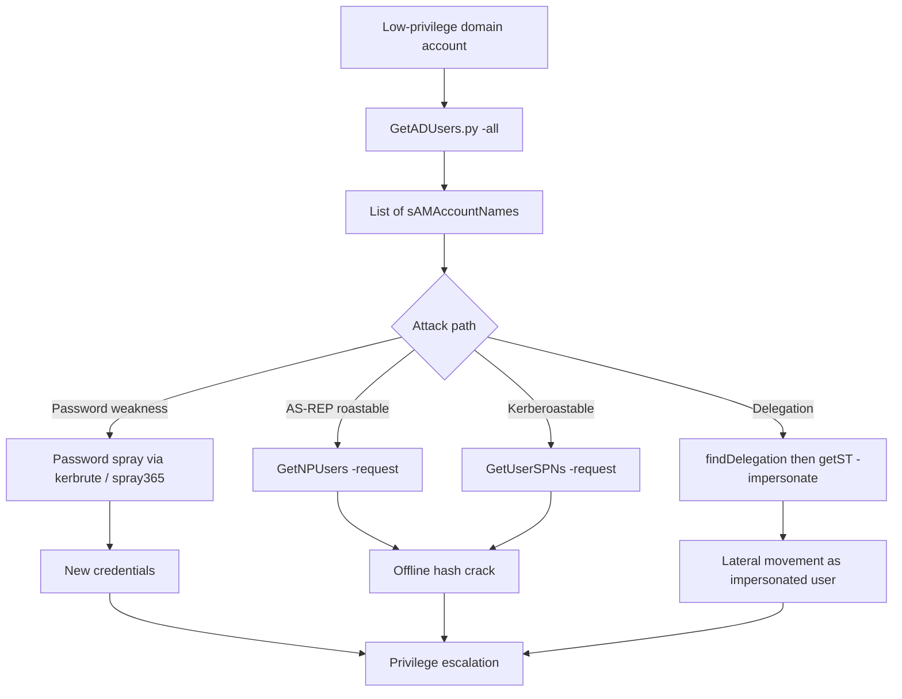

title: "GetADUsers.py"
script: "examples/GetADUsers.py"
category: "Recon and Enumeration"
status: "Published"
protocols:
  - LDAP
  - LDAPS
ms_specs:
  - MS-ADTS
  - MS-ADA1
  - MS-ADA2
  - MS-ADA3
mitre_techniques:
  - T1087.002
  - T1018
  - T1069.002
auth_types:
  - password
  - ntlm
  - kerberos
  - aes
tags:
  - impacket
  - impacket/examples
  - category/recon
  - status/published
  - protocol/ldap
  - protocol/ldaps
  - ms-spec/ms-adts
  - technique/ldap_enumeration
  - technique/user_enumeration
  - technique/domain_recon
  - auth/ntlm
  - auth/kerberos
  - mitre/T1087.002
  - mitre/T1018
  - mitre/T1069.002
aliases:
  - getadusers
  - impacket-getadusers


# GetADUsers.py

> **One line summary:** Authenticated LDAP enumeration of Active Directory user accounts, returning each user's sAMAccountName, mail address, last password set time, and last logon time via an LDAP SearchRequest against the domain controller's BaseDN, with two filter modes: the default filter that requires the mail attribute to be populated (intended for workflows gathering mail addresses like phishing reconnaissance) and the `-all` filter that returns every user object including disabled accounts and those without email (intended for general AD user inventory), using the distinctive LDAP extensible match rule OID `1.2.840.113556.1.4.803` (LDAP_MATCHING_RULE_BIT_AND) to filter on UserAccountControl bits and the conversion constant `116444736000000000` to translate FILETIME (intervals of 100 nanoseconds since 1601) into readable timestamps; serves as the canonical LDAP enumeration companion to [`samrdump.py`](samrdump.md) (which does the same user enumeration but via SAMR over DCE/RPC on SMB port 445), and continues the Recon and Enumeration category at 8 of 17 articles.

| Field | Value |
|:---|:---|
| Script | `examples/GetADUsers.py` |
| Category | Recon and Enumeration |
| Status | Published |
| Primary protocol | LDAP (TCP 389) or LDAPS (TCP 636) |
| Primary Microsoft specifications | `[MS-ADTS]` Active Directory Technical Specification, `[MS-ADA1]` / `[MS-ADA2]` / `[MS-ADA3]` Attribute definitions |
| MITRE ATT&CK techniques | T1087.002 Account Discovery: Domain Account, T1018 Remote System Discovery (by proxy via user enumeration), T1069.002 Permission Groups Discovery: Domain Groups (related workflow) |
| Authentication types supported | NTLM password, NTLM hash, Kerberos ticket, Kerberos AES key |
| First appearance in Impacket | Early Impacket, by Alberto Solino (`@agsolino`) |
| Typical output | sAMAccountName, mail, pwdLastSet, lastLogon |


## Prerequisites

This article builds on:

- [`samrdump.py`](samrdump.md) for the SAMR-based user enumeration counterpart. Read together with GetADUsers, the pair teaches the two distinct AD enumeration pathways: LDAP queries vs SAMR RPC calls.
- [`GetUserSPNs.py`](GetUserSPNs.md) and [`GetNPUsers.py`](GetNPUsers.md) which perform related LDAP queries with different filters for specific attack workflows (Kerberoasting and AS-REP Roasting respectively). These three tools share the same LDAP search machinery internally; reading all four clarifies the pattern.
- [`findDelegation.py`](findDelegation.md) which is another LDAP-based enumeration tool, querying delegation-specific attributes.
- [`00_Introduction_and_Architecture.md`](Introduction_and_Architecture.md) for the overall Impacket architecture.

Familiarity with LDAP basics (BaseDN, filter syntax, search scope) helps. The article reviews the relevant pieces.


## What it does

`GetADUsers.py` authenticates to an AD domain controller over LDAP and issues a SearchRequest that returns user records formatted as a table:

```text
$ GetADUsers.py -dc-ip 10.10.10.5 ACME.LOCAL/alice:Passw0rd!
Impacket v0.14.0.dev0 - Copyright Fortra, LLC and its affiliated companies
[*] Querying 10.10.10.5 for information about domain.
Name                 Email                          PasswordLastSet     LastLogon
--  - -
jsmith               jsmith@acme.local              2025-08-12 09:14:22 2026-04-20 07:02:18
bwilson              bwilson@acme.local             2024-11-30 16:33:41 2026-04-19 22:15:07
SVC_SQL              svc_sql@acme.local             2023-03-01 11:00:00 2026-04-20 04:00:05
...
```

Columns:

- **Name**: sAMAccountName (the legacy "pre-Windows 2000" logon name).
- **Email**: value of the `mail` attribute if populated.
- **PasswordLastSet**: timestamp of the last password change, derived from pwdLastSet FILETIME.
- **LastLogon**: most recent interactive or network logon processed by the queried DC, derived from lastLogon FILETIME.

### Two filter modes

**Default mode** uses this LDAP filter:

```text
(&(sAMAccountName=*)(mail=*)(!(UserAccountControl:1.2.840.113556.1.4.803:=2)))
```

Only returns users with a populated `mail` attribute and without the ACCOUNTDISABLE bit (UF_ACCOUNTDISABLE = 0x2). Intended for workflows that need email addresses (phishing reconnaissance, external user enumeration for breach notification, social engineering prep).

**`-all` mode** uses this LDAP filter:

```text
(&(sAMAccountName=*)(objectCategory=user))
```

Returns every user object including disabled accounts and those without email. Intended for complete AD user inventory.

### Single user mode

**`-user <username>`** queries for a specific account:

```text
(&(sAMAccountName=<username>))
```

Useful when confirming existence of a specific account or extracting the four attributes for one target.

### Filter out computer accounts

Computer accounts in AD have sAMAccountName ending with `$` (like `WS001$`, `DC01$`). The tool detects this and skips them in the default printer loop (only human user accounts appear in output by default).


## Why it exists

Active Directory enumeration is foundational for almost every attack workflow focused on a domain. Before kerberoasting, before password spraying, before delegation abuse, before ACL analysis, an attacker typically wants to know who is in the domain. Three common reasons:

- **Target list for password spraying.** Gather sAMAccountNames, then attempt password attacks against them with tools like `kerbrute`, Impacket's own `getTGT` in a loop, or Spray365.
- **Phishing reconnaissance.** The default filter's mail requirement specifically targets this use case; gather every user's email address in one command.
- **Pivot planning.** Knowing which users are in the domain, when they last logged on, and when they last changed their password informs decisions about which accounts are active enough to be worth attacking versus stale accounts that would trigger alerts if reactivated.

GetADUsers.py fills this need via LDAP, which is the natural query interface for AD: AD is fundamentally an LDAP directory (plus Kerberos, DNS, and other services), and LDAP is the way AD is designed to answer questions. Other tools (`samrdump.py`, `lookupsid.py`) reach the same data via other protocols (SAMR RPC, LSARPC) but LDAP is usually the right first choice because:

- LDAP servers scale and optimize specifically for search queries.
- LDAP filters are expressive; you can ask complex conjunctive, disjunctive, and negated questions in one query.
- LDAP paging handles arbitrarily large result sets.
- Most AD enumeration research and tooling assumes LDAP, so outputs are compatible with other tools in the pipeline.

Impacket ships GetADUsers.py as the canonical introduction to this workflow. The script is small enough to read in ten minutes and covers the LDAP search machinery, authentication binding, paged result handling, and FILETIME conversion. These are patterns that every other LDAP-based Impacket tool reuses.


## LDAP and AD directory theory

LDAP (Lightweight Directory Access Protocol, RFC 4511) is the query protocol for hierarchical directory services. AD uses LDAP as its primary read/write interface to the directory information tree. This section covers what matters for reading GetADUsers.py.

### The directory tree

AD organizes objects in a tree rooted at the domain root DN:

```text
DC=acme,DC=local
├── CN=Users
│   ├── CN=Administrator
│   ├── CN=krbtgt
│   └── ...
├── OU=Employees
│   ├── OU=Engineering
│   │   ├── CN=John Smith
│   │   └── CN=Beth Wilson
│   └── OU=Sales
├── OU=Service Accounts
├── CN=Computers
├── CN=Builtin
└── CN=Configuration,DC=acme,DC=local
```

Key terms:

- **DN (Distinguished Name):** full path to an object, e.g. `CN=John Smith,OU=Engineering,OU=Employees,DC=acme,DC=local`.
- **BaseDN:** starting point for a search, e.g. `DC=acme,DC=local` for a search across the whole domain.
- **CN (Common Name):** typical attribute for the leaf component of a DN.
- **OU (Organizational Unit):** structural container.
- **DC (Domain Component):** labels of the DNS domain, each becoming a DC= component.

GetADUsers.py searches from the domain root DN, which it derives from the target domain name passed on the command line.

### LDAP search operation

An LDAP SearchRequest specifies:

- **BaseDN**: where to start.
- **Scope**: base (just this object), onelevel (direct children only), subtree (all descendants).
- **Filter**: a logical expression selecting which objects to return.
- **Attributes**: which attributes of matching objects to return.
- **Size limit**, **time limit**, **controls** (extensions like paged search).

The server returns zero or more SearchResultEntry responses (one per matching object) followed by a SearchResultDone with a status code.

GetADUsers.py uses subtree scope from the domain root with attributes `['sAMAccountName', 'pwdLastSet', 'mail', 'lastLogon']`. Limiting attributes is polite (less bandwidth, less DC load, less information in the traffic).

### LDAP filter syntax (RFC 4515)

Filters use prefix notation with parentheses:

- `(attribute=value)` is equality.
- `(attribute=*)` is presence (any value).
- `(attribute=prefix*)` is substring.
- `(&(f1)(f2)...)` is AND.
- `(|(f1)(f2)...)` is OR.
- `(!(f))` is NOT.
- `(attribute>=value)`, `(attribute<=value)` are ordering.
- `(attribute:matchingRuleOID:=value)` is extensible match (invokes a named matching rule).

GetADUsers.py uses the extensible match form for UserAccountControl bitwise tests.

### Active Directory user attributes

Common attributes on user objects:

| Attribute | Purpose |
|:---|:---|
| `sAMAccountName` | Legacy pre-Windows 2000 logon name. Always present. |
| `userPrincipalName` | Modern UPN format, user@domain. |
| `cn` / `displayName` | Display name. |
| `givenName`, `sn` | First and last name. |
| `mail` | Email address. Optional. |
| `memberOf` | Groups the user is a member of (backlink). |
| `pwdLastSet` | FILETIME of last password change. |
| `lastLogon` | FILETIME of last logon seen by THIS DC (not replicated). |
| `lastLogonTimestamp` | FILETIME of last logon replicated across DCs (updated every 9-14 days). |
| `logonCount` | Logon count seen by THIS DC. |
| `userAccountControl` | Bitmask of flags. |
| `objectSid` | Security Identifier. |
| `servicePrincipalName` | SPNs for Kerberos. |
| `msDS-AllowedToDelegateTo` | Constrained delegation targets. |

GetADUsers.py requests a minimal set (sAMAccountName, pwdLastSet, mail, lastLogon). Other Impacket LDAP tools (GetUserSPNs, GetNPUsers, findDelegation) request additional attributes for their specific purposes.

### UserAccountControl flags

The `userAccountControl` attribute is a bitmask. Key bits:

| Flag | Value | Meaning |
|:---|:---||
| SCRIPT | 0x0001 | Login script executes. |
| ACCOUNTDISABLE | 0x0002 | Account is disabled. |
| HOMEDIR_REQUIRED | 0x0008 | |
| LOCKOUT | 0x0010 | |
| PASSWD_NOTREQD | 0x0020 | Password not required (dangerous). |
| PASSWD_CANT_CHANGE | 0x0040 | |
| ENCRYPTED_TEXT_PWD_ALLOWED | 0x0080 | |
| NORMAL_ACCOUNT | 0x0200 | Regular user. |
| INTERDOMAIN_TRUST_ACCOUNT | 0x0800 | |
| WORKSTATION_TRUST_ACCOUNT | 0x1000 | Computer account. |
| SERVER_TRUST_ACCOUNT | 0x2000 | DC computer account. |
| DONT_EXPIRE_PASSWORD | 0x10000 | Password never expires. |
| SMARTCARD_REQUIRED | 0x40000 | Smartcard required. |
| TRUSTED_FOR_DELEGATION | 0x80000 | Unconstrained delegation. |
| NOT_DELEGATED | 0x100000 | Cannot be impersonated. |
| USE_DES_KEY_ONLY | 0x200000 | |
| DONT_REQUIRE_PREAUTH | 0x400000 | No Kerberos pre-auth (AS-REP roastable, see [`GetNPUsers.py`](GetNPUsers.md)). |
| PASSWORD_EXPIRED | 0x800000 | |
| TRUSTED_TO_AUTH_FOR_DELEGATION | 0x1000000 | Constrained delegation with protocol transition. |

LDAP queries can filter on these bits via the extensible match rule.

### The LDAP bitwise match OIDs

Microsoft defined two extensible match rules for bitwise operations on AD integer attributes:

| OID | Name | Semantics |
|:---|:---||
| `1.2.840.113556.1.4.803` | LDAP_MATCHING_RULE_BIT_AND | Match if `(attribute & value) == value`. |
| `1.2.840.113556.1.4.804` | LDAP_MATCHING_RULE_BIT_OR | Match if `(attribute & value) != 0`. |

GetADUsers.py uses 1.2.840.113556.1.4.803 (BIT_AND) to check whether ACCOUNTDISABLE is set:

```text
(UserAccountControl:1.2.840.113556.1.4.803:=2)
```

means "accounts where the ACCOUNTDISABLE bit is set". Wrapped in `(!(...))`, it becomes "accounts where ACCOUNTDISABLE is not set". Other common queries:

| Filter | Semantics |
|:---|:---|
| `(userAccountControl:1.2.840.113556.1.4.803:=4194304)` | DONT_REQUIRE_PREAUTH set (AS-REP roastable) |
| `(userAccountControl:1.2.840.113556.1.4.803:=524288)` | TRUSTED_FOR_DELEGATION set (unconstrained delegation) |
| `(userAccountControl:1.2.840.113556.1.4.803:=16777216)` | TRUSTED_TO_AUTH_FOR_DELEGATION (constrained delegation with protocol transition) |

GetNPUsers.py uses the DONT_REQUIRE_PREAUTH filter; findDelegation.py uses the delegation filters. Same machinery, different bit values.

### FILETIME conversion

Windows FILETIME is a 64-bit integer representing 100-nanosecond intervals since January 1, 1601 UTC. Unix time is seconds since January 1, 1970 UTC. The conversion:

```python
def getUnixTime(t):
    t -= 116444736000000000  # offset in 100-ns intervals between 1601 and 1970
    t /= 10000000            # convert 100-ns intervals to seconds
    return t
```

The constant `116444736000000000` is the offset between the Windows epoch and the Unix epoch. Every AD attribute holding a timestamp (pwdLastSet, lastLogon, lastLogonTimestamp, accountExpires, badPasswordTime, and others) uses FILETIME and needs this conversion for display in a form humans can read.

A `pwdLastSet` value of 0 means "password must be changed at next logon" (the account has no valid password history). A `lastLogon` value of 0 means "never logged on". GetADUsers.py handles both special cases.

### lastLogon vs lastLogonTimestamp

**Critical gotcha:** `lastLogon` is NOT replicated between DCs. Each DC tracks its own lastLogon for each account. Querying a single DC gives you that DC's view, which may be far less recent than the account's true last logon across the domain.

`lastLogonTimestamp` IS replicated but only updated every 9 to 14 days to reduce replication traffic. It is accurate within a window of roughly two weeks.

GetADUsers.py queries lastLogon, not lastLogonTimestamp. For accurate "last seen" determination across a domain with multiple DCs, query all DCs and take the maximum, or use lastLogonTimestamp. The tool's output should be read as "last logon seen by the specific DC we queried" not "last logon anywhere in the domain."

### Paged LDAP search

LDAP servers often enforce a default result size limit (AD's default is 1000). Queries exceeding the limit return partial results and a sizeLimitExceeded error unless paging is used.

Paged search uses the `1.2.840.113556.1.4.319` control (RFC 2696). The client requests N results at a time with an opaque cookie; the server returns N results plus the next cookie; the client sends the next request with the cookie; repeat until cookie is empty.

GetADUsers.py uses `SimplePagedResultsControl` internally to handle domains with more than 1000 users. The paging is transparent; the output aggregates all pages.

### ldap vs ldaps

**LDAP (TCP 389):** plaintext by default. Credentials (if NTLM or SASL/NTLM) and responses travel in the clear. An observer can see every user and attribute returned.

**LDAPS (TCP 636):** LDAP over TLS. Credentials and traffic encrypted.

**LDAP with signing and sealing:** LDAP 389 with NTLM or Kerberos signing and sealing enabled. Encrypts traffic at the LDAP layer without TLS.

GetADUsers.py defaults to plaintext LDAP on port 389. For operational use in networks with LDAP signing enforced (increasingly common after the Microsoft LDAP signing hardening mandate), the tool may need adjustment. For research against labs without signing enforcement, plaintext LDAP is fine and easier to inspect in Wireshark.


## How the tool works internally

The tool is about 200 lines. Flow:

1. **Argument parsing.** `identity` (domain/user:password), `-dc-ip`, `-dc-host`, `-hashes`, `-aesKey`, `-k`, `-no-pass`, `-user`, `-all`.

2. **Determine target.** If `-dc-ip` is supplied, connect there. Otherwise resolve the domain name (anonymous SMB probe to `getServerName()` is used to learn the DC name).

3. **LDAP bind.** The shared `ldap_login()` utility handles authentication:
   - NTLM via `ldapConnection.login(username, password, domain, lmhash, nthash)`
   - Kerberos via `ldapConnection.kerberosLogin(username, password, domain, lmhash, nthash, aesKey, kdcHost)`
   - Fallback from LDAP to LDAPS if signing is required.

4. **Build BaseDN.** From the domain name, construct `DC=acme,DC=local` style.

5. **Construct filter.** Default, `-all`, or `-user` as described above.

6. **Issue SearchRequest.** With `SimplePagedResultsControl(True, 1000, '')` to enable paging. Scope is subtree. Attributes are the minimal four.

7. **processRecord callback.** Invoked per entry. Extracts sAMAccountName, mail, pwdLastSet, lastLogon. Skips entries where sAMAccountName ends in `$` (computer accounts). Converts FILETIME values to readable timestamps. Handles special cases where the value is zero ("never", "must change at next logon").

8. **Print table.** Output uses a fixed format with column widths set in advance.

The script handles the `sizeLimitExceeded` exception gracefully (process what was received; some result may be missing). It handles connection errors. It handles authentication failures with clear error messages.

Extension points for custom versions:

- Add more attributes to the request list (memberOf, userAccountControl, servicePrincipalName, description, etc.).
- Change the filter (query only users in specific OUs, users with admincount=1, etc.).
- Output in a different format (CSV, JSON, one-user-per-line for scripting).
- Query multiple DCs and merge results for accurate lastLogon.


## Authentication options

LDAP bind supports:

- **NTLM password**: `GetADUsers.py DOMAIN/user:password`
- **NTLM hash**: `GetADUsers.py -hashes LMHASH:NTHASH DOMAIN/user`
- **Kerberos with password**: `GetADUsers.py -k DOMAIN/user:password`
- **Kerberos from ccache**: `KRB5CCNAME=alice.ccache GetADUsers.py -k -no-pass DOMAIN/user`
- **Kerberos with AES key**: `GetADUsers.py -k -aesKey <256-bit hex> DOMAIN/user`

The `-k` flag forces Kerberos. Without `-k`, NTLM is used, which works on any domain account but generates Net-NTLMv2 traffic that is more detectable than Kerberos.

Any authenticated domain user can query most user attributes via LDAP. "Read" rights on the domain are granted to `Authenticated Users` by default. This means any compromised credential, even a domain account of the lowest privilege, can run GetADUsers.py successfully.


## Practical usage

### Basic query with default filter

```bash
GetADUsers.py -dc-ip 10.10.10.5 ACME.LOCAL/alice:Passw0rd!
```

Returns users with a `mail` attribute populated. Typical output format shown above.

### Get every user including disabled and those without email

```bash
GetADUsers.py -all -dc-ip 10.10.10.5 ACME.LOCAL/alice:Passw0rd!
```

Returns complete domain user inventory.

### Query a single user

```bash
GetADUsers.py -user jsmith -dc-ip 10.10.10.5 ACME.LOCAL/alice:Passw0rd!
```

Confirms account existence and dumps the four attributes.

### Kerberos authentication from ccache

```bash
export KRB5CCNAME=/tmp/alice.ccache
GetADUsers.py -k -no-pass -dc-ip 10.10.10.5 ACME.LOCAL/alice
```

Uses ccache rather than supplying password. Useful after `getTGT.py` has cached a TGT.

### Extract only sAMAccountNames for password spraying

```bash
GetADUsers.py -all -dc-ip 10.10.10.5 ACME.LOCAL/alice:Passw0rd! | \
  awk 'NR>4 {print $1}' | \
  grep -v '^$' > users.txt
```

Produces a wordlist of usernames. Feed into `kerbrute userenum`, Spray365, or a password spray tool.

### Extract only emails for external reconnaissance

```bash
GetADUsers.py -dc-ip 10.10.10.5 ACME.LOCAL/alice:Passw0rd! | \
  awk 'NR>4 {print $2}' | \
  grep '@' > emails.txt
```

Mail addresses for phishing prep or breach notification workflows.

### Identify stale accounts

The combination of old `pwdLastSet` and old `lastLogon` (or `lastLogon = <never>`) identifies accounts that have not been used recently. These are interesting for several reasons: they may still be valid (useful for pivoting) but unlikely to be actively monitored; they may have weak/default/legacy passwords; they may be candidates for account takeover via password reset with admin privileges.

### Key flags

| Flag | Meaning |
|:---|:---|
| `identity` (positional) | `[domain/]username[:password]` |
| `-all` | Return all users, not just those with email and not disabled. |
| `-user <username>` | Query a specific user. |
| `-dc-ip <ip>` | DC IP. Required if the script host cannot resolve the domain. |
| `-dc-host <name>` | DC hostname (used for Kerberos SPN resolution). |
| `-hashes LM:NT` | NTLM hash auth. |
| `-aesKey <hex>` | Kerberos AES key auth. |
| `-k` | Kerberos authentication. |
| `-no-pass` | Do not prompt for password (use with `-k` + ccache). |
| `-debug`, `-ts` | Verbose/timestamp logging. |

Simple flag set. The depth is in the filter and attribute choices, not in the flags themselves.


## What it looks like on the wire

### LDAP bind

- TCP connect to DC:389.
- LDAP BindRequest with SASL GSSAPI (Kerberos) or NTLMSSP (NTLM).
  - For NTLM: NTLMSSP_NEGOTIATE, NTLMSSP_CHALLENGE (from server), NTLMSSP_AUTH.
  - For Kerberos: AP-REQ wrapped in GSSAPI token.
- BindResponse with success or failure.

### Search

- LDAP SearchRequest with:
  - baseObject = domain root DN
  - scope = wholeSubtree (2)
  - derefAliases = neverDerefAliases (0)
  - sizeLimit = 0 (server default)
  - timeLimit = 0
  - typesOnly = FALSE
  - filter = compound filter as a BER structure
  - attributes = sequence of four attribute names
  - controls = [SimplePagedResultsControl]

- LDAP SearchResultEntry responses (one per user).
- LDAP SearchResultDone with result code.
- If paged, repeat with next cookie until cookie is empty.

### Wireshark filters

```text
ldap                                    # all LDAP
ldap.protocolOp == searchRequest         # search requests
ldap.protocolOp == searchResEntry        # result entries
ldap.filter contains "UserAccountControl"  # filters using UAC
tcp.port == 389                          # plaintext LDAP
tcp.port == 636                          # LDAPS
```

On plaintext LDAP, every user and attribute returned is visible in the capture. This is why LDAP signing matters.


## What it looks like in logs

### Event 4662, the signature event

When LDAP queries execute against AD, the DC logs Event ID 4662 (An operation was performed on an object) if auditing at the object level is enabled. 4662 is the defining telemetry for AD enumeration detection. Key fields:

- **Subject**: the querying account.
- **Object Name**: the DN being read (may be a specific object or the DC itself).
- **Accesses**: the access rights used (Read Property, ReadControl, etc.).
- **Properties**: GUIDs of the properties accessed.
- **Access Mask**: hex access rights.

Enabling 4662 in useful volume requires configuring SACLs on the relevant objects. Most environments do not have 4662 auditing enabled by default on every user object because the volume is huge; some enable it only on sensitive containers (admin accounts, service accounts, domain root).

### Event 4624, logon

The LDAP bind produces a 4624 Logon event with Logon Type 3 (Network). For NTLM auth this is clearly an authenticated bind. For Kerberos it includes the service ticket info.

### Event 4768/4769, Kerberos

If Kerberos auth is used, 4768 (TGT request) and 4769 (TGS for ldap/<dc>) events fire on the DC at authentication time.

### Event 4661/4663, object access

These fire on directory access under certain SACL configurations. Less reliable than 4662 for AD query monitoring.

### Starter Sigma rules

```yaml
title: Bulk AD User Enumeration via LDAP
logsource:
  product: windows
  service: security
detection:
  selection:
    EventID: 4662
    AccessList|contains:
      - '%%7688'  # Read Property
    ObjectType|contains: 'bf967aba-0de6-11d0-a285-00aa003049e2'  # User class GUID
  filter_normal:
    SubjectUserName|endswith:
      - '$'
      - 'authorized_service_account'
  condition: selection and not filter_normal
  timeframe: 5m
  aggregation: count() by SubjectUserName > 100
level: high
```

Detects one account reading 100+ user objects in a short window. Tune the threshold and exclusions for the environment.

```yaml
title: LDAP Query Using UserAccountControl Bitwise Filter
logsource:
  category: network
detection:
  selection:
    protocol: ldap
    operation: searchRequest
    filter|contains: '1.2.840.113556.1.4.803'
  filter_legitimate:
    src_ip: 'authorized_admin_workstations'
  condition: selection and not filter_legitimate
level: medium
```

Catches the extensible match rule OID in LDAP traffic (requires LDAP visibility at the network layer via Zeek, Security Onion, or similar). The OID is distinctive; legitimate applications rarely use it from arbitrary hosts.

```yaml
title: Unusual LDAP Client Connecting to DC
logsource:
  product: zeek
  service: ldap
detection:
  selection:
    id.resp_p: 389
  filter_known:
    id.orig_h:
      - 'known_ad_admin_hosts'
      - 'known_application_servers'
  condition: selection and not filter_known
level: low
```

Broad detection for LDAP clients not in the baseline. Requires baselining; produces many false positives until tuned.


## Detection and defense

### Detection opportunities

- **High-volume LDAP reads** from a single account in a short window. LDAP-based enumeration tools produce distinctive query patterns: many SearchResultEntry responses in quick succession.
- **Queries using distinctive OIDs** (1.2.840.113556.1.4.803) especially from non-admin hosts.
- **SearchRequest with wholeSubtree scope at the domain root** from unusual clients.
- **Repeated authentications** (Kerberos TGS-REQs for `ldap/<dc>`) in quick succession from the same account.

Microsoft Defender for Identity (MDI) and similar AD-specific products watch for these patterns specifically. Properly tuned MDI detects Impacket enumeration with good fidelity.

### Preventive controls

- **LDAP signing and channel binding.** Enforcing signing (via GPO or registry) makes passive traffic interception less useful. Enforcing channel binding (via the follow up to MS15-027) mitigates relay attacks against LDAP. Both are baseline modern AD hardening.
- **LDAPS (TCP 636)** for all LDAP operations. Requires CA-issued DC certificates, which most environments already have for domain services.
- **Audit object access** on sensitive containers. Enable 4662 for admin account containers, Tier 0 assets, KRBTGT.
- **Least privilege.** Read access to user attributes via "Authenticated Users" is the default; scoping reads more tightly is possible but operationally difficult. Focus instead on detecting abnormal read patterns.
- **Monitor for Impacket identifying strings**. Some Impacket versions leak identifying values in the LDAP bind. Not reliable across versions but worth watching.
- **Network segmentation.** Workstations should not typically need LDAP access to DCs except during logon. Some environments restrict LDAP to admin hosts.

### What GetADUsers.py does NOT do

Clarifying scope:

- Does not bypass authentication. Requires valid domain credentials.
- Does not enumerate groups or group membership. Use `Get-ADGroup` equivalents or raw LDAP queries for that.
- Does not enumerate computer accounts by default. Computer accounts are skipped in output. Use `GetADComputers.py` (added in Impacket 0.13.0) for computer enumeration.
- Does not enumerate password policy, trust relationships, or other information at the domain level. Use dedicated tools.
- Does not enumerate nested attributes (like memberOf) in output. Query those with custom filters or other tools.

### Framing for workflow

GetADUsers.py is a reconnaissance step, not an attack. It produces a list of targets. Subsequent steps (spraying, roasting, social engineering, delegation abuse) are where the actual risk materializes. Defense in depth means:

1. **Prevent access to domain credentials** (the prerequisite for this tool).
2. **Detect bulk enumeration** when it happens despite the above.
3. **Harden the followup attacks** so that enumeration alone does not translate to compromise.

A domain with GetADUsers enumeration detection but no password spray defense is vulnerable; a domain with strong followup controls but no enumeration detection is still safer. Both layers matter.


## Related tools and attack chains

GetADUsers.py continues Recon and Enumeration at **8 of 17 articles**. This is the largest open category in the wiki.

### Related Impacket tools

- [`samrdump.py`](samrdump.md) is the SAMR-based counterpart. Queries the same user data via DCE/RPC over SMB (TCP 445) using Security Account Manager Remote interface. Different protocol, same data. Read both together to understand the LDAP vs SAMR distinction.
- [`GetUserSPNs.py`](GetUserSPNs.md) is the kerberoasting-focused LDAP query. Same machinery, different filter (users with servicePrincipalName set).
- [`GetNPUsers.py`](GetNPUsers.md) is the AS-REP-roasting-focused LDAP query. Same machinery, different filter (users with DONT_REQUIRE_PREAUTH bit set).
- [`findDelegation.py`](findDelegation.md) is the delegation-focused LDAP query. Filters users and computers with various delegation UAC bits.
- [`lookupsid.py`](lookupsid.md) brute-forces SIDs via LSARPC. Can enumerate users without LDAP auth if anonymous RPC is allowed (older hardening bypass). Unrelated to LDAP; included here for completeness.
- `GetADComputers.py` (new in Impacket 0.13.0) enumerates computer objects via LDAP. Natural companion to GetADUsers.py for complete AD inventory. Not yet documented in this wiki.

### LDAP vs SAMR: when to use each

| Factor | LDAP (GetADUsers) | SAMR (samrdump) |
|:---|:---||
| Protocol | LDAP on 389/636 | DCE/RPC on 445 (SMB named pipe) |
| Authentication | NTLM, Kerberos, SASL | NTLM, Kerberos over SMB |
| Query model | Search by filter | Enumerate plus per user query |
| Performance (large domain) | Good (paged) | Slower (sequential RID walk) |
| Filtering flexibility | High (LDAP filter language) | Low (mostly returns everything) |
| Anonymous access | Rarely available | Historically common (RestrictAnonymous=0) |
| Noise | Many SearchResultEntry at high volume | Many SamrQueryInformationUser calls |
| Detection surface | 4662, 4624, LDAP traffic patterns | 4624 Logon Type 3 + IDS rules specific to SAMR |

In modern environments, LDAP is usually preferred because:
- Filtering is far more expressive.
- Paging handles large directories cleanly.
- Authentication is simpler (bind once, query many).

SAMR is useful when:
- LDAP is blocked or signing is strict and you have an NTLM hash not usable via SASL.
- Anonymous SAMR is allowed (rare but sometimes in legacy environments).
- You specifically want the SAMR call surface rather than LDAP (for detection testing).

### Classic attack chain starting from GetADUsers



GetADUsers is the first step. Everything downstream depends on having a user list.

### External alternatives

- **`ldapsearch`** from openldap-clients. Raw LDAP query tool, no AD-specific defaults. Exact output control.
- **`windapsearch`** by ropnop at `https://github.com/ropnop/windapsearch`. Python AD enumeration with many pre-built queries. Superset of GetADUsers in query variety.
- **`ldeep`** at `https://github.com/franc-pentest/ldeep`. Comprehensive AD LDAP dumper.
- **`ldapdomaindump`** at `https://github.com/dirkjanm/ldapdomaindump`. Structured HTML/JSON/CSV AD dump.
- **BloodHound's SharpHound / AzureHound** for enumeration structured as a graph, including LDAP. BloodHound consumes the output for attack path analysis.
- **`PowerView`** PowerShell module's `Get-DomainUser`. Classic Windows-side AD enumeration.
- **`ADExplorer`** by Sysinternals. GUI for browsing and snapshotting AD.

For operational AD recon at scale, `ldapdomaindump` and `BloodHound` are usually the right choices because they return much more data and structure it for analysis. GetADUsers.py remains the best reference implementation for understanding the LDAP query mechanics in Python.

### When to choose GetADUsers.py

- **Integration with Impacket-based pipelines.** If subsequent steps use GetUserSPNs, GetNPUsers, findDelegation, getTGT, the Impacket LDAP machinery is already in use.
- **Quick user list.** Small engagements where enumeration in a single pass is all that is needed.
- **Teaching.** The script is short and readable; a good reference for understanding LDAP queries against AD.
- **Scripting building block.** Easy to modify the filter and attribute list for custom queries.

For comprehensive AD mapping, BloodHound wins. For quick "who is in this domain" answers in an engagement built on Python, GetADUsers is the right tool.


## Further reading

- **RFC 4511: Lightweight Directory Access Protocol (LDAP): The Protocol.** The base LDAP standard.
- **RFC 4515: LDAP String Representation of Search Filters.** Filter syntax.
- **RFC 2696: LDAP Control Extension for Simple Paged Results Manipulation.** The paged search control.
- **`[MS-ADTS]`: Active Directory Technical Specification** at `https://learn.microsoft.com/en-us/openspecs/windows_protocols/ms-adts/`. The canonical AD protocol spec.
- **`[MS-ADA1]`, `[MS-ADA2]`, `[MS-ADA3]`: Active Directory Schema Attributes.** The authoritative attribute definitions. A-Z in three volumes.
- **Microsoft documentation on LDAP_MATCHING_RULE_BIT_AND** at `https://learn.microsoft.com/en-us/windows/win32/adsi/search-filter-syntax`.
- **UserAccountControl flag reference** at `https://learn.microsoft.com/en-us/troubleshoot/windows-server/active-directory/useraccountcontrol-manipulate-account-properties`.
- **"LDAP Channel Binding and LDAP Signing Requirements"** Microsoft advisory at `https://support.microsoft.com/en-us/topic/2020-ldap-channel-binding-and-ldap-signing-requirements-for-windows-ef185fb8-00f7-167d-744c-f299a66fc00a`. The hardening baseline enterprises are expected to meet.
- **SpecterOps blog posts on BloodHound and AD enumeration** at `https://specterops.io/blog`. Depth on the detection and evasion side.
- **Impacket source for GetADUsers.py** at `https://github.com/fortra/impacket/blob/master/examples/GetADUsers.py`. Short; read it directly.
- **MITRE ATT&CK T1087.002** at `https://attack.mitre.org/techniques/T1087/002/`. Account Discovery: Domain Account.

If you want to internalize the LDAP query machinery beyond this tool, the best exercise has three steps. First, run GetADUsers.py against a lab DC with Wireshark capturing port 389. Watch the LDAP BindRequest, SearchRequest, and SearchResultEntry messages. Expand the filter in the SearchRequest to see how the extensible match rule is encoded at the BER layer. Second, modify GetADUsers.py to request additional attributes (userAccountControl, memberOf, description) and to change the filter (try `(admincount=1)` for privileged accounts, or try the delegation-related UAC bits). Observe how the output changes. Third, read GetUserSPNs.py, GetNPUsers.py, and findDelegation.py alongside GetADUsers.py. They all use the same internal `ldap.LDAPConnection`, `searchControls`, and `perRecordCallback` pattern with different filters and attribute sets. Once this pattern is internalized, writing new LDAP-based AD enumeration tools for specific research needs (find all users with a specific description, find accounts with expired passwords, find accounts that haven't logged in recently, find users in specific OUs, find accounts with specific SPNs) takes a few dozen lines. The LDAP layer is small, consistent, and rewards the investment of understanding it once.
