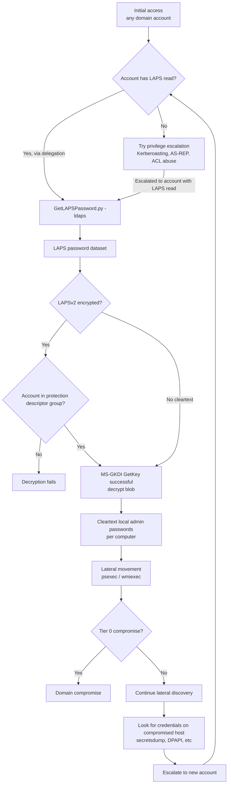

title: "GetLAPSPassword.py"
script: "examples/GetLAPSPassword.py"
category: "Recon and Enumeration"
status: "Published"
protocols:
  - LDAP
  - LDAPS
  - MS-ADTS
  - MS-GKDI
  - MS-RPCE
ms_specs:
  - MS-ADTS
  - MS-GKDI
  - MS-RPCE
mitre_techniques:
  - T1552.001
  - T1555
  - T1003.008
  - T1550.002
  - T1021.002
  - T1078.002
auth_types:
  - NTLM
  - Kerberos
  - Pass the Hash
tags:
  - impacket
  - impacket/examples
  - category/recon_and_enumeration
  - status/published
  - protocol/ldap
  - protocol/ldaps
  - protocol/ms-adts
  - protocol/ms-gkdi
  - protocol/ms-rpce
  - ms-spec/ms-adts
  - ms-spec/ms-gkdi
  - ms-spec/ms-rpce
  - technique/laps_v1_retrieval
  - technique/laps_v2_retrieval
  - technique/dpapi_ng_decryption
  - technique/gkdi_rootkey_retrieval
  - technique/ldaps_channel_binding
  - mitre/T1552.001
  - mitre/T1555
  - mitre/T1003.008
  - mitre/T1550.002
  - mitre/T1021.002
  - mitre/T1078.002
aliases:
  - GetLAPSPassword
  - laps-dumper
  - laps-password-retrieval
  - ms-laps
  - laps-v1
  - laps-v2
  - ms-mcs-admpwd
  - mslaps-password
  - mslaps-encryptedpassword


# GetLAPSPassword.py

> **One line summary:** LDAP based local admin password retrieval tool that queries Active Directory for both **legacy LAPS v1** (reading the `ms-Mcs-AdmPwd` cleartext attribute on computer objects) and **modern native Windows LAPS v2** introduced by Microsoft in April 2023 (reading either `msLAPS-Password` cleartext attribute or, when admins chose to enable encryption, the DPAPI-NG encrypted blob in `msLAPS-EncryptedPassword` which requires calling the `MS-GKDI` GroupKeyDistributionService `GetKey` RPC to obtain the group key needed for DPAPI-NG decryption), handling the complete credential retrieval chain in a single command `python GetLAPSPassword.py 'CORP.LOCAL/reader:pass@DC01' -ldaps`; authored by **Thomas Seigneuret (`@zblurx`)** and **Tyler Booth (`@dru1d-foofus`)** with code structure inspired by `GetADUsers.py` and LDAP query patterns adapted from `n00py`'s `LAPSDumper`; shipped in **Impacket 0.12.0 (September 2024)** after `@zblurx` first added the foundational `[MS-GKDI]` Group Key Distribution Protocol implementation to Impacket's core library; further hardened in **Impacket 0.13.0** which added LDAPS channel binding plus signing and fixed LAPSv2 retrieval against Windows Server 2025 DCs (per Issue #1880 - Microsoft's 2025 DC release began requiring LDAPS for LAPS password attribute access, so the `-ldaps` flag is now effectively mandatory for modern environments); the tool exists because LAPS is Microsoft's officially endorsed answer to the "how do we manage local admin passwords" problem that GPP cpassword (documented in [`Get-GPPPassword.py`](Get-GPPPassword.md)) failed to solve securely, and because any user granted read access to LAPS attributes on an OU of computers can extract the local admin passwords for every machine in that OU, making this the single highest value credential extraction primitive in a modern Active Directory after the GPP era ended; **continues Recon and Enumeration at 14 of 17 articles (82%), with three stubs remaining (`getArch.py`, `machine_role.py`, and one more to confirm) before the category closes as the 13th and final complete category for the wiki at 100% completion**.

| Field | Value |
|:---|:---|
| Script | `examples/GetLAPSPassword.py` |
| Category | Recon and Enumeration |
| Status | Published |
| Authors | Thomas Seigneuret (`@zblurx`) and Tyler Booth (`@dru1d-foofus`) |
| Original standalone home | `https://github.com/dru1d-foofus/GetLAPSPassword` (authored by dru1d-foofus, then extended by zblurx for LAPSv2 support) |
| First appearance in Impacket | **0.12.0** (September 2024) |
| Related library addition | `[MS-GKDI]` Group Key Distribution Protocol implementation added to Impacket 0.12.0 core by `@zblurx` specifically to enable this tool |
| Impacket 0.13.0 improvements | LDAPS channel binding plus signing; LDAPS based LAPS retrieval against Windows Server 2025 DCs (`@zblurx`, `@alexisbalbachan`, `@Ibrahim8879`) |
| Structure inspired by | `GetADUsers.py` |
| LDAP queries adapted from | `n00py`'s `LAPSDumper` |
| Primary protocol | LDAP (port 389) or LDAPS (port 636) - **LDAPS required for modern Windows Server 2025 DCs** |
| Primary Microsoft specifications | `[MS-ADTS]` Active Directory Technical Specification (LDAP schema, LAPS attributes); `[MS-GKDI]` Group Key Distribution Protocol (for LAPSv2 encrypted password decryption); `[MS-RPCE]` Remote Procedure Call Protocol Extensions |
| MITRE ATT&CK techniques | T1552.001 Unsecured Credentials: Credentials In Files (LAPS attribute reading); T1555 Credentials from Password Stores; T1003.008 pattern of credential in directory disclosure; T1550.002 Use Alternate Authentication Material: Pass the Hash; T1021.002 Remote Services: SMB/Windows Admin Shares; T1078.002 Valid Accounts: Domain Accounts |
| Authentication | NTLM, Kerberos (`-k`), Pass the Hash (`-hashes`) |
| Privilege required | Read access to the LAPS password attributes on target computer objects (any user with appropriate delegation, not just Domain Admins) |
| LAPS versions supported | **LAPS v1** (legacy, `ms-Mcs-AdmPwd` cleartext); **LAPS v2** (native Windows, April 2023+, `msLAPS-Password` cleartext OR `msLAPS-EncryptedPassword` DPAPI-NG encrypted) |
| LAPS v2 decryption | Handles DPAPI-NG blob structure (16-byte prefix + encrypted payload), calls `MS-GKDI GetKey` RPC to obtain root key, derives key encryption key via `compute_kek`, unwraps content encryption key via `unwrap_cek`, decrypts plaintext via `decrypt_plaintext` |
| Known issue | Issue #1880: Windows Server 2025 DCs require LDAPS for LAPS retrieval; the `-ldaps` flag is effectively mandatory in 2026 |


## Prerequisites

This article assumes familiarity with:

- [`Get-GPPPassword.py`](Get-GPPPassword.md) - the "insecure past" of local admin password management via GPP cpassword. GetLAPSPassword is the "secure present" replacement. Reading these two articles in sequence provides the complete narrative of how AD local admin password management evolved.
- [`GetADUsers.py`](GetADUsers.md) - the structural template for GetLAPSPassword.py. Both tools implement LDAP based enumeration of AD objects with the same authentication patterns and flag structure.
- **Active Directory LDAP basics**: LDAP bind authentication (Simple Bind, SASL with Kerberos), base DN structure, search filters, attribute value retrieval.
- **LAPS architecture**: originally a Microsoft-distributed MSI for Windows Server 2003-2019 (LAPS v1), then built into Windows 10/11/Server 2019+ as "Windows LAPS" (LAPS v2, April 2023 update).
- **DPAPI-NG**: the "next generation" Data Protection API used for LAPS v2 encryption. Unlike classic DPAPI (per user key material), DPAPI-NG uses group accessible root keys distributed via MS-GKDI, enabling encryption where "anyone in a protected group" can decrypt.
- **MS-GKDI Group Key Distribution Protocol**: the RPC protocol for retrieving root keys used in DPAPI-NG. The `GetKey` opnum returns a key envelope the caller can use to derive decryption keys.
- **LDAPS vs LDAP**: LDAP over TLS on port 636 (explicit TLS) or port 389 with STARTTLS. LDAPS provides confidentiality and integrity to the LDAP session, including for attribute values in responses.
- **Channel binding for LDAP**: TLS channel binding (`tls-server-end-point` in LDAP SASL context) ties the authenticated session to the TLS connection, preventing NTLM relay attacks against LDAPS.


## What it does

`GetLAPSPassword.py` connects to a domain controller via LDAP or LDAPS, searches for computer objects with LAPS related attributes, reads those attributes, decrypts them if encrypted (LAPS v2 encrypted mode), and prints the local administrator username and cleartext password for each computer the operator has permission to see.

### Default invocation against modern Windows Server 2025 DC

```text
$ python GetLAPSPassword.py 'CORP.LOCAL/laps_reader:Passw0rd@DC01.corp.local' -ldaps

Impacket v0.13.0 - Copyright Fortra, LLC and its affiliated companies

[+] Connecting to 10.10.10.10, port 636, SSL True
[+] Total of records returned 47
[+] Successfully bound

Host         LAPS Username  LAPS Password    LAPS Password Expiration  LAPSv2
-   -      
WKSTN01$     administrator  hp$R/UVbP}6t5r   2026-05-20 14:52:44       True
WKSTN02$     administrator  S(X9m@2X+-M1H;   2026-05-20 14:15:54       True
SRV-FS01$    administrator  T#9n!zVqP2LrMQ   2026-05-20 15:03:22       True
SRV-APP01$   administrator  Kj8%wE3nRbG7&t   2026-05-20 14:47:11       True
ADCS-2025$   administrator  q@L2ZpH$8Nv5X   2026-05-20 15:12:08       True
...
```

Each row shows:
- **Host**: the computer object's SAM account name (with trailing `$`).
- **LAPS Username**: the local admin account whose password is managed (often `administrator`, but LAPS v2 supports custom account names).
- **LAPS Password**: the cleartext local admin password.
- **LAPS Password Expiration**: when the current password expires and LAPS will rotate it (typically 24 hours for modern deployments).
- **LAPSv2**: `True` if the password came from native Windows LAPS (msLAPS-* attributes), `False` if from legacy LAPS v1 (ms-Mcs-AdmPwd).

The `LAPS Password Expiration` column is tactically important: passwords expiring within minutes mean the operator has limited time to use them before rotation. Passwords with expirations days away are stable for extended operations.

### Targeting a specific computer

```bash
python GetLAPSPassword.py 'CORP.LOCAL/laps_reader:Passw0rd@DC01' -ldaps -computer SRV-DC01
```

Retrieves LAPS credentials for one specific computer instead of all readable computers. Useful for focused operations and reduced LDAP query volume.

### The LAPS v1 vs LAPS v2 distinction in output

When both generations exist in the same environment (rolling migration), the output shows both:

```text
Host         LAPS Username    LAPS Password    LAPS Password Expiration  LAPSv2
-   -        
WKSTN01$     administrator    hp$R/UVbP}6t5r   2026-05-20 14:52:44       True     (msLAPS-Password)
WKSTN02$     administrator    oldSt!Ck3r2019   2026-05-18 08:00:00       True     (msLAPS-EncryptedPassword, decrypted)
LEGACY-PC$   Administrator    Legacy4321!      2026-05-19 12:00:00       False    (ms-Mcs-AdmPwd, LAPS v1)
```

The `LAPSv2: True/False` marker signals which attribute yielded the result. LAPS v1 indicates an unmigrated legacy LAPS installation; LAPS v2 indicates the modern native Windows LAPS.

### What happens without `-ldaps` against modern DCs

```text
$ python GetLAPSPassword.py 'CORP.LOCAL/laps_reader:Passw0rd@DC01'
Impacket v0.12.0 - Copyright Fortra, LLC and its affiliated companies

[+] Connecting to 192.168.116.131, port 389, SSL False
[+] Total of records returned 5
[-] No LAPS data returned
```

The attribute names appear in the schema but the values are missing from the LDAP response. This is Microsoft's Windows Server 2025 hardening: LAPS password attributes are only returned over encrypted LDAP connections. Per Issue #1880: "I suspect Microsoft added some security measure that only allows LAPS password retrieval over LDAPS." Adding `-ldaps` resolves the issue.

### Key flags

| Flag | Meaning |
|:---|:---|
| `target` (positional) | `[[domain/]username[:password]@]<dc-host>` standard Impacket target. |
| `-computer computername` | Target a specific computer by name. |
| `-outputfile OUTPUTFILE`, `-o` | Write results to a file instead of stdout. |
| `-ldaps` | Use LDAPS (port 636, TLS) instead of plain LDAP. **Required for Windows Server 2025 DCs.** |
| `-hashes LMHASH:NTHASH` | NTLM hash auth (pass the hash). |
| `-no-pass` | Skip password prompt (for `-k`). |
| `-k` | Kerberos authentication. |
| `-aesKey` | AES key for Kerberos. |
| `-dc-ip` | Specify KDC IP. |
| `-dc-host` | KDC hostname (for Kerberos SPN construction). |
| `-ts` | Timestamp log lines. |
| `-debug` | Verbose debug output. |


## Why it exists

### The local admin password problem

Every Windows computer has a built-in local Administrator account (SID ending in `-500`). In Active Directory environments, this account presents a persistent challenge:

- **Password reuse**: if all computers share the same local admin password, compromising one compromises all (classic "pass the hash across the domain").
- **Password rotation**: if each computer has a unique password, managing and storing those passwords becomes a problem.
- **Password retrieval**: when an admin needs local access (typically during incident response, disaster recovery, or legitimate administration), they need a reliable way to get the password.
- **Audit trail**: who retrieved which password when should be logged.

Historical approaches:
1. **Shared passwords**: set by image deployment, identical everywhere. Single compromise = full compromise.
2. **Algorithmic passwords**: password derived from hostname (e.g., `Admin!<hostname>2024`). Single algorithm compromise = full compromise.
3. **Group Policy Preferences cpassword**: see [`Get-GPPPassword.py`](Get-GPPPassword.md) for this disaster.
4. **LAPS v1** (2015): Microsoft's MSI-distributed tool storing unique passwords per computer in AD as the `ms-Mcs-AdmPwd` attribute.
5. **LAPS v2** (April 2023): native Windows feature, enhanced schema (`msLAPS-*` attributes), optional DPAPI-NG encryption, cleaner RBAC.

GetLAPSPassword.py extracts passwords from both LAPS v1 and LAPS v2.

### LAPS v1: the 2015 solution

LAPS v1 was distributed as a Microsoft MSI installer. When installed on a domain controller and domain members:

- **Schema extension** added `ms-Mcs-AdmPwd` (the password, stored as cleartext string) and `ms-Mcs-AdmPwdExpirationTime` (expiration timestamp).
- **Client side component** on each domain member periodically checks expiration, generates a new random password, sets the local admin password, and writes the new password to its own computer object's `ms-Mcs-AdmPwd` attribute.
- **Access control** via AD ACLs on the attribute: only principals with explicit `Control Access Right` (specifically the `ms-Mcs-AdmPwd` extended right) can read the attribute value.
- **Tooling** included PowerShell cmdlets (`Get-AdmPwdPassword`) and an ActiveDirectory Users and Computers UI extension.

The password was stored **in cleartext** in AD. Security relied entirely on AD ACLs preventing unauthorized reads. If an attacker compromised an account with `Read` permission on `ms-Mcs-AdmPwd` for an OU, they got the local admin password for every computer in that OU in cleartext.

GetLAPSPassword.py reads `ms-Mcs-AdmPwd` via standard LDAP Read when the authenticated user has the permission. No cryptography involved.

### LAPS v2: the 2023 native replacement

In April 2023, Microsoft released "Windows LAPS" as a native Windows feature built into Windows 10/11 and Server 2019+, independent of the legacy MSI. Key improvements:

- **New attribute schema**: `msLAPS-Password`, `msLAPS-EncryptedPassword`, `msLAPS-EncryptedDSRMPassword`, `msLAPS-EncryptedPasswordHistory`, `msLAPS-PasswordExpirationTime`.
- **Optional encryption**: `msLAPS-EncryptedPassword` contains a DPAPI-NG-encrypted blob; `msLAPS-Password` contains cleartext for deployments that didn't enable encryption.
- **DPAPI-NG for encryption**: leverages MS-GKDI Group Key Distribution to encrypt passwords such that only principals in a specified security group (via the `SIDs` part of the protection descriptor) can decrypt.
- **Password history**: up to N previous passwords retained.
- **DSRM password management**: manages Directory Services Restore Mode password on DCs.
- **Azure AD / Entra ID integration**: passwords stored in Entra, not AD, for Entra joined devices.
- **Policy delivery**: via Group Policy and Intune/MDM.
- **Enhanced auditing**: events 10003-10031 specifically for LAPS activity.

The encryption is the headline improvement. When `msLAPS-EncryptedPassword` is used instead of cleartext `msLAPS-Password`:

1. Client generates password.
2. Client encrypts password using DPAPI-NG with a protection descriptor specifying which SIDs can decrypt.
3. Client writes encrypted blob to `msLAPS-EncryptedPassword`.
4. Reader who is in the specified SID group can call MS-GKDI to retrieve the root key.
5. Reader derives decryption key from root key + protection descriptor.
6. Reader decrypts the blob.

Any reader NOT in the protection descriptor SID group cannot decrypt, even if they can read the attribute. This is a significant improvement over LAPS v1 where read permission equaled decryption.

### Why the tool exists

Prior to GetLAPSPassword.py, operators retrieving LAPS passwords from Linux had limited options:

- **`n00py`'s `LAPSDumper`**: Python tool focused on LAPS v1 attribute reading. GetLAPSPassword.py's LDAP queries are adapted from LAPSDumper.
- **NetExec / CrackMapExec `--laps` module**: integrated LAPS retrieval.
- **`ldapsearch` + custom scripts**: manual LDAP query followed by manual decryption for v2.
- **PowerShell `Get-LapsADPassword`** (requires Windows host).

None of these earlier than 2024 tools handled LAPS v2 encrypted mode because DPAPI-NG decryption required the MS-GKDI implementation, which wasn't available in Impacket's library until `@zblurx` added it.

GetLAPSPassword.py exists because:

1. **`@zblurx` added `[MS-GKDI]` to Impacket core** (0.12.0 library improvements), enabling DPAPI-NG decryption.
2. **`@dru1d-foofus` had written a LAPS v1 dumper** already (originally at `github.com/dru1d-foofus/GetLAPSPassword` standalone).
3. **The two authors combined** the existing LAPS v1 structure with the new DPAPI-NG capability to create the unified tool.
4. **Impacket shipped it in 0.12.0** as both authors submitted the merged version upstream.

The tool represents one of the clearest examples of **library then tool development**: adding protocol primitives to the library first (MS-GKDI in this case), then writing tools that consume those primitives (GetLAPSPassword using MS-GKDI for DPAPI-NG decryption).

### Why Impacket 0.13.0 updates were necessary

Windows Server 2025 introduced several changes impacting LAPS retrieval:

- **LAPS over LDAPS only**: plain LDAP (port 389) returns empty values for LAPS attributes.
- **Stricter LDAP signing requirements**: Microsoft's ongoing hardening of LDAP authentication.
- **Channel binding enforcement**: LDAPS connections increasingly require TLS channel binding tokens.

Issue #1880 captured the initial LDAPS only requirement (user reported "No LAPS data returned" without `-ldaps`, success with `-ldaps`). Impacket 0.13.0 added:

- LDAPS channel binding plus signing (@zblurx, @alexisbalbachan, @Ibrahim8879).
- Schema alignment with ldap3 library.
- LDAPS based LAPS retrieval against Windows Server 2025 DCs.

The ongoing work reflects Microsoft's gradual hardening of AD adjacent protocols. Each new Windows Server release tightens authentication requirements; tools need to adapt.

### The historical arc

```text
1990s-2000s: Shared local admin passwords (insecure)
     ↓
2005-2010:  Algorithmic passwords (insecure)
     ↓
2012:       GPP cpassword disclosed (insecure by design)
     ↓
2014:       MS14-025 blocks new GPP cpasswords (partial)
     ↓
2015:       LAPS v1 released (secure storage, cleartext in AD)
     ↓
2023:       Windows LAPS v2 released (native, optional encryption)
     ↓
2024:       Impacket 0.12.0 adds GetLAPSPassword.py (retrieves both)
     ↓
2025:       Windows Server 2025 requires LDAPS for LAPS
     ↓
2026:       Impacket 0.13.0 handles LDAPS channel binding
```

The tool's evolution tracks Microsoft's local admin password management evolution. Each Impacket release adapts to the latest Microsoft hardening.


## Protocol theory

### LAPS v1 schema

LAPS v1 extended the AD schema with two computer object attributes:

- **`ms-Mcs-AdmPwd`**: Unicode string, cleartext password. Searchable via LDAP when caller has `Read` permission on the attribute.
- **`ms-Mcs-AdmPwdExpirationTime`**: integer8, Windows FileTime of expiration.

Default permissions on these attributes:
- **SELF** (the computer itself): Write (so clients can update their own attribute).
- **Domain Admins**: Read (implicit via higher permissions).
- **Delegated groups**: Read (explicit grant via delegation).

The delegation model is OU based: administrators grant specific groups `Read` permission on `ms-Mcs-AdmPwd` for computers in specific OUs. A "Helpdesk" group might have Read for all workstations but not servers; a "Server Team" group might have Read for all servers; etc.

### LAPS v2 schema

LAPS v2 extended the schema further:

- **`msLAPS-Password`**: cleartext password when encryption not configured.
- **`msLAPS-EncryptedPassword`**: DPAPI-NG encrypted blob.
- **`msLAPS-EncryptedDSRMPassword`**: DSRM password for DCs.
- **`msLAPS-EncryptedPasswordHistory`**: previous passwords.
- **`msLAPS-PasswordExpirationTime`**: expiration.

Default permissions are similar to v1 (SELF writes, Domain Admins read, delegated groups read via ACL grants).

### DPAPI-NG and LAPS v2 encryption

When encryption is enabled via the `PasswordComplexity` policy, clients use DPAPI-NG to encrypt passwords. DPAPI-NG differs from classic DPAPI:

- **Classic DPAPI**: per user master keys derived from user credential material. Only the owning user can decrypt.
- **DPAPI-NG**: group accessible root keys distributed via MS-GKDI. Anyone in a specified SID group can decrypt.

The DPAPI-NG blob for LAPS v2 encrypted password:

```text
[16 bytes: encrypted password prefix]
  - 8 bytes:  PasswordUpdateTimestamp (Windows FileTime)
  - 4 bytes:  EncryptedPasswordSize
  - 4 bytes:  Reserved (zeros)
[variable: DPAPI-NG encrypted payload]
  - Content encryption key (CEK) wrapped with key encryption key (KEK)
  - Actual encrypted password
  - Protection descriptor (which SIDs can decrypt)
```

Inside the encrypted payload, when decrypted, the plaintext is JSON:

```json
{
  "n": "Administrator",
  "t": "133594080000000000",
  "p": "hp$R/UVbP}6t5r"
}
```

Where `n` is the local admin username, `t` is the FileTime when the password was generated, and `p` is the cleartext password.

### MS-GKDI GetKey protocol

`[MS-GKDI]` Group Key Distribution Protocol defines an RPC interface for retrieving root keys used in DPAPI-NG. Key operations:

- **Protocol**: DCE/RPC over TCP (dynamic endpoint via EPM).
- **UUID**: `B9785960-524F-11DF-8B6D-83DCDED72085`.
- **Authentication**: Kerberos or NTLM (GetLAPSPassword uses the LDAP authenticated identity).
- **Primary opnum**: `GetKey` - retrieves a key identifier and key envelope.

Flow for LAPS v2 decryption:

```text
1. Read msLAPS-EncryptedPassword via LDAP
2. Parse the 16-byte prefix + DPAPI-NG blob
3. Extract protection descriptor from blob (specifies which SIDs can decrypt)
4. Extract KeyIdentifier from blob
5. RPC call to MS-GKDI GetKey(KeyIdentifier) on a DC
   - Server checks caller SID against protection descriptor
   - Server returns GroupKeyEnvelope if caller is authorized
6. Use compute_kek(GroupKeyEnvelope, KeyIdentifier) to derive Key Encryption Key
7. Use unwrap_cek(blob, KEK) to extract Content Encryption Key
8. Use decrypt_plaintext(blob, CEK) to get JSON plaintext
9. Parse JSON { n: username, t: timestamp, p: password }
```

GetLAPSPassword.py implements all these steps using Impacket's `dpapi_ng` and `gkdi` modules (both added in 0.12.0).

### The authorization model

A critical subtlety: LDAP read permission on `msLAPS-EncryptedPassword` is NOT sufficient to decrypt. The protection descriptor inside the blob specifies which SIDs can decrypt. If the caller has LDAP read but is NOT in the protection descriptor group, they can read the blob but MS-GKDI GetKey will fail with access denied.

This two layer authorization model is the security improvement over LAPS v1:
- **LAPS v1**: LDAP read permission on `ms-Mcs-AdmPwd` = full password access.
- **LAPS v2**: LDAP read permission on `msLAPS-EncryptedPassword` + membership in protection descriptor group = full password access.

The second layer hardens against scenarios where LDAP read permission leaks (e.g., overbroad delegation or account compromise without group membership). For attackers, this means: getting LDAP read is no longer sufficient; you also need to be in the authorized decryption group (or compromise an account that is).

### LDAPS requirement in Windows Server 2025

Windows Server 2025 introduced a policy change: LAPS password attributes (`ms-Mcs-AdmPwd`, `msLAPS-Password`, `msLAPS-EncryptedPassword`) are only returned over LDAP connections with confidentiality protection. This means LDAPS (port 636) or LDAP+StartTLS, not plain LDAP (port 389).

The policy is likely enforced server side by checking the LDAP connection's encryption state before returning the attribute values. Plain LDAP connections see the attribute names in the schema but get empty values in search responses.

GetLAPSPassword.py supports this via the `-ldaps` flag. For 2025+ environments, `-ldaps` is effectively mandatory.

### Channel binding concerns

LDAPS connections can be relayed (ntlmrelayx can target LDAPS). Channel binding is the mitigation:

- **TLS channel binding token**: a cryptographic binding between the authenticated identity and the TLS connection.
- **SASL with channel binding**: GSSAPI or NTLM authentication over LDAPS that includes the TLS certificate hash in the auth exchange.

Without channel binding, a relay attacker can intercept LDAPS authentication from a victim and relay it to a DC to perform actions as the victim. With channel binding enforced, the relayed auth fails because the TLS session cert hash doesn't match.

Microsoft's guidance: enforce LDAP channel binding (`LdapEnforceChannelBinding=2`) on DCs. Impacket 0.13.0 added support for honoring channel binding in LDAP client code, which is necessary for tools like GetLAPSPassword to work against channel binding enforced DCs.


## How the tool works internally

### Imports

```python
from datetime import datetime

from impacket import version
from impacket.dcerpc.v5 import transport
from impacket.dcerpc.v5.epm import hept_map
from impacket.dcerpc.v5.gkdi import MSRPC_UUID_GKDI, GkdiGetKey, GroupKeyEnvelope
from impacket.dcerpc.v5.rpcrt import RPC_C_AUTHN_LEVEL_PKT_INTEGRITY, RPC_C_AUTHN_LEVEL_PKT_PRIVACY
from impacket.dpapi_ng import EncryptedPasswordBlob, KeyIdentifier, compute_kek, create_sd, decrypt_plaintext, unwrap_cek
from impacket.examples import logger
from impacket.examples.utils import parse_identity, ldap_login
from impacket.ldap import ldap, ldapasn1
from pyasn1.codec.der import decoder
```

The imports tell the tool's structure:
- `impacket.ldap` for AD query.
- `impacket.dcerpc.v5.gkdi` for MS-GKDI RPC client.
- `impacket.dcerpc.v5.epm` for Endpoint Mapper to find the GKDI endpoint.
- `impacket.dpapi_ng` for DPAPI-NG blob parsing and decryption primitives.
- `pyasn1.codec.der` for DER decoding of RPC responses.

### Main flow

Pseudocode of the core logic:

```python
def run(self):
    # Step 1: LDAP connection (plain or LDAPS)
    ldap_connection = ldap_login(
        target, baseDN, self.__kdcIP, self.__kdcHost,
        self.__doKerberos, self.__username, self.__password,
        self.__domain, self.__lmhash, self.__nthash, self.__aesKey,
        self.__ldapschemeToUse  # ldaps or ldap
    )
    
    # Step 2: LDAP search for computer objects with LAPS attributes
    search_filter = self.build_search_filter()  # includes ms-Mcs-AdmPwd, msLAPS-*
    attributes = [
        'sAMAccountName',
        'ms-Mcs-AdmPwd',                       # LAPS v1 cleartext
        'ms-Mcs-AdmPwdExpirationTime',         # LAPS v1 expiration
        'msLAPS-Password',                     # LAPS v2 cleartext
        'msLAPS-EncryptedPassword',            # LAPS v2 encrypted
        'msLAPS-PasswordExpirationTime'        # LAPS v2 expiration
    ]
    results = ldap_connection.search(
        searchFilter=search_filter,
        attributes=attributes
    )
    
    # Step 3: For each result, determine LAPS version and extract password
    for result in results:
        host = extract_sam_account(result)
        
        if has_attribute(result, 'ms-Mcs-AdmPwd'):
            # LAPS v1
            password = result['ms-Mcs-AdmPwd']
            username = 'Administrator'  # LAPS v1 always uses Administrator
            expiration = filetime_to_dt(result['ms-Mcs-AdmPwdExpirationTime'])
            laps_v2 = False
        
        elif has_attribute(result, 'msLAPS-Password'):
            # LAPS v2 cleartext
            json_content = result['msLAPS-Password']
            parsed = json.loads(json_content)  # { n, t, p }
            username = parsed['n']
            password = parsed['p']
            expiration = filetime_to_dt(result['msLAPS-PasswordExpirationTime'])
            laps_v2 = True
        
        elif has_attribute(result, 'msLAPS-EncryptedPassword'):
            # LAPS v2 encrypted - requires MS-GKDI decryption
            blob_raw = result['msLAPS-EncryptedPassword']
            username, password, timestamp = self.decrypt_laps_v2_blob(blob_raw)
            expiration = filetime_to_dt(result['msLAPS-PasswordExpirationTime'])
            laps_v2 = True
        
        else:
            continue  # No LAPS attributes present or readable
        
        self.print_result(host, username, password, expiration, laps_v2)

def decrypt_laps_v2_blob(self, blob_raw):
    # Step 1: Parse 16-byte prefix
    prefix = blob_raw[:16]
    password_update_timestamp = struct.unpack('<Q', prefix[:8])[0]
    encrypted_password_size = struct.unpack('<I', prefix[8:12])[0]
    
    # Step 2: Parse DPAPI-NG blob structure
    dpapi_ng_blob = EncryptedPasswordBlob(blob_raw[16:])
    key_identifier = KeyIdentifier(dpapi_ng_blob.key_identifier)
    protection_descriptor = create_sd(dpapi_ng_blob.protection_descriptor)
    
    # Step 3: Connect to MS-GKDI on a DC via RPC
    dce = self.connect_gkdi_rpc()
    
    # Step 4: Call GetKey RPC
    resp = GkdiGetKey(dce, target_sd=protection_descriptor,
                     root_key_id=key_identifier.root_key_identifier,
                     l0=key_identifier.l0, l1=key_identifier.l1, l2=key_identifier.l2)
    group_key_envelope = GroupKeyEnvelope(resp['pbbOut'])
    
    # Step 5: Derive KEK
    kek = compute_kek(group_key_envelope, key_identifier)
    
    # Step 6: Unwrap CEK using KEK
    cek = unwrap_cek(dpapi_ng_blob, kek)
    
    # Step 7: Decrypt plaintext using CEK
    plaintext = decrypt_plaintext(dpapi_ng_blob, cek)
    
    # Step 8: Parse JSON
    json_str = plaintext.decode('utf-16-le').rstrip('\x00')
    parsed = json.loads(json_str)
    
    return parsed['n'], parsed['p'], parsed['t']

def connect_gkdi_rpc(self):
    # Resolve GKDI endpoint via EPM
    string_binding = hept_map(self.__target, MSRPC_UUID_GKDI, protocol='ncacn_ip_tcp')
    rpc_transport = transport.DCERPCTransportFactory(string_binding)
    rpc_transport.set_credentials(
        self.__username, self.__password, self.__domain,
        self.__lmhash, self.__nthash, self.__aesKey
    )
    dce = rpc_transport.get_dce_rpc()
    dce.set_auth_level(RPC_C_AUTHN_LEVEL_PKT_PRIVACY)
    dce.connect()
    dce.bind(MSRPC_UUID_GKDI)
    return dce
```

Real implementation includes error handling, authentication edge cases, and output formatting, but the architecture is exactly that.

### The LDAP search filter

The search filter typically includes `(objectCategory=computer)` combined with any user-provided `-computer` filter. The tool requests all LAPS attributes at once; the LDAP server returns only those the caller can read, omitting others silently.

### The GKDI RPC call

MS-GKDI is a dynamic endpoint (not at a fixed port). The tool:

1. Calls EPM (Endpoint Mapper) at TCP 135.
2. Queries for the GKDI UUID.
3. Gets back a dynamic TCP port (e.g., 49670).
4. Connects to that port.
5. Binds to the GKDI interface.
6. Calls GetKey.

Authentication uses the same credentials as the LDAP connection, with auth level set to `RPC_C_AUTHN_LEVEL_PKT_PRIVACY` (encryption required).

### What the tool does NOT do

- Does NOT write or modify LAPS attributes. Read only enumeration.
- Does NOT rotate LAPS passwords (that's the client side job).
- Does NOT bypass access control. If the account lacks LDAP read OR is not in the protection descriptor group, retrieval fails.
- Does NOT decrypt `msLAPS-EncryptedDSRMPassword` (DSRM passwords). Out of current scope.
- Does NOT retrieve password history (`msLAPS-EncryptedPasswordHistory`). Current passwords only.
- Does NOT integrate with Entra ID / Azure AD (LAPS passwords for Entra joined devices live in Entra, not AD).
- Does NOT validate retrieved passwords against the target host. Discovery only; test with psexec/wmiexec separately.
- Does NOT detect which protection descriptor groups a user is in. If MS-GKDI GetKey fails, the tool reports the error.
- Does NOT support unauthenticated / anonymous queries. LAPS read always requires authentication.
- Does NOT scrape passwords across multiple DCs. Single DC per invocation.
- Does NOT handle GMSA or gMSA account passwords (those are separate attributes and mechanisms).


## Practical usage

### Basic invocation against LDAPS

```bash
python GetLAPSPassword.py 'CORP.LOCAL/reader:Passw0rd@DC01.corp.local' -ldaps
```

Recommended default for any 2024+ environment.

### With NTLM hash

```bash
python GetLAPSPassword.py -hashes :NTHASH 'CORP.LOCAL/reader@DC01.corp.local' -ldaps
```

Pass the hash against LDAPS. Useful when the reader account's NT hash is known (e.g., from secretsdump or LSASS dump).

### With Kerberos

```bash
# Get TGT
getTGT.py 'CORP.LOCAL/reader:Passw0rd'
export KRB5CCNAME=reader.ccache

# Use it
python GetLAPSPassword.py -k -no-pass 'CORP.LOCAL/reader@DC01.corp.local' -ldaps -dc-ip 10.10.10.10
```

Kerberos authentication with a cached ticket.

### Targeting a specific computer

```bash
python GetLAPSPassword.py 'CORP.LOCAL/reader:Passw0rd@DC01' -ldaps -computer SRV-APP01
```

Single computer retrieval. Minimal LDAP query volume, minimal visibility to defenders.

### Bulk retrieval with output file

```bash
python GetLAPSPassword.py 'CORP.LOCAL/reader:Passw0rd@DC01' -ldaps -o laps_creds.txt
```

All readable LAPS passwords written to file for batch processing.

### Combined workflow: enumerate then retrieve

```bash
# Phase 1: identify computer objects in AD
GetADComputers.py 'CORP.LOCAL/reader:Passw0rd@DC01' -all | grep -oE '\w+\$' > computers.txt

# Phase 2: retrieve LAPS for each (though bulk is usually more efficient)
for comp in $(cat computers.txt | sed 's/\$$//'); do
    python GetLAPSPassword.py 'CORP.LOCAL/reader:Passw0rd@DC01' -ldaps -computer "$comp"
done
```

In practice, a single bulk GetLAPSPassword run is more efficient than per computer queries. Per computer is useful for targeted operations where minimizing visibility matters.

### Integration in a pentesting workflow

```bash
# Phase 1: compromise any domain account
# ... initial access ...

# Phase 2: check for LAPS delegated accounts via BloodHound
# Look for edges like "ReadLAPSPassword" or group membership giving LAPS access

# Phase 3: if the compromised account has LAPS read:
python GetLAPSPassword.py 'CORP.LOCAL/compromised:pass@DC01' -ldaps > laps_creds.txt

# Phase 4: lateral movement with retrieved credentials
# For each (host, password) tuple:
psexec.py -hashes : "Administrator:$password@$host"
# Or cleartext:
wmiexec.py "$host/Administrator:$password@$host"
```

The key question: does the compromised account have LAPS read on any OUs? BloodHound's `ReadLAPSPassword` edge answers this. If yes, LAPS is frequently the fastest path from "any domain user" to "local admin on many hosts."

### Defensive audit

```bash
# Quarterly check: what accounts can read LAPS? what can they access?
# Use a known high-LAPS read account to verify retrievability:
python GetLAPSPassword.py 'CORP.LOCAL/auditor:Passw0rd@DC01' -ldaps -o laps_audit_2026Q2.txt

# Review:
# - Are all expected computers in the output?
# - Are any unexpected accounts also able to read? (run with lower privilege test account)
# - Are LAPSv2 values used throughout, or are some still on LAPS v1?
```

Aggregating these results across test accounts reveals the delegation topology and any overpermissive grants.

### Migration verification

```bash
# After migrating LAPS v1 → LAPS v2, verify every computer is on v2:
python GetLAPSPassword.py 'CORP.LOCAL/auditor:Passw0rd@DC01' -ldaps | grep -c "False"
# Count of "False" should be zero post migration (no computer should still use ms-Mcs-AdmPwd)
```

### Testing channel binding enforcement

```bash
# Test that LDAPS without channel binding fails:
# (requires a client that sends auth without CB token - older Impacket versions or specific tools)
# If CB is enforced, older tools fail; newer Impacket 0.13.0 succeeds.
# This isn't directly testable from GetLAPSPassword's flags but confirmed by whether older versions work.
```

### Key flags (repeat for quick reference)

| Flag | Meaning |
|:---|:---|
| `target` (positional) | `[[domain/]username[:password]@]<dc-host>` |
| `-computer` | Target specific computer |
| `-ldaps` | **Required for Windows Server 2025 DCs**; strongly recommended always |
| `-outputfile, -o` | Results to file |
| `-hashes LMHASH:NTHASH` | NTLM hash auth |
| `-no-pass`, `-k`, `-aesKey` | Kerberos variants |
| `-dc-ip`, `-dc-host` | DC specification |
| `-ts`, `-debug` | Logging |


## What it looks like on the wire

### LDAP session (LDAPS)

```text
TCP handshake → DC:636
    TLS handshake (exchange certs, establish session keys)
    [From here, all traffic encrypted - limited visibility to passive observer]
    LDAP BindRequest (NTLM or SASL with Kerberos or GSSAPI)
    LDAP BindResponse success
    LDAP SearchRequest:
        baseObject: DC=corp,DC=local
        scope: wholeSubtree
        filter: (&(objectCategory=computer)...)
        attributes: [sAMAccountName, ms-Mcs-AdmPwd, msLAPS-Password,
                     msLAPS-EncryptedPassword, ...]
    LDAP SearchResEntry (one per matching computer, with LAPS attribute values)
    LDAP SearchResDone
    LDAP UnbindRequest
    TCP FIN
```

To a passive network observer, LDAPS traffic is opaque - just TCP bytes. Volume and timing may indicate LDAP activity but content is encrypted.

### LDAP session (plain LDAP)

```text
TCP handshake → DC:389
    LDAP BindRequest
    LDAP BindResponse
    LDAP SearchRequest (same as above)
    LDAP SearchResEntry
        (on Windows Server 2025: attributes present but values empty for LAPS attrs)
        (on older servers: attributes populated with actual values)
    LDAP SearchResDone
    LDAP UnbindRequest
```

Plain LDAP traffic is visible to packet capture, including attribute values. This is one reason Microsoft moved to LDAPS only for LAPS: plain LDAP leaked passwords to anyone who could sniff.

### MS-GKDI GetKey exchange (LAPS v2 encrypted only)

After LDAP returns the encrypted blob, the tool makes a separate RPC connection:

```text
TCP handshake → DC:135 (Endpoint Mapper)
    DCE/RPC bind to EPM
    ept_map(GKDI_UUID) request
    ept_map response with dynamic port (e.g. 49670)
    TCP FIN to EPM

TCP handshake → DC:49670 (GKDI dynamic endpoint)
    DCE/RPC bind to GKDI interface
    Authentication exchange (NTLM or Kerberos)
    GkdiGetKey request with KeyIdentifier
    GkdiGetKey response with GroupKeyEnvelope (encrypted payload)
    TCP FIN
```

Two separate TCP connections: EPM on 135, then GKDI on the dynamic port.

### Wire volume

For 100 computers with LAPS in a typical environment:

- **LDAP search**: ~100 KB request, ~1-5 MB response (one SearchResEntry per computer, attribute values included).
- **MS-GKDI GetKey**: only called if encrypted LAPS v2 passwords present. One call per unique KeyIdentifier (not per computer). Typically 1-5 calls total regardless of computer count.

Total traffic per run: modest. Seconds to complete.

### Wireshark filtering

```text
ldap.baseObject contains "DC=corp"
# Filter to LDAP searches in the target domain
```

For LDAPS, limited to metadata since content is encrypted:

```text
tls.handshake.extensions_server_name contains "dc01"
# See which hosts are being connected to
```

For GKDI:

```text
dcerpc.uuid == "b9785960-524f-11df-8b6d-83dcded72085"
# Filter GKDI RPC traffic
```

### Wire volume signature

Distinctive patterns:
- **LDAP search with LAPS attributes in request**: the attribute list itself is diagnostic if captured.
- **MS-GKDI traffic**: unusual outside of legitimate LAPS v2 decryption by authorized readers.
- **Both in close succession**: LDAP query followed shortly by GKDI call from same source = LAPS v2 encrypted retrieval.


## What it looks like in logs

### Domain controller Windows Security log

For LDAP authentication:

- **Event 4624** (logon): one at bind time.
- **Event 4634** (logoff): at unbind.

For LDAP query activity (if enabled):

- **Event 1644** (LDAP search): requires specific DS diagnostic logging. Shows search filter, attributes requested, caller. High volume, usually not enabled by default.
- **Directory Service event 4662** (object access audit): if "Audit Directory Service Access" is enabled and SACL is set on computer objects, accessing LAPS attributes generates this event with the specific attribute and caller. Highest-value signal.

### LAPS specific events

LAPS v2 generates its own events:

- **Event 10003-10031** in the "LAPS" operational log (Applications and Services Logs → Microsoft → Windows → LAPS):
    - 10003: password expiration checked.
    - 10004: password generated.
    - 10005: password rotated.
    - 10018: password retrieval auditing (when enabled).

Event 10018 is particularly valuable for defenders: when explicitly enabled, it logs every LAPS password retrieval by name of reader and target computer. Enabling this provides per retrieval audit trail.

### Event 4662 in detail

For a GetLAPSPassword run against 100 computers:

- 100 separate Event 4662 records, one per computer object accessed.
- Each event shows:
    - Caller SID (the authenticated user).
    - Object GUID (the computer object).
    - Properties accessed (the ms-Mcs-AdmPwd or msLAPS-* attribute GUID).
    - Access mask (Read, typically).

SIEM correlation can alert on:
- High volume of 4662 events for LAPS attributes from one source.
- LAPS attribute access by accounts that shouldn't need it.
- LAPS retrievals outside business hours.

### Sigma rule example

```yaml
title: LAPS Password Mass Retrieval
logsource:
  product: windows
  service: security
detection:
  selection_laps_read:
    EventID: 4662
    ObjectType: 'computer'
    Properties|contains:
      - 'ms-Mcs-AdmPwd'          # LAPS v1
      - 'msLAPS-Password'        # LAPS v2 cleartext
      - 'msLAPS-EncryptedPassword'  # LAPS v2 encrypted
  threshold_many_computers:
    SubjectUserName: single
    distinct_objects: '> 10'
    timeframe: 60s
  condition: selection_laps_read and threshold_many_computers
level: high
```

High severity because bulk LAPS retrieval from a single account in a short window is operationally rare for legitimate use.

### EDR behavioral detection

Modern EDR products increasingly detect:

- **Impacket tool signatures** including GetLAPSPassword.py network patterns.
- **MS-GKDI access from unusual processes** (normally only LAPS client code calls GKDI on endpoints, not from workstations).
- **LDAP query patterns**: bulk computer object enumeration with LAPS attributes.

Coverage varies; honeypot LAPS attributes deployed for specific accounts ("canary LAPS") are an effective detection technique.

### Honeypot LAPS detection

A high signal detection strategy:

1. Create a computer object in AD that doesn't correspond to any real machine ("HONEY-WKSTN01").
2. Populate its `ms-Mcs-AdmPwd` attribute with a password that contains a distinctive string.
3. Set ACLs so the honey attribute is readable by all principals who can read any LAPS password.
4. Monitor Event 4662 for reads of the honey object's LAPS attribute.
5. Any read = attacker reconnaissance with high confidence.

This technique has zero false positive rate: nobody has a legitimate reason to read HONEY-WKSTN01's password. Any access is alert worthy.


## Detection and defense

### Detection approach

- **Directory Service object access auditing (Event 4662)**: the canonical signal for LAPS attribute access. Requires enabling "Audit Directory Service Access" and setting SACL on computer objects or OU. Volume can be high; SIEM correlation essential.
- **LAPS operational logs (Events 10018 etc)**: event 10018 specifically for retrieval auditing when enabled.
- **LDAP query logging (Event 1644)**: shows search filter and attributes requested. Useful but high volume.
- **Honey LAPS objects**: decoy computer objects with honey LAPS attributes. Zero false positives.
- **EDR behavioral correlation**: bulk LDAP computer enumeration followed by MS-GKDI activity.
- **Network monitoring on MS-GKDI**: rare enough outside legitimate use that any anomalous access warrants investigation.

### Preventive controls

- **Minimize LAPS read delegation**: grant read permission only to specific groups needing it. Avoid broad delegation to large groups.
- **Use LAPS v2 with encryption**: the protection descriptor adds a second authorization layer. Even if an attacker compromises an account with LDAP read, they also need to be in the encryption group to decrypt.
- **Enforce LDAPS for LAPS**: Windows Server 2025 does this by default; earlier versions can be configured. Prevents plain LDAP from leaking passwords.
- **Enforce LDAP channel binding**: `LdapEnforceChannelBinding=2` registry setting on DCs. Prevents NTLM relay to LDAP/LDAPS for authentication.
- **Enable LAPS retrieval auditing**: LAPS v2 supports this via Group Policy. Event 10018 fires on every retrieval.
- **Monitor delegation changes**: any modification to `ReadLAPSPassword` ACLs should trigger alerts. Attackers with sufficient privilege sometimes grant themselves LAPS read then retrieve.
- **Use just in time access**: rather than standing LAPS read permissions, use PAM systems that grant temporary access for specific retrievals with audit trail.
- **Minimize accounts with LDAP read across all of AD**: some accounts (e.g. service accounts used by scripts) have LDAP read everywhere; these should not also have LAPS read.

### What GetLAPSPassword.py does NOT enable

- Does NOT bypass LDAP access control. If the account lacks read permission, tool fails.
- Does NOT bypass DPAPI-NG protection descriptor checks. If the account isn't in the protection group, decryption fails.
- Does NOT establish persistence.
- Does NOT compromise the domain controller itself (beyond what the authenticated account already has permission for).
- Does NOT directly move laterally (though the credentials it finds enable lateral movement).

### What GetLAPSPassword.py CAN enable

- **Mass local admin credential collection** when the authenticated account has LAPS read across many computers.
- **Rapid lateral movement** across the domain using the collected credentials.
- **Privilege escalation** if collected credentials include high value systems (Tier 1 or Tier 0 servers).
- **Persistence via local accounts** that LAPS may not rotate or that have been excluded from LAPS management.

The tool is a reconnaissance and credential access primitive. Its impact comes from the credentials themselves, not from the tool's actions.


## Related tools and attack chains

GetLAPSPassword.py **continues Recon and Enumeration at 14 of 17 articles (82%)**. Three stubs remain (`getArch.py`, `machine_role.py`, plus one more) before the category closes as the 13th and final complete category.

### Related Impacket tools

- [`Get-GPPPassword.py`](Get-GPPPassword.md) - the predecessor technique. GPP cpassword was the insecure answer to local admin password management; LAPS is the secure replacement. Reading these two articles together tells the complete evolution story.
- [`GetADUsers.py`](GetADUsers.md) - structural inspiration for GetLAPSPassword.py. Same LDAP based enumeration pattern, same authentication flags, same flag layout.
- [`GetADComputers.py`](GetADComputers.md) - companion tool for enumerating computer objects. Use before GetLAPSPassword to map the computer topology.
- [`findDelegation.py`](findDelegation.md) - find accounts with unusual permissions. Can identify accounts with LAPS read delegation.
- [`secretsdump.py`](../03_credential_access/secretsdump.md) - different credential extraction. secretsdump requires admin on target; GetLAPSPassword requires LAPS read on AD attributes - much lower bar.
- [`psexec.py`](../04_remote_execution/psexec.md), [`wmiexec.py`](../04_remote_execution/wmiexec.md) - natural follow ups once LAPS credentials are retrieved.

### External alternatives

- **`n00py/LAPSDumper`** at `https://github.com/n00py/LAPSDumper`: the Python tool whose LDAP queries GetLAPSPassword adapted. LAPS v1 only.
- **`Get-LapsADPassword`** (PowerShell, Windows native): Microsoft's own cmdlet for LAPS retrieval. Requires Windows host and RSAT.
- **`Get-AdmPwdPassword`** (PowerShell, LAPS v1 legacy cmdlet): Microsoft's original LAPS v1 cmdlet from the MSI installation.
- **`NetExec --laps`** (NetExec): integrated LAPS retrieval. Simpler output format, part of larger toolkit.
- **`ldapsearch`** with custom scripting: manual LDAP query + manual decryption. Useful for unusual scenarios.
- **BloodHound `ReadLAPSPassword` edge**: graphs the LAPS delegation topology for visualization. Doesn't retrieve passwords directly but shows who could.
- **Custom Impacket scripts**: any operator can write `ldap.search` + `dpapi_ng.decrypt` manually. GetLAPSPassword is the polished ready made version.

### The credential chain



The LAPS retrieval is one step in a larger attack chain, but a high leverage one. An account with LAPS read on many computers is nearly as valuable as an account with domain admin - different in nature (no global AD privilege) but equivalent in terms of lateral movement capability.

### The AD local admin password evolution

```mermaid
flowchart LR
    A[1990s: Shared passwords<br>- Same everywhere<br>- Single compromise = full] --> B[2000s: Algorithmic<br>- Derived from hostname<br>- Single algo compromise = full]
    B --> C[2012: GPP cpassword<br>- Unique per OU<br>- Published AES key<br>- Get-GPPPassword recovers]
    C --> D[2014: MS14-025<br>- No new cpasswords<br>- Legacy remains]
    D --> E[2015: LAPS v1<br>- Unique per computer<br>- Stored cleartext in AD<br>- ACL-only protection]
    E --> F[2023: Windows LAPS v2<br>- Native Windows<br>- Optional DPAPI-NG encryption<br>- Protection descriptor groups]
    F --> G[2024: GetLAPSPassword.py<br>- Retrieves v1 and v2<br>- MS-GKDI decryption]
    G --> H[2025: WS2025 LDAPS requirement<br>- Plain LDAP returns empty<br>- Issue #1880]
    H --> I[2026: Channel binding enforcement<br>- Relay protection<br>- Impacket 0.13.0 adaptation]
    I --> J[Future: Entra ID LAPS<br>- Cloud managed passwords<br>- New attack surface]
```



Each generation fixed the previous generation's fatal flaw:
- Shared → Algorithmic: different password per host.
- Algorithmic → GPP: stored in AD, not derivable.
- GPP → LAPS v1: not published AES key; relies on ACLs.
- LAPS v1 → LAPS v2: encryption added; two layer authorization.
- LAPS v2 plain LDAP → LDAPS: encryption of transmission.
- LDAPS → LDAPS + channel binding: relay protection.

The pattern: each fix took years to deploy widely. Organizations often run multiple generations simultaneously during migration. GetLAPSPassword.py handles both v1 and v2 precisely because real environments have both.

### The "insecure past to secure present" narrative pairing

[`Get-GPPPassword.py`](Get-GPPPassword.md) and GetLAPSPassword.py are two halves of a single story:

- **Get-GPPPassword**: finds credentials in the insecure legacy system. The fact that it still works in 2026 shows the legacy system's fallout.
- **GetLAPSPassword**: finds credentials in the secure replacement system. The fact that it works shows the replacement isn't bulletproof either - just significantly harder to abuse without proper delegation.

Together they illustrate a general principle of security engineering: new systems improve on old systems' specific failures but introduce new failure modes. The Get-GPPPassword failure mode was "AES key published"; the GetLAPSPassword failure mode is "delegation scope too broad." Different problem, but the root cause (inadequate access control on high value credentials) is the same.


## Further reading

- **Impacket GetLAPSPassword.py source** at `https://github.com/fortra/impacket/blob/master/examples/GetLAPSPassword.py`. Canonical implementation with author attribution.
- **Impacket 0.12.0 release notes and ChangeLog** at `https://github.com/fortra/impacket/blob/master/ChangeLog.md`. First appearance of GetLAPSPassword.py and the MS-GKDI library addition.
- **Impacket Issue #1880** at `https://github.com/fortra/impacket/issues/1880`. The Windows Server 2025 LDAPS only requirement discovery.
- **Original standalone repo** at `https://github.com/dru1d-foofus/GetLAPSPassword`. Tyler Booth's original LAPS v1 dumper that became the Impacket version.
- **`@zblurx`'s lapsv2_decryptor.py gist** at `https://gist.github.com/zblurx/009633b2db25918bdbbff664a01508fc`. The standalone LAPSv2 decryptor that preceded MS-GKDI integration into Impacket.
- **n00py's LAPSDumper** at `https://github.com/n00py/LAPSDumper`. The LDAP query reference.
- **Impacket `dpapi_ng.py`** at `https://github.com/fortra/impacket/blob/master/impacket/dpapi_ng.py`. The DPAPI-NG decryption primitives GetLAPSPassword uses.
- **Impacket `gkdi.py`** at `https://github.com/fortra/impacket/blob/master/impacket/dcerpc/v5/gkdi.py`. MS-GKDI RPC client.
- **`[MS-ADTS]` Active Directory Technical Specification** at `https://learn.microsoft.com/en-us/openspecs/windows_protocols/ms-adts/`. LDAP schema and LAPS attributes.
- **`[MS-GKDI]` Group Key Distribution Protocol** at `https://learn.microsoft.com/en-us/openspecs/windows_protocols/ms-gkdi/`. The protocol GetLAPSPassword uses for LAPSv2 decryption.
- **Microsoft Windows LAPS documentation** at `https://learn.microsoft.com/en-us/windows-server/identity/laps/`. Official LAPS v2 administration guide.
- **Microsoft LAPS v1 documentation** at `https://learn.microsoft.com/en-us/defender-for-identity/cas-isp-laps`. Legacy LAPS context.
- **Windows Server 2025 LAPS changes** at `https://learn.microsoft.com/en-us/windows-server/identity/laps/laps-technical-overview-ws2025`. The LDAPS requirement documentation.
- **BloodHound `ReadLAPSPassword` edge documentation** at `https://bloodhound.readthedocs.io/`. LAPS delegation graph analysis.
- **TrimarcSecurity and other LAPS security writeups**: various detailed analyses of LAPS attack and defense.
- **MITRE ATT&CK T1552.001 Unsecured Credentials: Credentials In Files** at `https://attack.mitre.org/techniques/T1552/001/`.
- **MITRE ATT&CK T1555 Credentials from Password Stores** at `https://attack.mitre.org/techniques/T1555/`.
- **SpecterOps blog on LAPS attacks** and related AD research.

If you want to internalize GetLAPSPassword.py, the productive exercise has three parts. First, in a lab Active Directory environment (Windows Server 2019+ recommended for LAPS v2), deploy LAPS v2 via Group Policy, configure a subset of computers to use encryption (set `msLAPS-EncryptedPassword` protection descriptor to a specific group), and observe in LDAP browser (ADSIEdit or LDP.exe) that `msLAPS-Password` is cleartext for some computers and `msLAPS-EncryptedPassword` is a binary blob for others. Second, from a Linux VM authenticated as a user in the authorized decryption group, run `python GetLAPSPassword.py 'DOMAIN/user:pass@DC' -ldaps` and observe both cleartext and encrypted retrievals succeeding, with the LAPSv2 column correctly marking which is which. Third, from a user authenticated as someone NOT in the decryption group, observe that cleartext LAPS v2 entries still return (if LDAP read is granted), but encrypted entries fail with MS-GKDI access denied - demonstrating the two layer authorization model. This exercise builds intuition for the LAPS v2 improvements over v1 and makes the protection descriptor concrete. The deeper lesson: cryptography in credential storage is not magic protection; it's an additional access control layer on top of existing LDAP ACLs. The security comes from both layers being correctly configured. When either layer is overpermissive (broad LDAP delegation, or broad protection descriptor groups), the cryptographic protection provides less benefit. GetLAPSPassword.py makes both layers visible, and the operational question every deployment should answer is: who, exactly, is in the protection descriptor group for our production LAPS passwords?
