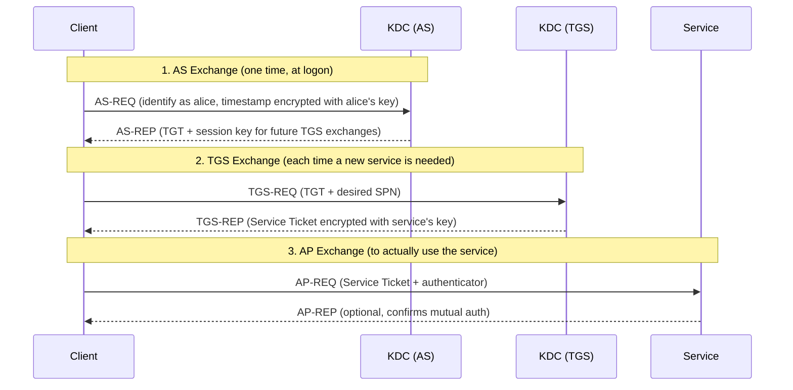

title: "GetUserSPNs.py"
script: "examples/GetUserSPNs.py"
category: "Recon and Enumeration"
status: "Published"
protocols:
  - Kerberos
  - LDAP
  - MS-KILE
ms_specs:
  - MS-KILE
  - MS-ADTS
  - RFC 4120
  - RFC 4757
  - RFC 3961
mitre_techniques:
  - T1558.003
  - T1087.002
  - T1069.002
  - T1003
auth_types:
  - password
  - nt_hash
  - aes_key
  - kerberos_ccache
  - as_rep_roastable_account
tags:
  - impacket
  - impacket/examples
  - category/recon_and_enumeration
  - status/published
  - protocol/kerberos
  - protocol/ldap
  - authentication/kerberos
  - authentication/ntlm
  - technique/kerberoasting
  - technique/credential_access
  - technique/offline_cracking
  - mitre/T1558/003
  - mitre/T1087/002
  - mitre/T1069/002
  - mitre/T1003
aliases:
  - GetUserSPNs
  - impacket-GetUserSPNs
  - kerberoast
  - kerberoasting


# GetUserSPNs.py

> **One line summary:** Queries Active Directory for user accounts that have Service Principal Names set, requests Kerberos Service Tickets for those SPNs, and outputs the encrypted portion of each ticket in a format ready for offline password cracking with hashcat or John the Ripper.

| Field | Value |
|:---|:---|
| Script | `examples/GetUserSPNs.py` |
| Category | Recon and Enumeration |
| Status | Published |
| Primary protocols | Kerberos, LDAP |
| Primary Microsoft specifications | `[MS-KILE]`, `[MS-ADTS]`, RFC 4120, RFC 4757, RFC 3961 |
| MITRE ATT&CK techniques | T1558.003 Kerberoasting, T1087.002 Domain Account Discovery, T1069.002 Domain Groups, T1003 OS Credential Dumping |
| Authentication types supported | Password, NT hash, AES key, Kerberos ccache, an AS-REP roastable account via `-no-preauth` |
| First appearance in Impacket | 2014 (immediately after Tim Medin's original Kerberoasting research) |
| Original authors | Alberto Solino (`@agsolino`), based on research by Tim Medin and Python implementation by `@skelsec` |


## Prerequisites

This article builds on:

- [`00_Introduction_and_Architecture.md`](Introduction_and_Architecture.md) for the Impacket stack.
- [`smbclient.py`](../05_smb_tools/smbclient.md) for the four authentication modes (password, NT hash, AES key, Kerberos ccache). The same modes work here.
- [`samrdump.py`](samrdump.md) for SIDs, RIDs, and the `UserAccountControl` flag table. This article treats those concepts as given.

Unlike the previous articles, you do not need [`rpcdump.py`](rpcdump.md) for this one. Kerberos does not ride on MSRPC. It has its own ports (TCP and UDP 88) and its own wire format based on ASN.1 and RFC 4120.

This is the **first Kerberos heavy article in the wiki**. Every future Kerberos article (`getTGT.py`, `getST.py`, `ticketer.py`, `getPac.py`, `goldenPac.py`, `GetNPUsers.py`, `keylistattack.py`, `raiseChild.py`) assumes the Kerberos protocol theory from this article. Take your time on section four.


## What it does

`GetUserSPNs.py` runs in two stages.

**Stage one is LDAP discovery.** The tool authenticates to a domain controller with any valid domain credential, submits an LDAP query asking for every user account whose `servicePrincipalName` attribute is populated, and filters out accounts that are disabled. The result is a list of service accounts that the domain's Kerberos Key Distribution Center will happily issue tickets for.

**Stage two is Kerberos ticket harvesting.** For each SPN found in stage one, the tool sends a Kerberos `TGS-REQ` to the KDC asking for a Service Ticket bound to that SPN. The KDC responds with a `TGS-REP` containing a ticket encrypted with the service account's password derived key. The tool extracts that encrypted blob, formats it as a `$krb5tgs$...` string, and writes it to stdout or a file.

The encrypted portion of each ticket can then be cracked offline with hashcat or John the Ripper. If the password is in a reasonable wordlist, or short enough to brute force, the attacker recovers the plaintext password of the service account. That account often has administrative rights on servers, which is why this attack is one of the most productive and widely used techniques against Active Directory environments in 2026.

The entire workflow runs from a single valid domain credential. You do not need administrator rights. You do not need elevated privileges anywhere. The Kerberos protocol is designed to hand out service tickets to any authenticated user for any registered SPN, and the cryptographic protection of those tickets depends entirely on the strength of the service account's password. `GetUserSPNs.py` automates exploitation of that design decision.


## Why it exists

**Tim Medin** presented the original Kerberoasting technique at SANS Hackfest in November 2014 in a talk titled "Attacking Microsoft Kerberos: Kicking the Guard Dog of Hades." Medin's insight was straightforward in hindsight and surprising at the time: an ordinary domain user could request service tickets for any SPN, the tickets were encrypted with the service account's key, and the tickets could be cracked offline because there was no online interaction with the KDC during cracking. No lockout policy to worry about. No detection unless the defender was specifically watching for the request pattern.

Within months, tools implementing the technique appeared. `@skelsec` produced a Python implementation called PyKerberoast. PowerShell offensive security tools picked up the pattern through Will Schroeder's `Invoke-Kerberoast`. Benjamin Delpy added support in `mimikatz`. Microsoft provided a C# implementation, perhaps unintentionally, through the legitimate `setspn.exe -Q` command.

`GetUserSPNs.py` was Alberto Solino's port of the attack into Impacket, based on `@skelsec`'s work. The tool shipped with the additional ability to authenticate using a password, an NT hash, an AES key, or an existing Kerberos ticket. That flexibility is what made it the attacker's default choice for Kerberoasting from Linux.

More than a decade later the attack still works. Microsoft has hardened many parts of Active Directory in the intervening years, but service accounts with weak passwords remain the single most productive finding in most red team engagements. Service accounts created in 2008, set to never expire, used by applications nobody fully owns anymore, with passwords set by administrators who are no longer at the company, sitting quietly in domains that have since been merged and trusted across acquisitions. Those accounts are the Kerberoasting target population. `GetUserSPNs.py` finds them.


## The protocol theory

The rest of this wiki depends on what is in this section. If you are new to Kerberos, read it slowly. If you already know Kerberos, skim it for the specific emphasis on where Kerberoasting fits.

### Kerberos in one paragraph

Kerberos is a network authentication protocol designed at MIT in the 1980s to let clients and servers prove their identities to each other over an untrusted network without sending reusable passwords across the wire. It uses symmetric cryptography and a trusted third party called the Key Distribution Center. Clients obtain time limited credentials called tickets from the KDC. They present those tickets to services, which verify them using keys shared with the KDC. The version used by Windows is specified in RFC 4120 and extended for Microsoft specifics in `[MS-KILE]`.

### The cast of characters

Three parties participate in every Kerberos exchange.

- **Client.** A user or computer initiating the authentication. Represented in Kerberos by a **user principal name** such as `alice@CORP.LOCAL`. The client holds a secret key derived from the user's password.
- **Key Distribution Center (KDC).** The trusted third party. In an Active Directory environment, every domain controller runs a KDC. The KDC knows the keys of every principal in the domain because it has access to the Active Directory database where those keys are stored.
- **Service.** The resource the client wants to use. Represented by a **service principal name** such as `MSSQLSvc/sql01.corp.local:1433`. The service account backing the SPN holds a secret key derived from its password.

The KDC has two logical components that show up in the exchanges:

- **Authentication Service (AS).** Issues Ticket Granting Tickets.
- **Ticket Granting Service (TGS).** Issues Service Tickets.

### Keys and encryption

Every Kerberos principal has a **long term key**. For a user, that key is derived from the user's password by a defined algorithm (RFC 3961). For a computer, the key is derived from the computer account's password, which Windows rotates automatically every thirty days. Kerberos supports several key derivation algorithms, identified by **encryption type** numbers:

| Encryption type | Number | Derivation | Current status |
|:---|:---|||
| DES-CBC-CRC | 1 | DES from password | Disabled by default since Windows 7 / 2008 R2 |
| DES-CBC-MD5 | 3 | DES from password | Disabled by default since Windows 7 / 2008 R2 |
| RC4-HMAC | 23 (0x17) | NT hash (MD4 of UTF-16 password) | Still enabled for backward compatibility |
| AES128-CTS-HMAC-SHA1-96 | 17 (0x11) | PBKDF2 based | Modern default for AES128 capable accounts |
| AES256-CTS-HMAC-SHA1-96 | 18 (0x12) | PBKDF2 based | Modern default for AES256 capable accounts |

The critical detail for Kerberoasting: **when encryption type 23 (RC4-HMAC) is used, the key that encrypts a ticket is literally the account's NT hash.** That means a cracker that recovers the plaintext password from a ticket encrypted with RC4 also recovers the NT hash, because the two are identical. AES based keys, by contrast, are derived through a salted key derivation function and take longer to crack. More on this below.

### The three Kerberos exchanges

Kerberos has three standard exchanges. A complete session from login to resource access uses all three. `GetUserSPNs.py` cares mostly about the second one, but understanding all three is necessary.



**AS Exchange.** The client sends an `AS-REQ` containing its user principal name and a timestamp encrypted with the user's long term key. That encrypted timestamp is the **preauthentication data**. It proves the client knows the password without sending the password itself. If the KDC successfully decrypts the timestamp, it issues an `AS-REP` containing a **Ticket Granting Ticket (TGT)**, which is encrypted with the KDC's own key (the `krbtgt` account's key), along with a session key for future TGS exchanges. The client keeps the TGT and the session key. The TGT is the client's proof of initial authentication.

**TGS Exchange.** When the client wants to access a service, it sends a `TGS-REQ` to the KDC containing the TGT, a timestamp encrypted with the TGS session key, and the SPN of the target service. The KDC verifies the TGT, finds the account that owns the requested SPN, and issues a `TGS-REP` containing a **Service Ticket** encrypted with that service account's long term key. This is the exchange `GetUserSPNs.py` exploits.

**AP Exchange.** The client presents the Service Ticket to the service in an `AP-REQ`. The service decrypts the ticket with its own long term key and validates the authenticator. If everything checks out, the client is authenticated to the service.

### The PAC

Microsoft's Kerberos implementation adds a structure called the **Privilege Attribute Certificate (PAC)** into every ticket. The PAC contains the user's SID, the SIDs of every group they belong to, their privileges, and other Windows specific security information. The service uses the PAC to decide what the user is allowed to do without having to query Active Directory itself on every operation.

For Kerberoasting purposes the PAC is not directly important, but you should know that it exists because it comes up in nearly every other Kerberos article in the wiki. The PAC is why Golden Tickets (see `ticketer.py`) and Silver Tickets work. It is why the PAC forgery exploit `MS14-068` (see `goldenPac.py`) was such a catastrophic vulnerability. It is the data structure `getPac.py` extracts.

### SPNs: what they are and why they exist

A **Service Principal Name (SPN)** is a string that identifies a specific service instance. The format is:

```text
<service_class>/<host>[:<port>][/<service_name>]
```

Examples:

| SPN | What it identifies |
|:---|:---|
| `HOST/dc01.corp.local` | Any default service on `dc01.corp.local`, typically owned by the DC01$ computer account |
| `CIFS/fs01.corp.local` | File sharing on `fs01` (same as `HOST/` for this purpose) |
| `HTTP/intranet.corp.local` | A web service on `intranet` |
| `MSSQLSvc/sql01.corp.local:1433` | SQL Server running on `sql01` port 1433 |
| `MSSQLSvc/cluster.corp.local:sqlapp1` | SQL Server named instance `sqlapp1` |
| `FTP/ftp01.corp.local` | FTP service on `ftp01` |
| `exchangeAB/exch01.corp.local` | Exchange Address Book |
| `TERMSRV/vdi01.corp.local` | Remote Desktop on `vdi01` |
| `ldap/dc01.corp.local/corp.local` | LDAP on `dc01` in domain `corp.local` |

SPNs exist because Kerberos needs a way to match service tickets to the account that actually backs the service. When a client requests a ticket for `MSSQLSvc/sql01.corp.local:1433`, the KDC must know which account's key to encrypt the ticket with. That account is the one whose `servicePrincipalName` attribute in Active Directory contains that exact string.

SPNs are stored on two kinds of accounts:

- **Computer accounts.** Every domain joined Windows computer automatically owns `HOST/`, `CIFS/`, `TERMSRV/`, and related SPNs for its own hostname. These SPNs are handled transparently and rotate with the computer account's password every thirty days. Kerberoasting these is generally impractical because computer passwords are long random strings.
- **User accounts acting as service accounts.** When an administrator configures SQL Server, IIS, a custom Windows service, or any other application to run under a specific domain account, they must register the SPN on that account. The command `setspn -A MSSQLSvc/sql01.corp.local:1433 CORP\svc_sql` does this. From that point on, any client requesting a ticket for `MSSQLSvc/sql01.corp.local:1433` will receive a ticket encrypted with `svc_sql`'s password derived key.

Every one of those user accounts running a service is a potential Kerberoasting target. That is why `GetUserSPNs.py` filters to user accounts by default. Computer account SPNs exist too, but cracking a computer account's random password is impractical. User account SPNs are cracked all the time.

### Kerberoasting explained end to end

With the pieces in place, Kerberoasting is straightforward to describe.

1. **Authenticate as any user.** The attacker holds a valid domain credential. It does not need to be privileged. It only needs to be valid and not disabled.
2. **Enumerate SPNs.** The attacker queries Active Directory via LDAP for every user account with a populated `servicePrincipalName` attribute. This query is indistinguishable from legitimate administrative discovery and does not require special privileges.
3. **Request Service Tickets.** For each discovered SPN, the attacker sends a standard `TGS-REQ` to the KDC. The KDC responds with a `TGS-REP` containing a Service Ticket encrypted with the service account's long term key.
4. **Extract the ciphertext.** The encrypted portion of the ticket is a block of bytes. This block encrypts the ticket contents (including the session key and the PAC), and the key is derived from the service account's password. If the attacker can guess the password, they can decrypt the ticket.
5. **Crack offline.** The attacker formats the ciphertext as a hashcat compatible string and runs hashcat against it with a wordlist. If the password matches, hashcat confirms it, and the attacker now holds the service account's plaintext password.
6. **Use the recovered credential.** The service account is often administrative on one or more servers. The attacker uses the credential to move laterally through the environment.

Nothing in steps 1 through 5 is a protocol bug. Every step uses Kerberos exactly as it was designed. The vulnerability is in step zero: **the service account has a weak password.** The protocol does not protect weak passwords.

### Why RC4 matters

The encryption type of the ticket determines how hard it is to crack. Modern Windows prefers AES256 for accounts that support it, but many service accounts still negotiate RC4 for backward compatibility reasons.

An attacker requesting a ticket can influence the encryption type by specifying the supported encryption types in the `TGS-REQ`. `GetUserSPNs.py` and most other Kerberoasting tools request RC4 when possible, because:

- **RC4 tickets are much faster to crack.** RC4 uses the NT hash directly as the key. Hashcat mode 13100 is essentially a Kerberos wrapped NTLM cracking operation.
- **AES tickets use PBKDF2 with 4096 iterations.** Hashcat modes 19600 (AES128) and 19700 (AES256) are slower by roughly three orders of magnitude.

Setting `msDS-SupportedEncryptionTypes` on a service account to exclude RC4 forces AES negotiation and makes Kerberoasting significantly harder. It does not make the attack impossible, but it raises the cost dramatically. This is why "remove RC4 support on service accounts" is near the top of every modern AD hardening checklist.


## How the tool works internally

The script is short for a tool that implements such a significant attack. Read it end to end while holding this outline in your head.

1. **Argument parsing.** The usual Impacket target string plus Kerberoasting specific flags. The `-request` flag is the one that activates stage two. Without it, the tool only enumerates.

2. **Credential resolution.** Using `parse_identity`, same as other Impacket tools. Returns domain, username, password, hashes, and so on.

3. **LDAP connection to the DC.** The tool creates an `LDAPConnection` against the target domain controller. If Kerberos was requested with `-k`, the tool uses the existing ticket or the provided key material to authenticate over LDAP with Kerberos. Otherwise it binds with NTLM using the supplied credential.

4. **LDAP search for SPN carriers.** The default query filter is:

    ```text
    (&(servicePrincipalName=*)(UserAccountControl:1.2.840.113556.1.4.803:=512)(!(UserAccountControl:1.2.840.113556.1.4.803:=2))(!(objectCategory=computer)))
    ```

    That decodes to: has at least one SPN, UAC includes `NORMAL_ACCOUNT` (flag `0x200` = 512), does not have `ACCOUNTDISABLE` (flag `0x2`), and the object is not a computer. The tool requests the attributes `sAMAccountName`, `servicePrincipalName`, `memberOf`, `pwdLastSet`, `lastLogon`, and `userAccountControl`.

5. **Stealth mode, if requested.** The `-stealth` flag removes the `(servicePrincipalName=*)` filter, which prevents the DC from seeing the query pattern that exactly matches Kerberoasting detection rules. The trade off is that the query returns every enabled user account, which can be enormous in large domains and exhaust memory in the LDAP client.

6. **Results display.** The tool prints a table of discovered accounts with their SPN, last password set time, last logon time, and delegation status. This is the baseline "enumeration only" output.

7. **TGS request loop, if `-request` is set.** For each discovered SPN, the tool calls `getKerberosTGS` from `impacket.krb5.kerberosv5` to send a `TGS-REQ` and parse the `TGS-REP`. Depending on what encryption types the account supports, the KDC will issue a ticket encrypted with RC4, AES128, or AES256.

8. **Ticket extraction and formatting.** The encrypted portion of the ticket is extracted using the PyASN1 decoder. The tool produces a string in one of three formats matching the encryption type:

    - `$krb5tgs$23$*username$realm$spn*$<ciphertext>` for RC4 (hashcat mode 13100).
    - `$krb5tgs$17$<username>$<realm>$<spn>$<ciphertext>` for AES128 (hashcat mode 19600).
    - `$krb5tgs$18$<username>$<realm>$<spn>$<ciphertext>` for AES256 (hashcat mode 19700).

9. **Output.** The formatted string is written to stdout and, if `-outputfile` was specified, to that file. If `-save` was specified, the full ticket is saved as a ccache file for later use.

10. **Cross trust behavior.** If `-target-domain` was specified with a different realm than the authenticating user's, the tool navigates the trust relationship to reach the target KDC. This is the "Kerberoasting across trusts" use case, which works because of how referrals are issued between trusted realms.

The `-no-preauth` mode is a later addition worth explaining separately. When an attacker has an account flagged `DONT_REQUIRE_PREAUTH` (identified through `samrdump.py`), the tool uses a research discovery by Charlie Clark (Semperis) to obtain a Service Ticket through a crafted `AS-REQ` by altering the `sname` field in the request body. This allows Kerberoasting without any valid credential. The `-usersfile` flag provides the list of SPNs or `sAMAccountName`s to target.


## Authentication options

The four standard credential types from [`smbclient.py`](../05_smb_tools/smbclient.md) all apply. There is also the fifth special case for no preauth.

### Cleartext password

```bash
GetUserSPNs.py -request -outputfile hashes.txt \
  CORP/alice:'S3cret!'@dc01.corp.local
```

### NT hash (pass the hash)

```bash
GetUserSPNs.py -request -outputfile hashes.txt \
  -hashes :<nthash> CORP/alice@dc01.corp.local
```

### AES key (pass the key)

```bash
GetUserSPNs.py -request -outputfile hashes.txt \
  -aesKey <256 bit hex> CORP/alice@dc01.corp.local
```

### Kerberos ccache (pass the ticket)

```bash
export KRB5CCNAME=/path/to/alice.ccache
GetUserSPNs.py -request -outputfile hashes.txt \
  -k -no-pass CORP/alice@dc01.corp.local
```

### No preauth (Charlie Clark's technique)

```bash
GetUserSPNs.py -no-preauth svc_noauth \
  -usersfile targets.txt -dc-host dc01.corp.local \
  CORP/
```

`svc_noauth` is the account that has `DONT_REQUIRE_PREAUTH` in its UAC. `targets.txt` contains one SPN or `sAMAccountName` per line. No domain user credential is needed at all.


## Practical usage

### Enumerate without requesting tickets

```text
$ GetUserSPNs.py CORP/alice:'S3cret!'@dc01.corp.local
Impacket v0.13.0 - Copyright Fortra, LLC and its affiliated companies

ServicePrincipalName                       Name         MemberOf                                  PasswordLastSet              LastLogon                    Delegation
--  --  -      -
MSSQLSvc/sql01.corp.local:1433             svc_sql      CN=Domain Admins,CN=Users,DC=corp,DC=...  2019-04-15 08:22:11.123456   2026-04-18 09:14:02.987654
HTTP/intranet.corp.local                   svc_web      CN=Web Admins,OU=Groups,DC=corp,DC=lo...  2021-09-02 14:55:01.000000   2026-04-19 07:00:33.111111
MSSQLSvc/sql02.corp.local:1433             svc_sql2                                               2018-12-07 11:00:00.000000   <never>
exchangeAB/exch01.corp.local               svc_exch                                               2022-03-01 09:15:22.333333   2026-04-19 06:30:11.222222
```

The four service accounts shown are all candidates for Kerberoasting. The first one, `svc_sql`, is a member of `Domain Admins`. A weak password on that account is equivalent to a weak Domain Admin password. The third one, `svc_sql2`, has never logged on interactively and has a password set in 2018, which often correlates with a weak legacy password.

### Request tickets and write to a file

```bash
GetUserSPNs.py -request -outputfile hashes.kerberoast \
  CORP/alice:'S3cret!'@dc01.corp.local
```

The output file now contains one `$krb5tgs$...$` line per account. Each line is ready to hand to hashcat.

### Target a single user

```bash
GetUserSPNs.py -request -request-user svc_sql -outputfile svc_sql.txt \
  CORP/alice:'S3cret!'@dc01.corp.local
```

Requesting a single ticket is quieter than requesting all of them. When you have already identified a high value target from a prior enumeration pass, do this instead of the full sweep.

### Stealth mode

```bash
GetUserSPNs.py -request -stealth -outputfile hashes.kerberoast \
  CORP/alice:'S3cret!'@dc01.corp.local
```

Drops the `(servicePrincipalName=*)` filter from the LDAP query. Useful against environments that have specifically added detection rules for that exact query pattern. The trade off is higher memory consumption on large domains.

### Cracking the output

Hashcat mode depends on the encryption type embedded in each line:

```bash
# RC4 (etype 23) - the common case, fastest to crack
hashcat -m 13100 -a 0 hashes.kerberoast rockyou.txt

# AES128 (etype 17)
hashcat -m 19600 -a 0 hashes.aes128.kerberoast rockyou.txt

# AES256 (etype 18) - slowest to crack
hashcat -m 19700 -a 0 hashes.aes256.kerberoast rockyou.txt

# Show cracked results
hashcat -m 13100 --show hashes.kerberoast
```

John the Ripper uses a single format covering all three encryption types:

```bash
john --format=krb5tgs --wordlist=rockyou.txt hashes.kerberoast
john --show --format=krb5tgs hashes.kerberoast
```

### Kerberoasting across trusts

```bash
GetUserSPNs.py -request -target-domain partner.local -outputfile hashes.txt \
  CORP/alice:'S3cret!'@dc01.corp.local
```

The `-target-domain` flag targets a trusted foreign domain. The attacker authenticates to their own DC, receives a referral TGT, and uses it to request Service Tickets against the foreign KDC. Very useful when a trust is misconfigured or when the target forest has weaker service account hygiene than the authenticating user's own forest.

### Save ccache files for reuse

```bash
GetUserSPNs.py -request -save CORP/alice:'S3cret!'@dc01.corp.local
```

Writes each requested TGS as a separate `.ccache` file in the working directory. Useful if you want to analyze the tickets in Wireshark, replay them, or use them as input to other tools.

### Key flags

| Flag | Meaning |
|:---|:---|
| `-request` | Actually request TGS tickets. Without this, only LDAP enumeration happens. |
| `-request-user <name>` | Request only the specified account's tickets. Mutually exclusive with `-request-machine`. |
| `-request-machine <name>` | Request only the specified machine account's tickets. |
| `-outputfile <path>` | Write hashcat / JtR formatted strings to the file. Auto enables `-request`. |
| `-save` | Save full ccache files to the working directory. Auto enables `-request`. |
| `-target-domain <realm>` | Kerberoast a trusted foreign domain. |
| `-no-preauth <user>` | Use an AS-REP roastable account to Kerberoast without a valid domain credential. Paired with `-usersfile`. |
| `-usersfile <path>` | List of target SPNs or `sAMAccountName`s, one per line. Required with `-no-preauth`. |
| `-stealth` | Remove the `(servicePrincipalName=*)` LDAP filter. |
| `-machine-only` | Target computer accounts only. Almost never productive, but occasionally useful for research. |
| `-hashes`, `-aesKey`, `-k`, `-no-pass` | Standard Impacket authentication flags. |
| `-dc-ip`, `-dc-host` | Explicit DC IP or hostname. |


## What it looks like on the wire

The full traffic for a typical `GetUserSPNs.py -request` session breaks into three phases.

### Phase one: LDAP enumeration

- **TCP connection to port 389** (or 636 for LDAPS) on the DC.
- **LDAP bind** using either NTLM (via SASL/GSS-SPNEGO) or Kerberos.
- **LDAP searchRequest** with the filter described earlier.
- **LDAP searchResEntry** messages returning one record per matching account.
- **LDAP searchResDone** terminating the search.
- **LDAP unbindRequest** if the tool is not going to reuse the connection.

### Phase two: Kerberos ticket requests

All Kerberos traffic runs on UDP and TCP port 88. Modern Impacket defaults to TCP.

For each SPN:

- **`TGS-REQ`** containing the TGT from the earlier AS exchange (or issued at tool startup), an authenticator encrypted with the TGS session key, and the target SPN in the `sname` field. The `etype` field in the request lists the encryption types the client is willing to accept. `GetUserSPNs.py` orders these to prefer RC4 when possible.
- **`TGS-REP`** containing a Service Ticket whose encrypted portion is the cipher text over the service account's long term key.

If the authenticating user did not already have a TGT, there is a preceding `AS-REQ` / `AS-REP` pair. If the request triggers a referral (cross trust case), additional `TGS-REQ` / `TGS-REP` pairs navigate the referrals until the target realm's KDC is reached.

### Phase three: offline cracking

Offline cracking produces no network traffic at all. This is the detection challenge for defenders: the most productive part of the attack happens outside the network.

### Wireshark filters

Useful display filters while observing the attack:

```text
kerberos                             # all Kerberos traffic
kerberos.msg_type == 12              # TGS-REQ
kerberos.msg_type == 13              # TGS-REP
kerberos.etype == 23                 # RC4 tickets
ldap.filter contains "servicePrincipalName"
```


## What it looks like in logs

The single most important event for Kerberoasting detection is Event ID **4769** on the domain controller. The LDAP query also produces artifacts, but 4769 is what catches the attack.

### Event ID 4769: Kerberos Service Ticket Operations

Fires on every KDC each time a TGS is issued. The fields that matter:

| Field | Meaning |
|:---|:---|
| `ServiceName` | The SPN the ticket was issued for. |
| `TargetUserName` | The service account that owns the SPN. |
| `TicketEncryptionType` | `0x17` for RC4, `0x11` for AES128, `0x12` for AES256. |
| `TicketOptions` | Bit flags. `0x40810010` is the default value used by `GetUserSPNs.py`. |
| `FailureCode` | `0x0` for success. |
| `ClientAddress` | The source IP that made the request. |
| `ClientUserName` | The user principal that requested the ticket. |

The attack signal is a burst of successful 4769 events, encryption type RC4, to service SPNs (not `krbtgt/...` and not ending in `$`), from a single source IP or user.

### Event ID 4662: Directory Service Object Access

If enabled, fires when the LDAP query touches directory objects. The attribute being read (`servicePrincipalName` in this case) is captured as a GUID. Correlating 4662 events with the SPN GUID across many objects reveals the enumeration phase that precedes the ticket requests.

### Event ID 4624: Logon

The initial authentication from the attacker's host appears here.

### Event ID 4768: Kerberos Authentication Service

The preceding AS exchange, if the attacker started from cleartext or a hash. The `TicketEncryptionType` field in 4768 also shows RC4 versus AES.

### What is NOT logged

Ticket cracking happens offline. Windows has no visibility into whether an issued ticket is later cracked. Windows also has no visibility into the attacker's tooling. The only signal the defender has is the request pattern at the KDC.


## Detection and defense

### Detection opportunities

Detection of Kerberoasting has matured into a solved problem at the protocol level. The challenge is tuning for false positives, because legitimate workloads occasionally produce 4769 events that superficially look like attacks.

**Filter 4769 events to the roastable subset.** A starting signature:

- Event ID is 4769.
- FailureCode is `0x0` (successful issuance).
- ServiceName does not contain `krbtgt`.
- ServiceName does not end with `$` (excludes computer accounts).
- TicketEncryptionType is `0x17` (RC4).

If a tenant explicitly disallows RC4, extending the detection to include AES128 and AES256 tickets for non machine SPNs works, but the false positive rate is much higher.

A starter Sigma rule:

```yaml
title: Kerberoasting via RC4 Ticket Request
logsource:
  product: windows
  service: security
detection:
  selection:
    EventID: 4769
    TicketEncryptionType: '0x17'
    FailureCode: '0x0'
  filter_krbtgt:
    ServiceName: 'krbtgt'
  filter_machine_account:
    ServiceName|endswith: '$'
  filter_known_scanners:
    ClientUserName|startswith:
      - 'svc_vuln_'
      - 'svc_pentest_'
  condition: selection and not filter_krbtgt and not filter_machine_account and not filter_known_scanners
level: medium
```

Tune the allowlist to match your environment's known scanners and security tooling that legitimately request RC4 tickets.

**Honeypot service accounts.** Create one or more user accounts with fake SPNs, long random passwords, and specific monitoring rules that alert on any `TGS-REQ` for those SPNs. A legitimate user has no reason to request a ticket for a fake SPN. An attacker running `GetUserSPNs.py` will sweep it up automatically. This is among the highest fidelity detections available in Active Directory.

**Volume analysis.** A single user suddenly requesting many service tickets in a short window is anomalous. Counts per user per time window with a threshold tuned to your environment catches even AES heavy Kerberoasting.

**Identity context correlation.** Correlate 4769 events with the authenticating user's role. A help desk technician requesting twenty service tickets is almost certainly a compromised account.

### Preventive controls

The hardening pyramid for Kerberoasting, from most impactful to least.

- **Use Group Managed Service Accounts (gMSAs).** Introduced in Windows Server 2012, gMSAs have passwords managed by the domain, rotated automatically, and over 100 characters long. They are immune to Kerberoasting by password strength alone. Migrating user based service accounts to gMSAs is the single most effective mitigation.
- **Enforce strong passwords on legacy service accounts.** Where migration to gMSA is not possible, passwords must be long and random. A 25 character random password rotated annually is effectively uncrackable with current hashcat capabilities.
- **Audit `msDS-SupportedEncryptionTypes`.** Set it to AES only (`0x18`) on service accounts where the client and server both support AES. This removes RC4 from the negotiation, forcing attackers onto the much slower AES cracking path.
- **Least privilege service accounts.** A SQL service account should have access to what SQL needs. Nothing more. A Domain Admin service account is an admission that something went wrong years ago.
- **Remove SPNs from accounts that no longer run services.** A legacy SPN on an unused account is a gift to attackers.
- **Audit service account password ages.** Anything older than two years deserves a close look. Anything older than five years is almost certainly a finding.
- **Monitor with the detection signatures above.** Even hardened environments benefit from monitoring. Attackers adapt to defenses; defenders adapt back. Monitoring is how the feedback loop closes.
- **Conduct your own Kerberoasting exercises.** Run `GetUserSPNs.py` against your own environment on a scheduled basis. Use the output as a weekly or monthly report on service account hygiene. Any password recovered from the exercise is a password an attacker would also recover.


## Related tools and attack chains

Kerberoasting is usually one step in a longer operation. The surrounding tools are documented in this wiki.

- **[`samrdump.py`](samrdump.md)** and **[`lookupsid.py`](lookupsid.md)** are the precursors. They reveal which domain accounts exist. Service accounts discovered there are the candidates whose SPNs feed into `GetUserSPNs.py`.
- **[`GetNPUsers.py`](GetNPUsers.md)** is the companion attack, AS-REP Roasting. It targets accounts with `DONT_REQUIRE_PREAUTH` flag, extracting crackable material from `AS-REP` messages instead of `TGS-REP` messages.
- **[`getTGT.py`](../02_kerberos_attacks/getTGT.md)** is the next step once a cracked password is in hand. Use it to obtain a TGT and cache it for subsequent use with any `-k` aware Impacket tool.
- **[`getST.py`](../02_kerberos_attacks/getST.md)** handles the advanced Kerberos workflows: S4U2Self, S4U2Proxy, constrained and resource based delegation. Once the Kerberoasted credential is privileged, `getST.py` is often the follow on tool.
- **[`ticketer.py`](../02_kerberos_attacks/ticketer.md)** forges Golden and Silver Tickets. A Silver Ticket forged with a cracked service account key lets you impersonate any user against that specific service, without ever touching the KDC again. This is the direct follow on once `GetUserSPNs.py` yields a service key.
- **[`secretsdump.py`](../03_credential_access/secretsdump.md)** is what you run with the cracked credential if the service account has administrative rights on a domain controller or member server.
- **[`psexec.py`](../04_remote_execution/psexec.md)**, **[`smbexec.py`](../04_remote_execution/smbexec.md)**, **[`wmiexec.py`](../04_remote_execution/wmiexec.md)** let you use the cracked credential for lateral movement.
- **[`findDelegation.py`](findDelegation.md)** is worth running on any account recovered through Kerberoasting. Delegation misconfigurations on service accounts are high value findings.

A canonical engagement workflow:

1. Initial access yields a low privilege domain credential.
2. `samrdump.py` or `lookupsid.py` reveals service accounts.
3. `GetUserSPNs.py -request` produces roastable ticket material.
4. Offline cracking with hashcat recovers one or more passwords.
5. `findDelegation.py` is run on the recovered accounts to identify delegation misconfigurations.
6. `getTGT.py` caches a TGT for the cracked account.
7. `secretsdump.py` or `psexec.py` escalates and moves laterally.
8. `ticketer.py` creates Golden or Silver Tickets for persistence.

Steps 2 through 8 all rely on the credential material recovered in steps 3 and 4. `GetUserSPNs.py` is one of the highest leverage tools in the kit because so much else depends on what it produces.


## Further reading

- **Tim Medin's original SANS Hackfest 2014 presentation.** "Attacking Microsoft Kerberos: Kicking the Guard Dog of Hades" at `https://files.sans.org/summit/hackfest2014/PDFs/Kicking%20the%20Guard%20Dog%20of%20Hades%20-%20Attacking%20Microsoft%20Kerberos%20-%20Tim%20Medin.pdf`. The source document for Kerberoasting as a named technique.
- **`[MS-KILE]`: Kerberos Protocol Extensions.** The Microsoft Kerberos specification. `https://learn.microsoft.com/en-us/openspecs/windows_protocols/ms-kile/`.
- **RFC 4120.** The Kerberos Network Authentication Service (V5) core specification. `https://datatracker.ietf.org/doc/html/rfc4120`.
- **RFC 4757.** The RC4-HMAC encryption type for Kerberos 5, which is the encryption type that makes Kerberoasting most productive. `https://datatracker.ietf.org/doc/html/rfc4757`.
- **RFC 3961.** Encryption and Checksum Specifications for Kerberos 5. Explains how keys are derived from passwords.
- **Semperis "New Attack Paths: AS-requested STs"** at the Semperis blog. Describes the Charlie Clark technique that `-no-preauth` implements.
- **MITRE ATT&CK T1558.003 Kerberoasting** at `https://attack.mitre.org/techniques/T1558/003/`.
- **Will Schroeder's SpecterOps blog posts on Kerberos.** Several foundational writeups on Kerberoasting, delegation, and the cryptographic details of Windows Kerberos.
- **Microsoft "Group Managed Service Accounts Overview"** at `https://learn.microsoft.com/en-us/windows-server/security/group-managed-service-accounts/group-managed-service-accounts-overview`. The primary mitigation.
- **Microsoft "Decrypting the Selection of Supported Kerberos Encryption Types"** at `https://techcommunity.microsoft.com/t5/ask-the-directory-services-team/decrypting-the-selection-of-supported-kerberos-encryption-types/ba-p/1628797`. The authoritative guide to controlling encryption type negotiation.

Run `GetUserSPNs.py` against your own lab domain. Note the encryption types you get back. Identify which service accounts are using RC4 tickets. Decide whether any of them actually need RC4. That exercise, done on a real environment, is worth more than any article in this wiki, because it turns the theory into concrete remediation work.
