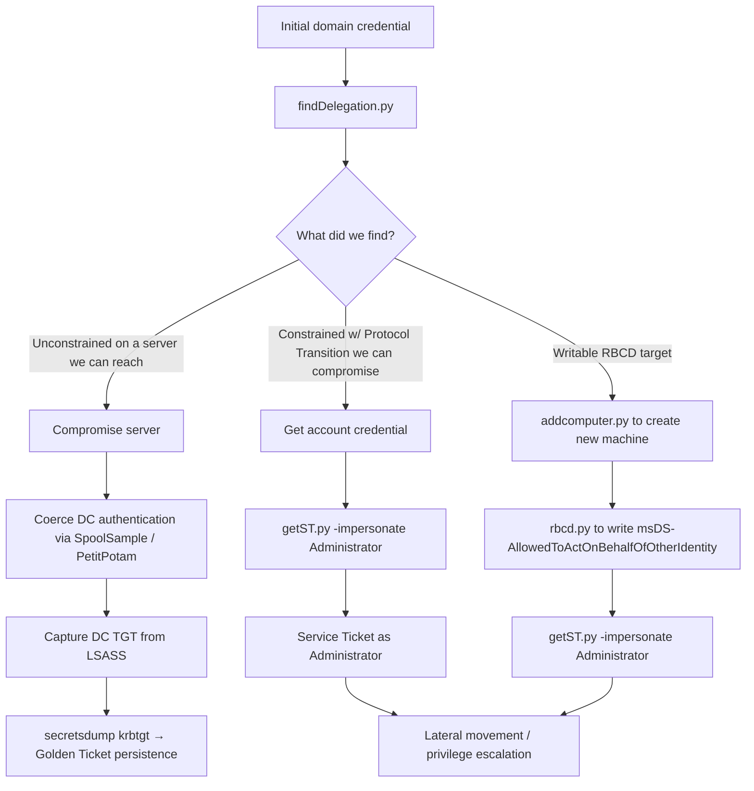

title: "findDelegation.py"
script: "examples/findDelegation.py"
category: "Recon and Enumeration"
status: "Published"
protocols:
  - LDAP
  - Kerberos
  - MS-KILE
  - MS-SFU
  - MS-ADTS
ms_specs:
  - MS-KILE
  - MS-SFU
  - MS-ADTS
  - RFC 4120
mitre_techniques:
  - T1087.002
  - T1069.002
  - T1558.003
  - T1134.005
auth_types:
  - password
  - nt_hash
  - aes_key
  - kerberos_ccache
tags:
  - impacket
  - impacket/examples
  - category/recon_and_enumeration
  - status/published
  - protocol/ldap
  - protocol/kerberos
  - authentication/ntlm
  - authentication/kerberos
  - technique/delegation_discovery
  - technique/unconstrained_delegation
  - technique/constrained_delegation
  - technique/rbcd
  - mitre/T1087/002
  - mitre/T1069/002
  - mitre/T1558/003
  - mitre/T1134/005
aliases:
  - findDelegation
  - impacket-findDelegation
  - delegation_enumeration
  - find_delegation


# findDelegation.py

> **One line summary:** Queries Active Directory via LDAP for every account configured with any of the four Kerberos delegation modes (unconstrained, constrained without protocol transition, constrained with protocol transition, and resource based constrained delegation), returning a complete inventory of the delegation attack surface in a domain.

| Field | Value |
|:---|:---|
| Script | `examples/findDelegation.py` |
| Category | Recon and Enumeration |
| Status | Published |
| Primary protocols | LDAP, Kerberos |
| Primary Microsoft specifications | `[MS-KILE]`, `[MS-SFU]`, `[MS-ADTS]`, RFC 4120 |
| MITRE ATT&CK techniques | T1087.002 Domain Account Discovery, T1069.002 Domain Groups, T1558.003 Kerberoasting, T1134.005 SID History Injection |
| Authentication types supported | Password, NT hash, AES key, Kerberos ccache |
| First appearance in Impacket | 2018 |
| Original authors | Dave Cossa (`@G0ldenGunSec`), based on `GetUserSPNs.py` by Alberto Solino (`@agsolino`) |


## Prerequisites

This article builds on:

- [`00_Introduction_and_Architecture.md`](Introduction_and_Architecture.md) for the Impacket stack overview.
- [`smbclient.py`](../05_smb_tools/smbclient.md) for the four authentication modes.
- [`samrdump.py`](samrdump.md) for the `UserAccountControl` flag table. This article works with `TRUSTED_FOR_DELEGATION` (`0x80000`) and `TRUSTED_TO_AUTHENTICATE_FOR_DELEGATION` (`0x1000000`), both of which appear in that table.
- [`GetUserSPNs.py`](GetUserSPNs.md) for the Kerberos foundations: AS exchange, TGS exchange, AP exchange, the PAC, and Service Principal Names.
- [`ticketer.py`](../02_kerberos_attacks/ticketer.md) for the deep dive on PAC structure.

This article catalogs the delegation attack surface. The article that exploits what `findDelegation.py` finds is [`getST.py`](../02_kerberos_attacks/getST.md), which is documented separately. Read this one first to understand the targets; read that one to understand the attacks.


## What it does

`findDelegation.py` performs a single LDAP query against a domain controller looking for every account that has any kind of delegation configured, then categorizes and prints what it finds. The categorization covers all four delegation modes that Active Directory supports:

- **Unconstrained Delegation (UD)** identified by the `TRUSTED_FOR_DELEGATION` UAC flag (`0x80000`).
- **Constrained Delegation without Protocol Transition** identified by the presence of the `msDS-AllowedToDelegateTo` attribute on the account.
- **Constrained Delegation with Protocol Transition** identified by the `TRUSTED_TO_AUTHENTICATE_FOR_DELEGATION` UAC flag (`0x1000000`).
- **Resource Based Constrained Delegation (RBCD)** identified by the presence of the `msDS-AllowedToActOnBehalfOfOtherIdentity` security descriptor attribute on the target account.

The output is a tabular report listing each delegated account, its account type (user, computer, or otherwise), the type of delegation, and the SPNs it can delegate to (or that can delegate to it, in the RBCD case).

The tool reads only. It does not modify anything in the directory. Any authenticated domain user can run it because the relevant attributes are world readable in default Active Directory configurations.

For an attacker, this output is a target list. Each line represents an opportunity for privilege escalation if the right preconditions are met. For a defender, this output is a hardening checklist. Each delegated account is a high value target that must be protected accordingly.


## Why it exists

Kerberos delegation predates `findDelegation.py` by almost two decades. Microsoft introduced delegation in Windows 2000 to solve the so called "double hop problem" where a front end server (typically a web server) needed to access back end resources (typically a database or file server) on behalf of authenticated users.

The original solution in 2000 was **Unconstrained Delegation**: configure a server to be trusted, and any user authenticating to that server forwards their TGT along with their service ticket. The server can then use that TGT to impersonate the user against any other Kerberos service. This worked but was promiscuous, and the security implications were widely understood by the early 2000s.

Windows Server 2003 introduced **Constrained Delegation** to address the over privilege of unconstrained delegation. The administrator could now specify exactly which services the front end server was allowed to delegate to. The mechanism is `msDS-AllowedToDelegateTo`, an attribute on the delegating account that lists the SPNs of the back end services. This was a significant improvement.

Windows Server 2003 also introduced **Protocol Transition** as an extension to constrained delegation. Without protocol transition, the front end server can only delegate using a TGT it received as part of the user's authentication (which means the user must have authenticated with Kerberos in the first place). With protocol transition, the front end server can ask the KDC to mint a forwardable ticket for any user, even one who authenticated by some other means or did not authenticate at all. This is what `S4U2Self` provides.

Windows Server 2012 introduced **Resource Based Constrained Delegation (RBCD)** to solve a different scoping problem. With classic constrained delegation, configuring delegation requires write access to the delegating account's `msDS-AllowedToDelegateTo` attribute. That typically requires Domain Admin rights. RBCD inverts the model: the target resource controls who is allowed to delegate to it via the `msDS-AllowedToActOnBehalfOfOtherIdentity` attribute. A computer can write its own `msDS-AllowedToActOnBehalfOfOtherIdentity` attribute, which (combined with the right relay attack) created a notable privilege escalation path that was widely exploited from 2018 onward.

`findDelegation.py` was added by Dave Cossa to give Impacket a discovery tool covering all four configurations in one pass. Before it existed, attackers and defenders had to combine multiple LDAP queries or rely on PowerShell tools like `Get-DomainUser` and `Get-DomainComputer` from PowerView. The Impacket version is the cross platform equivalent.

The tool exists because the delegation attack surface is one of the most productive in modern Active Directory. BloodHound popularized the technique of mapping these configurations into attack paths, and `findDelegation.py` provides the raw data those paths are built on.

## The protocol theory

What follows is the new material specific to Kerberos delegation. The core Kerberos exchanges are in [`GetUserSPNs.py`](GetUserSPNs.md) and the PAC is in [`ticketer.py`](../02_kerberos_attacks/ticketer.md).

### Why delegation exists

Imagine a web application architecture. A user authenticates to a web server with their domain credentials. The web server needs to query a SQL database for the user's data, and the SQL database is configured to authenticate users individually so each user sees only their own records.

The web server cannot just authenticate to SQL as itself, because SQL would then return data belonging to whatever account the web server runs as, not the user's data. The web server cannot ask the user for their password again, because that breaks the single sign on experience and creates a credential propagation problem. The web server needs a way to **act as the user** when talking to SQL, while being held accountable for the impersonation.

This is the double hop problem. Delegation is Kerberos's answer to it. Delegation lets the web server present a Kerberos identity that says "I am acting on behalf of alice" to SQL, and SQL responds with alice's data. The KDC mediates and audits the impersonation chain.

That sounds reasonable in the original web server scenario. The problem is that delegation, once configured, is exploitable in ways the original designers did not anticipate. Each delegation mode has its own exploitation path.

### Unconstrained Delegation

The `TRUSTED_FOR_DELEGATION` UAC flag (`0x80000`) on an account marks it as trusted for unconstrained delegation. When a user authenticates to a service running under such an account, the KDC includes a copy of the user's **forwardable TGT** inside the Service Ticket. The service can extract that TGT, store it in its own LSASS, and use it to authenticate as the user against any other Kerberos service in the domain.

The key insight: **whoever compromises a server with TRUSTED_FOR_DELEGATION can capture the TGT of any user that authenticates to it, then impersonate that user anywhere**.

The exploitation flow:

1. Attacker compromises a server (or service account) with the `TRUSTED_FOR_DELEGATION` flag.
2. Attacker waits for or coerces a high privilege user to authenticate to that server. The most famous coercion technique is the printer bug (SpoolSample), which forces a target machine (often a domain controller's machine account) to authenticate to an attacker chosen target.
3. Attacker harvests the TGT from LSASS or from the machine's Kerberos cache.
4. Attacker uses the captured TGT for lateral movement and privilege escalation.

The detection signal is the `TRUSTED_FOR_DELEGATION` flag itself. Any account with that flag is a high value target. Modern Microsoft guidance is that no user account should ever have the flag set, and computer accounts should only have it if absolutely required.

The classic real world target population: Domain Controllers (which have the flag set by default but are protected by other means), legacy SQL servers with Kerberos delegation enabled for application support, file servers used for print services, and the occasional legacy IIS server.

### Constrained Delegation without Protocol Transition

The `msDS-AllowedToDelegateTo` attribute on an account holds a list of SPNs that the account is allowed to delegate to. Without the `TRUSTED_TO_AUTHENTICATE_FOR_DELEGATION` flag also set, the delegation is "constrained without protocol transition," sometimes called "Kerberos only" delegation.

In this mode:

- The delegating account can only impersonate users against the services in `msDS-AllowedToDelegateTo`.
- The delegating account can only do so when it has received a forwardable TGT from the user as part of an actual Kerberos authentication.

The S4U2Proxy operation (Service for User to Proxy) is what implements this. Given a forwardable Service Ticket from a user, the delegating account asks the KDC for a Service Ticket to one of its allowed targets, on behalf of that user.

The exploitation flow is more limited than unconstrained delegation:

1. Attacker compromises an account with `msDS-AllowedToDelegateTo` populated.
2. Attacker needs a forwardable Service Ticket from a user who actually authenticated to the compromised account.
3. Attacker uses S4U2Proxy to obtain a Service Ticket impersonating that user against a service in the allowed list.

The narrower exploitation window (need a real authenticated user) makes this mode less directly dangerous than unconstrained delegation but still significant.

### Constrained Delegation with Protocol Transition

When the `TRUSTED_TO_AUTHENTICATE_FOR_DELEGATION` flag (`0x1000000`) is set in addition to `msDS-AllowedToDelegateTo` being populated, the account can also use S4U2Self (Service for User to Self).

S4U2Self lets the account ask the KDC for a forwardable Service Ticket to itself, on behalf of any user, without needing the user to have authenticated. The combination of S4U2Self plus S4U2Proxy means:

1. The delegating account asks the KDC for a forwardable ticket to itself, on behalf of `Administrator` (S4U2Self).
2. The delegating account presents that ticket back to the KDC and asks for a ticket to a service in `msDS-AllowedToDelegateTo` (S4U2Proxy).
3. The result is a Service Ticket impersonating `Administrator` against the chosen service.

No user authentication is required at any step. The compromised account self generates the impersonation credentials.

The exploitation flow:

1. Attacker compromises an account with `TRUSTED_TO_AUTHENTICATE_FOR_DELEGATION` set and `msDS-AllowedToDelegateTo` populated.
2. Attacker uses S4U2Self to obtain a forwardable ticket for any chosen user.
3. Attacker uses S4U2Proxy to obtain a Service Ticket against any service in the allowed list, as that user.

A subtle but important detail: the SPN field in the ticket from S4U2Self is not encrypted. Attackers can substitute a different SPN before presenting the ticket to the target service, often expanding the effective set of accessible services beyond what `msDS-AllowedToDelegateTo` literally allows. This was documented by Alberto Solino in 2019 and is the basis for the "alternative service substitution" technique commonly applied with `getST.py`.

This is the most dangerous delegation mode after unconstrained, because no user interaction is required. Compromising the delegating account immediately yields impersonation of any user against any allowed service.

### Resource Based Constrained Delegation (RBCD)

Introduced in Windows Server 2012, RBCD inverts the configuration model. Instead of the delegating account listing what it can delegate to (in `msDS-AllowedToDelegateTo`), the **target account lists who can delegate to it** (in `msDS-AllowedToActOnBehalfOfOtherIdentity`).

The mechanism uses the same S4U2Self plus S4U2Proxy flow as constrained delegation with protocol transition. The difference is in who configures the relationship:

- Classic constrained delegation: `msDS-AllowedToDelegateTo` is on the delegating account; configuring it requires write access to that account (typically Domain Admin).
- RBCD: `msDS-AllowedToActOnBehalfOfOtherIdentity` is on the target account; configuring it requires write access to the **target** account.

The reason this matters: a computer object can write its own `msDS-AllowedToActOnBehalfOfOtherIdentity` (because computers have implicit write access to a subset of their own attributes). This means an attacker with control over any computer account can configure that account to be the target of delegation from a different attacker controlled account, and then use S4U2Self plus S4U2Proxy to impersonate any user against that computer.

The infamous attack chain:

1. Attacker uses NTLM relay (often combined with `mitm6` and `ntlmrelayx.py`) to obtain LDAP write access as a computer account.
2. Attacker creates a new computer account in the domain (any authenticated user can create up to ten computer accounts by default, courtesy of `MachineAccountQuota`).
3. Attacker writes their new computer account's SID into `msDS-AllowedToActOnBehalfOfOtherIdentity` on the target computer.
4. Attacker performs S4U2Self plus S4U2Proxy from the new computer account, impersonating Administrator against the target computer.
5. Attacker now has Administrator level access to the target computer.

This attack is widely deployed in real engagements because the prerequisites are common: any environment with NTLM and IPv6 enabled (which is most environments) is vulnerable to the relay step, and `MachineAccountQuota` defaults to 10 in every Active Directory domain.

`findDelegation.py` shows accounts that already have `msDS-AllowedToActOnBehalfOfOtherIdentity` populated. It does not show accounts where the attribute could be written, which would require an ACL inspection (a job for BloodHound or `ldapdomaindump`).

### The S4U mechanics in summary

The two operations that constrained and resource based delegation depend on:

- **S4U2Self.** The delegating account asks the KDC: "Give me a Service Ticket to myself, but in the name of <user>." The KDC complies, producing a Service Ticket whose PAC is for the requested user but whose target is the delegating account itself. This ticket is forwardable when the delegating account has the `TRUSTED_TO_AUTHENTICATE_FOR_DELEGATION` flag, and is non forwardable otherwise.
- **S4U2Proxy.** The delegating account asks the KDC: "Here is a forwardable ticket for <user>. Give me a Service Ticket from that user to <target service>." The KDC verifies that the target service appears in `msDS-AllowedToDelegateTo` (classic constrained) or that the delegating account's SID appears in the target's `msDS-AllowedToActOnBehalfOfOtherIdentity` (RBCD), then issues the ticket.

These are documented in `[MS-SFU]` (Service for User and Constrained Delegation Protocol Specification). The full implementation lives in [`getST.py`](../02_kerberos_attacks/getST.md) which is where the actual exploitation happens.

### Why no user account should ever be unconstrained

A computer account with `TRUSTED_FOR_DELEGATION` is dangerous but somewhat understandable: the computer itself runs a service that legitimately needs to act on behalf of users. A user account with `TRUSTED_FOR_DELEGATION` makes no sense in modern architectures and should always be considered a misconfiguration or a backdoor. Modern Microsoft guidance explicitly forbids the configuration. `findDelegation.py` reports them prominently because they are almost always the most productive single finding from the tool.


## How the tool works internally

The script is short and follows the LDAP query pattern from [`GetUserSPNs.py`](GetUserSPNs.md).

1. **Argument parsing.** Standard target string plus `-target-domain`, `-hashes`, `-aesKey`, `-no-pass`, `-k`, `-dc-ip`, `-dc-host`, `-debug`, `-ts`.

2. **Credential resolution.** `parse_identity` from `impacket.examples.utils`.

3. **LDAP connection.** Uses `ldap_login` to connect to the target DC. Tries LDAPS (port 636) first, falls back to LDAP (port 389) with sign and seal if LDAPS is unavailable. Authenticates with NTLM or Kerberos as supplied.

4. **The big LDAP query.** A single search with this filter:

    ```text
    (&(|(UserAccountControl:1.2.840.113556.1.4.803:=16777216)
        (UserAccountControl:1.2.840.113556.1.4.803:=524288)
        (msDS-AllowedToDelegateTo=*)
        (msDS-AllowedToActOnBehalfOfOtherIdentity=*))
      (!(UserAccountControl:1.2.840.113556.1.4.803:=2)))
    ```

    Decoded: any of (UAC has `TRUSTED_TO_AUTHENTICATE_FOR_DELEGATION` (`0x1000000` = 16777216), UAC has `TRUSTED_FOR_DELEGATION` (`0x80000` = 524288), `msDS-AllowedToDelegateTo` is set, `msDS-AllowedToActOnBehalfOfOtherIdentity` is set), AND the account is not disabled (UAC does not have `0x2`).

5. **Per record categorization.** For each returned record, the tool inspects the attributes:
    - `TRUSTED_FOR_DELEGATION` set → Unconstrained.
    - `TRUSTED_TO_AUTHENTICATE_FOR_DELEGATION` set → Constrained with Protocol Transition. The `msDS-AllowedToDelegateTo` attribute lists the allowed targets.
    - Only `msDS-AllowedToDelegateTo` set (no UAC flags) → Constrained without Protocol Transition. Same allowed targets.
    - `msDS-AllowedToActOnBehalfOfOtherIdentity` set → Resource Based Constrained. The attribute is a security descriptor; the tool parses the ACEs to extract the SIDs that are allowed to delegate, then runs a follow up LDAP query to resolve those SIDs to account names.

6. **SPN existence check (modern versions).** For each delegation target, the tool runs an additional LDAP query to verify that the target SPN actually exists in the directory. This catches stale `msDS-AllowedToDelegateTo` entries that point at deleted services.

7. **Output formatting.** Results printed as a fixed width table with columns for Account Name, Account Type (user, computer, etc.), Delegation Type, Delegation Rights To, and SPN Exists.

8. **Error handling.** Connection failures, LDAP errors, and access denied responses are reported and the tool exits gracefully.

The tool's value is in the categorization, not in the LDAP query itself. The same data is queryable with any LDAP browser; the value `findDelegation.py` adds is the consolidated view across all four delegation modes in one pass.


## Authentication options

The four standard credential types from [`smbclient.py`](../05_smb_tools/smbclient.md) all apply.

### Cleartext password

```bash
findDelegation.py CORP.LOCAL/alice:'S3cret!' -dc-ip 10.0.0.10
```

### NT hash

```bash
findDelegation.py -hashes :<nthash> CORP.LOCAL/alice -dc-ip 10.0.0.10
```

### AES key

```bash
findDelegation.py -aesKey <hex> CORP.LOCAL/alice -dc-ip 10.0.0.10
```

### Kerberos ccache

```bash
export KRB5CCNAME=alice.ccache
findDelegation.py -k -no-pass CORP.LOCAL/alice -dc-ip 10.0.0.10
```

### Minimum required privileges

Any authenticated domain user can run the tool. The relevant attributes (`UserAccountControl`, `msDS-AllowedToDelegateTo`, `msDS-AllowedToActOnBehalfOfOtherIdentity`) are world readable in default Active Directory configurations, which is itself a notable design decision: Microsoft considers delegation configuration to be public information within the domain, on the theory that hiding it would not provide meaningful security against motivated attackers.


## Practical usage

### Default invocation

```text
$ findDelegation.py CORP.LOCAL/alice:'S3cret!' -dc-ip 10.0.0.10
Impacket v0.13.0 - Copyright Fortra, LLC and its affiliated companies

AccountName     AccountType  DelegationType                          DelegationRightsTo                                  SPN Exists
--  --  --  --  -
DC01$           Computer     Unconstrained                           N/A                                                 -
SQL01$          Computer     Unconstrained                           N/A                                                 -
svc_legacy      User         Unconstrained                           N/A                                                 -
WEB01$          Computer     Constrained w/ Protocol Transition      cifs/sql01.corp.local                               True
WEB01$          Computer     Constrained w/ Protocol Transition      MSSQLSvc/sql01.corp.local:1433                      True
APP01$          Computer     Constrained w/o Protocol Transition     http/intranet.corp.local                            True
svc_iis         User         Constrained w/ Protocol Transition      http/intranet.corp.local                            True
FILE01$         Computer     Resource-Based Constrained              WEB01$                                              True
FILE01$         Computer     Resource-Based Constrained              attacker_pc$                                        True
```

That output illustrates several findings worth understanding:

**`svc_legacy` is a user account with Unconstrained Delegation.** This is almost certainly a misconfiguration. No user account should ever have `TRUSTED_FOR_DELEGATION` set. The recommendation is unconditional removal, ideally tracked through change control to identify why it was set in the first place.

**`DC01$` and `SQL01$` are computer accounts with Unconstrained Delegation.** Domain controllers have the flag by default and are protected by other means (Protected Users group, Account is sensitive and cannot be delegated, and so on). `SQL01$` is more concerning: SQL Servers used to commonly have unconstrained delegation enabled to support legacy double hop scenarios. Modern SQL deployments should use constrained delegation or RBCD instead.

**`WEB01$` has constrained delegation with protocol transition to two SQL services.** A compromise of `WEB01$` allows the attacker to use S4U2Self plus S4U2Proxy to impersonate any user (including Domain Admin) against either SQL service. This is a significant finding.

**`APP01$` has constrained delegation without protocol transition.** Less directly dangerous because the attacker needs a real authenticated user's ticket, but still a finding because the configuration could be modified to add protocol transition by anyone with write access to `APP01$`.

**`svc_iis` is a user account with constrained delegation.** Worth investigating: user account based services with delegation are often older application configurations that should be migrated to gMSA or RBCD.

**`FILE01$` has RBCD configured to allow `WEB01$` and `attacker_pc$` to delegate to it.** The first entry might be legitimate. The second one, `attacker_pc$`, is the smoking gun of a successful RBCD attack chain. Whoever owns `attacker_pc$` has already escalated to Administrator on `FILE01$`.

### Cross domain enumeration

```bash
findDelegation.py -target-domain partner.local CORP.LOCAL/alice:'S3cret!' -dc-ip 10.0.0.10
```

The `-target-domain` flag queries delegation in a trusted foreign domain. Useful for understanding the cross trust attack surface. Requires a credential in the home domain that has read access to the foreign directory, which is typically the case when domains have a trust relationship configured.

### Combining with samrdump for a complete UAC view

`findDelegation.py` reports delegation focused UAC bits but doesn't decode the rest. For a complete picture of an interesting account:

```bash
samrdump.py CORP.LOCAL/alice:'S3cret!' -csv -outputfile users.csv \
  10.0.0.10 \
&& findDelegation.py CORP.LOCAL/alice:'S3cret!' -dc-ip 10.0.0.10 \
  > delegations.txt

# Cross reference: which delegated accounts also have other risky UAC bits?
```

The combined output reveals patterns like a service account with Unconstrained Delegation (`0x80000`) and `DONT_REQUIRE_PREAUTH` (`0x400000`) and `PASSWORD_NEVER_EXPIRES` (`0x10000`). Each bit separately is a finding; together they are catastrophic.

### Running before getST.py

The standard workflow is to run `findDelegation.py` first to identify the targets, then [`getST.py`](../02_kerberos_attacks/getST.md) to actually perform the impersonation:

```bash
# Step 1: find the targets
findDelegation.py CORP.LOCAL/alice:'S3cret!' -dc-ip 10.0.0.10

# Step 2: assume WEB01$ is compromised, exploit its constrained delegation to SQL
getST.py -spn cifs/sql01.corp.local -impersonate Administrator \
  -hashes :<web01_machine_nthash> CORP.LOCAL/'WEB01$' \
  -dc-ip 10.0.0.10
```

The output of step 2 is a forged Service Ticket usable against SQL01 as Administrator, which is a Domain Admin equivalent compromise of the SQL server.

### Key flags

| Flag | Meaning |
|:---|:---|
| `-target-domain <name>` | Query delegation in a trusted foreign domain. |
| `-hashes LMHASH:NTHASH` | NT hash authentication. |
| `-aesKey <hex>` | Kerberos AES key. |
| `-k` | Use Kerberos from ccache. |
| `-no-pass` | Skip password prompt. |
| `-dc-ip <ip>` | Explicit DC IP. |
| `-dc-host <hostname>` | Explicit DC hostname. |
| `-debug` | Full protocol trace. |
| `-ts` | Timestamp every log line. |


## What it looks like on the wire

`findDelegation.py` produces a single LDAP search and any follow up searches needed for SID resolution and SPN existence checks. There is no Kerberos traffic generated by the tool itself (except for the initial Kerberos bind, if `-k` was used).

### Phase one: bind

- TCP connection to port 389 (LDAP) or 636 (LDAPS) on the DC.
- LDAP bind using NTLM (via SASL/GSS-SPNEGO) or Kerberos.

### Phase two: the delegation query

- LDAP `searchRequest` with the filter described in the "How the tool works internally" section.
- LDAP `searchResEntry` messages for each matching account.
- LDAP `searchResDone` terminating the search.

### Phase three: SID resolution for RBCD

For each RBCD record found, the tool issues additional LDAP queries to resolve the SIDs in `msDS-AllowedToActOnBehalfOfOtherIdentity` to readable account names:

- LDAP `searchRequest` with filter `(objectSid=<SID>)` for each SID.
- LDAP `searchResEntry` with the resolved account name.

### Phase four: SPN existence checks

For each `msDS-AllowedToDelegateTo` target SPN, the tool issues a query to verify the SPN exists:

- LDAP `searchRequest` with filter `(servicePrincipalName=<SPN>)`.
- Result indicates whether the target service is registered.

The total LDAP traffic for a small environment is on the order of tens of search operations. For a large enterprise it can run into hundreds depending on how many delegation configurations exist.

### Wireshark filters

```text
ldap                                         # all LDAP traffic
ldap.filter contains "AllowedToDelegateTo"   # the delegation query itself
ldap.filter contains "1.2.840.113556.1.4.803"  # bitwise UAC filter
```

Encrypted LDAP (LDAPS or LDAP with sign and seal) hides the query content from a passive observer. The size and timing of the traffic remains visible but the specific filter does not.


## What it looks like in logs

`findDelegation.py` produces ordinary LDAP query traces. There is no specific Kerberos signature because the tool does not generate Kerberos traffic of its own.

### Common events

| Log | Event ID | Trigger |
|:---|:---||
| Security | 4624 | The initial logon for the LDAP bind. Logon Type 3 (network). |
| Security | 4634 | The logon session ending after the queries complete. |
| Security | 4662 | Directory Service object access. Fires for the LDAP queries if "Audit Directory Service Access" is enabled with appropriate SACLs. |

### LDAP query inspection

The specific LDAP filter pattern is the strongest signal:

- A search filter containing `1.2.840.113556.1.4.803:=16777216` (TRUSTED_TO_AUTHENTICATE_FOR_DELEGATION bitwise check) is uncommon in legitimate administrative tooling.
- A search filter containing `1.2.840.113556.1.4.803:=524288` (TRUSTED_FOR_DELEGATION bitwise check) is similarly uncommon.
- A search filter that combines both with `msDS-AllowedToDelegateTo=*` and `msDS-AllowedToActOnBehalfOfOtherIdentity=*` is essentially diagnostic of `findDelegation.py` or PowerView's `Get-DomainComputer -TrustedToAuth` style queries.

Capturing this requires either DC level network capture, an LDAP proxy that logs query content, or an EDR product that inspects LDAP traffic. The standard Windows event log does not include the specific LDAP filter content in 4662 events.

### Sysmon

Sysmon Event ID 22 (DNS query) captures the DNS resolution for the DC. Sysmon Event ID 3 (Network connection) captures the LDAP connection itself. Neither captures the LDAP query content.


## Detection and defense

### Detection opportunities

`findDelegation.py` is hard to detect specifically through standard logs because it generates ordinary LDAP queries. The detection focus is on the broader pattern: enumeration of delegation configuration is a strong signal of pre attack reconnaissance.

**LDAP query content inspection.** Where the monitoring stack can see LDAP queries (network DPI, LDAP proxy, Microsoft Defender for Identity), alert on the specific filter patterns described above. A workstation issuing a query that looks for `TRUSTED_FOR_DELEGATION` is almost never doing legitimate work.

**Microsoft Defender for Identity.** Microsoft's identity threat detection product (formerly Azure ATP) specifically detects delegation related reconnaissance and has built in alerts for it. If MDI is deployed, it will flag `findDelegation.py` runs as "Reconnaissance using SAM-R" or similar categories.

**Volume based detection on 4662.** A burst of Directory Service object access events from a single source IP for accounts with delegation related attributes is anomalous. Tuning is harder than the SAMR equivalent because legitimate administrative tools do legitimately query these attributes, but the burst pattern from a non administrative workstation is suspicious.

**Honeypot delegated accounts.** Create a user account or computer account with delegation flags set, monitor it for any access, and alert on hits. Particularly effective for the UAC flag based queries because a query that returns the honeypot account is a query that was specifically looking for delegation.

### Preventive controls

The detection story is tricky; the prevention story is well defined. Hardening the delegation attack surface is a sustained effort with concrete steps.

- **Audit and remove `TRUSTED_FOR_DELEGATION` from every account that does not absolutely require it.** Use this PowerShell query on a regular schedule:

    ```powershell
    Get-ADObject -LDAPFilter '(userAccountControl:1.2.840.113556.1.4.803:=524288)' -Properties userAccountControl
    ```

    Verify each result. User accounts almost always indicate misconfiguration. Computer accounts other than DCs need specific justification.

- **Use the "Account is sensitive and cannot be delegated" flag on all privileged accounts.** Setting `NOT_DELEGATED` (`0x100000`) prevents an account's tickets from being delegated, even by a server with TRUSTED_FOR_DELEGATION. Apply this to every Domain Admin, Enterprise Admin, and other tier zero account. Modern Microsoft guidance also recommends adding privileged accounts to the **Protected Users** group, which provides additional Kerberos hardening.

- **Migrate constrained delegation to RBCD where possible.** RBCD has tighter scoping (per resource rather than per source) and the target controls who can delegate to it, which provides more granular authorization. The catch: improperly configured RBCD has its own attack chain (the machine account creation attack described in the protocol theory section), so the migration must be done carefully.

- **Block the RBCD machine account creation attack chain.** Set `MachineAccountQuota` to `0` on the domain to prevent ordinary users from creating computer accounts. Microsoft's recommended baseline since 2020 is `0`. The default is still `10`, which is the prerequisite for the attack.

- **Audit `msDS-AllowedToActOnBehalfOfOtherIdentity` regularly.** Any unexpected entry is potentially a successful RBCD attack. The attribute should never appear on user accounts; only on computer accounts where delegation is intentional. Use this PowerShell query:

    ```powershell
    Get-ADComputer -LDAPFilter '(msDS-AllowedToActOnBehalfOfOtherIdentity=*)' -Properties msDS-AllowedToActOnBehalfOfOtherIdentity
    ```

- **Disable LLMNR, NBNS, and IPv6 SLAAC where not needed.** These protocols enable the relay attacks that feed into RBCD exploitation. Disabling them collapses the attack chain at its first step.

- **Enable LDAP signing and channel binding.** Signed and bound LDAP authentication is significantly harder to relay. This is a Microsoft hardening baseline as of 2020 and is enforced by default in newer Windows Server versions.

- **Monitor for the specific exploitation tools.** `getST.py`, `Rubeus.exe`, and `mimikatz` all produce identifiable artifacts when performing S4U operations. EDR signatures for these tools are mature and effective.

- **Use BloodHound to map delegation paths in your own environment.** BloodHound aggregates the data `findDelegation.py` produces with ACL information and group memberships to build attack graphs. Running BloodHound on your own environment on a regular schedule provides the same intelligence the attackers will have, with time to remediate first.


## Related tools and attack chains

`findDelegation.py` is the discovery step. The exploitation tools are:

- **[`getST.py`](../02_kerberos_attacks/getST.md)** is the primary exploitation tool for constrained delegation (with and without protocol transition) and RBCD. It implements S4U2Self, S4U2Proxy, the Sapphire ticket workflow, and recently the `dMSA` impersonation feature.
- **[`addcomputer.py`](../07_ad_modification/addcomputer.md)** creates the new computer account for RBCD attacks. Combined with `MachineAccountQuota` defaulting to 10, this is what enables the RBCD chain.
- **[`rbcd.py`](../07_ad_modification/rbcd.md)** writes the `msDS-AllowedToActOnBehalfOfOtherIdentity` attribute. The other half of the RBCD chain.
- **[`ntlmrelayx.py`](../06_relay_attacks/ntlmrelayx.md)** with the `--delegate-access` flag automates the entire NTLM relay to RBCD attack in one command. This is the most common path to RBCD exploitation in real engagements.
- **[`secretsdump.py`](../03_credential_access/secretsdump.md)** is what you run after compromising a delegation target to extract credentials from it.
- **[`ticketer.py`](../02_kerberos_attacks/ticketer.md)** can forge tickets that bypass some delegation restrictions, especially in cross domain scenarios.

### Tools that produce input or context

- **[`samrdump.py`](samrdump.md)** for the `UserAccountControl` flag context, especially the table that includes both delegation flags.
- **[`GetUserSPNs.py`](GetUserSPNs.md)** for service account discovery. Service accounts with delegation are particularly high value.
- **[`lookupsid.py`](lookupsid.md)** for resolving the SIDs that appear in RBCD configurations.
- **BloodHound and SharpHound** for the comprehensive attack path view that combines `findDelegation.py` data with ACL and group membership analysis.

### A canonical attack chain



The three exploitation paths converge on the same outcome: arbitrary user impersonation against high value services. The path taken depends on what `findDelegation.py` reveals.


## Further reading

- **`[MS-SFU]`: Service for User and Constrained Delegation Protocol.** `https://learn.microsoft.com/en-us/openspecs/windows_protocols/ms-sfu/`. The authoritative specification for S4U2Self, S4U2Proxy, and the constrained delegation protocol details.
- **`[MS-KILE]`: Kerberos Protocol Extensions.** Sections covering ticket forwarding, the OK-AS-DELEGATE flag, and Microsoft specific delegation extensions.
- **Will Schroeder "Kerberos Delegation"** at `https://specterops.io/`. A series of foundational SpecterOps posts on each delegation type and its exploitation.
- **Elad Shamir "Wagging the Dog: Abusing Resource-Based Constrained Delegation to Attack Active Directory"** at `https://shenaniganslabs.io/2019/01/28/Wagging-the-Dog.html`. The single most important paper on RBCD exploitation. Required reading for understanding why RBCD attacks work the way they do.
- **Alberto Solino "Kerberos Delegation, SPNs and More..."** at `https://www.secureauth.com/blog/`. Discusses the SPN substitution technique that `getST.py` automates.
- **Charlie Clark "S4U2Self in a Single Bound"** at the Semperis blog. Discusses the S4U2Self based variants of Kerberoasting and ticket forgery.
- **Sean Metcalf "Kerberos and Active Directory: An Overview"** at `https://adsecurity.org/`. Foundational reference, regularly updated.
- **harmj0y "S4U2Pwnage"** at `https://blog.harmj0y.net/`. The original popular writeup of S4U abuse.
- **Microsoft "Configuring Delegation"** documentation at `https://learn.microsoft.com/en-us/windows-server/identity/ad-fs/`. Authoritative configuration guidance.
- **MITRE ATT&CK T1558.003 Kerberoasting** and related techniques at `https://attack.mitre.org/techniques/T1558/`.
- **BloodHound documentation on delegation** at `https://bloodhound.specterops.io/`. Shows how delegation data is aggregated into attack paths.

Run `findDelegation.py` against your own lab domain. Then run BloodHound. Then run `findDelegation.py` again against your production environment with a domain user account. The findings will surprise you. Almost every production Active Directory has at least one unexpected delegation configuration sitting somewhere, often dating from a long ago project that nobody remembers. Cleaning those up is one of the highest leverage hardening activities available, and it costs only the time to investigate and remove them.
