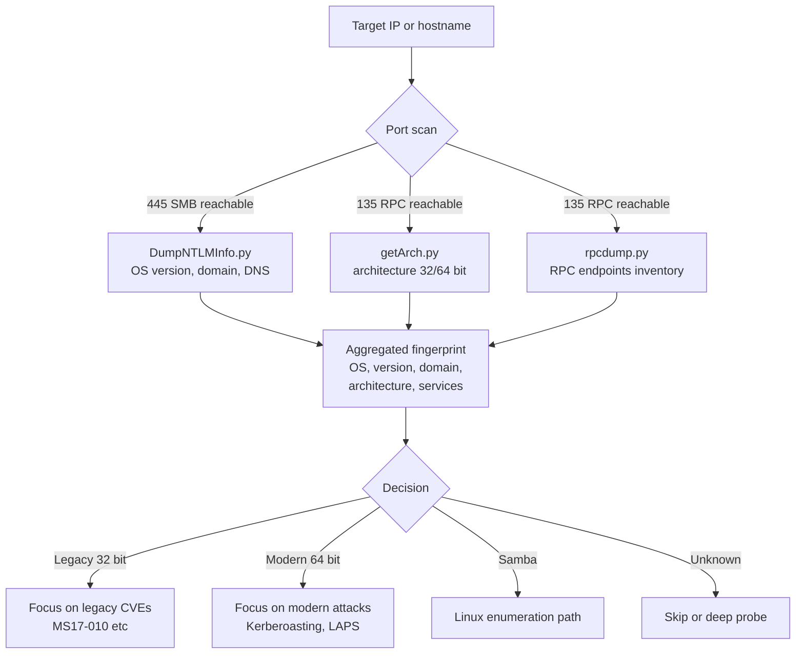

title: "getArch.py"
script: "examples/getArch.py"
category: "Recon and Enumeration"
status: "Published"
protocols:
  - MS-RPCE
  - DCE/RPC
ms_specs:
  - MS-RPCE
mitre_techniques:
  - T1082
  - T1592.002
  - T1018
auth_types:
  - None (pre auth)
tags:
  - impacket
  - impacket/examples
  - category/recon_and_enumeration
  - status/published
  - protocol/ms-rpce
  - protocol/dcerpc
  - ms-spec/ms-rpce
  - technique/ndr64_transfer_syntax_probe
  - technique/pre_auth_architecture_detection
  - technique/rpc_bind_negotiation_abuse
  - technique/epm_probe
  - mitre/T1082
  - mitre/T1592.002
  - mitre/T1018
aliases:
  - getArch
  - target-arch
  - ndr64 probe
  - architecture detection
  - x86 x64 fingerprint
  - ms-rpce-appendix-a-53


# getArch.py

> **One line summary:** Pre authentication architecture detection tool that connects to a target's Endpoint Mapper on TCP 135, initiates a DCE/RPC bind request offering two transfer syntax candidates (NDR32 - the classic 32 bit Network Data Representation, and **NDR64** - the 64 bit extended transfer syntax with UUID `71710533-BEBA-4937-8319-B5DBEF9CCC36` introduced in Windows Vista/Server 2008), and inspects the server's bind response to infer CPU architecture: if the server accepts NDR64, the target is a 64 bit Windows host; if the server falls back to NDR32 only, the target is 32 bit Windows; this technique is **documented by Microsoft** in `[MS-RPCE]` Appendix A.53 (originally at `msdn.microsoft.com/en-us/library/cc243948.aspx#Appendix_A_53`) and requires **zero authentication** because DCE/RPC bind negotiation occurs before any authentication layer is invoked; authored by **`beto` (Alberto Solino, `@agsolino`)** per source header with the design comment noting "the trick has been discovered many years ago" and source caveats "**this trick will not work if the target system is running Samba. Don't know what happens with macOS**"; supports single target mode (`target` positional) or bulk mode (`-targets file.txt` reading one hostname/IP per line); the tool is one of the simplest in the Impacket examples directory - under 100 lines of meaningful code and a single DCE/RPC bind exchange; operationally valuable primarily in pre exploitation payload selection (choosing x86 vs x64 shellcode or binaries before deployment), initial network fingerprinting alongside DumpNTLMInfo.py, and historically for identifying rare legacy 32 bit hosts in otherwise 64 bit environments; **closes Recon and Enumeration at 16 of 17 articles (94%), with one stub remaining before the category closes as the 13th and final complete category for the wiki at 100% completion**.

| Field                           | Value                                                                                                                                                                                        |
| ------------------------------- | -------------------------------------------------------------------------------------------------------------------------------------------------------------------------------------------- |
| Script                          | `examples/getArch.py`                                                                                                                                                                        |
| Category                        | Recon and Enumeration                                                                                                                                                                        |
| Status                          | Published                                                                                                                                                                                    |
| Author                          | `beto` = Alberto Solino (`@agsolino`) per source header                                                                                                                                      |
| Description (from source)       | "This script will connect against a target (or list of targets) machine/s and gather the OS architecture type installed"                                                                     |
| Design comment (from source)    | "The trick has been discovered many years ago and is actually documented by Microsoft"; "this trick will not work if the target system is running Samba. Don't know what happens with macOS" |
| Primary protocol                | DCE/RPC bind negotiation (no higher level RPC methods called)                                                                                                                                |
| Endpoint                        | TCP port 135 (Endpoint Mapper / PORTMAP)                                                                                                                                                     |
| EPM UUID targeted               | `MSRPC_UUID_PORTMAP` = `E1AF8308-5D1F-11C9-91A4-08002B14A0FA` (EPM interface, merely a vehicle for the bind negotiation)                                                                     |
| NDR64 transfer syntax UUID      | `71710533-BEBA-4937-8319-B5DBEF9CCC36` version 1.0                                                                                                                                           |
| NDR32 transfer syntax UUID      | `8A885D04-1CEB-11C9-9FE8-08002B104860` version 2.0                                                                                                                                           |
| Primary Microsoft specification | `[MS-RPCE]` Remote Procedure Call Protocol Extensions, Appendix A.53                                                                                                                         |
| MITRE ATT&CK techniques         | T1082 System Information Discovery; T1592.002 Gather Victim Host Information: Software; T1018 Remote System Discovery                                                                        |
| Authentication required         | **None** - pre authentication, no credentials needed                                                                                                                                         |
| Target compatibility            | Windows only (NDR64 originated in Windows Vista / Server 2008). Does **not** work against Samba (Samba doesn't support NDR64); macOS behavior undocumented                                   |
| Output                          | "target is 32 bit" or "target is 64 bit" or error if target unreachable/incompatible                                                                                                         |
| Invocation modes                | Single target: `python getArch.py -target <host>`; bulk: `python getArch.py -targets hostlist.txt`                                                                                           |


## Prerequisites

This article assumes familiarity with:

- [`rpcdump.py`](rpcdump.md) as the foundational Endpoint Mapper enumeration tool. getArch.py uses the same EPM endpoint for a completely different purpose (bind negotiation probing vs service enumeration). Reading rpcdump.md first explains EPM, string bindings, and the DCE/RPC bind exchange.
- [`DumpNTLMInfo.py`](DumpNTLMInfo.md) as the other pre authentication reconnaissance tool in the wiki. DumpNTLMInfo uses SMB + NTLM; getArch uses DCE/RPC on port 135. Together they represent the two pre authentication fingerprinting paths available against modern Windows.
- **DCE/RPC bind exchange basics**: client sends bind request with context elements, each containing an abstract interface UUID and one or more transfer syntax candidates; server responds with bind_ack selecting one transfer syntax per context, or bind_nak rejecting the context entirely.
- **NDR (Network Data Representation)**: the DCE/RPC serialization format. NDR32 is the classic format from DCE 1.0 (1990s). NDR64 is Microsoft's 64 bit extension introduced with Windows Vista / Server 2008, providing native 64 bit integer types and pointer sizes for x64 hosts.
- **Endpoint Mapper role**: EPM on port 135 is a directory service for RPC endpoints. getArch.py doesn't use EPM's actual lookup methods; it just opens a DCE/RPC bind against the EPM interface as a convenient, always available target for the transfer syntax negotiation probe.
- The distinction between "32 bit Windows running on 32 bit hardware", "32 bit Windows running on 64 bit hardware via WOW64", "64 bit Windows running on 64 bit hardware", and "64 bit Windows running on ARM/ARM64". getArch.py's response tells you about the **RPC server's NDR capability**, which correlates with but doesn't perfectly determine the raw hardware architecture.


## What it does

`getArch.py` establishes a TCP connection to port 135 on the target, initiates a DCE/RPC bind request that offers both NDR32 and NDR64 as candidate transfer syntaxes, and classifies the target based on which one the server accepts.

### Default invocation

```text
$ python getArch.py -target 10.10.10.50
Impacket v0.13.0 - Copyright Fortra, LLC and its affiliated companies

[*] Enumerating architecture for 10.10.10.50

[+] 10.10.10.50 is 64 bit
```

Against a 32 bit target:

```text
$ python getArch.py -target 10.10.10.51
Impacket v0.13.0 - Copyright Fortra, LLC and its affiliated companies

[*] Enumerating architecture for 10.10.10.51

[+] 10.10.10.51 is 32 bit
```

Against an unreachable or incompatible target (Samba, closed port, firewalled):

```text
$ python getArch.py -target 10.10.10.99
Impacket v0.13.0 - Copyright Fortra, LLC and its affiliated companies

[*] Enumerating architecture for 10.10.10.99

[-] 10.10.10.99: error connecting [details]
```

### Bulk mode

```bash
# targets.txt:
# 10.10.10.50
# 10.10.10.51
# 10.10.10.52
# server01.corp.local
# wkstn01.corp.local

$ python getArch.py -targets targets.txt
Impacket v0.13.0 - Copyright Fortra, LLC and its affiliated companies

[*] Enumerating architecture for 10.10.10.50
[+] 10.10.10.50 is 64 bit
[*] Enumerating architecture for 10.10.10.51
[+] 10.10.10.51 is 32 bit
[*] Enumerating architecture for 10.10.10.52
[+] 10.10.10.52 is 64 bit
[*] Enumerating architecture for server01.corp.local
[+] server01.corp.local is 64 bit
[*] Enumerating architecture for wkstn01.corp.local
[+] wkstn01.corp.local is 64 bit
```

One architecture determination per target, sequentially.

### Key flags

| Flag | Meaning |
|:---|:---|
| `-target <host>` | Single target hostname or IP. |
| `-targets <file>` | File containing list of targets, one per line. Alternative to `-target`. |
| `-debug` | Verbose DCE/RPC bind exchange details, useful for diagnosing why a target didn't respond cleanly. |

No authentication flags. No port override (port 135 is hardcoded). No TLS option (DCE/RPC on 135 is plain). The CLI is minimal because the tool does exactly one thing.

### Why the output is just "32 bit" or "64 bit"

The tool doesn't distinguish between:
- Windows XP 32 bit vs Windows 7 32 bit.
- Windows 10 x64 vs Server 2019 x64 vs Server 2025 x64.
- x64 vs ARM64 (both are "64 bit" to NDR).

The NDR transfer syntax only answers "does this RPC server support 64 bit native data types?" It doesn't report the OS version, Service Pack level, or CPU microarchitecture. For richer information, pair getArch.py with DumpNTLMInfo.py (which reports OS version via NTLM negotiation) or rpcdump.py (which reports RPC service banners).


## Why it exists

### The historical operational problem

In the mid 2000s and early 2010s, mixed x86/x64 Windows environments were common. An operator planning initial access or post exploitation needed to know architecture in advance to select appropriate:

- **Shellcode**: x86 shellcode doesn't execute on x64 targets (and vice versa without WOW64 support in the delivery context).
- **Exploits**: memory corruption exploits typically have architecture specific ROP chains and offsets.
- **Binaries**: PsExec style binary deployment requires the right binary for the target.
- **Metasploit payloads**: `windows/meterpreter/...` vs `windows/x64/meterpreter/...`.

Guessing wrong meant failed exploitation, unreliable post exploitation, or tool crashes. Guessing right sometimes required reconnaissance that itself was noisy (vulnerability scanners, detailed nmap fingerprinting).

getArch.py provided a quiet, pre authentication, single packet (approximately) method to determine architecture without raising alarms or requiring credentials.

### The NDR64 discovery

Alberto Solino's source comment says "the trick has been discovered many years ago and is actually documented by Microsoft." The relevant MSDN reference (now learn.microsoft.com) is `[MS-RPCE]` Appendix A.53, which documents NDR64 transfer syntax behavior.

Key facts:
- **NDR64 was introduced in Windows Vista / Server 2008** as part of Microsoft's x64 Windows support.
- **Only 64 bit Windows RPC servers support NDR64**. 32 bit Windows RPC servers do not advertise NDR64 support even when running on 64 bit hardware via WOW64 (the 32 bit RPC stack uses NDR32 only).
- **The bind response is unauthenticated**. Any TCP connection to port 135 that reaches the DCE/RPC layer can initiate a bind.

The "trick" isn't a vulnerability - it's a deliberate Microsoft feature (support for 64 bit native RPC data types) that happens to be externally observable and distinctive. Solino's tool simply exercises this feature for reconnaissance.

### Why it's a pre authentication primitive

Unlike most RPC operations (which require authentication to the target service), **DCE/RPC bind negotiation happens before authentication**. The bind request and bind response are part of the setup phase; authentication tokens would be passed in subsequent SecTrailer-protected PDUs.

This means:
- No username needed.
- No password needed.
- No NTLM hash needed.
- No Kerberos ticket needed.

The only requirement is TCP reachability to port 135. If the target's firewall allows 135 from the attacker's network, getArch.py works.

In 2026 networks, port 135 externally reachable from the public internet is rare (typically blocked at the edge); internally, port 135 between workstations and servers is the norm for legitimate Windows functionality. getArch.py is therefore almost always effective for internal reconnaissance and almost never effective for external reconnaissance against properly configured perimeters.

### The tool's age in 2026

In 2026, 32 bit Windows installations are rare:
- **Windows 10** was the last mainstream client OS with 32 bit builds; end of support was October 2025 for 22H2 non-LTSC.
- **Windows 11 has no 32 bit edition**. Any Windows 11 host is x64 or ARM64.
- **Windows Server has been 64 bit only since Server 2008 R2** (released 2009).
- Remaining 32 bit systems are typically embedded, legacy manufacturing systems, or very old unsupported infrastructure.

This means in a typical 2026 enterprise network, getArch.py's output is almost always "64 bit." The tool's discriminator power has faded.

That said, the tool remains useful for:
- **Confirming expected architecture** before committing to a payload.
- **Identifying rare legacy 32 bit holdouts** (embedded Windows XP, Windows 7 32 bit that somehow survived migrations, legacy POS/medical/industrial systems).
- **Pre authentication presence detection**: even if the answer is "64 bit" universally, the fact that the target responded at all confirms RPC reachability.
- **Samba/non Windows detection**: a target that fails the bind exchange in a specific way may be Samba, macOS, or a non Windows RPC implementation. Informative negatively.

### Why it wasn't deprecated

As of master branch in 2026, getArch.py remains in the Impacket examples directory. It hasn't been tagged for deprecation the way nmapAnswerMachine.py was. Reasons the tool endures:

1. **Zero maintenance burden**: under 100 lines of code, no external library dependencies beyond Impacket's RPC stack. Not worth removing.
2. **Pedagogical value**: clean minimal example of DCE/RPC bind negotiation and NDR transfer syntaxes. Useful for learning.
3. **Residual utility**: the rare case where 32 bit detection matters still happens (embedded systems, legacy networks).
4. **Pre authentication capability**: few tools in Impacket work without credentials. getArch preserves one such primitive even if its discriminator has narrowed.

Compare to nmapAnswerMachine.py which was explicitly tagged for deprecation due to broken dependencies and very specific legacy use cases. getArch.py has neither problem.

### The "institutional knowledge preservation" framing

Similar to the nmapAnswerMachine.py article treatment, getArch.py serves as a documented window into:

- A clever technique from a different era (mixed x86/x64 Windows).
- A specific design decision Microsoft made (publishing NDR64 transfer syntax behavior in MS-RPCE).
- An operational pattern (transfer syntax negotiation as fingerprint) that generalizes beyond this specific tool.

The article documents these not because getArch.py is critical in 2026 but because the underlying technique and protocol facts are worth understanding for anyone working deeply with DCE/RPC.


## Protocol theory

### DCE/RPC bind exchange overview

DCE/RPC connections begin with a bind exchange that establishes:

1. **Interface agreement**: what RPC interface (identified by UUID) will be used.
2. **Transfer syntax agreement**: how serialized data will be formatted on the wire (NDR32, NDR64, or feature negotiation syntaxes).
3. **Authentication context** (if used): which auth service, auth level, and auth value accompanies subsequent PDUs.

The bind PDU structure includes one or more "presentation contexts," each containing:
- A **context ID** (0, 1, 2, ...) used in subsequent PDUs to reference the agreed context.
- An **abstract syntax**: UUID + version of the target interface (e.g., the EPM interface).
- A list of **transfer syntax candidates**: UUIDs + versions of acceptable data representation formats.

The server responds with a bind_ack listing the accepted transfer syntax per context, or bind_nak rejecting all contexts.

### Transfer syntaxes in detail

Three transfer syntaxes are commonly observed in Windows DCE/RPC:

| Name | UUID | Version | Meaning |
|:---|:---|||
| **NDR** (classic NDR32) | `8A885D04-1CEB-11C9-9FE8-08002B104860` | 2.0 | Network Data Representation - the original DCE 1.0 format from the 1990s. 32 bit integers, 32 bit pointers. Universally supported by DCE/RPC implementations. |
| **NDR64** | `71710533-BEBA-4937-8319-B5DBEF9CCC36` | 1.0 | Microsoft's extended transfer syntax introduced in Windows Vista / Server 2008 for native 64 bit data types. Only supported by 64 bit Windows RPC servers. |
| **Bind Time Feature Negotiation** | `6CB71C2C-9812-4540-0300-000000000000` | 1.0 | A pseudosyntax used to negotiate protocol features (security bind time features, keep connection alive on orphan). Not used for actual data serialization. |

The NDR64 UUID is the centerpiece of getArch.py's logic.

### The NDR64 vs NDR32 semantic difference

NDR32 represents:
- Integers as either 32 or 64 bit depending on field declaration, but pointers are always 32 bit in the wire format.
- Arrays and pointer arithmetic use 32 bit offsets.
- Memory alignment follows 32 bit conventions (multiples of 4 bytes).

NDR64 represents:
- Native 64 bit integer and pointer handling.
- 64 bit array offsets and sizes.
- Memory alignment follows 64 bit conventions (multiples of 8 bytes).

On 64 bit Windows, the RPC server can natively handle NDR64 data without conversion. On 32 bit Windows, the RPC server has no native 64 bit processing path - NDR64 would require additional marshalling code that Microsoft chose not to implement in the 32 bit RPC runtime.

### The bind response decision tree

When getArch.py sends a bind with NDR32 and NDR64 as transfer syntax candidates, the server responds based on what it supports:

```text
Client → Server: bind PDU
  Context 0:
    Abstract: EPM interface UUID
    Transfer syntax candidates:
      [0] NDR32 (8A885D04-1CEB-11C9-9FE8-08002B104860 v2.0)
      [1] NDR64 (71710533-BEBA-4937-8319-B5DBEF9CCC36 v1.0)

Server decision tree:
  ┌─────────────────────────────────────────┐
  │ Does server support NDR64?              │
  │  Yes (64 bit Windows Vista+/Server 2008+)│
  │    → bind_ack selecting NDR64 for ctx 0 │
  │  No (32 bit Windows or older)           │
  │    → bind_ack selecting NDR32 for ctx 0 │
  │  Can't bind EPM interface               │
  │    → bind_nak                           │
  └─────────────────────────────────────────┘
```

The server's choice reveals its NDR64 support, which in turn reveals whether it's running a 64 bit Windows RPC stack.

### MS-RPCE Appendix A.53

Microsoft's official documentation of NDR64 behavior lives in `[MS-RPCE]` section "Appendix A" subsection 53 (historically referenced as `cc243948.aspx#Appendix_A_53` in the old MSDN URL scheme). The appendix specifies:

- NDR64 transfer syntax UUID and version.
- When NDR64 is used (negotiated in bind).
- How data representation differs from NDR32.
- Compatibility rules for servers and clients.

The documentation is Microsoft provided, which is why getArch.py is described as "(ab)using a documented MSRPC feature" rather than exploiting a vulnerability. The use for architecture detection wasn't Microsoft's intent but falls out naturally from the publicly documented mechanism.

### The probe vs legitimate client contrast

A legitimate RPC client binding to an interface typically offers just one transfer syntax - whichever its marshalling code was generated for. A 64 bit client offers NDR64; a 32 bit client offers NDR32.

getArch.py offers **both** transfer syntaxes in a single bind request and observes which one the server picks. The "both offered" pattern is distinctive in network captures: it's how a tool probing for NDR64 support behaves, not how normal clients behave. This creates a subtle wire signature (see the logging section below).

### Why the EPM interface specifically

The target context for the bind is EPM (Endpoint Mapper) interface UUID `E1AF8308-5D1F-11C9-91A4-08002B14A0FA`. This choice is deliberate:

- **EPM is always available on Windows port 135**. No discovery step needed.
- **Binding to EPM is the normal first step for any RPC operation**. Doesn't look immediately suspicious.
- **EPM supports NDR64 when the server supports it**. The server's choice for EPM binding reflects its general NDR64 support.
- **No actual EPM methods are called**. The tool doesn't follow up with `ept_lookup` or similar - just the bind itself. This minimizes wire and log footprint.

The tool could have used any RPC interface for this probe (winreg, SCM, RRP, etc.) but EPM is the most universally available and least semantically meaningful, making it the ideal vehicle.

### Samba's NDR64 gap

Samba's DCE/RPC implementation does not support NDR64. When getArch.py probes a Samba server, one of several things happens:
- The bind request with NDR64 offer may receive a bind_ack selecting NDR32 only (the "safe" fallback Samba might implement).
- Older Samba versions may return bind_nak because the transfer syntax list handling is incomplete.
- The specific response varies by Samba version.

Alberto Solino's comment "this trick will not work if the target system is running Samba" reflects this: Samba's response doesn't map cleanly to "this is a 32 bit Windows host" even when Samba is running on 64 bit hardware. The tool's 32/64 classification is reliable only for genuine Windows targets.

### macOS SMB/RPC behavior

The source comment "Don't know what happens with macOS" reflects that Solino didn't test macOS behavior. macOS has its own SMB and partial RPC implementations that differ from Windows. As with Samba, the tool's classification may be unreliable against macOS hosts. In 2026, macOS responding to port 135 probes is unusual - macOS doesn't normally expose port 135 - but the caveat remains honest.


## How the tool works internally

### Imports

```python
import argparse
import logging
import sys

from impacket import version
from impacket.examples import logger
from impacket.dcerpc.v5.rpcrt import DCERPCException
from impacket.dcerpc.v5.transport import DCERPCTransportFactory
from impacket.dcerpc.v5.epm import MSRPC_UUID_PORTMAP
```

Minimal imports:
- `DCERPCTransportFactory` constructs the transport layer.
- `MSRPC_UUID_PORTMAP` is the EPM interface UUID (the bind target).
- `DCERPCException` for catching bind failures.

### The TARGETARCH class

```python
class TARGETARCH:
    def __init__(self, options):
        self.__machinesList = list()
        self.__options = options
        self.NDR64Syntax = ('71710533-BEBA-4937-8319-B5DBEF9CCC36', '1.0')
```

The NDR64 UUID and version are stored as a class attribute. This is the tuple used in the bind offer.

### The run method

```python
def run(self):
    if self.__options.targets is not None:
        for line in self.__options.targets.readlines():
            self.__machinesList.append(line.strip(' \r\n'))
    else:
        self.__machinesList.append(self.__options.target)
    
    for machine in self.__machinesList:
        try:
            stringBinding = r'ncacn_ip_tcp:%s[135]' % machine
            logging.info('Enumerating architecture for %s' % machine)
            
            rpctransport = DCERPCTransportFactory(stringBinding)
            dce = rpctransport.get_dce_rpc()
            dce.connect()
            
            try:
                dce.bind(MSRPC_UUID_PORTMAP, transfer_syntax=self.NDR64Syntax)
                logging.info('%s is 64 bit' % machine)
            except DCERPCException as e:
                if str(e).find('syntaxes_not_supported') >= 0:
                    logging.info('%s is 32 bit' % machine)
                else:
                    logging.error(str(e))
            
            dce.disconnect()
        except Exception as e:
            logging.error('%s: %s' % (machine, str(e)))
```

The core logic is elegant:
1. Build string binding `ncacn_ip_tcp:<host>[135]`.
2. Create transport and connect.
3. Attempt to bind the EPM interface with `transfer_syntax=NDR64Syntax`.
4. If bind succeeds → server accepted NDR64 → target is 64 bit.
5. If bind raises `DCERPCException` with "syntaxes_not_supported" → server rejected NDR64 → target is 32 bit.
6. Any other error → connection or protocol issue, log and move on.

### The transfer_syntax parameter

The `dce.bind()` method in Impacket accepts a `transfer_syntax` parameter that specifies which transfer syntax to offer. By default, Impacket offers NDR32. Setting `transfer_syntax=('71710533-BEBA-4937-8319-B5DBEF9CCC36', '1.0')` tells Impacket to offer NDR64 specifically.

When the server doesn't support the offered transfer syntax, the underlying `rpcrt` module raises `DCERPCException` with a message containing "syntaxes_not_supported" - this is the binary success/failure indicator.

Note: The tool offers ONLY NDR64 in this specific call. This is simpler than the "offer both, see which picked" pattern; the outcome (success or failure) is still diagnostic. A server that supports NDR64 accepts the bind; a server that doesn't rejects it.

### The argument parser

```python
parser = argparse.ArgumentParser(add_help=True, description="Gets the target system's architecture ...")
parser.add_argument('-target', action='store', help='<targetName or address>')
parser.add_argument('-targets', type=argparse.FileType('r'), help='input file with a list of machines to lookup the architecture.')
parser.add_argument('-debug', action='store_true', help='Turn DEBUG output ON')

options = parser.parse_args()

if options.target is None and options.targets is None:
    logging.error('You have to specify either -target or -targets')
    sys.exit(1)
```

Exactly two operational flags (`-target`, `-targets`) plus `-debug`. No authentication flags because no authentication is needed.

### What the tool does NOT do

- Does NOT authenticate. At all.
- Does NOT detect specific OS versions (XP vs 7 vs 10 vs 11, Server 2003 vs 2012 vs 2025). Only 32/64 bit.
- Does NOT detect ARM64 specifically (reports as "64 bit" since ARM64 Windows supports NDR64).
- Does NOT probe ports other than 135.
- Does NOT support ports other than 135 via override.
- Does NOT fall back to alternative fingerprinting (SMB, LDAP, etc.) if 135 is unreachable.
- Does NOT reliably work against Samba or macOS (per author's own caveat).
- Does NOT detect WOW64 specifically (32 bit Windows on 64 bit hardware: the RPC stack matches the OS bitness, so WOW64 reports as whatever the Windows edition is, which is rare on modern hosts).
- Does NOT multithread bulk scans. Sequential processing through the target list.
- Does NOT integrate with other Impacket tools' output formats (no JSON, no structured output).
- Does NOT cache results. Repeated invocations reconnect each time.
- Does NOT verify target responsiveness before attempting bind (so unreachable targets fail with connection errors rather than quick skip).

### Line count

The complete source file is approximately 90 lines including header, imports, class, argument parser, and main block. Of those, about 30 lines are actual protocol logic. This is roughly half the size of machine_role.py (under 200 lines) and less than a tenth the size of netview.py. It's one of the smallest tools in the Impacket examples directory.


## Practical usage

### Single target probe

```bash
python getArch.py -target 10.10.10.50
```

Most common invocation. One target, one output line.

### Bulk enumeration across a network

```bash
# Prepare target list
nmap -p 135 --open 10.10.10.0/24 -oG - | awk '/Up$/{print $2}' > rpc_hosts.txt

# Run getArch against each
python getArch.py -targets rpc_hosts.txt | tee architecture_inventory.txt
```

This produces an architecture map of all RPC reachable hosts. In a 2026 network, expect nearly uniform "64 bit" output with occasional legacy holdouts.

### Pre exploitation payload selection

```bash
# Before delivering a specific payload, confirm architecture
TARGET=10.10.10.50
ARCH=$(python getArch.py -target $TARGET 2>&1 | grep -oE '(32 bit|64 bit)')

if [ "$ARCH" = "64 bit" ]; then
    echo "Selecting x64 payload"
    # ... use windows/x64/meterpreter/reverse_tcp or similar
elif [ "$ARCH" = "32 bit" ]; then
    echo "Selecting x86 payload"
    # ... use windows/meterpreter/reverse_tcp or similar
else
    echo "Could not determine architecture; aborting"
    exit 1
fi
```

The stated operational use case. Automation wraps the determination.

### Pre authentication fingerprint combination

```bash
# Combined pre auth fingerprint
TARGET=10.10.10.50

echo "=== Fingerprint of $TARGET ==="
echo ""

echo " Architecture (via getArch.py / MS-RPCE) "
python getArch.py -target $TARGET 2>&1

echo ""
echo " NTLM info (via DumpNTLMInfo.py) "
python DumpNTLMInfo.py $TARGET 2>&1

echo ""
echo " RPC endpoints (via rpcdump.py) "
python rpcdump.py $TARGET 2>&1 | head -30
```

Three pre authentication tools combined give a rich picture of a target without any credentials:
- getArch.py: architecture (32 vs 64 bit).
- DumpNTLMInfo.py: OS version, domain, DNS hostname.
- rpcdump.py: available RPC services.

For external reconnaissance (when port 135 is unusually exposed) or for internal black box assessments, this triple is efficient.

### Identifying Samba servers by exclusion

```bash
# Hosts that fail getArch but respond to other probes are candidates for Samba/non Windows
python getArch.py -targets all_rpc_hosts.txt 2>&1 | \
    grep -E "error|connecting" | \
    awk '{print $3}' | \
    tr -d ':' > possibly_samba_or_other.txt

# Verify with SMB probe
for host in $(cat possibly_samba_or_other.txt); do
    python DumpNTLMInfo.py $host 2>&1 | grep -E "Name|Domain"
done
```

Hosts that respond to SMB (via DumpNTLMInfo) but fail the NDR64 probe (via getArch) are likely Samba or non Windows RPC implementations.

### Embedded/legacy system detection

```bash
# Flag any 32 bit hosts in a modern network
python getArch.py -targets all_hosts.txt 2>&1 | grep "is 32 bit" > legacy_32bit_hosts.txt

# Review:
# - Are these expected? (embedded POS, medical, industrial)
# - Are they patched?
# - Are they isolated from general network?
```

In a 2026 enterprise network, any 32 bit host found by getArch.py is an audit finding candidate: likely legacy, possibly unpatched, possibly out of support.

### Performance considerations

getArch.py is sequential - it processes targets one at a time. For large target lists:

- 100 targets at 1 second each = ~2 minutes.
- 1000 targets = ~17 minutes.
- A /16 subnet = hours.

For large scans, wrap in GNU parallel:

```bash
cat large_target_list.txt | parallel -j 50 'python getArch.py -target {}' 2>&1 | tee bulk_arch.txt
```

50 parallel invocations speed up bulk scans significantly. Each invocation handles one target, independent of others.


## What it looks like on the wire

### Full exchange

```text
TCP 3-way handshake → target:135

Client → Server: DCE/RPC bind PDU
  packet_type: bind (11)
  max_xmit_frag: 5840
  max_recv_frag: 5840
  assoc_group_id: 0
  p_context_elem: 1
  Context [0]:
    p_cont_id: 0
    n_transfer_syn: 1
    abstract_syntax: {E1AF8308-5D1F-11C9-91A4-08002B14A0FA} v3.0 (EPM)
    transfer_syntaxes:
      [0] {71710533-BEBA-4937-8319-B5DBEF9CCC36} v1.0 (NDR64)

Server → Client: DCE/RPC bind_ack PDU (if NDR64 supported)
  packet_type: bind_ack (12)
  p_result_list:
    [0] result: acceptance (0)
        transfer_syntax: {71710533-BEBA-4937-8319-B5DBEF9CCC36} v1.0

  OR

Server → Client: DCE/RPC bind_ack PDU (if NDR64 not supported)
  packet_type: bind_ack (12)
  p_result_list:
    [0] result: provider_rejection (2)
        reason: proposed_transfer_syntaxes_not_supported (2)

Client → Server: TCP FIN / RST
```

Total: typically 5-8 packets including TCP handshake and teardown. Subsecond completion.

### Wireshark filtering

```text
dcerpc.pkt_type == 11
# Show bind requests
```

Or:

```text
dcerpc.cn_ack_result == 2
# Show bind provider rejections (= 32 bit target responses)
```

Or target the NDR64 UUID specifically:

```text
dcerpc.cn_trans_id == "71710533-beba-4937-8319-b5dbef9ccc36"
# Traffic containing the NDR64 transfer syntax
```

Wireshark's DCE/RPC dissector decodes bind PDUs fully, including the transfer syntax UUIDs and the result codes. Capture analysis of a getArch.py run shows clear cause and effect: offer NDR64, observe server decision.

### Distinctive wire signature

The pattern:
1. TCP connect to :135.
2. Single bind PDU offering ONLY NDR64 (or NDR64 + NDR32 depending on Impacket version).
3. Single bind_ack with acceptance or rejection.
4. TCP disconnect.

No actual RPC methods called. No authentication exchange. No ept_lookup, no ept_map.

This is distinct from:
- **Legitimate RPC client**: binds with one transfer syntax (matching its marshalling code), then calls actual methods.
- **rpcdump.py**: binds EPM, then calls `ept_lookup` methods repeatedly.
- **Vulnerability scanner**: binds, checks version, may close or may exercise specific methods.

A "bind NDR64, get result, disconnect" pattern from one source across many targets is the getArch.py signature.

### Volume

Per target:
- 3 packets TCP handshake.
- 1 packet bind request (~100-200 bytes).
- 1 packet bind_ack (~100 bytes).
- 2 packets TCP teardown.

Total: ~6-8 packets, under 1 KB. Extremely lightweight.

### Stealth profile

getArch.py is one of the stealthier Impacket tools:
- No authentication (no Event 4624/4625 on target).
- No service level RPC calls (no service specific logs).
- Single brief TCP connection.
- No file or pipe access.

The only audit trail is at the network layer (firewall logs if enabled, WFP events 5156) and potentially in EDR behavioral correlation if the tool signature is recognized.

For a single target, getArch.py is effectively invisible in default Windows audit configurations. For bulk scanning across many hosts, network level anomaly detection can spot the pattern.


## What it looks like in logs

### Target Windows Security log

- **Event 4624** (logon): **NOT generated**. No authentication occurred.
- **Event 4625** (logon failure): **NOT generated**.
- **Event 5140** (file share access): **NOT generated**. No SMB involvement.

The absence of authentication events is notable. Most Impacket tools leave at least one Event 4624 on the target; getArch.py leaves nothing at the security log level.

### Windows Firewall / WFP logs

- **Event 5156** (WFP allow): if WFP auditing enabled, the inbound TCP 135 connection is logged.
- **Event 5157** (WFP block): if firewall blocks 135, event fires on block.

These are network layer events that fire regardless of application layer behavior. They confirm connection attempts but don't distinguish getArch.py from other clients.

### RPC-specific logs

- **RPC Service logs**: by default, Windows RPC doesn't log individual bind requests. Detailed RPC logging requires specific ETW providers (Microsoft-Windows-RPC, Microsoft-Windows-RPCSS) enabled with verbose settings - not default.
- With ETW RPC logging enabled: bind requests are visible with source IP, offered transfer syntaxes, result code. Very high volume; typically enabled only for troubleshooting specific issues.

### Sysmon logs

- **Event 3** (network connection): the inbound TCP 135 connection, showing source IP and destination process (likely RPCSS or a service hosted in svchost).

On default Sysmon configurations with network connection logging enabled for common Windows processes, Sysmon captures the getArch.py connection but not its RPC-layer content.

### EDR detection

Modern EDR products may detect:
- **Bulk port 135 connections from unusual sources**: workstations making 100+ port 135 connections in a minute to different targets is atypical.
- **NDR64 probe signature**: specific DCE/RPC bind patterns. Requires deep packet inspection or EDR with RPC-level awareness.
- **Sequential pattern across address space**: the "scanning" nature of bulk probes.

Single target getArch.py is typically invisible. Bulk scans are detectable by correlation.

### Sigma rule example

```yaml
title: Bulk DCE/RPC Bind Probing on Port 135
logsource:
  product: windows
  service: sysmon
detection:
  selection_connections:
    EventID: 3
    DestinationPort: 135
    Protocol: 'tcp'
    Initiated: 'true'
  threshold_many_targets:
    SourceIp: single
    distinct_destination_ips: '> 30'
    timeframe: 5m
  condition: selection_connections and threshold_many_targets
level: low
```

Low severity because many legitimate tools (WMI, management consoles, DCOM clients, monitoring systems) connect to port 135 routinely. The signal requires tuning for specific environments.

### Network layer detection

At the network layer, IDS/NDR products can detect:
- DCE/RPC bind PDUs offering NDR64 (the specific UUID `71710533-BEBA-4937-8319-B5DBEF9CCC36` is a searchable byte pattern).
- Bind-only patterns (bind followed by disconnect, no actual method calls).
- Correlation of these patterns across many destinations from one source.

Network layer detection is often more effective than host layer for getArch.py class reconnaissance.


## Detection and defense

### Detection approach

- **Network volume monitoring**: bulk port 135 connections from one source.
- **DCE/RPC protocol analysis**: NDR64 UUID pattern in bind requests.
- **EDR behavioral**: some EDR vendors have specific signatures for Impacket reconnaissance tools.
- **Honeypot RPC endpoints**: decoy services on port 135 that log all bind attempts. Zero legitimate reason for unusual sources to probe them.

### Preventive controls

RPC on port 135 is a fundamental Windows management protocol. Blocking it breaks DCOM, WMI, group policy processing, and various administrative tools. Preventive controls focus on restricting who can reach it:

- **Network segmentation**: workstations typically don't need inbound port 135. Firewall rules block workstation to workstation 135 traffic.
- **Server firewall rules**: permit 135 only from approved management networks.
- **RPC filter policies**: Windows Firewall supports RPC filters (registered via `netsh` or PowerShell) that can restrict specific RPC interfaces to specific principals. Prevents certain RPC interfaces from being bound by unauthorized callers.
- **Windows Server Message Block (SMB) over QUIC** and similar encrypted transport alternatives reduce pre auth visibility. Limited deployment currently.
- **Network level IPsec policies**: require IPsec authentication for port 135 traffic.
- **ASR rules and LSA protection**: don't specifically address getArch.py but harden the broader attack surface.

### What getArch.py does NOT enable

- Does NOT compromise the target.
- Does NOT establish persistence.
- Does NOT extract credentials or secrets.
- Does NOT achieve code execution.
- Does NOT modify any state on the target.
- Does NOT bypass authentication (there is none to bypass).

### What getArch.py CAN enable

- **Architecture correct payload selection** for subsequent exploitation attempts.
- **Target triage** by identifying legacy 32 bit systems for targeted operations.
- **Pre auth fingerprinting** contribution to overall reconnaissance.
- **Samba identification** by exclusion (failed probe + SMB response).

The tool is pure reconnaissance. Operational impact flows from what follows, not from the tool itself.


## Related tools and attack chains

getArch.py **closes Recon and Enumeration at 16 of 17 articles (94%)**. One stub remains before the category closes as the 13th and final complete category.

### Related Impacket tools

- [`DumpNTLMInfo.py`](DumpNTLMInfo.md) - the other pre authentication fingerprinting tool. DumpNTLMInfo uses SMB + NTLM on port 445; getArch uses DCE/RPC on port 135. Complementary: different protocols, different information extracted.
- [`rpcdump.py`](rpcdump.md) - also uses EPM on port 135 but calls actual RPC methods (ept_lookup). getArch.py is the lighter weight single bind cousin.
- [`rpcmap.py`](rpcmap.md) - RPC interface characterization via authenticated probes. Different scope entirely (RPC interface discovery with auth) but shares the DCE/RPC foundation.
- [`machine_role.py`](machine_role.md) - post auth counterpart. machine_role queries MS-DSSP for role; getArch probes NDR64 for architecture. Both are minimalist tools returning one classification each.
- [`psexec.py`](../04_remote_execution/psexec.md) - the natural follow up once architecture is known and credentials are obtained.

### External alternatives

- **nmap `-O` (OS fingerprinting)**: TCP/IP stack fingerprinting. Different mechanism, different traffic, but also detects 32 vs 64 bit (among much else).
- **nmap `smb-os-discovery` NSE**: SMB-based OS fingerprinting. Uses port 445 rather than 135.
- **Metasploit `auxiliary/scanner/smb/smb_ms17_010` and similar**: often report architecture as side effect of vulnerability scanning.
- **NetExec fingerprinting modes**: bundled reconnaissance in the broader NetExec framework.
- **Direct Impacket library usage**: a developer can do the NDR64 probe in 5 lines of Python using `impacket.dcerpc.v5.transport` and `rpcrt` directly.
- **Custom PowerShell scripts**: Get-WmiObject and related can query architecture, but require credentials and WMI reachability.

For pure architecture detection without credentials, getArch.py is among the lightest options. For comprehensive OS fingerprinting, nmap `-O` provides more detail at higher cost.

### The pre authentication reconnaissance ecosystem



Pre authentication reconnaissance composes multiple tools, each contributing one dimension of the target picture. getArch.py's contribution is narrow (architecture) but definitive.

### The "tiny tool" cluster

Impacket has a cluster of small focused recon tools that share a design philosophy:

- **machine_role.py**: one RPC call → machine role.
- **getArch.py**: one RPC bind → architecture.
- **DumpNTLMInfo.py**: one SMB session → NTLM negotiation fingerprint.
- **ping.py**, **ping6.py**: one ICMP echo → reachability.

Each answers one question, takes one invocation, completes in subsecond time, and generates minimal footprint. This "one tool, one job" philosophy appeared throughout the Recon sprint (Sessions 56-62): networks of small tools combined via shell loops rather than monolithic "do everything" tools.

getArch.py is the smallest of these - arguably the smallest tool in all of Impacket examples. Under 100 lines, zero authentication, one data point returned.

### Historical context: the era of mixed architectures

getArch.py's era of highest utility was approximately 2008-2015:
- **2008**: Windows Vista ships with 64 bit edition alongside 32 bit; Server 2008 introduces 64 bit mainstream.
- **2009**: Server 2008 R2 is 64 bit only.
- **2010-2015**: Windows 7 deployed widely with both 32 bit and 64 bit editions; mixed environments common.
- **2015-2020**: Windows 10 deployment; 32 bit client still supported but declining.
- **2021**: Windows 11 ships as 64 bit only (no 32 bit edition).
- **2025**: Windows 10 non-LTSC end of support; 32 bit client effectively retired.
- **2026** (today): 32 bit Windows essentially absent from enterprise networks except for embedded/legacy holdouts.

The tool's discriminator power peaked when environments were genuinely mixed. In 2026, the tool mostly confirms "yes, still 64 bit" across dozens of hosts - operationally less useful but still technically functional.

### The "tool that aged but didn't die" category

Other Impacket tools in similar "still present, rarely discriminating" categories:

- **ping.py**: ICMP echo. Still works, but in 2026 most operators use `ping` from their OS or higher level scanners.
- **exchanger.py**: MS Exchange RPC-over-HTTP v2. Still works, but Exchange Server deployments are declining as organizations migrate to Microsoft 365.
- **karmaSMB.py**: fake SMB share server exploiting the "KARMA" wireless attack class. Still works, but the underlying vulnerability has been largely mitigated.

These tools remain in Impacket because their maintenance burden is low, they're occasionally useful, and they preserve technique knowledge. getArch.py fits the pattern.


## Further reading

- **Impacket getArch.py source** at `https://github.com/fortra/impacket/blob/master/examples/getArch.py`. Canonical implementation with author attribution.
- **Impacket rpcrt module** at `https://github.com/fortra/impacket/blob/master/impacket/dcerpc/v5/rpcrt.py`. The DCE/RPC runtime including bind handling.
- **`[MS-RPCE]` Remote Procedure Call Protocol Extensions specification** at `https://learn.microsoft.com/en-us/openspecs/windows_protocols/ms-rpce/`. The authoritative DCE/RPC reference.
- **`[MS-RPCE]` Appendix A** at `https://learn.microsoft.com/en-us/openspecs/windows_protocols/ms-rpce/e1b75ab1-8068-4a7a-a60b-3538d7a1c1cb`. The appendix containing Section 53 on NDR64 behavior.
- **NDR64 Transfer Syntax documentation** in `[MS-RPCE]` section 3.1.1.5.3 and related sections. Specifies when NDR64 is used and how it differs from NDR.
- **DCE/RPC specification** at `https://publications.opengroup.org/c706`. The original DCE 1.0 spec from the 1990s that defined NDR32. Historical context for what Microsoft extended.
- **Alberto Solino's GitHub profile** at `https://github.com/agsolino`. Author of getArch.py and foundational contributor to Impacket. Other Solino tools covered in this wiki: netview.py, lookupsid.py, samrdump.py, secretsdump.py, psexec.py, ticketer.py, and many more.
- **MITRE ATT&CK T1082 System Information Discovery** at `https://attack.mitre.org/techniques/T1082/`.
- **MITRE ATT&CK T1592.002 Gather Victim Host Information: Software** at `https://attack.mitre.org/techniques/T1592/002/`.
- **Wireshark DCE/RPC dissector documentation** at `https://wiki.wireshark.org/DCERPC`. Understanding how Wireshark decodes bind PDUs.
- **Samba SMB/RPC implementation documentation** at `https://www.samba.org/samba/docs/`. Context for why Samba's behavior differs from Windows.

If you want to internalize getArch.py, the productive exercise has three parts. First, in a lab environment with both a modern 64 bit Windows host (Windows 11 or Server 2022+) and, if available, a genuine 32 bit Windows host (Windows 7 32 bit in a VM, for example), run `python getArch.py -target <host>` against each and observe the "64 bit" vs "32 bit" output distinction. Second, capture the wire traffic in Wireshark during both runs, find the DCE/RPC bind request PDU, identify the NDR64 UUID `71710533-BEBA-4937-8319-B5DBEF9CCC36` in the transfer syntax field, and compare the bind_ack responses: acceptance (result code 0) for the 64 bit target, provider_rejection with reason proposed_transfer_syntaxes_not_supported (result code 2, reason code 2) for the 32 bit target. Third, read the complete source code of `examples/getArch.py` (under 100 lines) alongside `impacket/dcerpc/v5/rpcrt.py`'s bind handling (specifically the `connect` and `bind` methods of the DCERPC_v5 class) to see how Impacket's library implements the transfer syntax negotiation. After this exercise, the DCE/RPC bind exchange becomes concrete: you've seen the two way handshake, you've identified the specific UUIDs, you've watched a server differentiate itself based on feature support, and you've read both the probe tool and the library code that makes the probe possible. The broader lesson - that protocol feature negotiation can leak information about the server independent of any vulnerability - generalizes beyond NDR64 specifically. Many protocols expose server capabilities during initial handshakes (TLS cipher suite selection, HTTP/2 settings frames, SSH algorithm negotiation, SMTP EHLO extensions). Each of these, like NDR64 for DCE/RPC, can serve as an unintended fingerprint of the server implementation.
