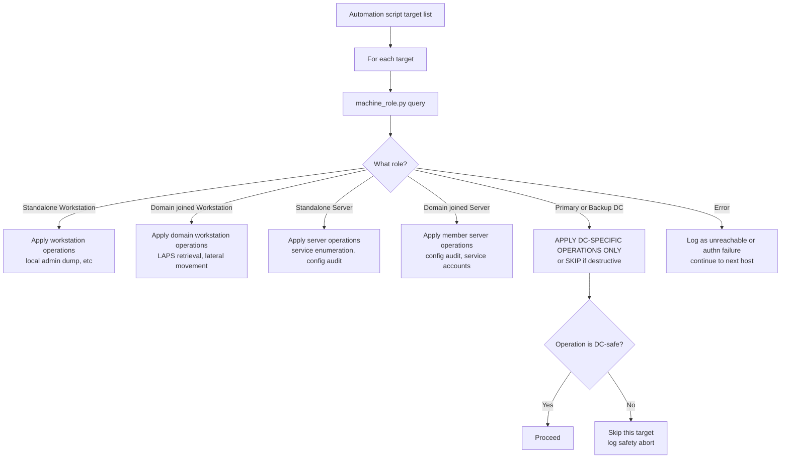
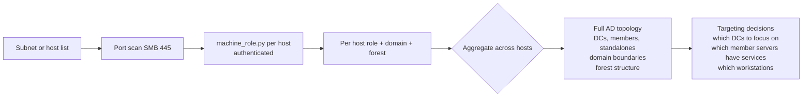

title: "machine_role.py"
script: "examples/machine_role.py"
category: "Recon and Enumeration"
status: "Published"
protocols:
  - MS-DSSP
  - MS-RPCE
ms_specs:
  - MS-DSSP
  - MS-RPCE
mitre_techniques:
  - T1082
  - T1018
  - T1592.002
auth_types:
  - NTLM
  - Kerberos
  - Pass the Hash
tags:
  - impacket
  - impacket/examples
  - category/recon_and_enumeration
  - status/published
  - protocol/ms-dssp
  - protocol/ms-rpce
  - ms-spec/ms-dssp
  - ms-spec/ms-rpce
  - technique/host_role_enumeration
  - technique/domain_membership_check
  - technique/dc_identification
  - mitre/T1082
  - mitre/T1018
  - mitre/T1592.002
aliases:
  - machine_role
  - host-role
  - dssp
  - domain-membership-check
  - dc-identification
  - ms-dssp


# machine_role.py

> **One line summary:** Small focused reconnaissance tool that calls the `DsRolerGetPrimaryDomainInformation` RPC method on a target host's `[MS-DSSP]` Directory Services Setup Remote Protocol interface (UUID `3919286A-B10C-11D0-9BA8-00C04FD92EF5`, accessed via the `\PIPE\lsarpc` named pipe over SMB), parses the returned `DSROLER_PRIMARY_DOMAIN_INFO_BASIC` structure, and prints a host's machine role as one of six values from the `DSROLE_MACHINE_ROLE` enum (Standalone Workstation, Domain joined Workstation, Standalone Server, Domain joined Server, Backup Domain Controller, or Primary Domain Controller) along with the host's NetBIOS domain name, DNS domain name, forest name, and domain GUID; authored by **Simon Decosse (`@simondotsh`)** with an explicit design goal stated in the source description: "This may be particularly useful when it is used in a script where further operations depend on knowing the role of its target, e.g. 'I do not want to perform this on a DC'"; represents a deliberately minimalist approach that contrasts sharply with the information density of tools like [`DumpNTLMInfo.py`](DumpNTLMInfo.md) - rather than extracting everything available pre authentication, machine_role.py answers exactly one question ("what kind of machine is this?") and provides precisely enough context (domain membership, forest affiliation) to make that answer operationally useful; works against any SMB-reachable host provided authentication succeeds; useful as a safety primitive in automation scripts to avoid running destructive or high risk operations against domain controllers, useful for DC identification when LDAP based discovery isn't an option, and useful for quickly differentiating standalone hosts from domain members in mixed environments; **continues Recon and Enumeration at 15 of 17 articles (88%), with two stubs remaining (`getArch.py` and one more to confirm) before the category closes as the 13th and final complete category for the wiki at 100% completion**.

| Field | Value |
|:---|:---|
| Script | `examples/machine_role.py` |
| Category | Recon and Enumeration |
| Status | Published |
| Author | Simon Decosse (`@simondotsh`) per source header |
| Description (from source) | "Through MS-DSSP, this script retrieves a host's role along with its primary domain details" |
| Stated use case (from source) | Safety primitive for automation: "'I do not want to perform this on a DC'" |
| Primary protocol | `[MS-DSSP]` Directory Services Setup Remote Protocol over DCE/RPC over SMB |
| MS-DSSP interface UUID | `3919286A-B10C-11D0-9BA8-00C04FD92EF5` |
| Transport | SMB named pipe: `\PIPE\lsarpc` (colocated with LSARPC in the LSASS process) |
| Primary Microsoft specifications | `[MS-DSSP]` Directory Services Setup Remote Protocol; `[MS-RPCE]` Remote Procedure Call Protocol Extensions |
| Primary RPC method | `DsRolerGetPrimaryDomainInformation` with `InfoLevel = DsRolePrimaryDomainInfoBasic (1)` |
| Returned structure | `DSROLER_PRIMARY_DOMAIN_INFO_BASIC` containing `MachineRole`, `Flags`, `DomainNameFlat`, `DomainNameDns`, `DomainForestName`, `DomainGuid` |
| MITRE ATT&CK techniques | T1082 System Information Discovery; T1018 Remote System Discovery; T1592.002 Gather Victim Host Information: Software |
| Authentication | NTLM, Kerberos (`-k`), Pass the Hash (`-hashes`) |
| Port | 445 (SMB) or 139 (NetBIOS), `-port` flag selectable |
| Output fields | Machine Role, NetBIOS Domain Name, Domain Name (DNS), Forest Name, Domain GUID |
| Machine role values | 6 total from DSROLE_MACHINE_ROLE enum: Standalone Workstation, Domain joined Workstation, Standalone Server, Domain joined Server, Backup Domain Controller, Primary Domain Controller |


## Prerequisites

This article assumes familiarity with:

- [`rpcdump.py`](rpcdump.md) for DCE/RPC fundamentals including the Endpoint Mapper, string bindings, interface UUIDs, and the `ncacn_np` transport over SMB named pipes.
- [`DumpNTLMInfo.py`](DumpNTLMInfo.md) as the pre authentication counterpart - machine_role.py requires authentication whereas DumpNTLMInfo.py does not, but both extract OS and host identity information.
- [`lookupsid.py`](lookupsid.md) for the `\PIPE\lsarpc` pipe context - lsarpc hosts multiple RPC interfaces including MS-LSAT, MS-LSAD, and MS-DSSP.
- SMB named pipe basics: named pipes are accessed via the SMB `TREE_CONNECT` to `IPC$` followed by `CREATE` on `\pipe\<name>`. The DCE/RPC layer rides on top of the pipe.
- Windows machine role concepts: standalone (workgroup) vs domain member, workstation vs server SKU, BDC vs PDC distinction (which exists in the API for historical reasons even though post Windows 2000 Active Directory has no real BDC/PDC distinction).
- The `[MS-DSSP]` specification: one of the smaller Microsoft protocol specs, exposing exactly three RPC methods (`DsRolerGetPrimaryDomainInformation`, `DsRolerGetDcOperationProgress`, `DsRolerGetDcOperationResults`) for obtaining host role information.


## What it does

`machine_role.py` connects to a target host via SMB, opens the `\PIPE\lsarpc` named pipe, binds to the MS-DSSP RPC interface, calls `DsRolerGetPrimaryDomainInformation`, parses the response, and prints the host's role plus domain details.

### Default invocation

```text
$ python machine_role.py 'CORP.LOCAL/auditor:Passw0rd@SRV-DC01'
Impacket v0.13.0 - Copyright Fortra, LLC and its affiliated companies

[*] Target                : SRV-DC01
[*] Machine Role          : Primary Domain Controller
[*] NetBIOS Domain Name   : CORP
[*] Domain Name           : corp.local
[*] Forest Name           : corp.local
[*] Domain GUID           : 3abc1234-5678-90ab-cdef-1234567890ab
```

Each field:
- **Target**: the hostname or IP passed on the command line.
- **Machine Role**: one of the six values from `DSROLE_MACHINE_ROLE`. This is the primary question the tool answers.
- **NetBIOS Domain Name**: short (prior to Windows 2000) domain name, 15 characters or fewer.
- **Domain Name**: DNS-style fully qualified domain name.
- **Forest Name**: DNS name of the forest root domain.
- **Domain GUID**: globally unique identifier of the domain. Stable across domain renames, unlike the DNS/NetBIOS names.

### Example outputs for each role type

Against a Primary Domain Controller:

```text
[*] Machine Role          : Primary Domain Controller
[*] NetBIOS Domain Name   : CORP
[*] Domain Name           : corp.local
[*] Forest Name           : corp.local
```

Against a domain joined workstation:

```text
[*] Machine Role          : Domain joined Workstation
[*] NetBIOS Domain Name   : CORP
[*] Domain Name           : corp.local
[*] Forest Name           : corp.local
```

Against a domain joined server:

```text
[*] Machine Role          : Domain joined Server
[*] NetBIOS Domain Name   : CORP
[*] Domain Name           : corp.local
[*] Forest Name           : corp.local
```

Against a standalone workstation (workgroup member):

```text
[*] Machine Role          : Standalone Workstation
[*] NetBIOS Domain Name   : WORKGROUP
[*] Domain Name           : WORKGROUP
[*] Forest Name           :
[*] Domain GUID           : 00000000-0000-0000-0000-000000000000
```

Note that for standalone hosts, the "Forest Name" is empty and the "Domain GUID" is all zeros - there's no forest to belong to.

Against a standalone server:

```text
[*] Machine Role          : Standalone Server
[*] NetBIOS Domain Name   : WORKGROUP
[*] Domain Name           : WORKGROUP
```

### The three MS-DSSP methods

The MS-DSSP specification defines only three RPC methods:

1. **`DsRolerGetPrimaryDomainInformation`** (opnum 0) - returns current role and domain info. This is what machine_role.py calls.
2. **`DsRolerGetDcOperationProgress`** (opnum 1) - reports progress of an in-flight promote/demote operation. Not used by machine_role.py.
3. **`DsRolerGetDcOperationResults`** (opnum 2) - returns results of a completed promote/demote operation. Not used by machine_role.py.

The two operation monitoring methods exist because `DCPROMO` operations (promote to DC, demote from DC) are long running and the Windows management UI needs to poll for progress. For reconnaissance purposes, only the first method matters.

### Key flags

| Flag | Meaning |
|:---|:---|
| `target` (positional) | `[[domain/]username[:password]@]<targetName>` standard Impacket target |
| `-ts` | Timestamp log lines |
| `-debug` | Verbose debug output |
| `-hashes LMHASH:NTHASH` | NTLM hash auth (pass the hash) |
| `-no-pass` | Skip password prompt (for `-k`) |
| `-k` | Kerberos authentication |
| `-aesKey` | AES key for Kerberos |
| `-dc-ip` | Specify KDC IP |
| `-target-ip` | IP address of target machine (useful when target is NetBIOS name) |
| `-port {139, 445}` | SMB port (default 445) |

The CLI is intentionally minimal. One positional target, a small set of auth flags, nothing else. This reflects the tool's narrow scope.


## Why it exists

### The "is this a DC?" problem

In automated penetration testing and red team scripting, operators frequently want to apply different operations based on host role. Specifically, certain operations are unsafe or inappropriate against domain controllers:

- **Running credential dumpers locally**: `secretsdump.py` against a DC extracts the entire NTDS.dit - appropriate in some engagements, potentially destructive in others, often heavily monitored.
- **Mass file operations on SYSVOL**: DCs replicate SYSVOL via DFSR; write operations have broader blast radius.
- **RPC operations that might crash lsass**: some older Impacket tools had reliability issues; crashing lsass on a DC means potential forestwide outage.
- **Password changing or account manipulation**: DCs authoritatively hold AD; changes there propagate.
- **Persistence implant deployment**: implanting on a DC has different blast radius than on a workstation.

For these scenarios, knowing "am I about to operate on a DC?" before proceeding is important. Simon Decosse's source comment captures this explicitly: "I do not want to perform this on a DC."

The tool's purpose is to be the answer to this check in a one line shell invocation that can precede any other operation.

### Why MS-DSSP specifically

Multiple paths exist to determine a host's role:

1. **LDAP query to the DC**: `msDS-IsPartialReplicaNC` attribute on computer objects, or objectClass filters for `domainController`. Requires authenticated LDAP and query against a DC (not the host itself).
2. **SAMR query**: connect to SAMR on the target and check the domain enumeration response. Works but requires SAMR access.
3. **Service enumeration**: DCs run specific services (NTDS, Netlogon as DC role, DNS, etc.). Detect via service enumeration. Indirect.
4. **Port 88 (Kerberos) listening**: DCs listen on 88; non-DCs don't. Network-level probe. Indirect.
5. **MS-DSSP `DsRolerGetPrimaryDomainInformation`**: ask the host directly "what's your role?" via a dedicated protocol method.

MS-DSSP is the most direct answer: a protocol method specifically designed to return role information. The response comes from the host itself (not from an AD lookup about the host), so it's authoritative.

### Why a dedicated tool

Impacket already had the MS-DSSP library support in `impacket.dcerpc.v5.dssp`. Writing a one liner script using the library is technically possible:

```python
from impacket.dcerpc.v5 import transport, dssp
t = transport.DCERPCTransportFactory('ncacn_np:SRV01[\\PIPE\\lsarpc]')
t.set_credentials('user', 'pass', 'CORP', '', '')
dce = t.get_dce_rpc()
dce.connect()
dce.bind(dssp.MSRPC_UUID_DSSP)
resp = dssp.hDsRolerGetPrimaryDomainInformation(dce)
print(resp['DomainInfo']['DomainInfoBasic']['MachineRole'])
```

Having the polished `machine_role.py` saves writing that each time, includes error handling, adds the role name mapping (enum value → human readable name), and provides the consistent Impacket CLI flags for authentication. These small refinements are the difference between a one off snippet and a tool operators actually use.

The tool also serves as a pedagogical artifact: a clean, short example of how to use an Impacket RPC client library. Reading `machine_role.py` alongside the `impacket/dcerpc/v5/dssp.py` library source gives a complete picture of a minimal DCE/RPC client implementation.

### Why it's the smallest tool in Recon and Enumeration

`machine_role.py` is arguably the smallest and most focused Impacket example tool. It does one thing, returns one structure, and exits. Compare:

- `netview.py`: multi-RPC threaded domain-wide session enumeration.
- `GetLAPSPassword.py`: LDAP + MS-GKDI RPC + DPAPI-NG decryption.
- `rpcdump.py`: comprehensive endpoint mapper enumeration.
- **`machine_role.py`**: one RPC call, one response parse, six possible outputs.

This minimalism is a feature. Simon Decosse built the tool with a specific operational use case in mind (safety gate for automation) and resisted adding features beyond that. The result is a tool that does exactly one job and does it in under 200 lines.

### Historical note on PDC/BDC

The `DSROLE_MACHINE_ROLE` enum includes `DsRole_RoleBackupDomainController` and `DsRole_RolePrimaryDomainController`. These reflect Windows NT 4.0 era semantics where domains had one PDC (authoritative) and multiple BDCs (read only replicas).

In Active Directory (Windows 2000+), the PDC/BDC distinction is largely historical:
- Every DC is writable (multi master replication).
- One DC holds the "PDC Emulator" FSMO role for compatibility and specific functions (password changes, time sync).
- No BDCs in the NT 4.0 sense; "BDC" might appear if the domain is running in mixed mode with NT 4.0 compat.

Modern Windows Server DCs typically report as "Primary Domain Controller" via MS-DSSP because they hold (or are eligible to hold) the PDC Emulator FSMO role. In practice the `DsRole_RoleBackupDomainController` value is rarely seen in modern environments.

This matters for interpreting output: the tool correctly reports the value returned by the protocol, but the semantic distinction between PDC and BDC in Active Directory is weaker than the names suggest. For most operational purposes, any DC result (PDC or BDC) means "this is a domain controller, treat accordingly."


## Protocol theory

### MS-DSSP overview

The **Directory Services Setup Remote Protocol** (`[MS-DSSP]`) is a small RPC interface exposed by the Local Security Authority Subsystem Service (LSASS) on Windows hosts. Its scope is narrow: exposing information about the host's Active Directory membership state (standalone or domain member) and role (workstation, server, DC) for management tools.

Key facts:
- **Interface UUID**: `3919286A-B10C-11D0-9BA8-00C04FD92EF5`
- **Version**: 1.0
- **Transport**: DCE/RPC over SMB named pipe
- **Pipe name**: `\PIPE\lsarpc` (shared with LSARPC, colocated in LSASS)
- **Authentication required**: Yes (no anonymous/null session access by default on modern Windows)
- **Specification**: `https://learn.microsoft.com/en-us/openspecs/windows_protocols/ms-dssp/`

The protocol's three methods cover:
1. Query the current role (`DsRolerGetPrimaryDomainInformation`).
2. Query progress of an in-flight role change (`DsRolerGetDcOperationProgress`).
3. Query results of a completed role change (`DsRolerGetDcOperationResults`).

Only the first is relevant to reconnaissance.

### The DsRolerGetPrimaryDomainInformation call

The method signature:

```c
DWORD DsRolerGetPrimaryDomainInformation(
    [in] handle_t hBinding,
    [in] DSROLE_PRIMARY_DOMAIN_INFO_LEVEL InfoLevel,
    [out, switch_is(InfoLevel)] PDSROLER_PRIMARY_DOMAIN_INFORMATION* DomainInfo
);
```

The `InfoLevel` parameter is a discriminator for the response structure. Defined levels:

- `DsRolePrimaryDomainInfoBasic = 1`: returns basic role information (what machine_role.py uses).
- `DsRolePrimaryDomainInfoUpgrade = 2`: info about DC upgrade operations.
- `DsRolePrimaryDomainInfoOperationState = 3`: state of long running operations.

Most clients use level 1; the others are for specific management scenarios.

### The DSROLER_PRIMARY_DOMAIN_INFO_BASIC structure

Response structure at InfoLevel = 1:

```c
typedef struct _DSROLER_PRIMARY_DOMAIN_INFO_BASIC {
    DSROLE_MACHINE_ROLE MachineRole;
    ULONG Flags;
    [string, unique] wchar_t* DomainNameFlat;
    [string, unique] wchar_t* DomainNameDns;
    [string, unique] wchar_t* DomainForestName;
    GUID DomainGuid;
} DSROLER_PRIMARY_DOMAIN_INFO_BASIC;
```

Fields:
- **MachineRole**: one of the six `DSROLE_MACHINE_ROLE` enum values.
- **Flags**: bit flags describing additional state (e.g., DS running, upgrade in progress, domain rollup, read only DC). Not parsed by machine_role.py but available in the raw response.
- **DomainNameFlat**: NetBIOS short name of the domain.
- **DomainNameDns**: DNS-style full domain name.
- **DomainForestName**: DNS name of the forest root.
- **DomainGuid**: binary GUID.

machine_role.py extracts and prints all fields except Flags.

### The DSROLE_MACHINE_ROLE enum

```c
typedef enum _DSROLE_MACHINE_ROLE {
    DsRole_RoleStandaloneWorkstation = 0,
    DsRole_RoleMemberWorkstation = 1,
    DsRole_RoleStandaloneServer = 2,
    DsRole_RoleMemberServer = 3,
    DsRole_RoleBackupDomainController = 4,
    DsRole_RolePrimaryDomainController = 5
} DSROLE_MACHINE_ROLE;
```

The numeric values matter because wire level traffic contains the integer, not the string. The tool's `MACHINE_ROLES` dict maps integer → human readable string for display.

### The Flags field

Defined in MS-DSSP as:

| Flag name | Value | Meaning |
|:---|:---||
| `DSROLE_PRIMARY_DS_RUNNING` | 0x00000001 | Directory Service is running on this machine |
| `DSROLE_PRIMARY_DS_MIXED_MODE` | 0x00000002 | Domain is in NT 4.0 mixed mode (historical) |
| `DSROLE_UPGRADE_IN_PROGRESS` | 0x00000004 | Upgrade in progress |
| `DSROLE_PRIMARY_DOMAIN_GUID_PRESENT` | 0x01000000 | The Domain GUID field is valid |

machine_role.py doesn't parse these flags for display, but they're available in the raw response. An extended version of the tool could surface them.

### Wire level: the DCE/RPC call

The SMB + DCE/RPC exchange:

```text
1. SMB NEGOTIATE / SESSION_SETUP / TREE_CONNECT to IPC$
2. SMB CREATE on \pipe\lsarpc
3. DCE/RPC Bind request specifying MS-DSSP UUID + version
4. DCE/RPC Bind_Ack
5. DCE/RPC Request (opnum 0 = DsRolerGetPrimaryDomainInformation), InfoLevel = 1
6. DCE/RPC Response with serialized DSROLER_PRIMARY_DOMAIN_INFO_BASIC
7. SMB CLOSE / LOGOFF / TREE_DISCONNECT
```

Total: ~20-30 packets, completes in hundreds of milliseconds.

### Why \PIPE\lsarpc

The `\PIPE\lsarpc` pipe hosts multiple related RPC interfaces via DCE/RPC's UUID based binding:

- **MS-LSAT** (Local Security Authority Translation) - used by lookupsid.py
- **MS-LSAD** (Local Security Authority Domain Policy) - used by lookupsid.py and others
- **MS-DSSP** (Directory Services Setup) - used by machine_role.py

All three interfaces are hosted in the LSASS process via this single pipe. The client selects which interface by the UUID passed in the DCE/RPC bind. This pipe colocation is a Windows design choice: LSASS is the natural home for directory and security related queries, so all the relevant RPC interfaces live there.

Operationally this means: if you can reach `\PIPE\lsarpc` (authenticated SMB to the target), you can use multiple reconnaissance primitives (lookupsid, samrdump's LSAD component, machine_role) without opening additional pipes.

### Authentication requirements

MS-DSSP requires authenticated access. Modern Windows doesn't permit anonymous (null session) queries of this interface.

Acceptable authentication:
- **NTLM** with username/password or NT hash.
- **Kerberos** with TGT or password/key.
- Any domain user, any local user with SMB access, any machine account.

Not acceptable:
- **Anonymous** / null sessions (blocked by default since Windows Vista / Server 2008).

This distinguishes machine_role.py from pre-auth tools like DumpNTLMInfo.py, which work without credentials. machine_role.py is strictly post authentication.


## How the tool works internally

### Imports

```python
import sys
import logging
import argparse

from impacket.examples import logger
from impacket.examples.utils import parse_target
from impacket import version
from impacket.dcerpc.v5 import transport, dssp
```

Minimal imports. The `dssp` module provides `MSRPC_UUID_DSSP`, the `DSROLE_MACHINE_ROLE` enum, and the high-level helper `hDsRolerGetPrimaryDomainInformation`.

### The MachineRole class

```python
class MachineRole:
    # https://docs.microsoft.com/en-us/openspecs/windows_protocols/ms-dssp/09f0677f-52e5-454d-9a65-0e8d8ba6fdeb
    MACHINE_ROLES = {
        dssp.DSROLE_MACHINE_ROLE.DsRole_RoleStandaloneWorkstation:
        'Standalone Workstation',
        dssp.DSROLE_MACHINE_ROLE.DsRole_RoleMemberWorkstation:
        'Domain joined Workstation',
        dssp.DSROLE_MACHINE_ROLE.DsRole_RoleStandaloneServer:
        'Standalone Server',
        dssp.DSROLE_MACHINE_ROLE.DsRole_RoleMemberServer:
        'Domain joined Server',
        dssp.DSROLE_MACHINE_ROLE.DsRole_RoleBackupDomainController:
        'Backup Domain Controller',
        dssp.DSROLE_MACHINE_ROLE.DsRole_RolePrimaryDomainController:
        'Primary Domain Controller'
    }
```

The `MACHINE_ROLES` dict is the core data structure: a mapping from protocol enum values to human readable strings. The source URL in the comment points to the MS-DSSP specification page for `DSROLE_MACHINE_ROLE`.

### The run flow

Pseudocode:

```python
def run(self, target_host):
    # Build string binding
    string_binding = r'ncacn_np:%s[\PIPE\lsarpc]' % target_host
    
    # Create transport and set credentials
    rpctransport = transport.DCERPCTransportFactory(string_binding)
    rpctransport.set_credentials(
        self.__username, self.__password, self.__domain,
        self.__lmhash, self.__nthash, self.__aesKey
    )
    rpctransport.set_kerberos(self.__doKerberos, self.__kdcHost)
    if hasattr(rpctransport, 'set_dport'):
        rpctransport.set_dport(self.__port)
    
    # Connect and bind
    dce = rpctransport.get_dce_rpc()
    dce.connect()
    dce.bind(dssp.MSRPC_UUID_DSSP)
    
    # Call DsRolerGetPrimaryDomainInformation
    domain_info = dssp.hDsRolerGetPrimaryDomainInformation(dce)
    
    # Parse response
    output = {}
    output['Target'] = target_host
    output['Machine Role'] = self.MACHINE_ROLES[
        domain_info['DomainInfo']['DomainInfoBasic']['MachineRole']
    ]
    output['NetBIOS Domain Name'] = domain_info['DomainInfo']['DomainInfoBasic']['DomainNameFlat']
    output['Domain Name'] = domain_info['DomainInfo']['DomainInfoBasic']['DomainNameDns']
    output['Forest Name'] = domain_info['DomainInfo']['DomainInfoBasic']['DomainForestName']
    output['Domain GUID'] = bin_to_string(
        domain_info['DomainInfo']['DomainInfoBasic']['DomainGuid']
    )
    
    # Print results
    for key, value in output.items():
        print('[*] %-20s: %s' % (key, value))
    
    # Disconnect
    dce.disconnect()
```

The actual source follows this structure. Error handling catches session errors (access denied, connection refused) and reports clean error messages. The overall code is short - the whole script is under 200 lines including argument parsing and imports.

### The `dssp.py` library module

The `impacket/dcerpc/v5/dssp.py` library file defines:

- `MSRPC_UUID_DSSP` - the interface UUID.
- `DSROLE_MACHINE_ROLE` enum class with the six role values.
- `DSROLER_PRIMARY_DOMAIN_INFO_BASIC` NDR struct definition.
- `DSROLE_PRIMARY_DOMAIN_INFO_LEVEL` discriminator enum.
- `hDsRolerGetPrimaryDomainInformation(dce, infoLevel=1)` high-level helper that handles the RPC call and response parsing.

The library file is concise (~150 lines) because MS-DSSP is a small protocol. Reading dssp.py is a good introduction to how Impacket wraps small RPC interfaces: NDR struct definitions, call wrappers, enum classes.

### The domain GUID conversion

The `DomainGuid` field arrives as a 16-byte binary blob. machine_role.py converts it to the standard `xxxxxxxx-xxxx-xxxx-xxxx-xxxxxxxxxxxx` string via `bin_to_string`:

```python
def bin_to_string(guid_bytes):
    # GUID byte order is mixed: first 3 fields little endian, last 2 big endian
    d1 = struct.unpack('<I', guid_bytes[0:4])[0]
    d2 = struct.unpack('<H', guid_bytes[4:6])[0]
    d3 = struct.unpack('<H', guid_bytes[6:8])[0]
    d4 = guid_bytes[8:10].hex()
    d5 = guid_bytes[10:16].hex()
    return '%08x-%04x-%04x-%s-%s' % (d1, d2, d3, d4, d5)
```

The mixed byte order (little endian for first three fields, big endian for last two) is the standard Windows GUID binary format. Getting this wrong produces GUIDs that look almost right but don't match AD's representation.

### What the tool does NOT do

- Does NOT return the Flags field. Only role and domain names.
- Does NOT report in-progress promote/demote operations. `DsRolerGetDcOperationProgress` is not called.
- Does NOT enumerate multiple hosts. Single target per invocation; use shell loops for bulk queries.
- Does NOT distinguish between "in the same domain as me" and "in a different domain." Returns the domain name but doesn't interpret membership.
- Does NOT query LDAP or any other protocol. Single RPC call, MS-DSSP only.
- Does NOT support anonymous queries. Authentication required.
- Does NOT test whether write operations would succeed. Read only query.
- Does NOT detect Read Only Domain Controllers (RODCs) specifically. An RODC reports as a DC (Primary or Backup) but the distinction requires examining other attributes.
- Does NOT handle Azure AD / Entra ID joined machines specifically. Those machines may report Standalone Workstation status via MS-DSSP even when they're cloud joined, because MS-DSSP is about on premises AD only.
- Does NOT check whether the target is reachable before attempting authentication. Connection errors surface as standard Python exceptions.
- Does NOT support output formats other than human readable stdout. No JSON, no CSV, no machine parseable output by default.


## Practical usage

### Basic invocation

```bash
python machine_role.py 'CORP.LOCAL/user:pass@SRV-DC01'
```

Single target, one positional argument with credentials embedded. Fast (under a second typically).

### With NTLM hash

```bash
python machine_role.py -hashes :NTHASH 'CORP.LOCAL/user@SRV-DC01'
```

Pass the hash variant.

### With Kerberos

```bash
getTGT.py 'CORP.LOCAL/user:pass'
export KRB5CCNAME=user.ccache

python machine_role.py -k -no-pass 'CORP.LOCAL/user@srv-dc01.corp.local' -dc-ip 10.10.10.10
```

Kerberos authentication using a cached TGT.

### Bulk host role categorization

The tool shines in shell loops for categorizing hosts:

```bash
# Categorize all hosts in a subnet
for ip in 192.168.1.{1..254}; do
    role=$(python machine_role.py "CORP/user:pass@$ip" 2>/dev/null | grep "Machine Role" | awk -F': ' '{print $2}')
    if [ -n "$role" ]; then
        echo "$ip : $role"
    fi
done | tee host_inventory.txt
```

Output like:

```text
192.168.1.10 : Primary Domain Controller
192.168.1.11 : Primary Domain Controller
192.168.1.50 : Domain joined Server
192.168.1.51 : Domain joined Server
192.168.1.100 : Domain joined Workstation
...
```

Useful for rapidly mapping a network's AD topology by role.

### Automation safety gate

The tool's stated purpose in action:

```bash
#!/bin/bash
# destructive_operation.sh - only runs on non-DCs
TARGET="$1"

role=$(python machine_role.py "CORP/admin:pass@$TARGET" 2>/dev/null | grep "Machine Role" | awk -F': ' '{print $2}')

if [[ "$role" == *"Domain Controller"* ]]; then
    echo "SAFETY ABORT: $TARGET is a domain controller ($role)"
    echo "This operation is configured to skip DCs"
    exit 1
fi

echo "$TARGET is $role - proceeding"
# ... destructive operation here ...
```

This is the pattern Simon Decosse described in the source comment. Used in automation pipelines to prevent operations from hitting DCs unintentionally.

### DC identification without LDAP

If LDAP access isn't available or isn't desirable (noisy, heavily monitored, requires different credentials), machine_role.py provides a non LDAP way to identify DCs:

```bash
for host in $(cat hosts.txt); do
    role=$(python machine_role.py "CORP/user:pass@$host" 2>/dev/null | grep "Machine Role" | awk -F': ' '{print $2}')
    if [[ "$role" == *"Domain Controller"* ]]; then
        echo "DC: $host ($role)"
    fi
done
```

Each query uses SMB + lsarpc, different traffic pattern than LDAP to port 389/636. Useful when port 389/636 is filtered or you want to avoid LDAP audit trails specifically.

### Forest mapping

The "Forest Name" field helps map multi domain forests:

```bash
for host in $(cat hosts.txt); do
    output=$(python machine_role.py "CORP/user:pass@$host" 2>/dev/null)
    domain=$(echo "$output" | grep "Domain Name" | head -1 | awk -F': ' '{print $2}')
    forest=$(echo "$output" | grep "Forest Name" | awk -F': ' '{print $2}')
    echo "$host : domain=$domain forest=$forest"
done
```

When domain differs from forest, you're looking at a child domain. When forest is empty, standalone host. Aggregated across many hosts, this reveals the complete forest topology.

### Identifying read only domain controllers

RODCs report as DCs (Primary Domain Controller typically) via MS-DSSP, but their AD computer object has specific attributes (`PRIMARY_GROUP_ID=521` for RODC) that distinguish them. machine_role.py alone doesn't show this; combine with an LDAP query to `GetADComputers.py` or similar to cross reference:

```bash
# Identify DCs via machine_role
for host in $(cat dcs.txt); do
    if python machine_role.py "CORP/user:pass@$host" 2>/dev/null | grep -q "Primary Domain Controller"; then
        # Now check via LDAP if it's RODC
        GetADComputers.py 'CORP/user:pass@dc01' | grep "$host" | grep -q "21500000" && \
            echo "RODC: $host"
    fi
done
```

### Pre-exploitation fingerprint

```bash
# Quick fingerprint before any major operation
TARGET=10.10.10.50
echo "=== Fingerprint of $TARGET ==="

# Pre-auth fingerprint
python DumpNTLMInfo.py "$TARGET"
echo ""

# Post-auth role (if credentials available)
python machine_role.py "CORP/user:pass@$TARGET"
```

Combined pre and post auth fingerprint provides the fullest picture before proceeding with targeted operations.

### Integration with BloodHound data

BloodHound's graph already contains machine role information (from LDAP collection). machine_role.py is useful when:
- BloodHound data isn't available or is stale.
- You want ground truth from the host itself rather than AD's view.
- You need role info for hosts not in the current AD (workgroup machines).
- You're operating in a black box scenario and haven't yet collected BloodHound data.


## What it looks like on the wire

### Full exchange

```text
TCP 3-way handshake → target:445

SMB2 NEGOTIATE Request
SMB2 NEGOTIATE Response (with SPNEGO)

SMB2 SESSION_SETUP Request (NTLM Type 1 or Kerberos AP-REQ)
SMB2 SESSION_SETUP Response (Success or MORE_PROCESSING_REQUIRED)
SMB2 SESSION_SETUP Request (NTLM Type 3 - only for NTLM)
SMB2 SESSION_SETUP Response (Success)

SMB2 TREE_CONNECT Request (\\server\IPC$)
SMB2 TREE_CONNECT Response

SMB2 CREATE Request (\pipe\lsarpc)
SMB2 CREATE Response

DCE/RPC over SMB2 WRITE + READ pairs:
    Bind: UUID 3919286A-B10C-11D0-9BA8-00C04FD92EF5, version 1.0
    Bind_Ack

    Request: opnum 0 (DsRolerGetPrimaryDomainInformation), InfoLevel=1
    Response: DSROLER_PRIMARY_DOMAIN_INFO_BASIC

SMB2 CLOSE
SMB2 TREE_DISCONNECT
SMB2 LOGOFF

TCP FIN
```

Total: ~20-30 packets. Volume: small, likely 5-10 KB.

### Wireshark filtering

```text
dcerpc.cn_bind_if_id == "3919286a-b10c-11d0-9ba8-00c04fd92ef5"
# Show MS-DSSP bind
```

Or:

```text
dcerpc.cn_call_id and dcerpc.cn_ops
# Filter to RPC call traffic
```

Or the simpler pipe based filter:

```text
smb2.filename contains "lsarpc"
# Shows all \PIPE\lsarpc traffic (includes LSAT, LSAD, DSSP)
```

Wireshark's DCE/RPC dissector understands MS-DSSP and will decode the `DSROLER_PRIMARY_DOMAIN_INFO_BASIC` structure in the response, making capture analysis straightforward.

### Stealth profile

machine_role.py is relatively low footprint:
- Single SMB session per invocation.
- Single RPC call per invocation.
- No secondary connections (no Kerberos TGS for service tickets beyond the initial DC ticket, no SAMR operations, no LDAP).
- Complete in <1 second typically.

That said, every authenticated SMB session is logged (Event 4624 on target). Bulk queries across many hosts produce many Event 4624 records - a detection signal in itself.


## What it looks like in logs

### Target Windows Security log

- **Event 4624** (logon): one per invocation at the target. Logon Type 3 (network) for remote SMB.
- **Event 4625** (logon failure): if authentication fails (wrong creds, account locked, etc.).
- **Event 5140** (file share access): if "Audit File Share" is enabled, the `IPC$` share access is logged.

The Event 4624 is the primary indicator - a single line per target host showing a successful network logon.

### RPC-specific logging

DCE/RPC operations on `\PIPE\lsarpc` are generally not logged specifically by default. The pipe itself is a standard Windows IPC mechanism used by many legitimate operations (management tools, group policy, AD replication).

Detailed RPC logging requires:
- **Sysmon with EventID 17/18** (named pipe created/connected) - logs pipe connections but doesn't interpret the RPC contents.
- **PortReserver style tools** - specialized RPC filtering products.
- **ETW (Event Tracing for Windows) RPC providers** - detailed but high volume, not default on.

In practice, machine_role.py activity at the target looks like generic authenticated SMB access plus a brief pipe interaction. Detection is possible but requires specific tuning.

### Client side logging

On the machine running machine_role.py (Linux typically):
- **Firewall logs**: outbound TCP 445 connection to target.
- **Optional application logging**: if the operator adds `-debug -ts` and redirects output.

### Sysmon logs

If Sysmon is deployed on the target:

- **Event 3** (network connection): the inbound SMB connection.
- **Event 17** (pipe created): when `\pipe\lsarpc` is created by the server for the session.
- **Event 18** (pipe connected): when the client connects.

Sysmon events can be correlated by session ID to tie the network activity to the pipe activity.

### EDR detection

Modern EDR products may detect machine_role.py activity via:

- **Bulk authenticated queries to lsarpc from unusual sources**: a workstation account querying many DCs for their role is atypical.
- **Pattern of short SMB connections with lsarpc access**: automation signature.
- **Specific tool signatures**: some EDR vendors identify Impacket by traffic characteristics or binary signatures.

Single target machine_role.py is typically invisible or very low signal. Bulk machine_role.py (across many hosts) is a stronger signal but still requires tuned detection.

### Sigma rule example

```yaml
title: Bulk MS-DSSP Role Enumeration
logsource:
  product: windows
  service: security
detection:
  selection_lsarpc_access:
    EventID: 5140
    ShareName: 'IPC$'
  selection_logon:
    EventID: 4624
    LogonType: 3
  threshold_many_hosts:
    IpAddress: single
    distinct_target_hosts: '> 20'
    timeframe: 5m
  condition: (selection_lsarpc_access or selection_logon) and threshold_many_hosts
level: low
```

Low severity because the pattern (many authenticated SMB sessions from one source) has many legitimate causes: vulnerability scanners, domain join verification tools, monitoring systems, asset inventory tools. Context is required to distinguish malicious vs benign.


## Detection and defense

### Detection approach

- **Event 4624 volume monitoring**: bulk authenticated logons from unusual sources.
- **Pipe access auditing**: if detailed named pipe auditing is enabled via Sysmon or similar, the `\PIPE\lsarpc` access pattern is visible.
- **EDR behavioral**: modern EDR may have specific signatures for Impacket-family tools.
- **Account anomaly detection**: an account that normally doesn't authenticate to many DCs suddenly doing so is worth investigating.
- **Honeypot DCs**: decoy DC hosts that log any authentication attempt. Access is high confidence malicious.

### Preventive controls

MS-DSSP is a legitimate Windows protocol used by management tools. Blocking it entirely breaks Windows functionality. Preventive controls focus on limiting who can reach it:

- **Network segmentation**: restrict SMB (port 445) access to administrative networks.
- **Firewall rules on DCs**: permit SMB only from approved management hosts. Workstations typically don't need to initiate SMB to DCs.
- **Just in time admin access**: credentials with SMB access to DCs are granted temporarily. Outside the window, they don't work.
- **Attack Surface Reduction rules**: some ASR rules restrict lsass access patterns.
- **RPC filter policies**: Windows Firewall supports RPC filters that can restrict specific interface access. `[MS-DSSP]` can be limited to specific security principals.
- **Local security authority hardening**: LSA Protection (RunAsPPL), Credential Guard, and other LSA hardening reduces attack surface but doesn't specifically block MS-DSSP enumeration.

### What machine_role.py does NOT enable

- Does NOT bypass authentication.
- Does NOT compromise the target.
- Does NOT persist.
- Does NOT establish any lateral movement primitive.
- Does NOT extract credentials, passwords, or secrets.
- Does NOT modify any state on the target.

### What machine_role.py CAN enable

- **Automation safety gates**: preventing other tools from running against DCs.
- **DC identification**: knowing which hosts are DCs to focus subsequent operations.
- **Forest mapping**: domain/forest membership across many hosts.
- **Role based targeting**: applying different tools or techniques based on host role.

The tool is a pure reconnaissance primitive. Its operational value comes from informing subsequent decisions, not from direct impact.


## Related tools and attack chains

machine_role.py **continues Recon and Enumeration at 15 of 17 articles (88%)**. Two stubs remain (`getArch.py` and one more) before the category closes as the 13th and final complete category.

### Related Impacket tools

- [`DumpNTLMInfo.py`](DumpNTLMInfo.md) - the pre authentication counterpart. DumpNTLMInfo extracts host identity without credentials; machine_role.py extracts role with credentials. Complementary.
- [`rpcdump.py`](rpcdump.md) - endpoint mapper enumeration. Can be used to detect which RPC interfaces are available on a target, including MS-DSSP.
- [`lookupsid.py`](lookupsid.md) - uses the same `\PIPE\lsarpc` pipe for different RPC interface (MS-LSAT). Natural pairing.
- [`GetADComputers.py`](GetADComputers.md) - LDAP based computer enumeration with OS version. Role information via LDAP rather than MS-DSSP. Different perspective on the same question.
- [`netview.py`](netview.md) - domain-wide session enumeration. Can be preceded by machine_role to filter targets.
- [`secretsdump.py`](../03_credential_access/secretsdump.md) - heavyweight operation that operators often want to skip for DCs. machine_role.py as the safety gate.

### External alternatives

- **`rpcclient`** (Samba tools): `rpcclient -U 'user%pass' target -c 'dsroledominfo'`. The Samba equivalent from Linux. Nearly identical output.
- **PowerShell `Get-ADDomain`**: AD side query from a domain joined Windows host. Different protocol (LDAP), different scope.
- **PowerShell `Get-WmiObject -Class Win32_ComputerSystem`**: WMI-based role query, returns `DomainRole` property. Different protocol (WMI over DCOM), requires different authentication.
- **nmap `smb-os-discovery` NSE script**: reports OS info but typically not role specifically.
- **NetExec --shares or related modes**: enumerate via SMB without specifically asking for role.
- **Custom Impacket scripts**: a developer can call `dssp.hDsRolerGetPrimaryDomainInformation` directly with a few lines. machine_role.py is the ready made wrapper.

### The automation safety pattern



The role based dispatch pattern is machine_role.py's intended operational use. Different tools, different monitoring signatures, different blast radii per role.

### The network topology mapping chain



For an engagement where AD topology isn't known in advance, this chain rapidly builds the map. machine_role.py is the core query; everything else is iteration and aggregation.

### The "one tool, one job" philosophy

machine_role.py exemplifies a design philosophy found throughout Impacket examples: each tool does one thing well, combinable via shell loops and pipelines. Compare:

- `machine_role.py`: host role.
- `DumpNTLMInfo.py`: NTLM negotiation fingerprint.
- `lookupsid.py`: SID translation.
- `rpcdump.py`: endpoint mapper enumeration.
- `samrdump.py`: SAMR enumeration.

Each is focused, each is short, each is combinable. Operators chain them in shell scripts rather than relying on one monolithic "do everything" tool. This philosophy trades discoverability (new operators must know multiple tools exist) for flexibility (each tool can be used independently or composed).

### The simondotsh contribution pattern

Simon Decosse (`@simondotsh`) has contributed several small focused tools to Impacket over the years. machine_role.py fits this pattern: small, well scoped, operationally relevant. Unlike larger contributors (Solino with broad coverage, zblurx with library and tool pairs, NtAlexio2 with multiple enumeration tools), simondotsh's contributions tend to be single purpose utilities that fill specific operational gaps.


## Further reading

- **Impacket machine_role.py source** at `https://github.com/fortra/impacket/blob/master/examples/machine_role.py`. The canonical implementation with author attribution and stated use case.
- **Impacket dssp.py library** at `https://github.com/fortra/impacket/blob/master/impacket/dcerpc/v5/dssp.py`. The MS-DSSP RPC client library machine_role.py uses.
- **`[MS-DSSP]` Directory Services Setup Remote Protocol specification** at `https://learn.microsoft.com/en-us/openspecs/windows_protocols/ms-dssp/`. The authoritative protocol reference.
- **`[MS-DSSP]` DsRolerGetPrimaryDomainInformation method** at `https://learn.microsoft.com/en-us/openspecs/windows_protocols/ms-dssp/6f843846-2494-4d49-b715-2f181317dd34`. The specific method machine_role.py calls.
- **`[MS-DSSP]` DSROLE_MACHINE_ROLE enum** at `https://learn.microsoft.com/en-us/openspecs/windows_protocols/ms-dssp/09f0677f-52e5-454d-9a65-0e8d8ba6fdeb`. The role enum reference (linked from source code).
- **`[MS-DSSP]` DSROLER_PRIMARY_DOMAIN_INFO_BASIC structure** at `https://learn.microsoft.com/en-us/openspecs/windows_protocols/ms-dssp/ebf90e8d-b88c-4fac-8c05-786a23692ba4`. The response structure.
- **`[MS-RPCE]` Remote Procedure Call Protocol Extensions** at `https://learn.microsoft.com/en-us/openspecs/windows_protocols/ms-rpce/`. The underlying RPC layer.
- **Simon Decosse's GitHub profile** at `https://github.com/simondotsh`. Other Impacket contributions and security projects.
- **Windows `dsrolegetprimarydomaininformation` native API** at `https://learn.microsoft.com/en-us/windows/win32/api/dsrole/nf-dsrole-dsrolegetprimarydomaininformation`. The Win32 client side equivalent function, for understanding what Windows tools use internally.
- **MITRE ATT&CK T1082 System Information Discovery** at `https://attack.mitre.org/techniques/T1082/`.
- **MITRE ATT&CK T1018 Remote System Discovery** at `https://attack.mitre.org/techniques/T1018/`.
- **Samba `rpcclient`** documentation with `dsroledominfo` command: the Linux Samba equivalent.

If you want to internalize machine_role.py, the productive exercise has three parts. First, in a lab environment with a mix of machine roles (a DC, a domain joined workstation, a standalone host), run `python machine_role.py 'DOMAIN/user:pass@target'` against each and observe the distinct role strings in the output. Note especially that a DC returns "Primary Domain Controller" even though in modern AD every DC is effectively equivalent, a legacy of the NT 4.0 PDC/BDC model. Second, capture the traffic in Wireshark during a run, locate the MS-DSSP bind (UUID `3919286A-B10C-11D0-9BA8-00C04FD92EF5`) and the `DsRolerGetPrimaryDomainInformation` request and response, and observe how the `DSROLER_PRIMARY_DOMAIN_INFO_BASIC` structure is serialized on the wire. Confirm that the `MachineRole` integer value matches one of the `DSROLE_MACHINE_ROLE` enum values. Third, read the `impacket/dcerpc/v5/dssp.py` library file alongside `machine_role.py` and note how short both are; this is a complete working example of a minimal DCE/RPC client against a real Windows interface in under 300 lines of Python total. After this exercise, MS-DSSP as a protocol and the broader pattern of small purpose specific Windows RPC interfaces becomes concrete: there are many such small protocols (the full `[MS-*]` specification catalog runs to hundreds), each exposing specific management functionality, each accessible via the same pipe + DCE/RPC + UUID binding pattern. machine_role.py is one instance of the pattern; knowing the pattern lets you write similar tools for other small interfaces whenever operational needs arise.
