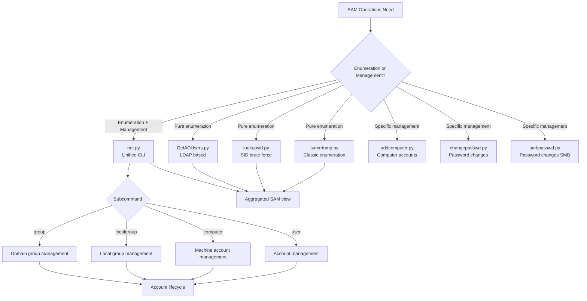

title: "net.py"
script: "examples/net.py"
category: "Recon and Enumeration"
status: "Published"
protocols:
  - MS-SAMR
  - MS-LSAT
  - MS-RPCE
ms_specs:
  - MS-SAMR
  - MS-LSAT
  - MS-RPCE
mitre_techniques:
  - T1087.001
  - T1087.002
  - T1069.001
  - T1069.002
  - T1136.001
  - T1136.002
  - T1098
auth_types:
  - NTLM
  - Kerberos
  - Pass the Hash
tags:
  - impacket
  - impacket/examples
  - category/recon_and_enumeration
  - status/published
  - protocol/ms-samr
  - protocol/ms-lsat
  - protocol/ms-rpce
  - ms-spec/ms-samr
  - ms-spec/ms-lsat
  - ms-spec/ms-rpce
  - technique/samr_enumeration
  - technique/samr_account_management
  - technique/net_exe_remote_equivalent
  - technique/local_and_domain_group_enumeration
  - mitre/T1087.001
  - mitre/T1087.002
  - mitre/T1069.001
  - mitre/T1069.002
  - mitre/T1136.001
  - mitre/T1136.002
  - mitre/T1098
aliases:
  - net-py
  - remote-net-exe
  - samr-net
  - rpc-account-manager
  - ms-samr-cli


# net.py

> **One line summary:** Impacket's remote equivalent of Windows' built in `net.exe` command line utility, implementing four subcommand verbs (`user`, `computer`, `localgroup`, `group`) that together cover local and domain account enumeration and management via the `[MS-SAMR]` Security Account Manager Remote Protocol, with companion use of `[MS-LSAT]` for SID to name translation via a dedicated `LsaTranslator` helper class; authored by **Alex Romero (`@NtAlexio2`, "Packet Phantom")** - the same contributor who authored [`DumpNTLMInfo.py`](DumpNTLMInfo.md) (Session 58) and eventlog.py; shipped in Impacket 0.11.0 (August 2023) via **PR #1382**, providing Linux operators a single unified interface for the SAMR operations that would otherwise require a Windows domain joined host or separate tool invocations; supports both **enumeration operations** (list users, list computers, list local groups with their members, list domain groups) and **management operations** (create users/computers, delete users/computers, enable/disable accounts, add/remove users to/from groups, set new passwords), making it far broader in scope than pure reconnaissance tools like [`samrdump.py`](samrdump.md) and [`lookupsid.py`](lookupsid.md); the architectural centerpiece is the `LsaTranslator` class that handles all SID to name resolution through `[MS-LSAT]` on the `\pipe\lsarpc` endpoint, cleanly separated from the SAMR operation logic so each subcommand's implementation stays focused on its specific SAMR calls; **closes Recon and Enumeration at 16 of 16 articles (100%), closing the 13th and final category, marking the wiki's completion at 13 of 13 categories ✅ (100%) and 66 documented tool articles covering the full Impacket `examples/` directory**.

| Field | Value |
|:---|:---|
| Script | `examples/net.py` |
| Category | Recon and Enumeration |
| Status | Published |
| Author | Alex Romero (`@NtAlexio2`, "Packet Phantom") per source header |
| PR | #1382 |
| First appearance in Impacket | **0.11.0** (August 2023) - same release as DumpNTLMInfo.py |
| Description (from Core Security) | "Impacket alternative for windows net.exe commandline utility. Thanks to RPC protocol, this tool is making net.exe functionalities available from remote computer" |
| Primary protocol | `[MS-SAMR]` Security Account Manager Remote Protocol |
| Companion protocol | `[MS-LSAT]` Local Security Authority Translation Methods (for SID to name translation) |
| Transport | DCE/RPC over SMB named pipes: `\pipe\samr` (SAMR) and `\pipe\lsarpc` (LSAT) |
| Primary Microsoft specifications | `[MS-SAMR]`, `[MS-LSAT]`, `[MS-RPCE]` |
| MITRE ATT&CK techniques | T1087.001 Local Account Discovery; T1087.002 Domain Account Discovery; T1069.001 Local Groups; T1069.002 Domain Groups; T1136.001 Create Account: Local Account; T1136.002 Create Account: Domain Account; T1098 Account Manipulation |
| Authentication | NTLM, Kerberos (`-k`), Pass the Hash (`-hashes`) |
| Subcommands | `user`, `computer`, `localgroup`, `group` - each with enumerate, create, modify, delete operations |
| Privilege required | Varies by operation: enumeration typically requires any authenticated domain user; account creation/modification requires higher privileges (local admin for local operations, domain admin or delegated rights for domain operations) |
| Ports | 445 (SMB) or 139 (NetBIOS), `-port` flag selectable |


## Prerequisites

This article assumes familiarity with:

- [`samrdump.py`](samrdump.md) for SAMR protocol foundations: SamrConnect5, SamrOpenDomain, SamrEnumerateUsersInDomain, the SAM handle pattern, and Windows account enumeration via RPC. net.py builds on the same SAMR primitives but adds management operations alongside enumeration.
- [`lookupsid.py`](lookupsid.md) for `[MS-LSAT]` (Local Security Authority Translation) context. net.py uses LSAT via its `LsaTranslator` helper class to convert RIDs and SIDs back to human readable account names during enumeration output.
- [`DumpNTLMInfo.py`](DumpNTLMInfo.md) as the companion NtAlexio2 tool. Sessions 58 (DumpNTLMInfo) and 63 (this article) document the two main Alex Romero contributions to the Recon category.
- **SAMR object model**: server handle → domain handle → user/group/alias handle, with each level requiring appropriate opens and access masks. Explicit in the source code structure.
- **Windows `net.exe` command semantics**: `net user`, `net computer`, `net localgroup`, `net group` from classical Windows administration. net.py preserves these semantics but executes remotely via RPC instead of locally via the user mode API.
- **User, group, and alias concepts in Windows**:
    - **User**: an account with authentication credentials.
    - **Group** (global group in domain context): domain wide grouping, visible across the domain.
    - **Localgroup** (alias in SAMR terminology): local machine or domain local group, scoped to a single computer's SAM or to a domain's Builtin container.
    - The SAMR specification uses "alias" in place of "local group" - net.py's CLI uses "localgroup" (matching Windows net.exe) but the underlying RPC calls refer to aliases.
- **Account types and USER_INFORMATION_CLASS**: SAMR distinguishes `USER_NORMAL_ACCOUNT`, `USER_WORKSTATION_TRUST_ACCOUNT`, `USER_SERVER_TRUST_ACCOUNT`, `USER_INTERDOMAIN_TRUST_ACCOUNT`. net.py's `user` subcommand operates on normal accounts; the `computer` subcommand operates on workstation trust accounts.


## What it does

`net.py` takes a target and a subcommand verb, connects to the target's SAMR service (via SMB + `\pipe\samr`), performs the requested operation, and prints results or status messages.

### Default invocation - user enumeration

```text
$ python net.py 'CORP.LOCAL/auditor:Passw0rd@SRV-DC01' user
Impacket v0.13.0 - Copyright Fortra, LLC and its affiliated companies

[*] Connecting to SRV-DC01 as auditor@CORP.LOCAL

[*] Domain users
Administrator
Guest
krbtgt
jsmith
alice
bob
svc-backup
svc-sql
[truncated for brevity]

[*] Found 247 users
```

Without arguments beyond the subcommand, `user` enumerates all users in the domain (or local SAM if the target is not a DC).

### Querying a specific user

```text
$ python net.py 'CORP.LOCAL/auditor:Passw0rd@SRV-DC01' user -name jsmith
Impacket v0.13.0 - Copyright Fortra, LLC and its affiliated companies

[*] Connecting to SRV-DC01 as auditor@CORP.LOCAL

[*] User info for 'jsmith'
  UserName: jsmith
  FullName: John Smith
  Description: Standard domain user
  HomeDirectory:
  HomeDirectoryDrive:
  ScriptPath:
  ProfilePath:
  AccountExpires: Never
  PasswordCanChange: 2026-04-24 10:15:42
  PasswordMustChange: 2026-05-24 10:15:42
  PasswordLastSet: 2026-04-23 10:15:42
  LastLogon: 2026-04-23 14:22:08
  LastLogoff: 1601-01-01 00:00:00
  UserAccountControl: 0x0210 (NORMAL_ACCOUNT, DONT_EXPIRE_PASSWORD)
  PrimaryGroupId: 513 (Domain Users)
  UserId: 1105
  BadPasswordCount: 0
  LogonCount: 342
  GlobalGroups: ['Domain Users', 'Engineering']
  LocalGroups: []
```

Detailed user information via `SamrQueryInformationUser2` with `USER_INFORMATION_CLASS.UserAllInformation`.

### Computer enumeration

```text
$ python net.py 'CORP.LOCAL/auditor:Passw0rd@SRV-DC01' computer
Impacket v0.13.0 - Copyright Fortra, LLC and its affiliated companies

[*] Connecting to SRV-DC01 as auditor@CORP.LOCAL

[*] Domain computers
SRV-DC01$
SRV-DC02$
SRV-APP01$
SRV-SQL01$
WKSTN-001$
WKSTN-002$
[truncated]

[*] Found 152 computers
```

Computer accounts returned with their `$` suffix (matching SAMR's sAMAccountName convention for machine accounts). Filters by `USER_WORKSTATION_TRUST_ACCOUNT` (0x1000).

### Local group enumeration

```text
$ python net.py 'CORP.LOCAL/administrator:Passw0rd@SRV-APP01' localgroup
Impacket v0.13.0 - Copyright Fortra, LLC and its affiliated companies

[*] Connecting to SRV-APP01 as administrator@CORP.LOCAL

[*] Local groups
Administrators
Backup Operators
Distributed COM Users
Event Log Readers
Hyper-V Administrators
IIS_IUSRS
Network Configuration Operators
Performance Log Users
Performance Monitor Users
Power Users
Print Operators
Remote Desktop Users
Remote Management Users
Replicator
System Managed Accounts Group
Users
```

Returns the Builtin local groups (aliases) on the target machine. Requires admin level access typically.

### Local group membership query

```text
$ python net.py 'CORP.LOCAL/administrator:Passw0rd@SRV-APP01' localgroup -name Administrators
Impacket v0.13.0 - Copyright Fortra, LLC and its affiliated companies

[*] Connecting to SRV-APP01 as administrator@CORP.LOCAL

[*] Members of Administrators
CORP\Administrator
CORP\Domain Admins
CORP\Enterprise Admins
CORP\jsmith
CORP\SRV-APP01$
```

Uses SAMR alias membership enumeration + LSAT SID-to-name translation to produce the human readable list.

### Domain group enumeration

```text
$ python net.py 'CORP.LOCAL/auditor:Passw0rd@SRV-DC01' group
Impacket v0.13.0 - Copyright Fortra, LLC and its affiliated companies

[*] Connecting to SRV-DC01 as auditor@CORP.LOCAL

[*] Domain groups
Administrators
Domain Admins
Domain Computers
Domain Controllers
Domain Guests
Domain Users
Enterprise Admins
Enterprise Read-only Domain Controllers
Group Policy Creator Owners
Read-only Domain Controllers
Schema Admins
DnsAdmins
DnsUpdateProxy
Engineering
Finance
[truncated]

[*] Found 47 groups
```

Returns global groups (distinct from local groups / aliases).

### Management operations

Creating a user:

```text
$ python net.py 'CORP.LOCAL/administrator:Passw0rd@SRV-APP01' user -create testuser -newPasswd 'TempPass123!'
Impacket v0.13.0 - Copyright Fortra, LLC and its affiliated companies

[*] Connecting to SRV-APP01 as administrator@CORP.LOCAL

[*] User 'testuser' was created successfully
```

Adding a user to a group:

```text
$ python net.py 'CORP.LOCAL/administrator:Passw0rd@SRV-APP01' localgroup -name Administrators -join testuser
[*] Connecting to SRV-APP01 as administrator@CORP.LOCAL
[*] User 'testuser' was added to group 'Administrators'
```

Removing a user from a group:

```bash
python net.py 'CORP.LOCAL/administrator:Passw0rd@SRV-APP01' localgroup -name Administrators -unjoin testuser
```

Disabling an account:

```bash
python net.py 'CORP.LOCAL/administrator:Passw0rd@SRV-APP01' user -disable testuser
```

Deleting an account:

```bash
python net.py 'CORP.LOCAL/administrator:Passw0rd@SRV-APP01' user -remove testuser
```

Each management operation maps to specific SAMR function calls (detailed in the protocol theory section).

### Key flags - top level

| Flag | Meaning |
|:---|:---|
| `target` (positional) | `[[domain/]username[:password]@]<targetName or address>` standard Impacket target |
| `entry` (positional) | One of `user`, `computer`, `localgroup`, `group` |
| `-debug` | Verbose debug output |
| `-ts` | Timestamp log lines |
| `-hashes LMHASH:NTHASH` | NTLM hash auth |
| `-no-pass` | Skip password prompt (for `-k`) |
| `-k` | Kerberos authentication |
| `-aesKey` | AES key for Kerberos |
| `-dc-ip` | Specify KDC IP |
| `-target-ip` | IP address of target machine |
| `-port {139, 445}` | SMB port (default 445) |

### Key flags - per subcommand

Each subcommand has its own set of operational flags:

**`user`**:
| Flag | Meaning |
|:---|:---|
| `-name NAME` | Operate on specific user (query details) |
| `-create NAME` | Create new user account |
| `-remove NAME` | Delete user account |
| `-newPasswd PASSWORD` | Password for new account (required with `-create`) |
| `-enable NAME` | Enable account (clear ACCOUNTDISABLE flag) |
| `-disable NAME` | Disable account (set ACCOUNTDISABLE flag) |

**`computer`**: same structure as `user` but creates `USER_WORKSTATION_TRUST_ACCOUNT` (machine accounts with trailing `$`).

**`localgroup`**:
| Flag | Meaning |
|:---|:---|
| `-name NAME` | Operate on specific local group (list members) |
| `-join USER` | Add user to group |
| `-unjoin USER` | Remove user from group |

**`group`**: same as `localgroup` but operates on global/domain groups.


## Why it exists

### The Windows `net.exe` legacy

Windows has shipped `net.exe` since the LAN Manager era (late 1980s). Typical uses:

```text
net user                    # list local users
net user john /add          # create local user "john"
net user john /delete       # delete local user "john"
net user john NewPass123    # set john's password
net localgroup              # list local groups
net localgroup Administrators /add alice  # add alice to Administrators
net group                   # list domain groups (on a DC)
net computer \\WKSTN /add   # join WKSTN to domain
```

It's a simple, standardized interface for SAM (Security Account Manager) operations. Every Windows admin knows it. Every script that provisions Windows accounts uses it. It's been the reference interface for SAM operations for over three decades.

Operationally, `net.exe` has one limitation: it must run **on** the target machine (or, for domain operations, on a domain joined Windows host). For remote operations, administrators traditionally use:
- PowerShell remoting + `net.exe` over WinRM.
- Active Directory Users and Computers GUI.
- `Set-ADUser` / `New-ADUser` PowerShell cmdlets (require RSAT installed).
- Custom scripts using the Win32 SAM API.

All of these require a Windows administrator workstation. None work natively from Linux.

### The gap net.py fills

For an offensive security operator working from Linux (Kali, Parrot, Ubuntu) - the dominant pentest workstation environment - SAM operations required patchwork:
- [`samrdump.py`](samrdump.md) for user enumeration.
- [`lookupsid.py`](lookupsid.md) for SID translation.
- [`addcomputer.py`](../07_ad_modification/addcomputer.md) specifically for adding computer accounts.
- [`smbpasswd.py`](../07_ad_modification/smbpasswd.md) specifically for password changes.
- Custom Impacket scripts for anything else.

`net.py` unifies these into a single familiar CLI. An operator running `net.py ... user -create` does what a Windows admin would do with `net user /add` - same semantics, different execution location.

### Why NtAlexio2 built it

Alex Romero's PR #1382 description (per GitHub): "Read user/computer account information through SAMR". The scope expanded during PR review to include management operations (create, delete, enable, disable, group join/unjoin).

NtAlexio2's pattern across Impacket contributions:
- **DumpNTLMInfo.py** (Session 58): pre auth SMB fingerprint.
- **net.py** (this article): authenticated SAMR CLI.
- **eventlog.py**: remote event log management.

Each tool fills a specific operational gap with focused scope. `net.py` specifically targets the "I need to do SAM operations from Linux" use case that had no clean answer before PR #1382.

### The `net.exe` semantic preservation choice

A notable design decision: `net.py` preserves `net.exe` argument semantics where possible. Compare:

| Windows net.exe | Impacket net.py |
|:---|:---|
| `net user` | `net.py target user` |
| `net user john /add` | `net.py target user -create john` |
| `net user john /delete` | `net.py target user -remove john` |
| `net localgroup` | `net.py target localgroup` |
| `net localgroup Administrators /add alice` | `net.py target localgroup -name Administrators -join alice` |

The argument style differs (`/add` vs `-create`, reflecting Unix vs Windows convention), but the subcommand names and operation semantics match. Operators fluent in Windows `net.exe` can use `net.py` with minimal relearning.

### The SAMR protocol as the reuse engine

A core design principle: `net.exe` on Windows ultimately makes SAMR/RPC calls (via higher level APIs like NetUserAdd, NetLocalGroupAddMembers, etc.). `net.py` on Linux makes the SAME SAMR/RPC calls directly through Impacket's SAMR module. Both tools end up invoking the same server side code paths.

This means:
- Server side behavior is identical (same error codes, same edge cases, same permissions checks).
- Anything `net.exe` can do, `net.py` can potentially do (modulo Impacket's SAMR module coverage).
- Server side logging is identical (same Event IDs, same audit trails).

The tool is less "alternative to net.exe" and more "Linux port of net.exe" - same protocol, same server side, different client side.

### The LsaTranslator architectural choice

Source structure reveals a thoughtful architectural choice: all LSAT (SID-to-name) operations are encapsulated in a dedicated `LsaTranslator` class, separate from the main SAMR operation logic.

```python
class LsaTranslator:
    def __init__(self, smbConnection):
        self._smbConnection = smbConnection
        self.__stringBindingSamr = r'ncacn_np:445[\pipe\lsarpc]'
        self._lsat_dce = None
        self.Connect()
```

The class opens its own RPC connection to `\pipe\lsarpc` for LSAT operations, then provides high level methods like `LookupSids()` that the main SAMR code calls when it needs to convert RIDs/SIDs to names for display.

This separation keeps each SAMR operation's code focused on SAMR specifics (open domain, enumerate, etc.) while the name translation complexity lives elsewhere. It's a small refactor with large readability benefits.


## Protocol theory

### `[MS-SAMR]` overview (brief recap)

The Security Account Manager Remote Protocol exposes Windows SAM operations via DCE/RPC. The interface has ~65 methods covering:

- Account enumeration (users, groups, aliases, computers).
- Account query (get detailed information).
- Account modification (set password, set flags, modify group membership).
- Account creation and deletion.
- Password operations (query policy, change password).

Transport: DCE/RPC over `\pipe\samr` named pipe over SMB.

See [`samrdump.py`](samrdump.md) for the detailed SAMR protocol discussion that foundationally supports this article.

### The handle hierarchy

SAMR uses a handle based object model:

```text
SamrConnect5 → server_handle
    SamrEnumerateDomainsInSamServer(server_handle) → domain names
    SamrLookupDomainInSamServer(server_handle, domain_name) → domain_sid
    SamrOpenDomain(server_handle, domain_sid) → domain_handle
        SamrEnumerateUsersInDomain(domain_handle, account_type) → RIDs
        SamrEnumerateGroupsInDomain(domain_handle) → RIDs
        SamrEnumerateAliasesInDomain(domain_handle) → RIDs
        SamrOpenUser(domain_handle, RID) → user_handle
            SamrQueryInformationUser2(user_handle, info_class) → user info
            SamrSetInformationUser2(user_handle, info_class, buffer) → (modify)
            SamrCloseHandle(user_handle)
        SamrOpenGroup(domain_handle, RID) → group_handle
            SamrGetMembersInGroup(group_handle) → member RIDs
            SamrAddMemberToGroup(group_handle, RID) → (add)
            SamrRemoveMemberFromGroup(group_handle, RID) → (remove)
            SamrCloseHandle(group_handle)
        SamrOpenAlias(domain_handle, RID) → alias_handle
            SamrGetMembersInAlias(alias_handle) → member SIDs
            SamrAddMemberToAlias(alias_handle, SID) → (add)
            SamrRemoveMemberFromAlias(alias_handle, SID) → (remove)
            SamrCloseHandle(alias_handle)
        SamrCreateUser2InDomain(domain_handle, name, type, access) → user_handle
        SamrDeleteUser(user_handle) → (delete)
        SamrCloseHandle(domain_handle)
    SamrCloseHandle(server_handle)
```

Every subcommand in net.py follows a subset of this hierarchy. The pattern is always: open → operate → close.

### User vs group vs alias in SAMR

SAMR distinguishes three collection types:

- **Users**: individual accounts. Located in the primary SAM domain.
- **Groups**: domain scoped collections of users. Global groups in AD terminology. Memberships expressed as RIDs within the domain.
- **Aliases**: machine scoped or Builtin scoped collections. Local groups in AD/Windows terminology. Memberships expressed as SIDs (can include users from trusted domains, not just local accounts).

This distinction maps to net.py's subcommands:
- `user` → SamrEnumerateUsersInDomain with account type filter.
- `computer` → SamrEnumerateUsersInDomain with USER_WORKSTATION_TRUST_ACCOUNT filter.
- `group` → SamrEnumerateGroupsInDomain (global groups).
- `localgroup` → SamrEnumerateAliasesInDomain (aliases / local groups).

The underlying API distinction (users / groups / aliases) drives the CLI structure.

### Account type filtering

The `SamrEnumerateUsersInDomain` method takes a `UserAccountControl` filter. Common values:

- `USER_NORMAL_ACCOUNT = 0x00000010` - regular user accounts.
- `USER_WORKSTATION_TRUST_ACCOUNT = 0x00001000` - computer accounts (workstations and servers).
- `USER_SERVER_TRUST_ACCOUNT = 0x00002000` - domain controller machine accounts.
- `USER_INTERDOMAIN_TRUST_ACCOUNT = 0x00000008` - trust accounts for cross domain relationships.

net.py's `user` subcommand filters for NORMAL; `computer` filters for WORKSTATION_TRUST (and implicitly also SERVER_TRUST for DCs via combined flags).

### The create user flow

When `net.py user -create testuser -newPasswd 'Password123!'` runs:

```python
# Step 1: Open server and domain handles (as above)

# Step 2: Create the user
user_handle = samr.hSamrCreateUser2InDomain(
    dce, domain_handle,
    name='testuser',
    account_type=USER_NORMAL_ACCOUNT,
    desired_access=USER_ALL_ACCESS
)['UserHandle']

# Step 3: Set the password via SamrSetInformationUser2 with UserInternal4InformationNew
password_request = samr.SAMPR_USER_INFO_BUFFER()
password_request['tag'] = USER_INFORMATION_CLASS.UserInternal4InformationNew
password_request['Internal4New']['UserPassword'] = encrypted_password_buffer
samr.hSamrSetInformationUser2(dce, user_handle, password_request)

# Step 4: Enable the account (clear ACCOUNTDISABLE flag)
control_request = samr.SAMPR_USER_INFO_BUFFER()
control_request['tag'] = USER_INFORMATION_CLASS.UserControlInformation
control_request['Control']['UserAccountControl'] = USER_NORMAL_ACCOUNT
samr.hSamrSetInformationUser2(dce, user_handle, control_request)

# Step 5: Close handles
samr.hSamrCloseHandle(dce, user_handle)
```

The newly created account starts disabled by default; the final step enables it. This matches `net user /add` behavior on Windows.

### The password encryption

Setting a password through SAMR requires encrypting the password using the session key derived from NTLM authentication. This is why password operations require authenticated connections.

The encryption uses the RC4 algorithm (or newer AES variants in recent protocol revisions) with a key derived from the session's NTLM or Kerberos authenticator. Impacket's SAMR module handles this transparently when operations that require password material are invoked.

Historical note: older protocol versions used UserSetPassword (deprecated) and UserInternal1Information (deprecated). Modern code uses UserInternal4InformationNew which supports stronger encryption.

### The LSAT SID translation

The `LsaTranslator` class opens a separate RPC connection to `\pipe\lsarpc`:

```python
class LsaTranslator:
    def __init__(self, smbConnection):
        self._smbConnection = smbConnection
        self.__stringBindingSamr = r'ncacn_np:445[\pipe\lsarpc]'
        self._lsat_dce = None
        self.Connect()
    
    def Connect(self):
        rpc = transport.DCERPCTransportFactory(self.__stringBindingSamr)
        rpc.set_smb_connection(self._smbConnection)
        self._lsat_dce = rpc.get_dce_rpc()
        self._lsat_dce.connect()
        self._lsat_dce.bind(lsat.MSRPC_UUID_LSAT)
    
    def LookupSids(self, sids):
        # Calls hLsarLookupSids2 via [MS-LSAT]
        response = lsat.hLsarLookupSids(
            self._lsat_dce, self._policy_handle,
            sids, lsat.LSAP_LOOKUP_LEVEL.LsapLookupWksta
        )
        # Parses response into {sid: (domain, name, type)} dict
        return results
```

Note the pipe name is `lsarpc` even though LSAT is a distinct interface from LSAD - both interfaces are hosted on the same named pipe via DCE/RPC UUID based multiplexing. The client binds to LSAT specifically (`lsat.MSRPC_UUID_LSAT`) to target the LSAT interface.

### Access rights

SAMR operations require specific access rights. Common patterns:

- **Enumeration** (SamrEnumerateUsersInDomain): `DOMAIN_LIST_ACCOUNTS` on the domain handle.
- **Query user details** (SamrQueryInformationUser2): `USER_READ_GENERAL | USER_READ_PREFERENCES | USER_READ_LOGON | USER_READ_ACCOUNT | USER_READ_GROUP_MEMBERSHIP` on the user handle.
- **Create user** (SamrCreateUser2InDomain): `DOMAIN_CREATE_USER` on the domain handle.
- **Delete user** (SamrDeleteUser): `DELETE` access on the user handle.
- **Set password**: `USER_FORCE_PASSWORD_CHANGE` on the user handle.
- **Modify group membership** (SamrAddMemberToGroup, SamrRemoveMemberFromGroup): `GROUP_ADD_MEMBER` or `GROUP_REMOVE_MEMBER` on the group handle.
- **Modify alias membership**: `ALIAS_ADD_MEMBER` or `ALIAS_REMOVE_MEMBER` on the alias handle.

Typically `USER_ALL_ACCESS` or `DOMAIN_ALL_ACCESS` is requested during initial handle opens to cover all potential operations. The server may grant less than requested based on the caller's privileges.

### Privilege requirements in practice

- **User enumeration**: any authenticated user on the target (if RestrictRemoteSAM is not configured) or any domain user against a DC.
- **User query**: same as enumeration plus individual user read access (typically granted to authenticated users for basic attributes).
- **Group/alias enumeration**: similar to user enumeration.
- **User creation**: local Administrator on the target (for local accounts) or Domain Admin / delegated account operator (for domain accounts).
- **User deletion**: same as creation.
- **Password reset (for another user)**: Admin level privileges, specifically `USER_FORCE_PASSWORD_CHANGE` which requires elevated permissions.
- **Group membership modification**: Admin level typically, depending on group sensitivity (modifying Domain Admins requires Domain Admin; modifying Users typically requires local admin).

net.py reports errors clearly when access is denied, allowing operators to understand exactly which privilege tier is required.


## How the tool works internally

### Imports

```python
import sys
import argparse
import logging
from datetime import datetime

from impacket import version
from impacket.examples import logger
from impacket.examples.utils import parse_target
from impacket.dcerpc.v5 import transport, samr, lsad, lsat
from impacket.smbconnection import SMBConnection
```

Four DCE/RPC module imports:
- `samr` for primary operations.
- `lsad` and `lsat` for LSA Domain and Translation (used by LsaTranslator).
- `transport` for RPC binding creation.

Plus `SMBConnection` for the top level SMB session that hosts the named pipes.

### Class structure

Two main classes:

- **`LsaTranslator`**: handles SID→name resolution via LSAT. Used whenever output needs human readable names.
- **Main class** (varies by implementation, sometimes an outer script function): handles SAMR operations per subcommand.

Separation: LsaTranslator doesn't know about SAMR; the SAMR code doesn't know about LSAT. They communicate through the outer script passing SID lists to LsaTranslator and receiving name mappings back.

### The subcommand dispatch

```python
parser = argparse.ArgumentParser(description='SAMR rpc client implementation.')
parser.add_argument('target', action='store', help='[[domain/]username[:password]@]<targetName or address>')

subparsers = parser.add_subparsers(dest='entry')

user_parser = subparsers.add_parser('user', help='Enumerate all domain/local user accounts')
user_parser.add_argument('-name', action='store', metavar='NAME', help='Display single user information')
user_parser.add_argument('-create', action='store', metavar='NAME', help='Add new user account')
user_parser.add_argument('-remove', action='store', metavar='NAME', help='Remove existing user account')
user_parser.add_argument('-newPasswd', action='store', metavar='PASSWORD', help='New password for creating account')
user_parser.add_argument('-enable', action='store', metavar='NAME', help='Enables account')
user_parser.add_argument('-disable', action='store', metavar='NAME', help='Disables account')

computer_parser = subparsers.add_parser('computer', help='Enumerate all computers in domain level')
# ... similar structure with -name, -create, -remove, -newPasswd, -enable, -disable ...

localgroup_parser = subparsers.add_parser('localgroup', help='Enumerate local groups (aliases) of local computer')
localgroup_parser.add_argument('-name', action='store', metavar='NAME', help='Operate on single specific domain group account')
localgroup_parser.add_argument('-join', action='store', metavar='USER', help='Add user account to specific group')
localgroup_parser.add_argument('-unjoin', action='store', metavar='USER', help='Remove user account from specific group')

group_parser = subparsers.add_parser('group', help='Enumerate domain groups registered in domain controller')
# ... similar structure ...

options = parser.parse_args()
```

The `subparsers` pattern creates per subcommand argument groups. Each subcommand has its own relevant flags, avoiding the noise of irrelevant options.

Per the PR #1382 review discussion, there's a quirk in how help works: `python net.py user --help` doesn't show the `user` subcommand's specific help because argparse requires the positional `target` first. The correct form is `python net.py <target> user --help`. This is argparse's standard subparser behavior with positional arguments, documented in the PR thread.

### Example subcommand handler: user enumeration

```python
def handle_user_enumerate(samr_manager):
    server_handle = samr_manager.connect_to_sam()
    
    for domain_name in samr_manager.get_domain_names():
        if domain_name.lower() == 'builtin':
            continue  # Skip builtin domain for user enumeration
        
        domain_handle = samr_manager.open_domain(server_handle, domain_name)
        
        user_list = []
        enumeration_context = 0
        while True:
            response = samr.hSamrEnumerateUsersInDomain(
                samr_manager.dce,
                domain_handle,
                USER_NORMAL_ACCOUNT,
                enumerationContext=enumeration_context
            )
            for user in response['Buffer']['Buffer']:
                user_list.append(user['Name'])
            
            if response['ErrorCode'] != STATUS_MORE_ENTRIES:
                break
            enumeration_context = response['EnumerationContext']
        
        print('[*] Domain users')
        for user_name in sorted(user_list):
            print(user_name)
        print(f'[*] Found {len(user_list)} users')
        
        samr.hSamrCloseHandle(samr_manager.dce, domain_handle)
    
    samr.hSamrCloseHandle(samr_manager.dce, server_handle)
```

The enumeration loop with `enumeration_context` handles pagination: SAMR returns results in chunks, with `STATUS_MORE_ENTRIES` signaling that more results remain. net.py loops until all users are retrieved.

### Example subcommand handler: user creation

Pseudocode:

```python
def handle_user_create(samr_manager, name, password):
    server_handle = samr_manager.connect_to_sam()
    domain_handle = samr_manager.open_first_real_domain(server_handle)
    
    # Create the user
    user_handle = samr.hSamrCreateUser2InDomain(
        samr_manager.dce, domain_handle,
        name=name,
        account_type=USER_NORMAL_ACCOUNT,
        desired_access=USER_ALL_ACCESS
    )['UserHandle']
    
    # Set password
    request = build_password_buffer(password, samr_manager.session_key)
    samr.hSamrSetInformationUser2(samr_manager.dce, user_handle, request)
    
    # Enable the account
    request = build_control_buffer(USER_NORMAL_ACCOUNT)
    samr.hSamrSetInformationUser2(samr_manager.dce, user_handle, request)
    
    print(f"[*] User '{name}' was created successfully")
    
    samr.hSamrCloseHandle(samr_manager.dce, user_handle)
    samr.hSamrCloseHandle(samr_manager.dce, domain_handle)
    samr.hSamrCloseHandle(samr_manager.dce, server_handle)
```

The actual implementation handles error cases: name already exists, password doesn't meet complexity requirements, caller lacks required privileges, etc. Each error produces a specific log message.

### Error handling

SAMR errors come back as SMB/DCERPC exceptions with specific error codes:

- `STATUS_ACCESS_DENIED (0xC0000022)`: insufficient privileges.
- `STATUS_USER_EXISTS (0xC0000063)`: duplicate account name.
- `STATUS_PASSWORD_RESTRICTION (0xC000006C)`: password complexity failure.
- `STATUS_NO_SUCH_USER (0xC0000060)`: account doesn't exist (for modify/delete).
- `STATUS_OBJECT_NAME_NOT_FOUND`: group or domain doesn't exist.

net.py catches these and maps them to readable messages. Default Impacket session error handling provides the underlying `SAMR SessionError: code: 0xXXX` output; net.py often adds contextual prefixes.

### What the tool does NOT do

- Does NOT support cross domain operations (operating on one domain's accounts from another domain's context). Single domain per invocation.
- Does NOT manage shares (`net share` equivalent). Out of scope; use other tools for SMB share manipulation.
- Does NOT manage services (`net start` / `net stop` equivalent). See [`services.py`](../08_remote_system_interaction/services.md).
- Does NOT manage sessions (`net session` equivalent). See [`netview.py`](netview.md).
- Does NOT manage printers, uses (drive mapping), or files.
- Does NOT support all USER_INFORMATION_CLASS variations for SamrSetInformationUser2. Specific information classes supported by the tool's operations (password set, account enable/disable); other class modifications would require custom code.
- Does NOT add users to multiple groups in one operation. One `-join` per invocation.
- Does NOT support nested group membership display (showing groups within groups recursively).
- Does NOT produce machine readable output formats by default (no JSON, no CSV).
- Does NOT support the PowerShell-style advanced filtering or scripting that `Get-ADUser -Filter` offers. Straightforward enumeration and specific operations only.


## Practical usage

### Basic enumeration workflow

```bash
# List all users
python net.py 'CORP/auditor:pass@DC01' user

# Get detailed info on a specific user
python net.py 'CORP/auditor:pass@DC01' user -name jsmith

# List all computers
python net.py 'CORP/auditor:pass@DC01' computer

# List local groups on a server
python net.py 'CORP/admin:pass@SRV01' localgroup

# Find who's in Administrators on a server
python net.py 'CORP/admin:pass@SRV01' localgroup -name Administrators

# List all domain groups
python net.py 'CORP/auditor:pass@DC01' group
```

The typical reconnaissance flow: enumerate users → enumerate groups → check specific group memberships for high value groups.

### Cross referencing with other tools

```bash
# Enumerate with net.py, cross reference sensitive groups
python net.py 'CORP/auditor:pass@DC01' group | tee all_groups.txt

# Check Domain Admins specifically via group subcommand
python net.py 'CORP/auditor:pass@DC01' group -name "Domain Admins"
# Returns membership

# Compare against what findDelegation found
findDelegation.py 'CORP/auditor:pass@DC01' | tee delegation.txt

# Identify accounts that are both Domain Admins AND have delegation configured
# (These are highest value targets)
```

### Account manipulation operations

With sufficient privileges:

```bash
# Create a backdoor account
python net.py 'CORP/admin:pass@DC01' user -create backdoor -newPasswd 'SuperSecret123!'

# Add to Domain Admins
python net.py 'CORP/admin:pass@DC01' group -name "Domain Admins" -join backdoor

# Later: remove to cover tracks
python net.py 'CORP/admin:pass@DC01' group -name "Domain Admins" -unjoin backdoor
python net.py 'CORP/admin:pass@DC01' user -remove backdoor
```

This is the red team persistence use case: create persistent access, operate, clean up. In authorized engagements, this pattern is common.

### Defensive audit operations

```bash
# Monthly check: enumerate sensitive group members
for group in "Domain Admins" "Enterprise Admins" "Schema Admins" "Administrators"; do
    echo "=== $group ==="
    python net.py 'CORP/auditor:pass@DC01' group -name "$group"
done > sensitive_group_audit_2026Q2.txt

# Compare against baseline
diff baseline_2026Q1.txt sensitive_group_audit_2026Q2.txt
```

Defenders using net.py for routine sensitive group monitoring. Diff against historical baseline to spot unauthorized additions.

### Computer account auditing

```bash
# List all computer accounts
python net.py 'CORP/auditor:pass@DC01' computer > all_computers.txt

# Cross reference with expected asset inventory
diff <(cat all_computers.txt | sort) <(cat expected_inventory.txt | sort)
# Any computer in AD not in expected inventory = investigate
```

Rogue machine account detection: computers that exist in AD but not in the expected asset inventory are candidates for investigation (legitimate unauthorized additions, potential rogue DCs, potential attacker planted machine accounts for Kerberos delegation abuse).

### Account disabling (defensive response)

When an account is compromised:

```bash
# Disable the compromised account immediately
python net.py 'CORP/admin:pass@DC01' user -disable compromised_account

# Later, after investigation complete
python net.py 'CORP/admin:pass@DC01' user -remove compromised_account
```

Incident response workflow: disable before delete preserves the account object for forensic investigation while preventing further use.

### Comparison with native Windows equivalents

```bash
# On Windows admin workstation:
net user jsmith /domain

# From Linux via net.py:
python net.py 'CORP/auditor:pass@DC01' user -name jsmith
```

Similar output, different execution location. For mixed teams where some operators work from Windows and others from Linux, net.py ensures consistent semantics across platforms.

### Bulk operations

net.py doesn't natively support bulk operations. For bulk use, wrap in shell loops:

```bash
# Disable a list of accounts
for account in $(cat accounts_to_disable.txt); do
    python net.py 'CORP/admin:pass@DC01' user -disable "$account"
done

# Enumerate members of multiple groups
for group in "Domain Admins" "Enterprise Admins" "Administrators" "Account Operators"; do
    echo "=== $group ==="
    python net.py 'CORP/auditor:pass@DC01' group -name "$group"
done
```

### Performance considerations

Per operation: typically 1-3 seconds (SMB session setup + SAMR bind + operation + teardown). Bulk operations multiply this.

For large scale operations (thousands of accounts), consider:
- Running in parallel via GNU parallel.
- Using raw Impacket library code rather than net.py's per invocation overhead.
- Specific wider enumeration tools like `GetADUsers.py` with LDAP paged results for large directories.

net.py is optimized for interactive operations and small scale bulk use, not sustained high volume operations.


## What it looks like on the wire

### Full exchange for user enumeration

```text
TCP 3-way handshake → target:445

SMB2 NEGOTIATE / SESSION_SETUP / TREE_CONNECT to IPC$
SMB2 CREATE on \pipe\samr

DCE/RPC Bind to SAMR interface (UUID 12345778-1234-ABCD-EF00-0123456789AC)
DCE/RPC Bind_Ack

SAMR operations:
  SamrConnect5 → server_handle
  SamrEnumerateDomainsInSamServer(server_handle) → ["Builtin", "CORP"]
  SamrLookupDomainInSamServer(server_handle, "CORP") → CORP domain SID
  SamrOpenDomain(server_handle, CORP_SID) → domain_handle
  SamrEnumerateUsersInDomain(domain_handle, USER_NORMAL_ACCOUNT) → pages of RIDs
    [loop with enumerationContext for pagination]
  SamrLookupIdsInDomain(domain_handle, RID_list) → names
  SamrCloseHandle(domain_handle)
  SamrCloseHandle(server_handle)

SMB2 CLOSE on \pipe\samr
SMB2 TREE_DISCONNECT / LOGOFF

If SID translation needed:
  SMB2 CREATE on \pipe\lsarpc
  DCE/RPC Bind to LSAT interface (UUID 12345778-1234-ABCD-EF00-0123456789AB)
  LsarOpenPolicy2 → policy_handle
  LsarLookupSids(policy_handle, SID_list) → names
  LsarCloseHandle(policy_handle)
  SMB2 CLOSE on \pipe\lsarpc

TCP FIN
```

Volume: moderate for small enumerations (~30 KB), proportional to output size for large enumerations.

### Full exchange for user creation

```text
[SMB session and SAMR bind as above]

SAMR operations:
  SamrConnect5 → server_handle
  SamrEnumerateDomainsInSamServer → domains
  SamrOpenDomain(server_handle, CORP_SID) → domain_handle
  SamrCreateUser2InDomain(domain_handle, name, account_type, access) → user_handle
  SamrSetInformationUser2(user_handle, UserInternal4InformationNew, password_buffer)
    [password_buffer is encrypted with session key]
  SamrSetInformationUser2(user_handle, UserControlInformation, enable_flags)
  SamrCloseHandle(user_handle)
  SamrCloseHandle(domain_handle)
  SamrCloseHandle(server_handle)
```

The encrypted password buffer is the distinctive element. Wire captures show the buffer but the content is encrypted.

### Wireshark filtering

```text
samr
# Filter SAMR protocol PDUs
```

Or:

```text
dcerpc.cn_bind_if_id == "12345778-1234-abcd-ef00-0123456789ac"
# SAMR bind
```

Or for LSAT:

```text
dcerpc.cn_bind_if_id == "12345778-1234-abcd-ef00-0123456789ab"
# LSAT bind
```

Wireshark's SAMR dissector is comprehensive - it decodes most operations with named methods and parsed argument structures, making capture analysis readable.

### Distinctive wire signature

SAMR enumeration produces a distinctive pattern:
1. Authentication + tree connect to IPC$.
2. Multiple `\pipe\samr` opens for different operations.
3. Sometimes parallel `\pipe\lsarpc` opens for SID translation.
4. SAMR-specific method calls visible to Wireshark's dissector.

The combined samr+lsarpc pattern distinguishes net.py-style operations from pure samrdump (which typically uses only samr pipe).

### Volume signatures by operation

| Operation | Volume | Notes |
|:---|:---||
| `user` (list all) | 10-50 KB | Proportional to domain user count |
| `user -name X` | 2-5 KB | Single user query |
| `computer` (list all) | 10-50 KB | Proportional to computer count |
| `localgroup` | 2-5 KB | Few local groups typically |
| `localgroup -name X` | 5-20 KB | Includes LSAT translation for members |
| `group -name X` | 5-20 KB | Includes LSAT translation |
| `user -create X` | 3-5 KB | Create + password + enable |

Operations complete in subseconds typically. Large enumerations (5000+ accounts) may take 10-30 seconds.


## What it looks like in logs

### Target Windows Security log

- **Event 4624** (logon): one per invocation at the target.
- **Event 4625** (logon failure): if credentials fail.
- **Event 4661** (handle to object requested): if "Audit SAM" is enabled; fires on SAM handle opens.
- **Event 4662** (object access): if directory service auditing is enabled, for operations against AD objects.
- **Event 4720** (user account created): for `-create` operations.
- **Event 4722** (user account enabled): for `-enable` (and for newly created accounts).
- **Event 4725** (user account disabled): for `-disable`.
- **Event 4726** (user account deleted): for `-remove`.
- **Event 4728** (member added to security-enabled global group).
- **Event 4729** (member removed from security-enabled global group).
- **Event 4732** (member added to security-enabled local group).
- **Event 4733** (member removed from security-enabled local group).
- **Event 4738** (user account changed): for password resets and modifications.
- **Event 4799** (security-enabled local group membership enumerated): if auditing enabled, fires on `localgroup -name X` operations.

The events are the **same events Windows `net.exe` would generate** because the server side SAMR operations are identical. Detection patterns for net.py are the same as for net.exe.

This is a double edged sword defensively: legitimate admin net.exe usage and malicious net.py usage produce identical log signatures. Context (source IP, time of day, account behavior) matters for disambiguation.

### Event volume

For a `user` enumeration against a 5000-user domain:
- 1x Event 4624 (logon)
- 1-2x Event 4661 (SAM handle opens) if auditing
- 1x Event 4799 per group enumerated if auditing is enabled
- 1x Event 4634 (logoff) at end

Not high volume but distinctive for SAM focused operations.

### EDR detection

Modern EDR may detect:
- **Impacket net.py signatures**: specific traffic patterns some vendors identify.
- **Bulk SAM operations from unusual sources**: a workstation enumerating all users from a DC is atypical.
- **Account creation + group addition pattern**: the "create backdoor user, add to Domain Admins" pattern is a known backdoor technique with specific signatures.
- **Correlated SAMR+LSAT usage**: the net.py pattern of combined samr+lsarpc access.

### Sigma rule example

```yaml
title: Suspicious SAMR Account Creation from Unusual Source
logsource:
  product: windows
  service: security
detection:
  selection_create:
    EventID: 4720
  selection_add_to_admins:
    EventID:
      - 4728  # domain group
      - 4732  # local group
    TargetUserName:
      - 'Domain Admins'
      - 'Enterprise Admins'
      - 'Administrators'
      - 'Schema Admins'
  correlation:
    selection_create before selection_add_to_admins
    within: 300  # seconds
    same_user: SubjectUserName
  condition: correlation
level: critical
```

Critical severity: the "create account + add to privileged group" pattern is a classic persistence technique.

### Honeypot accounts

High signal detection: create honey accounts that should never be queried.

- Create account `canary_admin` in a sensitive group.
- Set up alert on any Event 4662 (object access) against that account.
- Legitimate admins have no reason to query this account; attackers enumerating Domain Admins hit it.

net.py's `group -name "Domain Admins"` would touch the honey account and trigger detection.

### Comparison with `net.exe` native usage

A key defensive observation: **you cannot reliably distinguish net.py from native net.exe at the server side**. Both tools:
- Use the same SAMR protocol.
- Make the same RPC calls.
- Trigger the same audit events.
- Produce the same log entries.

Distinguishing factors:
- **Source IP**: net.exe typically runs from admin workstations; net.py often runs from pentester/attacker infrastructure.
- **Source authentication context**: admin workstations may use different accounts than attacker positions.
- **Time of day**: routine admin operations during business hours; net.py operations often at unusual times.
- **Frequency**: admins might run a handful of net commands daily; attackers might enumerate everything in quick succession.
- **Context**: what else is the source doing? net.py runs often correlate with other recon and lateral movement activities.

None of these are 100% reliable. Defensive strategy: monitor the high signal events (4720, 4728, 4732) with context aware alerting rather than relying on tool specific signatures.


## Detection and defense

### Detection approach

- **SAM account auditing events** (4720, 4722, 4725, 4726, 4728, 4729, 4732, 4733, 4738): the primary signals. Ensure these are enabled and forwarded to SIEM.
- **SAM object access auditing** (4661): if enabled, reveals SAMR usage from unusual sources.
- **Group membership enumeration auditing** (4799): high signal for reconnaissance of sensitive groups.
- **Correlated event patterns**: "create account + add to privileged group" is a classic backdoor signature.
- **EDR behavioral analysis**: modern EDR may correlate SAMR activity with other activity from the same process.
- **Honeypot accounts and groups**: decoy objects that trigger on any access.
- **Source IP / source account anomaly detection**: account manipulation from unexpected sources.

### Preventive controls

- **Restrict SAMR access**: the `RestrictRemoteSAM` registry value controls which accounts can enumerate SAM remotely. Setting it to a restrictive value prevents unauthenticated or low privilege SAM enumeration.
- **Tiered admin model**: separate Tier 0 (DC admins) from Tier 1 (server admins) from Tier 2 (workstation admins). An account compromised at one tier should not be able to modify accounts at higher tiers.
- **Protected Users security group**: accounts in this group have additional protections (no NTLM, no unconstrained delegation, etc.) that reduce lateral movement potential.
- **Account manipulation alerting**: any creation of accounts in sensitive OUs or additions to sensitive groups should generate high priority alerts.
- **Minimum privilege for service accounts**: service accounts that don't need SAM management should not have those permissions.
- **Attack Surface Reduction rules**: Windows Defender ASR has rules that can block certain credential theft and lateral movement patterns.
- **Just in time admin access**: credentials with SAM management rights are granted temporarily.
- **Privileged Access Workstations (PAWs)**: dedicated hardened workstations for admin operations, separated from daily use workstations.

### What net.py does NOT enable

- Does NOT bypass authentication.
- Does NOT escalate privileges beyond what the authenticated account already has.
- Does NOT bypass audit logging (operations generate standard SAM events).
- Does NOT manipulate accounts on other domains outside the authenticated trust.

### What net.py CAN enable

- **Rapid SAM reconnaissance** from Linux without a Windows admin workstation.
- **Persistent backdoor account creation** with appropriate privileges.
- **Account manipulation at scale** via shell loops.
- **Platform independent admin workflow** for mixed Linux/Windows admin teams.


## Related tools and attack chains

net.py **closes Recon and Enumeration at 16 of 16 articles (100%)**. This article is the final Recon article and closes the category. With this, **Recon and Enumeration joins the 12 already complete categories to make 13 of 13 categories complete (100%)**, marking the **wiki's completion** at 66 total tool articles.

### Related Impacket tools

- [`samrdump.py`](samrdump.md) - pure SAMR enumeration predecessor. Where samrdump enumerates, net.py enumerates AND manages. samrdump is the "read only" subset of net.py's capabilities.
- [`lookupsid.py`](lookupsid.md) - SID translation via LSAT. net.py uses LSAT internally via its LsaTranslator class.
- [`netview.py`](netview.md) - session enumeration (network focused). Different scope from net.py's account focused operations.
- [`DumpNTLMInfo.py`](DumpNTLMInfo.md) - Session 58 companion by same author NtAlexio2. Pre auth NTLM fingerprint vs this article's authenticated SAMR CLI.
- [`addcomputer.py`](../07_ad_modification/addcomputer.md) - specific computer creation tool. net.py's `computer -create` provides similar functionality via SAMR; addcomputer.py adds LDAP based creation as an alternative.
- [`smbpasswd.py`](../07_ad_modification/smbpasswd.md) - password change tool. net.py's `user -newPasswd` in `-create` context handles password setting; smbpasswd handles password changes for existing accounts.
- [`changepasswd.py`](../07_ad_modification/changepasswd.md) - comprehensive password change across protocols.

### External alternatives

- **Native Windows `net.exe`**: the canonical equivalent. Same server side effect, different client platform.
- **PowerShell `Get-ADUser` / `New-ADUser` / `Set-ADUser`**: PowerShell native equivalents using LDAP rather than SAMR. Different protocol, different features, same end goals.
- **Samba `rpcclient`**: Linux-native alternative. `rpcclient -U 'user%pass' target -c 'enumdomusers'` and similar. Powerful but lower level than net.py.
- **Metasploit `auxiliary/admin/smb/samr_*`** modules: integrated SAMR operations in Metasploit framework.
- **NetExec / CrackMapExec** with SAMR modules: integrated SAMR enumeration.
- **Custom Impacket scripts**: developers can write SAMR clients directly. net.py is the polished, ready made general purpose version.

For Linux operators, net.py is the most direct native feeling SAM management tool. For Windows admins, native `net.exe` or PowerShell cmdlets are more natural.

### The SAM operations ecosystem



net.py is the integrating tool that provides unified CLI access to operations that would otherwise require multiple distinct tools. It doesn't replace the specialized tools (samrdump, addcomputer, smbpasswd are all still present and still useful for their specific scopes) but it provides a convenient one stop interface.

### The NtAlexio2 contribution pattern completed

With this final Recon article, the wiki documents NtAlexio2's three main Impacket contributions:

- **DumpNTLMInfo.py** (Session 58): pre auth SMB+NTLM fingerprint.
- **net.py** (Session 63, this article): authenticated SAMR CLI.
- **eventlog.py**: remote event log management (in category [`08_remote_system_interaction`](../08_remote_system_interaction/) if documented).

Each tool fills a specific operational gap with focused scope. NtAlexio2's "Packet Phantom" GitHub profile states: "Living in Wireshark since 2016" - reflecting deep protocol expertise that shows in the quality of these contributions. The author represents a modern generation of Impacket contributors (after Solino era of sole maintenance), continuing the tradition of protocol-primitive tools that demonstrate library capabilities while filling real operational needs.

### The Recon and Enumeration category complete

This article closes Recon and Enumeration at 16/16 (100%). The category arc across the final sprint (Sessions 56-63):

- **Session 56**: netview.py (Solino) - session enumeration.
- **Session 57**: rpcmap.py (Patulea/Sharoglazov) - RPC interface characterization.
- **Session 58**: DumpNTLMInfo.py (NtAlexio2) - pre auth NTLM fingerprint.
- **Session 59**: Get-GPPPassword.py (podalirius/ShutdownRepo) - GPP cpassword recovery (the insecure past).
- **Session 60**: GetLAPSPassword.py (zblurx/dru1d-foofus) - LAPS retrieval (the modern secure answer).
- **Session 61**: machine_role.py (simondotsh) - minimalist MS-DSSP role query.
- **Session 62**: getArch.py (Solino) - NDR64 architecture probe.
- **Session 63**: net.py (NtAlexio2) - SAMR CLI (this article).

The sprint covered 11 distinct authors/contributor groups: Solino, NtAlexio2, Patulea/Sharoglazov, podalirius, ShutdownRepo, zblurx, dru1d-foofus, simondotsh, plus earlier Recon contributors. This diversity reflects Impacket's evolution from a single-maintainer project (Solino) to a broad community effort.

### The complete wiki - 13 of 13 categories

With Recon and Enumeration at 16/16 (100%), all 13 categories are now complete. Category completion history:

1. **02_kerberos_attacks** (8/8) - Sessions 1-8 approximately
2. **03_credential_access** (3/3) - early sessions
3. **04_remote_execution** (7/7) - mid sessions
4. **05_smb_tools** (3/3)
5. **06_relay_attacks** (1/1)
6. **07_ad_modification** (7/7)
7. **08_remote_system_interaction** (5/5)
8. **09_mssql** (3/3)
9. **10_exchange** (1/1)
10. **11_exploits** (2/2)
11. **12_network_analysis** (7/7) - closed in Session 55
12. **13_file_format_parsing** (3/3)
13. **01_recon_and_enumeration** (16/16) - closed in this session (Session 63)

**Total: 66 tool articles** + foundation + README + style guide = **69 markdown documents**. The Impacket wiki is complete.


## Further reading

- **Impacket net.py source** at `https://github.com/fortra/impacket/blob/master/examples/net.py`. Canonical implementation with author attribution.
- **PR #1382** at `https://github.com/fortra/impacket/pull/1382`. The PR that added net.py to Impacket. Review discussion includes the subcommand help quirk discussion and the merge notes.
- **Impacket samr.py library** at `https://github.com/fortra/impacket/blob/master/impacket/dcerpc/v5/samr.py`. The SAMR RPC client library net.py uses.
- **Impacket lsat.py library** at `https://github.com/fortra/impacket/blob/master/impacket/dcerpc/v5/lsat.py`. The LSAT library used by the LsaTranslator class.
- **Impacket 0.11.0 release notes** at `https://www.coresecurity.com/core-labs/articles/impacket-v0110-now-available`. Announcement mentioning both net.py and DumpNTLMInfo.py by NtAlexio2.
- **NtAlexio2's GitHub profile** at `https://github.com/NtAlexio2`. "Packet Phantom" - Alex Romero. Context for contribution pattern.
- **`[MS-SAMR]` Security Account Manager Remote Protocol specification** at `https://learn.microsoft.com/en-us/openspecs/windows_protocols/ms-samr/`. The protocol reference - essential for understanding every SAMR method net.py calls.
- **`[MS-LSAT]` Local Security Authority Translation Methods specification** at `https://learn.microsoft.com/en-us/openspecs/windows_protocols/ms-lsat/`. The LSAT companion specification.
- **Windows `net.exe` documentation** at `https://learn.microsoft.com/en-us/previous-versions/windows/it-pro/windows-server-2012-r2-and-2012/cc754516(v=ws.11)`. The native Windows utility net.py emulates. Semantic reference.
- **Microsoft `Get-ADUser` PowerShell cmdlet** at `https://learn.microsoft.com/en-us/powershell/module/activedirectory/get-aduser`. The PowerShell-native equivalent (LDAP based rather than SAMR).
- **Samba `rpcclient`** documentation at `https://www.samba.org/samba/docs/current/man-html/rpcclient.1.html`. The Samba equivalent Linux tool.
- **MITRE ATT&CK T1087 Account Discovery** at `https://attack.mitre.org/techniques/T1087/`.
- **MITRE ATT&CK T1069 Permission Groups Discovery** at `https://attack.mitre.org/techniques/T1069/`.
- **MITRE ATT&CK T1136 Create Account** at `https://attack.mitre.org/techniques/T1136/`.
- **MITRE ATT&CK T1098 Account Manipulation** at `https://attack.mitre.org/techniques/T1098/`.

If you want to internalize net.py, the productive exercise has three parts. First, in a lab environment with an Active Directory domain controller, run each of the four subcommands from a Linux host against the DC: `user`, `computer`, `localgroup` (against a domain member server, not the DC, since DCs have no local groups beyond Builtin), and `group`. Observe the distinct output styles and the role of LSAT translation in localgroup membership display. Second, use a test account with admin privileges to perform a complete account lifecycle: `user -create testuser`, `user -disable testuser`, `user -enable testuser`, `group -name "Domain Users" -join testuser`, `group -name "Domain Users" -unjoin testuser`, `user -remove testuser`. Watch the Windows Security log on the DC (Event IDs 4720, 4722, 4725, 4726, 4728, 4729, 4738) and confirm that every operation generates the standard SAM audit events. This is the most important detection-side insight: net.py activity is indistinguishable from native net.exe at the server side. Third, read the source file alongside the `impacket/dcerpc/v5/samr.py` library to see how the SAMR primitives compose into higher level operations, and examine the `LsaTranslator` class to understand the architectural pattern of separating SID translation from the main operation flow. After this exercise, the SAM operations ecosystem becomes concrete: SAMR as the underlying protocol, LSAT as the translation layer, the handle hierarchy as the navigation model, and tools like net.py, samrdump.py, addcomputer.py as different compositions of the same primitives. The broader principle - that well designed tools compose protocol primitives into operationally meaningful verbs rather than exposing the raw protocol directly - generalizes beyond Impacket to any protocol centric tool design. net.py exemplifies this principle for SAM operations specifically, wrapping the complexity of 65+ SAMR methods behind a four-verb CLI that matches the familiar `net.exe` mental model.
