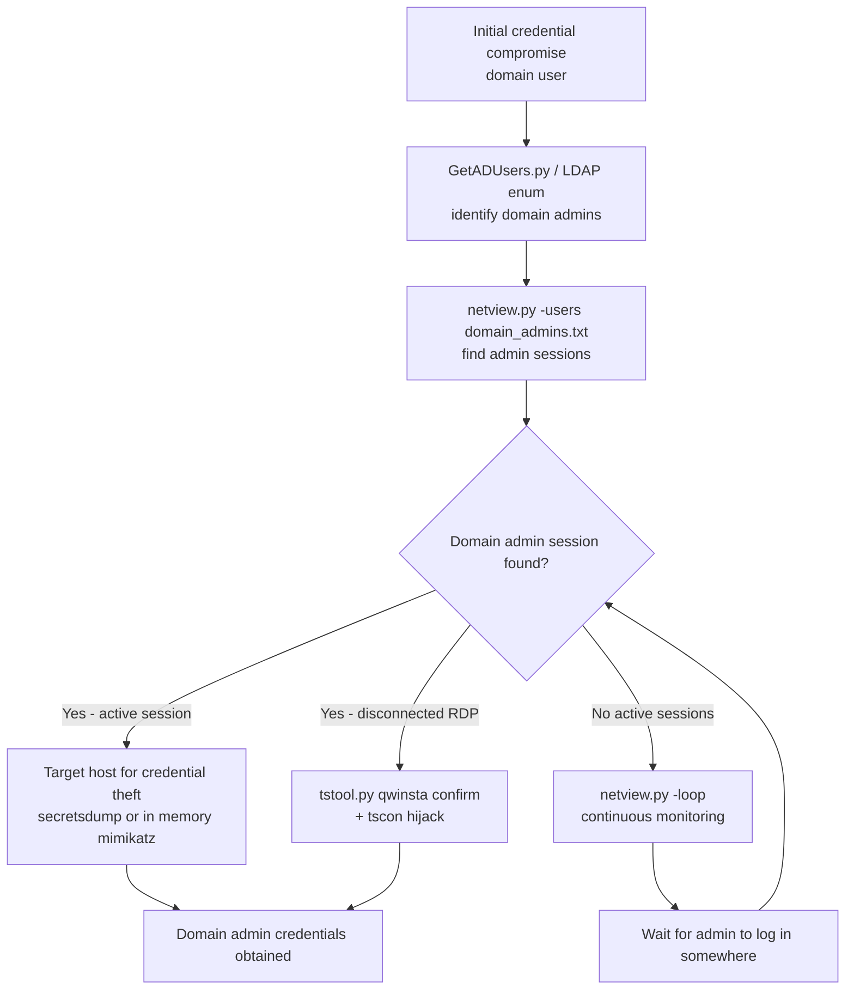
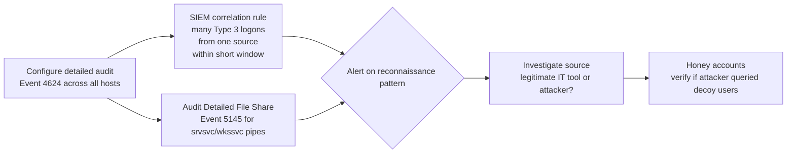

title: "netview.py"
script: "examples/netview.py"
category: "Recon and Enumeration"
status: "Published"
protocols:
  - SMB
  - DCE/RPC
  - MS-SRVS
  - MS-WKST
  - MS-SAMR
ms_specs:
  - MS-SRVS
  - MS-WKST
  - MS-SAMR
mitre_techniques:
  - T1087.002
  - T1018
  - T1033
  - T1049
  - T1069.002
auth_types:
  - NTLM
  - Kerberos
  - Pass-the-Hash
tags:
  - impacket
  - impacket/examples
  - category/recon_and_enumeration
  - status/published
  - protocol/smb
  - protocol/dcerpc
  - protocol/ms-srvs
  - protocol/ms-wkst
  - protocol/ms-samr
  - ms-spec/ms-srvs
  - ms-spec/ms-wkst
  - ms-spec/ms-samr
  - technique/session_enumeration
  - technique/logged_on_user_enumeration
  - technique/domain_machine_enumeration
  - technique/user_hunting
  - technique/bloodhound_predecessor
  - mitre/T1087.002
  - mitre/T1018
  - mitre/T1033
  - mitre/T1049
  - mitre/T1069.002
aliases:
  - netview
  - net-view
  - session-enumeration
  - user hunting
  - logged-on-users
  - domain-machine-walker
  - bloodhound-session-source


# netview.py

> **One line summary:** Multi threaded session enumeration tool that performs domain wide "user hunting" by enumerating all machine accounts in the domain via [MS-SAMR] (`SamrEnumerateUsersInDomain` filtered to `USER_WORKSTATION_TRUST_ACCOUNT`), then for each reachable machine remotely calls `NetSessionEnum` from [MS-SRVS] (level 10 = `WKSSVC_NETSESSION_ENUM_LEVEL_10` returning username, source IP, active time, idle time per session) and `NetWkstaUserEnum` from [MS-WKST] (returning users with interactive logons, including the console session), printing per target lines like `WORKSTATION01: user alice logged from host 10.10.20.5 - active: 1234, idle: 56`; authored by Alberto Solino (`@agsolino`, "beto" in the source author header), one of the foundational Impacket reconnaissance tools that predates and inspired the user-session collection logic in BloodHound's before 2018 SharpHound and PowerView equivalents; supports a continuous loop mode that polls the domain periodically, tracking newly logged in and newly logged out users across hosts to build a temporal user-host activity map; threaded with separate `machinesAliveQueue` and `machinesDownQueue` for concurrent host probing; supports filtering by user list (`-users <file>`) so an operator hunting for specific targets only sees results for those usernames; full Impacket auth surface (NTLM, Kerberos, pass the hash) via standard target syntax; **opens the Recon and Enumeration final sprint at 10 of 17 articles (59%), with seven stubs remaining (`getArch.py`, `Get-GPPPassword.py`, `GetLAPSPassword.py`, `DumpNTLMInfo.py`, `rpcmap.py`, `machine_role.py`, and one more to confirm) before the category closes as the 13th and final complete category for the wiki at 100% completion**.

| Field | Value |
|:---|:---|
| Script | `examples/netview.py` |
| Category | Recon and Enumeration |
| Status | Published |
| Author | beto = Alberto Solino (`@agsolino`); among the longest tenured Impacket maintainers |
| Primary protocols | SMB transport for DCE/RPC; [MS-SAMR], [MS-SRVS], [MS-WKST] interfaces over named pipes |
| Primary Microsoft specifications | `[MS-SAMR]` Security Account Manager Remote Protocol; `[MS-SRVS]` Server Service Remote Protocol; `[MS-WKST]` Workstation Service Remote Protocol |
| MITRE ATT&CK techniques | T1087.002 Account Discovery: Domain Account; T1018 Remote System Discovery; T1033 System Owner/User Discovery; T1049 System Network Connections Discovery; T1069.002 Permission Groups Discovery: Domain Groups (incidental, via SAMR enumeration) |
| Authentication | NTLM, Kerberos (`-k` flag, requires `-dc-ip`), Pass-the-Hash (`-hashes`) |
| Threading model | Two queues (`machinesAliveQueue` for reachable hosts to probe, `machinesDownQueue` for unreachable hosts to retry), parallel TCP probe threads to determine reachability, single producer for SAMR enumeration |
| Default behavior | One shot domain enumeration; with `-loop`, continuous polling tracking session changes |
| Notable historical role | One of the foundational reconnaissance tools inspiring BloodHound's user session collection logic; standard component of any Linux side Active Directory assessment workflow since at least 2015 |
| First appearance in Impacket | Long-tenured tool; visible in source as far back as 0.9.14 (likely 2014-2015) |


## Prerequisites

This article assumes familiarity with:

- [`samrdump.py`](samrdump.md) and [`lookupsid.py`](lookupsid.md) for [MS-SAMR] basics. netview.py uses SAMR for the same RPC family but for a different purpose: enumerating machine accounts rather than user accounts.
- [`smbclient.py`](../05_smb_tools/smbclient.md) for SMB session and authentication mechanics. netview.py uses the same DCE/RPC over SMB transport pattern.
- [`GetADComputers.py`](GetADComputers.md) for an LDAP based alternative to SAMR enumeration. netview.py and GetADComputers.py serve overlapping purposes (both enumerate domain machines) but use different protocols (SAMR via SMB vs LDAP), and produce different additional information.
- General Active Directory concepts: domain controller, machine account, workstation trust account, user session, interactive logon vs network logon.
- `tstool.py qwinsta` from Remote System Interaction for the on host equivalent of session enumeration. tstool requires SMB administrator credentials on the target; netview.py works at the domain level without per host admin rights.


## What it does

`netview.py` performs three operations in sequence:

1. **Enumerate all domain machine accounts** via SAMR.
2. **Test each machine for reachability** via TCP probe.
3. **For each reachable machine, query the user sessions** via SRVS and WKST.

The result is a domain wide map of who is logged into what host, updated either once or continuously.

### Default invocation

```text
$ netview.py freefly.net/beto:Passw0rd@freefly-dc.freefly.net
Impacket v0.14.0.dev0 - Copyright Fortra, LLC and its affiliated companies
[*] Getting machine list from domain freefly.net
[*] Found 247 machines in the domain
[*] Probing host reachability (this may take a moment)
[*] 89 hosts reachable
WORKSTATION01: user alice logged from host 10.10.20.5 - active: 12453, idle: 67
WORKSTATION02: user bob logged from host \\WORKSTATION02 - active: 8901, idle: 1234
DESKTOP-IT15: user charlie logged from host 10.10.30.42 - active: 3456, idle: 0
SERVER-FILE01: user svc-backup logged from host 10.10.10.50 - active: 86400, idle: 0
DC01: user administrator logged from host 10.10.20.10 - active: 234, idle: 12
... (one line per discovered session) ...
```

Each line shows:
- **Target machine** (the host being queried).
- **Username** (the user with an active session on that machine).
- **Source IP or UNC** (where the user connected from; for console sessions, the local UNC).
- **Active time** (seconds since the session started).
- **Idle time** (seconds since the user's last input).

For an attacker, this is a **map of where every user is**. For a domain admin's account specifically, the output reveals which workstations and servers have a domain admin currently logged in - prime targets for credential theft via tools like Mimikatz or via session hijack via `tstool.py tscon`.

### Loop mode for tracking activity over time

```bash
netview.py -loop -wait 60 freefly.net/beto:Passw0rd@freefly-dc.freefly.net
```

Polls the domain every 60 seconds. Output shows session changes:

```text
[*] Refreshing machine list (loop iteration 5)
[+] WORKSTATION03: user alice newly logged on
[-] WORKSTATION07: user bob logged off
[+] DC02: user administrator newly logged on
```

This is the **temporal user activity map**: over hours or days, an operator builds a picture of work patterns, admin login schedules, server access frequencies, and shift changes. Operationally, this informs:

- **When to attempt lateral movement** (when target users are active and their credentials are in memory).
- **Which hosts to prioritize** (machines that domain admins log into regularly are high value pivots).
- **Detection of operational patterns** (admin access at unusual times may indicate compromise from a defensive perspective).

### Filter by user list

```bash
netview.py -users /tmp/targets.txt freefly.net/beto:Passw0rd@freefly-dc.freefly.net
```

Where `/tmp/targets.txt` contains usernames one per line:

```text
administrator
domain.admin
backup.svc
sql.svc
```

Output is filtered to only show sessions matching those usernames. Operationally this is "user hunting": given a list of high value targets (typically domain admins, service accounts, or specific users with known privileged access), find out exactly where they're currently sitting.

### Kerberos authentication

```bash
netview.py -k -no-pass -dc-ip freefly-dc.freefly.net freefly.net/beto
```

Standard Impacket Kerberos pattern. Requires KRB5CCNAME pointing to a valid ccache. The `-dc-ip` flag is required because netview.py needs to know which DC to enumerate machines from.


## Why it exists

### The problem netview.py solves

In an Active Directory environment, knowing where users are currently logged in is operationally crucial for both attackers and defenders. The challenge: this information is distributed across every host in the domain. There is no central directory of "current sessions" - each machine knows about its own sessions, but no aggregated view exists by default.

The available query mechanisms:

- **`net session` on Windows**: shows sessions to the local machine. Requires running on each target.
- **`net view \\target`** (deprecated): shows network sessions on a remote machine. Requires admin rights on the target.
- **WMI `Win32_LogonSession`**: per machine session enumeration via WMI. Needs admin on target.
- **Server Service `NetSessionEnum`** RPC ([MS-SRVS]): the underlying primitive that `net session` and `net view` both use. Accessible remotely without admin rights on the target machine via Authenticated Users group on most domain joined machines.
- **Workstation Service `NetWkstaUserEnum`** RPC ([MS-WKST]): per machine enumeration of users with active interactive logons (including console). Typically requires admin rights on target.

The unique value of `NetSessionEnum` is that historically (before some Windows hardening efforts in 2017+) it was queryable by any authenticated domain user against any other domain joined machine. This let any low privilege user enumerate sessions across the entire domain - a powerful reconnaissance primitive that BloodHound's session collection famously exploited.

netview.py wraps this enumeration in a Linux friendly multi threaded tool that handles the entire domain walk: SAMR for machine discovery, parallel TCP probing for reachability, then SRVS/WKST per machine for sessions. It produces the consolidated domain wide session map that no native tool produces.

### The BloodHound connection

When BloodHound was released in 2016 by `@_wald0`, `@CptJesus`, and `@harmj0y`, its core innovation was treating Active Directory as a graph database where attack paths could be computed by graph traversal. One of BloodHound's most operationally significant data sources was **session collection**: identifying which users were logged into which machines so that attack paths could be computed from "I have credentials for user A" to "user A has admin on machine B which has a session for domain admin C".

The session collection logic in BloodHound's collectors (originally SharpHound for Windows, PowerView's `Get-NetSession` for PowerShell) called the same `NetSessionEnum` RPC that netview.py calls, against the same set of machines. The key difference: BloodHound stored the data in Neo4j and provided a graph UI; netview.py prints it to stdout. BloodHound also fetched many other AD attributes (group memberships, ACLs, trust relationships, etc.); netview.py focuses on session data exclusively.

For Linux operators in the before BloodHound era, netview.py was the primary tool for this kind of enumeration. It remains the simplest way to get session data quickly without standing up a BloodHound instance, especially for one off questions like "is the domain admin currently logged into anything?"

### The Microsoft hardening response

In 2017, Microsoft issued KB4338832 and related guidance restricting `NetSessionEnum` access on Windows 10 1709 and Server 2016 1709 onward. The default behavior changed: anonymous and unprivileged authenticated callers now receive empty results from `NetSessionEnum` against modern Windows versions. The change was specifically motivated by BloodHound and similar reconnaissance tooling.

Operational implications for netview.py:

- **Against legacy systems** (before 2017 Windows, Linux Samba servers, hardened older Windows with the restriction not applied): netview.py works as designed, returning full session data.
- **Against modern hardened Windows**: `NetSessionEnum` returns empty or filtered results. netview.py still runs but produces less useful output for those targets.
- **Against domain controllers**: the restriction is more nuanced; some sessions remain visible, others don't.
- **Mixed environments**: typical real world domain has both legacy and modern hosts; netview.py's output reflects this with full data for some targets, empty for others.

The `NetWkstaUserEnum` path (for users with interactive logons) is less affected by the 2017 hardening but historically required admin rights on the target. Some hardening guides also restrict this further.

The article documents this honestly: netview.py is operationally significant in mixed environments and against legacy systems, but not the universal session mapping tool it once was. Modern operators often combine netview.py with LDAP based tools (BloodHound's SharpHound or `bloodhound-python`) and supplementary host level enumeration to fill gaps.

### Why ship it in Impacket

netview.py exists in Impacket for the same reason most Impacket reconnaissance tools exist: Impacket has the low level RPC implementations for SAMR, SRVS, and WKST, and providing a working tool that exercises them at scale is both useful and pedagogically valuable. The threading model (Queues plus worker threads) is also a clean reference for any other tool that needs to fan out RPC calls across many hosts.


## Protocol theory

### MS-SAMR: machine account enumeration

[MS-SAMR] Security Account Manager Remote Protocol exposes the Windows SAM database via DCE/RPC. The relevant calls for netview.py:

- `SamrConnect5`: open a handle to the SAM server.
- `SamrEnumerateDomainsInSamServer`: enumerate domains.
- `SamrLookupDomainInSamServer`: get the SID for a named domain.
- `SamrOpenDomain`: open a handle to a specific domain.
- `SamrEnumerateUsersInDomain`: enumerate user accounts in the domain.

The key trick: `SamrEnumerateUsersInDomain` accepts a `UserAccountControl` filter parameter. Setting it to `USER_WORKSTATION_TRUST_ACCOUNT` (0x0080) returns only computer accounts (not regular user accounts). This is how netview.py gets the list of all domain joined machines without doing a full LDAP enumeration.

```python
# Pseudocode reflecting netview.py's logic
resp = samr.hSamrEnumerateUsersInDomain(
    dce, domainHandle,
    samr.USER_WORKSTATION_TRUST_ACCOUNT,
    enumerationContext=enumerationContext
)
for user in resp['Buffer']['Buffer']:
    machineName = user['Name'].rstrip('$')  # strip trailing $ from machine name
    machinesList.append(machineName)
```

The `$` suffix on machine names is the Active Directory convention; `WORKSTATION01$` is the SAM account name for the machine WORKSTATION01. netview.py strips it for display.

SAMR queries are typically allowed for any authenticated domain user, though some hardening configurations restrict SAMR enumeration to specific groups via the `RestrictRemoteSAM` registry policy.

### MS-SRVS: NetSessionEnum

[MS-SRVS] Server Service Remote Protocol exposes the Windows Server service over DCE/RPC. The relevant call:

- `NetrSessionEnum` (opnum 12): enumerate sessions to the server.

The function returns information about sessions established TO the server (i.e., who has connected to this machine over SMB). Multiple information levels are supported:

- Level 0: just the source name (least information).
- Level 1: source name + username.
- Level 2: + transport type, opens, time.
- Level 10: + active time, idle time, username, source name (most useful).
- Level 502: extra fields including transport.

netview.py uses Level 10 for the rich output. The struct returned is `WKSSVC_NETSESSION_ENUM_LEVEL_10` with fields:
- `sesi10_cname`: client name (where the session originated).
- `sesi10_username`: user who established the session.
- `sesi10_time`: total session time in seconds.
- `sesi10_idle_time`: seconds since last activity.

The named pipe for [MS-SRVS] is `\PIPE\srvsvc`. netview.py binds to this pipe over SMB on each target machine.

### MS-WKST: NetWkstaUserEnum

[MS-WKST] Workstation Service Remote Protocol exposes per machine workstation state. The relevant call:

- `NetrWkstaUserEnum` (opnum 2): enumerate users with active interactive logons on the workstation.

This includes the user at the console (if any), users with cached interactive logons, and similar local machine logon information. The level 1 structure includes:
- `wkui1_username`: user name.
- `wkui1_logon_domain`: domain of the user.
- `wkui1_oth_domains`: other domains.
- `wkui1_logon_server`: domain controller that authenticated the logon.

netview.py calls `NetrWkstaUserEnum` to capture interactive logons that wouldn't appear in `NetSessionEnum` (which only sees network sessions to the server). For example, a domain admin sitting at a workstation console has an interactive logon visible to WKST but no session visible to SRVS.

The named pipe for [MS-WKST] is `\PIPE\wkssvc`. netview.py binds to this pipe over SMB.

### The combined session view

The two RPCs are complementary:

| RPC | What it shows | Source typical for |
|:---|:---||
| `NetrSessionEnum` (SRVS) | Network sessions TO this machine | File server access, SMB connections, network logons |
| `NetrWkstaUserEnum` (WKST) | Interactive logons ON this machine | Console users, RDP sessions, cached logons |

For complete session visibility, both must be queried. netview.py does this per machine:

1. Bind to SRVS, call `NetSessionEnum`, print results.
2. Bind to WKST, call `NetWkstaUserEnum`, print results.
3. Move to next machine.

### Threading model

The naive approach (sequential per machine queries) is slow for large domains. netview.py uses a producer consumer pattern:

```python
machinesAliveQueue = Queue()
machinesDownQueue = Queue()

# Producer thread: SAMR enumeration adds machine names to a list
# Probe threads: TCP probe each machine to determine reachability,
#                place in machinesAliveQueue or machinesDownQueue
# Consumer thread: pull from machinesAliveQueue, do SRVS/WKST queries, print
```

The TCP probe is a quick check (typically TCP 445 with short timeout) to avoid blocking RPC calls on unreachable machines. The threading is configurable via flags; default is reasonable for most domain sizes.

### Authentication permissions

For each RPC, the caller's credentials matter:

- **SAMR**: typically allowed for any authenticated domain user. May be restricted by `RestrictRemoteSAM` policy.
- **SRVS NetSessionEnum**: before 2017 allowed for any authenticated user; after 2017 hardening restricts to administrators on modern Windows.
- **WKST NetWkstaUserEnum**: typically requires admin rights on the target machine.

netview.py works best when the operator has at least domain user credentials and ideally local admin on many target machines (e.g., via gold/silver tickets, harvested credentials, or domain admin compromise). Even with just domain user, SAMR enumeration succeeds and SRVS may succeed on legacy machines, providing a partial map.


## How the tool works internally

### Imports

```python
import sys
import argparse
import logging
import socket
from threading import Thread, Event
from queue import Queue
from time import sleep

from impacket.examples import logger
from impacket.examples.utils import parse_identity
from impacket import version
from impacket.smbconnection import SessionError
from impacket.dcerpc.v5 import transport, wkst, srvs, samr
from impacket.dcerpc.v5.ndr import NULL
from impacket.dcerpc.v5.rpcrt import DCERPCException
from impacket.nt_errors import STATUS_MORE_ENTRIES
```

The key imports are the three DCE/RPC interfaces (`wkst`, `srvs`, `samr`) and the threading primitives (`Thread`, `Event`, `Queue`). Standard Impacket scaffolding for the rest.

### Main flow

Pseudocode:

```python
def main():
    options = parser.parse_args()
    domain, username, password, target = parse_identity(options.identity)
    
    netview = NETVIEW(username, password, domain, options)
    netview.run(target)


class NETVIEW:
    def run(self, dcHost):
        # Step 1: SAMR machine enumeration
        self.__machinesList = self.getMachineList(dcHost)
        logging.info('Found %d machines' % len(self.__machinesList))
        
        # Step 2: Start probe threads
        self.__targetsThreadEvent = Event()
        self.__targetsThread = Thread(
            target=checkMachines,
            args=(self.__machinesList, self.__targetsThreadEvent)
        )
        self.__targetsThread.start()
        
        # Step 3: Consumer loop - process alive machines
        while True:
            if not machinesAliveQueue.empty():
                target = machinesAliveQueue.get()
                self.querySessionsForMachine(target)
            
            if not self.__loop:
                if probesComplete and machinesAliveQueue.empty():
                    break
            else:
                sleep(self.__waitTime)
                # Re-enumerate
```

### `getMachineList`: SAMR walk

```python
def getMachineList(self, dcHost):
    rpctransport = transport.SMBTransport(dcHost, filename=r'\samr', ...)
    rpctransport.set_credentials(self.__username, ...)
    dce = rpctransport.get_dce_rpc()
    dce.connect()
    dce.bind(samr.MSRPC_UUID_SAMR)
    
    resp = samr.hSamrConnect5(dce, ...)
    serverHandle = resp['ServerHandle']
    
    resp = samr.hSamrEnumerateDomainsInSamServer(dce, serverHandle)
    domainName = resp['Buffer']['Buffer'][0]['Name']
    
    resp = samr.hSamrLookupDomainInSamServer(dce, serverHandle, domainName)
    domainSID = resp['DomainId']
    
    resp = samr.hSamrOpenDomain(dce, serverHandle, domainId=domainSID)
    domainHandle = resp['DomainHandle']
    
    machinesList = []
    enumerationContext = 0
    while True:
        try:
            resp = samr.hSamrEnumerateUsersInDomain(
                dce, domainHandle,
                samr.USER_WORKSTATION_TRUST_ACCOUNT,
                enumerationContext=enumerationContext
            )
        except DCERPCException as e:
            if str(e).find('STATUS_MORE_ENTRIES') < 0:
                raise
            resp = e.get_packet()
        
        for user in resp['Buffer']['Buffer']:
            machinesList.append(user['Name'].rstrip('$'))
        
        enumerationContext = resp['EnumerationContext']
        if resp['ErrorCode'] != STATUS_MORE_ENTRIES:
            break
    
    return machinesList
```

The SAMR walk is paginated via `enumerationContext`; the loop continues until the response indicates no more entries. For large domains, this may be many round trips.

### `querySessionsForMachine`: SRVS + WKST per target

```python
def querySessionsForMachine(self, target):
    # SRVS - NetSessionEnum
    rpctransportSrvs = transport.SMBTransport(target, filename=r'\srvsvc', ...)
    rpctransportSrvs.set_credentials(...)
    dce = rpctransportSrvs.get_dce_rpc()
    try:
        dce.connect()
        dce.bind(srvs.MSRPC_UUID_SRVS)
        resp = srvs.hNetrSessionEnum(dce, NULL, NULL, 10)
        for session in resp['InfoStruct']['SessionInfo']['Level10']['Buffer']:
            userName = session['sesi10_username']
            sourceIP = session['sesi10_cname']
            if self.__usersFilter and userName not in self.__usersFilter:
                continue
            logging.info("%s: user %s logged from host %s - active: %d, idle: %d" % (
                target, userName, sourceIP,
                session['sesi10_time'], session['sesi10_idle_time']
            ))
    except (DCERPCException, SessionError) as e:
        logging.debug('SRVS error on %s: %s' % (target, e))
    
    # WKST - NetWkstaUserEnum
    rpctransportWkst = transport.SMBTransport(target, filename=r'\wkssvc', ...)
    rpctransportWkst.set_credentials(...)
    dce = rpctransportWkst.get_dce_rpc()
    try:
        dce.connect()
        dce.bind(wkst.MSRPC_UUID_WKST)
        resp = wkst.hNetrWkstaUserEnum(dce, 1)
        for user in resp['UserInfo']['WkstaUserInfo']['Level1']['Buffer']:
            userName = user['wkui1_username']
            if self.__usersFilter and userName not in self.__usersFilter:
                continue
            logging.info("%s: user %s logged from logon domain %s" % (
                target, userName, user['wkui1_logon_domain']
            ))
    except (DCERPCException, SessionError) as e:
        logging.debug('WKST error on %s: %s' % (target, e))
```

Both RPCs are wrapped in try/except. Errors (access denied, RPC unavailable, target unreachable during query) are logged at debug level but don't abort the per machine enumeration. Move on to the next machine.

### Loop mode session change tracking

In `-loop` mode, after each iteration the script compares the current session set to the previous iteration's set:

```python
# Pseudocode
while True:
    currentSessions = self.gatherAllSessions()
    
    # Find new sessions
    for session in currentSessions:
        if session not in previousSessions:
            print('[+] %s: user %s newly logged on' % (session.target, session.user))
    
    # Find ended sessions
    for session in previousSessions:
        if session not in currentSessions:
            print('[-] %s: user %s logged off' % (session.target, session.user))
    
    previousSessions = currentSessions
    sleep(self.__waitTime)
```

This gives the running activity feed: not just static state but the deltas. Operationally, an attacker can leave netview.py running for hours and watch for the moment a target user logs in somewhere accessible.

### What the tool does NOT do

- Does NOT enumerate via LDAP. SAMR-only for machine discovery. For LDAP based enumeration, use `GetADComputers.py` or `bloodhound-python`.
- Does NOT handle the 2017+ Windows hardening of `NetSessionEnum`. Modern Windows returns empty or filtered results; netview.py simply reports no sessions found rather than working around the restriction (no workaround exists for the hardened path without admin rights).
- Does NOT collect group memberships, GPOs, ACLs, or other AD data. Sessions only.
- Does NOT correlate users to machines via Kerberos service tickets. Tools like `findDelegation.py` do that.
- Does NOT actively poll user logons via Windows Event log. Read only RPC enumeration; doesn't generate logon events on target machines.
- Does NOT bypass authentication. Domain user credentials minimum; better results with admin.
- Does NOT bypass `RestrictRemoteSAM` policy. If the target DC restricts SAMR, machine enumeration fails.
- Does NOT support fileless output formats (JSON, CSV) natively. Output is readable by humans log lines; for programmatic consumption, parse stdout or modify the script.
- Does NOT integrate with BloodHound directly. For BloodHound integration, use `bloodhound-python` which makes overlapping RPC calls plus many more.


## Practical usage

### Basic domain enumeration

```bash
netview.py freefly.net/beto:Passw0rd@freefly-dc.freefly.net
```

One shot enumeration. Output to stdout. Capture for later analysis:

```bash
netview.py freefly.net/beto:Passw0rd@freefly-dc.freefly.net 2>&1 | tee netview_output.txt
```

### User hunting for specific targets

```bash
# Create user list
cat > /tmp/targets.txt <<EOF
administrator
domain.admin
backup.svc
sql.svc
EOF

# Enumerate
netview.py -users /tmp/targets.txt freefly.net/beto:Passw0rd@freefly-dc.freefly.net
```

Output filtered to just those usernames. Use case: during an active engagement, identify exactly which hosts have your high value targets currently logged in.

### Loop mode for activity tracking

```bash
netview.py -loop -wait 300 freefly.net/beto:Passw0rd@freefly-dc.freefly.net 2>&1 | tee activity.log
```

Polls every 5 minutes (300 seconds). Run for hours or days. The activity log will show:
- Initial state (all current sessions).
- Per iteration deltas (new logons, logoffs).
- Pattern recognition becomes possible: who logs in at 8am? Who works late? Which servers see admin access only during patch windows?

For long running deployments, consider running in `screen` or `tmux`, or as a systemd service.

### Pass the hash variant

```bash
netview.py -hashes :NTHASH freefly.net/beto@freefly-dc.freefly.net
```

Standard Impacket pass the hash. Works for all queries.

### Kerberos with cached ticket

```bash
# First, get a ticket
getTGT.py freefly.net/beto:Passw0rd
export KRB5CCNAME=beto.ccache

# Run netview.py with Kerberos
netview.py -k -no-pass -dc-ip freefly-dc.freefly.net freefly.net/beto
```

The `-dc-ip` flag is required for Kerberos because netview.py needs to know which KDC to authenticate against. Without it, only the SAMR call to the DC works; subsequent per machine RPC calls (which need their own Kerberos service tickets) may fail.

### Domain admin hunting workflow

A typical "find the domain admin" workflow combining tools:

```bash
# Step 1: Enumerate domain admins via LDAP
GetADUsers.py -all freefly.net/beto:Passw0rd > all_users.txt
grep -A 2 "memberOf.*Domain Admins" all_users.txt | grep CN= | awk -F'CN=' '{print $2}' | awk -F',' '{print $1}' > domain_admins.txt

# Step 2: Hunt for domain admin sessions
netview.py -users domain_admins.txt freefly.net/beto:Passw0rd@freefly-dc.freefly.net > admin_locations.txt

# Step 3: Examine results, identify target hosts
cat admin_locations.txt
# Output reveals: "FILESERVER01: user da_alice logged from host 10.10.10.50 - active: 8901, idle: 23"
# Domain admin "da_alice" is currently active on FILESERVER01

# Step 4: Pivot to target host (assuming admin access)
secretsdump.py freefly.net/beto:Passw0rd@FILESERVER01
# Or wmiexec.py for shell access, etc.
```

This workflow - LDAP enumeration → session hunting → credential dumping/lateral movement - is the canonical AD pentesting flow. netview.py is the "session hunting" step.

### Supplementing with BloodHound

For a single point in time question, netview.py is faster than running BloodHound. For comprehensive AD analysis with attack path computation, BloodHound is more capable. Operators often use both:

- BloodHound for the one time graph build, identifying attack paths.
- netview.py for ongoing session monitoring during active engagements (faster iteration, no Neo4j dependency).

### Combining with tstool.py for hijack opportunities

```bash
# Step 1: netview.py identifies hosts where domain admin has disconnected sessions
netview.py -users domain_admins.txt freefly.net/beto:Passw0rd@freefly-dc.freefly.net | grep -i 'idle:.[0-9]\{4,\}'
# Sessions with high idle time may be disconnected RDP sessions

# Step 2: Confirm with tstool.py qwinsta on the target
tstool.py freefly.net/beto:Passw0rd@TARGETHOST qwinsta
# Output shows: Session 3, "Disc", username "domain.admin"

# Step 3: Korznikov tscon hijack
tstool.py freefly.net/beto:Passw0rd@TARGETHOST tscon -source 3 -dest console
```

The combination is operationally significant: netview.py finds the target session across the domain; tstool.py confirms it's hijackable and performs the hijack.

### Key flags

| Flag | Meaning |
|:---|:---|
| `target` (positional) | `[[domain/]username[:password]@]<dc-host>` standard Impacket target. The host portion should be a domain controller. |
| `-users <file>` | Filter output to only sessions matching usernames in this file (one per line). |
| `-loop` | Continuously poll the domain, tracking session changes. |
| `-wait <seconds>` | Sleep between iterations in `-loop` mode. Default typically 30 seconds. |
| `-target <name>` | Limit enumeration to a single target host instead of full domain walk. |
| `-noLoop` | Force one shot mode (default behavior; flag exists for explicit override). |
| `-hashes LMHASH:NTHASH` | NT hash auth. |
| `-k` | Kerberos authentication. |
| `-no-pass` | Skip password prompt (useful with `-k`). |
| `-aesKey` | AES key for Kerberos. |
| `-dc-ip` | Specify KDC IP. **Required for Kerberos**, optional otherwise. |
| `-debug` | Verbose debug output including per RPC error details. |
| `-ts` | Timestamp log lines. |


## What it looks like on the wire

### SAMR enumeration on the DC

Wire activity: SMB connection to `freefly-dc.freefly.net`, NTLM or Kerberos auth, tree connect to IPC$, named pipe open `\PIPE\samr`, DCE/RPC bind to SAMR UUID `12345778-1234-ABCD-EF00-0123456789AC`, then RPC calls in sequence:

- `SamrConnect5` (opnum 64).
- `SamrEnumerateDomainsInSamServer` (opnum 6).
- `SamrLookupDomainInSamServer` (opnum 5).
- `SamrOpenDomain` (opnum 7).
- `SamrEnumerateUsersInDomain` (opnum 13) - possibly multiple times for pagination.

For a domain with ~250 machines, this is ~1-2 seconds total. Most of the time is in the enumeration call(s); other calls are fast.

Wireshark filter:

```text
smb2.filename == "samr" or dcerpc.cn_iface == "12345778-1234-ABCD-EF00-0123456789AC"
```

### Per machine SRVS query

Wire activity per target machine: SMB connection, auth, tree IPC$, pipe `\PIPE\srvsvc`, DCE/RPC bind to SRVS UUID `4B324FC8-1670-01D3-1278-5A47BF6EE188`, RPC call:

- `NetrSessionEnum` (opnum 12) with level 10.

The response packet contains an array of session structs. Pipe closes, SMB session closes.

Wireshark filter:

```text
dcerpc.cn_iface == "4B324FC8-1670-01D3-1278-5A47BF6EE188" and dcerpc.opnum == 12
```

### Per machine WKST query

Wire activity: same pattern as SRVS but pipe `\PIPE\wkssvc`, WKST UUID `6BFFD098-A112-3610-9833-46C3F87E345A`, opnum 2:

- `NetrWkstaUserEnum` (opnum 2) with level 1.

Wireshark filter:

```text
dcerpc.cn_iface == "6BFFD098-A112-3610-9833-46C3F87E345A" and dcerpc.opnum == 2
```

### Volume signature

For a domain with 250 machines and 90 reachable, the wire pattern is:

- One SAMR conversation with the DC.
- 90 SRVS connections (each: TCP setup, SMB, RPC, teardown).
- 90 WKST connections (similar).
- Many TCP probes that didn't result in full connections (the 160 unreachable hosts).

Total wire activity for one one shot enumeration: a few thousand packets across ~180 short connections. Highly distinctive pattern: short bursts of SMB connections to many internal hosts, all from one source, in rapid succession. Network monitoring tools that flag "host X connecting to many other hosts via SMB" will catch this trivially.

### Loop mode signature

In `-loop` mode, the wire pattern repeats every `-wait` seconds. A defender observing this pattern (one source, many SMB connections, repeating periodically) has a high confidence signal of automated reconnaissance.


## What it looks like in logs

### Domain controller logs (SAMR enumeration)

- **Event 4624** (logon): NTLM or Kerberos logon to the DC.
- **Event 4634** (logoff): when the SAMR session disconnects.
- **Event 4799** (group enumeration via SAM API): in some configurations, SAMR enumeration triggers this. Default audit policy may not have it enabled.

### Target machine logs (SRVS + WKST queries)

For each target the script touches:

- **Event 4624** (logon): network logon (Type 3) for the netview.py user.
- **Event 4634** (logoff): when the connection closes.
- **Event 5145** (detailed file share access): if "Audit Detailed File Share" is enabled, accesses to the IPC$ share including pipe names appear here.
- **Event 5140** (file share access): summary of IPC$ access.

The 5145 event with object name including `\srvsvc` or `\wkssvc` is the high value indicator: distinguishes admin pipe access from generic SMB.

### Volume in logs

For a domain enumeration touching 90 hosts:

- ~180 logon/logoff event pairs across 90 different machines, all from the netview.py source within minutes.
- Concentrated burst pattern is the signature.
- DC log alone wouldn't show much; the cross machine correlation is the detection signal.

### EDR signals

Modern EDR products typically flag:
- Many machines all reporting Type 3 logons from one source IP within a short window.
- The same source enumerating SAMR on a DC followed by SRVS/WKST on many other hosts.
- Behavior pattern matching known reconnaissance tools.

Some EDR products specifically flag "user hunting" patterns. SilentTrinity, BloodHound, PowerView, NetView, SharpHound, and Impacket netview.py all produce similar wire level patterns.

### Sigma rule example

```yaml
title: Active Directory Reconnaissance via SAMR + SRVS Pattern
logsource:
  product: windows
  service: security
detection:
  samr_enum_dc:
    EventID: 4624
    LogonType: 3
    TargetServerName|contains: 'samr'
  srvs_many_hosts:
    EventID: 4624
    LogonType: 3
    SubjectIp: '%attacker_ip%'
  condition: samr_enum_dc and (srvs_many_hosts | count(SubjectIp) > 20) within 5m
level: high
```

High severity. SAMR enumeration on DC followed by Type 3 logons to 20+ hosts within 5 minutes is a strong reconnaissance signature. False positive sources: legitimate IT discovery tools (SCCM client probing), some monitoring agents.


## Detection and defense

### Detection approach

- **Cross host logon pattern**: many short Type 3 logons from one source to many internal hosts within a short window. Highest-value signal.
- **SAMR enumeration auditing**: Event 4799 enabled via "Audit User/Device Claims" plus appropriate SACL on SAM. Detects machine account enumeration.
- **Named pipe access auditing**: "Audit Detailed File Share" Event 5145 for `\srvsvc` and `\wkssvc` pipe access from unprivileged sources.
- **EDR behavioral detection**: most modern EDR products flag reconnaissance patterns in this category.
- **Honey accounts**: create domain accounts with names like `da_helpdesk` or `backup_admin` that are never actually used. Any attempt to hunt for sessions of these accounts (e.g., netview.py with these names in the `-users` file) is a high confidence detection.

### Preventive controls

- **`NetSessionEnum` hardening (KB4338832)**: ensure the modern restriction is applied to all Windows 10 1709+ and Server 2016 1709+ hosts. This is the primary mitigation for `NetSessionEnum`-based enumeration.
- **`RestrictRemoteSAM` policy**: restrict SAMR enumeration to administrators via the registry policy `HKLM\System\CurrentControlSet\Control\Lsa\RestrictRemoteSAM`. Reduces attack surface for SAMR based enumeration.
- **Audit pipe access**: configure "Audit Detailed File Share" GPO to enable Event 5145 logging. Increases visibility but also increases log volume.
- **Tier based access**: implement tiered admin model (Tier 0 / Tier 1 / Tier 2) so domain admins never log into workstations, eliminating the high value targets that user hunting looks for.
- **Just in time admin**: PAM solutions that grant admin access only when needed and only for the minimum duration. Reduces window where an admin session is hijackable.
- **Privileged Access Workstations (PAWs)**: dedicated admin workstations, hardened, monitored. Sessions on PAWs are isolated from where attackers can typically reach.

### What netview.py does NOT enable

- Does NOT achieve initial access. Requires existing domain user credentials.
- Does NOT escalate privilege directly. Reconnaissance only - tells operator where to escalate.
- Does NOT bypass authentication. Standard SMB auth required.
- Does NOT install persistence. Read only enumeration.
- Does NOT exfiltrate data beyond session metadata.
- Does NOT bypass network segmentation - if target hosts aren't reachable, they won't appear in alive list.

### What netview.py CAN enable

- **Domain admin hunting** to identify hijack/compromise targets (T1087.002, T1033).
- **Lateral movement target selection** by finding hosts with active sessions of useful accounts (T1078).
- **Long-term reconnaissance** via loop mode tracking work patterns and admin schedules.
- **Service account discovery** by finding where service accounts are actively running.
- **Compromised credential value assessment** (a recovered credential's worth is partly determined by where the user is currently logged in).

The combination of SAMR + SRVS + WKST enumeration over many hosts gives the operator a domain wide situational awareness that's difficult to obtain any other way without admin rights everywhere.


## Related tools and attack chains

netview.py **opens the Recon and Enumeration final sprint at 10 of 17 articles (59%)**. Seven stubs remain (`getArch.py`, `Get-GPPPassword.py`, `GetLAPSPassword.py`, `DumpNTLMInfo.py`, `rpcmap.py`, `machine_role.py`, plus one more to confirm) before the category closes as the 13th and final complete category for the wiki.

### Related Impacket tools

- [`samrdump.py`](samrdump.md) and [`lookupsid.py`](lookupsid.md) - sibling SAMR based enumeration tools. samrdump enumerates user accounts; lookupsid resolves SIDs. netview uses SAMR for machine enumeration specifically.
- [`GetADComputers.py`](GetADComputers.md) - LDAP based machine enumeration. Returns more attributes (OS version, last logon, DN) but requires LDAP access. Often used in combination with netview.py.
- [`GetADUsers.py`](GetADUsers.md) - LDAP based user enumeration. Provides the user list often fed into netview.py's `-users` filter.
- [`findDelegation.py`](findDelegation.md) - Kerberos delegation enumeration. Different attack class but complementary in domain reconnaissance.
- [`tstool.py`](../08_remote_system_interaction/tstool.md) - Terminal Services / Remote Desktop Services management. Often used after netview.py identifies a session of interest, especially for the Korznikov tscon hijack technique against disconnected RDP sessions.
- [`secretsdump.py`](../03_credential_access/secretsdump.md) - typical follow up after netview.py identifies a high value target host: dump credentials from that host.

### External alternatives

- **PowerView `Get-NetSession`** (legacy PowerSploit): the PowerShell equivalent. Same `NetSessionEnum` RPC call, Windows native. Since 2017 hardening, similarly affected.
- **PowerView `Get-NetLoggedon`**: for `NetWkstaUserEnum`-style enumeration.
- **SharpHound** (BloodHound collector): includes session collection as part of its broader AD enumeration. More comprehensive but heavier.
- **bloodhound-python** (`https://github.com/dirkjanm/BloodHound.py`): Python BloodHound collector. Linux equivalent of SharpHound. Includes session collection plus much more.
- **NetExec `--users` and `--sessions`**: NetExec has session enumeration modules built in. Often the most operationally convenient choice for ad hoc enumeration.
- **CrackMapExec (predecessor of NetExec)**: similar capabilities, less actively maintained.
- **enum4linux** (legacy): general SMB enumeration including some session related queries. Older tool, rarely used today.
- **Custom Python with Impacket library calls**: any operator can write custom enumeration using `impacket.dcerpc.v5.srvs` directly. netview.py is one such custom tool ready made.

For session enumeration specifically as a one off operation, netview.py and NetExec's `--sessions` are the operationally convenient choices for Linux operators. For comprehensive AD analysis including sessions in the broader graph context, BloodHound (SharpHound or bloodhound-python) is the standard.

### User hunting attack chain



The user hunting chain is one of the highest leverage pen testing patterns. netview.py is the discovery primitive; tstool.py and secretsdump.py are the exploitation primitives.

### Defensive monitoring chain



The defender's view: detection is fundamentally about correlation across many hosts, not detection at any single host (where the activity looks like a normal logon).

### Combined operational use in red team engagements

A typical engagement uses netview.py at multiple stages:

1. **Initial reconnaissance**: after first credential acquisition, run netview.py once to map current sessions.
2. **Target identification**: filter results by user list to identify high value session locations.
3. **Long-term monitoring**: run with `-loop` in background to track when targets become accessible.
4. **Post exploitation validation**: after lateral movement, rerun netview.py from the new vantage point to update the session map.
5. **Cleanup awareness**: identify which sessions to expect (and thus which logoff events would look anomalous to defenders).

The tool integrates naturally into both ad hoc and persistent reconnaissance workflows.


## Further reading

- **Impacket netview.py source** at `https://github.com/fortra/impacket/blob/master/examples/netview.py`. Canonical implementation.
- **Impacket samr module** at `https://github.com/fortra/impacket/blob/master/impacket/dcerpc/v5/samr.py`. The SAMR implementation netview.py uses.
- **Impacket srvs module** at `https://github.com/fortra/impacket/blob/master/impacket/dcerpc/v5/srvs.py`. The SRVS implementation including `hNetrSessionEnum`.
- **Impacket wkst module** at `https://github.com/fortra/impacket/blob/master/impacket/dcerpc/v5/wkst.py`. The WKST implementation including `hNetrWkstaUserEnum`.
- **`[MS-SAMR]` Security Account Manager Remote Protocol specification** at `https://learn.microsoft.com/en-us/openspecs/windows_protocols/ms-samr/`. Authoritative protocol reference.
- **`[MS-SRVS]` Server Service Remote Protocol specification** at `https://learn.microsoft.com/en-us/openspecs/windows_protocols/ms-srvs/`. Includes `NetrSessionEnum` definition.
- **`[MS-WKST]` Workstation Service Remote Protocol specification** at `https://learn.microsoft.com/en-us/openspecs/windows_protocols/ms-wkst/`. Includes `NetrWkstaUserEnum` definition.
- **Microsoft KB4338832** (NetSessionEnum hardening). Search for "Net Cease" hardening guidance.
- **"Net Cease" PowerShell script** by Itai Grady at Microsoft: practical hardening tool for `NetSessionEnum` permissions.
- **BloodHound documentation** at `https://bloodhound.readthedocs.io/`. The graph based AD analysis tool that incorporates session collection.
- **bloodhound-python** at `https://github.com/dirkjanm/BloodHound.py`. Python-based BloodHound collector, the modern successor for Linux operators.
- **PowerView `Get-NetSession` documentation** in the legacy PowerSploit project. Historical context for similar functionality.
- **MITRE ATT&CK T1087.002 Account Discovery: Domain Account** at `https://attack.mitre.org/techniques/T1087/002/`.
- **MITRE ATT&CK T1018 Remote System Discovery** at `https://attack.mitre.org/techniques/T1018/`.
- **MITRE ATT&CK T1033 System Owner/User Discovery** at `https://attack.mitre.org/techniques/T1033/`.
- **MITRE ATT&CK T1049 System Network Connections Discovery** at `https://attack.mitre.org/techniques/T1049/`.

If you want to internalize netview.py, the productive exercise has three parts. First, in a lab AD environment with at least one DC and several domain joined Windows machines (workstations and servers), log into a few of them as different users (some interactively, some via SMB connections). From a Linux box with domain user credentials, run `netview.py domain.local/user:password@dc.domain.local` and observe the output - you should see your own active sessions reflected. Second, try `-loop` mode for 10-15 minutes while logging in/out of various machines on the lab; observe how the new logon and logoff events appear in the output. Third, test against a hardened modern Windows host (Windows 10 1709+ or Server 2016 1709+) and observe that `NetSessionEnum` returns empty results compared to legacy hosts; this is the after 2017 hardening in action. After this exercise, the operational role of netview.py becomes concrete: it's the domain wide session map for any Linux operator who needs to know where users are right now, with full awareness of its limitations against modern hardened systems. The historical context (BloodHound's debt to this style of enumeration, Microsoft's hardening response, the ongoing cat and mouse between recon tools and hardening guidance) makes the tool's continued presence in Impacket meaningful even as its operational reach has narrowed.
