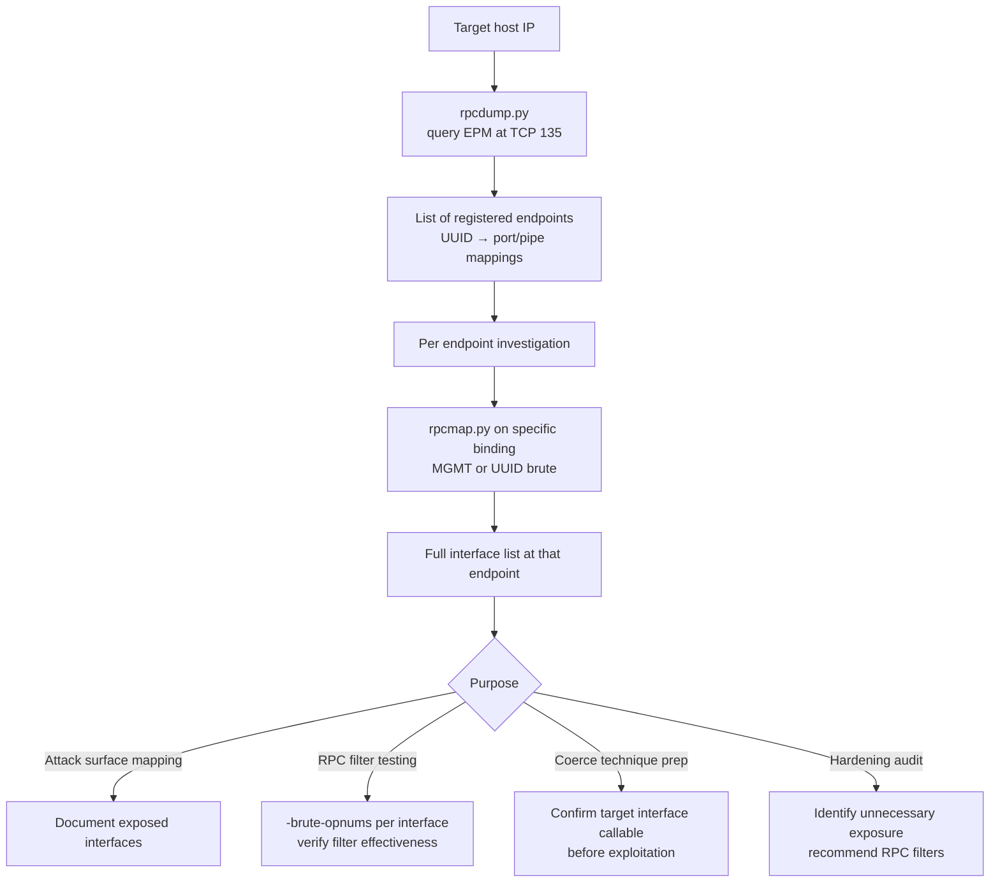
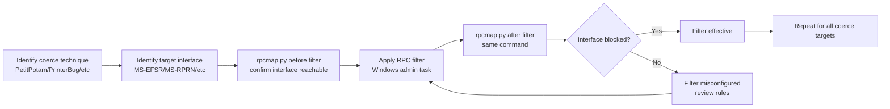

title: "rpcmap.py"
script: "examples/rpcmap.py"
category: "Recon and Enumeration"
status: "Published"
protocols:
  - DCE/RPC
  - SMB
  - HTTP
ms_specs:
  - MS-RPCE
  - MS-EPM
mitre_techniques:
  - T1046
  - T1018
  - T1590.005
auth_types:
  - NTLM
  - Kerberos
  - Pass-the-Hash
  - Basic (HTTP)
tags:
  - impacket
  - impacket/examples
  - category/recon_and_enumeration
  - status/published
  - protocol/dcerpc
  - protocol/smb
  - protocol/http
  - protocol/ms-rpce
  - protocol/ms-epm
  - ms-spec/ms-rpce
  - ms-spec/ms-epm
  - technique/rpc_interface_enumeration
  - technique/mgmt_interface_binding
  - technique/uuid_brute_force
  - technique/opnum_enumeration
  - technique/rpc_filter_testing
  - mitre/T1046
  - mitre/T1018
  - mitre/T1590.005
aliases:
  - rpcmap
  - rpc-interface-scanner
  - rpc-uuid-brute
  - mgmt-interface-enum
  - rpc-filter-tester
  - opnum-brute


# rpcmap.py

> **One line summary:** DCE/RPC interface scanner that takes a full RPC string binding (`ncacn_ip_tcp:10.10.10.10[49731]`, `ncacn_np:HOST[\PIPE\name]`, `ncacn_http:HOST[593,RpcProxy=gateway:443]`) targeting a specific endpoint rather than an endpoint mapper, binds to that endpoint's MGMT (management) interface to enumerate all RPC interface UUIDs the endpoint supports, and falls back to UUID brute forcing against a curated `KNOWN_UUIDS` database when MGMT is unavailable or access denied; authored by **Catalin Patulea** and **Arseniy Sharoglazov** (`@mohemiv` at Positive Technologies), distinct from rpcdump.py's authorship (Javier Kohen + Alberto Solino); architecturally **the complement to rpcdump.py, not a duplicate**: rpcdump queries the well known Endpoint Mapper service at TCP 135 or the epmapper pipe for the list of all registered dynamic endpoints on a host, rpcmap queries a **specific endpoint** directly to find out which interfaces that one endpoint exposes; supports `-brute-opnums` for opcode enumeration testing which opnums are implemented on a bound interface, and `-auth-rpc`/`-auth-transport` for authenticated scanning useful when RPC filters enforce authentication; operationally essential for RPC filter testing (PetitPotam, PrinterBug, MS-EVEN coerce technique mitigation verification) where analysts need to confirm which interfaces a filter blocks or permits; supports all three DCE/RPC transport families (ncacn_ip_tcp for raw TCP, ncacn_np for named pipes over SMB, ncacn_http for RPC over HTTP via RpcProxy); **continues Recon and Enumeration at 11 of 17 articles (65%), with six stubs remaining (`getArch.py`, `Get-GPPPassword.py`, `GetLAPSPassword.py`, `DumpNTLMInfo.py`, `machine_role.py`, and one more to confirm) before the category closes as the 13th and final complete category for the wiki at 100% completion**.

| Field | Value |
|:---|:---|
| Script | `examples/rpcmap.py` |
| Category | Recon and Enumeration |
| Status | Published |
| Authors | Catalin Patulea (`cat@vv.carleton.ca`); Arseniy Sharoglazov (`@mohemiv`, Positive Technologies) |
| Companion tool | [`rpcdump.py`](rpcdump.md) - the endpoint mapper dumper that rpcmap complements rather than duplicates |
| Primary protocol | DCE/RPC over any of TCP (ncacn_ip_tcp), named pipes via SMB (ncacn_np), or HTTP via RpcProxy (ncacn_http) |
| Primary Microsoft specifications | `[MS-RPCE]` Remote Procedure Call Protocol Extensions; `[MS-EPM]` Endpoint Mapper (secondary, used when -auth-transport targets EPM directly) |
| MITRE ATT&CK techniques | T1046 Network Service Discovery; T1018 Remote System Discovery; T1590.005 Gather Victim Network Information: IP Addresses (via RPC interface enumeration revealing service composition) |
| Authentication | NTLM, Kerberos, Pass-the-Hash for RPC layer (`-auth-rpc`) and transport layer (`-auth-transport`) separately; Basic authentication for HTTP RpcProxy |
| Threading | Single-threaded iteration through UUIDs; `-brute-opnums` can generate a burst of connections |
| Known limitation | Per source TODO comment: "The rpcmap.py connections are never closed. We need to close them." Acknowledged leak in the codebase. |
| Key library imports | `impacket.dcerpc.v5.epm.KNOWN_UUIDS`, `impacket.examples.rpcdatabase`, `impacket.dcerpc.v5.transport.DCERPCStringBinding` |


## Prerequisites

This article assumes familiarity with:

- [`rpcdump.py`](rpcdump.md) for the RPC endpoint mapper basics. rpcdump dumps the EPM service's registered endpoints; rpcmap scans individual endpoints. The article makes the architectural distinction between these two tools explicit because they're frequently confused.
- General DCE/RPC concepts: interfaces identified by UUID and version, opnums (opcode numbers for method calls), bindings (how to reach an endpoint), string binding format (`protocol:host[endpoint]`).
- The Windows Endpoint Mapper (EPM) at TCP 135 / `\PIPE\epmapper`. The service that maps UUIDs to dynamic endpoint addresses on a given host.
- The MGMT (Management) interface, UUID `afa8bd80-7d8a-11c9-bef4-08002b102989`. A special interface supported by RPC runtime itself, used to enumerate interfaces exposed by an endpoint. Access often restricted on hardened systems.
- Basic understanding of RPC transports:
  - `ncacn_ip_tcp` - raw TCP (endpoint is port number, e.g. `[49731]`)
  - `ncacn_np` - named pipe over SMB (endpoint is pipe name, e.g. `[\PIPE\lsass]`)
  - `ncacn_http` - RPC over HTTP via Exchange/Outlook RpcProxy (endpoint is server + proxy gateway)


## What it does

`rpcmap.py` takes an RPC endpoint (as a string binding) and enumerates which RPC interfaces that endpoint supports. Two enumeration strategies, tried in order:

1. **MGMT interface enumeration** (preferred): binds to the target endpoint and calls the MGMT interface's `inq_if_ids` method to retrieve the full list of registered UUIDs. One round trip, complete results.
2. **UUID brute force** (fallback): if MGMT is blocked or returns no data, iterates through a curated list of ~1,000+ known RPC UUIDs from `impacket.dcerpc.v5.epm.KNOWN_UUIDS` plus the `impacket.examples.rpcdatabase` extension list, attempting to bind each one. UUIDs that succeed are reported.

### Basic MGMT-based enumeration

```text
$ rpcmap.py 'ncacn_ip_tcp:10.10.10.50[135]'
Impacket v0.14.0.dev0 - Copyright Fortra, LLC and its affiliated companies
[*] Retrieving endpoint list from 10.10.10.50[135]

Protocol: [MS-NRPC]: Netlogon Remote Protocol
Provider: netlogon.dll
UUID    : 12345678-1234-ABCD-EF00-01234567CFFB v1.0

Protocol: [MS-LSAD]: Local Security Authority (Domain Policy) Remote Protocol
Provider: lsasrv.dll
UUID    : 12345778-1234-ABCD-EF00-0123456789AB v0.0

Protocol: [MS-SCMR]: Service Control Manager Remote Protocol
Provider: services.exe
UUID    : 367ABB81-9844-35F1-AD32-98F038001003 v2.0

... (continues listing all registered interfaces) ...
```

Each entry shows:
- **Protocol**: the [MS-XXX] specification name and description (resolved from the UUID).
- **Provider**: which DLL or service implements this interface (resolved from known mappings).
- **UUID**: the interface UUID and version.

### UUID brute force fallback

If MGMT is unavailable (common on hardened systems where administrators have restricted MGMT access):

```text
$ rpcmap.py 'ncacn_ip_tcp:10.10.10.50[49731]'
[*] Target MGMT interface not available
[*] Bruteforcing UUIDs. The result may not be complete.

Protocol: [MS-RPRN]: Print System Remote Protocol
Provider: spoolsv.exe
UUID    : 12345678-1234-ABCD-EF00-0123456789AB v1.0

... (UUIDs that successfully bind are shown; others silently fail) ...
```

The brute force result is explicitly caveated: "may not be complete." Only UUIDs in Impacket's known list can be found. An endpoint implementing an interface whose UUID isn't in `KNOWN_UUIDS` will not be detected by brute force.

### Authenticated scanning for RPC filter testing

When RPC filters require authentication (common on hardened Windows Server 2022+), add `-auth-rpc`:

```bash
rpcmap.py 'ncacn_ip_tcp:10.10.10.50[49731]' -auth-rpc 'DOMAIN/user:Passw0rd'
```

Credentials are applied at the RPC authentication layer (NTLM or Kerberos negotiation during bind). Some RPC filters also enforce transport layer authentication:

```bash
rpcmap.py 'ncacn_np:10.10.10.50[\PIPE\lsass]' -auth-transport 'DOMAIN/user:Passw0rd' -auth-rpc 'DOMAIN/user:Passw0rd'
```

The `-auth-transport` credentials are used for the underlying SMB authentication when using named pipes; `-auth-rpc` credentials are for the RPC binding itself. In many scenarios these are the same user, but rpcmap allows separating them for testing filter policies that distinguish transport and RPC authentication.

### Opnum enumeration against a specific interface

The `-uuid` flag targets a specific interface. Combined with `-brute-opnums`, rpcmap tests each opcode number from 0 to 255 and reports which are implemented:

```bash
rpcmap.py 'ncacn_ip_tcp:10.10.10.50[49731]' \
    -uuid 12345678-1234-ABCD-EF00-0123456789AB \
    -brute-opnums
```

Output:

```text
Protocol: [MS-RPRN]: Print System Remote Protocol
Provider: spoolsv.exe
UUID    : 12345678-1234-ABCD-EF00-0123456789AB v1.0
Opnums 0-64: rpc_x_bad_stub_data
Opnums 65-65: rpc_s_procnum_out_of_range
```

The return code per opnum reveals its state:
- `rpc_x_bad_stub_data` (0x1C020043): the method exists but received malformed input. Method is implemented.
- `rpc_s_procnum_out_of_range` (0x6D1): the opnum is beyond the interface's method count. Method does NOT exist.
- `rpc_s_access_denied` (0x5): the method exists but the caller lacks permission. Method is implemented AND protected.

Operationally, this tells you:
- How many methods an interface implements.
- Which methods are protected by additional ACL checks.
- Whether an RPC filter is actively blocking specific methods (access_denied responses on previously accessible methods indicates filter activity).


## Why it exists

### The rpcdump vs rpcmap distinction

The two tools confuse beginners because both start with "rpc" and both deal with RPC enumeration. The distinction is fundamental:

| Aspect | `rpcdump.py` | `rpcmap.py` |
|:---|:---||
| Target | RPC Endpoint Mapper (EPM) service | Any specific RPC endpoint |
| Port / pipe | TCP 135 or `\PIPE\epmapper` | Whatever string binding you supply |
| Question answered | "What registered endpoints does this host expose?" | "What interfaces does THIS particular endpoint support?" |
| Discovery strategy | Query EPM's `ept_lookup` for all registered entries | Bind to endpoint, call MGMT's `inq_if_ids`, or brute UUIDs |
| Typical output | List of UUID → (protocol, endpoint) mappings for dynamic RPC services | List of UUIDs implemented at a single endpoint |
| Authentication | Typically none required for EPM query | Depends on endpoint and RPC filter configuration |
| When you use it | "What RPC services are on this host?" | "Now I know an endpoint exists - what does it actually support?" |

rpcdump is the discovery phase; rpcmap is the characterization phase. Together they answer: "which RPC services exist, and what do they expose?"

A typical enumeration workflow:

```bash
# Phase 1: discover endpoints with rpcdump
rpcdump.py 10.10.10.50 2>&1 | tee rpcdump_output.txt
# Output shows: ncacn_ip_tcp:10.10.10.50[49731] has UUID for MS-RPRN, and so on

# Phase 2: characterize specific endpoint with rpcmap
rpcmap.py 'ncacn_ip_tcp:10.10.10.50[49731]'
# Output shows: all interfaces registered at that specific port,
# not just the one EPM advertised

# Often the result differs: one port may expose multiple interfaces
# that aren't all listed in EPM if they weren't registered via EPM.
```

### RPC filter testing as the primary modern use case

Modern Windows (Server 2019+ with "RPC Filters" feature, Server 2022 with expanded filter support) allows administrators to block specific RPC interfaces or opnums at the transport layer. This is the hardening response to techniques like:

- **PetitPotam** (CVE-2021-36942): coerces the target to authenticate to an attacker via MS-EFSR.
- **PrinterBug** (Spooler service abuse): MS-RPRN coercion via `RpcRemoteFindFirstPrinterChangeNotification`.
- **MS-DFSNM abuse**: DFS namespace coercion.
- **MS-RPCH manipulation**: various coerce the server techniques.

The Microsoft countermeasure is **RPC filters**: administrator defined firewall like rules that block specific (interface UUID, opnum) combinations before they reach the RPC server. The filter can be narrow (block one opnum of one interface) or broad (block an entire interface).

rpcmap is the verification tool for RPC filter deployment. A blue team deploying a filter against PrinterBug configures the filter, then runs:

```bash
rpcmap.py 'ncacn_ip_tcp:DC.domain[49731]' -uuid 12345678-1234-ABCD-EF00-0123456789AB -brute-opnums -auth-rpc 'DOMAIN/admin:Passw0rd'
```

Expected result for a working filter: the vulnerable opnum returns `rpc_s_access_denied`. If it returns `rpc_x_bad_stub_data` (method still callable), the filter is not effective.

Red teams use the same tool for the opposite purpose: confirming which filters exist before attempting exploitation. If a target has filters blocking known coerce techniques, the red team knows to try alternative methods rather than burn detection on a blocked exploit.

This filter testing use case has made rpcmap.py one of the most operationally relevant Impacket tools in modern AD security work, despite being less famous than its sibling rpcdump.py.

### The MGMT interface mechanics

The MGMT interface (UUID `afa8bd80-7d8a-11c9-bef4-08002b102989`) is implemented by the RPC runtime itself rather than by any specific application. It exposes methods for introspection of the local RPC state:

- **`inq_if_ids`** (opnum 0): returns the list of interface UUIDs registered at this endpoint.
- **`inq_stats`** (opnum 1): returns runtime statistics (packets received, etc.).
- **`is_server_listening`** (opnum 2): returns whether the server is actively accepting connections.
- **`inq_princ_name`** (opnum 3): returns the server principal name (for mutual authentication).
- **`inq_svr_flags`** (opnum 4): returns server configuration flags.

rpcmap primarily uses `inq_if_ids`. The method returns a table of `{UUID, version}` pairs for every interface the endpoint has registered. From there, rpcmap resolves each UUID to a protocol name via `KNOWN_UUIDS` and prints the results.

Access to MGMT is controlled by the RPC runtime's ACL on the endpoint. By default, MGMT is queryable by any authenticated user. Hardened systems may restrict it via:

- Group Policy `EnableAuthEpResolution` (requires authentication for endpoint queries).
- Registry value `LegacyAuthenticationLevel` (raises the minimum auth level).
- RPC filters specifically blocking the MGMT interface.

When MGMT is blocked, rpcmap falls back to UUID brute forcing against `KNOWN_UUIDS` from `impacket.dcerpc.v5.epm` plus the extended list in `impacket.examples.rpcdatabase`.

### The UUID brute force database

`KNOWN_UUIDS` in Impacket is a curated list of MSRPC interface UUIDs collected over years of reverse engineering and documentation review. It covers:

- All documented MS-* RPC interfaces from Microsoft Open Specifications.
- Many undocumented interfaces discovered via tools like `OleView`, `RpcView`, `NDRPort`, and others.
- Third-party RPC interfaces from tools that register themselves (e.g., Symantec agents, VMware components).

`impacket.examples.rpcdatabase` extends this further with additional UUIDs and metadata. Together they cover ~1,000+ known interfaces.

For each UUID in the list, rpcmap constructs a bind request and sends it. Three possible outcomes:

- **Success**: the endpoint responds with a bind_ack (or equivalent), confirming the interface is supported.
- **bind_nak**: the endpoint explicitly rejects the UUID (interface not supported).
- **Connection error**: network issue, RPC filter blocking, etc.

Successful binds indicate supported interfaces. The burst of bind attempts (one per UUID) is easily detectable by network monitoring tools - as the source comment notes, "this can generate a burst of connections to the given endpoint."

### The open TODO about connection leaks

The source contains a TODO comment at the top:

> TODO:
>  [ ] The rpcmap.py connections are never closed. We need to close them.
>      This will require changing SMB and RPC libraries.

This is honest about a real issue: each UUID brute attempt opens a new connection that isn't explicitly torn down. For a brute force run iterating 1,000+ UUIDs, this can exhaust socket resources, hit target side connection limits, or leave lingering TCP states. The fix requires library level changes the authors noted but didn't implement.

Operationally this matters for:
- **Stealth**: connection count alone is a detection signal.
- **Reliability**: long brute runs may hit kernel limits on concurrent sockets.
- **Performance**: slower than necessary due to resource pressure.

Documenting this honestly is the wiki's "acknowledge the rough edges" hallmark.


## Protocol theory

### DCE/RPC string binding format

An RPC string binding has the form:

```text
<protocol>:<host>[<endpoint>]
```

Examples:

```text
ncacn_ip_tcp:10.10.10.50[49731]            # TCP, dynamic port 49731
ncacn_ip_tcp:10.10.10.50[135]              # TCP, well known EPM port
ncacn_np:10.10.10.50[\PIPE\lsass]          # SMB named pipe
ncacn_np:FILESERVER[\pipe\srvsvc]          # SMB named pipe, hostname
ncacn_http:mail.company.com[593]           # RPC over HTTP direct
ncacn_http:mail.company.com[593,RpcProxy=proxy.company.com:443] # RpcProxy wrapped
```

The protocol prefix determines the transport:

| Protocol | Transport | Endpoint format | Port |
|:---|:---|||
| `ncacn_ip_tcp` | TCP directly | `[<port>]` | varies per service |
| `ncacn_ip_udp` | UDP (legacy, deprecated) | `[<port>]` | varies |
| `ncacn_np` | Named pipes over SMB | `[\PIPE\<name>]` | 445 (SMB) |
| `ncacn_http` | RPC over HTTP | `[<port>,RpcProxy=<gw>:<port>]` | 593 or through RpcProxy |
| `ncadg_*` (datagram) | Various UDP variants | - | - |
| `ncalrpc` | Local only | `[<endpoint>]` | not network |

rpcmap accepts all the network capable transports. `ncalrpc` is local only and irrelevant remotely.

### MGMT interface binding and enumeration

When rpcmap binds to a target:

1. Parse the string binding.
2. Construct a transport (SMBTransport for ncacn_np, TCPTransport for ncacn_ip_tcp, HTTPTransport for ncacn_http).
3. Connect.
4. Bind to the MGMT interface UUID `afa8bd80-7d8a-11c9-bef4-08002b102989` v1.0.
5. Call opnum 0 (`inq_if_ids`).
6. Parse the returned list of `rpc_if_id_vector_t`.
7. For each UUID + version pair, resolve via `KNOWN_UUIDS` and print.

The MGMT bind itself succeeds against any RPC endpoint that implements MGMT (which is almost all of them by default). The failure mode is when MGMT is specifically blocked by policy or filter.

### Bind request and bind_ack

Every RPC interface query requires a bind:

```text
Client → Server: bind request
  - call_id
  - max_xmit_frag, max_recv_frag
  - p_context_elem: list of {context_id, abstract_syntax=UUID+version, transfer_syntax}
  - auth_verifier (if authenticated)

Server → Client: bind_ack
  - call_id (matches)
  - max_xmit_frag, max_recv_frag (negotiated)
  - p_result_list: per context, result = acceptance | user_rejection | provider_rejection
  - sec_addr (optional secondary address)
```

For rpcmap's brute force mode, the flow is:

```text
for uuid in KNOWN_UUIDS:
    send bind with abstract_syntax = (uuid, version)
    receive bind_ack or bind_nak
    if acceptance:
        record as supported
```

Each bind is its own DCE/RPC call. The underlying transport (TCP or SMB) may be reused across binds, but the current rpcmap implementation opens new connections (hence the TODO about leaks).

### Opnum brute forcing

For `-brute-opnums`, after binding to a specific interface:

```text
for opnum in range(0, 256):
    send request with opnum, empty stub data
    receive response or fault
    record the fault code or success
```

Empty stub data is almost always malformed for any given method (which expects specific arguments). The predictable outcomes:

- `rpc_x_bad_stub_data` (0x1C020043): method exists, input rejected because it's empty/malformed. The method is implemented.
- `rpc_s_procnum_out_of_range` (0x6D1): the opnum is beyond the interface's method count. Method does NOT exist.
- `rpc_s_access_denied` (0x5): access control rejection. Method exists AND is protected (the caller isn't authorized).
- Others: various error codes indicating specific issues.

This is classic "what methods does this interface expose" enumeration. Without source code or documentation, you can determine the method count and which methods are access controlled vs universally callable.

### The MGMT ACL privilege question

Historically, MGMT was queryable by anonymous users. Microsoft's stance has hardened over time:

- Windows Server 2008+: authenticated access by default; anonymous access configurable.
- Windows Server 2019+ with RPC filters: per endpoint MGMT blocking possible.
- Windows Server 2022: expanded RPC filter capabilities including MGMT controls.

For current operators, anonymous RPC enumeration often fails; authenticated enumeration usually works. The `-auth-rpc` flag supports NTLM, Kerberos, and Pass-the-Hash for the RPC authentication layer.


## How the tool works internally

### Imports

```python
from impacket.http import AUTH_BASIC
from impacket.examples import logger, rpcdatabase
from impacket.examples.utils import parse_identity
from impacket import uuid, version
from impacket.dcerpc.v5.epm import KNOWN_UUIDS
from impacket.dcerpc.v5 import transport, rpcrt, epm
from impacket.dcerpc.v5.rpcrt import DCERPCException
from impacket.dcerpc.v5.transport import DCERPCStringBinding, SMBTransport
```

Key imports:
- `KNOWN_UUIDS` from `impacket.dcerpc.v5.epm` - the curated UUID list for brute force fallback.
- `rpcdatabase` from `impacket.examples` - extended UUID list with additional entries.
- `DCERPCStringBinding` - the parser for RPC string binding format.
- `transport` - the transport factory that selects the right transport class based on the binding.

### Main flow

Pseudocode:

```python
def main():
    options = parser.parse_args()
    
    # Parse the target string binding
    stringBinding = DCERPCStringBinding(options.target)
    
    # Set up transport
    rpctransport = transport.DCERPCTransportFactory(stringBinding)
    
    # Apply transport layer auth if provided (for SMB/HTTP)
    if options.auth_transport:
        domain, user, pwd, nthash, lmhash, kerberos = parse_identity(options.auth_transport)
        rpctransport.set_credentials(user, pwd, domain, lmhash, nthash)
        if kerberos:
            rpctransport.set_kerberos(True)
    
    # Connect
    dce = rpctransport.get_dce_rpc()
    dce.connect()
    
    # Apply RPC layer auth if provided
    if options.auth_rpc:
        domain, user, pwd, nthash, lmhash, kerberos = parse_identity(options.auth_rpc)
        dce.set_credentials(user, pwd, domain, lmhash, nthash)
        dce.set_auth_type(RPC_C_AUTHN_WINNT)  # or Kerberos
        dce.set_auth_level(RPC_C_AUTHN_LEVEL_PKT_INTEGRITY)
    
    # Enumerate
    if options.uuid:
        # Single UUID mode - bind and possibly brute opnums
        scan_single_uuid(dce, options.uuid, options.brute_opnums)
    else:
        # Full enumeration mode
        if try_mgmt_interface(dce):
            # MGMT worked, print the results
            pass
        else:
            # Fallback to UUID brute force
            brute_force_uuids(dce, KNOWN_UUIDS + rpcdatabase.entries)
```

Real implementation has more error handling but the architecture is exactly that.

### MGMT query

```python
def query_mgmt(dce):
    MGMT_UUID = uuidtup_to_bin(('AFA8BD80-7D8A-11C9-BEF4-08002B102989', '1.0'))
    dce.bind(MGMT_UUID)
    
    # Call inq_if_ids (opnum 0)
    request = MgmtInqIfIdsRequest()
    resp = dce.request(request)
    
    for entry in resp['IfIdVector']['IfId']:
        uuid_str = bin_to_uuidtup(entry['Uuid'])[0]
        vers_major = entry['VersMajor']
        vers_minor = entry['VersMinor']
        
        # Resolve
        if uuid_str in KNOWN_UUIDS:
            proto_info = KNOWN_UUIDS[uuid_str]
            print('Protocol: %s' % proto_info['name'])
            print('Provider: %s' % proto_info.get('provider', 'unknown'))
        print('UUID    : %s v%d.%d' % (uuid_str, vers_major, vers_minor))
```

Pseudocode; real implementation handles various edge cases and null entries.

### UUID brute force

```python
def brute_force_uuids(dce, uuid_list):
    for uuid_str, info in uuid_list.items():
        try:
            binary_uuid = uuidtup_to_bin((uuid_str, info.get('version', '1.0')))
            dce.bind(binary_uuid)
            # Bind succeeded - interface is supported
            print('Protocol: %s' % info['name'])
            print('UUID    : %s v%s' % (uuid_str, info['version']))
        except DCERPCException as e:
            # Bind failed, interface not supported or blocked
            continue
```

Each bind is its own RPC call. Bind failures are expected for unsupported UUIDs.

### Opnum brute force

```python
def brute_force_opnums(dce, target_uuid, range_end=256):
    dce.bind(target_uuid)
    for opnum in range(range_end):
        request = MinimalRpcRequest()  # empty stub
        request['opnum'] = opnum
        try:
            resp = dce.request(request)
            print('Opnum %d: success (unlikely with empty stub)' % opnum)
        except DCERPCException as e:
            # Categorize the error
            if 'nca_s_op_rng_error' in str(e):
                print('Opnum %d: rpc_s_procnum_out_of_range' % opnum)
                break  # no methods beyond this
            elif 'rpc_x_bad_stub_data' in str(e):
                print('Opnum %d: rpc_x_bad_stub_data (method exists)' % opnum)
            elif 'nca_s_op_errors' in str(e) or 'access_denied' in str(e):
                print('Opnum %d: rpc_s_access_denied (filter active?)' % opnum)
            else:
                print('Opnum %d: %s' % (opnum, e))
```

### What the tool does NOT do

- Does NOT query the Endpoint Mapper for registered endpoints (that's rpcdump.py's job).
- Does NOT close connections after use (known TODO from source).
- Does NOT infer interface semantics - only UUIDs and optionally opnum counts. Understanding what each method does requires documentation or reverse engineering.
- Does NOT bypass RPC filters. If a filter blocks the interface, rpcmap reports the block but can't circumvent it (that's the point - filter testing).
- Does NOT scan multiple hosts in parallel. Single target per invocation; use shell loop for multi host scans.
- Does NOT handle IPv6 specifically (uses ncacn_ip_tcp which technically supports IPv6 via the underlying transport; scenarios with v6 only targets may need explicit syntax).
- Does NOT decode RPC method arguments. Stub data is opaque bytes; rpcmap sends empty stubs for opnum brute force.
- Does NOT integrate with rpcdump's output format - they're separate tools with different output conventions.
- Does NOT maintain state between invocations. No caching of previous results.
- Does NOT support rate limiting for brute force. The connection burst is a documented side effect.


## Practical usage

### Discovering interfaces at an EPM endpoint

```bash
rpcmap.py 'ncacn_ip_tcp:10.10.10.50[135]'
```

Queries the Endpoint Mapper's MGMT interface to list all interfaces EPM itself knows about. Similar in spirit to rpcdump, but queries MGMT rather than ept_lookup. Results may differ: MGMT lists interfaces at this specific endpoint (EPM on port 135), while ept_lookup lists all registered dynamic endpoints on the host.

### Interrogating a dynamic service endpoint

```bash
# First, use rpcdump to find the dynamic port for MS-RPRN (Print Spooler)
rpcdump.py 10.10.10.50 | grep -A 1 "MS-RPRN"
# Output: Protocol: [MS-RPRN] ... Endpoint: ncacn_ip_tcp:10.10.10.50[49731]

# Now rpcmap that specific endpoint
rpcmap.py 'ncacn_ip_tcp:10.10.10.50[49731]'
# Output: the actual interfaces registered at port 49731 (MS-RPRN plus possibly others)
```

The key insight: one dynamic port may host multiple interfaces. rpcmap reveals all of them; rpcdump only shows the EPM-registered mappings.

### Named pipe enumeration

```bash
rpcmap.py 'ncacn_np:10.10.10.50[\PIPE\lsass]' -auth-transport 'DOMAIN/user:Passw0rd'
```

Enumerates all RPC interfaces available through the lsass named pipe. Common interfaces: LSARPC, SAMR, LSAT, possibly others. The `-auth-transport` is typically required for named pipe access (SMB auth to access IPC$ and open the pipe).

### RPC filter verification workflow

A blue team deploying filters against PetitPotam:

```bash
# Step 1: Before applying filter, verify MS-EFSR interface is callable
rpcmap.py 'ncacn_np:DC.domain.local[\PIPE\efsrpc]' \
    -auth-transport 'DOMAIN/admin:Passw0rd' \
    -auth-rpc 'DOMAIN/admin:Passw0rd'
# Expected: MS-EFSR interface enumerated successfully

# Step 2: Apply RPC filter blocking MS-EFSR (not shown - Windows admin task)

# Step 3: Re-run the same command
rpcmap.py 'ncacn_np:DC.domain.local[\PIPE\efsrpc]' \
    -auth-transport 'DOMAIN/admin:Passw0rd' \
    -auth-rpc 'DOMAIN/admin:Passw0rd'
# Expected: MS-EFSR interface now blocked or returns access_denied
# If not blocked: filter misconfiguration, needs review
```

This pattern - "test before, apply filter, test after" - is the standard RPC hardening verification workflow. rpcmap is the test tool.

### Opnum level filter verification

For opnum granularity filters (blocking specific methods rather than whole interfaces):

```bash
rpcmap.py 'ncacn_ip_tcp:DC.domain.local[49731]' \
    -uuid 12345678-1234-ABCD-EF00-0123456789AB \
    -brute-opnums \
    -auth-rpc 'DOMAIN/admin:Passw0rd'
```

Output shows per opnum results. After applying a filter blocking `RpcRemoteFindFirstPrinterChangeNotification` (opnum 62 in MS-RPRN):

```text
Opnums 0-61: rpc_x_bad_stub_data
Opnums 62-62: rpc_s_access_denied
Opnums 63-64: rpc_x_bad_stub_data
```

The access_denied at opnum 62 confirms the filter is working on that specific method.

### Testing unknown endpoint capabilities

```bash
rpcmap.py 'ncacn_ip_tcp:10.10.10.50[12345]'
# If the port is unknown, try MGMT first; if that fails, brute force UUIDs
# Output reveals what interfaces are registered
```

Useful for investigating unknown services on nonstandard ports during penetration tests or internal audits.

### RPC over HTTP via Exchange RpcProxy

For environments with Exchange RPC over HTTP (legacy Outlook Anywhere style):

```bash
rpcmap.py 'ncacn_http:exchange.company.com[6001,RpcProxy=exchange.company.com:443]' \
    -auth-transport 'DOMAIN/user:Passw0rd' \
    -auth-rpc 'DOMAIN/user:Passw0rd'
```

The RpcProxy gateway wraps RPC in HTTPS. `-auth-transport` is Basic HTTP auth to the RpcProxy; `-auth-rpc` is the RPC layer auth. Useful for investigating Exchange-exposed RPC interfaces from the internet.

### Combining with other reconnaissance

```bash
# Full RPC reconnaissance workflow
rpcdump.py 10.10.10.50 > rpcdump_out.txt 2>&1

# Parse out dynamic endpoints
grep "ncacn_ip_tcp" rpcdump_out.txt | sort -u | while read binding; do
    echo "=== $binding ==="
    rpcmap.py "$binding" 2>&1 | grep -E "Protocol:|UUID"
done > rpcmap_detailed.txt
```

This produces a detailed map of every dynamic endpoint on the target and the interfaces each one supports. Useful for comprehensive internal audits where attack surface mapping is the goal.

### Key flags

| Flag | Meaning |
|:---|:---|
| `target` (positional) | Full RPC string binding. Required. Format: `protocol:host[endpoint]`. |
| `-auth-rpc <creds>` | Credentials for RPC layer authentication. Format: `[DOMAIN/]user[:password]` or with `-hashes`. |
| `-auth-transport <creds>` | Credentials for transport layer authentication (SMB or HTTP). |
| `-uuid <UUID>` | Target a specific interface by UUID. Required for `-brute-opnums`. |
| `-brute-opnums` | Enumerate opnums on the targeted interface (requires `-uuid`). |
| `-brute-version` | Try multiple versions of the targeted interface (1.0, 2.0, etc). |
| `-hashes LMHASH:NTHASH` | NT hash auth (applies to either auth-rpc or auth-transport). |
| `-k` | Kerberos authentication. |
| `-dc-ip` | Specify KDC for Kerberos. |
| `-debug` | Verbose debug output. |
| `-ts` | Timestamp log lines. |


## What it looks like on the wire

### MGMT query pattern

```text
TCP handshake → TCP:49731 (or chosen port)
    Client → Server: RPC BIND (abstract_syntax=MGMT UUID)
    Server → Client: RPC BIND_ACK
    Client → Server: RPC REQUEST (opnum 0 = inq_if_ids)
    Server → Client: RPC RESPONSE (array of UUIDs)
TCP teardown (or left open per the TODO)
```

The MGMT query is a single round trip after bind. Highly efficient when available.

Wireshark filter:

```text
dcerpc.cn_iface == "afa8bd80-7d8a-11c9-bef4-08002b102989"
```

### UUID brute force pattern

For each UUID attempted:

```text
TCP handshake → target
    Client → Server: RPC BIND (abstract_syntax=candidate UUID)
    Server → Client: RPC BIND_ACK or BIND_NAK
TCP teardown (or leak)
Iterate to next UUID
```

For 1,000 UUIDs, this is 1,000 TCP connections and 1,000 bind exchanges. The volume signature is distinctive: one source making many short connections to the same port on the same target over a few seconds.

Wireshark filter:

```text
ip.dst == 10.10.10.50 && tcp.dstport == 49731 && dcerpc.cn_pkt_type == 11
# Filter to bind packets on the target
```

### Opnum brute force pattern

After successful bind:

```text
    Client → Server: RPC REQUEST (opnum 0, empty stub)
    Server → Client: RPC FAULT (procnum out of range) or RPC RESPONSE
    Client → Server: RPC REQUEST (opnum 1, empty stub)
    Server → Client: RPC FAULT (bad stub data)
    ... repeat up to opnum 255 or first out of range
```

Same TCP connection across all opnum tests (the bind is one time; opnum requests reuse the bound connection). Still many RPC calls, but fewer network connections than UUID brute.

### Typical detection signal

Network monitoring tools flag:

- **High bind count per target**: source making 100+ bind requests to one target in seconds indicates UUID brute forcing.
- **Sequential opnum access**: opnums requested in 0, 1, 2, ... order is clearly automated enumeration.
- **Many connections without follow up activity**: UUID brute connections establish, bind, then tear down without substantive RPC work. Sessions that don't actually use the bound interface are suspicious.
- **Known source destination patterns**: security tools may have specific signatures for Impacket or similar toolkit activity.


## What it looks like in logs

### Windows Security log

- **Event 4624** (logon): for authenticated queries, one logon per connection. With brute force mode, many logons from one source in rapid succession.
- **Event 4634** (logoff): when connections eventually close.
- **Event 5145** (detailed file share access): if "Audit Detailed File Share" is enabled, SMB accesses to IPC$ for named pipe bindings show up here.
- **Event 5156** (Windows Filtering Platform, connection allowed): network layer logging when WFP auditing is enabled.

### Application specific logs

- **Print Spooler log** (for MS-RPRN probes): may log access attempts to the spooler RPC interface.
- **Event Log service** (for MS-EVEN probes): logs access to the remote event log interface.
- **Various service event logs**: each RPC service may log its own access attempts. Volume and pattern depend on service configuration.

### EDR behavioral detection

Modern EDR products typically flag:
- Rapid sequential bind requests matching known Impacket patterns.
- Empty stub RPC requests in sequence (opnum brute signature).
- MGMT interface queries by unprivilegedistrative accounts.

Some EDR vendors specifically identify rpcmap.py by its exact network signature.

### Sigma rule example

```yaml
title: RPC UUID Brute Force Pattern
logsource:
  product: windows
  service: security
detection:
  selection_bind_volume:
    EventID: 5156
    Direction: 'inbound'
    DestPort: 
      - 135
      - 'dynamic_rpc_port_range'
  threshold: 100
  timeframe: 30s
  condition: selection_bind_volume
level: medium
```

Medium severity. Threshold and timeframe need tuning to environment: some legitimate administrative tooling generates similar patterns during service discovery.


## Detection and defense

### Detection approach

- **Volume based detection**: many bind requests from one source to one target in short time window. Highest-signal indicator for UUID brute force mode.
- **MGMT interface query monitoring**: specific monitoring for queries to the MGMT UUID `afa8bd80-7d8a-11c9-bef4-08002b102989` by unprivileged sources. MGMT access is often restricted to administrators, so queries from regular users warrant investigation.
- **RPC filter logs**: Windows 2022+ RPC filters can log blocked attempts. Reviewing filter log volume can indicate probing activity.
- **Connection leak signature**: rpcmap's acknowledged connection leak behavior produces many half closed sessions. Monitoring TCP session state aging can highlight this.

### Preventive controls

- **RPC filters**: the primary defense. Deploy filters blocking known attack related interfaces (MS-EFSR for PetitPotam, MS-RPRN for PrinterBug, MS-DFSNM for DFS coerce, etc.). Use rpcmap itself to verify filter effectiveness.
- **`RestrictRemoteRpc` policy**: Group Policy option restricting anonymous RPC access.
- **`LegacyAuthenticationLevel` registry value**: force higher authentication levels for RPC.
- **Named pipe ACLs**: restrict which users can open administrative pipes (`\PIPE\lsass`, `\PIPE\srvsvc`, etc.).
- **Network segmentation**: workstations should not be able to reach RPC dynamic port ranges on servers. Firewall rules blocking TCP 49152-65535 (typical dynamic range) from workstation subnets.
- **EDR with RPC visibility**: modern EDR products increasingly include RPC level telemetry.

### What rpcmap.py does NOT enable

- Does NOT execute arbitrary RPC methods. Binding and opnum probing only. Actual method invocation requires the caller to construct correct method arguments (which rpcmap doesn't do for brute force).
- Does NOT bypass RPC filters. The whole point is testing filter effectiveness.
- Does NOT provide credential theft or privilege escalation. Reconnaissance only.
- Does NOT exploit any specific vulnerability. Pure enumeration.
- Does NOT perform denial of service intentionally. Though connection leak could contribute to resource exhaustion in extreme cases.

### What rpcmap.py CAN enable

- **Attack surface mapping** for RPC services on target hosts (T1046).
- **RPC filter effectiveness testing** from blue team or red team perspective.
- **Discovery of undocumented RPC interfaces** on application servers (custom services that register RPC endpoints).
- **Coerce technique verification**: confirm that MS-EFSR, MS-RPRN, MS-DFSNM, or similar coerce target interfaces are callable before attempting exploitation.
- **Hardening gap identification**: discover interfaces exposed by default that should be filtered.

The combination of rpcdump + rpcmap provides a complete RPC enumeration workflow. rpcdump discovers endpoints; rpcmap characterizes them.


## Related tools and attack chains

rpcmap.py **continues Recon and Enumeration at 11 of 17 articles (65%)**. Six stubs remain (`getArch.py`, `Get-GPPPassword.py`, `GetLAPSPassword.py`, `DumpNTLMInfo.py`, `machine_role.py`, plus one more) before the category closes as the 13th and final complete category.

### Related Impacket tools

- [`rpcdump.py`](rpcdump.md) - the sibling Endpoint Mapper dumper. rpcdump enumerates what's in EPM; rpcmap enumerates what's at a specific endpoint. The tools are complementary, not redundant. Use rpcdump first for host wide discovery, rpcmap second for per endpoint characterization.
- [`samrdump.py`](samrdump.md) and [`netview.py`](netview.md) - other RPC based enumeration tools. samrdump targets SAMR specifically; netview combines SAMR, SRVS, and WKST for session enumeration.
- [`ntlmrelayx.py`](../06_relay_attacks/ntlmrelayx.md) and [PetitPotam and PrinterBug coerce chains] - the attacks that RPC filters defend against. rpcmap is the testing tool for those defenses.

### External alternatives

- **`RpcView`** (Windows GUI, `https://github.com/silverf0x/RpcView`): comprehensive RPC endpoint browser with GUI. Most capable RPC enumeration tool on Windows. For deep analysis of a single host from a Windows admin workstation, RpcView is superior.
- **`NDRPort`** (Windows, various forks): command line RPC enumerator with decompilation features.
- **`Invoke-Portscan`** / **`Invoke-DCSync`** (PowerView): PowerShell RPC tooling, less focused on MGMT enumeration.
- **`rpcbind`** / **`rpcinfo`** (Unix tools): for Sun RPC / ONC RPC, NOT compatible with MSRPC. Don't confuse them.
- **Custom Impacket scripts**: operators can write custom enumeration using `impacket.dcerpc.v5.rpcrt` directly. rpcmap is one ready made example.
- **Metasploit `auxiliary/scanner/dcerpc/*` modules**: framework integrated RPC scanners with some overlap.
- **Nmap `rpcinfo` NSE script**: limited, focused on ONC RPC. Not MSRPC.
- **NetExec RPC modules**: NetExec has some RPC enumeration capabilities, though less comprehensive than rpcmap.

For Linux operators doing RPC work, rpcmap.py is the canonical choice for per endpoint characterization. For Windows defenders doing comprehensive RPC auditing, RpcView's depth is unmatched.

### The rpcdump + rpcmap enumeration chain



The two tool chain is standard in any AD security assessment involving RPC.

### RPC filter testing chain



This is the canonical RPC hardening verification workflow.

### The coerce technique defense landscape

rpcmap is operationally linked to the ongoing "coerce technique" arms race:

- **Attacker capability**: find an RPC method that can be called to make the target authenticate outbound. Combine with ntlmrelayx to relay the authentication.
- **Defender response**: RPC filters blocking the specific methods.
- **Verification**: rpcmap for both sides - attackers confirm target is vulnerable before exploitation; defenders confirm filters actually block the target method.

Recent coerce techniques include:
- **PetitPotam** (2021): MS-EFSR's `EfsRpcOpenFileRaw` method.
- **PrinterBug** (SpoolSample, 2019): MS-RPRN's `RpcRemoteFindFirstPrinterChangeNotification`.
- **DFSCoerce** (2022): MS-DFSNM's `NetrDfsRemoveStdRoot`.
- **ShadowCoerce** (2022): MS-FSRVP's `IsPathSupported`.
- **CoerceDisk** (2023): MS-DFSNM variant.
- **PrinterBug via WSP** and others.

For each of these, rpcmap provides the interface enumeration primitive needed to understand whether the target exposes the vulnerable interface. Whether the specific vulnerable method is callable can be tested via `-uuid` + `-brute-opnums`.


## Further reading

- **Impacket rpcmap.py source** at `https://github.com/fortra/impacket/blob/master/examples/rpcmap.py`. Canonical implementation with author attribution and TODO comments.
- **Impacket epm module** at `https://github.com/fortra/impacket/blob/master/impacket/dcerpc/v5/epm.py`. Contains `KNOWN_UUIDS` dictionary used for brute force.
- **Impacket rpcdatabase module** at `https://github.com/fortra/impacket/blob/master/impacket/examples/rpcdatabase.py`. Extended UUID database.
- **`[MS-RPCE]` Remote Procedure Call Protocol Extensions specification** at `https://learn.microsoft.com/en-us/openspecs/windows_protocols/ms-rpce/`. Foundational reference for DCE/RPC on Windows including string binding format, bind/unbind, auth mechanisms.
- **`[MS-EPM]` Endpoint Mapper specification** at `https://learn.microsoft.com/en-us/openspecs/windows_protocols/ms-epm/`. The EPM service that rpcdump queries; rpcmap doesn't use this directly but the relationship is architectural.
- **DCE 1.1 RPC specification (MGMT interface)** at `https://pubs.opengroup.org/onlinepubs/9629399/chap3.htm`. The original DCE specification defining the MGMT interface semantics.
- **RPC Filters documentation** at `https://learn.microsoft.com/en-us/defender-endpoint/rpc-filters`. Microsoft's RPC filter feature that rpcmap verifies.
- **"RPC Filters: Coerce-ing your security" by various authors**: search for recent blog posts on RPC filter deployment for PetitPotam, PrinterBug, DFSCoerce mitigation.
- **CICADA8's "Impacket Developer Guide Part 2" at `https://cicada-8.medium.com/impacket-developer-guide-part-2-finding-rpc-on-the-system-and-some-words-about-in-security-7df65acbd621`**: operational walkthrough of rpcmap for RPC filter testing.
- **`RpcView`** at `https://github.com/silverf0x/RpcView`: the Windows GUI equivalent for deep RPC analysis.
- **PetitPotam original disclosure** by Lionel Gilles (`@topotam77`, 2021).
- **PrinterBug / SpoolSample** by Lee Christensen (`@tifkin_`, 2019).
- **DFSCoerce** by Filip Dragovic (`@Wh04m1001`, 2022).
- **MITRE ATT&CK T1046 Network Service Discovery** at `https://attack.mitre.org/techniques/T1046/`.
- **MITRE ATT&CK T1018 Remote System Discovery** at `https://attack.mitre.org/techniques/T1018/`.

If you want to internalize rpcmap.py, the productive exercise has three parts. First, in a lab AD environment, run `rpcdump.py 10.10.10.50` to enumerate all registered endpoints; note the dynamic ports for services like MS-RPRN (Spooler), MS-EFSR (EFS), MS-DFSNM (DFS). Second, pick one dynamic port from the rpcdump output and run `rpcmap.py 'ncacn_ip_tcp:10.10.10.50[PORT]'`; observe the list of interfaces registered at that specific port and note that the MGMT interface is itself listed. Third, deliberately test a coerce technique scenario: pick MS-RPRN (the PrinterBug interface, UUID 12345678-1234-ABCD-EF00-0123456789AB, opnum 62 for `RpcRemoteFindFirstPrinterChangeNotification`), run `rpcmap.py 'ncacn_ip_tcp:10.10.10.50[SPOOLER_PORT]' -uuid 12345678-1234-ABCD-EF00-0123456789AB -brute-opnums -auth-rpc 'DOMAIN/user:Pass'` to see which opnums respond with `rpc_x_bad_stub_data` (implemented but malformed call) versus `rpc_s_access_denied` (blocked by filter). If you then apply an RPC filter blocking opnum 62 via Windows admin tools and rerun, you should see the access_denied response appear at opnum 62, confirming the filter works. After this exercise, the RPC filter verification workflow becomes concrete, and the distinction between rpcdump (endpoint enumeration) and rpcmap (interface characterization) becomes intuitive rather than abstract. The tool is less famous than its sibling but arguably more operationally relevant in modern AD security work where RPC filters are the primary coerce technique defense.
