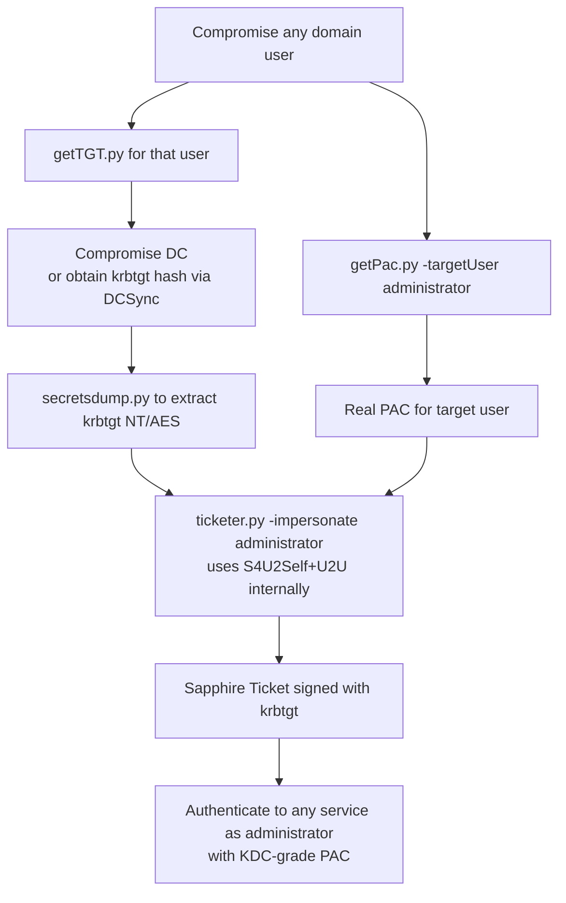

title: "getPac.py"
script: "examples/getPac.py"
category: "Kerberos Attacks"
status: "Published"
protocols:
  - Kerberos
ms_specs:
  - MS-SFU
  - MS-PAC
  - MS-KILE
ietf_specs:
  - RFC 4120
  - draft-ietf-cat-user2user-02
mitre_techniques:
  - T1558.003
  - T1087.002
auth_types:
  - password
  - ntlm
  - kerberos
  - aes
tags:
  - impacket
  - impacket/examples
  - category/kerberos
  - status/published
  - protocol/kerberos
  - ms-spec/ms-sfu
  - ms-spec/ms-pac
  - technique/s4u2self
  - technique/u2u
  - technique/pac_retrieval
  - technique/sapphire_ticket_foundation
  - auth/ntlm
  - auth/kerberos
  - mitre/T1558.003
  - mitre/T1087.002
aliases:
  - getpac
  - impacket-getpac


# getPac.py

> **One line summary:** Retrieves the Privilege Attribute Certificate (PAC) of an arbitrary target user using only standard authenticated user credentials, by combining `[MS-SFU]` Service for User to Self (S4U2Self) with the User to User (U2U) Kerberos extension to obtain a TGS that the requesting user can decrypt; the response contains the target's PAC including their KERB_VALIDATION_INFO (full SID and group memberships), PAC_CLIENT_INFO, and optionally PAC_UPN_DNS_INFO; written by Alberto Solino (`@agsolino`) with credit to Benjamin Delpy (`@gentilkiwi`) for the original idea (or accidental discovery) of combining U2U inside S4USelf; this exact technique is the foundation of **Sapphire Tickets** (a stealthier variant of Golden Tickets that uses a real PAC instead of a fabricated one), implemented in [`ticketer.py`](ticketer.md)'s `-impersonate` option which calls the same `getKerberosS4U2SelfU2U()` function under the hood; continues Kerberos Attacks at 5 of 9 articles.

| Field | Value |
|:---|:---|
| Script | `examples/getPac.py` |
| Category | Kerberos Attacks |
| Status | Published |
| Author | Alberto Solino (`@agsolino`); original technique discovery credited to Benjamin Delpy (`@gentilkiwi`) |
| Primary protocol | Kerberos (TCP/UDP 88) |
| Primary Microsoft specifications | `[MS-SFU]` Service for User Protocol, `[MS-PAC]` Privilege Attribute Certificate Data Structure, `[MS-KILE]` Kerberos Protocol Extensions |
| Relevant IETF references | RFC 4120 (Kerberos V5), `draft-ietf-cat-user2user-02` (User-to-User authentication) |
| MITRE ATT&CK techniques | T1558.003 Steal or Forge Kerberos Tickets: Kerberoasting (related machinery), T1087.002 Account Discovery: Domain Account |
| Authentication types supported | NTLM password, NTLM hash, Kerberos AES key |


## Prerequisites

This article builds directly on:

- [`getTGT.py`](getTGT.md) for Kerberos exchange basics, ccache format, and TGT acquisition.
- [`ticketer.py`](ticketer.md) for PAC structure, KERB_VALIDATION_INFO contents, PAC signature mechanics (server checksum and privsvr checksum), Golden and Silver Ticket theory, and the Sapphire Ticket variant which is built directly on the technique getPac.py implements.
- [`getST.py`](getST.md) for the broader S4U2Self / S4U2Proxy story including delegation, SPN substitution, and the `[MS-SFU]` protocol family.
- [`GetUserSPNs.py`](../01_recon_and_enumeration/GetUserSPNs.md) for the foundational Kerberos cast of characters (KDC, AS, TGS, principals, realms).
- [`00_Introduction_and_Architecture.md`](Introduction_and_Architecture.md) for the overall Impacket architecture.

Familiarity with PAC layout (KERB_VALIDATION_INFO, PAC_CLIENT_INFO, PAC_SIGNATURE_DATA, PAC_UPN_DNS_INFO) is strongly recommended. See ticketer.py for the foundational PAC primer.


## What it does

`getPac.py` produces the PAC of an arbitrary target user by abusing the S4U2Self + U2U Kerberos primitive. Run as any authenticated domain user:

```text
$ getPac.py -targetUser administrator ACME.LOCAL/lowpriv:Passw0rd!
Impacket v0.14.0.dev0 - Copyright Fortra, LLC and its affiliated companies
[*] Getting TGT for user
[*] Doing S4U2self+U2U for administrator
[*] Unmarshalling PAC

KERB_VALIDATION_INFO
LogonTime: 2026-04-21 13:42:18
LogoffTime: never
KickOffTime: never
PasswordLastSet: 2025-08-14 09:14:22
PasswordCanChange: 2025-08-15 09:14:22
PasswordMustChange: never
EffectiveName: administrator
FullName: Administrator
LogonScript:
ProfilePath:
HomeDirectory:
HomeDirectoryDrive:
LogonCount: 4128
BadPasswordCount: 0
UserId: 500
PrimaryGroupId: 513
GroupCount: 5
GroupIds:
    Relative ID: 513, Attributes: 7
    Relative ID: 512, Attributes: 7
    Relative ID: 520, Attributes: 7
    Relative ID: 518, Attributes: 7
    Relative ID: 519, Attributes: 7
UserFlags: 32
UserSessionKey: 00000000000000000000000000000000
LogonServer: DC01
LogonDomainName: ACME
LogonDomainId: S-1-5-21-1234567890-1234567890-1234567890
...

PAC_CLIENT_INFO
ClientId: 2026-04-21 14:30:00
NameLength: 26
Name: administrator

PAC_UPN_DNS_INFO
Flags: 0
Upn: administrator@acme.local
DnsDomain: ACME.LOCAL
```

The output is the unmarshalled PAC structure for the target user, retrieved purely through Kerberos protocol exchanges with zero LDAP queries. The requesting user only needs:

- A valid TGT (or credentials to obtain one).
- Knowledge of the target's principal name.
- Network reach to the KDC.

No special privileges. No DCSync rights. No Replicating Directory Changes ACE. The PAC of any user in the domain (including Administrator, Domain Admins, krbtgt) is recoverable by any authenticated user.

### Why this is interesting

Three properties make this technique notable:

1. **It bypasses LDAP entirely.** Conventional user enumeration tools (GetADUsers.py, BloodHound, PowerView) read user attributes via LDAP. getPac.py reads them via Kerberos S4U2Self. Defenders watching LDAP for enumeration patterns may miss this entirely.
2. **It returns the PAC, not just the LDAP attributes.** The PAC contains the resolved group membership at logon time, not just `memberOf` from the user object. This is the same data the user would present at any service authentication. For attackers planning impersonation, the PAC is the more interesting output because it directly reveals what tokens the target will produce.
3. **It is the building block for Sapphire Tickets.** Sapphire Tickets, introduced as a stealthier alternative to Golden Tickets, use a real PAC obtained via this exact technique. The PAC matches what the KDC would produce for that user normally, making Sapphire Tickets indistinguishable from legitimate KDC-issued tickets except by deep cryptographic inspection.

The script's existence in Impacket is a teaching tool more than an operational one. For practical work, the technique is more often invoked as a step inside `ticketer.py -impersonate` (Sapphire Ticket creation) than as a standalone PAC retrieval.


## Why it exists

The PAC question has multiple answers depending on the operator's goal. getPac.py supports several use cases:

- **Targeted reconnaissance without LDAP.** Need to know what groups Administrator belongs to, or whether a specific user has admin RIDs in their token, but want to avoid LDAP enumeration patterns. S4U2Self reveals the canonical PAC.
- **Sapphire Ticket prerequisites.** Constructing a Sapphire Ticket requires the target user's PAC. ticketer.py invokes the same machinery internally, but getPac.py exposes it directly for inspection or scripted workflows.
- **PAC research and tooling development.** Anyone implementing PAC parsing, building detection rules for forged PACs, or studying the PAC structure benefits from a tool that produces real PACs on demand.
- **Cross-checking forged tickets.** When validating that a Golden or Silver Ticket has the right PAC structure, comparing against a real PAC obtained via getPac.py is the gold standard.
- **Detecting PAC differences across users.** Comparing PACs from different accounts (admin vs regular user, service account vs human account) reveals the differences in group membership, UAC flags, and other PAC fields that affect access.

Alberto Solino added getPac.py to Impacket relatively early in the project's life as a demonstration of the S4U2Self + U2U combination. The script credits Benjamin Delpy with the original discovery: combining U2U inside S4USelf was apparently noticed by Delpy during mimikatz development. Delpy's mimikatz `kerberos::list /tickets` and related commands implement the same primitive on Windows; getPac.py is the equivalent in Python that runs across platforms.

The technique sat as a useful but underexploited primitive for years. Its prominence increased substantially when researchers (notably Charlie Bromberg and Edouard Bochin) published the Sapphire Ticket attack in 2022, which used getPac.py's exact technique as a building block to produce stealthier Golden Tickets.


## Kerberos protocol theory: S4U2Self + U2U

Building this technique from first principles requires three Kerberos extensions: S4U2Self, U2U, and the standard PAC inclusion in tickets. This section walks through each, then shows how they combine.

### Kerberos exchanges quick recap

For background, see [`GetUserSPNs.py`](../01_recon_and_enumeration/GetUserSPNs.md). Briefly:

- **AS-REQ → AS-REP**: client authenticates to KDC, receives TGT (krbtgt service ticket). The TGT is encrypted with the krbtgt account's key and contains the client's PAC.
- **TGS-REQ → TGS-REP**: client presents TGT to KDC, requests service ticket for some service. KDC returns service ticket encrypted with the service's account key, containing the client's PAC.
- **AP-REQ**: client presents service ticket to service. Service decrypts with its own key.

The PAC is included in service tickets (and TGTs). It contains the user's identity, group memberships, and signed checksums.

### S4U2Self (Service for User to Self)

S4U2Self is a Kerberos extension defined in `[MS-SFU]` that lets a service request a service ticket FOR ANOTHER USER to itself. The semantics:

- Service S has its own TGT (or credentials).
- Service S sends a TGS-REQ asking for a service ticket where the client identity is "user U" instead of S itself.
- KDC returns a service ticket with U's PAC, but encrypted to S's own key.

Original purpose: protocol transition. A web service authenticates a user via NTLM, then needs a Kerberos ticket on that user's behalf to access a backend. S4U2Self lets the web service obtain such a ticket without having the user's password.

The TGS-REQ for S4U2Self includes a `PA-FOR-USER` PA-DATA (`PA_FOR_USER_ENC`) padata structure with the impersonation target's name and a checksum.

Critically, **any account with a TGT can issue S4U2Self requests**. Microsoft restricted this before 2021 only when the target requested tickets across realms (which is why goldenPac and similar attacks worked). The S4U2Self within a single realm has remained accessible to any authenticated user.

### U2U (User to User)

U2U (User to User) is a Kerberos extension defined in IETF `draft-ietf-cat-user2user-02`. It addresses a specific use case: authenticating a user to a peer service that does not have a long term key registered with the KDC.

Normal Kerberos requires the service to have a known long term key (the SPN's account password, derived to AES/RC4 keys). U2U removes that requirement: the service ticket is encrypted not with the service's long term key but with the **session key from the service's own TGT**. The peer (acting as the service) presents its TGT in the TGS-REQ as additional `additional-tickets` data; the KDC encrypts the response with that TGT's session key.

Original use case: authentication between peers where neither peer has a registered SPN.

The U2U bit in the TGS-REQ is the `kdc-options` flag `enc-tkt-in-skey` (encrypt-ticket-in-session-key). When set, the KDC reads the additional ticket from `additional-tickets[0]`, extracts its session key, and uses that as the encryption key for the new service ticket.

### The combination: S4U2Self + U2U

The key insight (per Delpy via Solino's credit): you can ask for an S4U2Self ticket AND request U2U at the same time. The semantics become:

- Requesting user R has TGT_R.
- R issues TGS-REQ:
  - `PA-FOR-USER` = target user T (S4U2Self semantics, asking for T's identity in the ticket)
  - `kdc-options` includes `enc-tkt-in-skey` (U2U semantics)
  - `additional-tickets[0]` = TGT_R (R's own TGT, supplying the session key for U2U)
  - sname = R's own principal (the requirement that the service is the requester itself)
- KDC processes:
  - Validates R's TGT.
  - Generates a service ticket for principal T (per S4U2Self).
  - Encrypts the ticket using TGT_R's session key (per U2U), instead of R's long term key.
- Response: a service ticket containing T's PAC, encrypted to a key R already knows.

R can decrypt the response. The PAC inside is T's PAC. **R has obtained an arbitrary user's PAC using only their own credentials.**

### Why this works

Reading this through, the natural question is "why is this allowed?". The combination is permitted because each piece individually has legitimate use:

- S4U2Self exists for protocol transition, intentionally allowing services to construct tickets for arbitrary users.
- U2U exists for authentication between peers, intentionally allowing tickets to be encrypted with TGT session keys.
- Each is restricted by separate validity rules. S4U2Self requires the requester have a TGT; U2U requires the additional ticket be a valid TGT for the requester. Both are satisfied trivially.

The combination is unintended in the sense that it was not designed as a feature, but it is permitted because no rule explicitly forbids it. The PAC retrieval emerges as a side effect of two compatible extensions.

Microsoft has not patched the technique because it produces a ticket the user could obtain anyway via legitimate means (logon to a service that creates tokens for them). The PAC's contents are not secret in principle; they are what the user authenticates with everywhere. The technique just makes the PAC accessible without requiring the target to log in or any service to be involved.

### S4U2Self alone vs S4U2Self + U2U

Without U2U, S4U2Self returns a ticket encrypted with R's own long term key (R is "the service" being targeted). R can decrypt that ticket too, but on Windows, R's long term key is the machine account password if R is a computer, or the password-derived key for the user if R is a user. For a workstation, the user does not normally know the machine account password.

With U2U, R encrypts to its TGT session key, which is always available to R regardless of whether R is a user or computer account, and regardless of whether R knows its own long term key. **U2U is the bit that makes the technique work for any authenticated principal**, not just principals whose long term keys are known to the operator.

This is the "accidental discovery" Delpy made: U2U turns S4U2Self from a niche primitive for protocol transition into a universal PAC retrieval mechanism.


## How the tool works internally

The script is straightforward Kerberos protocol code. About 350 lines.

### Imports

The relevant Impacket modules:

```python
from impacket.krb5.asn1 import AP_REQ, AS_REP, TGS_REQ, Authenticator, TGS_REP, \
    seq_set, seq_set_iter, PA_FOR_USER_ENC, EncTicketPart, AD_IF_RELEVANT, Ticket as TicketAsn1
from impacket.krb5.crypto import Key, _enctype_table, _HMACMD5, Enctype
from impacket.krb5.kerberosv5 import getKerberosTGT, sendReceive
from impacket.krb5.pac import PACTYPE, PAC_INFO_BUFFER, KERB_VALIDATION_INFO, \
    PAC_CLIENT_INFO_TYPE, PAC_CLIENT_INFO, PAC_SERVER_CHECKSUM, PAC_SIGNATURE_DATA, \
    PAC_PRIVSVR_CHECKSUM, PAC_UPN_DNS_INFO, UPN_DNS_INFO
```

Notable: imports the full PAC parsing machinery, the AD_IF_RELEVANT decoder for extracting authorization-data, and the PA_FOR_USER_ENC structure for S4U2Self.

### Flow

1. **Argument parsing.** `identity` (domain/user:password), `-targetUser`, `-hashes`, `-aesKey`, `-kdcHost`, `-debug`, `-ts`.

2. **Get TGT for the requesting user.** Uses `getKerberosTGT(userName, password, domain, lmhash, nthash, aesKey, kdcHost)`. Result is `(tgt, cipher, oldSessionKey, sessionKey)`.

3. **Build the TGS-REQ for S4U2Self + U2U.**
   - Construct an AP-REQ wrapping the TGT (this is the authentication portion of the TGS-REQ).
   - Build the `PA-FOR-USER` padata with the target user's name and the appropriate checksum (HMAC-MD5 over the impersonation data, keyed with the TGT session key).
   - Set `req-body['kdc-options']` to include `enc-tkt-in-skey` flag.
   - Set `req-body['sname']` to the requesting user's own principal (because S4U2Self targets oneself).
   - Set `req-body['additional-tickets'][0]` to the TGT itself (supplying its session key for U2U).
   - Encode and send to KDC on port 88.

4. **Receive TGS-REP.** Parse the response as TGS_REP.

5. **Decrypt the service ticket's encrypted part.** Using the TGT session key (per U2U), decrypt `enc-part` of the ticket inside the TGS-REP. The decrypted content is an `EncTicketPart` ASN.1 structure.

6. **Extract authorization-data.** The decrypted ticket has `authorization-data` containing one or more `AuthorizationDataElement` entries. The first is typically `AD-IF-RELEVANT` (type 1).

7. **Decode AD-IF-RELEVANT to get the PAC.** AD-IF-RELEVANT wraps inner authorization data; the inner data of type `AD_WIN2K_PAC` (128) contains the PAC blob.

```python
adIfRelevant = decoder.decode(
    encTicketPart['authorization-data'][0]['ad-data'],
    asn1Spec=AD_IF_RELEVANT()
)[0]
pacType = PACTYPE(adIfRelevant[0]['ad-data'].asOctets())
```

8. **Parse the PAC.** Iterate `pacType['Buffers']`. Each entry has a `ulType` indicating which PAC info buffer it is (1=KERB_VALIDATION_INFO, 10=PAC_CLIENT_INFO, 6=PAC_SERVER_CHECKSUM, 7=PAC_PRIVSVR_CHECKSUM, 12=PAC_UPN_DNS_INFO, etc.) and a `Offset` + `cbBufferSize` pointing into the PAC data section.

9. **For each buffer type, decode and print.**
   - `KERB_VALIDATION_INFO` (NDR-marshalled): unmarshal with TypeSerialization1 wrapper, then dump fields (LogonTime, EffectiveName, UserId, PrimaryGroupId, GroupIds, LogonDomainId SID, etc.).
   - `PAC_CLIENT_INFO`: ClientId timestamp + name.
   - `PAC_SERVER_CHECKSUM` and `PAC_PRIVSVR_CHECKSUM`: signature buffers (typically just printed as length, not validated).
   - `PAC_UPN_DNS_INFO`: UPN, DNS domain, optional SAM name and SID.

That is the entire flow. The script is short because it leverages Impacket's PAC parsing infrastructure. The cleverness is in step 3 (the request construction); steps 5 through 9 are reading what the KDC returned.

### What's NOT validated

The script does not verify the PAC checksums. That would require knowing the krbtgt key (PAC_PRIVSVR_CHECKSUM is signed with krbtgt) and the service key (PAC_SERVER_CHECKSUM is signed with the service account; for the U2U case, this is the requesting user's own key). Validation would close the loop on detecting forged PACs but is unnecessary for the script's purpose (just retrieving the PAC).

### KB5008380 / CVE-2021-42287 implications

In November 2021, Microsoft released KB5008380 to address CVE-2021-42287, the "sAMAccountName impersonation" vulnerability that allowed certain S4U2Self abuses to escalate to domain admin. The patch added validation that the principal in the PA_FOR_USER must exist in AD as the precise name requested.

This patch did NOT break getPac.py. The S4U2Self request asks for a real user; the user exists in AD with that exact name; validation passes. The patch broke a specific abuse spanning protocols, not the general S4U2Self capability.

The KB5008380 patches are background context for understanding "why doesn't getPac.py just work to escalate to Administrator". The answer is that getPac retrieves the PAC, but does not produce a usable ticket as Administrator (the ticket is encrypted to the requester's TGT session key, decryptable only by the requester, and presented as proof of the requester's identity not the target's).


## Authentication options

Same as other tools focused on Kerberos:

- NTLM password: `getPac.py -targetUser admin DOMAIN/user:password`
- NTLM hash: `getPac.py -targetUser admin -hashes LM:NT DOMAIN/user`
- Kerberos AES key: `getPac.py -targetUser admin -aesKey <hex> DOMAIN/user`

The tool needs to obtain a TGT for the requesting user before issuing the S4U2Self+U2U TGS-REQ. Any working authentication method does.

The target user does not need to be authenticated; the requester does not need any special access to the target. The only requirement is the target principal exists in AD.


## Practical usage

### Basic PAC retrieval

```bash
getPac.py -targetUser administrator ACME.LOCAL/lowpriv:Passw0rd!
```

Returns Administrator's PAC. The lowpriv user only needs to be a domain user.

### Retrieve PAC of a Domain Controller

```bash
getPac.py -targetUser DC01\$ ACME.LOCAL/lowpriv:Passw0rd!
```

Computer accounts can be targeted too. The `\$` escapes the shell's variable expansion. The DC's PAC is interesting because it shows the DC's group memberships, including Domain Controllers, Enterprise Domain Controllers, and similar groups.

### Use NTLM hash auth

```bash
getPac.py -targetUser administrator -hashes :a87f3a337d73085c45f9416be5787d86 ACME.LOCAL/lowpriv
```

When you have the requester's NT hash but not the password.

### Use Kerberos AES key

```bash
getPac.py -targetUser administrator -aesKey 1A2B3C... ACME.LOCAL/lowpriv
```

For environments enforcing AES-only Kerberos.

### Compare PACs between accounts

```bash
for user in administrator krbtgt DC01\$ svc_sql; do
  echo "=== PAC for $user ==="
  getPac.py -targetUser "$user" ACME.LOCAL/lowpriv:Passw0rd! 2>/dev/null
done > pac_comparison.txt
```

Iterate over interesting principals to compare their group memberships and PAC contents.

### Save raw PAC for later use

The script prints unmarshalled output; for capturing the raw PAC bytes you would need to modify the script slightly to write `adIfRelevant[0]['ad-data'].asOctets()` to a file. The raw PAC is what ticketer.py needs as input for Sapphire Ticket construction.

### Key flags

| Flag | Meaning |
|:---|:---|
| `identity` (positional) | `[domain/]username[:password]`, the requesting user. |
| `-targetUser <n>` | The user whose PAC you want to retrieve. |
| `-hashes LM:NT` | NTLM hash auth for the requester. |
| `-aesKey <hex>` | Kerberos AES key auth for the requester. |
| `-kdcHost <host>` | Override KDC discovery. |
| `-debug`, `-ts` | Verbose/timestamp logging. |

Minimal flag surface. The technique is sufficient unto itself; few options needed.


## What it looks like on the wire

### TGS-REQ structure

The S4U2Self + U2U TGS-REQ is the distinctive packet. A normal TGS-REQ carries `req-body['sname']` set to the desired service principal. This one has:

- `pvno = 5`, `msg-type = TGS_REQ`
- `padata`:
  - `PA-TGS-REQ` containing the AP-REQ wrapping the requester's TGT
  - `PA-FOR-USER` containing the impersonation target's name + checksum
- `req-body`:
  - `kdc-options`: includes `enc-tkt-in-skey` (bit 28)
  - `cname` = requester's name
  - `realm` = domain
  - `sname` = requester's own principal name
  - `additional-tickets[0]` = requester's TGT

The combination of `PA-FOR-USER` padata + `enc-tkt-in-skey` kdc-option + sname=self is the fingerprint of this technique.

### TGS-REP structure

Standard TGS-REP, but the encrypted ticket inside is decryptable with the requester's TGT session key (not their long term key). The ticket's `cname` is the impersonation target. The PAC inside is the target's.

### Wireshark filters

```text
kerberos                                     # all Kerberos
kerberos.msg_type == 12                      # TGS-REQ
kerberos.padata-type == 129                  # PA-FOR-USER (decimal 129)
kerberos.kdc-options                         # examine kdc-options bits
```

For deeper inspection, Wireshark's Kerberos dissector decodes `PA-FOR-USER` and shows the impersonation target. With keytab loaded, it can decrypt the ticket and show the PAC contents directly.

### What's NOT distinctive

The traffic looks like normal S4U2Self at the byte level. The U2U bit and the additional-ticket are present but not glaringly different from legitimate S4U flows. Detection by network inspection alone is hard without context (which accounts use S4U2Self in normal operation, against which targets, with what frequency).


## What it looks like in logs

### Event 4769, Kerberos service ticket request

Each S4U2Self+U2U request produces an Event 4769 on the DC (assuming Kerberos authentication auditing is enabled). Key fields:

- **Account Name**: the requester.
- **Service Name**: the requester's own SPN (because sname=self).
- **Failure Code**: 0x0 if successful.
- **Ticket Encryption Type**: typically AES (0x12) or RC4 (0x17).

The signature pattern: 4769 events where Account Name equals Service Name (the request targets the requester's own account). This is unusual in normal operation. Most legitimate 4769s have Account Name = the user, Service Name = some other service the user is accessing.

The 4769 does NOT directly indicate S4U2Self vs U2U; those flags are not in the event log fields. But the pattern of targeting one's own account is a strong signal.

### Event 4768, Kerberos TGT request

The requester needed a TGT first. Each getPac.py run produces a 4768 (TGT issued) plus the 4769 for the S4U2Self+U2U TGS-REQ.

### Microsoft Defender for Identity (MDI)

MDI has specific detections for S4U2Self abuse and Sapphire Ticket creation. The combination of:

- TGS-REQ with PA-FOR-USER
- sname matching the requester's own principal
- enc-tkt-in-skey kdc-option

…is observable to MDI, which has visibility into Kerberos message contents (via deep packet inspection at the DC). MDI rules specifically watch for this combination as a Sapphire Ticket precursor. Whether they reliably fire depends on MDI version and tuning.

### Starter Sigma rules

```yaml
title: Self-Targeted Kerberos Service Ticket Request (Possible S4U2Self+U2U PAC Retrieval)
logsource:
  product: windows
  service: security
detection:
  selection:
    EventID: 4769
  condition: selection and SubjectUserName == ServiceName
  filter_normal:
    SubjectUserName|endswith:
      - 'authorized_protocol_transition_service'
  condition: selection and not filter_normal
level: medium
```

Detects 4769s where the subject and service are the same account. False positive surface includes legitimate S4U2Self use cases (some web service protocol transition flows).

```yaml
title: Multiple Self-Targeted 4769 from Single User
logsource:
  product: windows
  service: security
detection:
  selection:
    EventID: 4769
  condition: selection and SubjectUserName == ServiceName
  timeframe: 5m
  aggregation: count() by SubjectUserName > 5
level: high
```

Aggregation rule for repeated S4U2Self activity from one account. Five 4769s targeting the requester's own account in five minutes is well above legitimate baseline for most accounts.

```yaml
title: Service Ticket Request with PA-FOR-USER and U2U Flags
logsource:
  product: zeek
  service: kerberos
detection:
  selection:
    msg_type: 12
    padata|contains: 'PA-FOR-USER'
    kdc_options|contains: 'enc-tkt-in-skey'
  level: high
```

Detection at the network layer requiring Kerberos protocol decoding. Catches the combination specific to this technique at the wire layer. Requires Zeek with the Kerberos analyzer enabled.


## Detection and defense

### Detection opportunities

- **Self targeted 4769 events.** The most accessible signal. Any account showing ServiceName == SubjectUserName in 4769 logs warrants investigation. Legitimate self targeting is rare in human account use; service accounts doing protocol transition can produce false positives.
- **Network-layer PA-FOR-USER + enc-tkt-in-skey combination.** Distinctive signature for tools that have visibility into Kerberos protocol contents (Zeek, MDI, Defender for Endpoint with appropriate sensors).
- **Subsequent Sapphire Ticket activity.** PAC retrieval is rarely an end in itself; usually it precedes Sapphire Ticket creation. Detecting the followup ticket use (TGS-REQs with the obtained PAC against high-value services) provides the broader context for distinguishing reconnaissance from active attack.
- **MDI Sapphire Ticket detection.** Specifically tuned for this pattern. Where MDI is deployed, its detections are usually higher-fidelity than custom rules.

### Preventive controls

There is no clean preventive control for getPac.py specifically. The technique uses two protocol features that are part of standard Kerberos. Mitigations focus on related attacks rather than the PAC retrieval itself:

- **Enforce Kerberos armoring (FAST).** Adds an outer encryption layer to AS-REQ/AS-REP, raising the bar for some Kerberos attacks. Does not stop S4U2Self+U2U directly (TGS-REQs are authenticated already) but is good general hygiene.
- **Restrict S4U2Self use.** Microsoft's `userAccountControl` flag `TRUSTED_TO_AUTH_FOR_DELEGATION` (constrained delegation with protocol transition) controls who can do S4U2Self for use across protocols. However, the `[MS-SFU]` specification permits any account to issue S4U2Self requests against itself; restriction at the protocol level is incomplete.
- **Rotate krbtgt regularly.** Limits the value of any successful Sapphire Ticket (which would be encrypted using the krbtgt key at the time of forgery). Twice yearly rotation is the recommended cadence; many environments do this poorly.
- **Tier 0 isolation.** Limits which accounts have credentials reachable by attackers in the first place. The PAC retrieval is "free" once any domain user is compromised, so the prevention layer is keeping every domain user account secure.
- **Detection over prevention.** This is one of the cases where "detect, do not prevent" is the right framing. Prevention requires breaking standard Kerberos features; detection is feasible without that cost.

### What getPac.py does NOT do

- Does not produce a usable ticket as the target user. The ticket returned is encrypted to the requester's TGT session key and represents the requester's identity (despite carrying the target's PAC). It cannot be presented as an authentication proof of the target.
- Does not bypass MFA on the target account. The target never authenticates.
- Does not require any special privileges on the target. Any authenticated domain user can run it against any principal.
- Does not modify the target's account in any way. Pure read primitive at the protocol layer.
- Does not validate PAC signatures. Returns the PAC for inspection without checking checksums.

### The Sapphire Ticket connection

The PAC obtained via getPac.py is exactly the input ticketer.py needs for `-impersonate` (Sapphire Ticket creation). The sequence is:

1. Compromise any domain user.
2. Obtain krbtgt hash (via DCSync, NTDS dump, or other mechanism, which is the harder step).
3. Run getPac.py against the target user to obtain their real PAC.
4. Construct a Golden Ticket using that real PAC, signed with krbtgt.

The result is a Golden Ticket whose PAC matches what the KDC would actually generate for that user, instead of the synthetic PAC older Golden Ticket implementations created. The Sapphire Ticket is harder to detect because:

- Group membership matches reality.
- UAC flags match reality.
- Logon timestamps are plausible.
- PAC signature validates correctly (because krbtgt-signed PACs are accepted regardless of contents).

ticketer.py implements this internally by calling `self.getKerberosS4U2SelfU2U()` (the same function getPac.py uses) when `-impersonate` is specified. The PAC retrieval is invisible in ticketer's flow but is the exact technique getPac.py teaches.

For the defender: detecting the underlying getPac.py / S4U2Self+U2U pattern is therefore valuable BEFORE the krbtgt has been compromised, because it indicates an attacker is preparing to forge tickets. 4769s targeting the requester's own account, from accounts that have no legitimate reason to do S4U2Self, are a useful early warning.


## Related tools and attack chains

`getPac.py` continues Kerberos Attacks at **5 of 9 articles**.

### Related Impacket tools

- [`ticketer.py`](ticketer.md) **uses this exact technique internally.** The `-impersonate` flag invokes `getKerberosS4U2SelfU2U()` to obtain the target user's PAC for Sapphire Ticket construction. Reading getPac.py and ticketer.py together fully explains Sapphire Tickets.
- [`getST.py`](getST.md) is the broader S4U-family tool covering S4U2Self alone and S4U2Self + S4U2Proxy chains for delegation attacks. getPac uses S4U2Self; getST uses both stages of S4U.
- [`getTGT.py`](getTGT.md) is the prerequisite for getPac (you need a TGT for the requester). Often run first to populate KRB5CCNAME.
- [`secretsdump.py`](../03_credential_access/secretsdump.md) is the typical source of the krbtgt hash needed for Sapphire Ticket creation. getPac retrieves the PAC; secretsdump gives the krbtgt key; ticketer combines them.
- [`raiseChild.py`](raiseChild.md) is the escalation tool that crosses realms. Uses different Kerberos primitives (ExtraSids in tickets between realms) to achieve domain compromise. Complementary technique; both are in the Kerberos Attacks toolkit.

### External alternatives

- **`mimikatz`** by Benjamin Delpy at `https://github.com/gentilkiwi/mimikatz`. The original implementation of the S4U2Self+U2U combination on Windows. `mimikatz # kerberos::list /tickets` and related commands surface PAC information. mimikatz also implements Sapphire Tickets directly via `kerberos::golden /sapphire`.
- **Rubeus** at `https://github.com/GhostPack/Rubeus`. Alternative S4U toolkit on Windows. Supports S4U2Self+U2U for PAC retrieval and Sapphire Ticket creation via `Rubeus tgtdeleg` and related commands.
- **kekeo** by Delpy at `https://github.com/gentilkiwi/kekeo`. Earlier Windows implementation of various Kerberos primitives including S4U.

For Windows operations, mimikatz and Rubeus are the standard; getPac.py serves as the Python reference implementation runnable across platforms from Linux attack hosts.

### Sapphire Ticket attack chain



The chain shows getPac.py's role: it is the PAC retrieval step. ticketer.py incorporates the same primitive internally for `-impersonate`, but exposing it standalone allows for inspection, scripting, and clearer understanding of the technique.

### Comparative framing: Golden vs Silver vs Sapphire

| Attribute | Golden Ticket | Silver Ticket | Sapphire Ticket |
|:---|:---|||
| Forged with | krbtgt key | service account key | krbtgt key |
| Targets | KDC trust | specific service | KDC trust |
| Lateral reach | any service | one service | any service |
| PAC source | fabricated | fabricated | real (via S4U2Self+U2U) |
| Detection | PAC contents unusual | can be done at high fidelity | very low (real PAC) |
| Implementation | mimikatz/ticketer.py | mimikatz/ticketer.py | mimikatz `/sapphire` or ticketer.py `-impersonate` |

The Sapphire variant's defining characteristic is the real PAC. Everything else (krbtgt forgery, KDC trust abuse) is identical to a Golden Ticket. The PAC is what makes detection harder.


## Further reading

- **`[MS-SFU]`: Service for User Protocol** at `https://learn.microsoft.com/en-us/openspecs/windows_protocols/ms-sfu/`. Defines S4U2Self and S4U2Proxy.
- **`[MS-PAC]`: Privilege Attribute Certificate Data Structure** at `https://learn.microsoft.com/en-us/openspecs/windows_protocols/ms-pac/`. The PAC structure reference.
- **`[MS-KILE]`: Kerberos Protocol Extensions** at `https://learn.microsoft.com/en-us/openspecs/windows_protocols/ms-kile/`. Microsoft's Kerberos extensions including PAC handling.
- **RFC 4120: Kerberos Network Authentication Service (V5).** The base Kerberos standard.
- **`draft-ietf-cat-user2user-02`** at `https://tools.ietf.org/html/draft-ietf-cat-user2user-02`. The U2U extension.
- **"Sapphire Ticket Technique"** by Charlie Bromberg and Edouard Bochin on the Synacktiv blog at `https://www.synacktiv.com/publications/sapphire-tickets`. The original Sapphire Ticket writeup.
- **"Pixis (Aetsu) PAC research"** at `https://github.com/aetsu/`. Various PAC-focused research and tooling.
- **Benjamin Delpy's mimikatz documentation** at `https://github.com/gentilkiwi/mimikatz/wiki`. S4U2Self and Sapphire Ticket commands.
- **Will Schroeder's "I Have the Power" series** at `https://posts.specterops.io/`. Foundational explainers on PAC, S4U, and ticket forgery.
- **Impacket getPac.py source** at `https://github.com/fortra/impacket/blob/master/examples/getPac.py`. About 350 lines, readable.
- **MITRE ATT&CK T1558.003 Kerberoasting** at `https://attack.mitre.org/techniques/T1558/003/`. Related Kerberos ticket abuse technique (the technique is for ticket cracking but the broader S4U/PAC manipulation family is closely related).

If you want to internalize this technique, the best exercise has three parts. First, capture a getPac.py run against a lab DC with Wireshark and decode the TGS-REQ in detail: locate the PA-FOR-USER padata, observe the kdc-options bit pattern containing enc-tkt-in-skey, find the additional-tickets entry containing the requester's TGT. Second, modify getPac.py to dump the raw PAC bytes to a file (one line addition near the AD-IF-RELEVANT decode), then load that PAC into ticketer.py to construct a Sapphire Ticket. Compare the resulting ticket against a Golden Ticket built without `-impersonate`; observe how the PAC contents differ. Third, run mimikatz on Windows performing the same S4U2Self+U2U operation with `kerberos::golden /sapphire` and compare the network traffic against getPac.py's. The pattern at the wire level is identical; the implementations are independent. After these three exercises, the S4U2Self+U2U primitive is fully internalized and the relationship between getPac.py, ticketer.py `-impersonate`, mimikatz Sapphire Tickets, and the broader PAC ecosystem is clear.
