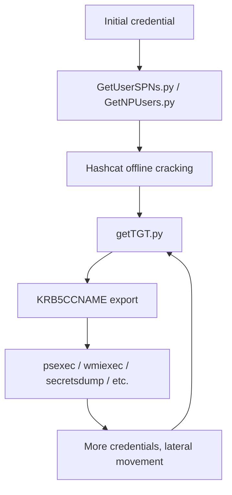

title: "getTGT.py"
script: "examples/getTGT.py"
category: "Kerberos Attacks"
status: "Published"
protocols:
  - Kerberos
  - MS-KILE
ms_specs:
  - MS-KILE
  - RFC 4120
  - RFC 4757
  - RFC 5545
mitre_techniques:
  - T1550.003
  - T1078.002
  - T1558
auth_types:
  - password
  - nt_hash
  - aes_key
tags:
  - impacket
  - impacket/examples
  - category/kerberos_attacks
  - status/published
  - protocol/kerberos
  - authentication/kerberos
  - authentication/ntlm
  - technique/pass_the_ticket
  - technique/pass_the_hash
  - technique/pass_the_key
  - technique/over_pass_the_hash
  - mitre/T1550/003
  - mitre/T1078/002
  - mitre/T1558
aliases:
  - getTGT
  - impacket-getTGT
  - asktgt


# getTGT.py

> **One line summary:** Requests a Kerberos Ticket Granting Ticket from a domain controller using a password, NT hash, or AES key, and saves it as a ccache file that any Kerberos aware tool can use for subsequent authentication.

| Field | Value |
|:---|:---|
| Script | `examples/getTGT.py` |
| Category | Kerberos Attacks |
| Status | Published |
| Primary protocols | Kerberos |
| Primary Microsoft specifications | `[MS-KILE]`, RFC 4120, RFC 4757 |
| MITRE ATT&CK techniques | T1550.003 Pass the Ticket, T1078.002 Domain Accounts, T1558 Steal or Forge Kerberos Tickets |
| Authentication types supported | Password, NT hash (over pass the hash), AES key (pass the key) |
| First appearance in Impacket | 2014 |
| Original authors | Alberto Solino (`@agsolino`) |
## Prerequisites

This article assumes you have already read:

- [`00_Introduction_and_Architecture.md`](Introduction_and_Architecture.md) for the Impacket stack overview.
- [`smbclient.py`](../05_smb_tools/smbclient.md) for the four authentication modes.
- [`GetUserSPNs.py`](../01_recon_and_enumeration/GetUserSPNs.md) for the Kerberos foundations: AS exchange, TGS exchange, AP exchange, encryption types, the PAC, and long term keys. **The protocol theory section here is short because that article carries the load.**

If you are reading this immediately after [`GetNPUsers.py`](../01_recon_and_enumeration/GetNPUsers.md) or [`GetUserSPNs.py`](../01_recon_and_enumeration/GetUserSPNs.md), you have likely just cracked a password. This is the next tool to reach for.


## What it does

`getTGT.py` performs a single, focused operation: it sends a Kerberos `AS-REQ` to a domain controller using whatever long term credential material the user has supplied, parses the resulting `AS-REP`, and writes the recovered Ticket Granting Ticket to a credential cache (ccache) file on disk. The default file name is `<username>.ccache` in the current working directory.

The ccache file is the input format expected by every Impacket tool that supports the `-k` flag, plus most other Kerberos aware Linux tools (`smbclient`, `kinit`, `klist`, `ssh -K`, and so on). Once the ccache exists and the `KRB5CCNAME` environment variable points at it, every subsequent command that supports Kerberos can authenticate as the principal whose TGT is in the cache.

The tool does not exploit any vulnerability. It performs an entirely legitimate Kerberos exchange that any Windows or Linux client would perform during normal authentication. What makes it part of the offensive toolkit is the flexibility of the input: `getTGT.py` accepts not just a cleartext password but also an NT hash or an AES key. That flexibility is what turns a successfully cracked password (from [`GetUserSPNs.py`](../01_recon_and_enumeration/GetUserSPNs.md), [`GetNPUsers.py`](../01_recon_and_enumeration/GetNPUsers.md), or [`secretsdump.py`](../03_credential_access/secretsdump.md)) into a usable Kerberos identity that works against modern Active Directory environments where NTLM is being deprecated or restricted.

In short, `getTGT.py` is the bridge between recovered credential material and the rest of the Kerberos workflow.

## Why it exists

Impacket's earliest tools were built around NTLM authentication because that was the dominant Windows authentication protocol when the project began. As Active Directory environments hardened and as Kerberos became the default for most Windows authentication, Impacket needed a clean way for its tools to authenticate using Kerberos tickets rather than NTLM challenges.

Two design choices flow from this. First, every Impacket execution and credential tool that authenticates to Windows accepts the `-k` flag, which tells the tool to look in `KRB5CCNAME` for an existing ticket rather than performing NTLM authentication. Second, the project needed a single tool whose job was to **produce** that ticket. That tool is `getTGT.py`.

The decision to support NT hash and AES key inputs in addition to passwords reflects the operational reality of red team engagements. Attackers frequently obtain hash material long before they obtain plaintext passwords. The classic "pass the hash" attack uses an NT hash to authenticate via NTLM. The Kerberos analog is **over pass the hash** (when authenticating with the NT hash via Kerberos, which uses the hash as the RC4 key) and **pass the key** (when authenticating with an AES key directly). `getTGT.py` implements both. The result is a TGT that looks identical to one obtained from a password.

The tool is also the answer to environments where NTLM is disabled or restricted. Modern Microsoft hardening guidance increasingly removes NTLM from the picture, and several recent Windows versions prevent the older NTLMv1 from being used at all. In those environments, the Impacket tools that previously fell back to NTLM are forced to use Kerberos, and the only way to authenticate them with recovered hash material is through `getTGT.py` and the `-k` flag.


## The protocol theory

The Kerberos foundations are in [`GetUserSPNs.py`](../01_recon_and_enumeration/GetUserSPNs.md). What follows here is the specific material that matters for working with TGTs and ccache files.

### What is in a TGT

A Ticket Granting Ticket is a Kerberos ticket like any other, but issued for the special service principal `krbtgt/<REALM>` instead of for an application service. Its structure (per RFC 4120) contains:

- The client's principal name (the user who owns the ticket).
- The server's principal name (always `krbtgt/<REALM>` for a TGT).
- The ticket's flags (forwardable, renewable, initial, and so on).
- The session key shared between the client and the KDC for use in subsequent TGS exchanges.
- The PAC (Privilege Attribute Certificate) containing the user's SID and group memberships.
- Validity time information: start time, end time, renew until time.
- The encrypted portion of the ticket itself, encrypted with the `krbtgt` account's key. The client cannot decrypt this; only the KDC can.

When the client wants to access a service, it sends the TGT back to the KDC inside a `TGS-REQ` and the KDC trusts the contents of its own encrypted blob without needing to look anything up. This is what makes Kerberos scalable.

### The forwardable flag

Of all the ticket flags, the `forwardable` flag matters most for Impacket workflows. A forwardable ticket can be used to request other tickets in the user's name without re authentication. It is required for delegation workflows and for the S4U2Self / S4U2Proxy operations that [`getST.py`](getST.md) performs.

`getTGT.py` always requests the forwardable flag in its `AS-REQ`. The KDC sets the flag in the response unless domain policy explicitly forbids it (uncommon). A ticket that is not forwardable will fail when used with [`getST.py`](getST.md) for delegation operations.

You can verify the flag on a ticket using the `klist -f` command (after pointing `KRB5CCNAME` at the ccache):

```bash
export KRB5CCNAME=alice.ccache
klist -f
```

The output displays flag letters next to each ticket. `F` indicates forwardable. Other common flags: `I` (initial), `R` (renewable), `P` (proxiable), `A` (preauthenticated).

### Ticket lifetime

A TGT issued by a Windows KDC is valid for ten hours by default and renewable for up to seven days. The exact values come from the domain's "Maximum lifetime for user ticket" and "Maximum lifetime for user ticket renewal" Kerberos policy settings, both configurable via Group Policy.

Once the ten hour lifetime expires, the ticket is no longer accepted for new TGS requests. Within the renewal window, the holder can request a fresh TGT from the existing one without re authenticating, which is what `kinit -R` does on Linux. Impacket does not include a renewal helper; if you need a fresh ticket, run `getTGT.py` again.

### The ccache file format

A ccache (credential cache) file is a binary structure documented in the MIT Kerberos source tree (`ccache.txt`) that stores one or more Kerberos credentials along with their session keys, flags, and metadata. The file is portable across Linux Kerberos implementations (MIT, Heimdal, and Impacket all read and write the same format). It is **not** the same as the Windows `.kirbi` format used by `mimikatz` and Rubeus.

If you need to convert between the two formats, use [`ticketConverter.py`](ticketConverter.md), which is documented separately. The conversion is straightforward in both directions.

### KRB5CCNAME

The `KRB5CCNAME` environment variable tells Kerberos client libraries where to find the ccache. Every Impacket tool that supports `-k` reads this variable. The value is typically a file path:

```bash
export KRB5CCNAME=/tmp/alice.ccache
export KRB5CCNAME=alice.ccache         # relative paths work
export KRB5CCNAME=FILE:/tmp/alice.ccache    # explicit FILE: prefix also valid
```

Linux Kerberos systems support several other ccache types (`MEMORY:`, `KEYRING:`, `KCM:`) but Impacket only handles `FILE:` based caches. If `KRB5CCNAME` is set to a value that Impacket does not understand, the `-k` flag silently fails to find the ticket, which is a common source of confusion.

### Realm case sensitivity

Kerberos treats realm names as case sensitive, even though Windows treats domain names as case insensitive almost everywhere else. Active Directory KDCs accept the realm in any case in the `AS-REQ` (Microsoft normalizes it) but tools that present a realm string for hashing or comparison can fail subtly when the case does not match.

The convention is to use the realm in **uppercase** wherever case matters. `getTGT.py` and the rest of Impacket emit the realm in uppercase in their output ccache files. When a downstream tool fails Kerberos authentication, mismatched realm case is one of the first things to check.


## How the tool works internally

The script is among the shortest in Impacket, and reading it is a five minute exercise.

1. **Argument parsing.** The standard target string `[domain/]username[:password]@<dc>` plus `-hashes`, `-aesKey`, `-no-pass`, `-dc-ip`, `-dc-host`, `-debug`, `-ts`, and `-impersonate`.

2. **Credential resolution.** `parse_identity` produces the username, domain, password, NT hash, and AES key.

3. **Principal construction.** A `Principal` object is built for the target user with the correct name type (`NT_PRINCIPAL`).

4. **TGT request.** The core call is `getKerberosTGT` from `impacket.krb5.kerberosv5`. This function builds a complete `AS-REQ`, sends it to the KDC, parses the `AS-REP`, decrypts the encrypted portion using the supplied long term key, and returns the TGT plus the session key.

    The function handles all four credential paths internally:
    - Password: derives the long term key on demand using the supplied encryption type.
    - NT hash: uses the hash directly as the RC4-HMAC key.
    - AES key: uses the supplied AES128 or AES256 key directly.
    - Kerberos ccache: reads the existing ticket if `-k` was supplied (rare in `getTGT.py` since it would just be a refresh).

5. **ccache writing.** A `CCache` object is constructed, the recovered TGT is added to it as a `Credential`, and the cache is written to disk as `<username>.ccache` in the current directory.

6. **Optional impersonation (`-impersonate`).** If present, the tool performs an additional S4U2Self exchange to obtain a Service Ticket on behalf of the impersonated user. This is functionally a subset of what [`getST.py`](getST.md) does and is the same code path. Most uses of `getTGT.py` do not need this flag.

7. **Output.** A status line indicates the destination ccache file. The user typically follows up with `export KRB5CCNAME=<file>`.

The simplicity of the tool is the point. Everything complex about Kerberos lives in the library (`impacket.krb5.kerberosv5` and friends). `getTGT.py` is the thin command line wrapper that exposes the most common operation.


## Authentication options

`getTGT.py` does not use ccache for input (a ccache file is its output), so the available credential modes are three: password, NT hash, AES key.

### Cleartext password

```bash
getTGT.py CORP.LOCAL/alice:'S3cret!' -dc-ip 10.0.0.10
```

### NT hash (over pass the hash)

```bash
getTGT.py -hashes :<nthash> CORP.LOCAL/alice -dc-ip 10.0.0.10
```

The empty LM hash slot before the colon is required by the format. The NT hash is used directly as the RC4-HMAC long term key. The resulting TGT is functionally identical to one obtained from the cleartext password.

This is the **over pass the hash** technique. It is one of the most important moves in modern AD attacks because it lets you take an NT hash recovered from any source (cracked Kerberoasting output, dumped from a SAM database via [`secretsdump.py`](../03_credential_access/secretsdump.md), captured during NTLM relay, harvested from LSASS memory) and turn it into a Kerberos ticket. Once you have the ticket, NTLM no longer matters and any environment that has restricted or disabled NTLM still authenticates you cleanly via Kerberos.

### AES key (pass the key)

```bash
getTGT.py -aesKey <hex> CORP.LOCAL/alice -dc-ip 10.0.0.10
```

The AES key is used directly as the AES128 or AES256 long term key (Impacket detects which based on key length). This is the **pass the key** technique. Operationally identical to over pass the hash but uses AES instead of RC4, which is stealthier in environments that monitor for RC4 ticket issuance.

AES keys for user accounts can be recovered through [`secretsdump.py`](../03_credential_access/secretsdump.md) (which extracts them from the NTDS.dit database) or computed from a known password and salt using `impacket.krb5.crypto`.

### Refresh an existing ticket

```bash
getTGT.py -k -no-pass CORP.LOCAL/alice -dc-ip 10.0.0.10
```

This rare mode reads an existing ticket from `KRB5CCNAME` and uses it to obtain a fresh TGT. Mostly useful for ticket renewal scenarios.


## Practical usage

### From cracked Kerberoasting password to working TGT

The most common entry point. You ran [`GetUserSPNs.py`](../01_recon_and_enumeration/GetUserSPNs.md), cracked the output with hashcat, and now have a service account password.

```bash
# Cracked password from hashcat: P@ssw0rd!
getTGT.py CORP.LOCAL/svc_sql:'P@ssw0rd!' -dc-ip 10.0.0.10

# Output:
# Impacket v0.13.0 - Copyright Fortra, LLC and its affiliated companies
# [*] Saving ticket in svc_sql.ccache

# Now use it
export KRB5CCNAME=svc_sql.ccache
psexec.py -k -no-pass CORP.LOCAL/svc_sql@server01.corp.local
```

### Over pass the hash workflow

You have an NT hash from any source.

```bash
# NT hash from secretsdump or wherever
getTGT.py -hashes :64fbae31cc352fc26af97cbdef151e03 \
  CORP.LOCAL/alice -dc-ip 10.0.0.10

# Output:
# [*] Saving ticket in alice.ccache

export KRB5CCNAME=alice.ccache
secretsdump.py -k -no-pass CORP.LOCAL/alice@dc01.corp.local
```

### Pass the key workflow

```bash
# AES256 key from secretsdump
getTGT.py -aesKey 9d8f2c4...e6b3a1f \
  CORP.LOCAL/alice -dc-ip 10.0.0.10

export KRB5CCNAME=alice.ccache
wmiexec.py -k -no-pass CORP.LOCAL/alice@server01.corp.local
```

### Inspecting the resulting ccache

After running `getTGT.py`, verify the ticket is what you expect:

```bash
export KRB5CCNAME=alice.ccache
klist -f
```

Expected output:

```text
Ticket cache: FILE:alice.ccache
Default principal: alice@CORP.LOCAL

Valid starting     Expires            Service principal
04/19/26 15:32:14  04/20/26 01:32:14  krbtgt/CORP.LOCAL@CORP.LOCAL
        renew until 04/26/26 15:32:14, Flags: FRIA
```

The `Flags: FRIA` line confirms the ticket is **F**orwardable, **R**enewable, **I**nitial, and pre**A**uthenticated. All four are present on a healthy ticket from `getTGT.py`.

### Chaining into the rest of the toolkit

Every tool listed below works after `export KRB5CCNAME=<ccache_file>`:

```bash
# Lateral movement
psexec.py -k -no-pass CORP.LOCAL/svc_sql@server01.corp.local
smbexec.py -k -no-pass CORP.LOCAL/svc_sql@server01.corp.local
wmiexec.py -k -no-pass CORP.LOCAL/svc_sql@server01.corp.local
atexec.py -k -no-pass CORP.LOCAL/svc_sql@server01.corp.local 'whoami'

# Credential extraction
secretsdump.py -k -no-pass CORP.LOCAL/svc_sql@dc01.corp.local
secretsdump.py -k -no-pass -just-dc CORP.LOCAL/svc_sql@dc01.corp.local

# File operations
smbclient.py -k -no-pass CORP.LOCAL/svc_sql@server01.corp.local

# Service control
services.py -k -no-pass CORP.LOCAL/svc_sql@server01.corp.local list

# DCSync
secretsdump.py -k -no-pass -just-dc-ntlm CORP.LOCAL/svc_sql@dc01.corp.local

# Further Kerberos work
getST.py -k -no-pass -spn cifs/server01.corp.local CORP.LOCAL/svc_sql
findDelegation.py -k -no-pass CORP.LOCAL/svc_sql -dc-ip 10.0.0.10
```

This list is the practical answer to "now what" after recovering a credential. `getTGT.py` is the gateway. Once the TGT is in the ccache, the rest of the toolkit works.

### Naming the ccache explicitly

`getTGT.py` always writes to `<username>.ccache` in the current directory. To put it somewhere else or name it differently, simply move the file after creation:

```bash
getTGT.py CORP.LOCAL/alice:'S3cret!' -dc-ip 10.0.0.10
mv alice.ccache /tmp/engagements/corp/alice.ccache
export KRB5CCNAME=/tmp/engagements/corp/alice.ccache
```

### Targeting a specific KDC

In environments with multiple domain controllers, the `-dc-ip` flag specifies which one to talk to:

```bash
getTGT.py CORP.LOCAL/alice:'S3cret!' -dc-ip 10.0.0.11
```

The `-dc-host` variant accepts a hostname instead of an IP. Use `-dc-host` rather than `-dc-ip` when DNS is reliable, because some KDC operations require the canonical hostname to be discoverable.

### Cross realm tickets

`getTGT.py` does not directly support obtaining tickets in a foreign realm via referrals. For cross trust scenarios, obtain a TGT in the home realm first, then use [`getST.py`](getST.md) with the foreign SPN to follow the referral chain. The traffic pattern Microsoft KDCs produce in this case is well documented in `[MS-KILE]` section 3.3.5.

### Common errors and what they mean

| Error | Likely cause |
|:---|:---|
| `Kerberos SessionError: KRB_AP_ERR_SKEW (Clock skew too great)` | Local time and KDC time differ by more than five minutes. Sync with NTP. |
| `Kerberos SessionError: KDC_ERR_PREAUTH_FAILED` | Wrong credential. The KDC could not decrypt your timestamp. |
| `Kerberos SessionError: KDC_ERR_C_PRINCIPAL_UNKNOWN` | The user does not exist in the realm. Check spelling and realm. |
| `Kerberos SessionError: KDC_ERR_CLIENT_REVOKED` | The account is disabled or locked out. |
| `Kerberos SessionError: KDC_ERR_ETYPE_NOSUPP` | The encryption type you supplied (typically RC4) is not allowed by the KDC. Try AES. |

The skew error is the most common and the most easily fixed. A simple `sudo ntpdate <dc-ip>` synchronizes the local clock to the DC immediately. On systemd based hosts, `chronyd` or `systemd-timesyncd` should be configured to point at the AD KDC as a time source for ongoing accuracy.

### Key flags

| Flag | Meaning |
|:---|:---|
| `-hashes LMHASH:NTHASH` | Use NT hash as the long term key (over pass the hash). |
| `-aesKey <hex>` | Use AES key directly (pass the key). |
| `-no-pass` | Skip password prompt. Pair with `-k` for refresh, or use alone with `-hashes` / `-aesKey`. |
| `-k` | Read an existing TGT from ccache. Rarely useful in `getTGT.py`. |
| `-impersonate <user>` | Perform S4U2Self for the named user. Most users should reach for [`getST.py`](getST.md) instead. |
| `-dc-ip <ip>` | Explicit DC IP. |
| `-dc-host <hostname>` | Explicit DC hostname. |
| `-debug` | Full protocol trace. |
| `-ts` | Timestamp every log line. |


## What it looks like on the wire

The traffic produced by `getTGT.py` is a single Kerberos AS exchange and nothing else.

- **`AS-REQ`** to TCP or UDP port 88 on the KDC. Includes the user principal name in `cname`, `krbtgt/<REALM>` in `sname`, a `padata` field containing a `PA-ENC-TIMESTAMP` (encrypted with the supplied long term key) and a `PA-PAC-REQUEST`. The `kdc-options` field has the `forwardable`, `renewable`, and `proxiable` bits set.
- **`AS-REP`** in response. Contains the TGT and an encrypted `enc-part` that the tool decrypts with the long term key to extract the session key.

If something goes wrong, the response is a `KRB-ERROR` packet with one of the codes listed in the troubleshooting table above.

The total transaction is two packets per ticket request. By contrast, the AS-REP Roasting case (see [`GetNPUsers.py`](../01_recon_and_enumeration/GetNPUsers.md)) is also two packets but lacks the `PA-ENC-TIMESTAMP`. This is the wire level distinction between a legitimate `AS-REQ` and a roast attempt.

Wireshark filters worth knowing:

```text
kerberos.msg_type == 10              # AS-REQ
kerberos.msg_type == 11              # AS-REP
kerberos.padata.type == 2            # PA-ENC-TIMESTAMP (present in legitimate auth)
kerberos.kdc_options                 # the kdc-options field
```


## What it looks like in logs

`getTGT.py` produces an Event ID 4768 entry on the KDC for every successful ticket issuance.

### Event ID 4768: Kerberos Authentication Service

| Field | Typical value for `getTGT.py` |
|:---|:---|
| `TargetUserName` | The user being authenticated. |
| `TargetSid` | The user's SID. |
| `ServiceName` | `krbtgt`. |
| `ServiceSid` | The krbtgt account's SID. |
| `TicketEncryptionType` | Depends on the credential type and account configuration. `0x12` (AES256) for AES key based authentication. `0x17` (RC4) for NT hash based authentication or an account that only supports RC4. |
| `PreAuthType` | `2` (PA-ENC-TIMESTAMP). This is the normal value. |
| `Status` | `0x0` (success). |
| `IpAddress` | The source IP of the request. |
| `IpPort` | The source port. |

### Distinguishing `getTGT.py` from native Windows Kerberos

The signal that distinguishes `getTGT.py` use from native Windows Kerberos authentication is largely operational rather than protocol level:

- **`PreAuthType` is `2`** in both cases. There is no field that says "this came from an attacker tool."
- **TicketEncryptionType** can be a hint. RC4 (`0x17`) for an account that normally negotiates AES on Windows is unusual. Over pass the hash with an NT hash naturally produces RC4 because the NT hash is the RC4 key. AES256 capable accounts requesting RC4 tickets is suspicious.
- **Source IP** is the strongest signal. A 4768 event from a Linux host that is not part of the domain, or from an unusual subnet, is the kind of context a SIEM should be enriching.
- **Time of day and frequency** matter. Burst patterns of TGT requests outside normal work hours from non standard hosts are detection candidates.

The fundamental challenge is that `getTGT.py` is performing the same operation a legitimate Windows logon performs. There is no protocol abnormality. Detection is contextual.


## Detection and defense

### Detection opportunities

The detection story for `getTGT.py` is harder than for the roasting tools because the tool itself does nothing illegitimate. The detection focus is upstream (how was the credential material obtained) and downstream (what is the recovered identity used for).

**Encryption type anomalies on 4768.** AES256 capable accounts (every modern account against a current Windows KDC) generating RC4 tickets is unusual. A rule that flags 4768 events with `TicketEncryptionType=0x17` for accounts whose `msDS-SupportedEncryptionTypes` includes AES will catch most over pass the hash workflows.

**Source IP not in expected subnets.** If your network segmentation places domain joined endpoints in known subnets, a 4768 event from outside those subnets for an interactive user account is anomalous. Service accounts have known infrastructure they authenticate from. Unfamiliar source IPs are detection candidates.

**Impossible travel.** If a 4768 fires for `alice` from one IP and another 4768 fires for `alice` from a different geographic region within minutes, one of them is not actually `alice`. This is the classic credential theft signal.

**Correlate with downstream activity.** A 4768 followed by a 4769 for an unusual SPN, followed by a 4624 logon from an attacker IP, is a chain that strongly suggests credential theft. Individual events are not actionable. The chain is.

### Preventive controls

The best prevention for `getTGT.py` abuse is preventing the credential material from being recoverable in the first place.

- **Strong service account passwords or gMSAs.** This is repeated from the Kerberoasting article because it remains the most impactful control. A strong, rotating password cannot be cracked. A gMSA password is generated by the domain and is essentially uncrackable.
- **Credential Guard on Windows endpoints.** Prevents LSASS memory dumping, which is one of the major sources of NT hash and AES key material. Enable everywhere it works.
- **Restricted Admin Mode for RDP.** Prevents derived credentials from being left on remote hosts after disconnection.
- **Tier zero account hygiene.** Domain admins and equivalents should never log on to lower tier endpoints. The hash that gets dumped from a workstation should never be the hash that owns the domain.
- **NTLM auditing and reduction.** The Microsoft "Restrict NTLM" group policy settings progressively reduce NTLM use. Auditing first, restricting second. Reducing NTLM also reduces the supply of NT hashes that fuel over pass the hash.
- **Monitor for DCSync style activity.** [`secretsdump.py`](../03_credential_access/secretsdump.md) is the most common source of bulk hash and key material. Detection rules for `DRSUAPI` `GetNCChanges` calls from non DC sources catch the supply line.
- **Limit who can read AES keys from NTDS.dit.** Only domain controllers and replication partners need access. Audit who actually has it.


## Related tools and attack chains

`getTGT.py` is the gateway tool for the Kerberos Attacks category and connects to virtually everything else in the wiki.

### Tools that produce input for `getTGT.py`

- **[`GetUserSPNs.py`](../01_recon_and_enumeration/GetUserSPNs.md)** produces crackable Kerberoasting hashes. Cracked output becomes input here.
- **[`GetNPUsers.py`](../01_recon_and_enumeration/GetNPUsers.md)** produces crackable AS-REP Roasting hashes. Same workflow.
- **[`secretsdump.py`](../03_credential_access/secretsdump.md)** produces NT hashes and AES keys. Direct input to over pass the hash and pass the key modes.
- **[`smbrelayx.py`](../06_relay_attacks/smbrelayx.md)** can capture NTLM authentications that are sometimes crackable to recover the underlying password.

### Tools that consume `getTGT.py` output

Every Impacket tool with a `-k` flag, plus most Kerberos aware Linux tools. The ones documented separately in this wiki include:

- **[`psexec.py`](../04_remote_execution/psexec.md)**, **[`smbexec.py`](../04_remote_execution/smbexec.md)**, **[`wmiexec.py`](../04_remote_execution/wmiexec.md)**, **[`atexec.py`](../04_remote_execution/atexec.md)** for command execution.
- **[`secretsdump.py`](../03_credential_access/secretsdump.md)** for credential extraction.
- **[`smbclient.py`](../05_smb_tools/smbclient.md)** for file operations.
- **[`services.py`](../08_remote_system_interaction/services.md)**, **[`reg.py`](../08_remote_system_interaction/reg.md)**, **[`atsvc`](../08_remote_system_interaction/atexec.md)** family for system administration.
- **[`getST.py`](getST.md)** for the next Kerberos move (Service Tickets, S4U operations, delegation abuse).
- **[`findDelegation.py`](../01_recon_and_enumeration/findDelegation.md)** to investigate delegation on the now usable identity.
- **[`getPac.py`](getPac.md)** to extract the PAC from a ticket for identity inspection.

### A canonical workflow



The loop is the engagement. `getTGT.py` sits at the center because every credential, however obtained, eventually flows through it on the way to becoming an active session against another target. The tool is mechanically simple, but operationally it is one of the two or three most important programs in the entire Impacket toolkit.


## Further reading

- **`[MS-KILE]`: Kerberos Protocol Extensions.** `https://learn.microsoft.com/en-us/openspecs/windows_protocols/ms-kile/`. Section 3.2.5 covers client behavior in the AS exchange.
- **RFC 4120.** Sections 3.1 (AS Exchange) and 5.4 (KRB-CRED message format).
- **MIT Kerberos `ccache.txt`** at `https://web.mit.edu/kerberos/krb5-latest/doc/formats/ccache_file_format.html`. Authoritative documentation of the binary file format that `getTGT.py` writes.
- **Sean Metcalf "Detecting Lateral Movement in Office 365 and Azure AD"** at `https://adsecurity.org/`. Discusses TGT use detection in hybrid environments.
- **Will Schroeder "From Pass the Hash to Pass the Ticket with No Pain"** at `https://blog.harmj0y.net/`. The original popular explanation of over pass the hash via Kerberos.
- **MITRE ATT&CK T1550.003 Pass the Ticket** at `https://attack.mitre.org/techniques/T1550/003/`.
- **MITRE ATT&CK T1078.002 Domain Accounts** at `https://attack.mitre.org/techniques/T1078/002/`.
- **Microsoft "Implementing Least Privilege Administrative Models"** at `https://learn.microsoft.com/en-us/windows-server/identity/securing-privileged-access/`. The tier model that limits the impact of credential recovery.
- **Microsoft "Credential Guard"** documentation at `https://learn.microsoft.com/en-us/windows/security/identity-protection/credential-guard/`. The principal defense against LSASS based credential theft.

The next time you crack a password from `GetUserSPNs.py` or `GetNPUsers.py`, do not skip directly to `psexec.py`. Run `getTGT.py` first, set `KRB5CCNAME`, and then run `psexec.py -k -no-pass`. Doing this once will make the ccache workflow second nature, and Kerberos will stop being the protocol you have to think about and become the one you can simply use.
