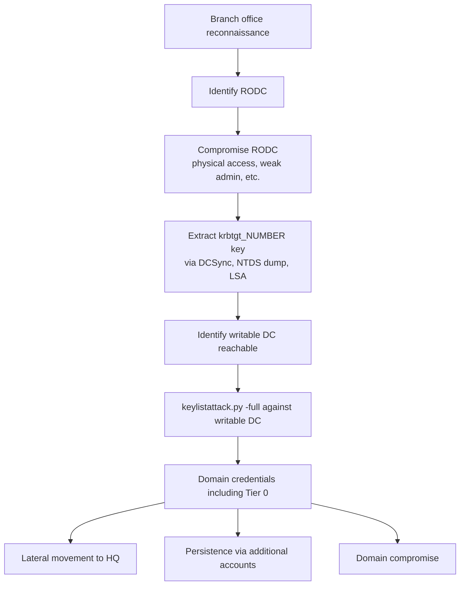

title: "keylistattack.py"
script: "examples/keylistattack.py"
category: "Kerberos Attacks"
status: "Published"
protocols:
  - Kerberos
  - SAMR
  - SMB
ms_specs:
  - MS-KILE
  - MS-PAC
  - MS-SAMR
  - MS-DRSR
ietf_specs:
  - RFC 4120
  - RFC 6113
mitre_techniques:
  - T1003.006
  - T1558
  - T1558.001
  - T1078.002
auth_types:
  - password
  - ntlm
  - kerberos
  - aes
tags:
  - impacket
  - impacket/examples
  - category/kerberos
  - status/published
  - protocol/kerberos
  - protocol/samr
  - protocol/smb
  - ms-spec/ms-kile
  - ms-spec/ms-pac
  - technique/rodc_abuse
  - technique/key_list_attack
  - technique/credential_dumping
  - auth/ntlm
  - auth/kerberos
  - mitre/T1003.006
  - mitre/T1558
  - mitre/T1558.001
aliases:
  - keylistattack
  - impacket-keylistattack
  - keylistdump


# keylistattack.py

> **One line summary:** Performs the KERB-KEY-LIST-REQ attack by impersonating a Read Only Domain Controller (RODC) using its compromised krbtgt account number and AES key to forge a partial RODC golden ticket for a target user, then sending that forged ticket to a writable domain controller in a TGS-REQ with `padata-type=161` (KERB-KEY-LIST-REQ); the writable DC responds with the target user's long term secret (NT hash and AES keys) embedded in the KERB-KEY-LIST-REP structure, which was originally designed in `[MS-KILE]` to support Azure AD seamless SSO with legacy services that require NTLM and resources hosted on premises; produces credential dumps equivalent to NTDS for any account NOT in the RODC's password Replication Denied list, without ever touching the writable DC's NTDS.dit, without DCSync (DRSUAPI/`GetNCChanges`), without code execution on a DC, and without administrative privileges on the writable DC; the prerequisite that limits the attack is obtaining the RODC's krbtgt key, but RODCs are deployed in branch offices with looser physical security than HQ DCs and their krbtgt is extractable via standard methods (DCSync against the RODC, NTDS dump, or filesystem access); implemented in Impacket by Leandro Cuozzo of SecureAuth via PR #1210; integrated into [`secretsdump.py`](../03_credential_access/secretsdump.md) via the `-use-keylist` flag for combined enumeration and dump workflows; continues Kerberos Attacks at 6 of 9 articles, putting the category at 67% complete.

| Field | Value |
|:---|:---|
| Script | `examples/keylistattack.py` |
| Category | Kerberos Attacks |
| Status | Published |
| Author | Leandro Cuozzo (SecureAuth), via Impacket PR #1210 |
| Primary protocol | Kerberos (TCP/UDP 88), with SAMR (DCE/RPC over SMB 445) for user enumeration |
| Primary Microsoft specifications | `[MS-KILE]` Kerberos Protocol Extensions (defines KERB-KEY-LIST-REQ/REP), `[MS-PAC]` PAC structure, `[MS-SAMR]` for user enumeration, `[MS-DRSR]` Directory Replication for context |
| Relevant IETF references | RFC 4120 Kerberos V5, RFC 6113 (FAST/armoring) |
| MITRE ATT&CK techniques | T1003.006 OS Credential Dumping: DCSync (analogous primitive), T1558 Steal or Forge Kerberos Tickets, T1558.001 Golden Ticket (the RODC variant), T1078.002 Valid Accounts: Domain Accounts |
| Authentication types supported | NTLM password, NTLM hash, Kerberos ticket (for the SAMR enumeration phase) |
| Notable integrations | `secretsdump.py -use-keylist` invokes the same KeyListSecrets class internally |


## Prerequisites

This article builds on:

- [`getTGT.py`](getTGT.md) for Kerberos exchange basics and ccache mechanics.
- [`ticketer.py`](ticketer.md) for PAC structure, Golden Ticket forgery mechanics, and the role of the krbtgt key in ticket forgery.
- [`getPac.py`](getPac.md) for the related Sapphire Ticket technique, which uses S4U2Self+U2U for PAC retrieval. KeyListAttack and Sapphire Tickets share the broader theme of "abuse Kerberos extensions originally designed for legitimate purposes to extract credentials."
- [`secretsdump.py`](../03_credential_access/secretsdump.md) for the canonical credential dump comparison. KeyListAttack achieves a subset of secretsdump's capabilities through a completely different mechanism.
- [`samrdump.py`](../01_recon_and_enumeration/samrdump.md) for SAMR user enumeration mechanics, which keylistattack uses internally to discover user accounts.
- [`00_Introduction_and_Architecture.md`](Introduction_and_Architecture.md) for the overall Impacket architecture.

Familiarity with Kerberos delegation, partial vs full PAC tickets, and the role of RODCs in AD design is helpful. The article reviews each.


## What it does

`keylistattack.py` extracts the long term secret (NT hash and Kerberos AES keys) of arbitrary domain users by impersonating a Read Only Domain Controller and exploiting the KERB-KEY-LIST-REQ Kerberos extension. Run as any domain user with low privilege who has the RODC's krbtgt credentials in hand:

```text
$ keylistattack.py -rodcNo 25078 \
                   -rodcKey eacd894dd0d934e84de35860ce06a4fac591ca63c228ddc1c7a0ebbfa64c7545 \
                   -full \
                   ACME.LOCAL/lowpriv:Passw0rd!@dc01.acme.local

Impacket v0.14.0.dev0 - Copyright Fortra, LLC and its affiliated companies
[*] Connecting to 10.10.10.5...
[*] Connecting to SAMR through dc01.acme.local
[*] Listing all users in the domain
[*] Total users found: 487
[*] Iterating users
[*] administrator:500:aad3b435b51404eeaad3b435b51404ee:a87f3a337d73085c45f9416be5787d86:::
[*] krbtgt:502:aad3b435b51404eeaad3b435b51404ee:8c42b5b3cf6e1b5a8e36d9d56e23d6f3:::
[*] svc_sql:1142:aad3b435b51404eeaad3b435b51404ee:5d94e02a6f5ca27fe7e26e9b3c4f2d10:::
[*] jsmith:1144:aad3b435b51404eeaad3b435b51404ee:bf5e6f4b6e7b9c9d3e2a1f2b3c4d5e6f:::
[*] bwilson:1145:aad3b435b51404eeaad3b435b51404ee:7c8d9e0f1a2b3c4d5e6f7a8b9c0d1e2f:::
...
```

Output format matches secretsdump: `username:RID:LM_hash:NT_hash:::`. These hashes are equivalent to what DCSync would extract from the writable DC's NTDS.dit, but obtained through a totally different protocol path.

### Three operational modes

**`-full` mode**: enumerate all domain users via SAMR, then iterate KERB-KEY-LIST-REQ for each. Returns hashes for everyone, INCLUDING accounts in the RODC's password Replication Denied list (because the request goes to the writable DC, not the RODC). This is the most aggressive mode.

**Default mode (no `-full`)**: enumerate all domain users via SAMR, but filter out accounts in the Denied list. Used when the operator wants only accounts the RODC was authorized to cache (which is the "less suspicious" subset).

**`-t <username> ... LIST`** mode: target a specific user. The `LIST` keyword in the target field signals "do not authenticate to SMB, just attack this one user." Useful when SAMR enumeration is impractical or already done.

### Why this is significant

KeyListAttack matters for several distinct reasons:

1. **It bypasses NTDS.dit completely.** Traditional DC credential dumps require NTDS.dit access (filesystem, VSS shadow, ESE database parsing) or DCSync (DRSUAPI `GetNCChanges` extended right). KeyListAttack achieves the same outcome via a protocol path that uses Kerberos only. Many EDR/MDI rules tuned for DCSync detection do not fire on KERB-KEY-LIST-REQ.
2. **It works without admin on the writable DC.** Once the RODC krbtgt is in hand, no further credential elevation is needed. Standard domain user authentication suffices for the SAMR enumeration step; the actual hash extraction is purely Kerberos protocol.
3. **It reframes the RODC threat model.** Microsoft introduced RODCs in Server 2008 explicitly as a "safer" alternative for branch offices: cached credentials limited to specific accounts via the Allowed list, no replication of writable copies, etc. KeyListAttack inverts that promise: compromising an RODC krbtgt enables full domain credential extraction even for accounts the RODC was forbidden to cache. The RODC's "safety" boundary applies to direct cache reads but not to this pathway mediated by Kerberos.
4. **It highlights an operational pattern often overlooked.** RODCs in branch offices often have weaker physical security than HQ DCs, are sometimes deployed by staff with less experience, and may run without the same hardening or monitoring. They are attractive targets that defenders frequently underweight.

The attack was first publicly documented by Leandro Cuozzo (SecureAuth) in 2022, with corresponding implementations in Impacket (PR #1210 by Cuozzo) and Rubeus (PR #147 by JoeDibley). Both implementations remain the standard tooling.


## Why it exists

Three threads converge to produce keylistattack.py:

- **The legitimate KERB-KEY-LIST-REQ feature.** Microsoft added KERB-KEY-LIST-REQ to `[MS-KILE]` to support Azure AD seamless SSO with legacy resources hosted on premises. The intent: when a user authenticates via modern protocols (SAML, OIDC) to Azure AD, the AAD Connect agent (running as a privileged service) needs to obtain the user's NT hash to construct NTLM responses for legacy services. KERB-KEY-LIST-REQ is the documented mechanism for this. The RODC restriction was added as a safety boundary: only RODC accounts can issue these requests, and only for users the RODC has been authorized to retrieve.
- **The RODC trust model.** Microsoft designed RODCs to be deployable in untrusted environments with reduced risk. The krbtgt account for each RODC is unique (different from the domain's primary krbtgt and from other RODCs' krbtgts). Compromising one RODC compromises only that RODC's cache, not the broader domain. This was the design promise.
- **The implicit assumption that "RODC can request keys for users it cached" is a safe restriction.** It turns out this is not true: a writable DC will respond to KERB-KEY-LIST-REQ with the user's actual key, even if the RODC is not authorized to cache that user. The Allowed/Denied lists are enforced by the RODC for its own caching decisions but are NOT consulted by writable DCs when responding to key list requests.

The result: a feature designed for a narrow, legitimate purpose (Azure AD SSO) became a credential extraction primitive when the RODC krbtgt is compromised. Cuozzo's research demonstrated this in a clear writeup and produced the working tooling.

Alberto Solino (Impacket maintainer) merged the keylistattack.py PR with appropriate credit. The `secretsdump.py -use-keylist` integration followed shortly, allowing operators to use this technique inside the unified credential dump tool when the RODC key is available.


## RODC architecture and the KERB-KEY-LIST-REQ extension

This section establishes the protocol theory needed to follow the attack mechanics. Two pieces: how RODCs differ from writable DCs, and what KERB-KEY-LIST-REQ is.

### The RODC concept

Read Only Domain Controllers were introduced in Windows Server 2008 to address branch office deployment risks. The design assumptions:

- Branch offices have weaker physical security than HQ.
- Branch admins may have less Kerberos knowledge.
- A compromised branch DC should not equal full domain compromise.

RODC characteristics:

- **No writable copy of the domain database.** All directory writes flow to writable DCs and replicate inbound to the RODC.
- **No replication outbound from the RODC.** Other DCs do not pull changes from RODCs.
- **Per-RODC krbtgt account.** Each RODC has its own krbtgt principal (named `krbtgt_<NUMBER>`), distinct from the domain krbtgt and from other RODCs' krbtgts. Tickets issued by an RODC are encrypted with that RODC's specific krbtgt key.
- **Password Replication Policy (PRP).** Two lists control which user credentials may be cached on the RODC:
  - **Allowed RODC Password Replication Group**: users whose hashes the RODC may cache.
  - **Denied RODC Password Replication Group**: users whose hashes the RODC must NEVER cache (typically Domain Admins, Schema Admins, and all Tier 0 accounts).
- **Limited admin role separation.** A non-admin user can be designated as RODC local admin without granting any domain privileges.

The intended security boundary: compromising an RODC reveals only credentials of users whose hashes were cached on it. Tier 0 accounts in the Denied list are never cached and remain protected.

### The RODC krbtgt account

When an RODC is added to the domain, AD creates a `krbtgt_<NUMBER>` account where `<NUMBER>` is a unique integer per RODC. This account:

- Has its own NT hash and AES keys (independent of the domain krbtgt).
- Is the encryption key for tickets the RODC issues.
- Is replicated to writable DCs (so they can validate tickets the RODC issued, e.g. when a user authenticated at the branch then traveled to HQ).
- Is part of the RODC's machine state; if the RODC's filesystem is compromised, the krbtgt key can be extracted via DCSync (against the RODC), NTDS.dit dump, or registry/LSA dump.

The `<NUMBER>` is visible in AD as the second component of the krbtgt account name (`krbtgt_25078` for example) and in the kvno of issued tickets. KeyListAttack needs this number as `-rodcNo`.

### Partial vs full PAC tickets

When an RODC issues a TGT, it constructs a "partial PAC" containing just the user's identity and the SIDs needed for authorization at the resource side. The PAC is signed with the RODC's krbtgt key, NOT the domain's primary krbtgt key. This means:

- A writable DC can validate the RODC-issued ticket because it has the RODC's krbtgt key.
- A resource server checks the ticket's PAC signature against the user's actual key (or the service account, depending on PAC version).
- When the user presents the RODC TGT to a writable DC for a TGS-REQ, the writable DC re-issues the service ticket signed with its own krbtgt + the resource's key.

KeyListAttack constructs a forged RODC TGT (using the RODC's krbtgt key) for the target user, then presents it to a writable DC. The writable DC accepts the ticket as valid (signature verifies against the known RODC krbtgt key) and processes the KERB-KEY-LIST-REQ.

### KERB-KEY-LIST-REQ (`[MS-KILE]` section 2.2.11)

KERB-KEY-LIST-REQ is a Kerberos pre authentication data type (padata type 161) defined in `[MS-KILE]`. The semantics:

- A client (must be acting as an RODC) sends a TGS-REQ to a writable DC.
- The TGS-REQ contains a `KERB-KEY-LIST-REQ` padata element listing the encryption types the client wants to retrieve.
- The TGS-REQ targets a service (typically `krbtgt/DOMAIN.FQDN`).
- The DC processes the request, validates that the client appears to be an RODC (the ticket's client principal must be `krbtgt_<NUMBER>`).
- If validation passes, the DC's TGS-REP contains a `KERB-KEY-LIST-REP` padata element holding the user's long term keys for the requested encryption types.

The design intent: this lets an RODC retrieve keys it needs for offline operations or cached scenarios where it doesn't have the user's hash but a Kerberos session is established.

The vulnerability: the DC validates that the request comes from an RODC (via the TGT signature being made with an RODC krbtgt), but it does NOT validate that the target user is in the RODC's Allowed list. Once the requester proves they are some RODC, the DC will return any user's keys.

Microsoft's stance is that this is "by design" for the documented use case. From a defense perspective, the boundary is that compromising an RODC krbtgt is the prerequisite, and that is supposed to be hard. In practice, RODC krbtgt extraction is no harder than writable DC krbtgt extraction in environments where the RODC is reachable.

### KERB-KEY-LIST-REP

The response structure contains the user's long term keys. Each entry includes:

- The encryption type (etype): typically AES256-CTS-HMAC-SHA1-96 (18), AES128-CTS-HMAC-SHA1-96 (17), or RC4-HMAC (23).
- The key value: 32 bytes for AES256, 16 bytes for AES128, 16 bytes for RC4.

For a user with default Kerberos encryption, the response includes AES256, AES128, and RC4 keys. The RC4 key IS the user's NT hash (RC4 in Kerberos is HMAC-MD5 of the password, which equals the NT hash). This is why keylistattack.py can output hashes in the same format as secretsdump: it extracts the RC4 key and presents it as the NT hash.

### Padata type 161

The numeric value is significant for detection. Standard Kerberos padata types are widely known integers (PA-ENC-TIMESTAMP=2, PA-ETYPE-INFO=11, PA-PAC-REQUEST=128, etc.). KERB-KEY-LIST-REQ at 161 is in the range Microsoft uses for extensions and is rare in legitimate traffic (only Azure AD Connect's seamless SSO flow uses it normally). Network detection rules can match on this value as a signal of high fidelity.


## How the tool works internally

The script is moderately complex (~500 lines) because it combines several distinct phases. Flow:

1. **Argument parsing.** Target as `[domain/]username[:password]@<KDC>` plus `-rodcNo`, `-rodcKey`, `-full`, `-t <user>`, `-tf <file>`, `-domain`, `-kdc`, plus standard Kerberos auth flags.

2. **SMB authentication to the KDC** (or the target host). Uses `SMBConnection.kerberosLogin()` or `.login()` with the supplied identity. Required for the SAMR enumeration phase (unless running in `LIST` mode against a single named user).

3. **SAMR connection and user enumeration.** Connects to the SAMR named pipe via the SMB session. Calls `RemoteOperations.connectSamr()` then enumerates users via SAMR (the same machinery used by samrdump.py). Builds the target user list. With `-full`, includes everyone; without `-full`, filters out users in the RODC's Denied Replication Policy list.

4. **For each target user, construct a partial RODC TGT.**

   - Build a TGT structure with:
     - Client principal = the target user.
     - Server principal = `krbtgt_<rodcNo>/<DOMAIN>` (the RODC krbtgt).
     - PAC containing the target user's identity and group SIDs (constructed from SAMR-retrieved info).
     - PAC signature made with the supplied RODC krbtgt AES key.
     - Ticket encrypted with the RODC krbtgt AES key.

   This is essentially a "Golden Ticket for the RODC variant", a forged TGT that the writable DC will accept as legitimate because it validates against the RODC krbtgt key it has on file.

5. **Construct TGS-REQ with KERB-KEY-LIST-REQ padata.** Build a TGS-REQ targeting `krbtgt/<DOMAIN>` (the writable DC's primary krbtgt service). Include:
   - `padata` containing PA-TGS-REQ (the AP-REQ wrapping the forged RODC TGT) AND a KERB-KEY-LIST-REQ padata (type 161) listing the desired encryption types.
   - `req-body` standard fields.

6. **Send to writable DC's KDC port (TCP/UDP 88).** Receive TGS-REP.

7. **Parse the TGS-REP for KERB-KEY-LIST-REP padata.** The response includes the standard service ticket plus the KERB-KEY-LIST-REP padata containing the user's long term keys.

8. **Format and print.** Extract the RC4 key (= NT hash), format as `username:RID:LM:NT:::`, output to stdout (or file if specified).

9. **Repeat for next user.**

The code that builds the partial RODC TGT is the trickiest part. It has to construct a syntactically valid Kerberos ticket with all required PAC structures, signed correctly with the RODC key, before the writable DC will accept it. The implementation lives in `KeyListSecrets` class in Impacket (the same class secretsdump.py invokes when `-use-keylist` is set).

### Authentication failover

The script attempts SMB authentication first. If that fails (e.g., the supplied credentials don't work for SMB), it falls back to assuming Kerberos credentials are cached (KRB5CCNAME environment variable) and retries. This is useful when the operator has cached tickets but no plaintext password.

If both fail, the SAMR enumeration phase cannot run, and the script can only operate against a single target (with explicit `-t <user>`).

### Output format

Output matches secretsdump for compatibility:

```text
username:RID:LM_hash:NT_hash:::
```

LM_hash is always `aad3b435b51404eeaad3b435b51404ee` (the empty LM hash) because Microsoft has not stored real LM hashes since Server 2003 and the KERB-KEY-LIST-REP doesn't include LM keys anyway. This makes the output usable directly with hashcat (mode 1000) and password cracking pipelines.


## Authentication options

Two distinct credential sets are needed:

**For the SAMR enumeration phase** (target authentication):

- NTLM password: `keylistattack.py ... DOMAIN/lowpriv:Passw0rd!@dc01.acme.local`
- NTLM hash: `keylistattack.py -hashes :NTHASH ... DOMAIN/lowpriv@dc01.acme.local`
- Kerberos: `keylistattack.py -k -no-pass ... DOMAIN/lowpriv@dc01.acme.local` (with cached ccache)

Any account with low privilege in the domain works. The credential is used only for SAMR enumeration; no special rights required.

**For the KERB-KEY-LIST-REQ phase** (RODC impersonation):

- `-rodcNo <number>`: the RODC krbtgt account number (e.g. `25078`).
- `-rodcKey <hex>`: the RODC krbtgt AES256 key (64 hex characters).

These are obtained by compromising the RODC. Methods:

- DCSync against the RODC for its krbtgt account (`secretsdump -dc-ip <RODC-IP> -just-dc-user krbtgt_<NUMBER> ...`).
- Filesystem extraction of NTDS.dit from a compromised RODC, parsed offline with secretsdump.
- LSA secrets dump from the RODC if accessible.
- Direct registry/SECURITY hive extraction.

The RODC krbtgt key is what fundamentally enables this attack. Without it, no amount of access via a domain user with low privilege produces this primitive.


## Practical usage

### Dump all domain users including Denied list members

```bash
keylistattack.py -rodcNo 25078 \
                 -rodcKey eacd894dd0d934e84de35860ce06a4fac591ca63c228ddc1c7a0ebbfa64c7545 \
                 -full \
                 ACME.LOCAL/lowpriv:Passw0rd!@dc01.acme.local
```

Most aggressive mode. Returns hashes for every domain user, including Domain Admins (who would never be cached on the RODC normally but whose hashes are still extractable via this attack).

### Dump only Allowed list members (less aggressive)

```bash
keylistattack.py -rodcNo 25078 \
                 -rodcKey eacd894dd0d934e84de35860ce06a4fac591ca63c228ddc1c7a0ebbfa64c7545 \
                 ACME.LOCAL/lowpriv:Passw0rd!@dc01.acme.local
```

Without `-full`, filters out Denied list members. Returns only accounts the RODC was authorized to cache. Less suspicious from a noise perspective; still produces hashes the operator may not have had.

### Target a single user

```bash
keylistattack.py -rodcNo 25078 \
                 -rodcKey eacd894dd0d934e84de35860ce06a4fac591ca63c228ddc1c7a0ebbfa64c7545 \
                 -t administrator \
                 -kdc dc01.acme.local \
                 LIST
```

The `LIST` keyword in place of the credential string tells keylistattack to skip SMB/SAMR authentication and just attack the named user. Useful when you don't have any domain credentials but do have the RODC krbtgt.

### Use through secretsdump.py

```bash
secretsdump.py -rodcNo 25078 \
               -rodcKey eacd894dd0d934e84de35860ce06a4fac591ca63c228ddc1c7a0ebbfa64c7545 \
               -use-keylist \
               ACME.LOCAL/lowpriv:Passw0rd!@dc01.acme.local
```

Invokes the same KeyListSecrets class internally. Output format matches secretsdump's standard. Useful when the operator's pipeline already targets secretsdump output.

### Use a target file

```bash
keylistattack.py -rodcNo 25078 \
                 -rodcKey eacd894dd0d934e84de35860ce06a4fac591ca63c228ddc1c7a0ebbfa64c7545 \
                 -tf priority_users.txt \
                 -kdc dc01.acme.local \
                 LIST
```

The `-tf` flag accepts a file with usernames (one per line). Useful for targeting a curated list rather than enumerating the whole domain.

### Combined RODC compromise to credential dump pipeline

```bash
# Step 1: Compromise the RODC. Methods vary; assume filesystem access via WinRM admin.
# Step 2: Extract krbtgt_<NUMBER> credentials from the RODC.
secretsdump.py -dc-ip 10.10.20.5 \
               -just-dc-user krbtgt_25078 \
               ACME.LOCAL/rodc_admin:RODC_Pass!@rodc01.branch.acme.local
# Output includes the AES256 key for krbtgt_25078

# Step 3: Use that key against a writable DC to dump every domain user.
keylistattack.py -rodcNo 25078 \
                 -rodcKey <extracted-aes256-key> \
                 -full \
                 ACME.LOCAL/lowpriv:Passw0rd!@dc01.acme.local
# Output: NT hashes for every domain account, including Tier 0.

# Step 4: Crack interesting hashes offline or use with pass the hash for further movement.
```

This four step flow is the canonical KeyListAttack abuse chain. The key insight: step 3's credentials need NOT be admin on the writable DC. Any account with low privilege suffices.

### Key flags

| Flag | Meaning |
|:---|:---|
| `target` (positional) | `[domain/]username[:password]@<KDC>` for SAMR phase, or `LIST` for single user attack. |
| `-rodcNo <N>` | RODC krbtgt account number. Required. |
| `-rodcKey <hex>` | RODC krbtgt AES key. Required. |
| `-full` | Include accounts in the Denied list (most aggressive). |
| `-t <username>` | Target a specific user (use with `LIST` keyword). |
| `-tf <file>` | Read target usernames from file. |
| `-domain <FQDN>` | Override domain (useful in `LIST` mode). |
| `-kdc <host>` | KDC hostname (writable DC for the KERB-KEY-LIST-REQ phase). |
| `-dc-ip <ip>` | DC IP override. |
| `-target-ip <ip>` | Target machine IP if NetBIOS resolution fails. |
| `-hashes LM:NT` | NTLM hash auth for the SMB/SAMR phase. |
| `-aesKey <hex>` | Kerberos AES key for the SMB/SAMR phase. |
| `-k`, `-no-pass` | Kerberos auth for SMB/SAMR phase. |
| `-debug`, `-ts` | Verbose/timestamp logging. |

The flag surface is larger than typical Impacket scripts because of the dual authentication phases and the multiple operating modes.


## What it looks like on the wire

### SMB/SAMR phase

Standard SMB authentication followed by DCE/RPC to the SAMR pipe. Identical to samrdump.py traffic patterns. See [`samrdump.py`](../01_recon_and_enumeration/samrdump.md) for details. This phase is unremarkable and produces no distinctive signature.

### KERB-KEY-LIST-REQ phase

This is the distinctive phase. The TGS-REQ to the writable DC has:

- Standard Kerberos TGS-REQ structure.
- `padata`:
  - `PA-TGS-REQ` (type 1) wrapping an AP-REQ that presents the forged RODC TGT.
  - `KERB-KEY-LIST-REQ` (type 161) listing requested encryption types.
- `req-body`:
  - `cname` = the target user (whose key we want).
  - `sname` = `krbtgt/<DOMAIN>`.
  - `realm` = the domain.

The TGS-REP contains:

- Standard TGS-REP structure.
- `padata`:
  - `KERB-KEY-LIST-REP` (type 162) containing the requested keys.

### Wireshark filters

```text
kerberos                                         # all Kerberos
kerberos.padata-type == 161                      # KERB-KEY-LIST-REQ
kerberos.padata-type == 162                      # KERB-KEY-LIST-REP
kerberos.msg_type == 12 and kerberos.padata-type == 161   # TGS-REQ with KEY-LIST-REQ
kerberos.cname contains "krbtgt_"                # tickets with RODC krbtgt as cname
```

The `padata-type == 161` filter is the most direct signature. In normal AD operation, padata 161 appears only in Azure AD Connect seamless SSO traffic from the AAD Connect server. Any other source generating this padata is anomalous.

### Key indicators

- Source IP NOT being a known AAD Connect server.
- Target service `krbtgt/<DOMAIN>` (the writable DC's primary krbtgt).
- Inner TGT's PAC signed with an RODC krbtgt key.
- Multiple KERB-KEY-LIST-REQ in rapid succession (bulk dump pattern with `-full`).


## What it looks like in logs

### Event 4769

Each KERB-KEY-LIST-REQ produces an Event 4769 (Kerberos service ticket request) on the writable DC. Key fields:

- **Account Name**: the target user (whose key is being requested).
- **Service Name**: `krbtgt/<DOMAIN>`.
- **Failure Code**: 0x0 if successful.
- **Pre-Auth Type**: indicates KERB-KEY-LIST-REQ usage (some Windows versions; not always present).

The challenge: 4769 events for `krbtgt` service are common in normal operation (every time a user requests a TGT through a TGS-REQ rather than AS-REQ, which happens during scenarios that cross realms and various delegation scenarios). The volume can mask attack activity.

The aggregation pattern (many 4769s for `krbtgt` service from one account targeting many different users in a short window) is more distinctive than any single event.

### Event 4768, TGT issued

The forged RODC TGT is not visible to the writable DC as an explicit event. It arrives as the credential proof in the TGS-REQ; it was never issued by this DC. The absence of a corresponding 4768 from this DC for the target user, just before a 4769 for that user, can be a tell, but correlating across DC events at this granularity is difficult.

### Microsoft Defender for Identity (MDI)

MDI has specific detection for KERB-KEY-LIST-REQ abuse. The detection looks for:

- Padata type 161 in TGS-REQ traffic.
- From a source NOT identified as an AAD Connect server.
- Targeting `krbtgt/<DOMAIN>` service.

When MDI is deployed and tuned, this is the signal of highest fidelity available. Whether MDI is deployed in environments using RODCs varies; smaller branch deployments often skip MDI for cost reasons, leaving exactly the environments most vulnerable to this attack with the weakest detection.

### Starter Sigma rules

```yaml
title: Kerberos KERB-KEY-LIST-REQ from Non-AAD-Connect Source
logsource:
  category: network
  product: zeek
  service: kerberos
detection:
  selection:
    msg_type: 12
    padata|contains: '161'
  filter_known:
    src_ip:
      - 'aad_connect_server_ip_1'
      - 'aad_connect_server_ip_2'
  condition: selection and not filter_known
level: high
```

Detection at the network layer requiring Zeek with Kerberos analyzer. Padata type 161 is the indicator of high fidelity; whitelisting known AAD Connect servers eliminates the legitimate baseline.

```yaml
title: High Volume krbtgt Service Ticket Requests for Multiple Distinct Users
logsource:
  product: windows
  service: security
detection:
  selection:
    EventID: 4769
    ServiceName: 'krbtgt'
  timeframe: 5m
  aggregation: count(distinct AccountName) by SubjectMachineName > 20
level: medium
```

Aggregation rule for the bulk dump pattern. Twenty distinct users' krbtgt tickets requested by one source machine in five minutes is well above legitimate baseline.

```yaml
title: Possible RODC krbtgt Key Compromise - Anomalous TGT Source
logsource:
  product: windows
  service: security
detection:
  selection:
    EventID: 4769
    TicketEncryptionType: '0x12'  # AES256
    ServiceName: 'krbtgt'
  filter_normal:
    SourceMachine: 'expected_writable_dcs'
  condition: selection and not filter_normal
level: medium
```

Detects 4769s for krbtgt service originating from machines not in the expected writable DC list. False positive surface includes legitimate scenarios crossing realms; tuning per environment is essential.


## Detection and defense

### Detection opportunities

- **Padata type 161 in Kerberos traffic** from non-AAD-Connect sources. The cleanest signal. Requires network visibility into Kerberos protocol contents (Zeek, MDI, Defender for Identity).
- **Bulk 4769 events for krbtgt service** from a single source against many users. Aggregation-based detection; tune threshold per environment.
- **Anomalous RODC krbtgt usage.** If logging captures the RODC number in ticket fields (it is encoded in the kvno/SPN), tickets from RODCs that are offline or in distant geographies suddenly being used for KERB-KEY-LIST-REQ at HQ is anomalous.
- **MDI's built-in detection.** Where deployed, this is the option of highest fidelity. Often missed in environments dominated by branch offices.

### Preventive controls

- **RODC physical security.** The fundamental prerequisite is RODC krbtgt extraction. Treating RODCs as Tier 1+ assets (rather than throwaway branch infrastructure) is the core mitigation. Physical security, monitoring at the hardware level, BitLocker on RODCs.
- **RODC krbtgt rotation.** Each RODC's krbtgt should be rotated on the same schedule as the domain krbtgt (twice yearly minimum). Many environments rotate the domain krbtgt occasionally and never rotate RODC krbtgts. The Microsoft KB on krbtgt rotation has been updated to cover RODC variants.
- **Limit RODC count.** Each RODC adds to the attack surface. Question whether existing RODC deployments are still needed; some can be replaced with site-aware writable DCs or simply removed.
- **Audit RODC admin scope.** RODC local admin role separation lets a non-domain-admin manage the RODC. This is a feature, but the local admin can perform RODC krbtgt extraction. Audit who has this role on which RODCs.
- **Tier 0 isolation enforcement.** Even if KeyListAttack succeeds and Tier 0 hashes are extracted, Tier 0 isolation (separate workstations, jump hosts, MFA, Privileged Access Workstations) limits the use of those credentials.
- **Detection over prevention.** As with getPac.py, the mechanism is "by design" for the documented use case. Pure prevention requires breaking Azure AD SSO. Detection is feasible without that cost.

### What keylistattack.py does NOT do

- Does NOT require admin on the writable DC. Standard domain user suffices.
- Does NOT generate DCSync detection. The protocol path is entirely Kerberos; there is no DRSUAPI `GetNCChanges` or similar.
- Does NOT touch the writable DC's NTDS.dit, registry, or filesystem. Pure protocol attack.
- Does NOT modify the writable DC in any way. Read-only credential extraction.
- Does NOT bypass account lockout or password expiry policies. The retrieved hashes are the actual stored hashes; if they're stale they're stale.
- Does NOT work without the RODC krbtgt key. This is the hard prerequisite.

### Comparison with DCSync

| Property | DCSync (DRSUAPI) | KeyListAttack |
|:---|:---||
| Required prerequisite | DCSync rights (`Replicating Directory Changes` ACE) | RODC krbtgt key |
| Required against | Any DC | Writable DC, any version supporting MS-KILE |
| Protocol | DCE/RPC over SMB (DRSUAPI / `GetNCChanges`) | Kerberos (TGS-REQ with KEY-LIST padata) |
| Common detection | MDI DCSync detection, 4662 audit, network IDS for DRSUAPI | MDI KEY-LIST detection, padata 161 filter, 4769 aggregation |
| Privilege bar | Domain Admin or specific delegated rights | Any user with low privilege + RODC krbtgt |
| Stealth | Widely known and detected | Less detected, especially in environments without MDI |
| Output | All domain user keys | All domain user keys (functionally equivalent) |

The two attacks are functionally similar (extract domain user credentials from a DC) but reach the goal via completely different protocol paths and prerequisites. KeyListAttack tends to win on stealth in environments with weak RODC governance.


## Related tools and attack chains

`keylistattack.py` continues Kerberos Attacks at **6 of 9 articles, putting the category at 67% complete**.

### Related Impacket tools

- [`secretsdump.py`](../03_credential_access/secretsdump.md) integrates this attack via `-use-keylist`. The `KeyListSecrets` class is shared between the two scripts. Operators may prefer secretsdump's interface for unified credential dumping; keylistattack stands alone for clearer demonstration.
- [`getTGT.py`](getTGT.md) is an interesting comparison: it ALSO produces a TGT for a target user, but via legitimate AS-REQ with the user's password/hash. KeyListAttack reaches the same hash output by working backwards: forge a partial TGT, request the user's keys.
- [`ticketer.py`](ticketer.md) is the Golden Ticket forgery tool. KeyListAttack uses similar machinery internally to construct the partial RODC TGT, but with the RODC's krbtgt key instead of the domain krbtgt.
- [`getPac.py`](getPac.md) is the Sapphire Ticket prerequisite tool. Both KeyListAttack and Sapphire Tickets are in the same broader family: "abuse Kerberos extensions designed for legitimate purposes to achieve credential extraction or stealthy ticket forgery."
- [`raiseChild.py`](raiseChild.md) attacks the child-to-parent domain trust. Different Kerberos primitive (ExtraSids in tickets between realms), same broader theme of Kerberos protocol abuse for domain compromise.
- [`samrdump.py`](../01_recon_and_enumeration/samrdump.md) is the user enumeration component. KeyListAttack invokes the same SAMR enumeration internally.

### External alternatives

- **Rubeus** at `https://github.com/GhostPack/Rubeus`. Implements KERB-KEY-LIST-REQ via `Rubeus.exe golden /rodcNumber:<N> /aes256:<key> ... && Rubeus.exe asktgs /enctype:aes256 /keyList ...`. Two-command approach: forge the RODC golden TGT, then issue the KEY-LIST request. The Windows-native equivalent of keylistattack.py.
- **mimikatz** has related but not identical RODC abuse capabilities. The KEY-LIST approach is more often handled in Rubeus.
- **AzureADKerberosUtility** and similar AAD-focused tools deal with the legitimate side of KERB-KEY-LIST-REQ for AAD Connect troubleshooting.

For Windows operators, Rubeus is the standard. For Linux/Python attack hosts, keylistattack.py is the primary tool.

### KeyListAttack as part of a broader RODC compromise chain



The chain shows why RODCs deserve more security attention than they typically receive. The branch office may be physically distant and operationally low priority, but its RODC krbtgt is a key to the entire domain.

### Comparative framing: RODC-related Kerberos attacks

| Attack | Prerequisite | Output | Detection |
|:---|:---|||
| KeyListAttack | RODC krbtgt key | Domain user hashes | Padata 161, 4769 aggregation |
| RODC Golden Ticket | RODC krbtgt key, allowed user list | Limited tickets for cached users | 4769 with anomalous service |
| RODC machine account abuse | RODC machine account creds | Some RODC-scoped operations | Various, depends on operation |

KeyListAttack is the highest impact of these because it reaches across the RODC's design boundary to extract Tier 0 credentials. RODC Golden Tickets are constrained by the allowed cache list; KeyListAttack is not.


## Further reading

- **`[MS-KILE]`: Kerberos Protocol Extensions** at `https://learn.microsoft.com/en-us/openspecs/windows_protocols/ms-kile/`. Section 2.2.11 defines KERB-KEY-LIST-REQ.
- **`[MS-PAC]`: Privilege Attribute Certificate Data Structure** at `https://learn.microsoft.com/en-us/openspecs/windows_protocols/ms-pac/`. PAC structure used in the forged RODC TGT.
- **`[MS-DRSR]`: Directory Replication Service (DRS) Remote Protocol** at `https://learn.microsoft.com/en-us/openspecs/windows_protocols/ms-drsr/`. The DCSync protocol for comparison.
- **RFC 4120: Kerberos Network Authentication Service (V5).** Base Kerberos.
- **"The Kerberos Key List Attack: The return of the Read Only Domain Controllers"** by Leandro Cuozzo, SecureAuth, 2022 at `https://www.secureauth.com/blog/the-kerberos-key-list-attack-the-return-of-the-read-only-domain-controllers/`. The original public writeup of the attack.
- **"At the Edge of Tier Zero: The Curious Case of the RODC"** by Elad Shamir at `https://specterops.io/blog/`. Comprehensive RODC security analysis predating but contextualizing the KeyListAttack work.
- **Impacket PR #1210** at `https://github.com/fortra/impacket/pull/1210`. The implementation merge commit by Cuozzo.
- **Rubeus PR #147** at `https://github.com/GhostPack/Rubeus/pull/147`. The Windows implementation by JoeDibley.
- **Microsoft KB on krbtgt password reset** at `https://learn.microsoft.com/en-us/answers/topics/active-directory-krbtgt.html`. RODC krbtgt rotation guidance.
- **Internal All The Things RODC reference** at `https://swisskyrepo.github.io/InternalAllTheThings/active-directory/ad-adds-rodc/`. Practical RODC attack notes.
- **The Hacker Recipes: Kerberos key list** at `https://www.thehacker.recipes/ad/movement/credentials/dumping/kerberos-key-list`. Operational reference.
- **Impacket keylistattack.py source** at `https://github.com/fortra/impacket/blob/master/examples/keylistattack.py`.
- **MITRE ATT&CK T1003.006 DCSync** at `https://attack.mitre.org/techniques/T1003/006/`. Related credential dumping technique.
- **MITRE ATT&CK T1558 Steal or Forge Kerberos Tickets** at `https://attack.mitre.org/techniques/T1558/`. Parent technique covering the broader Kerberos abuse category.

If you want to internalize this technique, the best exercise has three parts. First, set up a lab with a writable DC and at least one RODC. Configure the RODC's Allowed/Denied Replication Policy normally (Domain Admins in Denied, some test users in Allowed). Compromise the RODC (the easy way: RDP in as RODC local admin, then dump LSA), extract krbtgt_<number> via secretsdump, and confirm the AES key. Second, run keylistattack.py with `-full` against the writable DC and observe two things: (a) you get hashes for users in the Denied list, despite the RODC never having been allowed to cache them; (b) network capture on port 88 shows the distinctive padata-type 161 in the TGS-REQ. Compare this to a normal user TGS-REQ for context. Third, run the same attack via `secretsdump.py -use-keylist` and observe the KeyListSecrets class produces identical output. Then, deliberately enable MDI in the lab (or a similar Kerberos-aware NDR) and observe whether/how the attack is detected. The exercise illuminates both the attack mechanics and the detection landscape, and clarifies why "RODC krbtgt rotation" should appear on every AD security checklist.
