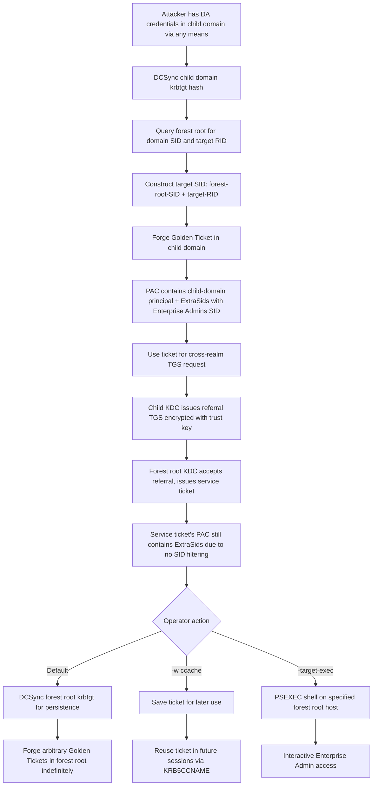

title: "raiseChild.py"
script: "examples/raiseChild.py"
category: "Kerberos Attacks"
status: "Published"
protocols:
  - Kerberos
  - SMB
  - DCE/RPC
  - MS-DRSR
ms_specs:
  - MS-PAC
  - MS-KILE
  - MS-DRSR
mitre_techniques:
  - T1558.001
  - T1003.006
  - T1078.002
auth_types:
  - password
  - nt_hash
  - aes_key
  - kerberos_ccache
tags:
  - impacket
  - impacket/examples
  - category/kerberos_attacks
  - status/published
  - protocol/kerberos
  - technique/golden_ticket
  - technique/extra_sids
  - technique/forest_escalation
  - technique/enterprise_admin
  - ad/child_domain
  - ad/parent_domain
  - ad/forest_trust
  - ad/sid_history
  - mitre/T1558.001
  - mitre/T1003.006
  - mitre/T1078.002
aliases:
  - raiseChild
  - impacket-raiseChild
  - child_to_forest


# raiseChild.py

> **One line summary:** End to end automation of the child domain to forest root escalation attack, taking Domain Admin credentials in a child domain and producing Enterprise Admin privileges in the forest root domain by chaining DCSync of the child domain's krbtgt hash, lookup of the Enterprise Admins SID in the forest root, forging a Golden Ticket in the child domain that injects the Enterprise Admins SID via the `ExtraSids` field of the `KERB_VALIDATION_INFO` structure inside the PAC, using that ticket to authenticate to the forest root, and optionally dumping the root domain's krbtgt hash or landing a PSEXEC shell on a specified target - implementing the research documented by Sean Metcalf (@PyroTek3) at adsecurity.org and automating the workflow that Benjamin Delpy (@gentilkiwi) originally demonstrated manually with mimikatz, continuing the Kerberos Attacks category at 4 of 9 articles alongside [`getTGT.py`](getTGT.md), [`ticketer.py`](ticketer.md), and [`getST.py`](getST.md).

| Field | Value |
|:---|:---|
| Script | `examples/raiseChild.py` |
| Category | Kerberos Attacks |
| Status | Published |
| Primary protocols | Kerberos, SMB, DCE/RPC |
| Primary Microsoft specifications | `[MS-PAC]`, `[MS-KILE]`, `[MS-DRSR]` |
| MITRE ATT&CK techniques | T1558.001 Golden Ticket, T1003.006 DCSync, T1078.002 Domain Accounts |
| Authentication types supported | Password, NT hash, AES key, Kerberos ccache |
| First appearance in Impacket | Impacket 0.9.14 (around 2015-2016) |
| Original author | Alberto Solino (`@agsolino`), with workflow automation inspired by Rob Fuller (`@mubix`) |
| Research attribution | Sean Metcalf (`@PyroTek3`) [adsecurity.org/?p=1640](https://adsecurity.org/?p=1640); Benjamin Delpy (`@gentilkiwi`) for Golden Ticket and ExtraSids in mimikatz |


## Prerequisites

This article builds heavily on prior foundations. Read these first:

- [`ticketer.py`](ticketer.md) for Golden Ticket theory, ticket forging mechanics, the PAC structure, the krbtgt hash role, and the `ExtraSids` field of `KERB_VALIDATION_INFO`. `raiseChild.py` is essentially a specialized ticketer.py workflow that takes specific inputs automatically rather than requiring the operator to specify them manually.
- [`getTGT.py`](getTGT.md) for the ccache format, TGT requests, and how forged tickets are injected into the Kerberos workflow via `KRB5CCNAME`.
- [`secretsdump.py`](../03_credential_access/secretsdump.md) for DCSync mechanics. `raiseChild.py` uses DCSync internally to obtain the child domain's krbtgt hash.
- [`goldenPac.py`](../11_exploits/goldenPac.md) for historical context on PAC manipulation attacks. The raiseChild technique uses legitimate PAC fields (ExtraSids) rather than exploiting a signature flaw, so it is not in the same category as CVE exploits but rather an attack that stems from the security model's design.
- [`findDelegation.py`](../01_recon_and_enumeration/findDelegation.md) and [`GetUserSPNs.py`](../01_recon_and_enumeration/GetUserSPNs.md) for broader Kerberos foundation.

Familiarity with Active Directory forest structure (forest root, child domains, domain trusts, trust keys) is assumed; the article reviews the relevant pieces.


## What it does

`raiseChild.py` automates a specific Active Directory attack: given Domain Admin credentials in any child domain of a forest, it produces the ability to authenticate as Enterprise Admin in the forest root domain. The tool performs eight steps internally:

1. **Authenticate to the child domain** using the supplied credentials (password, hash, AES key, or Kerberos ccache).
2. **DCSync the child domain's krbtgt account hash** using `[MS-DRSR]` `DRSGetNCChanges` (or fall back to `secretsdump`-style replication). Domain Admin privileges are required for this.
3. **Query the forest root domain** via LDAP or SAMR to obtain the SID of the forest root domain itself and the RID of the target account (Enterprise Admin, by default RID 519; or a user-specified RID via `-targetRID`).
4. **Construct the target SID** by concatenating the forest root domain SID with the target RID. For Enterprise Admins this is `<forest-root-SID>-519`.
5. **Forge a Golden Ticket in the child domain** that claims membership in Enterprise Admins. The ticket specifies a child domain user principal (the administrator's account, by default) and injects the Enterprise Admins SID via the `ExtraSids` field of the `KERB_VALIDATION_INFO` structure inside the PAC. The ticket is signed with the child domain's krbtgt hash from step 2.
6. **Use the forged ticket** to request a TGS for a service in the forest root domain. Because the ticket was issued by the child domain's krbtgt (which is trusted by the forest root via the trust between domains), the forest root accepts it. The PAC's ExtraSids field propagates the Enterprise Admins claim through the trust.
7. **Access forest root resources.** By default, the tool DCSyncs the forest root's krbtgt hash (giving the operator the ability to forge arbitrary Golden Tickets in the forest root domain thereafter). With `-w ccache`, the tool writes the Golden Ticket to a ccache file for later use. With `-target-exec`, the tool drops into a PSEXEC shell on a specified target host in the forest root.
8. **Clean up.** No persistent changes are made on the child domain controllers (beyond the DCSync log event); the forged ticket exists only in memory unless written to disk.

The result: **full forest compromise from child domain admin access**. The tool embodies the widely known principle that in Active Directory, **the forest is the security boundary, not the domain**. Any Domain Admin in any domain of the forest can escalate to Enterprise Admin given enough time and the right technique; `raiseChild.py` makes the escalation a single command.


## Why it exists

Active Directory's security model has a specific, frequently misunderstood boundary:

- **A domain is NOT a security boundary.** Accounts in one domain can affect other domains in the same forest through trust relationships, replication, and PAC propagation.
- **A forest IS a security boundary.** Domains in different forests only share what their trust configuration explicitly allows.

This distinction has implications for AD administration. Organizations that set up multiple domains within a single forest (often to match organizational boundaries, geographical regions, or for historical AD migration reasons) sometimes assume that compromise of a child domain affects only that child domain. The escalation attack from child to forest demonstrates this assumption is false.

The research chain:

1. **Microsoft's own documentation** at `technet.microsoft.com/en-us/library/cc759073(v=ws.10).aspx` stated explicitly that the forest is the only security boundary in Active Directory. The statement appears verbatim in the `raiseChild.py` source code comments, as a kind of "reading this before blaming the tool is mandatory" preface.
2. **Benjamin Delpy's mimikatz work** on Golden Tickets made forging PACs practical. Delpy noticed that the `ExtraSids` field of `KERB_VALIDATION_INFO` (defined in `[MS-PAC]`) could be used to inject arbitrary SIDs into the PAC's authorization data, bypassing the normal SID filtering rules.
3. **Sean Metcalf's writeup** at `adsecurity.org/?p=1640` (published 2015) documented the complete attack chain. Metcalf's ADSecurity.org is the canonical reference for Active Directory attack research; his article is required reading for anyone studying this class of attack.
4. **Rob Fuller's (@mubix) work** on automation frameworks inspired the idea of packaging the full workflow as a single tool rather than a series of manual steps.
5. **Alberto Solino's implementation** in Impacket brought all of this together as `raiseChild.py`, making the attack accessible to Impacket users without requiring them to drive mimikatz and related tools manually.

The tool exists because:

- **AD penetration testing needs this capability.** Assessments that find Domain Admin access in a child domain should demonstrate the full forest impact as part of risk communication.
- **Defensive research needs it too.** Understanding how the attack works is prerequisite to detecting and mitigating it. Blue teams use `raiseChild.py` in lab environments to generate realistic detection test data.
- **Red team exercises depend on it.** Forests with multiple domains are common in enterprises; demonstrating forest compromise from apparent child domain containment is a standard part of modern engagements.
- **The research attribution matters.** By preserving the Metcalf/Delpy/mubix attribution in the tool's header and code comments, Impacket acknowledges the research community that made the technique public and reproducible.

The tool is mature and stable. It has received small updates over the years (Python 3 compatibility, minor improvements to target RID flexibility, error message improvements) but the core attack mechanics are unchanged.


## The attack theory

This section covers the specific Kerberos and PAC mechanics that make the attack work. Much of this references material already covered in [`ticketer.py`](ticketer.md) and [`getTGT.py`](getTGT.md); prefer reading those articles first rather than duplicating foundations here.

### Forests, domains, and trusts

An AD forest is a collection of domains that share:

- A common schema (the definition of object classes and attributes).
- A common Global Catalog (a partial replica of all domains used for searches that span domains).
- Bidirectional transitive trusts between all domains in the forest.
- A single forest root domain at the top of the hierarchy.

A typical forest with multiple domains looks like:

```text
example.com (forest root)
├── sales.example.com
├── eng.example.com
└── legal.example.com
```

Each child domain has its own krbtgt account, domain controllers, Domain Admins group, and local SAM. The forest root has additional groups that span the whole forest: Enterprise Admins, Schema Admins.

### Trust keys between domains

When a child domain joins a forest, a pair of trust keys is established between the child and the parent (and implicitly with the rest of the forest). Kerberos tickets crossing the trust are encrypted with the trust key rather than the child's or parent's krbtgt key.

The trust key mechanism ensures that a TGS issued by the child domain's KDC is acceptable to the parent domain's KDC. When the child's KDC issues a TGS for a service in the parent domain, it encrypts the ticket with the trust key (which the parent's KDC knows) rather than the parent's krbtgt key (which only the parent's KDC knows).

### PAC propagation across the trust

The PAC in a Kerberos ticket carries the authenticated user's identity and group memberships. When a ticket crosses a domain trust, the parent domain's KDC (or the target service, depending on configuration) validates the PAC and makes authorization decisions based on it.

The `KERB_VALIDATION_INFO` structure inside the PAC contains several SID-bearing fields:

- **UserId:** the user's RID in the issuing domain.
- **GroupIds:** RIDs of groups the user belongs to in the issuing domain.
- **LogonDomainId:** the issuing domain's SID.
- **ExtraSids:** an array of `KERB_SID_AND_ATTRIBUTES` entries containing arbitrary SIDs with attributes.

The ExtraSids array was designed for legitimate purposes including:

- **SID history:** when accounts are migrated between domains, their old SIDs are retained in ExtraSids so they continue to grant access to resources ACLed with the old SIDs.
- **Trusts across forests:** when a user authenticates across a forest trust, ExtraSids can carry the user's groups from their home forest.

The field is authoritative for authorization: a Windows server receiving a PAC consults ExtraSids along with the primary UserId and GroupIds to determine group memberships.

### SID filtering

Windows domain controllers apply **SID filtering** at trust boundaries to prevent spoofed SIDs from crossing trusts. The rules:

- **Within a forest:** SID filtering is typically disabled by default. The trust from child to parent is considered internal to the forest and trusted implicitly. **This is what makes the raiseChild attack work.**
- **Across forests:** SID filtering is enabled by default. A ticket arriving from another forest has its ExtraSids field filtered: only SIDs from the trusted forest are allowed through.

SID filtering can be enabled on trusts within a forest as a defensive measure (via `netdom trust /enablesidhistory:no` or equivalent), but this is relatively uncommon because it breaks SID history for legitimate account migrations.

### The forged ticket mechanics

`raiseChild.py` builds a Golden Ticket in the child domain that has these characteristics:

- **User principal:** the child domain's Administrator (or whatever principal the operator specifies). The actual identity doesn't matter much for the attack; what matters is the PAC.
- **krbtgt key:** the child domain's krbtgt hash (obtained via DCSync in step 2 of the workflow).
- **Domain SID in PAC:** the child domain's SID, giving the ticket holder all the rights their account has in the child domain.
- **ExtraSids:** contains the forest root's Enterprise Admins SID (`<forest-root-SID>-519`).

When this ticket is used to request a TGS for a service in the forest root:

1. The child domain's KDC issues a referral TGS for the parent's krbtgt service. The referral ticket is encrypted with the **trust key**.
2. The forest root's KDC receives the referral ticket, decrypts it with the trust key, and issues a service ticket for the target service.
3. During the service ticket issuance, the forest root's KDC copies the PAC from the referral ticket into the new service ticket. Because SID filtering is off, the ExtraSids field passes through unchanged.
4. The service ticket, now issued by the forest root's KDC and signed with its krbtgt key, contains the ExtraSids field claiming Enterprise Admins membership.
5. The service accepts the ticket, sees the Enterprise Admins SID in the authorization data, and grants the corresponding access.

### Why this is not a CVE

Every step in this chain uses Active Directory's documented, intended behavior:

- DCSync is a legitimate replication API that Domain Admins are authorized to call.
- Golden Tickets are forged using a hash that Domain Admins can legitimately obtain.
- ExtraSids is designed to carry arbitrary SIDs across trusts.
- SID filtering being disabled on trusts within a forest is Microsoft's default policy.

There is no exploitable vulnerability. The attack is a consequence of the security model's design: domains are administrative boundaries, not security boundaries. Microsoft's response to the research has been to emphasize the design documentation and recommend defensive practices (tiered admin, enhanced monitoring, isolation at the forest level for highly sensitive data), not to issue patches.

This distinguishes raiseChild from exploit tools like [`goldenPac.py`](../11_exploits/goldenPac.md) (CVE-2014-6324) and [`sambaPipe.py`](../11_exploits/sambaPipe.md) (CVE-2017-7494). Those tools target specific code flaws with patches available; `raiseChild.py` targets a design property that cannot be patched without breaking legitimate functionality.

### Comparison with other Kerberos attacks

| Attack | Requires | Produces |
|:---|:---||
| Golden Ticket ([`ticketer.py`](ticketer.md)) | krbtgt hash of a domain | Arbitrary identity in that domain |
| Silver Ticket ([`ticketer.py`](ticketer.md)) | Service account hash | Access to that specific service |
| Escalation from child to forest (`raiseChild.py`) | DA credentials in a child domain | Enterprise Admin in forest root |
| Kerberoast ([`GetUserSPNs.py`](../01_recon_and_enumeration/GetUserSPNs.md)) | Valid user credentials + SPN accounts | Offline hash cracking attempts |
| AS-REP Roast ([`GetNPUsers.py`](../01_recon_and_enumeration/GetNPUsers.md)) | Knowledge of user list | Offline hash cracking for accounts with preauth disabled |
| S4U2Self + S4U2Proxy ([`getST.py`](getST.md)) | Service account with delegation rights | Impersonation of arbitrary users to specific services |

Each attack targets a different weakness or uses a different mechanism. raiseChild is distinctive in combining Golden Ticket forging with trust traversal to escalate beyond the compromised domain.


## How the tool works internally

Walking through the code at a high level:

1. **Argument parsing.** Target credentials in `domain/username[:password]@target` format, optional flags for `-w ccache` output, `-target-exec` for post-exploitation PSEXEC, `-targetRID` for non-default target accounts, standard authentication options (`-hashes`, `-k`, `-aesKey`, `-no-pass`).

2. **Domain and target identification.** Parses the child domain FQDN from the target argument. Determines the forest root domain by querying the child domain (the child's `trustedDomain` objects or the forest root's implicit position in the trust hierarchy).

3. **Child domain authentication.** Uses `impacket.smbconnection` or Kerberos to authenticate to the child domain's DC with the supplied credentials. The tool expects privileges at the Domain Admin level; other privilege levels produce errors during DCSync.

4. **DCSync of child krbtgt.** Uses `impacket.dcerpc.v5.drsuapi` to call `DRSGetNCChanges` against the child DC, requesting replication of the krbtgt account's attributes including `unicodePwd` (the NT hash) and `supplementalCredentials` (the AES keys if present).

5. **Forest root enumeration.** Queries the forest root domain's DC to:
    - Obtain the forest root domain SID.
    - Locate the target account by RID (default 519 for Enterprise Admins; `-targetRID` for alternatives).
    - Query domain trust relationships to understand the trust topology.

6. **Golden Ticket construction.** Uses `impacket.krb5.kerberosv5` and related modules to build a Kerberos TGT in memory:
    - Ticket principal: child domain administrator.
    - Encryption key: child domain's krbtgt hash (from step 4).
    - Validity: 10 years (standard for Golden Tickets per Delpy's original design).
    - PAC: constructed with child domain identity in primary fields and target SID in ExtraSids.

7. **TGS request across the trust.** Uses the forged TGT to request a service ticket for a service in the forest root domain. The request follows the normal Kerberos referral chain; the forest root KDC validates the referral ticket (encrypted with the trust key) and issues a service ticket.

8. **Exploitation of access.** Depending on flags:
    - **No flags:** the tool demonstrates success by dumping the forest root's krbtgt hash (DCSync against forest root DC using the freshly forged Enterprise Admin privileges).
    - **`-w ccache`:** writes the Golden Ticket to the specified ccache file for later use with `KRB5CCNAME`.
    - **`-target-exec <host>`:** drops into a PSEXEC shell on the specified host using the forged Enterprise Admin identity.

9. **Output.** Hashes printed to stdout in standard Impacket format (`domain/user:RID:LM:NT:::` and AES keys). Logging output throughout for operator feedback.

The total code is roughly 600 to 700 lines. Most complexity is in the PAC construction and the ticket flow across the trust; the orchestration logic itself is straightforward sequencing of steps that individually appear in other Impacket tools.


## Authentication options

Standard Impacket pattern for the initial authentication to the child domain:

### Cleartext password

```bash
raiseChild.py SALES.EXAMPLE.COM/administrator:'Password1'@dc.sales.example.com
```

### NT hash

```bash
raiseChild.py SALES.EXAMPLE.COM/administrator@dc.sales.example.com -hashes :<nthash>
```

### AES key

```bash
raiseChild.py SALES.EXAMPLE.COM/administrator@dc.sales.example.com -aesKey <aes256-key-hex>
```

### Kerberos ccache

```bash
export KRB5CCNAME=administrator.ccache
raiseChild.py SALES.EXAMPLE.COM/administrator@dc.sales.example.com -k -no-pass
```

### Minimum required privileges

The account used must have:

- **Domain Admin privileges in the child domain.** Required for DCSync (`Replicating Directory Changes` and `Replicating Directory Changes All` extended rights) which obtains the krbtgt hash. Domain Admins have these rights by default.
- **Network reachability to both child and forest root DCs.** The tool must communicate with the child DC for DCSync and with the forest root DC for the ticket flow that crosses the trust.
- **DNS resolution for all domains.** The tool source explicitly warns that the operator's machine must be able to resolve all domains from the child up to the forest root. Typical solutions are adding the forest root's DNS to `/etc/resolv.conf`, using dig/nslookup to verify resolution before running, or adding entries to `/etc/hosts`.

No privileges required in the forest root; the whole point is to escalate from having none there to having Enterprise Admin.


## Practical usage

### Dump forest root krbtgt (default mode)

```bash
raiseChild.py SALES.EXAMPLE.COM/administrator:'Password1'@dc.sales.example.com
```

Expected output:

```text
Impacket v0.14.0 - ...
[*] Raising child domain SALES.EXAMPLE.COM
[*] Forest FQDN: EXAMPLE.COM
[*] Forest SID: S-1-5-21-...
[*] Child domain SID: S-1-5-21-...
[*] Dumping child krbtgt hash
SALES.EXAMPLE.COM/krbtgt:502:aad3b435...:<nthash>:::
[*] Target user account in forest: S-1-5-21-<forest-sid>-519 (Enterprise Admins)
[*] Creating Golden Ticket for SALES\administrator
[*] Ticket successfully issued, using to DCSync forest root krbtgt
EXAMPLE.COM/krbtgt:502:aad3b435...:<root-nthash>:::
EXAMPLE.COM/krbtgt:aes256-cts-hmac-sha1-96:<aes256>
[*] Child-to-forest escalation successful
```

With the forest root's krbtgt hash in hand, the operator can forge arbitrary Golden Tickets in the forest root via [`ticketer.py`](ticketer.md) and have persistence across the entire forest that lasts indefinitely.

### Save Golden Ticket to ccache

```bash
raiseChild.py -w enterprise_admin.ccache SALES.EXAMPLE.COM/administrator@dc.sales.example.com -hashes :<nthash>
```

Writes the forged Golden Ticket to `enterprise_admin.ccache`. Later use:

```bash
export KRB5CCNAME=enterprise_admin.ccache
secretsdump.py -k -no-pass EXAMPLE.COM/administrator@dc.example.com
```

Useful when the operator wants to preserve the forged ticket for future sessions rather than performing the whole flow again.

### Direct PSEXEC to forest root host

```bash
raiseChild.py -target-exec fileserver.example.com SALES.EXAMPLE.COM/administrator@dc.sales.example.com -hashes :<nthash>
```

Chains the whole attack and drops into an interactive shell on `fileserver.example.com` as Enterprise Admin. Useful for quick demonstration of impact across the entire forest.

### Target a specific RID instead of Enterprise Admins

```bash
raiseChild.py -targetRID 1101 SALES.EXAMPLE.COM/administrator@dc.sales.example.com -hashes :<nthash>
```

Instead of Enterprise Admins (519), forge with an arbitrary target RID. Use cases include targeting Schema Admins (518), specific custom groups with power across the forest, or forest root user accounts for impersonation research.

### Key flags

| Flag | Meaning |
|:---|:---|
| `target` (positional) | `domain/username[:password]@dc_host` format. Domain must be FQDN. |
| `-w <pathname>` | Write Golden Ticket to ccache file for later use. |
| `-target-exec <host>` | Drop to PSEXEC shell on the specified host after escalation succeeds. |
| `-targetRID <rid>` | Override the target account RID (default 519 Enterprise Admins). |
| `-hashes <LMHASH:NTHASH>` | NT hash for initial authentication. |
| `-k`, `-no-pass`, `-aesKey` | Kerberos authentication options. |
| `-debug`, `-ts` | Verbose/timestamp logging. |

Relatively small argument surface for a tool with such high impact.


## What it looks like on the wire

Three distinct network interaction phases; each has its own signature.

### Phase 1: Authentication and DCSync to child DC

Standard DCSync traffic (already documented in [`secretsdump.py`](../03_credential_access/secretsdump.md)):

- SMB session setup to child DC on 445.
- DCE/RPC bind to the DRSUAPI interface (`\PIPE\lsass`, UUID `e3514235-4b06-11d1-ab04-00c04fc2dcd2`).
- `DRSBind` call.
- `DRSGetNCChanges` call requesting replication of the krbtgt account.
- Replication response containing the krbtgt's encrypted credential attributes.

### Phase 2: Golden Ticket use against forest root

The forged ticket is used to request services in the forest root. Traffic looks like normal Kerberos:

- TGS-REQ from the operator's host to the child domain KDC on 88, requesting a referral ticket for `krbtgt/EXAMPLE.COM@SALES.EXAMPLE.COM` (the cross realm ticket).
- Child KDC returns a referral TGS encrypted with the trust key.
- TGS-REQ from the operator's host to the forest root KDC on 88 using the referral ticket, requesting a service ticket for the target service.
- Forest root KDC returns a service ticket.

The Kerberos traffic itself is unremarkable. The distinctive signal is **the PAC content** embedded in the tickets, which contains a SID from one domain in ExtraSids of a ticket crossing into another domain. This is not something you'd see from a legitimate authentication spanning domains unless SID history is actively in use for migrated accounts.

### Phase 3: Access in forest root

Depends on the operation:

- **Default DCSync of forest root krbtgt:** DCE/RPC DRSUAPI traffic to the forest root DC, mirroring Phase 1 but against the forest root.
- **PSEXEC:** SMB to the target host, creating a service and executing the command ([`psexec.py`](../04_remote_execution/psexec.md) covers this).

### Wireshark filters

```text
kerberos                          # all Kerberos
kerberos.tgs_req                  # TGS requests
dcerpc.if_id == e3514235-4b06-11d1-ab04-00c04fc2dcd2    # DRSUAPI (DCSync)
smb2 and ip.src == <attacker>     # Access operations
```

Network signatures alone are rarely diagnostic; the combination of DCSync from a workstation to two different DCs in two different domains within a short window is the closest thing to a diagnostic signal.


## What it looks like in logs

### Child domain DC

Phase 1 (DCSync against child krbtgt):

- **Event 4662** (Operation performed on an object) with properties `1131f6aa-9c07-11d1-f79f-00c04fc2dcd2` or `1131f6ad-9c07-11d1-f79f-00c04fc2dcd2` (the `Replicating Directory Changes` and `Replicating Directory Changes All` extended rights). This is the classic DCSync detection signal documented in [`secretsdump.py`](../03_credential_access/secretsdump.md).
- **Event 4624** (Successful logon) for the admin account on the DC.

### Forest root DC

Phase 2 (TGS requests crossing the realm):

- **Event 4769** (Kerberos service ticket requested). This is the log of highest value for raiseChild detection because the ticket request contains the forged PAC.
    - Service Name will be a forest root service (not a child domain service).
    - Account Name will be the child domain admin.
    - Ticket Options will reflect a referral that crosses the realm.
- **Event 4776** (Credential validation) for the admin account if NTLM fallback occurs.

Phase 3 (forest root DCSync):

- **Event 4662** on the forest root DC for the forest krbtgt account replication.

### Target host (if -target-exec used)

- **Event 4624 type 3** (Successful network logon) for the Enterprise Admin.
- **Event 7045** (Service installation) or **Event 4697** (A service was installed) for the PSEXEC service.

### Starter Sigma rules

```yaml
title: DCSync Followed by Cross-Realm Kerberos to Forest Root
logsource:
  product: windows
  service: security
detection:
  selection_dcsync_child:
    EventID: 4662
    Properties|contains:
      - '{1131f6aa-9c07-11d1-f79f-00c04fc2dcd2}'
      - '{1131f6ad-9c07-11d1-f79f-00c04fc2dcd2}'
  selection_cross_realm:
    EventID: 4769
    TicketOptions: '0x40810010'
  timeframe: 10m
  condition: selection_dcsync_child and selection_cross_realm by computer
level: critical
```

Correlates the two signature events within a short window. A lone DCSync is suspicious; a DCSync followed by a TGS crossing the realm to the forest root by the same source is essentially diagnostic of raiseChild or an equivalent attack.

```yaml
title: Kerberos Ticket with Unusual ExtraSids from Child Domain
logsource:
  product: windows
  service: security
detection:
  selection:
    EventID: 4769
    TargetDomainName: '<forest_root_domain>'
    ClientDomainName|in: '<list_of_child_domains>'
  filter_sid_history:
    # Exclude tickets for accounts known to use SID history legitimately
    AccountName|in: 'migrated_accounts_list'
  condition: selection and not filter_sid_history
level: high
```

Detects tickets that cross the realm boundary from child domains to forest root. In environments with legitimate traffic between domains, tuning is essential; in clean environments, this fires rarely and usefully.

```yaml
title: Multi-Domain DCSync in Short Window
logsource:
  product: windows
  service: security
detection:
  selection:
    EventID: 4662
    Properties|contains: '{1131f6aa-9c07-11d1-f79f-00c04fc2dcd2}'
  timeframe: 1h
  condition: selection | count(Computer) by SubjectUserName > 1
level: high
```

DCSync against multiple DCs in different domains within an hour by the same principal is a strong raiseChild indicator. Legitimate administrative DCSync is rare against a single DC, much rarer across multiple domains.


## Detection and defense

### Detection opportunities

**DCSync event correlation.** The two DCSync operations (against child krbtgt and forest root krbtgt) are the events of highest value. Most environments have such little legitimate DCSync activity that any event 4662 with the replication properties is worth investigating. Two within the same attack window by the same principal is essentially diagnostic.

**Kerberos tickets crossing realms with unusual PACs.** Event 4769 on forest root DCs for tickets originating in child domains should be monitored against a baseline. Tickets for Enterprise Admins or other groups spanning the forest from child domain principals are highly unusual absent legitimate SID history migration.

**Behavioral anomalies.** A child domain administrator account suddenly authenticating to forest root DCs is anomalous. A child domain administrator account suddenly executing commands on forest root servers (via PSEXEC, WMI, etc.) is an escalation indicator.

**Golden Ticket indicators.** Golden Tickets in general have characteristic signals (validity periods of 10 years, KDC not consulted for initial authentication, anomalous PAC content). Defenders monitoring for Golden Ticket indicators also catch attacks in the raiseChild style.

### Preventive controls

- **Tiered administration.** Separating Tier 0 (domain controllers, KDCs) from Tier 1 (servers) and Tier 2 (workstations) admin roles limits which accounts have the DCSync rights that enable raiseChild. Child domain admins who cannot DCSync cannot execute this attack.
- **Privileged Access Workstations (PAWs).** Admin actions from dedicated hardened workstations, with all other endpoints prohibited from Tier 0 admin activity.
- **Just in time access.** Domain Admin privileges granted only when needed via PAM solutions, then revoked. Reduces the window during which credentials are exposed for potential theft and subsequent raiseChild use.
- **SID filtering on trusts within a forest.** Can be enabled explicitly to block escalation that relies on ExtraSids. Breaks SID history for legitimate migrations, so rarely deployed in practice; but in environments where SID history is not needed, it is a strong mitigation.
- **Forest redesign.** If child domain compromise must not affect other domains, the child should be placed in a separate forest with explicit (filtered) trusts rather than as a child within the same forest. This is a major architectural change but eliminates the attack class that stems from shared forest membership entirely.
- **Regular krbtgt password reset.** Rotating the krbtgt password (twice, to invalidate existing tickets) limits the lifetime of forged Golden Tickets. Microsoft provides a `Reset-KrbtgtKeyInteractive.ps1` script for this. Recommended quarterly or after any suspected compromise.
- **Endpoint protection on admin workstations.** DCSync originates from the attacker's workstation; EDR agents that recognize DRSUAPI traffic as abnormal from non-DC endpoints can block or alert on the precursor to raiseChild.

### The defensive reframing

The most important defensive message is architectural: **in Active Directory, the forest is the security boundary, not the domain.** Organizations that treat child domains as isolation boundaries are operating on a flawed model. This reality should drive:

- Forest planning decisions (separate forests for separate trust zones).
- Monitoring design (visibility across the whole forest, not siloed by domain).
- Incident response playbooks (assume any Domain Admin compromise may extend to the forest).
- Tabletop exercises (explicitly practice scenarios where a child domain is compromised and their implications across the whole forest).

`raiseChild.py` is useful for making this defensive message concrete. Demonstrating the attack in a controlled environment produces much stronger organizational support for architectural changes than presenting the theory alone.


## Related tools and attack chains

`raiseChild.py` continues the Kerberos Attacks category at 4 of 9 articles.

### Related Impacket tools

- [`ticketer.py`](ticketer.md) is the general Golden Ticket forging tool. raiseChild uses ticketer.py machinery internally for the ticket construction step.
- [`getTGT.py`](getTGT.md) handles TGT operations and the ccache format used for the `-w` output.
- [`getST.py`](getST.md) handles service ticket operations; complements the TGS flow across the trust in raiseChild.
- [`secretsdump.py`](../03_credential_access/secretsdump.md) is the general DCSync tool; raiseChild performs DCSync internally using the same underlying `impacket.dcerpc.v5.drsuapi` library.
- [`psexec.py`](../04_remote_execution/psexec.md) is invoked by `-target-exec` for the final hands-on-keyboard access step.
- [`findDelegation.py`](../01_recon_and_enumeration/findDelegation.md) and [`GetUserSPNs.py`](../01_recon_and_enumeration/GetUserSPNs.md) provide complementary Kerberos reconnaissance often used alongside raiseChild in broader engagements.
- [`goldenPac.py`](../11_exploits/goldenPac.md) is the alternative for forest escalation that relies on a CVE (for unpatched systems). raiseChild works against fully patched environments using design properties rather than bugs.

### External alternatives

- **mimikatz** at `https://github.com/gentilkiwi/mimikatz`. The original Golden Ticket + ExtraSids implementation by Delpy; raiseChild automates this workflow.
- **Rubeus** at `https://github.com/GhostPack/Rubeus`. Kerberos manipulation tool written in .NET with Golden Ticket and realm crossing capabilities.
- **Metasploit `windows/smb/psexec_command` and related modules** for the hands on keyboard access step that follows escalation.

### Attack chain



### Where this fits in modern AD attack methodology

raiseChild represents one of several "trust abuse" attacks in the modern AD research catalog. Related techniques:

- **Unconstrained delegation abuse** (via [`findDelegation.py`](../01_recon_and_enumeration/findDelegation.md) reconnaissance).
- **Constrained delegation based on a resource** (via addcomputer + rbcd + getST chains).
- **Trust abuse across forests** (requires attacks across forest boundaries; much harder due to default SID filtering).
- **Shadow Credentials attacks** (via msDS-KeyCredentialLink manipulation).
- **SCCM hierarchy abuse** (similar patterns of crossing trusts in the SCCM/MECM admin hierarchy).

raiseChild is distinctive in that it exists entirely within documented AD functionality. No exploits, no bugs, just legitimate features used against the defender. This makes it both pedagogically important (understanding why the attack works teaches core AD design principles) and practically potent (it continues to work against fully patched environments).


## Further reading

- **Sean Metcalf's "Active Directory Security Boundaries"** at `https://adsecurity.org/?p=1640`. The canonical writeup of the attack chain. The article is required reading for anyone studying this technique; the tool's own source comments reference it directly. Metcalf's broader work at adsecurity.org covers the entire AD attack landscape.
- **Benjamin Delpy's mimikatz Golden Ticket documentation** at `https://github.com/gentilkiwi/mimikatz/wiki/module-~-kerberos`. The original implementation of Golden Tickets with ExtraSids.
- **`[MS-PAC]`: Privilege Attribute Certificate Data Structure** at `https://learn.microsoft.com/en-us/openspecs/windows_protocols/ms-pac/`. The formal PAC specification including KERB_VALIDATION_INFO and ExtraSids.
- **`[MS-KILE]`: Kerberos Protocol Extensions** at `https://learn.microsoft.com/en-us/openspecs/windows_protocols/ms-kile/`. Microsoft's Kerberos extensions including the PAC handling rules.
- **`[MS-DRSR]`: Directory Replication Service** at `https://learn.microsoft.com/en-us/openspecs/windows_protocols/ms-drsr/`. The replication protocol underlying DCSync.
- **Microsoft's "Security Considerations for Trusts"** at `https://learn.microsoft.com/en-us/previous-versions/windows/it-pro/windows-server-2003/cc755321(v=ws.10)`. The original technet guidance that established forests as the security boundary.
- **Microsoft's "Reset the KRBTGT account password"** guidance at `https://github.com/microsoft/New-KrbtgtKeys.ps1`. The defensive rotation procedure.
- **"The Most Dangerous User Right You (Probably) Have Never Heard Of"** (Will Schroeder / @harmj0y). Complementary research on AD privilege escalation techniques.
- **"An ACE in the Hole: Stealthy Host Persistence via Security Descriptors"** (SpecterOps). Related research on trust abuse and persistence that relies on permissions.
- **Sean Metcalf "Red vs Blue: Modern Active Directory Attacks, Detection, and Protection"** Black Hat talk. Practical detection guidance for this and related attacks.
- **MITRE ATT&CK T1558.001** at `https://attack.mitre.org/techniques/T1558/001/`. Golden Ticket technique.

If you want to internalize the attack, the best lab exercise is to build a forest with two domains in isolation (`example.com` forest root with a `sales.example.com` child), obtain a Domain Admin password for the child through some mechanism (setting one during domain creation is simplest for lab purposes), run `raiseChild.py`, and observe the complete chain. The operator should:

1. Before running, verify access: `secretsdump.py` against the child DC succeeds (confirms DA in child), `secretsdump.py` against the forest root DC fails (confirms no access in forest root).
2. Run `raiseChild.py` with default arguments.
3. After it completes, repeat step 1's second check: `secretsdump.py` against the forest root DC now succeeds using the dumped forest root krbtgt hash (via `ticketer.py` to forge a fresh Golden Ticket and then `secretsdump.py -k`).

The comparison of before and after makes the escalation concrete. For deeper study, use `mimikatz` to inspect the forged ticket contents (`kerberos::list /export`) and see the ExtraSids field directly in the PAC. After the lab exercise, read Metcalf's original article again; the concrete experience of watching the attack produce forest access transforms the abstract discussion of trust boundaries into an operational reality. The defensive takeaways then become concrete rather than abstract: tiered admin, SID filtering decisions, krbtgt rotation, forest redesign considerations. All follow naturally from seeing the attack work end to end once.
