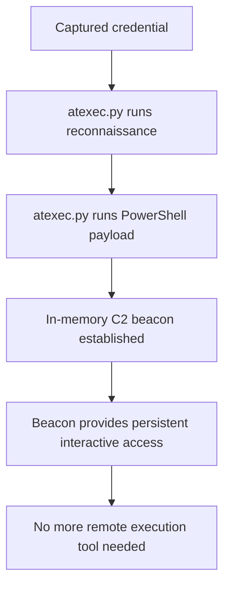

title: "atexec.py"
script: "examples/atexec.py"
category: "Remote Execution"
status: "Published"
protocols:
  - SMB
  - MSRPC
  - TSCH
ms_specs:
  - MS-TSCH
  - MS-TSCHS
  - MS-SMB2
  - MS-RPCE
mitre_techniques:
  - T1053.005
  - T1021.002
  - T1078
  - T1550.002
auth_types:
  - password
  - nt_hash
  - aes_key
  - kerberos_ccache
tags:
  - impacket
  - impacket/examples
  - category/remote_execution
  - status/published
  - protocol/smb
  - protocol/msrpc
  - protocol/tsch
  - authentication/ntlm
  - authentication/kerberos
  - technique/scheduled_task
  - technique/task_scheduler
  - technique/pass_the_hash
  - technique/admin_share_abuse
  - mitre/T1053/005
  - mitre/T1021/002
  - mitre/T1078
  - mitre/T1550/002
aliases:
  - atexec
  - impacket-atexec
  - task_scheduler_exec
  - remote_task_execution


# atexec.py

> **One line summary:** Executes a single command on a remote Windows host by registering and running a temporary scheduled task via the Task Scheduler Remoting Protocol, capturing command output to a file in the target's `%TEMP%` directory and reading it back via the ADMIN$ share, producing a completely different log signature from the SCMR and DCOM based tools because the primary Windows event is a task creation (4698) rather than a service creation (7045) or WMI process spawn.

| Field | Value |
|:---|:---|
| Script | `examples/atexec.py` |
| Category | Remote Execution |
| Status | Published |
| Primary protocols | SMB, MSRPC, TSCH |
| Primary Microsoft specifications | `[MS-TSCH]`, `[MS-TSCHS]`, `[MS-SMB2]`, `[MS-RPCE]` |
| MITRE ATT&CK techniques | T1053.005 Scheduled Task, T1021.002 SMB/Admin Shares, T1078 Valid Accounts, T1550.002 Pass the Hash |
| Authentication types supported | Password, NT hash, AES key, Kerberos ccache |
| First appearance in Impacket | Early Impacket |
| Original author | Alberto Solino (`@agsolino`) |


## Prerequisites

This article builds on:

- [`00_Introduction_and_Architecture.md`](Introduction_and_Architecture.md) for the Impacket stack overview.
- [`smbclient.py`](../05_smb_tools/smbclient.md) for SMB session foundations, `ADMIN$` share context, and the four authentication modes.
- [`rpcdump.py`](../01_recon_and_enumeration/rpcdump.md) for DCE/RPC and interface UUIDs.
- [`psexec.py`](psexec.md), [`wmiexec.py`](wmiexec.md), and [`smbexec.py`](smbexec.md) for the comparison baseline. This article builds on the "big three" foundation and refers back to their comparison table.


## What it does

`atexec.py` executes a command on a remote Windows host by creating a temporary scheduled task via the Task Scheduler Remoting Protocol, running it, capturing its output, and deleting the task. Unlike the other remote execution tools in the suite, `atexec.py` runs a single command and exits; there is no semi interactive shell mode.

The mechanism in brief:

1. Connect to the target via SMB and open the Task Scheduler RPC pipe.
2. Construct an XML task definition that wraps the user's command with output redirection.
3. Register the task via `SchRpcRegisterTask`.
4. Run the task via `SchRpcRun`.
5. Wait for the command to complete.
6. Read the output file from `%TEMP%` via SMB on `ADMIN$`.
7. Delete the task via `SchRpcDelete`.
8. Delete the output file.

The resulting process runs as `NT AUTHORITY\SYSTEM` by default because the task's principal is configured to use the built in SYSTEM account. This matches `psexec.py` and `smbexec.py` which also run as SYSTEM, and contrasts with [`wmiexec.py`](wmiexec.md) which runs as the authenticated user.

The key differentiator is the log signature. Where `psexec.py` and `smbexec.py` produce service creation events (7045) and `wmiexec.py` produces WMI provider activity, `atexec.py` produces **scheduled task events (4698 Task Scheduled)**. Environments with mature detection for service and WMI activity often have less coverage of scheduled task events, which is part of why `atexec.py` is sometimes chosen in specific operational contexts.

The tool is useful when:

- Service based execution tools are blocked or heavily monitored.
- WMI is restricted (a common hardening baseline in some environments).
- The attacker wants to blend in with the ordinary administrative use of scheduled tasks.
- A single command execution is sufficient (no interactive shell needed).


## Why it exists

The `at` command in Windows dates to Windows NT 4.0 and was the original scheduled task mechanism. Microsoft deprecated the old `at` interface in Windows Vista and replaced it with the modern Task Scheduler 2.0 infrastructure, but the SMB named pipe name remained `\pipe\atsvc` for backward compatibility. Impacket's tool takes its name from the `at` legacy even though the actual RPC calls it makes target the modern Task Scheduler.

The modern Task Scheduler is a full featured job scheduling system. It supports triggers (time based, event based, startup), conditions (idle, power, network), actions (run executables, send email, display message), and security principals (run as specific user, SYSTEM, or Service account). The XML task definition format is standardized in `[MS-TSCHS]` (Task Scheduler Schema).

The reason `atexec.py` exists rather than relying on `psexec.py`: environments that have hardened against service creation (SCMR monitoring, RemoteRegistry disabled, service creation rate limits) may still permit scheduled task creation because scheduled tasks are so commonly used for legitimate administration. Every Windows Update installation creates scheduled tasks. Every enterprise management tool uses them. Blocking scheduled task creation wholesale is not operationally feasible.

Alberto Solino built `atexec.py` alongside the other execution tools to give operators a choice of mechanism. The implementation has remained relatively stable over time because the underlying Task Scheduler interface is stable; Microsoft has added features but not broken the existing API.


## The protocol theory

The SMB and MSRPC foundations are in earlier articles. What follows is the material specific to Task Scheduler.

### The Task Scheduler Remoting Protocol

The protocol is specified in `[MS-TSCH]`. It actually covers three related interfaces:

- **The legacy AT interface** (UUID `1ff70682-0a51-30e8-076d-740be8cee98b`). The original NT 4.0 era interface. Still present on modern Windows for backward compatibility but functionally deprecated.
- **The SASec interface** (UUID `378e52b0-c0a9-11cf-822d-00aa0051e40f`). An intermediate interface from the Vista / Server 2003 era.
- **The Task Scheduler 2.0 interface** (UUID `86d35949-83c9-4044-b424-db363231fd0c`). The modern interface, used by `schtasks.exe`, the Task Scheduler MMC snap in, and `atexec.py`.

All three interfaces are exposed on the `\pipe\atsvc` named pipe. The client chooses which one to bind to by specifying the UUID in the DCERPC bind. `atexec.py` always binds to the Task Scheduler 2.0 interface.

The key methods on the Task Scheduler 2.0 interface:

| Method | Purpose |
|:---|:---|
| `SchRpcRegisterTask` | Create a new task with a specified XML definition. |
| `SchRpcRun` | Start a registered task immediately. |
| `SchRpcDelete` | Remove a task from the scheduler. |
| `SchRpcEnable` | Enable or disable a task. |
| `SchRpcGetInstanceInfo` | Get information about a running task instance. |
| `SchRpcStop` | Stop a running task instance. |
| `SchRpcEnumTasks` | Enumerate tasks in a folder. |
| `SchRpcRetrieveTask` | Get the XML for an existing task. |

`atexec.py` uses `SchRpcRegisterTask`, `SchRpcRun`, and `SchRpcDelete` in that order for every invocation.

### The task XML format

The task definition is a UTF-16 XML document conforming to the schema in `[MS-TSCHS]`. The minimum required elements: an `<Actions>` section describing what to run, a `<Principals>` section describing who to run as, and a `<RegistrationInfo>` section identifying the task.

The XML `atexec.py` constructs looks approximately like this:

```xml
<?xml version="1.0" encoding="UTF-16"?>
<Task version="1.2" xmlns="http://schemas.microsoft.com/windows/2004/02/mit/task">
  <Triggers>
    <CalendarTrigger>
      <StartBoundary>2025-01-01T00:00:00</StartBoundary>
      <ScheduleByDay><DaysInterval>1</DaysInterval></ScheduleByDay>
    </CalendarTrigger>
  </Triggers>
  <Principals>
    <Principal id="LocalSystem">
      <UserId>S-1-5-18</UserId>
      <RunLevel>HighestAvailable</RunLevel>
    </Principal>
  </Principals>
  <Settings>
    <MultipleInstancesPolicy>IgnoreNew</MultipleInstancesPolicy>
    <DisallowStartIfOnBatteries>false</DisallowStartIfOnBatteries>
    <StopIfGoingOnBatteries>false</StopIfGoingOnBatteries>
    <AllowHardTerminate>true</AllowHardTerminate>
    <RunOnlyIfNetworkAvailable>false</RunOnlyIfNetworkAvailable>
    <IdleSettings><StopOnIdleEnd>true</StopOnIdleEnd><RestartOnIdle>false</RestartOnIdle></IdleSettings>
    <AllowStartOnDemand>true</AllowStartOnDemand>
    <Enabled>true</Enabled>
    <Hidden>true</Hidden>
    <RunOnlyIfIdle>false</RunOnlyIfIdle>
    <WakeToRun>false</WakeToRun>
    <ExecutionTimeLimit>P3D</ExecutionTimeLimit>
    <Priority>7</Priority>
  </Settings>
  <Actions Context="LocalSystem">
    <Exec>
      <Command>cmd.exe</Command>
      <Arguments>/C whoami &gt; %TEMP%\XmKLpWqR.tmp 2&gt;&amp;1</Arguments>
    </Exec>
  </Actions>
</Task>
```

Notable elements:

- **`<Principal id="LocalSystem">` with `<UserId>S-1-5-18</UserId>`.** This is why the task runs as SYSTEM. The SID `S-1-5-18` is the well known SID for `NT AUTHORITY\SYSTEM`. `HighestAvailable` RunLevel requests elevated token, which SYSTEM always has.
- **`<Hidden>true</Hidden>`.** The task does not appear in the default view of the Task Scheduler MMC. This is a mild anti forensic measure but has no effect on event log entries.
- **`<CalendarTrigger>`.** The task has a trigger but the trigger points to a past time (`2025-01-01T00:00:00` in the example). The trigger is effectively dormant; the tool calls `SchRpcRun` to launch the task immediately rather than waiting for the trigger to fire naturally.
- **`<Arguments>`.** The actual command is in the `Arguments` element of the `<Exec>` action, wrapped with `cmd.exe /C` and output redirection.

### The output capture pattern

The task's Arguments value wraps the user's command with output redirection to a file in `%TEMP%`:

```text
/C <user_command> > %TEMP%\<random_8_chars>.tmp 2>&1
```

Because the task runs as SYSTEM, `%TEMP%` resolves to `C:\Windows\Temp` (the SYSTEM profile's temp directory, not the authenticated user's). The output file is written there.

The tool reads the file via SMB on the `ADMIN$` share, which maps to `C:\Windows`. Navigating to `\Windows\Temp\<file>.tmp` within `ADMIN$` is how the output gets retrieved.

The `-silentcommand` flag skips the output redirection entirely. The command is just placed in the Arguments element verbatim and the tool does not attempt to read output. Useful for fire and forget payloads.

### Session based execution

The `-session-id <id>` flag uses a different task trigger that runs the task in a specific user's logon session rather than as SYSTEM. Useful for attacks that need to execute in an interactive user's context: screen capture, UI automation, credential harvesting from the user's desktop.

The flag requires that the specified session exists on the target (a user with that session ID must be logged in). The tool checks for this and reports `The specified session doesn't exist!` if the session is invalid.

### Why single command and not interactive

Unlike `psexec.py`, `smbexec.py`, and `wmiexec.py`, `atexec.py` does not support semi interactive mode. The reason is the task lifecycle: tasks are registered, run, and then completed. The task completing is what signals that the output is available to read. An interactive shell would require either a long running task that accepts stdin (complex and detectable) or a new task per command (operationally viable but would generate many 4698 events per session).

The design point is to keep the tool simple and avoid generating the detection signal volume that `smbexec.py`'s service per command approach produces. Single command per invocation is the simplest design that works.

### Comparison with siblings

Updating the comparison table from earlier articles with `atexec.py`:

| Tool | Mechanism | Windows Event | Execution context | Interactive? | Runs as |
|:---|:---||:---|:---||
| `psexec.py` | SCMR + RemComSvc + named pipes | 7045 (Service Installed) | Service binary | Yes (full) | SYSTEM |
| `smbexec.py` | SCMR + echo to batch + output file | 7045 + 7009 per command | Service exec | Yes (semi) | SYSTEM |
| `wmiexec.py` | DCOM + Win32_Process::Create | No service event | WmiPrvSE child | Yes (semi) | User |
| `atexec.py` (this article) | Task Scheduler SchRpcRegisterTask | 4698 (Task Scheduled) | Scheduled task | No | SYSTEM (default) |
| `dcomexec.py` | DCOM + MMC20/ShellWindows | No service event | mmc.exe/explorer.exe child | Yes (semi) | User |


## How the tool works internally

The script is one of the smaller remote execution tools in the suite because the per command workflow is streamlined.

1. **Argument parsing.** Standard target string plus `command` (positional, variadic), `-session-id`, `-silentcommand`, `-keytab`, `-codec`, and authentication flags.

2. **Credential resolution and SMB connection.** An SMB session is established. The session is used both for the RPC binding (via `\pipe\atsvc`) and for reading the output file via `ADMIN$`.

3. **DCERPC bind.** Open `\pipe\atsvc`, bind to the Task Scheduler 2.0 interface (UUID `86d35949-83c9-4044-b424-db363231fd0c`).

4. **Task name generation.** Random 8 character ASCII string. This becomes both the task name and the output file name (`<taskname>.tmp`).

5. **XML construction.** The tool builds the task XML with the user's command embedded in the Arguments element. If `-session-id` was specified, the XML is adjusted to run under a session trigger rather than as SYSTEM. If `-silentcommand` was specified, the output redirection is omitted.

6. **Task registration.** Call `SchRpcRegisterTask` with the path `\<taskname>` (the task is registered at the root of the task scheduler tree), the XML, the `TASK_CREATE` flag (`0x2`), and `TASK_LOGON_NONE` (the task will use the credentials from its `<Principal>` element).

7. **Task execution.** Call `SchRpcRun` with the task path and the appropriate flags. If `-session-id` was specified, `TASK_RUN_USE_SESSION_ID` is set and the session ID is passed. Otherwise, the task runs under its configured principal (SYSTEM).

8. **Output polling.** The tool attempts to read the output file via SMB. If the file does not exist yet (command still running), it retries after a short delay. Up to 10 attempts with increasing backoff.

9. **Output display.** The file contents are decoded using the specified codec (or the system default) and printed to stdout.

10. **Cleanup.** Call `SchRpcDelete` to remove the task. Delete the output file via SMB. Close the RPC binding and SMB session.

11. **Error handling.** Specific errors are decoded helpfully:
    - `ERROR_FILE_NOT_FOUND` on `SchRpcRun` with a session ID usually means the session does not exist.
    - `E_INVALIDARG` similarly indicates session issues.
    - Timeout reading the output file usually means the command produced no output or is still running.


## Authentication options

Standard four mode pattern from [`smbclient.py`](../05_smb_tools/smbclient.md).

### Cleartext password

```bash
atexec.py CORP.LOCAL/admin:'P@ss'@target.corp.local whoami
```

### NT hash (pass the hash)

```bash
atexec.py -hashes :<nthash> CORP.LOCAL/admin@target.corp.local whoami
```

### AES key

```bash
atexec.py -aesKey <hex> CORP.LOCAL/admin@target.corp.local whoami
```

### Kerberos ccache

```bash
export KRB5CCNAME=admin.ccache
atexec.py -k -no-pass CORP.LOCAL/admin@target.corp.local whoami
```

### Minimum required privileges

The authenticated user must have:

- SMB access to the target (ports 445 or 139).
- Write access to the `ADMIN$` share (for output retrieval).
- Permission to create, run, and delete scheduled tasks on the target.

In practice, this combination is held by local administrators. Non administrator accounts with the "Log on as a batch job" privilege can create tasks but cannot typically create tasks running as SYSTEM, which limits the attack's utility.


## Practical usage

### Simple command execution

```bash
atexec.py CORP.LOCAL/admin:'P@ss'@target.corp.local whoami
```

Output:

```text
Impacket v0.13.0 - Copyright Fortra, LLC and its affiliated companies

[!] This will work ONLY on Windows >= Vista
[*] Creating task \XmKLpWqR
[*] Running task \XmKLpWqR
[*] Deleting task \XmKLpWqR
[*] Attempting to read ADMIN$\Temp\XmKLpWqR.tmp
nt authority\system
```

The sequence is visible in the tool output: create task, run task, delete task, read output. The command result (`nt authority\system`) confirms the task ran as SYSTEM.

### Execute a PowerShell command

```bash
atexec.py CORP.LOCAL/admin:'P@ss'@target.corp.local \
  "powershell -e <base64_encoded_command>"
```

PowerShell with base64 encoded command is the most common payload pattern. Useful for dropping C2 beacons or running reconnaissance scripts without writing to disk.

### Pass the hash

```bash
atexec.py -hashes aad3b435b51404eeaad3b435b51404ee:8846f7eaee8fb117ad06bdd830b7586c \
  CORP.LOCAL/admin@target.corp.local whoami
```

Standard workflow. The hash typically comes from [`secretsdump.py`](../03_credential_access/secretsdump.md).

### Silent command (no output capture)

```bash
atexec.py -silentcommand CORP.LOCAL/admin:'P@ss'@target.corp.local \
  "powershell -e <base64_payload>"
```

Skips the output redirection and the ADMIN$ read. The command runs but no output is retrieved. Useful for:

- Fire and forget payloads (C2 beacons, persistence installers).
- Environments where ADMIN$ is not accessible.
- Reducing the SMB footprint for stealth.

### Run in an existing user session

```bash
atexec.py -session-id 2 CORP.LOCAL/admin:'P@ss'@target.corp.local \
  "calc.exe"
```

The `-session-id 2` flag tells the task to run in logon session ID 2 rather than as SYSTEM. Use this when:

- The command needs to interact with the desktop (UI tools).
- The attacker wants the process to appear under a specific user's context.
- Credential harvesting from the active user's environment is the goal.

Finding the session ID requires prior reconnaissance. The `quser` command on a remote shell shows active sessions and their IDs.

### Kerberos with a forged Service Ticket

```bash
export KRB5CCNAME=Administrator@cifs_target.corp.local@CORP.LOCAL.ccache
atexec.py -k -no-pass CORP.LOCAL/Administrator@target.corp.local whoami
```

Works identically to the siblings with forged tickets from [`getST.py`](../02_kerberos_attacks/getST.md).

### Key flags

| Flag | Meaning |
|:---|:---|
| `command` (positional, variadic) | Command to execute. |
| `-session-id <id>` | Run in the specified logon session instead of as SYSTEM. |
| `-silentcommand` | Skip output capture. |
| `-codec <codec>` | Output encoding. |
| `-keytab <file>` | Kerberos keytab file. |
| `-hashes`, `-aesKey`, `-k`, `-no-pass` | Standard authentication flags. |
| `-dc-ip`, `-target-ip` | Explicit DC or target IP. |


## What it looks like on the wire

The wire pattern is short and distinctive.

### Session setup

- TCP connection to port 445 (SMB) on the target.
- SMB session establishment with NTLM or Kerberos authentication.
- Tree connect to `IPC$`.
- SMB `CREATE` on `\pipe\atsvc`.
- DCERPC bind to the Task Scheduler 2.0 interface.

### Task lifecycle

- `SchRpcRegisterTask` call with the XML task definition.
- `SchRpcRun` call to execute the task.
- Multiple short waits, each checking for the output file.

### Output retrieval

- Tree connect to `ADMIN$`.
- SMB `CREATE` on `\Temp\<taskname>.tmp`.
- SMB `READ` for the file content.
- SMB `CREATE` + `SET_INFO` (delete on close) + `CLOSE` to delete the file.

### Task cleanup

- `SchRpcDelete` to remove the task.
- SMB session close.

### Wireshark filters

```text
dcerpc.if_id == "86d35949-83c9-4044-b424-db363231fd0c"   # Task Scheduler 2.0 interface
smb2 and smb2.filename contains "atsvc"                    # Task Scheduler named pipe
smb2 and smb2.filename matches "\\.tmp$"                   # output file pattern
smb2 and smb2.filename contains "Windows\\Temp"            # %TEMP% access
```

The specific interface UUID is the strongest signal. The task XML in `SchRpcRegisterTask` contains the command in plain form if RPC signing/sealing is not enforced.


## What it looks like in logs

Scheduled task logging is well developed in Windows and `atexec.py` produces clear signals in multiple log channels.

### Event ID 4698: A Scheduled Task Was Created

The primary signal. Fires on the target in the Security log when `SchRpcRegisterTask` succeeds. The event contains:

| Field | Value |
|:---|:---|
| TaskName | `\<random_8_chars>`. |
| TaskContent | The full XML task definition, including the command in the `<Arguments>` element. |
| SubjectUserName | The authenticating account. |
| SubjectUserSid | The authenticating account's SID. |

The complete XML inside the event is the highest fidelity detection signal. The command being executed is visible. The `<Hidden>true</Hidden>` element is visible. The `<Principal>` with SID `S-1-5-18` is visible. The `<Arguments>` containing `> %TEMP%\<random>.tmp 2>&1` is visible.

A 4698 event where the TaskName is random 8 characters, the principal is LocalSystem (SID `S-1-5-18`), and the Arguments include `> %TEMP%\` redirection is essentially diagnostic of `atexec.py`.

### Event ID 4699: A Scheduled Task Was Deleted

Fires when `SchRpcDelete` is called. Paired with 4698 for every `atexec.py` invocation. The 4698 + 4699 pair within a short window (typically under 10 seconds because the task runs quickly) is a strong detection pattern.

### Event IDs 4700, 4701, 4702

- **4700** Task Enabled.
- **4701** Task Disabled.
- **4702** Task Updated.

Rarely fire for `atexec.py` because the tool creates an already enabled task and does not modify it after creation. Present in the toolkit of task audit events but not direct `atexec.py` signals.

### Microsoft Windows TaskScheduler Operational log

A separate log at `Microsoft-Windows-TaskScheduler/Operational`. Requires task history to be enabled in the Task Scheduler MMC. When enabled, it produces a much richer event trail:

| Event ID | Meaning |
|:---|:---|
| 106 | Task Registered. |
| 140 | Task Updated. |
| 141 | Task Deleted. |
| 129 | Created Task Process. |
| 200 | Action Started. |
| 201 | Action Completed. |
| 102 | Task Completed. |
| 100 | Task Started. |

These are the events the Task Scheduler UI displays when you click on a task's History tab. They do not include the full task XML (unlike 4698) but include the command line, the user context, and precise timestamps for each phase of task execution.

### Event ID 4688 / Sysmon 1: Process Creation

When the task runs, process creation events fire:

| Field | Value |
|:---|:---|
| NewProcessName | `C:\Windows\System32\cmd.exe` (default; changes with `-silentcommand` and custom commands). |
| ParentProcessName | `C:\Windows\System32\svchost.exe` (the task scheduler service host). |
| CommandLine | `cmd.exe /C <user_command> > %TEMP%\<random>.tmp 2>&1`. |
| AccountName | `SYSTEM` (by default) or the specified session user. |

The parent process `svchost.exe` with the task scheduler service identifier is the signature. Combined with the `> %TEMP%\` redirection in the command line, the detection is high confidence.

### Event ID 5145: Detailed File Share Access

- Access to `IPC$\atsvc` named pipe for the RPC calls.
- Access to `ADMIN$\Temp\<random>.tmp` for output retrieval.

Requires "Audit Detailed File Share" to be enabled.

### Starter Sigma rules

```yaml
title: Impacket atexec Task Creation
logsource:
  product: windows
  service: security
detection:
  selection:
    EventID: 4698
    TaskName|re: '\\[A-Za-z0-9]{8}$'
    TaskContent|contains:
      - 'S-1-5-18'
      - '%TEMP%\\'
      - '.tmp'
  condition: selection
level: high
```

Matches the random task name plus the SYSTEM principal plus the temp file pattern.

```yaml
title: Scheduled Task Created and Deleted Rapidly
logsource:
  product: windows
  service: security
detection:
  task_created:
    EventID: 4698
  task_deleted:
    EventID: 4699
  timeframe: 60s
  condition: task_created and task_deleted
level: high
```

The 4698 + 4699 correlation within a minute catches `atexec.py` regardless of content details.

```yaml
title: Svchost Spawning Command Shell
logsource:
  product: windows
  category: process_creation
detection:
  selection:
    ParentImage|endswith: 'svchost.exe'
    Image|endswith:
      - 'cmd.exe'
      - 'powershell.exe'
    CommandLine|contains: '%TEMP%\\'
  condition: selection
level: high
```

Catches the process creation pattern. Some false positives from legitimate scheduled tasks but tunable.


## Detection and defense

### Detection opportunities

The detection story for `atexec.py` is strong because scheduled task logging is mature.

**4698 Task Scheduled from remote source.** Any 4698 event where the `SubjectLogonId` corresponds to a network logon (from a 4624 with Logon Type 3) is worth investigating. Legitimate scheduled task creation from remote sources is rare in most environments, which makes this signal relatively low noise.

**Random 8 character task names.** Legitimate task names are usually descriptive (`GoogleUpdater`, `Microsoft-Compatibility-Appraiser`, `UserCleanup`). Random 8 character task names are anomalous by default.

**SYSTEM principal from non administrative creators.** A non administrative user creating a SYSTEM task is an anomaly regardless of the specific payload. Admin users creating SYSTEM tasks is routine.

**4698 + 4699 correlation.** The create then delete within seconds is distinctive. Legitimate tasks are created and persist.

**Svchost spawning cmd/powershell.** High signal detection when tuned. Some legitimate scheduled tasks do spawn cmd but the command line patterns are usually predictable.

### Preventive controls

Scheduled task creation is widely used by legitimate tooling, which constrains the preventive options. Most controls focus on monitoring rather than blocking.

- **Enable Microsoft Windows TaskScheduler Operational log and collect it.** The richer event stream is useful for investigation after the fact.
- **Restrict local administrator rights.** The tool requires local administrator. LAPS (Local Administrator Password Solution) is the standard approach to limiting the blast radius.
- **Monitor 4698 events.** The Sigma rules above. Very high signal in most environments.
- **Restrict the "Log on as batch job" privilege.** Prevents non administrative accounts from creating tasks. Default in hardened configurations.
- **Network segmentation.** Block SMB between workstation segments. The atsvc RPC pipe rides over SMB, so SMB segmentation blocks it too.
- **Credential Guard.** Protects the credentials that `atexec.py` consumes.
- **Windows Defender Attack Surface Reduction rules.** The ASR rule "Block persistence through WMI event subscription" catches some related patterns though not atexec directly. Other ASR rules may apply.
- **AppLocker or WDAC.** Constrain what programs can run, which limits post execution capability even if atexec succeeds in running cmd.


## Related tools and attack chains

`atexec.py` is the fourth of the five Impacket remote execution tools. The expanded comparison table in the protocol theory section shows how it fits among the siblings.

When to choose `atexec.py`:

- **SCMR based execution tools are blocked or monitored.** `psexec.py` and `smbexec.py` both depend on service creation.
- **WMI is disabled.** `wmiexec.py` depends on DCOM/WMI.
- **A single command is sufficient.** No interactive shell needed.
- **SYSTEM execution is required and the above constraints apply.** Only SCMR based tools and `atexec.py` run as SYSTEM.

### Tools that feed `atexec.py`

Same as the siblings:

- [`secretsdump.py`](../03_credential_access/secretsdump.md) for NT hashes.
- [`getTGT.py`](../02_kerberos_attacks/getTGT.md) for TGTs.
- [`getST.py`](../02_kerberos_attacks/getST.md) for forged Service Tickets from delegation attacks.

### Typical follow on actions

Because `atexec.py` executes a single command, the typical use is to run a payload that establishes a persistent foothold. Common patterns:

- Deploy a C2 beacon via PowerShell one liner.
- Execute an in memory tool for credential harvesting.
- Run a reconnaissance script.
- Install persistence (service, run key, scheduled task permanent).
- Drop and execute additional tooling from a file share.

For iterative execution with output, operators typically switch to [`wmiexec.py`](wmiexec.md) or [`psexec.py`](psexec.md) instead after the initial foothold is established.

### A canonical stealth escalation chain



The workflow: use `atexec.py` to land the initial payload, then switch to the payload's own capabilities. This avoids generating the repeated 4698 events that continuous `atexec.py` use would produce.


## Further reading

- **`[MS-TSCH]`: Task Scheduler Service Remoting Protocol.** `https://learn.microsoft.com/en-us/openspecs/windows_protocols/ms-tsch/`. The authoritative specification. Sections 3.2.5 (Server) and 3.3.5 (Client) cover the method call details.
- **`[MS-TSCHS]`: Task Scheduler Schema.** `https://learn.microsoft.com/en-us/openspecs/windows_protocols/ms-tschs/`. The task XML schema.
- **Microsoft Task Scheduler Reference** at `https://learn.microsoft.com/en-us/windows/win32/taskschd/task-scheduler-start-page`. General reference for Task Scheduler 2.0.
- **Cyber Triage "DFIR Breakdown: Impacket Remote Execution Activity - Atexec"** at `https://www.cybertriage.com/blog/dfir-breakdown-impacket-remote-execution-activity-atexec/`. Detection focused walkthrough with event examples.
- **The Hacker Tools "atexec.py"** at `https://tools.thehacker.recipes/impacket/examples/atexec.py`. Quick reference with command line options.
- **SANS "Finding Evil with Windows Scheduled Tasks"** at various SANS blog archives. General guidance on task analysis for DFIR.
- **MITRE ATT&CK T1053.005 Scheduled Task** at `https://attack.mitre.org/techniques/T1053/005/`. The technique reference. Includes defensive mitigations and real world adversary uses.
- **Logpoint "The Impacket Arsenal: A Deep Dive into Impacket Remote Code Execution Tools"** at `https://logpoint.com/en/blog/the-impacket-arsenal-a-deep-dive-into-impacket-remote-code-execution-tools`. Recent (2025) comparison of all five remote execution tools including atexec.

If you want to internalize the mechanism, run `atexec.py` against a lab target with the Task Scheduler Operational log enabled. Observe the full event sequence: 4698 (registered), 100 (started), 200 (action started), 4688 (process created with svchost parent), 201 (action completed), 102 (task completed), 141 (deleted), 4699 (deleted in security log). The complete chain of eight events from a single command execution is the clearest illustration of how richly instrumented scheduled tasks are. Once you have seen this sequence, the detection rules stop feeling arbitrary and become recognition of the specific evidence that Windows is already recording for you.
