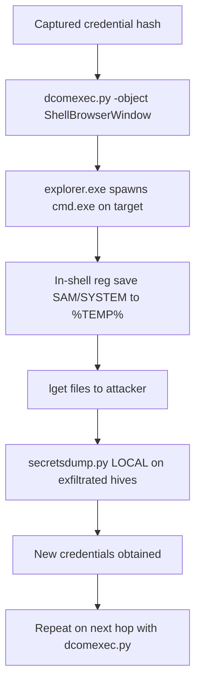

title: "dcomexec.py"
script: "examples/dcomexec.py"
category: "Remote Execution"
status: "Published"
protocols:
  - DCOM
  - MSRPC
  - SMB
ms_specs:
  - MS-DCOM
  - MS-OAUT
  - MS-RPCE
  - MS-SMB2
mitre_techniques:
  - T1021.003
  - T1559.001
  - T1078
  - T1550.002
auth_types:
  - password
  - nt_hash
auth_notes:
  - "Kerberos authentication is currently not supported due to a checksum mismatch issue flagged in the source. NTLM variants only."
tags:
  - impacket
  - impacket/examples
  - category/remote_execution
  - status/published
  - protocol/dcom
  - protocol/msrpc
  - protocol/smb
  - authentication/ntlm
  - technique/dcom_abuse
  - technique/com_object_abuse
  - technique/pass_the_hash
  - technique/admin_share_abuse
  - mitre/T1021/003
  - mitre/T1559/001
  - mitre/T1078
  - mitre/T1550/002
aliases:
  - dcomexec
  - impacket-dcomexec
  - dcom_exec


# dcomexec.py

> **One line summary:** The stealthiest of Impacket's five remote execution tools. Executes commands on remote Windows hosts by invoking methods on legitimate COM objects that happen to accept arbitrary shell commands as parameters, producing process creation events where the parent process is `mmc.exe` or `explorer.exe` rather than a service host or WMI provider, which makes default EDR parent-child detection rules that target service and WMI parents completely ineffective.

| Field | Value |
|:---|:---|
| Script | `examples/dcomexec.py` |
| Category | Remote Execution |
| Status | Published |
| Primary protocols | DCOM, MSRPC, SMB |
| Primary Microsoft specifications | `[MS-DCOM]`, `[MS-OAUT]`, `[MS-RPCE]`, `[MS-SMB2]` |
| MITRE ATT&CK techniques | T1021.003 Distributed Component Object Model, T1559.001 Component Object Model, T1078 Valid Accounts, T1550.002 Pass the Hash |
| Authentication types supported | Password, NT hash (Kerberos not currently supported, per source comments) |
| First appearance in Impacket | 2017, following Matt Nelson's research |
| Original author | Alberto Solino (`@agsolino`) for the Impacket implementation; the DCOM object techniques themselves were researched and published by Matt Nelson (`@enigma0x3`) |


## Prerequisites

This article builds on:

- [`00_Introduction_and_Architecture.md`](Introduction_and_Architecture.md) for the Impacket stack overview.
- [`smbclient.py`](../05_smb_tools/smbclient.md) for SMB session foundations and `ADMIN$` share context.
- [`rpcdump.py`](../01_recon_and_enumeration/rpcdump.md) for DCE/RPC and interface UUIDs.
- [`wmiexec.py`](wmiexec.md) for COM/DCOM foundations, the `CoCreateInstanceEx` pattern, the IDispatch interface, and the `\\127.0.0.1\ADMIN$\__<file>` output capture pattern. **This article assumes the wmiexec foundations and does not repeat them.**
- [`psexec.py`](psexec.md), [`smbexec.py`](smbexec.md), and [`atexec.py`](atexec.md) for the comparison context and the family of execution tools.


## What it does

`dcomexec.py` executes commands on remote Windows hosts by activating legitimate COM objects over DCOM and invoking methods on them that happen to execute arbitrary commands. Unlike [`wmiexec.py`](wmiexec.md), which uses the purpose built `Win32_Process::Create` WMI method, `dcomexec.py` uses COM objects that were never intended as remote execution primitives but whose method signatures accept a shell command parameter.

The three COM objects the tool supports are:

| Object | CLSID | Method chain | Parent process |
|:---|:---|||
| `MMC20.Application` | `49B2791A-B1AE-4C90-9B8E-E860BA07F889` | `Document.ActiveView.ExecuteShellCommand` | `mmc.exe` |
| `ShellWindows` (default) | `9BA05972-F6A8-11CF-A442-00A0C90A8F39` | `Item().Document.Application.ShellExecute` | `explorer.exe` |
| `ShellBrowserWindow` | `C08AFD90-F2A1-11D1-8455-00A0C91F3880` | `Document.Application.ShellExecute` | `explorer.exe` |

Each of these COM objects exists for legitimate reasons on every Windows host. MMC20.Application backs the Microsoft Management Console. ShellWindows and ShellBrowserWindow back the Windows shell (Explorer). They are fully documented Microsoft APIs with decades of history.

What makes them interesting as execution primitives: each exposes a method that takes a command line string as a parameter and then executes it. These methods were designed for the Shell's own internal use (launching a program from within Explorer, for example) but they remain callable remotely via DCOM when an attacker has appropriate permissions.

The mechanism in brief:

1. Establish a DCOM connection to the target.
2. `CoCreateInstanceEx` to activate one of the three COM objects.
3. Navigate the COM object's property/method chain to reach the execute method.
4. Invoke the execute method with the wrapped command.
5. Read output from `ADMIN$` via SMB (same pattern as [`wmiexec.py`](wmiexec.md)).

The output capture pattern, the semi interactive shell behavior, and the `cmd.exe /Q /c` wrapping are all identical to [`wmiexec.py`](wmiexec.md). What is unique is the stealth: the process that ultimately executes the user's command has `mmc.exe` or `explorer.exe` as its parent rather than `WmiPrvSE.exe` or `services.exe`, which almost entirely evades default detection rules focused on service and WMI based execution.


## Why it exists

This tool is the direct product of Matt Nelson's (`@enigma0x3`) 2017 research on lateral movement via DCOM. Nelson published two landmark posts:

- **January 5, 2017:** "Lateral Movement using the MMC20.Application COM Object" demonstrated that the `ExecuteShellCommand` method on `MMC20.Application.Document.ActiveView` could be invoked over DCOM to run arbitrary commands remotely.
- **January 23, 2017:** "Lateral Movement via DCOM: Round 2" extended the research to identify `ShellWindows` and `ShellBrowserWindow` as additional viable targets.

Nelson's insight was that the security community had been looking at DCOM execution through a narrow lens, focused only on WMI's `Win32_Process::Create`. A much broader surface of DCOM exposed methods could achieve the same outcome, and many had parent process patterns that defenders were not monitoring.

Within weeks of the publications, Alberto Solino added `dcomexec.py` to Impacket as a client implementation of all three techniques. The tool has remained relatively stable since then; no new DCOM objects have been added to the supported list (though subsequent research has identified others that could theoretically be incorporated, such as `Excel.Application`, `Outlook.Application`, and the Office automation suite).

The tool exists because defenders caught up to WMI execution through the 2010s. `WmiPrvSE.exe` spawning `cmd.exe` became a well known detection signature. Attackers needed alternative DCOM execution paths with different parent process signatures, and `dcomexec.py` provides exactly that.

The detection arms race has continued since 2017. Modern EDRs now include behavioral rules that catch `mmc.exe` and `explorer.exe` spawning command processors with suspicious command lines, but the detection is much less universal than the WMI equivalent. An environment with strong WMI detection frequently has no equivalent coverage for `dcomexec.py`.


## The protocol theory

The foundational material on COM, DCOM, and the IDispatch pattern is in [`wmiexec.py`](wmiexec.md). This section focuses on what is unique to `dcomexec.py`.

### IDispatch and COM automation

The three `dcomexec.py` targets all implement `IDispatch`, the COM interface for "automation" (the OLE automation model, originally designed for Visual Basic and scripting). IDispatch provides a late binding interface: clients can discover methods and properties by name at runtime rather than through compile time linkage.

The IDispatch methods the tool uses:

| Method | Purpose |
|:---|:---|
| `GetIDsOfNames` | Translate a method or property name into a dispatch ID (DISPID). |
| `Invoke` | Call a method or access a property by DISPID with specified parameters. |

The combination is powerful: given any COM object that exposes IDispatch, an attacker can discover what methods it has by name and invoke them with arbitrary parameters. The tool uses this to navigate through nested COM objects (for example, from `MMC20.Application` to its `Document` property to its `ActiveView` property to its `ExecuteShellCommand` method).

### The MMC20.Application technique

`MMC20.Application` is the automation interface for the Microsoft Management Console. It was designed for scripting MMC from VBScript or other automation clients. The method chain to execute a command:

```text
MMC20.Application (top-level object)
└── .Document (property, returns a _Document object)
    └── .ActiveView (property, returns an _ActiveView object)
        └── .ExecuteShellCommand(Command, Directory, Parameters, WindowState)
```

The `ExecuteShellCommand` method accepts four parameters:

- **Command**: the executable to run (for example, `cmd.exe`).
- **Directory**: the working directory (can be NULL).
- **Parameters**: command line arguments.
- **WindowState**: window state (minimized, normal, maximized). Attackers typically pass `Minimized`.

When invoked remotely, the MMC instance on the target spawns the specified process. Because the automation is running inside `mmc.exe`, the spawned process has `mmc.exe` as its parent.

### The ShellWindows technique

`ShellWindows` is a singleton COM object that represents the collection of currently open Explorer windows on a machine. Its method chain for execution:

```text
ShellWindows (singleton collection)
└── .Item() (returns an individual IShellWindow)
    └── .Document (property)
        └── .Application (property, returns IShellDispatch)
            └── .ShellExecute(File, Args, Directory, Operation, Show)
```

The `ShellExecute` method parallels the well known Win32 `ShellExecute` API but called via COM automation. It takes the file to execute, arguments, directory, operation ("open", "print", etc.), and window state.

The `.Item()` call returns the first available Explorer window. If no Explorer windows exist on the target (rare on workstations, more common on servers), the method fails. Interactive user sessions are therefore a prerequisite for this technique.

Because the automation runs inside `explorer.exe`, spawned processes have `explorer.exe` as their parent.

### The ShellBrowserWindow technique

`ShellBrowserWindow` is similar to ShellWindows but accessed differently. It does not require an existing Explorer window because it creates one implicitly:

```text
ShellBrowserWindow
└── .Document (property)
    └── .Application (property, returns IShellDispatch)
        └── .ShellExecute(File, Args, Directory, Operation, Show)
```

The `.ShellExecute` at the end is the same method as in the ShellWindows path. The parent process is also `explorer.exe`, because activating ShellBrowserWindow causes Explorer to be invoked.

This technique is generally more reliable than ShellWindows because it does not depend on an existing Explorer window being open.

### Why these objects are attractive execution primitives

The appeal has two parts:

**Parent process stealth.** EDR rules typically monitor:
- `services.exe` → suspicious children (catches `psexec.py` and `smbexec.py`).
- `WmiPrvSE.exe` → suspicious children (catches `wmiexec.py`).
- `svchost.exe` with scheduler identifier → suspicious children (catches `atexec.py`).

Rules targeting `mmc.exe` or `explorer.exe` as malicious parent processes are rare because these are ubiquitous legitimate parents. `mmc.exe` spawns all kinds of processes when admins use the MMC UI. `explorer.exe` is the parent of essentially every user launched program. Writing a rule that catches malicious use without producing thousands of false positives is hard.

**Detection tool blind spots.** Many security products specifically monitor WMI activity (through ETW providers, specifically `Microsoft-Windows-WMI-Activity`) but do not have equivalent visibility into DCOM activation events generally. The activation of a random COM object that happens to have execute-capable methods produces no WMI activity at all.

### Output capture pattern

Identical to [`wmiexec.py`](wmiexec.md):

```text
cmd.exe /Q /c <user_command> 1> \\127.0.0.1\ADMIN$\__<random>.<timestamp> 2>&1
```

The tool passes this wrapped command to the COM method. The target executes it (as a child of `mmc.exe` or `explorer.exe`), output goes to the ADMIN$ file, the tool reads the file via SMB, displays it, and deletes it.

The `-silentcommand` flag skips the cmd.exe wrapping. The command is passed directly to the COM method's file/command parameter. This runs the command without a cmd.exe intermediary, which is slightly stealthier but limits what can be run (no shell builtins, no redirection).

### The Kerberos limitation

The source code of `dcomexec.py` has a well known comment:

```text
# [ ] Kerberos auth not working, invalid_checksum is thrown.
#     Most probably sequence numbers out of sync due to...
```

Kerberos authentication does not work for DCOM activations in the current implementation, apparently due to sequence number handling in the DCOM RPC layer. NTLM variants (cleartext, hash, AES) work fine. This is an Impacket limitation, not a Windows or DCOM limitation; Windows tools can use Kerberos for DCOM normally.

Practical impact: `dcomexec.py` cannot be used with forged Service Tickets from [`getST.py`](../02_kerberos_attacks/getST.md) or with ccaches from [`getTGT.py`](../02_kerberos_attacks/getTGT.md). Attackers who need Kerberos for operational reasons (stealth, avoiding NTLM blocking) must fall back to the siblings.

### Comparison with siblings (final table)

Completing the Remote Execution family table:

| Tool | Mechanism | Windows Event | Parent process | Kerberos? | Stealth rank |
|:---|:---||:---|:---||
| `psexec.py` | SCMR + RemComSvc | 7045 (Service Installed) | Service binary | Yes | Low (loud) |
| `smbexec.py` | SCMR echo to batch | 7045 + 7009 | Service binary | Yes | Low (loudest) |
| `wmiexec.py` | DCOM + Win32_Process::Create | WMI activity | `WmiPrvSE.exe` | Yes | Medium |
| `atexec.py` | Task Scheduler | 4698 (Task Scheduled) | `svchost.exe` (sched host) | Yes | Medium |
| `dcomexec.py` (this article) | DCOM + MMC20/ShellWindows/ShellBrowserWindow | No distinct event | `mmc.exe` or `explorer.exe` | **No** | **High** |


## How the tool works internally

The implementation is smaller than `wmiexec.py`'s because the DCOM infrastructure is reused. The tool focuses on the specific COM object navigation.

1. **Argument parsing.** Standard target string plus `command` (positional, optional, variadic), `-object` (choice of three), `-com-version`, `-shell-type`, `-silentcommand`, `-share`, `-nooutput`, and authentication flags.

2. **Credential resolution and SMB connection.** An SMB connection is established for output retrieval (unless `-nooutput`).

3. **DCOM connection.** A `DCOMConnection` to the target, same as [`wmiexec.py`](wmiexec.md).

4. **Object activation.** `CoCreateInstanceEx` with the CLSID of the chosen object.
    - For `MMC20`: activate `MMC20.Application`.
    - For `ShellWindows`: activate the singleton.
    - For `ShellBrowserWindow`: activate it directly.

5. **IDispatch navigation.** The tool cast the returned interface to `IDispatch` and navigates through the property/method chain using `GetIDsOfNames` to find DISPIDs and `Invoke` to access them:
    - For MMC20: `.Document` → `.ActiveView` → `ExecuteShellCommand` method.
    - For ShellWindows: `.Item()` → `.Document` → `.Application` → `ShellExecute` method.
    - For ShellBrowserWindow: `.Document` → `.Application` → `ShellExecute` method.

6. **Remote shell handoff.** A `RemoteShell` or `RemoteShellMMC20` instance is created (different classes because MMC20 and the Shell objects have slightly different method signatures).

7. **Per command execution.**
    - For each user command, the tool prepends directory state tracking (`cd /d <current_dir> & `).
    - Wraps with `cmd.exe /Q /c ... 1> \\127.0.0.1\ADMIN$\<random_file> 2>&1` (unless `-silentcommand`).
    - Calls the appropriate COM method with the wrapped command as parameters.
    - Reads the output file via SMB.
    - Displays output.
    - Deletes the output file.

8. **Cleanup.** On exit, the tool calls a `Quit` method on the activated object where applicable (MMC20 specifically) to clean up the instance on the target, then disconnects DCOM and SMB.

9. **PowerShell shell type.** The `-shell-type powershell` option changes the wrapping to use `powershell.exe -NoP -NoL -sta -NonI -W Hidden -Enc <base64>`. The mechanism is otherwise identical.


## Authentication options

### Cleartext password

```bash
dcomexec.py CORP.LOCAL/admin:'P@ss'@target.corp.local
```

### NT hash (pass the hash)

```bash
dcomexec.py -hashes :<nthash> CORP.LOCAL/admin@target.corp.local
```

Pass the hash is the most common `dcomexec.py` invocation, same as the siblings.

### AES key

```bash
dcomexec.py -aesKey <hex> CORP.LOCAL/admin@target.corp.local
```

Note: this uses NTLM under the hood, not Kerberos, because of the Kerberos limitation mentioned above.

### Kerberos: not supported

The `-k` flag exists in the argument parser (inherited from the common Impacket argument group) but does not actually work for this tool. Attempting to use it produces an `invalid_checksum` error at the DCOM layer. Fall back to NTLM options.

### Minimum required privileges

The authenticated user must have:

- **DCOM Launch and Activation permissions** for the target COM object. Local administrators have this by default.
- **Permission to invoke the specific COM methods.** For the three objects used by `dcomexec.py`, local administrator is sufficient; there are no more specific ACLs to navigate.
- **SMB read access to `ADMIN$`** (unless `-nooutput`) for output retrieval.

All three are held together by local administrators, as with the siblings.


## Practical usage

### Default invocation (ShellWindows)

```bash
dcomexec.py CORP.LOCAL/admin:'P@ss'@target.corp.local whoami
```

Uses the default `ShellWindows` object. The command runs as the authenticated user (not SYSTEM) because DCOM activation uses the caller's identity, same as [`wmiexec.py`](wmiexec.md).

Output:

```text
Impacket v0.13.0 - Copyright Fortra, LLC and its affiliated companies

[*] SMBv3.0 dialect used
[!] Launching semi-interactive shell - Careful what you execute
[!] Press help for extra shell commands
C:\>whoami
corp\admin
```

### Using MMC20.Application

```bash
dcomexec.py -object MMC20 CORP.LOCAL/admin:'P@ss'@target.corp.local
```

The `mmc.exe` process on the target gets activated (spawning it if not already running). Commands executed have `mmc.exe` as the parent process.

Worth noting: `mmc.exe` is a legitimate management console binary. On administrator workstations it runs frequently as part of routine administration. Using MMC20 blends into that baseline noise more naturally than the Shell objects in environments where admin activity is common.

### Using ShellBrowserWindow

```bash
dcomexec.py -object ShellBrowserWindow CORP.LOCAL/admin:'P@ss'@target.corp.local
```

Preferred over the default ShellWindows when the target does not have an active Explorer window (for example, a server with no interactive user sessions). ShellBrowserWindow activates its own Explorer instance.

### Interactive semi interactive shell

```bash
dcomexec.py CORP.LOCAL/admin:'P@ss'@target.corp.local
```

Same semi interactive pattern as [`wmiexec.py`](wmiexec.md). Each command is a separate COM method invocation. Directory state is tracked client side. Mini shell commands (`lput`, `lget`, `lcd`, `!`, `exit`) work identically.

### Silent command mode

```bash
dcomexec.py -silentcommand CORP.LOCAL/admin:'P@ss'@target.corp.local \
  "powershell -e <base64_payload>"
```

Skips the cmd.exe wrapping. The command line is passed directly to the COM method. The spawned process is `powershell.exe` as a child of `explorer.exe` (or `mmc.exe` for MMC20) with no cmd.exe in between.

This is stealthier than the default because there is no intermediate cmd.exe. The direct parent-child of `explorer.exe` → `powershell.exe` without a cmd between is less suspicious than `explorer.exe` → `cmd.exe` → `powershell.exe` to most behavioral rules.

### PowerShell shell type

```bash
dcomexec.py -shell-type powershell CORP.LOCAL/admin:'P@ss'@target.corp.local
```

Uses PowerShell for the shell wrapping instead of cmd.exe. Each command is base64 encoded.

### Custom share

```bash
dcomexec.py -share C$ CORP.LOCAL/admin:'P@ss'@target.corp.local
```

Use `C$` instead of `ADMIN$` for output capture. Useful when `ADMIN$` access is restricted or monitored.

### No output mode

```bash
dcomexec.py -nooutput CORP.LOCAL/admin:'P@ss'@target.corp.local \
  "powershell -e <base64_beacon>"
```

Fire and forget. No SMB session established, no output file created. The DCOM activation succeeds, the COM method runs, the tool exits.

### Key flags

| Flag | Meaning |
|:---|:---|
| `command` (positional, variadic) | Command to execute. Empty drops into interactive shell. |
| `-object <name>` | `MMC20`, `ShellWindows` (default), or `ShellBrowserWindow`. |
| `-com-version <ver>` | DCOM version override (e.g., `5.7`). Rarely needed. |
| `-shell-type <type>` | `cmd` (default) or `powershell`. |
| `-silentcommand` | Skip cmd.exe wrapping. |
| `-share <share>` | Share for output capture (default `ADMIN$`). |
| `-nooutput` | Skip output capture. |
| `-hashes`, `-aesKey`, `-no-pass` | Standard authentication flags. |
| `-dc-ip`, `-target-ip` | Explicit DC or target IP. |

Note: `-k` exists but does not work. Kerberos is not supported.


## What it looks like on the wire

The DCOM and SMB traffic pattern parallels [`wmiexec.py`](wmiexec.md) but with different object CLSIDs and different method invocations.

### DCOM activation phase

- TCP to port 135 (RPC endpoint mapper) on the target.
- DCERPC bind to `ISystemActivator`.
- `RemoteCreateInstance` with the CLSID of the chosen object:
    - `49B2791A-B1AE-4C90-9B8E-E860BA07F889` for MMC20.
    - `9BA05972-F6A8-11CF-A442-00A0C90A8F39` for ShellWindows.
    - `C08AFD90-F2A1-11D1-8455-00A0C91F3880` for ShellBrowserWindow.
- Dynamic port allocated for the object's DCOM traffic.
- TCP to the dynamic port.

### Method invocation phase

- DCERPC bind on the dynamic port to `IDispatch` (or to the object's specific interface).
- `GetIDsOfNames` calls to resolve method and property names into DISPIDs.
- `Invoke` calls to access properties and methods. Depending on the object, multiple Invoke calls chain to reach the execute method.
- Final `Invoke` with the wrapped command line as parameters.

### SMB output retrieval

- Same pattern as [`wmiexec.py`](wmiexec.md): tree connect to `ADMIN$`, create/read/delete the output file.

### Wireshark filters

```text
dcom                                                       # all DCOM
dcerpc.if_id == "49b2791a-b1ae-4c90-9b8e-e860ba07f889"    # MMC20.Application
dcerpc.if_id == "9ba05972-f6a8-11cf-a442-00a0c90a8f39"    # ShellWindows
dcerpc.if_id == "c08afd90-f2a1-11d1-8455-00a0c91f3880"    # ShellBrowserWindow
tcp.port == 135                                            # RPC endpoint mapper
smb2 and smb2.filename matches "__[a-zA-Z0-9]{8}\\."      # output file
```

Watching DCERPC bind traffic and filtering on the three specific CLSIDs is a strong network detection approach because these three objects are almost never activated remotely in legitimate traffic. Endpoint to endpoint DCOM activation of `MMC20.Application` in particular is essentially diagnostic.

### Researcher observation from Riccardo Ancarani

The "Hunting for Impacket" research (cited in earlier remote execution articles) notes that the `ExecuteShellCommand` string is visible in DCERPC traffic when signing and sealing is not enforced. Combined with the specific CLSIDs, this provides multi layered network detection opportunities.


## What it looks like in logs

The log signature is the weakest of any Impacket execution tool by design. There is no service creation, no task scheduling, no WMI activity. The primary signal is process creation.

### Event ID 4624: Logon

NTLM logon from the attacker's IP. Same as all siblings at this layer.

### Event ID 4688 / Sysmon 1: Process Creation

The key event. For each command, the spawned process shows:

**MMC20 variant:**

| Field | Value |
|:---|:---|
| NewProcessName | `C:\Windows\System32\cmd.exe` (or whatever was specified). |
| ParentProcessName | `C:\Windows\System32\mmc.exe`. |
| CommandLine | `cmd.exe /Q /c <user_command> 1> \\127.0.0.1\ADMIN$\__<random>.<timestamp> 2>&1`. |
| AccountName | The authenticated user. |

**ShellWindows / ShellBrowserWindow variant:**

| Field | Value |
|:---|:---|
| NewProcessName | `C:\Windows\System32\cmd.exe`. |
| ParentProcessName | `C:\Windows\explorer.exe`. |
| CommandLine | Same as above. |

The command line pattern (`1> \\127.0.0.1\ADMIN$\`) remains the same diagnostic as [`wmiexec.py`](wmiexec.md). What differs is the parent process.

**The critical detection nuance:** most EDR rules for "suspicious parent spawning cmd" are tuned against `WmiPrvSE.exe`, `services.exe`, or `svchost.exe` parents. Extending them to `mmc.exe` and `explorer.exe` parents is necessary but not done by default in most products. Rules that do cover these parents typically have a much higher false positive rate because admin use of MMC and user use of Explorer both legitimately spawn cmd in some workflows.

### Sysmon Event ID 10 (ProcessAccess) and 12-13 (Registry)

Some derivative signals exist when Sysmon is configured richly:

- COM object activation touches registry keys under `HKCR\CLSID\{<class_id>}` to resolve the InProcServer32 or LocalServer32 path. Event 12 or 13 captures the registry access.
- The DCOM server process (`mmc.exe` or `explorer.exe`) is accessed by the target's RPCSS service. Event 10 may fire if process access auditing is enabled.

These signals require Sysmon with an aggressive configuration. Default or basic Sysmon configurations do not capture them.

### No service event, no 4698

Worth emphasizing: `dcomexec.py` produces **none** of the high signal events that catch the other execution tools. No 7045 (like psexec/smbexec). No 4698 (like atexec). The process creation chain is the only reliable signal, and that requires specific rules that cover `mmc.exe` and `explorer.exe` parents.

### Starter Sigma rules

```yaml
title: Suspicious MMC or Explorer Spawning Command Processor
logsource:
  product: windows
  category: process_creation
detection:
  selection_parent:
    ParentImage|endswith:
      - 'mmc.exe'
      - 'explorer.exe'
  selection_child:
    Image|endswith:
      - 'cmd.exe'
      - 'powershell.exe'
  selection_cli:
    CommandLine|contains: '\\127.0.0.1\\ADMIN$'
  condition: selection_parent and selection_child and selection_cli
level: high
```

Requires the ADMIN$ redirection pattern in the command line. Catches the default `dcomexec.py` invocation reliably. Custom shares via `-share` defeat this.

```yaml
title: Unusual MMC Remote Activation
logsource:
  product: windows
  category: process_creation
detection:
  parent:
    Image|endswith: 'mmc.exe'
  child:
    Image|endswith:
      - 'cmd.exe'
      - 'powershell.exe'
      - 'wscript.exe'
      - 'cscript.exe'
      - 'rundll32.exe'
  condition: parent and child
falsepositives:
  - Administrator workflows that involve MMC spawning command processors.
level: medium
```

Broader rule without the ADMIN$ filter. Catches custom share invocations but has more false positives on admin workstations.

```yaml
title: Unusual Explorer Spawning Unattended Command Line
logsource:
  product: windows
  category: process_creation
detection:
  parent:
    Image|endswith: 'explorer.exe'
  child:
    Image|endswith:
      - 'cmd.exe'
      - 'powershell.exe'
  suspicious_cli:
    CommandLine|contains:
      - '/Q /c'
      - '-Enc '
      - '-EncodedCommand'
  condition: parent and child and suspicious_cli
falsepositives:
  - User launched admin scripts.
level: medium
```

The `/Q /c` flag pattern (used by Impacket's cmd wrapping) combined with the explorer parent is a reasonable approximation.


## Detection and defense

### Detection opportunities

`dcomexec.py` is legitimately hard to catch with default configurations. The detection story requires specific effort.

**Parent process based rules for `mmc.exe` and `explorer.exe`.** The Sigma rules above. The rules need tuning against the legitimate baseline in each environment, and the false positive rate is generally higher than the equivalent rules for `WmiPrvSE.exe` or `services.exe`.

**Network detection via CLSID filtering.** DCERPC binds on the three specific CLSIDs from remote sources are anomalous. Network IDS rules can match these. The three CLSIDs are well defined and stable.

**Command line pattern detection.** The `1> \\127.0.0.1\ADMIN$\__` output redirection pattern is diagnostic of Impacket tools generally. A rule on this command line pattern catches `wmiexec.py` and `dcomexec.py` equally, regardless of parent process.

**Behavioral anomaly detection.** Modern EDRs with machine learning may flag the behavioral anomaly: `mmc.exe` or `explorer.exe` spawning a command processor that then spawns a child that reaches out to network resources. The chain is unusual even if each individual step is not directly malicious.

**Activity timing and source correlation.** Remote DCOM activation during off hours or from unusual source hosts is a behavioral anomaly regardless of specific object.

### Preventive controls

- **Restrict remote DCOM activation.** The "Allow remote activation" and "Allow remote launch" permissions in DCOM Configuration can be tightened. Default configuration is permissive for Administrators; specific objects can have their permissions locked down via `DCOMCNFG.EXE`. Breaks some legitimate tooling but blocks the technique directly.
- **Disable DCOM entirely on specific endpoints.** The registry value `HKLM\SOFTWARE\Microsoft\OLE\EnableDCOM = "N"` disables DCOM. Breaks many Microsoft products including SCCM agents; rarely feasible in production. Possible for specific high value servers that do not need DCOM.
- **Restrict local administrator rights.** Same as siblings. The tool requires local admin.
- **Network segmentation.** Block port 135 and the dynamic RPC range between workstation segments. Same mitigation that blocks `wmiexec.py`.
- **Credential Guard.** Protects the credentials that the tool consumes.
- **Windows Defender ASR rules.** The "Block process creations originating from PSExec and WMI commands" ASR rule (`d1e49aac-8f56-4280-b9ba-993a6d77406c`) does not currently cover DCOM based execution via these objects. Additional rules may exist in newer Defender versions.
- **EDR tuning for DCOM parents.** The most effective long term control. Work with EDR vendor to ensure rules cover `mmc.exe` and `explorer.exe` as suspicious parent processes, not just the traditional service and WMI parents.


## Related tools and attack chains

`dcomexec.py` is the fifth and final conventional remote execution tool. With it, the comparison table in the protocol theory section is complete.

When to choose `dcomexec.py`:

- **Stealth is the primary requirement.** `dcomexec.py` generates the quietest log footprint of any Impacket execution tool.
- **WMI is explicitly monitored or blocked.** Rules targeting `WmiPrvSE.exe` parents do not catch `dcomexec.py`.
- **Service creation is heavily monitored or blocked.** `dcomexec.py` creates no services.
- **Kerberos is not required.** This is the key limitation. Environments where only Kerberos works force fallback to siblings.

When NOT to choose `dcomexec.py`:

- **Kerberos is required.** Use [`wmiexec.py`](wmiexec.md) or a sibling.
- **Forged ticket attacks (RBCD, Shadow Credentials, S4U).** These produce Kerberos credentials that `dcomexec.py` cannot consume.
- **SYSTEM execution required.** Only the SCMR tools (`psexec.py`, `smbexec.py`) and `atexec.py` run as SYSTEM. `dcomexec.py` runs as the authenticated user.

### Tools that feed `dcomexec.py`

Limited to NTLM credential sources:

- [`secretsdump.py`](../03_credential_access/secretsdump.md) for NT hashes.
- Credential captures from [`ntlmrelayx.py`](../06_relay_attacks/ntlmrelayx.md) SOCKS mode.
- Cleartext credentials from any source.

Kerberos artifacts from [`getTGT.py`](../02_kerberos_attacks/getTGT.md) and [`getST.py`](../02_kerberos_attacks/getST.md) are not usable due to the Kerberos limitation.

### Typical follow on actions

Because `dcomexec.py` does not run as SYSTEM by default, post execution privilege escalation is often needed. Common patterns:

- **Token theft** via in shell tools (`whoami /priv`, then use SeImpersonate with a printer exploit or similar).
- **Lateral movement** via saved credentials on the target that can be reused.
- **In memory credential harvesting** against LSASS if the authenticated user has the necessary permissions.

### A complete lateral movement stealth chain



Compare to the equivalent chain using `psexec.py`: no 7045 events at any hop, no 4698 events, no 7045+7009 correlation opportunities. The only consistent signal is the 4624 + process creation pattern, which requires well tuned EDR.

### The full Remote Execution category

With this article, the Remote Execution category's conventional execution tools are complete:

- [`psexec.py`](psexec.md) - the loudest, most reliable, runs as SYSTEM.
- [`smbexec.py`](smbexec.md) - the simplest SCMR variant, runs as SYSTEM.
- [`wmiexec.py`](wmiexec.md) - WMI based, stealthier than SCMR, runs as user.
- [`atexec.py`](atexec.md) - Task Scheduler based, different event profile, runs as SYSTEM by default.
- `dcomexec.py` (this article) - COM object abuse, stealthiest, runs as user.

The two remaining stubs in the category (`wmipersist.py` and `wmiquery.py`) are not execution tools but rather WMI specific utilities for persistence and querying. They will be covered later in separate articles.


## Further reading

- **`[MS-DCOM]`: Distributed Component Object Model (DCOM) Remote Protocol.** `https://learn.microsoft.com/en-us/openspecs/windows_protocols/ms-dcom/`. DCOM specification. Covered in [`wmiexec.py`](wmiexec.md).
- **`[MS-OAUT]`: OLE Automation Protocol.** `https://learn.microsoft.com/en-us/openspecs/windows_protocols/ms-oaut/`. IDispatch and automation specification.
- **Matt Nelson "Lateral Movement using the MMC20.Application COM Object"** (January 5, 2017) at `https://enigma0x3.net/2017/01/05/lateral-movement-using-the-mmc20-application-com-object/`. The original research that spawned this tool.
- **Matt Nelson "Lateral Movement via DCOM: Round 2"** (January 23, 2017) at `https://enigma0x3.net/2017/01/23/lateral-movement-via-dcom-round-2/`. The follow up research identifying ShellWindows and ShellBrowserWindow.
- **Philip Tsukerman "Cybereason's Analysis of Abusing DCOM For Remote Code Execution"** at various security conference venues. Extensive analysis of the DCOM attack surface including objects beyond the three Impacket supports.
- **Riccardo Ancarani "Hunting for Impacket"** at `https://riccardoancarani.github.io/2020-05-10-hunting-for-impacket/`. Detection perspective covering both `wmiexec.py` and `dcomexec.py`.
- **CrowdStrike, SnapAttack, and other vendor blog posts** on DCOM detection. Search for "DCOM lateral movement detection" for current vendor guidance.
- **Logpoint "The Impacket Arsenal: A Deep Dive into Impacket Remote Code Execution Tools"** at `https://logpoint.com/en/blog/the-impacket-arsenal-a-deep-dive-into-impacket-remote-code-execution-tools`. Recent comparison of all five execution tools.
- **MITRE ATT&CK T1021.003 Distributed Component Object Model** at `https://attack.mitre.org/techniques/T1021/003/`. Technique reference.
- **MITRE ATT&CK T1559.001 Component Object Model** at `https://attack.mitre.org/techniques/T1559/001/`. Related technique covering local COM abuse.

If you want to internalize the mechanism, pair this article with a lab exercise: run `dcomexec.py -object MMC20` against a lab target while watching process creation events on that target via Sysmon. Observe that the spawned cmd.exe has `mmc.exe` as its parent. Then run the exact same command against the same target using `wmiexec.py` and observe `WmiPrvSE.exe` as the parent. The before/after comparison makes concrete what the detection literature describes: the same attack outcome with radically different forensic evidence. Understanding this difference is what makes a defender effective against DCOM based lateral movement specifically and against evasive execution techniques generally.
