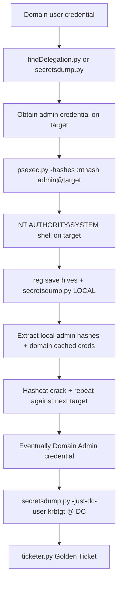

title: "psexec.py"
script: "examples/psexec.py"
category: "Remote Execution"
status: "Published"
protocols:
  - SMB
  - MSRPC
  - SCMR
ms_specs:
  - MS-SCMR
  - MS-SMB2
  - MS-RPCE
mitre_techniques:
  - T1021.002
  - T1543.003
  - T1569.002
  - T1078
  - T1550.002
auth_types:
  - password
  - nt_hash
  - aes_key
  - kerberos_ccache
tags:
  - impacket
  - impacket/examples
  - category/remote_execution
  - status/published
  - protocol/smb
  - protocol/msrpc
  - protocol/scmr
  - authentication/ntlm
  - authentication/kerberos
  - technique/remote_service_creation
  - technique/pass_the_hash
  - technique/admin_share_abuse
  - technique/named_pipe_ipc
  - mitre/T1021/002
  - mitre/T1543/003
  - mitre/T1569/002
  - mitre/T1078
  - mitre/T1550/002
aliases:
  - psexec
  - impacket-psexec
  - remote_execution
  - psexec_like


# psexec.py

> **One line summary:** Provides a fully interactive administrative shell on a remote Windows host by uploading the RemComSvc service binary to the ADMIN$ share, installing it as a Windows service via the Service Control Manager Remote protocol, and bridging stdin, stdout, and stderr through four named pipes, making it the most recognizable and most heavily detected remote execution technique in the Impacket toolkit.

| Field | Value |
|:---|:---|
| Script | `examples/psexec.py` |
| Category | Remote Execution |
| Status | Published |
| Primary protocols | SMB, MSRPC, SCMR |
| Primary Microsoft specifications | `[MS-SCMR]`, `[MS-SMB2]`, `[MS-RPCE]` |
| MITRE ATT&CK techniques | T1021.002 SMB/Admin Shares, T1543.003 Windows Service, T1569.002 Service Execution, T1078 Valid Accounts, T1550.002 Pass the Hash |
| Authentication types supported | Password, NT hash, AES key, Kerberos ccache |
| First appearance in Impacket | 2003 (early Impacket; one of the foundational example tools) |
| Original authors | Alberto Solino (`@agsolino`), using the open source RemCom service by Talha Tariq (`@kavika13`) |


## Prerequisites

This article is the first in the Remote Execution category. It builds on:

- [`00_Introduction_and_Architecture.md`](Introduction_and_Architecture.md) for the Impacket stack overview.
- [`smbclient.py`](../05_smb_tools/smbclient.md) for the SMB session lifecycle, administrative shares (especially `ADMIN$` and `IPC$`), and the four authentication modes. Everything `psexec.py` does starts with an SMB session.
- [`rpcdump.py`](../01_recon_and_enumeration/rpcdump.md) for the DCE/RPC foundations. The Service Control Manager Remote interface used by `psexec.py` is just one more MSRPC interface, and the SCMR UUID appeared in the rpcdump UUID reference table.
- [`samrdump.py`](../01_recon_and_enumeration/samrdump.md) for the broader MSRPC pattern. SCMR calls follow the same handle based model (`hROpenSCManagerW` → `hRCreateServiceW` → `hRStartServiceW` and so on).
- [`secretsdump.py`](../03_credential_access/secretsdump.md) for the credentials this tool consumes. The output of `secretsdump.py` flows directly into `psexec.py` invocations.
- [`getTGT.py`](../02_kerberos_attacks/getTGT.md) for the ccache based authentication mode.
- [`getST.py`](../02_kerberos_attacks/getST.md) for the forged Service Tickets that authorize `psexec.py` after a delegation attack.


## What it does

`psexec.py` gives the attacker a fully interactive administrative command shell on a remote Windows host. The interface mimics the behavior of the original Sysinternals `PsExec.exe`: authenticate, drop into a `cmd.exe` prompt on the remote system, execute commands, receive output, exit cleanly.

The mechanism is mechanical and predictable. For every invocation:

1. Authenticate to the target via SMB.
2. Upload a service binary (the embedded `RemComSvc` executable) to a writable share, typically `ADMIN$`.
3. Install the binary as a Windows service through the Service Control Manager Remote protocol.
4. Start the service, which launches the binary as `NT AUTHORITY\SYSTEM`.
5. Connect four named pipes to the running service: one for control communication and three for stdin, stdout, and stderr redirection.
6. Exchange data across the pipes to deliver commands and receive output in real time.
7. On exit, stop and delete the service, then delete the binary.

The result is a shell running at the highest local privilege level, suitable for any post compromise action that requires local SYSTEM access: credential extraction, persistence deployment, lateral discovery, token manipulation, and so on.

`psexec.py` is famously noisy. Every one of the steps above produces one or more clearly visible artifacts: file writes to `ADMIN$`, service creation events, named pipe connections with distinctive names, and process creation as `SYSTEM` under a service binary path. Mature detection stacks catch `psexec.py` easily. The tool is popular anyway because it works reliably, it works everywhere, and the credentials it requires (local admin) are what most attackers already have by the time they reach this step.

When `command` is supplied as a positional argument after the target, the tool runs that command non interactively and returns the output. When no command is supplied, the tool drops into an interactive shell with an embedded mini prompt that supports a few extra commands like `put`, `get`, `lcd`, and `cd`.


## Why it exists

Mark Russinovich published the original `PsExec.exe` as part of the Sysinternals suite in the late 1990s. The tool met a clear need: administrators wanted to run commands on remote Windows systems without deploying an agent first. Windows has no built in cross platform equivalent of SSH; `PsExec.exe` was the closest approximation for years and remains widely deployed in enterprise environments as a legitimate administration tool.

Microsoft acquired Sysinternals in 2006 and continues to distribute the tool through Microsoft's own Sysinternals site. The original `PsExec.exe` is still the de facto standard for interactive remote command execution on Windows.

The mechanism `PsExec.exe` uses became a blueprint that many other tools (legitimate and offensive) copied. The essential pattern: drop a helper binary onto the target, install it as a service, use it to proxy input and output. That pattern is so closely associated with `PsExec` that security products treat the pattern itself as the signature, regardless of what the helper binary is called.

Alberto Solino built `psexec.py` to provide the same functionality from non Windows attacker hosts. The Impacket implementation does not reuse Russinovich's binary (which is not open source); it uses a third party open source service called `RemComSvc` (originally by Talha Tariq, hosted at `https://github.com/kavika13/RemCom`). `RemComSvc` implements the same pipe based communication model that `PsExec.exe` uses, making the Impacket version a clean room reimplementation of the technique.

The naming of the helper binary is deliberate. `RemComSvc` is not trying to hide from security products. The Impacket authors selected an open source binary that implements the technique cleanly and made it easy to swap out via the `-file` flag. The assumption is that operators who want stealth will write their own helper or use a different tool entirely; `psexec.py` is the loud, reliable workhorse.


## The protocol theory

What follows is the new material on the Service Control Manager Remote protocol and the named pipe IPC pattern. SMB foundations are in [`smbclient.py`](../05_smb_tools/smbclient.md); DCE/RPC foundations are in [`rpcdump.py`](../01_recon_and_enumeration/rpcdump.md).

### The ADMIN$ share

Every Windows host with default configuration exposes a set of hidden administrative shares:

| Share | Path | Access |
|:---|:---||
| `ADMIN$` | `%SystemRoot%` (typically `C:\Windows`) | Administrators |
| `C$`, `D$`, `E$`, ... | The root of each drive letter | Administrators |
| `IPC$` | Inter Process Communication (not a file share) | All authenticated users |
| `NETLOGON` | `%SystemRoot%\SYSVOL\sysvol\<domain>\scripts` | All authenticated users (on DCs only) |
| `SYSVOL` | `%SystemRoot%\SYSVOL\sysvol` | All authenticated users (on DCs only) |

`ADMIN$` is the one `psexec.py` cares about. It is a share mapped directly onto `%SystemRoot%`, the Windows system directory. Local administrators have full read and write access to it. Non administrators have no access at all.

The existence of `ADMIN$` is the single most important enabler for `psexec.py`. Without it, there is nowhere to upload the service binary. Disabling `ADMIN$` is possible (via `HKLM\SYSTEM\CurrentControlSet\Services\LanmanServer\Parameters\AutoShareServer = 0`) but it breaks a huge amount of legitimate Windows tooling including Group Policy, WSUS, and Microsoft's own administrative snap ins. The hardening advice is typically to restrict who has local administrator rights rather than to disable the share.

The tool searches for writable shares at startup. It prefers `ADMIN$` but will fall back to `C$` or any other writable share if `ADMIN$` is unavailable. The output line "`[*] Found writable share ADMIN$`" is one of the first things you see.

### The Service Control Manager Remote interface

Windows exposes its Service Control Manager (SCM) over RPC via the `[MS-SCMR]` protocol. The interface allows remote management of Windows services: listing them, querying their status, creating new ones, changing configuration, starting and stopping them, and deleting them.

The interface UUID is `367abb81-9844-35f1-ad32-98f038001003`. It is accessible over the `\pipe\svcctl` named pipe on the target. `psexec.py` binds to this interface and uses a specific sequence of calls:

| Call | Purpose |
|:---|:---|
| `hROpenSCManagerW` | Obtain a handle to the remote SCM. |
| `hRCreateServiceW` | Create a new service pointing to the uploaded binary. |
| `hRStartServiceW` | Start the new service. |
| `hRControlService` | Stop the service during cleanup. |
| `hRDeleteService` | Delete the service after stopping. |
| `hRCloseServiceHandle` | Close handles at the end. |

The pattern follows the standard MSRPC handle lifecycle documented for `samrdump.py`: open a parent handle, derive child handles from it, perform operations on the children, close all handles in reverse order.

The service creation call `hRCreateServiceW` takes numerous parameters, of which the most important are:

- `lpServiceName`: the service display name. `psexec.py` defaults to a randomly generated eight character name, which contributes to the detection signature.
- `lpBinaryPathName`: the full path to the service binary on the target. `psexec.py` constructs this from the writable share plus the uploaded binary filename.
- `dwServiceType`: `SERVICE_WIN32_OWN_PROCESS` (`0x10`) for a standalone service.
- `dwStartType`: `SERVICE_DEMAND_START` (`0x3`), meaning the service starts on explicit request rather than automatically at boot.

The resulting service is legitimate from Windows's perspective. It is a properly registered service, created through the proper API, running under the proper security context. The abnormality is not in how it was created but in who created it, from where, and with what binary name.

### The RemComSvc binary

The embedded binary that `psexec.py` uploads is a compiled version of `RemComSvc`, a small Windows service (around 10 KB) originally written by Talha Tariq. The binary implements the PsExec style IPC model: on service start, it creates four named pipes and waits for connections.

The pipes are:

| Pipe name pattern | Access | Purpose |
|:---|:---||
| `\pipe\RemCom_communication` | `0x0012019f` (standard MSRPC access) | Control channel. Carries the command to execute and process identifiers. |
| `\pipe\RemCom_stdin<machine><pid>` | `0x6` (`FILE_WRITE_DATA` + `FILE_APPEND_DATA`) | Standard input to the spawned process. |
| `\pipe\RemCom_stdout<machine><pid>` | `0x1` (`FILE_READ_DATA`) | Standard output from the spawned process. |
| `\pipe\RemCom_stderr<machine><pid>` | `0x1` (`FILE_READ_DATA`) | Standard error from the spawned process. |

The `<machine><pid>` suffix is a mix of the local machine name and an eight character random alphanumeric string. The fixed `RemCom_` prefix is the hard part of the signature; even the randomized suffix has a distinctive structure.

The client (`psexec.py`) connects to all four pipes after the service starts. Writing to `RemCom_communication` tells the service what command to run. Writing to `RemCom_stdin...` feeds keystrokes to the spawned process. Reading from `RemCom_stdout...` and `RemCom_stderr...` receives the process's output.

This IPC model is the core of the PsExec technique. Every defensive product that detects `psexec.py` and its clones looks for these pipe names.

### The full service lifecycle

Every `psexec.py` invocation follows the same lifecycle:

1. **SMB authentication** to the target. Standard NTLM or Kerberos handshake.
2. **Share discovery.** The tool calls `NetrShareEnum` (via the SRVSVC interface on `\pipe\srvsvc`) to enumerate shares and identify a writable one.
3. **Binary upload.** The `RemComSvc` binary is written to `\\target\ADMIN$\<random_name>.exe`. The default random name is eight characters.
4. **SCMR binding.** Open `\pipe\svcctl`, bind to SCMR, call `hROpenSCManagerW`.
5. **Service creation.** Call `hRCreateServiceW` with the uploaded binary path.
6. **Service start.** Call `hRStartServiceW`.
7. **Pipe connection.** Open all four named pipes from the client side. The service is now waiting to process commands.
8. **Command exchange.** The command (either explicit or an interactive `cmd.exe`) is sent via `RemCom_communication`. Output flows back via the stdout and stderr pipes.
9. **Interactive loop** if no command was specified: read user keystrokes, write to stdin pipe, read from stdout and stderr pipes, repeat.
10. **Cleanup on exit.** Stop the service via `hRControlService`, delete it via `hRDeleteService`, delete the binary from `ADMIN$`, close the SMB session.

The cleanup is important to understand. Unless `psexec.py` crashes or is killed ungracefully, it removes every artifact it created. The service is gone. The binary is gone. What remains in logs are the records of the actions having occurred. Forensic artifacts persist in event logs, file system metadata (depending on configuration), and network capture; the tool does not leave live services or binaries on the target after a clean exit.

### Why the executed command runs as SYSTEM

Windows services run under a configured account. By default, services created through SCMR without specifying a different account run as `LocalSystem` (the canonical Windows high privilege context). The Impacket implementation does not override this default, so the service and every child process it spawns inherits `NT AUTHORITY\SYSTEM`.

The significance: even if the authenticated user is only a local administrator, the resulting shell runs as `SYSTEM`, which has more privilege than any administrator. This is why `psexec.py` is so useful for post exploitation; it automatically escalates local admin to local SYSTEM through the service creation mechanism.

### Comparison with sibling execution tools

`psexec.py` is one of several remote execution tools in Impacket. The comparison matters because each has different trade offs and different detection signatures.

| Tool | Mechanism | Service created? | Typical detection signature |
|:---|:---|||
| `psexec.py` | SCMR + RemComSvc binary + named pipes | Yes | 7045 with random binary + 5145 for `RemCom_*` pipes |
| `smbexec.py` | SCMR + cmd /c batch + local SMB server | Yes (per command) | 7045 with `cmd.exe /Q /c` patterns |
| `wmiexec.py` | WMI `Win32_Process::Create` + output file | No | 4688 + network traffic to WMI endpoint |
| `atexec.py` | Task Scheduler (MS-TSCH) | No (task, not service) | 4698 (Task Scheduled) |
| `dcomexec.py` | DCOM (MMC20.Application, ShellWindows, etc.) | No | 4688 under DCOM host process |

`psexec.py` is the least stealthy of these. `wmiexec.py` is often considered the stealthiest because it does not create a service or a file on disk. Operators tend to choose `psexec.py` when reliability and SYSTEM level execution matter more than stealth, and to choose `wmiexec.py` or `dcomexec.py` when the environment has mature detection for service creation events.


## How the tool works internally

The script is mid sized. The high level flow follows the service lifecycle described above, but with some additional details worth knowing.

1. **Argument parsing.** Standard target string plus `command` (positional, optional), `-port`, `-share`, `-path`, `-file`, `-service-name`, `-remote-binary-name`, `-keytab`, `-codec`, and the usual authentication flags.

2. **Credential resolution.** Standard Impacket target string parsing. If `-k` is specified, the tool uses an existing TGT from `KRB5CCNAME`.

3. **SMB connection.** A `SMBConnection` is established to the target. The share enumeration follows.

4. **ServiceInstall helper.** The tool uses a helper class `ServiceInstall` from `impacket/examples/serviceinstall.py` that encapsulates the upload, service creation, and cleanup logic. The class handles:
    - File upload via SMB `writeFile` calls.
    - SCMR binding and service creation.
    - Tracking the service name and binary name for cleanup.

5. **Binary source.** By default, the tool uses the `RemComSvc` binary embedded in `impacket/examples/remcomsvc.py` (it is stored as a base64 encoded blob). If `-file <path>` is specified, the tool uploads the user supplied file instead. This is the flag that lets operators replace `RemComSvc` with a different service implementation.

6. **Name randomization.** The service name, binary filename, and pipe name suffixes are all randomized at startup. The tool generates eight character alphanumeric strings for each. Operators can override via `-service-name` and `-remote-binary-name`.

7. **Pipe connection.** After starting the service, the tool opens four files on the target via SMB. The filenames are the pipe names in the `\\target\IPC$\` namespace. SMB treats named pipes like files; opening them with `openFile` establishes the pipe connection.

8. **Interactive loop.** If no command was given, the tool enters an interactive shell. The shell reads user input, detects the mini command prefix (for `put`, `get`, etc.), and either handles the command locally or forwards it as stdin to the remote shell. Remote output is read from stdout and stderr pipes and printed to the local terminal.

9. **Non interactive mode.** If a command was given, the tool sends it via `RemCom_communication`, reads output until the remote process exits, prints the output, and cleans up.

10. **Codec handling.** The remote shell uses whatever code page is configured on the target. The `-codec` flag lets the operator specify the encoding for output (common values: `utf-8`, `cp437`, `cp850`, `cp1252`). Default is `cp437` which is the traditional Windows console code page. Encoding mismatches produce garbled non ASCII characters in output.

11. **Cleanup.** On clean exit, the tool stops and deletes the service and deletes the uploaded binary. Exception handlers attempt cleanup even on error. A `Ctrl+C` from the attacker will usually trigger cleanup; a hard kill (`kill -9`) will not, leaving the service and binary in place.


## Authentication options

Standard four mode pattern from [`smbclient.py`](../05_smb_tools/smbclient.md).

### Cleartext password

```bash
psexec.py CORP.LOCAL/admin:'P@ss'@target.corp.local
```

### NT hash (pass the hash)

```bash
psexec.py -hashes :<nthash> CORP.LOCAL/admin@target.corp.local
```

This is the classic pass the hash flow. Extract the NT hash with [`secretsdump.py`](../03_credential_access/secretsdump.md), use it directly with `psexec.py` without ever knowing the password.

### AES key

```bash
psexec.py -aesKey <hex> CORP.LOCAL/admin@target.corp.local
```

### Kerberos ccache

```bash
export KRB5CCNAME=admin.ccache
psexec.py -k -no-pass CORP.LOCAL/admin@target.corp.local
```

The ccache flow chains with [`getTGT.py`](../02_kerberos_attacks/getTGT.md) for standard Kerberos authentication or with [`getST.py`](../02_kerberos_attacks/getST.md) for forged Service Tickets from delegation attacks. The SPN that `psexec.py` needs when using Kerberos is `cifs/<target>` because the tool authenticates via SMB.

### Minimum privileges

Local administrator on the target. The tool requires write access to `ADMIN$` (or another writable administrative share) and the ability to create Windows services via SCMR. Both require local administrator membership, directly or through a group like `Administrators`, `Domain Admins` (for domain joined systems), or `BUILTIN\Administrators` (on member servers).

The tool does not work with non administrative credentials. If the authentication succeeds but the account is not a local administrator, the upload to `ADMIN$` fails with `STATUS_ACCESS_DENIED` and the tool exits with an error.


## Practical usage

### Non interactive single command

```bash
psexec.py CORP.LOCAL/admin:'P@ss'@target.corp.local whoami
```

Output:

```text
Impacket v0.13.0 - Copyright Fortra, LLC and its affiliated companies

[*] Requesting shares on target.corp.local.....
[*] Found writable share ADMIN$
[*] Uploading file zXvQKjPw.exe
[*] Opening SVCManager on target.corp.local.....
[*] Creating service mHqT on target.corp.local.....
[*] Starting service mHqT.....
[!] Press help for extra shell commands
nt authority\system
[*] Process cmd.exe finished with ErrorCode: 0, ReturnCode: 0
```

The single line output `nt authority\system` confirms the execution context.

### Interactive shell

```bash
psexec.py CORP.LOCAL/admin:'P@ss'@target.corp.local
```

Drops into a `cmd.exe` prompt. Commands are executed on the target and output streams back. The mini shell supports:

| Command | Purpose |
|:---|:---|
| `help` | Show the available mini shell commands. |
| `put <local_path>` | Upload a local file to the connected share on the target. |
| `get <remote_file>` | Download a file from the connected share to the local directory. |
| `lcd <path>` | Change local working directory. |
| `exit` | Exit the shell cleanly (triggers the cleanup sequence). |

The `put` and `get` commands are useful for staging. The `put` command uploads via the SMB connection that `psexec.py` has already established, avoiding the need for a separate SMB client session.

### Pass the hash execution

```bash
psexec.py -hashes aad3b435b51404eeaad3b435b51404ee:8846f7eaee8fb117ad06bdd830b7586c \
  CORP.LOCAL/admin@target.corp.local
```

The canonical lateral movement pattern. The hash can come from anywhere: [`secretsdump.py`](../03_credential_access/secretsdump.md), mimikatz, a captured and cracked NetNTLMv2, or any other source.

### Custom service name

```bash
psexec.py -service-name UpdateService \
  CORP.LOCAL/admin:'P@ss'@target.corp.local
```

Replaces the default random service name with `UpdateService`. Blending in with legitimate service naming patterns is a common operational choice. Note that the service name appears in the 7045 event log entry, so choose a name that does not raise suspicion.

### Custom binary name

```bash
psexec.py -remote-binary-name winlogonsvc.exe \
  CORP.LOCAL/admin:'P@ss'@target.corp.local
```

Replaces the default random binary filename. The binary itself is still `RemComSvc`; only its filename on the target is changed. EDR products that fingerprint the binary itself will still flag it.

### Custom binary

```bash
psexec.py -file /path/to/mybinary.exe \
  CORP.LOCAL/admin:'P@ss'@target.corp.local
```

Upload a different binary in place of the default `RemComSvc`. The supplied binary must implement the same named pipe IPC protocol that `psexec.py` expects (the four pipes with the right names and access patterns), or the tool will hang waiting for a response.

This flag is primarily useful if the operator has recompiled `RemComSvc` with different optimizations to evade specific binary signatures, or has developed a custom service implementation with additional features.

### Custom share and path

```bash
psexec.py -share C$ -path "\\Users\\Public" \
  CORP.LOCAL/admin:'P@ss'@target.corp.local
```

Uses `C$` instead of `ADMIN$` and drops the binary in `C:\Users\Public` instead of `C:\Windows`. Useful when `ADMIN$` is unavailable or when specific paths are monitored more heavily than others.

### Kerberos with a forged Service Ticket

```bash
# After obtaining a ticket via getST.py
export KRB5CCNAME=Administrator@cifs_target.corp.local@CORP.LOCAL.ccache
psexec.py -k -no-pass CORP.LOCAL/Administrator@target.corp.local
```

This is the final step in the RBCD / constrained delegation attack chain. The forged ticket authorizes `psexec.py` against the target as `Administrator`. Combined with [`getST.py`](../02_kerberos_attacks/getST.md), this is one of the cleanest paths from low privilege domain access to local SYSTEM.

### Codec override for non English targets

```bash
psexec.py -codec cp850 CORP.LOCAL/admin:'P@ss'@target.corp.local
```

Some Windows localizations use non default code pages. If command output looks garbled, try `cp850` (Western European), `cp1252` (Windows ANSI), or `utf-8` (modern). The `chcp` command on the target shows the currently active code page.

### Key flags

| Flag | Meaning |
|:---|:---|
| `command` (positional) | Command to execute. If omitted, drops into an interactive shell. |
| `-port <port>` | SMB port (default 445). |
| `-share <name>` | Writable share to use for binary upload (default `ADMIN$`). |
| `-path <path>` | Path within the share for the binary (default share root). |
| `-file <path>` | Upload a different binary instead of `RemComSvc`. |
| `-service-name <name>` | Override the randomized service name. |
| `-remote-binary-name <name>` | Override the randomized binary filename. |
| `-keytab <file>` | Use a keytab file for Kerberos. |
| `-codec <codec>` | Output encoding (default `cp437`). |
| `-hashes`, `-aesKey`, `-k`, `-no-pass` | Standard authentication flags. |
| `-dc-ip`, `-target-ip` | Explicit DC or target IP. |
| `-debug`, `-ts` | Debug output and timestamps. |


## What it looks like on the wire

The wire pattern is distinctive and well documented. Every `psexec.py` invocation produces the same recognizable sequence.

### Phase one: SMB session and share discovery

- TCP connection to port 445 on the target.
- SMB negotiate, session setup, tree connect to `IPC$`.
- DCERPC bind to SRVSVC (UUID `4b324fc8-1670-01d3-1278-5a47bf6ee188`) on `\pipe\srvsvc`.
- `NetrShareEnum` call to enumerate shares.
- Tree connect to `ADMIN$` (or the selected writable share).

### Phase two: binary upload

- SMB `CREATE` request for `\\<random>.exe` on `ADMIN$`.
- SMB `WRITE` requests to transfer the binary content (multiple packets for the roughly 10 KB binary).
- SMB `CLOSE` on the uploaded file.

### Phase three: service creation and start

- Tree connect to `IPC$` (if not already connected).
- SMB `CREATE` on `\pipe\svcctl`.
- DCERPC bind to SCMR (UUID `367abb81-9844-35f1-ad32-98f038001003`).
- `ROpenSCManagerW` call.
- `RCreateServiceW` call with the uploaded binary path.
- `RStartServiceW` call.

### Phase four: pipe connections

- SMB `CREATE` on `\pipe\RemCom_communication`.
- SMB `CREATE` on `\pipe\RemCom_stdin<suffix>`.
- SMB `CREATE` on `\pipe\RemCom_stdout<suffix>`.
- SMB `CREATE` on `\pipe\RemCom_stderr<suffix>`.

### Phase five: command execution

- SMB `WRITE` on `\pipe\RemCom_communication` with the command.
- SMB `READ` on `\pipe\RemCom_stdout<suffix>` and `\pipe\RemCom_stderr<suffix>`.
- Interactive sessions produce bidirectional traffic on all four pipes.

### Phase six: cleanup

- `RControlService` call with `SERVICE_CONTROL_STOP` (value `0x1`).
- `RDeleteService` call.
- `RCloseServiceHandle` calls.
- SMB `CREATE` + `SET_INFO` (delete on close) + `CLOSE` for the uploaded binary.
- SMB session close.

### Wireshark filters

```text
smb2                                            # all SMB2 traffic
smb2.filename contains "RemCom"                 # the diagnostic signature
smb2.filename contains "\\pipe\\svcctl"         # SCMR traffic
smb2.filename contains "\\pipe\\srvsvc"         # share enumeration
svcctl                                          # decoded SCMR traffic
smb2.create_flags & 0x40                        # creationOption 0x40 (NonDirectoryFile, FileOpen) used for pipes
```

The `RemCom` string in an SMB filename is essentially diagnostic of the technique. Legitimate applications do not create pipes with that prefix.


## What it looks like in logs

`psexec.py` is famously detectable. The log signatures are textbook examples of "what remote execution looks like."

### Event ID 7045: Service Installed

On the target, the System log records a 7045 event for every service creation. The fields:

| Field | Value (typical psexec.py) |
|:---|:---|
| ServiceName | Random 4 character string (default) or custom via `-service-name`. |
| ImagePath | Full path to the uploaded binary, for example `%SystemRoot%\zXvQKjPw.exe`. |
| ServiceType | `user mode service`. |
| StartType | `demand start`. |
| AccountName | `LocalSystem`. |

The combination of a random service name, a randomly named executable directly in `%SystemRoot%`, and a `LocalSystem` account is a very strong signal. A mature detection looks for this pattern regardless of whether it comes from `psexec.py` specifically.

### Event ID 5145: Detailed File Share Access

With "Audit Detailed File Share" enabled, every access to a named resource on a share produces a 5145 event. For `psexec.py`, the 5145 events include:

- Access to `\ADMIN$\<random>.exe` (the binary upload).
- Access to `\IPC$\svcctl` (the SCMR binding).
- Access to `\IPC$\RemCom_communication`.
- Access to `\IPC$\RemCom_stdin<suffix>`.
- Access to `\IPC$\RemCom_stdout<suffix>`.
- Access to `\IPC$\RemCom_stderr<suffix>`.

The `RemCom_*` pipe names are the pattern signature. Any 5145 event referencing a resource matching `RemCom_*` is, by convention, `psexec.py` or something that copies its technique.

### Event ID 4697: Service Installed (Security log variant)

Windows 10 and later (and Server 2016+) also log service installations in the Security log as 4697. The fields mirror 7045 but with additional fields including the authenticated user. Monitoring 4697 is preferable to 7045 because the Security log is typically retained longer and analyzed more carefully.

### Event ID 4624: Logon

The initial SMB authentication produces a 4624 with Logon Type 3 (network). The user account and source IP are logged. This is the "who connected" record.

### Event ID 4688 / Sysmon 1: Process Creation

When the service binary launches and spawns `cmd.exe` (for interactive mode) or the specified command (for non interactive), process creation events fire:

| Field | Typical value |
|:---|:---|
| NewProcessName | `C:\Windows\System32\cmd.exe` or the specified binary. |
| ParentProcessName | The uploaded service binary, e.g. `C:\Windows\zXvQKjPw.exe`. |
| TokenElevationType | `%%1936` (elevated, full token). |
| AccountName | `SYSTEM`. |

Sysmon Event ID 1 adds the full command line, which is captured in 4688 only when "Include command line in process creation events" is enabled.

The combination of `NT AUTHORITY\SYSTEM` running a process under a randomly named service binary in `%SystemRoot%` is one of the strongest signals in the Windows event log, period.

### A complete Sigma rule

```yaml
title: Impacket psexec.py Service Creation
logsource:
  product: windows
  service: system
detection:
  selection:
    EventID: 7045
    ImagePath|re: '\\[a-zA-Z0-9]{8}\.exe$'
    AccountName: 'LocalSystem'
    StartType: 'demand start'
  condition: selection
falsepositives:
  - Legitimate administrative service deployments using randomized naming.
level: high
```

The regex matches the 8 character random binary names that `psexec.py` generates by default. Custom names via `-remote-binary-name` evade this rule, so pair with a 5145 rule on `RemCom_*` pipe names for complete coverage.

```yaml
title: RemCom Named Pipe Access
logsource:
  product: windows
  service: security
detection:
  selection:
    EventID: 5145
    RelativeTargetName|contains:
      - 'RemCom_communication'
      - 'RemCom_stdin'
      - 'RemCom_stdout'
      - 'RemCom_stderr'
  condition: selection
level: high
```

This rule is essentially diagnostic of `psexec.py` and any direct clone. Custom binaries via `-file` that use different pipe names defeat this rule; the 7045 rule catches them at the service creation step instead.


## Detection and defense

### Detection opportunities

`psexec.py` is one of the easiest Impacket tools to detect reliably. The difficulty is not in detection but in tuning out legitimate administrative use of the same pattern.

**Service creation from remote sources.** 7045 or 4697 events where the `SubjectUserName` is a remote administrator and the `ImagePath` is a randomly named binary in `%SystemRoot%` or `%SystemRoot%\Temp`. Tune by baselining what legitimate software installs services on your systems.

**RemCom pipe names.** 5145 events referencing `RemCom_*` pipes. Very high fidelity; almost no false positives.

**SYSTEM process spawning cmd.exe under a non standard parent.** 4688 or Sysmon 1 where `cmd.exe` or `powershell.exe` runs as `NT AUTHORITY\SYSTEM` with a parent process that is not `services.exe` directly or is an executable in an unexpected path. Low false positive rate after baselining.

**ADMIN$ share writes.** With appropriate SACL auditing, writes to `ADMIN$` by non SYSTEM principals are rare and suspicious. This can be noisy in environments that use legitimate deployment tools but is high fidelity otherwise.

**EDR signatures for RemComSvc.** Every EDR product has signatures for the default `RemComSvc` binary. Operators who have not replaced the binary via `-file` will be detected at the upload step, often before the service even starts.

### Preventive controls

- **Restrict local administrator rights.** The tool requires local administrator. Reducing the set of accounts that hold local admin drastically reduces who can use `psexec.py` against a host. Microsoft's "Privileged Access Workstations" model and Local Administrator Password Solution (LAPS) are the recommended approaches.
- **Disable SMB1 and enforce SMB signing.** Does not block `psexec.py` directly (the tool uses SMB2/3) but closes related attack vectors including NTLM relay.
- **Restrict RemoteRegistry and SCMR access via Group Policy.** The Services snap in permissions can limit who can create remote services. Tuning this is nontrivial because it can break legitimate administration.
- **Enable Windows Defender Credential Guard.** Prevents the NT hash and Kerberos ticket extraction that feeds pass the hash and pass the key attacks, which in turn feed `psexec.py`.
- **Monitor for service creation events.** 7045 and 4697 are cheap to log and high signal when tuned correctly.
- **Network segmentation.** Block SMB (ports 445 and 139) between workstations at the network layer. Most enterprises do not legitimately need workstation to workstation SMB. Blocking it at firewalls or VLANs prevents workstation compromise from cascading laterally via `psexec.py`.
- **Group Policy for administrative share restrictions.** Advanced scenarios can lock down `ADMIN$` access to specific principals via share permissions. Rarely deployed because of administrative complexity.
- **Windows Defender Attack Surface Reduction rules.** Several ASR rules target remote execution patterns. The "Block process creations originating from PSExec and WMI commands" rule (GUID `d1e49aac-8f56-4280-b9ba-993a6d77406c`) blocks the technique directly on endpoints that run Defender.


## Related tools and attack chains

`psexec.py` is one of five Impacket remote execution tools. The family is:

- **`psexec.py`** (this article). Service based execution with RemComSvc. Loudest, most reliable, runs as SYSTEM.
- **[`smbexec.py`](smbexec.md)**. Service based execution without RemComSvc; uses `cmd /c` with batch files and a local SMB server to receive output. Still service based and noisy.
- **[`wmiexec.py`](wmiexec.md)**. WMI based execution via `Win32_Process::Create`. No service created. Output captured via a temporary file. Quieter but still produces WMI events.
- **[`atexec.py`](atexec.md)**. Task Scheduler based execution via `[MS-TSCH]`. Creates and executes a scheduled task rather than a service. Different event signatures.
- **[`dcomexec.py`](dcomexec.md)**. DCOM based execution via `MMC20.Application`, `ShellWindows`, or `ShellBrowserWindow` objects. Most obscure; often the last to be baselined by detection teams.

### Tools that feed `psexec.py`

The standard inputs to `psexec.py`:

- **[`secretsdump.py`](../03_credential_access/secretsdump.md)** produces the NT hashes used for pass the hash.
- **[`getTGT.py`](../02_kerberos_attacks/getTGT.md)** produces the TGT ccache for Kerberos authentication.
- **[`getST.py`](../02_kerberos_attacks/getST.md)** produces forged Service Tickets from delegation attacks.

### Tools that `psexec.py` often runs

Once `psexec.py` has a SYSTEM shell, the usual follow up actions:

- Extract credentials with an in shell `reg save` of the SAM, SECURITY, and SYSTEM hives, then parse offline with [`secretsdump.py`](../03_credential_access/secretsdump.md) in LOCAL mode.
- Enumerate further with `net user`, `net group`, `whoami /all`, and other built in tools.
- Deploy additional tooling (C2 beacons, persistence mechanisms) via the `put` mini shell command.
- Pivot to new targets using credentials harvested from the current host.

### A canonical lateral movement chain



The chain illustrates why `psexec.py` remains indispensable despite its noisy detection profile. Every credential reuse step in the lateral movement progression typically flows through a `psexec.py` invocation at some point, because the SYSTEM shell it provides is the enabler for the next credential extraction step.


## Further reading

- **`[MS-SCMR]`: Service Control Manager Remote Protocol.** `https://learn.microsoft.com/en-us/openspecs/windows_protocols/ms-scmr/`. The authoritative reference for the RPC interface `psexec.py` uses for service management.
- **Mark Russinovich "PsExec"** at `https://learn.microsoft.com/en-us/sysinternals/downloads/psexec`. Microsoft's current Sysinternals page for the original tool. Worth reading for the legitimate use case perspective.
- **Talha Tariq "RemCom"** at `https://github.com/kavika13/RemCom`. The open source service binary that Impacket's `psexec.py` embeds. Reading the C++ source illuminates exactly how the named pipe IPC works.
- **Alessandro Tanasi "Psexec Demystified"** at various blog archives. The most detailed technical walkthrough of the original PsExec mechanism.
- **SnapAttack "Hunting Impacket: Part 1"** at `https://www.snapattack.com/hunting-impacket-part-1/`. Excellent detection focused walkthrough of `psexec.py`, `smbexec.py`, and `wmiexec.py` with event samples.
- **Protocol and Log Analysis: Impacket part 1: psexec.py** at `http://themawofeternity.blogspot.com/2017/12/impacket-part-1-psexecpy.html`. Packet level analysis of a `psexec.py` run.
- **The Hacker Recipes "PsExec like"** at `https://www.thehacker.recipes/ad/movement/smb/psexec-like`. Practical reference for the technique family.
- **MITRE ATT&CK T1021.002 SMB/Admin Shares** and T1543.003 Windows Service at `https://attack.mitre.org/techniques/T1021/002/`. Authoritative technique references.
- **Microsoft "Admin Shares"** documentation at `https://learn.microsoft.com/en-us/troubleshoot/windows-server/networking/inaccessible-admin-shares`. The legitimate purpose and configuration of `ADMIN$`.

If you want to internalize the mechanism, run `psexec.py` against a lab target while capturing the SMB traffic with Wireshark and the Windows event logs on the target. Pair the packet capture with the event log and walk through the correlation: 7045 at this moment, 5145 events clustered just before and after, 4688 showing the spawned `cmd.exe` as SYSTEM. Once you have done that once, the detection signals stop being abstract rules and become recognizable patterns that you can spot in any environment.
