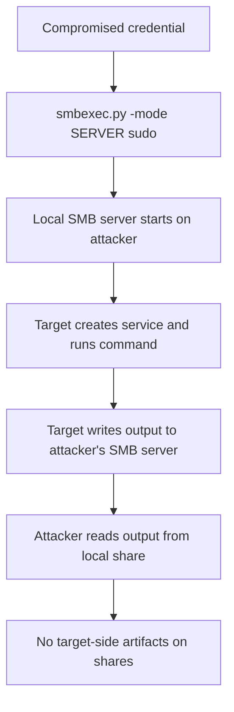

title: "smbexec.py"
script: "examples/smbexec.py"
category: "Remote Execution"
status: "Published"
protocols:
  - SMB
  - MSRPC
  - SCMR
ms_specs:
  - MS-SCMR
  - MS-SMB2
  - MS-RPCE
mitre_techniques:
  - T1021.002
  - T1543.003
  - T1569.002
  - T1078
  - T1550.002
auth_types:
  - password
  - nt_hash
  - aes_key
  - kerberos_ccache
tags:
  - impacket
  - impacket/examples
  - category/remote_execution
  - status/published
  - protocol/smb
  - protocol/msrpc
  - protocol/scmr
  - authentication/ntlm
  - authentication/kerberos
  - technique/remote_service_creation
  - technique/pass_the_hash
  - technique/admin_share_abuse
  - technique/echo_batch
  - technique/local_smb_server
  - mitre/T1021/002
  - mitre/T1543/003
  - mitre/T1569/002
  - mitre/T1078
  - mitre/T1550/002
aliases:
  - smbexec
  - impacket-smbexec
  - smb_exec


# smbexec.py

> **One line summary:** Provides a semi interactive administrative shell by creating a new Windows service for every command, using `echo` redirection to construct a batch file on the target at service execution time and a shell command line to invoke it, with output captured either via a share on the target (SHARE mode, default) or via a locally hosted SMB server (SERVER mode, used when the target has no writable shares).

| Field | Value |
|:---|:---|
| Script | `examples/smbexec.py` |
| Category | Remote Execution |
| Status | Published |
| Primary protocols | SMB, MSRPC, SCMR |
| Primary Microsoft specifications | `[MS-SCMR]`, `[MS-SMB2]`, `[MS-RPCE]` |
| MITRE ATT&CK techniques | T1021.002 SMB/Admin Shares, T1543.003 Windows Service, T1569.002 Service Execution, T1078 Valid Accounts, T1550.002 Pass the Hash |
| Authentication types supported | Password, NT hash, AES key, Kerberos ccache |
| First appearance in Impacket | 2014 (based on the original smbexec tool by Brandon McCann `@zeknox` and Eric Milam `@brav0hax`) |
| Original authors | Alberto Solino (`@agsolino`) for the Impacket port |


## Prerequisites

This article builds on:

- [`00_Introduction_and_Architecture.md`](Introduction_and_Architecture.md) for the Impacket stack overview.
- [`smbclient.py`](../05_smb_tools/smbclient.md) for SMB session foundations and the four authentication modes.
- [`rpcdump.py`](../01_recon_and_enumeration/rpcdump.md) for DCE/RPC and interface UUIDs.
- [`psexec.py`](psexec.md) for the foundational SCMR pattern (opening SCM, creating services, starting and stopping services). This article builds heavily on that foundation and assumes familiarity with it.
- [`wmiexec.py`](wmiexec.md) for the alternative semi interactive pattern that `smbexec.py` compares against.


## What it does

`smbexec.py` provides a semi interactive command shell on a remote Windows host using the Service Control Manager Remote protocol, like `psexec.py`, but without uploading any binary to the target. Instead of dropping a helper executable, the tool encodes each command directly into the service's binary path parameter as a shell invocation that constructs a batch file and then executes it.

The mechanism in brief: for every command the user types, the tool creates a new Windows service whose "binary path" is actually a shell command. The shell command uses `echo` to write a batch file to disk on the target, then invokes that batch file. The batch file's output is redirected to a file that the attacker reads back. The service is then deleted. Each command results in a fresh service creation, execution, and deletion cycle.

The tool supports two operating modes:

- **SHARE mode (default).** The output file is written to a writable share on the target (default `C$`) and read back via SMB. Similar to the output mechanism in [`wmiexec.py`](wmiexec.md).
- **SERVER mode.** The tool instantiates a local SMB server on the attacker's machine and the target writes output back to the attacker's SMB server directly. Useful when the target has no writable shares available or when `ADMIN$` and `C$` are both restricted. Requires the attacker to have root access (port 445 bind privilege).

The "semi interactive" character matches [`wmiexec.py`](wmiexec.md): each command is independent, directory state is maintained client side, and interactive programs that need stdin do not work. What differs is the mechanism beneath: `smbexec.py` uses services with embedded shell commands, `wmiexec.py` uses WMI with DCOM.

The trade offs between `smbexec.py` and its siblings are specific. Compared to [`psexec.py`](psexec.md), `smbexec.py` avoids the binary upload to `ADMIN$` and the associated detection signature, but produces more service creation events (one per command instead of one per session). Compared to [`wmiexec.py`](wmiexec.md), `smbexec.py` still creates services (which `wmiexec.py` does not) but has the unique SERVER mode for environments without writable target shares.


## Why it exists

Brandon McCann and Eric Milam released the original `smbexec` tool in 2013 as part of the `smbexec` Python toolkit on GitHub. Their motivation: PsExec was becoming detectable because the Microsoft binary was well fingerprinted by security products, and they wanted a technique that achieved the same semi interactive shell without dropping a binary.

Alberto Solino ported the technique to Impacket shortly after, adding the unique local SMB server mode that the original tool did not have. The Impacket port has been the canonical implementation since then and has evolved alongside the other remote execution tools in the toolkit.

The specific design choice, using `echo` redirection to construct a batch file inline, has two advantages:

- **No binary upload.** The service's "binary path" is actually a command line that writes a batch file on the fly. Nothing is uploaded ahead of time.
- **No dependency on a specific helper binary.** `psexec.py` depends on `RemComSvc` being available to Impacket. `smbexec.py` uses only the command shell, which is present on every Windows system.

The reason `smbexec.py` still creates services (rather than using some other execution mechanism) is compatibility: services are how an attacker can run commands as `LocalSystem` over SMB without needing WMI or DCOM access. SCMR works on every Windows system going back to NT 4.0 and is always available to local administrators. The design point is maximum reliability across Windows versions, accepting the service creation noise as the cost.

The tool exists because it fills a specific niche: SMB based remote execution that works when `psexec.py` fails because the RemComSvc binary triggers detection, and when `wmiexec.py` fails because DCOM is blocked or the target has no writable shares. In 2026 it remains the third most used remote execution tool in the Impacket suite, behind `psexec.py` and `wmiexec.py`.


## The protocol theory

The SCMR foundations are in [`psexec.py`](psexec.md). What follows is the material specific to `smbexec.py`'s approach.

### The echo to batch trick

The core design: construct a batch file on the target at the moment the service runs, using only the shell's `echo` builtin and file redirection, then invoke the batch file. The full command line that gets stored as the service's `lpBinaryPathName`:

```text
%COMSPEC% /Q /c echo <user_command> ^> \\<output_target>\<share>\__output 2^>^&1 > %SYSTEMROOT%\<random>.bat & %COMSPEC% /Q /c %SYSTEMROOT%\<random>.bat
```

Breaking this down:

- `%COMSPEC%` resolves to `cmd.exe` at runtime.
- `/Q /c` means "echo off, execute one command then exit."
- The first `echo <cmd> ^> \\...\__output 2^>^&1 > %SYSTEMROOT%\<random>.bat` writes a line to the batch file. The `^` characters escape the `>` and `&` so they are treated literally by the outer shell and interpreted by the inner batch.
- After the first `> %SYSTEMROOT%\<random>.bat`, the batch file contains: `<cmd> > \\<output>\<share>\__output 2>&1`.
- `&` separates the two commands.
- The second `%COMSPEC% /Q /c %SYSTEMROOT%\<random>.bat` invokes the batch file, which executes the user command with output redirected to `__output`.

The output file, once written, is read by the attacker via SMB. The tool then deletes the file and the batch file.

The batch filename is a random 8 character ASCII string (since February 2023; previously `execute.bat`). The output filename is always `__output` (diagnostic signature).

### Why two cmd invocations

The double `%COMSPEC%` invocation is necessary because services store their binary path as a single command. SCMR does not run a shell by default; it invokes the binary path verbatim. If the binary path were `cmd.exe /c echo ... > file.bat`, the batch file would be written but never executed.

By wrapping both the batch file creation and the batch file invocation in a single chained `cmd.exe` invocation with `&`, the service runs both operations in sequence and the command output is captured.

### The service lifecycle per command

Every command the user types produces this sequence on the target:

1. **Service created** via `RCreateServiceW` with the command above as `lpBinaryPathName`. Event ID 7045 fires.
2. **Service started** via `RStartServiceW`. The service attempts to launch the command as a service.
3. **Service crashes immediately.** The service executes `cmd.exe` which does what it needs to do (write the batch, run it, capture output, exit). SCM sees that the "service" exited without responding to SCM's startup handshake and logs Event ID 7009 "A timeout was reached (30000 milliseconds) while waiting for the service to connect."
4. **Service deleted** via `RDeleteService`.
5. **Output file read** via SMB from the configured target share (SHARE mode) or the attacker's local SMB server (SERVER mode).
6. **Batch file and output file deleted** via SMB.

The critical detection implication: **Event 7009 fires for every single command**. A normal service that does its job correctly and stays running does not produce 7009. A service that fires 7009 in near real time paired with 7045 creation is an exceptional pattern that `smbexec.py` produces reliably.

### SHARE mode versus SERVER mode

**SHARE mode (default).** The tool writes the output file to a writable share on the target. Default share is `C$`, configurable via `-share`. The path embedded in the command line is `\\%COMPUTERNAME%\C$\__output` (since April 2023; previously `\\127.0.0.1\`). The tool reads the file back via SMB to the target from the attacker's machine.

**SERVER mode.** The tool starts a local SMB server on the attacker's host before creating the service. The command line embedded in the service points output to `\\<attacker_ip>\<share>\__output` where `<share>` is a share that the attacker's SMB server exposes. The target machine writes its output directly to the attacker's share. This mode requires the attacker to have privileges to bind port 445 on their local machine (typically root on Linux or Administrator on Windows).

SERVER mode is useful when:

- The target has no writable shares (unusual but happens in hardened environments).
- The target's shares are heavily monitored and SHARE mode would trigger alerts.
- The attacker wants to receive output on a controlled channel for logging or forensic reasons.

The cost of SERVER mode: the target machine connects back to the attacker on port 445 outbound, which is itself anomalous. A workstation making outbound SMB connections to a non domain machine is suspicious in most environments.

### Service name evolution

The default service name has changed multiple times:

- **Pre May 2023:** hardcoded as `BTOBTO`. The iconic detection signature for years.
- **May 2023 and later:** randomized 8 character ASCII string (per GitHub issue #1544 recommending this change).

Older detection rules still look specifically for `BTOBTO` and will miss modern `smbexec.py`. Current rules should match random 8 character patterns instead, which unfortunately has more false positives.

### Why services per command and not per session

The per command service creation is a deliberate design choice. An alternative design would create one long running service that reads commands from a named pipe (which is what `psexec.py` effectively does via RemComSvc). The per command approach has trade offs:

- **Simpler.** No custom binary, no pipe protocol, no state management.
- **More detectable.** Each command produces a 7045+7009 pair instead of one service creation for the whole session.
- **More robust.** If one command fails, the next one starts fresh.
- **Higher latency.** Each command incurs service creation, start, crash, deletion overhead.

The design choice reflects the tool's goal: a simple reliable mechanism, not stealth. Readers who want stealth should use [`wmiexec.py`](wmiexec.md) or [`dcomexec.py`](dcomexec.md) instead.


## How the tool works internally

The script is mid sized. The high level flow:

1. **Argument parsing.** Standard target string plus `command` (positional, optional), `-share`, `-mode`, `-service-name`, `-codec`, `-shell-type`, and standard authentication flags.

2. **Credential resolution and SMB connection.** An SMB session is established to the target. This is used both for the SCMR binding (which goes through `\pipe\svcctl`) and for output file retrieval in SHARE mode.

3. **SCMR binding.** Open `\pipe\svcctl`, bind to SCMR, obtain SCM handle via `ROpenSCManagerW`.

4. **Mode selection.** If `-mode SERVER`, instantiate the local SMB server and wait for it to bind to port 445. If `-mode SHARE` (default), skip this.

5. **Shell handoff.** A `RemoteShell` helper is instantiated that handles the per command loop.

6. **Per command loop.** For each command:
    - Prepend `cd /d <current_dir> & ` to maintain client side directory state.
    - Wrap the command in the echo to batch construction described above.
    - Call `RCreateServiceW` with the wrapped command as `lpBinaryPathName`.
    - Call `RStartServiceW` to execute it. The service will fail to respond to SCM's startup handshake; this is expected and ignored.
    - Wait briefly for the command to execute and write its output.
    - Read the output file via SMB (SHARE mode) or from the local SMB server directory (SERVER mode).
    - Display the output.
    - Delete the output file via SMB.
    - Call `RDeleteService` to remove the service.

7. **Mini shell commands.** Same as [`psexec.py`](psexec.md) and [`wmiexec.py`](wmiexec.md): `lput`, `lget`, `lcd`, `!`, `exit`.

8. **Cleanup.** On exit, the SCMR handles are closed, the SMB session is terminated, and (in SERVER mode) the local SMB server is stopped.

9. **PowerShell shell type.** The `-shell-type powershell` flag changes the wrapping to use `powershell.exe -NoP -NoL -sta -NonI -W Hidden -Enc` with the command base64 encoded. The mechanism is otherwise identical.


## Authentication options

Standard four mode pattern from [`smbclient.py`](../05_smb_tools/smbclient.md).

### Cleartext password

```bash
smbexec.py CORP.LOCAL/admin:'P@ss'@target.corp.local
```

### NT hash (pass the hash)

```bash
smbexec.py -hashes :<nthash> CORP.LOCAL/admin@target.corp.local
```

Pass the hash is the most common `smbexec.py` invocation, same as `psexec.py` and `wmiexec.py`. The extracted hashes flow directly into the tool.

### AES key

```bash
smbexec.py -aesKey <hex> CORP.LOCAL/admin@target.corp.local
```

### Kerberos ccache

```bash
export KRB5CCNAME=admin.ccache
smbexec.py -k -no-pass CORP.LOCAL/admin@target.corp.local
```

### Minimum required privileges

Local administrator on the target. The tool requires:

- SMB access to the target (ports 445 or 139).
- Write access to the configured output share (`C$` by default) in SHARE mode.
- Ability to create and start Windows services (SCMR permissions).
- No additional privileges in SERVER mode (the attacker's side hosts the share), but port 445 bind privilege locally.

All three (SMB access, share write, SCMR permissions) are held together by local administrators.


## Practical usage

### Non interactive single command

```bash
smbexec.py CORP.LOCAL/admin:'P@ss'@target.corp.local whoami
```

Output:

```text
Impacket v0.13.0 - Copyright Fortra, LLC and its affiliated companies

[!] Launching semi-interactive shell - Careful what you execute
[!] Press help for extra shell commands
C:\Windows\system32>whoami
nt authority\system
```

The resulting shell runs as `NT AUTHORITY\SYSTEM` because services created via SCMR run as `LocalSystem` by default, same as [`psexec.py`](psexec.md). This is one of the key distinctions from [`wmiexec.py`](wmiexec.md), which runs as the authenticated user.

### Interactive semi interactive shell

```bash
smbexec.py CORP.LOCAL/admin:'P@ss'@target.corp.local
```

Drops into a `cmd.exe` prompt. Each command creates a new service on the target, executes, deletes itself, and returns output. The mini shell commands (`lput`, `lget`, `lcd`, `!`, `exit`) match the siblings.

### SERVER mode (local SMB server)

```bash
sudo smbexec.py -mode SERVER CORP.LOCAL/admin:'P@ss'@target.corp.local
```

`sudo` is required because the tool needs to bind port 445 locally to host the SMB server. The target machine connects back to the attacker's machine on port 445 to deliver output.

Useful when the target has no writable shares or when the operator wants to avoid writing to the target's `C$`. The detection cost: the target makes an outbound SMB connection to the attacker's IP, which is anomalous for most workstations.

### Custom share in SHARE mode

```bash
smbexec.py -share ADMIN$ CORP.LOCAL/admin:'P@ss'@target.corp.local
```

Use `ADMIN$` instead of the default `C$`. Useful when `C$` is monitored more heavily or explicitly restricted.

### Custom service name

```bash
smbexec.py -service-name UpdateService CORP.LOCAL/admin:'P@ss'@target.corp.local
```

Overrides the random 8 character service name with `UpdateService`. Blending in with legitimate service naming patterns is a common operational choice. Each command still creates a new service (and deletes it), so the custom name appears in every 7045 event.

### PowerShell shell type

```bash
smbexec.py -shell-type powershell CORP.LOCAL/admin:'P@ss'@target.corp.local
```

Uses PowerShell instead of cmd.exe. Each command is base64 encoded and passed to `powershell.exe -Enc`.

### Pass the hash execution

```bash
smbexec.py -hashes aad3b435b51404eeaad3b435b51404ee:8846f7eaee8fb117ad06bdd830b7586c \
  CORP.LOCAL/admin@target.corp.local
```

Standard workflow. The hash comes from [`secretsdump.py`](../03_credential_access/secretsdump.md) or equivalent.

### Kerberos with a forged Service Ticket

```bash
export KRB5CCNAME=Administrator@cifs_target.corp.local@CORP.LOCAL.ccache
smbexec.py -k -no-pass CORP.LOCAL/Administrator@target.corp.local
```

Same pattern as `psexec.py` and `wmiexec.py`. The SPN needed is `cifs/target` for SMB.

### Key flags

| Flag | Meaning |
|:---|:---|
| `-share <n>` | Share to use for output in SHARE mode (default `C$`). |
| `-mode <mode>` | `SHARE` (default) or `SERVER`. |
| `-service-name <n>` | Override the random service name. |
| `-shell-type <type>` | `cmd` (default) or `powershell`. |
| `-codec <codec>` | Output encoding (default system default). |
| `-hashes`, `-aesKey`, `-k`, `-no-pass` | Standard authentication flags. |
| `-dc-ip`, `-target-ip` | Explicit DC or target IP. |


## What it looks like on the wire

The wire pattern is similar to [`psexec.py`](psexec.md) but without the binary upload phase and with repeated service creation per command.

### Session setup

- TCP connection to port 445 (SMB) on the target.
- SMB session establishment with NTLM or Kerberos authentication.
- Tree connect to `IPC$`.
- SMB `CREATE` on `\pipe\svcctl`.
- DCERPC bind to SCMR (UUID `367abb81-9844-35f1-ad32-98f038001003`).
- `ROpenSCManagerW` call.

### Per command (SHARE mode)

- `RCreateServiceW` with the echo to batch command as `lpBinaryPathName`.
- `RStartServiceW` to start the service.
- `RControlService` or timeout (service will fail to respond as a service).
- Short wait.
- Tree connect to the configured output share (`C$` by default).
- SMB `CREATE` on `\__output`.
- SMB `READ` to retrieve the output.
- SMB `CLOSE`.
- SMB `CREATE` + `SET_INFO` (delete on close) + `CLOSE` to delete the output file.
- Similar deletion for the batch file in `%SYSTEMROOT%`.
- `RDeleteService` to remove the service.

### Per command (SERVER mode)

Same SCMR sequence, but the output file writes go to the attacker's local SMB server rather than the target's share. The target makes a new outbound SMB connection to the attacker for each command.

### Wireshark filters

```text
smb2 and smb2.filename matches "__output"           # output file access
smb2 and smb2.filename matches "\\.bat$"            # batch file access
svcctl                                               # SCMR traffic
```

The `__output` filename is diagnostic. The random .bat filename is less reliable as a string match but the file appearing in `%SYSTEMROOT%` via SMB is unusual.


## What it looks like in logs

`smbexec.py` has one of the most distinctive log signatures in the Impacket suite, in part because of the service per command design that produces many more events than a single `psexec.py` invocation would.

### Event ID 7045: Service Installed (one per command)

Each command the user types produces a 7045 event on the target. The critical field is `ImagePath`, which contains the full echo to batch command line:

```text
%COMSPEC% /Q /c echo whoami ^> \\WINSRV01\C$\__output 2^>^&1 > %SYSTEMROOT%\XmKLpWqR.bat & %COMSPEC% /Q /c %SYSTEMROOT%\XmKLpWqR.bat
```

The signature is essentially diagnostic:

- The `echo` command.
- The `^>` and `^&` escape sequences (distinctive because `cmd.exe` does not normally produce commands with these escapes outside of service binary path scenarios).
- The `\__output` filename.
- The `.bat` file reference appearing multiple times.

### Event ID 7009: Service Startup Timeout (one per command)

The canonical paired signal. Every 7045 from `smbexec.py` is followed within 30 seconds by a 7009 because the "service" that got installed is actually a shell command that exits immediately without responding to SCM's startup handshake.

The 7009 event includes:

| Field | Value |
|:---|:---|
| Param1 | `30000` (milliseconds, the default startup timeout). |
| Param2 | The service name (matches the 7045 ServiceName). |

Legitimate services rarely produce 7009. Services that produce 7009 in rapid succession paired with 7045 events from the same source are highly diagnostic of `smbexec.py` or a direct clone.

### Event ID 4688 / Sysmon 1: Process Creation

Each command produces process creation events for the chained cmd.exe invocations:

- First cmd for the `echo` to batch file step.
- Second cmd for the batch file invocation.
- A cmd for the user's actual command.

The parent process chain: `services.exe` → `cmd.exe` (the echo writer) → `cmd.exe` (the batch runner) → the user's command. Multiple cmd processes with parent `services.exe` in rapid succession is anomalous; legitimate services rarely spawn cmd.exe.

### Event ID 5145: Detailed File Share Access

Access to `__output` and the random `.bat` filename on the configured share. The `__output` filename alone is high fidelity; legitimate applications essentially never create files with that name.

### Starter Sigma rules

```yaml
title: Impacket smbexec Service Command Pattern
logsource:
  product: windows
  service: system
detection:
  selection:
    EventID: 7045
    ImagePath|contains:
      - '\__output 2^>^&1'
      - '\__output 2>&1'
      - 'echo'
    ImagePath|contains:
      - '.bat'
  condition: selection
level: high
```

This rule matches the distinctive output redirection pattern in the service ImagePath. Custom modifications to the tool can defeat it.

```yaml
title: Service Creation Followed by Immediate Timeout (smbexec pattern)
logsource:
  product: windows
  service: system
detection:
  service_created:
    EventID: 7045
  service_timeout:
    EventID: 7009
  timeframe: 60s
  condition: service_created and service_timeout
level: high
```

This correlation rule catches the 7045 + 7009 pair regardless of command content. Higher coverage than the command line rule but requires correlation capability in the SIEM.

```yaml
title: Legacy smbexec.py Default Service Name
logsource:
  product: windows
  service: system
detection:
  selection:
    EventID: 7045
    ServiceName: 'BTOBTO'
  condition: selection
level: high
```

Matches the legacy default service name from before May 2023. Modern tool usage does not trigger this rule, but older attacker tooling or derivative tools often still use the name.


## Detection and defense

### Detection opportunities

`smbexec.py` is one of the easier Impacket tools to detect because of the distinctive log patterns. Several signals are high fidelity.

**Service ImagePath pattern matching.** The `echo ... ^> ... \__output 2^>^&1` pattern is essentially diagnostic. Every environment should have a rule matching this.

**7045 + 7009 correlation.** Services that start and immediately fail the startup handshake are rare in legitimate operation. Correlating these two events within a short window catches `smbexec.py` reliably regardless of command content.

**Services.exe spawning cmd.exe.** Services launching cmd directly is unusual for anything other than remote execution tools. Most legitimate services spawn proper binaries.

**High frequency 7045 events from a single source.** `smbexec.py` creates one service per command. An interactive session produces many service creations in rapid succession, which is anomalous regardless of content.

**`__output` filename on shares.** SMB access to files named `__output` is diagnostic. Alert on any 5145 event referencing this filename.

### Preventive controls

Same general controls as [`psexec.py`](psexec.md), with additional emphasis on service event monitoring because `smbexec.py` produces so many.

- **Restrict local administrator rights.** The tool requires local administrator. Reducing the set of accounts with local admin drastically reduces who can use it.
- **Monitor for service creation events.** 7045 and 4697 are cheap to log and well signal. The `smbexec.py` pattern is particularly easy to match.
- **Monitor for 7009 at volume.** Startup timeouts in rapid succession are anomalous.
- **Restrict `C$` and `ADMIN$` access.** Through share ACLs or Group Policy. Breaks legitimate tooling but stops the output capture path.
- **Enable SMB signing.** Mandatory on DCs by default, mandatory on member servers from Server 2025. Blocks SMB relay that feeds credentials to `smbexec.py` but does not directly block the tool itself.
- **Network segmentation.** Block SMB between workstation segments. Most enterprises do not need workstation to workstation SMB, and blocking it prevents `smbexec.py` lateral movement.
- **Credential Guard.** Protects the credentials that `smbexec.py` consumes.
- **Windows Defender Attack Surface Reduction rules.** The "Block process creations originating from PSExec and WMI commands" rule (GUID `d1e49aac-8f56-4280-b9ba-993a6d77406c`) includes some coverage of the service based execution pattern.


## Related tools and attack chains

`smbexec.py` is the third of the five Impacket remote execution tools. Recapping the family from [`psexec.py`](psexec.md) and [`wmiexec.py`](wmiexec.md):

| Tool | Mechanism | Service created? | Runs as | Parent process | Signal strength |
|:---|:---||:---|:---||
| `psexec.py` | SCMR + RemComSvc binary + named pipes | Yes (once per session) | `LocalSystem` | Service binary | High (binary + pipes) |
| `smbexec.py` (this article) | SCMR + echo to batch + output file | Yes (once per command) | `LocalSystem` | `services.exe` → `cmd.exe` | High (7045+7009 pattern) |
| `wmiexec.py` | DCOM + `Win32_Process::Create` + SMB output | No | Authenticated user | `WmiPrvSE.exe` | Medium (parent WmiPrvSE) |
| `atexec.py` | Task Scheduler (`[MS-TSCH]`) | No (task) | Configured (usually `SYSTEM`) | `svchost.exe` | Medium (4698 events) |
| `dcomexec.py` | DCOM + MMC20 / ShellWindows / ShellBrowserWindow | No | Authenticated user | `mmc.exe` or `explorer.exe` | Low (obscure parents) |

When to choose `smbexec.py`:

- **PsExec is blocked by EDR signatures for RemComSvc.** `smbexec.py` has no binary to fingerprint.
- **Target has no writable shares.** SERVER mode is unique to `smbexec.py`.
- **SYSTEM execution is required.** `smbexec.py` and `psexec.py` both run as SYSTEM; `wmiexec.py` does not.
- **Simplicity preferred over stealth.** `smbexec.py` is the simplest implementation among the three big execution tools.

### Tools that feed `smbexec.py`

Same as `psexec.py` and `wmiexec.py`:

- [`secretsdump.py`](../03_credential_access/secretsdump.md) for NT hashes.
- [`getTGT.py`](../02_kerberos_attacks/getTGT.md) for TGTs.
- [`getST.py`](../02_kerberos_attacks/getST.md) for forged Service Tickets.

### Tools `smbexec.py` typically runs

Same post execution workflow as the siblings:

- In shell `reg save` to extract SAM/SECURITY/SYSTEM for offline parsing.
- PowerShell payloads.
- `net`, `whoami /all`, `systeminfo` for local discovery.
- File upload via `lput` for deploying additional tooling.

### A specific niche use case

The SERVER mode is unique enough to warrant a specific chain reference:



Useful when the target's `C$` and `ADMIN$` are both heavily monitored but outbound SMB is not. Rare but specific enough that the mode exists in the tool.


## Further reading

- **`[MS-SCMR]`: Service Control Manager Remote Protocol.** `https://learn.microsoft.com/en-us/openspecs/windows_protocols/ms-scmr/`. Covered in detail in [`psexec.py`](psexec.md); the SCMR mechanism is identical.
- **Brandon McCann and Eric Milam "smbexec"** (the original). Historical interest only; the Impacket port has long since surpassed the original.
- **Cyber Triage "DFIR Breakdown: Impacket Remote Execution Activity - Smbexec"** at `https://www.cybertriage.com/blog/dfir-breakdown-impacket-remote-execution-activity-smbexec/`. Detection focused walkthrough with the command line pattern rules and the history of default name changes.
- **AbdulRhman Alfaifi "Impacket Remote Execution Tools: smbexec.py"** at `https://u0041.co/posts/articals/smbexec-analysis/`. Detailed analysis with event log examples.
- **ExtraHop "Impacket SMBExec Activity"** at `https://www.extrahop.com/resources/detections/impacket-smbexec-activity`. Network detection perspective.
- **Logpoint "The Impacket Arsenal: A Deep Dive into Impacket Remote Code Execution Tools"** at `https://logpoint.com/en/blog/the-impacket-arsenal-a-deep-dive-into-impacket-remote-code-execution-tools`. Recent (2025) comparison of all five remote execution tools.
- **MITRE ATT&CK T1021.002** and T1543.003 at `https://attack.mitre.org/techniques/T1021/002/`.
- **Fortra Impacket issue #1544** at `https://github.com/fortra/impacket/issues/1544`. The discussion that led to the switch from `BTOBTO` to randomized service names.

If you want to internalize the mechanism, run `smbexec.py` against a lab target and watch the Windows Event Viewer in real time. Run one command; watch 7045 fire, then 7009 fire, then 7036 for the cleanup. Run a second command; watch the sequence repeat. The rhythm of 7045 + 7009 per command is what makes this tool so distinctive in logs, and observing it live gives you a feel for what the detection rules are matching against. Once you have seen the pattern, you can identify `smbexec.py` activity in historical logs at a glance.
