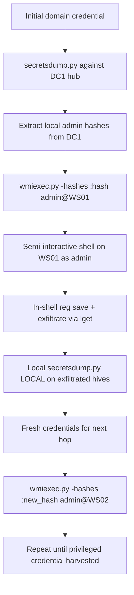

title: "wmiexec.py"
script: "examples/wmiexec.py"
category: "Remote Execution"
status: "Published"
protocols:
  - DCOM
  - MSRPC
  - WMI
  - SMB
ms_specs:
  - MS-DCOM
  - MS-WMI
  - MS-WMIO
  - MS-RPCE
  - MS-SMB2
mitre_techniques:
  - T1047
  - T1021.003
  - T1078
  - T1550.002
auth_types:
  - password
  - nt_hash
  - aes_key
  - kerberos_ccache
tags:
  - impacket
  - impacket/examples
  - category/remote_execution
  - status/published
  - protocol/dcom
  - protocol/wmi
  - protocol/msrpc
  - protocol/smb
  - authentication/ntlm
  - authentication/kerberos
  - technique/wmi_execution
  - technique/dcom_abuse
  - technique/pass_the_hash
  - technique/admin_share_abuse
  - mitre/T1047
  - mitre/T1021/003
  - mitre/T1078
  - mitre/T1550/002
aliases:
  - wmiexec
  - impacket-wmiexec
  - wmi_exec
  - wmi_execution


# wmiexec.py

> **One line summary:** Provides a semi interactive administrative shell on a remote Windows host by invoking the `Win32_Process::Create` WMI method over DCOM to spawn `cmd.exe /Q /c` processes, with command output captured by redirecting to a temporary file on the ADMIN$ share and retrieved via SMB, producing a much stealthier lateral movement footprint than `psexec.py` because no service is created and no binary is uploaded to the target.

| Field | Value |
|:---|:---|
| Script | `examples/wmiexec.py` |
| Category | Remote Execution |
| Status | Published |
| Primary protocols | DCOM, MSRPC, WMI, SMB |
| Primary Microsoft specifications | `[MS-DCOM]`, `[MS-WMI]`, `[MS-WMIO]`, `[MS-RPCE]`, `[MS-SMB2]` |
| MITRE ATT&CK techniques | T1047 Windows Management Instrumentation, T1021.003 Distributed Component Object Model, T1078 Valid Accounts, T1550.002 Pass the Hash |
| Authentication types supported | Password, NT hash, AES key, Kerberos ccache |
| First appearance in Impacket | Early Impacket (one of the foundational example tools) |
| Original author | Alberto Solino (`@agsolino`) |


## Prerequisites

This article builds on:

- [`00_Introduction_and_Architecture.md`](Introduction_and_Architecture.md) for the Impacket stack overview.
- [`smbclient.py`](../05_smb_tools/smbclient.md) for SMB session foundations, `ADMIN$` share context, and the four authentication modes. The output capture mechanism in `wmiexec.py` depends on SMB access to `ADMIN$`.
- [`rpcdump.py`](../01_recon_and_enumeration/rpcdump.md) for DCE/RPC and interface UUIDs. DCOM is MSRPC with an object activation layer on top.
- [`psexec.py`](psexec.md) for the comparison baseline. `wmiexec.py` and `psexec.py` solve the same problem with different techniques, and the article assumes familiarity with the psexec mechanism.


## What it does

`wmiexec.py` gives the attacker a semi interactive command shell on a remote Windows host using Windows Management Instrumentation (WMI) as the execution mechanism instead of the Service Control Manager Remote protocol that `psexec.py` uses.

The mechanism in brief: for every command the user types, the tool invokes the `Create` method on the remote `Win32_Process` WMI class, passing a wrapped command string that redirects output to a temporary file on `ADMIN$`. The tool then reads that file via SMB, prints the contents, and deletes the file. Each command is a separate WMI call; there is no persistent shell process on the target.

The "semi interactive" descriptor is important. Unlike `psexec.py`, which opens bidirectional named pipes that stream to and from a long lived `cmd.exe` process, `wmiexec.py` spawns a new `cmd.exe` for each command. State like the current working directory is maintained client side by the tool and prepended to each command as a `cd` prefix. Interactive programs that expect stdin input (interactive `cmd.exe` subprompts, `powershell.exe` in interactive mode, `telnet`, and so on) do not work.

The trade off against `psexec.py` is stealth. `wmiexec.py`:

- Does not create a Windows service (no Event ID 7045).
- Does not upload a binary to the target.
- Does not require `RemComSvc` or any specific helper program.
- Leaves only ephemeral process creation events and short lived file artifacts.

What it retains from the `psexec.py` footprint:

- Authentication events (4624).
- Process creation events (4688 / Sysmon 1) with distinctive command lines.
- SMB access to `ADMIN$` for output capture.
- WMI specific events (Sysmon 19/20/21 when configured).

The stealthier footprint is why `wmiexec.py` is the preferred lateral movement tool in engagements where detection capabilities on services are mature but WMI monitoring is not. That gap is common in enterprises: services get watched, WMI does not.


## Why it exists

WMI was introduced in Windows 2000 as Microsoft's implementation of the Common Information Model (CIM), a cross platform management standard. It is the primary programmable management surface on Windows and is heavily used by legitimate tooling: SCCM, Intune, PowerShell DSC, monitoring products, backup software, and endless custom administrative scripts all rely on WMI.

Because WMI is so ubiquitous, WMI traffic blends in with legitimate activity. A defender looking at WMI events has to distinguish malicious WMI use from the hundreds of legitimate uses per hour that any production environment generates. This is hard, and most environments do not attempt it.

The `Win32_Process::Create` method in particular is a natural target for remote code execution. It is present on every Windows system. It accepts a command line and spawns a new process. It is invokable remotely by any account with appropriate DCOM permissions (typically local administrator). It does not require any helper binary or service installation.

Matt Graeber documented the WMI remote execution technique in detail in 2015 (the "WMI Offense" series at `learn.microsoft.com`'s archived blog and at SpecterOps). Impacket's `wmiexec.py` had the capability before that paper but the research brought it into the mainstream.

Alberto Solino built `wmiexec.py` as part of Impacket's push to reproduce all of the common Windows remote administration tools on Linux. The implementation was notable for building out a substantial portion of the DCOM and WMI client stack in Python, which no other open source toolkit had done comprehensively.

The tool exists because WMI is a legitimate, ubiquitous, and well supported administrative channel that happens to be an excellent lateral movement primitive. Microsoft will not remove it. Enterprise environments cannot live without it. Attackers will therefore continue to use it.


## The protocol theory

What follows is the new material on DCOM, WMI, and the `Win32_Process::Create` execution pattern. SMB foundations are in [`smbclient.py`](../05_smb_tools/smbclient.md); DCE/RPC foundations are in [`rpcdump.py`](../01_recon_and_enumeration/rpcdump.md).

### COM and DCOM

The Component Object Model (COM) is Microsoft's binary interface standard for software components on a single machine. Every Windows API surface uses COM interfaces extensively. Interfaces are identified by GUIDs (called IIDs for interface identifiers) and implementations by different GUIDs (called CLSIDs for class identifiers).

DCOM (Distributed COM) extends COM to work across machines. A process on machine A can hold a reference to an object hosted on machine B, call methods on it, and receive results. The mechanism is MSRPC: DCOM encodes COM method invocations into MSRPC calls and transports them over the network.

DCOM uses port 135 for initial contact (the endpoint mapper, same as regular MSRPC) plus a dynamically allocated port for the actual object communication. The dynamic port is typically in the range 49152 to 65535.

### WMI architecture

WMI is a CIM provider built on top of COM. Client tools talk to WMI through a set of well known COM interfaces:

- **`IWbemLocator`** (CLSID `4590F811-1D3A-11D0-891F-00AA004B2E24`). The top level entry point. Clients use this to "connect" to a WMI namespace.
- **`IWbemLevel1Login`** (CLSID `8BC3F05E-D86B-11D0-A075-00C04FB68820`). Used for initial authentication and namespace connection via the `NTLMLogin` method. This is the interface `wmiexec.py` uses.
- **`IWbemServices`** (CLSID varies by namespace). The main WMI client interface. Once logged in, clients call methods on this interface to query and modify WMI data.

Namespaces in WMI are hierarchical string paths like `\\.\root\cimv2`. The `cimv2` namespace holds the most commonly used classes including `Win32_Process`, `Win32_Service`, `Win32_ComputerSystem`, and so on.

On the server side, WMI requests are handled by the `Winmgmt` service (the WMI service). When a request requires spawning a process (as `Win32_Process::Create` does), the `WmiPrvSE.exe` (WMI Provider Service) host process instantiates the appropriate provider and performs the action. This is why the parent process of `cmd.exe` spawned by `wmiexec.py` is `WmiPrvSE.exe`, a critical detection signal.

### The Win32_Process class

`Win32_Process` is a WMI class that represents running processes. It has methods for process manipulation:

| Method | Purpose |
|:---|:---|
| `Create` | Spawn a new process. |
| `Terminate` | Kill a running process. |
| `GetOwner` | Get the user running a process. |
| `GetOwnerSid` | Same, as a SID. |

The `Create` method takes three parameters:

- **`CommandLine`** (string): the command to execute.
- **`CurrentDirectory`** (string): the working directory. Optional.
- **`ProcessStartupInformation`** (`Win32_ProcessStartup` instance): startup options. Optional.

It returns:

- **`ProcessId`** (uint32): the PID of the new process.
- **`ReturnValue`** (uint32): 0 on success, other values indicate specific error conditions.

When called remotely via DCOM, the caller must have DCOM execute permissions on the remote machine and sufficient WMI permissions on the `cimv2` namespace. Both are typically held by local administrators.

### The output capture trick

`Win32_Process::Create` spawns a process but does not return the process's output. The spawned process writes to its own stdout and stderr, which are connected to pipes that (for a remote WMI invocation) are detached from the caller. The caller gets only the ProcessId and the ReturnValue.

`wmiexec.py` works around this by wrapping the command in a shell redirection that writes output to a file on the target's own `ADMIN$` share, then reading that file via SMB. The actual command line that gets passed to `Win32_Process::Create` looks like:

```text
cmd.exe /Q /c <user_command> 1> \\127.0.0.1\ADMIN$\__<random>.<timestamp> 2>&1
```

Breaking this down:

- `cmd.exe /Q /c` runs the command with echo off (`/Q`) and terminates after execution (`/c`).
- `<user_command>` is what the user typed.
- `1> \\127.0.0.1\ADMIN$\__<random>.<timestamp>` redirects stdout to a file on the local ADMIN$ share (the remote target is running this, so `\\127.0.0.1` refers to the target itself).
- `2>&1` merges stderr into stdout.

The tool generates a random filename each time to avoid collisions. The filename pattern is `__<random_8_chars>.<decimal_timestamp>`, which is essentially diagnostic of `wmiexec.py`.

After the `Create` call succeeds, the tool:

1. Waits briefly for the process to run.
2. Opens the file via SMB on `\\target\ADMIN$\<filename>`.
3. Reads the contents and displays them.
4. Deletes the file.

This is the "semi interactive" part: each command produces its own output file, which is read and deleted. The tool does not maintain a persistent shell session on the target.

### Why cmd.exe /Q /c

The `cmd.exe /Q /c` wrapping is required because:

- `Win32_Process::Create` does not understand shell builtins. `cd`, `dir`, `set`, and many others are `cmd.exe` builtins, not standalone executables. Without a cmd wrapper, the tool would be limited to executing binaries only.
- Redirection (`1>`, `2>&1`) is a shell feature, not a process creation feature. Cmd must interpret these.
- `/Q` suppresses command echoing, reducing noise in the output.
- `/c` terminates cmd after the command, so cmd does not sit idle as a child of `WmiPrvSE.exe`.

The downside of this wrapping is that it is the most distinctive detection signature in the entire technique. Any `cmd.exe /Q /c` process with a command line containing `1> \\127.0.0.1\ADMIN$\__` is almost certainly `wmiexec.py` or a direct clone.

### Comparison with siblings

The Impacket remote execution family has different mechanisms with different detection profiles. Recapping from [`psexec.py`](psexec.md):

| Tool | Mechanism | Service created? | Runs as | Parent process | Typical detection |
|:---|:---||:---|:---||
| `psexec.py` | SCMR + RemComSvc binary + named pipes | Yes | `LocalSystem` | Service binary | 7045 + 5145 `RemCom_*` |
| `smbexec.py` | SCMR + cmd /c batch + local SMB server | Yes (per command) | `LocalSystem` | Service binary | 7045 + cmd /Q /c patterns |
| `wmiexec.py` (this article) | DCOM + `Win32_Process::Create` + SMB output | No | Authenticated user | `WmiPrvSE.exe` | WmiPrvSE spawning cmd |
| `atexec.py` | Task Scheduler (`[MS-TSCH]`) | No (task, not service) | Configured (typically `SYSTEM`) | `svchost.exe` | 4698 Task Scheduled |
| `dcomexec.py` | DCOM + MMC20, ShellWindows, ShellBrowserWindow | No | Authenticated user | `mmc.exe` or `explorer.exe` | Child of mmc or explorer |

`wmiexec.py` runs as the authenticated user by default, not as `LocalSystem`. This is a notable difference from `psexec.py`: if the authenticated user is a local administrator, the executed commands have administrator privileges but not necessarily SYSTEM privileges. Elevating to SYSTEM from within the WMI shell requires additional steps (UAC bypass, token impersonation, and so on).


## How the tool works internally

1. **Argument parsing.** Standard target string plus `command` (positional, optional), `-share`, `-nooutput`, `-silentcommand`, `-shell-type`, `-codec`, `-keytab`, `-dcom-version`, and the usual authentication flags.

2. **SMB connection for output retrieval.** An SMB session is established to the target first. This session is used to read the output files later. When `-nooutput` or `-silentcommand` is specified, this step is skipped.

3. **DCOM connection.** A `DCOMConnection` is established to the target. The implementation handles the DCOM specific handshakes including the endpoint mapper query, the object activation, and the initial NTLM authentication.

4. **WMI login.** The tool calls `CoCreateInstanceEx` to instantiate an `IWbemLevel1Login` object, then calls `NTLMLogin` on it to obtain an `IWbemServices` pointer bound to the `\\.\root\cimv2` namespace.

5. **Win32_Process object retrieval.** The tool calls `iWbemServices.GetObject('Win32_Process')` to get a reference to the Win32_Process class, which it will call `Create` on later.

6. **Shell handoff.** The tool instantiates a `RemoteShell` helper that manages the client side state (current working directory, shell type, output handling). Control passes to this shell.

7. **Per command loop.** For each command the user types:
    - The shell prepends a `cd /d <current_dir>` command to maintain directory state.
    - The shell wraps the command in `cmd.exe /Q /c ... 1> \\127.0.0.1\ADMIN$\<random_file> 2>&1`.
    - The shell calls `win32Process.Create(command, 'C:\\', None)`.
    - The shell reads the output file via SMB, displays its contents, and deletes the file.
    - Client side state is updated (for example, `cd` commands update the tracked current directory).

8. **Non interactive mode.** If a command was supplied on the command line rather than an interactive shell, the single command is executed and the output returned. The tool exits after that.

9. **Shell type handling.** The `-shell-type` flag accepts `cmd` (default) or `powershell`. The `powershell` option changes the wrapping to `powershell.exe -NoP -NoL -sta -NonI -W Hidden -Enc <base64>`, which runs a PowerShell command non interactively. The base64 encoded command contains the actual user input.

10. **Silent / no output modes.** The `-nooutput` and `-silentcommand` flags disable the output capture phase. The command is executed but no file is written and no SMB read occurs. Faster and stealthier but provides no feedback.

11. **Client side mini shell commands.** Like `psexec.py`, the shell supports `lput` (upload local file), `lget` (download remote file), `lcd` (change local directory), `!` (execute local shell command), and `exit`.


## Authentication options

Standard four mode pattern from [`smbclient.py`](../05_smb_tools/smbclient.md).

### Cleartext password

```bash
wmiexec.py CORP.LOCAL/admin:'P@ss'@target.corp.local
```

### NT hash (pass the hash)

```bash
wmiexec.py -hashes :<nthash> CORP.LOCAL/admin@target.corp.local
```

Pass the hash works transparently. The DCOM authentication layer accepts the hash the same way SMB does. This is one of the most common `wmiexec.py` invocations in practice because the NT hash is what comes out of [`secretsdump.py`](../03_credential_access/secretsdump.md) or from `psexec.py` based credential harvesting.

### AES key

```bash
wmiexec.py -aesKey <hex> CORP.LOCAL/admin@target.corp.local
```

### Kerberos ccache

```bash
export KRB5CCNAME=admin.ccache
wmiexec.py -k -no-pass CORP.LOCAL/admin@target.corp.local
```

Kerberos authentication works and is often preferable for stealth reasons: the traffic patterns are more like legitimate administration than NTLM. The SPN the tool needs is typically `HOST/<target>` (for the DCOM layer).

### Minimum required privileges

The authenticated user must have:

- **DCOM Launch and Activation permissions** on the target. Local administrators have this by default.
- **WMI namespace `Execute Methods` permissions** on `\\.\root\cimv2`. Local administrators have this by default.
- **SMB read access to `ADMIN$`** (unless `-nooutput` is used). Local administrators have this by default.

In practice, all three are held together by local administrators. Non administrator accounts that have been explicitly granted WMI permissions (via DCOM Config or the WMI Control) can execute commands but cannot read output from `ADMIN$`, so they typically need the `-nooutput` flag.


## Practical usage

### Non interactive single command

```bash
wmiexec.py CORP.LOCAL/admin:'P@ss'@target.corp.local whoami
```

Output:

```text
Impacket v0.13.0 - Copyright Fortra, LLC and its affiliated companies

[*] SMBv3.0 dialect used
corp\admin
```

No `Found writable share` or `Uploading file` messages like `psexec.py` produces. The output is cleaner because there are fewer steps.

### Interactive semi interactive shell

```bash
wmiexec.py CORP.LOCAL/admin:'P@ss'@target.corp.local
```

Drops into a prompt:

```text
[!] Launching semi-interactive shell - Careful what you execute
[!] Press help for extra shell commands
C:\>whoami
corp\admin
C:\>cd C:\Windows
C:\Windows>dir
 Volume in drive C has no label.
...
```

Each command executes in its own `cmd.exe /Q /c` invocation on the target. The `cd` command updates the tool's internal state so subsequent commands run in the specified directory.

The mini shell commands match `psexec.py`:

| Command | Purpose |
|:---|:---|
| `help` | Show available commands. |
| `lput <local>` | Upload a local file to the target's current working directory. |
| `lget <remote>` | Download a remote file to the attacker's current directory. |
| `lcd <path>` | Change the attacker's local directory. |
| `! <cmd>` | Execute a command on the attacker's local machine. |
| `exit` | Close the shell cleanly. |

### Pass the hash execution

```bash
wmiexec.py -hashes aad3b435b51404eeaad3b435b51404ee:8846f7eaee8fb117ad06bdd830b7586c \
  CORP.LOCAL/admin@target.corp.local
```

Identical capability to password authentication, just using the hash directly.

### No output mode

```bash
wmiexec.py -nooutput CORP.LOCAL/admin:'P@ss'@target.corp.local \
  "powershell -e <base64_payload>"
```

Executes the command without attempting to capture output. Useful for:

- Firing and forgetting a payload (a C2 beacon, for example).
- Cases where the authenticated user does not have SMB access to `ADMIN$` (non administrator with WMI Execute rights).
- Reducing the SMB footprint for stealth.

The tool returns immediately after the `Create` call succeeds, without waiting for the process to complete.

### Silent command mode

```bash
wmiexec.py -silentcommand CORP.LOCAL/admin:'P@ss'@target.corp.local \
  "powershell -e <base64_payload>"
```

Similar to `-nooutput` but also does not use the `cmd.exe /Q /c` wrapper. The command runs directly as the target process. Slightly less detectable because there is no intermediate cmd.exe, but limits what commands can run (no shell builtins, no redirection).

### PowerShell shell type

```bash
wmiexec.py -shell-type powershell CORP.LOCAL/admin:'P@ss'@target.corp.local
```

Uses PowerShell instead of cmd.exe as the shell wrapper. Each command is base64 encoded and passed to `powershell.exe -Enc`. Useful when the operator wants PowerShell access.

### Custom output share

```bash
wmiexec.py -share C$ CORP.LOCAL/admin:'P@ss'@target.corp.local
```

Uses `C$` instead of `ADMIN$` for output capture. Useful when `ADMIN$` is monitored more heavily than `C$` or when `ADMIN$` has been disabled.

### Kerberos with a forged Service Ticket

```bash
# After obtaining a ticket via getST.py
export KRB5CCNAME=Administrator@cifs_target.corp.local@CORP.LOCAL.ccache
wmiexec.py -k -no-pass CORP.LOCAL/Administrator@target.corp.local
```

The SPN in the forged ticket typically needs to be `cifs/target` for SMB access or `HOST/target` for general access. The Alberto Solino SPN substitution trick (documented in [`getST.py`](../02_kerberos_attacks/getST.md)) allows a ticket for `cifs/target` to be reused for `HOST/target` since both SPNs are registered to the same computer account.

### Codec override

```bash
wmiexec.py -codec cp850 CORP.LOCAL/admin:'P@ss'@target.corp.local
```

Same as `psexec.py`. Some Windows localizations use non default code pages that produce garbled output with the default `cp437`. Common alternatives: `cp850` (Western European), `cp1252` (Windows ANSI), `utf-8` (modern).

### Key flags

| Flag | Meaning |
|:---|:---|
| `command` (positional) | Command to execute. If omitted, drops into interactive shell. |
| `-share <n>` | Share for output capture (default `ADMIN$`). |
| `-nooutput` | Skip output capture entirely. |
| `-silentcommand` | Skip both output capture and cmd.exe wrapping. |
| `-shell-type <type>` | `cmd` (default) or `powershell`. |
| `-codec <codec>` | Output encoding (default `cp437`). |
| `-keytab <file>` | Kerberos keytab file. |
| `-dcom-version <ver>` | DCOM version override (e.g., `5.7`). Rarely needed. |
| `-hashes`, `-aesKey`, `-k`, `-no-pass` | Standard authentication flags. |
| `-dc-ip`, `-target-ip` | Explicit DC or target IP. |


## What it looks like on the wire

The wire pattern is distinctive. Three distinct traffic streams: the DCOM activation, the WMI method call, and the SMB output retrieval.

### Phase one: DCOM activation

- TCP connection to port 135 (RPC endpoint mapper) on the target.
- DCERPC bind to `ISystemActivator` (UUID `000001a0-0000-0000-c000-000000000046`).
- `RemoteCreateInstance` call to create a WMI object. The call specifies the target CLSID (`IWbemLevel1Login`).
- The endpoint mapper returns the dynamic port assigned to the WMI object.
- A second TCP connection to the dynamic port (typically 49152-65535 range).

### Phase two: WMI authentication and method call

- DCERPC bind on the dynamic port to the `IWbemLevel1Login` interface.
- `NTLMLogin` call passing the credentials and the namespace path `\\.\root\cimv2`.
- Further calls to `IWbemServices::GetObject` to retrieve the `Win32_Process` class.
- `IWbemServices::ExecMethod` or `IWbemClassObject::ExecMethod_` to invoke the `Create` method with the wrapped command line.
- Response containing the new process's PID.

### Phase three: SMB output retrieval

- TCP connection to port 445 (SMB) on the target.
- SMB session establishment (separate from the DCOM authentication; SMB uses its own session).
- Tree connect to `ADMIN$`.
- SMB `CREATE` on `\__<random>.<timestamp>`.
- SMB `READ` calls for the file content.
- SMB `CLOSE`.
- SMB `CREATE` + `SET_INFO` (delete on close) + `CLOSE` to remove the output file.

### Distinctive artifacts in capture

- **GUID `8502C566-5FBB-11D2-AAC1-006008C78BC7`** (CIM_Process class). Appears in DCERPC traffic during the method invocation.
- **String `Win32_Process`** in the method call arguments.
- **String `Win32_ProcessStartup`** in some variants.
- **String `cmd.exe /Q /c`** in the command line (unless `-silentcommand` is used).
- **String `\\127.0.0.1\ADMIN$\__`** in the command line (unless `-nooutput` or `-silentcommand`).

### Wireshark filters

```text
dcom                                                      # all DCOM traffic
dcerpc.if_id == "8502c566-5fbb-11d2-aac1-006008c78bc7"   # CIM_Process interface
tcp.port == 135                                           # RPC endpoint mapper
smb2 and smb2.filename matches "__[a-zA-Z0-9]{8}\\."     # output file pattern
```

DCOM is encrypted when signing and sealing is negotiated (the default on modern Windows), so the specific method arguments are not visible in capture. The GUIDs in the interface bindings remain visible regardless of encryption.


## What it looks like in logs

`wmiexec.py` produces a distinctive log signature, but it is substantially quieter than `psexec.py`. The key events:

### Event ID 4624: Logon

The initial authentication to the target produces a 4624 with Logon Type 3 (network). Identical to `psexec.py` at this layer.

### Event ID 4688 / Sysmon 1: Process Creation (the critical signal)

When the WMI `Create` call succeeds, the resulting process creation event shows a very distinctive pattern:

| Field | Value |
|:---|:---|
| NewProcessName | `C:\Windows\System32\cmd.exe` |
| ParentProcessName | `C:\Windows\System32\wbem\WmiPrvSE.exe` |
| CommandLine | `cmd.exe /Q /c <user_command> 1> \\127.0.0.1\ADMIN$\__<random>.<timestamp> 2>&1` |
| AccountName | The authenticated user (not SYSTEM). |

**`WmiPrvSE.exe` spawning `cmd.exe`** is the primary signature. Legitimate WMI usage sometimes produces this pattern but is rare in most environments; most legitimate WMI calls do not spawn child processes. An EDR rule that alerts on `WmiPrvSE.exe` → `cmd.exe` or `powershell.exe` catches `wmiexec.py` reliably.

**The command line pattern** with the `1> \\127.0.0.1\ADMIN$\__` redirection is essentially diagnostic. Legitimate use of `cmd.exe /Q /c` with output redirection to the local ADMIN$ is exceedingly rare. An EDR rule matching this command line pattern has very few false positives.

### Event ID 5145: Detailed File Share Access

When `ADMIN$` is accessed for output retrieval, 5145 fires with the target file in `RelativeTargetName`. The file name matches the `__<random>.<timestamp>` pattern. Requires "Audit Detailed File Share" to be enabled.

### Sysmon Event IDs 19, 20, 21: WMI Activity

Sysmon, if configured with WMI auditing enabled, produces these events:

- **19**: `WmiEventFilter` activity. Rarely fires for `wmiexec.py`.
- **20**: `WmiEventConsumer` activity. Rarely fires for `wmiexec.py`.
- **21**: `WmiEventConsumerToFilter` activity. Rarely fires for `wmiexec.py`.

These events are more useful for detecting WMI based persistence than WMI based execution. `wmiexec.py` is a method invocation on an existing class rather than an event subscription, so the Sysmon WMI events do not directly cover it.

### Windows native WMI operational log

The `Microsoft-Windows-WMI-Activity/Operational` log captures WMI activity at a higher level. Event ID 5857 records WMI provider loads, which happens for each `wmiexec.py` invocation when the provider for `Win32_Process` is loaded.

### Starter Sigma rules

```yaml
title: WmiPrvSE Spawning Command Shell
logsource:
  product: windows
  category: process_creation
detection:
  selection:
    ParentImage|endswith: 'WmiPrvSE.exe'
    Image|endswith:
      - 'cmd.exe'
      - 'powershell.exe'
  condition: selection
falsepositives:
  - Legitimate WMI administration tools.
level: high
```

```yaml
title: Impacket wmiexec Command Pattern
logsource:
  product: windows
  category: process_creation
detection:
  selection:
    CommandLine|contains:
      - '1> \\127.0.0.1\ADMIN$'
      - 'cmd.exe /Q /c'
  condition: selection
level: high
```

The two rules together catch nearly every `wmiexec.py` invocation. Custom shares via `-share` defeat the second rule but the first still catches the parent process pattern.


## Detection and defense

### Detection opportunities

`wmiexec.py` is easier to detect at the process creation layer than `psexec.py` is at the service creation layer, because WmiPrvSE.exe as a parent of cmd or powershell is rarer than random service binaries in `%SystemRoot%`.

**WmiPrvSE.exe child process monitoring.** The most important signal. WmiPrvSE spawning cmd.exe or powershell.exe is the WMI execution signature. Tune against the small set of legitimate WMI administration tools in your environment and alert on everything else.

**Command line anomaly detection.** The `cmd.exe /Q /c ... 1> \\127.0.0.1\ADMIN$\__` pattern is diagnostic. Process creation with this command line pattern from a remote source is almost certainly wmiexec.

**DCOM traffic anomaly.** DCOM calls from workstation subnets to random hosts are unusual. Most legitimate DCOM traffic originates from management workstations or from servers to other servers. Workstation to workstation DCOM is suspicious.

**ADMIN$ access patterns.** The specific pattern of reading a random named file and deleting it within seconds is distinctive. Unfortunately, detecting this reliably requires file system auditing which most environments do not have at scale.

**WMI operational log monitoring.** Event 5857 for provider loads can be correlated with process creation events to catch WMI invocation patterns.

### Preventive controls

`wmiexec.py` has a smaller set of preventive controls than `psexec.py` because WMI is so integrated into Windows administration. Disabling WMI or restricting its access broadly breaks legitimate tooling.

- **Restrict remote WMI access via Group Policy.** The "Allow remote administration exception" setting and WMI firewall rules can restrict which accounts and machines can initiate remote WMI. Tight restriction breaks SCCM and Intune; loose restriction permits wmiexec. Balance accordingly.
- **Enforce SMB signing.** The output capture phase requires SMB access to ADMIN$. SMB signing does not block the access but prevents SMB relay attacks from producing the credentials that wmiexec consumes.
- **Monitor WmiPrvSE child processes.** The detection rules above. The single most effective defensive measure.
- **Restrict local administrator rights.** wmiexec requires local administrator. Reducing the population of local admins reduces who can use it. Microsoft's Local Administrator Password Solution (LAPS) is the standard approach.
- **Disable DCOM where not needed.** The "Enable Distributed COM on this computer" setting in DCOMCNFG can be disabled. This breaks a lot of legitimate tooling but stops DCOM based techniques cold. Rarely deployed because of the application compatibility impact.
- **Enable Windows Defender Credential Guard.** Protects the credentials that wmiexec consumes.
- **Network segmentation.** Block port 135 and the dynamic RPC range between workstations. Most enterprises do not need workstation to workstation DCOM.
- **Windows Defender Attack Surface Reduction rules.** The "Block process creations originating from PSExec and WMI commands" ASR rule (GUID `d1e49aac-8f56-4280-b9ba-993a6d77406c`) blocks WMI spawned process creation directly. Deploy when Defender is the primary endpoint protection.


## Related tools and attack chains

`wmiexec.py` is one of five Impacket remote execution tools, documented in [`psexec.py`](psexec.md). Recapping its specific role:

- **Stealthier than `psexec.py`.** No service creation, no binary upload, semi interactive rather than fully interactive.
- **Less stealthy than `atexec.py` and `dcomexec.py`.** The cmd.exe + ADMIN$ redirection pattern is distinctive.
- **The right choice for most engagements in 2026.** Balance of reliability and stealth is favorable in most environments.

### Tools that feed `wmiexec.py`

Same upstream tools as `psexec.py`:

- **[`secretsdump.py`](../03_credential_access/secretsdump.md)** produces the NT hashes used for pass the hash.
- **[`getTGT.py`](../02_kerberos_attacks/getTGT.md)** produces the TGT ccache for Kerberos.
- **[`getST.py`](../02_kerberos_attacks/getST.md)** produces forged Service Tickets for delegation attacks. The SPN substitution trick makes a `cifs/` ticket usable for `HOST/` WMI access.

### Tools that wmiexec.py typically runs

The standard follow up actions:

- **`reg save`** via in shell command to save SAM/SECURITY/SYSTEM hives for offline parsing with [`secretsdump.py`](../03_credential_access/secretsdump.md) in LOCAL mode.
- **PowerShell one liners** for in memory tooling (sharphound collectors, Nishang payloads, Invoke-Mimikatz variants).
- **C2 beacon deployment** via `lput` upload followed by execution.
- **Lateral discovery** with `net`, `whoami /all`, `systeminfo`, `ipconfig /all`.

### A canonical stealthy lateral movement chain



Compare this to the `psexec.py` equivalent: much less noise in event logs because no services are created at each hop. The cost is the slightly less stable semi interactive shell.


## Further reading

- **`[MS-DCOM]`: Distributed Component Object Model (DCOM) Remote Protocol.** `https://learn.microsoft.com/en-us/openspecs/windows_protocols/ms-dcom/`. The authoritative DCOM specification. Sections 3.1 and 3.2 cover the client and server behaviors.
- **`[MS-WMI]`: Windows Management Instrumentation Remote Protocol.** `https://learn.microsoft.com/en-us/openspecs/windows_protocols/ms-wmi/`. The WMI remote protocol. Important for understanding the IWbemLevel1Login and IWbemServices interfaces.
- **`[MS-WMIO]`: Windows Management Instrumentation Encoding.** Companion specification covering object encoding on the wire.
- **Matt Graeber "Abusing Windows Management Instrumentation (WMI) to Build a Persistent, Asynchronous, and Fileless Backdoor"** at Black Hat 2015. The foundational paper on offensive WMI use. Still the best reference for understanding the broader WMI attack surface.
- **CrowdStrike "How to Detect and Prevent Impacket's Wmiexec"** at `https://www.crowdstrike.com/blog/how-to-detect-and-prevent-impackets-wmiexec/`. Detection focused walkthrough with event log samples.
- **Riccardo Ancarani "Hunting for Impacket"** at `https://riccardoancarani.github.io/2020-05-10-hunting-for-impacket/`. Detection perspective on wmiexec and siblings.
- **Logpoint "The Impacket Arsenal: A Deep Dive into Impacket Remote Code Execution Tools"** at `https://logpoint.com/en/blog/the-impacket-arsenal-a-deep-dive-into-impacket-remote-code-execution-tools`. Recent (2025) comparison of the five remote execution tools.
- **SnapAttack "Hunting Impacket: Part 1"** at `https://www.snapattack.com/hunting-impacket-part-1/`. Covered earlier for psexec; applies equally to wmiexec.
- **WithSecure "Attack Detection Fundamentals: Lab #5"** at `https://labs.withsecure.com/publications/attack-detection-fundamentals-discovery-and-lateral-movement-lab-5`. Practical lab walkthrough including packet capture analysis.
- **Microsoft "WMI Troubleshooting"** at `https://learn.microsoft.com/en-us/windows/win32/wmisdk/wmi-troubleshooting`. Legitimate WMI documentation, useful for understanding the expected behavior that attacks blend into.
- **MITRE ATT&CK T1047 Windows Management Instrumentation** at `https://attack.mitre.org/techniques/T1047/`. Authoritative technique reference.

If you want to internalize the mechanism, run `wmiexec.py` against a lab target while capturing network traffic with Wireshark and process creation events with Sysmon on the target. The distinctive signals become obvious: the DCERPC bind to the CIM_Process interface GUID, the SMB access to the temporary output file, the WmiPrvSE.exe spawning cmd.exe with the diagnostic command line. Once you have seen these signals once, you can recognize `wmiexec.py` activity in logs from across the room. Follow up by writing a simple EDR rule that fires on WmiPrvSE.exe → cmd.exe and observing how often it fires in your production environment. That number is approximately the number of legitimate WMI administration events you will need to allowlist before the rule becomes actionable; in most environments it is surprisingly low, which is why this detection remains so effective.
