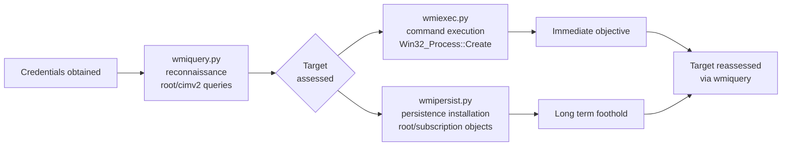

title: "wmiquery.py"
script: "examples/wmiquery.py"
category: "Remote Execution"
status: "Published"
protocols:
  - DCOM
  - WMI
  - MSRPC
ms_specs:
  - MS-DCOM
  - MS-WMI
  - MS-WMIO
mitre_techniques:
  - T1047
  - T1082
  - T1057
  - T1087
auth_types:
  - password
  - ntlm_hash
  - kerberos
  - aes_key
tags:
  - impacket
  - impacket/examples
  - category/remote_execution
  - status/published
  - protocol/dcom
  - protocol/wmi
  - ms-spec/ms-dcom
  - ms-spec/ms-wmi
  - technique/wmi_query
  - technique/reconnaissance
  - technique/enumeration
  - mitre/T1047
  - mitre/T1082
  - mitre/T1057
  - mitre/T1087
aliases:
  - wmiquery
  - impacket-wmiquery
  - wql-shell


# wmiquery.py

> **One line summary:** Interactive WQL shell and batch query runner against any reachable Windows host that exposes WMI over DCOM; connects to the target's `//./root/cimv2` namespace by default (changeable via `-namespace`), presents a `WQL>` prompt where the operator types Windows Query Language statements like `SELECT * FROM Win32_Process`, `SELECT Name, Version FROM Win32_Product`, or `describe Win32_Service` to inspect class definitions, and returns results as formatted tables; authored by Alberto Solino (`@agsolino`) as the third member of Impacket's WMI/DCOM toolkit, complementing `wmiexec.py` (command execution) and `wmipersist.py` (persistent event subscriptions); the tool is intentionally simple, about 200 lines of Python wrapping the same impacket DCOM + WMI infrastructure as its siblings, but its operational purpose is distinct: pure read only enumeration of any state exposed via WMI, which covers processes, services, installed software, user accounts, logical disks, network adapters, scheduled tasks, event log entries, Kerberos tickets, and essentially everything else Windows exposes via the CIM/WMI class hierarchy; **completes Remote Execution at 7 of 7 articles ✅, making it the 8th complete category for the wiki (62% complete by category)**.

| Field | Value |
|:---|:---|
| Script | `examples/wmiquery.py` |
| Category | Remote Execution |
| Status | Published |
| Author | Alberto Solino (`@agsolino`), Impacket maintainer |
| Primary protocols | DCOM (TCP 135 endpoint mapper plus dynamic high ports), WMI over DCOM |
| Primary Microsoft specifications | `[MS-DCOM]` Distributed Component Object Model Protocol, `[MS-WMI]` Windows Management Instrumentation Remote Protocol, `[MS-WMIO]` Windows Management Instrumentation Encoding |
| MITRE ATT&CK techniques | T1047 Windows Management Instrumentation (parent), T1082 System Information Discovery, T1057 Process Discovery, T1087 Account Discovery |
| Authentication types supported | Password, NTLM hash (`-hashes`), Kerberos (`-k`), AES key (`-aesKey`) |
| Impacket module dependencies | `dcerpc.v5.dcomrt.DCOMConnection`, `dcerpc.v5.dcom.wmi`, `dcerpc.v5.rpcrt.RPC_C_AUTHN_LEVEL_PKT_PRIVACY`, Python standard `cmd.Cmd` for the interactive shell |
| Privilege requirement | Depends on target namespace and queried classes. Local admin is commonly sufficient for all classes; users with only read access may reach some classes in `root/cimv2` but not sensitive ones. Distinct from wmiexec/wmipersist which always require admin. |


## Prerequisites

This article closes the Remote Execution category and should be read after its WMI siblings:

- [`wmiexec.py`](wmiexec.md) for WMI/DCOM foundations, the `IWbemLevel1Login` activation pattern, `CoCreateInstanceEx`, `NTLMLogin` to a namespace, and the authentication options that wmiquery reuses.
- [`wmipersist.py`](wmipersist.md) for WMI namespace context and object model background. wmipersist writes to WMI (creates EventFilter/Consumer/Binding objects in `root/subscription`); wmiquery reads from WMI (SELECT queries against any namespace). Same DCOM transport, opposite directions.
- [`dcomexec.py`](dcomexec.md) for broader DCOM object activation patterns.
- [`00_Introduction_and_Architecture.md`](Introduction_and_Architecture.md) for the overall Impacket architecture.

Familiarity with SQL is sufficient for WQL; the two languages are nearly identical in syntax.


## What it does

`wmiquery.py` presents an interactive WQL shell against a Windows target. Canonical invocation:

```text
$ wmiquery.py ACME/alice:Passw0rd@10.10.10.20
Impacket v0.14.0.dev0 - Copyright Fortra, LLC and its affiliated companies
[!] Press help for extra shell commands
WQL> SELECT Name, State, PathName FROM Win32_Service WHERE StartMode='Auto'
Name                     State     PathName
-                     --     --
AppIDSvc                 Running   C:\Windows\system32\svchost.exe -k LocalServiceNetworkRestricted -p
Audiosrv                 Running   C:\Windows\System32\svchost.exe -k LocalServiceNetworkRestricted -p
BFE                      Running   C:\Windows\system32\svchost.exe -k LocalServiceNoNetwork -p
...

WQL> describe Win32_Process
[!] Win32_Process
[!] Description: The Win32_Process class represents a sequence of events on a computer system running Windows.
[!] Properties:
[!]     Caption                    : string
[!]     CommandLine                : string
[!]     CreationDate               : datetime
[!]     Handle                     : string (key)
[!]     Name                       : string
[!]     ParentProcessId            : uint32
[!]     ProcessId                  : uint32
[!]     SessionId                  : uint32
[!]     ThreadCount                : uint32
[!]     ...
[!] Methods:
[!]     Create(CommandLine, CurrentDirectory, ProcessStartupInformation, ProcessId, ReturnValue)
[!]     Terminate(Reason, ReturnValue)
[!]     ...

WQL> exit
```

Two primary operations:

1. **WQL SELECT queries** return rows of data from any WMI class in the current namespace. Syntax matches standard SQL closely (SELECT, FROM, WHERE, the JOIN-adjacent `ASSOCIATORS OF` and `REFERENCES OF` constructs for class relationships).
2. **`describe <ClassName>`** prints the class definition: description, property names with types, method signatures. This is the schema exploration mode and is essential for discovering what to query.

The tool also supports batch mode via `-file`:

```bash
$ cat queries.wql
SELECT Caption FROM Win32_OperatingSystem
SELECT Name, Version FROM Win32_Product
SELECT Name, ProcessId FROM Win32_Process

$ wmiquery.py ACME/alice:Passw0rd@10.10.10.20 -file queries.wql
# Runs all three queries and prints results, then exits.
```

Characteristics:

- **Read only**. wmiquery does not support INSERT, UPDATE, DELETE, or method invocation. It is pure enumeration. The underlying WMI API supports more than SELECT (like `Win32_Process::Create` method invocation used by wmiexec), but wmiquery's shell exposes only the query path.
- **Namespace selectable via `-namespace`**. Defaults to `//./root/cimv2` (the main namespace containing Win32_* classes). Any namespace can be queried: `root/default`, `root/subscription`, `root/rsop/computer`, vendor namespaces like `root/Microsoft/SqlServer/ComputerManagement*`, `root/Microsoft/Windows/DeviceGuard`, etc.
- **Privilege flexibility**. Many `root/cimv2` classes are readable by unprivileged authenticated users. Some classes (like `Win32_Product`, Event log enumeration, some service detail) require admin. Local admin is always sufficient. This is different from wmiexec.py (always requires admin to create processes) and wmipersist.py (always requires admin to write subscriptions).
- **Interactive or batch**. Default is interactive `WQL>` prompt. With `-file`, runs a batch script and exits. Useful for automation and repeatable reconnaissance.


## Why it exists

Alberto Solino built wmiquery as the enumeration companion to wmiexec and wmipersist. The three tools together cover the full WMI attack surface that Impacket exposes:

- **wmiexec**: execute commands via `Win32_Process::Create` (action).
- **wmipersist**: install persistent event subscriptions in `root/subscription` (durability).
- **wmiquery**: read any WMI data via WQL queries (reconnaissance).

The tool's existence reflects three reasons:

- **WMI is a huge information source about Windows hosts**. Running processes, services, installed software, user accounts, logical disks, network adapters, shares, scheduled tasks, event log entries, hotfixes, performance counters, Kerberos tickets, and more are all queryable via WMI. A general purpose query tool unlocks all of it from a single interface.
- **Operators often need to explore before executing**. Before using wmiexec or wmipersist, it's useful to know what's running, what software is installed, what user sessions exist, whether EDR processes are present, and what patches are applied. wmiquery is the discovery tool that precedes execution.
- **Lower privilege footprint when available**. Some reconnaissance queries work with less privilege than execution does. wmiquery lets operators work with whatever access they have; if admin is available, queries return more; if only authenticated user access is available, queries still return substantial data.

The tool is simple by design. About 200 lines of Python, most of it the interactive shell loop and result formatting. The heavy lifting is delegated to Impacket's `wmi` module (class introspection, query execution, result decoding) and `dcomrt` module (transport, authentication).


## WQL theory

Understanding wmiquery requires a basic grasp of WQL (Windows Query Language) and the WMI class model. This section covers what matters; the Microsoft `[MS-WMI]` specification and WMI SDK documentation go deeper.

### The CIM / WMI class hierarchy

WMI is Microsoft's implementation of the CIM (Common Information Model) standard. The class hierarchy is organized into namespaces, each containing related classes:

- **`root/cimv2`** is the main namespace for OS and hardware data. Contains `Win32_Process`, `Win32_Service`, `Win32_LogicalDisk`, `Win32_OperatingSystem`, `Win32_Product`, `Win32_UserAccount`, `Win32_LogonSession`, `Win32_Share`, and hundreds more.
- **`root/default`** contains management classes (registry access via `StdRegProv`, etc.).
- **`root/subscription`** holds permanent event subscriptions (where wmipersist writes).
- **`root/rsop/computer`** and `root/rsop/user` contain Resultant Set of Policy data (GPO evaluation).
- **`root/directory/ldap`** maps LDAP directory entries as WMI classes.
- **`root/Microsoft/Windows/*`** contains vendor-specific classes including DeviceGuard, Defender, Storage, PowerShell subsystems.
- **`root/SecurityCenter2`** contains endpoint security product information (AV products via `AntiVirusProduct`, firewall, antispyware).
- **`root/StandardCimv2`** is the modern successor to `root/cimv2` with newer class definitions.

wmiquery's `-namespace` flag selects which namespace to query. The default `root/cimv2` covers the most commonly needed classes.

### WQL syntax basics

WQL is a SQL-like subset. The basic SELECT syntax:

```sql
SELECT <columns> FROM <ClassName> WHERE <conditions>
```

Examples:

```sql
-- All processes
SELECT * FROM Win32_Process

-- Processes running as SYSTEM, with specific columns
SELECT ProcessId, Name, CommandLine FROM Win32_Process 
WHERE ProcessId IN (SELECT Handle FROM Win32_Process WHERE Name='lsass.exe')

-- Running services
SELECT Name, State, StartMode, PathName FROM Win32_Service 
WHERE State='Running'

-- Installed software
SELECT Name, Version, Vendor FROM Win32_Product

-- Local user accounts
SELECT Name, SID, Disabled, FullName FROM Win32_UserAccount 
WHERE LocalAccount=TRUE

-- Active logon sessions
SELECT LogonId, LogonType, StartTime FROM Win32_LogonSession

-- Hotfixes installed
SELECT HotFixID, Description, InstalledOn FROM Win32_QuickFixEngineering

-- Endpoint antivirus products (requires -namespace root/SecurityCenter2)
SELECT * FROM AntiVirusProduct
```

### WMI class relationships

WMI classes can have associations (relationships between objects). WQL supports navigating them:

```sql
-- All objects associated with a given process
ASSOCIATORS OF {Win32_Process.Handle='1234'}

-- Services hosted by a particular process
ASSOCIATORS OF {Win32_Process.Handle='1234'} WHERE ResultClass=Win32_Service

-- Files in a given logical disk (rarely practical; massive result set)
ASSOCIATORS OF {Win32_LogicalDisk.DeviceID='C:'} WHERE ResultClass=Win32_Directory
```

Associations are less frequently used in offensive workflows than direct SELECT queries but occasionally useful.

### Event queries

WQL also supports event queries (notifications when things happen):

```sql
-- Notify when any new process starts
SELECT * FROM __InstanceCreationEvent WITHIN 5 
WHERE TargetInstance ISA 'Win32_Process'
```

Event queries are the foundation of wmipersist's EventFilter objects. wmiquery can run them, though the shell's streaming output for event queries is awkward; they're better used programmatically via `wmipersist` or custom scripts.

### The `describe` command

`describe <ClassName>` is wmiquery-specific syntax (not part of WQL proper). It introspects the class definition and prints properties and methods. This is essential for discovering what's queryable.

```text
WQL> describe Win32_LogonSession
[!] Win32_LogonSession
[!] Description: The Win32_LogonSession class describes the logon session or sessions associated with a user logged on to a computer running Windows.
[!] Properties:
[!]     AuthenticationPackage : string
[!]     LogonId               : string (key)
[!]     LogonType             : uint32
[!]     StartTime             : datetime
[!]     Status                : string
```

Common workflow: `describe` a class first to learn its schema, then construct targeted SELECT queries.

### How query execution flows

When the operator enters a query:

1. wmiquery sends the query string via the `IWbemServices::ExecQuery` DCOM method to the target.
2. The target's WMI service routes the query to the appropriate WMI provider (each provider class is implemented by a DLL, like `cimwin32.dll` for most Win32_* classes).
3. The provider enumerates matching instances and returns them serialized per `[MS-WMIO]`.
4. wmiquery parses the response and formats it as a table.

Query evaluation happens on the target. The target's CPU and WMI provider code do the work; only the result set crosses the network. This is efficient for selective queries but potentially expensive if `SELECT *` is used against large classes like `Win32_Process` on a busy host or CIM_DataFile (which is almost never what you want to query).


## How the tool works internally

The script is about 200 lines. Most of it is the interactive shell loop and output formatting.

### Imports

```python
from impacket.dcerpc.v5.dtypes import NULL
from impacket.dcerpc.v5.dcom import wmi
from impacket.dcerpc.v5.dcomrt import DCOMConnection, COMVERSION
from impacket.dcerpc.v5.rpcrt import RPC_C_AUTHN_LEVEL_PKT_PRIVACY, RPC_C_AUTHN_LEVEL_PKT_INTEGRITY
import cmd  # Python standard library interactive command shell
```

The `cmd.Cmd` standard library class provides the interactive shell scaffolding. Everything else is standard Impacket DCOM/WMI.

### Connection setup

```python
dcom = DCOMConnection(target, username, password, domain, lmhash, nthash, aesKey, oxidResolver=True)
iInterface = dcom.CoCreateInstanceEx(wmi.CLSID_WbemLevel1Login, wmi.IID_IWbemLevel1Login)
iWbemLevel1Login = wmi.IWbemLevel1Login(iInterface)
iWbemServices = iWbemLevel1Login.NTLMLogin(namespace, NULL, NULL)
iWbemLevel1Login.RemRelease()
```

Standard DCOM activation pattern. Identical to wmiexec and wmipersist; only the target namespace differs (`root/cimv2` default instead of `root/subscription`).

### Shell loop

```python
class WMIQUERY(cmd.Cmd):
    def __init__(self, iWbemServices):
        cmd.Cmd.__init__(self)
        self.iWbemServices = iWbemServices
        self.prompt = 'WQL> '
        self.intro = '[!] Press help for extra shell commands'
    
    def default(self, line):
        # Handle "describe <class>" specially
        if line.startswith('describe '):
            self.describe(line[9:])
            return
        # Otherwise treat the line as a WQL query
        self.run_query(line)
    
    def run_query(self, query):
        iEnumWbemClassObject = self.iWbemServices.ExecQuery(query.strip())
        try:
            while True:
                pEnum = iEnumWbemClassObject.Next(0xffffffff, 1)[0]
                record = pEnum.getProperties()
                self.print_record(record)
        except Exception as e:
            if 'S_FALSE' in str(e):
                pass  # End of results
            else:
                raise
```

(Simplified pseudocode. The actual implementation handles more edge cases in formatting.)

`ExecQuery` is the WMI method that runs WQL. The enumerator returned by it yields result rows one at a time. wmiquery formats each row as a table column sequence and prints.

### The `describe` implementation

```python
def describe(self, classname):
    iObject, _ = self.iWbemServices.GetObject(classname)
    # Print Description qualifier
    print(f'[!] Description: {iObject.getDescription()}')
    # Walk properties
    for propName, propType in iObject.getProperties().items():
        print(f'[!]     {propName}: {propType}')
    # Walk methods
    for methodName, methodSig in iObject.getMethods().items():
        print(f'[!]     {methodName}({methodSig})')
```

Uses `IWbemServices::GetObject` to retrieve the class definition (not instances), then walks property and method tables. Pure introspection; no instance data.

### Batch mode

```python
if options.file:
    for line in options.file.readlines():
        line = line.strip()
        if not line or line.startswith('#'):
            continue
        shell.onecmd(line)
```

Reads commands from a file, feeds them to the shell's `onecmd` dispatcher, then exits. No interactive prompt.

### What the tool does NOT do

- Does NOT support WMI method invocation (can't `Win32_Process::Create` from wmiquery). Use wmiexec for that.
- Does NOT support WMI object modification (can't UPDATE or DELETE). Use wmipersist for subscription objects specifically, or custom Impacket code for arbitrary modifications.
- Does NOT support event subscription setup (even though event queries via `__InstanceCreationEvent` can be submitted, the shell output for streaming events is poor). Use wmipersist.
- Does NOT provide built-in query templates or presets. Operators construct queries themselves.
- Does NOT cache or store results. Each invocation is independent.
- Does NOT support fanout across multiple targets. Querying many hosts requires scripting around wmiquery.


## Authentication options

Same options as every other Impacket WMI/DCOM tool. See [`wmiexec.py`](wmiexec.md) for the detailed discussion; briefly:

| Option | Flag | Notes |
|:---|:---||
| Password | `user:password@host` | Prompts if password is omitted. |
| NTLM hash | `-hashes LM:NT` | Pass the hash. Typically only NT is known; supply LM as `aad3b435b51404eeaad3b435b51404ee`. |
| Kerberos | `-k` | Uses `KRB5CCNAME` ccache. Add `-no-pass` if ccache is sufficient. |
| AES key | `-aesKey <hex>` | Kerberos with AES256 key. |

Privilege implications vary by query:

- **Unprivileged authenticated user**: can query many `root/cimv2` classes (Win32_Process, Win32_Service, Win32_OperatingSystem, hotfixes, some hardware info). Cannot query some sensitive classes. Cannot reach `root/subscription` or security-sensitive namespaces.
- **Local admin**: can query everything in every namespace.
- **Domain user without local admin on target**: behaves as unprivileged authenticated user for WMI purposes.

This distinguishes wmiquery from wmiexec and wmipersist, both of which always require admin. In practice operators usually have admin credentials during engagements (that's the point of credential theft), but the privilege flexibility matters in initial reconnaissance phases where only domain user access has been obtained.


## Practical usage

### Basic reconnaissance queries

```bash
# Running processes on target
wmiquery.py ACME/alice:Passw0rd@10.10.10.20
WQL> SELECT Name, ProcessId, ParentProcessId, CommandLine FROM Win32_Process
```

Output is a table of every process on the target, similar to Task Manager's details view.

### Check for EDR / AV before executing

```bash
wmiquery.py -namespace //./root/SecurityCenter2 ACME/alice:Passw0rd@10.10.10.20
WQL> SELECT * FROM AntiVirusProduct
```

Returns the endpoint's registered antivirus products. Useful before deploying payloads via wmiexec, because knowing there's a CrowdStrike or Defender ATP sensor changes the engagement approach.

Same namespace, different class:

```sql
SELECT * FROM FirewallProduct
SELECT * FROM AntiSpywareProduct
```

### Installed software inventory

```bash
wmiquery.py ACME/alice:Passw0rd@10.10.10.20
WQL> SELECT Name, Version, Vendor, InstallDate FROM Win32_Product
```

Note: Win32_Product has a side effect on some Windows versions (triggers MSI consistency check). Querying it is detectable. A less noisy alternative for the reconnaissance use case is reading the Uninstall registry key (via reg.py or via WMI's StdRegProv class in `root/default`).

### Current logged-on users

```bash
wmiquery.py ACME/alice:Passw0rd@10.10.10.20
WQL> SELECT UserName, LogonId FROM Win32_LoggedOnUser
WQL> SELECT Name, FullName, Domain, LastLogon FROM Win32_UserAccount WHERE LocalAccount=TRUE
```

Shows active sessions (LoggedOnUser) and configured local accounts (UserAccount).

### Hotfix inventory (patch status assessment)

```bash
wmiquery.py ACME/alice:Passw0rd@10.10.10.20
WQL> SELECT HotFixID, Description, InstalledOn FROM Win32_QuickFixEngineering
```

Lists applied Windows hotfixes. Useful for confirming patch status for specific KBs relevant to the engagement (e.g. checking if a system known to be vulnerable is patched for MS17-010, CVE-2021-34527 PrintNightmare, etc.).

### Event log queries (limited scope)

```bash
wmiquery.py ACME/alice:Passw0rd@10.10.10.20
WQL> SELECT EventCode, SourceName, TimeGenerated, Message FROM Win32_NTLogEvent WHERE Logfile='Security' AND EventCode=4624 AND TimeWritten > '20260101000000.000000-000'
```

Queries the event log via WMI. Slow and limited compared to using wevtutil or parsing the log directly, but works from any session where WMI is reachable. Useful when regular log collection paths are blocked.

### Scheduled tasks

```bash
wmiquery.py ACME/alice:Passw0rd@10.10.10.20
WQL> SELECT Name, TaskToRun, Status, NextRunTime FROM Win32_ScheduledJob
```

Returns AT-style scheduled jobs. Modern Task Scheduler tasks (the ones created by schtasks or Task Scheduler UI) are in `root/Microsoft/Windows/TaskScheduler` namespace.

### Batch reconnaissance script

```bash
cat > recon.wql << 'EOF'
# Operating system and hardware baseline
SELECT Caption, Version, OSArchitecture, InstallDate, LastBootUpTime FROM Win32_OperatingSystem
SELECT Manufacturer, Model, TotalPhysicalMemory FROM Win32_ComputerSystem

# Running processes
SELECT Name, ProcessId, CommandLine FROM Win32_Process

# Listening services
SELECT Name, State, PathName, StartMode FROM Win32_Service WHERE State='Running'

# Users and sessions
SELECT UserName, LogonId FROM Win32_LoggedOnUser
SELECT Name, SID FROM Win32_UserAccount WHERE LocalAccount=TRUE

# Network
SELECT Caption, IPAddress, MACAddress FROM Win32_NetworkAdapterConfiguration WHERE IPEnabled=TRUE

# Installed KBs
SELECT HotFixID FROM Win32_QuickFixEngineering
EOF

wmiquery.py ACME/alice:Passw0rd@10.10.10.20 -file recon.wql > recon_output.txt
```

Standard initial reconnaissance pass against a target. Comments (lines starting with `#`) are skipped. Can be rerun across multiple hosts by scripting wmiquery invocations.

### Query a non-default namespace

```bash
wmiquery.py -namespace //./root/Microsoft/Windows/DeviceGuard ACME/alice:Passw0rd@10.10.10.20
WQL> SELECT * FROM Win32_DeviceGuard
```

Device Guard / HVCI configuration.

```bash
wmiquery.py -namespace //./root/subscription ACME/alice:Passw0rd@10.10.10.20
WQL> SELECT * FROM __EventFilter
WQL> SELECT * FROM ActiveScriptEventConsumer
WQL> SELECT * FROM __FilterToConsumerBinding
```

Enumerate existing WMI persistence: what wmipersist installs, wmiquery can read. Useful both for operators verifying their own installations and for defenders hunting for persistence.

### Kerberos authentication

```bash
export KRB5CCNAME=/tmp/admin.ccache
wmiquery.py -k -no-pass ACME/admin@target.acme.local
```

Standard pattern, reusing a Kerberos TGT from getTGT.py, ticketer.py, getST.py, or any other Impacket tool.

### Key flags

| Flag | Meaning |
|:---|:---|
| `target` (positional) | Standard Impacket target string `[[domain/]username[:password]@]host`. |
| `-namespace <ns>` | WMI namespace. Default `//./root/cimv2`. |
| `-file <path>` | Read WQL commands from a file, execute, exit. Non-interactive batch mode. |
| `-debug` | Verbose debug output including DCOM packet traces. |
| `-ts` | Prefix every log line with a timestamp. |
| `-com-version MAJOR.MINOR` | DCOM version override. Rarely needed but occasionally necessary for older Windows compatibility. |
| `-hashes LM:NT` | NTLM authentication. |
| `-k` | Kerberos authentication. Uses KRB5CCNAME. |
| `-no-pass` | Don't prompt for password. Use with `-k` when ccache contains what's needed. |
| `-aesKey <hex>` | AES key for Kerberos. |


## What it looks like on the wire

WMI over DCOM. Same transport stack as wmiexec and wmipersist.

1. TCP 135 connection to DCOM endpoint mapper.
2. EPM request for `IWbemLevel1Login` (UUID `F309AD18-D86A-11d0-A075-00C04FB68820`).
3. EPM response with dynamic port.
4. Second TCP connection to the dynamic port.
5. NTLM challenge-response or Kerberos AP-REQ authentication.
6. `NTLMLogin` to the selected namespace.
7. For each query: `IWbemServices::ExecQuery` call with the WQL string, followed by enumerator `Next` calls to retrieve result rows.
8. For `describe`: `IWbemServices::GetObject` with the class name, returning class metadata.

The query text and result rows are visible in the DCOM traffic unless encrypted. wmiquery uses packet privacy authentication level (`RPC_C_AUTHN_LEVEL_PKT_PRIVACY` in modern versions), which encrypts payloads. Captures show DCOM traffic but not the specific query string or results unless session keys can be recovered.

### Wireshark filters

```text
dcerpc.uuid == "f309ad18-d86a-11d0-a075-00c04fb68820"   # IWbemLevel1Login
tcp.port == 135                                          # EPM
dcerpc                                                   # All DCE/RPC traffic
```

Zeek's DCE-RPC parser shows the namespace name (visible in the NTLMLogin call) and the interface being used. Even with packet privacy, the fact that WMI queries are happening is detectable.


## What it looks like in logs

wmiquery activity is subtler than wmiexec or wmipersist because it does not execute code or create persistence. The log footprint is authentication and query activity only.

### Authentication events

- **Event 4624**: Logon Type 3 (Network), Authentication Package = NTLM or Kerberos, source = attacker host IP. Same as every other Impacket tool.
- **Event 4672**: special privileges assigned, if the authenticating account is admin.

### WMI-Activity events

- **Event 5857** (WMI operation started): appears in `Microsoft-Windows-WMI-Activity/Operational` log when a WMI connection is established. Includes the provider being used.
- **Event 5860** (temporary event consumer): appears when temporary event queries (notifications) are used. wmiquery supports these via `SELECT * FROM __InstanceCreationEvent` syntax but the shell output is awkward; more common with scripted WMI than with wmiquery.

Note: WMI query activity is NOT comprehensively logged by default. Most `SELECT` queries fire no discrete event. This is by design: WMI queries are routine management traffic and logging every one would flood the log. The tradeoff is that enumeration via WMI is hard to detect reliably after the fact.

### Sysmon 19/20/21

These events (WmiEventFilter, WmiEventConsumer, WmiEventConsumerToFilter) fire only on permanent event subscription creation. They do NOT fire for regular SELECT queries. wmiquery typically generates no Sysmon 19/20/21 traffic.

### Network signals

Because authentication fires 4624 and DCOM/WMI uses TCP 135 + dynamic ports, detection at the network level is the primary signal after authentication succeeds:

- Network flow records (NetFlow, Zeek conn.log) showing DCE/RPC connections from an atypical source to high value hosts.
- Zeek `dce_rpc.log` entries with the `IWbemLevel1Login` endpoint and namespace information.
- Volume of DCE/RPC traffic (many sequential queries look different from a single management action).

### Starter Sigma rule

```yaml
title: Anomalous WMI Query Activity from Non-Management Host
logsource:
  category: network
  product: zeek
  service: dce_rpc
detection:
  selection:
    endpoint: IWbemServices
    named_pipe: '\PIPE\atsvc'
  filter_known_management:
    source_ip:
      - 'sccm_server_ip'
      - 'jump_box_ip'
      - 'known_admin_workstation_ips'
  condition: selection and not filter_known_management
level: medium
```

Medium severity. WMI queries are routine; only anomalous sources indicate potential reconnaissance. Requires baseline of known legitimate WMI query sources, which is achievable in most mature environments.

### Batch query detection

An attacker using `-file` with a reconnaissance script will fire many sequential `ExecQuery` operations in a short time window. Batch query volume detection:

```yaml
title: Burst of WMI ExecQuery Calls from Single Source
logsource:
  category: network
  product: zeek
  service: dce_rpc
detection:
  selection:
    operation: ExecQuery
  condition: selection
timeframe: 30s
threshold: 10  # 10+ queries in 30 seconds
level: low
```

Low severity because management tooling also does this, but useful as a contributing signal in correlation rules.


## Detection and defense

### Detection opportunities

The honest assessment: WMI query activity is hard to detect. The technique blends with legitimate management traffic, generates minimal logs, and uses encrypted DCOM channels. Defenders have three main paths:

- **Baseline the known legitimate WMI query sources** and alert on anything outside the baseline. Works in environments where management tooling is concentrated and predictable.
- **Volumetric detection**: burst of queries from one source, especially if targeting many hosts, signals reconnaissance.
- **Authentication anomaly detection**: 4624 Logon Type 3 + NTLM or Kerberos from unusual sources, followed by DCOM/WMI traffic, indicates someone authenticated and started querying.

For wmiquery specifically, the tool does not generate unique signatures beyond regular WMI DCOM activity. Anyone detecting wmiquery is really detecting WMI usage generally.

### Preventive controls

- **Restrict DCOM remote access**: blocking TCP 135 from untrusted network segments prevents remote WMI entirely. Most operationally disruptive but most effective.
- **Network segmentation**: limit which sources can reach TCP 135 on high value hosts.
- **WMI namespace ACLs**: tighten `root/cimv2` and other namespace permissions so authenticated users cannot enumerate without admin rights. Operationally complex but effective.
- **Disable unnecessary WMI namespaces**: some vendor namespaces (SQL Server, Exchange management) can be removed or access-restricted on hosts that don't need them.
- **Strong authentication**: Kerberos armoring (FAST), Protected Users group, minimizing plaintext credential exposure, reduces the value of stolen credentials that would power wmiquery.

### What wmiquery.py does NOT do

- Does NOT execute code on the target (no `Win32_Process::Create` call).
- Does NOT install persistence (no writes to `root/subscription`).
- Does NOT require local admin for many queries; some queries work with domain user privilege.
- Does NOT modify target state.
- Does NOT generate Sysmon 19/20/21 events.
- Does NOT bypass DCOM blocks at the network level.
- Does NOT work against targets that have WMI disabled (rare; disabling WMI breaks management tooling and is operationally expensive).


## Related tools and attack chains

`wmiquery.py` **completes Remote Execution at 7 of 7 articles** ✅. Remote Execution is now the **8th complete category** for the wiki (alongside Kerberos Attacks, Credential Access, SMB Tools, Relay Attacks, Exchange, Exploits, File Format Parsing).

### Related Impacket tools

- [`wmiexec.py`](wmiexec.md) is the execution companion. Uses the same WMI/DCOM transport to invoke `Win32_Process::Create` for command execution. Requires admin always. Reconnaissance with wmiquery often precedes execution with wmiexec.
- [`wmipersist.py`](wmipersist.md) is the persistence companion. Uses the same transport to create `__EventFilter` + `ActiveScriptEventConsumer` + `__FilterToConsumerBinding` in `root/subscription`. Requires admin. wmiquery is useful for auditing subscriptions installed by wmipersist via `SELECT * FROM __EventFilter` in the subscription namespace.
- [`smbclient.py`](../05_smb_tools/smbclient.md) and [`rpcdump.py`](../01_recon_and_enumeration/rpcdump.md) are alternative reconnaissance tools from different protocol angles. Use together for comprehensive host enumeration.
- [`secretsdump.py`](../03_credential_access/secretsdump.md) typically runs after reconnaissance confirms the target is worth dumping credentials from. wmiquery is the "is this target interesting" check; secretsdump is the extraction.

### External alternatives

- **`wmic`** (deprecated but often still present): `wmic /node:10.10.10.20 process get Name,ProcessId,CommandLine /format:list`. Native Windows tool, works from any Windows host. Deprecated in Windows 10 21H2+ but still functional on many systems.
- **`Get-WmiObject` / `Get-CimInstance` in PowerShell**: the modern native path. `Get-CimInstance -ComputerName 10.10.10.20 -ClassName Win32_Process`. Standard PowerShell syntax, operates over DCOM or WinRM transport.
- **`wmie2`** at `https://github.com/vinaypamnani/wmie2`: GUI WMI Explorer for Windows. Useful for manual interactive exploration.
- **CrackMapExec / NetExec** with WMI modules: higher level tooling that wraps WMI queries in the context of credential spray and enumeration operations across many hosts. Good for scenarios scanning many hosts at once.
- **SharpWMI** by cube0x0: C# WMI tool for offensive use on Windows.
- **WMI Explorer** (various implementations): browsing tools for interactive namespace exploration.

For an attack host running Linux, wmiquery is the right tool. For work from within Windows, native PowerShell (`Get-CimInstance`) is usually preferable since it requires no separate installation and integrates with the full PowerShell ecosystem.

### Complete WMI trilogy



The three WMI tools form a complete offensive workflow: wmiquery discovers, wmiexec acts, wmipersist persists. Reading the three articles together gives a unified view of what WMI over DCOM enables for attackers and what defenders need to monitor.

### Where each tool fits

| Tool | Operation | Direction | Namespace | Privilege | Persistence |
|:---|:---||:---|:---||
| `wmiquery.py` | SELECT queries | Read only | Any (default cimv2) | Varies (often user level) | None |
| `wmiexec.py` | Win32_Process::Create | Read + execute | cimv2 (fixed) | Admin required | None (one shot) |
| `wmipersist.py` | EventFilter + Consumer + Binding creation | Write | subscription (fixed) | Admin required | Yes (reboot durable) |

wmiquery's lower privilege bar and read only posture make it the natural starting point. wmiexec and wmipersist are the escalation steps.


## Further reading

- **Microsoft "Querying with WQL"** at `https://learn.microsoft.com/en-us/windows/win32/wmisdk/querying-with-wql`. Canonical WQL syntax reference.
- **Microsoft "WMI Reference"** at `https://learn.microsoft.com/en-us/windows/win32/wmisdk/wmi-reference`. Complete class hierarchy documentation.
- **`[MS-WMI]` Windows Management Instrumentation Remote Protocol** at `https://learn.microsoft.com/en-us/openspecs/windows_protocols/ms-wmi/`. Protocol specification covering the on-wire format of WMI over DCOM.
- **`[MS-WMIO]` Windows Management Instrumentation Encoding** at `https://learn.microsoft.com/en-us/openspecs/windows_protocols/ms-wmio/`. Instance serialization format.
- **`[MS-DCOM]` Distributed Component Object Model Protocol** at `https://learn.microsoft.com/en-us/openspecs/windows_protocols/ms-dcom/`. DCOM transport specification.
- **Matt Graeber's PowerShell Magazine WMI series** at `https://www.powershellmagazine.com/tag/wmi/`. Seminal tutorials on offensive WMI usage. Foundational reading.
- **Dell SecureWorks "Windows Management Instrumentation (WMI) Offense, Defense, and Forensics"** whitepaper. Covers reconnaissance at the query level and the defensive perspective.
- **SANS "Investigating WMI Attacks"** at `https://www.sans.org/blog/investigating-wmi-attacks/`. Defender's perspective on WMI as both attack tool and investigation surface.
- **Impacket wmiquery.py source** at `https://github.com/fortra/impacket/blob/master/examples/wmiquery.py`. About 200 lines.
- **Impacket wmi.py module source** at `https://github.com/fortra/impacket/blob/master/impacket/dcerpc/v5/dcom/wmi.py`. The underlying library that wmiquery (and wmiexec and wmipersist) wraps. Much larger file covering the full WMI over DCOM implementation.
- **MITRE ATT&CK T1047 Windows Management Instrumentation** at `https://attack.mitre.org/techniques/T1047/`. Parent technique.
- **MITRE ATT&CK T1082 System Information Discovery, T1057 Process Discovery, T1087 Account Discovery**. The reconnaissance techniques wmiquery supports.

If you want to internalize wmiquery as a tool, the productive exercise has three parts. First, in a lab, connect to a Windows target and use `describe` against ten different classes (Win32_Process, Win32_Service, Win32_LogicalDisk, Win32_OperatingSystem, Win32_Product, Win32_UserAccount, Win32_LogonSession, Win32_NetworkAdapterConfiguration, Win32_QuickFixEngineering, Win32_ScheduledJob) to internalize what the schema looks like. Second, write a batch reconnaissance script covering a dozen useful queries and run it against a few lab hosts, studying the output. Third, switch to `-namespace //./root/subscription` and query the three subscription classes, then run wmipersist.py to install a subscription, query again, and see the installation from the defender's side. After these three exercises wmiquery becomes a reflex tool, reached for automatically during any Windows engagement where credentials and WMI reachability are established. The tool's value is directly proportional to how well the operator knows the WMI class hierarchy, which only comes with practice.
