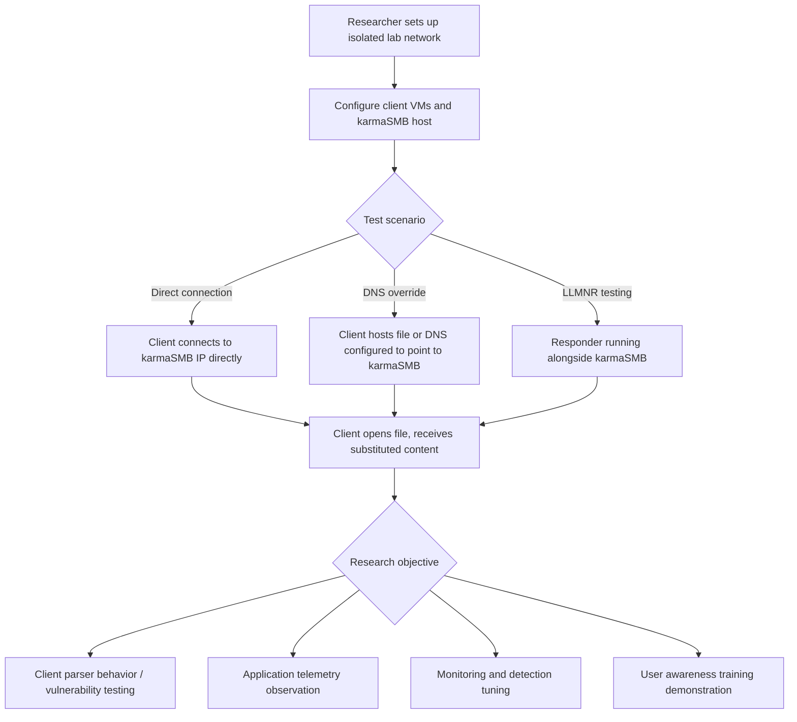

title: "karmaSMB.py"
script: "examples/karmaSMB.py"
category: "SMB Tools"
status: "Published"
protocols:
  - SMB1
  - SMB2
  - MS-SMB
  - MS-SMB2
ms_specs:
  - MS-SMB
  - MS-SMB2
mitre_techniques:
  - T1557
  - T1036
  - T1211
auth_types:
  - any
tags:
  - impacket
  - impacket/examples
  - category/smb_tools
  - status/published
  - protocol/smb
  - technique/smb_deception
  - technique/client_side_testing
  - technique/content_substitution
  - technique/name_resolution_poisoning
  - research/smb_clients
  - mitre/T1557
  - mitre/T1036
  - mitre/T1211
aliases:
  - karmaSMB
  - impacket-karmaSMB
  - karma_smb


# karmaSMB.py

> **One line summary:** SMB server that returns the same file contents in response to every read request, regardless of the actual filename the client asks for, with optional overrides by extension via a configuration file that maps specific file extensions to specific files, enabling researchers to study how SMB client software handles unexpected or malformed file content, to test client parsers for vulnerabilities in a controlled lab setting, and to stage authorized red team exercises where a decoy server substitutes predictable content for whatever a client fetches; named after the wireless "Karma" attack concept from Dino Dai Zovi and Shane Macaulay (2004), which applied the same "respond to every probe regardless of what was asked for" principle to 802.11 clients, and completing the SMB Tools category at 3 of 3 articles alongside [`smbclient.py`](smbclient.md) (SMB client) and [`smbserver.py`](smbserver.md) (full fidelity SMB server).

| Field | Value |
|:---|:---|
| Script | `examples/karmaSMB.py` |
| Category | SMB Tools |
| Status | Published |
| Primary protocols | SMB1, SMB2 (experimental) |
| Primary Microsoft specifications | `[MS-SMB]`, `[MS-SMB2]` |
| MITRE ATT&CK techniques | T1557 Adversary in the Middle, T1036 Masquerading, T1211 Exploitation for Defense Evasion (relevant when used for client side testing) |
| Authentication types supported | Accepts any credentials (the server does not validate them) |
| First appearance in Impacket | Impacket 0.9.14 (around 2014-2015) |
| Original author | Alberto Solino (`@agsolino`), building on the `impacket.smbserver` library |


## Prerequisites

This article builds on:

- [`00_Introduction_and_Architecture.md`](Introduction_and_Architecture.md) for the Impacket stack overview.
- [`smbserver.py`](smbserver.md) for the SMB server framework and its relationship with [`ntlmrelayx.py`](../06_relay_attacks/ntlmrelayx.md). `karmaSMB.py` uses the same underlying `impacket.smbserver` library but reroutes file read responses.
- [`smbclient.py`](smbclient.md) for the client side of SMB operations.

Basic familiarity with SMB file operations (tree connect, file open, read, close) is helpful. The article explains the relevant pieces as they come up.


## What it does

`karmaSMB.py` is an SMB server that ignores what the client asks for and returns attacker-specified content instead. Running `karmaSMB.py /path/to/payload.txt` starts an SMB server that:

- Accepts connections on port 445 (and 139 if configured).
- Presents standard shares (`IPC$`, `NETLOGON`, `C$` or similar).
- Accepts any credentials the client offers (no validation).
- For any file the client tries to read, returns the contents of `/path/to/payload.txt`.

The client thinks it is reading whatever file it requested. The server actually delivers `payload.txt` regardless. To the client's file operations, the file size, contents, and metadata all appear to correspond to a real file at the requested path.

The `-config` option adds a second layer: a config file maps specific file extensions to specific local files. For example:

```ini
[extensions]
exe = /payloads/test.exe
docx = /payloads/template.docx
pdf = /payloads/sample.pdf
```

With this config, a client requesting `\\server\share\anything.exe` gets `test.exe`; `\\server\share\report.docx` gets `template.docx`; any other extension gets the default positional argument.

The combination enables research workflows like:

- Serve a crafted Office document to any `.docx` request to test Office's handling of document content.
- Serve a specific PDF to any `.pdf` request to study PDF reader behavior.
- Serve a test executable to any `.exe` request to observe how Windows handles downloaded executables.
- Serve a generic file to unknown extensions to ensure the server always responds with something (preventing client timeouts or error paths).

The tool does not authenticate clients, does not persist state, does not write any data from the client (the server is essentially read only for remote requests, though it will accept write operations and silently discard them). Its job is exclusively to deliver content when asked.


## Why it exists

The tool's name references Dino Dai Zovi and Shane Macaulay's Karma wireless attack from 2004. Karma was an attack against WiFi clients: when a client device searches for networks it previously connected to by sending probe requests ("Is [some network name] available?"), a rogue access point running Karma responds "Yes, I am [whatever network name you asked for]" to every probe. The client then associates with the rogue AP, which can observe or modify subsequent traffic.

The concept generalizes beyond Wi-Fi: any protocol where the server can lie about what it is serving, and where the client does not verify the server's identity or content, is susceptible. SMB is such a protocol in many deployments:

- SMB clients do not typically validate server identity cryptographically (signing is available but not always enforced).
- Clients accept whatever content the server returns for a requested file.
- Name resolution mechanisms on Windows (LLMNR, NBT-NS, mDNS) can be poisoned, allowing an attacker to redirect requests for a hostname to a server the attacker controls.

Alberto Solino wrote `karmaSMB.py` as a small tool that applies the Karma principle to SMB. The goals:

- **Research on SMB client software.** When a new SMB-related vulnerability is disclosed (such as MS17-010 EternalBlue, CVE-2020-0796 SMBGhost, or various LNK/OLE parser bugs), researchers need a way to serve crafted content to test clients in lab environments. `karmaSMB.py` provides a fast way to stand up a server that delivers the crafted content for any file request.
- **Red team exercises.** When conducting authorized assessments, testers may need to serve specific content to simulated victim clients to demonstrate risks (for instance, demonstrating that a user's workstation will open a file from a shared drive without further prompt).
- **Honeypots and deception research.** Studying attacker behavior requires presenting realistic targets; an SMB server that responds to any query with content that looks useful gives attackers something to engage with.
- **Vulnerability research pipelines.** Automated fuzzing and client testing pipelines need an SMB server that responds predictably regardless of what the fuzzer or test harness sends.

The tool has not changed much since its initial appearance. It is a small, focused utility that solves the specific problem of "serve this file contents to any SMB read request" and does nothing beyond that. Deeper attack surfaces (name resolution poisoning, SMB signing manipulation, relay attacks) are handled by other tools in Impacket and the broader ecosystem; `karmaSMB.py` is just the content delivery component.


## The protocol theory

This section covers the SMB operations involved in a file read and what `karmaSMB.py` does differently from a normal SMB server at each step.

### The SMB file read sequence

When an SMB client (Windows Explorer, `net use`, the Office application trying to open a network document, etc.) reads a file from a remote share, it performs:

1. **TCP connect** to port 445 on the server.
2. **SMB negotiate.** Client and server agree on an SMB dialect (SMB1, SMB2, or SMB3).
3. **Session setup.** Client authenticates (NTLM or Kerberos). The server may accept anonymous or guest.
4. **Tree connect** to the target share (for instance `\\server\share`).
5. **Create** (open) the file with the requested filename. The server responds with a file handle and the file's metadata (size, timestamps, attributes).
6. **Read** operations against the file handle, possibly multiple times to read in chunks.
7. **Close** the file handle.
8. **Tree disconnect** and eventually session logoff.

A normal SMB server at step 5 checks whether the file actually exists on the server's filesystem and returns success or `STATUS_OBJECT_NAME_NOT_FOUND` accordingly. `karmaSMB.py` at step 5 always returns success, reporting the file size of the configured payload regardless of the requested filename.

At step 6, a normal server reads from the actual file on disk. `karmaSMB.py` reads from the configured payload file instead. If the client reads in chunks, subsequent chunks come from offsets within the payload file, not from any "real" file at the requested path.

### Why this works

SMB's data model treats each file as an opaque blob identified by a name. The client makes no assumption that the server is storing files in any particular way; as long as the server returns coherent read results for a given handle, the client proceeds. A server that synthesizes file content dynamically (as `karmaSMB.py` does) is indistinguishable from a server that reads from disk as far as the protocol is concerned.

Some metadata fields can reveal the deception if a client checks them. For example, if the server reports the creation time of `payload.txt` for every file the client asks about, alert clients or monitoring tools might notice that every file has the same creation timestamp. In practice, most clients do not verify this.

### The SRVSVC and shared resource interface

`karmaSMB.py` implements the `SRVSVC` RPC interface (Server Service) over the `IPC$` share to support share enumeration. This means clients calling `NetShareEnum` see a realistic set of shares rather than finding the server to be empty or malformed. The tool advertises:

- `IPC$` (the required administrative pipe share).
- `NETLOGON` (present on domain controllers; makes the server look more legitimate in some contexts).
- A fictitious data share configured for the workflow.

The share enumeration response uses dummy values for most fields but is structurally valid. Clients performing `\\server\` browsing see something sensible.

### Name resolution context

By itself, `karmaSMB.py` is just an SMB server. It accepts connections; it does not attract them. Making a client connect to the `karmaSMB.py` server usually requires one of:

- **The client explicitly connects to the server's IP or hostname.** In lab settings for research or testing, the operator configures the client to use the karmaSMB server's address directly.
- **DNS is modified** so that a target hostname resolves to the karmaSMB server. This is done in lab environments by editing the client's `hosts` file or DNS configuration; it is not done through name resolution abuse in legitimate testing contexts.
- **LLMNR or NBT-NS poisoning** (using a tool like `Responder`) makes the client resolve non-existent hostnames to the attacker's IP, and the subsequent SMB connection hits `karmaSMB.py`. This is the most operationally relevant combination in authorized red team exercises where LLMNR/NBT-NS traffic is being tested.

The `karmaSMB.py` tool does not do the name resolution step itself. It waits for connections on its IP. Combining it with a resolver tool (Responder, or manual DNS setup) is the operator's responsibility.

### Why this is not more dangerous

A Karma style SMB server can only deliver content to clients that somehow arrive at it. Clients do not arbitrarily connect to unknown SMB servers on the network; they connect in response to:

- A user clicking a UNC link (`\\server\share\file`).
- An application reading from a configured network drive.
- Name resolution returning an unexpected address (usually because of poisoning or misconfiguration).

Each of these paths involves either a deliberate user action or a separate vulnerability (the name resolution issue). `karmaSMB.py` by itself does not create these paths; it provides content once a path exists.

This limits the tool's reach compared to, for example, a remote code execution exploit that targets any reachable SMB server. `karmaSMB.py` is a passive delivery mechanism, not an active exploitation tool. Its value is in controlled research settings where the operator has already established a reason for clients to connect.

### Comparison with smbserver.py and smbrelayx.py

Three SMB server tools in Impacket occupy distinct roles:

| Tool | Purpose |
|:---|:---|
| [`smbserver.py`](smbserver.md) | Full fidelity SMB server that serves actual files from actual directories, with real authentication and real share configuration. Used for legitimate file hosting and for capturing incoming SMB traffic (hash capture via NetNTLMv2 during authentication). |
| `smbrelayx.py` (legacy) / [`ntlmrelayx.py`](../06_relay_attacks/ntlmrelayx.md) | Server that accepts incoming SMB authentications and relays them to other SMB servers, enabling the authentication relay attacks documented separately. |
| `karmaSMB.py` | Server that substitutes content chosen by the attacker for any file request. Focused narrowly on content delivery rather than file hosting or authentication relay. |

The three tools share the `impacket.smbserver` library but differ in what they do with the incoming SMB traffic. Choosing the right tool for a task depends on whether the goal is file hosting (smbserver), authentication relay (ntlmrelayx), or content substitution (karmaSMB).


## How the tool works internally

The tool is a thin wrapper around `impacket.smbserver` with custom content handlers.

1. **Argument parsing.** Positional `pathname` for the default file; `-config` for the extension mapping file; `-smb2support` to enable SMB2 (marked experimental); standard logging flags.

2. **Config parsing.** If `-config` is provided, the tool reads the INI file and populates a dictionary mapping extension (`exe`, `docx`, `pdf`, etc.) to local file paths. If any extension maps to a file that does not exist, the tool logs a warning but continues.

3. **SMB server configuration.** Creates an in memory `ConfigParser` with:
    - `[global]` section specifying server name, OS, domain, and log file.
    - `[IPC$]` section for the administrative pipe (share type 3).
    - `[NETLOGON]` section to look like a domain controller (optional; makes the server more realistic to some clients).
    - A data share (typically `C$` or a generic name) pointing to a dummy directory.

4. **Override the file read handlers.** The SMB server is configured to hand off file read requests to custom functions. These functions:
    - Determine the extension of the requested filename.
    - Look up the extension in the config dictionary.
    - If present, return the contents of the mapped file.
    - If absent, return the contents of the default file.
    - Handle chunked reads by tracking offsets within the payload file.

5. **Override the file metadata handlers.** `queryPathInformation` is similarly overridden to return metadata for the payload file (size, timestamps) rather than attempting to stat a file that does not actually exist on the server.

6. **Start the server.** Binds to port 445 (or 139) on all interfaces by default. Runs in a thread so the main process can handle signals.

7. **Serve.** Each incoming SMB connection is handled by a new thread via the `SocketServer` framework. Normal SMB negotiation, session setup, tree connect, and file operations proceed; the custom handlers intercept at the read stage.

8. **Shutdown.** Ctrl+C terminates the server cleanly.

The total code is a few hundred lines. Most complexity is in the `impacket.smbserver` library; `karmaSMB.py` itself is the configuration and handler overrides.


## Authentication options

The server does not authenticate clients. It accepts any credentials (including null/anonymous). This is deliberate: the research use case requires the server to respond to whatever clients arrive, not to filter them.

For operators who want to study SMB client authentication behavior (hash capture, NetNTLMv2 cracking, etc.), [`smbserver.py`](smbserver.md) is the right tool. `karmaSMB.py` is purely about content delivery; authentication is out of scope.

### Running the server

Raw execution, no credentials involved on the server side:

```bash
sudo python3 karmaSMB.py /tmp/payload.txt
```

Requires `sudo` for binding to port 445. The server logs each incoming connection and file request.

### Minimum required privileges

- Root or equivalent on the Linux host (for port 445 binding).
- The payload file must be readable by the process.
- The network path to the server must be reachable from the client. Port 445 must not be blocked by local firewalls.

No privileges required on any remote system; the tool runs purely on the server side.


## Practical usage

### Basic: serve one file for every request

```bash
sudo python3 karmaSMB.py /lab/test_document.docx
```

Any client reading any file from this server's shares receives the contents of `test_document.docx`. The client thinks it is reading whatever it requested; it actually gets the lab document.

Useful for:

- Fuzzing SMB clients with malformed content.
- Testing how applications handle unexpected file types.
- Quick sanity check that a client connects and reads from the server.

### Extension mapping

Create a config file:

```ini
[extensions]
exe = /lab/test_binary.exe
docx = /lab/test_document.docx
pdf = /lab/test_report.pdf
xlsx = /lab/test_spreadsheet.xlsx
lnk = /lab/test_shortcut.lnk
```

Run the server with this config plus a default:

```bash
sudo python3 karmaSMB.py /lab/default.bin -config extensions.ini
```

Client requests now route by extension:

- `\\karmasmb-ip\share\anything.exe` → `test_binary.exe`
- `\\karmasmb-ip\share\report.docx` → `test_document.docx`
- `\\karmasmb-ip\share\notes.txt` → `default.bin` (no extension match)

Useful when studying multiple client file handlers in one test session.

### Enable SMB2 support

```bash
sudo python3 karmaSMB.py /lab/payload.txt -smb2support
```

The SMB2 support is marked experimental; older versions of the tool only supported SMB1. Modern Windows clients default to SMB2 or SMB3, so the flag is often needed in practice. Test with a lab SMB client first.

### Combined with name resolution poisoning (lab only)

In an isolated lab where LLMNR poisoning testing is in scope:

```bash
# In one terminal, start a resolver that responds to LLMNR queries
sudo responder -I eth0

# In another terminal, start karmaSMB
sudo python3 karmaSMB.py /lab/payload.bin -smb2support
```

When a lab client makes an LLMNR query for a hostname that does not exist, Responder claims the name and directs the client to the attacker's IP. The subsequent SMB connection from the client hits `karmaSMB.py`.

This combination should only be used in isolated lab networks, where the operator controls all traffic and has authorization for the specific experiment. LLMNR poisoning in uncontrolled networks affects every device on the segment and is inappropriate for any setting outside of an authorized exercise.

### Key flags

| Flag | Meaning |
|:---|:---|
| `pathname` (positional) | Default payload file. Used for any file request not matched by an extension config. |
| `-config <path>` | INI file mapping file extensions to payload files. |
| `-smb2support` | Enable SMB2 (experimental). |
| `-debug`, `-ts` | Verbose/timestamp logging. |

Small surface. The tool does one thing.


## What it looks like on the wire

Standard SMB traffic except for a few subtle giveaways.

### SMB negotiation and session setup

- TCP to port 445.
- SMB or SMB2 NEGOTIATE.
- SESSION SETUP with whatever credentials the client offers; server accepts.
- TREE CONNECT to the requested share name.

At this stage, nothing looks unusual. The server accepts the client's tree connect for any share name (real or invented), which is one possible indicator if the client monitors for that.

### File operations

- CREATE for the requested filename. Server returns success with the payload file's size, not the requested file's size (because the requested file does not really exist).
- READ operations. Server returns bytes from the payload file.

If an analyst captures traffic and examines the file content against expected content, the mismatch is obvious. For instance, if a client thinks it is reading `\\server\share\report.docx` but the content is an ELF binary or a different document, an inspection that is aware of content finds the discrepancy.

### Subtle metadata signals

Several metadata fields are potentially diagnostic:

- **File size consistency:** if every file a client reads from the server has the exact same size, that's unusual.
- **Timestamps:** the CREATE response returns the payload file's creation and modification timestamps. Every file reported by the server shows the same timestamps, which is unusual on a real file server.
- **Share enumeration:** the shares advertised by `karmaSMB.py` are minimal compared to a real file server that typically has many shares with meaningful names.

Alert monitoring that baselines SMB file server behavior can catch these anomalies. In practice, such monitoring is rare in typical enterprise environments; SMB traffic is voluminous and not usually subjected to content or metadata analysis.

### Wireshark filters

```text
smb2                        # all SMB2 traffic
smb2.cmd == 5               # CREATE requests
smb2.cmd == 8               # READ requests
smb2.filename               # inspect filenames client requested
```

Normal SMB tooling shows `karmaSMB.py` as just another SMB server. The deception is in the content correlation, not in any signature at the protocol level.


## What it looks like in logs

### Logs on the server

`karmaSMB.py` logs to stdout (or to a file if configured). Each connection, authentication attempt, and file request appears:

```text
[+] Connection received from 10.0.0.50
[+] User bob logged in
[+] Incoming file read: \share\document.docx
[+] Serving from: /lab/test_document.docx (12345 bytes)
```

Useful for tracking what the lab or target clients are doing.

### Logs on the client

From the client's perspective, the SMB connection looks successful. The client reads a file, the file opens in whatever handler associates with its extension, and things proceed. There are no errors or client log entries indicating the content was substituted.

If the served content is malformed or causes the client application to crash, logs on the client show an application crash but may not identify the SMB server as the source. A user who reports "Word keeps crashing when I open documents from that share" is describing a karmaSMB effect.

### Logs at the network level

If the network has SMB traffic monitoring (for instance, Zeek with the SMB analyzer), logs will show:

- Connections to the `karmaSMB.py` server's IP on port 445.
- The filenames requested and the sizes and hashes of content returned.

Correlating requested filenames against a list of files that actually exist on the legitimate server at that IP would identify the anomaly, but this kind of correlation is rare.

### Starter Sigma rules

Detection rules specific to `karmaSMB.py` are challenging because the protocol traffic looks normal. Relevant detections focus on the conditions that lead clients to the server:

```yaml
title: LLMNR or NBT-NS Poisoning Followed by SMB Connection
logsource:
  category: network
detection:
  selection_poison:
    protocol:
      - 'llmnr'
      - 'nbt_ns'
    query_type: 'response'
    src_ip: 'untrusted_host'
  selection_smb:
    protocol: 'smb2'
    dst_ip: 'untrusted_host'
  timeframe: 30s
  condition: selection_poison and selection_smb by src_ip
level: high
```

Detects the pattern where poisoning is followed by an SMB connection. Tools like `Responder` combined with `karmaSMB.py` trigger this sequence.

```yaml
title: SMB Server Serving Identical Content for Multiple Filenames
logsource:
  product: network
  service: zeek_smb
detection:
  selection:
    # Compute file hash for each SMB file read
    action: 'file_read'
  timeframe: 10m
  condition: selection | count(filename) by file_hash > 5
level: medium
```

Catches the pattern of content repetition. An SMB server returning the same file hash for five or more different filenames is unusual and may indicate a Karma style deception.

```yaml
title: Connection to Known Lab or Research SMB Server IP
logsource:
  category: network
detection:
  selection:
    dst_port: 445
    dst_ip: 'known_research_server_IPs'
  filter_expected:
    src_ip: 'authorized_test_clients'
  condition: selection and not filter_expected
level: medium
```

For organizations that maintain internal research or lab SMB servers, alerting on connections to those servers from unexpected sources catches accidental or unauthorized usage.


## Detection and defense

### Detection opportunities

**Name resolution poisoning detection.** LLMNR and NBT-NS poisoning leaves distinctive traffic patterns (rapid responses to many different queries from the same source). Tools and SIEM rules for this are mature and widely deployed. Detecting poisoning catches many of the scenarios in which Karma style servers become relevant.

**SMB server inventory.** Organizations that maintain a list of SMB servers known to be good can alert on client connections to unexpected SMB IPs. This catches deception involving unauthorized servers.

**File content analysis.** For sensitive environments, SMB traffic analyzers that hash file contents and compare against expected values catch content substitution. This is costly to implement and uncommon.

**Client application telemetry.** If Office or other clients are crashing when opening files from specific SMB servers, correlating crash telemetry with network paths can identify where the crashes originate.

**SMB authentication with certificates.** SMB over QUIC and modern SMB3 deployments with certificate authentication make server identity verifiable. Clients configured to require this reject unauthenticated servers.

### Preventive controls

- **Disable LLMNR and NBT-NS.** Eliminates the most common path for clients to connect to servers controlled by an attacker. Group Policy settings and DHCP option exclusions handle this at scale. The primary mitigation for the broad class of SMB deception that relies on name resolution abuse.
- **SMB signing enforcement.** Requires signing for all SMB sessions. Prevents modification of traffic in transit and reduces but does not eliminate spoofing; a Karma style server still serves content, signing just ensures the content cannot be tampered with between server and client.
- **SMB encryption (SMB3).** Encrypts traffic, preventing passive inspection. Does not prevent Karma style serving but raises the bar.
- **Network segmentation.** SMB servers in specific network zones; clients in other zones should not reach arbitrary SMB services. Limits where Karma style servers can operate.
- **User training.** Users who understand that clicking UNC links (`\\server\file`) or opening unknown network documents is risky are less likely to trigger the conditions where Karma style servers deliver malicious content.
- **Application hardening.** Office protected view, disabling macros by default, SmartScreen for downloaded executables. All limit what a document served via Karma can actually do on the client.
- **Certificate pinning for known servers.** In environments where specific SMB servers are trusted, pinning certificates ensures clients do not connect to unauthorized substitutes.

### The defensive framing

The broader lesson from attacks in the Karma style is that any protocol where the client does not cryptographically verify the server is susceptible to content substitution. SMB was designed in an era where network trust assumptions were different; retrofitting strong server authentication is an ongoing effort. Organizations should track Microsoft's SMB security roadmap (SMB over QUIC, mandatory signing in Windows 11 24H2, etc.) and adopt the stronger options where feasible.

From the researcher's perspective, `karmaSMB.py` is useful for testing whether an organization's clients actually verify servers, whether applications handle unexpected content safely, and whether monitoring catches the deception pattern. Each of these tests produces actionable defensive intelligence.


## Related tools and attack chains

`karmaSMB.py` completes the SMB Tools category at 3 of 3 articles alongside [`smbclient.py`](smbclient.md) and [`smbserver.py`](smbserver.md).

### Related Impacket tools

- [`smbserver.py`](smbserver.md) is the general SMB server. karmaSMB is the variant focused on content substitution.
- [`smbclient.py`](smbclient.md) is the client side. Operators often use smbclient to test karmaSMB setups: start karmaSMB, then connect with smbclient from another host to verify the deception works.
- [`ntlmrelayx.py`](../06_relay_attacks/ntlmrelayx.md) handles the authentication relay scenario. Both tools can be deployed together in research settings where both content substitution and authentication capture are of interest.

### External tools in the same space

- **Responder** at `https://github.com/lgandx/Responder`. The canonical LLMNR/NBT-NS/mDNS poisoner. Pairs with karmaSMB when the research scenario requires poisoning to direct clients.
- **Metasploit's `smb/smb_delivery` and related modules**. Metasploit's SMB server modules with various delivery workflows.
- **`impacket-smbserver`** and custom Python SMB servers built on `impacket.smbserver`. For specific research needs not served by the existing tools.
- **`smb2_capture`** and similar packet capture tools. For recording SMB traffic during experiments.

### Typical research setup



The tool's value is in each of these research objectives. The common element is that the lab operator controls all traffic and has a clear objective for the experiment.

### Relationship to broader SMB research

Karma style SMB servers are useful for testing:

- **SMB client parser implementations.** Microsoft's, Samba's, macOS's CIFS support - each has a distinct parser with its own bug history.
- **Application file handlers.** How Office, PDF readers, image viewers, and archive utilities handle unexpected content.
- **File type spoofing.** Whether a file served as `.pdf` but actually containing a different format triggers type validation.
- **MOTW (Mark of the Web) handling.** How Windows handles files downloaded from SMB shares in terms of security zone classification.

Each of these research areas benefits from a server that reliably delivers controlled content. `karmaSMB.py` fills that role in research workflows built on Impacket.


## Further reading

- **Dino Dai Zovi and Shane Macaulay "Karma" talk** (Black Hat 2004 / DEF CON 12). The wireless attack that inspired the SMB variant. The original talk and slides are in the conference archives. Concepts described there translate directly to the SMB version.
- **`[MS-SMB]`: Server Message Block Protocol** at `https://learn.microsoft.com/en-us/openspecs/windows_protocols/ms-smb/`.
- **`[MS-SMB2]`: Server Message Block (SMB) Protocol Versions 2 and 3** at `https://learn.microsoft.com/en-us/openspecs/windows_protocols/ms-smb2/`.
- **Microsoft "SMB Security Enhancements"** documentation. Tracks the evolution of SMB signing, encryption, and (most recently) SMB over QUIC.
- **Responder documentation** at `https://github.com/lgandx/Responder`. For the name resolution side of the research workflow.
- **Craig Heffner "How Microsoft Lost the API War... on the Network"** and related SMB security research. Historical context on SMB's security posture.
- **Zeek SMB analyzer documentation** at `https://docs.zeek.org/en/master/scripts/base/protocols/smb/`. For building detection pipelines that inspect SMB traffic content.
- **Microsoft Defender SmartScreen and MOTW documentation** at `https://learn.microsoft.com/en-us/windows/security/operating-system-security/virus-and-threat-protection/microsoft-defender-smartscreen/`. The client-side mitigation story.
- **MITRE ATT&CK T1557** at `https://attack.mitre.org/techniques/T1557/`. Adversary in the Middle technique.
- **MITRE ATT&CK T1036** at `https://attack.mitre.org/techniques/T1036/`. Masquerading technique.

If you want to internalize the tool, set up a lab with two VMs: a Linux host for karmaSMB and a Windows client. Configure the client to use the Linux host's IP for a specific hostname via its hosts file. Start karmaSMB with a payload file. From the client, open `\\testhost\share\any_filename.txt` in Notepad; observe that the payload contents display. Try different extensions with an extension config to see routing across multiple payloads. Then enable SMB signing on the client and observe how the server's behavior changes (with unsigned content, most scenarios still work; with mandatory signing, some clients refuse to connect). This exercise concretely teaches both the tool and the defensive posture that limits its effectiveness.
