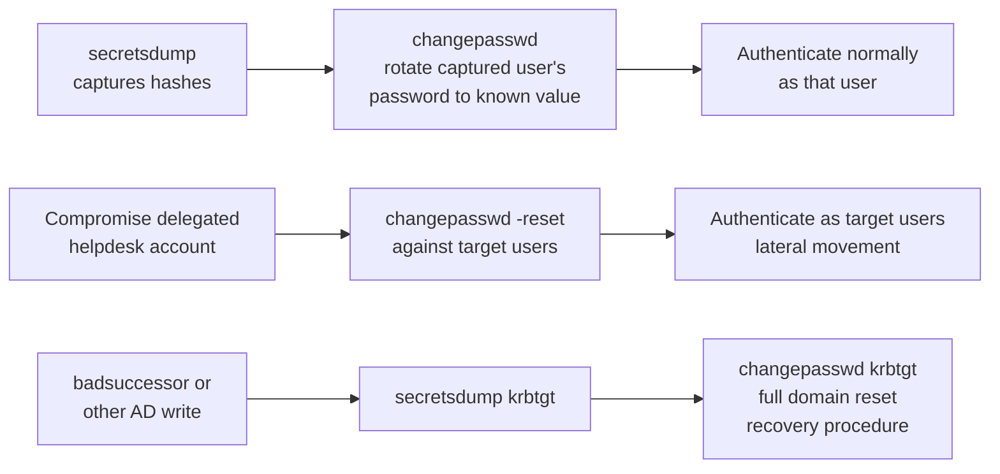

title: "changepasswd.py"
script: "examples/changepasswd.py"
category: "AD Modification"
status: "Published"
protocols:
  - SMB
  - MSRPC
  - Kerberos
  - LDAP
ms_specs:
  - MS-SAMR
  - MS-NRPC
ietf_specs:
  - RFC 3244
  - RFC 4120
  - RFC 4511
mitre_techniques:
  - T1098
  - T1110
  - T1556
auth_types:
  - password
  - ntlm_hash
  - kerberos
  - aes_key
tags:
  - impacket
  - impacket/examples
  - category/ad_modification
  - status/published
  - protocol/smb
  - protocol/kerberos
  - protocol/ldap
  - protocol/msrpc
  - ms-spec/ms-samr
  - ietf/rfc-3244
  - technique/password_change
  - technique/password_reset
  - technique/account_manipulation
  - mitre/T1098
  - mitre/T1110
  - mitre/T1556
aliases:
  - changepasswd
  - change-password
  - password-reset


# changepasswd.py

> **One line summary:** Unified password change and reset tool that supports four distinct protocols for modifying Active Directory user passwords: MS-SAMR over SMB (via `SamrUnicodeChangePasswordUser2` and `SamrSetInformationUser`), MS-SAMR over RPC (the same SAMR calls but over MS-RPC transport instead of SMB named pipes), Kerberos Change Password protocol (RFC 3244, using the `kadmin/changepw` service principal on TCP/UDP 464), and LDAP password modify operations (writing the `unicodePwd` attribute over LDAPS); authored by Alef-Burzmali as a consolidation of four previously separate scripts (smbpasswd.py by snovvcrash/bransh/Alef-Burzmali, rpcpasswd.py by Oddvarmoe, kpasswd.py by Alef-Burzmali, and an LDAP implementation) via PR #1559 merged into Impacket in May 2023; the `-protocol` flag selects which transport to use and the `-reset` flag distinguishes between password change (requires knowledge of the current password) and password reset (requires elevated permissions on the target account); supports changing your own password with current credentials, changing another user's password with elevated rights, resetting an expired password that normal login rejects, and setting a new password directly to an NTLM hash instead of a plaintext value; essential both for legitimate administration (helpdesk resets, automated rotations, expired password recovery) and offensive operations (locking out a compromised admin's session by changing their password, establishing persistence by resetting service account credentials, operationalizing the password change mechanics that follow many workflows after compromise); **continues AD Modification at 6 of 7 articles (86%)**.

| Field | Value |
|:---|:---|
| Script | `examples/changepasswd.py` |
| Category | AD Modification |
| Status | Published |
| Primary author | Alef-Burzmali (consolidation, PR #1559) |
| Contributing authors | snovvcrash, bransh, Alef-Burzmali (smbpasswd predecessor), Oddvarmoe (rpcpasswd predecessor, PR #1304), p0dalirius (Kerberos auth for smbpasswd, PR #1177) |
| First merged | May 2023 (commit ecf7b7c in PR #1559) |
| Primary protocols | SMB (for SMB-SAMR transport), MSRPC (for RPC-SAMR transport), Kerberos (for kpasswd protocol), LDAP (for LDAP password modify) |
| Primary Microsoft specifications | `[MS-SAMR]` Security Account Manager Remote Protocol, specifically `SamrUnicodeChangePasswordUser2` and `SamrSetInformationUser` RPC calls |
| Relevant IETF references | RFC 3244 Kerberos Set/Change Password Protocol, RFC 4120 Kerberos V5, RFC 4511 LDAP |
| MITRE ATT&CK techniques | T1098 Account Manipulation, T1110.003 Password Spraying (indirect), T1556 Modify Authentication Process |
| Authentication types | Password, NTLM hash (`-hashes`), Kerberos (`-k`), AES key (`-aesKey`) |
| Supported protocol values | `smb-samr`, `rpc-samr`, `kpasswd`, `ldap` |
| Change vs reset modes | `-reset` flag flips between the two modes |


## Prerequisites

This article assumes familiarity with:

- [`addcomputer.py`](addcomputer.md) and [`rbcd.py`](rbcd.md) for AD Modification context.
- [`samrdump.py`](../01_recon_and_enumeration/samrdump.md) for SAMR protocol background (the same RPC interface changepasswd uses over both SMB and RPC transports).
- [`getTGT.py`](../02_kerberos_attacks/getTGT.md) and [`getST.py`](../02_kerberos_attacks/getST.md) for Kerberos authentication foundations (the kpasswd protocol uses a service ticket for `kadmin/changepw`).
- [`secretsdump.py`](../03_credential_access/secretsdump.md) for credential extraction scenarios that feed hash values into changepasswd's `-hashes` input.
- [`smbpasswd.py`](smbpasswd.md), the older SMB only predecessor that changepasswd.py supersedes.

Basic understanding of how Windows authentication protocols handle password material is essential. The distinction between a password (user knows the plaintext) and a password hash (the NT hash derived from the plaintext) matters throughout, because changepasswd supports both as inputs and outputs for many of its modes.


## What it does

`changepasswd.py` changes or resets an Active Directory user's password using one of four protocol families, selectable via the `-protocol` flag. Basic invocation:

```text
$ changepasswd.py ACME.LOCAL/alice@dc01.acme.local
Impacket v0.14.0.dev0 - Copyright Fortra, LLC and its affiliated companies
Current password:
New password:
Retype new password:
[*] Changed password
```

The two fundamental operations are change and reset:

### Password change

Requires knowledge of the current password (or its NTLM hash). The account whose password is being changed authenticates to the server, proves knowledge of the old password via the protocol's cryptographic handshake, and provides the new password. No elevated permission is required beyond being the account itself.

```bash
# Change your own password (classic helpdesk scenario)
changepasswd.py ACME.LOCAL/alice@dc01.acme.local

# Change with old password and new password on command line (no prompt)
changepasswd.py ACME.LOCAL/alice:OldPass@dc01.acme.local -newpass NewPass

# Change using old NTLM hash (old password forgotten but hash captured)
changepasswd.py ACME.LOCAL/alice@dc01.acme.local \
    -hashes :31d6cfe0d16ae931b73c59d7e0c089c0 \
    -newpass 'NewComplexPassword123!'
```

The NTLM hash case is operationally significant: a captured hash (from secretsdump, mimikatz, Responder, or similar) can be used to change the password via SAMR even without knowing the plaintext. This is a fundamental primitive in AD offensive operations.

### Password reset

Requires elevated privilege (typically membership in a group with reset rights: Domain Admins, Account Operators, or users delegated "Reset password" on the specific account). The resetting administrator does NOT need to know the target user's current password. Instead, they authenticate as themselves, and the server verifies their authorization to perform the reset.

```bash
# Reset target user's password as an admin
changepasswd.py ACME.LOCAL/admin:AdminPass@dc01.acme.local \
    -altuser alice \
    -newpass 'AliceNewPass' \
    -reset

# Reset target user's password using admin's NTLM hash
changepasswd.py ACME.LOCAL/admin@dc01.acme.local \
    -hashes :aabbccdd... \
    -altuser alice \
    -newpass 'AliceNewPass' \
    -reset

# Reset with Kerberos authentication of the admin
changepasswd.py -k -no-pass ACME.LOCAL/admin@dc01.acme.local \
    -altuser alice \
    -newhashes :ffffeeeeddddcccc... \
    -reset
```

Resets use `SamrSetInformationUser` (info level 23, 24, or 25 for various password and hash formats) rather than `SamrUnicodeChangePasswordUser2`. The server checks the authenticating admin's access rights on the target user object.

### Protocol selection

```bash
# SMB SAMR (default, over named pipe \samr, TCP 445)
changepasswd.py ACME.LOCAL/alice@dc01.acme.local -protocol smb-samr

# RPC SAMR (same SAMR interface, but over TCP RPC, typically TCP 49152+)
changepasswd.py ACME.LOCAL/alice@dc01.acme.local -protocol rpc-samr

# Kerberos kpasswd (RFC 3244, TCP/UDP 464)
changepasswd.py ACME.LOCAL/alice@dc01.acme.local -protocol kpasswd

# LDAP password modify (TCP 636 LDAPS required because Microsoft mandates encryption for unicodePwd)
changepasswd.py ACME.LOCAL/alice@dc01.acme.local -protocol ldap
```

Each protocol has different requirements, edge cases, and detection signatures.


## Why it exists

### The problem: password change and reset is a fragmented protocol landscape

Windows domain password change is not one protocol; it's four, each with different properties:

1. **MS-SAMR over SMB**: the traditional mechanism. Used by Windows `Ctrl-Alt-Del → Change password` for decades. Transports over SMB named pipe (`\\dc\pipe\samr`). Requires TCP 445 reachability.
2. **MS-SAMR over MSRPC**: the same SAMR interface but accessed via MS-RPC over TCP (dynamic high ports allocated by the endpoint mapper). Useful when SMB is blocked but RPC is allowed. Newer and less commonly seen in offensive tooling historically.
3. **Kerberos kpasswd (RFC 3244)**: a separate protocol built specifically for Kerberos password changes. Uses TCP/UDP 464. Works purely via Kerberos; no NTLM involved. Requires a TGT.
4. **LDAP password modify**: setting the `unicodePwd` attribute directly via LDAP (TCP 636 LDAPS is effectively required because Microsoft mandates encrypted transport for unicodePwd writes). Common in LDAP centric management tooling.

Before changepasswd.py, Impacket had several separate scripts:
- **smbpasswd.py**: SMB SAMR only.
- **rpcchangepwd.py** (PR #1304 by Oddvarmoe): RPC SAMR only.
- **kpasswd.py** (PR #1189 by Alef-Burzmali): Kerberos kpasswd only.

Alef-Burzmali consolidated these via PR #1559 into a single changepasswd.py, adding LDAP support at the same time, to produce one tool that could do all four operations. The older scripts remain in the codebase (smbpasswd.py still ships, marked for eventual deprecation) for backward compatibility, but changepasswd.py is the modern recommended tool.

### Why multiple transports matter operationally

Different protocols have different properties that matter when defenders restrict access or when attackers need specific behaviors:

- **SMB-SAMR** is the default because it's what Windows natively uses. Logs look like normal password changes. High noise, high blending.
- **RPC-SAMR** is useful when SMB is blocked but RPC endpoint mapper is reachable. Less commonly monitored.
- **kpasswd** is the cleanest in pure Kerberos environments. Leaves distinctive kpasswd protocol signatures (TCP/UDP 464).
- **LDAP** is favored by attackers who already have LDAP reachability and don't want to open new ports. Writes to `unicodePwd` are also useful for the AD Modification category's broader theme of LDAP based attack primitives.

A well equipped defender blocks some of these transports while allowing others for legitimate use. A complete tool needs to support all four so operators can adapt to what's reachable.

### The change vs reset distinction is fundamental

Password change (`SamrUnicodeChangePasswordUser2` or kpasswd change-password) is protocol level authentication of the user with both old and new password. Password reset (`SamrSetInformationUser` with password containing info levels, or LDAP unicodePwd write by an authorized principal) is server side authorization check on the resetting account.

Operationally:
- **Change**: I know my own password, I want to rotate it. Or, I've captured a user's NTLM hash and want to replace their password with one I know.
- **Reset**: I'm Domain Admin and I want to force user X's password to a known value. Or, an expired password is blocking a normal login flow but I can still trigger the reset via specific protocol semantics.

changepasswd.py handles both with `-reset` as the mode selector.

### Expired password handling

A subtle but operationally important capability: normal Windows login rejects expired passwords. But SAMR password change operations can sometimes proceed against an expired account (the server treats "change expired password" as a legitimate recovery path). n00py's 2021 blog post on resetting expired passwords remotely documents this behavior; smbpasswd.py and now changepasswd.py implement it. This matters in scenarios where hash material is captured for an account whose password has since expired; being able to change the password unlocks the account for normal use.


## Four protocol theory

Each of the four protocols changepasswd.py supports has different primitives. Understanding all four is needed to choose intelligently.

### MS-SAMR: the SAMR interface

SAMR (Security Account Manager Remote) is an RPC interface exposing Windows account database operations. The key calls for password operations:

- **`SamrUnicodeChangePasswordUser2`** (opnum 55): password change. Takes the username, old password (encrypted form), and new password (encrypted form). Server decrypts, verifies the old password, and stores the new password if policy allows.
- **`SamrSetInformationUser`** (opnum 37) with info levels 23/24/25/26: password reset. Takes the user handle (obtained via `SamrOpenUser` after `SamrOpenDomain` and optional `SamrLookupNamesInDomain`) plus the new password. Server checks if the caller has `USER_FORCE_PASSWORD_CHANGE` right on the user object.

Both calls are protocol agnostic as to transport: they work identically over SMB (named pipe `\samr`) or MSRPC (TCP endpoint). This is why changepasswd.py's `smb-samr` and `rpc-samr` modes use the same SAMR logic and differ only in transport selection.

The password encryption uses a session key derived cipher. The exact format varies: `USER_INFORMATION_CLASS` 23 uses `SAMPR_USER_INFO_23` with a 516 byte encrypted buffer, class 24 uses `SAMPR_USER_INFO_24`, and so on. The encryption protects the password material from passive eavesdropping (assuming the session key itself is protected, which it is via NTLM or Kerberos session negotiation).

### MS-SAMR over SMB transport

The classic mode. Client connects to `\\dc\pipe\samr` over TCP 445, authenticates via NTLM or Kerberos, then performs SAMR RPC calls over the named pipe.

Advantages:
- Always works when SMB works. Most organizations allow SMB to DCs for basic management.
- Logs look identical to Windows's own `Ctrl-Alt-Del → Change password` from the DC's perspective.

Detection signals:
- SMB traffic to `\pipe\samr` from unexpected sources.
- Event 4723 (user changed own password) or 4724 (admin reset another user's password) in Security log.

### MS-SAMR over MSRPC transport

Same RPC interface, different transport. Client connects to the MSRPC endpoint mapper (TCP 135), queries for the SAMR service binding, then connects to the dynamic port the DC provides.

Advantages:
- Works when SMB is blocked but RPC is allowed. Less common but happens in hardened environments.
- Avoids SMB specific detections (though adds MSRPC specific ones).

Disadvantages:
- Dynamic port negotiation requires both TCP 135 and the dynamic range to be reachable.
- Less thoroughly documented in offensive tooling historically.

### Kerberos kpasswd (RFC 3244)

A dedicated protocol for Kerberos password changes. TCP and UDP port 464. The client:

1. Requests a TGT for the user whose password is changing (or the admin performing the reset).
2. Requests a service ticket for `kadmin/changepw@REALM` (or `kadmin/setpw@REALM` for the set-password variant).
3. Connects to the kpasswd server (usually colocated with the KDC on the DC).
4. Sends a ChangePasswReq message encrypted under the service ticket's session key.
5. Server decrypts, validates, applies the new password.

The protocol distinguishes change-password (requires the user themselves to authenticate) from set-password (administrative operation, requires appropriate authorization). The RFC 3244 terminology maps to SAMR's distinction between change and reset but operates over a completely different protocol stack.

changepasswd.py's `-protocol kpasswd` mode implements both change and set password operations. The `-reset` flag selects set-password.

Advantages:
- Purely Kerberos. No NTLM involved at all. Works in Kerberos only environments and environments where NTLM is disabled.
- Dedicated port (464) may be allowed where other password changing ports are blocked.
- Useful when existing Kerberos tooling already has a TGT for the target user.

Disadvantages:
- Requires TCP/UDP 464 reachability.
- Less commonly used by attackers historically, so defender familiarity is also lower.

### LDAP password modify

Writes to the `unicodePwd` AD attribute directly via LDAP. The `unicodePwd` attribute is a special case in AD:
- It is never read (LDAP search for it returns empty).
- It can only be written (modified).
- The write must be over an encrypted transport (LDAPS TCP 636 or LDAP with StartTLS, but Microsoft requires encryption).
- The value must be encoded as UTF-16LE and wrapped in quotes.

Password change via LDAP: the client provides both a `replace` operation with the old password and an `add` operation with the new password in a single LDAP modify. The server verifies the old password before applying the new one.

Password reset via LDAP: the client (authenticated as an admin) provides only a `replace` operation with the new password. The server verifies the caller's authorization on the target user object.

Advantages:
- Uses LDAP which is often already open to the DC for legitimate directory queries.
- Fits well with LDAP based management tooling and LDAP based offensive workflows.
- Can be combined with other LDAP operations in a single session (DACL changes, computer account creation, etc.).

Disadvantages:
- Requires LDAPS or StartTLS (the encryption requirement is strict).
- Active Directory specific (won't work against Samba or generic LDAP servers that don't implement the unicodePwd attribute).

### Transport comparison summary

| Protocol | Port | Change mechanism | Reset mechanism | When to prefer |
|:---|:---||:---|:---|
| `smb-samr` | TCP 445 | SamrUnicodeChangePasswordUser2 | SamrSetInformationUser | Default; most broadly supported |
| `rpc-samr` | TCP 135 + dynamic | SamrUnicodeChangePasswordUser2 | SamrSetInformationUser | When SMB is blocked |
| `kpasswd` | TCP/UDP 464 | ChangePasswReq (change) | ChangePasswReq (set-password variant) | Pure Kerberos environments; when 464 is allowed |
| `ldap` | TCP 636 | unicodePwd modify (replace+add) | unicodePwd modify (replace) | LDAP reachable; fits existing LDAP workflows |


## How the tool works internally

The script's structure after consolidation is modular: a password handler base with concrete implementations for each protocol.

### Imports and top level structure

```python
from impacket import version
from impacket.dcerpc.v5 import transport, samr, epm
from impacket.krb5.kerberosv5 import getKerberosTGT, getKerberosTGS
from impacket.krb5 import constants
from impacket.ldap import ldap as ldap_impl
```

The script imports Impacket's SAMR bindings (for the two SAMR modes), Kerberos functions (for the kpasswd mode and for `-k` authentication across all modes), and LDAP bindings (for the LDAP mode).

### Protocol dispatch

```python
if options.protocol == 'smb-samr':
    handler = SAMRPasswordHandler(transport='smb', ...)
elif options.protocol == 'rpc-samr':
    handler = SAMRPasswordHandler(transport='rpc', ...)
elif options.protocol == 'kpasswd':
    handler = KPasswdHandler(...)
elif options.protocol == 'ldap':
    handler = LDAPPasswordHandler(...)

if options.reset:
    handler.reset_password(altuser, newpass_or_hash)
else:
    handler.change_password(oldpass_or_hash, newpass_or_hash)
```

The common structure: select handler by protocol, then call change or reset on it. Each handler manages its own transport setup and protocol specific details.

### SAMR handler pseudocode (change)

```python
def change_password(self, old, new):
    # Establish transport (SMB or RPC)
    if self.transport == 'smb':
        rpctransport = transport.SMBTransport(self.address, filename=r'\samr')
    else:
        string_binding = epm.hept_map(self.address, samr.MSRPC_UUID_SAMR, protocol='ncacn_ip_tcp')
        rpctransport = transport.DCERPCTransportFactory(string_binding)
    rpctransport.set_credentials(self.username, '', self.domain)
    dce = rpctransport.get_dce_rpc()
    dce.connect()
    dce.bind(samr.MSRPC_UUID_SAMR)
    
    # Perform the change
    resp = samr.hSamrUnicodeChangePasswordUser2(
        dce, '\x00', self.username, old, new, oldLmHash, oldNtHash
    )
```

The SMB vs RPC distinction is purely at transport setup; the SAMR call itself is identical. `hSamrUnicodeChangePasswordUser2` handles the password encryption internally.

### SAMR handler pseudocode (reset)

```python
def reset_password(self, target_user, new):
    # Connect and bind as before (authenticating as the admin)
    # ...
    
    # Open the domain and target user
    serverHandle = samr.hSamrConnect5(dce, f'\\\\{self.address}\x00')['ServerHandle']
    domainSID = samr.hSamrLookupDomainInSamServer(dce, serverHandle, self.domain)['DomainId']
    domainHandle = samr.hSamrOpenDomain(dce, serverHandle, domainId=domainSID)['DomainHandle']
    userRID = samr.hSamrLookupNamesInDomain(dce, domainHandle, (target_user,))['RelativeIds']['Element'][0]
    userHandle = samr.hSamrOpenUser(dce, domainHandle, userId=userRID)['UserHandle']
    
    # Set password via SamrSetInformationUser
    if new_is_hash:
        # Info level 24 or 25 for hash based set
        samr.hSamrSetInformationUser2(dce, userHandle, SAMPR_USER_INFO_25(encrypted_hash_buffer))
    else:
        # Info level 23 for plaintext
        samr.hSamrSetInformationUser2(dce, userHandle, SAMPR_USER_INFO_23(encrypted_password_buffer))
```

Reset is a multi step RPC flow: open the SAM, open the domain, look up the target user's RID, open the user handle, call SetInformationUser. Each step requires appropriate access rights; the server checks on every call.

### Kerberos kpasswd handler pseudocode

```python
def change_password(self, old, new):
    # Get TGT for the user whose password is changing
    tgt, cipher, oldSessionKey, sessionKey = getKerberosTGT(
        user, old, domain, kdcHost, ...
    )
    
    # Get service ticket for kadmin/changepw
    tgs, cipher, oldSessionKey, sessionKey = getKerberosTGS(
        ServicePrincipalName('kadmin', 'changepw', realm=domain),
        domain, kdcHost, tgt, cipher, sessionKey
    )
    
    # Build ChangePasswReq
    req = ChangePasswReq()
    req['new-password'] = new.encode('utf-8')
    req['target-name'] = None  # self
    
    # Encrypt under TGS session key
    encrypted = encrypt(cipher, sessionKey, req)
    
    # Send to kpasswd server on port 464
    sock = socket.socket(socket.AF_INET, socket.SOCK_STREAM)
    sock.connect((kdcHost, 464))
    sock.send(kpasswd_message_wrapper(tgs, encrypted))
    response = sock.recv(4096)
    parse_kpasswd_response(response)
```

The RFC 3244 protocol wraps the Kerberos service ticket and the encrypted request in a specific envelope, sends it over TCP/UDP 464, and receives a response indicating success or error code.

### LDAP handler pseudocode

```python
def change_password(self, old, new):
    ldap_conn = ldap_impl.LDAPConnection(f'ldaps://{self.address}', self.baseDN)
    ldap_conn.login(self.username, self.password, self.domain, ...)
    
    # LDAP expects UTF-16LE quoted strings
    old_encoded = f'"{old}"'.encode('utf-16-le')
    new_encoded = f'"{new}"'.encode('utf-16-le')
    
    # Modify: delete old + add new in single operation
    user_dn = f'CN={self.username},CN=Users,{self.baseDN}'
    ldap_conn.modify(user_dn, {
        'unicodePwd': [
            (ldap_impl.MODIFY_DELETE, [old_encoded]),
            (ldap_impl.MODIFY_ADD, [new_encoded])
        ]
    })

def reset_password(self, target, new):
    # Authenticated as admin with reset rights
    ldap_conn.modify(target_dn, {
        'unicodePwd': [(ldap_impl.MODIFY_REPLACE, [new_encoded])]
    })
```

The LDAP operations are straightforward modify calls; the complexity is in the unicodePwd encoding format (UTF-16LE with surrounding quotes) and the requirement for LDAPS.

### What the tool does NOT do

- Does NOT implement XACT-SMB (the older password change protocol over NetLogon; noted in the script header as unimplemented).
- Does NOT handle Azure AD / Entra ID password changes (cloud only, uses different APIs).
- Does NOT change machine account passwords directly (though machine accounts are user objects and the tool can technically target them; the machine account equivalents usually require different workflows).
- Does NOT bypass password policy checks on the server side. If the new password is too short, too recent, in the history, or fails complexity, the server rejects the change and changepasswd.py reports the failure.
- Does NOT provide any rollback if a change succeeds but the operator wants to undo. Password changes are immediate and applied to the account database.


## Authentication options

Authentication applies to the principal performing the change or reset, not to the target. For password change, the principal IS the target (the user changing their own password). For password reset, the principal is the admin or delegated operator doing the reset.

| Option | Flag | Notes |
|:---|:---||
| Current password | `user:password@host` | Standard. Password prompted if omitted from command line. |
| Current password hash | `-hashes LM:NT` | Use when the password is forgotten but hash is available. Very common in offensive workflows. |
| Kerberos ticket | `-k` | Use existing TGT from ccache. Works for all four protocols. |
| AES key | `-aesKey <hex>` | Kerberos with AES256. |
| Alternate user | `-altuser <n>` | For reset mode: the target user whose password is being reset. The authentication uses the primary credentials; `-altuser` specifies the target. |
| Alternate password | `-altpass <pass>` or `-althash <hash>` | Used in some scenarios to supply credentials separately from the target specification. |

Two modes of reset authentication:
1. **Authenticate as the admin, reset the target**: `-altuser <target> -newpass <new>`. Standard admin workflow.
2. **Authenticate as the target, change own password using hash**: `-hashes :<nt-hash> -newpass <new>`. Captured hash workflow.


## Practical usage

### Scenario 1: rotate your own password

```bash
changepasswd.py ACME.LOCAL/alice@dc01.acme.local
# Prompts for current and new password
```

The simplest case. Uses default protocol (`smb-samr`).

### Scenario 2: change password using captured hash

Classic offensive scenario: secretsdump captures Alice's NT hash, and the operator wants to reset the password to something known so Alice's account can be used directly.

```bash
# Change password using the old hash
changepasswd.py ACME.LOCAL/alice@dc01.acme.local \
    -hashes :31d6cfe0d16ae931b73c59d7e0c089c0 \
    -newpass 'KnownPassword123!'
```

Note the OPSEC implication: this locks Alice out of her own account (her previous password no longer works). In red team operations this is usually avoided because it's immediately noticeable. It's more common to use the hash directly for authentication (pass the hash) than to rotate the password.

### Scenario 3: admin resets a user's password

Legitimate helpdesk operation. Also offensive operation if the attacker has DA.

```bash
changepasswd.py ACME.LOCAL/admin:AdminPass@dc01.acme.local \
    -altuser alice \
    -newpass 'TempPass2026!' \
    -reset
```

Uses SamrSetInformationUser with info level 23 (plaintext in encrypted buffer).

### Scenario 4: admin resets to a specific hash (set hash, not password)

Useful when the operator wants the account's NT hash to be a specific known value without knowing the plaintext.

```bash
changepasswd.py ACME.LOCAL/admin@dc01.acme.local \
    -hashes :adminlmhash:adminnthash \
    -altuser alice \
    -newhashes :b2bdbe60565b677dfb133866722317fd \
    -reset
```

Uses info level 24 or 25 (hash in encrypted buffer). Side effect: setting only the NT hash (not a plaintext password) means the account's Kerberos keys will not be updated to match, so Kerberos authentication using AES256 or AES128 for this account will fail until the password is changed to a plaintext value.

### Scenario 5: expired password recovery

Alice's password expired and regular logon fails. She or an admin needs to change it remotely.

```bash
# Alice changes her own expired password
changepasswd.py ACME.LOCAL/alice:ExpiredPass@dc01.acme.local \
    -newpass 'FreshPass123!'
```

SAMR's SamrUnicodeChangePasswordUser2 accepts a change request against an expired password; normal logon does not. This difference is n00py's documented finding.

### Scenario 6: Kerberos only environment

No NTLM available; use kpasswd protocol.

```bash
# Assume Alice has a TGT already
export KRB5CCNAME=/tmp/alice.ccache
changepasswd.py -k -no-pass ACME.LOCAL/alice@dc01.acme.local \
    -protocol kpasswd \
    -newpass 'NewKerberosPass!'
```

Or for admin reset via kpasswd:

```bash
export KRB5CCNAME=/tmp/admin.ccache
changepasswd.py -k -no-pass ACME.LOCAL/admin@dc01.acme.local \
    -protocol kpasswd \
    -altuser alice \
    -newpass 'ResetPass!' \
    -reset
```

### Scenario 7: LDAP transport

LDAPS reachable, preferred over SMB/RPC.

```bash
changepasswd.py ACME.LOCAL/admin:AdminPass@dc01.acme.local \
    -protocol ldap \
    -altuser alice \
    -newpass 'LDAPResetPass!' \
    -reset
```

Requires TCP 636 reachability. LDAP password modify operations are useful when bundling with other LDAP writes (DACL changes, computer account creation) in a single session.

### Scenario 8: lock out a compromised admin

An attacker has compromised a Domain Admin account. Defenders want to change the admin's password to a fresh one to lock the attacker out while they investigate. This can be done with another admin account or a break glass account.

```bash
changepasswd.py ACME.LOCAL/break_glass:BreakGlassPass@dc01.acme.local \
    -altuser compromised_da \
    -newpass 'FreshAdminPassXXX!' \
    -reset
```

Operational note: this doesn't kill the attacker's existing Kerberos tickets (TGTs remain valid until expiration, typically 10 hours). Full lockout requires additionally invalidating the tickets, either via account disable, session termination on DCs, or waiting out the TGT lifetime. See also: resetting the krbtgt account password for full domain wide ticket invalidation in severe compromise scenarios.

### Key flags

| Flag | Meaning |
|:---|:---|
| `target` (positional) | `[[domain/]username[:password]@]target`. Target is the DC or server to talk to. |
| `-newpass <pass>` | New plaintext password. |
| `-newhashes LM:NT` | New password as NTLM hash pair. |
| `-hashes LM:NT` | Current password as NTLM hash (for change mode). |
| `-no-pass` | Don't prompt for password. Useful with `-k`. |
| `-altuser <user>` | Target user for reset mode. |
| `-altpass <pass>` | Alternate credentials when the primary target position represents something else. |
| `-althash <hash>` | Alternate credential hash. |
| `-protocol {smb-samr,rpc-samr,kpasswd,ldap}` | Protocol selection. |
| `-reset` | Switch from change mode to reset mode. |
| `-k` | Kerberos authentication. |
| `-aesKey <hex>` | Kerberos AES key. |
| `-dc-ip <ip>` | DC IP when name resolution isn't available. |
| `-ts` | Timestamp log lines. |
| `-debug` | Verbose debug output. |


## What it looks like on the wire

Each protocol produces distinctive wire traffic.

### smb-samr

- TCP 445 SMB session to the DC.
- SMB Tree Connect to IPC$ (or direct if modern SMB dialects in use).
- NT Create for `\samr` named pipe.
- DCE/RPC bind to SAMR interface (UUID `12345778-1234-ABCD-EF00-0123456789AC`).
- DCE/RPC call: `SamrUnicodeChangePasswordUser2` (opnum 55) for change, or `SamrOpenDomain` → `SamrOpenUser` → `SamrSetInformationUser` for reset.

### rpc-samr

- TCP 135 to endpoint mapper (epm).
- EPM query for SAMR binding.
- TCP connection to DC's dynamic port.
- DCE/RPC bind to SAMR.
- Same SAMR calls as smb-samr.

### kpasswd

- Kerberos AS-REQ (TCP/UDP 88) for the initial TGT if not cached.
- Kerberos TGS-REQ for `kadmin/changepw@REALM` service ticket.
- TCP or UDP connection to port 464.
- ChangePasswReq sent with the service ticket.
- Response indicating success (0x0000) or specific error code.

### ldap

- TCP 636 LDAPS connection (or TCP 389 with StartTLS in some configurations).
- LDAP BindRequest (simple bind with credentials, or SASL GSS-SPNEGO for Kerberos).
- LDAP ModifyRequest on the target DN with unicodePwd attribute operations.
- LDAP ModifyResponse with result code.

### Wireshark filters

```text
smb2 and smb2.filename == "samr"             # SMB-SAMR pipe activity
dcerpc.uuid == "12345778-1234-abcd-ef00-0123456789ac"   # SAMR RPC interface
kerberos and tcp.port == 464                 # kpasswd protocol
ldap and tcp.port == 636                     # LDAPS
ldap.object_name contains "unicodePwd"       # Specifically unicodePwd modifications
```

Zeek's DCE-RPC, SMB, and LDAP parsers all have visibility into these operations. kpasswd specific parsing is less standard; custom detection logic may be needed for port 464 traffic.


## What it looks like in logs

Each operation generates specific Security event log entries on the domain controller.

### Successful password change (user changes own)

- **Event 4723**: "An attempt was made to change an account's password." Subject = the user (themselves), Target Account = same user. Fires on SAMR change and kpasswd change.

### Successful password reset (admin changes someone else's)

- **Event 4724**: "An attempt was made to reset an account's password." Subject = the admin performing the reset, Target Account = the user whose password was reset. Fires on SAMR reset, kpasswd set-password, and LDAP unicodePwd replace by another principal.

### Authentication events preceding the change

- **Event 4624** Logon Type 3 (Network): the authentication event for the principal performing the operation.
- **Event 4672** (special privileges assigned): if the authenticating principal has admin rights.

### Failed operations

- **Event 4723/4724 with failure**: password change or reset failed. Common reasons: policy violation (too short, in history, too recent), insufficient privilege, account locked.

### LDAP specific

- **Event 4662**: operation performed on an object. Fires on LDAP writes to unicodePwd if the DC's SACL is configured to audit directory object access. Details include the attribute being modified and the performing principal.

### Sigma rule examples

```yaml
title: Password Change From Unusual Source to Sensitive Account
logsource:
  product: windows
  service: security
detection:
  selection:
    EventID:
      - 4724
    TargetUserName|contains:
      - 'krbtgt'
      - 'Administrator'
      - '$'
  condition: selection
level: high
```

Targets sensitive account password resets. krbtgt password reset specifically is a rare legitimate event (done only during certain recovery procedures) and a common offensive step during takeover.

```yaml
title: Burst of Password Changes From Single Source
logsource:
  product: windows
  service: security
detection:
  selection:
    EventID: 4724
  condition: selection
timeframe: 5m
threshold: 10
level: medium
```

Detects bulk password reset activity, which is unusual outside of scripted maintenance operations.

```yaml
title: Password Change Via LDAP unicodePwd Modification
logsource:
  product: windows
  service: security
detection:
  selection:
    EventID: 4662
    ObjectServer: DS
    Properties|contains: 'unicodePwd'
  condition: selection
level: medium
```

LDAP based password changes are less common than SAMR based ones. A high volume of unicodePwd writes from a non standard source may indicate tool based operations.

### What's NOT in default logs

- The actual password value (not logged; good).
- The transport protocol used (not distinguished in event logs; both SAMR over SMB and SAMR over RPC fire the same events).
- Whether the operation was a change or reset in some cases (distinguished by event ID: 4723 for change, 4724 for reset).


## Detection and defense

### Detection approach

- **4723/4724 baselining**: establish which principals legitimately change or reset passwords, which targets are commonly reset, and which sources the operations originate from. Alert on deviations.
- **Cross protocol correlation**: a single password change generates 4723/4724 regardless of protocol. The network traffic (SMB vs RPC vs kpasswd vs LDAP) differs. Correlating event log with network traffic helps identify which protocol was used, which can indicate attacker tooling.
- **Sensitive account targeting**: any reset of krbtgt, Domain Admins members, or Tier 0 service accounts should be critical severity alerts.
- **Bulk activity detection**: scripted password operations against many accounts in short time are suspicious.
- **LDAP unicodePwd monitoring**: DC SACL can audit unicodePwd writes via event 4662. Specifically useful for detecting LDAP transport password changes.

### Preventive controls

- **Restrict reset permission delegations**: audit who has Reset Password rights in delegated control. Over delegation is common and creates lateral movement opportunities.
- **Protect sensitive accounts**: Domain Admins, krbtgt, Tier 0 service accounts should have tightly restricted reset permissions. Only a small number of specific accounts should be able to reset these.
- **Protected Users group**: adds authentication restrictions (NTLM disabled, long term keys not cached). Doesn't directly prevent password changes but reduces the blast radius of compromised credentials.
- **LAPS for local admin passwords**: reduces the value of local admin password capture, which changepasswd.py can't touch directly but which drives some of the workflows that lead to changepasswd use.
- **Password policy rigor**: password history, complexity, and minimum age settings reduce the value of compromised hashes (attacker can't just change the password back to the original once rotated).
- **Kerberos only mode and disabling NTLM**: blocks the NTLM hash based change workflows. Forces all password operations through kpasswd or LDAP, both of which are easier to monitor.

### What changepasswd.py does NOT do

- Does NOT bypass password policy. If the new password doesn't meet complexity, it fails.
- Does NOT bypass explicit ACL restrictions. If the authenticated principal lacks reset rights, it fails.
- Does NOT hide the operation. All four protocols generate audit events on properly configured DCs.
- Does NOT work against offline password stores. Requires a running DC reachable on one of the four protocols.
- Does NOT affect already issued Kerberos tickets. TGTs remain valid until expiration even after the password changes.


## Related tools and attack chains

changepasswd.py **continues AD Modification at 6 of 7 articles (86% complete)**. One more article (`smbpasswd.py`, the older SMB only predecessor) closes the category.

### Related Impacket tools

- [`smbpasswd.py`](smbpasswd.md) is the older SMB SAMR only predecessor. changepasswd.py consolidates and supersedes it. Remains in Impacket for backward compatibility; documented for historical reasons.
- [`samrdump.py`](../01_recon_and_enumeration/samrdump.md) enumerates SAMR before password operations. Use it to discover users, groups, and account policies that govern what changepasswd can and cannot do.
- [`secretsdump.py`](../03_credential_access/secretsdump.md) is the upstream hash capture tool. Captured hashes from secretsdump feed into changepasswd's `-hashes` flag.
- [`getTGT.py`](../02_kerberos_attacks/getTGT.md) is a prerequisite for kpasswd mode with `-k`. changepasswd needs an existing ccache if Kerberos auth is used.
- [`addcomputer.py`](addcomputer.md) creates accounts; changepasswd rotates their passwords after creation. Common workflow: addcomputer to establish a computer account, changepasswd to ensure the password is known.
- [`rbcd.py`](rbcd.md), [`dacledit.py`](dacledit.md), [`owneredit.py`](owneredit.md), [`badsuccessor.py`](badsuccessor.md) are sibling AD Modification tools. Each exercises a different attribute or permission; changepasswd exercises password related authentication state.

### External alternatives

- **Native Windows**: `net user alice NewPass /domain` for reset (requires admin), `Ctrl-Alt-Del → Change password` for change. Windows equivalents.
- **PowerShell**: `Set-ADAccountPassword` from the ActiveDirectory module. LDAP based. Windows administration standard.
- **Rubeus `changepw`**: Kerberos kpasswd client for Windows. Rubeus wraps the kpasswd protocol in .NET.
- **kpasswd (MIT Kerberos)**: the Unix canonical kpasswd client. `kpasswd alice@ACME.LOCAL`.
- **ldapmodify**: OpenLDAP client that can write unicodePwd (with proper encoding). Generic LDAP tooling works.
- **Bloodhound.py / PowerView**: LDAP tooling with some password change capabilities.

For offensive operations run from Linux, changepasswd.py is the primary tool. For administration performed on Windows, PowerShell `Set-ADAccountPassword` is the standard.

### Attack chain examples



changepasswd.py is rarely the first tool in an attack chain. It's almost always downstream of credential capture, ACL abuse, or admin compromise, providing the specific primitive of "I want this account's password to be X."

### Where changepasswd.py fits

| Use case | Tool | Notes |
|:---|:---||
| Rotate your own password | changepasswd (any protocol) or native Windows | changepasswd from an attack host running Linux |
| Admin resets user | changepasswd -reset or Set-ADAccountPassword | Both work |
| Change via captured hash | changepasswd -hashes | NTLM pass the hash style |
| Kerberos only environment | changepasswd -protocol kpasswd | Dedicated protocol |
| LDAP reachable only | changepasswd -protocol ldap | Uses unicodePwd |
| Expired password recovery | changepasswd (SAMR mode) | Works where normal login fails |
| Set hash directly without plaintext | changepasswd -newhashes -reset | Info level 24 or 25 |
| Lock out compromised admin | changepasswd -reset | Changes password; tickets survive until expiry |


## Further reading

- **Impacket changepasswd.py source** at `https://github.com/fortra/impacket/blob/master/examples/changepasswd.py`. The script header includes extensive inline references to MS-SAMR, RFC 3244, and the predecessor scripts.
- **Impacket PR #1559** (the consolidation PR) at `https://github.com/fortra/impacket/pull/1559`. Context for how the four predecessor scripts were merged.
- **`[MS-SAMR]` Security Account Manager Remote Protocol** at `https://learn.microsoft.com/en-us/openspecs/windows_protocols/ms-samr/`. The canonical SAMR specification including `SamrUnicodeChangePasswordUser2` and `SamrSetInformationUser` details.
- **RFC 3244 "Microsoft Windows 2000 Kerberos Change Password and Set Password Protocols"** at `https://www.rfc-editor.org/rfc/rfc3244.txt`. The kpasswd protocol specification.
- **Microsoft "How to troubleshoot password change problems in Active Directory"** at `https://learn.microsoft.com/en-us/troubleshoot/windows-server/identity/change-windows-active-directory-user-password`. LDAP unicodePwd mechanics.
- **snovvcrash's "Pretending to be smbpasswd with Impacket"** at `https://snovvcrash.github.io/2020/10/31/pretending-to-be-smbpasswd-with-impacket.html`. Original writeup that led to smbpasswd.py.
- **n00py's "Resetting Expired Passwords Remotely"** at `https://www.n00py.io/2021/09/resetting-expired-passwords-remotely/`. Documentation of the expired password change capability.
- **Samba's smbpasswd.c source** at `https://github.com/samba-team/samba/blob/master/source3/utils/smbpasswd.c`. Reference implementation on the Samba side.
- **MITRE ATT&CK T1098 Account Manipulation** at `https://attack.mitre.org/techniques/T1098/`.
- **MITRE ATT&CK T1556 Modify Authentication Process** at `https://attack.mitre.org/techniques/T1556/`.

If you want to internalize changepasswd.py as a tool, the productive exercise has four parts. First, in a lab AD, change your own standard user password using each of the four protocols in turn (`smb-samr`, `rpc-samr`, `kpasswd`, `ldap`), observing the different network traffic with Wireshark and the different audit events each generates. Second, as a helpdesk delegated account (with Reset Password rights on a specific OU), reset a target user's password using `-reset`, then try to reset a user outside your delegated OU and observe the permission failure. Third, use secretsdump.py against the lab DC to capture a user's NT hash, then use changepasswd with `-hashes` and `-newpass` to rotate the password to something known, then authenticate as that user with the new password. Fourth, simulate the expired password recovery scenario: administratively expire a test account's password, confirm that normal login fails, then use changepasswd to change the expired password successfully, confirming the recovery path works. These four exercises cover the full operational envelope: normal change, delegated reset, offensive hash to password rotation, and expired password recovery. After working through them, changepasswd's role in both legitimate administration and offensive operations is concrete rather than abstract.
