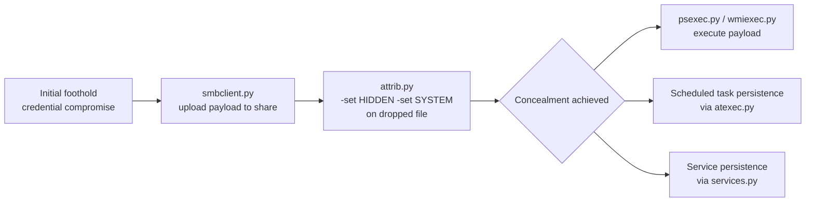
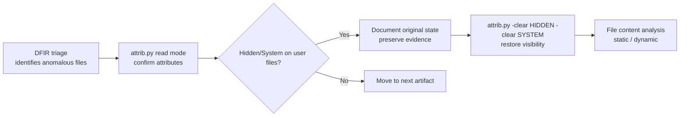

title: "attrib.py"
script: "examples/attrib.py"
category: "Remote System Interaction"
status: "Published"
protocols:
  - SMB2
  - SMB3
ms_specs:
  - MS-SMB2
  - MS-FSCC
mitre_techniques:
  - T1564.001
  - T1222.001
  - T1070
auth_types:
  - NTLM
  - Kerberos
  - Pass-the-Hash
tags:
  - impacket
  - impacket/examples
  - category/remote_system_interaction
  - status/published
  - protocol/smb2
  - protocol/smb3
  - ms-spec/ms-smb2
  - ms-spec/ms-fscc
  - technique/file_attribute_manipulation
  - technique/setinfo
  - technique/hide_artifacts
  - mitre/T1564.001
  - mitre/T1222.001
  - mitre/T1070
aliases:
  - attrib
  - smb-attrib
  - file-attributes
  - setinfo-workflow


# attrib.py

> **One line summary:** Small SMB utility that reads and modifies the [MS-FSCC] file attribute bitfield (hidden, system, read only, archive, and the rest of the 20+ file attribute flags defined in section 2.6) on files and directories accessible over an SMB share, demonstrating the new `setInfo` workflow introduced by the major SMB client and server refactor in Impacket 0.13 (October 2025); authored by `@covertivy` alongside the closely related `filetime.py` (same author, same release, same architectural pattern but targeting timestamps instead of attributes); the operational interest is the Windows equivalent of `attrib.exe` delivered as a remote SMB client, useful for setting HIDDEN or SYSTEM attributes on dropped payloads to make them less visible in Explorer and standard `dir` listings (the classic T1564.001 pattern), clearing READONLY attributes to enable modification of protected files, unsetting HIDDEN/SYSTEM to expose artifacts during DFIR investigations, and generally giving Impacket parity with one of the last corners of Windows file system administration that previously required either a local shell or a mounted SMB drive; protocol footprint is clean (SMB2 CREATE with `FILE_READ_ATTRIBUTES` or `FILE_WRITE_ATTRIBUTES` access mask, followed by SMB2 QUERY_INFO or SMB2 SET_INFO with the FileBasicInformation info class containing the attribute bitfield) and the tool exercises exactly the `setInfo` API path that 0.13's refactor made available; **opens the Remote System Interaction category closure sprint at 3 of 5 articles (60%), with `rdp_check.py` and `tstool.py` remaining to reach the 11th complete category**.

| Field | Value |
|:---|:---|
| Script | `examples/attrib.py` |
| Category | Remote System Interaction |
| Status | Published |
| First appearance | Impacket 0.13 (October 2025) |
| Author | `@covertivy` |
| Companion tool | `filetime.py` (same author, same release, same pattern - timestamps instead of attributes) |
| Primary protocol | SMB2/SMB3 |
| Primary Microsoft specifications | `[MS-SMB2]` Server Message Block (SMB) Protocol Versions 2 and 3; `[MS-FSCC]` File System Control Codes (section 2.6 defines file attributes) |
| MITRE ATT&CK techniques | T1564.001 Hide Artifacts: Hidden Files and Directories; T1222.001 File and Directory Permissions Modification: Windows; T1070 Indicator Removal |
| Authentication | NTLM, Kerberos, Pass-the-Hash (all SMB authentication modes) |
| Access masks used | `FILE_READ_ATTRIBUTES` (0x00000080) for queries; `FILE_WRITE_ATTRIBUTES` (0x00000100) for modifications |
| SMB2 operations | SMB2 CREATE, SMB2 QUERY_INFO (class FileBasicInformation), SMB2 SET_INFO (class FileBasicInformation), SMB2 CLOSE |


## Prerequisites

This article assumes familiarity with:

- [`smbclient.py`](../05_smb_tools/smbclient.md) for SMB authentication model, share access, and general SMB client mechanics. attrib.py uses the same SMBConnection scaffolding.
- [`smbserver.py`](../05_smb_tools/smbserver.md) for the SMB server side, useful for understanding what an SMB server actually does with SET_INFO requests.

Readers coming from the native Windows perspective may recognize attrib.py as the remote cousin of `attrib.exe`. The Impacket version talks SMB on the wire rather than touching the local filesystem, so access masks, share permissions, and authentication matter in ways the local tool never has to think about.


## What it does

`attrib.py` reads or modifies the 32 bit file attribute bitfield on files and directories accessible through an SMB share. Two modes:

**Read mode**, print the current attributes:

```text
$ attrib.py ACME/alice:Passw0rd@10.10.10.50 C\$ "\\Users\\alice\\Documents\\report.docx"
Impacket v0.14.0.dev0 - Copyright Fortra, LLC and its affiliated companies
[*] Connecting to 10.10.10.50
[*] Current attributes for report.docx:
       FILE_ATTRIBUTE_ARCHIVE        (0x00000020)
       FILE_ATTRIBUTE_NOT_CONTENT_INDEXED (0x00002000)
[*] Raw value: 0x00002020
```

**Write mode**, set new attributes:

```text
$ attrib.py -set HIDDEN -set SYSTEM ACME/alice:Passw0rd@10.10.10.50 C\$ "\\Users\\alice\\AppData\\payload.exe"
Impacket v0.14.0.dev0 - Copyright Fortra, LLC and its affiliated companies
[*] Connecting to 10.10.10.50
[*] Current attributes for payload.exe: FILE_ATTRIBUTE_ARCHIVE (0x00000020)
[*] Setting new attributes: HIDDEN + SYSTEM + ARCHIVE (0x00000026)
[*] New attributes applied successfully
```

Typical argument pattern: `<auth_target> <share_name> <path>` positional, with `-set`, `-clear`, and `-raw` flags for modifications. The exact CLI varies slightly across versions since the tool is new and may evolve; the operational shape is stable.


## Why it exists

### The gap attrib.py fills

Before Impacket 0.13, modifying file attributes on a remote SMB share from Impacket required either:

1. Mounting the share on Linux with `mount.cifs` and using local tools. Mount requires root, the cifs kernel module, and doesn't always respect Windows attribute semantics properly.
2. Running PowerShell or `attrib.exe` on the target through an execution tool like [`psexec.py`](../04_remote_execution/psexec.md) or [`wmiexec.py`](../04_remote_execution/wmiexec.md). Heavy for what should be a simple attribute flip. Execution tools leave noisy logs.
3. Writing custom Python against the Impacket SMB library to call the raw SMB2 SET_INFO primitive. Works but requires every user to reinvent the wheel.

attrib.py gives Impacket users a native, authenticated SMB client for attribute reads and writes. No mount, no command execution, no custom code. The operational weight matches the operation: one SMB connection, one authentication, one or two SMB2 operations, done.

### The 0.13 refactor context

Impacket 0.13 (October 2025) included a major SMB client and server refactor that added proper `setInfo` support and CIFS datetime helpers among other improvements. `@covertivy` contributed two demonstrator tools alongside the refactor:

- **`attrib.py`**: the file attribute demonstrator (this article).
- **`filetime.py`**: the timestamp demonstrator. Same architectural pattern but manipulates CreationTime, LastAccessTime, LastWriteTime, and ChangeTime instead of the FileAttributes field.

Both tools exist primarily as showcases of the new SMBConnection API surface. They're genuinely useful utilities, but their narrative role in the release is "look at how clean the new setInfo workflow is." The code in both is notably compact compared to what the same tasks required before 0.13.

This article focuses on attrib.py; filetime.py is logically companion material but not individually stubbed in the wiki as of this writing. Readers interested in SMB timestamp manipulation (including the classic timestomping pattern for T1070.006) should check the filetime.py source directly.

### Why remote attribute manipulation matters operationally

Three primary scenarios drive attrib.py usage:

1. **Concealment of dropped artifacts (T1564.001)**: After dropping a payload to a share (via [`smbclient.py`](../05_smb_tools/smbclient.md) `put`, [`psexec.py`](../04_remote_execution/psexec.md) staging, or similar), set HIDDEN + SYSTEM attributes on the file. Files with both flags do not appear in default Explorer views and are excluded from default `dir` listings. They remain fully executable and accessible by path. The classic concealment pattern used for decades.

2. **Removal of protective attributes**: Some files are marked READONLY to prevent accidental modification. Operators who need to modify those files (replacing a legitimate binary with a trojanized version, for instance) must first clear the READONLY flag. attrib.py does this in one SMB operation.

3. **DFIR and hardening audits**: Defenders and system administrators use tools like attrib to find and restore files with anomalous attributes. Unexpected HIDDEN or SYSTEM attributes on user files can indicate malware. Unexpected cleared ARCHIVE attributes may indicate artifacts of backup bypass. attrib.py gives audit tooling a remote reader that does not require logging into the target host.

A note on indirection: attrib.py does not create, delete, or modify file contents. It only touches the attribute bitfield on existing files. The file itself, including all data streams, remains untouched.


## Protocol theory

### The FileAttributes field in [MS-FSCC]

The 32 bit file attribute bitfield is defined in `[MS-FSCC]` File System Control Codes, section 2.6. The Microsoft specification enumerates these values that Windows honors:

| Flag name | Value | Meaning |
|:---|:---||
| `FILE_ATTRIBUTE_READONLY` | 0x00000001 | File is read only. Write operations fail unless caller explicitly clears this. |
| `FILE_ATTRIBUTE_HIDDEN` | 0x00000002 | File is hidden from default directory listings. |
| `FILE_ATTRIBUTE_SYSTEM` | 0x00000004 | File is a system file. Hidden from default listings even more aggressively than HIDDEN alone. |
| `FILE_ATTRIBUTE_DIRECTORY` | 0x00000010 | Entry is a directory rather than a file. Set automatically, should not be modified by applications. |
| `FILE_ATTRIBUTE_ARCHIVE` | 0x00000020 | File has been modified since last backup. Set automatically on modification. |
| `FILE_ATTRIBUTE_NORMAL` | 0x00000080 | File has no other attributes. Cannot be combined with other attributes; NORMAL means the entire bitfield is effectively empty aside from this bit. |
| `FILE_ATTRIBUTE_TEMPORARY` | 0x00000100 | File is temporary. Windows may cache more aggressively and avoid writing to disk if possible. |
| `FILE_ATTRIBUTE_SPARSE_FILE` | 0x00000200 | File is a sparse file. Set automatically by NTFS. |
| `FILE_ATTRIBUTE_REPARSE_POINT` | 0x00000400 | File or directory has an associated reparse point (symlink, junction, mount point, OneDrive placeholder, etc.). |
| `FILE_ATTRIBUTE_COMPRESSED` | 0x00000800 | File or directory is compressed by NTFS. |
| `FILE_ATTRIBUTE_OFFLINE` | 0x00001000 | File data is not immediately available. Remote storage indicator. |
| `FILE_ATTRIBUTE_NOT_CONTENT_INDEXED` | 0x00002000 | File should not be indexed by Windows Search. |
| `FILE_ATTRIBUTE_ENCRYPTED` | 0x00004000 | File or directory is encrypted by NTFS (EFS). |
| `FILE_ATTRIBUTE_INTEGRITY_STREAM` | 0x00008000 | File has integrity support. ReFS feature. |
| `FILE_ATTRIBUTE_NO_SCRUB_DATA` | 0x00020000 | File is excluded from ReFS background integrity scrub. |
| `FILE_ATTRIBUTE_PINNED` | 0x00080000 | Cloud storage file, pinned for offline access. |
| `FILE_ATTRIBUTE_UNPINNED` | 0x00100000 | Cloud storage file, evictable from offline. |
| `FILE_ATTRIBUTE_RECALL_ON_OPEN` | 0x00040000 | Cloud storage: data recalled on any file open. |
| `FILE_ATTRIBUTE_RECALL_ON_DATA_ACCESS` | 0x00400000 | Cloud storage: data recalled only on data access. |

Not all flags are writable by user applications. Some (DIRECTORY, REPARSE_POINT, COMPRESSED, SPARSE_FILE, ENCRYPTED) are state descriptions set by the file system in response to other operations. Windows SET_INFO requests that try to flip these fail with `STATUS_INVALID_PARAMETER` or silently ignore the changes. attrib.py passes whatever the caller specifies and returns whatever the server's response says; getting an invalid parameter response on an attempt to set, say, COMPRESSED via attrib is expected.

The common flags operators write are **HIDDEN**, **SYSTEM**, **READONLY**, **ARCHIVE**, **TEMPORARY**, **NOT_CONTENT_INDEXED**, and **OFFLINE**.

### How SMB2 SET_INFO actually works

The operation flow is four SMB2 messages:

1. **SMB2 CREATE** opens a handle to the target file with `FILE_WRITE_ATTRIBUTES` access mask (0x00000100) for modification, or `FILE_READ_ATTRIBUTES` (0x00000080) for query. The share permissions and file DACL both gate this; standard read/write permissions are not sufficient without the specific attribute access rights, though most share configurations include them as part of FULL_CONTROL.

2. **SMB2 QUERY_INFO** (for read mode) or **SMB2 SET_INFO** (for write mode) carries the FileBasicInformation info class. The buffer layout for FileBasicInformation:

```text
Offset  Size  Field
0       8     CreationTime (FILETIME, 100ns ticks since 1601)
8       8     LastAccessTime
16      8     LastWriteTime
24      8     ChangeTime
32      4     FileAttributes (32-bit bitfield - THIS IS THE INTERESTING FIELD)
36      4     Reserved (must be 0)
```

40 bytes total. For a SET_INFO request, setting a timestamp field to 0 means "do not change." Setting it to -1 (all ones) also means "do not change" per `[MS-SMB2]` section 2.2.39. Setting an actual FILETIME value modifies that timestamp. This is how `filetime.py` does timestomping: same buffer, different field population.

For attribute changes specifically, attrib.py sets all four timestamp fields to 0 (preserve) and writes the desired FileAttributes value.

3. **SMB2 CLOSE** releases the handle.

4. Optional **SMB2 QUERY_INFO** afterward to confirm the change took effect (attrib.py does this by default so the operator sees confirmation).

### Why setInfo specifically matters for Impacket 0.13

The 0.13 refactor cleaned up what had been a somewhat rough API in the Impacket SMB library. Prior versions of impacket.smbconnection had partial SET_INFO support mostly geared at the smbserver implementation rather than client use. Writing a clean attrib.py equivalent against pre-0.13 required either using lower level SMB primitives directly or accepting the limitations of partial APIs.

The 0.13 refactor exposed a clean `setInfo()` method on SMBConnection that takes the tree ID, file ID, info type (FILE=0x01), file info class (FileBasicInformation=0x04), and buffer. attrib.py demonstrates exactly that call pattern:

```python
# Pseudocode showing the 0.13 API surface
smb = SMBConnection(target, target)
smb.login(username, password, domain)
tid = smb.connectTree(share_name)
fid = smb.openFile(tid, path, desiredAccess=FILE_WRITE_ATTRIBUTES)

# Build FileBasicInformation buffer
buf = struct.pack('<QQQQLL', 0, 0, 0, 0, new_attributes, 0)

# The clean setInfo call that 0.13 introduced
smb.setInfo(tid, fid, SMB2_0_INFO_FILE, FileBasicInformation, buf)

smb.closeFile(tid, fid)
smb.disconnectTree(tid)
smb.logoff()
```

The above is pseudocode representing the architectural shape; actual source varies in detail. The point is that attribute modification reduces to a small number of clear API calls, exactly the showcase purpose of the tool.


## How the tool works internally

attrib.py is relatively small. Structure:

### Imports

```python
import argparse
import logging
import struct
from impacket import version
from impacket.examples import logger
from impacket.examples.utils import parse_target
from impacket.smbconnection import SMBConnection
from impacket.smb import SMB_FILE_ATTRIBUTE_*  # all the attribute constants
from impacket.smb3structs import FILE_READ_ATTRIBUTES, FILE_WRITE_ATTRIBUTES, SMB2_0_INFO_FILE
```

Constants come from two modules reflecting Impacket's split between SMB1 and SMB2/3. The SMB_FILE_ATTRIBUTE_* constants are stable across versions; the FILE_*_ATTRIBUTES access masks are SMB2 specific.

### Core operation

Stripped to essentials:

```python
def run(target, share, path, mode, attribute_changes):
    domain, username, password, remote = parse_target(target)
    smb = SMBConnection(remote, remote)
    smb.login(username, password, domain, lmhash, nthash)
    
    tid = smb.connectTree(share)
    
    if mode == 'read':
        fid = smb.openFile(tid, path, desiredAccess=FILE_READ_ATTRIBUTES)
        info = smb.queryInfo(tid, fid, fileInfoClass=FileBasicInformation)
        current_attributes = info['FileAttributes']
        print_attributes(current_attributes)
    else:  # write mode
        fid = smb.openFile(tid, path, desiredAccess=FILE_WRITE_ATTRIBUTES | FILE_READ_ATTRIBUTES)
        info = smb.queryInfo(tid, fid, fileInfoClass=FileBasicInformation)
        current_attributes = info['FileAttributes']
        new_attributes = apply_changes(current_attributes, attribute_changes)
        
        buf = struct.pack('<QQQQLL', 0, 0, 0, 0, new_attributes, 0)
        smb.setInfo(tid, fid, SMB2_0_INFO_FILE, FileBasicInformation, buf)
    
    smb.closeFile(tid, fid)
    smb.disconnectTree(tid)
    smb.logoff()
```

Pseudocode representing the flow. Actual implementation handles edge cases (paths with backslashes, quoted paths, directory vs file semantics, error responses from the server, etc.) but the core is this straight line.

### The FILE_READ_ATTRIBUTES / FILE_WRITE_ATTRIBUTES distinction

The access masks deserve a specific call out because they surface frequently in SMB detection logic:

- **`FILE_READ_ATTRIBUTES` (0x00000080)** grants the right to read attributes. Reading HIDDEN, SYSTEM, etc. via QUERY_INFO requires this.
- **`FILE_WRITE_ATTRIBUTES` (0x00000100)** grants the right to change attributes via SET_INFO.

Standard `FILE_GENERIC_READ` includes FILE_READ_ATTRIBUTES, so reading attributes is available to anyone who can read the file. `FILE_GENERIC_WRITE` includes FILE_WRITE_ATTRIBUTES, so writing attributes is available to anyone who can write the file.

attrib.py requests only the specific attribute access rights it needs rather than FULL_CONTROL, making the access mask on the wire minimal. A defender looking at SMB audit logs sees exactly what the tool is trying to do: attribute modification, not wholesale file manipulation.

### What the tool does NOT do

- Does NOT read or modify file contents. Pure attribute operation.
- Does NOT modify timestamps. That's `filetime.py`'s job.
- Does NOT modify ACLs, DACLs, ownership, or security descriptors. Those are separate SMB operations (NT_SECURITY_ATTRIBUTES_INFORMATION class, different info type).
- Does NOT modify extended attributes (EAs). Separate info class.
- Does NOT support attribute changes across multiple files in a single invocation. One file per run; loop in shell for multiple targets.
- Does NOT work without authentication. SMB session establishment is required.
- Does NOT work on SMB1 against modern Windows deployments that have SMB1 disabled. Requires SMB2 or SMB3.


## Practical usage

### Reading attributes

```bash
attrib.py ACME/alice:Passw0rd@10.10.10.50 C\$ "\\Windows\\System32\\drivers\\etc\\hosts"
```

Prints the current attribute set for `C:\Windows\System32\drivers\etc\hosts` on the target. Useful as a quick audit: does this file have unexpected flags?

### Setting HIDDEN and SYSTEM on a payload

```bash
attrib.py -set HIDDEN -set SYSTEM \
    ACME/alice:Passw0rd@10.10.10.50 \
    ADMIN\$ "\\Temp\\beacon.exe"
```

Classic concealment pattern. After the command completes, the file remains executable but does not appear in default Explorer views or `dir` listings. A user running `dir /a:h` or `dir /a:s` can still see it; only the default view is affected.

### Clearing READONLY to enable modification

```bash
attrib.py -clear READONLY \
    ACME/alice:Passw0rd@10.10.10.50 \
    C\$ "\\Program Files\\Vendor\\config.ini"
```

Before replacing or modifying a file marked READONLY, clear the flag. Some installers and applications mark configuration files as read only to prevent accidental edits; operators who need to modify those files must clear READONLY first.

### Forensics: find and restore hidden files

```bash
# First, identify files with unexpected HIDDEN attributes
# (use smbclient.py to enumerate, or a broader audit tool)

# Then, restore default attributes on each one
for file in "\\Users\\alice\\Documents\\suspicious1.pdf" \
            "\\Users\\alice\\Documents\\suspicious2.docx"; do
    attrib.py -clear HIDDEN -clear SYSTEM \
        ACME/admin:AdminPass@10.10.10.50 C\$ "$file"
done
```

Use case: DFIR investigation where an attacker set HIDDEN + SYSTEM on documents to conceal them from the user. Clearing the flags restores visibility without touching contents.

### Pass the hash variant

```bash
attrib.py -hashes :aad3b435b51404eeaad3b435b51404ee:31d6cfe0d16ae931b73c59d7e0c089c0 \
    -set HIDDEN \
    ACME/alice@10.10.10.50 ADMIN\$ "\\Temp\\loader.exe"
```

Standard Impacket `-hashes` flag for NTLM hash auth without password. Empty LM hash is the canonical representation.

### Kerberos authentication

```bash
attrib.py -k -no-pass \
    -set HIDDEN \
    ACME/alice@dc01.acme.local ADMIN\$ "\\Temp\\loader.exe"
```

Requires `KRB5CCNAME` pointing to a valid ccache with a service ticket for the target, or Kerberos-reachable KDC via `-dc-ip`.

### Raw attribute value

Some operators prefer the direct numeric value:

```bash
attrib.py -raw 0x22 \
    ACME/alice:Passw0rd@10.10.10.50 \
    C\$ "\\Users\\alice\\file.txt"
```

Sets attributes to exactly `0x22` = HIDDEN (0x02) + ARCHIVE (0x20). The `-raw` flag overrides any `-set` / `-clear` accumulation and writes the literal value.

### Key flags

| Flag | Meaning |
|:---|:---|
| `target` (positional) | `[[domain/]username[:password]@]<host>` standard Impacket target |
| `share` (positional) | SMB share name (e.g., `C$`, `ADMIN$`, `IPC$`, or a custom share name) |
| `path` (positional) | Path within the share, with backslashes escaped for the shell |
| `-set <FLAG>` | Set a named attribute. Can be repeated. |
| `-clear <FLAG>` | Clear a named attribute. Can be repeated. |
| `-raw <value>` | Set attributes to exact numeric value. Overrides `-set`/`-clear`. |
| `-hashes LMHASH:NTHASH` | Pass-the-hash auth |
| `-k` | Use Kerberos |
| `-no-pass` | Don't prompt for password |
| `-aesKey` | AES key for Kerberos |
| `-dc-ip` | Specify KDC for Kerberos |
| `-debug` | Verbose debug output |
| `-ts` | Timestamp log lines |


## What it looks like on the wire

Clean SMB2 exchange of four messages after the session setup completes.

### SMB2 CREATE request

```text
SMB2 Header (Command: CREATE)
CreateOptions: FILE_NON_DIRECTORY_FILE
DesiredAccess: 0x00000180 (FILE_READ_ATTRIBUTES | FILE_WRITE_ATTRIBUTES)
CreateDisposition: FILE_OPEN (1)  -- do not create, just open existing
Name: "Users\alice\AppData\payload.exe"
```

The distinctive feature: access mask with exactly FILE_READ_ATTRIBUTES and FILE_WRITE_ATTRIBUTES, no broader rights. Standard file manipulation tools usually request FILE_READ_DATA or GENERIC_WRITE too; attrib.py's narrow access mask is a reliable detection signature.

### SMB2 QUERY_INFO response (for read mode)

```text
SMB2 Header (Command: QUERY_INFO)
InfoType: FILE (0x01)
FileInfoClass: FileBasicInformation (0x04)
OutputBufferLength: 40
Buffer:
  CreationTime:   2025-08-15 14:32:17.123456
  LastAccessTime: 2025-10-20 09:11:02.987654
  LastWriteTime:  2025-09-03 18:44:51.456789
  ChangeTime:     2025-09-03 18:44:51.456789
  FileAttributes: 0x00000020 (ARCHIVE)
  Reserved: 0
```

### SMB2 SET_INFO request (for write mode)

```text
SMB2 Header (Command: SET_INFO)
InfoType: FILE (0x01)
FileInfoClass: FileBasicInformation (0x04)
BufferLength: 40
Buffer:
  CreationTime:   0 (do not change)
  LastAccessTime: 0 (do not change)
  LastWriteTime:  0 (do not change)
  ChangeTime:     0 (do not change)
  FileAttributes: 0x00000026 (HIDDEN | SYSTEM | ARCHIVE)
  Reserved: 0
```

All four timestamp fields set to 0 is the signature of a modification to attributes only. A SET_INFO with nonzero timestamps is a timestomping attempt (filetime.py's pattern).

### SMB2 CLOSE

Standard close after modification. File handle released.

### Wireshark filters

```text
smb2                                                       # All SMB2 traffic
smb2.cmd == 14                                             # SET_INFO specifically
smb2.cmd == 16 and smb2.ioctl.file_info_level == 4         # QUERY_INFO FileBasicInformation
smb2.access_mask & 0x00000100                              # FILE_WRITE_ATTRIBUTES requested
```

Zeek's SMB parser records SET_INFO operations in smb_files.log. The file attributes field in SET_INFO buffers is visible but may require custom parsing to surface specifically.


## What it looks like in logs

Detection depends heavily on whether SMB audit logging is enabled on the target. It usually is not, so visibility at the network level matters more than endpoint logs for attrib.py specifically.

### Windows Security event log

- **Event 5140** (Network share accessed): fires on share connect. Standard for any SMB operation; not specific to attrib.
- **Event 5145** (Detailed File Share): fires on each file access when detailed file share auditing is enabled. The Access Mask field shows FILE_WRITE_ATTRIBUTES when attrib.py modifies a file. Detailed file share auditing is NOT on by default; enable via Group Policy (Advanced Audit Policy Configuration > Object Access > Detailed File Share).
- **Event 4663** (An attempt was made to access an object): fires on object access when SACL includes the appropriate trigger. Shows the specific access mask requested. This requires both Object Access auditing enabled AND a SACL on the target file specifying WRITE_ATTRIBUTES.

The practical reality: most environments do not have detailed file share auditing enabled, and most files do not have SACLs. attrib.py is typically invisible in Windows event logs in default configurations.

### SMB server logs

The SMB server records connection events but usually not individual operation details. The Impacket to target session appears as a standard SMB login followed by tree connection and file operations.

### Network signals

- SMB2 CREATE with a narrow access mask (FILE_WRITE_ATTRIBUTES only or FILE_READ_ATTRIBUTES only) is anomalous. Normal file access uses broader masks.
- SMB2 SET_INFO with the FileBasicInformation class and all timestamps zero is the attrib.py signature. A monitoring tool watching SMB at the packet level can flag this precisely.
- Short session lifetime: attrib.py connects, performs one or two operations, and disconnects quickly. Much shorter than the SMB lifecycle of a typical user session.

### Sigma rule example (SMB audit based)

```yaml
title: Remote File Attribute Modification via SMB SET_INFO
logsource:
  product: windows
  service: security
detection:
  selection_event:
    EventID: 5145
  selection_access:
    AccessMask|contains: '0x100'   # FILE_WRITE_ATTRIBUTES
  selection_not_interactive:
    SubjectLogonType|in: [3, 10]    # Network or RemoteInteractive
  condition: selection_event and selection_access and selection_not_interactive
level: medium
```

Medium severity because legitimate administrative tools also set attributes over SMB, but the combination of network logon + narrow access mask + write attributes is unusual for benign traffic.

### Sigma rule example (file integrity based)

```yaml
title: Unexpected Hidden/System Attribute on User File
logsource:
  product: fim                       # File integrity monitoring platform
detection:
  selection:
    change_type: 'attribute'
    path|startswith: '\\Users\\'
    new_attribute|contains:
      - 'HIDDEN'
      - 'SYSTEM'
  condition: selection
level: medium
```

Applies to any attribute change pattern, not just changes driven by attrib.py. FIM platforms like Tripwire, Qualys FIM, or Microsoft Defender for Endpoint's file integrity signals can catch this.


## Detection and defense

### Detection approach

- **Detailed file share auditing**: enable Object Access > Detailed File Share via Group Policy. Event 5145 with Access Mask 0x100 indicates attribute write.
- **SACL-based auditing**: add SACLs for WRITE_ATTRIBUTES access on sensitive paths. Event 4663 fires on attribute modification attempts.
- **File integrity monitoring**: track unexpected HIDDEN/SYSTEM flags on files that face users. Particularly valuable on file server paths.
- **Network SMB monitoring**: Zeek, Corelight, or similar can flag SET_INFO operations. Custom scripts can detect the signature of all timestamps zero, indicating attribute changes only.
- **EDR product detection**: Microsoft Defender for Endpoint, CrowdStrike Falcon, SentinelOne, and similar endpoint products increasingly include file attribute change visibility in their telemetry streams.

### Preventive controls

- **Share permission restriction**: restrict SMB share permissions to only needed users. attrib.py needs authenticated access; if the attacker doesn't have credentials on the target, attrib cannot connect.
- **File ACL restriction**: remove WRITE_ATTRIBUTES rights from users who don't need them. This is more surgical than removing all write access.
- **Disable unnecessary administrative shares**: the default `C$`, `ADMIN$`, and `IPC$` shares are common attrib.py targets. Environments that don't require remote administrative access can disable them.
- **Host firewall**: block inbound SMB (TCP 445) from network segments that are not administrative.
- **Network segmentation**: end user segments should not have SMB access to server systems' administrative shares.

### What attrib.py does NOT enable

- Does NOT execute code. Pure metadata operation.
- Does NOT modify file contents.
- Does NOT escalate privilege. The operator's effective permissions on the target file remain what they were before.
- Does NOT create new files. Only modifies existing ones.
- Does NOT bypass authentication. Requires valid credentials.
- Does NOT work against files the authenticated user cannot open for WRITE_ATTRIBUTES access.

### What attrib.py CAN enable (as part of larger chains)

- **Concealment of dropped payloads** via HIDDEN + SYSTEM (T1564.001).
- **Removal of READONLY for file modification** (part of T1222.001 patterns).
- **Clearing of ARCHIVE for backup bypass**: setting the ARCHIVE flag to zero signals to incremental backup tools that the file has been backed up. Setting it to zero before backup can cause the file to be skipped (T1070).
- **DFIR evasion by unhiding restored artifacts**: attackers who hid files can restore visibility after removing other indicators, making forensic reconstruction harder.


## Related tools and attack chains

attrib.py **continues Remote System Interaction at 3 of 5 articles (60%)**. Two stubs remain: `rdp_check.py` and `tstool.py`, both pending articles that close the category to 5/5 ✅ and make it the 11th complete category in the wiki.

### Related Impacket tools

- [`smbclient.py`](../05_smb_tools/smbclient.md) is the generic SMB client. File upload/download happens there; attribute manipulation moves to attrib.py after the file lands.
- **`filetime.py`** is the timestamp companion. Same author, same release, same architectural pattern. attrib modifies the FileAttributes field; filetime modifies the CreationTime, LastAccessTime, LastWriteTime, and ChangeTime fields. Both use the FileBasicInformation info class and the same setInfo workflow. Not yet covered in this wiki but mentioned for completeness.
- [`reg.py`](reg.md) is the registry manipulation tool in the same Remote System Interaction category. Related in that both are tools with single, focused purpose: reg for registry, attrib for file attributes.
- [`services.py`](services.md) is the service manipulation tool, also in this category.
- [`psexec.py`](../04_remote_execution/psexec.md) and [`wmiexec.py`](../04_remote_execution/wmiexec.md) are the heavyweight alternatives: run `attrib.exe` on the target through command execution. Much heavier footprint than direct SMB SET_INFO. attrib.py exists precisely to avoid needing execution tooling for attribute changes.

### External alternatives

- **Native `attrib.exe`**: Windows builtin command. Requires either a local shell on the target or remote execution tooling to invoke. Same net effect as attrib.py but with different operational footprint.
- **PowerShell `Set-ItemProperty -Path ... -Name Attributes`**: PowerShell equivalent. Same local/execution requirement.
- **`mount.cifs` + Linux `chattr`-style tools**: Linux workflow for mounted SMB shares. Often doesn't map Windows attributes cleanly.
- **SMB libraries in other languages**: PySMB, Samba smbclient, Go SMB libraries, etc. Can implement the same SMB2 SET_INFO workflow; attrib.py is one example in the Impacket ecosystem.

### Attack chain integration



attrib.py fits between file drop and execution. The sequence is:

1. Drop the payload where it can be reached.
2. Apply concealment attributes.
3. Execute or schedule execution.

This is a mature pattern. The concealment step used to require interactive shell access or attrib invocation through execution tools; Impacket 0.13 moved it to a pure SMB operation.

### Forensics chain



Same tool, defensive use. Reads attributes for triage, then modifies to restore standard visibility after evidence preservation.


## Further reading

- **Impacket attrib.py source** at `https://github.com/fortra/impacket/blob/master/examples/attrib.py`. The canonical implementation.
- **Impacket filetime.py source** at `https://github.com/fortra/impacket/blob/master/examples/filetime.py`. The timestamp companion by the same author.
- **Impacket 0.13 release notes** at `https://www.coresecurity.com/blog/whats-new-impackets-013-release`. Context for the SMB refactor that enabled attrib.py.
- **Impacket ChangeLog.md** at `https://github.com/fortra/impacket/blob/master/ChangeLog.md`. `@covertivy`'s contributions in 0.13.
- **`[MS-FSCC]` section 2.6** at `https://learn.microsoft.com/en-us/openspecs/windows_protocols/ms-fscc/ca28ec38-f155-4768-81d6-4bfeb8586fc9`. The canonical definition of file attributes.
- **`[MS-SMB2]` section 2.2.39** at `https://learn.microsoft.com/en-us/openspecs/windows_protocols/ms-smb2/`. SMB2 SET_INFO Request structure.
- **Microsoft `attrib.exe` documentation** at `https://learn.microsoft.com/en-us/windows-server/administration/windows-commands/attrib`. The native equivalent, for comparing semantics.
- **MITRE ATT&CK T1564.001** at `https://attack.mitre.org/techniques/T1564/001/`. Hide Artifacts: Hidden Files and Directories.
- **MITRE ATT&CK T1222.001** at `https://attack.mitre.org/techniques/T1222/001/`. File and Directory Permissions Modification: Windows.
- **Zeek SMB analyzer documentation** for SMB visibility at the packet level.

If you want to internalize attrib.py, the productive exercise is small because the tool is small. In a lab, create a file on a Windows share (say `\\SERVER\C$\Users\alice\test.txt`), run `attrib.py` in read mode and note the initial attributes (typically just ARCHIVE on a newly-created file). Then use `-set HIDDEN -set SYSTEM` and observe on the Windows host that the file disappears from default Explorer views. Run `dir /a:hs` on the Windows host and confirm the file is still present. Run `attrib.py` again in read mode to confirm the new attribute state. Finally, clear the flags with `-clear HIDDEN -clear SYSTEM` and observe visibility restored. Repeat with a Wireshark capture running to watch the SMB2 CREATE + SET_INFO + CLOSE sequence on the wire. The specific access mask (0x100 for FILE_WRITE_ATTRIBUTES) and the all-zero timestamps in the SET_INFO buffer are the detection-relevant details; seeing them in capture makes the detection logic concrete. After this exercise, the architectural role of attrib.py in Impacket's 0.13 refactor (and by extension the role of filetime.py as its timestamp-focused sibling) becomes intuitive rather than abstract.
