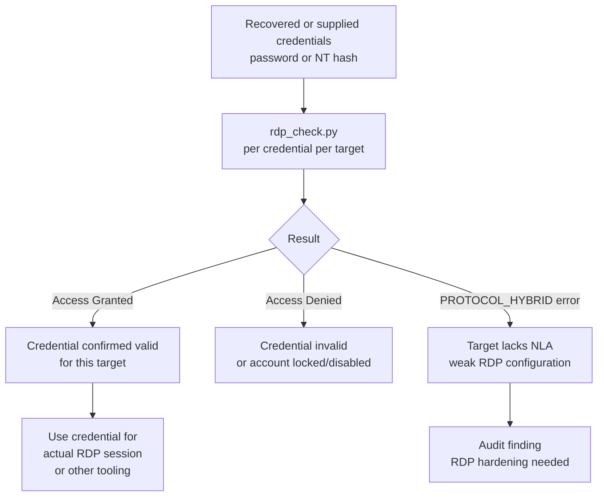
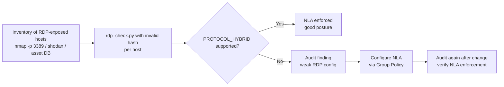

title: "rdp_check.py"
script: "examples/rdp_check.py"
category: "Remote System Interaction"
status: "Published"
protocols:
  - RDP
  - CredSSP
  - X.224
  - TPKT
  - TLS
  - NTLM
ms_specs:
  - MS-RDPBCGR
  - MS-CSSP
mitre_techniques:
  - T1110.003
  - T1078
  - T1021.001
auth_types:
  - NTLM
  - Pass-the-Hash
tags:
  - impacket
  - impacket/examples
  - category/remote_system_interaction
  - status/published
  - protocol/rdp
  - protocol/credssp
  - protocol/tpkt
  - protocol/x224
  - ms-spec/ms-rdpbcgr
  - ms-spec/ms-cssp
  - technique/credential_validation
  - technique/password_spray_validation
  - technique/nla_check
  - mitre/T1110.003
  - mitre/T1078
  - mitre/T1021.001
aliases:
  - rdp_check
  - rdp-cred-check
  - credssp-validate
  - nla-check


# rdp_check.py

> **One line summary:** Partial implementation of [MS-RDPBCGR] (Remote Desktop Protocol: Basic Connectivity and Graphics Remoting) and [MS-CSSP] (Credential Security Support Provider Protocol) that performs just enough of the RDP connection sequence to reach CredSSP authentication and validate whether a given username, password, or NTLM hash is accepted by the target's RDP server (which means the target's underlying Windows authentication subsystem accepts the credential), without actually establishing a graphical RDP session that would create a desktop session, log a `4624` interactive logon, or appear in the target's session manager; authored by Alberto Solino (`@agsolino`); requires the target to support `PROTOCOL_HYBRID` (CredSSP, also known as Network Level Authentication or NLA, which is the default on every supported version of Windows Server and Windows client since Vista SP1); the tool exits with a clear "Access Granted" or "Access Denied" message after the NTLM exchange embedded in CredSSP either succeeds or fails; operationally important for credential spray validation against RDP-exposed targets, post-dump credential testing without graphical session noise, audit work confirming that recovered hashes still work, and identifying RDP services where weak passwords are accepted; supports `-hashes` for pass-the-hash style validation against systems where Restricted Admin Mode is enabled (without Restricted Admin Mode, NTLM authentication may succeed but the RDP session establishment requires a clear text password that NTLM hash auth cannot provide, which the article addresses honestly); **continues Remote System Interaction at 4 of 5 articles (80%), with one stub (`tstool.py`) remaining to close the category as the 11th complete category in the wiki**.

| Field | Value |
|:---|:---|
| Script | `examples/rdp_check.py` |
| Category | Remote System Interaction |
| Status | Published |
| Author | Alberto Solino (`@agsolino`) |
| Primary protocols | RDP (Remote Desktop Protocol), CredSSP (Credential Security Support Provider), X.224 (TPKT), TLS, NTLM |
| Primary Microsoft specifications | `[MS-RDPBCGR]` Remote Desktop Protocol: Basic Connectivity and Graphics Remoting; `[MS-CSSP]` Credential Security Support Provider Protocol |
| MITRE ATT&CK techniques | T1110.003 Brute Force: Password Spraying (validation phase), T1078 Valid Accounts (credential confirmation), T1021.001 Remote Services: Remote Desktop Protocol (target identification) |
| Authentication | NTLM, Pass-the-Hash (subject to Restricted Admin Mode caveat) |
| Default port | TCP 3389 |
| Required server feature | PROTOCOL_HYBRID (NLA) - tool will fail clearly against legacy PROTOCOL_RDP or PROTOCOL_SSL targets |
| External dependency | pyOpenSSL for the TLS wrapping inside CredSSP |


## Prerequisites

This article assumes familiarity with:

- NTLM authentication mechanics: NEGOTIATE, CHALLENGE, AUTHENTICATE messages and the role of NT hash derivation. NTLM exchange details are covered in the foundation Kerberos and authentication sections; the relevant pieces here are that NTLM works the same inside CredSSP as it does anywhere else.
- TLS handshake basics: ClientHello, ServerHello, certificate exchange. The TLS layer in CredSSP is standard TLS, just used as a transport for the inner NTLM and credential exchange messages.
- General Windows authentication subsystem: the LSA (Local Security Authority) is what ultimately validates credentials regardless of which authentication protocol presents them, so an "Access Granted" from rdp_check.py confirms the credential is valid for Windows authentication generally, not specifically for RDP.


## What it does

`rdp_check.py` connects to a target's RDP service on TCP 3389, negotiates the use of CredSSP, and runs the NTLM exchange embedded inside CredSSP using the supplied credentials. The tool reports whether the credentials were accepted:

```text
$ rdp_check.py ACME/alice:Passw0rd@10.10.10.50
Impacket v0.14.0.dev0 - Copyright Fortra, LLC and its affiliated companies
[*] Connecting to 10.10.10.50:3389
[*] Encryption Method: SSL
[*] Server requires CredSSP
[+] Access Granted
```

```text
$ rdp_check.py ACME/alice:WrongPassword@10.10.10.50
Impacket v0.14.0.dev0 - Copyright Fortra, LLC and its affiliated companies
[*] Connecting to 10.10.10.50:3389
[*] Encryption Method: SSL
[*] Server requires CredSSP
[-] Access Denied
```

```text
$ rdp_check.py ACME/alice@10.10.10.50 -hashes :31d6cfe0d16ae931b73c59d7e0c089c0
Impacket v0.14.0.dev0 - Copyright Fortra, LLC and its affiliated companies
[*] Connecting to 10.10.10.50:3389
[*] Encryption Method: SSL
[*] Server requires CredSSP
[+] Access Granted
```

After the report, the tool disconnects. No RDP session is established. No screen is rendered. No interactive logon event fires on the target.


## Why it exists

### The credential validation gap

When operators have credentials (recovered from a dump, captured during phishing, generated by spraying common passwords, retrieved from a vault breach, etc.) and need to know whether those credentials work against a specific target, the natural instinct is to try logging in. For SMB targets there are clean tools: `smbclient.py`, [`crackmapexec`/`netexec`](https://www.netexec.wiki/), `Net Use`. For Kerberos there's `getTGT.py`. For RDP specifically, the conventional options were:

1. **Use `mstsc.exe` or `xfreerdp` interactively**: opens a graphical session, logs an interactive logon (Event 4624 type 10), and appears in the target's session manager. Heavy footprint for what should be a yes/no question.
2. **Use a brute force tool like `hydra` or `ncrack` against RDP**: works but is designed for many guessing attempts rather than validating a single credential. Often slower than necessary and more obvious in logs.
3. **Use Crowbar or similar RDP brute tools**: same family as hydra/ncrack.
4. **Use `xfreerdp` with `+auth-only` flag**: actually a clean option that does what rdp_check.py does, and worth knowing about. xfreerdp's auth-only mode uses similar mechanics. rdp_check.py is the Impacket-native equivalent.

rdp_check.py fills the same niche as `xfreerdp +auth-only`: minimal RDP interaction, just enough to validate credentials. The advantage of using rdp_check.py over xfreerdp is integration with Impacket's authentication primitives (consistent `-hashes` flag, consistent target syntax) and the absence of any graphics library dependencies.

### The "valid account" concept

rdp_check.py confirms that the supplied credential is valid for Windows authentication on the target. This is broader than just "RDP works"; if the credential is accepted by RDP's CredSSP exchange, the underlying Windows LSA accepted the credential, which means:

- The account exists.
- The password (or NTLM hash) is correct.
- The account is not locked out.
- The account is not disabled.
- The account has at least the minimum permission required for RDP authentication (which is "Authenticated Users" in default configurations; can be tightened via "Allow log on through Remote Desktop Services" Group Policy).

What rdp_check.py does NOT confirm:

- That the account would actually receive a desktop session on logon (which depends on additional checks like license availability, profile load success, login script success, etc.).
- That the account has remote desktop user group membership specifically. Some configurations allow CredSSP to succeed for any authenticated user but only allow desktop session creation for explicit Remote Desktop Users members.
- That the account is not subject to other restrictions like login hours, workstation restrictions, or "Account is sensitive and cannot be delegated" flags that block specific authentication paths.

In practice, "Access Granted" from rdp_check.py is a strong positive signal that the credential works generally for Windows authentication, with caveats about whether RDP session establishment specifically would succeed.

### Why the pass-the-hash caveat matters

CredSSP carries NTLM authentication, and NTLM accepts hash-based authentication. So `rdp_check.py -hashes :NTHASH` works to validate hashes. However, RDP session establishment (after CredSSP) traditionally requires a clear text password to populate the credential prompt that the remote session sees.

Microsoft addressed this with **Restricted Admin Mode** (Windows 8.1+, Server 2012 R2+) and **Remote Credential Guard** (Windows 10/Server 2016+). Both modes allow RDP sessions based on NTLM to establish without clear text password injection. Restricted Admin Mode in particular is enabled per server via the `DisableRestrictedAdmin` registry value at `HKLM\System\CurrentControlSet\Control\Lsa`.

If Restricted Admin Mode is enabled, hash auth via rdp_check followed by an mstsc/xfreerdp connection with `/restrictedadmin` succeeds end to end. If Restricted Admin Mode is NOT enabled, rdp_check.py with `-hashes` will report Access Granted (because CredSSP NTLM succeeded) but a subsequent attempt to establish a real RDP session with the same hash will fail. This is a known and frequently confused behavior; rdp_check.py is doing its job correctly, it's the downstream session establishment that requires additional configuration.

The article on rdp_check.py needs to be honest about this caveat because it's a common operator surprise.


## Protocol theory

The RDP connection sequence is more complex than most operators realize. rdp_check.py implements only the early phases needed to validate credentials.

### Layer cake

RDP traffic is multiple protocols stacked:

```text
Application data (graphics, input, channel data)
        ↓
RDP (MS-RDPBCGR core protocol)
        ↓
CredSSP / NLA (MS-CSSP, when used)
        ↓
TLS (when CredSSP or SSL encryption negotiated)
        ↓
T.125 MCS (Multi-point Communication Service)
        ↓
X.224 (TPDU - Transport Protocol Data Units)
        ↓
TPKT (T.123 - Transport Service over TCP)
        ↓
TCP (port 3389)
```

rdp_check.py works through this stack only as far as needed to perform CredSSP authentication. It never reaches the T.125 MCS layer (the RDP user data plane).

### X.224 connection request and confirm

The first RDP packet after TCP connect is an X.224 Connection Request wrapped in TPKT:

```text
TPKT Header (4 bytes):
  Version: 3
  Reserved: 0
  Length: <total packet length>

X.224 Header:
  Length: variable
  Code: 0xe0 (TDPU_CONNECTION_REQUEST)
  Destination Reference: 0
  Source Reference: 0
  Class Option: 0

RDP Negotiation Request (in X.224 user data):
  Type: 1 (TYPE_RDP_NEG_REQ)
  Flags: 0
  Length: 8
  Requested Protocols: PROTOCOL_HYBRID (2) | PROTOCOL_SSL (1)
```

The Requested Protocols field tells the server which authentication mechanisms the client supports. rdp_check.py requests PROTOCOL_HYBRID (CredSSP) and PROTOCOL_SSL (legacy SSL with no CredSSP). Three values defined in `[MS-RDPBCGR]`:

- **PROTOCOL_RDP (0)**: Standard RDP Security (legacy, weak, no NLA). Used by very old clients and servers.
- **PROTOCOL_SSL (1)**: TLS encryption of the RDP traffic, but no CredSSP. Authentication happens in the RDP layer after TLS handshake. Vulnerable to interception of credentials in the middle before NLA was introduced.
- **PROTOCOL_HYBRID (2)**: CredSSP/NLA. TLS plus authentication via SPNEGO/NTLM/Kerberos done before any RDP layer connection. The default on modern Windows.

The server responds with X.224 Connection Confirm including its selected protocol:

```text
X.224 Header:
  Length: variable
  Code: 0xd0 (TPDU_CONNECTION_CONFIRM)

RDP Negotiation Response:
  Type: 2 (TYPE_RDP_NEG_RSP)
  Flags: 0
  Length: 8
  Selected Protocol: 2 (PROTOCOL_HYBRID)
```

If the server selects PROTOCOL_HYBRID, rdp_check.py proceeds. If the server selects something else (or returns a negotiation failure), rdp_check.py reports the inability to use CredSSP and exits.

### TLS handshake

After PROTOCOL_HYBRID is selected, both sides perform a standard TLS handshake. The server presents a certificate (often self signed and generated automatically by Windows for the RDP service, with subject matching the machine name); rdp_check.py does not validate this certificate by default.

The TLS session is established before any credential is sent. All subsequent CredSSP and NTLM traffic flows inside the TLS tunnel.

### CredSSP exchange

CredSSP (`[MS-CSSP]`) is an authentication protocol that wraps an inner SSPI security mechanism (SPNEGO, NTLM, or Kerberos). The flow:

1. Client sends **TSRequest** with NegoData containing NTLM_NEGOTIATE.
2. Server responds with **TSRequest** containing NTLM_CHALLENGE.
3. Client sends **TSRequest** containing NTLM_AUTHENTICATE.
4. If authentication succeeds, server sends **TSRequest** containing the public key info. Client validates.
5. Client sends **TSRequest** containing TSCredentials (the actual credentials to be passed through to the remote session for SSO).
6. RDP connection establishment continues at the MCS layer.

rdp_check.py performs steps 1, 2, and 3 explicitly. Step 4 is where the tool determines the result: a successful CredSSP completion (NTLM AUTHENTICATE accepted) is reported as Access Granted; an NTLM error is reported as Access Denied. The tool does not proceed past step 4 because steps 5 and 6 are unnecessary for credential validation.

### TSRequest structure

`[MS-CSSP]` defines TSRequest as an ASN.1 SEQUENCE:

```text
TSRequest ::= SEQUENCE {
    version       [0] INTEGER,
    negoTokens    [1] NegoData OPTIONAL,
    authInfo      [2] OCTET STRING OPTIONAL,
    pubKeyAuth    [3] OCTET STRING OPTIONAL,
    errorCode     [4] INTEGER OPTIONAL,
    clientNonce   [5] OCTET STRING OPTIONAL
}
```

NegoData carries the NTLM messages. AuthInfo carries TSCredentials in later flows. PubKeyAuth carries the public key authentication tokens. ErrorCode appears when something fails.

rdp_check.py constructs TSRequest with version 2 or 3 and NegoData populated, then parses incoming TSRequest responses to extract the server's NTLM messages or error codes.

### Why pyOpenSSL specifically

The CredSSP flow requires access to the underlying TLS connection state for the public key authentication step (which binds the credentials to the specific TLS session). Standard Python `ssl` module abstracts away the certificate and session details that CredSSP needs. pyOpenSSL exposes the OpenSSL primitives that allow rdp_check.py to extract the server's TLS public key and use it in the TSRequest pubKeyAuth field.

This is why `import OpenSSL.SSL` is at the top of rdp_check.py rather than `import ssl`. The pyOpenSSL dependency is documented but sometimes missed by operators who get an ImportError on first run.


## How the tool works internally

### Imports

```python
import socket
import argparse
import sys
import logging
from struct import pack, unpack
from binascii import a2b_hex

from Cryptodome.Cipher import ARC4
from impacket import ntlm, version
from impacket.examples import logger
from impacket.examples.utils import parse_target
from impacket.structure import Structure
from impacket.spnego import GSSAPI, ASN1_SEQUENCE, ASN1_OCTET_STRING, asn1decode, asn1encode

from OpenSSL import SSL, crypto
```

The pyOpenSSL imports are wrapped in a try/except at the top of the module:

```python
try:
    from OpenSSL import SSL, crypto
except:
    logging.critical("pyOpenSSL is not installed, can't continue")
```

This produces the friendly error if pyOpenSSL is missing.

### Constants

```python
TDPU_CONNECTION_REQUEST  = 0xe0
TPDU_CONNECTION_CONFIRM  = 0xd0
TDPU_DATA                = 0xf0
TPDU_REJECT              = 0x50
TPDU_DATA_ACK            = 0x60

TYPE_RDP_NEG_REQ = 1
PROTOCOL_RDP     = 0
PROTOCOL_SSL     = 1
PROTOCOL_HYBRID  = 2

TYPE_RDP_NEG_RSP = 2
```

X.224 codes and RDP negotiation values per `[MS-RDPBCGR]`. The TDPU naming reflects T-PDU (Transport Protocol Data Unit) terminology from the X.224 spec; the typo "TDPU" instead of "TPDU" in the constant names is preserved from early Impacket source.

### Core flow

```python
def check_credentials(target, port, username, password, domain, lmhash, nthash):
    # Step 1: TCP connect
    sock = socket.socket(socket.AF_INET, socket.SOCK_STREAM)
    sock.connect((target, port))
    
    # Step 2: Send X.224 Connection Request with PROTOCOL_HYBRID
    sock.send(build_x224_connection_request())
    
    # Step 3: Receive X.224 Connection Confirm
    response = sock.recv(8192)
    selected_protocol = parse_x224_connection_confirm(response)
    
    if selected_protocol != PROTOCOL_HYBRID:
        logging.error("Server doesn't support PROTOCOL_HYBRID, can't use CredSSP")
        return False
    
    # Step 4: TLS handshake
    ctx = SSL.Context(SSL.TLS_METHOD)
    tls_sock = SSL.Connection(ctx, sock)
    tls_sock.set_connect_state()
    tls_sock.do_handshake()
    
    # Step 5: Build NTLM NEGOTIATE, wrap in TSRequest, send
    auth = ntlm.getNTLMSSPType1(workstation, domain)
    ts_request = build_ts_request(nego_tokens=auth.getData())
    tls_sock.send(ts_request)
    
    # Step 6: Receive TSRequest with NTLM CHALLENGE
    response = tls_sock.recv(8192)
    ts_request = parse_ts_request(response)
    nego_data = ts_request['NegoData']
    
    # Step 7: Compute NTLM AUTHENTICATE, wrap in TSRequest, send
    type3, exportedSessionKey = ntlm.getNTLMSSPType3(
        auth, nego_data, username, password, domain,
        lmhash, nthash, use_ntlmv2=True
    )
    ts_request = build_ts_request(nego_tokens=type3.getData())
    tls_sock.send(ts_request)
    
    # Step 8: Receive response - success or error
    response = tls_sock.recv(8192)
    ts_request = parse_ts_request(response)
    
    if ts_request.get('errorCode'):
        logging.error("Access Denied")
        return False
    else:
        logging.info("Access Granted")
        return True
```

Pseudocode showing the architectural flow. Real code handles ASN.1 encoding of TSRequest, error path branches, NTLM message construction details, and various edge cases.

### NTLM exchange details

The NTLM exchange inside CredSSP is standard NTLMv2:

1. **NTLM_NEGOTIATE** (Type 1): Client capabilities, workstation name, optional domain name. No credential information.
2. **NTLM_CHALLENGE** (Type 2): Server's challenge nonce, server NetBIOS name, target info AV pairs.
3. **NTLM_AUTHENTICATE** (Type 3): Computed NTLMv2 response based on the challenge, the user's NT hash, and the server target info.

The NT hash is the secret. It can be derived from a clear text password or supplied directly via `-hashes`. Either way, the NTLMv2 response computation is the same and the server's validation is the same.

### Why the tool uses NTLMv2

`ntlm.getNTLMSSPType3(..., use_ntlmv2=True)` forces NTLMv2 response computation. NTLMv1 has been deprecated for over a decade and is disabled in most modern environments via Group Policy setting "Network security: LAN Manager authentication level" set to "Send NTLMv2 response only. Refuse LM & NTLM" (level 5).

NTLMv1 in CredSSP would be unusual and probably indicate a misconfigured target. The hardcoded NTLMv2 in rdp_check.py reflects modern reality.

### What the tool does NOT do

- Does NOT perform Kerberos authentication. Even though CredSSP supports SPNEGO with Kerberos, rdp_check.py uses NTLM exclusively. Kerberos would require a TGS for the target's terminal services SPN (`TERMSRV/<host>`) which complicates the operational use.
- Does NOT validate the server's TLS certificate. Self-signed certs are accepted silently.
- Does NOT establish an RDP session. Stops after credential validation.
- Does NOT enumerate accounts. Single credential per invocation.
- Does NOT brute force. Single credential, single attempt; returns binary result.
- Does NOT support legacy PROTOCOL_RDP or PROTOCOL_SSL targets. CredSSP-required.
- Does NOT bypass account lockout policy. A failed attempt counts toward lockout exactly like any other failed RDP login.
- Does NOT bypass MFA policies that block NTLM. Some environments have policies requiring smart card or other MFA for RDP; rdp_check.py against such targets fails.


## Practical usage

### Single credential validation

```bash
rdp_check.py ACME/alice:Passw0rd@10.10.10.50
```

Standard target syntax. Returns Access Granted or Access Denied. Use case: confirm a recovered or supplied credential works against a specific RDP target before attempting to actually log in.

### Pass the hash validation

```bash
rdp_check.py ACME/alice@10.10.10.50 -hashes :31d6cfe0d16ae931b73c59d7e0c089c0
```

NT hash only (LM hash empty, represented as the colon prefix). Validates the hash. Caveat: a successful Access Granted with hash auth does NOT guarantee a subsequent mstsc/xfreerdp session will succeed unless Restricted Admin Mode is enabled on the target.

### IPv6 target

```bash
rdp_check.py -6 ACME/alice:Passw0rd@'[2001:db8::50]'
```

The `-6` flag and bracketed IPv6 address. Most operational use is IPv4; IPv6 support exists for environments where IPv6 is the primary management network.

### Validating credentials from a spray operation

After a password spray (using a tool like Spray365, kerbrute, or DomainPasswordSpray.ps1) returns hits, validate each hit against specific targets:

```bash
# spray_hits.txt format: domain\username:password
while IFS=':' read -r user_part password; do
    domain=$(echo "$user_part" | cut -d'\' -f1)
    user=$(echo "$user_part" | cut -d'\' -f2)
    echo "=== $user_part ==="
    rdp_check.py "$domain/$user:$password@10.10.10.50" 2>&1 | grep -E 'Access|Granted|Denied'
done < spray_hits.txt > spray_validation.txt
```

The grep filters output to just the result line. Use case: large spray returns 200 candidate credentials; rdp_check confirms which ones actually work against your specific RDP target of interest.

### Validating recovered NT hashes

After dumping NT hashes from a target (via secretsdump.py or similar), validate that each hash actually authenticates against another target where you suspect the same passwords might be used:

```bash
# hashes.txt format: username:rid:lmhash:nthash:::
while IFS=':' read -r user rid lm nt rest; do
    echo "=== $user ==="
    rdp_check.py "ACME/$user@10.10.10.51" -hashes ":$nt" 2>&1 | grep -E 'Access'
done < hashes.txt > hash_validation.txt
```

This confirms which hashes still work, which is useful both for offensive operations (which accounts to use for further RDP-based actions) and defensive audits (which accounts have credentials reused across systems).

### NLA enforcement audit

Use rdp_check.py against a list of RDP-exposed servers to identify those NOT supporting CredSSP (which would fail rdp_check.py with the PROTOCOL_HYBRID error). These are weakly configured RDP services that should be hardened.

```bash
# rdp_hosts.txt: list of IPs known to have TCP 3389 open
while read host; do
    result=$(rdp_check.py "ACME/audit@$host" -hashes :00000000000000000000000000000000 2>&1)
    if echo "$result" | grep -q "doesn't support PROTOCOL_HYBRID"; then
        echo "$host: NLA NOT REQUIRED"
    elif echo "$result" | grep -q "Access Denied"; then
        echo "$host: NLA enforced (good)"
    else
        echo "$host: unexpected result - $result"
    fi
done < rdp_hosts.txt > nla_audit.txt
```

Uses an obviously invalid hash so the credential check always fails. The interesting signal is whether CredSSP is supported at all. Targets that refuse PROTOCOL_HYBRID are the security finding.

### Key flags

| Flag | Meaning |
|:---|:---|
| `target` (positional) | `[[domain/]username[:password]@]<host>` standard Impacket target |
| `-hashes LMHASH:NTHASH` | NT hash auth (caveat: session establishment requires Restricted Admin Mode) |
| `-no-pass` | Skip password prompt (useful when paired with `-hashes`) |
| `-6` / `--ipv6` | Use IPv6 |
| `-debug` | Verbose debug output including raw packet dumps |
| `-ts` | Timestamp log lines |

Note absence of `-k` (Kerberos) flag. rdp_check.py uses NTLM exclusively despite CredSSP nominally supporting SPNEGO/Kerberos.


## What it looks like on the wire

Distinctive RDP traffic with TLS handshake followed by CredSSP exchange.

### TCP connection to 3389

Standard SYN/SYN-ACK/ACK sequence. Source port is ephemeral, destination port 3389.

### X.224 Connection Request

```text
TPKT: Version=3, Length=27
X.224 CR (Connection Request, code 0xE0): Length=22
RDP_NEG_REQ:
  Type=1, Flags=0, Length=8
  RequestedProtocols=0x00000003 (PROTOCOL_HYBRID | PROTOCOL_SSL)
```

### X.224 Connection Confirm

```text
TPKT: Version=3, Length=19
X.224 CC (Connection Confirm, code 0xD0): Length=14
RDP_NEG_RSP:
  Type=2, Flags=0, Length=8
  SelectedProtocol=0x00000002 (PROTOCOL_HYBRID)
```

If the server returns RDP_NEG_FAILURE (Type=3) instead, the failure code indicates why. Common values:

- 1: SSL_REQUIRED_BY_SERVER
- 2: SSL_NOT_ALLOWED_BY_SERVER
- 3: SSL_CERT_NOT_ON_SERVER
- 4: INCONSISTENT_FLAGS
- 5: HYBRID_REQUIRED_BY_SERVER (what an NLA-enforcing server returns to a client requesting non-CredSSP)
- 6: SSL_WITH_USER_AUTH_REQUIRED_BY_SERVER

### TLS handshake

Standard TLS ClientHello → ServerHello → Certificate → ServerHelloDone → ClientKeyExchange → ChangeCipherSpec → Finished sequence. The server certificate is usually self signed by Windows (Subject contains the machine name).

### CredSSP TSRequest exchange

After TLS, three TSRequest messages flow inside the TLS tunnel:

1. Client → Server: TSRequest with NegoData containing NTLM_NEGOTIATE
2. Server → Client: TSRequest with NegoData containing NTLM_CHALLENGE
3. Client → Server: TSRequest with NegoData containing NTLM_AUTHENTICATE

These are not visible in raw packet capture (they're inside TLS) without TLS interception. Wireshark with the server's private key configured can decrypt and show them.

### Final response

If the server accepts the credential, it responds with a TSRequest containing pubKeyAuth (rdp_check.py would proceed to step 5 in normal CredSSP, but stops here). If the server rejects, it responds with a TSRequest containing errorCode (typically 0xC000006D STATUS_LOGON_FAILURE for bad credentials, 0xC0000071 STATUS_PASSWORD_EXPIRED for expired, 0xC0000072 STATUS_ACCOUNT_DISABLED for disabled accounts, 0xC0000234 STATUS_ACCOUNT_LOCKED_OUT for locked accounts).

The errorCode is the diagnostic value rdp_check.py maps to its Access Denied output. With `-debug`, the specific NT_STATUS code is logged.

### Wireshark filters

```text
tcp.port == 3389                           # All RDP traffic
rdp.negotiationRequest                     # X.224 CR with RDP_NEG_REQ
rdp.selectedProtocol == 2                  # Server selected PROTOCOL_HYBRID
tls.handshake                              # TLS handshake stages
```

Zeek's RDP analyzer (rdp.log) captures the negotiated security level and other connection metadata. Specific CredSSP content isn't parsed without TLS interception.


## What it looks like in logs

RDP authentication generates several Windows event log signals.

### Windows Security event log

- **Event 4625** (failed logon): fires on credential rejection. Logon Type 10 (RemoteInteractive) or Logon Type 3 (Network) depending on whether the connection reached the session establishment phase. rdp_check.py failures typically generate Logon Type 3 because the connection is rejected at CredSSP before reaching session setup.
- **Event 4624** (successful logon): fires on credential acceptance. Logon Type 3 specifically for rdp_check.py's pattern (CredSSP succeeded but no session established). This is a key distinction: a real RDP session would log Type 10; rdp_check.py logs Type 3 because no desktop session was created.
- **Event 4648** (logon attempted using explicit credentials): may fire depending on configuration.
- **Event 4776** (credential validation): fires on the system that validated the credential. For domain accounts this is on the DC; for local accounts on the target.

The Logon Type 3 vs Type 10 distinction is important for detection: an attacker using rdp_check.py against many targets generates many Type 3 events on each target (looking like network logons rather than RDP logons). This can confuse RDP-focused detection rules that key on Type 10.

### Account lockout consideration

Failed rdp_check.py attempts count toward the target account's lockout counter exactly like any other failed authentication. Sprays via rdp_check.py against many accounts can lock accounts out if the spray attempts more passwords than the lockout policy allows.

For domain accounts, the lockout counter is centralized at the domain controller; failed attempts from any source count. rdp_check.py is not stealthier than other authentication methods in this respect.

### Network Policy Server (NPS) logs

If the target's RDP service is fronted by RD Gateway with NPS authentication, NPS logs (Event 6273 access reject, 6272 access granted) appear in Security log. Most environments don't deploy RD Gateway, so this is less common.

### EDR signals

Modern EDR products treat unusual RDP authentication patterns as suspicious. Specific signals:

- High frequency of Type 3 logons from a single source IP (the rdp_check.py spray pattern).
- CredSSP authentication followed by immediate disconnection without session establishment (the rdp_check.py signature).
- Authentication attempts against multiple accounts from a single source (the spray validation pattern).

### Sigma rule example

```yaml
title: Possible RDP Credential Validation Tool (Type 3 RDP Pattern)
logsource:
  product: windows
  service: security
detection:
  selection_logon:
    EventID: 4624
    LogonType: 3
    AuthenticationPackageName: 'CredSSP'
  selection_no_session:
    LogonType|not_in: [10, 11]
  condition: selection_logon and selection_no_session
timeframe: 5m
threshold: 5
level: medium
```

Medium severity. CredSSP with Type 3 logon and no subsequent Type 10 session is unusual and consistent with rdp_check.py or xfreerdp +auth-only usage.


## Detection and defense

### Detection approach

- **Type 3 with CredSSP Authentication Package**: most distinctive signal. A real RDP session would be Type 10. Type 3 + CredSSP indicates credential validation that occurred before any session.
- **Failed authentication patterns**: high frequency 4625 events with Authentication Package = CredSSP from a single source IP across multiple accounts indicates spray validation.
- **Connection without session**: Sysmon Event 3 (network connection) to TCP 3389 followed by no Sysmon Event 1 (process create) for `rdpinit.exe` or `LogonUI.exe` indicates RDP connections that didn't establish sessions.
- **Account lockout patterns**: many account lockouts in a short window with Caller Computer name showing varying or unknown sources can indicate spray validation.

### Preventive controls

- **Network segmentation**: RDP should not be exposed to untrusted networks. RD Gateway or VPN-only access dramatically reduces exposure.
- **NLA enforcement**: ensure all RDP services require NLA (PROTOCOL_HYBRID). This blocks the older PROTOCOL_RDP and limited PROTOCOL_SSL bypasses.
- **Account lockout policy**: configure account lockout to limit spray attempts. Standard recommendation is lockout after 5-10 failed attempts within 30 minutes, with a 30-60 minute lockout duration.
- **Strong passwords**: NTLM hash auth and password validation both fail against accounts with strong, unique passwords. Password length and complexity requirements remain the foundational defense.
- **MFA for RDP**: deploy MFA via RD Gateway, Duo, Azure AD authentication, or similar. NTLM-based credential validation is bypassed when MFA is required.
- **Disable Restricted Admin Mode** unless specifically needed: prevents pass-the-hash from succeeding at the session establishment phase even if rdp_check.py reports the hash works.
- **Kerberos-only enforcement**: configure Group Policy "Network Security: Restrict NTLM" to require Kerberos on critical infrastructure. Blocks NTLM-based rdp_check.py validation.
- **EDR with RDP behavioral detection**: most modern EDR products flag the rdp_check.py pattern as suspicious.

### What rdp_check.py does NOT enable

- Does NOT establish RDP sessions. Pure validation tool.
- Does NOT bypass MFA. Modern MFA breaks the NTLM flow.
- Does NOT bypass account lockout. Fails count toward lockout.
- Does NOT escalate privilege. Reports validation result; nothing more.
- Does NOT achieve code execution. Tool exits after the binary success/failure result.


## Related tools and attack chains

rdp_check.py **continues Remote System Interaction at 4 of 5 articles (80%)**. One stub remains: `tstool.py` (Session 51 target) closes the category to 5/5 ✅ as the 11th complete category.

### Related Impacket tools

- [`mssqlclient.py`](../09_mssql/mssqlclient.md), [`smbclient.py`](../05_smb_tools/smbclient.md), and similar tools that use credentials pair naturally with rdp_check.py: confirm credential works via rdp_check, then use elsewhere.
- [`secretsdump.py`](../03_credential_access/secretsdump.md) is the typical upstream source for hashes that get validated via rdp_check.py.
- [`getTGT.py`](../02_kerberos_attacks/getTGT.md) is the Kerberos counterpart for credential validation. Where rdp_check.py validates via NTLM-over-CredSSP-over-RDP, getTGT validates by attempting TGT acquisition with the supplied credential.
- [`mqtt_check.py`](https://github.com/fortra/impacket/blob/master/examples/mqtt_check.py) is a similar single-purpose validation tool for MQTT. Same pattern: protocol-specific authentication test, binary result. Not yet covered in this wiki but architecturally similar to rdp_check.py.

### External alternatives

- **`xfreerdp +auth-only`**: open source RDP client with an auth-only mode that does the same job as rdp_check.py. Different dependency profile (FreeRDP vs Python+pyOpenSSL).
- **`hydra -P passwords.txt -t 4 rdp://target`**: brute force tool with RDP support. Designed for many guessing attempts rather than validating a single credential. Slower per attempt than rdp_check.py.
- **`ncrack -p 3389 --user user -P passwords.txt target`**: similar to hydra.
- **`crowbar -b rdp -s target/32 -u user -C passwords.txt`**: another RDP brute tool.
- **NetExec `rdp` module**: NetExec (formerly CrackMapExec) has RDP support including credential validation. Often the most operationally convenient choice in modern workflows.
- **`mstsc.exe`**: native Windows RDP client. Not a validation tool; establishes a full session.

For credential validation specifically (single credential, binary result), rdp_check.py and xfreerdp+auth-only are the cleanest tools. For mass credential testing, NetExec or hydra are typically more operationally convenient. For establishing actual RDP sessions, mstsc or xfreerdp without auth-only.

### Credential validation chain



rdp_check.py sits at the validation step, gating downstream use of credentials.

### Audit chain



Same tool, defensive use. Identifies RDP services not enforcing NLA, which are then hardened.


## Further reading

- **Impacket rdp_check.py source** at `https://github.com/fortra/impacket/blob/master/examples/rdp_check.py`. Canonical implementation.
- **`[MS-RDPBCGR]` Remote Desktop Protocol: Basic Connectivity and Graphics Remoting** at `https://learn.microsoft.com/en-us/openspecs/windows_protocols/ms-rdpbcgr/`. Canonical RDP protocol specification including X.224 negotiation, encryption methods, and connection sequence.
- **`[MS-CSSP]` Credential Security Support Provider Protocol** at `https://learn.microsoft.com/en-us/openspecs/windows_protocols/ms-cssp/`. CredSSP specification including TSRequest structure and the public key authentication flow.
- **Microsoft "What's New in Remote Desktop Services in Windows Server"** documentation for Restricted Admin Mode and Remote Credential Guard background.
- **Microsoft `KB2871997`** - the security update that introduced Restricted Admin Mode for RDP on older Windows versions. Background reading for the pass-the-hash caveat.
- **Mark Russinovich and Daniel Pearson "Windows Internals"** chapter on the Local Security Authority for understanding why a CredSSP success generally implies Windows authentication validity.
- **xfreerdp `+auth-only` documentation** at `https://github.com/FreeRDP/FreeRDP/wiki/CommandLineInterface`. The closest external equivalent.
- **NetExec `rdp` module documentation** at `https://www.netexec.wiki/rdp-protocol/`. Modern operational alternative for mass RDP credential testing.
- **MITRE ATT&CK T1110.003 Brute Force: Password Spraying** at `https://attack.mitre.org/techniques/T1110/003/`.
- **MITRE ATT&CK T1078 Valid Accounts** at `https://attack.mitre.org/techniques/T1078/`.
- **MITRE ATT&CK T1021.001 Remote Services: Remote Desktop Protocol** at `https://attack.mitre.org/techniques/T1021/001/`.

If you want to internalize rdp_check.py, the productive exercise has three parts. First, in a lab, run rdp_check.py against a Windows host with valid credentials and observe Access Granted; check the Security event log on the target and find the Event 4624 with Logon Type 3 and Authentication Package = CredSSP. Note that no Type 10 event fired and no session was established. Second, run rdp_check.py with a wrong password against the same host; observe Access Denied and find Event 4625 with the same package. Third, configure the target to disable NLA (in System Properties > Remote tab, uncheck "Allow connections only from computers running Remote Desktop with Network Level Authentication"); run rdp_check.py again and observe the PROTOCOL_HYBRID error. The three configurations cover the operational envelope. Add Wireshark capture during one of these runs to see the X.224 negotiation, the TLS handshake, and (if you have access to the target's TLS private key) the CredSSP TSRequest exchange. After this exercise, the layered structure of RDP authentication and the specific role of CredSSP in the negotiation become concrete rather than abstract.
