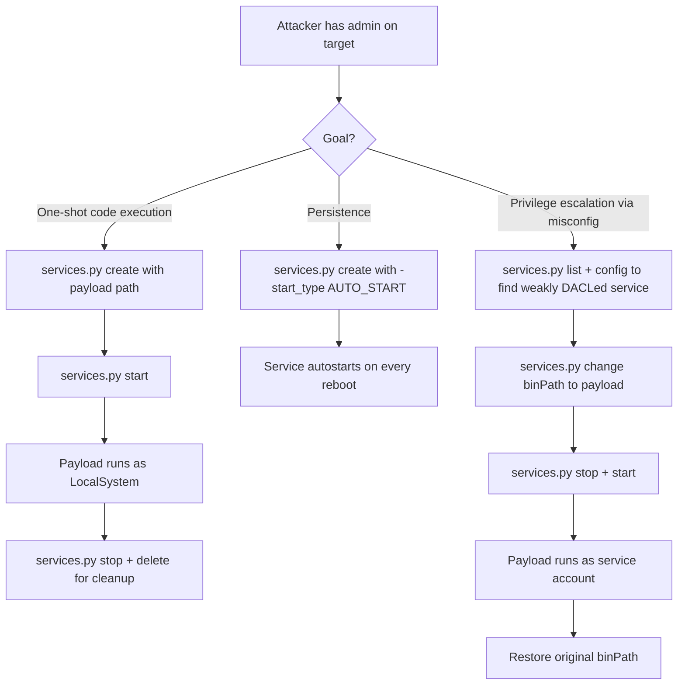

title: "services.py"
script: "examples/services.py"
category: "Remote System Interaction"
status: "Published"
protocols:
  - MS-SCMR
  - SMB
  - NetBIOS
ms_specs:
  - MS-SCMR
  - MS-SMB
mitre_techniques:
  - T1569.002
  - T1543.003
  - T1574.010
  - T1112
  - T1078
auth_types:
  - password
  - nt_hash
  - aes_key
  - kerberos_ccache
tags:
  - impacket
  - impacket/examples
  - category/remote_system_interaction
  - status/published
  - protocol/ms_scmr
  - protocol/smb
  - protocol/svcctl
  - authentication/ntlm
  - authentication/kerberos
  - technique/service_creation
  - technique/service_modification
  - technique/binpath_modification
  - technique/unquoted_service_path
  - technique/service_persistence
  - technique/service_execution
  - mitre/T1569/002
  - mitre/T1543/003
  - mitre/T1574/010
  - mitre/T1112
  - mitre/T1078
aliases:
  - services
  - impacket-services
  - scmr
  - service_control


# services.py

> **One line summary:** Remote Windows service manipulation client that speaks MS-SCMR (Service Control Manager Remote Protocol) over the `\svcctl` SMB named pipe, providing the full set of service operations (start, stop, delete, status, config, list, create, change) as the raw alternative to [`psexec.py`](../04_remote_execution/psexec.md)'s wrapped service creation pattern, and enabling the canonical Windows privilege escalation and persistence primitives that live in the service subsystem: binPath modification on existing services for code execution as SYSTEM, service configuration changes for persistence, and service enumeration to discover unquoted paths, weak DACLs, and other misconfiguration based attack paths.

| Field | Value |
|:---|:---|
| Script | `examples/services.py` |
| Category | Remote System Interaction |
| Status | Published |
| Primary protocols | MS-SCMR (Service Control Manager Remote), SMB |
| Primary Microsoft specifications | `[MS-SCMR]`, `[MS-SMB]` |
| MITRE ATT&CK techniques | T1569.002 System Services: Service Execution, T1543.003 Create or Modify System Process: Windows Service, T1574.010 Services File Permissions Weakness, T1112 Modify Registry (service configuration), T1078 Valid Accounts |
| Authentication types supported | Password, NT hash, AES key, Kerberos ccache |
| First appearance in Impacket | Early Impacket |
| Original author | Alberto Solino (`@agsolino`) |


## Prerequisites

This article builds on:

- [`00_Introduction_and_Architecture.md`](Introduction_and_Architecture.md) for the Impacket stack overview.
- [`smbclient.py`](../05_smb_tools/smbclient.md) for SMB session and named pipe foundations.
- [`rpcdump.py`](../01_recon_and_enumeration/rpcdump.md) for DCE/RPC and MSRPC fundamentals.
- [`reg.py`](reg.md) for MS-RRP and the related SCMR pattern (reg.py uses SCMR to start the Remote Registry service).
- [`psexec.py`](../04_remote_execution/psexec.md) which uses MS-SCMR for service creation. The relationship between `psexec.py` and `services.py` is important: `psexec.py` wraps SCMR operations for a specific purpose (upload RemComSvc, create service, run, delete); `services.py` gives direct access to the same SCMR operations without the execution wrapper.
- [`smbexec.py`](../04_remote_execution/smbexec.md) also uses SCMR (creating a service with `cmd /C` as the binary path).


## What it does

`services.py` is a Windows service manipulation client that operates remotely over MS-SCMR. It provides the functionality equivalent to `sc.exe` on Windows but with pass the hash and Kerberos authentication support that `sc.exe` lacks.

The tool supports eight subcommands, each mapping to a specific SCMR operation or sequence:

| Subcommand | Purpose |
|:---|:---|
| `list` | Enumerate all services on the target. |
| `status` | Query the current state of a specific service (running, stopped, etc.). |
| `config` | Query the configuration of a specific service (binary path, start type, account). |
| `start` | Start a service. |
| `stop` | Stop a service. |
| `create` | Create a new service. |
| `delete` | Delete an existing service. |
| `change` | Modify an existing service's configuration. |

Each subcommand has its own argument set. The positional target argument follows the standard Impacket pattern (`[domain/]user[:password]@target`). Standard authentication flags (`-hashes`, `-k`, `-aesKey`, etc.) apply to all subcommands.

The tool is operationally important for three use cases:

- **Service reconnaissance.** Listing all services and querying specific configurations reveals attack surface: unquoted service paths, services running as domain accounts with weak DACLs, services with binary paths in user-writable directories.
- **Service state management.** Starting and stopping services supports operations like temporarily enabling auditing silencing features, stopping security products (Defender service), or preparing services to be restarted after a binPath modification.
- **Direct service-based code execution.** Creating a new service with a malicious binary path, or modifying an existing service's binPath, then starting it produces code execution as the service account (typically SYSTEM). This is the underlying mechanism behind `psexec.py` and `smbexec.py`, usable directly through `services.py` for scenarios where the wrapped tools do not fit.


## Why it exists

Windows services are one of the fundamental Windows IPC and process management mechanisms. Every modern Windows system has hundreds of services covering everything from kernel mode drivers to user-facing background processes. The Service Control Manager (SCM, process `services.exe`) is the kernel of this subsystem; it manages service lifecycle, handles service control requests, and enforces access control on service operations.

For attackers and defenders, services matter because:

- **Services frequently run as SYSTEM.** A service that an attacker can modify or create is a direct path to SYSTEM-level code execution.
- **Services run continuously.** Unlike one-shot execution primitives (wmiexec, psexec single commands), a malicious service provides persistent access that survives user logoffs.
- **Services are configured via the registry.** The `HKLM\SYSTEM\CurrentControlSet\Services` key contains all service configuration, which means service attacks have both a live (SCMR) and offline (registry modification via `reg.py`) attack surface.
- **Service misconfigurations are widespread.** Unquoted paths, weak file permissions on service binaries, overly permissive service DACLs accumulate in enterprise environments over years.

`services.py` gives Linux operators access to the SCMR attack surface. Without it, operators would have to construct custom SCMR calls using the Impacket library directly or switch to Windows-based tools like `sc.exe` or `PowerShell Get-Service`.

The tool's eight subcommands cover essentially every SCMR operation a security researcher needs. The implementation is a straightforward wrapper around `impacket.dcerpc.v5.scmr` helpers, which makes the code also useful as reference for custom tooling.


## The protocol theory

MS-SCMR has been mentioned in earlier articles. This section covers what operationally matters for `services.py`.

### MS-SCMR overview

The Service Control Manager Remote Protocol is specified in `[MS-SCMR]`. It is a DCE/RPC interface identified by UUID `367abb81-9844-35f1-ad32-98f038001003`, transported over the SMB named pipe `\pipe\svcctl`. Like [`reg.py`](reg.md)'s MS-RRP, SCMR requires an established SMB session to the target.

The protocol exposes the Win32 service API (`OpenSCManager`, `OpenService`, `StartService`, `ChangeServiceConfig`, etc.) as RPC methods. Impacket wraps these with `h` prefixed helpers in `impacket.dcerpc.v5.scmr`: `hROpenSCManagerW`, `hROpenServiceW`, `hRStartServiceW`, and so on.

Key SCMR operations that `services.py` uses:

| Method | Purpose |
|:---|:---|
| `ROpenSCManagerW` | Open a handle to the SC Manager on the target. |
| `REnumServicesStatusW` | Enumerate all services. |
| `ROpenServiceW` | Open a handle to a specific named service. |
| `RQueryServiceStatus` | Get service state (running, stopped, pending). |
| `RQueryServiceConfigW` | Get service configuration (binary path, start type, account). |
| `RStartServiceW` | Start a service. |
| `RControlService` | Send a control code (stop, pause, continue). |
| `RChangeServiceConfigW` | Modify service configuration. |
| `RCreateServiceW` | Create a new service. |
| `RDeleteService` | Mark a service for deletion. |
| `RCloseServiceHandle` | Close a handle (always called at the end). |

The standard call pattern: open SC Manager handle → open service handle → perform operation → close service handle → (optionally close SC Manager handle).

### Access masks

The SC Manager and individual services are securable objects with DACLs. Operations require the caller to hold specific access rights. Key masks:

**SC Manager access rights:**

| Right | Value | Purpose |
|:---|:---||
| `SC_MANAGER_CONNECT` | `0x0001` | Connect to the SC Manager. |
| `SC_MANAGER_CREATE_SERVICE` | `0x0002` | Create a new service. |
| `SC_MANAGER_ENUMERATE_SERVICE` | `0x0004` | Enumerate services. |
| `SC_MANAGER_ALL_ACCESS` | `0xF003F` | All access. |

**Individual service access rights:**

| Right | Value | Purpose |
|:---|:---||
| `SERVICE_QUERY_CONFIG` | `0x0001` | Query configuration. |
| `SERVICE_CHANGE_CONFIG` | `0x0002` | Change configuration. |
| `SERVICE_QUERY_STATUS` | `0x0004` | Query current state. |
| `SERVICE_ENUMERATE_DEPENDENTS` | `0x0008` | Enumerate dependencies. |
| `SERVICE_START` | `0x0010` | Start the service. |
| `SERVICE_STOP` | `0x0020` | Stop the service. |
| `SERVICE_PAUSE_CONTINUE` | `0x0040` | Pause/continue. |
| `SERVICE_INTERROGATE` | `0x0080` | Send interrogate control. |
| `SERVICE_USER_DEFINED_CONTROL` | `0x0100` | Send user-defined controls. |
| `READ_CONTROL` | `0x20000` | Read the security descriptor. |
| `WRITE_DAC` | `0x40000` | Modify the DACL. |
| `WRITE_OWNER` | `0x80000` | Modify the owner. |
| `SERVICE_ALL_ACCESS` | `0xF01FF` | All access. |

The `services.py` source opens SC Manager with:

```python
desiredAccess = SERVICE_START | SERVICE_STOP | SERVICE_CHANGE_CONFIG |
                SERVICE_QUERY_CONFIG | SERVICE_QUERY_STATUS |
                SERVICE_ENUMERATE_DEPENDENTS | SC_MANAGER_ENUMERATE_SERVICE
```

This is broad but reasonable. Specific operations may require additional rights on individual services.

### Service types

When creating a service, the caller specifies a type indicating what kind of service it is:

| Type | Value | Meaning |
|:---|:---||
| `SERVICE_KERNEL_DRIVER` | `0x01` | Kernel mode device driver. |
| `SERVICE_FILE_SYSTEM_DRIVER` | `0x02` | File system driver. |
| `SERVICE_WIN32_OWN_PROCESS` | `0x10` | User mode service running in its own process. |
| `SERVICE_WIN32_SHARE_PROCESS` | `0x20` | User mode service running in a shared process (typically `svchost.exe`). |
| `SERVICE_INTERACTIVE_PROCESS` | `0x100` | Service can interact with desktop. |

For attack purposes, `SERVICE_WIN32_OWN_PROCESS` is the common case. The binary path points to a standalone executable that runs as the service. `SERVICE_WIN32_SHARE_PROCESS` is more complex (requires the binary to be a DLL loaded by `svchost.exe`) and rarely used in offensive contexts.

`SERVICE_KERNEL_DRIVER` is interesting for specific scenarios: loading an unsigned or vulnerable driver can lead to kernel level code execution. Modern Windows (Server 2016+) enforces driver signing by default, but driver signing bypass remains an active research area.

### Start types

Services have configured start types that control when they run:

| Type | Value | Meaning |
|:---|:---||
| `SERVICE_BOOT_START` | `0x00` | Boot loader starts it. Drivers only. |
| `SERVICE_SYSTEM_START` | `0x01` | Started during kernel init. Drivers only. |
| `SERVICE_AUTO_START` | `0x02` | Started by SCM at boot. |
| `SERVICE_DEMAND_START` | `0x03` | Manual start only. |
| `SERVICE_DISABLED` | `0x04` | Cannot be started. |

`SERVICE_DEMAND_START` is the common choice for attacker-created services: start the service once (producing code execution) then delete it. `SERVICE_AUTO_START` is used for persistence (the service starts on every reboot).

### The binPath attack surface

The binary path of a service (`lpBinaryPathName` in SCMR, often called `binPath` in `sc.exe` parlance) specifies what executes when the service runs. For `SERVICE_WIN32_OWN_PROCESS` services, it is the full path to the executable with optional command line arguments.

Three attack patterns related to `binPath`:

**1. Binary replacement.** If the attacker can write to the binary path's file, they can replace the binary with a malicious one. When the service next starts, the malicious binary runs as the service account.

**2. binPath modification via SCMR.** Even without filesystem write access, the SCMR caller with `SERVICE_CHANGE_CONFIG` permission can change where the service points. Changing the binary path to point to a different location (a path the attacker does control, or to `cmd.exe /c <malicious>`) produces code execution on service start.

**3. Service creation.** With `SC_MANAGER_CREATE_SERVICE` right on the SC Manager (requires admin by default), the attacker can create a new service pointing anywhere. This is the cleanest version of the attack and is what `psexec.py` does.

In all three cases, the execution happens as the service's configured account, which defaults to `LocalSystem`. When the attacker controls this, they have SYSTEM on the target.

### Service passwords and session key encryption

Services that run as a domain account require the account's password. When changing a service's account via `ChangeServiceConfig`, the password is passed as a parameter. To protect it in transit, the password is encrypted with the SMB session key before being sent.

The source code pattern:

```python
key = s.getSessionKey()
lpPassword = encryptSecret(key, lpPassword)
dwPwSize = len(lpPassword)
```

This is a security feature: the password is not sent in plaintext over the wire. Operationally, it means the attacker needs the cleartext password (or must have already obtained it) to configure a service with a specific domain account; hash authentication is not enough for the account parameter in `ChangeServiceConfig`.

### Unquoted service paths

A specific service misconfiguration class: when a service binary path contains spaces and is not enclosed in quotes, Windows' path resolution iterates through prefixes. For example:

```text
C:\Program Files\Company Name\Service Daemon\daemon.exe
```

Without quotes, Windows tries:

```text
C:\Program.exe
C:\Program Files\Company.exe
C:\Program Files\Company Name\Service.exe
C:\Program Files\Company Name\Service Daemon\daemon.exe
```

If any earlier path contains a writable directory, an attacker can drop a payload there that Windows will execute before reaching the intended binary.

`services.py config <service>` reveals the binary path including whether quotes are present. Enumerate all services, filter for unquoted paths with spaces, check write permissions on intermediate directories.

### Service DACLs and weak permissions

Each service has its own DACL. The standard pattern: Administrators, SYSTEM, and LocalService have full access; Users have read rights. But services installed by third-party software sometimes have non-standard DACLs: Users granted `SERVICE_CHANGE_CONFIG`, Authenticated Users granted `SERVICE_START`, and other deviations.

These weak DACLs convert the binPath modification attack into a privilege escalation primitive usable by any user on the system. BloodHound and several specialized tools catch this; `services.py` can query individual service DACLs via `SERVICE_QUERY_CONFIG` and output them for manual analysis.


## How the tool works internally

The script is small. The flow per subcommand:

1. **Argument parsing.** Target string and the selected subcommand with its specific arguments.

2. **SMB connection.** Establishes SMB session with the target using specified credentials.

3. **SCMR binding.** Opens the `\svcctl` named pipe. Binds to MS-SCMR interface.

4. **SC Manager open.** Calls `hROpenSCManagerW` with the machine name (typically empty or `DUMMY` to indicate local), database name (`ServicesActive`), and desired access.

5. **Subcommand dispatch.**
    - **`list`:** calls `hREnumServicesStatusW` which returns all services with their status. Prints a table.
    - **`status`:** opens the specified service with `SERVICE_QUERY_STATUS`, calls `hRQueryServiceStatus`, displays state.
    - **`config`:** opens the service with `SERVICE_QUERY_CONFIG`, calls `hRQueryServiceConfigW`, displays binary path, start type, service account, and other configuration fields.
    - **`start`:** opens the service with `SERVICE_START`, calls `hRStartServiceW` (optionally with arguments).
    - **`stop`:** opens the service with `SERVICE_STOP`, calls `hRControlService` with `SERVICE_CONTROL_STOP`.
    - **`create`:** opens SC Manager with `SC_MANAGER_CREATE_SERVICE`, calls `hRCreateServiceW` with specified binary path, display name, start type, error control, and optional service account.
    - **`delete`:** opens the service with `DELETE`, calls `hRDeleteService`.
    - **`change`:** opens the service with `SERVICE_CHANGE_CONFIG`, calls `hRChangeServiceConfigW` with the fields to change.

6. **Handle cleanup.** Calls `hRCloseServiceHandle` on each handle opened.

7. **SMB cleanup.** Standard tree disconnect and logoff.

The implementation closely follows the `impacket.dcerpc.v5.scmr` helpers, which makes it good reference code for understanding SCMR interactions.


## Authentication options

Standard four mode pattern from SMB authentication.

### Cleartext password

```bash
services.py CORP.LOCAL/admin:'P@ss'@10.0.0.50 list
```

### NT hash

```bash
services.py CORP.LOCAL/admin@10.0.0.50 -hashes :<nthash> list
```

### Kerberos ccache

```bash
export KRB5CCNAME=admin.ccache
services.py CORP.LOCAL/admin@10.0.0.50 -k -no-pass list
```

### AES key

```bash
services.py CORP.LOCAL/admin@10.0.0.50 -aesKey <hex> -k -no-pass list
```

### Minimum required privileges

- `list`, `status`, `config`: Any authenticated user can technically call these, but the results are filtered by per-service DACLs. Standard domain users see a subset of services; admins see everything.
- `start`, `stop`: requires `SERVICE_START` / `SERVICE_STOP` on the specific service. For most services, this is admin-only.
- `create`: requires `SC_MANAGER_CREATE_SERVICE` on the SC Manager. Admin-only by default.
- `delete`: requires `DELETE` on the service. Admin-only by default.
- `change`: requires `SERVICE_CHANGE_CONFIG` on the service. Admin-only on most services; weak DACLs allow lower-privileged users on specific services.

In practice, `services.py` write operations require local admin on the target. Read operations work for less privileged users but see less data.


## Practical usage

### Enumerate all services

```bash
services.py CORP.LOCAL/admin:'P@ss'@10.0.0.50 list
```

Produces a table of all services with their names, display names, and current states. The output is typically long (modern Windows has 200+ services). Pipe to `grep` for specific patterns or use `-debug` for more verbose output.

Useful filtering targets:

- Services running (to see what is actually active).
- Services with the word "Admin" or specific vendor names (often run as high-privileged accounts).
- Services in non-standard locations (binary paths outside `C:\Windows\System32`).

### Query a specific service's configuration

```bash
services.py CORP.LOCAL/admin:'P@ss'@10.0.0.50 config -name 'RemoteRegistry'
```

Returns:

```text
[*] SERVICE_NAME: RemoteRegistry
[*] DISPLAY_NAME: Remote Registry
[*] SERVICE_TYPE  : 0x20 - SERVICE_WIN32_SHARE_PROCESS
[*] START_TYPE    : 0x03 - SERVICE_DEMAND_START
[*] ERROR_CONTROL : 0x01 - SERVICE_ERROR_NORMAL
[*] BINARY_PATH_NAME : C:\Windows\system32\svchost.exe -k localService
[*] LOAD_ORDER_GROUP : 
[*] TAG           : 0
[*] DISPLAY_NAME  : Remote Registry
[*] DEPENDENCIES  : RPCSS/
[*] SERVICE_START_NAME: NT AUTHORITY\LocalService
```

Useful for identifying interesting target services before modification.

### Query a service's current state

```bash
services.py CORP.LOCAL/admin:'P@ss'@10.0.0.50 status -name 'RemoteRegistry'
```

Returns one of `RUNNING`, `STOPPED`, `START_PENDING`, `STOP_PENDING`, etc.

### Start and stop a service

```bash
services.py CORP.LOCAL/admin:'P@ss'@10.0.0.50 start -name 'RemoteRegistry'
services.py CORP.LOCAL/admin:'P@ss'@10.0.0.50 stop -name 'WinDefend'
```

Starts or stops the specified service. Stopping security products (like `WinDefend` for Windows Defender) is a classic prerequisite to other attacks, though modern systems' Tamper Protection prevents this even with admin.

### Create a new service for code execution

```bash
services.py CORP.LOCAL/admin:'P@ss'@10.0.0.50 create \
  -name 'UpdaterSvc' \
  -display 'Update Service' \
  -path 'C:\Windows\Temp\payload.exe'

services.py CORP.LOCAL/admin:'P@ss'@10.0.0.50 start -name 'UpdaterSvc'

# After getting what you need:
services.py CORP.LOCAL/admin:'P@ss'@10.0.0.50 stop -name 'UpdaterSvc'
services.py CORP.LOCAL/admin:'P@ss'@10.0.0.50 delete -name 'UpdaterSvc'
```

The classic service-based execution pattern. Works if the target has the payload already (via [`smbclient.py`](../05_smb_tools/smbclient.md) upload or earlier file transfer). The service runs as `LocalSystem` by default (no `-password` means the default account).

### Modify an existing service's binPath (privilege escalation)

```bash
# Backup the current config first
services.py CORP.LOCAL/user:'P@ss'@10.0.0.50 config -name 'SomeService'

# Change binPath to payload
services.py CORP.LOCAL/user:'P@ss'@10.0.0.50 change \
  -name 'SomeService' \
  -path 'C:\Windows\Temp\payload.exe'

# Start (or restart) the service
services.py CORP.LOCAL/user:'P@ss'@10.0.0.50 stop -name 'SomeService'
services.py CORP.LOCAL/user:'P@ss'@10.0.0.50 start -name 'SomeService'

# Restore the original binPath
services.py CORP.LOCAL/user:'P@ss'@10.0.0.50 change \
  -name 'SomeService' \
  -path '<original binary path>'
```

The local privilege escalation pattern. Works when the caller has `SERVICE_CHANGE_CONFIG` on the target service (misconfigured DACL scenario). The payload runs as whatever account the service is configured to use.

### Create a persistent service for long term access

```bash
services.py CORP.LOCAL/admin:'P@ss'@10.0.0.50 create \
  -name 'DiagnosticsUpdate' \
  -display 'Windows Diagnostics Update Service' \
  -path 'C:\Windows\System32\drivers\update.exe'
```

Creates a service that autostarts on boot (default `SERVICE_AUTO_START`). Persistent but very loud; detected by essentially every EDR product.

### Find unquoted service paths

```bash
services.py CORP.LOCAL/user:'P@ss'@10.0.0.50 list > all_services.txt

# For each service, query config and look for unquoted paths with spaces
for svc in $(cat service_names.txt); do
  services.py CORP.LOCAL/user:'P@ss'@10.0.0.50 config -name "$svc"
done | grep -E 'BINARY_PATH_NAME.*[^"][A-Z]:\\.* .*[^"]$'
```

The grep pattern catches paths with spaces not enclosed in quotes. Requires follow-up to check write permissions on intermediate directories. This is typically automated with tools like `PowerUp.ps1` on Windows; from Linux, combine `services.py` with filesystem enumeration via [`smbclient.py`](../05_smb_tools/smbclient.md).

### Key flags

| Flag | Meaning |
|:---|:---|
| `target` (positional) | Domain/user[:password]@target. |
| Subcommand | `list`, `status`, `config`, `start`, `stop`, `create`, `delete`, `change`. |
| `-name <n>` | Service name (for non-list subcommands). |
| `-display <n>` | Display name (for create). |
| `-path <path>` | Binary path (for create and change). |
| `-service_type <type>` | Service type (for create; default WIN32_OWN_PROCESS). |
| `-start_type <type>` | Start type (for create; default AUTO_START). |
| `-error_control <n>` | Error control (for create). |
| `-start_name <account>` | Service account (for create; default LocalSystem). |
| `-password <p>` | Password for service account. |
| `-hashes`, `-aesKey`, `-k`, `-no-pass` | Standard authentication flags. |
| `-dc-ip`, `-target-ip` | Explicit DC or target IP. |
| `-port <139|445>` | Destination port (default 445). |
| `-debug`, `-ts` | Verbose/timestamp logging. |


## What it looks like on the wire

MS-SCMR over SMB named pipe. Traffic patterns distinctive from most other SMB activity.

### Session setup

- TCP to port 445 (or 139).
- SMB negotiation, NTLM or Kerberos session setup.
- Tree connect to `IPC$`.

### SCMR binding

- Open `\svcctl` named pipe.
- DCE/RPC bind to UUID `367abb81-9844-35f1-ad32-98f038001003`.

### SC Manager operations

- `ROpenSCManagerW` request with desired access.
- Response includes the SC Manager handle.

### Service operations

- For each targeted service: `ROpenServiceW` → service-specific call(s) → `RCloseServiceHandle`.
- `REnumServicesStatusW` for list operations returns all service records at once.

### Wireshark filters

```text
dcerpc.if_id == 367abb81-9844-35f1-ad32-98f038001003   # MS-SCMR
smb2.filename contains "svcctl"                        # named pipe access
tcp.port == 445                                         # SMB
```

SCMR traffic is inherently distinctive because `\svcctl` is the only service it uses. Baselining "SCMR from unusual sources" is straightforward with appropriate IDS rules.


## What it looks like in logs

Service operations produce rich logging in Windows, particularly for modifications.

### Event ID 4697: A service was installed in the system

Fires when a new service is created (from the Security log). Key fields:

- `ServiceName`: the service name.
- `ServiceFileName`: the binary path.
- `ServiceType`: the service type.
- `ServiceStartType`: the start type.
- `ServiceAccount`: the configured account.

**This is the highest-fidelity detection signal for service-based attacks.** Legitimate service installation happens during software deployment, MSI installs, and Windows Update cycles. Service creation by `services.py` or `psexec.py` produces the same event, distinguishable by timing and the SubjectUser (the authenticated source) vs legitimate installer activity.

### Event ID 7045: A new service was installed

The same event from the System log. Slightly different fields but equivalent content. This event is widely recognized as a lateral movement indicator and many detection products trigger on it.

### Event ID 7040: The start type of a service was changed

Fires when `ChangeServiceConfig` modifies the start type. Includes the old and new start types. Useful for detecting services being reconfigured for persistence (`DEMAND_START` → `AUTO_START`).

### Event ID 7036: Service state changes

Fires on every service start/stop. Very high volume (many legitimate services start/stop during normal operation). Useful for correlation when combined with other events but too noisy alone.

### Event ID 4688 / Sysmon Event 1: Process creation

When a service starts its binary, `services.exe` spawns the target executable. Key fields:

- `ParentImage`: `services.exe`
- `Image`: the service binary
- `User`: the service account (`SYSTEM` for default services)

**Unusual binary paths for `services.exe` children are diagnostic.** Legitimate services have well-known paths (`System32`, `SysWOW64`, `Program Files`). `services.exe` spawning `cmd.exe` or `powershell.exe` is essentially diagnostic of service-based attack execution.

### Sysmon Event 12/13: Registry modifications

Service configuration changes modify `HKLM\SYSTEM\CurrentControlSet\Services\<name>`. Sysmon captures these with high fidelity. Monitoring for changes to:

- `ImagePath` values (binPath modifications).
- `Start` values (start type changes).
- `ObjectName` values (service account changes).

The `reg.py` article covers Sysmon registry monitoring in detail.

### Starter Sigma rules

```yaml
title: Service Installed via SCMR
logsource:
  product: windows
  service: security
detection:
  selection:
    EventID: 4697
  filter_trusted:
    SubjectUserName|endswith: '$'  # computer accounts performing installer work
  condition: selection and not filter_trusted
level: high
```

Catches remote service installations by user accounts. Tune against known legitimate administrative workflows.

```yaml
title: services.exe Spawning Command Processor
logsource:
  product: windows
  category: process_creation
detection:
  selection:
    ParentImage|endswith: 'services.exe'
    Image|endswith:
      - 'cmd.exe'
      - 'powershell.exe'
      - 'pwsh.exe'
      - 'rundll32.exe'
  condition: selection
level: high
```

Matches the execution side of service-based attacks regardless of the specific command. Extremely high fidelity.

```yaml
title: Service BinPath Modified
logsource:
  product: windows
  service: sysmon
detection:
  selection:
    EventID: 13
    TargetObject|contains: '\Services\'
    TargetObject|endswith: '\ImagePath'
  condition: selection
level: medium
```

Catches binPath modifications via SCMR or direct registry writes. Needs tuning in environments where service updates happen frequently.


## Detection and defense

### Detection opportunities

**Event 4697 / 7045 correlation.** Service installations by non-system authenticated users is a high-confidence signal. Especially when combined with the service name being random-looking or non-corporate.

**services.exe spawning cmd/powershell.** As noted, essentially diagnostic of service-based attack execution.

**Service configuration changes.** Modifications to binPath, start type, or service account are unusual and worth alerting on. Sysmon registry monitoring is the cleanest implementation.

**SCMR traffic baselining.** Environments where administrative tools should be the only sources of SCMR traffic can baseline expected sources and alert on deviations.

**Microsoft Defender for Endpoint and similar EDR products.** Detect service-based attacks natively; `psexec.py`-style activity produces clear alerts on most modern EDR deployments.

### Preventive controls

- **Least privilege for service accounts.** Services should run as the lowest-privileged account that works. Virtual accounts (`NT SERVICE\<service name>`) and Managed Service Accounts (MSAs) for domain-aware services. Avoid `LocalSystem` where not strictly required.
- **Audit service DACLs regularly.** Tools like `Get-Acl` in PowerShell or specialized tools like `accesschk.exe` reveal weak service DACLs. Remediate per-service.
- **Fix unquoted service paths.** Enterprise deployment scripts should enforce quoted paths. Vendor software often has unquoted paths as a legacy misconfiguration; audit and fix.
- **Enable SCMR auditing.** The `System` audit policy includes service-related events. "Audit System Events" and "Audit Other System Events" should be set to Success and Failure.
- **Block outbound port 445 at the egress firewall.** Same control that helps against many Impacket attacks. SCMR travels over SMB, so blocking SMB prevents remote SCMR operations from external sources.
- **Windows Defender Tamper Protection.** Prevents Defender services from being stopped even by admins. Should be enabled on all endpoints.
- **Credential Guard and LSA Protection.** Limits the downstream impact of any SYSTEM-level code execution achieved via service abuse.
- **Monitor `HKLM\SYSTEM\CurrentControlSet\Services`.** All service configuration lives here. Sysmon registry monitoring is effective.


## Related tools and attack chains

`services.py` complements several other tools in the wiki.

### Related Impacket tools

- [`psexec.py`](../04_remote_execution/psexec.md) uses SCMR to create a service running RemComSvc, then removes it after execution. The SCMR mechanics are identical to `services.py create`.
- [`smbexec.py`](../04_remote_execution/smbexec.md) uses SCMR to create a service running `cmd /c` with the command in the binary path. The "echo batch to stdout" technique documented in that article is built on SCMR.
- [`reg.py`](reg.md) uses SCMR to start the Remote Registry service when it is not running. That use is covered in the reg.py article.
- [`secretsdump.py`](../03_credential_access/secretsdump.md) in some paths uses SCMR to start Remote Registry (same as reg.py) and in others to create a service for SECURITY hive access.

### External tools

- **`sc.exe`**. Windows built-in. Supports `\\<target>` for remote operations, similar to `services.py`. Windows-only, no pass the hash.
- **PowerShell `Get-Service`, `Set-Service`, `New-Service`**. Native PowerShell service cmdlets with `-ComputerName` for remote operations.
- **`PowerUp.ps1`**. PowerShell privilege escalation toolkit with service-specific checks (unquoted paths, weak DACLs).
- **`WinPEAS`**. Privilege escalation scanner; checks service misconfigurations.

### The canonical service abuse chain



The decision tree shows why `services.py` is the versatile primitive: code execution, persistence, and privilege escalation all flow through service manipulation with minor variations.

### Why use services.py over psexec.py?

`psexec.py` is higher-level and more convenient for one-shot command execution. `services.py` is the right choice when:

- You need to manipulate an existing service (not create a new one).
- You want to enumerate or query services without executing anything.
- You need a persistent service (psexec deletes its service after execution).
- You want to understand or debug the underlying SCMR mechanics.
- You are building a custom attack sequence that involves service state changes as intermediate steps.


## Further reading

- **`[MS-SCMR]`: Service Control Manager Remote Protocol.** `https://learn.microsoft.com/en-us/openspecs/windows_protocols/ms-scmr/`. The authoritative specification.
- **Microsoft "Service Functions."** `https://learn.microsoft.com/en-us/windows/win32/services/service-functions`. Win32 API reference for services.
- **Microsoft "Service Security and Access Rights."** `https://learn.microsoft.com/en-us/windows/win32/services/service-security-and-access-rights`. Access mask details.
- **PowerUp.ps1 service checks documentation** at `https://github.com/PowerShellMafia/PowerSploit/blob/master/Privesc/PowerUp.ps1`. The canonical automated service misconfiguration checker.
- **SpecterOps "An ACE Up The Sleeve" series.** While focused on AD permissions, the underlying access control concepts apply to services too.
- **MITRE ATT&CK T1543.003** at `https://attack.mitre.org/techniques/T1543/003/`. Create or Modify System Process: Windows Service.
- **MITRE ATT&CK T1569.002** at `https://attack.mitre.org/techniques/T1569/002/`. System Services: Service Execution.
- **MITRE ATT&CK T1574.010** at `https://attack.mitre.org/techniques/T1574/010/`. Services File Permissions Weakness.
- **SANS "Windows Service Security Fundamentals"** whitepaper. Detailed treatment of service security from a defensive perspective.
- **Neil Fox "Impacket Usage and Detection"** at `https://neil-fox.github.io/Impacket-usage-&-detection/`. Event logs produced by each Impacket tool including `services.py`.

If you want to internalize the tool, set up a lab Windows server and try the full cycle from a Linux attack host: `services.py list` to see all services, `services.py config -name <service>` on a few to see the configuration format, `services.py create -name TestSvc -path 'C:\Windows\System32\calc.exe'` to create a new service, `services.py start -name TestSvc` to start it, and `services.py delete -name TestSvc` to clean up. Watch the target's Event Viewer: Event 4697 on service creation, Event 7036 on state changes, Event 7040 if you modify start type. Then try modifying an existing service: back up the config with `services.py config`, use `services.py change` to point to a different binary, start the service, and observe the effect. Finally, reverse the change. The whole exercise takes 15 minutes and gives a concrete understanding of what the various Impacket execution tools (`psexec`, `smbexec`) are really doing under the hood.
