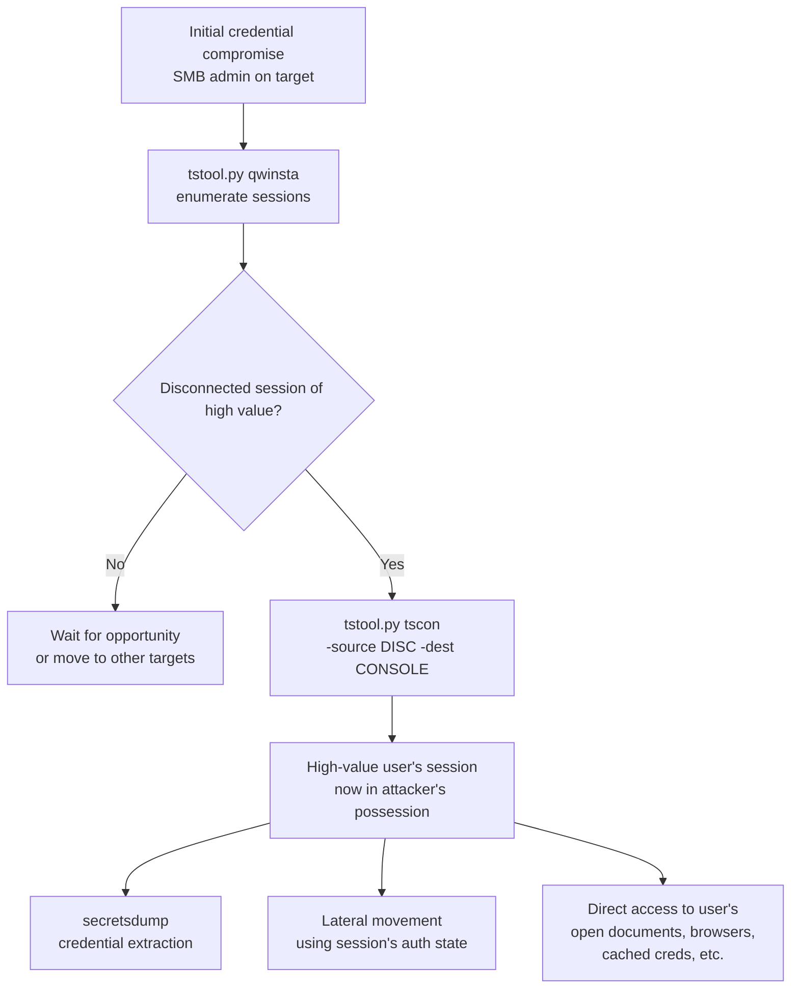
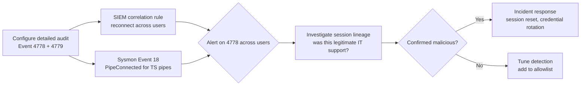

title: "tstool.py"
script: "examples/tstool.py"
category: "Remote System Interaction"
status: "Published"
protocols:
  - SMB
  - DCE/RPC
  - MS-TSTS
ms_specs:
  - MS-TSTS
mitre_techniques:
  - T1021.001
  - T1563.002
  - T1078
  - T1529
  - T1057
  - T1059
auth_types:
  - NTLM
  - Kerberos
  - Pass-the-Hash
tags:
  - impacket
  - impacket/examples
  - category/remote_system_interaction
  - status/published
  - protocol/smb
  - protocol/dcerpc
  - protocol/ms-tsts
  - ms-spec/ms-tsts
  - technique/terminal_services
  - technique/session_hijacking
  - technique/remote_shutdown
  - technique/process_management
  - technique/session_shadowing
  - technique/korznikov-tscon
  - mitre/T1021.001
  - mitre/T1563.002
  - mitre/T1078
  - mitre/T1529
  - mitre/T1057
  - mitre/T1059
aliases:
  - tstool
  - terminal-services-tool
  - rds-management
  - qwinsta-impacket
  - remote-shutdown-impacket
  - rds-shadow
  - rds-session-control


# tstool.py

> **One line summary:** Comprehensive Terminal Services and Remote Desktop Services management tool implementing the [MS-TSTS] (Terminal Services Terminal Server Runtime Interface Protocol) suite of DCE/RPC interfaces over SMB named pipes, providing a Linux-side equivalent of Windows' built in `qwinsta`, `tasklist`, `taskkill`, `tscon`, `tsdiscon`, `tslogoff`, `shutdown`, `msg`, and Remote Desktop Services session shadowing tooling, all in a single script that authenticates once and supports the full range of Impacket's authentication options (NTLM, Kerberos, pass-the-hash); authored by Alexander Korznikov (`@nopernik`), notably the same researcher who in March 2017 publicly disclosed the SYSTEM-level RDS session hijack via `tscon` that has been shipped as `tstool.py tscon` since the tool's introduction in Impacket 0.11.0 (August 2023); the script implements three [MS-TSTS] RPC interfaces (TermSrvEnumeration through the Local Session Manager pipe for `qwinsta`, RCMPublic through the termsrv pipe for session control and shutdown, SessEnvPublicRpc through the session environment pipe for shadowing and message-box delivery) and stitches them together behind a unified subcommand CLI; operationally one of the highest-leverage tools in Impacket because it consolidates session enumeration, process listing, process termination, session disconnect, session logoff, session takeover, message delivery, screen shadowing, and remote shutdown into a single authenticated SMB connection with no agent installation, no service modification, and no on-target file drops; **closes Remote System Interaction at 5 of 5 articles ✅, making it the 11th complete category for the wiki (85% complete by category)**.

| Field | Value |
|:---|:---|
| Script | `examples/tstool.py` |
| Category | Remote System Interaction |
| Status | Published |
| First appearance | Impacket 0.11.0 (August 2023) via the [MS-TSTS] library implementation contribution |
| Author | Alexander Korznikov (`@nopernik`) |
| Notable historical context | Same author publicly disclosed the SYSTEM-level RDS session hijack via `tscon` in March 2017; the technique is shipped as a tool subcommand here |
| Primary protocol | SMB transport for DCE/RPC; MS-TSTS interfaces over named pipes |
| Primary Microsoft specification | `[MS-TSTS]` Terminal Services Terminal Server Runtime Interface Protocol |
| MITRE ATT&CK techniques | T1021.001 Remote Services: Remote Desktop Protocol; T1563.002 Remote Service Session Hijacking: RDP Hijacking; T1078 Valid Accounts; T1529 System Shutdown/Reboot; T1057 Process Discovery; T1059 Command and Scripting Interpreter (msg subcommand can be used for social engineering) |
| Authentication | NTLM, Kerberos, Pass-the-Hash (all standard Impacket SMB auth modes) |
| Subcommands | `qwinsta`, `tasklist`, `taskkill`, `tscon`, `tsdiscon`, `tslogoff`, `shutdown`, `msg`, `shadow` |
| RPC interfaces used | TermSrvEnumeration (Local Session Manager), RCMPublic (Remote Connection Manager Public, termsrv), SessEnvPublicRpc (Session Environment Public RPC) |


## Prerequisites

This article assumes familiarity with:

- [`smbclient.py`](../05_smb_tools/smbclient.md) for SMB session and authentication mechanics. tstool.py uses the same SMBConnection class for transport.
- [`reg.py`](reg.md) and [`services.py`](services.md) as architectural siblings: all three are SMB-named-pipe DCE/RPC tools targeting specific Windows subsystems (registry, service control, terminal services).
- [`psexec.py`](../04_remote_execution/psexec.md) and [`wmiexec.py`](../04_remote_execution/wmiexec.md) for context on Windows remote execution. tstool.py is not an execution tool but several of its subcommands (`tscon` notably) provide functionality that can substitute for traditional remote execution in specific scenarios.
- Windows Terminal Services / Remote Desktop Services concepts: sessions, console session vs RDP session, session ID, session state (Active/Disconnected/Listen), Local Session Manager (LSM), Remote Connection Manager (termsrv).
- DCE/RPC over SMB named pipes: the transport pattern where MSRPC interfaces are accessed by binding to named pipes on the IPC$ share. Common pipes: `\PIPE\winreg` (registry), `\PIPE\svcctl` (services), `\PIPE\LSM_API_service` (Local Session Manager), and others.


## What it does

`tstool.py` provides a single script with multiple subcommands for managing Terminal Services and Remote Desktop Services state on a remote Windows host. The subcommands map directly to native Windows utilities that ship with the operating system but are not normally accessible from Linux without RD Session Host MMC or PowerShell remoting.

### Subcommand summary

```text
$ tstool.py -h
Terminal Services manipulation tool.

actions:
    qwinsta       Display information about Remote Desktop Services sessions
    tasklist      List running processes
    taskkill      Terminate tasks by process id (PID) or image name
    tscon         Attach a user session to a remote desktop session
    tsdiscon      Disconnect a Remote Desktop Services session
    tslogoff      Sign-out a Remote Desktop Services session
    shutdown      Remote shutdown
    msg           Send a message to Remote Desktop Services session (MSGBOX)
    shadow        Shadow a Remote Desktop Services session
```

Each subcommand maps to a Windows native equivalent:

| tstool.py subcommand | Windows native | What it does |
|:---|:---||
| `qwinsta` | `query session`, `qwinsta.exe` | Lists RDS sessions with username, session ID, session name, state |
| `tasklist` | `tasklist.exe` | Lists processes with PID, image name, session ID, memory usage |
| `taskkill` | `taskkill.exe` | Terminates processes by PID or image name |
| `tscon` | `tscon.exe` | Connects an existing session to a console or RDP session (the famous Korznikov hijack) |
| `tsdiscon` | `tsdiscon.exe` | Disconnects an RDS session (leaves processes running, user logged in) |
| `tslogoff` | `logoff.exe`, `logoff` | Signs a user off completely (terminates session, ends processes) |
| `shutdown` | `shutdown.exe /m` | Initiates shutdown, reboot, logoff, or poweroff |
| `msg` | `msg.exe` | Sends a popup message box to a session |
| `shadow` | `mstsc /shadow:N` | Shadow a session (view or interact with another user's RDS session) |

### Sample qwinsta output

```text
$ tstool.py ACME/admin:Passw0rd@10.10.10.50 qwinsta
Impacket v0.14.0.dev0 - Copyright Fortra, LLC and its affiliated companies
[*] Connecting to 10.10.10.50

State    Session     ID  Username     RemoteIp        ClientName
Active   Console      1  alice                                
Active   RDP-Tcp#23   2  bob          10.10.20.15     LAPTOP-BOB
Disc                  3  admin                                
Listen   RDP-Tcp                                              
```

This single output shows: alice logged into the physical console (Session 1), bob in an active RDP session from 10.10.20.15 (Session 2), and admin in a disconnected session (Session 3) that retains his processes and state. The disconnected admin session is the prime hijacking target for `tscon` (covered in detail below).

### Sample tasklist output

```text
$ tstool.py ACME/admin:Passw0rd@10.10.10.50 tasklist
Impacket v0.14.0.dev0 - Copyright Fortra, LLC and its affiliated companies
[*] Connecting to 10.10.10.50

PID    Session  Image                       Memory
4      0        System                      0 KB
408    0        smss.exe                    1284 KB
588    0        csrss.exe                   5912 KB
664    1        winlogon.exe                3236 KB
708    0        services.exe                7772 KB
716    0        lsass.exe                   12776 KB
...
2348   2        explorer.exe                34112 KB
2412   2        chrome.exe                  187344 KB
3764   3        cmd.exe                     2340 KB
3812   3        powershell.exe              68540 KB
```

Process listing with session correlation. The session ID column maps each process to the user session that owns it. Useful for understanding what a target user is actively running before committing to other actions.


## Why it exists

### The Linux side gap

Windows Terminal Services has been around since NT 4.0 Terminal Server Edition (1996). Tools like `qwinsta`, `query session`, `tscon`, `tsdiscon`, `logoff`, `tasklist`, `taskkill`, and `shutdown /m` have been shipped with Windows for decades. From a Windows administrator's machine, managing remote sessions is straightforward: open RD Session Host MMC, or use PowerShell remoting, or run the native command line tools with the `/server:NAME` parameter.

From a Linux operator's perspective, none of those options work natively. Options before tstool.py:

1. **Run native Windows tools through psexec.py / wmiexec.py**: heavy. Each invocation establishes a remote shell, runs one command, returns the output. Many round trips for what should be a few RPC calls.
2. **PowerShell over WSMan/WinRM via evil-winrm**: requires WinRM enabled (often disabled on hardened systems) and gives a shell, not direct RPC access.
3. **Raw DCE/RPC scripting against MS-TSTS interfaces**: requires writing custom Python against `impacket.dcerpc.v5.tsts` and understanding all the underlying RPC calls. Possible but tedious.
4. **WMI queries via wmiquery.py for session information**: works for `qwinsta`-equivalent queries but doesn't cover the session control or process termination operations.

tstool.py consolidates all of this into a single tool driven by subcommands. One authentication, multiple operations, native Windows protocol speaks at the wire level, no execution wrapping. It matches the operational shape of the native Windows tools as closely as possible while remaining a clean SMB/RPC client.

### The Korznikov tscon technique

Alexander Korznikov publicly disclosed in March 2017 a Windows behavior that has been present since the introduction of Terminal Services: a process running as `NT AUTHORITY\SYSTEM` can use `tscon` to attach any RDS session to any other session, with no authentication. The technique:

1. Attacker has SYSTEM-level access on a target Windows host (via local privilege escalation, by being a domain admin remoting in, etc.).
2. Some other user has a disconnected RDS session on the same host (very common: admin connected via RDP, closed the window without explicitly logging off, session goes to Disconnected state with all processes still running).
3. Attacker runs `tscon <disconnected_session_id> /dest:<attacker_session_id>` (or simply changes the destination to the console).
4. The disconnected session is moved to the attacker's session, fully active. The attacker now has the disconnected user's desktop, processes, network connections, mounted drives, browser sessions, RDP credentials cached in memory, and so on.

No password is required. SYSTEM has the right to do this. Microsoft's response has been that this is by design behavior and not a vulnerability per se: SYSTEM can do anything to user sessions, including connecting them. The mitigation is procedural (don't leave admin sessions disconnected) plus configurable (Group Policy "Set time limit for disconnected sessions" forces logoff after a defined period).

The technique is significant because it bypasses the entire credential layer. An attacker doesn't need the disconnected admin's password, NTLM hash, Kerberos ticket, or anything else: just SYSTEM rights on a host where the admin happens to have a disconnected session. In environments using multiple tenants or jump hosts where admins frequently disconnect from sessions to come back later, the technique is devastating.

tstool.py's `tscon` subcommand does this remotely: an attacker with SMB administrator credentials on a target can list sessions with `qwinsta`, identify a disconnected session belonging to a high value user, and call `tscon` to take it over. The remote case requires SMB admin rights on the target (sufficient privilege to access the LSM and termsrv RPC interfaces) which translates to SYSTEM equivalent on target via the standard SMB administrative shares model.

This single subcommand alone justifies tstool.py's existence in any offensive Linux toolkit.

### The msg subcommand and social engineering

The `msg` subcommand sends a Windows MessageBox to a remote session. The native `msg.exe` is restricted by default, often disabled on production systems, and frequently used by IT for benign communication ("Server reboot in 10 minutes please save your work"). tstool.py's `msg` works the same way: sends a styled popup with custom title and body to a target session.

Operationally:

- **Defensive**: legitimate IT communication, scheduled maintenance notification, security incident notification.
- **Offensive (social engineering primitive)**: send a message that prompts the user to take action - "Your session has expired, please re-enter your credentials at https://attacker-site/", "IT Support ticket #12345 requires your password verification at this link", etc. Combined with control over the link target (DNS hijacking, on-network phishing site), this is a credible phishing primitive that uses the trusted Windows MessageBox visual.

The defender perspective: any unexpected MessageBox from an unknown source on a Windows session warrants user suspicion. Awareness training should cover this specifically.

### The shadow subcommand and live monitoring

`shadow` is the equivalent of `mstsc /shadow:N`: live observation of another user's RDS session. Read only screen mirror by default; with control if Group Policy "Set rules for remote control of Remote Desktop Services user sessions" is configured to allow it.

Operational uses:

- **IT support legitimate use**: helping a user troubleshoot by watching their screen.
- **Defensive incident response**: live observation of a suspected compromised account.
- **Offensive surveillance**: silent monitoring of high value targets to capture sensitive operations, credential entries, document access, etc. Combined with persistence elsewhere over the longer term, shadow gives complete visibility into an admin's interactive activities.

By Group Policy default, shadowing requires explicit consent prompt to the target user. Admins can configure "View session without permission" or "Take Control without permission" via Group Policy, which removes the prompt. Hardened environments leave the consent prompt in place; less hardened environments often disable it for IT support convenience, which makes silent shadowing possible.


## Protocol theory

### MS-TSTS overview

`[MS-TSTS]` Terminal Services Terminal Server Runtime Interface Protocol is Microsoft's specification for the DCE/RPC interfaces that manage Terminal Services / Remote Desktop Services state. The specification defines several distinct RPC interfaces, each addressing a different subsystem of TS/RDS management. tstool.py uses three of them.

### TermSrvEnumeration interface (Local Session Manager)

**RPC interface UUID**: `5ca4a760-ebb1-11cf-8611-00a0245420ed` (LSM API)
**Named pipe**: `\PIPE\LSM_API_service`

The Local Session Manager (LSM) handles session enumeration and basic queries. tstool.py uses this interface for the `qwinsta` subcommand. Key RPC methods:

- `RpcOpenEnum`: opens an enumeration handle to iterate sessions.
- `RpcGetEnumResult`: retrieves enumeration entries.
- `RpcCloseEnum`: closes the enumeration handle.
- `RpcGetSessionInformation`: retrieves detailed information for a specific session ID (username, domain, session name, state, client IP, client name, color depth, etc.).

The information returned for each session includes:

- Session ID (integer, 0 = services session, 1+ = user sessions)
- Session name (Console, RDP-Tcp#N, etc.)
- Username + domain
- Session state (Active, Disconnected, Listen, Connecting, Connected, Idle, Down, Reset)
- Client IP and hostname (for RDP sessions)
- Client display capabilities

### RCMPublic interface (Remote Connection Manager)

**RPC interface UUID**: `bde95fdf-eee0-45de-9e12-e5a61cd0d4fe` (TermSrv RCM)
**Named pipe**: `\PIPE\TermSrv_API_service`

The Remote Connection Manager handles session control operations: connection, disconnection, logoff, shutdown. tstool.py uses this interface for `tscon`, `tsdiscon`, `tslogoff`, `shutdown`, `tasklist`, and `taskkill`. Key RPC methods:

- `RpcConnect`: connects a session (the `tscon` operation, including the famous Korznikov hijack).
- `RpcDisconnect`: disconnects a session.
- `RpcLogoff`: logs off a user from a session.
- `RpcShutdownSystem`: initiates system shutdown with various flags (shutdown, reboot, logoff, poweroff).
- `RpcGetAllProcesses`: enumerates all processes (the `tasklist` operation).
- `RpcTerminateProcess`: terminates a process by PID (the `taskkill` operation).

Each RPC call requires appropriate access on the target. For session control operations, the caller needs administrative rights or specific WTS permissions on the target session. SMB administrator rights on the target host generally satisfy this.

### SessEnvPublicRpc interface (Session Environment)

**RPC interface UUID**: `1257b580-ce2f-4109-82d6-a9459d0bf6bc` (Session Environment Public)
**Named pipe**: `\PIPE\SessEnvPublicRpc`

The Session Environment interface handles session display, message delivery, and shadowing. tstool.py uses this interface for `msg` and `shadow`. Key RPC methods:

- `RpcShowMessageBox` (or `WinStationSendMessage` analog): sends a MessageBox to a session.
- `RpcShadow2`: initiates session shadowing with control flags (view only or interactive) and permission flags (with prompt or without).

The shadow operation is somewhat unusual in DCE/RPC terms because it establishes an additional control channel resembling RDP rather than just returning data. tstool.py's shadow implementation initiates the shadow request and the target Windows handles establishing the actual screen mirror channel.

### Pipe binding sequence

For each subcommand, tstool.py:

1. Authenticates to the SMB session (NTLM, Kerberos, or pass-the-hash).
2. Connects to IPC$ share.
3. Binds to the appropriate named pipe for the subcommand:
   - `qwinsta` → `\PIPE\LSM_API_service` (TermSrvEnumeration)
   - `tasklist`, `taskkill`, `tscon`, `tsdiscon`, `tslogoff`, `shutdown` → `\PIPE\TermSrv_API_service` (RCMPublic)
   - `msg`, `shadow` → `\PIPE\SessEnvPublicRpc` (SessEnvPublicRpc)
4. Issues the appropriate RPC call(s).
5. Parses and prints the response.
6. Disconnects.

Multiple subcommands in sequence (e.g., `qwinsta` then `tscon`) require multiple invocations of tstool.py, each with its own SMB authentication. The tool does not persist state between invocations.


## How the tool works internally

### Imports

```python
import argparse
import codecs
import logging
import sys
import xml.etree.ElementTree as ET
from struct import unpack

from impacket import version
from impacket.examples import logger
from impacket.examples.utils import parse_target
from impacket.smbconnection import SMBConnection
from impacket.dcerpc.v5 import tsts as TSTS
from impacket.dcerpc.v5.dtypes import MAXIMUM_ALLOWED
```

The key import is `impacket.dcerpc.v5.tsts as TSTS`. This module contains the protocol implementation contributed alongside tstool.py in Impacket 0.11.0. It exposes context manager classes for each of the three RPC interfaces: `TSTS.TermSrvEnumeration`, `TSTS.RCMPublic`, and `TSTS.SessEnvPublicRpc`.

### Architectural pattern

The tool follows a clear pattern for each subcommand. Pseudocode for the `qwinsta` operation:

```python
def do_qwinsta(self):
    with TSTS.TermSrvEnumeration(self.__smbConnection, self.__options.target_ip,
                                  self.__doKerberos) as lsm:
        sessions = lsm.hRpcOpenEnum()
        for session in sessions:
            details = lsm.hRpcGetSessionInformation(session.SessionId)
            self.print_session_info(details)
```

Pseudocode for `tscon`:

```python
def do_tscon(self):
    with TSTS.RCMPublic(self.__smbConnection, self.__options.target_ip,
                        self.__doKerberos) as termsrv:
        termsrv.hRpcConnect(
            source_session_id=self.__options.source,
            target_session_id=self.__options.dest,
            password=self.__options.password or ''
        )
```

Pseudocode for `shadow`:

```python
def do_shadow(self):
    with TSTS.SessEnvPublicRpc(self.__smbConnection, self.__options.target_ip,
                                self.__doKerberos) as sErpc:
        response = sErpc.hRpcShadow2(
            session_id=self.__options.session,
            control=self.__options.control,
            permission=self.__options.perm,
            buffer_size=8192
        )
```

The context manager pattern handles bind and unbind cleanly. Each method on the context manager wraps a specific RPC call from MS-TSTS.

### Main flow

```python
class TSHandler:
    def __init__(self, username, password, domain, options):
        self.__username = username
        self.__password = password
        self.__domain = domain
        self.__lmhash = ''
        self.__nthash = ''
        self.__aesKey = options.aesKey
        self.__doKerberos = options.k
        self.__kdcHost = options.dc_ip
        self.__action = options.action
        self.__options = options
        
        if options.hashes:
            self.__lmhash, self.__nthash = options.hashes.split(':')
    
    def run(self, remoteName, remoteHost):
        self.__smbConnection = SMBConnection(remoteName, remoteHost,
                                              sess_port=int(self.__options.port))
        if self.__doKerberos:
            self.__smbConnection.kerberosLogin(self.__username, self.__password,
                                                self.__domain, self.__lmhash,
                                                self.__nthash, self.__aesKey,
                                                self.__kdcHost)
        else:
            self.__smbConnection.login(self.__username, self.__password,
                                        self.__domain, self.__lmhash, self.__nthash)
        
        # Dispatch to subcommand handler
        getattr(self, 'do_' + self.__action)()
```

Pseudocode reflecting the actual class structure. The single SMBConnection authentication is reused for whichever subcommand the operator selected, and the dispatch happens via Python's `getattr` looking up `do_<subcommand>` methods.

### What the tool does NOT do

- Does NOT install any agent or service on the target. Pure RPC interaction.
- Does NOT drop files. Nothing is written to disk.
- Does NOT execute commands directly. None of the subcommands run cmd.exe or powershell.exe on the target. (The `tscon` hijack achieves something similar to execution by giving access to an existing session with all its state, but no new processes are spawned.)
- Does NOT establish persistent shells. Each invocation is one shot.
- Does NOT support pipelining multiple operations in a single SMB session. Each subcommand is one invocation.
- Does NOT bypass authentication. SMB authentication required for all subcommands.
- Does NOT bypass authorization. The authenticated user must have appropriate rights on the target session for each operation.
- Does NOT work against non-Terminal-Services-enabled hosts. Most modern Windows ships with Terminal Services capability, but explicitly stripped or hardened images may not have all the RPC interfaces available.
- Does NOT emit screen content from `shadow` to stdout. Shadow initiates a shadow session that requires a separate RDP connection to actually view.


## Practical usage

### Listing sessions on a remote host

```bash
tstool.py ACME/admin:AdminPass@10.10.10.50 qwinsta
```

The most common starting point. Identifies who is logged in, in what state, from where. Output above. Look for:

- Disconnected sessions of users with high value (potential `tscon` hijack targets).
- Active console sessions (someone is physically at the machine or via an RDP attached to console).
- Multiple sessions for the same user (unusual on workstations, common on terminal servers).

Verbose mode adds more session detail:

```bash
tstool.py ACME/admin:AdminPass@10.10.10.50 qwinsta -v
```

### Listing remote processes

```bash
tstool.py ACME/admin:AdminPass@10.10.10.50 tasklist
```

Process listing with session correlation. Useful for:

- Identifying what a target user is running.
- Finding security tooling (agents that an attacker would want to terminate or avoid alerting).
- Mapping process dependencies before terminating something.

### Terminating a process by PID

```bash
tstool.py ACME/admin:AdminPass@10.10.10.50 taskkill -pid 4567
```

By image name:

```bash
tstool.py ACME/admin:AdminPass@10.10.10.50 taskkill -name notepad.exe
```

Operational notes:

- Kills exactly the matching process. No tree-kill (parent + children).
- Standard Windows process termination. Programs with crash handlers may capture and log the termination.
- Some processes (System, csrss, lsass, smss) are protected and cannot be terminated via this RPC.

### The Korznikov tscon hijack

The signature use case. Step by step:

```bash
# Step 1: identify a disconnected session of a user with high value
tstool.py ACME/admin:AdminPass@10.10.10.50 qwinsta
# Output shows: Session 3, "Disc", username "domainadmin"

# Step 2: identify an active session to hijack TO (typically your own console session)
# In this case attacker's session is Session 1 on console

# Step 3: execute the hijack
tstool.py ACME/admin:AdminPass@10.10.10.50 tscon -source 3 -dest console
```

After the hijack:

- The "domainadmin" user's session (Session 3) is now connected to the console.
- All of domainadmin's processes, mapped drives, browser sessions, RDP credentials cached in memory, etc. are accessible to whoever is at the console (or in the destination RDP session).
- No password was required.

Caveats and operational considerations:

- The attacker needs SMB administrator rights on the target host (to call the RCMPublic RpcConnect method with cross-session arguments).
- The destination session must be one the attacker can access (the attacker's own console session, or an RDP session the attacker is in).
- If the target user's session was force logged off via Group Policy "Set time limit for disconnected sessions", there is no disconnected session to hijack.
- The hijack is logged: Event 4779 (session disconnected) on the source session and Event 4778 (session reconnected) on the destination. Investigators looking for this specific pattern find it.
- Session reconnection events are not always reviewed in default SOC playbooks because they're commonly generated by legitimate user RDP reconnects. The signal-to-noise ratio favors the attacker unless the SOC explicitly hunts for the cross-session reconnect pattern.

### Disconnecting a session

```bash
tstool.py ACME/admin:AdminPass@10.10.10.50 tsdiscon -session 2
```

Disconnects session 2. The user's processes continue running; the user can reconnect later. Useful operationally for:

- Forcing a hijack opportunity: if a target user is in an active session, disconnecting them creates a disconnected session that becomes a tscon target. (This is more aggressive than waiting for the user to disconnect themselves.)
- Defensive: removing an active session of a suspected compromised account without terminating its processes (preserves forensic state for later analysis).

### Logging off a session

```bash
tstool.py ACME/admin:AdminPass@10.10.10.50 tslogoff -session 2
```

Fully signs off session 2. Processes terminate, session ends. Use cases:

- Defensive: end a compromised session completely.
- Offensive: cover tracks by ending sessions that might log unusual activity, or to clear access for fresh logon.

### Remote shutdown

```bash
# Reboot
tstool.py ACME/admin:AdminPass@10.10.10.50 shutdown -reboot

# Shutdown
tstool.py ACME/admin:AdminPass@10.10.10.50 shutdown -shutdown

# Logoff console user
tstool.py ACME/admin:AdminPass@10.10.10.50 shutdown -logoff

# Power off
tstool.py ACME/admin:AdminPass@10.10.10.50 shutdown -poweroff
```

Operational uses:

- **Defensive**: emergency shutdown of a compromised host (preserves forensic evidence on disk; running malware terminates).
- **Maintenance**: scheduled reboots for patching.
- **Offensive (rare)**: forcing reboot of a target to get fresh credential cache state, to trigger autostart payloads, or to disrupt ongoing operations.

### Sending a message box

```bash
tstool.py ACME/admin:AdminPass@10.10.10.50 msg \
    -session 2 \
    -title "IT Notice" \
    -text "System reboot in 10 minutes - please save your work"
```

Simple use. Operational caveats:

- The message appears as a Windows MessageBox with the configured title and text. Visual matches what users expect from legitimate IT messaging.
- For social engineering, the title and text fields can be crafted to mimic any internal IT communication style. Combined with a plausible scenario ("Your password expires today, click here to update"), this is an effective phishing primitive that operates inside the network.
- Defenders should treat unexpected MessageBox dialogs with skepticism, including verifying the sender through an independent channel before complying with any requested action.

### Shadowing a session

```bash
tstool.py ACME/admin:AdminPass@10.10.10.50 shadow -session 2
```

Initiates shadow of session 2. Behavior depends on Group Policy:

- Default config: target user receives consent prompt; if they accept, shadow proceeds.
- "View session without permission" config: silent view only shadow.
- "Take Control without permission" config: silent interactive shadow (attacker can move mouse and type).

The actual shadow display requires connecting via mstsc.exe with `/shadow:N` from a Windows host. End to end shadow purely on Linux is not supported because the shadow display channel uses RDP graphics primitives.

### Pass the hash variant

```bash
tstool.py -hashes :NTHASH ACME/admin@10.10.10.50 qwinsta
```

Standard Impacket pass-the-hash. Works for all subcommands.

### Kerberos authentication

```bash
tstool.py -k -no-pass ACME/admin@dc01.acme.local qwinsta
```

Requires KRB5CCNAME pointing to a valid ccache.

### Key flags

| Flag | Meaning |
|:---|:---|
| `target` (positional) | `[[domain/]username[:password]@]<host>` standard Impacket target |
| `subcommand` | One of: qwinsta, tasklist, taskkill, tscon, tsdiscon, tslogoff, shutdown, msg, shadow |
| `-hashes LMHASH:NTHASH` | NT hash auth |
| `-k` | Kerberos auth |
| `-no-pass` | Skip password prompt |
| `-aesKey` | AES key for Kerberos |
| `-dc-ip` | Specify KDC for Kerberos |
| `-target-ip` | Specify target IP if differing from target name |
| `-port` | SMB port (default 445) |
| `-debug` | Verbose debug output |
| `-ts` | Timestamp log lines |

Subcommand-specific flags:

| Subcommand | Notable flags |
|:---|:---|
| `qwinsta` | `-v` (verbose) |
| `taskkill` | `-pid <id>`, `-name <imagename>` |
| `tscon` | `-source <id>`, `-dest <id_or_console>` |
| `tsdiscon` | `-session <id>` |
| `tslogoff` | `-session <id>` |
| `shutdown` | `-shutdown`, `-reboot`, `-poweroff`, `-logoff` (one required) |
| `msg` | `-session <id>`, `-title <text>`, `-text <text>` |
| `shadow` | `-session <id>`, possibly control/permission flags |


## What it looks like on the wire

### SMB session establishment

Standard SMB negotiate, session setup with NTLM or Kerberos, tree connect to IPC$. Identical to other Impacket SMB tools at this layer.

### Named pipe binding

For `qwinsta`, the named pipe bound is `\PIPE\LSM_API_service`. Wireshark filter:

```text
smb2.filename == "LSM_API_service"
```

For `tscon`/`tsdiscon`/`tslogoff`/`shutdown`/`tasklist`/`taskkill`:

```text
smb2.filename == "TermSrv_API_service"
```

For `msg`/`shadow`:

```text
smb2.filename == "SessEnvPublicRpc"
```

The named pipe choice is the most reliable signal on the wire for which subcommand is in use. Network defenders watching SMB traffic can correlate pipe names to operation type.

### DCE/RPC bind

After pipe open, a standard DCE/RPC bind exchange selects the appropriate interface UUID:

- LSM_API_service binds to UUID `5ca4a760-ebb1-11cf-8611-00a0245420ed`
- TermSrv_API_service binds to UUID `bde95fdf-eee0-45de-9e12-e5a61cd0d4fe`
- SessEnvPublicRpc binds to UUID `1257b580-ce2f-4109-82d6-a9459d0bf6bc`

Wireshark filter for the bind exchange:

```text
dcerpc.cn_pkt_type == 11   # Bind
dcerpc.cn_iface == "5ca4a760-ebb1-11cf-8611-00a0245420ed"
```

### RPC method calls

After bind, specific RPC method numbers (opnums) identify the operation. Examples (opnum values vary by interface revision):

- `RpcConnect` (the tscon operation): opnum 19 in TermSrv_API_service in some versions
- `RpcDisconnect`: opnum 20
- `RpcLogoff`: opnum 21
- `RpcShutdownSystem`: opnum 22
- `RpcGetAllProcesses`: opnum 11
- `RpcTerminateProcess`: opnum 12
- `RpcShadow2`: opnum varies in SessEnvPublicRpc

Wireshark dissects MS-TSTS partially in newer versions. Older Wireshark versions show generic DCE/RPC frames without method name decoding for these interfaces.

### SMB session lifecycle

Each tstool.py invocation is one SMB session: connect, authenticate, bind named pipe, make RPC calls, disconnect. Total wire time is typically under 2 seconds. Distinctive shorter than persistent shell sessions (psexec, wmiexec) which maintain connections for the duration of operator interaction.


## What it looks like in logs

### Windows Security event log

- **Event 4624** (logon): standard SMB session logon. Logon Type 3 (Network).
- **Event 4634** (logoff): when the SMB session disconnects.
- **Event 4625** (failed logon): if authentication fails.
- **Event 4778** (session reconnected): fires on `tscon` operations. Specifically logs the session reconnection with source and destination IDs. KEY EVENT for tscon hijack detection.
- **Event 4779** (session disconnected): fires on `tsdiscon`, `tslogoff`, and as a side effect of `tscon` (the source session is effectively disconnected when reconnected to destination).
- **Event 4647** (logoff initiated by user): fires on `tslogoff`.
- **Event 1074** (system shutdown initiated): fires on `shutdown` subcommand. Includes the user account that initiated the shutdown.

The Event 4778 + Event 4779 pair is the signature of a `tscon` hijack. An investigator seeing 4779 for a high-value user followed quickly by 4778 with the same user but different session details should suspect cross-session connection.

### Application/Service event logs

- **TerminalServices-LocalSessionManager / Operational log**: detailed session events including connect, disconnect, reconnect, logoff. More detail than Security log. Event IDs 21, 22, 23, 24, 25, 39, 40 cover various session state transitions.
- **TerminalServices-RemoteConnectionManager / Operational log**: connection establishment events. Event 1149 (User authentication succeeded) is the "user connected via RDP" signal.

### Network signals

- SMB connection on TCP 445.
- IPC$ tree connect.
- One of three named pipe opens: LSM_API_service, TermSrv_API_service, or SessEnvPublicRpc.
- Short-lived connection: open, RPC calls, close. No persistent traffic.

### Sigma rule example: tscon hijack detection

```yaml
title: Possible Cross-Session RDS Hijack via tscon
logsource:
  product: windows
  service: security
detection:
  reconnect:
    EventID: 4778
  selection_user_mismatch:
    SubjectUserName|expected: '%TargetUserName%'   # the principal initiating the reconnect
                                                    # should normally match the session user
                                                    # mismatch indicates reconnect across users
  condition: reconnect and not selection_user_mismatch
level: high
```

High severity. Cross-session reconnects (one user reconnecting another user's session) are unusual outside of legitimate IT remote support scenarios.

### Sigma rule example: remote shutdown via tstool

```yaml
title: Remote System Shutdown via SMB Named Pipe
logsource:
  product: windows
  service: system
detection:
  shutdown_initiated:
    EventID: 1074
  remote_initiator:
    SubjectLogonId|not_in: ['0x3e7']    # excludes SYSTEM-initiated local shutdowns
  condition: shutdown_initiated and remote_initiator
level: medium
```

Medium severity. Most environments have legitimate remote shutdown patterns (patch management, IT operations) so volume is expected. Anomalies in source account or timing are the actual signals.


## Detection and defense

### Detection approach

- **Event 4778 monitoring with cross-session correlation**: alert on session reconnects where the reconnecting subject user differs from the session's original user. This is the highest-value detection for tscon hijacks.
- **Named pipe access monitoring**: SMB Event 5145 for accesses to LSM_API_service, TermSrv_API_service, and SessEnvPublicRpc pipes. Requires Detailed File Share auditing.
- **Sysmon Event 18** (PipeConnected): catches named pipe accesses on both sides of the connection. Highly effective when configured to monitor terminal services pipes.
- **EDR behavioral detection**: most modern EDR products flag the cross-session reconnect pattern as suspicious.
- **Honey sessions**: configure decoy disconnected sessions for accounts with high privilege on key hosts. Any tscon attempt against the honey session is a detection of high confidence.

### Preventive controls

- **Session disconnect timeout via Group Policy**: Computer Configuration > Administrative Templates > Windows Components > Remote Desktop Services > Remote Desktop Session Host > Session Time Limits > "Set time limit for disconnected sessions". Forces disconnected sessions to logoff after a configured period (recommend 1 hour or less for admin sessions). This is the primary mitigation for the Korznikov tscon technique because it eliminates the disconnected session window.
- **Restrict SMB administrative access**: tstool.py requires SMB administrator rights on targets. Restrict membership in local Administrators groups, use LAPS for local admin password rotation, monitor for use of administrative credentials.
- **Disable Terminal Services where unneeded**: workstations and member servers that don't host RDP sessions can have RDS removed entirely, eliminating the attack surface.
- **Group Policy for shadow consent**: ensure "Set rules for remote control of Remote Desktop Services user sessions" is configured to require user consent for both view and control. Prevents silent shadowing.
- **MFA for administrative SMB access**: combined with smart cards or other MFA factors, this raises the bar significantly for abuse in the tstool.py family even if credentials are compromised.
- **Restrict NTLM**: Group Policy "Network security: Restrict NTLM" reduces the attack surface for pass-the-hash variants of tstool.py usage.

### What tstool.py does NOT enable

- Does NOT achieve initial access. Requires existing SMB administrator credentials.
- Does NOT escalate privilege within a session (tscon gives access to a different session at its existing privilege level; doesn't grant higher privilege than the connected user already had).
- Does NOT bypass authentication. Standard SMB auth required.
- Does NOT install persistent backdoors. Each operation is single shot.
- Does NOT exfiltrate data on its own. The shadow subcommand initiates a viewing channel but data exfiltration would require separate tooling.

### What tstool.py CAN enable

- **Domain admin session hijacking** via tscon when domain admins disconnect from RDP sessions on jump hosts or terminal servers.
- **Disruption** via shutdown subcommand (denial of service against a single host).
- **Forensic disruption** via tslogoff (terminating a session that might contain volatile evidence).
- **Social engineering** via msg subcommand (visually authentic Windows MessageBox phishing).
- **Live monitoring** via shadow subcommand (silent screen viewing if Group Policy permits).
- **Process termination** of security tooling via taskkill (degrading endpoint defenses before further actions).

The combination is what makes tstool.py operationally significant: not any single subcommand but the consolidated capability to enumerate, control, and observe terminal services state from a single authenticated SMB session.


## Related tools and attack chains

tstool.py **closes Remote System Interaction at 5 of 5 articles ✅, making it the 11th complete category for the wiki (85% complete by category)**.

### Related Impacket tools

- [`reg.py`](reg.md) and [`services.py`](services.md) are architectural siblings: SMB-named-pipe DCE/RPC tools targeting specific Windows subsystems. Same authentication model, similar operational footprint.
- [`atexec.py`](../04_remote_execution/atexec.md) is the Task Scheduler equivalent: SMB-named-pipe DCE/RPC tool for MS-TSCH. Conceptually parallel to tstool.py for a different subsystem.
- [`psexec.py`](../04_remote_execution/psexec.md), [`wmiexec.py`](../04_remote_execution/wmiexec.md), and [`smbexec.py`](../04_remote_execution/smbexec.md) are the heavyweight execution tools that tstool.py partially substitutes for. tscon in particular gives access to an existing session with its full state, often more useful than spawning a new cmd.exe.
- [`secretsdump.py`](../03_credential_access/secretsdump.md) is the typical follow up after gaining domain admin access via tscon hijack: dump credentials from the host of the session now controlled.
- [`smbclient.py`](../05_smb_tools/smbclient.md) provides the underlying SMB transport. tstool.py uses the same SMBConnection class.

### External alternatives

- **Native Windows tools (`qwinsta.exe`, `tscon.exe`, `tsdiscon.exe`, `logoff.exe`, `tasklist.exe`, `taskkill.exe`, `shutdown.exe`, `msg.exe`)**: must be run from a Windows host with appropriate access. Same RPC interfaces underneath.
- **PowerShell `Get-RDUserSession`, `Disconnect-RDUser`, `Stop-Computer -ComputerName`**: PowerShell cmdlets covering similar functionality. Require WinRM or local execution.
- **NetExec `--shares`, `--rdp`, RDP-related modules**: NetExec covers some terminal services functionality though not as comprehensively as tstool.py.
- **CrackMapExec (predecessor of NetExec)**: similar RDS-related modules, less comprehensive than tstool.py for the specific session control operations.
- **`@nopernik`'s original demonstration code from 2017**: the public disclosure included Windows side proof of concept code for tscon hijacking. tstool.py's `tscon` subcommand is the Linux equivalent that works across platforms.
- **Cobalt Strike's `pivot listener` + `stage`**: not a direct alternative but a different approach to the same general problem (gaining session access on a remote host).

For Linux operators specifically, tstool.py is the canonical tool for terminal services manipulation. Nothing else in the open source landscape covers the same breadth of operations from Linux.

### Korznikov tscon hijack chain



The Korznikov pattern is the use of tstool.py with the highest leverage. Worth detailed coverage in any operator training.

### Defensive monitoring chain



Same tool space, defensive perspective. The specific detection target is the 4778 pattern across users that distinguishes tscon hijacks from legitimate user reconnects.

### Combined operational use

A typical engagement uses tstool.py at multiple stages:

1. **Discovery**: `qwinsta` against compromised hosts to enumerate sessions and identify targets of high value.
2. **Process awareness**: `tasklist` to understand running tools and security agents on targets.
3. **Capability disruption**: `taskkill` against security tooling (only when operationally necessary; noisy).
4. **Privilege escalation**: `tscon` against disconnected admin sessions when available.
5. **Reconnaissance**: `shadow` of sessions belonging to targets of high value to capture sensitive operations.
6. **Coordination**: `msg` for social engineering when operationally appropriate.
7. **Disruption**: `shutdown` rarely, when forcing reboots is required.

tstool.py is unusual in Impacket for combining so many capabilities into one tool. Most Impacket scripts have a single primary function; tstool.py is more like a Swiss Army knife for terminal services operations.


## Further reading

- **Impacket tstool.py source** at `https://github.com/fortra/impacket/blob/master/examples/tstool.py`. Canonical implementation.
- **Impacket tsts module source** at `https://github.com/fortra/impacket/blob/master/impacket/dcerpc/v5/tsts.py`. The MS-TSTS protocol implementation that tstool.py uses.
- **Impacket 0.11.0 release notes** at `https://github.com/fortra/impacket/releases/tag/impacket_0_11_0`. Context for the introduction of MS-TSTS support.
- **`[MS-TSTS]` Terminal Services Terminal Server Runtime Interface Protocol specification** at `https://learn.microsoft.com/en-us/openspecs/windows_protocols/ms-tsts/`. Canonical Microsoft specification including all RPC interface definitions, methods, and structures.
- **Alexander Korznikov's original 2017 disclosure**: search for "Korznikov tscon SYSTEM hijack" for the original blog post and demonstration video. The technique has been documented extensively in security research since.
- **Microsoft "Remote Desktop Services" documentation** at `https://learn.microsoft.com/en-us/windows-server/remote/remote-desktop-services/welcome-to-rds`. RDS architecture overview useful for context.
- **Microsoft Group Policy reference for RDS settings** including session time limits, shadow control, and connection policies.
- **MITRE ATT&CK T1563.002 Remote Service Session Hijacking: RDP Hijacking** at `https://attack.mitre.org/techniques/T1563/002/`. The specific MITRE technique covering tscon hijack.
- **MITRE ATT&CK T1021.001 Remote Services: Remote Desktop Protocol** at `https://attack.mitre.org/techniques/T1021/001/`. Broader RDP usage technique.
- **MITRE ATT&CK T1529 System Shutdown/Reboot** at `https://attack.mitre.org/techniques/T1529/`.
- **Sysmon documentation for Event 18 PipeConnected** for named pipe monitoring configuration.

If you want to internalize tstool.py, the productive exercise has multiple parts because the tool has multiple subcommands. In a lab with a Windows server and at least two user accounts: First, run `qwinsta` from Linux against the server and observe the session listing. RDP into the server as a non-admin user, observe the new session, then disconnect (close window without logoff). Run `qwinsta` again and observe the session in Disc state. Second, from another machine RDP in as admin, run `tstool.py tscon -source <discsession> -dest console`, observe that the disconnected user's session moves to the console - check Event 4778 in Security log to see the reconnect logged. Third, with two users in active sessions, run `msg -session N -title "Test" -text "hello"` and observe the MessageBox appear on the target session. Fourth, with two active sessions, run `shadow -session N` and observe the consent prompt appearing on the target session by default; if you've configured shadow without consent via Group Policy, observe silent shadow initiation. Fifth, run `shutdown -reboot` and observe the target shut down (be sure this is a lab system you can afford to reboot). The five exercises cover the operational envelope: enumeration, hijack, social engineering primitive, surveillance primitive, and disruption. After this exercise, the breadth of tstool.py's capability and the importance of the underlying [MS-TSTS] interfaces become concrete rather than abstract. The Korznikov tscon hijack in particular - the famous SYSTEM-level RDS session takeover that has been a known issue since at least 2017 - becomes visceral when seen working in person rather than just read about in advisories.
