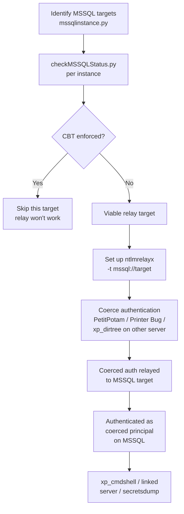
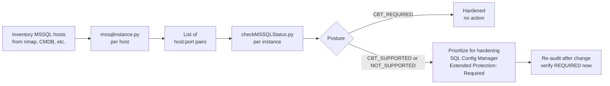

title: "checkMSSQLStatus.py"
script: "examples/checkMSSQLStatus.py"
category: "MSSQL"
status: "Published"
protocols:
  - TDS
  - TLS
  - MC-SQLR
ms_specs:
  - MS-TDS
  - MC-SQLR
mitre_techniques:
  - T1040
  - T1557.001
auth_types: []
tags:
  - impacket
  - impacket/examples
  - category/mssql
  - status/published
  - protocol/tds
  - protocol/tls
  - ms-spec/ms-tds
  - technique/encryption_audit
  - technique/cbt_check
  - technique/relay_defense
  - mitre/T1040
  - mitre/T1557.001
aliases:
  - checkMSSQLStatus
  - mssql-status
  - mssql-encryption-audit
  - mssql-cbt-check


# checkMSSQLStatus.py

> **One line summary:** Unauthenticated TDS probe tool that queries an MSSQL instance's PRE-LOGIN response to determine whether the server requires TLS encryption for client connections and whether it enforces Channel Binding Token (CBT) validation during NTLM authentication, reporting the answers as a posture assessment useful for hardening reviews and for identifying MSSQL instances that are viable NTLM relay targets; new in Impacket 0.13 (October 2025) via PR #1986 as part of the broader TDS handshake rework that also fixed mssqlclient.py's encryption and CBT requirements handling; architecturally the MSSQL counterpart to [`CheckLDAPStatus.py`](../01_recon_and_enumeration/samrdump.md) which does the same job for LDAP (PR #1977); operationally valuable because MSSQL servers that accept NTLM authentication without CBT are relay targets for attackers who can coerce authentication from accounts with high privilege (via SQL Server service account coercion through `xp_dirtree` UNC paths, Printer Bug, PetitPotam, or similar coercion primitives), and the countermeasure is Extended Protection for Authentication (EPA) with CBT enforcement, so knowing which MSSQL servers in an estate are unprotected is essential both for attackers choosing relay targets and for defenders prioritizing hardening; **completes MSSQL at 3 of 3 articles ✅, making it the 10th complete category for the wiki (77% complete by category)**.

| Field | Value |
|:---|:---|
| Script | `examples/checkMSSQLStatus.py` |
| Category | MSSQL |
| Status | Published |
| First appearance | Impacket 0.13 (October 2025) via PR #1986 |
| Companion tool | `CheckLDAPStatus.py` (PR #1977, same release, same architectural pattern) |
| Primary protocols | TDS PRE-LOGIN (MSSQL-specific handshake), TLS (for encryption negotiation), NTLM (for CBT validation when testing authentication flow) |
| Primary Microsoft specifications | `[MS-TDS]` Tabular Data Stream Protocol, `[MC-SQLR]` SQL Server Resolution Protocol |
| MITRE ATT&CK techniques | T1040 Network Sniffing (relevant because non-TLS MSSQL traffic is sniffable), T1557.001 Adversary-in-the-Middle: LLMNR/NBT-NS Poisoning and SMB Relay (checkMSSQLStatus identifies MSSQL relay viability) |
| Authentication | None required for the check itself (TDS PRE-LOGIN is unauthenticated) |
| Exposed information | Encryption requirement (ENCRYPT_OFF / ENCRYPT_ON / ENCRYPT_NOT_SUP / ENCRYPT_REQ), CBT requirement from NTLM challenge flags |


## Prerequisites

This article assumes familiarity with:

- [`mssqlclient.py`](mssqlclient.md) for TDS fundamentals, the PRE-LOGIN exchange, and the MSSQL NTLM authentication flow.
- [`mssqlinstance.py`](mssqlinstance.md) for MSSQL instance discovery context. checkMSSQLStatus is typically run per instance after mssqlinstance identifies them.
- [`ntlmrelayx.py`](../06_relay_attacks/ntlmrelayx.md) for understanding why CBT enforcement matters. MSSQL is an ntlmrelayx attack target; checkMSSQLStatus identifies which MSSQL servers are vulnerable to relay.
- Understanding of Extended Protection for Authentication (EPA) and Channel Binding Tokens. These are Microsoft's countermeasures against NTLM relay; MSSQL has had CBT support for years but enforcement is often not enabled by default.


## What it does

`checkMSSQLStatus.py` probes an MSSQL instance and reports two properties:

1. **Whether TLS encryption is required** for client connections.
2. **Whether Channel Binding Token enforcement** is active for NTLM authentication.

Canonical invocation and output:

```text
$ checkMSSQLStatus.py 10.10.10.50
Impacket v0.14.0.dev0 - Copyright Fortra, LLC and its affiliated companies
[*] Target: 10.10.10.50:1433
[*] Encryption: REQ (server requires encryption)
[*] Channel Binding: SUPPORTED (server supports CBT but does not require it)
[!] This server is a viable NTLM relay target because CBT is not enforced
```

Output structure:

- **Target**: host and port being probed.
- **Encryption**: the TDS encryption negotiation result. Values include OFF (no encryption), ON (encryption negotiated but not required), REQ (encryption required - client must use TLS), NOT_SUP (server doesn't support encryption at all, rare on modern installs).
- **Channel Binding**: CBT enforcement status. Values include NOT_SUPPORTED (server doesn't advertise CBT), SUPPORTED (server understands CBT but accepts connections without it), REQUIRED (server enforces CBT - relay resistant).
- **Assessment**: interpretation readable by a human including an explicit "viable NTLM relay target" annotation when CBT is not required.

The tool is read only and unauthenticated. It does not attempt login, does not execute queries, does not modify state. It sends the TDS PRE-LOGIN packet and parses the response, including an NTLM challenge dance to extract CBT flags.


## Why it exists

### The MSSQL relay problem

MSSQL servers commonly accept NTLM authentication. This is convenient for Windows Authentication integration but creates an NTLM relay vulnerability when two conditions are met:

1. The attacker can coerce a privileged account (typically a machine account or a domain admin's workstation) to authenticate to an endpoint the attacker controls.
2. The attacker relays that authentication to a target MSSQL server.

If the target MSSQL server accepts the relayed authentication, the attacker gets an authenticated connection as the coerced principal - often with sysadmin rights on the MSSQL instance. From there, xp_cmdshell, linked server abuse, or direct data access becomes possible.

The countermeasure is **Channel Binding Token (CBT)**, part of Microsoft's Extended Protection for Authentication (EPA) suite. CBT binds the NTLM authentication to the specific TLS channel it was sent over. A relayed authentication uses a different TLS channel than the original, so CBT validation fails and the relay is blocked.

MSSQL has supported CBT for years. The problem is that CBT enforcement is not enabled by default in most installations. Configuring it requires:

1. TLS must be enabled on the instance (CBT only works over TLS).
2. The server must be explicitly configured to require CBT ("Force Encryption" + "Extended Protection: Required").
3. Clients must support CBT (modern clients do).

Many production MSSQL instances run with CBT "Allowed" (supports it but doesn't require it) or "Off" (doesn't advertise at all). These are all viable as relay targets.

checkMSSQLStatus.py automates identifying the vulnerable configuration across an MSSQL estate.

### The 0.13 release context

Impacket 0.13 (October 2025) shipped with a significant TDS handshake rework (#1986). Three related improvements:

- `mssqlclient.py` can now satisfy encryption and CBT requirements without leaning on PyOpenSSL.
- `checkMSSQLStatus.py` was added as a standalone audit tool using the reworked TDS code.
- `CheckLDAPStatus.py` was added simultaneously (#1977) as the LDAP equivalent of the same audit.

The pattern across the two CheckXxxStatus.py tools is the same: probe the server's handshake to determine encryption and CBT posture without needing credentials. Both exist because Microsoft's hardening guidance for post-ADV190023 (NTLM relay mitigations) environments includes enforcing EPA on both LDAP and MSSQL, and operators need a way to audit which servers are hardened and which are not.

### Why the assessment matters for both sides

For **defenders**, checkMSSQLStatus.py is a hardening audit tool. Run it against every MSSQL server in the estate, find the ones with CBT not required, prioritize those for hardening configuration changes. Integrate the output into a compliance report showing EPA posture.

For **offensive operators and red teamers**, checkMSSQLStatus.py is a target identification tool. Before running a chain that coerces authentication and relays it (e.g., PetitPotam to MSSQL via ntlmrelayx), confirm the MSSQL target is actually viable as a relay destination. Running relays against servers that enforce CBT is wasted effort.

Both use cases consume the same output. The tool is agnostic to intent.


## TDS PRE-LOGIN and CBT theory

Understanding checkMSSQLStatus requires understanding two things: what TDS PRE-LOGIN negotiates, and how CBT enforcement manifests in the NTLM flow.

### TDS PRE-LOGIN

TDS (Tabular Data Stream, `[MS-TDS]` specification) is the protocol MSSQL uses for client/server communication. A TDS session starts with a PRE-LOGIN exchange that negotiates:

- **Protocol version**: client and server agree on TDS version.
- **Encryption**: whether TLS will be used for the session.
- **Instance name**: the SQL Server instance being addressed (for servers hosting multiple instances on the same TCP port, though this is rare).
- **Thread identifier**: client thread ID for diagnostic correlation.
- **MARS**: Multiple Active Result Sets support.

The encryption negotiation is critical for checkMSSQLStatus. The PRE-LOGIN packet contains an `ENCRYPTION` option with one of four values:

- **`0x00` ENCRYPT_OFF**: encryption is off; subsequent traffic is plaintext.
- **`0x01` ENCRYPT_ON**: encryption is on for the login packet; subsequent data may or may not be encrypted (depends on full session negotiation).
- **`0x02` ENCRYPT_NOT_SUP**: the endpoint doesn't support encryption.
- **`0x03` ENCRYPT_REQ**: encryption is required; the endpoint refuses sessions that are not encrypted.

The client sends one of these values as its preferred state; the server responds with its own requirement. If the client said OFF and the server said REQ, the session is encrypted. If both said OFF, the session is plaintext.

checkMSSQLStatus.py sends a PRE-LOGIN with ENCRYPT_NOT_SUP to see how the server responds:

- Server returns ENCRYPT_REQ: server requires encryption. The checkMSSQLStatus session would need to escalate to TLS to proceed. Encryption is required, reported as "REQ".
- Server returns ENCRYPT_ON: server wants encryption but accepts unencrypted if client insists. Encryption is supported but not required.
- Server returns ENCRYPT_OFF: server doesn't care either way. Encryption is available but not requested by the server.
- Server returns ENCRYPT_NOT_SUP: server doesn't support encryption at all. Very rare on modern installs; indicates legacy or misconfigured server.

### Channel Binding Token enforcement

CBT enforcement is not directly visible in the PRE-LOGIN response. To detect it, checkMSSQLStatus.py initiates an NTLM authentication flow and examines the NTLM challenge:

1. Send PRE-LOGIN (potentially followed by TLS handshake if the server requires encryption).
2. Send a LOGIN7 packet with NTLM_NEGOTIATE initiating NTLM SSP.
3. Receive NTLM_CHALLENGE from the server.
4. Parse the NTLM_CHALLENGE's TargetInfo fields.
5. Look for `MsvAvChannelBindings` and `MsvAvFlags` with the MsvAvFlagsForceGuestBit / MsvAvFlagsMICPresent / MsvAvFlagsUnverifiedTargetSPN flags.

The exact mechanism by which the server signals "CBT required" is subtle and involves the server behavior when CBT data is present or absent in the NTLM AUTHENTICATE response. Rather than completing the authentication (which would require credentials), checkMSSQLStatus.py infers CBT requirement from the challenge structure and from the server's behavior during a crafted NTLM probe.

The simplified model: CBT is either REQUIRED (server rejects NTLM authentication without valid channel bindings), SUPPORTED (server accepts with or without), or NOT_SUPPORTED (server doesn't implement CBT at all).

### Why the distinction matters

For NTLM relay viability:

- **CBT REQUIRED**: relay will fail. Server refuses NTLM authentication that doesn't carry valid channel bindings tied to this specific connection's TLS channel.
- **CBT SUPPORTED**: relay will succeed if the relay tool doesn't send CBT (most don't). Server accepts the authentication despite missing CBT.
- **CBT NOT_SUPPORTED**: relay trivially succeeds. Server doesn't even check.

For encryption:

- **ENCRYPT_REQ**: client traffic must be protected by TLS. Man in the middle sniffing is blocked.
- **ENCRYPT_ON**: client traffic may be protected by TLS. In practice, modern drivers use TLS when available.
- **ENCRYPT_OFF/NOT_SUP**: client traffic can be plaintext. Credentials and data are sniffable.

A fully hardened MSSQL posture is ENCRYPT_REQ + CBT_REQUIRED. Most deployments in the real world are somewhere weaker.


## How the tool works internally

The script is newer and slightly larger than mssqlinstance.py but still compact. Rough structure:

### Imports

```python
import argparse
import logging
import ssl
from impacket import tds, version
from impacket.examples import logger
from impacket.ntlm import NTLMAuthNegotiate, NTLMAuthChallenge
```

TDS for the PRE-LOGIN and NTLM exchange, NTLM for parsing the challenge, ssl for TLS handshake when the server requires encryption.

### Main flow

```python
def check_mssql_status(host, port, timeout):
    ms_sql = tds.MSSQL(host, port)
    
    # Step 1: PRE-LOGIN with ENCRYPT_NOT_SUP
    prelogin_response = ms_sql.preLogin()
    encryption_status = parse_encryption(prelogin_response)
    
    # Step 2: If encryption required, do TLS handshake
    if encryption_status == 'REQ':
        ms_sql.upgrade_to_tls()
    
    # Step 3: Send NTLM_NEGOTIATE
    negotiate = NTLMAuthNegotiate()
    # ... set flags indicating we want to test CBT behavior
    
    # Step 4: Parse NTLM_CHALLENGE response for CBT indicators
    challenge_response = ms_sql.send_ntlm_negotiate(negotiate)
    cbt_status = parse_cbt_from_challenge(challenge_response)
    
    return encryption_status, cbt_status


if __name__ == '__main__':
    parser = argparse.ArgumentParser(description="Check MSSQL encryption and CBT enforcement")
    parser.add_argument('host', help='target host')
    parser.add_argument('-port', default=1433, type=int)
    parser.add_argument('-timeout', default=10, type=int)
    # ...
    
    encryption, cbt = check_mssql_status(options.host, options.port, options.timeout)
    print(f"[*] Encryption: {encryption}")
    print(f"[*] Channel Binding: {cbt}")
    
    if cbt != 'REQUIRED':
        print("[!] This server is a viable NTLM relay target because CBT is not enforced")
```

(Pseudocode; exact implementation differs in details but the flow is accurate.)

### Critical implementation details

- **No credentials ever sent**: the NTLM flow stops after NEGOTIATE/CHALLENGE. No AUTHENTICATE message is constructed, so no password hash or session key is derived. The server sees a failed or abandoned authentication attempt.
- **TLS handshake only when required**: if ENCRYPT_NOT_SUP results in a "non-REQ" response, the tool does not negotiate TLS. If ENCRYPT_REQ, it does the TLS handshake to continue the NTLM probe.
- **Certificate validation**: by default, the tool does not validate the server's TLS certificate (accepts self signed, mismatched CN, etc.). Self signed TLS is extremely common on MSSQL servers because Microsoft generates a certificate automatically on first startup.
- **Single probe per run**: no retries, no rate limiting, no sweep across multiple instances. One host per invocation.

### What the tool does NOT do

- Does NOT authenticate. No credentials are tested.
- Does NOT modify server state. Pure read operation.
- Does NOT perform NTLM relay itself. It only identifies whether relay would be viable.
- Does NOT check other security properties (SQL Server authentication mode, guest access, xp_cmdshell state, etc.). Scope is strictly TDS encryption and CBT.
- Does NOT sweep multiple hosts. One host per invocation; use shell loops for sweeps.
- Does NOT check named instances via MC-SQLR. Requires explicit port (default 1433). For named instances, use mssqlinstance.py first to find the port, then pass `-port <dynamic>` to checkMSSQLStatus.


## Practical usage

### Basic audit of a single host

```bash
checkMSSQLStatus.py 10.10.10.50
```

Connects to the default instance on port 1433, probes encryption and CBT, prints assessment.

### Specific port (named instance)

```bash
# First find the named instance port
mssqlinstance.py 10.10.10.50
# Output: DEVINSTANCE on port 49172

# Then audit that specific instance
checkMSSQLStatus.py 10.10.10.50 -port 49172
```

Each named instance has its own TDS endpoint and own encryption/CBT configuration. They must be audited separately.

### Increase timeout for slow networks

```bash
checkMSSQLStatus.py 10.10.10.50 -timeout 30
```

Default timeout is 10 seconds. For networks with high latency or slow TLS handshakes (with large certificate chains), increase.

### Sweep an entire estate

Bash loop since the tool takes one target at a time:

```bash
cat mssql_hosts.txt | while read host port; do
    echo "=== $host:$port ==="
    checkMSSQLStatus.py "$host" -port "$port" -timeout 8 2>&1 | grep -E 'Encryption|Channel Binding|relay'
done > mssql_posture.txt
```

The grep filters the output to just the assessment lines for easy analysis. Feed `mssql_hosts.txt` from mssqlinstance.py output or nmap scans for TCP 1433 / 1434.

### Expected output interpretations

Different combinations of encryption and CBT produce different risk postures:

| Encryption | CBT | Risk posture |
|:---|:---||
| REQ | REQUIRED | **Hardened**. Relay-resistant. Traffic encrypted. |
| REQ | SUPPORTED | **Partially hardened**. Traffic encrypted but relayable. |
| REQ | NOT_SUPPORTED | **Minimally hardened**. Encryption good, but no relay defense. |
| ON | SUPPORTED | **Default posture**. Most servers in the real world. |
| ON | NOT_SUPPORTED | **Legacy default**. Older SQL Server versions. |
| OFF | NOT_SUPPORTED | **Exposed**. Plaintext traffic and viable as a relay target. |
| NOT_SUP | - | **Extremely legacy**. Very old or heavily misconfigured. |

The "Hardened" row is the target state for hardening efforts. Anything else should be prioritized for configuration changes.

### Integration with defensive workflows

Example: running checkMSSQLStatus across all MSSQL servers in a domain and feeding results into a compliance report.

```bash
# Discover MSSQL hosts via nmap
nmap -p 1433 --open -oG - 192.168.0.0/16 | \
    awk '/Ports: 1433\/open/ {print $2}' > mssql_hosts.txt

# Audit each
for host in $(cat mssql_hosts.txt); do
    echo "=== $host ==="
    checkMSSQLStatus.py "$host" 2>&1
done > audit_report.txt

# Count hardened vs vulnerable
grep -c "CBT.*REQUIRED" audit_report.txt
grep -c "CBT.*SUPPORTED" audit_report.txt
grep -c "CBT.*NOT_SUPPORTED" audit_report.txt
```

Results feed directly into hardening prioritization: servers with CBT_SUPPORTED or NOT_SUPPORTED get configuration changes to enforce CBT.

### Key flags

| Flag | Meaning |
|:---|:---|
| `host` (positional) | Target MSSQL server. |
| `-port <port>` | TDS port. Default 1433. For named instances, use the dynamic port from mssqlinstance.py. |
| `-timeout <seconds>` | Socket and TLS handshake timeout. Default 10. |
| `-debug` | Verbose debug output. |
| `-ts` | Timestamp log lines. |

Compared to other Impacket tools, the surface is small. No authentication flags (no auth needed), no output format flags, no flags for sweeping multiple targets. The tool has one job.


## What it looks like on the wire

Distinctive TDS PRE-LOGIN traffic followed by optional TLS and an NTLM probe.

### TDS PRE-LOGIN

Attacker → target, TCP to port 1433 (or named instance port):

```text
12 01 00 3a 00 00 01 00   # TDS header (type=0x12 PRELOGIN, status=0x01, length=0x003a)
00 00 16 00 06             # Option 0x00 VERSION, offset=0x0016, length=0x0006
01 00 1c 00 01             # Option 0x01 ENCRYPTION, offset=0x001c, length=0x0001
02 00 1d 00 00             # Option 0x02 INSTOPT, offset=0x001d, length=0x0000
03 00 1d 00 04             # Option 0x03 THREADID, offset=0x001d, length=0x0004
04 00 21 00 01             # Option 0x04 MARS, offset=0x0021, length=0x0001
ff                         # Terminator
...                        # Option data
02                         # ENCRYPT_NOT_SUP
...
```

The ENCRYPTION option with value `0x02` (ENCRYPT_NOT_SUP) is the signature request.

### TDS PRE-LOGIN response

Target → attacker:

```text
04 01 ... (TDS header, type=0x04 RESPONSE)
00 00 16 00 06  # VERSION option in response
01 00 1c 00 01  # ENCRYPTION option in response
...
ff
0e 00 0d 14 00 00 00 00  # Server version 14.0.3XXX (SQL Server 2017)
03                       # ENCRYPT_REQ: server requires encryption
...
```

The `0x03` byte in the ENCRYPTION option response indicates the server requires encryption.

### TLS handshake (if encryption required)

Standard TLS ClientHello → ServerHello → Certificate → ... exchange. Most MSSQL servers use self signed certificates by default, which is visible in the certificate's Issuer=Subject pattern.

### NTLM probe

After TLS (if required), a TDS LOGIN7 packet containing an NTLM NEGOTIATE message:

```text
10 01 ... (TDS header, type=0x10 LOGIN7)
...
NTLMSSP\x00\x01\x00\x00\x00  # NTLM NEGOTIATE signature + type
...flags, workstation, domain...
```

Server responds with NTLM CHALLENGE:

```text
04 01 ... (TDS RESPONSE)
...
NTLMSSP\x00\x02\x00\x00\x00  # NTLM CHALLENGE
...target name, flags, challenge, TargetInfo...
```

The TargetInfo section contains AV pairs; the `MsvAvChannelBindings` and `MsvAvFlags` pairs indicate CBT status.

### Wireshark filters

```text
tds                                           # All TDS traffic
tds.type == 0x12                              # PRELOGIN
tds.type == 0x04                              # PRELOGIN RESPONSE
tls.handshake                                 # TLS handshake (after PRELOGIN if encryption required)
ntlmssp.messagetype == 0x00000002             # NTLM CHALLENGE
```

Zeek's TDS parser handles PRE-LOGIN analysis; the NTLM challenge content is visible in tds.log or ntlm.log depending on Zeek version.


## What it looks like in logs

checkMSSQLStatus.py's network footprint is small but distinctive. SQL Server logs vary by version.

### SQL Server error log

SQL Server does not log successful PRE-LOGIN exchanges in the default configuration. An abandoned NTLM handshake (client sends NEGOTIATE, receives CHALLENGE, never sends AUTHENTICATE) may generate a:

```text
Error: 17806, Severity: 20, State: 2.
SSPI handshake failed with error code 0x80090302, state 10 while establishing a connection with integrated security; the connection has been closed.
```

Some configurations log Error 18456 (login failed) if the server interprets the probe as a failed authentication. This is version and configuration dependent.

### Windows Security event log

- **Event 4625** (failed logon): may fire if the NTLM flow reaches the point where authentication is attempted and fails. The checkMSSQLStatus probe is crafted to avoid completing authentication, so 4625 may or may not fire depending on specific behavior.
- **Event 4624** (successful logon): should NOT fire from checkMSSQLStatus activity. The tool deliberately doesn't complete authentication.

### Network signals

- TCP connection to 1433 (or named instance port).
- TDS PRE-LOGIN exchange.
- Possibly TLS handshake.
- NTLM NEGOTIATE + CHALLENGE, then connection closed without AUTHENTICATE.

The "connection closed without completing authentication" pattern is the most distinctive signal. Legitimate MSSQL clients typically complete authentication or fail with a specific error.

### Sigma rule example

```yaml
title: Abandoned NTLM Authentication at MSSQL (Possible checkMSSQLStatus Probe)
logsource:
  product: windows
  service: system
  source: MSSQLSERVER
detection:
  selection:
    EventID: 17806
    State: 2
  condition: selection
timeframe: 5m
threshold: 5
level: low
```

Low severity because MSSQL events for abandoned authentication are noisy (broken client applications, timeouts, network glitches all produce similar signals). Only volumetric anomalies from single sources are meaningfully suspicious.


## Detection and defense

### Detection approach

- **TDS traffic from unusual sources**: baseline legitimate MSSQL client sources and alert on TDS from management hosts or end user segments that shouldn't be talking to the database.
- **Abandoned NTLM patterns**: correlate NEGOTIATE/CHALLENGE with absent AUTHENTICATE. Requires deep packet inspection or Zeek-level visibility.
- **Probe sweep detection**: single source probing many MSSQL servers in short time. Volumetric signal.

### Preventive controls

- **Enforce CBT (Extended Protection for Authentication)**: in SQL Server Configuration Manager, set "Extended Protection" to "Required" for each instance. Combined with "Force Encryption" to "Yes", this produces the hardened ENCRYPT_REQ + CBT_REQUIRED posture.
- **Enable TLS with proper certificates**: use a certificate signed by a CA instead of the self signed one Microsoft generates automatically. Enables client certificate validation.
- **Disable NTLM on MSSQL**: where feasible, restrict MSSQL to Kerberos only authentication via SPN configuration and policy. Eliminates the relay attack surface.
- **Network segmentation**: MSSQL servers should only be reachable from known client subnets. Reduces reconnaissance opportunity and blocks relay chains that cross segments.
- **Regular posture audits**: run checkMSSQLStatus across the estate periodically. Integrate into CI/CD for SQL Server deployment pipelines.

### What checkMSSQLStatus does NOT do

- Does NOT exploit anything. Reports posture; doesn't modify it.
- Does NOT authenticate. No credential testing.
- Does NOT perform the relay attack itself. Use ntlmrelayx with MSSQL attack target for that.
- Does NOT check authorization or permissions. Post-authentication security properties are out of scope.


## Related tools and attack chains

checkMSSQLStatus.py **completes MSSQL at 3 of 3 articles ✅, making it the 10th complete category for the wiki (77% complete by category)**.

### Related Impacket tools

- [`mssqlclient.py`](mssqlclient.md) is the interactive MSSQL client. After checkMSSQLStatus confirms encryption/CBT posture, mssqlclient is used to interact with the instance using appropriate authentication.
- [`mssqlinstance.py`](mssqlinstance.md) is the MSSQL discovery tool. Upstream from checkMSSQLStatus in the workflow: discover instances and their ports, then audit each with checkMSSQLStatus.
- **`CheckLDAPStatus.py`** (in `01_recon_and_enumeration/` conceptually) is the LDAP equivalent. Same PR release (October 2025), same architectural pattern: probe the server's handshake to determine encryption and CBT posture. Operators working on NTLM relay defense or audit commonly use both tools together.
- [`ntlmrelayx.py`](../06_relay_attacks/ntlmrelayx.md) is the actual relay tool. checkMSSQLStatus identifies MSSQL targets viable for relay; ntlmrelayx with `-t mssql://target` executes the relay.
- [`secretsdump.py`](../03_credential_access/secretsdump.md) is the typical followup after a successful relay: dump hashes or extract secrets once admin access to MSSQL is gained.

### External alternatives

- **nmap `ms-sql-*` NSE scripts**: various NSE scripts probe MSSQL for specific properties. `ms-sql-info.nse` includes some encryption/version information.
- **CrackMapExec / NetExec**: has MSSQL modules that include encryption posture checking in newer versions.
- **SQL Server Configuration Manager** (native Windows tool): allows administrators to view their own server's encryption and extended protection settings but doesn't probe remote servers.
- **PowerUpSQL** (NetSPI): PowerShell toolkit with MSSQL auditing. Some overlap with checkMSSQLStatus scope.
- **Custom Python scripts** using pymssql or pyodbc: can probe TDS handshake properties with control at a lower level.

For audit workflows running on Linux, checkMSSQLStatus.py is the canonical tool. For native tooling on Windows, PowerShell approaches using .NET's SqlConnection class with specific connection properties can probe similar information.

### MSSQL relay attack chain



checkMSSQLStatus is the check for target viability at step 2. It gates whether the rest of the chain is worth pursuing.

### Defensive audit chain



Same two tools, same sequence, different intent. Defender output is a hardening backlog; attacker output is a target list.


## Further reading

- **Impacket PR #1986** at `https://github.com/fortra/impacket/pull/1986` for the TDS handshake rework that added checkMSSQLStatus.py.
- **Impacket PR #1977** at `https://github.com/fortra/impacket/pull/1977` for the companion CheckLDAPStatus.py.
- **Impacket 0.13 release notes** at `https://www.coresecurity.com/blog/whats-new-impackets-013-release`. Context for the full release including checkMSSQLStatus.
- **Impacket checkMSSQLStatus.py source** at `https://github.com/fortra/impacket/blob/master/examples/checkMSSQLStatus.py`.
- **Impacket tds module source** at `https://github.com/fortra/impacket/blob/master/impacket/tds.py`. Contains the reworked TDS code that checkMSSQLStatus uses.
- **`[MS-TDS]` Tabular Data Stream Protocol specification** at `https://learn.microsoft.com/en-us/openspecs/windows_protocols/ms-tds/`. Canonical TDS reference including PRE-LOGIN options.
- **Microsoft "Extended Protection for Authentication (EPA)"** at `https://learn.microsoft.com/en-us/dotnet/framework/wcf/feature-details/extended-protection-for-authentication-overview`. EPA overview.
- **Microsoft "Connect to SQL Server with Extended Protection"** at `https://learn.microsoft.com/en-us/troubleshoot/sql/database-engine/security/connect-sql-server-extended-protection`. SQL Server-specific EPA configuration.
- **Security Advisory ADV190023 "Microsoft Guidance for Enabling LDAP Channel Binding and LDAP Signing"** at `https://msrc.microsoft.com/update-guide/vulnerability/ADV190023`. The advisory that drove broad EPA enforcement requirements.
- **Dirk-jan Mollema's "The Worst of Both Worlds: Combining NTLM Relaying and Kerberos Delegation"** series. Context on NTLM relay attacks that CBT defends against.
- **ntlmrelayx.py documentation** at `https://github.com/fortra/impacket/wiki/NTLM-Relayx`. Relay target configuration including mssql:// scheme.
- **MITRE ATT&CK T1557.001** at `https://attack.mitre.org/techniques/T1557/001/`. NTLM relay in the broader AiTM context.

If you want to internalize checkMSSQLStatus.py, the productive exercise has three parts. First, in a lab, install SQL Server with default settings and run checkMSSQLStatus; observe the typical output of "Encryption: ON" and "Channel Binding: SUPPORTED" that most real-world servers produce out of the box. Second, in SQL Server Configuration Manager, set "Force Encryption" to "Yes" and "Extended Protection" to "Required"; re-run checkMSSQLStatus; observe the output changes to "Encryption: REQ" and "Channel Binding: REQUIRED", which is the hardened posture. Third, attempt an ntlmrelayx relay against the instance in each configuration: the default posture should be viable as a relay target; the hardened posture should reject the relay. The contrast between the two configurations drives home both the tool's purpose and why the underlying posture matters. After this exercise, checkMSSQLStatus becomes a natural part of any MSSQL reconnaissance or audit workflow, producing a single line of output that maps directly to a specific configuration state and a specific set of downstream implications.
