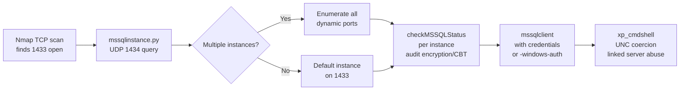

title: "mssqlinstance.py"
script: "examples/mssqlinstance.py"
category: "MSSQL"
status: "Published"
protocols:
  - MC-SQLR
  - UDP
ms_specs:
  - MC-SQLR
mitre_techniques:
  - T1046
  - T1082
auth_types: []
tags:
  - impacket
  - impacket/examples
  - category/mssql
  - status/published
  - protocol/mc-sqlr
  - protocol/udp
  - ms-spec/mc-sqlr
  - technique/service_discovery
  - technique/enumeration
  - mitre/T1046
  - mitre/T1082
aliases:
  - mssqlinstance
  - mssql-discovery
  - sqlr
  - sql-browser-query


# mssqlinstance.py

> **One line summary:** Small unauthenticated discovery tool that queries the SQL Server Browser service on UDP port 1434 using the MC-SQLR (Microsoft SQL Server Resolution Protocol) specification to enumerate the MSSQL instances running on a target host, returning each instance's name, server version, cluster status, TCP port, named pipe path, and any other fields the Browser service advertises; authored by Alberto Solino (`@agsolino`) with a minimal CLI (positional `host`, plus `-timeout`, `-debug`, `-ts`) totaling roughly 40 lines of actual Python; the tool's purpose is to answer the question "what SQL Server instances are running here and on what ports" without needing credentials, because SQL Server Browser is an unauthenticated information disclosure service designed specifically to help clients find the right port for a named instance; operationally important in three scenarios: (1) reconnaissance against hosts that run multiple SQL Server instances (default SQLEXPRESS plus one or more named instances, common in development environments and servers hosting line of business applications), (2) finding dynamic ports where instances are configured to listen on ports other than the default 1433, and (3) confirming presence of SQL Server at all when scan data from other tools is ambiguous; **continues MSSQL at 2 of 3 articles (67%)**.

| Field | Value |
|:---|:---|
| Script | `examples/mssqlinstance.py` |
| Category | MSSQL |
| Status | Published |
| Author | Alberto Solino (`@agsolino`), Impacket maintainer |
| Primary protocol | MC-SQLR (Microsoft SQL Server Resolution Protocol) over UDP 1434 |
| Primary Microsoft specification | `[MC-SQLR]` SQL Server Resolution Protocol |
| MITRE ATT&CK techniques | T1046 Network Service Discovery, T1082 System Information Discovery |
| Authentication | None required (SQL Server Browser is unauthenticated by design) |
| CLI surface | `host` (positional), `-timeout`, `-debug`, `-ts` |
| Implementation size | ~40 lines of Python wrapping `impacket.tds` instance enumeration logic |


## Prerequisites

This article assumes familiarity with:

- [`mssqlclient.py`](mssqlclient.md) for full MSSQL tooling context. mssqlinstance.py is the discovery counterpart to mssqlclient.py; after finding instances with mssqlinstance, connect to them with mssqlclient.
- Basic understanding of SQL Server's named instance model (default instance listens on TCP 1433; named instances listen on dynamic ports assigned at service startup and advertised by the SQL Server Browser).

No authentication knowledge is needed because MC-SQLR is unauthenticated. No deep MSSQL knowledge is needed either: this tool is purely a discovery layer.


## What it does

`mssqlinstance.py` queries the target's SQL Server Browser service and prints the response. Canonical invocation:

```text
$ mssqlinstance.py 10.10.10.50
Impacket v0.14.0.dev0 - Copyright Fortra, LLC and its affiliated companies
[*] Instance 1
   ServerName       : SQLSRV01
   InstanceName     : MSSQLSERVER
   IsClustered      : No
   Version          : 15.0.2000.5
   tcp              : 1433
   np               : \\SQLSRV01\pipe\sql\query

[*] Instance 2
   ServerName       : SQLSRV01
   InstanceName     : DEVINSTANCE
   IsClustered      : No
   Version          : 15.0.2000.5
   tcp              : 49172
   np               : \\SQLSRV01\pipe\MSSQL$DEVINSTANCE\sql\query

[*] Instance 3
   ServerName       : SQLSRV01
   InstanceName     : SQLEXPRESS
   IsClustered      : No
   Version          : 15.0.2000.5
   tcp              : 51304
   np               : \\SQLSRV01\pipe\MSSQL$SQLEXPRESS\sql\query
```

Three instances on one host. The default instance (`MSSQLSERVER`) on TCP 1433, a named development instance on dynamic port 49172, and a SQLEXPRESS instance on dynamic port 51304. Without mssqlinstance or an equivalent Browser query, connecting to instances other than the default requires either trying every dynamic port or knowing the port configuration.

The output for each instance shows:

- **ServerName**: the hostname of the server running the instance.
- **InstanceName**: the SQL Server instance name. `MSSQLSERVER` is the default; anything else is a named instance.
- **IsClustered**: whether the instance is part of a Windows Server Failover Cluster.
- **Version**: SQL Server version (15.0.x = SQL Server 2019, 14.0.x = 2017, 13.0.x = 2016, 12.0.x = 2014, 11.0.x = 2012, 16.0.x = 2022, etc.).
- **tcp**: TCP port the instance listens on.
- **np**: named pipe path (legacy transport; most modern deployments don't use this but it's still advertised).

Fields vary slightly between SQL Server versions. Some Browser responses include additional fields like `rpc` or architecture information.


## Why it exists

### The named instance port problem

SQL Server supports multiple instances running concurrently on a single host. The first instance installed is the default instance, which by convention listens on TCP 1433. Additional named instances are configured to listen on dynamic ports chosen at service startup, which means:

- The port changes every time the service restarts (unless statically configured).
- Clients that want to connect to `SQLSRV01\DEVINSTANCE` can't just try a well known port.
- Microsoft's solution is SQL Server Browser: a separate service running on UDP 1434 that answers "what port is instance X on?" queries.

When a SQL Server client (like SSMS, sqlcmd, or any application using a SQL Server connection string of the form `SERVER\INSTANCE`) connects, the client:

1. First sends a UDP 1434 query to the server asking for instance information.
2. Receives the Browser response with all instances and their ports.
3. Finds the named instance in the response and extracts its TCP port.
4. Opens a TCP connection to that dynamic port for the actual TDS conversation.

mssqlinstance.py performs step 1 and stops there. It's the "what instances exist" query without the subsequent TDS handshake.

### Why this is useful for operators

Three operational reasons to use mssqlinstance.py:

- **Discovery**: finding instances you didn't know existed. A host that runs a default MSSQLSERVER instance on 1433 may also run SQLEXPRESS, a vendor application's embedded instance (common with Veeam, SCCM, WSUS, vendor CMDBs, ERP systems), and development/test instances. Each is a separate attack surface. mssqlinstance enumerates them in one UDP exchange.
- **Port identification**: knowing a named instance exists but not what port it's on. mssqlinstance returns the dynamic port so you can connect with mssqlclient directly rather than scanning the dynamic range port by port.
- **Version identification**: the Browser response includes the SQL Server version string. Useful for vulnerability triage (older versions have more known issues) and for determining which attack primitives are available on a given target.

### Why it's tiny

mssqlinstance.py is about 40 lines of actual code. All the heavy lifting is in `impacket.tds.MSSQL.getInstances()`, which sends the UDP 1434 query, parses the MC-SQLR response, and returns a structured list. The example script is a CLI wrapper around that one method call.

This is a case where Impacket's library does the real work and the example script is just a minimal demonstration. Operators who want programmatic instance discovery can call `tds.MSSQL.getInstances()` directly; the example script exists to make this accessible at the command line.


## MC-SQLR protocol theory

The Microsoft SQL Server Resolution Protocol (`[MC-SQLR]`) is Microsoft's specification for the SQL Server Browser's query/response exchange. It's a small UDP protocol, unauthenticated, with a handful of message types.

### Message structure

MC-SQLR messages are simple byte oriented frames. The client sends a single byte indicating the query type, optionally followed by payload specific to the request:

- **`0x01` CLNT_UCAST_EX** (Client Unicast All): "list all instances on this host."
- **`0x02` CLNT_UCAST_INST** (Client Unicast Instance): "tell me about this specific named instance" (followed by the instance name, terminated by a null byte).
- **`0x03` CLNT_UCAST_DAC** (Client Unicast DAC): "give me the Dedicated Administrator Connection port for this instance."
- **`0x04` CLNT_BCAST_EX** (Client Broadcast All): same as 0x01 but sent as broadcast.
- **`0x0F` SVR_RESP** (Server Response): what the server sends back.

mssqlinstance.py uses the `0x03` unicast query type. Different Impacket versions use slightly different query messages; the modern implementation queries broadly and parses what comes back.

### Response format

The server response is a string terminated by a null byte, formatted as key/value pairs separated by semicolons, with `;;` terminating each instance block:

```text
ServerName;SQLSRV01;InstanceName;MSSQLSERVER;IsClustered;No;Version;15.0.2000.5;tcp;1433;np;\\SQLSRV01\pipe\sql\query;;ServerName;SQLSRV01;InstanceName;DEVINSTANCE;IsClustered;No;Version;15.0.2000.5;tcp;49172;np;\\SQLSRV01\pipe\MSSQL$DEVINSTANCE\sql\query;;
```

Each instance is a key-value sequence. The protocol implementation in Impacket splits on `;;` to find instance boundaries, then splits each block on `;` to parse keys and values into a dict.

### UDP 1434 only

SQL Server Browser listens exclusively on UDP 1434. It does NOT listen on TCP 1434. A common misconception is that SQL Server "uses 1434" generally; in reality, UDP 1434 is the Browser service, while TCP ports are where individual instances listen.

Firewall implications:
- Blocking UDP 1434 disables the Browser but doesn't block SQL Server itself. Clients can still connect if they know the TCP port.
- Disabling SQL Server Browser as a service (not just the port) means named instances become unreachable unless the client knows their port in advance.
- Many hardened environments disable SQL Server Browser for this reason. mssqlinstance will time out silently against such targets.

### Historical context: UDP 1434 and the Slammer worm

UDP 1434 has notable security history. The SQL Slammer worm (January 2003) exploited a buffer overflow in the SQL Server Resolution Protocol (CVE-2002-0649) via UDP 1434 to propagate in minutes across hundreds of thousands of hosts. The patch was available six months before the worm but was widely unpatched. The resulting outage affected banks, airlines, and 911 services.

Modern SQL Server versions are not vulnerable to Slammer, but the incident established UDP 1434 as "that port firewall people care about." Many restrictive egress firewalls block UDP 1434 as a legacy Slammer countermeasure even though the underlying vulnerability was patched 20+ years ago.


## How the tool works internally

The script is genuinely minimal. Full structure:

### Imports

```python
import argparse
import sys
import logging
from impacket.examples import logger
from impacket import version, tds
```

Five imports. No authentication, no RPC, no LDAP. Just the `tds` module that implements MC-SQLR.

### Main flow

```python
if __name__ == '__main__':
    parser = argparse.ArgumentParser(description="Asks the remote host for its running MSSQL Instances.")
    parser.add_argument('host', action='store', help='target host')
    parser.add_argument('-timeout', action='store', default='5', help='timeout to wait for an answer')
    parser.add_argument('-debug', action='store_true', help='Turn DEBUG output ON')
    parser.add_argument('-ts', action='store_true', help='Adds timestamp to every logging output')
    
    options = parser.parse_args()
    logger.init(options.ts, options.debug)
    
    ms_sql = tds.MSSQL(options.host)
    instances = ms_sql.getInstances(int(options.timeout))
    
    if not len(instances):
        print("No MSSQL Instances found")
    else:
        for i, instance in enumerate(instances):
            logging.info("Instance %d", i + 1)
            for key, value in list(instance.items()):
                print("   %-16s:%s" % (key, value))
```

One call to `tds.MSSQL.getInstances()` does the work. The rest is argument parsing and output formatting.

### What `tds.MSSQL.getInstances()` does

Inside Impacket's `tds` module, `getInstances()`:

1. Creates a UDP socket.
2. Sends the MC-SQLR query to the target on UDP 1434.
3. Sets a receive timeout based on the caller's `timeout` parameter.
4. Receives the response (or times out).
5. Parses the response format delimited by semicolons.
6. Returns a list of dicts, one per instance.

This is standard UDP client logic. The complexity is in the response parsing, which handles the `;` and `;;` delimiters, escapes, and variable field sets across SQL Server versions.

### What the tool does NOT do

- Does NOT authenticate. MC-SQLR is an unauthenticated protocol.
- Does NOT connect to the SQL instances themselves. That's mssqlclient.py's job.
- Does NOT support IPv6 explicitly (depends on socket layer behavior).
- Does NOT scan for SQL Server Browser on ports other than the standard one. Hardcoded to UDP 1434.
- Does NOT handle situations where UDP 1434 responds but the response is not MC-SQLR (rare; some firewalls reply with ICMP or misbehaving devices respond with arbitrary UDP data).
- Does NOT provide rate limiting or stealth options. Single UDP packet out, single response in.


## Practical usage

### Basic instance discovery

```bash
mssqlinstance.py 10.10.10.50
```

Sends a single UDP 1434 query, prints all instances returned. Typical for initial reconnaissance against a host suspected to run SQL Server.

### Increase timeout for slow networks

```bash
mssqlinstance.py -timeout 15 10.10.10.50
```

Default timeout is 5 seconds. For networks with high latency or heavily loaded servers, increase. If no response within the timeout, the tool prints "No MSSQL Instances found" and exits.

### Timestamped debug output

```bash
mssqlinstance.py -debug -ts 10.10.10.50
```

Useful for confirming the UDP packet went out and understanding any parsing errors. Debug output includes the raw bytes sent and received.

### Scripted sweep across multiple hosts

Bash loop since the tool takes one host at a time:

```bash
for host in 10.10.10.{1..254}; do
    echo "=== $host ==="
    timeout 8 mssqlinstance.py -timeout 5 "$host" 2>/dev/null
done > mssql_sweep.txt
```

The outer `timeout 8` prevents hangs; the inner `-timeout 5` is the MC-SQLR timeout. Output goes to a file for later analysis. This is an ad hoc approach but effective for small to medium networks.

For larger sweeps, a dedicated scanner like nmap's `ms-sql-info` NSE script or masscan with UDP 1434 is more efficient; mssqlinstance's value is the parsed output format, not scanning throughput.

### Discovering hidden instances

Some SQL Server installations are configured to hide instances from Browser responses (via the "Hide Instance" setting). In those cases, mssqlinstance.py returns no instances even though SQL Server is running. The standard response is:

- Check for TCP 1433 directly (the default instance isn't affected by Hide Instance in older versions).
- Check for SQL Server processes via other channels (remote registry, WMI).
- Scan the dynamic port range directly (49152-65535 by default on modern Windows) for TDS responses.

### Combining with mssqlclient.py

Typical workflow:

```bash
# Step 1: discover
mssqlinstance.py 10.10.10.50
# Output shows DEVINSTANCE on port 49172

# Step 2: connect to specific named instance
mssqlclient.py ACME/alice:Passw0rd@10.10.10.50 -port 49172
# Or via instance name with -windows-auth
mssqlclient.py -windows-auth ACME/alice:Passw0rd@SQLSRV01 -db master
```

The `-port` flag on mssqlclient lets you target the specific dynamic port mssqlinstance found. Alternatively, if name resolution works and SMB is reachable, use the instance name form; mssqlclient will query Browser itself.

### Key flags

| Flag | Meaning |
|:---|:---|
| `host` (positional) | Target host IP or resolvable name. |
| `-timeout <seconds>` | How long to wait for the MC-SQLR response. Default 5. |
| `-debug` | Verbose debug output including raw packet dumps. |
| `-ts` | Prefix each log line with a timestamp. |

No authentication flags. No port flags (UDP 1434 is hardcoded). No output format flags (single line-based format). This is a deliberately minimal tool.


## What it looks like on the wire

Trivial. Single UDP packet exchange on port 1434.

### Outbound packet

Attacker → target, UDP source port (ephemeral) → destination port 1434:

```text
\x03
```

One byte. The `0x03` query type indicating CLNT_UCAST_DAC or similar variant (the exact byte depends on Impacket version; could be `0x02` with an instance name or `0x03` to list all).

### Inbound packet

Target → attacker, UDP source port 1434 → destination port (ephemeral):

```text
\x05\x7b\x00
ServerName;SQLSRV01;InstanceName;MSSQLSERVER;IsClustered;No;Version;15.0.2000.5;tcp;1433;np;\\SQLSRV01\pipe\sql\query;;
```

First three bytes are response header (type + length). Remainder is the semicolon-delimited instance data.

### Wireshark filters

```text
udp.port == 1434                # All MC-SQLR traffic
udp.dstport == 1434             # Only outbound queries
udp.srcport == 1434             # Only inbound responses
data contains "ServerName;"     # Heuristic for response data
```

Wireshark has a SMB-MC-SQLR dissector that decodes the protocol automatically when the filter matches.

### Zeek and similar

Zeek has no dedicated MC-SQLR parser by default. Custom scripts can identify UDP 1434 traffic in conn.log and flag unusual query patterns.


## What it looks like in logs

SQL Server Browser does not log queries to the Windows event log by default. MC-SQLR activity is largely invisible from the server perspective unless the operator has:

- Network-layer logging (firewall logs, NetFlow, Zeek).
- Host-based IDS monitoring UDP 1434.
- Specifically enabled SQL Server Browser logging (not a standard option).

This is one of the reasons MC-SQLR is favored for reconnaissance: single packet, unauthenticated, no server-side logging by default.

### What defenders CAN do

- **Disable SQL Server Browser**: set the service to manual or disabled. Named instances become unreachable unless clients know their port in advance. Operationally disruptive but effective.
- **Block UDP 1434 at the network boundary**: prevents external MC-SQLR queries. Does not stop internal reconnaissance.
- **Network flow analysis**: treat UDP 1434 queries from unusual sources as potentially suspicious. Baseline legitimate query sources (management hosts, monitoring tools, known application servers).
- **Packet capture and anomaly detection**: a burst of MC-SQLR queries from one source across many targets in a short timeframe is a reconnaissance signature.

### Sigma rule example

```yaml
title: MSSQL Browser Reconnaissance (UDP 1434 Scan)
logsource:
  category: network
  product: zeek
  service: conn
detection:
  selection:
    id.resp_p: 1434
    proto: udp
  condition: selection
timeframe: 5m
threshold: 10   # 10+ UDP 1434 queries in 5 minutes from single source
level: low
```

Low severity. MC-SQLR queries are common in legitimate operations (clients finding named instances). Only volumetric patterns are suspicious.


## Detection and defense

### What to look for

- **Unexpected UDP 1434 traffic**: baseline known legitimate sources and alert on deviations.
- **Scanning patterns**: one source, many destinations, short timeframe.
- **Correlation with TDS connections**: MC-SQLR query followed quickly by TDS connections to the returned ports indicates an attacker enumerating then connecting.

### What NOT to rely on

- SQL Server audit logs. Browser queries don't register.
- Failed authentication logs. MC-SQLR is unauthenticated; there's no authentication to fail.

### Preventive controls

- **Disable SQL Server Browser** where it's not needed. Fixed port configuration for named instances eliminates the need for Browser.
- **Fixed-port named instances**: configure each named instance to listen on a static port. Document the ports. Disable Browser.
- **Network segmentation**: SQL Server hosts should not be reachable from end-user segments directly on UDP 1434.
- **Hide Instance setting**: enable "Hide Instance" on each SQL Server instance to prevent the instance from being advertised in Browser responses. Note that determined attackers can still connect if they find the TCP port via other means.

### What mssqlinstance.py does NOT enable

- Does NOT execute code. No SQL queries, no remote procedure calls.
- Does NOT authenticate. No credential testing or brute force.
- Does NOT connect via TDS. The whole tool's scope ends at Browser response parsing.
- Does NOT work when Browser is disabled, blocked, or not installed.


## Related tools and attack chains

mssqlinstance.py **continues MSSQL at 2 of 3 articles (67% complete)**. One more article (`checkMSSQLStatus.py`) closes the category.

### Related Impacket tools

- [`mssqlclient.py`](mssqlclient.md) is the connect-and-execute companion. After mssqlinstance discovers instances and their ports, mssqlclient connects to them.
- [`checkMSSQLStatus.py`](checkMSSQLStatus.md) is the MSSQL security audit companion (checks whether instances enforce encryption and Channel Binding Token). Natural next step after mssqlinstance discovery: enumerate instances, then audit each one's security posture.
- [`rpcdump.py`](../01_recon_and_enumeration/rpcdump.md) and [`samrdump.py`](../01_recon_and_enumeration/samrdump.md) are reconnaissance tools for other protocols. mssqlinstance fits the same mental slot for MSSQL.

### External alternatives

- **nmap `ms-sql-info.nse`**: NSE script that queries UDP 1434 and parses responses. Similar functionality with nmap's broader scanning integration.
- **nmap `ms-sql-brute.nse`**: combines instance discovery with authentication testing.
- **masscan / ZMap**: mass UDP 1434 scanning. Higher throughput than mssqlinstance's design of one host per invocation.
- **SQL Server Management Studio**: natively queries Browser when "Server: SRV\INSTANCE" form is used in connection dialog.
- **sqlcmd**: the Microsoft-provided command-line MSSQL client also uses Browser transparently.
- **PowerUpSQL**: NetSPI's PowerShell toolkit with extensive MSSQL reconnaissance including instance discovery.

### Typical MSSQL attack chain



mssqlinstance sits at the second step of reconnaissance, after initial port discovery and before credential-based operations.


## Further reading

- **Impacket mssqlinstance.py source** at `https://github.com/fortra/impacket/blob/master/examples/mssqlinstance.py`. ~40 lines of code.
- **Impacket tds module source** at `https://github.com/fortra/impacket/blob/master/impacket/tds.py`. Contains `MSSQL.getInstances()` and the response parsing logic.
- **`[MC-SQLR]` SQL Server Resolution Protocol specification** at `https://learn.microsoft.com/en-us/openspecs/windows_protocols/mc-sqlr/`. The canonical Microsoft specification.
- **Microsoft "SQL Server Browser Service"** documentation at `https://learn.microsoft.com/en-us/sql/tools/configuration-manager/sql-server-browser-service`. Microsoft's own coverage of what Browser does and how to configure it.
- **CVE-2002-0649 and the SQL Slammer worm** at `https://nvd.nist.gov/vuln/detail/CVE-2002-0649`. Historical context for UDP 1434.
- **nmap ms-sql-info.nse** at `https://nmap.org/nsedoc/scripts/ms-sql-info.html`. Equivalent NSE-based discovery.
- **MITRE ATT&CK T1046 Network Service Discovery** at `https://attack.mitre.org/techniques/T1046/`.
- **HackTricks "1433 - Pentesting MSSQL"** at `https://book.hacktricks.xyz/network-services-pentesting/pentesting-mssql-microsoft-sql-server`. Operational reference.

If you want to internalize mssqlinstance.py, the exercise is brief because the tool is brief. In a lab, install SQL Server Express, install a second named instance, and run mssqlinstance against the host. Observe the two instances returned and note the dynamic port assigned to the named instance. Restart the named instance's service and re-run mssqlinstance; observe the port has changed. Then enable "Hide Instance" on the named instance (via SQL Server Configuration Manager), re-run mssqlinstance, and observe the hidden instance is no longer in the response. Finally, disable SQL Server Browser entirely and observe mssqlinstance times out. This cycle covers the full operational envelope of the tool: default behavior, dynamic port recovery, hidden instance handling, and Browser-disabled scenarios. mssqlinstance.py is a small tool but it occupies a clean slot in the MSSQL reconnaissance workflow and the exercise of running it in these four configurations builds durable understanding of SQL Server's discovery architecture.
