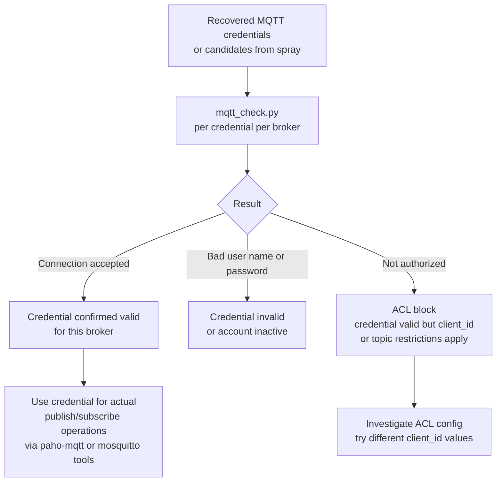
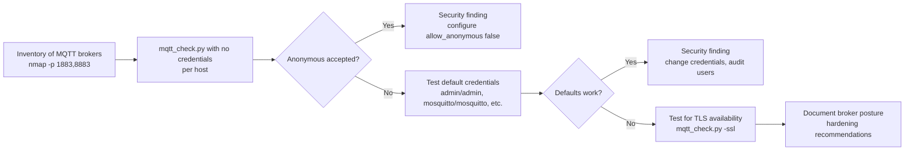

title: "mqtt_check.py"
script: "examples/mqtt_check.py"
category: "Network Analysis"
status: "Published"
protocols:
  - MQTT
  - TCP
  - TLS
ms_specs: []
mitre_techniques:
  - T1110.003
  - T1078
  - T1046
auth_types:
  - Plain
  - Anonymous
tags:
  - impacket
  - impacket/examples
  - category/network_analysis
  - status/published
  - protocol/mqtt
  - protocol/tcp
  - protocol/tls
  - technique/credential_validation
  - technique/mqtt_broker_audit
  - technique/iot_authentication_test
  - mitre/T1110.003
  - mitre/T1078
  - mitre/T1046
aliases:
  - mqtt_check
  - mqtt-cred-check
  - mqtt-broker-audit
  - iot-auth-test


# mqtt_check.py

> **One line summary:** Minimal MQTT broker credential validation tool that connects to an MQTT broker on TCP port 1883 (or 8883 with `-ssl` for MQTT over TLS), sends a CONNECT packet with the supplied username and password (or anonymously), reads the CONNACK response, and reports the connection result based on the broker's CONNECT acknowledgement code (success, bad protocol version, identifier rejected, server unavailable, bad credentials, or not authorized); authored by Alberto Solino (`@agsolino`); the architectural sibling of [`rdp_check.py`](../08_remote_system_interaction/rdp_check.md) - both are "single credential validation tools" for their respective protocols, both stop after authentication is determined without performing any further operations, both return binary access granted or denied results suitable for credential spray validation, both support `-ssl` for the TLS variant of the protocol; the script docstring explicitly notes "Can be converted into a account/password brute forcer quite easily" reflecting the original design intent as a starting point for credential testing automation; uses `impacket.mqtt.MQTTConnection` and the `CONNECT_ACK_ERROR_MSGS` table to translate numeric CONNACK return codes into human readable messages; CLI is small (target string with optional credentials, `-client-id`, `-ssl`, `-port`, `-debug`, `-ts`); operationally important in IoT and OT environments where MQTT brokers act as the central message bus for sensor networks, smart building systems, industrial control systems, and consumer IoT, and where misconfigured brokers (allowing anonymous access or accepting weak default credentials) are common; **continues Network Analysis at 5 of 7 articles (71%), with two stubs (`split.py`, `nmapAnswerMachine.py`) remaining before the category closes as the 12th complete category in the wiki**.

| Field | Value |
|:---|:---|
| Script | `examples/mqtt_check.py` |
| Category | Network Analysis |
| Status | Published |
| Author | Alberto Solino (`@agsolino`) |
| Companion tool | [`rdp_check.py`](../08_remote_system_interaction/rdp_check.md) - architectural parallel as single-credential validator for a different protocol |
| Primary protocol | MQTT (Message Queuing Telemetry Transport, OASIS standard, originally IBM 1999) |
| Default port | TCP 1883 (plaintext), TCP 8883 (with `-ssl`, MQTT over TLS) |
| MITRE ATT&CK techniques | T1110.003 Brute Force: Password Spraying (validation phase), T1078 Valid Accounts (credential confirmation), T1046 Network Service Discovery (broker reachability) |
| Authentication | Plain username/password in CONNECT packet, anonymous (no credentials in CONNECT) |
| Library reference role | Demonstrator for `impacket.mqtt.MQTTConnection` |
| Implementation size | ~100 lines of Python |
| Key library import | `from impacket.mqtt import CONNECT_ACK_ERROR_MSGS, MQTTConnection` |


## Prerequisites

This article assumes familiarity with:

- [`rdp_check.py`](../08_remote_system_interaction/rdp_check.md) for the "single credential validation tool" architectural pattern. mqtt_check.py is the same pattern applied to MQTT instead of RDP. Reading rdp_check.py first makes the parallels in this article obvious.
- Basic TCP socket model: connect, send, receive, close. MQTT is application protocol over TCP; no special transport.
- TLS handshake basics for the `-ssl` variant. MQTT over TLS uses TCP 8883 by default with standard TLS wrapping the MQTT protocol layer.
- General MQTT concepts: broker, client, topic, publish/subscribe model. Detailed knowledge not required for understanding the tool, but useful for understanding why MQTT broker security matters in IoT/OT environments.


## What it does

`mqtt_check.py` connects to an MQTT broker, sends a CONNECT packet with the supplied authentication, reads the CONNACK response, prints the result, and disconnects. Three usage shapes:

### Anonymous connection test

```text
$ mqtt_check.py 10.10.10.50
Impacket v0.14.0.dev0 - Copyright Fortra, LLC and its affiliated companies
[*] Connecting to 10.10.10.50:1883
[+] Connection accepted
```

A successful anonymous connection means the broker allows clients without credentials. This is a security finding in most production deployments because it means anyone on the network can publish or subscribe to any topic the broker has permitted for anonymous access.

### Credentialed connection test

```text
$ mqtt_check.py iot/device001:Passw0rd@10.10.10.50
Impacket v0.14.0.dev0 - Copyright Fortra, LLC and its affiliated companies
[*] Connecting to 10.10.10.50:1883
[+] Connection accepted
```

A successful credentialed connection means the credentials are valid for this broker. Use case: confirm that recovered or supplied credentials work against a specific MQTT broker before attempting to publish or subscribe.

### Failed connection test

```text
$ mqtt_check.py iot/device001:WrongPassword@10.10.10.50
Impacket v0.14.0.dev0 - Copyright Fortra, LLC and its affiliated companies
[*] Connecting to 10.10.10.50:1883
[-] Connection refused: Bad user name or password
```

The broker rejected the credentials. The specific error message comes from the `CONNECT_ACK_ERROR_MSGS` table mapping numeric CONNACK return codes to human readable strings.

### TLS variant

```text
$ mqtt_check.py -ssl iot/device001:Passw0rd@10.10.10.50
Impacket v0.14.0.dev0 - Copyright Fortra, LLC and its affiliated companies
[*] Connecting to 10.10.10.50:8883
[*] Wrapping connection in TLS
[+] Connection accepted
```

Default port changes to 8883 when `-ssl` is specified. TLS handshake happens before the MQTT CONNECT packet is sent, so credentials traverse only the encrypted tunnel.


## Why it exists

### The MQTT broker landscape

MQTT (Message Queuing Telemetry Transport) is the dominant application protocol for IoT and OT messaging. Designed at IBM in 1999 for low bandwidth oil pipeline telemetry, MQTT became an OASIS standard in 2014 and the protocol of choice for:

- **Consumer IoT**: smart home hubs, IP cameras, voice assistants, smart appliances, anything that sends sensor data to a cloud service.
- **Industrial IoT (IIoT)**: factory floor sensors, SCADA bridges, building automation, oil and gas telemetry, fleet management.
- **Vehicle telematics**: connected cars, fleet GPS tracking, telematics control units.
- **Asset tracking**: warehouse RFID, cold chain monitoring, supply chain visibility.
- **Smart building**: HVAC controls, lighting systems, access control sensors, occupancy monitors.

The architecture is publish/subscribe via a central broker. Devices publish messages to topics; other devices subscribe to topics they care about. The broker acts as the central message switch.

### Why broker security matters

The broker is the central trust point. A compromised broker means:

- Adversary can read all sensor data (privacy violation, industrial espionage).
- Adversary can publish forged sensor data (data integrity loss).
- Adversary can issue commands to actuators if devices subscribe to command topics (physical control, safety implications).
- Adversary can perform message replay, message injection, denial of service.

MQTT broker security depends on three layers:

1. **Network access**: who can reach the broker on TCP 1883/8883.
2. **Authentication**: who can connect to the broker.
3. **Authorization (ACLs)**: what topics each authenticated client can publish or subscribe to.

mqtt_check.py addresses layer 2 directly (does this credential authenticate?) and layer 1 indirectly (is the broker reachable from this network position?). It does not address layer 3 (which would require subscribe/publish operations).

### The "anonymous accepted" finding

A broker that accepts anonymous CONNECT requests is the most common MQTT security issue. Default configurations of popular brokers (Eclipse Mosquitto in default config prior to 2.0, EMQX in some configurations, ActiveMQ Artemis, HiveMQ Community Edition) historically allowed anonymous access to make initial setup easy. Many production deployments inherited those defaults without ever hardening them.

Internet scans by Shodan and similar services routinely find tens of thousands of MQTT brokers exposed to the public internet with anonymous access. mqtt_check.py against any unknown broker is the first step in confirming whether anonymous access is permitted: if `mqtt_check.py <target>` (no credentials) returns "Connection accepted", the broker is wide open.

### The credential validation use case

When operators have MQTT credentials to test (recovered from a compromised IoT device, captured in plaintext from sniffed unencrypted MQTT traffic, found in source code or configuration files, supplied during authorized testing), mqtt_check.py confirms whether each credential works against the target broker. The tool's value is the binary result without the noise of full subscribe/publish operations.

This parallels rdp_check.py for RDP credential validation. Both tools exist because operators benefit from a clean "does this credential work" check that doesn't establish full sessions, doesn't perform privileged operations, doesn't generate the full operational footprint of a real client connection.

### Reference example role

The script's docstring lists "Reference for: MQTT and Structure" as the secondary purpose. mqtt_check.py is the example tool for `impacket.mqtt`, which is Impacket's MQTT v3.1.1 protocol implementation. Researchers wanting to write custom MQTT tooling on Python can read mqtt_check.py to see how MQTTConnection is used and then build from there.

The "and Structure" reference is to `impacket.structure.Structure`, the binary protocol packing/unpacking primitive that underlies most Impacket protocol implementations. MQTT is a useful introduction to Structure because the MQTT packet format is small, well documented, and easy to reason about compared to MSRPC or SMB.


## Protocol theory

### MQTT v3.1.1 packet format

MQTT messages have a uniform structure:

```text
+-+
| Fixed Header   |  (always present)
+-+
| Variable Header|  (depends on packet type)
+-+
| Payload        |  (depends on packet type)
+-+
```

The Fixed Header is at minimum 2 bytes:

- Byte 1: high nibble = packet type (0x1=CONNECT, 0x2=CONNACK, 0x3=PUBLISH, 0x4=PUBACK, ..., 0xE=DISCONNECT), low nibble = flags specific to the packet type.
- Byte 2 onward: remaining length encoded as a variable length integer (1-4 bytes).

mqtt_check.py uses two packet types: CONNECT (0x10 byte 1, attempting authentication) and CONNACK (0x20 byte 1, server's response).

### CONNECT packet

The CONNECT packet payload structure:

```text
Variable Header:
  Protocol Name Length (2 bytes, MSB first): 0x00 0x04
  Protocol Name: "MQTT" (4 bytes)
  Protocol Level: 0x04 (MQTT v3.1.1)
  Connect Flags (1 byte): username present, password present, will, clean session, etc.
  Keep Alive (2 bytes): seconds between PINGREQ messages

Payload:
  Client Identifier (string prefixed with length, required)
  Will Topic (if Will flag set)
  Will Message (if Will flag set)
  User Name (if username flag set)
  Password (bytes prefixed with length, if password flag set)
```

The Connect Flags byte tells the broker what to expect in the payload:

- Bit 7: User Name Flag (1 = username present)
- Bit 6: Password Flag (1 = password present, must have user name flag too)
- Bit 5: Will Retain
- Bits 4-3: Will QoS
- Bit 2: Will Flag
- Bit 1: Clean Session
- Bit 0: Reserved

mqtt_check.py sets username flag and password flag if credentials supplied; sets clean session flag (so the broker doesn't try to deliver queued messages from a previous session); sets a 2-byte keep alive (typical 60 seconds).

The Client Identifier is mandatory. If `-client-id` is not specified, mqtt_check.py generates a random one. Some brokers reject duplicate client IDs; if testing many credentials against one broker, vary the client ID per attempt.

### CONNACK packet

The broker's response to CONNECT. Two-byte variable header:

- Byte 1 (Connect Acknowledge Flags): Bit 0 = Session Present (whether broker has saved state for this client ID).
- Byte 2 (Connect Return Code): the result.

Connect Return Codes per MQTT v3.1.1:

| Code | Meaning |
|:---|:---|
| 0x00 | Connection Accepted |
| 0x01 | Connection Refused, unacceptable protocol version |
| 0x02 | Connection Refused, identifier rejected |
| 0x03 | Connection Refused, server unavailable |
| 0x04 | Connection Refused, bad user name or password |
| 0x05 | Connection Refused, not authorized |
| 0x06-0xFF | Reserved |

`impacket.mqtt.CONNECT_ACK_ERROR_MSGS` is a Python dict mapping these codes to the human readable messages mqtt_check.py prints. Code 0x00 (success) is handled separately.

### MQTT v5

MQTT v5 (OASIS standard 2019) introduced significant protocol changes including extended return codes (256 codes vs MQTT v3.1.1's 6), session expiry intervals, message expiry, topic aliases, and reason strings. mqtt_check.py implements MQTT v3.1.1 (Protocol Level 0x04), the predominant version in deployment as of 2026. MQTT v5 brokers typically accept v3.1.1 clients via backward compatibility, so mqtt_check.py works against most v5 brokers as well, but it does not exercise v5-specific features.

If a broker is configured to accept only MQTT v5 clients, mqtt_check.py's CONNECT will fail with code 0x01 (unacceptable protocol version). This is rare but possible.

### MQTT over TLS (port 8883)

MQTT over TLS is standard TLS wrapping the MQTT protocol layer. The TLS handshake completes before any MQTT byte traverses the connection. After TLS is established, MQTT operates exactly as it would on plaintext, with all bytes encrypted by the TLS session.

mqtt_check.py with `-ssl` defaults to port 8883 (the IANA registered port for "MQTT over TLS") and uses Python's `ssl` module to wrap the socket. Server certificate validation is not performed by default; `-ssl` accepts certificates that are self signed or expired silently. For environments with strict certificate requirements, custom validation would require modifying the script.


## How the tool works internally

### Imports

```python
import argparse
import logging
import sys
from impacket import version
from impacket.examples import logger
from impacket.examples.utils import parse_target
from impacket.mqtt import CONNECT_ACK_ERROR_MSGS, MQTTConnection
```

The two key imports are `MQTTConnection` (the protocol implementation) and `CONNECT_ACK_ERROR_MSGS` (the return code translation table). Everything else is standard Impacket scaffolding.

### Core flow

Pseudocode:

```python
def check_credentials(target, port, username, password, client_id, use_ssl):
    domain, username, password, remote = parse_target(target)
    
    # Connect to broker
    mqtt = MQTTConnection(remote, int(port), use_ssl)
    
    # Send CONNECT packet with credentials
    try:
        result = mqtt.connect(client_id, username, password)
        if result is True:
            print("[+] Connection accepted")
            return True
        else:
            error_msg = CONNECT_ACK_ERROR_MSGS.get(result, "Unknown error code %d" % result)
            print("[-] Connection refused: %s" % error_msg)
            return False
    finally:
        mqtt.disconnect()


if __name__ == '__main__':
    parser = argparse.ArgumentParser(description="MQTT login check")
    parser.add_argument('target', help='[[domain/]username[:password]@]<targetName>')
    parser.add_argument('-client-id', default=None, help='Client ID used when authenticating (default random)')
    parser.add_argument('-ssl', action='store_true', help='turn SSL on')
    parser.add_argument('-port', default=1883, type=int, help='port to connect to (default 1883)')
    parser.add_argument('-debug', action='store_true')
    parser.add_argument('-ts', action='store_true')
    
    options = parser.parse_args()
    logger.init(options.ts, options.debug)
    
    # Default port to 8883 if SSL and port not explicitly set
    if options.ssl and options.port == 1883:
        options.port = 8883
    
    check_credentials(options.target, options.port, ...)
```

Real implementation has more error handling but the architecture is exactly that: connect, CONNECT packet, parse CONNACK, print result, disconnect.

### What MQTTConnection does

Inside `impacket.mqtt`, `MQTTConnection.connect()` builds the CONNECT packet:

1. Set up TCP socket; wrap in TLS if `use_ssl`.
2. Construct CONNECT packet with Protocol Name = "MQTT", Protocol Level = 0x04 (v3.1.1), Connect Flags based on which fields are present, Keep Alive = 60.
3. Append Client Identifier (random if not specified).
4. Append User Name and Password if supplied.
5. Send the constructed packet.
6. Read CONNACK response (variable length).
7. Parse return code byte (offset 3 in the response).
8. Return True if code is 0x00, otherwise return the numeric code.

The script's role is to translate the numeric code to a friendly message and print it.

### What the tool does NOT do

- Does NOT subscribe to topics. Pure CONNECT/CONNACK only.
- Does NOT publish messages. No payload generation.
- Does NOT enumerate topics. Topic discovery requires SUBSCRIBE operations not implemented here.
- Does NOT test ACL granularity. Whether an authenticated user can subscribe to specific topics requires actual SUBSCRIBE attempts.
- Does NOT support MQTT v5 specifically. v3.1.1 protocol only; works against v5 brokers in compatibility mode.
- Does NOT validate TLS certificates. Self-signed certs accepted silently.
- Does NOT support client certificate authentication. Some MQTT deployments use mTLS where the client presents a certificate; mqtt_check.py only does username/password.
- Does NOT support OAuth2 or authentication based on tokens. Some modern MQTT brokers support these via extensions; mqtt_check.py only does the standard CONNECT username/password.
- Does NOT bypass account lockout. A broker that locks accounts after failed attempts will lock against mqtt_check.py the same as any other failed attempt.
- Does NOT brute force. Single credential per invocation, single attempt, binary result. The docstring mentions "Can be converted into a account/password brute forcer quite easily" - this is true but the conversion requires modifying the script.


## Practical usage

### Anonymous access check

```bash
mqtt_check.py 10.10.10.50
```

Tests whether the broker accepts unauthenticated CONNECT requests. "Connection accepted" indicates anonymous access is permitted - typically a security finding in production deployments.

### Credential validation

```bash
mqtt_check.py iot/device001:Passw0rd@10.10.10.50
```

Standard target syntax. Returns "Connection accepted" if credentials work, "Connection refused: Bad user name or password" if they don't.

### TLS variant

```bash
mqtt_check.py -ssl iot/device001:Passw0rd@10.10.10.50
```

Connects to TCP 8883 (default port for MQTT over TLS) with TLS wrapping. Use case: production brokers with TLS enforcement, brokers behind proxies that terminate TLS, broker deployments where plaintext MQTT is firewalled but TLS MQTT is permitted.

### Custom port

```bash
mqtt_check.py -port 8080 iot/device001:Passw0rd@10.10.10.50
```

Some brokers run on non-standard ports (8080 commonly used for HTTP-MQTT bridges). Override with `-port`.

### Custom client ID

```bash
mqtt_check.py -client-id "test-monitor-1" iot/device001:Passw0rd@10.10.10.50
```

Useful when the broker enforces specific client ID patterns (some brokers ACL on client ID rather than just username) or when testing reveals client ID is part of the authentication context.

### Spray validation

After a credential spray operation against MQTT (using a tool like Hydra with the `mqtt` module, Spray365, or custom Python with `paho-mqtt`), validate hits with mqtt_check.py:

```bash
# spray_hits.txt format: username:password
while IFS=':' read -r user password; do
    echo "=== $user:$password ==="
    mqtt_check.py "iot/$user:$password@10.10.10.50" 2>&1 | grep -E 'accepted|refused'
done < spray_hits.txt > spray_validation.txt
```

The grep filters output to result lines. Use case: large spray returns many candidate credentials; mqtt_check confirms which ones actually work against the specific target broker of interest.

### Broker hardening audit

Use mqtt_check.py to systematically test hardening posture across an MQTT broker estate:

```bash
# Test 1: anonymous accepted? (should be no on hardened brokers)
mqtt_check.py 10.10.10.50

# Test 2: TLS available? (should be yes)
mqtt_check.py -ssl 10.10.10.50  # note: anonymous over TLS

# Test 3: known weak credentials? (default admin/admin, mosquitto/mosquitto, etc.)
for creds in "admin:admin" "mosquitto:mosquitto" "iot:iot" "test:test" "user:user"; do
    user=$(echo "$creds" | cut -d: -f1)
    pass=$(echo "$creds" | cut -d: -f2)
    echo "=== $creds ==="
    mqtt_check.py "$user:$pass@10.10.10.50" 2>&1 | grep -E 'accepted|refused'
done
```

A properly hardened MQTT broker rejects anonymous access, requires TLS for any sensitive deployment, and does not have default or weak credentials configured.

### Identifying unauthenticated brokers across a subnet

```bash
# Find MQTT brokers on the /24
nmap -p 1883,8883 --open -oG - 10.10.10.0/24 | \
    awk '/Ports:/ {print $2}' > mqtt_hosts.txt

# Test each for anonymous access
while read host; do
    result=$(mqtt_check.py "$host" 2>&1)
    if echo "$result" | grep -q "Connection accepted"; then
        echo "$host: ANONYMOUS ACCEPTED (security finding)"
    else
        echo "$host: requires authentication (good)"
    fi
done < mqtt_hosts.txt > anon_audit.txt
```

The hosts accepting anonymous access are the top priority hardening backlog.

### Key flags

| Flag | Meaning |
|:---|:---|
| `target` (positional) | `[[domain/]username[:password]@]<host>` standard Impacket target. Domain part typically unused for MQTT (no domain concept in MQTT auth). |
| `-client-id <ID>` | MQTT Client ID. Default: random. Override for ACL contexts that key on client ID or for repeatable testing. |
| `-ssl` | Enable TLS. Default port becomes 8883. |
| `-port <port>` | Override port. Default 1883 (or 8883 with -ssl). |
| `-debug` | Verbose debug output including raw packet bytes. |
| `-ts` | Timestamp log lines. |

Compared to other Impacket credential validators (rdp_check.py, smbclient.py, mssqlclient.py), mqtt_check.py has a notably small surface. No `-hashes`, no `-k`, no Kerberos. MQTT authentication is just username and password (or anonymous), so the auth surface is small.


## What it looks like on the wire

### TCP connection

Standard SYN/SYN-ACK/ACK to TCP port 1883 (or 8883 with -ssl).

### TLS handshake (if -ssl)

Standard TLS ClientHello → ServerHello → Certificate → ... exchange. Server typically presents a certificate matching the broker hostname. Self-signed certificates common in lab and edge IoT deployments.

### CONNECT packet

The MQTT CONNECT packet is small. Example bytes for a credentialed connection (`alice:Passw0rd`, client ID `mqttx-abcd1234`):

```text
10 35                              # Fixed header: type=CONNECT, remaining length=53
00 04 4D 51 54 54                  # Protocol Name: length=4, "MQTT"
04                                 # Protocol Level: 4 (MQTT v3.1.1)
C2                                 # Connect Flags: User Name + Password + Clean Session
00 3C                              # Keep Alive: 60 seconds
00 0E 6D 71 74 74 78 2D 61 62 63 64 31 32 33 34   # Client ID: length=14, "mqttx-abcd1234"
00 05 61 6C 69 63 65               # User Name: length=5, "alice"
00 08 50 61 73 73 77 30 72 64      # Password: length=8, "Passw0rd"
```

The credentials are sent in plaintext. On TCP 1883 without TLS, anyone capturing the traffic sees the username and password directly. This is why MQTT over TLS (port 8883) exists.

### CONNACK response

Two-byte variable header in a 4-byte total packet:

```text
20 02                              # Fixed header: type=CONNACK, remaining length=2
00 00                              # Acknowledge flags: 0, Return code: 0 (Connection Accepted)
```

For a refused connection:

```text
20 02                              # Fixed header: type=CONNACK, remaining length=2
00 04                              # Acknowledge flags: 0, Return code: 4 (Bad user name or password)
```

The return code is the operative byte. mqtt_check.py reads it and prints the corresponding message from `CONNECT_ACK_ERROR_MSGS`.

### DISCONNECT (optional)

mqtt_check.py sends a DISCONNECT packet (type 0xE0) before closing the TCP connection. The broker logs this as a clean disconnect rather than an unexpected connection close, which is slightly less suspicious in broker logs.

### Wireshark filters

```text
mqtt                                       # All MQTT traffic
mqtt.msgtype == 1                          # CONNECT
mqtt.msgtype == 2                          # CONNACK
mqtt.conack.flags                          # CONNACK acknowledge flags
mqtt.conack.val == 0                       # Successful connections
mqtt.conack.val != 0                       # Failed connections
mqtt.username                              # CONNECT with username field
```

Wireshark's MQTT dissector parses the protocol fully, displaying credentials in plaintext for unencrypted MQTT. This makes operations against unencrypted MQTT trivially observable to anyone with network capture access.

For TLS traffic, the bytes are encrypted; Wireshark sees TLS records but not MQTT contents without the TLS session keys.


## What it looks like in logs

### Broker logs (Mosquitto example)

Mosquitto's logging produces entries like:

```text
1714000000: New connection from 10.10.10.30 on port 1883.
1714000001: New client connected from 10.10.10.30 as mqttx-abcd1234 (p2, c1, k60, u'alice').
1714000002: Client mqttx-abcd1234 disconnected.
```

For failed authentication:

```text
1714000010: New connection from 10.10.10.30 on port 1883.
1714000011: Client <unknown> disconnected, not authorised.
```

Or with debug logging:

```text
1714000010: Client connection from 10.10.10.30 failed: not authorised.
```

For anonymous access attempts when anonymous is disabled:

```text
1714000020: Client <unknown> rejected: not authorised.
```

The volume of these events is the primary detection signal. A single failed auth is unremarkable; many failed auths from one source in a short window indicates spray validation.

### Other broker variants

- **EMQX**: logs to dashboard, syslog, and structured JSON. Authentication failures generate `authentication_failure` events.
- **HiveMQ**: similar structured logging, configurable retention and forwarding.
- **AWS IoT Core**: CloudWatch logs include connection attempts, authentication results, and policy decisions. Authentication based on AWS IAM produces different signals than username/password but the visibility into connection attempts is similar.
- **Azure IoT Hub**: connection events visible in Azure Monitor and IoT Hub diagnostic logs.

### Detection approach for credential spraying

- **Failed auth volume**: many failed connections from single source IP within short time window.
- **User enumeration patterns**: many usernames tried with the same password across short timeframe (the classic spray pattern).
- **Anonymous access attempts on hardened brokers**: a CONNECT without credentials against a broker that requires authentication is potentially reconnaissance.
- **Connection without subsequent activity**: CONNECT followed by quick disconnect without SUBSCRIBE or PUBLISH is the mqtt_check.py signature. Compared to legitimate IoT clients that connect and stay subscribed for long periods, this short-connection pattern is anomalous.

### Sigma rule example

```yaml
title: MQTT Credential Spraying or Validation Activity
logsource:
  product: mosquitto
detection:
  selection:
    msg|contains:
      - 'not authorised'
      - 'failed'
  source_filter:
    src_ip: '*'
  condition: selection
timeframe: 5m
threshold: 10   # 10+ failures from one source in 5 minutes
level: medium
```

Medium severity. MQTT brokers in IoT environments routinely see auth failures from misconfigured devices; volumetric thresholds and correlation on source patterns are required to distinguish malicious activity from operational noise.


## Detection and defense

### Detection approach

- **Volumetric failed auth detection**: many failed CONNECTs from one source in a short window is the spray signature.
- **CONNECT without subsequent activity pattern**: brief connections without SUBSCRIBE or PUBLISH indicate validation tools rather than legitimate IoT clients.
- **Anonymous access attempt logging**: log all CONNECT attempts, including anonymous, even on brokers that allow them. Track anonymous source IPs for anomaly detection.
- **Network flow analysis**: TCP 1883/8883 from unexpected source segments. IoT brokers typically receive connections from known device subnets; unexpected source IPs warrant investigation.

### Preventive controls

- **Disable anonymous access**: `allow_anonymous false` in Mosquitto, equivalent in other brokers. This is the single highest-impact hardening for any MQTT deployment.
- **Strong unique passwords per device**: avoid shared credentials across IoT devices. Each device should have its own credential, ideally generated at provisioning time and not derivable from device serial number or other public information.
- **TLS enforcement**: require TLS for all client connections (port 8883, plaintext 1883 disabled or firewalled). Eliminates passive credential capture.
- **Client certificate authentication (mTLS)**: production-grade IoT deployments increasingly use mTLS where each device presents a certificate. This is significantly stronger than username/password and is what mqtt_check.py does NOT support (it would fail against mTLS-required brokers).
- **ACL granularity**: even authenticated clients should only be able to subscribe/publish to specific topics. A compromised device should not be able to read or write topics outside its operational scope.
- **Network segmentation**: IoT broker should not be reachable from corporate user segments. Dedicated VLAN or VRF for IoT traffic with strict ACL between segments.
- **Account lockout**: brokers that support it should be configured to lock accounts after failed authentication attempts within a window. Limits brute force effectiveness.
- **Rate limiting at broker level**: limit connections per source IP per second. Disrupts spray validation tools.

### What mqtt_check.py does NOT enable

- Does NOT establish persistent MQTT sessions. Connect, validate, disconnect only.
- Does NOT publish or subscribe. No data plane interaction.
- Does NOT bypass TLS encryption. With `-ssl`, traffic is encrypted; the tool does not implement TLS interception.
- Does NOT bypass mTLS. Tools that work against mTLS brokers must support client certificates; mqtt_check.py does not.
- Does NOT bypass account lockout. Failed attempts count toward broker lockout policy.
- Does NOT decrypt MQTT-over-TLS traffic captured by other means. Validation tool only.

### What mqtt_check.py CAN enable

- **Identifying open brokers** that accept anonymous access (T1046, T1078).
- **Validating leaked or recovered credentials** against a target broker (T1078).
- **Spray validation** confirming which credentials from a larger spray actually work (T1110.003).
- **Hardening audits** confirming whether brokers are properly configured to reject anonymous access and weak passwords.

For active exploitation (publishing forged sensor data, subscribing to read sensitive topics, testing ACL boundaries), mqtt_check.py is upstream tooling; downstream tools like `paho-mqtt` Python bindings or `mosquitto_pub`/`mosquitto_sub` CLI utilities perform the actual publish/subscribe operations.


## Related tools and attack chains

mqtt_check.py **continues Network Analysis at 5 of 7 articles (71%)**. Two stubs remain (`split.py`, `nmapAnswerMachine.py`) before the category closes as the 12th complete category in the wiki.

### Related Impacket tools

- [`rdp_check.py`](../08_remote_system_interaction/rdp_check.md) is the architectural parallel for RDP. Same pattern (single credential validation tool), different protocol. Both validate credentials without establishing full sessions, both return binary results, both pair naturally with broader credential testing workflows.
- [`smbclient.py`](../05_smb_tools/smbclient.md), [`mssqlclient.py`](../09_mssql/mssqlclient.md), and similar credential-using Impacket tools follow naturally after mqtt_check confirms credentials work for those protocols. (MQTT credentials don't typically translate to SMB or MSSQL since MQTT is its own auth realm, but in IoT environments where the same operations team manages both, credential reuse can happen.)

### External alternatives

- **`mosquitto_pub` / `mosquitto_sub`**: Eclipse Mosquitto's official CLI tools. Full publish/subscribe capabilities. For credential testing specifically, these can be used (a connect-only test via `mosquitto_sub -t '$SYS/#' -C 1 -h target` works as validation) but they're not designed for spray-style credential testing.
- **`paho-mqtt`** Python library: Eclipse Paho MQTT client. Most flexible Python option. Credential validation requires a few lines of custom code.
- **MQTTX** (formerly MQTT.fx): GUI MQTT client. Useful for interactive testing but not for scripted spray validation.
- **`hydra -P passwords.txt -t 4 mqtt://target`**: Hydra has an MQTT module. Designed for brute force with many attempts rather than validation of a single credential.
- **`ncrack`**: Similar to hydra.
- **NetExec mqtt module**: NetExec includes MQTT credential testing, often the most operationally convenient choice for mass MQTT credential testing.
- **Custom Python with `paho-mqtt`**: 10-20 line scripts can replicate mqtt_check.py's validation function with additional features (per-credential rate limiting, output formatting, etc.).

For credential validation specifically, mqtt_check.py and a 10-line `paho-mqtt` script do the same job. mqtt_check.py's value is the Impacket integration: same target syntax as other Impacket tools, same install footprint, same `parse_target` usage. Operators already in an Impacket workflow find mqtt_check.py natural; operators new to MQTT testing might find `paho-mqtt` or NetExec more convenient depending on context.

### Credential validation chain



mqtt_check.py sits at the validation step, gating downstream use of credentials for actual MQTT data plane operations.

### Audit chain



Same tool space, defensive use. Identifies broker misconfigurations that should be hardened.

### Combined operational use in IoT assessments

A typical IoT security assessment uses mqtt_check.py at multiple stages:

1. **Discovery**: nmap scan for TCP 1883/8883 across subnets within scope.
2. **Anonymous check**: mqtt_check.py with no credentials against each discovered broker.
3. **Default credential check**: mqtt_check.py with common default username/password combinations.
4. **Recovered credential validation**: mqtt_check.py with credentials extracted from compromised IoT devices, configuration files, source code reviews, or social engineering.
5. **TLS posture check**: mqtt_check.py -ssl against each broker to confirm TLS availability.
6. **Reporting**: aggregate results into broker hardening recommendations.

The tool covers steps 2-5 directly. Steps 1 and 6 use other tooling.


## Further reading

- **Impacket mqtt_check.py source** at `https://github.com/fortra/impacket/blob/master/examples/mqtt_check.py`. Canonical implementation. ~100 lines.
- **Impacket mqtt module source** at `https://github.com/fortra/impacket/blob/master/impacket/mqtt.py`. The MQTTConnection implementation that mqtt_check.py uses.
- **MQTT v3.1.1 OASIS specification** at `https://docs.oasis-open.org/mqtt/mqtt/v3.1.1/`. The protocol mqtt_check.py implements.
- **MQTT v5 OASIS specification** at `https://docs.oasis-open.org/mqtt/mqtt/v5.0/`. The newer version not implemented by mqtt_check.py but worth understanding for context.
- **Eclipse Mosquitto documentation** at `https://mosquitto.org/`. The reference open-source MQTT broker; many operational deployments are Mosquitto.
- **Eclipse Paho MQTT documentation** at `https://www.eclipse.org/paho/`. Reference MQTT client implementations in many languages.
- **OWASP IoT Top 10** at `https://owasp.org/www-project-internet-of-things-top-10/`. IoT security context including MQTT-specific issues.
- **NIST SP 800-82 "Guide to Industrial Control Systems Security"** at `https://csrc.nist.gov/publications/detail/sp/800-82/rev-2/final`. ICS/SCADA context where MQTT brokers commonly serve as industrial message buses.
- **Shodan MQTT search** at `https://www.shodan.io/search?query=mqtt` (account required). Scale of MQTT brokers exposed to the internet, many anonymously accessible.
- **MITRE ATT&CK T1110.003** at `https://attack.mitre.org/techniques/T1110/003/`. Password spraying technique.
- **MITRE ATT&CK T1078** at `https://attack.mitre.org/techniques/T1078/`. Valid accounts.
- **MITRE ATT&CK T1046** at `https://attack.mitre.org/techniques/T1046/`. Network service discovery.

If you want to internalize mqtt_check.py, the productive exercise has three parts. First, in a lab, install Eclipse Mosquitto with default config (`apt install mosquitto`) and run mqtt_check.py against it with no credentials; observe "Connection accepted" because default Mosquitto allowed anonymous access until version 2.0. Edit `/etc/mosquitto/mosquitto.conf` to add `allow_anonymous false` and `password_file /etc/mosquitto/passwd`, create a password file with `mosquitto_passwd`, restart the broker, then run mqtt_check.py without credentials; observe "Connection refused: not authorized". Second, run mqtt_check.py with valid credentials and observe "Connection accepted"; with wrong credentials observe "Bad user name or password". Third, configure TLS on the broker (with a self signed certificate via openssl), run mqtt_check.py with `-ssl`, observe successful authentication wrapped in TLS. Capture the traffic with Wireshark for both plaintext and TLS variants; observe how trivially the credentials are visible in the plaintext capture and how opaque the TLS capture is. After this exercise, the rationale for both broker hardening (disable anonymous) and TLS enforcement become concrete rather than abstract, and mqtt_check.py's role in auditing both becomes intuitive.
