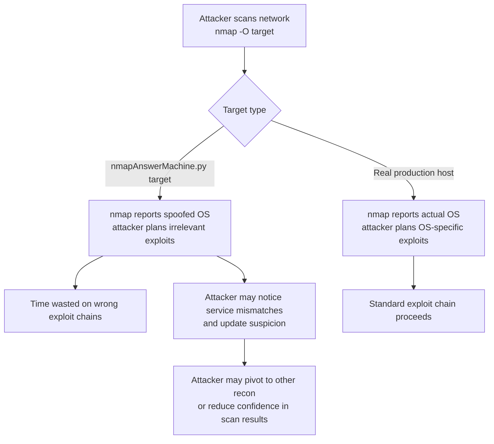
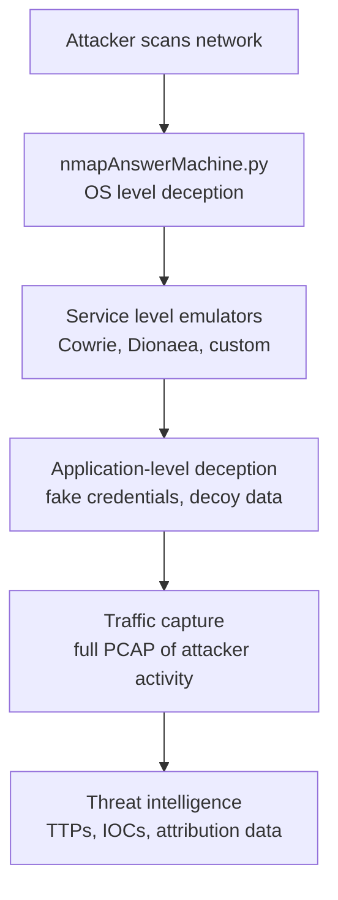
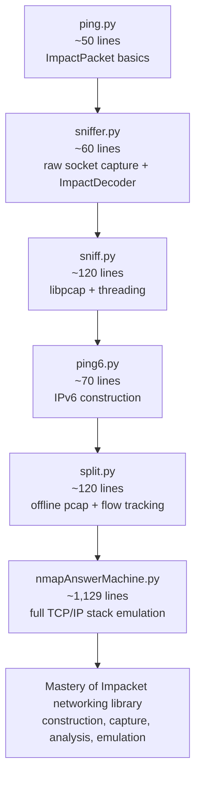

title: "nmapAnswerMachine.py"
script: "examples/nmapAnswerMachine.py"
category: "Network Analysis"
status: "Published"
protocols:
  - IP
  - ARP
  - TCP
  - UDP
  - ICMP
ms_specs: []
mitre_techniques:
  - T1036
  - T1497.001
auth_types: []
tags:
  - impacket
  - impacket/examples
  - category/network_analysis
  - status/published
  - status/deprecated_upstream
  - protocol/ip
  - protocol/arp
  - protocol/tcp
  - protocol/udp
  - protocol/icmp
  - technique/os_fingerprint_spoofing
  - technique/nmap_evasion
  - technique/honeypot_research
  - technique/passive_active_deception
  - technique/sequence_number_emulation
  - mitre/T1036
  - mitre/T1497.001
aliases:
  - nmapAnswerMachine
  - nmap-os-spoofer
  - nmap-fingerprint-emulator
  - tcp-stack-impersonator
  - os-detection-deceiver


# nmapAnswerMachine.py

> **One line summary:** The most ambitious and most unusual tool in all of Impacket: a 1,129 line research artifact that reads nmap's OS fingerprint database (`/usr/share/nmap/nmap-os-db`) and emulates the TCP/IP stack of an arbitrary operating system at the raw packet level so that an attacker running `nmap -O` against the host running this tool sees a spoofed OS in the OS detection output instead of the actual underlying Linux; constructs and answers ARP, IP, ICMP, TCP, and UDP probes from a virtual MAC and IP combination of `01:02:03:04:05:06` / `192.168.67.254` (defaults) on a chosen interface (default `eth0`), implements all of nmap's individual TCP/IP probes (SEQ1-SEQ6 for sequence prediction analysis, ECN for explicit congestion notification probe, T2-T7 for the seven additional TCP probes, IE/ICMP_1 and ICMP_2 for the two ICMP echo probes, U1 for the closed port UDP probe) by reading the target fingerprint from nmap's database and emitting responses with exactly the IP ID generation pattern, TCP initial sequence number standard deviation, TCP timestamp progression rate, TCP window size, TCP options ordering, ICMP code reflection, and dozens of other per test fields that the chosen fingerprint specifies; **tagged for deprecation in Impacket 0.11.0 (August 2023)** by Fortra and currently in unmaintained limbo, with documented `ModuleNotFoundError: No module named 'uncrc32'` on standard installs because the script depends on a now-missing CRC32 reversal helper module; despite (or perhaps because of) the deprecation status, conceptually the tool is one of the most fascinating things in the Impacket source tree, demonstrating in concrete code that OS fingerprinting via active probes is fundamentally a game where the defender holds the cards if they choose to play, and providing a complete reference implementation of how to emulate nmap's entire TCP/IP fingerprint test battery from scratch; **closes Network Analysis at 7 of 7 articles ✅, making it the 12th complete category for the wiki (92% complete by category, leaving only Recon and Enumeration for the path to 13/13 = 100%)**.

| Field | Value |
|:---|:---|
| Script | `examples/nmapAnswerMachine.py` |
| Category | Network Analysis |
| Status | Published in wiki; **DEPRECATED upstream in Impacket 0.11.0 (August 2023)** per Fortra release notes |
| Authors | Not attributed in source header; the underlying `impacket.examples.os_ident` module appears to be Gerardo Richarte's work |
| Implementation size | **1,129 lines** (913 LOC) - by far the largest tool in Network Analysis category |
| Primary protocols | IP, ARP, TCP, UDP, ICMP at raw packet level |
| MITRE ATT&CK techniques | T1036 Masquerading (deception primitive), T1497.001 Virtualization/Sandbox Evasion: System Checks (related research area) |
| Authentication | None (operates at raw packet level on an interface) |
| Privileges required | Root or `CAP_NET_RAW` on Linux (raw socket capture and injection) |
| Default emulated fingerprint | `Sun Solaris 10 (SPARC)` (hardcoded in source; many alternatives commented out) |
| Default IP and MAC | `192.168.67.254` and `01:02:03:04:05:06` |
| Default open ports | TCP 80, 443; UDP 111 |
| External dependencies | `pcapy` for capture and injection, `nmap-os-db` file from nmap install, **`uncrc32` module which is NOT included in standard distributions** (causes ModuleNotFoundError on most setups, see Issue #1406) |
| Known broken state | The `uncrc32` import failure is documented in upstream Issue #1406; tool fails to load on standard Impacket installs without manual `uncrc32` provisioning |


## Prerequisites

This article assumes familiarity with:

- [`sniff.py`](sniff.md) for the libpcap based capture model. nmapAnswerMachine.py uses pcapy in the same way for both capture (probes incoming) and injection (responses outgoing).
- [`ping.py`](ping.md) and [`ping6.py`](ping6.md) for `ImpactPacket` construction. nmapAnswerMachine.py is the most extreme example of `ImpactPacket` use in Impacket - it constructs Ethernet, IP, ARP, ICMP, TCP, UDP, and TCPOption objects at scale to produce responses across the entire nmap2 probe battery.
- nmap OS detection basics: `nmap -O` sends approximately 16 specific probes (six TCP SYN sequence probes to an open port, the ECN probe, six additional TCP probes to closed and open ports under various flag combinations, two ICMP echo probes, and one UDP probe to a closed port) and uses the responses to compute a fingerprint that gets matched against the nmap-os-db database for OS identification.
- The nmap fingerprint format basics: each fingerprint is a multi line record with test sections like `SEQ(SP=...%GCD=...%ISR=...%TI=...%CI=...%II=...%SS=...%TS=...)` that document the expected behavior across all of the OS detection probes.


## What it does

`nmapAnswerMachine.py` listens on a specified network interface for raw IP, ARP, TCP, UDP, and ICMP traffic destined for a virtual IP address it owns, and responds to each probe with packets crafted specifically to match the TCP/IP behavior of an arbitrary operating system selected from nmap's fingerprint database. The result is that any host scanning the virtual IP with `nmap -O` receives responses indistinguishable (to nmap) from the chosen OS.

### Default invocation

```text
$ sudo python nmapAnswerMachine.py -i eth0 -p 192.168.66.254 -f 'Sun Solaris 9 (SPARC)'
Initializing ARPResponder
Initializing OpenUDPResponder
Initializing ClosedUDPResponder
Initializing OpenTCPResponder
Initializing ClosedTCPResponder
Initializing nmap2_SEQ1
Initializing nmap2_SEQ2
... (continues for all 14 nmap2 specific responders) ...
IP ID Delta: 1
IP ID ICMP Delta: 1
TCP ISN Delta: 0.043893
TCP ISN Standard Deviation: 138504.875000
TCP TS Delta: 0.220000
```

After initialization, the tool enters an infinite loop waiting for packets. When packets arrive matching one of the registered responder classes, the appropriate response is constructed using fields from the loaded fingerprint and injected back onto the wire.

### What an nmap scan sees

From a separate host on the same network:

```text
$ sudo nmap -O 192.168.66.254
Starting Nmap 7.94 ( https://nmap.org )
Nmap scan report for 192.168.66.254
Host is up (0.0012s latency).
PORT     STATE SERVICE
80/tcp   open  http
443/tcp  open  https
111/udp  open  rpcbind

Device type: general purpose
Running: Sun Solaris 9
OS CPE: cpe:/o:sun:solaris:9
OS details: Sun Solaris 9 (SPARC)

OS detection performed.
```

The host running nmapAnswerMachine.py is reported as Sun Solaris 9 SPARC. The actual underlying OS is whatever Linux distribution is running the script. nmap is fooled because every probe response matches what nmap's database says Solaris 9 SPARC produces.

### Switching OS personalities

The `-f` flag selects which OS to emulate. Any string matching an `Fingerprint` line in `nmap-os-db` works:

```bash
sudo python nmapAnswerMachine.py -i eth0 -p 192.168.66.254 -f 'Microsoft Windows XP SP3'
sudo python nmapAnswerMachine.py -i eth0 -p 192.168.66.254 -f 'Cisco IOS 12.4'
sudo python nmapAnswerMachine.py -i eth0 -p 192.168.66.254 -f 'FreeBSD 6.1-RELEASE'
sudo python nmapAnswerMachine.py -i eth0 -p 192.168.66.254 -f 'Apple Mac OS X 10.5.6 (Leopard) (Darwin 9.6.0)'
```

The fingerprint database contains thousands of OS records. The tool reads the database at startup, finds the matching record, and parameterizes its responder classes from that record's test fields.


## Why it exists

### The OS fingerprinting arms race

nmap's `-O` flag implements active OS fingerprinting: nmap sends a specific battery of probes to a target and analyzes the responses. Different operating systems implement TCP/IP slightly differently - initial sequence number generation algorithms, IP ID generation patterns, default TCP window sizes, TCP options ordering, ICMP code reflection behavior, response to packets with reserved bits set, response to malformed flag combinations, and dozens of other behaviors.

These behavioral fingerprints are stable per OS version and detectable from the network. `nmap -O` codifies the behaviors into a fingerprint database (`nmap-os-db`) currently containing thousands of recognized OS variants. The file documents each OS's expected response pattern across approximately 16 distinct probes:

- **SEQ probe**: six TCP SYN probes to an open port at varying intervals to characterize ISN generation.
- **OPS probe**: TCP options ordering across the six SEQ probes.
- **WIN probe**: TCP window sizes across the six SEQ probes.
- **ECN probe**: TCP probe with ECN bits set to characterize ECN response.
- **T1**: response to first SEQ probe (already covered above but separately tested).
- **T2-T7**: six additional TCP probes with various flag combinations to open and closed ports.
- **U1**: UDP probe to a closed port (analyzes ICMP unreachable response).
- **IE**: two ICMP echo probes with varying TOS, code, and sequence values.

The probe responses are aggregated into a fingerprint structure that nmap matches against its database. When match is exact or close, nmap reports the OS with high confidence.

The defensive question becomes: what if a host could deliberately respond to all of these probes in the way some other OS would respond? The defender would gain plausible deniability about what OS they're actually running; attackers would have an unreliable basis for choosing exploitation paths.

### nmapAnswerMachine.py as defensive research

nmapAnswerMachine.py is the proof of concept for that idea. The tool reads nmap's own database (the same file nmap uses at runtime), parses out a chosen fingerprint, and constructs responder classes that emit responses matching the fingerprint's specified behaviors across the entire test battery. An attacker running `nmap -O` against the tool sees the spoofed OS, not Linux.

The implications:

- **Honeypots can lie credibly about their OS.** A Linux honeypot pretending to be a vulnerable Windows XP SP3 box is more attractive to attackers targeting Windows-specific exploits.
- **Production servers can lie about their OS.** A modern hardened Linux server can present as old Solaris, confusing attackers and wasting their reconnaissance time on irrelevant OS-specific exploit chains.
- **Penetration testing exercises can train detection.** A red team can test whether blue team detection correctly handles OS fingerprint anomalies.
- **OS fingerprinting becomes inherently untrustworthy.** Defenders can demonstrate that nmap OS detection should never be the sole basis for security decisions.

The tool is research code rather than production tooling. It's not designed to be embedded in honeypot frameworks (although it could be), it's not packaged for ease of deployment, and it has rough edges (the `uncrc32` dependency, the deprecation status, the lack of IPv6 support). What it provides is the reference implementation of "this is how you'd actually do it" - the demonstration that the entire nmap fingerprint vocabulary can be reproduced from a different OS to defeat detection.

### Why ship it in Impacket

The tool exists in Impacket because Impacket already has the lower level pieces:

- `impacket.ImpactPacket` for constructing arbitrary Ethernet, IP, ARP, ICMP, TCP, UDP packets at the byte level.
- `impacket.ImpactDecoder` for parsing arbitrary incoming packets.
- `impacket.examples.os_ident` for the nmap fingerprint format parser (the `NMAP2_Fingerprint_Matcher` class) and the per probe template classes (`nmap2_seq_1` through `nmap2_seq_6`, `nmap2_ecn_probe`, `nmap2_tcp_open_2/3/4`, `nmap2_tcp_closed_1/2/3`, `nmap2_icmp_echo_probe_1/2`).
- `pcapy` for raw packet capture and injection.

With those pieces, building the answer machine is "just" the (substantial) work of mapping each fingerprint test field into the corresponding packet construction logic. The tool's 1,129 lines are largely test by test mapping of fingerprint fields ("if SI==Z set ICMP sequence to 0; if SI==S echo probe sequence; if numeric, set to that value") onto outbound packet construction.

The tool is significantly larger and more complex than other Network Analysis tools (sniffer.py at ~60 lines, ping.py at ~50, sniff.py at ~120, split.py at ~120) because the fingerprint vocabulary is large. There is no shortcut: faithfully emulating an OS's network stack across all of nmap's probes requires explicit handling of each probe and response pattern.

### Why deprecation

In August 2023 with the Impacket 0.11.0 release, Fortra announced that nmapAnswerMachine.py was tagged for deprecation in the next release. Per the Core Security release notes:

> With the goal of better managing the library and prioritizing the latest and most required use cases, we are tagging a select group of examples as "to be deprecated." We are not removing them at once, and will give the notice a version in advance to provide ample time to prepare for the change. These are the ones marked to be deprecated in the next release: examples/nmapAnswerMachine.py

The tool was singled out among many examples. Likely reasons:

- The `uncrc32` external dependency makes installation nontrivial.
- The nmap fingerprint database format has evolved since the tool was written, and parts of the script no longer match modern nmap behavior cleanly.
- Maintenance burden vs operational use ratio is unfavorable: complex code, narrow research use case, few users.
- The `os_ident` module that supports it is also legacy code.

The deprecation reflects practical maintenance concerns, not any reduction in the tool's conceptual value. As of the wiki's writing, the tool is still in the Impacket source tree but emits deprecation warnings when run and may be removed entirely in a future release.

For this wiki, the documentation value remains high precisely because the tool demonstrates concepts that are unlikely to be reimplemented elsewhere in any open source tool in this depth. Documenting it now while it still ships preserves the institutional knowledge.


## Protocol theory

### nmap OS detection probe battery

`nmap -O` sends approximately 16 packets in a specific sequence and analyzes responses. The probes:

| Probe | Type | Target | Purpose |
|:---|:---|||
| **SEQ1-SEQ6** | TCP SYN | Open port | Initial sequence number prediction (ISN sampling at varying intervals) |
| **OPS1-OPS6** | (computed from SEQ) | - | TCP options ordering analysis across the 6 SEQ probes |
| **WIN1-WIN6** | (computed from SEQ) | - | TCP window size analysis across the 6 SEQ probes |
| **ECN** | TCP with ECN flags | Open port | Explicit Congestion Notification handling |
| **T2** | TCP no flags | Open port | Behavior with no flag bits set |
| **T3** | TCP SYN+FIN+URG+PSH | Open port | Behavior with multiple incompatible flags |
| **T4** | TCP ACK | Open port | ACK-only behavior |
| **T5** | TCP SYN | Closed port | SYN to closed port behavior |
| **T6** | TCP ACK | Closed port | ACK to closed port behavior |
| **T7** | TCP FIN+PSH+URG | Closed port | FIN combination to closed port |
| **U1** | UDP | Closed port | ICMP unreachable response analysis |
| **IE / ICMP_1** | ICMP echo | - | Standard ICMP echo with varying TOS |
| **ICMP_2** | ICMP echo | - | Second ICMP echo with different TOS, code, sequence |

For each probe, nmap records dozens of fields from the response. Over all probes, the aggregated fingerprint contains approximately 100 distinct fields.

### nmap fingerprint format

A simplified example fingerprint from `nmap-os-db`:

```text
Fingerprint Sun Solaris 9 (SPARC)
Class Sun | Solaris | 9 | general purpose
SEQ(SP=A0-CA%GCD=1-6%ISR=A8-D8%TI=I%II=I%SS=S%TS=A)
OPS(O1=M5B4NW0NNT11%O2=M5B4NW0NNT11%...)
WIN(W1=60E8%W2=60E8%...)
ECN(R=Y%DF=Y%T=3B-45%TG=40%W=60E8%O=M5B4NW0%CC=N%Q=)
T1(R=Y%DF=Y%T=3B-45%TG=40%S=O%A=S+%F=AS%RD=0%Q=)
T2(R=N)
T3(R=Y%DF=Y%T=3B-45%TG=40%W=60E8%S=O%A=S+%F=AS%O=M5B4NW0NNT11%RD=0%Q=)
T4(R=Y%DF=N%T=3B-45%TG=40%W=0%S=A%A=O%F=R%O=%RD=0%Q=)
T5(R=Y%DF=Y%T=3B-45%TG=40%W=0%S=Z%A=S+%F=AR%O=%RD=0%Q=)
T6(R=Y%DF=N%T=3B-45%TG=40%W=0%S=A%A=O%F=R%O=%RD=0%Q=)
T7(R=Y%DF=Y%T=3B-45%TG=40%W=0%S=Z%A=S+%F=AR%O=%RD=0%Q=)
U1(R=Y%DF=N%T=FA-FF%TG=FF%IPL=70%UN=0%RIPL=G%RID=G%RIPCK=G%RUCK=G%RUD=G)
IE(R=Y%DFI=N%T=FA-FF%TG=FF%CD=S)
```

Each test section has key=value pairs documenting the expected behavior. nmapAnswerMachine.py reads this exact format and programmatically applies each field when building responses.

### Fingerprint field semantics

Some of the most operationally important fields:

**SEQ section**:
- `SP`: TCP ISN standard deviation (used for sequence prediction difficulty assessment).
- `GCD`: TCP ISN greatest common divisor.
- `ISR`: TCP ISN counter rate (used to predict next ISN).
- `TI`: IP ID generation algorithm for TCP (`I` = increment by 1, `BI` = broken increment of 256, `RI` = random increment, `RD` = random, `Z` = zero, `O` = other).
- `II`: IP ID generation for ICMP probes.
- `SS`: Shared sequence between TCP and ICMP.
- `TS`: TCP timestamp option progression rate.

**Per test fields (T1-T7, ECN, U1)**:
- `R`: Whether there's a response at all (`Y` / `N`).
- `DF`: Don't fragment bit set (`Y` / `N`).
- `T`: Initial TTL range.
- `TG`: Initial TTL guess.
- `W`: TCP window size.
- `O`: TCP options encoded as a string (`M5B4` = MSS 0x5B4, `N` = NOP, `W0` = window scale 0, `S` = SACK permitted, `T11` = timestamp with TSval and TSecr present).
- `S`: TCP sequence number (`Z` = zero, `A` = same as ACK, `A+` = ACK+1, `O` = other).
- `A`: TCP acknowledgement (`Z` = zero, `S` = probe sequence, `S+` = probe sequence + 1, `O` = other).
- `F`: TCP flags (`E` = ECE, `U` = URG, `A` = ACK, `P` = PSH, `R` = RST, `S` = SYN, `F` = FIN).
- `Q`: Quirks (`R` = reserved bit set, `U` = urgent pointer nonzero with URG flag clear).
- `RD`: TCP RST data CRC32 checksum.

**ICMP-specific (IE)**:
- `DFI`: DF response (`N` = never, `Y` = always, `S` = same as probe, `O` = opposite).
- `DLI`: ICMP data length echo (`Z` = no echo, `S` = same).
- `SI`: ICMP sequence reflection (`Z` = zero, `S` = echo).
- `CD`: ICMP code reflection.
- `TOSI`: TOS reflection.

**U1-specific**:
- `IPL`: IP packet length in response.
- `UN`: ICMP unused field value.
- `RIPL`, `RID`, `RIPCK`, `RUCK`, `RUD`: Whether the original packet's various fields are quoted unchanged or corrupted in specific ways.

The fingerprint vocabulary is large because nmap exploits all of these subtle behaviors for OS identification. Faithful emulation requires handling every one.

### The TCP RST data CRC trick (`RD` field)

An especially clever nmap detection technique: some operating systems include readable by humans data in TCP RST packets (text like "TCP Port is closed"). The `RD` field in a fingerprint records the CRC32 of that data. To emulate an OS that does this, nmapAnswerMachine.py needs to construct RST packets whose data has exactly the target CRC32.

This requires the `uncrc32` module: a CRC32 reversal helper that, given a target CRC and base data, computes the bytes to append so the result matches. The script's logic:

```python
crc = int(crc, 16)
data = 'TCP Port is closed\x00'
data += uncrc32.compensate(data, crc)
```

`uncrc32.compensate()` returns the bytes that, when appended to `data`, produce the target CRC. The output looks like garbage but produces a valid match.

This is also why nmapAnswerMachine.py is broken on standard installs: `uncrc32` is not in PyPI under that name and is not bundled with Impacket. Issue #1406 documents the resulting `ModuleNotFoundError`. To use the tool, a user must locate or write a compatible `uncrc32` module first.

### Sequence number generation emulation

The `SEQ.GCD`, `SEQ.ISR`, and `SEQ.SP` fields fully characterize an OS's TCP ISN generation:

- **GCD** (Greatest Common Divisor): all sampled ISNs share this divisor.
- **ISR** (Initial Sequence Rate): the rate at which ISNs increase per second.
- **SP** (Sequence Predictability index): standard deviation of the ISN samples.

nmapAnswerMachine.py implements this via the `initTCPISNGenerator` method:

```python
self.tcp_ISN_GCD = int(seq['GCD'].split('-')[0], 16)
isr = int(seq['ISR'], 16)
sp = int(seq['SP'].split('-')[0], 16)
self.tcp_ISN_stdDev = (2**(sp/8.0)) * 5 / 4
self.tcp_ISN_delta = 2**(isr/8.0) * self.AssumedTimeIntervalPerPacket
```

Each call to `getTCPSequence()` returns a value that satisfies the GCD constraint, increments at the ISR rate, and varies according to the SP standard deviation. nmap samples ISNs across the SEQ1-SEQ6 probes and computes its own GCD, ISR, and SP from the samples; if those match the database, OS identification succeeds.

The `AssumedTimeIntervalPerPacket = 0.11` constant is a calibration: nmap sends SEQ probes at approximately this interval, and the ISN delta calculation assumes that interval. Different scan timing options change this assumption and could potentially break the emulation.


## How the tool works internally

### Architecture

Two top level classes plus 15+ Responder subclasses:

- **`Machine`**: holds the virtual host state (interface, IP, MAC, open ports, fingerprint, generators for IP ID + TCP ISN + TCP timestamp). Owns the pcapy capture session and the list of responder objects.
- **`Responder`**: base class for the logic that handles packets. Each subclass handles one type of incoming probe.

The main loop in `Machine.run()`:

```python
while 1:
    p = self.pcap.next()
    in_onion = [self.decoder.decode(p[1])]
    while 1: in_onion.append(in_onion[-1].child())  # decode the layer onion
    for r in self.responders:
        if r.process(in_onion): break  # first matching responder wins
```

Each captured packet is decoded into a layered "onion" (Ethernet → IP → TCP/UDP/ICMP → data). The list of responders is iterated; the first responder whose `isMine()` method returns True processes the packet and the loop moves on.

### The Responder pattern

Each Responder class has:

- `templateClass`: an `os_ident` template (e.g., `os_ident.nmap2_seq_1`) describing the probe shape.
- `signatureName`: the fingerprint test name to consult (e.g., `T1`, `ECN`, `IE`).
- `isMine(in_onion)`: returns True if this packet matches the template (correct flags, options, ICMP type, etc.).
- `buildAnswer(in_onion)`: constructs the response packet by reading fingerprint fields and applying them to a freshly built outbound onion.

`isMine()` does template matching: for the T1 responder, the incoming TCP must have the SYN flag set, the destination port must be open, and TCP options must match the T1 template options exactly. This is how nmap's distinct probes get routed to distinct responders despite all hitting the same destination IP.

### Generic responders (without fingerprint use)

Five generic responders handle baseline traffic that any host needs to handle:

- `ARPResponder`: replies to ARP requests for the virtual IP.
- `OpenUDPResponder`: ACKs UDP packets to open UDP ports.
- `ClosedUDPResponder`: sends ICMP port unreachable for UDP packets to closed ports.
- `OpenTCPResponder`: SYN+ACK for TCP SYN to open ports.
- `ClosedTCPResponder`: RST+ACK for TCP SYN to closed ports.

These don't consult the fingerprint - they're standard TCP/IP behavior. They handle the host's overall reachability so nmap can complete its initial port scan before getting to OS detection.

### NMAP2 specific responders

The fingerprinted responders, one per nmap2 probe:

- `nmap2_SEQ1` through `nmap2_SEQ6`: handle the six TCP SYN sequence probes. Each consults the T1 fingerprint section plus the per probe OPS and WIN entries.
- `nmap2_ECN`: handles the ECN probe.
- `nmap2_T2` through `nmap2_T7`: handle the six additional TCP probes with various flag combinations.
- `nmap2_ICMP_1` and `nmap2_ICMP_2`: handle the two ICMP echo probes.
- `NMAP2UDPResponder`: handles the U1 closed port UDP probe with crafted ICMP unreachable response.

Each of these responders contains the test specific logic that maps fingerprint fields into packet fields. The `nmap2_SEQ1.buildAnswer()` for example calls `setTTLFromFingerprint`, sets the window from `W`, sets ECN flags from `CC`, sets TCP options from `O`, sets sequence number from `S`, sets ACK from `A`, sets quirks from `Q`, sets flags from `F`, computes RST data with CRC compensation from `RD`. Each field has a small parser that handles the compact nmap fingerprint format.

### UDP command channel

A small extra: `UDPCommandResponder` opens UDP port 12345 and accepts text commands. Two commands implemented:

- `cmd:exit` - terminates the script.
- `cmd:who` - returns the currently emulated OS fingerprint name.

Useful for remote control of a deployed instance:

```bash
echo cmd:who | nc -u 192.168.66.254 12345
echo cmd:exit | nc -u 192.168.66.254 12345
```

This responder is commented out in the default `initResponders` function but easily enabled by uncommenting one line. It's a small operational nicety for honeypot deployment.

### What the tool does NOT do

- Does NOT support IPv6. All responders are IPv4-only.
- Does NOT actually serve real services on the open ports. Just answers the TCP handshake; the connection then sits open until reset by timeout. A real attacker would discover nonfunctional services quickly.
- Does NOT defeat nmap's service version detection (`nmap -sV`). Service banners are not emulated; banner grab probes get no useful response.
- Does NOT defeat nmap's script scanning (`nmap --script`). NSE scripts probe specific service behaviors; emulation here is OS level only.
- Does NOT handle nmap timing options well. Aggressive timing (`-T5`) may break the ISN generator's calibrated interval assumptions.
- Does NOT work without `uncrc32`. Standard installs hit `ModuleNotFoundError`.
- Does NOT handle multiple concurrent attackers gracefully. Single virtual IP, single fingerprint, single host emulated.
- Does NOT randomize MAC or IP. Hardcoded defaults; manual configuration required for other than the default values.
- Does NOT integrate with honeypot frameworks (Honeyd, Cowrie, etc.). Standalone tool.
- Does NOT generate session traffic patterns. A skilled attacker analyzing traffic over time would notice the absence of background activity normal for a real system.
- Does NOT defend against passive OS fingerprinting (p0f and similar). Those tools observe traffic the host generates spontaneously; nmapAnswerMachine.py is purely reactive.
- Does NOT keep up with modern nmap fingerprint format extensions. Some test fields added in newer nmap versions may not be handled correctly.


## Practical usage

### Basic deployment

```bash
sudo python nmapAnswerMachine.py \
    -i eth0 \
    -p 192.168.66.254 \
    -f 'Sun Solaris 9 (SPARC)' \
    -d /usr/share/nmap/nmap-os-db
```

Listens on eth0, owns the virtual IP 192.168.66.254, emulates Solaris 9 SPARC, reads fingerprints from the standard nmap database location.

### Verification from a separate scanner host

```bash
# From a different host on the same network
sudo nmap -O 192.168.66.254
```

Should report the spoofed OS in the OS detection output. If nmap reports "No OS matches for host" or reports the actual underlying OS, the emulation is failing somewhere - likely missing or incorrect fingerprint fields, or the modern nmap fingerprint database has evolved beyond what the tool implements.

### Testing different fingerprints

The script's source contains many commented out fingerprint candidates:

```python
# Fingerprint = 'Adtran NetVanta 3200 router'
# Fingerprint = 'ADIC Scalar 1000 tape library remote management unit'
# Fingerprint = 'Siemens Gigaset SX541 or USRobotics USR9111 wireless DSL modem'
# Fingerprint = 'Apple Mac OS X 10.5.6 (Leopard) (Darwin 9.6.0)'
Fingerprint = 'Sun Solaris 10 (SPARC)'
# Fingerprint = 'Microsoft Windows 98 SE'
# Fingerprint = 'Microsoft Windows NT 4.0 SP5 - SP6'
# Fingerprint = 'Microsoft Windows Vista Business'
# Fingerprint = 'FreeBSD 6.1-RELEASE'
# Fingerprint = '2Wire 1701HG wireless ADSL modem'
# Fingerprint = 'Cisco Catalyst 1912 switch'
```

Each comment includes notes about what specific fingerprint feature makes that target interesting (`TI=Z TOSI=Z`, `DFI=O U1(DF=N IPL=38)`, etc.). These were exercised by the original developers to test edge cases in the fingerprint vocabulary.

### Honeypot deployment scenario

For a credible honeypot:

1. **Choose a target OS** that's attractive to the attacker profile you want to engage. For ransomware attackers in 2026, "Microsoft Windows Server 2012 R2" might be appropriate (out of support, frequently still deployed, known vulnerable to many exploits).
2. **Configure open ports** matching real services that OS would expose. For Windows server: 135, 139, 445, 3389. Adjust `OPEN_TCP_PORTS` in the source.
3. **Pair with a service emulator** that responds to actual application protocols on those ports. nmapAnswerMachine.py only emulates the TCP/IP stack; SMB/RDP/RPC service behavior requires additional tooling (Cowrie for SSH, Dionaea for SMB, custom emulators for others).
4. **Network placement** matters. The honeypot must be reachable from the attacker's network position but should not be in production traffic paths.
5. **Monitor traffic** to and from the honeypot via separate capture infrastructure. The honeypot's value is the data collected from attacker interactions, not the emulation per se.

The tool's role in a honeypot stack is the OS level deception: when an attacker runs `nmap -O` to identify the target before exploiting, they see an attractive OS rather than an obviously fake honeypot.

### Penetration testing exercise: detection drill

For a blue team detection drill:

1. Deploy nmapAnswerMachine.py on a test segment.
2. Have red team scan with `nmap -O` and report results.
3. Verify that blue team SOC tooling detects either the deception (network anomaly: a single host responding as multiple different OSes over time as fingerprint is changed) or the underlying activity (raw socket creation on the host running the tool).
4. Tune detection rules accordingly.

### Resolving the uncrc32 dependency

The most common operational blocker. Options:

```bash
# Option 1: locate the original uncrc32 module
# (search GitHub for uncrc32.py; some forks and security tool repos include it)
find / -name "uncrc32*" 2>/dev/null

# Option 2: write a stub that returns dummy bytes
cat > uncrc32.py <<'EOF'
def compensate(data, crc):
    # Returns 4 bytes that don't actually produce target CRC.
    # Result: the RD field test will fail, but most other tests work.
    return b'\x00\x00\x00\x00'
EOF

# Option 3: implement actual CRC32 reversal (mathematical, ~50 lines)
```

Option 2 is the quickest fix but means the `RD` test for any chosen fingerprint will be wrong; nmap will note discrepancy in the RD field. For OSes whose fingerprints don't include RD, this doesn't matter.

### Key flags

| Flag | Meaning | Default |
|:---|:---||
| `-i <interface>` | Network interface to listen on | `eth0` |
| `-p <ip>` | Virtual IP address to own | `192.168.67.254` |
| `-m <mac>` | Virtual MAC address | `01:02:03:04:05:06` |
| `-f <fingerprint>` | Fingerprint name from nmap-os-db | `Sun Solaris 10 (SPARC)` |
| `-d <path>` | Path to nmap-os-db file | `/usr/share/nmap/nmap-os-db` |
| `-o <ports>` | Open TCP ports (comma separated) | `80,443` |
| `-u <ports>` | Open UDP ports (comma separated) | `111` |

The defaults are oriented toward research deployment; operational use requires customizing IP, MAC, ports, and fingerprint for the specific scenario.


## What it looks like on the wire

### ARP exchange

Initial probe from scanner: ARP request for 192.168.66.254. Response: ARP reply from MAC 01:02:03:04:05:06 (or whatever was configured). This is how the scanner learns the virtual host exists.

### Open port SYN response

Scanner sends TCP SYN to port 80. Response: SYN+ACK from 192.168.66.254:80 with all the TCP options, window size, ISN characteristics, IP TTL, IP ID, and other fields specified by the loaded fingerprint. Wireshark dissects this normally; only careful analysis of the fingerprint level details reveals the spoof.

### Closed port behavior

Scanner sends TCP SYN to port 22 (assuming closed). Response: TCP RST+ACK with the specific window value, sequence policy, and (if the fingerprint specifies it) RST data with the CRC32 compensated payload that matches the target OS's behavior.

### ICMP echo response

Scanner sends ICMP echo. Response: ICMP echo reply with the TOS reflection policy, code reflection policy, sequence echo policy, and IP DF bit handling specified by the fingerprint's IE section.

### U1 closed port UDP behavior

Scanner sends UDP probe to a closed port. Response: ICMP port unreachable with the specific IP length, unused field value, and quoted packet preservation policy specified by the fingerprint's U1 section. This includes the TCP RST data CRC trick if applicable.

### Wireshark filter for capture

```text
host 192.168.66.254
```

Captures all bidirectional traffic to the virtual IP. nmap's probe sequence is visible: the 6 SEQ probes spaced ~110ms apart, followed by ECN, T2-T7, IE probes, and U1, all completing in about 1-2 seconds for a typical scan.

For analysis, a researcher can compare the captured response patterns against the loaded fingerprint to verify that each response matches the specification. Where they don't match, that's a tool bug or unhandled fingerprint field.


## What it looks like in logs

### Host running nmapAnswerMachine.py

- Process named `python` running `nmapAnswerMachine.py`.
- Holding raw socket open via pcapy. This is visible in `ss -p` or `lsof -p PID`.
- Likely high CPU during active scans (each probe triggers decoder traversal + responder dispatch + outbound packet construction).
- File descriptor count modest (one for capture, one or two for log output, no per flow file handles).
- Process console output: lines like `Got packet for nmap2_SEQ1`, `--> Packet sent:`, etc. Useful for verifying the tool is working.

### Linux audit signals

`auditd` would log:

- Process start with execve of python.
- Raw socket creation via `socket(AF_PACKET, SOCK_RAW, ...)` (for pcapy).
- Setting `CAP_NET_RAW` if the process was started with that capability rather than as root.
- Network packet injection via raw socket sendto.

A monitoring policy alerting on raw socket creation would catch nmapAnswerMachine.py at process start.

### Network sensor signals

From an out of band IDS observing the traffic to and from the virtual IP:

- One IP responding to ARP with one MAC.
- TCP/ICMP/UDP responses with characteristics matching the loaded fingerprint.
- If the loaded fingerprint changes between sessions, the same MAC/IP exhibits different OS behaviors on different days. This is a strong anomaly signal: real hosts don't change their TCP/IP stack overnight.
- If multiple instances of nmapAnswerMachine.py run with different IPs on the same network, all returning interesting and varied OS fingerprints, the absence of any production traffic from those IPs is itself anomalous.

### Detection from the scanner side

If a defender wanted to detect that nmapAnswerMachine.py is being used against them (rather than scanning a real Solaris box):

- **Application layer probe**: connect to TCP 80 and try HTTP. A real Solaris box hosting a web service would respond with a banner; nmapAnswerMachine.py just leaves the connection open.
- **Service version scan**: `nmap -sV` exercises actual service banners. Mismatches between OS detection and service banner inconsistencies suggest deception.
- **Behavioral over time**: a real host generates background traffic (DNS queries, NTP, software update checks). A pure emulation host generates only response traffic. Multi day passive monitoring reveals this.
- **Service interaction**: try to actually log into the supposedly open services. Real services authenticate or refuse meaningfully; emulated TCP handshakes drop the connection on first application layer payload.

These detections are why nmapAnswerMachine.py works best as a deception primitive paired with real (or realistically emulated) services, not as a standalone defensive tool.


## Detection and defense

### What the tool is and isn't useful for

**Useful for**:
- **Research demonstrations** that OS fingerprinting via active probes is fundamentally circumventable.
- **Honeypot OS-layer deception** as one component in a broader honeypot stack.
- **Blue team training** on detecting OS fingerprint anomalies and probing limitations.
- **Network deception experiments** in lab environments.
- **Educational reference** for understanding what nmap actually does and how OS fingerprinting works at the protocol level.

**Not useful for**:
- **Production network defense** as a standalone tool.
- **Hiding from determined attackers** who use multiple reconnaissance methods.
- **Fooling passive fingerprinting** (p0f and similar).
- **Defeating service version detection** without companion service emulation.

### Defensive principles the tool illustrates

- **OS detection should never be authoritative**. Any defender or security tool that makes decisions based on `nmap -O` output is making decisions based on data that can be deliberately falsified.
- **Layered detection beats single probe identification**. nmap fingerprinting + service banner check + behavioral analysis + log correlation produces much higher confidence than any single technique.
- **Deception works best when comprehensive**. Faking OS at the TCP/IP layer while running an obviously default Linux service banner contradicts itself. Effective deception coordinates across all observable layers.

### What nmapAnswerMachine.py does NOT enable

- Does NOT enable any direct attack capability. It is a defensive deception primitive.
- Does NOT enable bypassing authentication or access controls. Pure protocol level emulation.
- Does NOT enable command and control or persistence mechanisms.
- Does NOT exfiltrate data.
- Does NOT establish actual services that an attacker could exploit.

The tool is unambiguously defensive in nature. Even in offensive research contexts (red team learning), its use is to study deception, not to enable any other attack class.


## Related tools and attack chains

nmapAnswerMachine.py **closes Network Analysis at 7 of 7 articles ✅, making it the 12th complete category for the wiki (92% complete by category)**. Only Recon and Enumeration (9/17, 53%) remains for the path to 13/13 = 100%.

### Related Impacket tools

- [`sniff.py`](sniff.md), [`sniffer.py`](sniffer.md), and [`split.py`](split.md) - the analysis side tools in Network Analysis. nmapAnswerMachine.py uses pcapy in much the same way for capture and adds outbound injection.
- [`ping.py`](ping.md) and [`ping6.py`](ping6.md) - the construction side tools. nmapAnswerMachine.py is the most extreme example of `ImpactPacket` use in Impacket, demonstrating Ethernet, IP, ARP, ICMP, TCP, UDP, and TCPOption construction at the byte level for response generation.
- The `impacket.examples.os_ident` module is shared infrastructure used by nmapAnswerMachine.py (for fingerprint parsing) and historically by the deprecated `getArch.py` tool. The module's `NMAP2_Fingerprint_Matcher` class implements the nmap-os-db parser.

### External alternatives

- **Honeyd** (`http://www.honeyd.org/`): the canonical honeypot framework with built-in OS fingerprint emulation. More mature, more deployable, more capable than nmapAnswerMachine.py for actual honeypot operation. Honeyd's `personality` directive achieves the same goal (matching nmap fingerprint) with a more polished implementation.
- **Cowrie** (`https://cowrie.readthedocs.io/`): SSH/Telnet honeypot. Service level emulation rather than OS level. Complements nmapAnswerMachine.py in a layered honeypot stack.
- **Dionaea** (`https://github.com/DinoTools/dionaea`): malware-collecting honeypot focused on SMB and HTTP. Service level.
- **OpenCanary** (`https://github.com/thinkst/opencanary`): low interaction multi protocol honeypot. Lightweight alternative.
- **Tarpit tools (LaBrea, endlessh)**: deceptive response tools that don't emulate OS but do waste attacker time.
- **Custom Scapy scripts**: any researcher with Scapy can implement OS fingerprint spoofing for specific probes. Less comprehensive than nmapAnswerMachine.py but easier to install and modify.

For practical honeypot deployment, Honeyd or one of the modern frameworks is the right choice. nmapAnswerMachine.py's value is the explicit reference implementation showing exactly how nmap's fingerprint vocabulary maps to packet fields, which is educational for understanding both the fingerprinting technique and the deception countermeasure.

### Defensive deception chain



The tool's deception value is asymmetric: even partial success (attacker spends some time on wrong leads before noticing) provides defensive benefit. Complete success (attacker fully fooled and committed to wrong attack vector) is rare but possible in less skilled attacker workflows.

### Honeypot stack integration



In this layered model, nmapAnswerMachine.py provides the OS level layer. Real honeypot deployments need the upper layers as well to be operationally effective.

### The five article networking library teaching set, now complete



Adding nmapAnswerMachine.py to the teaching set extends it from five to six tools and from "library reference" to "library applied to a complex research problem". A reader who has worked through ping → sniffer → sniff → ping6 → split → nmapAnswerMachine has seen every meaningful application of `ImpactPacket` and `ImpactDecoder` in Impacket.


## Further reading

- **Impacket nmapAnswerMachine.py source** at `https://github.com/fortra/impacket/blob/impacket_0_11_0/examples/nmapAnswerMachine.py` (note: the impacket_0_11_0 tag is the last release before the deprecation announcement; the file may still exist in master with a deprecation banner).
- **Impacket os_ident module source** at `https://github.com/fortra/impacket/blob/master/impacket/examples/os_ident.py`. The fingerprint parser and probe template definitions that nmapAnswerMachine.py depends on.
- **Impacket Issue #1406** at `https://github.com/fortra/impacket/issues/1406`. The documented `ModuleNotFoundError: No module named 'uncrc32'` blocker.
- **Impacket 0.11.0 release notes** at `https://www.coresecurity.com/core-labs/articles/impacket-v0110-now-available`. Where the deprecation was announced.
- **nmap OS detection documentation** at `https://nmap.org/book/osdetect.html`. The canonical reference for what nmap's OS detection does and how it works. Essential reading for understanding what nmapAnswerMachine.py emulates.
- **nmap fingerprint format documentation** at `https://nmap.org/book/osdetect-fingerprint-format.html`. Detailed documentation of every fingerprint field the tool implements.
- **nmap-os-db** (the database itself): typically at `/usr/share/nmap/nmap-os-db` on systems with nmap installed. Reading the database directly reveals what's possible to emulate.
- **Honeyd documentation** at `http://www.honeyd.org/`. The canonical honeypot framework that productionized OS fingerprint deception.
- **MITRE ATT&CK T1036 Masquerading** at `https://attack.mitre.org/techniques/T1036/`. The technique category for deception.
- **MITRE D3FEND deception techniques** at `https://d3fend.mitre.org/`. Defensive countermeasures including OS level deception.

If you want to internalize nmapAnswerMachine.py, the productive exercise has three parts. First, read `nmap-os-db` directly (`less /usr/share/nmap/nmap-os-db`); pick one OS fingerprint and try to understand each test field's meaning by cross referencing with the nmap fingerprint format documentation. Second, set up a lab with two VMs, install Impacket on one, locate or write a `uncrc32.py` module, run nmapAnswerMachine.py with a chosen fingerprint; from the other VM run `nmap -O` and observe whether the spoofing works (likely partial success - some probes match, others don't, depending on how well the modern nmap database aligns with what the tool implements). Third, read the source of one specific responder class (`nmap2_SEQ1` is a good choice) end to end; trace how each fingerprint field flows from the database through `initFingerprint()` into `buildAnswer()` into the outbound packet's specific bytes. After this exercise, the abstraction "OS fingerprinting" becomes concrete: a list of approximately 100 protocol level behavioral fields, each of which can be deliberately controlled by the responding host. The conceptual takeaway is that any active probe identification technique is fundamentally circumventable by a sufficiently sophisticated defender; the only question is whether the engineering effort to build the spoofer is worth the deception benefit. nmapAnswerMachine.py provides the proof of concept that the engineering effort is bounded and tractable, even if the resulting tool is research code rather than production software. **With this article complete, the wiki closes Network Analysis at 7/7 and Network Analysis becomes the 12th complete category, leaving only Recon and Enumeration for the path to 13/13 = 100%.**
